# COVID-related Android apps in Austria

Author: `Ivano Malavolta` (ivanomalavolta@gmail.com)

Created at: `2020/5/11`

Report generated by the [covid-apps-observer](http://github.com/covid-apps-observer) project, version 0.1

# Table of contents 

- [Background](#background)
    * [Data sources and analyses](#data-sources-and-analyses)
        * [App metadata](#app-metadata)
        * [Requested permissions](#requested-permissions)
        * [Mentioned servers](#mentioned_servers)
        * [Security analysis](#security_analysis)
        * [User ratings and reviews](#user-ratings-and-reviews)
    * [Disclaimer](#disclaimer)
- [Stopp Corona](#stopp-corona)
- [WHO Info](#who-info)
- [OpenWHO: Knowledge for Health Emergencies](#openwho-knowledge-for-health-emergencies)

- [Credits](#credits)

# How to read this report

This report has been generated by the [covid-apps-observer](http://github.com/covid-apps-observer) project. The project automatically analyzes the apps by extracting information which is already publicly available either on the web or in the apps binary files. 

Our analysis covers the following apps:
| | |
|-------------------------|-------------------------| 
|  | Stopp Corona
|  | WHO Info
|  | OpenWHO: Knowledge for Health Emergencies

The details of our analysis are presented in the remainder of this report.

For independent verification, the raw data and the source code of the project is publicly available in its GitHub repository [http://github.com/covid-apps-observer](http://github.com/covid-apps-observer) and its source code has been thoroughly commented in order to provide all the details about how the information provided in this report has been extracted. 

Any feedback, questions, and improvements about the project are very welcome, feel free to create an issue or pull request directly in its GitHub repository: [http://github.com/covid-apps-observer](http://github.com/covid-apps-observer).

## Data sources and analyses

The analysis of each app is structured around five main dimensions: 
* App metadata  
* Requested permissions
* Mentioned servers
* Androwarn analysis
* User ratings and reviews

In the following we describe the data sources and analysis performed for each dimension.

### App metadata

App metadata includes an overview of the main information about the app (for example, its name, releases, privacy policy, etc.), contact information of the development team, and the various Android versions supported by the app. This information is extracted from two main data sources:
* _Google Play store_: we automatically mined the web page of the Google Play store showing the basic information about the app and we parsed it in order to extract information about the app and development team 
* _Android Manifest file_: in our analysis we decompiled the binary file of the app (it is similar to a Zip archive but it contains the code of the app instead of normal files) and we extracted information about the supported Android versions, as it has been listed by its development team.

The extracted app metadata feeds the _App overview_, _Development team_, and _Android support_ sections of this report.
We make use of the [google-play-scraper](https://github.com/JoMingyu/google-play-scraper) tool for extracting the raw data related to this dimension of the project.

### Requested permissions

The Android operating system has a permission model which allows users to grant access to potentially privacy-related information. Every Android app has to explictly declare the permissions it needs to properly function in the Android Manifest file.  

In this report we also show the protection level of each permission, which is a key information for understanding how the requested permissions related to the user's privacy. We carefully analyzed the [official Android documentation (v. 29)](https://developer.android.com/reference/android/Manifest.permission), and it resulted that a permission requested by an Android app can belong to the following protection levels:
* **Dangerous**: higher-risk permissions that would give a requesting app access to private user data or control over the device that can negatively impact the user. Because this type of permission introduces potential risk, the system usually does not automatically grant it to the requesting app. For example, any dangerous permissions requested by an app may be displayed to the user and require confirmation before proceeding.
* **Normal**: this is the default and most common level in Android; normal permissions are lower-risk and give access to isolated app-level features, with minimal risk to other apps, the system, or the user. 
* **Signature**: permissions granted only if the requesting app is signed with the same certificate as the app that declared the permission
* **Appop**: old permission level, a reminiscence of the App Ops tool that Google introduced in Android 4.3.
* **Development**: optional permissions which can be granted to development-oriented apps.
* **Privileged**: permissions who give higher power to mobile apps w.r.t. other apps, such as binding to incoming calls, interacting via bluetooth with other devices without user interaction, etc.
* **Preinstalled**: reserved only for preinstalled apps
* **Installer**: allow the holder to start the permission usage screen for an app
* **RetailDemo**: permissions related to devices used in demonstrations in shops.
* **Pre23**: permissions automatically granted to apps targeting devices running pre-6.0 Android.
* **Upcoming**: permissions which will be released in the next version of the Android platform. 
* **Deprecated**: permissions belonging to old releases of the Android platform, they should not be used by developers since they will not be supported in the near future.
* **Not for use by third-party applications**: permissions which can be requested only by apps developed by Google.
* **Undefined**: this protection level is not documented by Google.

The permissions dimension of this project is based on the [Androguard](https://github.com/androguard/androguard) static analysis tool.

### Mentioned servers

We decompiled each app in order to look for all possible mentions of remote URLs. The mentioned URLs can refer to remote servers the the app is using for either sending or receiving information, web addresses for directing the user to an information website, and so on. 

:warning: It is important to note that this analysis is not meant to be complete and it is very prone to obfuscation. The servers reported here are simply _mentioned_ somewhere in the code of the app and are meant to just give an indication about the "hooks" of the app towards external resources. For example, for an Android app it is normal to contact Google services in order to send/receive push notifications, or to contact the servers of analytics services for having real-time diagnostics about crashes of the app or bugs.

This part of the analysis is based on the [Androguard](https://github.com/androguard/androguard) static analysis tool for identfying the raw URLs mentioned in the app; then, the information about each mentioned server is collected by performing a _whois_ lookup on the first-level domain present in the URL.

### Security analysis

This dimension is based on the [Androwarn](https://github.com/maaaaz/androwarn) structural and data flow analysis of Android bytecode. Androwarn is developed by the University of Lyon/INSA (France) and it has been used in several academic studies. According to its documentation, Androwarn targets the following categories of potential security issues:
* **Telephony identifiers exfiltration**: IMEI, IMSI, MCC, MNC, LAC, CID, operator's name, etc.
* **Device settings exfiltration**: software version, usage statistics, system settings, logs, etc.
* **Geolocation information leakage**: GPS/WiFi geolocation, etc.
* **Connection interfaces information exfiltration**: WiFi credentials, Bluetooth MAC adress, etc.
* **Telephony services abuse**: premium SMS sending, phone call composition, etc.
* **Audio/video flow interception**: call recording, video capture, etc.
* **Remote connection establishment**: socket open call, Bluetooth pairing, APN settings edit, etc.
* **PIM data leakage**: contacts, calendar, SMS, mails, clipboard, etc.
* **External memory operations**: file access on SD card, etc.
* **PIM data modification**: add/delete contacts, calendar events, etc.
* **Arbitrary code execution**: native code using JNI, UNIX command, privilege escalation, etc.
* **Denial of Service**: event notification deactivation, file deletion, process killing, virtual keyboard disable, terminal shutdown/reboot, etc.

Note: We do not consider this data point in the current version of our analyzers since it is too verbose for our purposes.

:warning: It is important to note that Androwarn is a static analysis tool, and as such it performs a variety of heuristics and approximations in its analyses. Said that, the results shown in this report are meant to provide an indication of _potential_ security issues and should be by no means treated as complete and correct.   

### User ratings and reviews

For this dimension we turn again to the web interface of the Google Play store. Firstly, we automatically mine summary statistics about user ratings from the web page of the app under analysis; then, we automatically download the newest 1000 reviews of the app under analysis. For each level of rating (5 stars, 4 stars, , etc., 1 star) we show:
- a word cloud presenting the main terms used by end users in their reviews in the Google Play store
- the last 10 reviews provided by app users in the Google Play store. 

This purposefully simple analysis is meant to help both future users and the development team of the app in understanding what are the main positive and negative points of the app under analysis.

We make use of the [google-play-scraper](https://github.com/JoMingyu/google-play-scraper) tool for extracting the raw data related to this dimension of the project.

## Disclaimer 

This report has been produced independently of any parties and its only objective is to help anybody in better understanding how COVID-related apps work in practice (and compare to each other). The results of this report are limited to the specific version of the software used for running the analyses and on the various heuristics implemented in there. In other words, the results of the analyzers may differ depending on the time and modalities in which they are executed. We do not guarantee that the results of the analyses and the corresponding contents of this report are fully complete or correct. The analysis software is licensed under the [MIT License](https://github.com/iivanoo/covid-apps-observer/blob/master/LICENSE).

# Stopp Corona
App version ``1.1.4.11-QA_224``

Analyzed with [covid-apps-observer](http://github.com/covid-apps-observer) project, version ``0.1``

## App overview
| | |
|-------------------------|-------------------------| 
| **Name**&nbsp;&nbsp;&nbsp;&nbsp;&nbsp;&nbsp;&nbsp;&nbsp;&nbsp;&nbsp;&nbsp;&nbsp;&nbsp;&nbsp;&nbsp;&nbsp;&nbsp;&nbsp;&nbsp;&nbsp;&nbsp;&nbsp;&nbsp;&nbsp;&nbsp;&nbsp;&nbsp;&nbsp;&nbsp;&nbsp;&nbsp;&nbsp;&nbsp;&nbsp;&nbsp;&nbsp;&nbsp;&nbsp;&nbsp;&nbsp;  | Stopp Corona |
| **Unique identifier** | at.roteskreuz.stopcorona |
| **Link to Google Play** | [https://play.google.com/store/apps/details?id=at.roteskreuz.stopcorona](https://play.google.com/store/apps/details?id=at.roteskreuz.stopcorona) |
| **Summary**  | Mein Kontakt-Tagebuch |
| **Privacy policy** | [https://www.roteskreuz.at/site/faq-app-stopp-corona/](https://www.roteskreuz.at/site/faq-app-stopp-corona/) |
| **Latest version** | 1.1.4.11-QA_224 |
| **Last update** | 2020-04-25 00:44:36 |
| **Recent changes** | * App löscht alte Kontakte und Nachrichten  * diverse Fixes - Frontend und Backend |
| **Installs**  | 100.000+ |
| **Category** | Medizin |
| **First release** | 25.03.2020 |
| **Size**  | 5,8M |
| **Supported Android version**  | 6.0 oder höher |

### Description
> Mit der „Stopp Corona“-App lassen sich Begegnungen mit Freunden, der Familie oder Arbeitskollegen ganz einfach und anonymisiert speichern. Sollten Sie sich mit Corona infizieren, können Sie einfach über die App eine Meldung abgeben und Ihre Kontakte aus den letzten 48 Stunden werden anonym benachrichtigt. 
 Das gleiche gilt natürlich umgekehrt. Gibt eine Ihrer gespeicherten Begegnungen an, sich infiziert zu haben, erhalten Sie umgehend eine Nachricht und Sie können entsprechende Maßnahmen ergreifen. Dazu zählen vor allem:
 -	Abstand halten
 -	Soziale Kontakte vermeiden
 -	Sich vorsichtshalber in Selbstisolation begeben
 Beim Einsetzen von Symptomen kontaktieren Sie bitte telefonisch ihre Hausärztin oder den Hausarzt. Wenn das nicht möglich ist, rufen Sie die die Nummer 1450 an.
 Jedenfalls gilt: Bitte nicht die Ärztin/oder den Arzt persönlich aufsuchen und auch nicht ins Krankenhaus fahren. Bei einem medizinischen Notfall: 144 rufen.
 Gemeinsam unterbrechen wir so die Infektionskette.
 So schützen Sie nicht nur sich selbst, sondern verhindern auch, dass andere sich infizieren.
 Nutze Sie den digitalen Handshake
 Bis wir uns wieder unbedacht die Hände bei der Begrüßung reichen können, wird es wohl noch einige Zeit dauern. In der Zwischenzeit nutzen Sie einfach den digitalen Handshake der „Stopp Corona“-App.
 Haben Sie und die Person mit der Sie sich treffen die App installiert, können Sie sich gegenseitig in der App auswählen. Damit bestätigen Sie, dass Sie sich getroffen haben. Diese Daten werden anonymisiert gespeichert. Erkrankt einer von Ihnen beiden an dem Corona-Virus, erhält der andere eine Nachricht.
 Machen Sie den Corona-Selbstcheck
 Wie geht es Ihnen heute? Anhand eines klinisch geprüften Fragebogens können Sie sich täglich auf Corona-Symptome überprüfen.
 Corona-Verdachtsmeldung
 Entsprechen die Symptome dem Corona-Virus, können Sie eine Meldung über die App abgeben. Das ist wichtig, damit sich nicht noch mehr Menschen mit dem Virus infizieren. Ihre Begegnungen werden dann anonymisiert benachrichtigt. Keine Sorge, sie erhalten also keine persönlichen Angaben. 
 Anschließend bleiben Sie bitte Zuhause und kontaktieren Sie Ihre Hausärztin oder Ihren Hausarzt telefonisch. Wenn das nicht möglich ist rufen Sie die Nummer 1450 an.
 Fahren Sie nicht ins Krankenhaus und suchen Sie Ihren Arzt nicht persönlich auf.
 Ärztliche Bestätigung
 Stellt ein Arzt den Corona-Virus fest, können Sie ebenfalls eine Meldung abgeben. Auch hier werden Ihre Begegnungen anonymisiert benachrichtigt.
 Die App entstand in Partnerschaft mit der UNIQA Stiftung.
 Konzept und Realisierung in Zusammenarbeit und mit Unterstützung von Accenture Österreich.
 Schau auf Dich. Schau auf mich. So schützen wir uns.

### User interface
The developers of the app provide the following screenshots in the Google play store.
| | | |
|:-------------------------:|:-------------------------:|:-------------------------:|
 |   |   |   | 
 | 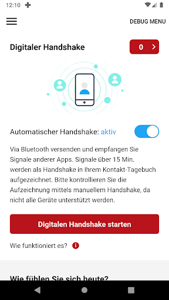  | 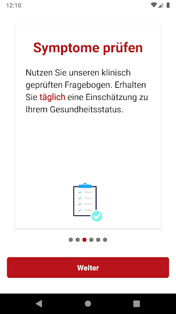  | 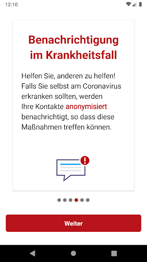  | 
 | 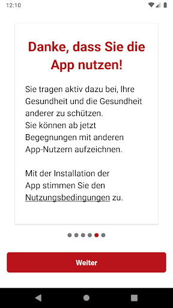  |  

## Development team
In the following we report the main information provided by the development team in the Google play store.

| | |
|-------------------------|-------------------------|
| **Developer**  | Österreichisches Rotes Kreuz |
| **Website**  | [https://www.roteskreuz.at](https://www.roteskreuz.at) |
| **Email** | service@roteskreuz.at |
| **Physical address**  | [Wiedner Hauptstrasse 32 1040 Wien Österreich](https://www.google.com/maps/search/Wiedner%20Hauptstrasse%2032%201040%20Wien%20Österreich) (Google Maps) |
| **Other developed apps**  | [https://play.google.com/store/apps/developer?id=%C3%96sterreichisches+Rotes+Kreuz](https://play.google.com/store/apps/developer?id=%C3%96sterreichisches+Rotes+Kreuz) |

## Android support

| | |
|-------------------------|-------------------------|
| **Declared target Android version**  | Pie, version 9 (API level 28) |
| **Effective target Android version**  | Pie, version 9 (API level 28) |
| **Minimum supported Android version**  | Marshmallow, version 6.0 (API level 23) |
| **Maximum target Android version**  | - |

The larger the difference between the minimum and maximum supported Android versions, the better. A larger difference means a wider audience. For example, old phones have a very low Android version, so a high minimum supported Android version means that the app cannot be used by users with old phones, thus leading to accessibility problems. 

## Requested permissions

In the following we report the complete list of the permissions requested by the app. 

| **Permission** | **Protection level** | **Description** | 
|-------------------------|-------------------------|-------------------------|
 **android.permission ACCESS_COARSE_LOCATION** | :warning:**Dangerous** | Allows an app to access approximate location. 
 **android.permission ACCESS_NETWORK_STATE** | Normal | Allows applications to access information about networks. 
 **android.permission ACCESS_WIFI_STATE** | Normal | Allows applications to access information about Wi-Fi networks. 
 **android.permission BLUETOOTH** | Normal | Allows applications to connect to paired bluetooth devices. 
 **android.permission BLUETOOTH_ADMIN** | Normal | Allows applications to discover and pair bluetooth devices. 
 **android.permission CHANGE_NETWORK_STATE** | Normal | Allows applications to change network connectivity state. 
 **android.permission CHANGE_WIFI_STATE** | Normal | Allows applications to change Wi-Fi connectivity state. 
 **android.permission FOREGROUND_SERVICE** | Normal | Allows a regular application to use Service.startForeground. 
 **android.permission INTERNET** | Normal | Allows applications to open network sockets. 
 **android.permission RECEIVE_BOOT_COMPLETED** | Normal | Allows an application to receive the Intent.ACTION_BOOT_COMPLETED that is broadcast after the system finishes booting. 
 **android.permission REQUEST_IGNORE_BATTERY_OPTIMIZATIONS** | Normal | Permission an application must hold in order to use Settings.ACTION_REQUEST_IGNORE_BATTERY_OPTIMIZATIONS. 
 **android.permission WAKE_LOCK** | Normal | Allows using PowerManager WakeLocks to keep processor from sleeping or screen from dimming. 
 **com.google.android.c2dm.permission RECEIVE** | - | - 

## Mentioned servers

| **Server** | **Registrant** | **Registrant country** | **Creation date** | 
|-------------------------|-------------------------|-------------------------|-------------------------|
 | google.com | Google LLC | :us: US | 1997-09-15 04:00:00 |
 | azurefd.net | Microsoft Corporation | :us: US | 2018-05-08 19:21:22 |

## Security analysis 

Below we report the main security warnings raised by our execution of the [Androwarn](https://github.com/maaaaz/androwarn) security analysis tool.

**Connection interfaces exfiltration**
> - This application reads details about the currently active data network 
> - This application tries to find out if the currently active data network is metered 

**Telephony services abuse**
> - This application makes phone calls 

**Suspicious connection establishment**
> - This application opens a Socket and connects it to the remote address '; port is out of range' on the 'N/A' port  
> - This application opens a Socket and connects it to the remote address 'Ljava/net/Proxy;->type()Ljava/net/Proxy$Type;' on the 'N/A' port  
> - This application opens a Socket and connects it to the remote address 'Lp/b/a/a/a;->a(Ljava/lang/String;)Ljava/lang/StringBuilder;' on the 'N/A' port  
> - This application opens a Socket and connects it to the remote address 'timeout' on the 'N/A' port  

## User ratings and reviews

Below we provide information about how end users are reacting to the app in terms of ratings and reviews in the Google Play store.

### Ratings

The Stopp Corona app has been installed by more than **100000** times. At this time, **1760** rated the app and its average score is **2.96**. Below we show the distribution of the ratings across the usual star-based rating of Google Play

:star::star::star::star::star:: 583

:star::star::star::star:: 170

:star::star::star:: 211

:star::star:: 181

:star:: 613

### Reviews 

#### 5-star reviews

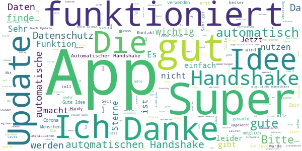

> Wichtige + total richtige app. Überlebensnotwendig !!  :date: __2020-05-09 13:33:09__

> Corona...  :date: __2020-05-07 17:51:03__

> Ich bin zufrieden mit dieser App  :date: __2020-05-06 19:30:50__

> Eine super App, sehr schön gemacht!  :date: __2020-05-06 15:51:15__

> Dankeschön für die Information danke für die Nachricht. Danke für die Hilfe und Mühen uns alle zu Schützen. 1000 Dank an euch alle. Liebe Herzliche Grüße Patricia Langer und Sohn John.  :date: __2020-05-05 16:00:02__

> Automatischer Handshake klappt soweit gut. Leider schaltet sich die Funktion jedesmal wieder ab wenn das Telefon im Flugmodus war. Das bitte noch ausbessern.  :date: __2020-05-05 11:06:22__

> Nicht jedes Handy mit der App wird beim digitalen Handshake erkannt  :date: __2020-05-01 20:52:56__

> Finde ich wichtig zur Bewältigung von Covid-19!  :date: __2020-05-01 17:49:26__

> Super App! Sehr wichtig dass wir die digitalen Möglichkeiten nutzen. Bitte liebe Datenschützer: Datenschutz ist sehr wichtig, aber wir müssen differenzieren. Hier sind die Daten wichtig! Wir können teilweise Leben retten. Das rote Kreuz ist doch nicht Amazon, Google,... Bitte reflektiert doch und ruft nicht reflexartig "Daten sammeln verboten". Die Updates mit automatischem Hand-shake und open source Legung sind sehr gut.  :date: __2020-05-01 11:34:06__

> Finde ich sehr gut  :date: __2020-05-01 08:40:25__

#### 4-star reviews

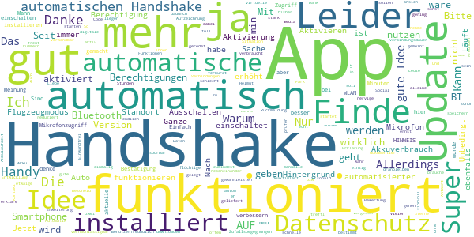

> Helmut freut  :date: __2020-05-02 08:48:06__

> Kann das nicht automatisch gehen - hab eh nur flüchtige Zufallsbegegnungen.  :date: __2020-05-01 10:04:52__

> Unbedingt automatisierter Kontakt, was soll das Ganze sonst??? Ich treffl mich im Park mit 5 Freunden und erkläre ihnen, dass sie die App downloaden sollen, damit sie mir dann Bescheid geben wenns ernst wird???????? Liebe Leute.....das kann ja nicht wahr sein.....in so einer Situation muss das funktionieren, da es ja bei anderen Social Media Apps auch geht.....?????!!!!!  :date: __2020-05-01 00:54:11__

> Die App finde ich echt sinnvoll und sie ist auch sehr Benutzerfreundlich. Das einzig nervige ist, dass der virtuelle Handshake nach dem Ausschalten des Flugzeugmodus nicht automatisch startet. So hab ich bestimmt etwaige Handshakes nicht dokumentiert, da ich das manuelle Aktivieren vergessen habe....  :date: __2020-04-26 05:56:29__

> Update: Läuft jetzt im Hintergrund und ich brauche mich aktiv um nichts kümmern ausser den autom. Handshake einmalig zu starten. Die Akkulaufzeit verkürzt sich dadurch nicht oder zumindest nicht spürbar.  :date: __2020-04-23 20:04:02__

> Jetzt funktioniert der automatische Handshake endlich. Allerdings ist die Automatik immer wieder von alleine deaktiviert.  :date: __2020-04-22 20:06:24__

> 👍  :date: __2020-04-22 20:01:26__

> Danke für die Erweiterung um die automatische Aufzeichnung! Auch der Akkuverbrauch bei Aktivierung des automatischen Handshakes ist vernachlässigbar gering.  :date: __2020-04-22 09:52:48__

> Einwandfrei  :date: __2020-04-20 13:11:51__

> Gut!!!  :date: __2020-04-18 10:50:15__

#### 3-star reviews

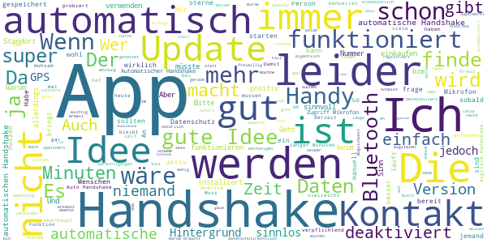

> Automatischer Handshake deaktiviert sich immer wieder von selbst.  :date: __2020-05-11 07:32:14__

> Es wäre hilfreich wenn das App Symbol für "App ist aktiv" und "Bitte aktiviere die App" in der Statusleiste nicht gleich aussieht. Die halbe Zeit ist die App deaktiviert und es fällt nicht auf, weil ohnedies das Kreuz in der Statusleiste ist.  :date: __2020-05-10 07:37:43__

> Habe digitalen Handshake mit meinem Bruder probiert und habe unmittelbar darauf die Version aktualisiert. Damit ging dieser Kontakt (bei meinem Bruder gespeichert und sichtbar) bei mir verloren. Nicht im Sinne der Entwicklung nehme ich an. Daher schreibe ich das auch  :date: __2020-05-09 12:48:46__

> Der lokale Datenspeicher ist super...super auch, dass nach dem letzten Android Update sämtliche Handshakes gelöscht wurden :-/  :date: __2020-05-08 19:18:13__

> Die Option automatischer Handshake muss alle 1-2 Tage wieder aktiviert werden weil dieser aus unerklärlichen Gründen auf inaktiv stellt? Wichtig damit auch alles aufgezeichnet wird. Sonst passt die App gut.  :date: __2020-05-06 21:26:44__

> Ich finde gar nicht schön wie sich das Rote Kreuz von der Regierung vereinnahmen lässt.Andere Organisationen leisten die selbe Arbeit  :date: __2020-05-06 12:11:04__

> Stehe der App positiv gegenüber, allerdings muß der Kontakt sehr lange bestehen, damit er erfasst wird. Habe nur erst meinen Sohn als Kontakt und da haben wir uns bemühen müssen, das sich die Handys koppeln  :date: __2020-05-06 09:08:53__

> Automatischer Handshake ist super, jetzt müssten es nur noch mehr Leute verwenden! Edit: leider schaltet sich der automatische Handshake von selbst aus, ohne dass man es bemerkt. Somit wieder nicht zu gebrauchen, außer man denkt dran vor jedem Meeting wieder einzuschalten.  :date: __2020-05-05 19:22:11__

> Die app ist an sich eine gute Idee. Ich war in den letzten 8 Wochen mit niemandem außer meinem Mann länger als 15 Minuten beisammen und habe die app auch immer eingeschaltet . Wichtig hätte ich den automatischen Handshake in der Hochrisikozeit unter 15 Minuten gefunden. Ich war nur Lebensmittel einkaufen und man ist da mit niemandem länger als 15 Minuten beisammen. Daher ist die app für mich leider nutzlos, jetzt ist auch noch das Risiko gesunken. Schade.  :date: __2020-05-05 15:27:17__

> Entweder hat niemand ausser mir diese app oder sie funktioniert nicht. Hab sie jedes mal beim einkaufen an, aber noch NIE einen digitalen handshake. Stromverbrauch ist auch recht hoch.  :date: __2020-05-05 13:50:33__

#### 2-star reviews

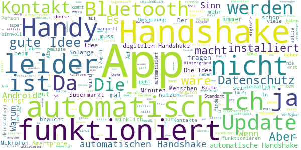

> wäre Sinnvoller wenn die App verpflichtend wäre! Den die Dummen kann man leider kein Hirn Einpflanzen und selber denken können leider die wenigsten! Ach ja und 15 Min ist auch Schwachsinn, was ist wenn einer der beim Spaziergang neben mir vorbei geht und Niest, da reichen Sekunden. Ist noch nie außer mein Mann länger als 15 Min neben mir gewesen und daher wird nie wer angezeigt! Nicht mal in der U Bahn schafft wer über 15 Min neben mir zu stehen. DIESE APP IST NUR EINE AUGENAUSWISCHEREI  :date: __2020-05-09 19:38:22__

> Der automatische Handshake funktioniert nicht wirklich. Selbst wenn man drei Handys, mit installierter App und eingeschaltetem Handshake direkt 15 Minuten nebeneinanderlegt, findet es jeweils nur ein anderes Handy. Außerdem schaltet sich der automatische Handshake selbstständig manchmal aus. Also selbst, wenn die App von mehr Menschen als derzeit verwendet würde, ist der Nutzen dadurch sehr gering. Vermittelt eher falsche Schutzvorstellungen.  :date: __2020-05-08 17:59:06__

> Beim Manuellen Handshake macht der Lautsprecher leider immer noch sehr unangenehme geräusche. Zumindest zeigt die app jetzt an wenn sie im Hintergrund läuft  :date: __2020-05-06 11:45:13__

> Erkennt ja nie etwas. Nicht einmal Telefon meines Mitbewohners  :date: __2020-05-06 05:27:17__

> Mein Kollege und ich haben das Handy mit automatischen Handshake permanent nebeneinander liegen. Wird aber kein Treffen registriert. Außer wir machen ihn manuel . Noch sehr verbesserungswürdig  :date: __2020-05-05 13:13:32__

> Ich hatte auch nach einigen Wochen noch keinen Handshake, was ich zunächst darauf zurück führte, dass keiner der Arbeitskollegen die App nutzen würde. Jedoch versuchte ich dann auch einmal den manuellen Handshake. Auch dieser wurde nicht verbucht. Ich habe die App daher wieder deinstalliert und warte auf den Zeitpunkt, an dem die App auch tatsächlich alltagstauglich ist.  :date: __2020-05-04 19:28:51__

> Blockiert nach einiger Zeit die Bluetooth Verbindung zu anderen Geräten (SmartWatch). Danach hilft nur ein Neustart vom Handy.  :date: __2020-05-02 07:57:28__

> Ergänzung! Nun gibt es die Möglichkeit des,Automatischen Handshakes nur schaltet sich dieser in der App immer wieder ab. So macht es leider keinen Sinn. Original Rezession. Gute Idee, nur warum funktioniert es nicht automatisch mit dem Handshake? Ich denke die meisten sind zu bequem andauernd die App zu öffnen und sein Gegenüber zu suchen und zu registrieren.  :date: __2020-05-01 04:04:27__

> Also der digitale Handshake gefällt mir schon echt gut. Nur hierbei bitte die Zeit verringern die es dafür braucht. Habe die App schon mehreren Leuten in meinem Umfeld empfohlen, aber keiner bekommt einen Handshake zusammen, weil man nie so lange zusammen steht.  :date: __2020-04-29 23:36:21__

> Tolle Idee jetzt müssen das noch alle installieren und dann auch im Supermarkt offen haben! Update 13.4. 15 Minuten für den automatischen Handshake sind zu lang! Teilweise bin ich nicht Mal 15 Minuten in einem Geschäft kann man das bitte verringern minütlich wäre meiner Meinung nach perfekt Update 29.4. 3 Sterne weniger da es nicht sein kann das bei jedem Update die habdshakes weg sind App wird langssm ein schöner Reinfall naja.. vielleicht ist die App brauchbar wenn die zweite welle kommt  :date: __2020-04-29 13:24:17__

#### 1-star reviews

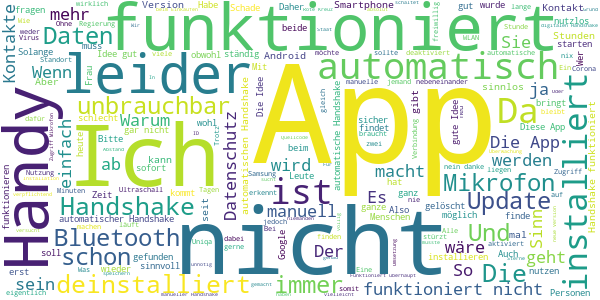

> Beschissene App kontrolliert durch den staat  :date: __2020-05-11 05:59:06__

> der automatische handshake funktioniert nicht zuverlässig  :date: __2020-05-11 01:03:50__

> Funktioniert die App? Ich saß mit meinem Vater und wir haben zuerst auf den automatischen Handshake gewartet. Und dann noch 2 mal den manuellen versucht. Es wurde kein handshake gespeichert.  :date: __2020-05-10 18:48:12__

> Wir können machen was wir wollen, aber der automatische Handshake funktioniert nicht. In den APP Einstellungen ist alles erlaubt. Stromsparen ist abgeschaltet. Aber die Idee ist sehr gut, darum 3 Punkte. Auch wenn es momentan nahezu unbrauchbar ist. Update 10.05.: automatischer Handshake geht noch immer nicht. Völlig nutzlos und mittlerweile finde ich das richtig ärgerlich.  :date: __2020-05-10 14:38:18__

> Update 3: Funktioniert noch immer nicht. Von 3 Endgeräten haben sich nur 2 einmalig erkannt, nachher nimmer. In 14 Tagen kein einziger fremder Kontakt geloggt. Noch immer WLAN/BT Probleme mit Drittgeräten. Update 2: Heute Mo bereits 3. Update. Der manuelle, aber nicht automat. Handshake funktioniert. Allerdings wird laufend mein WLAN unterbrochen. Update 1: Warten auf das für Do angekündigte Update  :date: __2020-05-10 11:27:54__

> Hat für mich keinen Sinn wenn die Leute die App nicht einschalten. Ich habe die App wieder deinstalliert.  :date: __2020-05-10 07:02:33__

> Die Idee ist ja gut aber schlecht umgesetzt. Funktioniert einfach nicht richtig. Ergänzung 10.5. : bei allem Respekt. Den Hinweis auf Ihre Hilfeseiten können Sie sich sparen. Lesen Sie die letzten 20 Rezessionen, und Sie wissen, dass die App nicht richtig funktioniert und nicht der User zu dumm dafür ist. Zudem sind die Möglichkeit bei der Installation oder bei den Einstellungen etwas falsch zu machen ohnehin sehr begrenzt.  :date: __2020-05-10 06:53:50__

> Wegen Datenschutz muss man sich echt keine Sorgen mache. Habe die App jetzt seit einer Woche installiert und habe einen Handshake. Und das war ich selber, manuell mit meinem Diensthandy durchgeführt. Mit anderen Worten: Vollschrott! Funktioniert vorne und hinten nicht.  :date: __2020-05-09 17:27:15__

> Finde die Idee gut. Aber was nutzt die beste Idee, wenn die Umsetzung nicht funktioniert. Galaxy S8 macht keine automatischen Handshakes. Das LG meiner Frau schon. Könnte man sich mehr erwarten von einer App, die Leben retten soll.  :date: __2020-05-09 16:29:19__

> Diese App ist total nutzlos, automatischer Handshake funktioniert nicht, selbst bei Manuelkem Handshake werden Smatzphones in unmittelbarer Nähe nicht angezeigt  :date: __2020-05-09 11:27:33__

# WHO Info
App version ``2.1.0``

Analyzed with [covid-apps-observer](http://github.com/covid-apps-observer) project, version ``0.1``

## App overview
| | |
|-------------------------|-------------------------| 
| **Name**&nbsp;&nbsp;&nbsp;&nbsp;&nbsp;&nbsp;&nbsp;&nbsp;&nbsp;&nbsp;&nbsp;&nbsp;&nbsp;&nbsp;&nbsp;&nbsp;&nbsp;&nbsp;&nbsp;&nbsp;&nbsp;&nbsp;&nbsp;&nbsp;&nbsp;&nbsp;&nbsp;&nbsp;&nbsp;&nbsp;&nbsp;&nbsp;&nbsp;&nbsp;&nbsp;&nbsp;&nbsp;&nbsp;&nbsp;&nbsp;  | WHO Info |
| **Unique identifier** | org.who.infoapp |
| **Link to Google Play** | [https://play.google.com/store/apps/details?id=org.who.infoapp](https://play.google.com/store/apps/details?id=org.who.infoapp) |
| **Summary**  | Die offizielle Informations-App der Weltgesundheitsorganisation. |
| **Privacy policy** | [https://www.who.int/about/who-we-are/privacy-policy](https://www.who.int/about/who-we-are/privacy-policy) |
| **Latest version** | 2.1.0 |
| **Last update** | 2020-05-08 13:17:43 |
| **Recent changes** | This release resolves some minor fixes and introduces the latest case numbers reported to WHO. |
| **Installs**  | 100.000+ |
| **Category** | Nachrichten & Zeitschriften |
| **First release** | 13.04.2020 |
| **Size**  | 8,2M |
| **Supported Android version**  | 4.2 oder höher |

### Description
> Have the latest health information at your fingertips with the official World Health Organization Information App. This app displays the latest news, events, features and breaking updates on outbreaks. 
  
 WHO works worldwide to promote health, keep the world safe, and serve the vulnerable. 
 Our goal is to ensure that a billion more people have universal health coverage, to protect a billion more people from health emergencies, and provide a further billion people with better health and well-being.

### User interface
The developers of the app provide the following screenshots in the Google play store.
| | | |
|:-------------------------:|:-------------------------:|:-------------------------:|
 |   |   |   | 
 | 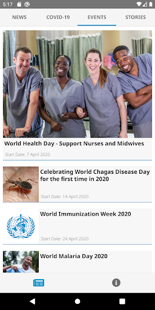  |   |   | 
 |   |   |   | 
 |   |   |   | 
 |   |   |   | 
 |   |   |   | 

## Development team
In the following we report the main information provided by the development team in the Google play store.

| | |
|-------------------------|-------------------------|
| **Developer**  | World Health Organization |
| **Website**  | [https://www.who.int/](https://www.who.int/) |
| **Email** | dcx@who.int |
| **Physical address**  | [Avenu Appia 20 1211 Geneva Switzerland](https://www.google.com/maps/search/Avenu%20Appia%2020%201211%20Geneva%20Switzerland) (Google Maps) |
| **Other developed apps**  | [https://play.google.com/store/apps/developer?id=World+Health+Organization](https://play.google.com/store/apps/developer?id=World+Health+Organization) |

## Android support

| | |
|-------------------------|-------------------------|
| **Declared target Android version**  | Android10, version 10 (API level 29) |
| **Effective target Android version**  | Android10, version 10 (API level 29) |
| **Minimum supported Android version**  | Jelly Bean, version 4.2.x (API level 17) |
| **Maximum target Android version**  | - |

The larger the difference between the minimum and maximum supported Android versions, the better. A larger difference means a wider audience. For example, old phones have a very low Android version, so a high minimum supported Android version means that the app cannot be used by users with old phones, thus leading to accessibility problems. 

## Requested permissions

In the following we report the complete list of the permissions requested by the app. 

| **Permission** | **Protection level** | **Description** | 
|-------------------------|-------------------------|-------------------------|
 **android.permission INTERNET** | Normal | Allows applications to open network sockets. 
 **android.permission READ_EXTERNAL_STORAGE** | :warning:**Dangerous** | Allows an application to read from external storage. 
 **android.permission WRITE_EXTERNAL_STORAGE** | :warning:**Dangerous** | Allows an application to write to external storage. 

## Mentioned servers

| **Server** | **Registrant** | **Registrant country** | **Creation date** | 
|-------------------------|-------------------------|-------------------------|-------------------------|
-

## Security analysis 

Below we report the main security warnings raised by our execution of the [Androwarn](https://github.com/maaaaz/androwarn) security analysis tool.

**Connection interfaces exfiltration**
> - This application reads details about the currently active data network 
> - This application tries to find out if the currently active data network is metered 

**Suspicious connection establishment**
> - This application opens a Socket and connects it to the remote address 'Lfi/iki/elonen/NanoHTTPD$ResponseException;' on the 'N/A' port  
> - This application opens a Socket and connects it to the remote address 'NanoHttpd Shutdown' on the 'N/A' port  

**Code execution**
> - This application loads a native library: 'NativeScript' 
> - This application executes a UNIX command containing this argument: '2' 

## User ratings and reviews

Below we provide information about how end users are reacting to the app in terms of ratings and reviews in the Google Play store.

### Ratings

The WHO Info app has been installed by more than **100000** times. At this time, **315** rated the app and its average score is **3.72**. Below we show the distribution of the ratings across the usual star-based rating of Google Play

:star::star::star::star::star:: 185

:star::star::star::star:: 25

:star::star::star:: 9

:star::star:: 18

:star:: 75

### Reviews 

#### 5-star reviews

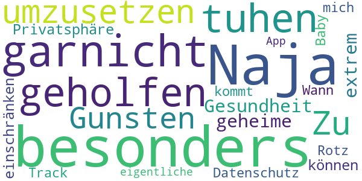

> Naja hat mir besonders garnicht geholfen ich muss tuhen um umzusetzen  :date: __2020-04-18 00:58:20__

> Zu Gunsten der Gesundheit werde ich meine extrem geheime Privatsphäre einschränken können... Datenschutz-Rotz. Track mich, Baby ;-) Wann kommt die eigentliche App ?  :date: __2020-04-17 14:10:26__

#### 4-star reviews

No recent reviews available with 4 stars.

#### 3-star reviews

No recent reviews available with 3 stars.

#### 2-star reviews

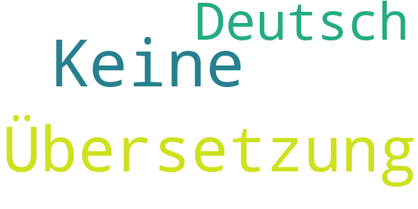

> Keine Übersetzung auf Deutsch  :date: __2020-04-22 17:35:41__

#### 1-star reviews

> Funktioniert nicht!!!!!!!!!!!  :date: __2020-05-02 23:58:40__

> Nicht RUNTERLADEN UH RMACHT EUCH ZU SKLAVEN DES SYSTEMS  :date: __2020-04-27 12:30:51__

> Einseitige Berichte, nur in Englisch  :date: __2020-04-25 21:01:14__

> Keine Suchfunktion, einseitige Berichte, keine Feedback-Funktion, keine Fragen, keine zeitliche Eingrenzung der Informationen - insgesamt sehr enttäuscht.  :date: __2020-04-19 22:01:42__

> In Deutsch wäre es viel besser es könnten nicht alle Englisch.  :date: __2020-04-19 13:18:22__

> Diese App ist eine Face App  :date: __2020-04-19 08:27:50__

> Lass uns in Ruhe Bill Gates! Ich empfinde einfach nur Eckel du Wolf im Schafspelz. Lass die Leute doch wissen wo du dich so aufhältst, ich glaube das wäre nicht so gut für dich Bill. Du bist ein sehr sehr sehr Böser Mensch.  :date: __2020-04-18 16:14:42__

> Lass uns in Ruhe, Billy  :date: __2020-04-18 02:27:24__

# OpenWHO: Knowledge for Health Emergencies
App version ``3.3``

Analyzed with [covid-apps-observer](http://github.com/covid-apps-observer) project, version ``0.1``

## App overview
| | |
|-------------------------|-------------------------| 
| **Name**&nbsp;&nbsp;&nbsp;&nbsp;&nbsp;&nbsp;&nbsp;&nbsp;&nbsp;&nbsp;&nbsp;&nbsp;&nbsp;&nbsp;&nbsp;&nbsp;&nbsp;&nbsp;&nbsp;&nbsp;&nbsp;&nbsp;&nbsp;&nbsp;&nbsp;&nbsp;&nbsp;&nbsp;&nbsp;&nbsp;&nbsp;&nbsp;&nbsp;&nbsp;&nbsp;&nbsp;&nbsp;&nbsp;&nbsp;&nbsp;  | OpenWHO: Knowledge for Health Emergencies |
| **Unique identifier** | de.xikolo.openwho |
| **Link to Google Play** | [https://play.google.com/store/apps/details?id=de.xikolo.openwho](https://play.google.com/store/apps/details?id=de.xikolo.openwho) |
| **Summary**  | Lebensrettendes Wissen für Einsatzkräfte in Gesundheitsnotfällen. |
| **Privacy policy** | [https://openwho.org/pages/privacy](https://openwho.org/pages/privacy) |
| **Latest version** | 3.3 |
| **Last update** | 2020-05-05 16:17:12 |
| **Recent changes** | - Redesign of some UI elements - Bug fixes and performance improvements |
| **Installs**  | 1.000.000+ |
| **Category** | Lernen |
| **First release** | 17.05.2017 |
| **Size**  | 36M |
| **Supported Android version**  | 5.0 oder höher |

### Description
> OpenWHO is the World Health Organization's (WHO) interactive knowledge-transfer platform offering online courses to improve the response to health emergencies. OpenWHO enables the Organization and its key partners to transfer life-saving knowledge to large numbers of frontline responders.
 With OpenWHO, you have the flexibility to learn at your convenience. Watch the short video lectures and test your knowledge with self-tests when and where you like. The course forum and the collaboration space allow you to get in touch with other participants and experts around the world.
  
 Designed primarily for health care workers, frontline responders, and decision-makers, the app is also a source of information for those affected by disease outbreaks and health emergencies, or for those with a general interest in WHO's work in health emergencies.
  
 It features 6 channels:
 - The <b>Outbreak</b> channel addresses the management of infectious diseases and provides life-saving, scientific information.
 - The <b>Ready for Response</b> channel helps prepare personnel who are training for deployment to work in disease outbreaks and health emergencies.
 - The <b>Get Social</b> channel focuses on social science-based interventions and helps to communicate with affected communities.
 - The <b>Preparing for Pandemics</b> channel brings together courses on various aspects of preparedness, including surveillance, public health measures and risk communication during a pandemic.
 - The <b>COVID-19</b> channel provides learning resources in WHO's 6 official languages (Arabic, Chinese, English, French, Russian and Spanish) for health professionals, decision-makers and the public for the outbreak of coronavirus disease (COVID-19).
 - The <b>COVID-19 National Languages</b> channel provides the same learning resources as the COVID-19 channel but in national languages, such as Indonesian, Japanese and Portuguese. 
  
 OpenWHO courses are available in many languages, including WHO's 6 official languages. 
  
 Download the app now, and join the OpenWHO community.
 This app is developed in cooperation between the Hasso Plattner Institute and the WHO. The learning content is provided exclusively by the WHO.

### User interface
The developers of the app provide the following screenshots in the Google play store.
| | | |
|:-------------------------:|:-------------------------:|:-------------------------:|
 |   |   |   | 
 |   |   |   | 

## Development team
In the following we report the main information provided by the development team in the Google play store.

| | |
|-------------------------|-------------------------|
| **Developer**  | HPI Knowledge Engineering Team |
| **Website**  | [https://openwho.org/](https://openwho.org/) |
| **Email** | openwho-support@hpi.de |
| **Physical address**  | [Prof.-Dr.-Helmert-Str.2-3 14482 Potsdam](https://www.google.com/maps/search/Prof.-Dr.-Helmert-Str.2-3%2014482%20Potsdam) (Google Maps) |
| **Other developed apps**  | [https://play.google.com/store/apps/developer?id=7185448023325736337](https://play.google.com/store/apps/developer?id=7185448023325736337) |

## Android support

| | |
|-------------------------|-------------------------|
| **Declared target Android version**  | Android10, version 10 (API level 29) |
| **Effective target Android version**  | Android10, version 10 (API level 29) |
| **Minimum supported Android version**  | Lollipop, version 5.0 (API level 21) |
| **Maximum target Android version**  | - |

The larger the difference between the minimum and maximum supported Android versions, the better. A larger difference means a wider audience. For example, old phones have a very low Android version, so a high minimum supported Android version means that the app cannot be used by users with old phones, thus leading to accessibility problems. 

## Requested permissions

In the following we report the complete list of the permissions requested by the app. 

| **Permission** | **Protection level** | **Description** | 
|-------------------------|-------------------------|-------------------------|
 **android.permission ACCESS_NETWORK_STATE** | Normal | Allows applications to access information about networks. 
 **android.permission ACCESS_WIFI_STATE** | Normal | Allows applications to access information about Wi-Fi networks. 
 **android.permission FOREGROUND_SERVICE** | Normal | Allows a regular application to use Service.startForeground. 
 **android.permission INTERNET** | Normal | Allows applications to open network sockets. 
 **android.permission READ_EXTERNAL_STORAGE** | :warning:**Dangerous** | Allows an application to read from external storage. 
 **android.permission RECEIVE_BOOT_COMPLETED** | Normal | Allows an application to receive the Intent.ACTION_BOOT_COMPLETED that is broadcast after the system finishes booting. 
 **android.permission WAKE_LOCK** | Normal | Allows using PowerManager WakeLocks to keep processor from sleeping or screen from dimming. 
 **android.permission WRITE_EXTERNAL_STORAGE** | :warning:**Dangerous** | Allows an application to write to external storage. 
 **com.google.android.c2dm.permission RECEIVE** | - | - 
 **com.google.android.finsky.permission BIND_GET_INSTALL_REFERRER_SERVICE** | - | - 

## Mentioned servers

| **Server** | **Registrant** | **Registrant country** | **Creation date** | 
|-------------------------|-------------------------|-------------------------|-------------------------|
 | googlesyndication.com | Google LLC | :us: US | 2003-01-21 06:17:24 |
 | google.com | Google LLC | :us: US | 1997-09-15 04:00:00 |
 | app-measurement.com | Google LLC | :us: US | 2015-06-19 20:13:31 |
 | apple.com | Apple Inc. | :us: US | 1987-02-19 05:00:00 |
 | aomedia.org | Contact Privacy Inc. Customer 1243324949 | :canada: CA | 2015-08-24 14:07:31 |
 | dashif.org | VTM Group | :us: US | 2012-04-27 13:02:46 |
 | w3.org | W3C | :us: US | 1994-07-06 04:00:00 |
 | googleapis.com | Google LLC | :us: US | 2005-01-25 17:52:26 |
 | googleadservices.com | Google LLC | :us: US | 2003-06-19 16:34:53 |
 | psdev.de | - | - | - |
 | xmlpull.org | WhoisGuard, Inc. | PA | 2001-11-26 20:33:08 |
 | someurl.com | WhoisGuard, Inc. | PA | 2000-02-08 15:50:35 |
 | crashlytics.com | Google LLC | :us: US | 2011-01-21 15:30:40 |
 | apache.org | The Apache Software Foundation | :us: US | 1995-04-11 04:00:00 |
 | opensource.org | Open Source Initiative | :us: US | 1998-02-11 05:00:00 |
 | creativecommons.org | Creative Commons Corporation | :canada: CA | 2001-01-15 16:51:44 |
 | eclipse.org | Eclipse.org Foundation, Inc. | :canada: CA | 1997-04-14 04:00:00 |
 | gnu.org | Free Software Foundation | :us: US | 1995-11-24 05:00:00 |
 | mozilla.org | Mozilla Corporation | :us: US | 1998-01-24 05:00:00 |

## Security analysis 

Below we report the main security warnings raised by our execution of the [Androwarn](https://github.com/maaaaz/androwarn) security analysis tool.

**Telephony identifiers leakage**
> - This application reads the ISO country code equivalent of the current registered operator's MCC (Mobile Country Code) 

**Connection interfaces exfiltration**
> - This application reads details about the currently active data network 
> - This application tries to find out if the currently active data network is metered 

**Suspicious connection establishment**
> - This application opens a Socket and connects it to the remote address ' returned no addresses for  ; port is out of range' on the 'N/A' port  
> - This application opens a Socket and connects it to the remote address '' on the 'N/A' port  
> - This application opens a Socket and connects it to the remote address 'Ljava/lang/StringBuilder;->toString()Ljava/lang/String;' on the 'N/A' port  
> - This application opens a Socket and connects it to the remote address 'Ljava/net/Proxy;->type()Ljava/net/Proxy$Type;' on the 'N/A' port  
> - This application opens a Socket and connects it to the remote address 'timeout' on the 'N/A' port  

**Code execution**
> - This application loads a native library 
> - This application loads a native library: 'bypass' 
> - This application loads a native library: 'jniPdfium' 
> - This application loads a native library: 'modft2' 
> - This application loads a native library: 'modpdfium' 
> - This application loads a native library: 'modpng' 

## User ratings and reviews

Below we provide information about how end users are reacting to the app in terms of ratings and reviews in the Google Play store.

### Ratings

The OpenWHO: Knowledge for Health Emergencies app has been installed by more than **1000000** times. At this time, **2409** rated the app and its average score is **4.2983193**. Below we show the distribution of the ratings across the usual star-based rating of Google Play

:star::star::star::star::star:: 1589

:star::star::star::star:: 364

:star::star::star:: 222

:star::star:: 50

:star:: 182

### Reviews 

#### 5-star reviews

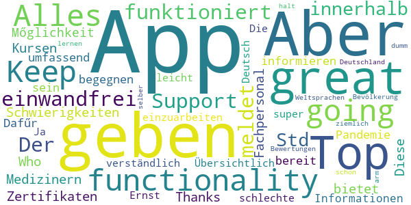

> Top App, great functionality! Keep going! Alles funktioniert einwandfrei. Der Support meldet sich innerhalb von 24 Std sollte es Schwierigkeiten mit den Kursen oder Zertifikaten geben.  :date: __2020-04-19 18:46:48__

> Thanks Who  :date: __2020-04-15 18:56:24__

> Diese App bietet Medizinern und Fachpersonal die Mőglichkeit, sich umfassend zu informieren um einer Pandemie zu begegnen. Dafűr sollte man bereit sein, sich in die Informationen einzuarbeiten.  :date: __2020-04-14 20:16:47__

> Die App ist super! Übersichtlich und leicht verständlich. Ja diese App ist nicht auf Deutsch! Aber im Ernst: einer App schlechte Bewertungen zu geben nur weil man selber zu dumm ist eine der Weltsprachen zu lernen, ist schon ziemlich arm. Aber das ist halt Deutschland und seine Bevölkerung...  :date: __2020-04-14 12:04:35__

#### 4-star reviews

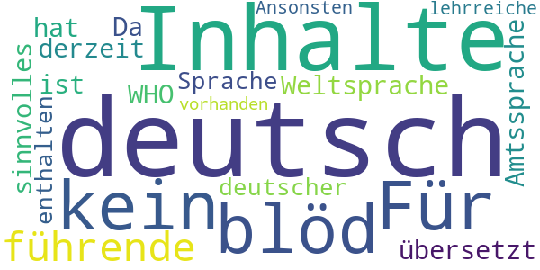

> Für alle "kein deutsch = blöd": da Deutsch keine führende Weltsprache ist, ist sie auch keine Amtssprache der WHO. Da noch keiner etwas sinnvolles nach deutsch übersetzt hat, sind derzeit keine Inhalte in deutscher Sprache enthalten... Ansonsten sind einige lehrreiche Inhalte vorhanden.  :date: __2020-04-08 19:31:11__

#### 3-star reviews

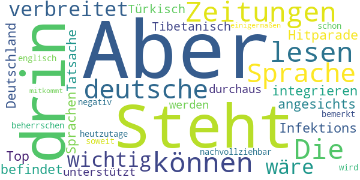

> Steht auch nichts anderes drin, als wir in den Zeitungen lesen können. Die deutsche Sprache ist nicht so verbreitet, dass es wichtig wäre, sie zu integrieren. Aber angesichts der Tatsache, dass sich Deutschland in der Infektions-Hitparade unter den Top-10 befindet und dass so Sprachen, wie Tibetanisch oder Türkisch unterstützt werden, ist es durchaus nachvollziehbar, dass es negativ bemerkt wird. Aber heutzutage sollte man schon soweit englisch beherrschen, dass man hier einigermaßen mitkommt.  :date: __2020-04-14 18:48:38__

#### 2-star reviews

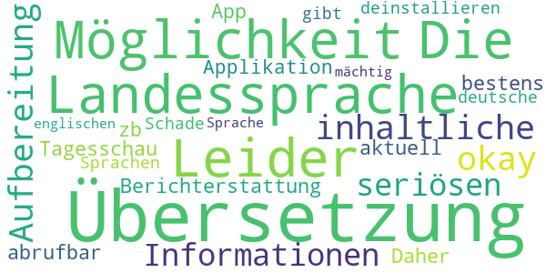

> Leider keine Möglichkeit der Übersetzung in die Landessprache. Die inhaltliche Aufbereitung ist okay, aber alle Informationen sind in der seriösen Berichterstattung von zb. der Tagesschau App bestens und sehr aktuell abrufbar. Daher werde ich die Applikation deinstallieren.  :date: __2020-04-19 09:51:54__

> Schade das es keine deutsche Übersetzung gibt und auch in anderen Sprachen nicht jeder ist der englischen Sprache mächtig  :date: __2020-04-16 22:34:58__

#### 1-star reviews

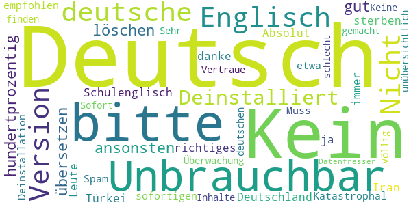

> Unbrauchbar bitte in Deutsch übersetzen ansonsten löschen 😡 und dann ist jeder zu hundertprozentig gut Englisch kann Schulenglisch ist anderes wie richtiges Englisch sollte das bitte auch auf deutsch sein weil in Deutschland sterben die Leute ja auch und nicht nur in der Türkei oder Iran oder wo auch immer bitte auf Deutsch danke  :date: __2020-04-16 23:12:00__

> Kein Deutsch  :date: __2020-04-16 01:55:15__

> Kein deutsch  :date: __2020-04-13 17:57:42__

> Kein deutsche Version Kein deutsche Version?  :date: __2020-04-11 21:01:24__

> Nicht in Deutsch  :date: __2020-04-11 07:52:48__

> Kein deutsch. Absolut unbrauchbar. Katastrophal. Muss zur sofortigen Deinstallation empfohlen werden  :date: __2020-03-31 00:56:01__

> Kein deutsch, etwa noch Spam und Überwachung, Vertraue nicht. Sofort Deinstalliert  :date: __2020-03-28 10:37:10__

> nichts deutsch habe ich wieder deinstalliert.  :date: __2020-03-25 18:42:53__

> Völlig unübersichtlich Deutsch nicht zu finden  :date: __2020-03-25 18:13:21__

> Sehr schlecht gemacht. Keine deutschen Inhalte. Datenfresser.😒  :date: __2020-03-21 15:49:19__

# Credits

This project makes use of the following main third-party projects:
* Androguard: [https://github.com/androguard/androguard](https://github.com/androguard/androguard)
* Androwarn: [https://github.com/maaaaz/androwarn](https://github.com/maaaaz/androwarn)
* google_play_scraper: [https://github.com/JoMingyu/google-play-scraper](https://github.com/JoMingyu/google-play-scraper)
* whois: [https://github.com/DannyCork/python-whois](https://github.com/DannyCork/python-whois)
* BeautifulSoup: [https://www.crummy.com/software/BeautifulSoup](https://www.crummy.com/software/BeautifulSoup)

Other open-source projects used in this project include: 

- androguard==3.3.5
- appnope==0.1.0
- asn1crypto==1.3.0
- backcall==0.1.0
- beautifulsoup4==4.9.0
- bs4==0.0.1
- certifi==2020.4.5.1
- cffi==1.14.0
- chardet==3.0.4
- click==7.1.2
- colorama==0.4.3
- cryptography==2.9.2
- cycler==0.10.0
- decorator==4.4.2
- future==0.18.2
- google-play-scraper==0.0.2.3
- idna==2.9
- ipython==7.13.0
- ipython-genutils==0.2.0
- jedi==0.17.0
- Jinja2==2.11.2
- joblib==0.14.1
- kiwisolver==1.2.0
- lxml==4.5.0
- MarkupSafe==1.1.1
- matplotlib==3.2.1
- networkx==2.4
- nltk==3.5
- numpy==1.18.3
- parso==0.7.0
- pexpect==4.8.0
- pickleshare==0.7.5
- Pillow==7.1.2
- play-scraper==0.6.0
- prompt-toolkit==3.0.5
- ptyprocess==0.6.0
- pycountry==19.8.18
- pycparser==2.20
- pydot==1.4.1
- Pygments==2.6.1
- pyOpenSSL==19.1.0
- pyparsing==2.4.7
- python-dateutil==2.8.1
- regex==2020.4.4
- requests==2.23.0
- requests-futures==1.0.0
- six==1.14.0
- soupsieve==2.0
- tld==0.12.1
- tqdm==4.45.0
- traitlets==4.3.3
- urllib3==1.25.9
- wcwidth==0.1.9
- wordcloud==1.7.0

