# COVID-related Android apps in Austria

Author: `Ivano Malavolta` (ivanomalavolta@gmail.com)

Created at: `2021/2/13`

Report generated by the [covid-apps-observer](http://github.com/covid-apps-observer) project, version 0.1

# Table of contents 

- [Background](#background)
    * [Data sources and analyses](#data-sources-and-analyses)
        * [App metadata](#app-metadata)
        * [Requested permissions](#requested-permissions)
        * [Mentioned servers](#mentioned_servers)
        * [Security analysis](#security_analysis)
        * [User ratings and reviews](#user-ratings-and-reviews)
    * [Disclaimer](#disclaimer)
- [Stopp Corona](#stopp-corona)
- [WHO Info](#who-info)
- [OpenWHO: Knowledge for Health Emergencies](#openwho-knowledge-for-health-emergencies)

- [Credits](#credits)

# How to read this report

This report has been generated by the [covid-apps-observer](http://github.com/covid-apps-observer) project. The project automatically analyzes the apps by extracting information which is already publicly available either on the web or in the apps binary files. 

Our analysis covers the following apps:
| | |
|-------------------------|-------------------------| 
|  | Stopp Corona
|  | WHO Info
|  | OpenWHO: Knowledge for Health Emergencies

The details of our analysis are presented in the remainder of this report.

For independent verification, the raw data and the source code of the project is publicly available in its GitHub repository [http://github.com/covid-apps-observer](http://github.com/covid-apps-observer) and its source code has been thoroughly commented in order to provide all the details about how the information provided in this report has been extracted. 

Any feedback, questions, and improvements about the project are very welcome, feel free to create an issue or pull request directly in its GitHub repository: [http://github.com/covid-apps-observer](http://github.com/covid-apps-observer).

## Data sources and analyses

The analysis of each app is structured around five main dimensions: 
* App metadata  
* Requested permissions
* Mentioned servers
* Androwarn analysis
* User ratings and reviews

In the following we describe the data sources and analysis performed for each dimension.

### App metadata

App metadata includes an overview of the main information about the app (for example, its name, releases, privacy policy, etc.), contact information of the development team, and the various Android versions supported by the app. This information is extracted from two main data sources:
* _Google Play store_: we automatically mined the web page of the Google Play store showing the basic information about the app and we parsed it in order to extract information about the app and development team 
* _Android Manifest file_: in our analysis we decompiled the binary file of the app (it is similar to a Zip archive but it contains the code of the app instead of normal files) and we extracted information about the supported Android versions, as it has been listed by its development team.

The extracted app metadata feeds the _App overview_, _Development team_, and _Android support_ sections of this report.
We make use of the [google-play-scraper](https://github.com/JoMingyu/google-play-scraper) tool for extracting the raw data related to this dimension of the project.

### Requested permissions

The Android operating system has a permission model which allows users to grant access to potentially privacy-related information. Every Android app has to explictly declare the permissions it needs to properly function in the Android Manifest file.  

In this report we also show the protection level of each permission, which is a key information for understanding how the requested permissions related to the user's privacy. We carefully analyzed the [official Android documentation (v. 29)](https://developer.android.com/reference/android/Manifest.permission), and it resulted that a permission requested by an Android app can belong to the following protection levels:
* **Dangerous**: higher-risk permissions that would give a requesting app access to private user data or control over the device that can negatively impact the user. Because this type of permission introduces potential risk, the system usually does not automatically grant it to the requesting app. For example, any dangerous permissions requested by an app may be displayed to the user and require confirmation before proceeding.
* **Normal**: this is the default and most common level in Android; normal permissions are lower-risk and give access to isolated app-level features, with minimal risk to other apps, the system, or the user. 
* **Signature**: permissions granted only if the requesting app is signed with the same certificate as the app that declared the permission
* **Appop**: old permission level, a reminiscence of the App Ops tool that Google introduced in Android 4.3.
* **Development**: optional permissions which can be granted to development-oriented apps.
* **Privileged**: permissions who give higher power to mobile apps w.r.t. other apps, such as binding to incoming calls, interacting via bluetooth with other devices without user interaction, etc.
* **Preinstalled**: reserved only for preinstalled apps
* **Installer**: allow the holder to start the permission usage screen for an app
* **RetailDemo**: permissions related to devices used in demonstrations in shops.
* **Pre23**: permissions automatically granted to apps targeting devices running pre-6.0 Android.
* **Upcoming**: permissions which will be released in the next version of the Android platform. 
* **Deprecated**: permissions belonging to old releases of the Android platform, they should not be used by developers since they will not be supported in the near future.
* **Not for use by third-party applications**: permissions which can be requested only by apps developed by Google.
* **Undefined**: this protection level is not documented by Google.

The permissions dimension of this project is based on the [Androguard](https://github.com/androguard/androguard) static analysis tool.

### Mentioned servers

We decompiled each app in order to look for all possible mentions of remote URLs. The mentioned URLs can refer to remote servers the the app is using for either sending or receiving information, web addresses for directing the user to an information website, and so on. 

:warning: It is important to note that this analysis is not meant to be complete and it is very prone to obfuscation. The servers reported here are simply _mentioned_ somewhere in the code of the app and are meant to just give an indication about the "hooks" of the app towards external resources. For example, for an Android app it is normal to contact Google services in order to send/receive push notifications, or to contact the servers of analytics services for having real-time diagnostics about crashes of the app or bugs.

This part of the analysis is based on the [Androguard](https://github.com/androguard/androguard) static analysis tool for identfying the raw URLs mentioned in the app; then, the information about each mentioned server is collected by performing a _whois_ lookup on the first-level domain present in the URL.

### Security analysis

This dimension is based on the [Androwarn](https://github.com/maaaaz/androwarn) structural and data flow analysis of Android bytecode. Androwarn is developed by the University of Lyon/INSA (France) and it has been used in several academic studies. According to its documentation, Androwarn targets the following categories of potential security issues:
* **Telephony identifiers exfiltration**: IMEI, IMSI, MCC, MNC, LAC, CID, operator's name, etc.
* **Device settings exfiltration**: software version, usage statistics, system settings, logs, etc.
* **Geolocation information leakage**: GPS/WiFi geolocation, etc.
* **Connection interfaces information exfiltration**: WiFi credentials, Bluetooth MAC adress, etc.
* **Telephony services abuse**: premium SMS sending, phone call composition, etc.
* **Audio/video flow interception**: call recording, video capture, etc.
* **Remote connection establishment**: socket open call, Bluetooth pairing, APN settings edit, etc.
* **PIM data leakage**: contacts, calendar, SMS, mails, clipboard, etc.
* **External memory operations**: file access on SD card, etc.
* **PIM data modification**: add/delete contacts, calendar events, etc.
* **Arbitrary code execution**: native code using JNI, UNIX command, privilege escalation, etc.
* **Denial of Service**: event notification deactivation, file deletion, process killing, virtual keyboard disable, terminal shutdown/reboot, etc.

Note: We do not consider this data point in the current version of our analyzers since it is too verbose for our purposes.

:warning: It is important to note that Androwarn is a static analysis tool, and as such it performs a variety of heuristics and approximations in its analyses. Said that, the results shown in this report are meant to provide an indication of _potential_ security issues and should be by no means treated as complete and correct.   

### User ratings and reviews

For this dimension we turn again to the web interface of the Google Play store. Firstly, we automatically mine summary statistics about user ratings from the web page of the app under analysis; then, we automatically download the newest 1000 reviews of the app under analysis. For each level of rating (5 stars, 4 stars, , etc., 1 star) we show:
- a word cloud presenting the main terms used by end users in their reviews in the Google Play store
- the last 10 reviews provided by app users in the Google Play store. 

This purposefully simple analysis is meant to help both future users and the development team of the app in understanding what are the main positive and negative points of the app under analysis.

We make use of the [google-play-scraper](https://github.com/JoMingyu/google-play-scraper) tool for extracting the raw data related to this dimension of the project.

## Disclaimer 

This report has been produced independently of any parties and its only objective is to help anybody in better understanding how COVID-related apps work in practice (and compare to each other). The results of this report are limited to the specific version of the software used for running the analyses and on the various heuristics implemented in there. In other words, the results of the analyzers may differ depending on the time and modalities in which they are executed. We do not guarantee that the results of the analyses and the corresponding contents of this report are fully complete or correct. The analysis software is licensed under the [MIT License](https://github.com/iivanoo/covid-apps-observer/blob/master/LICENSE).

# Stopp Corona
App version ``2.1.0.1179-QA_259``

Analyzed with [covid-apps-observer](http://github.com/covid-apps-observer) project, version ``0.1``

## App overview
| | |
|-------------------------|-------------------------| 
| **Name**&nbsp;&nbsp;&nbsp;&nbsp;&nbsp;&nbsp;&nbsp;&nbsp;&nbsp;&nbsp;&nbsp;&nbsp;&nbsp;&nbsp;&nbsp;&nbsp;&nbsp;&nbsp;&nbsp;&nbsp;&nbsp;&nbsp;&nbsp;&nbsp;&nbsp;&nbsp;&nbsp;&nbsp;&nbsp;&nbsp;&nbsp;&nbsp;&nbsp;&nbsp;&nbsp;&nbsp;&nbsp;&nbsp;&nbsp;&nbsp;  | Stopp Corona |
| **Unique identifier** | at.roteskreuz.stopcorona |
| **Link to Google Play** | [https://play.google.com/store/apps/details?id=at.roteskreuz.stopcorona](https://play.google.com/store/apps/details?id=at.roteskreuz.stopcorona) |
| **Summary**  | Österreichs Corona-Warnungs-App |
| **Privacy policy** | [https://www.roteskreuz.at/site/faq-app-stopp-corona/datenschutzinformation-zur-stopp-corona-app/](https://www.roteskreuz.at/site/faq-app-stopp-corona/datenschutzinformation-zur-stopp-corona-app/) |
| **Latest version** | 2.1.0.1179-QA_259 |
| **Last update** | 2021-01-29 15:49:49 |
| **Recent changes** | Wir aktualisieren die App laufend für Sie:   Mit diesem Update ist der Austausch mit Apps aus anderen europäischen Ländern sichergestellt. Auch Infektionswarnungen anderer europaweiter Corona Tracing Apps werden nun übermittelt. Jede Übermittlung erfolgt verschlüsselt und anonymisiert. Noch Fragen? Lesen Sie mehr zu unseren Datenschutzvorkehrungen in den FAQs.  Gemeinsam können wir Corona stoppen! |
| **Installs**  | 100.000+ |
| **Category** | Medizin |
| **First release** | 25.03.2020 |
| **Size**  | 6,2M |
| **Supported Android version**  | 6.0 oder höher |

### Description
> Das Österreichische Rote Kreuz veröffentlicht die “Stopp Corona”-App im Auftrag des Gesundheitsministeriums, der obersten Gesundheitsbehörde Österreichs. 
 Mit der „Stopp Corona“-App lassen sich Begegnungen mit Freunden, der Familie oder Arbeitskollegen ganz einfach und anonymisiert speichern. Sollten Sie sich mit Corona infizieren, können Sie einfach über die App eine Meldung abgeben und Ihre Kontakte aus den letzten 2 Tagen werden anonym benachrichtigt. 
 Das gleiche gilt natürlich umgekehrt. Gibt eine Ihrer gespeicherten Begegnungen an, sich infiziert zu haben, erhalten Sie umgehend eine Nachricht und Sie können entsprechende Maßnahmen ergreifen. Dazu zählen vor allem:
 -	Abstand halten
 -	Soziale Kontakte vermeiden
 -	Sich vorsichtshalber in Selbstisolation begeben
 Beim Einsetzen von Symptomen kontaktieren Sie bitte telefonisch ihre Hausärztin oder den Hausarzt. Wenn das nicht möglich ist, rufen Sie die die Nummer 1450 an.
 Jedenfalls gilt: Bitte nicht die Ärztin/oder den Arzt persönlich aufsuchen und auch nicht ins Krankenhaus fahren. Bei einem medizinischen Notfall: 144 rufen.
 Gemeinsam unterbrechen wir so die Infektionskette.
 So schützen Sie nicht nur sich selbst, sondern verhindern auch, dass andere sich infizieren.
 Nutze Sie den digitalen Handshake
 Bis wir uns wieder unbedacht die Hände bei der Begrüßung reichen können, wird es wohl noch einige Zeit dauern. In der Zwischenzeit nutzen Sie einfach den digitalen Handshake der „Stopp Corona“-App.
 Haben Sie und die Person mit der Sie sich treffen die App installiert, speichert die App, dass Sie sich getroffen haben. Diese Daten werden anonymisiert gespeichert. Erkrankt einer von Ihnen beiden an dem Corona-Virus, erhält der andere eine Nachricht.
 Machen Sie den Corona-Selbstcheck
 Wie geht es Ihnen heute? Anhand eines klinisch geprüften Fragebogens können Sie sich täglich auf Corona-Symptome überprüfen.
 Corona-Verdachtsmeldung
 Entsprechen die Symptome dem Corona-Virus, können Sie eine Meldung über die App abgeben. Das ist wichtig, damit sich nicht noch mehr Menschen mit dem Virus infizieren. Ihre Begegnungen werden dann anonymisiert benachrichtigt. Keine Sorge, sie erhalten also keine persönlichen Angaben. 
 Anschließend bleiben Sie bitte Zuhause und kontaktieren Sie Ihre Hausärztin oder Ihren Hausarzt telefonisch. Wenn das nicht möglich ist rufen Sie die Nummer 1450 an.
 Fahren Sie nicht ins Krankenhaus und suchen Sie Ihren Arzt nicht persönlich auf.
 Ärztliche Bestätigung
 Stellt ein Arzt den Corona-Virus fest, können Sie ebenfalls eine Meldung abgeben. Auch hier werden Ihre Begegnungen anonymisiert benachrichtigt.
 Die App entstand in Partnerschaft mit der UNIQA Stiftung.
 Konzept und Realisierung in Zusammenarbeit und mit Unterstützung von Accenture Österreich und basiert auf dem Contacttracing-Framework von Apple und Google
 Schau auf Dich. Schau auf mich. So schützen wir uns.
 Link zum Open Source Software Projekt: https://github.com/austrianredcross/stopp-corona-android

### User interface
The developers of the app provide the following screenshots in the Google play store.
| | | |
|:-------------------------:|:-------------------------:|:-------------------------:|
 |   |   |   | 
 |   |   | 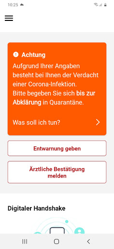  | 
 |   |  

## Development team
In the following we report the main information provided by the development team in the Google play store.

| | |
|-------------------------|-------------------------|
| **Developer**  | Österreichisches Rotes Kreuz |
| **Website**  | [https://www.roteskreuz.at](https://www.roteskreuz.at) |
| **Email** | service@roteskreuz.at |
| **Physical address**  | [Wiedner Hauptstrasse 32 1040 Wien Österreich](https://www.google.com/maps/search/Wiedner%20Hauptstrasse%2032%201040%20Wien%20Österreich) (Google Maps) |
| **Other developed apps**  | [https://play.google.com/store/apps/developer?id=%C3%96sterreichisches+Rotes+Kreuz](https://play.google.com/store/apps/developer?id=%C3%96sterreichisches+Rotes+Kreuz) |

## Android support

| | |
|-------------------------|-------------------------|
| **Declared target Android version**  | Android10, version 10 (API level 29) |
| **Effective target Android version**  | Android10, version 10 (API level 29) |
| **Minimum supported Android version**  | Marshmallow, version 6.0 (API level 23) |
| **Maximum target Android version**  | - |

The larger the difference between the minimum and maximum supported Android versions, the better. A larger difference means a wider audience. For example, old phones have a very low Android version, so a high minimum supported Android version means that the app cannot be used by users with old phones, thus leading to accessibility problems. 

## Requested permissions

In the following we report the complete list of the permissions requested by the app. 

| **Permission** | **Protection level** | **Description** | 
|-------------------------|-------------------------|-------------------------|
 **android.permission ACCESS_NETWORK_STATE** | Normal | Allows applications to access information about networks. 
 **android.permission BLUETOOTH** | Normal | Allows applications to connect to paired bluetooth devices. 
 **android.permission FOREGROUND_SERVICE** | Normal | Allows a regular application to use Service.startForeground. 
 **android.permission INTERNET** | Normal | Allows applications to open network sockets. 
 **android.permission RECEIVE_BOOT_COMPLETED** | Normal | Allows an application to receive the Intent.ACTION_BOOT_COMPLETED that is broadcast after the system finishes booting. 
 **android.permission REQUEST_IGNORE_BATTERY_OPTIMIZATIONS** | Normal | Permission an application must hold in order to use Settings.ACTION_REQUEST_IGNORE_BATTERY_OPTIMIZATIONS. 
 **android.permission WAKE_LOCK** | Normal | Allows using PowerManager WakeLocks to keep processor from sleeping or screen from dimming. 

## Mentioned servers

| **Server** | **Registrant** | **Registrant country** | **Creation date** | 
|-------------------------|-------------------------|-------------------------|-------------------------|
 | google.com | Google LLC | :us: US | 1997-09-15 04:00:00 |
 | prod-rca-coronaapp-fd.net | Domains By Proxy, LLC | :us: US | 2020-04-20 20:16:19 |

## Security analysis 

Below we report the main security warnings raised by our execution of the [Androwarn](https://github.com/maaaaz/androwarn) security analysis tool.

**Connection interfaces exfiltration**
> - This application reads details about the currently active data network 
> - This application tries to find out if the currently active data network is metered 

**Telephony services abuse**
> - This application makes phone calls 

**Suspicious connection establishment**
> - This application opens a Socket and connects it to the remote address '; port is out of range' on the 'N/A' port  
> - This application opens a Socket and connects it to the remote address 'Lcom/android/tools/r8/GeneratedOutlineSupport;->outline17(Ljava/lang/String;)Ljava/lang/StringBuilder;' on the 'N/A' port  
> - This application opens a Socket and connects it to the remote address 'Ljava/net/Proxy;->type()Ljava/net/Proxy$Type;' on the 'N/A' port  
> - This application opens a Socket and connects it to the remote address 'timeout' on the 'N/A' port  

## User ratings and reviews

Below we provide information about how end users are reacting to the app in terms of ratings and reviews in the Google Play store.

### Ratings

The Stopp Corona app has been installed by more than **100000** times. At this time, **3561** rated the app and its average score is **3.210674**. Below we show the distribution of the ratings across the usual star-based rating of Google Play

:star::star::star::star::star:: 1461

:star::star::star::star:: 350

:star::star::star:: 370

:star::star:: 240

:star:: 1140

### Reviews 

#### 5-star reviews

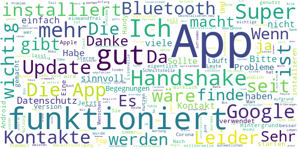

> Ich fühle mich sicher mit dieser App! Danke dafür! 😉  :date: __2021-02-11 13:20:17__

> Finde diese App ist sehr praktisch  :date: __2021-02-11 12:21:11__

> Ich hatte noch keine Warnung über einen Kontakt mit positiv getestete Person.  :date: __2021-02-11 11:53:04__

> Finde ich sehr wichtig!  :date: __2021-02-07 12:41:40__

> Super  :date: __2021-02-06 20:31:38__

> Sehr sinnvolle App, die eigentlich verpflichtend für Alle sein sollte  :date: __2021-02-05 23:06:35__

> Ich finde keine Kontakte von mir.  :date: __2021-02-04 22:38:45__

> Glücklicher weise hab ich noch keinen Kontakt gehabt!  :date: __2021-02-04 18:01:25__

> Relativ wenig  :date: __2021-02-04 12:02:21__

> Bin froh , dass es die App gibt  :date: __2021-02-04 08:03:30__

#### 4-star reviews

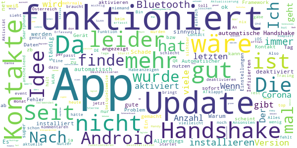

> Etwas gewöhnungsbedürftig. Doch man kommt dazu, wie man bedient.  :date: __2021-02-06 09:10:04__

> Früher wurde angezeigt, um welche Zeit eine eventuelle Begegnung mit einer infizierten Person stattgefunden hat. Das fehlt jetzt!  :date: __2021-02-04 14:12:41__

> Habe die App sofort installiert, finde die Idee gut, habe aber bis heute noch keine Verständigung erhalten leider gibt es auch zu wenig Nutzer  :date: __2021-01-14 10:27:08__

> Funktioniert anscheinend  :date: __2020-12-11 08:41:29__

> Wenn das alle hätten wäre das Contact-Tracing ein Selbstläufer. Aber das UI ist halt sehr lahm. Wenn man die Statistik über die Handshakes wenigstens gleich auf der ersten Seite hätte, dass man irgend eine Aktivität sieht.  :date: __2020-11-27 10:55:40__

> Alles gut 👍 s  :date: __2020-11-23 20:15:40__

> Update gibt es nicht?  :date: __2020-11-23 19:41:11__

> Wie in anderen Kommentaren wäre Feedback hilfreich wie viele Kontakte in den letzten x Tagen erkannt wurden. Sonst top.  :date: __2020-11-17 06:41:57__

> Habe erst heute die app runtergeladen  :date: __2020-11-16 17:58:07__

> Mich würde interessieren ob der Handsshake per Bluetooth auch noch funktioniert wenn ich permanent per Bluetooth mit meinen Fitness Armband Verbunden bin. Also ob dennoch Bluetooth auch für den Handshake genutzt werden kann  :date: __2020-11-13 06:56:30__

#### 3-star reviews

> Hab sie jetzt nach langer Zeit deinstalliert... bisher nie eine Meldung bekommwn, kein einziger Kontakt.. da weiß man nicht mal ob sie funktioniert 😑 und solangs fast keiner verwendet is es ziemlich sinnfrei  :date: __2021-02-03 11:46:28__

> Habs die App nicht installiert und werds auch nicht tun bis es nicht zuverlässig funktioniert! Quarantäne gehen nur auf Vermutung will keiner!  :date: __2021-01-31 18:13:04__

> Funktioniert nicht! Ich bin positiv und habe es in der App gemeldet! Mein Bruder hat die App ebenfalls seit langer Zeit und er hat keine Benachrichtigung bekommen! Obwohl wir jeden Tag mehrere Stunden Nebeneinander auf dem Sofa sitzen...! Edit: Habe mich nach einem Tag Gesund und dann wieder Krank gemeldet = jetzt ist er benachrichtigt geworden..  :date: __2021-01-02 11:58:54__

> Unser Datenschutzgesetz einerseits und die Haltung mancher Mitbürger andererseits zerstören meines Erachtens den guten Grundgedanken für die Verwendung dieser App. Was mir auffällt, ist, dass der von der App angezeigte Zeitstempel der Kontakte nicht stimmen kann. Die App zeigt Kontakte zu Zeiten, in denen keine waren, oder erst viel später an.  :date: __2020-12-23 10:26:34__

> Auch ich werde die App nun nicht weiter nutzen. Automatischer Handshake funktioniert fast nie, selbst wenn die Handys stundenlang im selben Raum sind. Ich bin täglich beruflich viel im öffentlichen Raum unterwegs, auch in Öffis. Bisher jedoch in 2 Monaten nur ein einziger Handshake. So hat das doch keinen Sinn. Hauptsache das Rote Kreuz kann sich damit wichtig machen. 👎🏼  :date: __2020-12-21 08:22:18__

> wie kann ich mich nach einer erkrankung in der app wieder gesund melden? möchte es nicht einschalten solange die app noch meint dass ich krank bin.  :date: __2020-12-20 14:09:02__

> Die App ist jetzt annehmbar. Eine Grafik bei der ab zu lesen ist, in welchem Risiko ich mich mit meinem Bewegunsradius befinde. Umstieg auf die Deutsche App.  :date: __2020-12-19 22:01:37__

> Die Idee Ansicht ist gut, aber man muss immer Bluetooth anlassen so wie den Standort, das verbraucht viel Akku. Aber sonst ist die Idee sehr gut, damit man die Verbreitung vermindern kann, dennoch funktioniert das nur wenn es mehr Leute benutzen  :date: __2020-12-02 11:32:56__

> Wie auch schon berichtet, besteht keine Möglichkeit, nach einer Infektion wieder auf Gesund zu wechseln. Eine Email Anfrage wurde schnell aber nicht hilfreich beantwortet.  :date: __2020-12-01 19:29:16__

> War krank, habe alle über die App informiert, bin wieder gesund dennoch bekomme ich permanent die Aufforderung meine ID s zu benachrichtigen, kann das nicht abstellen. Werde alles löschen 😠  :date: __2020-12-01 11:30:36__

#### 2-star reviews

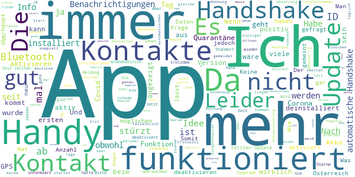

> Offensichtlich sinnlos und lässt den User im Regen stehen. Ich bekam heute eine Warnung eines möglichen Kontaktes. Dieses nicht ausgereifte Stück Software zeigt nicht mal an, an welchem Tag der Kontakt statt gefunden hat. Erst eine Kontaktaufnahme der betroffenen Person bestätigte die offensichtliche Quelle des Kontakts (Gott sei Dank alles negativ). Seit dem nervt die App im ca 30min. Takt mit Warnmeldungen. Lt. App hatte ich jetzt schon 5 weitere Kontakte. Stümperhaft. Schade ums Geld.  :date: __2021-02-07 11:27:25__

> Ist das gleiche wie mit Lockdown: App ist nur sinnvoll, wenn alle mitmachen.  :date: __2021-02-07 10:49:50__

> Okay  :date: __2021-02-06 14:13:44__

> Habe sie fast nie ein geschaltet bin eigentlich fast immer zu Hause arbeiten du ich in der Schweiz drum Drau mich nicht Handy mit nehmen wegen teurer Rechnung im nicht EU Land  :date: __2021-02-04 18:45:52__

> Hallo STOPP Corona App Programmierer! So kann das nicht funktionieren... ich denke, es müsste direkt positiv getestete Personen automatisch eingegeben werden! Nur so hätte die App einen Sinn.... Fg  :date: __2021-02-04 12:00:30__

> Ich habe innerhalb einer Stunde 115000 Schlüssel hinzugefügt bekommen, war jedoch zuhause und habe niemanden getroffen, in den Nachtstunden plötzlich wieder 10000 zusätzliche Schlüssel. Plus Anzahl Treffer 1. Habe somit von durchschnittlichen 300 Schlüsseln seit Frühjahr nun 128000.  :date: __2021-02-04 09:51:13__

> Mehr Informationen am Dashboard wären hilfreich. Anzahl Begegnung, etc. ...  :date: __2021-01-30 11:54:49__

> Warum kann ich die Stopp Corona App nicht mehr aufmachen, so wie vorher immer?  :date: __2021-01-14 16:03:58__

> Die Zählweise der IDs ist nicht nachvollziehbar. Habe in der Wohnung keinen Untermieter und trotzdem neue IDs bekommen. 1k sind für die zweit größte Stadt Österreichs dann doch wenig IDs. Keine Alarmmeldung noch bekommen.  :date: __2021-01-06 19:03:52__

> Ich habe dutzende Benachrichtigungen über Kontakte, obwohl ich in dieser Zeit definitiv allein zu Hause war. Es kann auch nicht von einer anderen Wohnung sein, ich lebe in einem Einfamilienhaus, weit und breit kein Mensch. Vielleicht könnte man die Mitglieder des eigenen Haushaltes auf eine Whitelist setzen. Da wird man es ohnehin erfahren wenn sie positiv sind  :date: __2021-01-02 13:26:53__

#### 1-star reviews

> Anwendung gelöscht. Hat keine Funktion, seit Monaten keine Angabe von Kontakten usw. Dafür werden andere BT-Verbindungen (Autofreisprech, Headset etc.) permanent geblockt. Diese funktionieren erst nach deaktivieren der Stopp Corona App.  :date: __2021-02-11 15:49:20__

> Hätte mir viel mehr erwartet, inzwischen hätte man ja vielleicht neue Funktionen einbauen können, wie Impfanmeldung, Info zur Inzidenz Entwicklung etc. So nutzt die App eigentlich erst wenn du offiziell als infiziert gemeldet bist, und da nur jenen die sie auch installiert haben. Nett, aber ausbaufähig  :date: __2021-02-11 10:45:16__

> Verwendet die noch jemand? Irgendeine Info, ob sie überhaupt was tut (Anzahl der Kontakte mit anderen Corona Apps, Gesamtanzahl der Risiko Kontakte die mittels der App identifiziert wurden) wäre gut. Gibt auch keine updates dafür. Wieder deinstalliert.  :date: __2021-02-08 09:27:55__

> Wenn eine Mehrheit der Bevölkerung intellektuell überfordert ist, den Sinn dieser App zu erfassen, ist diese eben wenig sinnvoll. Die Frage, ob das Design anspricht und die App gefällt, passt dazu.  :date: __2021-02-07 23:13:32__

> Diese App funktioniert überhaupt nicht, meine Nachbarn hatten Corona mussten 2wochen zu Hause bleiben, ich bekam auch keine Warnung, habe Alles gelöscht was Corona betrifft, bin sowas von der App Enttäuscht 😞 😞 und was Corona betrifft.  :date: __2021-02-07 11:36:19__

> Funktioniert sie überhaupt?  :date: __2021-02-05 20:07:28__

> Mein Eindruck ist, die App ist für fast gar nichts. Sie ist beinahe so doof und unfähig wie ihr Erfinder.  :date: __2021-02-05 00:34:34__

> keine  :date: __2021-02-04 18:33:05__

> Seit letzdem Update gar keine Info mehr. Hab die APP gelöscht. Gute Absicht aber leider sehr schlechte Umsetzung. Der User hat generell das Gefühl, es passiert nichts. Als mindest-Info sollte man gleich am Startbildschirm Zähler für n Kontakte, Zähler je Tag, eventuell auch Zähler >15 Min. sehen. Eine APP die nichts zeigt - was soll das sein?  :date: __2021-02-04 11:56:16__

> Ich war jetzt 2 Wochen nur zu Hause und das ganz alleine und die App sagt mir das ich sehr viel Kontakt mit anderen Menschen habe. Wahrscheinlich kommt das von den vielen Leuten die immer an meinem Zuhause vorbeikommen.  :date: __2021-02-01 17:02:50__

# WHO Info
App version ``4.1.0``

Analyzed with [covid-apps-observer](http://github.com/covid-apps-observer) project, version ``0.1``

## App overview
| | |
|-------------------------|-------------------------| 
| **Name**&nbsp;&nbsp;&nbsp;&nbsp;&nbsp;&nbsp;&nbsp;&nbsp;&nbsp;&nbsp;&nbsp;&nbsp;&nbsp;&nbsp;&nbsp;&nbsp;&nbsp;&nbsp;&nbsp;&nbsp;&nbsp;&nbsp;&nbsp;&nbsp;&nbsp;&nbsp;&nbsp;&nbsp;&nbsp;&nbsp;&nbsp;&nbsp;&nbsp;&nbsp;&nbsp;&nbsp;&nbsp;&nbsp;&nbsp;&nbsp;  | WHO Info |
| **Unique identifier** | org.who.infoapp |
| **Link to Google Play** | [https://play.google.com/store/apps/details?id=org.who.infoapp](https://play.google.com/store/apps/details?id=org.who.infoapp) |
| **Summary**  | Die offizielle Informations-App der Weltgesundheitsorganisation. |
| **Privacy policy** | [https://www.who.int/about/who-we-are/privacy-policy](https://www.who.int/about/who-we-are/privacy-policy) |
| **Latest version** | 4.1.0 |
| **Last update** | 2021-01-14 10:10:28 |
| **Recent changes** | This release introduces &quot;Health Topics&quot;. &quot;Health Topics&quot; provide additional information about favourite health topics. |
| **Installs**  | 500.000+ |
| **Category** | Nachrichten & Zeitschriften |
| **First release** | 13.04.2020 |
| **Size**  | 12M |
| **Supported Android version**  | 4.2 oder höher |

### Description
> Have the latest health information at your fingertips with the official World Health Organization Information App. This app displays the latest news, events, features and breaking updates on outbreaks. 
  
 WHO works worldwide to promote health, keep the world safe, and serve the vulnerable. 
 Our goal is to ensure that a billion more people have universal health coverage, to protect a billion more people from health emergencies, and provide a further billion people with better health and well-being.

### User interface
The developers of the app provide the following screenshots in the Google play store.
| | | |
|:-------------------------:|:-------------------------:|:-------------------------:|
 |   |   |   | 
 |   |   |   | 
 |   |   |   | 
 |   |   |   | 
 |   |   |   | 
 |   |   |   | 
 |   |   |   | 
 |   |   |   | 

## Development team
In the following we report the main information provided by the development team in the Google play store.

| | |
|-------------------------|-------------------------|
| **Developer**  | World Health Organization |
| **Website**  | [https://www.who.int/](https://www.who.int/) |
| **Email** | dcx@who.int |
| **Physical address**  | [Avenu Appia 20 1211 Geneva Switzerland](https://www.google.com/maps/search/Avenu%20Appia%2020%201211%20Geneva%20Switzerland) (Google Maps) |
| **Other developed apps**  | [https://play.google.com/store/apps/developer?id=World+Health+Organization](https://play.google.com/store/apps/developer?id=World+Health+Organization) |

## Android support

| | |
|-------------------------|-------------------------|
| **Declared target Android version**  | - |
| **Effective target Android version**  | - |
| **Minimum supported Android version**  | Jelly Bean, version 4.2.x (API level 17) |
| **Maximum target Android version**  | - |

The larger the difference between the minimum and maximum supported Android versions, the better. A larger difference means a wider audience. For example, old phones have a very low Android version, so a high minimum supported Android version means that the app cannot be used by users with old phones, thus leading to accessibility problems. 

## Requested permissions

In the following we report the complete list of the permissions requested by the app. 

| **Permission** | **Protection level** | **Description** | 
|-------------------------|-------------------------|-------------------------|
 **android.permission ACCESS_NETWORK_STATE** | Normal | Allows applications to access information about networks. 
 **android.permission INTERNET** | Normal | Allows applications to open network sockets. 
 **android.permission READ_CALENDAR** | :warning:**Dangerous** | Allows an application to read the user's calendar data. 
 **android.permission READ_EXTERNAL_STORAGE** | :warning:**Dangerous** | Allows an application to read from external storage. 
 **android.permission WAKE_LOCK** | Normal | Allows using PowerManager WakeLocks to keep processor from sleeping or screen from dimming. 
 **android.permission WRITE_CALENDAR** | :warning:**Dangerous** | Allows an application to write the user's calendar data. 
 **android.permission WRITE_EXTERNAL_STORAGE** | :warning:**Dangerous** | Allows an application to write to external storage. 
 **com.google.android.c2dm.permission RECEIVE** | - | - 
 **com.google.android.finsky.permission BIND_GET_INSTALL_REFERRER_SERVICE** | - | - 

## Mentioned servers

| **Server** | **Registrant** | **Registrant country** | **Creation date** | 
|-------------------------|-------------------------|-------------------------|-------------------------|
 | adobe.com | Adobe Inc. | :us: US | 1986-11-17 05:00:00 |
 | googlesyndication.com | Google LLC | :us: US | 2003-01-21 06:17:24 |
 | google.com | Google LLC | :us: US | 1997-09-15 04:00:00 |
 | app-measurement.com | Google LLC | :us: US | 2015-06-19 20:13:31 |
 | googleapis.com | Google LLC | :us: US | 2005-01-25 17:52:26 |
 | googleadservices.com | Google LLC | :us: US | 2003-06-19 16:34:53 |

## Security analysis 

Below we report the main security warnings raised by our execution of the [Androwarn](https://github.com/maaaaz/androwarn) security analysis tool.

**Connection interfaces exfiltration**
> - This application reads details about the currently active data network 
> - This application tries to find out if the currently active data network is metered 

**Suspicious connection establishment**
> - This application opens a Socket and connects it to the remote address 'Lfi/iki/elonen/NanoHTTPD$ResponseException;' on the 'N/A' port  
> - This application opens a Socket and connects it to the remote address 'NanoHttpd Shutdown' on the 'N/A' port  

**Code execution**
> - This application loads a native library: 'NativeScript' 
> - This application executes a UNIX command containing this argument: '2' 

## User ratings and reviews

Below we provide information about how end users are reacting to the app in terms of ratings and reviews in the Google Play store.

### Ratings

The WHO Info app has been installed by more than **500000** times. At this time, **1114** rated the app and its average score is **4.108108**. Below we show the distribution of the ratings across the usual star-based rating of Google Play

:star::star::star::star::star:: 754

:star::star::star::star:: 90

:star::star::star:: 60

:star::star:: 60

:star:: 150

### Reviews 

#### 5-star reviews

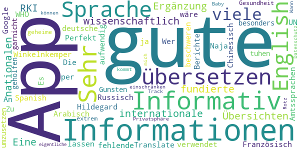

> Sehr gute App, viele wissenschaftlich fundierte Informationen und internationale Übersichten. Eine gute Ergänzung zu nationalen Informationen, z. B. des RKI.  :date: __2020-12-29 19:48:39__

> Winkelnkemper Hildegard  :date: __2020-11-07 06:59:07__

> Perfekt für Informationen  :date: __2020-10-12 12:50:14__

> Informativ  :date: __2020-06-16 12:45:21__

> Gute App. Sehr informativ! An alle die sich über die fehlende deutsche Sprache beschweren. Die WHO verwendet die Amtssprachen der UN: English, Französisch, Arabisch, Chinesisch, Russisch und Spanish. Es wäre viel zu aufwendig alle Berichte in jede Sprache zu übersetzen. Wer kein English kann kann es sich ja per Google Translate übersetzen lassen.  :date: __2020-06-16 11:28:39__

> Naja hat mir besonders garnicht geholfen ich muss tuhen um umzusetzen  :date: __2020-04-18 00:58:20__

> Zu Gunsten der Gesundheit werde ich meine extrem geheime Privatsphäre einschränken können... Datenschutz-Rotz. Track mich, Baby ;-) Wann kommt die eigentliche App ?  :date: __2020-04-17 14:10:26__

#### 4-star reviews

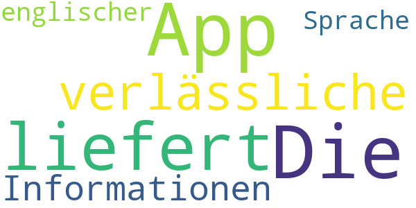

> Die App liefert verlässliche Informationen, nur in englischer Sprache.  :date: __2020-06-15 07:45:00__

#### 3-star reviews

No recent reviews available with 3 stars.

#### 2-star reviews

> Keine Übersetzung auf Deutsch  :date: __2020-04-22 17:35:41__

#### 1-star reviews

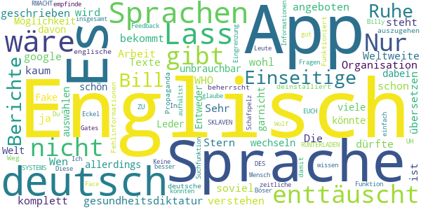

> Wen so eine App schon hier angeboten wird, dann sollte man auch verstehen was da geschrieben steht, auch wenn deutsch nicht die Sprache der WHO ist. Es dürfte wohl kaum soviel Arbeit für eine Weltweite Organisation sein die Texte in alle Sprachen zu übersetzen...es gibt ja google. 😉  :date: __2020-10-12 11:34:39__

> Sehr enttäuscht  :date: __2020-10-02 00:03:25__

> Die App bekommt von mir nur 1 Stern weil sie komplett auf Englisch ist hatte in der App die Möglichkeit die Sprache zu wechseln in den Sprachen war allerdings deutsch nicht dabei ich kann kein Englisch  :date: __2020-08-21 13:33:05__

> Entweder auf allen Sprachen der Welt oder garnicht!!!!!!!!!!!!!!  :date: __2020-08-14 07:25:03__

> Leder nur Englisch, für viele unbrauchbar.  :date: __2020-07-08 09:21:49__

> Fake app  :date: __2020-06-14 18:13:19__

> nur allgemeines geschwurbel  :date: __2020-06-12 11:35:48__

> Wäre schön, wenn man eine Sprache auswählen könnte. Es ist nicht davon auszugehen, dass jeder die englische Sprache beherrscht.  :date: __2020-06-08 08:31:18__

> Propaganda und Fehlinformationen...deinstalliert  :date: __2020-06-07 17:38:52__

> Nur englisch  :date: __2020-05-26 18:27:58__

# OpenWHO: Knowledge for Health Emergencies
App version ``3.7``

Analyzed with [covid-apps-observer](http://github.com/covid-apps-observer) project, version ``0.1``

## App overview
| | |
|-------------------------|-------------------------| 
| **Name**&nbsp;&nbsp;&nbsp;&nbsp;&nbsp;&nbsp;&nbsp;&nbsp;&nbsp;&nbsp;&nbsp;&nbsp;&nbsp;&nbsp;&nbsp;&nbsp;&nbsp;&nbsp;&nbsp;&nbsp;&nbsp;&nbsp;&nbsp;&nbsp;&nbsp;&nbsp;&nbsp;&nbsp;&nbsp;&nbsp;&nbsp;&nbsp;&nbsp;&nbsp;&nbsp;&nbsp;&nbsp;&nbsp;&nbsp;&nbsp;  | OpenWHO: Knowledge for Health Emergencies |
| **Unique identifier** | de.xikolo.openwho |
| **Link to Google Play** | [https://play.google.com/store/apps/details?id=de.xikolo.openwho](https://play.google.com/store/apps/details?id=de.xikolo.openwho) |
| **Summary**  | Lebensrettendes Wissen für Einsatzkräfte in Gesundheitsnotfällen. |
| **Privacy policy** | [https://openwho.org/pages/privacy](https://openwho.org/pages/privacy) |
| **Latest version** | 3.7 |
| **Last update** | 2020-11-23 13:57:15 |
| **Recent changes** | - Bug fixes and performance improvements |
| **Installs**  | 1.000.000+ |
| **Category** | Lernen |
| **First release** | 17.05.2017 |
| **Size**  | 18M |
| **Supported Android version**  | 5.0 oder höher |

### Description
> OpenWHO is the World Health Organization's (WHO) interactive knowledge-transfer platform offering online courses to improve the response to health emergencies. OpenWHO enables the Organization and its key partners to transfer life-saving knowledge to large numbers of frontline responders.
 With OpenWHO, you have the flexibility to learn at your convenience. Watch the short video lectures and test your knowledge with self-tests when and where you like. The course forum and the collaboration space allow you to get in touch with other participants and experts around the world.
  
 Designed primarily for health care workers, frontline responders, and decision-makers, the app is also a source of information for those affected by disease outbreaks and health emergencies, or for those with a general interest in WHO's work in health emergencies.
  
 It features 6 channels:
 - The <b>Outbreak</b> channel addresses the management of infectious diseases and provides life-saving, scientific information.
 - The <b>Ready for Response</b> channel helps prepare personnel who are training for deployment to work in disease outbreaks and health emergencies.
 - The <b>Get Social</b> channel focuses on social science-based interventions and helps to communicate with affected communities.
 - The <b>Preparing for Pandemics</b> channel brings together courses on various aspects of preparedness, including surveillance, public health measures and risk communication during a pandemic.
 - The <b>COVID-19</b> channel provides learning resources in WHO's 6 official languages (Arabic, Chinese, English, French, Russian and Spanish) for health professionals, decision-makers and the public for the outbreak of coronavirus disease (COVID-19).
 - The <b>COVID-19 National Languages</b> channel provides the same learning resources as the COVID-19 channel but in national languages, such as Indonesian, Japanese and Portuguese. 
  
 OpenWHO courses are available in many languages, including WHO's 6 official languages. 
  
 Download the app now, and join the OpenWHO community.
 This app is developed in cooperation between the Hasso Plattner Institute and the WHO. The learning content is provided exclusively by the WHO.

### User interface
The developers of the app provide the following screenshots in the Google play store.
| | | |
|:-------------------------:|:-------------------------:|:-------------------------:|
 |   |   |   | 
 |   |   |   | 

## Development team
In the following we report the main information provided by the development team in the Google play store.

| | |
|-------------------------|-------------------------|
| **Developer**  | HPI Knowledge Engineering Team |
| **Website**  | [https://openwho.org/](https://openwho.org/) |
| **Email** | openwho-support@hpi.de |
| **Physical address**  | [Prof.-Dr.-Helmert-Str.2-3 14482 Potsdam](https://www.google.com/maps/search/Prof.-Dr.-Helmert-Str.2-3%2014482%20Potsdam) (Google Maps) |
| **Other developed apps**  | [https://play.google.com/store/apps/developer?id=7185448023325736337](https://play.google.com/store/apps/developer?id=7185448023325736337) |

## Android support

| | |
|-------------------------|-------------------------|
| **Declared target Android version**  | - |
| **Effective target Android version**  | - |
| **Minimum supported Android version**  | Lollipop, version 5.0 (API level 21) |
| **Maximum target Android version**  | - |

The larger the difference between the minimum and maximum supported Android versions, the better. A larger difference means a wider audience. For example, old phones have a very low Android version, so a high minimum supported Android version means that the app cannot be used by users with old phones, thus leading to accessibility problems. 

## Requested permissions

In the following we report the complete list of the permissions requested by the app. 

| **Permission** | **Protection level** | **Description** | 
|-------------------------|-------------------------|-------------------------|
 **android.permission ACCESS_NETWORK_STATE** | Normal | Allows applications to access information about networks. 
 **android.permission ACCESS_WIFI_STATE** | Normal | Allows applications to access information about Wi-Fi networks. 
 **android.permission DOWNLOAD_WITHOUT_NOTIFICATION** | - | - 
 **android.permission FOREGROUND_SERVICE** | Normal | Allows a regular application to use Service.startForeground. 
 **android.permission INTERNET** | Normal | Allows applications to open network sockets. 
 **android.permission RECEIVE_BOOT_COMPLETED** | Normal | Allows an application to receive the Intent.ACTION_BOOT_COMPLETED that is broadcast after the system finishes booting. 
 **android.permission WAKE_LOCK** | Normal | Allows using PowerManager WakeLocks to keep processor from sleeping or screen from dimming. 
 **android.permission WRITE_EXTERNAL_STORAGE** | :warning:**Dangerous** | Allows an application to write to external storage. 
 **com.google.android.c2dm.permission RECEIVE** | - | - 
 **com.google.android.finsky.permission BIND_GET_INSTALL_REFERRER_SERVICE** | - | - 

## Mentioned servers

| **Server** | **Registrant** | **Registrant country** | **Creation date** | 
|-------------------------|-------------------------|-------------------------|-------------------------|
 | googlesyndication.com | Google LLC | :us: US | 2003-01-21 06:17:24 |
 | google.com | Google LLC | :us: US | 1997-09-15 04:00:00 |
 | apple.com | Apple Inc. | :us: US | 1987-02-19 05:00:00 |
 | aomedia.org | Contact Privacy Inc. Customer 1243324949 | :canada: CA | 2015-08-24 14:07:31 |
 | dashif.org | VTM Group | :us: US | 2012-04-27 13:02:46 |
 | app-measurement.com | Google LLC | :us: US | 2015-06-19 20:13:31 |
 | w3.org | W3C | :us: US | 1994-07-06 04:00:00 |
 | googleapis.com | Google LLC | :us: US | 2005-01-25 17:52:26 |
 | psdev.de | - | - | - |
 | xmlpull.org | WhoisGuard, Inc. | PA | 2001-11-26 20:33:08 |
 | crashlytics.com | Google LLC | :us: US | 2011-01-21 15:30:40 |
 | apache.org | The Apache Software Foundation | :us: US | 1995-04-11 04:00:00 |
 | opensource.org | Open Source Initiative | :us: US | 1998-02-11 05:00:00 |
 | creativecommons.org | Creative Commons Corporation | :canada: CA | 2001-01-15 16:51:44 |
 | eclipse.org | Eclipse.org Foundation, Inc. | :canada: CA | 1997-04-14 04:00:00 |
 | gnu.org | Free Software Foundation | :us: US | 1995-11-24 05:00:00 |
 | mozilla.org | Mozilla Corporation | :us: US | 1998-01-24 05:00:00 |
 | googleadservices.com | Google LLC | :us: US | 2003-06-19 16:34:53 |

## Security analysis 

Below we report the main security warnings raised by our execution of the [Androwarn](https://github.com/maaaaz/androwarn) security analysis tool.

**Telephony identifiers leakage**
> - This application reads the ISO country code equivalent of the current registered operator's MCC (Mobile Country Code) 
> - This application reads the MCC+MNC of the provider of the SIM 

**Connection interfaces exfiltration**
> - This application reads details about the currently active data network 
> - This application tries to find out if the currently active data network is metered 

**Suspicious connection establishment**
> - This application opens a Socket and connects it to the remote address ' returned no addresses for  ; port is out of range' on the 'N/A' port  
> - This application opens a Socket and connects it to the remote address '' on the 'N/A' port  
> - This application opens a Socket and connects it to the remote address 'Ljava/lang/StringBuilder;->toString()Ljava/lang/String;' on the 'N/A' port  
> - This application opens a Socket and connects it to the remote address 'Ljava/net/Proxy;->type()Ljava/net/Proxy$Type;' on the 'N/A' port  
> - This application opens a Socket and connects it to the remote address 'timeout' on the 'N/A' port  

**Code execution**
> - This application loads a native library 

## User ratings and reviews

Below we provide information about how end users are reacting to the app in terms of ratings and reviews in the Google Play store.

### Ratings

The OpenWHO: Knowledge for Health Emergencies app has been installed by more than **1000000** times. At this time, **3403** rated the app and its average score is **4.2647057**. Below we show the distribution of the ratings across the usual star-based rating of Google Play

:star::star::star::star::star:: 2403

:star::star::star::star:: 370

:star::star::star:: 130

:star::star:: 130

:star:: 370

### Reviews 

#### 5-star reviews

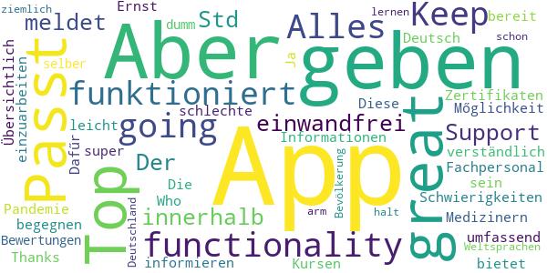

> Top App, great functionality! Keep going! Alles funktioniert einwandfrei. Der Support meldet sich innerhalb von 24 Std sollte es Schwierigkeiten mit den Kursen oder Zertifikaten geben.  :date: __2020-04-19 18:46:48__

> Thanks Who  :date: __2020-04-15 18:56:24__

> Diese App bietet Medizinern und Fachpersonal die Mőglichkeit, sich umfassend zu informieren um einer Pandemie zu begegnen. Dafűr sollte man bereit sein, sich in die Informationen einzuarbeiten.  :date: __2020-04-14 20:16:47__

> Die App ist super! Übersichtlich und leicht verständlich. Ja diese App ist nicht auf Deutsch! Aber im Ernst: einer App schlechte Bewertungen zu geben nur weil man selber zu dumm ist eine der Weltsprachen zu lernen, ist schon ziemlich arm. Aber das ist halt Deutschland und seine Bevölkerung...  :date: __2020-04-14 12:04:35__

#### 4-star reviews

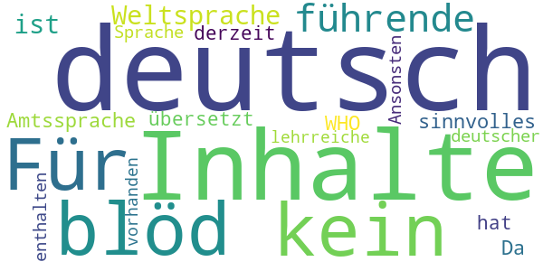

> Für alle "kein deutsch = blöd": da Deutsch keine führende Weltsprache ist, ist sie auch keine Amtssprache der WHO. Da noch keiner etwas sinnvolles nach deutsch übersetzt hat, sind derzeit keine Inhalte in deutscher Sprache enthalten... Ansonsten sind einige lehrreiche Inhalte vorhanden.  :date: __2020-04-08 19:31:11__

#### 3-star reviews

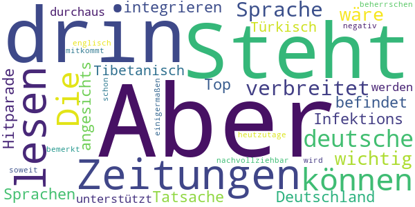

> Steht auch nichts anderes drin, als wir in den Zeitungen lesen können. Die deutsche Sprache ist nicht so verbreitet, dass es wichtig wäre, sie zu integrieren. Aber angesichts der Tatsache, dass sich Deutschland in der Infektions-Hitparade unter den Top-10 befindet und dass so Sprachen, wie Tibetanisch oder Türkisch unterstützt werden, ist es durchaus nachvollziehbar, dass es negativ bemerkt wird. Aber heutzutage sollte man schon soweit englisch beherrschen, dass man hier einigermaßen mitkommt.  :date: __2020-04-14 18:48:38__

#### 2-star reviews

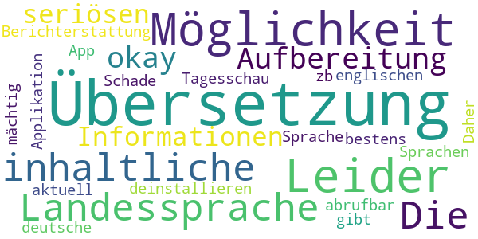

> Leider keine Möglichkeit der Übersetzung in die Landessprache. Die inhaltliche Aufbereitung ist okay, aber alle Informationen sind in der seriösen Berichterstattung von zb. der Tagesschau App bestens und sehr aktuell abrufbar. Daher werde ich die Applikation deinstallieren.  :date: __2020-04-19 09:51:54__

> Schade das es keine deutsche Übersetzung gibt und auch in anderen Sprachen nicht jeder ist der englischen Sprache mächtig  :date: __2020-04-16 22:34:58__

#### 1-star reviews

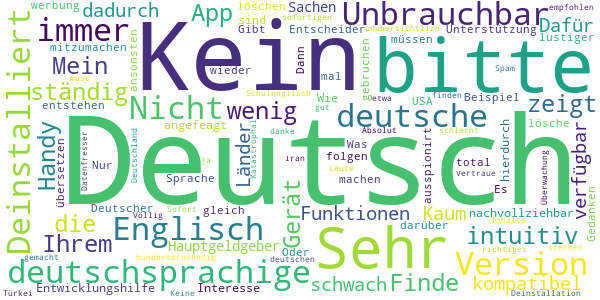

> Finde ich zu wenig intuitiv  :date: __2020-12-09 17:28:27__

> Mein Handy zeigt ständig an, "(die App ist mit Ihrem Gerät nicht kompatibel & dadurch nicht verfügbar")  :date: __2020-07-27 11:16:42__

> Sehr schwach! Kaum deutschsprachige Funktionen. Dafür, dass deutschsprachige Länder, Hauptgeldgeber sind und auch in Sachen Entwicklungshilfe angefeagt sind, nicht nachvollziehbar. Wie soll hierdurch ein Interesse und Unterstützung entstehen, mitzumachen?? Entscheider müssen sich darüber mal Gedanken machen. Oder dem Beispiel USA folgen...  :date: __2020-06-21 07:34:04__

> Es wird immer lustiger  :date: __2020-06-14 18:17:12__

> Gibt es dies nicht in Deutscher Sprache ? Dann lösche ich dies gleich wieder.  :date: __2020-06-03 20:05:16__

> Was soll das kein Deutsch ???  :date: __2020-05-26 09:37:55__

> nicht zu gebruchen du wirst total ausspionirt  :date: __2020-05-26 00:20:56__

> Nur werbung  :date: __2020-05-23 16:53:18__

> in Deutsch bitte  :date: __2020-05-18 12:53:36__

> Kein deutsch  :date: __2020-05-12 15:46:33__

# Credits

This project makes use of the following main third-party projects:
* Androguard: [https://github.com/androguard/androguard](https://github.com/androguard/androguard)
* Androwarn: [https://github.com/maaaaz/androwarn](https://github.com/maaaaz/androwarn)
* google_play_scraper: [https://github.com/JoMingyu/google-play-scraper](https://github.com/JoMingyu/google-play-scraper)
* whois: [https://github.com/DannyCork/python-whois](https://github.com/DannyCork/python-whois)
* BeautifulSoup: [https://www.crummy.com/software/BeautifulSoup](https://www.crummy.com/software/BeautifulSoup)

Other open-source projects used in this project include: 

- androguard==3.3.5
- appnope==0.1.0
- asn1crypto==1.3.0
- backcall==0.1.0
- beautifulsoup4==4.9.0
- bs4==0.0.1
- certifi==2020.4.5.1
- cffi==1.14.0
- chardet==3.0.4
- click==7.1.2
- colorama==0.4.3
- cryptography==2.9.2
- cycler==0.10.0
- decorator==4.4.2
- future==0.18.2
- google-play-scraper==0.1.1
- idna==2.9
- ipython==7.13.0
- ipython-genutils==0.2.0
- jedi==0.17.0
- Jinja2==2.11.2
- joblib==0.14.1
- kiwisolver==1.2.0
- lxml==4.5.0
- MarkupSafe==1.1.1
- matplotlib==3.2.1
- networkx==2.4
- nltk==3.5
- numpy==1.18.3
- parso==0.7.0
- pexpect==4.8.0
- pickleshare==0.7.5
- Pillow==7.1.2
- play-scraper==0.6.0
- prompt-toolkit==3.0.5
- ptyprocess==0.6.0
- pycountry==19.8.18
- pycparser==2.20
- pydot==1.4.1
- Pygments==2.6.1
- pyOpenSSL==19.1.0
- pyparsing==2.4.7
- python-dateutil==2.8.1
- regex==2020.4.4
- requests==2.23.0
- requests-futures==1.0.0
- six==1.14.0
- soupsieve==2.0
- tld==0.12.1
- tqdm==4.45.0
- traitlets==4.3.3
- urllib3==1.25.9
- wcwidth==0.1.9
- wordcloud==1.7.0

