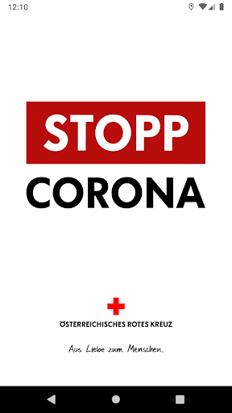
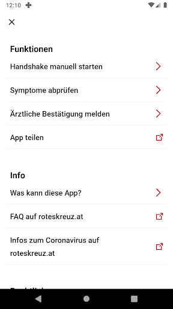
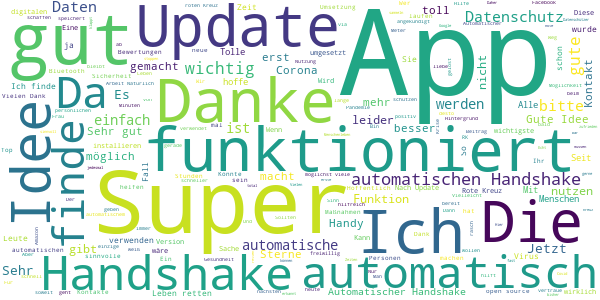
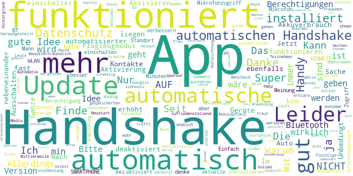
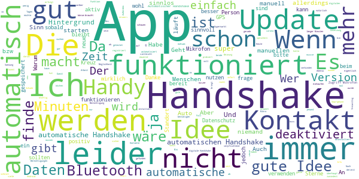
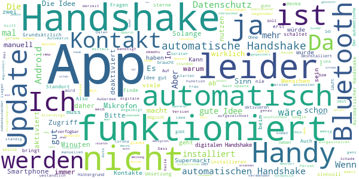
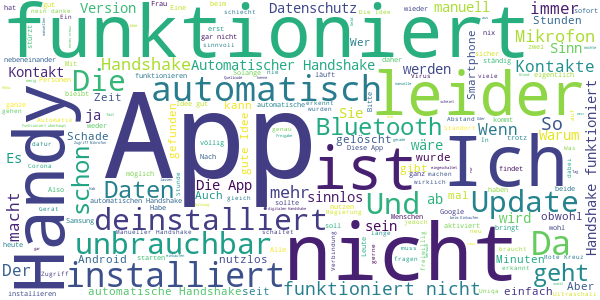

# Stopp Corona
App version ``1.2.0.12-QA_229``

Analyzed with [covid-apps-observer](http://github.com/covid-apps-observer) project, version ``0.1``

## App overview
| | |
|-------------------------|-------------------------| 
| **Name**&nbsp;&nbsp;&nbsp;&nbsp;&nbsp;&nbsp;&nbsp;&nbsp;&nbsp;&nbsp;&nbsp;&nbsp;&nbsp;&nbsp;&nbsp;&nbsp;&nbsp;&nbsp;&nbsp;&nbsp;&nbsp;&nbsp;&nbsp;&nbsp;&nbsp;&nbsp;&nbsp;&nbsp;&nbsp;&nbsp;&nbsp;&nbsp;&nbsp;&nbsp;&nbsp;&nbsp;&nbsp;&nbsp;&nbsp;&nbsp;  | Stopp Corona |
| **Unique identifier** | at.roteskreuz.stopcorona |
| **Link to Google Play** | [https://play.google.com/store/apps/details?id=at.roteskreuz.stopcorona](https://play.google.com/store/apps/details?id=at.roteskreuz.stopcorona) |
| **Summary**  | Mein Kontakt-Tagebuch |
| **Privacy policy** | [https://www.roteskreuz.at/site/faq-app-stopp-corona/](https://www.roteskreuz.at/site/faq-app-stopp-corona/) |
| **Latest version** | 1.2.0.12-QA_229 |
| **Last update** | 2020-05-13 18:41:57 |
| **Recent changes** |         Entwarnung geben 	Empfehlen der App 	Änderungen Symptomcheck 	Datenschutz - alle personenbezogenen Daten in Österreich 	Bugs behoben |
| **Installs**  | 100.000+ |
| **Category** | Medizin |
| **First release** | 25.03.2020 |
| **Size**  | 5,9M |
| **Supported Android version**  | 6.0 oder höher |

### Description
> Mit der „Stopp Corona“-App lassen sich Begegnungen mit Freunden, der Familie oder Arbeitskollegen ganz einfach und anonymisiert speichern. Sollten Sie sich mit Corona infizieren, können Sie einfach über die App eine Meldung abgeben und Ihre Kontakte aus den letzten 48 Stunden werden anonym benachrichtigt. 
 Das gleiche gilt natürlich umgekehrt. Gibt eine Ihrer gespeicherten Begegnungen an, sich infiziert zu haben, erhalten Sie umgehend eine Nachricht und Sie können entsprechende Maßnahmen ergreifen. Dazu zählen vor allem:
 -	Abstand halten
 -	Soziale Kontakte vermeiden
 -	Sich vorsichtshalber in Selbstisolation begeben
 Beim Einsetzen von Symptomen kontaktieren Sie bitte telefonisch ihre Hausärztin oder den Hausarzt. Wenn das nicht möglich ist, rufen Sie die die Nummer 1450 an.
 Jedenfalls gilt: Bitte nicht die Ärztin/oder den Arzt persönlich aufsuchen und auch nicht ins Krankenhaus fahren. Bei einem medizinischen Notfall: 144 rufen.
 Gemeinsam unterbrechen wir so die Infektionskette.
 So schützen Sie nicht nur sich selbst, sondern verhindern auch, dass andere sich infizieren.
 Nutze Sie den digitalen Handshake
 Bis wir uns wieder unbedacht die Hände bei der Begrüßung reichen können, wird es wohl noch einige Zeit dauern. In der Zwischenzeit nutzen Sie einfach den digitalen Handshake der „Stopp Corona“-App.
 Haben Sie und die Person mit der Sie sich treffen die App installiert, können Sie sich gegenseitig in der App auswählen. Damit bestätigen Sie, dass Sie sich getroffen haben. Diese Daten werden anonymisiert gespeichert. Erkrankt einer von Ihnen beiden an dem Corona-Virus, erhält der andere eine Nachricht.
 Machen Sie den Corona-Selbstcheck
 Wie geht es Ihnen heute? Anhand eines klinisch geprüften Fragebogens können Sie sich täglich auf Corona-Symptome überprüfen.
 Corona-Verdachtsmeldung
 Entsprechen die Symptome dem Corona-Virus, können Sie eine Meldung über die App abgeben. Das ist wichtig, damit sich nicht noch mehr Menschen mit dem Virus infizieren. Ihre Begegnungen werden dann anonymisiert benachrichtigt. Keine Sorge, sie erhalten also keine persönlichen Angaben. 
 Anschließend bleiben Sie bitte Zuhause und kontaktieren Sie Ihre Hausärztin oder Ihren Hausarzt telefonisch. Wenn das nicht möglich ist rufen Sie die Nummer 1450 an.
 Fahren Sie nicht ins Krankenhaus und suchen Sie Ihren Arzt nicht persönlich auf.
 Ärztliche Bestätigung
 Stellt ein Arzt den Corona-Virus fest, können Sie ebenfalls eine Meldung abgeben. Auch hier werden Ihre Begegnungen anonymisiert benachrichtigt.
 Die App entstand in Partnerschaft mit der UNIQA Stiftung.
 Konzept und Realisierung in Zusammenarbeit und mit Unterstützung von Accenture Österreich.
 Schau auf Dich. Schau auf mich. So schützen wir uns.

### User interface
The developers of the app provide the following screenshots in the Google play store.
| | | |
|:-------------------------:|:-------------------------:|:-------------------------:|
 |   |   |   | 
 |   |   |   | 
 |   |  

## Development team
In the following we report the main information provided by the development team in the Google play store.

| | |
|-------------------------|-------------------------|
| **Developer**  | Österreichisches Rotes Kreuz |
| **Website**  | [https://www.roteskreuz.at](https://www.roteskreuz.at) |
| **Email** | service@roteskreuz.at |
| **Physical address**  | [Wiedner Hauptstrasse 32 1040 Wien Österreich](https://www.google.com/maps/search/Wiedner%20Hauptstrasse%2032%201040%20Wien%20Österreich) (Google Maps) |
| **Other developed apps**  | [https://play.google.com/store/apps/developer?id=%C3%96sterreichisches+Rotes+Kreuz](https://play.google.com/store/apps/developer?id=%C3%96sterreichisches+Rotes+Kreuz) |

## Android support

| | |
|-------------------------|-------------------------|
| **Declared target Android version**  | Pie, version 9 (API level 28) |
| **Effective target Android version**  | Pie, version 9 (API level 28) |
| **Minimum supported Android version**  | Marshmallow, version 6.0 (API level 23) |
| **Maximum target Android version**  | - |

The larger the difference between the minimum and maximum supported Android versions, the better. A larger difference means a wider audience. For example, old phones have a very low Android version, so a high minimum supported Android version means that the app cannot be used by users with old phones, thus leading to accessibility problems. 

## Requested permissions

In the following we report the complete list of the permissions requested by the app. 

| **Permission** | **Protection level** | **Description** | 
|-------------------------|-------------------------|-------------------------|
 **android.permission ACCESS_COARSE_LOCATION** | :warning:**Dangerous** | Allows an app to access approximate location. 
 **android.permission ACCESS_NETWORK_STATE** | Normal | Allows applications to access information about networks. 
 **android.permission ACCESS_WIFI_STATE** | Normal | Allows applications to access information about Wi-Fi networks. 
 **android.permission BLUETOOTH** | Normal | Allows applications to connect to paired bluetooth devices. 
 **android.permission BLUETOOTH_ADMIN** | Normal | Allows applications to discover and pair bluetooth devices. 
 **android.permission CHANGE_NETWORK_STATE** | Normal | Allows applications to change network connectivity state. 
 **android.permission CHANGE_WIFI_STATE** | Normal | Allows applications to change Wi-Fi connectivity state. 
 **android.permission FOREGROUND_SERVICE** | Normal | Allows a regular application to use Service.startForeground. 
 **android.permission INTERNET** | Normal | Allows applications to open network sockets. 
 **android.permission RECEIVE_BOOT_COMPLETED** | Normal | Allows an application to receive the Intent.ACTION_BOOT_COMPLETED that is broadcast after the system finishes booting. 
 **android.permission REQUEST_IGNORE_BATTERY_OPTIMIZATIONS** | Normal | Permission an application must hold in order to use Settings.ACTION_REQUEST_IGNORE_BATTERY_OPTIMIZATIONS. 
 **android.permission WAKE_LOCK** | Normal | Allows using PowerManager WakeLocks to keep processor from sleeping or screen from dimming. 
 **com.google.android.c2dm.permission RECEIVE** | - | - 

## Mentioned servers

| **Server** | **Registrant** | **Registrant country** | **Creation date** | 
|-------------------------|-------------------------|-------------------------|-------------------------|
 | google.com | Google LLC | :us: US | 1997-09-15 04:00:00 |
 | azurefd.net | Microsoft Corporation | :us: US | 2018-05-08 19:21:22 |

## Security analysis 

Below we report the main security warnings raised by our execution of the [Androwarn](https://github.com/maaaaz/androwarn) security analysis tool.

**Connection interfaces exfiltration**
> - This application reads details about the currently active data network 
> - This application tries to find out if the currently active data network is metered 

**Telephony services abuse**
> - This application makes phone calls 

**Suspicious connection establishment**
> - This application opens a Socket and connects it to the remote address '; port is out of range' on the 'N/A' port  
> - This application opens a Socket and connects it to the remote address 'Ljava/net/Proxy;->type()Ljava/net/Proxy$Type;' on the 'N/A' port  
> - This application opens a Socket and connects it to the remote address 'Lp/b/a/a/a;->a(Ljava/lang/String;)Ljava/lang/StringBuilder;' on the 'N/A' port  
> - This application opens a Socket and connects it to the remote address 'timeout' on the 'N/A' port  

## User ratings and reviews

Below we provide information about how end users are reacting to the app in terms of ratings and reviews in the Google Play store.

### Ratings

The Stopp Corona app has been installed by more than **100000** times. At this time, **1869** rated the app and its average score is **2.945946**. Below we show the distribution of the ratings across the usual star-based rating of Google Play

:star::star::star::star::star:: 616

:star::star::star::star:: 141

:star::star::star:: 282

:star::star:: 181

:star:: 646

### Reviews 

#### 5-star reviews

> Super Sache - danke  :date: __2020-05-17 11:10:52__

> Ich finde die App super!!  :date: __2020-05-17 06:50:01__

> sehr einfach! sind 15 Minuten nicht zu lange? habe bisher nur 0 Kontakte!  :date: __2020-05-16 17:55:38__

> Sehr gut gemacht....  :date: __2020-05-15 19:55:23__

> Wer Sicherheit will und Sicherheit geben will ein muss  :date: __2020-05-15 15:00:58__

> Super  :date: __2020-05-15 13:09:14__

> Super  :date: __2020-05-15 08:43:54__

> Das wichtigste ist: Dezentral und anonymisiert. Automatischer Kontakt funktioniert beim FP3  :date: __2020-05-15 08:31:58__

> Da ich einen hohen risikofactor habe finde ich das toll nur bei meinen Kindern stoße ich auf unverstandnis  :date: __2020-05-15 08:26:53__

> Extrem sinnvoll, kann Menschenleben retten  :date: __2020-05-15 06:17:13__

#### 4-star reviews

> Ist am Handy  :date: __2020-05-16 10:45:42__

> Anwendung ist Recht zufriedenstellend, aber mangels Teilnehmer (?) bzw. kurzen Kontaktzeiten (?) bekomme ich den Handshake seit 3 Wochen nur von meiner Frau  :date: __2020-05-15 08:30:46__

> Automatischer Handshake deaktiviert sich immer wieder von selbst.  :date: __2020-05-14 11:40:20__

> Mittlerweile hat sich herausgestellt, dass alle gespeicherten Kontakte bei einem Neustart verloren sind, und dass auch 2 Geräte, auch wenn sie stundenlang fast nebeneinander liegen, den automatischen Handshake NICHT ausführen.  :date: __2020-05-12 21:53:38__

> Im  :date: __2020-05-12 16:52:13__

> Helmut freut  :date: __2020-05-02 08:48:06__

> Kann das nicht automatisch gehen - hab eh nur flüchtige Zufallsbegegnungen.  :date: __2020-05-01 10:04:52__

> Unbedingt automatisierter Kontakt, was soll das Ganze sonst??? Ich treffl mich im Park mit 5 Freunden und erkläre ihnen, dass sie die App downloaden sollen, damit sie mir dann Bescheid geben wenns ernst wird???????? Liebe Leute.....das kann ja nicht wahr sein.....in so einer Situation muss das funktionieren, da es ja bei anderen Social Media Apps auch geht.....?????!!!!!  :date: __2020-05-01 00:54:11__

> Die App finde ich echt sinnvoll und sie ist auch sehr Benutzerfreundlich. Das einzig nervige ist, dass der virtuelle Handshake nach dem Ausschalten des Flugzeugmodus nicht automatisch startet. So hab ich bestimmt etwaige Handshakes nicht dokumentiert, da ich das manuelle Aktivieren vergessen habe....  :date: __2020-04-26 05:56:29__

> Update: Läuft jetzt im Hintergrund und ich brauche mich aktiv um nichts kümmern ausser den autom. Handshake einmalig zu starten. Die Akkulaufzeit verkürzt sich dadurch nicht oder zumindest nicht spürbar.  :date: __2020-04-23 20:04:02__

#### 3-star reviews

> Automatischer Handshake wird immer wieder ohne ersichtlichen Grund deaktiviert.  :date: __2020-05-16 19:58:20__

> Es scheint so zu sein, dass der automatische Handshake nur funktioniert, wenn man zuvor zumindest einmal den manuellen Handshake gestartet und damit die Berechtigung für das Mikrofon freigegeben hat. Android 10.  :date: __2020-05-15 18:01:22__

> Prinzipiell gute Idee, leider schaltet sich die App immer wieder, ohne Warnung ab. Wenn man wieder startet kommt die Info über ein Update. Nach Update Instsllstion muss man wieder händisch starten. Das sollte unbedingt automatisiert werden. Automatisches Update, oder zumindest Aufforderung zum Update.  :date: __2020-05-15 17:37:53__

> Die Automatik immer wieder einschalten zu müssen nervt. Auch bin ich mir nicht sicher ob die App funktioniert - ' habe nach Wochen noch keinen Kontakt  :date: __2020-05-15 16:19:59__

> Auto handshake gehört default auf ein. Wenn wer das nicht will soll er es abschalten. Die Version erkennt nich immer dass Auto auf ein ist ... und meldet immer wieder Auto einschalten. Samsung Handy Galaxy A5 (2017)  :date: __2020-05-15 10:02:43__

> Habe mir neues, gutes Smartphone gekauft. App läuft jetzt schon besser als noch im April. Aber immer noch wird sie von der Bevölkerung kaum angenommen, von vielen sogar angefeindet. Freunde und Bekannte halten mich teilweise für einen Spinner weil ich immer noch von der Sinnhaftigkeit dieser Solidaritätsapp überzeugt bin.  :date: __2020-05-15 09:45:12__

> Bis heute konnte ich keinen einzigen Menschen in meiner Nähe identifizieren, der auch die App hat - und das obwohl ich beim Roten Kreuz arbeite.  :date: __2020-05-15 09:20:31__

> Die App setzt voraus, dass man mögliche Kontakte (z.B.im Supermarkt) manuell sucht und Speichert, um dann bei einem Infektionsfall Bescheid zu bekommen. Sorry, liebe App Programmierer. Solange das nicht automatisch passiert, wird das nichts.  :date: __2020-05-14 18:34:04__

> Bleibt leider nicht immer im Automatischen Modus.  :date: __2020-05-14 16:04:16__

> Funktioniert die App? Ich saß mit meinem Vater und wir haben zuerst auf den automatischen Handshake gewartet. Und dann noch 2 mal den manuellen versucht. Es wurde kein handshake gespeichert. Danke für die Antwort, in die Faq's zu schauen. Vermutlich haben wir die Akkuoptimierung ded Herstellers nicht ausgeschaltet.  :date: __2020-05-12 14:51:19__

#### 2-star reviews

> Da sich der automatische Handshake nach jedem Update automatisch deaktiviert, wird man kaum wer die App aktiv haben. Wenn beide Handys den auto Handshake eingeschaltet haben wird erst nach 45 bis 90 min der Kontakt eingetragen. Auch die angegebenen 15min sind wissenschaftlich nicht mehr haltbar, da in Innenräumen bereits kurzes Sprechen aus kurzer Distanz zu einer Ansteckung führen kann. Vorschläge: Zeit drastisch verkürzen, Vibrieren beim Erkennen und nachträgliches Bewerten der Liste ermögl.  :date: __2020-05-17 13:40:14__

> App löscht bei Update die GESAMMELTEN Daten. Wenn zu Hause die App nichtgenutzt wird und dadurch Internetzugang und Bluetooth ausgeschaltet werden, muss man beim NÄCHSTEN benutzen die App neu installieren. Die Idee ist TROTZDEM GUT.  :date: __2020-05-17 07:42:51__

> Leider funktioniert der handshake nicht automatisch und leider hat nicht jeder die app (ich wäre für eine verpflichtung)  :date: __2020-05-16 07:57:18__

> Der automatische Handshake muss nach jeder Offline-Phase, egal ob Flugmodus oder ganz ausgeschaltet, neu aktiviert werden. Das ist schon sehr öd. Kann man das nicht in den Grindeinstellungen fixieren?  :date: __2020-05-15 14:43:45__

> Etwas unverständlich  :date: __2020-05-15 09:31:31__

> hab gestern (14.5.2020) das Update installiert,und nun sind alle Handshakes verschwunden !!!  :date: __2020-05-15 08:20:44__

> Weitere Ergänzung am 14.5.20! Nach einem Update sind alle bisherigen Handshakes weg. Wäre gut wenn diese noch da wären. Ergänzung! Nun gibt es die Möglichkeit des,Automatischen Handshakes nur schaltet sich dieser in der App immer wieder ab. So macht es leider keinen Sinn. Original Rezession. Gute Idee, nur warum funktioniert es nicht automatisch mit dem Handshake? Ich denke die meisten sind zu bequem andauernd die App zu öffnen und sein Gegenüber zu suchen und zu registrieren.  :date: __2020-05-14 20:59:35__

> Meine Frau und ich sind 24 h beisammen die Handys nahezu aufeinander beide automatischer handshak es wurde nur mit manuellen handshak aufgezeichnet? Bluetooth ist aktiviert.?  :date: __2020-05-14 15:18:35__

> schade, sehr unzuverlässige app. handshakes werden gelöscht, app schießt sich einfach, nach updates sind die autom. handshakes wieder deaktiviert. so wird die app keine leben retten.  :date: __2020-05-14 12:32:16__

> Funktioniert nicht richtig....  :date: __2020-05-13 18:25:44__

#### 1-star reviews

> Test des automatischen Handshaking bei Treffen mit Freunden. Handys zusammengelegt. Keine Dedektion. Manueller Handshake hat dann funktioniert. Daher eigentlich unbrauchbar.  :date: __2020-05-17 10:26:35__

> Autom. Handshake beendet sich immer wieder unmotiviert, also m. E. völlig wertlos.  :date: __2020-05-17 09:44:47__

> Der lokale Datenspeicher ist super...super auch, dass nach dem letzten Android Update sämtliche Handshakes gelöscht wurden :-/ Update: der automatische Handshake schaltet sich immer wieder aus. Die Erkennung funktioniert nicht zuverlässig. Hatte zwei Handys eine Stunde nebeneinander liegen und bei nur einem Gerät wurde das Gegenüber erkannt.  :date: __2020-05-17 08:18:52__

> Habe die App jetzt auf automatischen Handshake, aber selbst nach über einer Stunde gibt es keinen Treffer. Bei beiden ist die aktuellste Version installiert. Android Version 6? Habe derzeit Android 10. Liegt also an der App und eher nicht an Android. Auch nach dem letzten Update keine Verbesserung. Danke für euren Beitrag zur Bewältigung der Krise.  :date: __2020-05-16 20:52:11__

> Manueller Handshake ist wohl ein Scherz. Und stabil läuft sie auch nicht. Ich hab sie wieder deinstalliert. Weil so macht es gar keinen Sinn. Warum schafft ihr es nicht eine gute Idee dauber umzusetzen???  :date: __2020-05-16 12:08:15__

> So ein Sch..... Kostet 2 Mio Entwicklung und funktioniert Null! Wer hat da mitgeschnitten?!  :date: __2020-05-16 11:50:19__

> Diese App ist nur lästig und schaltet sich immer aus. Im Bett werde ich aufgefordert diese einzuschalten.  :date: __2020-05-16 10:30:36__

> Samsung S10e+OnePlus 6T sitzen 2 Stunden nebeneinander, Bluetooth eingeschaltet und automatischer Handshake aktiviert. Nix passiert, kein digitaler Handshake. Sorry folks, das ist nix  :date: __2020-05-15 21:07:54__

> Heute die Anwendung installiert und gestartet. Diese Version wird nicht mehr unterstützt, gehen Sie zum Play Store! Wer hat geschlampt, Google oder Rotes Kreuz?  :date: __2020-05-15 16:13:41__

> Die Idee ist gut, doch die App noch nicht so weit. In der Praxis funktioniert die Art der autom. Kontakterkennung nicht so wie es theoretisch funktionieren sollte.  :date: __2020-05-15 14:53:11__

