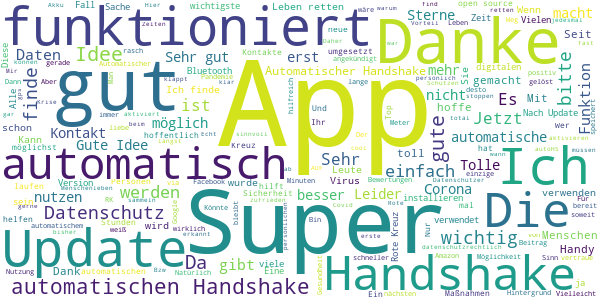
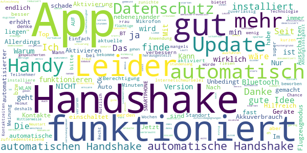
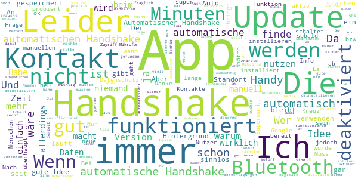
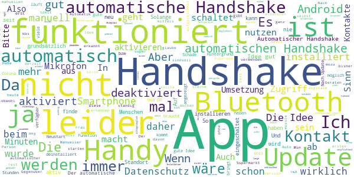
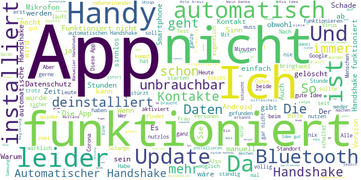

# Stopp Corona
App version ``1.2.2.956-QA_230``

Analyzed with [covid-apps-observer](http://github.com/covid-apps-observer) project, version ``0.1``

## App overview
| | |
|-------------------------|-------------------------| 
| **Name**&nbsp;&nbsp;&nbsp;&nbsp;&nbsp;&nbsp;&nbsp;&nbsp;&nbsp;&nbsp;&nbsp;&nbsp;&nbsp;&nbsp;&nbsp;&nbsp;&nbsp;&nbsp;&nbsp;&nbsp;&nbsp;&nbsp;&nbsp;&nbsp;&nbsp;&nbsp;&nbsp;&nbsp;&nbsp;&nbsp;&nbsp;&nbsp;&nbsp;&nbsp;&nbsp;&nbsp;&nbsp;&nbsp;&nbsp;&nbsp;  | Stopp Corona |
| **Unique identifier** | at.roteskreuz.stopcorona |
| **Link to Google Play** | [https://play.google.com/store/apps/details?id=at.roteskreuz.stopcorona](https://play.google.com/store/apps/details?id=at.roteskreuz.stopcorona) |
| **Summary**  | Mein Kontakt-Tagebuch |
| **Privacy policy** | [https://www.roteskreuz.at/site/faq-app-stopp-corona/](https://www.roteskreuz.at/site/faq-app-stopp-corona/) |
| **Latest version** | 1.2.2.956-QA_230 |
| **Last update** | 2020-06-11 15:25:03 |
| **Recent changes** |           kleine Anpassungen |
| **Installs**  | 100.000+ |
| **Category** | Medizin |
| **First release** | 25.03.2020 |
| **Size**  | 5,9M |
| **Supported Android version**  | 6.0 oder höher |

### Description
> Mit der „Stopp Corona“-App lassen sich Begegnungen mit Freunden, der Familie oder Arbeitskollegen ganz einfach und anonymisiert speichern. Sollten Sie sich mit Corona infizieren, können Sie einfach über die App eine Meldung abgeben und Ihre Kontakte aus den letzten 48 Stunden werden anonym benachrichtigt. 
 Das gleiche gilt natürlich umgekehrt. Gibt eine Ihrer gespeicherten Begegnungen an, sich infiziert zu haben, erhalten Sie umgehend eine Nachricht und Sie können entsprechende Maßnahmen ergreifen. Dazu zählen vor allem:
 -	Abstand halten
 -	Soziale Kontakte vermeiden
 -	Sich vorsichtshalber in Selbstisolation begeben
 Beim Einsetzen von Symptomen kontaktieren Sie bitte telefonisch ihre Hausärztin oder den Hausarzt. Wenn das nicht möglich ist, rufen Sie die die Nummer 1450 an.
 Jedenfalls gilt: Bitte nicht die Ärztin/oder den Arzt persönlich aufsuchen und auch nicht ins Krankenhaus fahren. Bei einem medizinischen Notfall: 144 rufen.
 Gemeinsam unterbrechen wir so die Infektionskette.
 So schützen Sie nicht nur sich selbst, sondern verhindern auch, dass andere sich infizieren.
 Nutze Sie den digitalen Handshake
 Bis wir uns wieder unbedacht die Hände bei der Begrüßung reichen können, wird es wohl noch einige Zeit dauern. In der Zwischenzeit nutzen Sie einfach den digitalen Handshake der „Stopp Corona“-App.
 Haben Sie und die Person mit der Sie sich treffen die App installiert, können Sie sich gegenseitig in der App auswählen. Damit bestätigen Sie, dass Sie sich getroffen haben. Diese Daten werden anonymisiert gespeichert. Erkrankt einer von Ihnen beiden an dem Corona-Virus, erhält der andere eine Nachricht.
 Machen Sie den Corona-Selbstcheck
 Wie geht es Ihnen heute? Anhand eines klinisch geprüften Fragebogens können Sie sich täglich auf Corona-Symptome überprüfen.
 Corona-Verdachtsmeldung
 Entsprechen die Symptome dem Corona-Virus, können Sie eine Meldung über die App abgeben. Das ist wichtig, damit sich nicht noch mehr Menschen mit dem Virus infizieren. Ihre Begegnungen werden dann anonymisiert benachrichtigt. Keine Sorge, sie erhalten also keine persönlichen Angaben. 
 Anschließend bleiben Sie bitte Zuhause und kontaktieren Sie Ihre Hausärztin oder Ihren Hausarzt telefonisch. Wenn das nicht möglich ist rufen Sie die Nummer 1450 an.
 Fahren Sie nicht ins Krankenhaus und suchen Sie Ihren Arzt nicht persönlich auf.
 Ärztliche Bestätigung
 Stellt ein Arzt den Corona-Virus fest, können Sie ebenfalls eine Meldung abgeben. Auch hier werden Ihre Begegnungen anonymisiert benachrichtigt.
 Die App entstand in Partnerschaft mit der UNIQA Stiftung.
 Konzept und Realisierung in Zusammenarbeit und mit Unterstützung von Accenture Österreich.
 Schau auf Dich. Schau auf mich. So schützen wir uns.

### User interface
The developers of the app provide the following screenshots in the Google play store.
| | | |
|:-------------------------:|:-------------------------:|:-------------------------:|
 |   |   |   | 
 |   |   |   | 
 |   |  

## Development team
In the following we report the main information provided by the development team in the Google play store.

| | |
|-------------------------|-------------------------|
| **Developer**  | Österreichisches Rotes Kreuz |
| **Website**  | [https://www.roteskreuz.at](https://www.roteskreuz.at) |
| **Email** | service@roteskreuz.at |
| **Physical address**  | [Wiedner Hauptstrasse 32 1040 Wien Österreich](https://www.google.com/maps/search/Wiedner%20Hauptstrasse%2032%201040%20Wien%20Österreich) (Google Maps) |
| **Other developed apps**  | [https://play.google.com/store/apps/developer?id=%C3%96sterreichisches+Rotes+Kreuz](https://play.google.com/store/apps/developer?id=%C3%96sterreichisches+Rotes+Kreuz) |

## Android support

| | |
|-------------------------|-------------------------|
| **Declared target Android version**  | Pie, version 9 (API level 28) |
| **Effective target Android version**  | Pie, version 9 (API level 28) |
| **Minimum supported Android version**  | Marshmallow, version 6.0 (API level 23) |
| **Maximum target Android version**  | - |

The larger the difference between the minimum and maximum supported Android versions, the better. A larger difference means a wider audience. For example, old phones have a very low Android version, so a high minimum supported Android version means that the app cannot be used by users with old phones, thus leading to accessibility problems. 

## Requested permissions

In the following we report the complete list of the permissions requested by the app. 

| **Permission** | **Protection level** | **Description** | 
|-------------------------|-------------------------|-------------------------|
 **android.permission ACCESS_COARSE_LOCATION** | :warning:**Dangerous** | Allows an app to access approximate location. 
 **android.permission ACCESS_NETWORK_STATE** | Normal | Allows applications to access information about networks. 
 **android.permission ACCESS_WIFI_STATE** | Normal | Allows applications to access information about Wi-Fi networks. 
 **android.permission BLUETOOTH** | Normal | Allows applications to connect to paired bluetooth devices. 
 **android.permission BLUETOOTH_ADMIN** | Normal | Allows applications to discover and pair bluetooth devices. 
 **android.permission CHANGE_NETWORK_STATE** | Normal | Allows applications to change network connectivity state. 
 **android.permission CHANGE_WIFI_STATE** | Normal | Allows applications to change Wi-Fi connectivity state. 
 **android.permission FOREGROUND_SERVICE** | Normal | Allows a regular application to use Service.startForeground. 
 **android.permission INTERNET** | Normal | Allows applications to open network sockets. 
 **android.permission RECEIVE_BOOT_COMPLETED** | Normal | Allows an application to receive the Intent.ACTION_BOOT_COMPLETED that is broadcast after the system finishes booting. 
 **android.permission REQUEST_IGNORE_BATTERY_OPTIMIZATIONS** | Normal | Permission an application must hold in order to use Settings.ACTION_REQUEST_IGNORE_BATTERY_OPTIMIZATIONS. 
 **android.permission WAKE_LOCK** | Normal | Allows using PowerManager WakeLocks to keep processor from sleeping or screen from dimming. 
 **com.google.android.c2dm.permission RECEIVE** | - | - 

## Mentioned servers

| **Server** | **Registrant** | **Registrant country** | **Creation date** | 
|-------------------------|-------------------------|-------------------------|-------------------------|
 | google.com | Google LLC | :us: US | 1997-09-15 04:00:00 |
 | prod-rca-coronaapp-fd.net | Domains By Proxy, LLC | :us: US | 2020-04-20 20:16:19 |

## Security analysis 

Below we report the main security warnings raised by our execution of the [Androwarn](https://github.com/maaaaz/androwarn) security analysis tool.

**Connection interfaces exfiltration**
> - This application reads details about the currently active data network 
> - This application tries to find out if the currently active data network is metered 

**Telephony services abuse**
> - This application makes phone calls 

**Suspicious connection establishment**
> - This application opens a Socket and connects it to the remote address '; port is out of range' on the 'N/A' port  
> - This application opens a Socket and connects it to the remote address 'Ljava/net/Proxy;->type()Ljava/net/Proxy$Type;' on the 'N/A' port  
> - This application opens a Socket and connects it to the remote address 'Lq/b/a/a/a;->a(Ljava/lang/String;)Ljava/lang/StringBuilder;' on the 'N/A' port  
> - This application opens a Socket and connects it to the remote address 'timeout' on the 'N/A' port  

## User ratings and reviews

Below we provide information about how end users are reacting to the app in terms of ratings and reviews in the Google Play store.

### Ratings

The Stopp Corona app has been installed by more than **100000** times. At this time, **2004** rated the app and its average score is **2.495**. Below we show the distribution of the ratings across the usual star-based rating of Google Play

:star::star::star::star::star:: 561

:star::star::star::star:: 60

:star::star::star:: 150

:star::star:: 270

:star:: 961

### Reviews 

#### 5-star reviews

> Ich denke, die App ist einfach, datenschutzrechtlich vorbildlich gestaltet und sollte nicht für die prinzipbedingten Schwächen mit 1/5 abgewatscht werden. Kann für viele ein lebensrettendes Tool werden, wenn gewissenhaft verwendet. Nur die sticky Notification bei aktiviertem automatischen Handshake find ich persönlich etwas invasiv.  :date: __2020-06-06 08:31:26__

> Gute App, verbraucht nicht viel Akku und hilft  :date: __2020-06-03 07:15:33__

> Tolle App. Wenn die Google API verwendet wird, werden hoffentlich auch die letzten Kinderkrankheiten behoben sein. Danke an das RK!  :date: __2020-06-02 17:41:40__

> Wedget am bildschirm wär cool zum autoHS aktivieren. Bzw planen wann autoHS (und Bluetooth) aktiviert ist.  :date: __2020-06-02 17:18:21__

> Die app ist sehr gut  :date: __2020-06-02 12:58:02__

> Super App  :date: __2020-06-01 10:09:26__

> einfach in der Anwendung  :date: __2020-05-25 05:31:21__

> Für mich nicht wirklich notwendig, da ich fast immer im Homeoffice arbeite, aber wenn ich mithelfen kann Corona zu stoppen, dann mache ich gerne mit.  :date: __2020-05-18 09:44:59__

> Super Sache - danke  :date: __2020-05-17 11:10:52__

> Ich finde die App super!!  :date: __2020-05-17 06:50:01__

#### 4-star reviews

> Ich finde diese App gut, deshalb installiere ich sie 👍👍👍  :date: __2020-06-02 19:46:30__

> Top  :date: __2020-05-24 13:26:25__

> Ist am Handy  :date: __2020-05-16 10:45:42__

> Anwendung ist Recht zufriedenstellend, aber mangels Teilnehmer (?) bzw. kurzen Kontaktzeiten (?) bekomme ich den Handshake seit 3 Wochen nur von meiner Frau  :date: __2020-05-15 08:30:46__

> Mittlerweile hat sich herausgestellt, dass alle gespeicherten Kontakte bei einem Neustart verloren sind, und dass auch 2 Geräte, auch wenn sie stundenlang fast nebeneinander liegen, den automatischen Handshake NICHT ausführen.  :date: __2020-05-12 21:53:38__

> Im  :date: __2020-05-12 16:52:13__

> Helmut freut  :date: __2020-05-02 08:48:06__

> Kann das nicht automatisch gehen - hab eh nur flüchtige Zufallsbegegnungen.  :date: __2020-05-01 10:04:52__

> Unbedingt automatisierter Kontakt, was soll das Ganze sonst??? Ich treffl mich im Park mit 5 Freunden und erkläre ihnen, dass sie die App downloaden sollen, damit sie mir dann Bescheid geben wenns ernst wird???????? Liebe Leute.....das kann ja nicht wahr sein.....in so einer Situation muss das funktionieren, da es ja bei anderen Social Media Apps auch geht.....?????!!!!!  :date: __2020-05-01 00:54:11__

> Die App finde ich echt sinnvoll und sie ist auch sehr Benutzerfreundlich. Das einzig nervige ist, dass der virtuelle Handshake nach dem Ausschalten des Flugzeugmodus nicht automatisch startet. So hab ich bestimmt etwaige Handshakes nicht dokumentiert, da ich das manuelle Aktivieren vergessen habe....  :date: __2020-04-26 05:56:29__

#### 3-star reviews

> 10.6.2020: Problem mit automatischem Handshake ist noch immer, wann wird es beseitigt????? 7.6.2020 Warum schaltet sich der automatische Handshake immer wieder aus, ist das so gewollt ????? Hervorragend, hoffentlich nutzen diese App möglichst viele Österreicher🤗🤗  :date: __2020-06-10 16:09:45__

> Na ja, hab schon einen Kontakt gehabt. Man muss aber den automatischen Handshake spätestens nach jedem Neustart des Handys frisch aktivieren. Das wird vielen gar nicht auffallen. Also stark verbesserungswürdig.  :date: __2020-05-26 16:48:30__

> Bluetooth wird öfters verloren. Automatische Kontakt dauert zu lange.  :date: __2020-05-21 17:48:39__

> Zu wenige Nutzer, wieder deinstalliert  :date: __2020-05-21 14:39:04__

> Leider deaktiviert sich die App immer wieder selber. So hilft sie nicht wirklich. 😔  :date: __2020-05-21 09:49:37__

> Automatischer Handshake funktioniert nicht. Idee ist gut, App ausbaufähig.  :date: __2020-05-19 10:30:19__

> Seit dem neuesten Update wird die app beim öffnen immer automatisch wieder geschlossen. Hat sich mit einmal deinstallieren und neu installieren erledigt, dafür sind ie daten die davor gespeichert wurden verloren gegangen.  :date: __2020-05-19 07:19:06__

> Nutzen ist fraglich Hauptkritik: wenn ich Bluetooth deaktivieren, muss der Automatische Handshake auch in der App wieder aktiviert werden. Daher ist der nutzen fraglich. Bisher habe ich nur 1 Kontakt...und den hätte ich auch ohne App gewusst.  :date: __2020-05-18 09:48:35__

> Automatischer Handshake wird immer wieder ohne ersichtlichen Grund deaktiviert.  :date: __2020-05-16 19:58:20__

> Es scheint so zu sein, dass der automatische Handshake nur funktioniert, wenn man zuvor zumindest einmal den manuellen Handshake gestartet und damit die Berechtigung für das Mikrofon freigegeben hat. Android 10.  :date: __2020-05-15 18:01:22__

#### 2-star reviews

> Gute Idee, funktioniert leider nicht Leider erkennt die App via Bluetooth keine anderen Handys, die auch Bluetooth aktiviert haben. Mehrmals ausprobiert. Es ist also nicht einmal ein manueller handshake möglich. Schade, ich bin sehr pro App.  :date: __2020-06-13 20:01:42__

> Nicht sehr intuitiv. Erklärungen unklar. Das Schlimmste ist, dass ich sofort nach der Installation alle 3 Minuten Benachrichtigungen bekomme, dass der automatische Handshake durchgeführt wurde. Das geht gar nicht. Die App soll im Hintergrund ihre Arbeit tun, aber mich nicht permanent stören. Wenn ich jetzt alle Benachrichtigungen deaktiviere, bekomme ich dann im Ernstfall eine Corona-Kontakts auch keine Nachricht? Wäre ja super sind. Warte mal , ob hier von den Entwicklern eine Antwort dazu kommt  :date: __2020-06-13 12:12:14__

> Nach dem Update gestern hatte ich heute zum ersten Mal einen Handshake :) Mal sehen, ob die App jetzt funktioniert  :date: __2020-06-13 11:04:13__

> Automatischer Handshake deaktiviert sich immer wieder von selbst. Edit: Fazit nach einem Monat Nutzung. Kein einziger digitaler Handshake. Tolle Idee. Bringt nur nix, wenn's keiner verwendet. App wird wieder deinstalliert.  :date: __2020-06-12 12:24:41__

> Leider benutzt offenbar niemand die App. Quasi eine Untote Zombie App. Inhaltlich: Mit automatischem Handshake scheint das ja jetzt wirklich sinnvoll... (4*) Aber nach einem Update oder nach Deaktivierung und Reaktivierung von Bluetooth muss man den automatischem Handshake neu aktivieren.(-1*) Das sollte automatisch geschehen. Und nach dem ersten Spaziergang war die App abgestürzt und ich musste sie zwangsweise stoppen (-1*) und neu starten. Und das ist seither regelmäßig wieder passiert.  :date: __2020-06-11 20:20:44__

> Die Idee ist gut, die Umsetzung leider sehr mangelhaft. Nach jedem Neustart muss man die App (autom. Handshake) neu aktivieren und bekommt auch eine neue ID zugewiesen und alle Kontakte sind wieder weg. Automatisch bekommt man kaum Kontakt-Aufzeichnungen außer die Handys liegen fast nebeneinander. Ergänzung: Praxistest im Tiergarten mit gefühlt 10.000 anderen Besuchern: kein Kontakteintrag...  :date: __2020-06-11 18:08:15__

> Mag ja gut sein, aber bei mir schaltet es immer den Hotspot aus.  :date: __2020-06-10 14:03:40__

> Funktioniert die App nicht? Ich habe den automatischen Handshake eingeschaltet. Müsste die App nicht andere Smartphones automatisch erkennen? Ich kann doch nicht jedes Mal, wenn mir wer gegenüber steht die App bedienen!  :date: __2020-06-04 13:49:47__

> Ich muss leider den kritischen Rezensionen zustimmen: der automatische Handshake hat bei mir im Test mit 2 Handys bisher nicht funktioniert. "Austria is a too small country to make a good app." Jedenfalls wäre eine europäische Lösung sicher viel besser, wenn man an die bevorstehende Reisesaison denkt.  :date: __2020-06-02 21:51:44__

> Seit Wochen kein einziger automatischer Kontakt?!?  :date: __2020-06-02 13:09:25__

#### 1-star reviews

> Bringt so nix. Es müsste auf die GPS Daten zurückgegriffen werden.  :date: __2020-06-14 10:10:23__

> 2 Tests - App bringt nichts - 1. Test Handy meiner Frau und meines nebeneinander gelegt -nach 1 Stunde bei einem Handy autom. Handshake beim zweiten keine Meldung - 2. Test nach 1/2 Stunde Autofahrt bei keinem der 2 Handys irgendeine Meldung  :date: __2020-06-14 09:11:44__

> Es ist nicht gut  :date: __2020-06-11 15:47:00__

> Der lokale Datenspeicher ist super...super auch, dass nach dem letzten Android Update sämtliche Handshakes gelöscht wurden :-/ Update: der automatische Handshake schaltet sich immer wieder aus. Die Erkennung funktioniert nicht zuverlässig. Hatte zwei Handys eine Stunde nebeneinander liegen und bei nur einem Gerät wurde das Gegenüber erkannt. Update: In der derzeitigen Version bietet die App für mich keinen Mehrwert, da sie nicht zuverlässig funktioniert. Schade, da wäre mehr Potential vorhanden  :date: __2020-06-11 13:32:24__

> Automatischer Handshake deaktiviert sich regelmäßig von selbst. Hatte nach 6 Wochen noch nie einen automatischen Handshake, obwohl mehrere Android 10-Geräte mit aktivierter App und allen erforderlichen Berechtigungen im Raum. Sehr enttäuschend, dass keine zumindest EU-weite App koordiniert wird.  :date: __2020-06-11 01:09:40__

> Bei 4 anwesenden Handys nur 2 gefunden nach einer Stunde. Der Handyabstand betrug in der Zeit max. 1m.  :date: __2020-06-10 21:23:18__

> Automatischer Handshake schaltet sich regelmäßig von alleine aus. Damit ist die App funktionslos.  :date: __2020-06-10 19:36:32__

> Anonym? Nein!  :date: __2020-06-10 17:04:55__

> Keine Funktion bei Samsung S7 und beim Huawai p10 Lite.  :date: __2020-06-10 10:04:06__

> Sobald ich meinen Bluetooth Kopfhörer anschalte, schaltet sich Stoppcorona aus. Einfach nur blöd. Ehrlich.  :date: __2020-06-09 21:02:18__

