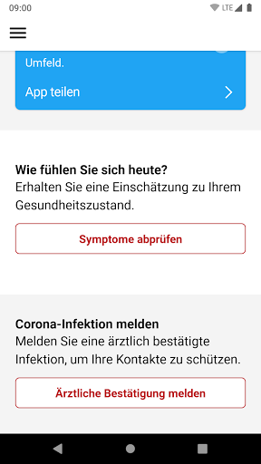
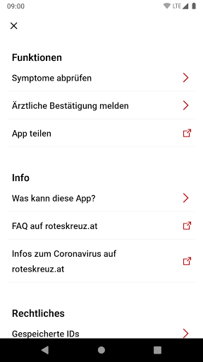
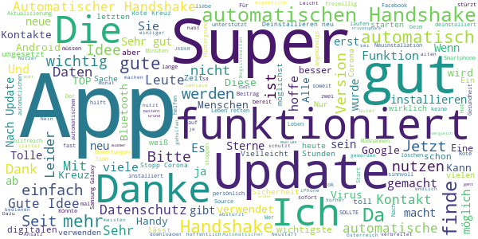
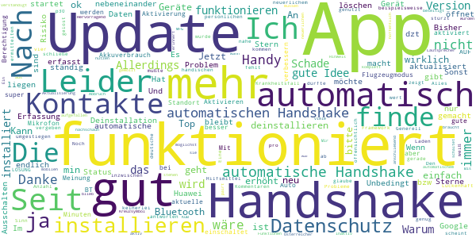
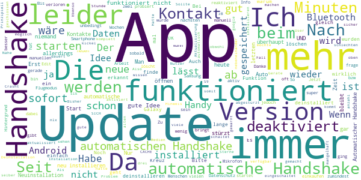
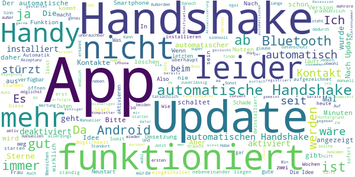

# Stopp Corona
App version ``2.0.0.1049-QA_240``

Analyzed with [covid-apps-observer](http://github.com/covid-apps-observer) project, version ``0.1``

## App overview
| | |
|-------------------------|-------------------------| 
| **Name**&nbsp;&nbsp;&nbsp;&nbsp;&nbsp;&nbsp;&nbsp;&nbsp;&nbsp;&nbsp;&nbsp;&nbsp;&nbsp;&nbsp;&nbsp;&nbsp;&nbsp;&nbsp;&nbsp;&nbsp;&nbsp;&nbsp;&nbsp;&nbsp;&nbsp;&nbsp;&nbsp;&nbsp;&nbsp;&nbsp;&nbsp;&nbsp;&nbsp;&nbsp;&nbsp;&nbsp;&nbsp;&nbsp;&nbsp;&nbsp;  | Stopp Corona |
| **Unique identifier** | at.roteskreuz.stopcorona |
| **Link to Google Play** | [https://play.google.com/store/apps/details?id=at.roteskreuz.stopcorona](https://play.google.com/store/apps/details?id=at.roteskreuz.stopcorona) |
| **Summary**  | Österreichs Corona-Warnungs-App |
| **Privacy policy** | [https://www.roteskreuz.at/site/faq-app-stopp-corona/datenschutzinformation-zur-stopp-corona-app/](https://www.roteskreuz.at/site/faq-app-stopp-corona/datenschutzinformation-zur-stopp-corona-app/) |
| **Latest version** | 2.0.0.1049-QA_240 |
| **Last update** | 2020-06-26 00:22:24 |
| **Recent changes** | Exposure Notification Build Kleine Anpassungen |
| **Installs**  | 100.000+ |
| **Category** | Medizin |
| **First release** | 25.03.2020 |
| **Size**  | 5,3M |
| **Supported Android version**  | 6.0 oder höher |

### Description
> Das Österreichische Rote Kreuz veröffentlicht die “Stopp Corona”-App im Auftrag des Gesundheitsministeriums, der obersten Gesundheitsbehörde Österreichs. 
 Mit der „Stopp Corona“-App lassen sich Begegnungen mit Freunden, der Familie oder Arbeitskollegen ganz einfach und anonymisiert speichern. Sollten Sie sich mit Corona infizieren, können Sie einfach über die App eine Meldung abgeben und Ihre Kontakte aus den letzten 2 Tagen werden anonym benachrichtigt. 
 Das gleiche gilt natürlich umgekehrt. Gibt eine Ihrer gespeicherten Begegnungen an, sich infiziert zu haben, erhalten Sie umgehend eine Nachricht und Sie können entsprechende Maßnahmen ergreifen. Dazu zählen vor allem:
 -	Abstand halten
 -	Soziale Kontakte vermeiden
 -	Sich vorsichtshalber in Selbstisolation begeben
 Beim Einsetzen von Symptomen kontaktieren Sie bitte telefonisch ihre Hausärztin oder den Hausarzt. Wenn das nicht möglich ist, rufen Sie die die Nummer 1450 an.
 Jedenfalls gilt: Bitte nicht die Ärztin/oder den Arzt persönlich aufsuchen und auch nicht ins Krankenhaus fahren. Bei einem medizinischen Notfall: 144 rufen.
 Gemeinsam unterbrechen wir so die Infektionskette.
 So schützen Sie nicht nur sich selbst, sondern verhindern auch, dass andere sich infizieren.
 Nutze Sie den digitalen Handshake
 Bis wir uns wieder unbedacht die Hände bei der Begrüßung reichen können, wird es wohl noch einige Zeit dauern. In der Zwischenzeit nutzen Sie einfach den digitalen Handshake der „Stopp Corona“-App.
 Haben Sie und die Person mit der Sie sich treffen die App installiert, speichert die App, dass Sie sich getroffen haben. Diese Daten werden anonymisiert gespeichert. Erkrankt einer von Ihnen beiden an dem Corona-Virus, erhält der andere eine Nachricht.
 Machen Sie den Corona-Selbstcheck
 Wie geht es Ihnen heute? Anhand eines klinisch geprüften Fragebogens können Sie sich täglich auf Corona-Symptome überprüfen.
 Corona-Verdachtsmeldung
 Entsprechen die Symptome dem Corona-Virus, können Sie eine Meldung über die App abgeben. Das ist wichtig, damit sich nicht noch mehr Menschen mit dem Virus infizieren. Ihre Begegnungen werden dann anonymisiert benachrichtigt. Keine Sorge, sie erhalten also keine persönlichen Angaben. 
 Anschließend bleiben Sie bitte Zuhause und kontaktieren Sie Ihre Hausärztin oder Ihren Hausarzt telefonisch. Wenn das nicht möglich ist rufen Sie die Nummer 1450 an.
 Fahren Sie nicht ins Krankenhaus und suchen Sie Ihren Arzt nicht persönlich auf.
 Ärztliche Bestätigung
 Stellt ein Arzt den Corona-Virus fest, können Sie ebenfalls eine Meldung abgeben. Auch hier werden Ihre Begegnungen anonymisiert benachrichtigt.
 Die App entstand in Partnerschaft mit der UNIQA Stiftung.
 Konzept und Realisierung in Zusammenarbeit und mit Unterstützung von Accenture Österreich und basiert auf dem Contacttracing-Framework von Apple und Google
 Schau auf Dich. Schau auf mich. So schützen wir uns.
 Link zum Open Source Software Projekt: https://github.com/austrianredcross/stopp-corona-android

### User interface
The developers of the app provide the following screenshots in the Google play store.
| | | |
|:-------------------------:|:-------------------------:|:-------------------------:|
 |   |   |   | 
 |   |   |   | 
 |   |  

## Development team
In the following we report the main information provided by the development team in the Google play store.

| | |
|-------------------------|-------------------------|
| **Developer**  | Österreichisches Rotes Kreuz |
| **Website**  | [https://www.roteskreuz.at](https://www.roteskreuz.at) |
| **Email** | service@roteskreuz.at |
| **Physical address**  | [Wiedner Hauptstrasse 32 1040 Wien Österreich](https://www.google.com/maps/search/Wiedner%20Hauptstrasse%2032%201040%20Wien%20Österreich) (Google Maps) |
| **Other developed apps**  | [https://play.google.com/store/apps/developer?id=%C3%96sterreichisches+Rotes+Kreuz](https://play.google.com/store/apps/developer?id=%C3%96sterreichisches+Rotes+Kreuz) |

## Android support

| | |
|-------------------------|-------------------------|
| **Declared target Android version**  | Pie, version 9 (API level 28) |
| **Effective target Android version**  | Pie, version 9 (API level 28) |
| **Minimum supported Android version**  | Marshmallow, version 6.0 (API level 23) |
| **Maximum target Android version**  | - |

The larger the difference between the minimum and maximum supported Android versions, the better. A larger difference means a wider audience. For example, old phones have a very low Android version, so a high minimum supported Android version means that the app cannot be used by users with old phones, thus leading to accessibility problems. 

## Requested permissions

In the following we report the complete list of the permissions requested by the app. 

| **Permission** | **Protection level** | **Description** | 
|-------------------------|-------------------------|-------------------------|
 **android.permission ACCESS_NETWORK_STATE** | Normal | Allows applications to access information about networks. 
 **android.permission BLUETOOTH** | Normal | Allows applications to connect to paired bluetooth devices. 
 **android.permission FOREGROUND_SERVICE** | Normal | Allows a regular application to use Service.startForeground. 
 **android.permission INTERNET** | Normal | Allows applications to open network sockets. 
 **android.permission RECEIVE_BOOT_COMPLETED** | Normal | Allows an application to receive the Intent.ACTION_BOOT_COMPLETED that is broadcast after the system finishes booting. 
 **android.permission WAKE_LOCK** | Normal | Allows using PowerManager WakeLocks to keep processor from sleeping or screen from dimming. 

## Mentioned servers

| **Server** | **Registrant** | **Registrant country** | **Creation date** | 
|-------------------------|-------------------------|-------------------------|-------------------------|
 | google.com | Google LLC | :us: US | 1997-09-15 04:00:00 |
 | prod-rca-coronaapp-fd.net | Domains By Proxy, LLC | :us: US | 2020-04-20 20:16:19 |

## Security analysis 

Below we report the main security warnings raised by our execution of the [Androwarn](https://github.com/maaaaz/androwarn) security analysis tool.

**Connection interfaces exfiltration**
> - This application reads details about the currently active data network 
> - This application tries to find out if the currently active data network is metered 

**Telephony services abuse**
> - This application makes phone calls 

**Suspicious connection establishment**
> - This application opens a Socket and connects it to the remote address '; port is out of range' on the 'N/A' port  
> - This application opens a Socket and connects it to the remote address 'Ljava/net/Proxy;->type()Ljava/net/Proxy$Type;' on the 'N/A' port  
> - This application opens a Socket and connects it to the remote address 'Lo/b/a/a/a;->i(Ljava/lang/String;)Ljava/lang/StringBuilder;' on the 'N/A' port  
> - This application opens a Socket and connects it to the remote address 'timeout' on the 'N/A' port  

## User ratings and reviews

Below we provide information about how end users are reacting to the app in terms of ratings and reviews in the Google Play store.

### Ratings

The Stopp Corona app has been installed by more than **100000** times. At this time, **2491** rated the app and its average score is **2.7886178**. Below we show the distribution of the ratings across the usual star-based rating of Google Play

:star::star::star::star::star:: 799

:star::star::star::star:: 222

:star::star::star:: 222

:star::star:: 141

:star:: 1103

### Reviews 

#### 5-star reviews

> Seit dem letzten Update lässt sich die App nicht mehr starten. Vorher war alles ok. UPDATE: Deinstallieren und neu installieren hat geholfen. Es werden zwar alle vorher gespeicherten Kontakte gelöscht, die App funktioniert aber wieder wie gewohnt.  :date: __2020-06-28 17:18:39__

> Musst habe  :date: __2020-06-28 15:37:44__

> Weiß noch nicht  :date: __2020-06-28 06:50:03__

> Neue app stürzt sofort ab, vorige funktionierte. Deinstalliert, Neustart, neu installiert. Alles ok!!!  :date: __2020-06-27 18:52:55__

> super...  :date: __2020-06-27 17:31:16__

> Bitte die Vorgängerversion deinstallieren. Das aktualisieren brachte nur Abstürze.  :date: __2020-06-27 12:02:32__

> Nein ich habe keine Erfahrungen. Nein ich möchte eigentlich auch keine machen. Ich halte aber die Möglichkeiten die die App eröffnet für sehr nützlich!  :date: __2020-06-27 10:14:18__

> Sie funktioniert endlich!!  :date: __2020-06-27 09:38:02__

> Super  :date: __2020-06-27 09:12:36__

> SOLLTE JEDER NUTZEN!!!  :date: __2020-06-27 09:11:05__

#### 4-star reviews

> Generell finde ich es gut, dass auf das Google-Framework umgestiegen wurde. Allerdings gibt es keinen Status über Kontakte. Die deutsche App zeigt beispielsweise einen persönlichen Risiko Status. Ich glaube so etwas fehlt hier einfach ...  :date: __2020-06-27 18:50:33__

> Nach dem Update stürzt die App ab. Nach dem händischen löschen der Daten dürfte wieder Alles funktionieren  :date: __2020-06-27 15:46:27__

> Kann nur mit "weiß nicht" antworten, da ich gerade aktualisiert habe und die app nicht mehr funktioniert. Bisher hatte ich keinerlei Probleme. Den Stern mußte ich vergeben, ist sie aber dzt nicht wert. Schade. Update : habe auf vier Sterne erhöht, denn nach der Deinstallation und neuerlichem Laden der App scheint diese jetzt zu funktionieren.  :date: __2020-06-27 11:11:56__

> Jetzt funktioniert endlich alles automatisch!  :date: __2020-06-27 08:20:57__

> Nach Update startet die App leider nicht mehr. LÖSUNG: Deinstallieren und wieder installieren hat das Problem gelöst.  :date: __2020-06-27 07:43:26__

> seit update öffnet sich die app nicht mehr!! Huawei p30 pro  :date: __2020-06-26 23:36:52__

> Ich schließe mich den anderen Kommentaren an. Die App macht nur Sinn, wenn sie automatisch Kontakte erfasst! Und auch dann ist die Erfassung noch Lückenhaft, weil nicht jeder die App installieren wird. Die Erfassung von Gerät zu Gerät funktioniert auch nur, wenn die Geräte sich nahe genug kommen. Update: inzwischen werden Kontakte ja automatisch erfasst. Allerdings wird sie offensichtlich nicht sehr viel genutzt. Seit der 1. Version habe ich 0 Kontakte. Schade, wäre ein gutes Hilfsmittel.  :date: __2020-06-26 19:53:30__

> Noch keine  :date: __2020-06-26 19:38:30__

> Seit meinem Update funktioniert das App nicht mehr, öffnet sich nicht. Hat bis jetzt immer funktioniert.  :date: __2020-06-26 17:42:47__

> Eine Anzahl der ermittelten Kontakte, die im Krankheitsfall verständigt würden, wäre gut. 26.6.2020: Nach Aktualisierung blieb APP ständig stehen. Ich musste deinstallieren und neu installieren, jetzt funktioniert sie. 10.6.2020: Problem mit automatischem Handshake ist noch immer, wann wird es beseitigt????? 7.6.2020 Warum schaltet sich der automatische Handshake immer wieder aus, ist das so gewollt ????? Hervorragend, hoffentlich nutzen diese App möglichst viele Österreicher🤗🤗  :date: __2020-06-26 16:15:06__

#### 3-star reviews

> Ich  :date: __2020-06-28 17:45:17__

> Man muss seit dem letzten Update die app neu installieren dann funktioniert es wieder  :date: __2020-06-28 13:01:16__

> Nach Update ließ sich die App nicht mehr starten, nur löschen und neu installieren half. Sowas darf nicht passieren.  :date: __2020-06-28 01:24:34__

> Hmm, die App ist installiert, der automatische Handshake eingeschaltet. Ob die Anwendung allerdings funktioniert steht in den Sternen und ist nicht kontrollierbar. Wenigstens eine Anzeige wie viele Kontakte gespeichert wurden wäre schon ein Indiz ob die App funktioniert oder nicht.  :date: __2020-06-27 09:46:16__

> Seit dem gestrigen Update lässt sich das App nicht mehr öffnen  :date: __2020-06-27 09:31:25__

> Man kann leider nicht sehen ob die App überhaupt einen Handshake mit einem anderen Gerät gemacht hat.  :date: __2020-06-27 09:14:15__

> Crasht beim starten seit update heute htc u11 plus android 9 Nach löschen der daten funktioniert die app dann  :date: __2020-06-27 08:41:06__

> Bitte löscht die alte Version im PlayStore! Nach der Installation war ein Update erforderlich und schon war die App nicht mehr startbar. Das wird einige User zu einer schlechten Wertung bewegen.  :date: __2020-06-27 07:47:44__

> Seit dem Update von Ende Juni lässt sich die App nicht mehr starten. So wird das nix mit der Aktzeptanz.  :date: __2020-06-27 07:29:35__

> Die neue Version stürzt immer sofort beim Start ab. Auch nach Reboot. Galaxy S9+. Update: Nach kompletter Deinstallation und Neuinstallation funktioniert die App jetzt.  :date: __2020-06-27 07:05:53__

#### 2-star reviews

> Seit dem letzten Update stürzt die App ab Handy habe ich bereits neu gestartet. Danach die App komplett gelöscht und neu installiert, jetzt funktioniert sie Was bedeut jeder einzelne Status? Beim Handshake "pausiert?  :date: __2020-06-28 17:20:48__

> Gut gemeint, stürzt aber seit dem letzten Update einfach ab.  :date: __2020-06-28 14:52:32__

> Es steht in den rechtlichen Informationen, dass man das Kontaktprotokoll löschen könnte, aber es werden mir, im Gegensatz zu früher, gar keine gefundenen Kontakte mehr angezeigt, nicht einmal mein eigenes Handy! Wo finde ich dieses Protokoll?  :date: __2020-06-28 14:33:51__

> Wie soll ich wissen, ob dieses Ding überhaupt funktioniert und Kontakte sammelt? Mehrere Sterne Anzüge für miserable Usability. Das Beratungsunternehmen hätte ich auch gerne, dass diese App entwickelt. Da kann das Rote Kreuz nix dafür.  :date: __2020-06-28 14:28:57__

> Die App hat jetzt den neuen Handshake. Ob die App damit besser funktioniert, kann ich nicht beurteilen, da es scheinbar keine einsehbare Liste gibt. Bitte mehr Info anzeigen!  :date: __2020-06-28 11:49:30__

> Wie kann ich kontrollieren, ob der automatische Handshake mit meinem Handy überhaupt zuverlässig funktioniert, wenn die Anzahl der Kontakte nicht mehr angezeigt wird?  :date: __2020-06-28 07:54:58__

> Funkt nach Update gar nicht mehr, und stürzt nach Start ohne Meldung ab. Erst nach dem Löschen der alten Daten startet die App. Bitte diesen Bug asap fixen!  :date: __2020-06-27 19:24:48__

> Ich habe die App dreimal installiert (nach groß angekündigten Updates) und wieder deinstalliert: die ersten beiden Male funktionierte sie nicht bzw ließ sich nicht zufriedenstellend steuern. Brauchte zu viel Strom. Beim dritten Mal stimmte der Energieverbrauch, allerdings waren meine anderen Bluetooth-Geräte nicht mehr erreichbar. Bei allen drei Installationen wurde kein einziger digitaler Handshake registriert. Endgültige Deinstallation. 2Sterne für Datenschutz, 0 für Funktion; Android 7.0  :date: __2020-06-27 18:00:03__

> Weder automatischer noch manueller Handshake zwischen ios und Android funktionieren. Auf Android wird die Begegnung angezeigt. Am iPhone wird die Begegnung nicht angezeigt. Nach dem Update hat man leider keine Möglichkeit mehr erfolgte Handshakes nachzuvollziehen.  :date: __2020-06-27 08:32:02__

> Seit dem Update lässt sich die App nicht mehr öffnen Update: ich habe die App komplett deinstalliert und neuerlich installiert. Jetzt funktioniert sie.  :date: __2020-06-27 07:05:38__

#### 1-star reviews

> Idee ist gut, aber .... ... nach Update immer kommentarloser Absturz, deinstallieren und neu installieren löst zwar dieses Problem, aber damit ist auch das Vertrauen in die App (Entwickler) weg :( ... wie erkennt man ob die App läuft (geöffnet ist) und Kontakte aufzeichnet? Wenn nicht einmal das Update geschafft wurde, dann kann man dem sicherlich nicht vertrauen --> unbedingt ergänzen!!! ... wenn ich regelmäßig alle Apps schließe, was passiert dann mit der Corona App? Zeichnet diese noch auf?  :date: __2020-06-28 19:12:44__

> Leider startet der Download nicht einmal. Android. 6.0.2 sollte funktionieren, tut es aber nicht. Nach löschen der alten Version und etwa 10 download Versuchen zwischendurch auch Neustart gemacht kein Ergebnis. Muss nun ohne Corona App leben.  :date: __2020-06-28 16:43:14__

> Und es geht weiter. Accenture wird mit Millionen überschüttet für eine Müll App die nicht im geringsten funktioniert. Wann wird hier die finanzielle Notbremse gezogen? Wer kassiert hier wieder mit?  :date: __2020-06-28 14:23:38__

> Letztes update - app stürzt sofort ab....  :date: __2020-06-28 12:40:17__

> Handy abgestürzt, schwer wieder in Gang zu bringen. Bei kaputt, wer zahlt für den Schaden??? Tracings haben nie funktioniert, war mehrfach stundenlang bei Ärzten oder Spitälern, immer on, kein einziger Kontakt erkannt. Stromfresser und für den Hausmüll?!! Tolle Leistung rotes Kreuz!  :date: __2020-06-28 12:31:05__

> Wieso braucht die neue Version meinen Standort? Damit ist die App für mich gestorben!  :date: __2020-06-28 11:18:50__

> unbrauchbar und ärgerlich. Das rote Kreuz sollte sich lieber auf seine Kernkompetenzen beschränken, da sind sie echt gut.  :date: __2020-06-28 10:15:14__

> - Diese App kann nichts, außer...äh...? - Kann nach dem Update nicht mehr gestartet werden. Daraufhin muss der Cache gelöscht werden. Wenn es stimmt, was andere Personen schreiben, so ist nun auch absolut nicht mehr nachvollziehbar, ob die App gerade läuft, matched bzw. überhaupt funktioniert. Kann das leider nicht beurteilen...Die App bleibt bei mir auf "pausiert" trotz aktivem Bluetooth und Berechtigung. Bin auf die deutsche "Corona-Warn-App" umgestiegen. Hoffe auf Leute die folgen.  :date: __2020-06-28 09:39:42__

> 28.6.2020: Nun ist überhaupt nicht mehr erkennbar, ob die App funktioniert, weil gefundene Kontakte verborgen werden...weshalb wohl? Wenn das als 'Blackbox' bleibt, werde ich die App endgültig löschen....sorry, so geht's für mich nicht.  :date: __2020-06-28 08:23:57__

> Stürzt leider sofort ab. Nokia 8.1, Android 10  :date: __2020-06-28 07:44:01__

