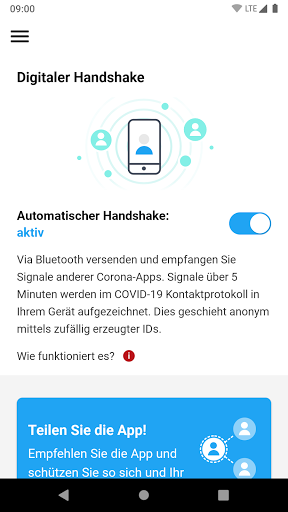
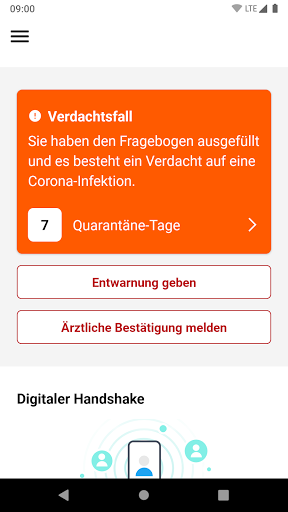
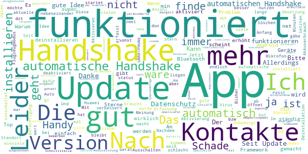
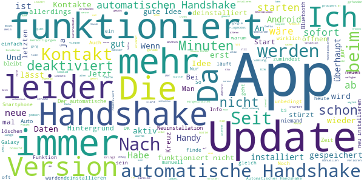
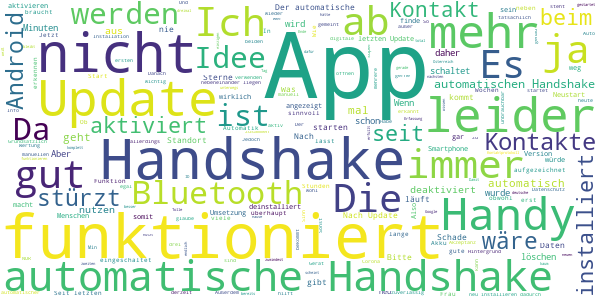
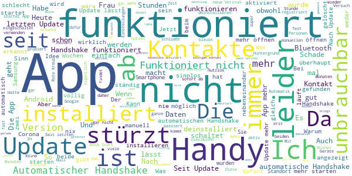

# Stopp Corona
App version ``2.0.3.1057-QA_245``

Analyzed with [covid-apps-observer](http://github.com/covid-apps-observer) project, version ``0.1``

## App overview
| | |
|-------------------------|-------------------------| 
| **Name**&nbsp;&nbsp;&nbsp;&nbsp;&nbsp;&nbsp;&nbsp;&nbsp;&nbsp;&nbsp;&nbsp;&nbsp;&nbsp;&nbsp;&nbsp;&nbsp;&nbsp;&nbsp;&nbsp;&nbsp;&nbsp;&nbsp;&nbsp;&nbsp;&nbsp;&nbsp;&nbsp;&nbsp;&nbsp;&nbsp;&nbsp;&nbsp;&nbsp;&nbsp;&nbsp;&nbsp;&nbsp;&nbsp;&nbsp;&nbsp;  | Stopp Corona |
| **Unique identifier** | at.roteskreuz.stopcorona |
| **Link to Google Play** | [https://play.google.com/store/apps/details?id=at.roteskreuz.stopcorona](https://play.google.com/store/apps/details?id=at.roteskreuz.stopcorona) |
| **Summary**  | Österreichs Corona-Warnungs-App |
| **Privacy policy** | [https://www.roteskreuz.at/site/faq-app-stopp-corona/datenschutzinformation-zur-stopp-corona-app/](https://www.roteskreuz.at/site/faq-app-stopp-corona/datenschutzinformation-zur-stopp-corona-app/) |
| **Latest version** | 2.0.3.1057-QA_245 |
| **Last update** | 2020-06-28 11:21:18 |
| **Recent changes** | Absturz bei Update behoben  |
| **Installs**  | 100.000+ |
| **Category** | Medizin |
| **First release** | 25.03.2020 |
| **Size**  | 5,3M |
| **Supported Android version**  | 6.0 oder höher |

### Description
> Das Österreichische Rote Kreuz veröffentlicht die “Stopp Corona”-App im Auftrag des Gesundheitsministeriums, der obersten Gesundheitsbehörde Österreichs. 
 Mit der „Stopp Corona“-App lassen sich Begegnungen mit Freunden, der Familie oder Arbeitskollegen ganz einfach und anonymisiert speichern. Sollten Sie sich mit Corona infizieren, können Sie einfach über die App eine Meldung abgeben und Ihre Kontakte aus den letzten 2 Tagen werden anonym benachrichtigt. 
 Das gleiche gilt natürlich umgekehrt. Gibt eine Ihrer gespeicherten Begegnungen an, sich infiziert zu haben, erhalten Sie umgehend eine Nachricht und Sie können entsprechende Maßnahmen ergreifen. Dazu zählen vor allem:
 -	Abstand halten
 -	Soziale Kontakte vermeiden
 -	Sich vorsichtshalber in Selbstisolation begeben
 Beim Einsetzen von Symptomen kontaktieren Sie bitte telefonisch ihre Hausärztin oder den Hausarzt. Wenn das nicht möglich ist, rufen Sie die die Nummer 1450 an.
 Jedenfalls gilt: Bitte nicht die Ärztin/oder den Arzt persönlich aufsuchen und auch nicht ins Krankenhaus fahren. Bei einem medizinischen Notfall: 144 rufen.
 Gemeinsam unterbrechen wir so die Infektionskette.
 So schützen Sie nicht nur sich selbst, sondern verhindern auch, dass andere sich infizieren.
 Nutze Sie den digitalen Handshake
 Bis wir uns wieder unbedacht die Hände bei der Begrüßung reichen können, wird es wohl noch einige Zeit dauern. In der Zwischenzeit nutzen Sie einfach den digitalen Handshake der „Stopp Corona“-App.
 Haben Sie und die Person mit der Sie sich treffen die App installiert, speichert die App, dass Sie sich getroffen haben. Diese Daten werden anonymisiert gespeichert. Erkrankt einer von Ihnen beiden an dem Corona-Virus, erhält der andere eine Nachricht.
 Machen Sie den Corona-Selbstcheck
 Wie geht es Ihnen heute? Anhand eines klinisch geprüften Fragebogens können Sie sich täglich auf Corona-Symptome überprüfen.
 Corona-Verdachtsmeldung
 Entsprechen die Symptome dem Corona-Virus, können Sie eine Meldung über die App abgeben. Das ist wichtig, damit sich nicht noch mehr Menschen mit dem Virus infizieren. Ihre Begegnungen werden dann anonymisiert benachrichtigt. Keine Sorge, sie erhalten also keine persönlichen Angaben. 
 Anschließend bleiben Sie bitte Zuhause und kontaktieren Sie Ihre Hausärztin oder Ihren Hausarzt telefonisch. Wenn das nicht möglich ist rufen Sie die Nummer 1450 an.
 Fahren Sie nicht ins Krankenhaus und suchen Sie Ihren Arzt nicht persönlich auf.
 Ärztliche Bestätigung
 Stellt ein Arzt den Corona-Virus fest, können Sie ebenfalls eine Meldung abgeben. Auch hier werden Ihre Begegnungen anonymisiert benachrichtigt.
 Die App entstand in Partnerschaft mit der UNIQA Stiftung.
 Konzept und Realisierung in Zusammenarbeit und mit Unterstützung von Accenture Österreich und basiert auf dem Contacttracing-Framework von Apple und Google
 Schau auf Dich. Schau auf mich. So schützen wir uns.
 Link zum Open Source Software Projekt: https://github.com/austrianredcross/stopp-corona-android

### User interface
The developers of the app provide the following screenshots in the Google play store.
| | | |
|:-------------------------:|:-------------------------:|:-------------------------:|
 |   |   |   | 
 |   |   |   | 
 |   |  

## Development team
In the following we report the main information provided by the development team in the Google play store.

| | |
|-------------------------|-------------------------|
| **Developer**  | Österreichisches Rotes Kreuz |
| **Website**  | [https://www.roteskreuz.at](https://www.roteskreuz.at) |
| **Email** | service@roteskreuz.at |
| **Physical address**  | [Wiedner Hauptstrasse 32 1040 Wien Österreich](https://www.google.com/maps/search/Wiedner%20Hauptstrasse%2032%201040%20Wien%20Österreich) (Google Maps) |
| **Other developed apps**  | [https://play.google.com/store/apps/developer?id=%C3%96sterreichisches+Rotes+Kreuz](https://play.google.com/store/apps/developer?id=%C3%96sterreichisches+Rotes+Kreuz) |

## Android support

| | |
|-------------------------|-------------------------|
| **Declared target Android version**  | Pie, version 9 (API level 28) |
| **Effective target Android version**  | Pie, version 9 (API level 28) |
| **Minimum supported Android version**  | Marshmallow, version 6.0 (API level 23) |
| **Maximum target Android version**  | - |

The larger the difference between the minimum and maximum supported Android versions, the better. A larger difference means a wider audience. For example, old phones have a very low Android version, so a high minimum supported Android version means that the app cannot be used by users with old phones, thus leading to accessibility problems. 

## Requested permissions

In the following we report the complete list of the permissions requested by the app. 

| **Permission** | **Protection level** | **Description** | 
|-------------------------|-------------------------|-------------------------|
 **android.permission ACCESS_NETWORK_STATE** | Normal | Allows applications to access information about networks. 
 **android.permission BLUETOOTH** | Normal | Allows applications to connect to paired bluetooth devices. 
 **android.permission FOREGROUND_SERVICE** | Normal | Allows a regular application to use Service.startForeground. 
 **android.permission INTERNET** | Normal | Allows applications to open network sockets. 
 **android.permission RECEIVE_BOOT_COMPLETED** | Normal | Allows an application to receive the Intent.ACTION_BOOT_COMPLETED that is broadcast after the system finishes booting. 
 **android.permission WAKE_LOCK** | Normal | Allows using PowerManager WakeLocks to keep processor from sleeping or screen from dimming. 

## Mentioned servers

| **Server** | **Registrant** | **Registrant country** | **Creation date** | 
|-------------------------|-------------------------|-------------------------|-------------------------|
 | google.com | Google LLC | :us: US | 1997-09-15 04:00:00 |
 | prod-rca-coronaapp-fd.net | Domains By Proxy, LLC | :us: US | 2020-04-20 20:16:19 |

## Security analysis 

Below we report the main security warnings raised by our execution of the [Androwarn](https://github.com/maaaaz/androwarn) security analysis tool.

**Connection interfaces exfiltration**
> - This application reads details about the currently active data network 
> - This application tries to find out if the currently active data network is metered 

**Telephony services abuse**
> - This application makes phone calls 

**Suspicious connection establishment**
> - This application opens a Socket and connects it to the remote address '; port is out of range' on the 'N/A' port  
> - This application opens a Socket and connects it to the remote address 'Ljava/net/Proxy;->type()Ljava/net/Proxy$Type;' on the 'N/A' port  
> - This application opens a Socket and connects it to the remote address 'Lo/b/a/a/a;->i(Ljava/lang/String;)Ljava/lang/StringBuilder;' on the 'N/A' port  
> - This application opens a Socket and connects it to the remote address 'timeout' on the 'N/A' port  

## User ratings and reviews

Below we provide information about how end users are reacting to the app in terms of ratings and reviews in the Google Play store.

### Ratings

The Stopp Corona app has been installed by more than **100000** times. At this time, **2583** rated the app and its average score is **3.0466926**. Below we show the distribution of the ratings across the usual star-based rating of Google Play

:star::star::star::star::star:: 924

:star::star::star::star:: 261

:star::star::star:: 301

:star::star:: 201

:star:: 894

### Reviews 

#### 5-star reviews

> Jetzt verwendet die App die Exposure Notification API von Apple und Google. Da die App bzgl. Datenschutz völlig unbedenklich ist, gilt für mich das Motto "Hilfts ned, schods ned"  :date: __2020-07-10 07:52:39__

> Solange Quellcode nicht öffentlich ist nur ein Stern. Macht was Epiccenter.works vorschlägt für Datenschutz.  :date: __2020-07-09 12:27:48__

> Sehr gut  :date: __2020-07-09 10:45:41__

> Automatischer Handshake scheint jetzt zu funktionieren. Leider sehe ich nirgends wie viele Kontakte zu Personen ich hatte, um zu verifizieren ob es klappt.  :date: __2020-07-08 09:45:12__

> Funktioniert und wird gemäß Protokoll in meinem Umfeld auch genutzt.  :date: __2020-07-08 07:24:57__

> Sehr Gute App zum Selbstschutz und den der Anderen VOR VERBREITUNG Der Tödlichen LUNGENKRANKHEIT SARS - COVID 19  :date: __2020-07-08 06:05:50__

> Gut  :date: __2020-07-07 18:32:22__

> Fünf Sterne, weil die breite Nutzung der App enorm wichtig, für manchen vielleicht sogar lebenswichtig sein kann. -- Handshake sollte unbedingt automatisch erfolgen. -- Für Laien auf der Hauptseite deutlich erkennbar anzeigen, ob alle Bedingungen erfüllt sind (grüner Haken für Bluetooth, grüner Haken für Standort, ...) -- Wieso ist Berechtigung für Standort erforderlich? Bluetooth funktioniert eh nur auf 10 Meter. Wenn beide Telefone innerhalb dieses Bereichs sind --> Handshake  :date: __2020-07-07 16:23:27__

> Geht in Ordnung  :date: __2020-07-07 15:18:35__

> Sollte man haben! Die App sollte man als Österreicher der unter Menschen unterwegs ist auf jeden Fall aktuell haben. Datenschutz scheint gewährleistet und die App funktioniert mittlerweile wohl ausreichend zuverlässig  :date: __2020-07-07 14:57:25__

#### 4-star reviews

> Update unten! Seit dem Update stürzt die App sofort nach dem Start ab. War aber ohnehin vorher schon nicht zu brauchen, da man gefühlt 50 mal am Tag den automatischen Handshake aktivieren musste, ohne den sie komplett nutzlos ist. Hätte gerne einen Betrag geleistet, aber so ist das leider sinnlos. Update: Es war nötig, die gespeicherten Daten in den App-Einstellungen zu löschen, seither funktioniert die App. Dieser Fehler gehört dringend gefixt! Ansonsten funktioniert die App gut!  :date: __2020-07-08 10:40:42__

> Die App funktioniert derzeit.... Ich hoffe, es bleibt so.  :date: __2020-07-07 15:21:22__

> Das letzte Update, das die spezielle Covid19 Schnittstelle von Android verwendet, hat nun auch diese App brauchbar gemacht. Der automatische Handshake funktioniert jetzt dauerhaft, eine verminderte Akkuleistung ist nicht zu bemerken. Schade nur, dass man nicht ermitteln kann, ob man bereits Kontakte gehabt hat.  :date: __2020-07-04 11:10:09__

> Die Idee ist gut, leider mangelt es an der Umsetzung. Der automatische Handshake deaktiviert sich ständig von selbst und auch wenn er aktiviert ist, habe ich im Test mit zwei Android-Smartphones bis jetzt keinen Kontakt aufgezeichnet. Bitte analysiert mal die Funktionalität in einem Feldtest und bessert nach. Update: Automatischer Handshake funktioniert nun manchmal UPDATE: Das Problem mit dem deaktivieren wurde behoben 👍  :date: __2020-07-03 22:43:31__

> Zeitgeschichte i  :date: __2020-07-03 18:25:15__

> Nach dem holprigen Update läuft alles soweit. Nur man hat keine Möglichkeit mehr, zu sehen wieviele Handshakes jetzt wirklich zu Stande kommen. Das ist schade.  :date: __2020-07-02 23:30:45__

> Der Hauptkritikpunkt von vielen ist in der aktuellen Version jetzt inkludiert. Der automatische Handshake geht jetzt unter Android und iOS. Danke für das entsprechende Framework liebe OS Hersteller. Keine Ahnung, ob die Frameworks es nicht hergeben oder es bewusst nicht eingebaut ist, dass die Anzahl der Kontakte nicht mehr angezeigt wird. Nachdem das Virus ein ziemliches Chamäleon ist, sollte die Symptomabfrage vielleicht ein bisschen erweitert werden.  :date: __2020-07-02 15:39:53__

> Woher weiß man ob es funktioniert?  :date: __2020-07-01 20:42:43__

> Wenn ma a potzn Handy hot braucht ma sich net wundern wenn es net geht. APP do don no a App don glei die nächste. Jeder hot so fü klumpatt am Handy obm das irgent aApp net funktioniert des is so. TYPISCH immer des BABYVERHALTEN.  :date: __2020-06-30 19:32:05__

> Passt alles  :date: __2020-06-30 19:10:17__

#### 3-star reviews

> Mit einem älteren Handy kann man die App nicht downloaden  :date: __2020-07-10 12:03:42__

> Die Idee ist gut, aber unter Android 9 muss man die App immer neu starten, läuft nicht im Hintergrund. Bei der neuen Version kann man nicht überprüfen ob die App im Hintergrund läuft, und der Akku Verbrauch ist gestiegen.  :date: __2020-07-06 18:44:38__

> Ich habe schon 2 Mal Push Benachrichtigung erhalten, konnte aber nur den halben ersten Satz lesen, beim wegwischen war die Nachrichten verschwunden und in der App ist nichts ersichtlich  :date: __2020-07-02 18:34:30__

> Eben erst gestartet  :date: __2020-07-01 23:59:40__

> An sich eine suoer App, nur leider fehlt die eigene Einsicht um das Vertrauen zu stärken. Beispielsweise wie viele andere IDs ich schon empfangen habe, die die app verwenden. Das ist eine Anonyme Info die für jeden zugänglich sein sollte  :date: __2020-07-01 22:33:23__

> Die Infos sind teils unklar. Oft hat man Zweifel ob sie überhaupt funktioniert oder funktionieren kann.  :date: __2020-07-01 18:06:27__

> Die Vorversion hätte 5 Sterne bekommen, weil in der obersten Bildschirmzeile ein Kreuz angezeigt hat dass die Rotkreuz App im Hintergrund läuft. Jetzt sehe ich das nicht mehr und habe auch keine Möglichkeit gefunden das einzustellen. Jetzt weiß ich daher nicht, ob sie aktiv ist oder nicht. Das ist sehr schade.  :date: __2020-07-01 13:27:12__

> Funktioniert bei mir nicht Idee ist super aber sinnlos wenn Kontakt (e) nicht automatisch gespeichert werden. Verwende die App seit Anfang an.... Und gebe nicht auf, das es irgendwann doch klappt;)  :date: __2020-07-01 12:31:22__

> Woher weiß ich ob die App aktiv ist ohne Benachrichtigungssymbol? Die kann aktiv sein, oder aber auch nicht. Da gehört unbedingt ein Statussymbol her!!!  :date: __2020-06-30 14:02:12__

> Jetzt gilt plötzlich 5min als krit. Grenze und man sieht überhaupt nix mehr an Kontakten. SO kann man Kritik an mangelnder Kontaktfeststellung etc. auch entgehen! :( - Deinstalliert...  :date: __2020-06-30 11:21:29__

#### 2-star reviews

> Jetzt braucht man also einen eingeschalteten Standort und Bluetooth... Der Standort saugt bei mir erstens total viel Akku und zweitens möchte ich meinen Standort nicht ununterbrochen preisgeben. Ihn immer ein und auszuschalten ist aber eine erhebliche Fehlerquellen. Ich fände eine Flächendeckenden Nutzung der App wirklich wichtig, aber so nutzt sie mir nichts.  :date: __2020-07-09 08:04:47__

> Update: In der Version 2 angeblich wesentlich besser gemacht, aber es gibt kein Log oder Journal welches die Erfassung von Kontakten ersichtlich machen würde. Damit sind die Verbesserungen als Benutzer nicht kontrollierbar. Insofern könnte die App sehr fleißig Kontakte sammeln oder aber genau so untätig sein wie zuvor.  :date: __2020-07-08 13:27:00__

> Frisst Akku ohne Ende und keiner nützt es...  :date: __2020-07-04 11:44:39__

> Leider scheint die App keine Kontakte mit App in der unmittelbaren Umgebung zu erkennen.  :date: __2020-07-04 10:29:51__

> Leider stürzt bei Update nach wie vor ab.  :date: __2020-07-03 08:26:53__

> Wie soll ich wissen, ob dieses Ding überhaupt funktioniert und Kontakte sammelt? Mehrere Sterne Abzug für miserable Usability. Das Beratungsunternehmen hätte ich auch gerne, dass diese App entwickelt. Da kann das Rote Kreuz nix dafür.  :date: __2020-07-03 07:09:30__

> Ich wollte die App neben der deutschen Corona-Warn-App nutzen, weil ich demnächst nach Österreich in den Urlaub fahre. Es funktioniert aber leider immer nur eine App.  :date: __2020-07-01 21:17:37__

> Ob die App ihre Funktion erfüllt weiß ich nicht. Was ich aber weiß ist: der Akkuverbrauch stieg nach der Installation um ein Vielfaches. App deinstalliert und der Akku hält wieder dreimal so lange. Daher unbrauchbar für mich, schade. Einen zweiten Stern für "gut gemeint".  :date: __2020-06-30 18:11:20__

> Funktioniert nicht, muss jedes Mal neu aus dem Google Playstore geöffnet werden, Fehlermeldung  :date: __2020-06-30 16:21:37__

> seit dem jüngsten update wird nicht mehr angezeigt, ob's kontakte gab - finde ich nicht gut... wie kann man erkennen, ob die app funktioniert? Tolle Idee, die gut umgesetzt werden sollte - damit viele Menschen diese nutzen. Wir brauchen keine Papierlisten mit Teilnehmern...  :date: __2020-06-30 08:24:04__

#### 1-star reviews

> lässt sich bei mir erst gar nicht installieren!  :date: __2020-07-09 23:10:20__

> Ich kann mich nicht anmelden - das "fertig" Kästchen bleibt hellgrau. Muss es wieder deinstallieren...  :date: __2020-07-09 23:04:24__

> Funktioniert nicht, obwohl ich der App uneingeschränkte Akku- und Datennutzung zugeteilt habe, damit sie ohne Hindernis im Hintergrund arbeiten kann, sowie auch Bluetooth und Standortfreigabe permanent aktiviert sind, werden dennoch keine Überprüfungen durchgeführt. Laut den Google-Einstellungen war die letzte Überprüfung vor 3 Tagen. Das macht so leider wenig Sinn.  :date: __2020-07-09 22:34:39__

> Verstehe ich die App nicht? Nach der Installation auf zwei Geräten im selben Haushalt, hat die App zwar Anfragen durchgeführt oder erhalten(???), aber keinen einzigen Treffer oder Schlüssel protokolliert. Was immer Treffer und Schlüssel für den Benutzer für eine Bedeutung haben. In der Hilfe steht zu den beiden Begriffen kein Wort. Z.z. habe ich kein Vertrauen das die App wirklich macht was sie soll.  :date: __2020-07-09 21:09:27__

> Kann nicht gleichzeitig zusammen mit deutscher Corona App verwedet werden. Das ist speziell im Grenzgebiet ganz schlecht  :date: __2020-07-09 09:20:56__

> Bei mit funktioniert das mit der Dan nicht!  :date: __2020-07-08 18:44:40__

> Ewig hat die App nicht funktioniert, feststellbar daran, dass keine manuellen Shakes möglich waren. Jetzt läuft alles automatisch, erfasste Shakes werden aber nicht angezeigt, so dass ich nicht weiß, ob die App nun funktioniert. Ich bezweifle es nach meinen Erfahrungen. Sehr ärgerlich, ich bin ein Unterstützer der Idee. Aber so geht das nicht. Bitte die deutsche App kopieren und veröffentlichen. Meine deutschen Freunde sind mit der deutschen App sehr zufrieden.  :date: __2020-07-08 16:30:51__

> Leider funktioniert die App nicht auf älteren Handy Modellen oder älterer Software. Dies sollte geändert werden! Nicht jeder hat die Möglichkeit das neueste Smartphone zu haben. Ich kenne viele Menschen, die die App gerne nutzen würden aber aufgrund der nicht kompatibelen Software laden können. Darum nur ein Stern!  :date: __2020-07-08 08:39:20__

> Obwohl bt aktiviert ist zeigt die App an Problem mit der expositonsbenachrichrigung.  :date: __2020-07-07 21:15:59__

> Fragt noch immer nach Standortberechtigung. hauen Sie sich über die Häuser.  :date: __2020-07-07 10:02:04__

