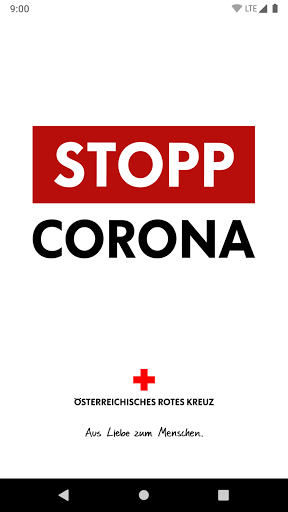
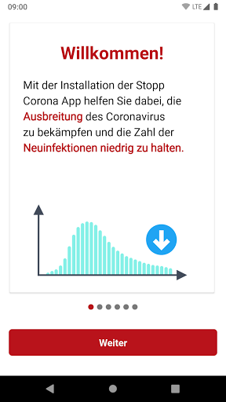
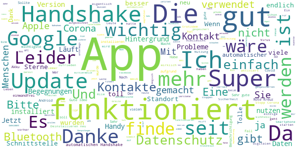
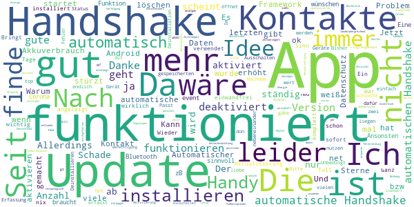
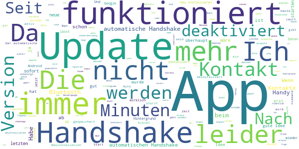
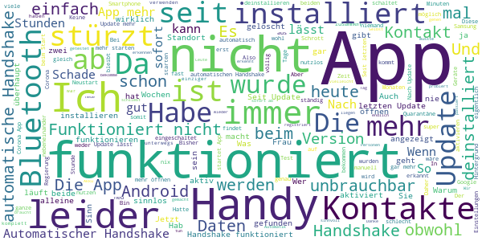

# Stopp Corona
App version ``2.0.4.1060-QA_248``

Analyzed with [covid-apps-observer](http://github.com/covid-apps-observer) project, version ``0.1``

## App overview
| | |
|-------------------------|-------------------------| 
| **Name**&nbsp;&nbsp;&nbsp;&nbsp;&nbsp;&nbsp;&nbsp;&nbsp;&nbsp;&nbsp;&nbsp;&nbsp;&nbsp;&nbsp;&nbsp;&nbsp;&nbsp;&nbsp;&nbsp;&nbsp;&nbsp;&nbsp;&nbsp;&nbsp;&nbsp;&nbsp;&nbsp;&nbsp;&nbsp;&nbsp;&nbsp;&nbsp;&nbsp;&nbsp;&nbsp;&nbsp;&nbsp;&nbsp;&nbsp;&nbsp;  | Stopp Corona |
| **Unique identifier** | at.roteskreuz.stopcorona |
| **Link to Google Play** | [https://play.google.com/store/apps/details?id=at.roteskreuz.stopcorona](https://play.google.com/store/apps/details?id=at.roteskreuz.stopcorona) |
| **Summary**  | Österreichs Corona-Warnungs-App |
| **Privacy policy** | [https://www.roteskreuz.at/site/faq-app-stopp-corona/datenschutzinformation-zur-stopp-corona-app/](https://www.roteskreuz.at/site/faq-app-stopp-corona/datenschutzinformation-zur-stopp-corona-app/) |
| **Latest version** | 2.0.4.1060-QA_248 |
| **Last update** | 2020-07-08 20:09:41 |
| **Recent changes** | Fehlerbehebung von Upload-Reminder Funktion  |
| **Installs**  | 100.000+ |
| **Category** | Medizin |
| **First release** | 25.03.2020 |
| **Size**  | 5,3M |
| **Supported Android version**  | 6.0 oder höher |

### Description
> Das Österreichische Rote Kreuz veröffentlicht die “Stopp Corona”-App im Auftrag des Gesundheitsministeriums, der obersten Gesundheitsbehörde Österreichs. 
 Mit der „Stopp Corona“-App lassen sich Begegnungen mit Freunden, der Familie oder Arbeitskollegen ganz einfach und anonymisiert speichern. Sollten Sie sich mit Corona infizieren, können Sie einfach über die App eine Meldung abgeben und Ihre Kontakte aus den letzten 2 Tagen werden anonym benachrichtigt. 
 Das gleiche gilt natürlich umgekehrt. Gibt eine Ihrer gespeicherten Begegnungen an, sich infiziert zu haben, erhalten Sie umgehend eine Nachricht und Sie können entsprechende Maßnahmen ergreifen. Dazu zählen vor allem:
 -	Abstand halten
 -	Soziale Kontakte vermeiden
 -	Sich vorsichtshalber in Selbstisolation begeben
 Beim Einsetzen von Symptomen kontaktieren Sie bitte telefonisch ihre Hausärztin oder den Hausarzt. Wenn das nicht möglich ist, rufen Sie die die Nummer 1450 an.
 Jedenfalls gilt: Bitte nicht die Ärztin/oder den Arzt persönlich aufsuchen und auch nicht ins Krankenhaus fahren. Bei einem medizinischen Notfall: 144 rufen.
 Gemeinsam unterbrechen wir so die Infektionskette.
 So schützen Sie nicht nur sich selbst, sondern verhindern auch, dass andere sich infizieren.
 Nutze Sie den digitalen Handshake
 Bis wir uns wieder unbedacht die Hände bei der Begrüßung reichen können, wird es wohl noch einige Zeit dauern. In der Zwischenzeit nutzen Sie einfach den digitalen Handshake der „Stopp Corona“-App.
 Haben Sie und die Person mit der Sie sich treffen die App installiert, speichert die App, dass Sie sich getroffen haben. Diese Daten werden anonymisiert gespeichert. Erkrankt einer von Ihnen beiden an dem Corona-Virus, erhält der andere eine Nachricht.
 Machen Sie den Corona-Selbstcheck
 Wie geht es Ihnen heute? Anhand eines klinisch geprüften Fragebogens können Sie sich täglich auf Corona-Symptome überprüfen.
 Corona-Verdachtsmeldung
 Entsprechen die Symptome dem Corona-Virus, können Sie eine Meldung über die App abgeben. Das ist wichtig, damit sich nicht noch mehr Menschen mit dem Virus infizieren. Ihre Begegnungen werden dann anonymisiert benachrichtigt. Keine Sorge, sie erhalten also keine persönlichen Angaben. 
 Anschließend bleiben Sie bitte Zuhause und kontaktieren Sie Ihre Hausärztin oder Ihren Hausarzt telefonisch. Wenn das nicht möglich ist rufen Sie die Nummer 1450 an.
 Fahren Sie nicht ins Krankenhaus und suchen Sie Ihren Arzt nicht persönlich auf.
 Ärztliche Bestätigung
 Stellt ein Arzt den Corona-Virus fest, können Sie ebenfalls eine Meldung abgeben. Auch hier werden Ihre Begegnungen anonymisiert benachrichtigt.
 Die App entstand in Partnerschaft mit der UNIQA Stiftung.
 Konzept und Realisierung in Zusammenarbeit und mit Unterstützung von Accenture Österreich und basiert auf dem Contacttracing-Framework von Apple und Google
 Schau auf Dich. Schau auf mich. So schützen wir uns.
 Link zum Open Source Software Projekt: https://github.com/austrianredcross/stopp-corona-android

### User interface
The developers of the app provide the following screenshots in the Google play store.
| | | |
|:-------------------------:|:-------------------------:|:-------------------------:|
 |   |   |   | 
 |   |   |   | 
 |   |  

## Development team
In the following we report the main information provided by the development team in the Google play store.

| | |
|-------------------------|-------------------------|
| **Developer**  | Österreichisches Rotes Kreuz |
| **Website**  | [https://www.roteskreuz.at](https://www.roteskreuz.at) |
| **Email** | service@roteskreuz.at |
| **Physical address**  | [Wiedner Hauptstrasse 32 1040 Wien Österreich](https://www.google.com/maps/search/Wiedner%20Hauptstrasse%2032%201040%20Wien%20Österreich) (Google Maps) |
| **Other developed apps**  | [https://play.google.com/store/apps/developer?id=%C3%96sterreichisches+Rotes+Kreuz](https://play.google.com/store/apps/developer?id=%C3%96sterreichisches+Rotes+Kreuz) |

## Android support

| | |
|-------------------------|-------------------------|
| **Declared target Android version**  | Pie, version 9 (API level 28) |
| **Effective target Android version**  | Pie, version 9 (API level 28) |
| **Minimum supported Android version**  | Marshmallow, version 6.0 (API level 23) |
| **Maximum target Android version**  | - |

The larger the difference between the minimum and maximum supported Android versions, the better. A larger difference means a wider audience. For example, old phones have a very low Android version, so a high minimum supported Android version means that the app cannot be used by users with old phones, thus leading to accessibility problems. 

## Requested permissions

In the following we report the complete list of the permissions requested by the app. 

| **Permission** | **Protection level** | **Description** | 
|-------------------------|-------------------------|-------------------------|
 **android.permission ACCESS_NETWORK_STATE** | Normal | Allows applications to access information about networks. 
 **android.permission BLUETOOTH** | Normal | Allows applications to connect to paired bluetooth devices. 
 **android.permission FOREGROUND_SERVICE** | Normal | Allows a regular application to use Service.startForeground. 
 **android.permission INTERNET** | Normal | Allows applications to open network sockets. 
 **android.permission RECEIVE_BOOT_COMPLETED** | Normal | Allows an application to receive the Intent.ACTION_BOOT_COMPLETED that is broadcast after the system finishes booting. 
 **android.permission WAKE_LOCK** | Normal | Allows using PowerManager WakeLocks to keep processor from sleeping or screen from dimming. 

## Mentioned servers

| **Server** | **Registrant** | **Registrant country** | **Creation date** | 
|-------------------------|-------------------------|-------------------------|-------------------------|
 | google.com | Google LLC | :us: US | 1997-09-15 04:00:00 |
 | prod-rca-coronaapp-fd.net | Domains By Proxy, LLC | :us: US | 2020-04-20 20:16:19 |

## Security analysis 

Below we report the main security warnings raised by our execution of the [Androwarn](https://github.com/maaaaz/androwarn) security analysis tool.

**Connection interfaces exfiltration**
> - This application reads details about the currently active data network 
> - This application tries to find out if the currently active data network is metered 

**Telephony services abuse**
> - This application makes phone calls 

**Suspicious connection establishment**
> - This application opens a Socket and connects it to the remote address '; port is out of range' on the 'N/A' port  
> - This application opens a Socket and connects it to the remote address 'Ljava/net/Proxy;->type()Ljava/net/Proxy$Type;' on the 'N/A' port  
> - This application opens a Socket and connects it to the remote address 'Ln/b/a/a/a;->i(Ljava/lang/String;)Ljava/lang/StringBuilder;' on the 'N/A' port  
> - This application opens a Socket and connects it to the remote address 'timeout' on the 'N/A' port  

## User ratings and reviews

Below we provide information about how end users are reacting to the app in terms of ratings and reviews in the Google Play store.

### Ratings

The Stopp Corona app has been installed by more than **100000** times. At this time, **2749** rated the app and its average score is **3.4927008**. Below we show the distribution of the ratings across the usual star-based rating of Google Play

:star::star::star::star::star:: 1314

:star::star::star::star:: 250

:star::star::star:: 300

:star::star:: 240

:star:: 642

### Reviews 

#### 5-star reviews

> Funktioniert und stört das Mobiltelefon nicht.  :date: __2020-09-08 09:06:45__

> Funktioniert bei mir bis jetzt tadellos, handshakes werden gespeichert, braucht nicht viel Akku und müllt einem nicht mit zig Benachrichtigungen am Tag zu.  :date: __2020-09-07 15:10:43__

> Die App ist dezent und unaufdringlich gestaltet, einfach zu verstehen und leicht zu handhaben. Mich hat sie nur wahnsinnig gemacht, weil ich dauernd Angst hatte, jemand mit Corona oder einem Verdacht dazu taucht in meiner Nähe auf. Somit musste ich sie leider deinstallieren, trotzdem gut gemacht! 👌  :date: __2020-09-07 02:11:51__

> Bitte die Corona Ampel einbinden, deren website ist für den mobilen Gebrauch nahezu völlig ungegeignet  :date: __2020-09-04 19:13:41__

> Ich habe diese App noch nie benutzt  :date: __2020-09-03 19:47:25__

> Funktioniert wie es soll, verbraucht auch keine Unmengen an Akku obwohl die App im Hintergrund läuft  :date: __2020-08-31 18:43:40__

> Läuft problemlos im Hintergrund. Wer zögert diese sich runterzuladen, sollte sich mal fragen ob er eine Kreditkarte 💳 einen Google Account oder Facebook Zugang hat, den dann hat er ein Datenproblem nicht mit dieser App! 🤗 👍  :date: __2020-08-29 14:44:09__

> Einfach  :date: __2020-08-28 06:47:36__

> Die App ist inzwischen viel besser als anfangs. Es wird eine Schnittstelle seitens Google bzw. Apple bereitgestellt, die die völlige Automatisierung des handshakes bei gleichzeitig hoher Sicherheit gewährleistet. Bitte laden und versuchen.  :date: __2020-08-27 02:23:39__

> Nach dem holprigen Update läuft alles soweit.  :date: __2020-08-22 08:43:56__

#### 4-star reviews

> Warum können die Corona WarnApps von Deutschland und Österreich und ggf anderen Ländern parallel aktiviert werden Das wäre durchaus sinnig, wenn man länderübergreifend unterwegs ist.  :date: __2020-09-07 18:08:52__

> Startet mit seltsamer Fehlermeldung zu Bluetooth, danach funktioniert es anscheinend.  :date: __2020-09-04 13:10:44__

> Eine Weiterentwicklung wäre das einloggen bei events zusammen mit einer event app. Das würde Veranstaltern und Gästen viel Bürokratie ersparen und anonymisiertes Warnen auch nach zB positiven Fällen bei Fußballspielen ermöglichen. Die Akzeptanz würde sprunghaft ansteigen!  :date: __2020-09-01 18:44:55__

> Finde die App sehr sinnvoll. Wünschenswert wäre eine Anzeige der Anzahl der durchgeführten Kopplungen zur Verfolgung der Funktion bzw. Aktivität. Ansonsten gibts "nur" eine wöchentliche Benachrichtigung, dass die App aktiv ist.  :date: __2020-08-31 11:11:56__

> Scheint zu funktionieren, würde mir aber eine Meldung -per App-Symbolindikator- über Handshake's (ev. 1 Stunde zeitverzögert, chronologisch und lautlos) wünschen.  :date: __2020-08-30 07:13:09__

> Ich finde die Idee gut, es braucht aber noch etwas Energie: Zeitstempel der letzten Aktualisierung in der App. Anzahl (nicht mehr) der Kontakte anzeigen (damit man sieht, dass es funktioniert). Aktuelle Corona Statistiken (zb vom Land), damit man Mehrwert durch die App hat. Und internat. Sync.  :date: __2020-08-19 07:49:14__

> Es ist Ganz ok man könnte es überichtlicher machen ob man mit einem Infizierten in kontakt getreten ist.  :date: __2020-08-17 10:31:18__

> Ein Punkt Abzug für den hohen Akkuverbrauch.  :date: __2020-07-31 09:26:20__

> Toll  :date: __2020-07-30 17:23:52__

> Automatischer Handshake deaktiviert sich ständig.  :date: __2020-07-17 08:41:56__

#### 3-star reviews

> 06.09.2020 nochmaliger Test der App. Gegenüber der ersten Version verbessert, aber nicht überzeugend. Sobald man einen Verdacht meldet, kommt stündlich die Aufforderung, weitere Kontakte zu melden. Selbst habe ich aber keinen Zugriff auf das Kontaktprotokoll. Da ich insgesamt nur mit einem anderen Handy Kontakt hatte, sollte eine neuerliche Meldung sinnlos sein. Für das ärztliche contact-tracing ist die App damit auch nicht hilfreich, selbst wenn sehr viele Menschen diese nutzen würden.  :date: __2020-09-07 13:30:59__

> Die App ist jetzt annehmbar. Eine Grafik bei der ab zu lesen ist, in welchem Risiko ich mich mit meinem Bewegunsradius befinde.  :date: __2020-09-07 10:58:13__

> Bitte die Liste der Zeitstempel der Checks kalendarisch ordnen! (derzeit durcheinander) Noch besser: Möglichkeit, diese Liste selbst auf- oder absteigend einzustellen!  :date: __2020-09-06 10:27:55__

> Status eher unübersichtlich dargestellt, da ist die deutsche App viel besser. Nach App-Wechsel (Aufenthalt in Deutschland; nach allen Infos sind die verschiedenen Länder-Apps ja nicht kompatibel, also hatte ich die dortige installiert) funktioniert der ID-Austausch nicht mehr (letzte Überprüfung 3 Tage her). Nach Neuinstallation gehts zwar anscheinend wieder, doch wurden dabei sämtliche Kontakte der letzten 14 Tage gelöscht (und damit auch die Möglichkeit mich oder andere zu warnen).  :date: __2020-09-05 19:33:46__

> Generell gut, allerdings wird man, wenn bereits in Quarantäne und alle Kontakte verständigt, mehrmals am Tag weiterhin gefragt, ob die Kontakte verständigt werden sollen. Wenig sinnvoll, finde ich... Und sehr lästig!  :date: __2020-09-05 18:41:05__

> Die App funktioniert derzeit.... Ich hoffe, es bleibt so.  :date: __2020-09-04 11:11:07__

> Seit ich die App installiert habe, hält mein Handy Akku nur mehr die halbe Zeit und muss jeden Tag aufgeladen werden, vorher alle zwei Tage. Das ist gar nicht gut  :date: __2020-09-03 23:30:58__

> Ein Hinweis auf die erfolgreiche Überprüfung der Kontakte wäre wünschenswert.  :date: __2020-09-01 08:04:36__

> Gute Idee, leider gibt es so wenige Leute die die App besitzen, dass ich bis jetzt immer 0 Abgleichungen hatte  :date: __2020-08-18 10:39:24__

> Wenn ich auf Überprüfung möglicher Kontakte gehe wird ein Passwort bzw. eine Zahlenkombination abgefragt was ich aber nie bei der Registrierung nicht erstellen musste und auch nicht habe. Nachdem man sonst keine Möglickeit hat direkt in Kontakt zu kommen um jemand zu fragen probiere ich es mal hier. Vielleicht gibt es da eine Antwort, wäre super !  :date: __2020-08-07 20:15:23__

#### 2-star reviews

> Ich bin jetzt etwas verwirrt_ muss ich jetzt die Standortermittlung einschalten oder nur Bluetooth? Oder hängt das von Mobil Tel. Typ ab, dass nicht alle Handys gleiche Version haben? Bitte um Aufklärung, DANKESCHÖN!  :date: __2020-09-08 11:43:07__

> Grundsätzlich halte ich die App für eine gute Idee. Mich stört allerdings, dass ich ständig Bluetooth, GPS und Internet aktiv haben muss, um den gewünschten Erfolg zu haben. Das zerrt am Akku und spätesten nach einem halben Tag ist dieser leer. Jedes Mal aktivieren und deaktivieren nervt. Ehrlich, ich denke nicht bei jedem Einkauf daran, alle Funktionen vorher zu aktivieren. Somit wird es zum ad absurdum.  :date: __2020-08-27 20:03:38__

> Die Überprüfungen sind nicht chronologisch nach Datum. Obwohl ich nichts verändert habe, gab es tagelang keine Überprüfung und dann plötzlich doch wieder?!  :date: __2020-08-19 21:00:28__

> Angeblich hat die App 20.000.000 Euro gekostet; da würde man sich etwas mehr erwarten: 1.) Ist der Schalter "Automatische Handshake" ein/aus ident mit dem Schalter "COVID 19-Benachrichtigung aktivieren"? Wenn ja, warum verwendet man zwei verschiedene Bezeichnungen? Ich kann keinen Unterschied feststellen! Wenn ich "COVID 19-Benachrichtigung aktivieren" ausschalte, dann wird noch "Automatische Handshake" als aktiv angezeigt, obwohl es auch ausgeschaltet ist. Nach Neustart sind beide auf aus. Das ist ein FEHLER bei der Anzeige! 2.) Die Liste der möglichen Begegnungen ist unter dem Menüpunkt "App-Einstellungen" zu finden. Das ist total unlogisch! 3.) Die Liste der möglichen Begegnungen ist NICHT sortiert. Das Datum wird in zufälliger Reihenfolge angezeigt! 4.) Was bedeutet "Anzahl der Schlüssel"??  :date: __2020-08-17 16:04:07__

> GPS? Weil andere zu GPS geschrieben haben: zumindest bei der jetzigen Version (7/2020) wird GPS nicht benötigt, nur Bluetooth. Die Gestaltung könnte wesentlich besser sein, v.a. die Einbindung der bisherigen Kontakt-IDs, da findet man keine Daten. Man sollte Zeitpunkt eines Kontakts sehen können, so hat man keine Ahnung ob die App funktioniert!  :date: __2020-08-15 11:27:18__

> Wie kann ich meine vergangenen Benachrichtigungen ansehen? Gar nicht :(  :date: __2020-08-10 21:05:59__

> woran erkenne ich, dass die app tatsächlich tut? ich sehe nirgendwo eine info.  :date: __2020-08-03 21:29:21__

> Ich frag mich ob die App wirklich funktioniert. Die Zeitpunkte zu denen die Zufalls-IDs generiert werden können absolut nicht stimmen... um 3 uhr Nachts schlafe ich und wüsste auch von keinen Gästen in meinem Schlafzimmer. Außerdem hab ich GPS aufgrund des hohen Akkuverbrauchs nie aktiviert und die App schreibt mir dan aber "Benachrichtigungen inaktiv" 🤔🤔🤔  :date: __2020-07-31 19:12:04__

> Verbraucht viel Akku. Nicht zu vergleichen mit der Corona App Deutschland  :date: __2020-07-30 14:07:01__

> Ich halte nicht viel von dieser App, da zuviel persönliches gespeichert wird  :date: __2020-07-28 23:45:46__

#### 1-star reviews

> Unnötig  :date: __2020-09-09 15:33:26__

> Diese Drecksapp funktioniert nicht!!!  :date: __2020-09-09 09:24:19__

> Ich werde die mir nie herunterladen wo landen den meine Daten wirklich denn wenn die es im fehrsehr zeigen können wo wir waren ob wir daheim bleiben oder nicht ich bin leider mit den nicht vertraut und wo sollen die AGB sein oder die Datenschutzerklärung  :date: __2020-09-02 13:15:05__

> Nach einem Update meines Mobiltelefons stoppte die App ihre Arbeit! Ohne mich zu warnen!  :date: __2020-08-30 18:16:22__

> Funktioniert leider nicht. Ich sitze alleine am Auto am Parkplatz (weit und breit keine andere Person) und erhalte einen Handshake mit "Anzahl Schlüssel 96" was auch immer das bedeutet?!  :date: __2020-08-27 17:52:53__

> App meldet Bluetooth ausgeschaltet, obwohl Bluetooth aktiv ist und funktioniert (getestet): Keine chance Handshake zu aktivieren auch bei Neustart wieder dasselbe. Außerdem verlangt die App Standortfreigabe - wozu jetzt genau? Vlt sollte man nicht nur in Werbung sondern auch in saubere Entwicklung investieren. War selber 35+ jahre in IT, für dgl. unausgetestete Anwendung hätte niemand auch nur 20.000 gezahlt. Schade, wird sofort wieder installiert.  :date: __2020-08-24 18:25:36__

> Wir können machen was wir wollen, aber der automatische Handshake funktioniert nicht. In den APP Einstellungen ist alles erlaubt. Stromsparen ist abgeschaltet. Aber die Idee ist sehr gut, darum 3 Punkte. Auch wenn es momentan nahezu unbrauchbar ist. Update 10.05.: automatischer Handshake geht noch immer nicht. Völlig nutzlos und mittlerweile finde ich das richtig ärgerlich. Topleistung! Nach dem letzten Update startet die APP gar nicht mehr. Update 23.08.2020: Umgestiegen auf App vom RKI  :date: __2020-08-24 00:01:42__

> Grundsätzlich eine super Sache. Aber: Die App zeichnet Kontakte auf, die sicher nicht stattgefunden haben können, weil ich zB alleine im Garten war oder im Bett lag. Hier wäre eine dringende Überprüfung von Seiten der Entwickler notwendig.  :date: __2020-08-22 17:07:28__

> Wieso wird nur alle 7 Tage am Server nachgefragt nach der Liste der Infizierten? Samsung a8  :date: __2020-08-22 16:35:39__

> Begegnung durch Hausmauer werden erfasst  :date: __2020-08-20 21:46:28__

