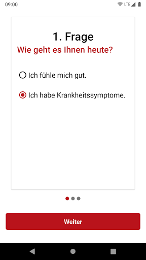
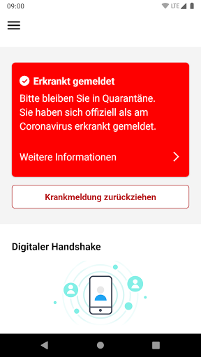
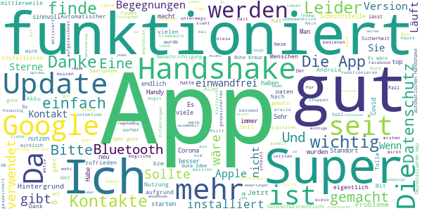
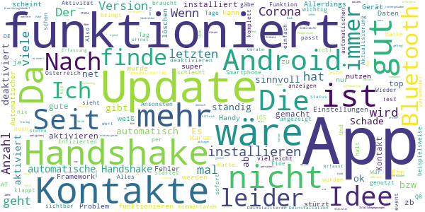
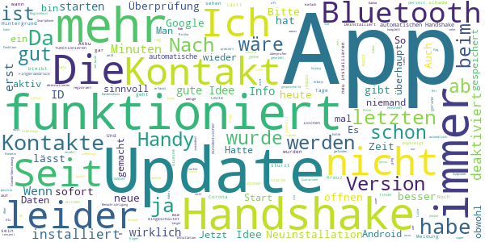
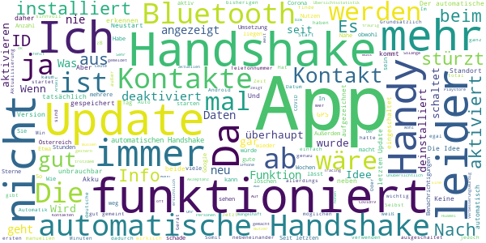
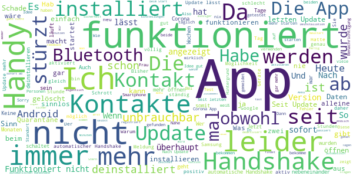

# Stopp Corona
App version ``2.0.5.1081-QA_250``

Analyzed with [covid-apps-observer](http://github.com/covid-apps-observer) project, version ``0.1``

## App overview
| | |
|-------------------------|-------------------------| 
| **Name**&nbsp;&nbsp;&nbsp;&nbsp;&nbsp;&nbsp;&nbsp;&nbsp;&nbsp;&nbsp;&nbsp;&nbsp;&nbsp;&nbsp;&nbsp;&nbsp;&nbsp;&nbsp;&nbsp;&nbsp;&nbsp;&nbsp;&nbsp;&nbsp;&nbsp;&nbsp;&nbsp;&nbsp;&nbsp;&nbsp;&nbsp;&nbsp;&nbsp;&nbsp;&nbsp;&nbsp;&nbsp;&nbsp;&nbsp;&nbsp;  | Stopp Corona |
| **Unique identifier** | at.roteskreuz.stopcorona |
| **Link to Google Play** | [https://play.google.com/store/apps/details?id=at.roteskreuz.stopcorona](https://play.google.com/store/apps/details?id=at.roteskreuz.stopcorona) |
| **Summary**  | Österreichs Corona-Warnungs-App |
| **Privacy policy** | [https://www.roteskreuz.at/site/faq-app-stopp-corona/datenschutzinformation-zur-stopp-corona-app/](https://www.roteskreuz.at/site/faq-app-stopp-corona/datenschutzinformation-zur-stopp-corona-app/) |
| **Latest version** | 2.0.5.1081-QA_250 |
| **Last update** | 2020-10-09 09:23:44 |
| **Recent changes** | Anpassung der Mobile App an aktualisiertes Framework Verbesserung des Background checks |
| **Installs**  | 100.000+ |
| **Category** | Medizin |
| **First release** | 25.03.2020 |
| **Size**  | 5,4M |
| **Supported Android version**  | 6.0 oder höher |

### Description
> Das Österreichische Rote Kreuz veröffentlicht die “Stopp Corona”-App im Auftrag des Gesundheitsministeriums, der obersten Gesundheitsbehörde Österreichs. 
 Mit der „Stopp Corona“-App lassen sich Begegnungen mit Freunden, der Familie oder Arbeitskollegen ganz einfach und anonymisiert speichern. Sollten Sie sich mit Corona infizieren, können Sie einfach über die App eine Meldung abgeben und Ihre Kontakte aus den letzten 2 Tagen werden anonym benachrichtigt. 
 Das gleiche gilt natürlich umgekehrt. Gibt eine Ihrer gespeicherten Begegnungen an, sich infiziert zu haben, erhalten Sie umgehend eine Nachricht und Sie können entsprechende Maßnahmen ergreifen. Dazu zählen vor allem:
 -	Abstand halten
 -	Soziale Kontakte vermeiden
 -	Sich vorsichtshalber in Selbstisolation begeben
 Beim Einsetzen von Symptomen kontaktieren Sie bitte telefonisch ihre Hausärztin oder den Hausarzt. Wenn das nicht möglich ist, rufen Sie die die Nummer 1450 an.
 Jedenfalls gilt: Bitte nicht die Ärztin/oder den Arzt persönlich aufsuchen und auch nicht ins Krankenhaus fahren. Bei einem medizinischen Notfall: 144 rufen.
 Gemeinsam unterbrechen wir so die Infektionskette.
 So schützen Sie nicht nur sich selbst, sondern verhindern auch, dass andere sich infizieren.
 Nutze Sie den digitalen Handshake
 Bis wir uns wieder unbedacht die Hände bei der Begrüßung reichen können, wird es wohl noch einige Zeit dauern. In der Zwischenzeit nutzen Sie einfach den digitalen Handshake der „Stopp Corona“-App.
 Haben Sie und die Person mit der Sie sich treffen die App installiert, speichert die App, dass Sie sich getroffen haben. Diese Daten werden anonymisiert gespeichert. Erkrankt einer von Ihnen beiden an dem Corona-Virus, erhält der andere eine Nachricht.
 Machen Sie den Corona-Selbstcheck
 Wie geht es Ihnen heute? Anhand eines klinisch geprüften Fragebogens können Sie sich täglich auf Corona-Symptome überprüfen.
 Corona-Verdachtsmeldung
 Entsprechen die Symptome dem Corona-Virus, können Sie eine Meldung über die App abgeben. Das ist wichtig, damit sich nicht noch mehr Menschen mit dem Virus infizieren. Ihre Begegnungen werden dann anonymisiert benachrichtigt. Keine Sorge, sie erhalten also keine persönlichen Angaben. 
 Anschließend bleiben Sie bitte Zuhause und kontaktieren Sie Ihre Hausärztin oder Ihren Hausarzt telefonisch. Wenn das nicht möglich ist rufen Sie die Nummer 1450 an.
 Fahren Sie nicht ins Krankenhaus und suchen Sie Ihren Arzt nicht persönlich auf.
 Ärztliche Bestätigung
 Stellt ein Arzt den Corona-Virus fest, können Sie ebenfalls eine Meldung abgeben. Auch hier werden Ihre Begegnungen anonymisiert benachrichtigt.
 Die App entstand in Partnerschaft mit der UNIQA Stiftung.
 Konzept und Realisierung in Zusammenarbeit und mit Unterstützung von Accenture Österreich und basiert auf dem Contacttracing-Framework von Apple und Google
 Schau auf Dich. Schau auf mich. So schützen wir uns.
 Link zum Open Source Software Projekt: https://github.com/austrianredcross/stopp-corona-android

### User interface
The developers of the app provide the following screenshots in the Google play store.
| | | |
|:-------------------------:|:-------------------------:|:-------------------------:|
 |   |   |   | 
 |   |   |   | 
 |   |  

## Development team
In the following we report the main information provided by the development team in the Google play store.

| | |
|-------------------------|-------------------------|
| **Developer**  | Österreichisches Rotes Kreuz |
| **Website**  | [https://www.roteskreuz.at](https://www.roteskreuz.at) |
| **Email** | service@roteskreuz.at |
| **Physical address**  | [Wiedner Hauptstrasse 32 1040 Wien Österreich](https://www.google.com/maps/search/Wiedner%20Hauptstrasse%2032%201040%20Wien%20Österreich) (Google Maps) |
| **Other developed apps**  | [https://play.google.com/store/apps/developer?id=%C3%96sterreichisches+Rotes+Kreuz](https://play.google.com/store/apps/developer?id=%C3%96sterreichisches+Rotes+Kreuz) |

## Android support

| | |
|-------------------------|-------------------------|
| **Declared target Android version**  | Pie, version 9 (API level 28) |
| **Effective target Android version**  | Pie, version 9 (API level 28) |
| **Minimum supported Android version**  | Marshmallow, version 6.0 (API level 23) |
| **Maximum target Android version**  | - |

The larger the difference between the minimum and maximum supported Android versions, the better. A larger difference means a wider audience. For example, old phones have a very low Android version, so a high minimum supported Android version means that the app cannot be used by users with old phones, thus leading to accessibility problems. 

## Requested permissions

In the following we report the complete list of the permissions requested by the app. 

| **Permission** | **Protection level** | **Description** | 
|-------------------------|-------------------------|-------------------------|
 **android.permission ACCESS_NETWORK_STATE** | Normal | Allows applications to access information about networks. 
 **android.permission BLUETOOTH** | Normal | Allows applications to connect to paired bluetooth devices. 
 **android.permission FOREGROUND_SERVICE** | Normal | Allows a regular application to use Service.startForeground. 
 **android.permission INTERNET** | Normal | Allows applications to open network sockets. 
 **android.permission RECEIVE_BOOT_COMPLETED** | Normal | Allows an application to receive the Intent.ACTION_BOOT_COMPLETED that is broadcast after the system finishes booting. 
 **android.permission REQUEST_IGNORE_BATTERY_OPTIMIZATIONS** | Normal | Permission an application must hold in order to use Settings.ACTION_REQUEST_IGNORE_BATTERY_OPTIMIZATIONS. 
 **android.permission WAKE_LOCK** | Normal | Allows using PowerManager WakeLocks to keep processor from sleeping or screen from dimming. 

## Mentioned servers

| **Server** | **Registrant** | **Registrant country** | **Creation date** | 
|-------------------------|-------------------------|-------------------------|-------------------------|
 | google.com | Google LLC | :us: US | 1997-09-15 04:00:00 |
 | prod-rca-coronaapp-fd.net | Domains By Proxy, LLC | :us: US | 2020-04-20 20:16:19 |

## Security analysis 

Below we report the main security warnings raised by our execution of the [Androwarn](https://github.com/maaaaz/androwarn) security analysis tool.

**Connection interfaces exfiltration**
> - This application reads details about the currently active data network 
> - This application tries to find out if the currently active data network is metered 

**Telephony services abuse**
> - This application makes phone calls 

**Suspicious connection establishment**
> - This application opens a Socket and connects it to the remote address '; port is out of range' on the 'N/A' port  
> - This application opens a Socket and connects it to the remote address 'Lcom/android/tools/r8/GeneratedOutlineSupport;->outline16(Ljava/lang/String;)Ljava/lang/StringBuilder;' on the 'N/A' port  
> - This application opens a Socket and connects it to the remote address 'Ljava/net/Proxy;->type()Ljava/net/Proxy$Type;' on the 'N/A' port  
> - This application opens a Socket and connects it to the remote address 'timeout' on the 'N/A' port  

## User ratings and reviews

Below we provide information about how end users are reacting to the app in terms of ratings and reviews in the Google Play store.

### Ratings

The Stopp Corona app has been installed by more than **100000** times. At this time, **3070** rated the app and its average score is **3.309904**. Below we show the distribution of the ratings across the usual star-based rating of Google Play

:star::star::star::star::star:: 1344

:star::star::star::star:: 255

:star::star::star:: 353

:star::star:: 245

:star:: 873

### Reviews 

#### 5-star reviews

> Eine wichtige App.. Sollte unbedingt mehr genutzt werden!  :date: __2020-10-29 23:37:47__

> 5 Sterne, weil es wichtig wäre, dass sie mehr Menschen auch nützen, auch wenn es noch Verbesserungsbedarf gibt, wie aus den vielen weiteren Bewertungen ersichtlich ist!  :date: __2020-10-29 07:18:15__

> Sollte jeder benutzen. In China haben sie die Pandemiemittels App und Registrung unter Kontrolle. Wir bevorzugen einen Lockdown weil die EU kein agiler Apparat ist. Sie sollte eine App für ganz Europa bringen. Mir ist lieber kein Lockdown ohne die sozialen und wirtschaftlichen Folgen.... Datenschutz ist halt ein Angst Thema in der EU.  :date: __2020-10-29 05:43:35__

> Sehr gut  :date: __2020-10-28 11:29:28__

> Frühstücken, liebe Grüße von Marianne  :date: __2020-10-28 08:39:18__

> Sollte jedeR installiert haben.  :date: __2020-10-28 00:05:13__

> Datenschutzrechtlich unbedenklich, trivial zu bedienen und sinnvoll...  :date: __2020-10-27 19:22:07__

> Simpel und wirkt!  :date: __2020-10-27 15:54:56__

> mittlerweile sehr gut und Datenschutz wird auch optimal sichergestellt  :date: __2020-10-26 12:56:11__

> Funktioniert mittlerweile einwandfrei. Eine Statistik über Begegnungen und ausgetauschte Schlüssel wäre sehr interessant. Datenschutzrechtlich top!!  :date: __2020-10-25 17:09:22__

#### 4-star reviews

> Die App finde ich gut und informativ  :date: __2020-10-26 20:08:08__

> Die App ist leider nicht das Beste, aber notwendig. Für alle die die Zufallsbegegnungen sehen wollen, diese sind in den App-Einstellungen ersichtlich. Dazu in den Android Einstellungen nach COVID suchen.  :date: __2020-10-26 20:06:58__

> Ist ok. Wär cool Wenn's einen Counter für die Handshakes gäbe.  :date: __2020-10-25 21:16:56__

> Verbesserungsfähig, aber einfach und sinnvoll, sollte jede/r nutzen. Ein Widget wäre praktisch, bei dem man nur den Handshake aktivieren muss und Bluetooth sowie GPS automatisch mit aktiviert werden, ohne dreimal bestätigen zu müssen. Schnell und unkompliziert am Startbildschirm plazierbar, weil man ja nicht laufend alles eingeschalteten hat. Wird dann vielleicht für beispielsweise kurze Einkäufe auch eher aktiviert.  :date: __2020-10-25 18:43:37__

> Seit dem letzten Update beendet sich die App auf kein Android Gerät nicht mehr....  :date: __2020-10-23 12:01:25__

> Coole Idee aber in Österreich niemand nutzt das  :date: __2020-10-19 18:14:29__

> Super App aber endwarnung geben funktionirt nicht schon 20 mal probiert immer wieder Server fehler  :date: __2020-10-14 13:30:24__

> Der einzig vernünftige Weg das Kontakttracing im Fall der Fälle rasch durchzuführen. Darum drauf mit der App!  :date: __2020-10-08 20:27:40__

> Es wäre toll wenn man sich mit dieser App einem Gastronomie Betrieb anmelden kann anstelle der Zettel.  :date: __2020-10-05 15:58:38__

> Idee ist super, leider klappt der automatische Handshake nicht. Da muss noch nachgebessert werden. Android-zu-Android klappt, aber Android-zu-iOS geht nicht. Viele Smartphone User deaktivieren Bluetooth, da dadurch die WLAN Geschwindigkeit reduziert wird.  :date: __2020-09-27 09:29:12__

#### 3-star reviews

> 10/20 Nachbesserungen erfolgten. Man wird sehen/ Auf 2 eigenen Phones instal. - bei beiden kein Handshake (3 Phones nebeneinander am Tisch über 20 min. Android und Apple) Ständige Standortabfrage. Ist für mich sinnvoll, wenn Bluetooth Kontakte erkannt werden, Fremdpersonen im Verdachtstfall gewarnt werden. Deinstal., da nicht sinnvoll einsetzbar. Familie/Arbeitskontakte kann ich auch ohne perm. Standortabfrage via Phone verständigen. Nachbesserung erwünscht. Pandemie dauert ja etwas länger...  :date: __2020-10-31 08:35:27__

> ich versuche pie App immer wenn ich das Haus verlasse aktiv zu haben. Sie verschwindet aber immer wieder von selbst. Ich hatte bisher auch erst einen Handshake und das mit einem Arbeitskollegen, weil wir die App bewusst ausprobiert haben. Sonst hat die App noch nie jemanden für einen Handshake gefunden, und ich bin viel in Öffis unterwegs. Verwendet die App niemand?  :date: __2020-10-30 19:01:59__

> Keine Ahnung ob es wirklich funktioniert. Wenn man den ganzen Tag über alleine im Büro sitzt und die Anzahl der "angeblichen" Kontakte ansteigt (heute zwischen 07:50 und 11:42 um 65 Kontakte). Wie gesagt, bin alleine im Raum. Niemand kommt hinein, ich gehe nicht hinaus.  :date: __2020-10-30 11:57:47__

> Bei mir scheint die App gut zu funktionieren. Hatte aber noch keinen Ernstfall. Eine Ausnahme: wenn ich auf "Überprüfung auf mögliche Begegnungen" gehe, werde ich aufgefordert, mich mit dem Fingerabdruck zu identifizieren und das ist nie positiv (werde nicht identifiziert). Ich glaube nicht, dass der Fingerabdruck bei der Installation der App erforderlich war und kann die Einstellung auch nirgens korrigieren oder überprüfen. Bitte dazu um eine Stellungnahme vom Roten Kreuz, danke!  :date: __2020-10-29 10:37:31__

> Idee ist ja gut und ich würde die App gerne unterstützen. Dazu muss aber folgendes geändert werden. Meldung: Tag der Testung muss auswählbar sein (sonst werden nur Leute der letzten 48h informiert, in denen man so oder so schon in Quarantäne ist). Macht sonst absolut keinen Sinn, bei der oftmals langen Dauer bis zum Testergebnis. Abgefragte Symptome geben Empfehlung Abstand zu halten, obwohl man ja schon positiv gemeldet in Quarantäne ist oder empfehlen sich testen zu lassen.  :date: __2020-10-26 20:55:29__

> Generell gute idee sofern die Daten Verantwortungsvoll behandelt werden. Ärgerlich ist aber dass laut Beschreibung in der App Bluetooth alleine ausreicht. Schalte ich aber GPS ab gibt Google eine Warnung ab dass ohne GPS die Funktion nicht mehr gegeben ist  :date: __2020-10-26 16:37:26__

> mangelhaft eine statusanzeige am oberen bildschirmrand fehlt. ich erfahre nicht, welche aktivität die app durchführt, zb anzahl kontaktregistrierung etc  :date: __2020-10-25 07:57:25__

> App-noch zu wenige haben diese installiert  :date: __2020-10-24 13:22:49__

> Die Unfähigkeit wahlberechtigter Bürger sich über die Funtionsweise der App zu informieren, stellt nicht nur das Prinzip der Demokratie in Frage, sondern erklärt auch, warum wir es mit dem Virus nicht aufnehmen können. In der Gesamtheit sind wir zu doof dafür.  :date: __2020-10-24 07:51:28__

> Die Hintergrundchecks funktionieren jetzt viel besser, jedoch ist komisch das, obwohl ich das Haus nicht verlassen habe, ich jetzt innerhalb von 1 Tag 200 mehr IDs gespeichert hab.  :date: __2020-10-23 13:29:29__

#### 2-star reviews

> ist ok.  :date: __2020-10-31 02:22:16__

> Mäßiger Nutzen...  :date: __2020-10-30 14:01:34__

> Eine Übersichtsstatistik auf der Hauptseite wäre sehr hilfreich. So ist es für mich nicht einfach ersichtlich wie viele IDs wann überprüft wurden.  :date: __2020-10-28 07:12:25__

> Akzeptanz durch Transparenz. So gewinnt man User. Wenn man sehen könnte wann und wo ich einen "handshake" gemacht habe (zB auf Google maps) aber auch welche Fälle wo abgerufen werden (zB gestern 9 Uhr Bahnhofstraße in XYZ) und ob ich in der Nähe war, dann würde es die Leute auch mehr interessieren. Es fehlt die Interaktion, traurig dass man das überhaupt erwähnen muss.  :date: __2020-10-27 15:10:30__

> Sehr gute Einführung. G.M.  :date: __2020-10-26 11:57:16__

> Ich habe die App wieder deinstalliert. Solange die App meine Telefonnummer speichert, ist es mit der Anonymität nicht weit her. Dass es technisch auch anders geht, zeigt die deutsche Corona App, die tatsächlich ohne personenbezogene Daten auskommt. Sehr traurig, dass ich in Österreich nicht guten Gewissens zum Tracing mittels App beitragen kann.  :date: __2020-10-26 08:15:51__

> Leider kann ich Sie bei meinem neuen Handy nicht mehr runter laden, da es keinen Playstore von Google hat. In der Huawei App Gallery ist sie App leider nicht drinnen. L. G.  :date: __2020-10-25 22:01:33__

> Im Vergleich zu Apps aus anderen Ländern unübersichtlich. Leider kaum Nutzer, habe alle paar Wochen nu mal einen Kontakt zu einem anderen Nutzer.  :date: __2020-10-23 19:59:49__

> Die Idee ist ansich gut aber birgt noch deutliches Verbesserungspotential. Auf der Startseite wäre eine Übersichtsstatistik über die Anzahl an möglichen Kontakten interessant. Und ein direkter Link ggf auch mit Passwort Eingabe geschützt für weitere Statistiken bzw Auswertungen. Aktuell muss man sich ja durch mehrere Untermenüs wühlen.  :date: __2020-10-22 22:42:58__

> Feature Request: In der Gastronomie als Tracing App verwenden (Österreichweit) Dadurch würde die App auch vom mehr Personen genutzt und würde mehr bringen  :date: __2020-10-16 10:37:53__

#### 1-star reviews

> Im Grunde genommen , Stasi auf freiwilliger Basis! Die App ist nutzlos und macht nichts was wir schon im Vorfeld machen würden !  :date: __2020-10-29 16:08:04__

> Totaler Schmarrn. Mir fremde Personen die ein Verdachtsfall sind oder gar positiv sind müssen eh in Quarantäne...somit habe ich keinen Kontakt. Mir bekannte Personen, informieren mich bei einem Verdachtsfall von selbst (Contact Tracing funktioniert in Wien nicht). Somit eine sinnlose App. Ich werde sie wieder deinstallieren.  :date: __2020-10-28 18:36:06__

> Nicht sinnvolle Fragen, ewige Suchvorgänge nicht funktionierend (2 Familienhandies nicht einmal gefunden, geschweige dem fremde) , unübersichtlich. Was die App wirklich im Hintergrund macht ist unklar. 28.10.20. Neu installiert, schaltet ständig ab, daher keine Kontakte gefunden. Erfüllt absolut nicht ihren Zweck !  :date: __2020-10-28 17:57:55__

> Wo bekomme ich jetzt corona kann wer teilen möchte auch endlich mal positiv sein  :date: __2020-10-28 10:39:13__

> Komplett nutzlos. In der vorherigen Version wurde immer kein Kontakt angezeigt, obwohl meine Freundin dieselbe App nutzt. Ganz zufällig wurde diese Anzeige dann entfernt xD nice try  :date: __2020-10-27 22:54:33__

> Obwohl alles "funktioniert" und Kollegen poitiv sind - keine Reaktion. Wozu soll das Ganze GUT sein.  :date: __2020-10-27 13:58:56__

> Funktioniert nicht, deswegen deinstalliert  :date: __2020-10-26 18:52:13__

> Funktioniert überhaupt nicht... Ich war jetzt 2 Tage allein zu Hause und die App hat an diesen beiden Tagen 30(!) Begegnungen erfasst... Wie kann das sein... So lang ihr das nicht in Griff bekommt total sinnlos  :date: __2020-10-26 17:27:24__

> Schlecht, schafft es nicht Mal danach zu fragen Bluetooth einzuschalten. Außerdem wäre das der Akku Fresser schlecht hin. Das muss besser werden, so leider unbrauchbar  :date: __2020-10-26 01:03:51__

> Diese App frisst den ganzen Strom,ich muss 4 Mal am Tag Hände anstecken zum Laden. Dies schon seit Eddie App gibt und es wird nicht verhindern!  :date: __2020-10-26 00:35:00__

