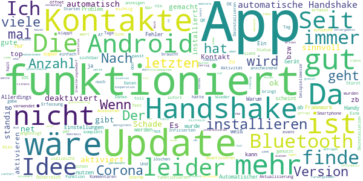

# Stopp Corona
App version ``2.0.5.1081-QA_250``

Analyzed with [covid-apps-observer](http://github.com/covid-apps-observer) project, version ``0.1``

## App overview
| | |
|-------------------------|-------------------------| 
| **Name**&nbsp;&nbsp;&nbsp;&nbsp;&nbsp;&nbsp;&nbsp;&nbsp;&nbsp;&nbsp;&nbsp;&nbsp;&nbsp;&nbsp;&nbsp;&nbsp;&nbsp;&nbsp;&nbsp;&nbsp;&nbsp;&nbsp;&nbsp;&nbsp;&nbsp;&nbsp;&nbsp;&nbsp;&nbsp;&nbsp;&nbsp;&nbsp;&nbsp;&nbsp;&nbsp;&nbsp;&nbsp;&nbsp;&nbsp;&nbsp;  | Stopp Corona |
| **Unique identifier** | at.roteskreuz.stopcorona |
| **Link to Google Play** | [https://play.google.com/store/apps/details?id=at.roteskreuz.stopcorona](https://play.google.com/store/apps/details?id=at.roteskreuz.stopcorona) |
| **Summary**  | Österreichs Corona-Warnungs-App |
| **Privacy policy** | [https://www.roteskreuz.at/site/faq-app-stopp-corona/datenschutzinformation-zur-stopp-corona-app/](https://www.roteskreuz.at/site/faq-app-stopp-corona/datenschutzinformation-zur-stopp-corona-app/) |
| **Latest version** | 2.0.5.1081-QA_250 |
| **Last update** | 2020-10-09 09:23:44 |
| **Recent changes** | Anpassung der Mobile App an aktualisiertes Framework Verbesserung des Background checks |
| **Installs**  | 100.000+ |
| **Category** | Medizin |
| **First release** | 25.03.2020 |
| **Size**  | 5,4M |
| **Supported Android version**  | 6.0 oder höher |

### Description
> Das Österreichische Rote Kreuz veröffentlicht die “Stopp Corona”-App im Auftrag des Gesundheitsministeriums, der obersten Gesundheitsbehörde Österreichs. 
 Mit der „Stopp Corona“-App lassen sich Begegnungen mit Freunden, der Familie oder Arbeitskollegen ganz einfach und anonymisiert speichern. Sollten Sie sich mit Corona infizieren, können Sie einfach über die App eine Meldung abgeben und Ihre Kontakte aus den letzten 2 Tagen werden anonym benachrichtigt. 
 Das gleiche gilt natürlich umgekehrt. Gibt eine Ihrer gespeicherten Begegnungen an, sich infiziert zu haben, erhalten Sie umgehend eine Nachricht und Sie können entsprechende Maßnahmen ergreifen. Dazu zählen vor allem:
 -	Abstand halten
 -	Soziale Kontakte vermeiden
 -	Sich vorsichtshalber in Selbstisolation begeben
 Beim Einsetzen von Symptomen kontaktieren Sie bitte telefonisch ihre Hausärztin oder den Hausarzt. Wenn das nicht möglich ist, rufen Sie die die Nummer 1450 an.
 Jedenfalls gilt: Bitte nicht die Ärztin/oder den Arzt persönlich aufsuchen und auch nicht ins Krankenhaus fahren. Bei einem medizinischen Notfall: 144 rufen.
 Gemeinsam unterbrechen wir so die Infektionskette.
 So schützen Sie nicht nur sich selbst, sondern verhindern auch, dass andere sich infizieren.
 Nutze Sie den digitalen Handshake
 Bis wir uns wieder unbedacht die Hände bei der Begrüßung reichen können, wird es wohl noch einige Zeit dauern. In der Zwischenzeit nutzen Sie einfach den digitalen Handshake der „Stopp Corona“-App.
 Haben Sie und die Person mit der Sie sich treffen die App installiert, speichert die App, dass Sie sich getroffen haben. Diese Daten werden anonymisiert gespeichert. Erkrankt einer von Ihnen beiden an dem Corona-Virus, erhält der andere eine Nachricht.
 Machen Sie den Corona-Selbstcheck
 Wie geht es Ihnen heute? Anhand eines klinisch geprüften Fragebogens können Sie sich täglich auf Corona-Symptome überprüfen.
 Corona-Verdachtsmeldung
 Entsprechen die Symptome dem Corona-Virus, können Sie eine Meldung über die App abgeben. Das ist wichtig, damit sich nicht noch mehr Menschen mit dem Virus infizieren. Ihre Begegnungen werden dann anonymisiert benachrichtigt. Keine Sorge, sie erhalten also keine persönlichen Angaben. 
 Anschließend bleiben Sie bitte Zuhause und kontaktieren Sie Ihre Hausärztin oder Ihren Hausarzt telefonisch. Wenn das nicht möglich ist rufen Sie die Nummer 1450 an.
 Fahren Sie nicht ins Krankenhaus und suchen Sie Ihren Arzt nicht persönlich auf.
 Ärztliche Bestätigung
 Stellt ein Arzt den Corona-Virus fest, können Sie ebenfalls eine Meldung abgeben. Auch hier werden Ihre Begegnungen anonymisiert benachrichtigt.
 Die App entstand in Partnerschaft mit der UNIQA Stiftung.
 Konzept und Realisierung in Zusammenarbeit und mit Unterstützung von Accenture Österreich und basiert auf dem Contacttracing-Framework von Apple und Google
 Schau auf Dich. Schau auf mich. So schützen wir uns.
 Link zum Open Source Software Projekt: https://github.com/austrianredcross/stopp-corona-android

### User interface
The developers of the app provide the following screenshots in the Google play store.
| | | |
|:-------------------------:|:-------------------------:|:-------------------------:|
 |   |   |   | 
 |   |   |   | 
 |   |  

## Development team
In the following we report the main information provided by the development team in the Google play store.

| | |
|-------------------------|-------------------------|
| **Developer**  | Österreichisches Rotes Kreuz |
| **Website**  | [https://www.roteskreuz.at](https://www.roteskreuz.at) |
| **Email** | service@roteskreuz.at |
| **Physical address**  | [Wiedner Hauptstrasse 32 1040 Wien Österreich](https://www.google.com/maps/search/Wiedner%20Hauptstrasse%2032%201040%20Wien%20Österreich) (Google Maps) |
| **Other developed apps**  | [https://play.google.com/store/apps/developer?id=%C3%96sterreichisches+Rotes+Kreuz](https://play.google.com/store/apps/developer?id=%C3%96sterreichisches+Rotes+Kreuz) |

## Android support

| | |
|-------------------------|-------------------------|
| **Declared target Android version**  | Pie, version 9 (API level 28) |
| **Effective target Android version**  | Pie, version 9 (API level 28) |
| **Minimum supported Android version**  | Marshmallow, version 6.0 (API level 23) |
| **Maximum target Android version**  | - |

The larger the difference between the minimum and maximum supported Android versions, the better. A larger difference means a wider audience. For example, old phones have a very low Android version, so a high minimum supported Android version means that the app cannot be used by users with old phones, thus leading to accessibility problems. 

## Requested permissions

In the following we report the complete list of the permissions requested by the app. 

| **Permission** | **Protection level** | **Description** | 
|-------------------------|-------------------------|-------------------------|
 **android.permission ACCESS_NETWORK_STATE** | Normal | Allows applications to access information about networks. 
 **android.permission BLUETOOTH** | Normal | Allows applications to connect to paired bluetooth devices. 
 **android.permission FOREGROUND_SERVICE** | Normal | Allows a regular application to use Service.startForeground. 
 **android.permission INTERNET** | Normal | Allows applications to open network sockets. 
 **android.permission RECEIVE_BOOT_COMPLETED** | Normal | Allows an application to receive the Intent.ACTION_BOOT_COMPLETED that is broadcast after the system finishes booting. 
 **android.permission REQUEST_IGNORE_BATTERY_OPTIMIZATIONS** | Normal | Permission an application must hold in order to use Settings.ACTION_REQUEST_IGNORE_BATTERY_OPTIMIZATIONS. 
 **android.permission WAKE_LOCK** | Normal | Allows using PowerManager WakeLocks to keep processor from sleeping or screen from dimming. 

## Mentioned servers

| **Server** | **Registrant** | **Registrant country** | **Creation date** | 
|-------------------------|-------------------------|-------------------------|-------------------------|
 | google.com | Google LLC | :us: US | 1997-09-15 04:00:00 |
 | prod-rca-coronaapp-fd.net | Domains By Proxy, LLC | :us: US | 2020-04-20 20:16:19 |

## Security analysis 

Below we report the main security warnings raised by our execution of the [Androwarn](https://github.com/maaaaz/androwarn) security analysis tool.

**Connection interfaces exfiltration**
> - This application reads details about the currently active data network 
> - This application tries to find out if the currently active data network is metered 

**Telephony services abuse**
> - This application makes phone calls 

**Suspicious connection establishment**
> - This application opens a Socket and connects it to the remote address '; port is out of range' on the 'N/A' port  
> - This application opens a Socket and connects it to the remote address 'Lcom/android/tools/r8/GeneratedOutlineSupport;->outline16(Ljava/lang/String;)Ljava/lang/StringBuilder;' on the 'N/A' port  
> - This application opens a Socket and connects it to the remote address 'Ljava/net/Proxy;->type()Ljava/net/Proxy$Type;' on the 'N/A' port  
> - This application opens a Socket and connects it to the remote address 'timeout' on the 'N/A' port  

## User ratings and reviews

Below we provide information about how end users are reacting to the app in terms of ratings and reviews in the Google Play store.

### Ratings

The Stopp Corona app has been installed by more than **100000** times. At this time, **3070** rated the app and its average score is **3.309904**. Below we show the distribution of the ratings across the usual star-based rating of Google Play

:star::star::star::star::star:: 1344

:star::star::star::star:: 255

:star::star::star:: 353

:star::star:: 245

:star:: 873

### Reviews 

#### 5-star reviews

> Alles o. K. Auch kein erhöhter Stromverbrauch zu bemerken  :date: __2020-11-30 14:08:51__

> Habe sie noch nicht benötigt.  :date: __2020-11-30 12:25:25__

> Ich bin der Meinung, dass es wichtig ist diese App zu nutzen. Ich nehme den Datenschutz genau und habe aber nicht den Eindruck mir wichtige Informationen damit preiszugeben.  :date: __2020-11-30 12:09:28__

> optimale Idee  :date: __2020-11-30 10:55:08__

> wenn man für die Gesellschaft was tun kann und Leben Retten kann ,klar installiere ich Sie !!!  :date: __2020-11-30 10:46:06__

> Funktioniert jetzt!  :date: __2020-11-30 10:32:18__

> Funktioniert! Zur Anfang gabe es viele kritische Meldungen und Probleme zur App, inzwischen funktioniert diese problemlos. Sicher eine sinnvolle Hilfe zur Bewältigung einer allgemein herausfordernden Zeit.  :date: __2020-11-27 18:29:29__

> Sehr gute app  :date: __2020-11-26 20:13:22__

> App macht Sinn 😀  :date: __2020-11-25 20:24:59__

> Interessant wäre eine Statistik wie lange ich in der Nähe eines Kontaktes war (egal ob Krank oder nicht) Die Stunde und Anzahl der Personen mit Dauer unter 5 Minuten, 5-10 Minuten, 10-15 Minuten und Anzahl der Kontakte mit Dauer über 15 Minuten.... Okey Datenschutz, aber ich könnte sowieso sehen wer in der Nähe wie lang ist, nur will ich nicht den Aufwand treiben, wenn der Computer das übernehmen kann....  :date: __2020-11-23 17:40:43__

#### 4-star reviews

> Wenn das alle hätten wäre das Contact-Tracing ein Selbstläufer. Aber das UI ist halt sehr lahm. Wenn man die Statistik über die Handshakes wenigstens gleich auf der ersten Seite hätte, dass man irgend eine Aktivität sieht.  :date: __2020-11-27 10:55:40__

> Alles gut 👍 s  :date: __2020-11-23 20:15:40__

> Update gibt es nicht?  :date: __2020-11-23 19:41:11__

> Wie in anderen Kommentaren wäre Feedback hilfreich wie viele Kontakte in den letzten x Tagen erkannt wurden. Sonst top.  :date: __2020-11-17 06:41:57__

> Habe erst heute die app runtergeladen  :date: __2020-11-16 17:58:07__

> Mich würde interessieren ob der Handsshake per Bluetooth auch noch funktioniert wenn ich permanent per Bluetooth mit meinen Fitness Armband Verbunden bin. Also ob dennoch Bluetooth auch für den Handshake genutzt werden kann  :date: __2020-11-13 06:56:30__

> Gute App, mit Erweiterungsbedarf. - Corona Testergebnis via QR Code in App abfragen (Idee: jeder der mal einen Test gemacht hat, hat die App dann installiert) - mehrere Corona Warn Apps gleichzeitig aktivieren (zb DE und AT, oder Kooperation zwischen diesen) - Anzahl der Kontakte anzeigen, bzw dem Nutzer anders sichtbar machen ob/das alles funktioniert  :date: __2020-11-10 17:14:36__

> Leider ist es sehr nervig, wenn man mehrmals am Tag an Kontakt mit Corona-Infizierten erinnert wird bzw. gefragt wird wie man sich fühlt...  :date: __2020-11-09 23:08:19__

> Die App finde ich gut und informativ  :date: __2020-10-26 20:08:08__

> Die App ist leider nicht das Beste, aber notwendig. Für alle die die Zufallsbegegnungen sehen wollen, diese sind in den App-Einstellungen ersichtlich. Dazu in den Android Einstellungen nach COVID suchen.  :date: __2020-10-26 20:06:58__

#### 3-star reviews

> Muss noch ausgereift werden! Ansonsten ne gute Idee... 😉  :date: __2020-11-30 11:47:31__

> Ich versteh die app nicht, sollte sie nicht nur über Bluetooth arbeiten? Warum muss ich dann die Standortbestimmung einschalten? Ich hab die sehr absichtlich deaktiviert weil es für eine normale Nutzerin einfach überhaupt nicht nachvollziehbar ist, welche Daten da an wen geschickt werden...  :date: __2020-11-24 16:00:21__

> Grundsätzlich ist die Idee sehr gut. Allerdings: - Tage nachdem die Erkrankung gemeldet und die Freigabe zur notifikation der Kontakte erteilt werde werde ich zyklisch gefragt, ob ich mehr Kontakte notifizieren möchte. BITTE: am ersten tag ALLE potentiellen Kontakte notifizieren. - Ich werde 3-4 mal pro tag gefragt, ob ich symptome habe. Kann sich die app das nicht mal 24 stunden lang merken? Wenn sich wirklich was ändert kann ich ja immer noch ins Menü gehen. - Nachdem ich wieder Gesund bin und aus der Quarantäne raus bin - wo bitte kann ich das einstellen - ich werde noch immer als "Bleiben sie in Quarantäne" eingestuft. Musste den Handshake deaktiviern, um nicht irgendwelche Leute beim Einkaufen plötzlich als K1 zu klassifizieren. Alles in allem: sehr gute Idee, aber die Umsetzung bietet noch viele Chancen.  :date: __2020-11-24 09:03:21__

> Leider kooperiert die App nicht mit anderen "Corona Apps". Für mich, im Grenzgebiet zur Schweiz wohnend, ist es sehr umständlich ständig von der Ö-App zur Ch-App umzuschalten. Beide Apps lassen nur jeweils einen Zugriff auf Bluetooth zu.  :date: __2020-11-20 06:45:24__

> Man sieht nicht gut, ob und wie die App funktioniert. Was heißt unter gespeicherte IDs "Anzahl der Schlüssel" ? ..wenn das die Anzahl an möglichen Kontakten, die die App haben, sein soll, dann kann das nicht stimmen. Viel zu viel.  :date: __2020-11-19 16:14:51__

> Fragt immer wieder das gleiche  :date: __2020-11-17 14:49:06__

> Es wäre wichtig beobachten zu können, dass die App auch tatsächlich aktiv ist. am interessantesten wäre es doch die Anzahl der gespeicherten Handshakes und das jeweilige Datum dazu anzuzeigen! Ich finde auch ein akustisches Signal im Falle eines Handshakes sehr interessant! So hat man eigentlich das Gefühl dass die app nichts tut und ist sich auch nicht sicher ob sie wirklich funktioniert! Die Anzeige der Anzahl der Handshakes wäre auch hilfreich um das eigene Verhalten zu überprüfen!  :date: __2020-11-17 02:57:23__

> Auf älteren iPhones (konkret iphone6) kann die App nicht installiert werden  :date: __2020-11-16 14:21:37__

> Können wir uns einfach darauf einigen, dass wir alle die deutsche Corona App verwenden? Aus dieser hier wird leider nichts mehr - kein klares Feedback in der App, keine Beantwortung von Fragen, keine Weiterentwicklung...  :date: __2020-11-16 12:46:59__

> Ansich eine gute App, - nur leider Wertlos wenn sie so gut wie niemand (spreche von meinem Freundes, u. Bekanntenkreis) installiert hat. Wäre nicht schlecht wenn es eine Implementierung in FB, Twitter, Insta & Co gäbe, das hat fast jede/r 😜  :date: __2020-11-16 10:22:37__

#### 2-star reviews

> Benachrichtigungen und Warnhinweise kommen nach Verdachtsfall (Test negativ) und Ablauf der trotzdem eingehaltenen Quarantäne immer noch täglich mehrmals lassen sich nicht mehr deaktivieren. Das führt dazu, dass ich die App deinstallieren möchte obwohl ich sie generell gut fände. Die Prozesse gehören dringend überarbeitet!  :date: __2020-11-23 08:13:14__

> Ich bin nicht sehr begeistert. Man muss das Handy immer am Körper haben. Besucht man die Eltern und hängt seine Jacke samt Handy an den Kleiderständer, kann das Handy nichts messen. Und wenn das Handy ausgeht, muss man die App extra einschalten. (Genauer: dass sie im Hintergrund läuft). Natürlich vergesse ich das jedes dritte Mal oder so, und dann geht die App nicht. Kurz:es ist umständlich, man muss immer an sein Handy denken, und man darf das Handy nicht ausgehen lassen.  :date: __2020-11-21 13:41:46__

> Nach zwei Wochen nochimmer 0 mögliche Begegnungen! Hier können meiner Meinung nur die Handshakes gemeint sein, nachdem man bei einem pos. Kontakt sofort informiert werden sollte. Haben auch längere Zeit zwei Handys mit der App nebeneinander liegen lassen (Bluetooth, WLAN, Standort aktiv) um einen Handshake zu erzeugen. Hat nicht funktioniert. Bitte um Rückmeldung bzw. Behebung, damit die App endlich funktioniert und auch weiterempfohlen werden kann!! Sie ist zu kompliziert und unübersichtlich.  :date: __2020-11-21 12:01:35__

> Verbraucht viel Akku und bringt nicht wirklich was  :date: __2020-11-19 06:46:23__

> Grundsätzlich würde ich den Gedanken teilen und will auch die App nutzen, aber die App erkennt nicht das bluetooth aktiv ist. Somit nicht einsetzbar.  :date: __2020-11-18 07:30:23__

> Also, soweit ich diese App verstanden habe, soll sich jeder der Krankheitssymtome hat sich eintragen und die Gesunden davor warnen, ACHTUNG! da ist ein Kranker in der Nähe. Erstens wenn man Coronasymtome hat, soll man nicht sowieso nicht mehr in der Öffentlichkeit aufhalten, und zweitens, bitte wer gibt den freiwillig zu, dass er eventuell diesen Virus in sich trägt. Ist nett gemeint, aber .........tun wir das??  :date: __2020-11-17 20:13:36__

> Gute Absicht aber leider sehr schlechte Umsetzung. Der User hat generell das Gefühl, es passiert nichts. Als mindest-Info sollte man gleich am Startbildschirm Zähler für n Kontakte, Zähler je Tag, eventuell auch Zähler >15 Min. sehen. Eine APP die nichts zeigt - was soll das sein?  :date: __2020-11-17 17:29:13__

> Installation fertig,und jetzt??  :date: __2020-11-17 11:01:04__

> Gut gemeint aber leider nicht gut umgesetzt. Wenn ich die App monatelang auf meinem Handy habe, wäre zumindest interessant mit wie vielen anderen Personen die ich getroffen habe sie sich bereits synchronisiert hat. Derzeit sieht es einfach nur danach aus als würde die App nichts tun / nichts können. Zuviel verlangt, dass da steht: Sie haben sich bereits mit XX unterschiedlichen Personen synchronisiert?  :date: __2020-11-15 17:16:59__

> Ich bin leider Corona Positiv getestet worden & obwohl ich Bluetooth&GPS deaktiviert hatte, da in Quarantäne, hatte ich 2 neue Handshakes - woher? Keiner im Haus hat die APP und ganz nice - ich kann mich nicht mehr Gesundmelden, obwohl ich bereits aus der Quarantäne entlassen bin!! Wie diese Handshakes von statten gehen sind mit ein Rätsel und 6x am Tag Symptome abfragen und obwohl positiv dann die allg. Empfehlungen... naja Auch bei den Symptomen könnte nachgebessert werden!  :date: __2020-11-12 19:05:12__

#### 1-star reviews

> Die Bestätigung funktioniert nicht  :date: __2020-11-30 13:51:57__

> Verbraucht extrem viel Akku und was den Datenschutz angeht, bin ich sehr skeptisch. Leider kann ich diese App so keinesfalls empfehlen!!  :date: __2020-11-30 13:46:37__

> Finde die Idee sehr gut aber die App sollte Automatisiert werden. Läuft im Hintergrund und jeder der BT aktiviert hat und in die Nähe kommt wird verbunden. Man kann ja eine Push Mitteilung bekommen mit Bestätigung. Willst du? Ja/Nein. Update 30.11. Zu hohe Anforderungen an das Betriebssystem. IPhone 5 geht nicht, Samsung S3 geht nicht, Iphone4s geht nicht. Wer zahlt neues Handy, die Regierung und die unfähigen Programmierer. Weniger Anforderung=mehr Nutzer.  :date: __2020-11-30 13:26:16__

> Naja, habe es jetzt geladen. Bluetooth etc aktiviert und Berechtigungen erteilt. App sagt aber dennoch das ein Fehler aufgetreten ist, soll Bluetooth aktivieren 🧐  :date: __2020-11-30 10:51:39__

> Leider eine Enttäuschung. Habe die App fast 2 Monate schon in Nutzung. Anfangs vermittelt dir die App ein Gefühl von Sicherheit. Nachdem ich an Corona erkrankt bin, habe ich sofort nach behördlicher positiver Testbestätigung die App auf "erkrankt" gestellt. Nach Ablauf der Quarantäne bin ich offiziell wieder gesund. Nur für die App bist du immer krank. Da gibt es keine Möglichkeit eine Erkrankung wieder auf gesund zu stellen. Auf Anfrage per Mail (vor 5 Tagen) wird nicht reagiert. Deinstalliert  :date: __2020-11-30 07:43:08__

> Verständigung nur von Kontakten der letzten zwei Tage (siehe FAQ) macht bei der derzeitigen Test-Situation in 🇦🇹 die App obsolet! Weiterhin keine 🇪🇺Lösung 1 Stern für Github  :date: __2020-11-29 15:29:44__

> Vermutlich sinnlos ich will das mein Handy scheppert bevor sich eine Seuche Schleuder nähert.  :date: __2020-11-29 15:08:43__

> Verlangt ohne Erklärung meine Telefonnummer zur Verarbeitung durch das Rote Kreuz. Damit ist man eindeutig zuordenbar dank der Registrierungspflicht durch die Rechtsextremen. Ist ganz klar, was die türkise Truppe damit bezweckt, nach dem Terroranschlag von Wien ist deswegen auch keiner von den Versagern zurückgetreten. Und Corona wird immer nur im letzten Moment bekämpft, und die Arbeitskräfte ausgequetscht. Es geht nur um Kontrolle und Niederhalten der Bevölkerung für die reichen Säcke.  :date: __2020-11-29 13:19:46__

> Ohne aktuelle Meldung -z.B. per App-Symbolindikator - über Handshake's werde ich es nicht wieder downloaden. Bisher wurden auch Handshake's angezeigt wenn ich zuhause war und kein weiteres Corona-App.-,Handy im Haus war. Erst wenn ich sicher ein Feedback aktuell erhalte, dass die App was tut werd' ich es wieder installieren.  :date: __2020-11-29 10:48:09__

> Behindert andere Bluetooth Anwendungen in ihrer Ausführung. Synchronisation mit meiner Polar Uhr konnte nicht mehr durchgeführt werden. Nach der Deinstallation der Corona App ging es wieder einwandfrei. NOGO  :date: __2020-11-28 17:21:15__

