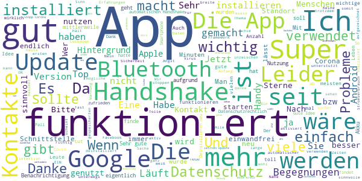

# Stopp Corona
App version ``2.0.5.1081-QA_250``

Analyzed with [covid-apps-observer](http://github.com/covid-apps-observer) project, version ``0.1``

## App overview
| | |
|-------------------------|-------------------------| 
| **Name**&nbsp;&nbsp;&nbsp;&nbsp;&nbsp;&nbsp;&nbsp;&nbsp;&nbsp;&nbsp;&nbsp;&nbsp;&nbsp;&nbsp;&nbsp;&nbsp;&nbsp;&nbsp;&nbsp;&nbsp;&nbsp;&nbsp;&nbsp;&nbsp;&nbsp;&nbsp;&nbsp;&nbsp;&nbsp;&nbsp;&nbsp;&nbsp;&nbsp;&nbsp;&nbsp;&nbsp;&nbsp;&nbsp;&nbsp;&nbsp;  | Stopp Corona |
| **Unique identifier** | at.roteskreuz.stopcorona |
| **Link to Google Play** | [https://play.google.com/store/apps/details?id=at.roteskreuz.stopcorona](https://play.google.com/store/apps/details?id=at.roteskreuz.stopcorona) |
| **Summary**  | Österreichs Corona-Warnungs-App |
| **Privacy policy** | [https://www.roteskreuz.at/site/faq-app-stopp-corona/datenschutzinformation-zur-stopp-corona-app/](https://www.roteskreuz.at/site/faq-app-stopp-corona/datenschutzinformation-zur-stopp-corona-app/) |
| **Latest version** | 2.0.5.1081-QA_250 |
| **Last update** | 2020-10-09 09:23:44 |
| **Recent changes** | Anpassung der Mobile App an aktualisiertes Framework Verbesserung des Background checks |
| **Installs**  | 100.000+ |
| **Category** | Medizin |
| **First release** | 25.03.2020 |
| **Size**  | 5,4M |
| **Supported Android version**  | 6.0 oder höher |

### Description
> Das Österreichische Rote Kreuz veröffentlicht die “Stopp Corona”-App im Auftrag des Gesundheitsministeriums, der obersten Gesundheitsbehörde Österreichs. 
 Mit der „Stopp Corona“-App lassen sich Begegnungen mit Freunden, der Familie oder Arbeitskollegen ganz einfach und anonymisiert speichern. Sollten Sie sich mit Corona infizieren, können Sie einfach über die App eine Meldung abgeben und Ihre Kontakte aus den letzten 2 Tagen werden anonym benachrichtigt. 
 Das gleiche gilt natürlich umgekehrt. Gibt eine Ihrer gespeicherten Begegnungen an, sich infiziert zu haben, erhalten Sie umgehend eine Nachricht und Sie können entsprechende Maßnahmen ergreifen. Dazu zählen vor allem:
 -	Abstand halten
 -	Soziale Kontakte vermeiden
 -	Sich vorsichtshalber in Selbstisolation begeben
 Beim Einsetzen von Symptomen kontaktieren Sie bitte telefonisch ihre Hausärztin oder den Hausarzt. Wenn das nicht möglich ist, rufen Sie die die Nummer 1450 an.
 Jedenfalls gilt: Bitte nicht die Ärztin/oder den Arzt persönlich aufsuchen und auch nicht ins Krankenhaus fahren. Bei einem medizinischen Notfall: 144 rufen.
 Gemeinsam unterbrechen wir so die Infektionskette.
 So schützen Sie nicht nur sich selbst, sondern verhindern auch, dass andere sich infizieren.
 Nutze Sie den digitalen Handshake
 Bis wir uns wieder unbedacht die Hände bei der Begrüßung reichen können, wird es wohl noch einige Zeit dauern. In der Zwischenzeit nutzen Sie einfach den digitalen Handshake der „Stopp Corona“-App.
 Haben Sie und die Person mit der Sie sich treffen die App installiert, speichert die App, dass Sie sich getroffen haben. Diese Daten werden anonymisiert gespeichert. Erkrankt einer von Ihnen beiden an dem Corona-Virus, erhält der andere eine Nachricht.
 Machen Sie den Corona-Selbstcheck
 Wie geht es Ihnen heute? Anhand eines klinisch geprüften Fragebogens können Sie sich täglich auf Corona-Symptome überprüfen.
 Corona-Verdachtsmeldung
 Entsprechen die Symptome dem Corona-Virus, können Sie eine Meldung über die App abgeben. Das ist wichtig, damit sich nicht noch mehr Menschen mit dem Virus infizieren. Ihre Begegnungen werden dann anonymisiert benachrichtigt. Keine Sorge, sie erhalten also keine persönlichen Angaben. 
 Anschließend bleiben Sie bitte Zuhause und kontaktieren Sie Ihre Hausärztin oder Ihren Hausarzt telefonisch. Wenn das nicht möglich ist rufen Sie die Nummer 1450 an.
 Fahren Sie nicht ins Krankenhaus und suchen Sie Ihren Arzt nicht persönlich auf.
 Ärztliche Bestätigung
 Stellt ein Arzt den Corona-Virus fest, können Sie ebenfalls eine Meldung abgeben. Auch hier werden Ihre Begegnungen anonymisiert benachrichtigt.
 Die App entstand in Partnerschaft mit der UNIQA Stiftung.
 Konzept und Realisierung in Zusammenarbeit und mit Unterstützung von Accenture Österreich und basiert auf dem Contacttracing-Framework von Apple und Google
 Schau auf Dich. Schau auf mich. So schützen wir uns.
 Link zum Open Source Software Projekt: https://github.com/austrianredcross/stopp-corona-android

### User interface
The developers of the app provide the following screenshots in the Google play store.
| | | |
|:-------------------------:|:-------------------------:|:-------------------------:|
 |   |   |   | 
 |   |   |   | 
 |   |  

## Development team
In the following we report the main information provided by the development team in the Google play store.

| | |
|-------------------------|-------------------------|
| **Developer**  | Österreichisches Rotes Kreuz |
| **Website**  | [https://www.roteskreuz.at](https://www.roteskreuz.at) |
| **Email** | service@roteskreuz.at |
| **Physical address**  | [Wiedner Hauptstrasse 32 1040 Wien Österreich](https://www.google.com/maps/search/Wiedner%20Hauptstrasse%2032%201040%20Wien%20Österreich) (Google Maps) |
| **Other developed apps**  | [https://play.google.com/store/apps/developer?id=%C3%96sterreichisches+Rotes+Kreuz](https://play.google.com/store/apps/developer?id=%C3%96sterreichisches+Rotes+Kreuz) |

## Android support

| | |
|-------------------------|-------------------------|
| **Declared target Android version**  | Pie, version 9 (API level 28) |
| **Effective target Android version**  | Pie, version 9 (API level 28) |
| **Minimum supported Android version**  | Marshmallow, version 6.0 (API level 23) |
| **Maximum target Android version**  | - |

The larger the difference between the minimum and maximum supported Android versions, the better. A larger difference means a wider audience. For example, old phones have a very low Android version, so a high minimum supported Android version means that the app cannot be used by users with old phones, thus leading to accessibility problems. 

## Requested permissions

In the following we report the complete list of the permissions requested by the app. 

| **Permission** | **Protection level** | **Description** | 
|-------------------------|-------------------------|-------------------------|
 **android.permission ACCESS_NETWORK_STATE** | Normal | Allows applications to access information about networks. 
 **android.permission BLUETOOTH** | Normal | Allows applications to connect to paired bluetooth devices. 
 **android.permission FOREGROUND_SERVICE** | Normal | Allows a regular application to use Service.startForeground. 
 **android.permission INTERNET** | Normal | Allows applications to open network sockets. 
 **android.permission RECEIVE_BOOT_COMPLETED** | Normal | Allows an application to receive the Intent.ACTION_BOOT_COMPLETED that is broadcast after the system finishes booting. 
 **android.permission REQUEST_IGNORE_BATTERY_OPTIMIZATIONS** | Normal | Permission an application must hold in order to use Settings.ACTION_REQUEST_IGNORE_BATTERY_OPTIMIZATIONS. 
 **android.permission WAKE_LOCK** | Normal | Allows using PowerManager WakeLocks to keep processor from sleeping or screen from dimming. 

## Mentioned servers

| **Server** | **Registrant** | **Registrant country** | **Creation date** | 
|-------------------------|-------------------------|-------------------------|-------------------------|
 | google.com | Google LLC | :us: US | 1997-09-15 04:00:00 |
 | prod-rca-coronaapp-fd.net | Domains By Proxy, LLC | :us: US | 2020-04-20 20:16:19 |

## Security analysis 

Below we report the main security warnings raised by our execution of the [Androwarn](https://github.com/maaaaz/androwarn) security analysis tool.

**Connection interfaces exfiltration**
> - This application reads details about the currently active data network 
> - This application tries to find out if the currently active data network is metered 

**Telephony services abuse**
> - This application makes phone calls 

**Suspicious connection establishment**
> - This application opens a Socket and connects it to the remote address '; port is out of range' on the 'N/A' port  
> - This application opens a Socket and connects it to the remote address 'Lcom/android/tools/r8/GeneratedOutlineSupport;->outline16(Ljava/lang/String;)Ljava/lang/StringBuilder;' on the 'N/A' port  
> - This application opens a Socket and connects it to the remote address 'Ljava/net/Proxy;->type()Ljava/net/Proxy$Type;' on the 'N/A' port  
> - This application opens a Socket and connects it to the remote address 'timeout' on the 'N/A' port  

## User ratings and reviews

Below we provide information about how end users are reacting to the app in terms of ratings and reviews in the Google Play store.

### Ratings

The Stopp Corona app has been installed by more than **100000** times. At this time, **3070** rated the app and its average score is **3.309904**. Below we show the distribution of the ratings across the usual star-based rating of Google Play

:star::star::star::star::star:: 1344

:star::star::star::star:: 255

:star::star::star:: 353

:star::star:: 245

:star:: 873

### Reviews 

#### 5-star reviews

> Ich verwende das App vom Anfang an SUPER  :date: __2020-11-16 11:45:27__

> Jetzt ist die App besser. Solange Bluetooth ausgeschaltet ist, erscheint eine Benachrichtigung zur Erinnerung. Damit kann ich leben. Wenn ich einkaufen gehe, schalte ich Bluetooth ein, dann sollte es funktionieren.  :date: __2020-11-16 11:18:51__

> mittlerweile sehr gut und Datenschutz wird auch optimal sichergestellt  :date: __2020-11-16 07:50:06__

> Sehr positiv  :date: __2020-11-11 17:23:28__

> Toll Super  :date: __2020-11-11 15:51:08__

> Sinnvoll und wichtig zum contact tracing. Leider zu wenig genutzt.  :date: __2020-11-10 22:50:43__

> 👏👏  :date: __2020-11-09 12:01:55__

> Tolles App  :date: __2020-11-07 20:03:14__

> Fuhle mich besser mit.dieser epp heisse elsabeth wimmer geboren 13 12 1950  :date: __2020-11-06 01:12:22__

> Super, danke  :date: __2020-11-02 20:58:39__

#### 4-star reviews

> Mich würde interessieren ob der Handsshake per Bluetooth auch noch funktioniert wenn ich permanent per Bluetooth mit meinen Fitness Armband Verbunden bin. Also ob dennoch Bluetooth auch für den Handshake genutzt werden kann  :date: __2020-11-13 06:56:30__

> Gute App, mit Erweiterungsbedarf. - Corona Testergebnis via QR Code in App abfragen (Idee: jeder der mal einen Test gemacht hat, hat die App dann installiert) - mehrere Corona Warn Apps gleichzeitig aktivieren (zb DE und AT, oder Kooperation zwischen diesen) - Anzahl der Kontakte anzeigen, bzw dem Nutzer anders sichtbar machen ob/das alles funktioniert  :date: __2020-11-10 17:14:36__

> Leider ist es sehr nervig, wenn man mehrmals am Tag an Kontakt mit Corona-Infizierten erinnert wird bzw. gefragt wird wie man sich fühlt...  :date: __2020-11-09 23:08:19__

> Die App finde ich gut und informativ  :date: __2020-10-26 20:08:08__

> Die App ist leider nicht das Beste, aber notwendig. Für alle die die Zufallsbegegnungen sehen wollen, diese sind in den App-Einstellungen ersichtlich. Dazu in den Android Einstellungen nach COVID suchen.  :date: __2020-10-26 20:06:58__

> Ist ok. Wär cool Wenn's einen Counter für die Handshakes gäbe.  :date: __2020-10-25 21:16:56__

> Verbesserungsfähig, aber einfach und sinnvoll, sollte jede/r nutzen. Ein Widget wäre praktisch, bei dem man nur den Handshake aktivieren muss und Bluetooth sowie GPS automatisch mit aktiviert werden, ohne dreimal bestätigen zu müssen. Schnell und unkompliziert am Startbildschirm plazierbar, weil man ja nicht laufend alles eingeschalteten hat. Wird dann vielleicht für beispielsweise kurze Einkäufe auch eher aktiviert.  :date: __2020-10-25 18:43:37__

> Seit dem letzten Update beendet sich die App auf kein Android Gerät nicht mehr....  :date: __2020-10-23 12:01:25__

> Coole Idee aber in Österreich niemand nutzt das  :date: __2020-10-19 18:14:29__

> Super App aber endwarnung geben funktionirt nicht schon 20 mal probiert immer wieder Server fehler  :date: __2020-10-14 13:30:24__

#### 3-star reviews

> Können wir uns einfach darauf einigen, dass wir alle die deutsche Corona App verwenden? Aus dieser hier wird leider nichts mehr - kein klares Feedback in der App, keine Beantwortung von Fragen, keine Weiterentwicklung...  :date: __2020-11-16 12:46:59__

> Ansich eine gute App, - nur leider Wertlos wenn sie so gut wie niemand (spreche von meinem Freundes, u. Bekanntenkreis) installiert hat. Wäre nicht schlecht wenn es eine Implementierung in FB, Twitter, Insta & Co gäbe, das hat fast jede/r 😜  :date: __2020-11-16 10:22:37__

> Gute Idee schlecht vermarktet und mittelmäßig umgesetzt. Sehr wenig Menschen nutzen die App (vermutlich aus Angst eine Datenkrake zu installieren) und ich kann mich als wieder gesundeter nicht mehr gesund melden. Stattdessen nervte mich die App mit unzähligen Benachrichtigungen während ich krank war. Hab sie jetzt wieder deinstalliert.  :date: __2020-11-15 01:03:36__

> Also ich habe auch den Verdacht dass alle Bluetooth Geräte gespeichert werden... sobald ich mein Headset einschalte.... zack, allein zuHause zw 21 und 4 uhr Früh immer Laptop, Bluetooth Lautsprecher alles Meldungen wo definitiv nur ich mit diesen Geräten in Sendereichweite bin ..... Also was muss ich jetzt machen wenn mein Laptop zufälligerweise Covid Positiv getestet wird? Müssen dann die Lautsprecher auch in Quarantäne, oder müssen sie sich nur testen lassen?  :date: __2020-11-11 11:26:04__

> Diese App macht für mich sinn, jedoch erhalte ich am Tag über 20 Benachrichtigungen, ob ich weitere Kontake kontaktieren will und wie es mir geht. Ich bin in Quarantäne und habe bereits lange mit der BH Kontakt, was bei jedem mit positivem Ergebnis der Fall ist. Daher muss mich die App nicht 20mal daran erinnern meine Kontakte zu kontaktieren. Das nervt. Gewaltig. Darum werde ich die App wieder deinstallieren.  :date: __2020-11-11 08:34:14__

> Wurde über einen Kontakt informiert, funktioniert also. Aber seither nervt mich die App mehrmals täglich, dass ich Kontakt hatte, und fragt 2-stündlich oder so, wie es mir geht. Ein Mal täglich reicht vollkommen...  :date: __2020-11-07 22:48:52__

> Wird man informiert wenn jemand der die app hat positiv getestet wurde, und in den letzten 14 Tagen Kontakt zu mir hatte oder muss ich selbst die gespeicherten IDS checken? Tagtäglich? Wie sieht , wenn ja dieser Ibformation dann aus?  :date: __2020-11-07 22:45:42__

> Naja man sollte regelmäßig in die app gehen denn sie schaltet sich immer wieder selbstständig aus!  :date: __2020-11-07 11:04:51__

> Liebe Entwickler! Es besteht der Verdacht, dass die App die Kontakte mit meinen Bluetooth Geräten speichert. So erkläre ich mir die Einträge, die zum Zeitpunkt vor dem Fernseher registriert werden. Die Idee eine elektronische Methode zum Nachverfolgen zu veröffentlichen, hilft nur wenn es auch funktioniert! Bisher noch keine plausiblen Kontakte empfangen. Kann man nicht wenigstens Kontakte anstoßen,wenn beide einverstanden sind?ID Daten unter AppEinstellungen oder HamburgerMenü >Rechtliches LG  :date: __2020-11-07 08:20:52__

> Die Idee hinter dieser Applikation ist grundsätzlich sehr gut. Allerdings verstehe ich nicht ganz, warum für den "digitalen Handshake" der Standort notwendig ist - wenn das eh mit Bluetooth alleine auch möglich ist. Habe die Applikation deshalb wieder gelöscht.😟  :date: __2020-11-01 13:11:24__

#### 2-star reviews

> Gut gemeint aber leider nicht gut umgesetzt. Wenn ich die App monatelang auf meinem Handy habe, wäre zumindest interessant mit wie vielen anderen Personen die ich getroffen habe sie sich bereits synchronisiert hat. Derzeit sieht es einfach nur danach aus als würde die App nichts tun / nichts können. Zuviel verlangt, dass da steht: Sie haben sich bereits mit XX unterschiedlichen Personen synchronisiert?  :date: __2020-11-15 17:16:59__

> Ich bin leider Corona Positiv getestet worden & obwohl ich Bluetooth&GPS deaktiviert hatte, da in Quarantäne, hatte ich 2 neue Handshakes - woher? Keiner im Haus hat die APP und ganz nice - ich kann mich nicht mehr Gesundmelden, obwohl ich bereits aus der Quarantäne entlassen bin!! Wie diese Handshakes von statten gehen sind mit ein Rätsel und 6x am Tag Symptome abfragen und obwohl positiv dann die allg. Empfehlungen... naja Auch bei den Symptomen könnte nachgebessert werden!  :date: __2020-11-12 19:05:12__

> Jetzt kann ich zwar die App Runterladen, aber den Handshake kann ich nicht aktivieren, da ich keinen Google Playstore am Handy hab  :date: __2020-11-12 13:29:53__

> mangelhaft eine statusanzeige am oberen bildschirmrand fehlt. ich erfahre nicht, welche aktivität die app durchführt, zb anzahl kontaktregistrierung etc  :date: __2020-11-02 13:52:55__

> Prinzipiell gute Idee. Leider erhält man in d.App keine aktuellen Infos zu Covid19. KEINE aktuellen Zahlen in seiner Gegend, keine Warnungen somit! Ohne tägl. Aktualisierung wird sie wohl weniger oft inst. werden, als es gewünscht sei. Die Funktion ist generell leider nicht ausgereift... Wieder deinstalliert, da sie nichts bringt. Keine Infos, keine Aktualisierung, KEINE Warnung von... Leider unbrauchbar. (Benutzte Handys i.d.Familie: S7, S10+, S20, iPhone X). Verbesserungswürdig!! Dringend!!  :date: __2020-10-31 13:26:51__

> ist ok.  :date: __2020-10-31 02:22:16__

> Mäßiger Nutzen...  :date: __2020-10-30 14:01:34__

> Eine Übersichtsstatistik auf der Hauptseite wäre sehr hilfreich. So ist es für mich nicht einfach ersichtlich wie viele IDs wann überprüft wurden.  :date: __2020-10-28 07:12:25__

> Akzeptanz durch Transparenz. So gewinnt man User. Wenn man sehen könnte wann und wo ich einen "handshake" gemacht habe (zB auf Google maps) aber auch welche Fälle wo abgerufen werden (zB gestern 9 Uhr Bahnhofstraße in XYZ) und ob ich in der Nähe war, dann würde es die Leute auch mehr interessieren. Es fehlt die Interaktion, traurig dass man das überhaupt erwähnen muss.  :date: __2020-10-27 15:10:30__

> Sehr gute Einführung. G.M.  :date: __2020-10-26 11:57:16__

#### 1-star reviews

> Mit der App kann man Kontakte der letzten zwei Tage warnen. Aus verschieden Quellen weiß man, dass ein Test ca. 10 Tage ab Anruf bei 1450 dauert. Welchen Sinn macht die App, wenn ich mich bei positivem Ergebnis schon seit 10 Tagen in Quarantäne befinde?  :date: __2020-11-16 13:01:27__

> lt. schriftl. stellungnahme weiß der programmierer selbst nicht was die app macht  :date: __2020-11-16 12:31:31__

> Die App gibt überhaupt keine Rückmeldung mehr was sie eigentlich tut. Das ist inakzeptabel. Ich werde sie daher jetzt nach 8 Monaten nutzlosem Betrieb deinstallieren.  :date: __2020-11-16 07:27:01__

> Idee sehr gut, Umsetzung sehr schlecht! War zwischen 20 - 30 Oktober in Absonderung und es ist nichr möglich, sich in der App gesund zu melden. Dazu bekommt man mehrmals täglich auch zwischen 24 - 6 Uhr Meldung Feedback über die App ist man auch bis 14. November nicht in der Lage zu implementieren. Den Progeammierer sollte man mot nassen Fetzen wegjagen. Auch wenn ich die Maßnahme unterstütze, irgendwann ist auch meine Leidensgrenze erreicht. Kein Wunder das die App nicht von der Maße verwendet  :date: __2020-11-14 13:15:31__

> Verbraucht zuviel Batterie und hat seit Monaten nichts gemeldet  :date: __2020-11-13 22:50:38__

> Die App verbraucht nur Ressourcen. Solange ich keine Informationen darüber erhalte, ob sie überhaupt funktioniert hat sie bei mir keine Chance auf dem Handy. Eine Rückmeldung von der App über die anonymen aber erfassten Kontakte wäre nicht schlecht. Ich weiß einfach nicht ob die App wirklich funktioniert. Also habe ich sie wieder gelöscht. Die App ist Ressourcen- und Geldverschwendung.  :date: __2020-11-13 15:12:20__

> Bei mir wurden Kontakte gespeichert, obwohl im Umfeld von >50m mit absoluter Sicherheit keine andere Person war. Das erscheint mir doch sehr eigenartig.  :date: __2020-11-12 21:42:53__

> Hatte am Tag 1 erste Symptome und das auch in der App angegeben. Das Testergebnis kam an Tag 7. Dann hätten meine Kontaktpersonen ab 2 Tage vor Tag 1 kontaktiert werden sollen - stattdessen wären nur die von Tag 5 bis 7 kontaktiert worden (wo ich eh schon lange in Quarantäne war) Meine Quarantäne ist jetzt seit 2 Wochen vorbei - ich schaff es aber nicht in der App einzustellen, dass ich nicht mehr erkrankt bin und muss sie somit deaktivieren, dass nicht ständig Falschalarme raus gehen.  :date: __2020-11-12 21:15:55__

> 1 Stern mehr verdient diese drecks app nicht. Das ist die Vorstufe zum Chip, aus Datenschutzrechtlichen Gründen und unseren Grundrechten sehr bedenklich wohin das alles führt!  :date: __2020-11-12 05:33:57__

> Ich habe die app seit Beginn installiert. Bis heute zeigt mir die app nicht einmal den Kontakt zu meiner Gattin auf, geschweige denn zu anderen Personen, obwohl ich täglich auf der Straße, bzw. Im Supermarkt unter Beachtung der Verhaltensregeln. Wir haben bis jetzt zum Glück aber auch keine Symptome.  :date: __2020-11-11 23:54:52__

