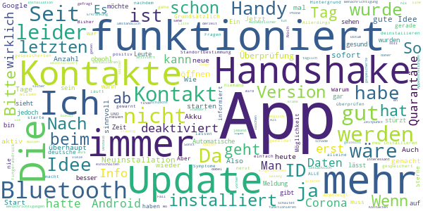
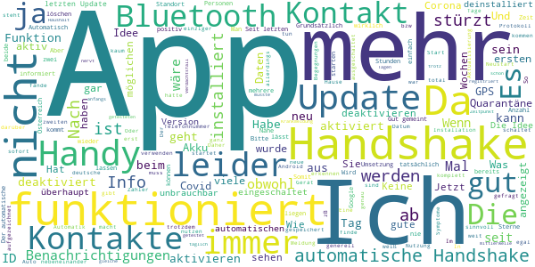

# Stopp Corona
App version ``2.0.5.1081-QA_250``

Analyzed with [covid-apps-observer](http://github.com/covid-apps-observer) project, version ``0.1``

## App overview
| | |
|-------------------------|-------------------------| 
| **Name**&nbsp;&nbsp;&nbsp;&nbsp;&nbsp;&nbsp;&nbsp;&nbsp;&nbsp;&nbsp;&nbsp;&nbsp;&nbsp;&nbsp;&nbsp;&nbsp;&nbsp;&nbsp;&nbsp;&nbsp;&nbsp;&nbsp;&nbsp;&nbsp;&nbsp;&nbsp;&nbsp;&nbsp;&nbsp;&nbsp;&nbsp;&nbsp;&nbsp;&nbsp;&nbsp;&nbsp;&nbsp;&nbsp;&nbsp;&nbsp;  | Stopp Corona |
| **Unique identifier** | at.roteskreuz.stopcorona |
| **Link to Google Play** | [https://play.google.com/store/apps/details?id=at.roteskreuz.stopcorona](https://play.google.com/store/apps/details?id=at.roteskreuz.stopcorona) |
| **Summary**  | Österreichs Corona-Warnungs-App |
| **Privacy policy** | [https://www.roteskreuz.at/site/faq-app-stopp-corona/datenschutzinformation-zur-stopp-corona-app/](https://www.roteskreuz.at/site/faq-app-stopp-corona/datenschutzinformation-zur-stopp-corona-app/) |
| **Latest version** | 2.0.5.1081-QA_250 |
| **Last update** | 2020-10-09 09:23:44 |
| **Recent changes** | Anpassung der Mobile App an aktualisiertes Framework Verbesserung des Background checks |
| **Installs**  | 100.000+ |
| **Category** | Medizin |
| **First release** | 25.03.2020 |
| **Size**  | 5,4M |
| **Supported Android version**  | 6.0 oder höher |

### Description
> Das Österreichische Rote Kreuz veröffentlicht die “Stopp Corona”-App im Auftrag des Gesundheitsministeriums, der obersten Gesundheitsbehörde Österreichs. 
 Mit der „Stopp Corona“-App lassen sich Begegnungen mit Freunden, der Familie oder Arbeitskollegen ganz einfach und anonymisiert speichern. Sollten Sie sich mit Corona infizieren, können Sie einfach über die App eine Meldung abgeben und Ihre Kontakte aus den letzten 2 Tagen werden anonym benachrichtigt. 
 Das gleiche gilt natürlich umgekehrt. Gibt eine Ihrer gespeicherten Begegnungen an, sich infiziert zu haben, erhalten Sie umgehend eine Nachricht und Sie können entsprechende Maßnahmen ergreifen. Dazu zählen vor allem:
 -	Abstand halten
 -	Soziale Kontakte vermeiden
 -	Sich vorsichtshalber in Selbstisolation begeben
 Beim Einsetzen von Symptomen kontaktieren Sie bitte telefonisch ihre Hausärztin oder den Hausarzt. Wenn das nicht möglich ist, rufen Sie die die Nummer 1450 an.
 Jedenfalls gilt: Bitte nicht die Ärztin/oder den Arzt persönlich aufsuchen und auch nicht ins Krankenhaus fahren. Bei einem medizinischen Notfall: 144 rufen.
 Gemeinsam unterbrechen wir so die Infektionskette.
 So schützen Sie nicht nur sich selbst, sondern verhindern auch, dass andere sich infizieren.
 Nutze Sie den digitalen Handshake
 Bis wir uns wieder unbedacht die Hände bei der Begrüßung reichen können, wird es wohl noch einige Zeit dauern. In der Zwischenzeit nutzen Sie einfach den digitalen Handshake der „Stopp Corona“-App.
 Haben Sie und die Person mit der Sie sich treffen die App installiert, speichert die App, dass Sie sich getroffen haben. Diese Daten werden anonymisiert gespeichert. Erkrankt einer von Ihnen beiden an dem Corona-Virus, erhält der andere eine Nachricht.
 Machen Sie den Corona-Selbstcheck
 Wie geht es Ihnen heute? Anhand eines klinisch geprüften Fragebogens können Sie sich täglich auf Corona-Symptome überprüfen.
 Corona-Verdachtsmeldung
 Entsprechen die Symptome dem Corona-Virus, können Sie eine Meldung über die App abgeben. Das ist wichtig, damit sich nicht noch mehr Menschen mit dem Virus infizieren. Ihre Begegnungen werden dann anonymisiert benachrichtigt. Keine Sorge, sie erhalten also keine persönlichen Angaben. 
 Anschließend bleiben Sie bitte Zuhause und kontaktieren Sie Ihre Hausärztin oder Ihren Hausarzt telefonisch. Wenn das nicht möglich ist rufen Sie die Nummer 1450 an.
 Fahren Sie nicht ins Krankenhaus und suchen Sie Ihren Arzt nicht persönlich auf.
 Ärztliche Bestätigung
 Stellt ein Arzt den Corona-Virus fest, können Sie ebenfalls eine Meldung abgeben. Auch hier werden Ihre Begegnungen anonymisiert benachrichtigt.
 Die App entstand in Partnerschaft mit der UNIQA Stiftung.
 Konzept und Realisierung in Zusammenarbeit und mit Unterstützung von Accenture Österreich und basiert auf dem Contacttracing-Framework von Apple und Google
 Schau auf Dich. Schau auf mich. So schützen wir uns.
 Link zum Open Source Software Projekt: https://github.com/austrianredcross/stopp-corona-android

### User interface
The developers of the app provide the following screenshots in the Google play store.
| | | |
|:-------------------------:|:-------------------------:|:-------------------------:|
 |   |   |   | 
 |   |   |   | 
 |   |  

## Development team
In the following we report the main information provided by the development team in the Google play store.

| | |
|-------------------------|-------------------------|
| **Developer**  | Österreichisches Rotes Kreuz |
| **Website**  | [https://www.roteskreuz.at](https://www.roteskreuz.at) |
| **Email** | service@roteskreuz.at |
| **Physical address**  | [Wiedner Hauptstrasse 32 1040 Wien Österreich](https://www.google.com/maps/search/Wiedner%20Hauptstrasse%2032%201040%20Wien%20Österreich) (Google Maps) |
| **Other developed apps**  | [https://play.google.com/store/apps/developer?id=%C3%96sterreichisches+Rotes+Kreuz](https://play.google.com/store/apps/developer?id=%C3%96sterreichisches+Rotes+Kreuz) |

## Android support

| | |
|-------------------------|-------------------------|
| **Declared target Android version**  | Pie, version 9 (API level 28) |
| **Effective target Android version**  | Pie, version 9 (API level 28) |
| **Minimum supported Android version**  | Marshmallow, version 6.0 (API level 23) |
| **Maximum target Android version**  | - |

The larger the difference between the minimum and maximum supported Android versions, the better. A larger difference means a wider audience. For example, old phones have a very low Android version, so a high minimum supported Android version means that the app cannot be used by users with old phones, thus leading to accessibility problems. 

## Requested permissions

In the following we report the complete list of the permissions requested by the app. 

| **Permission** | **Protection level** | **Description** | 
|-------------------------|-------------------------|-------------------------|
 **android.permission ACCESS_NETWORK_STATE** | Normal | Allows applications to access information about networks. 
 **android.permission BLUETOOTH** | Normal | Allows applications to connect to paired bluetooth devices. 
 **android.permission FOREGROUND_SERVICE** | Normal | Allows a regular application to use Service.startForeground. 
 **android.permission INTERNET** | Normal | Allows applications to open network sockets. 
 **android.permission RECEIVE_BOOT_COMPLETED** | Normal | Allows an application to receive the Intent.ACTION_BOOT_COMPLETED that is broadcast after the system finishes booting. 
 **android.permission REQUEST_IGNORE_BATTERY_OPTIMIZATIONS** | Normal | Permission an application must hold in order to use Settings.ACTION_REQUEST_IGNORE_BATTERY_OPTIMIZATIONS. 
 **android.permission WAKE_LOCK** | Normal | Allows using PowerManager WakeLocks to keep processor from sleeping or screen from dimming. 

## Mentioned servers

| **Server** | **Registrant** | **Registrant country** | **Creation date** | 
|-------------------------|-------------------------|-------------------------|-------------------------|
 | google.com | Google LLC | :us: US | 1997-09-15 04:00:00 |
 | prod-rca-coronaapp-fd.net | Domains By Proxy, LLC | :us: US | 2020-04-20 20:16:19 |

## Security analysis 

Below we report the main security warnings raised by our execution of the [Androwarn](https://github.com/maaaaz/androwarn) security analysis tool.

**Connection interfaces exfiltration**
> - This application reads details about the currently active data network 
> - This application tries to find out if the currently active data network is metered 

**Telephony services abuse**
> - This application makes phone calls 

**Suspicious connection establishment**
> - This application opens a Socket and connects it to the remote address '; port is out of range' on the 'N/A' port  
> - This application opens a Socket and connects it to the remote address 'Lcom/android/tools/r8/GeneratedOutlineSupport;->outline16(Ljava/lang/String;)Ljava/lang/StringBuilder;' on the 'N/A' port  
> - This application opens a Socket and connects it to the remote address 'Ljava/net/Proxy;->type()Ljava/net/Proxy$Type;' on the 'N/A' port  
> - This application opens a Socket and connects it to the remote address 'timeout' on the 'N/A' port  

## User ratings and reviews

Below we provide information about how end users are reacting to the app in terms of ratings and reviews in the Google Play store.

### Ratings

The Stopp Corona app has been installed by more than **100000** times. At this time, **3070** rated the app and its average score is **3.309904**. Below we show the distribution of the ratings across the usual star-based rating of Google Play

:star::star::star::star::star:: 1344

:star::star::star::star:: 255

:star::star::star:: 353

:star::star:: 245

:star:: 873

### Reviews 

#### 5-star reviews

> Befolge App um Menschen und mich zu schützen  :date: __2020-11-18 19:09:32__

> Nachdem ich meine fuer google co verkaufe denke ich is es mehr als angemessen diese app trotz Datenschutzbedenken (wobei ich glaube das dieser durch den fokus auf die app gut vorhanden ist)zu installieren . was mich jetzt wundert ist das diese app nicht von allen android versionen bzw handys mit bluetooth unterstützt wird) sie bringt doch am meisten wenn viele sie installiert haben . Also bitte liebe devs arbeitet daran.  :date: __2020-11-18 18:57:43__

> Funktioniert auf meinem Android tadellos. Bisher keine Warnung nötig, IDs werden laufend erzeugt. Keine Akkuprobleme (Handy ist 2 Jahre alt)  :date: __2020-11-17 20:32:49__

> Wichtig und richtig - sollte in solchen Zeiten logisch sein so etwas zu verwenden. Inzwischen auch technisch gut gelöst  :date: __2020-11-17 11:05:25__

> EIN MUSS  :date: __2020-11-16 18:12:12__

> anscheinend funktioniert die App, sollte dies stimmen ist das eine gute und wichtige Sache.  :date: __2020-11-16 13:38:15__

> Super, mein Beitrag man muss nicht viel tun.  :date: __2020-11-16 13:19:32__

> Ich verwende das App vom Anfang an SUPER  :date: __2020-11-16 11:45:27__

> Jetzt ist die App besser. Solange Bluetooth ausgeschaltet ist, erscheint eine Benachrichtigung zur Erinnerung. Damit kann ich leben. Wenn ich einkaufen gehe, schalte ich Bluetooth ein, dann sollte es funktionieren.  :date: __2020-11-16 11:18:51__

> mittlerweile sehr gut und Datenschutz wird auch optimal sichergestellt  :date: __2020-11-16 07:50:06__

#### 4-star reviews

> Wie in anderen Kommentaren wäre Feedback hilfreich wie viele Kontakte in den letzten x Tagen erkannt wurden. Sonst top.  :date: __2020-11-17 06:41:57__

> Habe erst heute die app runtergeladen  :date: __2020-11-16 17:58:07__

> Mich würde interessieren ob der Handsshake per Bluetooth auch noch funktioniert wenn ich permanent per Bluetooth mit meinen Fitness Armband Verbunden bin. Also ob dennoch Bluetooth auch für den Handshake genutzt werden kann  :date: __2020-11-13 06:56:30__

> Gute App, mit Erweiterungsbedarf. - Corona Testergebnis via QR Code in App abfragen (Idee: jeder der mal einen Test gemacht hat, hat die App dann installiert) - mehrere Corona Warn Apps gleichzeitig aktivieren (zb DE und AT, oder Kooperation zwischen diesen) - Anzahl der Kontakte anzeigen, bzw dem Nutzer anders sichtbar machen ob/das alles funktioniert  :date: __2020-11-10 17:14:36__

> Leider ist es sehr nervig, wenn man mehrmals am Tag an Kontakt mit Corona-Infizierten erinnert wird bzw. gefragt wird wie man sich fühlt...  :date: __2020-11-09 23:08:19__

> Die App finde ich gut und informativ  :date: __2020-10-26 20:08:08__

> Die App ist leider nicht das Beste, aber notwendig. Für alle die die Zufallsbegegnungen sehen wollen, diese sind in den App-Einstellungen ersichtlich. Dazu in den Android Einstellungen nach COVID suchen.  :date: __2020-10-26 20:06:58__

> Ist ok. Wär cool Wenn's einen Counter für die Handshakes gäbe.  :date: __2020-10-25 21:16:56__

> Verbesserungsfähig, aber einfach und sinnvoll, sollte jede/r nutzen. Ein Widget wäre praktisch, bei dem man nur den Handshake aktivieren muss und Bluetooth sowie GPS automatisch mit aktiviert werden, ohne dreimal bestätigen zu müssen. Schnell und unkompliziert am Startbildschirm plazierbar, weil man ja nicht laufend alles eingeschalteten hat. Wird dann vielleicht für beispielsweise kurze Einkäufe auch eher aktiviert.  :date: __2020-10-25 18:43:37__

> Seit dem letzten Update beendet sich die App auf kein Android Gerät nicht mehr....  :date: __2020-10-23 12:01:25__

#### 3-star reviews

> Leider kooperiert die App nicht mit anderen "Corona Apps". Für mich, im Grenzgebiet zur Schweiz wohnend, ist es sehr umständlich ständig von der Ö-App zur Ch-App umzuschalten. Beide Apps lassen nur jeweils einen Zugriff auf Bluetooth zu.  :date: __2020-11-20 06:45:24__

> Man sieht nicht gut, ob und wie die App funktioniert. Was heißt unter gespeicherte IDs "Anzahl der Schlüssel" ? ..wenn das die Anzahl an möglichen Kontakten, die die App haben, sein soll, dann kann das nicht stimmen. Viel zu viel.  :date: __2020-11-19 16:14:51__

> Fragt immer wieder das gleiche  :date: __2020-11-17 14:49:06__

> Es wäre wichtig beobachten zu können, dass die App auch tatsächlich aktiv ist. am interessantesten wäre es doch die Anzahl der gespeicherten Handshakes und das jeweilige Datum dazu anzuzeigen! Ich finde auch ein akustisches Signal im Falle eines Handshakes sehr interessant! So hat man eigentlich das Gefühl dass die app nichts tut und ist sich auch nicht sicher ob sie wirklich funktioniert! Die Anzeige der Anzahl der Handshakes wäre auch hilfreich um das eigene Verhalten zu überprüfen!  :date: __2020-11-17 02:57:23__

> Auf älteren iPhones (konkret iphone6) kann die App nicht installiert werden  :date: __2020-11-16 14:21:37__

> Können wir uns einfach darauf einigen, dass wir alle die deutsche Corona App verwenden? Aus dieser hier wird leider nichts mehr - kein klares Feedback in der App, keine Beantwortung von Fragen, keine Weiterentwicklung...  :date: __2020-11-16 12:46:59__

> Ansich eine gute App, - nur leider Wertlos wenn sie so gut wie niemand (spreche von meinem Freundes, u. Bekanntenkreis) installiert hat. Wäre nicht schlecht wenn es eine Implementierung in FB, Twitter, Insta & Co gäbe, das hat fast jede/r 😜  :date: __2020-11-16 10:22:37__

> Gute Idee schlecht vermarktet und mittelmäßig umgesetzt. Sehr wenig Menschen nutzen die App (vermutlich aus Angst eine Datenkrake zu installieren) und ich kann mich als wieder gesundeter nicht mehr gesund melden. Stattdessen nervte mich die App mit unzähligen Benachrichtigungen während ich krank war. Hab sie jetzt wieder deinstalliert.  :date: __2020-11-15 01:03:36__

> Also ich habe auch den Verdacht dass alle Bluetooth Geräte gespeichert werden... sobald ich mein Headset einschalte.... zack, allein zuHause zw 21 und 4 uhr Früh immer Laptop, Bluetooth Lautsprecher alles Meldungen wo definitiv nur ich mit diesen Geräten in Sendereichweite bin ..... Also was muss ich jetzt machen wenn mein Laptop zufälligerweise Covid Positiv getestet wird? Müssen dann die Lautsprecher auch in Quarantäne, oder müssen sie sich nur testen lassen?  :date: __2020-11-11 11:26:04__

> Diese App macht für mich sinn, jedoch erhalte ich am Tag über 20 Benachrichtigungen, ob ich weitere Kontake kontaktieren will und wie es mir geht. Ich bin in Quarantäne und habe bereits lange mit der BH Kontakt, was bei jedem mit positivem Ergebnis der Fall ist. Daher muss mich die App nicht 20mal daran erinnern meine Kontakte zu kontaktieren. Das nervt. Gewaltig. Darum werde ich die App wieder deinstallieren.  :date: __2020-11-11 08:34:14__

#### 2-star reviews

> Benachrichtigungen und Warnhinweise kommen nach Verdachtsfall (Test negativ) und Ablauf der trotzdem eingehaltenen Quarantäne immer noch täglich mehrmals lassen sich nicht mehr deaktivieren. Das führt dazu, dass ich die App deinstallieren möchte obwohl ich sie generell gut fände. Die Prozesse gehören dringend überarbeitet!  :date: __2020-11-23 08:13:14__

> Ich bin nicht sehr begeistert. Man muss das Handy immer am Körper haben. Besucht man die Eltern und hängt seine Jacke samt Handy an den Kleiderständer, kann das Handy nichts messen. Und wenn das Handy ausgeht, muss man die App extra einschalten. (Genauer: dass sie im Hintergrund läuft). Natürlich vergesse ich das jedes dritte Mal oder so, und dann geht die App nicht. Kurz:es ist umständlich, man muss immer an sein Handy denken, und man darf das Handy nicht ausgehen lassen.  :date: __2020-11-21 13:41:46__

> Nach zwei Wochen nochimmer 0 mögliche Begegnungen! Hier können meiner Meinung nur die Handshakes gemeint sein, nachdem man bei einem pos. Kontakt sofort informiert werden sollte. Haben auch längere Zeit zwei Handys mit der App nebeneinander liegen lassen (Bluetooth, WLAN, Standort aktiv) um einen Handshake zu erzeugen. Hat nicht funktioniert. Bitte um Rückmeldung bzw. Behebung, damit die App endlich funktioniert und auch weiterempfohlen werden kann!! Sie ist zu kompliziert und unübersichtlich.  :date: __2020-11-21 12:01:35__

> Verbraucht viel Akku und bringt nicht wirklich was  :date: __2020-11-19 06:46:23__

> Grundsätzlich würde ich den Gedanken teilen und will auch die App nutzen, aber die App erkennt nicht das bluetooth aktiv ist. Somit nicht einsetzbar.  :date: __2020-11-18 07:30:23__

> Also, soweit ich diese App verstanden habe, soll sich jeder der Krankheitssymtome hat sich eintragen und die Gesunden davor warnen, ACHTUNG! da ist ein Kranker in der Nähe. Erstens wenn man Coronasymtome hat, soll man nicht sowieso nicht mehr in der Öffentlichkeit aufhalten, und zweitens, bitte wer gibt den freiwillig zu, dass er eventuell diesen Virus in sich trägt. Ist nett gemeint, aber .........tun wir das??  :date: __2020-11-17 20:13:36__

> Gute Absicht aber leider sehr schlechte Umsetzung. Der User hat generell das Gefühl, es passiert nichts. Als mindest-Info sollte man gleich am Startbildschirm Zähler für n Kontakte, Zähler je Tag, eventuell auch Zähler >15 Min. sehen. Eine APP die nichts zeigt - was soll das sein?  :date: __2020-11-17 17:29:13__

> Installation fertig,und jetzt??  :date: __2020-11-17 11:01:04__

> Gut gemeint aber leider nicht gut umgesetzt. Wenn ich die App monatelang auf meinem Handy habe, wäre zumindest interessant mit wie vielen anderen Personen die ich getroffen habe sie sich bereits synchronisiert hat. Derzeit sieht es einfach nur danach aus als würde die App nichts tun / nichts können. Zuviel verlangt, dass da steht: Sie haben sich bereits mit XX unterschiedlichen Personen synchronisiert?  :date: __2020-11-15 17:16:59__

> Ich bin leider Corona Positiv getestet worden & obwohl ich Bluetooth&GPS deaktiviert hatte, da in Quarantäne, hatte ich 2 neue Handshakes - woher? Keiner im Haus hat die APP und ganz nice - ich kann mich nicht mehr Gesundmelden, obwohl ich bereits aus der Quarantäne entlassen bin!! Wie diese Handshakes von statten gehen sind mit ein Rätsel und 6x am Tag Symptome abfragen und obwohl positiv dann die allg. Empfehlungen... naja Auch bei den Symptomen könnte nachgebessert werden!  :date: __2020-11-12 19:05:12__

#### 1-star reviews

> die Idee ist sehr gut ... Umsetzung leider ein Graus ... vorweg ich bin ein Verfechter dieser Idee ... jedoch habe ich KEINE Ahnung wie man mit so viel Geld und Werbung so wenig umsetzen kann ?? Also BITTE Fehler beseitigen!!! und nochwas an die sogenannten Datenschützer: IHR macht das auch noch komplizierter ... was ist euch wichtiger SICHERHEIT oder Terror?! und der Gedanke IHR seit vollumfänglich anonym? wacht auf im digitalen Zeitalter gibts das nicht mehr! sorry aber das musste mal raus  :date: __2020-11-22 21:47:29__

> Idee an sich gut. Ich hatte die App schon lange installiert und auch meine Erkrankung gemeldet. Leider werden aber nur die Kontakte der letzten 2 Tage informiert. Das Problem : Die Auswertungsdauer des Tests wird nicht berücksichtigt. Der war ja schon 3 Tage VOR meiner Meldung positiv. Andere warten sogar 1 Woche. Damit verliert die App ihren Sinn. Wie ich mich nach einer Erkrankung gesund melden kann, weiß ich nicht.  :date: __2020-11-22 08:49:38__

> Reagiert auf nichts und meldet auch keine Corona erkrankten in der Nähe  :date: __2020-11-22 04:07:57__

> Hab ich wieder gelöscht , muss besser werden  :date: __2020-11-21 16:19:29__

> Funktioniert leider nicht am Samsung galaxy GT-I9301, android version 4.4.2  :date: __2020-11-21 09:45:58__

> Wieder gelöscht. Der Sinn und der Aufbau ist nicht klar. Hatte gestern 15 dieser Handshaks obwohl seit Donnerstag bis Heute Freitag Abend niemandem getroffen. Die Person die vielleicht in der Nähe war, war 2 Kilometer entfernt. Hat das Programm ein paar Bäume erkannt???  :date: __2020-11-20 17:44:16__

> Meine Frau und ich haben das App wieder deinstalliet, aus Stromverbrauch und Speicher hat es aus unserer Sicht nichts gebracht. Es wurden nie irgendwelche Ergebnisse aus der Verwendung des Apps veröffentlicht , wozu hab ich es dann ??? Ich war echt ein braver Nutzer der ersten Stunde, aber, wenn ich keinen Erfolg/Nutzen/Ergebnisse sehe, ausser, dass der Herr Voitik sagt, wir sollten es verwenden, haben wir das Interesse verloren, sorry, gut gemeint, schlecht gemacht.  :date: __2020-11-20 14:49:44__

> Nach letzten Update startet App nicht Update: App startet jetzt wieder aber zeichnet Kontakte auf die nicht stattgefundenen haben. Wenn man alleine von 200 Metern Umkreis ist kann das einfach nicht sein. Da auch keine anderen BT fähigen Geräte sich in der Umgebung befinden kann das die von anderen Usern vermutete Ursache auch nicht sein.  :date: __2020-11-20 07:29:13__

> Startet nicht, nach der insallation kommen einige abfragen. Der button auf der letzten abfrage ist ausgegraut, ich kann also die installation nicht ordnungsgemäß abschließen und deinstalliere daher  :date: __2020-11-19 21:50:50__

> An sich eine tolle Idee ... wenn es denn funktionieren würde ... Eine direkte Kontaktperson hat sich positiv in der App gemeldet ... Nach 1 Tag immer noch keine Benachrichtigung ... Funktioniert also leider NICHT! Wieder deinstalliert ...  :date: __2020-11-18 01:34:32__

