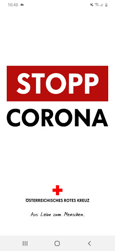
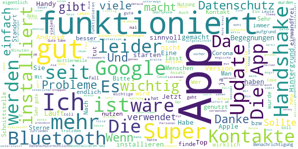
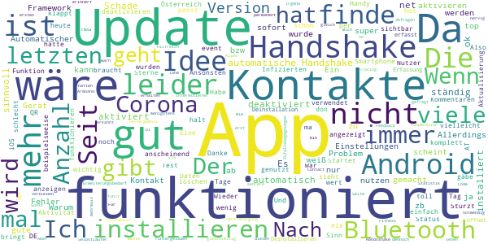
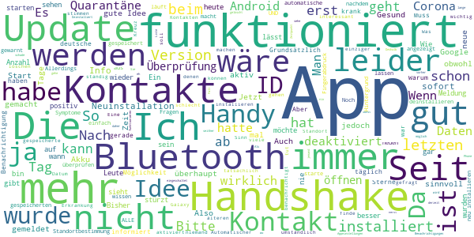
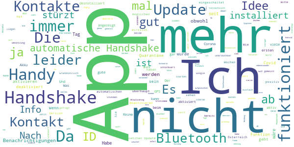
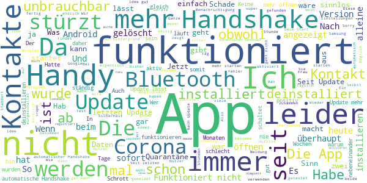

# Stopp Corona
App version ``2.0.8.1133-QA_257``

Analyzed with [covid-apps-observer](http://github.com/covid-apps-observer) project, version ``0.1``

## App overview
| | |
|-------------------------|-------------------------| 
| **Name**&nbsp;&nbsp;&nbsp;&nbsp;&nbsp;&nbsp;&nbsp;&nbsp;&nbsp;&nbsp;&nbsp;&nbsp;&nbsp;&nbsp;&nbsp;&nbsp;&nbsp;&nbsp;&nbsp;&nbsp;&nbsp;&nbsp;&nbsp;&nbsp;&nbsp;&nbsp;&nbsp;&nbsp;&nbsp;&nbsp;&nbsp;&nbsp;&nbsp;&nbsp;&nbsp;&nbsp;&nbsp;&nbsp;&nbsp;&nbsp;  | Stopp Corona |
| **Unique identifier** | at.roteskreuz.stopcorona |
| **Link to Google Play** | [https://play.google.com/store/apps/details?id=at.roteskreuz.stopcorona](https://play.google.com/store/apps/details?id=at.roteskreuz.stopcorona) |
| **Summary**  | Österreichs Corona-Warnungs-App |
| **Privacy policy** | [https://www.roteskreuz.at/site/faq-app-stopp-corona/datenschutzinformation-zur-stopp-corona-app/](https://www.roteskreuz.at/site/faq-app-stopp-corona/datenschutzinformation-zur-stopp-corona-app/) |
| **Latest version** | 2.0.8.1133-QA_257 |
| **Last update** | 2021-01-28 18:05:37 |
| **Recent changes** | Wir aktualisieren die App laufend für dich:  - Bei einem Verdachtsfall kann dieser direkt über einen Button am Homescreen gemeldet werden - Der Beginn von Symptomen oder einer bestätigten Infektion kann bis zu 5 Tage in die Vergangenheit gewählt werden - Geringfügige Verbesserungen der Barrierefreiheit  Wir veröffentlichen regelmäßig Updates und versuchen die Nutzererfahrung weiter zu verbessern. Let´s continue to Stopp Corona together  |
| **Installs**  | 100.000+ |
| **Category** | Medizin |
| **First release** | 25.03.2020 |
| **Size**  | 6,0M |
| **Supported Android version**  | 6.0 oder höher |

### Description
> Das Österreichische Rote Kreuz veröffentlicht die “Stopp Corona”-App im Auftrag des Gesundheitsministeriums, der obersten Gesundheitsbehörde Österreichs. 
 Mit der „Stopp Corona“-App lassen sich Begegnungen mit Freunden, der Familie oder Arbeitskollegen ganz einfach und anonymisiert speichern. Sollten Sie sich mit Corona infizieren, können Sie einfach über die App eine Meldung abgeben und Ihre Kontakte aus den letzten 2 Tagen werden anonym benachrichtigt. 
 Das gleiche gilt natürlich umgekehrt. Gibt eine Ihrer gespeicherten Begegnungen an, sich infiziert zu haben, erhalten Sie umgehend eine Nachricht und Sie können entsprechende Maßnahmen ergreifen. Dazu zählen vor allem:
 -	Abstand halten
 -	Soziale Kontakte vermeiden
 -	Sich vorsichtshalber in Selbstisolation begeben
 Beim Einsetzen von Symptomen kontaktieren Sie bitte telefonisch ihre Hausärztin oder den Hausarzt. Wenn das nicht möglich ist, rufen Sie die die Nummer 1450 an.
 Jedenfalls gilt: Bitte nicht die Ärztin/oder den Arzt persönlich aufsuchen und auch nicht ins Krankenhaus fahren. Bei einem medizinischen Notfall: 144 rufen.
 Gemeinsam unterbrechen wir so die Infektionskette.
 So schützen Sie nicht nur sich selbst, sondern verhindern auch, dass andere sich infizieren.
 Nutze Sie den digitalen Handshake
 Bis wir uns wieder unbedacht die Hände bei der Begrüßung reichen können, wird es wohl noch einige Zeit dauern. In der Zwischenzeit nutzen Sie einfach den digitalen Handshake der „Stopp Corona“-App.
 Haben Sie und die Person mit der Sie sich treffen die App installiert, speichert die App, dass Sie sich getroffen haben. Diese Daten werden anonymisiert gespeichert. Erkrankt einer von Ihnen beiden an dem Corona-Virus, erhält der andere eine Nachricht.
 Machen Sie den Corona-Selbstcheck
 Wie geht es Ihnen heute? Anhand eines klinisch geprüften Fragebogens können Sie sich täglich auf Corona-Symptome überprüfen.
 Corona-Verdachtsmeldung
 Entsprechen die Symptome dem Corona-Virus, können Sie eine Meldung über die App abgeben. Das ist wichtig, damit sich nicht noch mehr Menschen mit dem Virus infizieren. Ihre Begegnungen werden dann anonymisiert benachrichtigt. Keine Sorge, sie erhalten also keine persönlichen Angaben. 
 Anschließend bleiben Sie bitte Zuhause und kontaktieren Sie Ihre Hausärztin oder Ihren Hausarzt telefonisch. Wenn das nicht möglich ist rufen Sie die Nummer 1450 an.
 Fahren Sie nicht ins Krankenhaus und suchen Sie Ihren Arzt nicht persönlich auf.
 Ärztliche Bestätigung
 Stellt ein Arzt den Corona-Virus fest, können Sie ebenfalls eine Meldung abgeben. Auch hier werden Ihre Begegnungen anonymisiert benachrichtigt.
 Die App entstand in Partnerschaft mit der UNIQA Stiftung.
 Konzept und Realisierung in Zusammenarbeit und mit Unterstützung von Accenture Österreich und basiert auf dem Contacttracing-Framework von Apple und Google
 Schau auf Dich. Schau auf mich. So schützen wir uns.
 Link zum Open Source Software Projekt: https://github.com/austrianredcross/stopp-corona-android

### User interface
The developers of the app provide the following screenshots in the Google play store.
| | | |
|:-------------------------:|:-------------------------:|:-------------------------:|
 |   |   |   | 
 |   |   |   | 
 |   |  

## Development team
In the following we report the main information provided by the development team in the Google play store.

| | |
|-------------------------|-------------------------|
| **Developer**  | Österreichisches Rotes Kreuz |
| **Website**  | [https://www.roteskreuz.at](https://www.roteskreuz.at) |
| **Email** | service@roteskreuz.at |
| **Physical address**  | [Wiedner Hauptstrasse 32 1040 Wien Österreich](https://www.google.com/maps/search/Wiedner%20Hauptstrasse%2032%201040%20Wien%20Österreich) (Google Maps) |
| **Other developed apps**  | [https://play.google.com/store/apps/developer?id=%C3%96sterreichisches+Rotes+Kreuz](https://play.google.com/store/apps/developer?id=%C3%96sterreichisches+Rotes+Kreuz) |

## Android support

| | |
|-------------------------|-------------------------|
| **Declared target Android version**  | Android10, version 10 (API level 29) |
| **Effective target Android version**  | Android10, version 10 (API level 29) |
| **Minimum supported Android version**  | Marshmallow, version 6.0 (API level 23) |
| **Maximum target Android version**  | - |

The larger the difference between the minimum and maximum supported Android versions, the better. A larger difference means a wider audience. For example, old phones have a very low Android version, so a high minimum supported Android version means that the app cannot be used by users with old phones, thus leading to accessibility problems. 

## Requested permissions

In the following we report the complete list of the permissions requested by the app. 

| **Permission** | **Protection level** | **Description** | 
|-------------------------|-------------------------|-------------------------|
 **android.permission ACCESS_NETWORK_STATE** | Normal | Allows applications to access information about networks. 
 **android.permission BLUETOOTH** | Normal | Allows applications to connect to paired bluetooth devices. 
 **android.permission FOREGROUND_SERVICE** | Normal | Allows a regular application to use Service.startForeground. 
 **android.permission INTERNET** | Normal | Allows applications to open network sockets. 
 **android.permission RECEIVE_BOOT_COMPLETED** | Normal | Allows an application to receive the Intent.ACTION_BOOT_COMPLETED that is broadcast after the system finishes booting. 
 **android.permission REQUEST_IGNORE_BATTERY_OPTIMIZATIONS** | Normal | Permission an application must hold in order to use Settings.ACTION_REQUEST_IGNORE_BATTERY_OPTIMIZATIONS. 
 **android.permission WAKE_LOCK** | Normal | Allows using PowerManager WakeLocks to keep processor from sleeping or screen from dimming. 

## Mentioned servers

| **Server** | **Registrant** | **Registrant country** | **Creation date** | 
|-------------------------|-------------------------|-------------------------|-------------------------|
 | google.com | Google LLC | :us: US | 1997-09-15 04:00:00 |
 | prod-rca-coronaapp-fd.net | Domains By Proxy, LLC | :us: US | 2020-04-20 20:16:19 |

## Security analysis 

Below we report the main security warnings raised by our execution of the [Androwarn](https://github.com/maaaaz/androwarn) security analysis tool.

**Connection interfaces exfiltration**
> - This application reads details about the currently active data network 
> - This application tries to find out if the currently active data network is metered 

**Telephony services abuse**
> - This application makes phone calls 

**Suspicious connection establishment**
> - This application opens a Socket and connects it to the remote address '; port is out of range' on the 'N/A' port  
> - This application opens a Socket and connects it to the remote address 'Lcom/android/tools/r8/GeneratedOutlineSupport;->outline17(Ljava/lang/String;)Ljava/lang/StringBuilder;' on the 'N/A' port  
> - This application opens a Socket and connects it to the remote address 'Ljava/net/Proxy;->type()Ljava/net/Proxy$Type;' on the 'N/A' port  
> - This application opens a Socket and connects it to the remote address 'timeout' on the 'N/A' port  

## User ratings and reviews

Below we provide information about how end users are reacting to the app in terms of ratings and reviews in the Google Play store.

### Ratings

The Stopp Corona app has been installed by more than **100000** times. At this time, **3481** rated the app and its average score is **2.988604**. Below we show the distribution of the ratings across the usual star-based rating of Google Play

:star::star::star::star::star:: 1250

:star::star::star::star:: 297

:star::star::star:: 377

:star::star:: 277

:star:: 1280

### Reviews 

#### 5-star reviews

> Google ist Arschlochnetz in Europa  :date: __2021-01-17 15:39:58__

> Ich schränke meine sozialen Kontakte wirklich sehr ein trotzdem finde ich es super falls es doch positiv getestet Personen in meinem Umfeld gibt das ich benachrichtigt werde, ich fühle mich nicht überwacht aber die info finde ich sehr sinnvoll da in meiner Familie u mein Partner leider zur Risikogruppe gehören  :date: __2021-01-11 03:52:02__

> Sinnvolle Open Source App die genau das tut was sie soll  :date: __2021-01-10 21:23:44__

> Ich habe diese App seit 4 Tagen und heute erst den 1. gefunden der mir einen digitalen Handshake gibt. (meinen Sohn). Leider ist niemand in meinem Umfeld bereit, sich diese App runterzuladen. Also für mich im Moment mehr als sinnlos.  :date: __2020-12-30 00:07:10__

> Gut  :date: __2020-12-26 22:26:06__

> Lässt sich auf meinem Galaxy S7 nicht starten und stürzt sofort ab  :date: __2020-12-24 20:37:16__

> Es wird nur Bluetooth benötigt und vom Prinzip her sehr empfehlenswert. Ich hab es für die Dauer der Pandemie installiert.  :date: __2020-12-21 22:26:31__

> Funktioniert! Zu Anfang gabe es viele kritische Meldungen und Probleme zur App, inzwischen funktioniert diese aber problemlos. Sicher eine sinnvolle Hilfe zur Bewältigung einer allgemein herausfordernden Zeit.  :date: __2020-12-21 09:07:08__

> Ein Muss für jeden der Verantwortung für den Nächsten fühlt!  :date: __2020-12-21 07:24:38__

> Nachdem diese sinnvolle App leidet von zu Wenigen genutzt wird, deinstalliert, da es keine Sinn macht, wenn es nur Ausgangssperren gibt  :date: __2020-12-19 16:37:03__

#### 4-star reviews

> Habe die App sofort installiert, finde die Idee gut, habe aber bis heute noch keine Verständigung erhalten leider gibt es auch zu wenig Nutzer  :date: __2021-01-14 10:27:08__

> Funktioniert anscheinend  :date: __2020-12-11 08:41:29__

> Wenn das alle hätten wäre das Contact-Tracing ein Selbstläufer. Aber das UI ist halt sehr lahm. Wenn man die Statistik über die Handshakes wenigstens gleich auf der ersten Seite hätte, dass man irgend eine Aktivität sieht.  :date: __2020-11-27 10:55:40__

> Alles gut 👍 s  :date: __2020-11-23 20:15:40__

> Update gibt es nicht?  :date: __2020-11-23 19:41:11__

> Wie in anderen Kommentaren wäre Feedback hilfreich wie viele Kontakte in den letzten x Tagen erkannt wurden. Sonst top.  :date: __2020-11-17 06:41:57__

> Habe erst heute die app runtergeladen  :date: __2020-11-16 17:58:07__

> Mich würde interessieren ob der Handsshake per Bluetooth auch noch funktioniert wenn ich permanent per Bluetooth mit meinen Fitness Armband Verbunden bin. Also ob dennoch Bluetooth auch für den Handshake genutzt werden kann  :date: __2020-11-13 06:56:30__

> Gute App, mit Erweiterungsbedarf. - Corona Testergebnis via QR Code in App abfragen (Idee: jeder der mal einen Test gemacht hat, hat die App dann installiert) - mehrere Corona Warn Apps gleichzeitig aktivieren (zb DE und AT, oder Kooperation zwischen diesen) - Anzahl der Kontakte anzeigen, bzw dem Nutzer anders sichtbar machen ob/das alles funktioniert  :date: __2020-11-10 17:14:36__

> Leider ist es sehr nervig, wenn man mehrmals am Tag an Kontakt mit Corona-Infizierten erinnert wird bzw. gefragt wird wie man sich fühlt...  :date: __2020-11-09 23:08:19__

#### 3-star reviews

> Funktioniert nicht! Ich bin positiv und habe es in der App gemeldet! Mein Bruder hat die App ebenfalls seit langer Zeit und er hat keine Benachrichtigung bekommen! Obwohl wir jeden Tag mehrere Stunden Nebeneinander auf dem Sofa sitzen...! Edit: Habe mich nach einem Tag Gesund und dann wieder Krank gemeldet = jetzt ist er benachrichtigt geworden..  :date: __2021-01-02 11:58:54__

> Unser Datenschutzgesetz einerseits und die Haltung mancher Mitbürger andererseits zerstören meines Erachtens den guten Grundgedanken für die Verwendung dieser App. Was mir auffällt, ist, dass der von der App angezeigte Zeitstempel der Kontakte nicht stimmen kann. Die App zeigt Kontakte zu Zeiten, in denen keine waren, oder erst viel später an.  :date: __2020-12-23 10:26:34__

> Auch ich werde die App nun nicht weiter nutzen. Automatischer Handshake funktioniert fast nie, selbst wenn die Handys stundenlang im selben Raum sind. Ich bin täglich beruflich viel im öffentlichen Raum unterwegs, auch in Öffis. Bisher jedoch in 2 Monaten nur ein einziger Handshake. So hat das doch keinen Sinn. Hauptsache das Rote Kreuz kann sich damit wichtig machen. 👎🏼  :date: __2020-12-21 08:22:18__

> wie kann ich mich nach einer erkrankung in der app wieder gesund melden? möchte es nicht einschalten solange die app noch meint dass ich krank bin.  :date: __2020-12-20 14:09:02__

> Die App ist jetzt annehmbar. Eine Grafik bei der ab zu lesen ist, in welchem Risiko ich mich mit meinem Bewegunsradius befinde. Umstieg auf die Deutsche App.  :date: __2020-12-19 22:01:37__

> Die Idee Ansicht ist gut, aber man muss immer Bluetooth anlassen so wie den Standort, das verbraucht viel Akku. Aber sonst ist die Idee sehr gut, damit man die Verbreitung vermindern kann, dennoch funktioniert das nur wenn es mehr Leute benutzen  :date: __2020-12-02 11:32:56__

> Wie auch schon berichtet, besteht keine Möglichkeit, nach einer Infektion wieder auf Gesund zu wechseln. Eine Email Anfrage wurde schnell aber nicht hilfreich beantwortet.  :date: __2020-12-01 19:29:16__

> War krank, habe alle über die App informiert, bin wieder gesund dennoch bekomme ich permanent die Aufforderung meine ID s zu benachrichtigen, kann das nicht abstellen. Werde alles löschen 😠  :date: __2020-12-01 11:30:36__

> Habe noch keine Erfahrung, darum nur 3 Sterne.  :date: __2020-12-01 09:02:45__

> Grundsätzlich eine gute Idee, aber muss es sein dass man ständig Bluetooth aktiviert hat? Ich will nicht das Handy den ganzen Tag neben mir liegen haben, oder gar in der Hosentasche, während Bluetooth aktiviert ist...  :date: __2020-11-30 17:20:55__

#### 2-star reviews

> Warum kann ich die Stopp Corona App nicht mehr aufmachen, so wie vorher immer?  :date: __2021-01-14 16:03:58__

> Die Zählweise der IDs ist nicht nachvollziehbar. Habe in der Wohnung keinen Untermieter und trotzdem neue IDs bekommen. 1k sind für die zweit größte Stadt Österreichs dann doch wenig IDs. Keine Alarmmeldung noch bekommen.  :date: __2021-01-06 19:03:52__

> Ich habe dutzende Benachrichtigungen über Kontakte, obwohl ich in dieser Zeit definitiv allein zu Hause war. Es kann auch nicht von einer anderen Wohnung sein, ich lebe in einem Einfamilienhaus, weit und breit kein Mensch. Vielleicht könnte man die Mitglieder des eigenen Haushaltes auf eine Whitelist setzen. Da wird man es ohnehin erfahren wenn sie positiv sind  :date: __2021-01-02 13:26:53__

> Gute idee aber wirklich schlecht programmiert. Hatte jetzt Covid und habs gleich mal in der App gemeldet, dann anonym alle verständigt die laut App Kontakt hatten. Und dann begann ein unendlich nerviger Kreislauf. Ich habe mich während der Quarantäne nicht 1mm aus der Wohnung bewegt und wurde trotzdem 5 mal täglich gefragt, ob ich nicht allen Kontakten Bescheid geben will. Ausserdem kann ich mich uns verrecken nicht gesund melden. Genervt von 10 nachrichten am Tag hab ichs jetzt deinstalliert.  :date: __2020-12-27 13:05:27__

> Eine App die vieles erleichtern sollte dies aber nicht wirklich macht. Habe mich am 30. Nov mit meiner Covid Erkrankung und Ärztlicher Bestätigungen als erkrankt registriert. Nach meiner 10 Tägigen Quarantäne und Genesung kann ich dies nicht in der App registrieren. Meine Lebensgefährtin...gleiche Haushalt wurde trotz aktiviertem App erst 2 Tage nach meiner Meldung informiert. Nach meiner Covid Meldung wurde ich dennoch 3x täglich gefragt haben sie Symptome, geht es ihnen gut. Unnötige Frage  :date: __2020-12-15 12:48:43__

> Seit der Krankmeldung werde ich mehrfach am Tag gefragt wie ich mich fühle. Ich fülle ja schon das Quarantäne Protokoll aus und beantworte die tägliche Mail. Völlig redundant.  :date: __2020-12-13 13:11:19__

> Da nach einem Update das Protokoll nicht mehr eingesehen werden kann, habe ich keinen Überblick über Funktionalität und Nutzung.  :date: __2020-12-12 20:02:47__

> Ich habe das Problem, das die app seit meinem ersten möglichen Kontakt mit einer positiv getesteten Person mich sicher alle 2h darüber informiert, selbst nach jetzt mittlerweile 14 Tagen kommen immer noch Benachrichtigungen von diesem ersten Kontakt. Es nervt. Man könnte die Benachrichtigungen komplett deaktivieren, aber dann kommen auch keine Benachrichtigungen mehr, falls ich einen neuen möglichen Kontakt hätte.  :date: __2020-12-09 07:34:46__

> Funktioniert einfach nicht. Wochen lang damit herum gelaufen, kein einziger Kontakt. Das kann nicht sein, oder habe ich als einziger die app installiert? 🤔😂  :date: __2020-12-04 23:13:43__

> Kann nach Gesundmeldung die Krankmeldung in der App nicht deaktivieren!!  :date: __2020-12-03 09:48:22__

#### 1-star reviews

> Diese App funktioniert überhaupt nicht, meine Nachbarn hatten Corona mussten 2wochen zu Hause bleiben, ich bekam auch keine Warnung, habe Alles gelöscht was Corona betrifft, bin sowas von der App Enttäuscht 😞 😞 und was Corona betrifft.  :date: __2021-01-25 18:49:19__

> In 9 Monaten keinen einzigen Kontakt! Also A: geht die net oder B: sind wohl doch net so vieke  :date: __2021-01-24 15:32:20__

> Völlig sinnlos! Keiner kennt sich aus, um Krankheiten zu melden sind x Schritte notwendig. Aus meiner Sicht völliger Blödsinn!  :date: __2021-01-23 22:07:51__

> Geheimnisvolle Benachrichtigungen - ich erhalte laufend Benachrichtigung von dieser App in roter Schrift (was schon aussergewöhnlich ist), die gleich wieder verschwinden und immer wenn sie lesen möchte (Android Benachrichtigungen öffnen) sind sie weg! Schneller als Snapchat. Auch in der App keine Nachrichten. GRUSELIGER Programmierstil ... Funktioniert die App bei irgend jemandem?  :date: __2021-01-18 23:28:06__

> Unbrauchbar da es sowieso keiner verwendet  :date: __2021-01-15 23:31:32__

> Die App zeigt in keinster Weise an, ob sie funktioniert oder nicht. Es muss zumindest anonymisiert dem Nutzer gezeigt werden, dass die App arbeitet! Der Nutzer muss die App verwenden WOLLEN... Ein gutes Beispiel wäre die belgische Coronalert App. In der App werden aktuelle Statistiken und Meldungen angezeigt und man sieht auf einen Blick den aktuellen eigenen Status => App wird vom Nutzer als nützlich empfunden und akzeptiert.  :date: __2021-01-14 23:37:23__

> Habe dauern handshakes wo ich sicher alleine war. Habe die app sofort wieder deinstalliert ist Schrott. Hilft gar nichts. Handshakes in der Nacht wo ich alleine geschlafen habe  :date: __2021-01-14 22:53:32__

> Der Nutzen dieser App erschließt sich nicht. Außer Uhrzeiten ist nichts ersichtlich oder erfahrbar... Viel Erklärung für eigentlich gar nichts.  :date: __2021-01-14 20:14:43__

> Keine Ahnung ob es wirklich funktioniert. Wenn man den ganzen Tag über alleine im Büro sitzt und die Anzahl der "angeblichen" Kontakte ansteigt (heute zwischen 07:50 und 11:42 um 65 Kontakte). Wie gesagt, bin alleine im Raum. Niemand kommt hinein, ich gehe nicht hinaus. Mittlerweile wurde diese Kontaktanzeige komplett entfernt. Macht alles noch weniger vertrauens- und glaubwürdiger.  :date: __2021-01-14 14:10:53__

> Installation fertig,und jetzt?? Wieder gelöscht.  :date: __2021-01-09 18:46:39__

