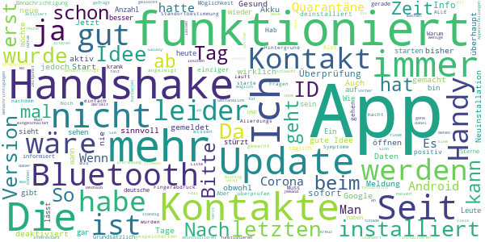
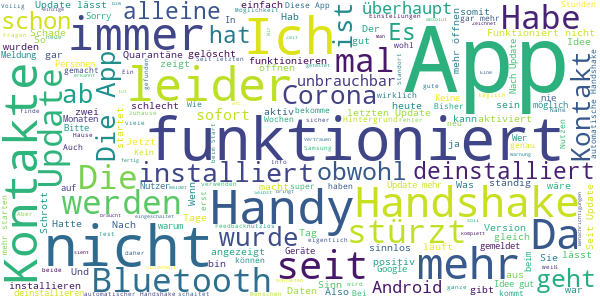

# Stopp Corona
App version ``2.1.0.1179-QA_259``

Analyzed with [covid-apps-observer](http://github.com/covid-apps-observer) project, version ``0.1``

## App overview
| | |
|-------------------------|-------------------------| 
| **Name**&nbsp;&nbsp;&nbsp;&nbsp;&nbsp;&nbsp;&nbsp;&nbsp;&nbsp;&nbsp;&nbsp;&nbsp;&nbsp;&nbsp;&nbsp;&nbsp;&nbsp;&nbsp;&nbsp;&nbsp;&nbsp;&nbsp;&nbsp;&nbsp;&nbsp;&nbsp;&nbsp;&nbsp;&nbsp;&nbsp;&nbsp;&nbsp;&nbsp;&nbsp;&nbsp;&nbsp;&nbsp;&nbsp;&nbsp;&nbsp;  | Stopp Corona |
| **Unique identifier** | at.roteskreuz.stopcorona |
| **Link to Google Play** | [https://play.google.com/store/apps/details?id=at.roteskreuz.stopcorona](https://play.google.com/store/apps/details?id=at.roteskreuz.stopcorona) |
| **Summary**  | Österreichs Corona-Warnungs-App |
| **Privacy policy** | [https://www.roteskreuz.at/site/faq-app-stopp-corona/datenschutzinformation-zur-stopp-corona-app/](https://www.roteskreuz.at/site/faq-app-stopp-corona/datenschutzinformation-zur-stopp-corona-app/) |
| **Latest version** | 2.1.0.1179-QA_259 |
| **Last update** | 2021-01-29 15:49:49 |
| **Recent changes** | Wir aktualisieren die App laufend für Sie:   Mit diesem Update ist der Austausch mit Apps aus anderen europäischen Ländern sichergestellt. Auch Infektionswarnungen anderer europaweiter Corona Tracing Apps werden nun übermittelt. Jede Übermittlung erfolgt verschlüsselt und anonymisiert. Noch Fragen? Lesen Sie mehr zu unseren Datenschutzvorkehrungen in den FAQs.  Gemeinsam können wir Corona stoppen! |
| **Installs**  | 100.000+ |
| **Category** | Medizin |
| **First release** | 25.03.2020 |
| **Size**  | 6,2M |
| **Supported Android version**  | 6.0 oder höher |

### Description
> Das Österreichische Rote Kreuz veröffentlicht die “Stopp Corona”-App im Auftrag des Gesundheitsministeriums, der obersten Gesundheitsbehörde Österreichs. 
 Mit der „Stopp Corona“-App lassen sich Begegnungen mit Freunden, der Familie oder Arbeitskollegen ganz einfach und anonymisiert speichern. Sollten Sie sich mit Corona infizieren, können Sie einfach über die App eine Meldung abgeben und Ihre Kontakte aus den letzten 2 Tagen werden anonym benachrichtigt. 
 Das gleiche gilt natürlich umgekehrt. Gibt eine Ihrer gespeicherten Begegnungen an, sich infiziert zu haben, erhalten Sie umgehend eine Nachricht und Sie können entsprechende Maßnahmen ergreifen. Dazu zählen vor allem:
 -	Abstand halten
 -	Soziale Kontakte vermeiden
 -	Sich vorsichtshalber in Selbstisolation begeben
 Beim Einsetzen von Symptomen kontaktieren Sie bitte telefonisch ihre Hausärztin oder den Hausarzt. Wenn das nicht möglich ist, rufen Sie die die Nummer 1450 an.
 Jedenfalls gilt: Bitte nicht die Ärztin/oder den Arzt persönlich aufsuchen und auch nicht ins Krankenhaus fahren. Bei einem medizinischen Notfall: 144 rufen.
 Gemeinsam unterbrechen wir so die Infektionskette.
 So schützen Sie nicht nur sich selbst, sondern verhindern auch, dass andere sich infizieren.
 Nutze Sie den digitalen Handshake
 Bis wir uns wieder unbedacht die Hände bei der Begrüßung reichen können, wird es wohl noch einige Zeit dauern. In der Zwischenzeit nutzen Sie einfach den digitalen Handshake der „Stopp Corona“-App.
 Haben Sie und die Person mit der Sie sich treffen die App installiert, speichert die App, dass Sie sich getroffen haben. Diese Daten werden anonymisiert gespeichert. Erkrankt einer von Ihnen beiden an dem Corona-Virus, erhält der andere eine Nachricht.
 Machen Sie den Corona-Selbstcheck
 Wie geht es Ihnen heute? Anhand eines klinisch geprüften Fragebogens können Sie sich täglich auf Corona-Symptome überprüfen.
 Corona-Verdachtsmeldung
 Entsprechen die Symptome dem Corona-Virus, können Sie eine Meldung über die App abgeben. Das ist wichtig, damit sich nicht noch mehr Menschen mit dem Virus infizieren. Ihre Begegnungen werden dann anonymisiert benachrichtigt. Keine Sorge, sie erhalten also keine persönlichen Angaben. 
 Anschließend bleiben Sie bitte Zuhause und kontaktieren Sie Ihre Hausärztin oder Ihren Hausarzt telefonisch. Wenn das nicht möglich ist rufen Sie die Nummer 1450 an.
 Fahren Sie nicht ins Krankenhaus und suchen Sie Ihren Arzt nicht persönlich auf.
 Ärztliche Bestätigung
 Stellt ein Arzt den Corona-Virus fest, können Sie ebenfalls eine Meldung abgeben. Auch hier werden Ihre Begegnungen anonymisiert benachrichtigt.
 Die App entstand in Partnerschaft mit der UNIQA Stiftung.
 Konzept und Realisierung in Zusammenarbeit und mit Unterstützung von Accenture Österreich und basiert auf dem Contacttracing-Framework von Apple und Google
 Schau auf Dich. Schau auf mich. So schützen wir uns.
 Link zum Open Source Software Projekt: https://github.com/austrianredcross/stopp-corona-android

### User interface
The developers of the app provide the following screenshots in the Google play store.
| | | |
|:-------------------------:|:-------------------------:|:-------------------------:|
 |   |   |   | 
 |   |   |   | 
 |   |  

## Development team
In the following we report the main information provided by the development team in the Google play store.

| | |
|-------------------------|-------------------------|
| **Developer**  | Österreichisches Rotes Kreuz |
| **Website**  | [https://www.roteskreuz.at](https://www.roteskreuz.at) |
| **Email** | service@roteskreuz.at |
| **Physical address**  | [Wiedner Hauptstrasse 32 1040 Wien Österreich](https://www.google.com/maps/search/Wiedner%20Hauptstrasse%2032%201040%20Wien%20Österreich) (Google Maps) |
| **Other developed apps**  | [https://play.google.com/store/apps/developer?id=%C3%96sterreichisches+Rotes+Kreuz](https://play.google.com/store/apps/developer?id=%C3%96sterreichisches+Rotes+Kreuz) |

## Android support

| | |
|-------------------------|-------------------------|
| **Declared target Android version**  | Android10, version 10 (API level 29) |
| **Effective target Android version**  | Android10, version 10 (API level 29) |
| **Minimum supported Android version**  | Marshmallow, version 6.0 (API level 23) |
| **Maximum target Android version**  | - |

The larger the difference between the minimum and maximum supported Android versions, the better. A larger difference means a wider audience. For example, old phones have a very low Android version, so a high minimum supported Android version means that the app cannot be used by users with old phones, thus leading to accessibility problems. 

## Requested permissions

In the following we report the complete list of the permissions requested by the app. 

| **Permission** | **Protection level** | **Description** | 
|-------------------------|-------------------------|-------------------------|
 **android.permission ACCESS_NETWORK_STATE** | Normal | Allows applications to access information about networks. 
 **android.permission BLUETOOTH** | Normal | Allows applications to connect to paired bluetooth devices. 
 **android.permission FOREGROUND_SERVICE** | Normal | Allows a regular application to use Service.startForeground. 
 **android.permission INTERNET** | Normal | Allows applications to open network sockets. 
 **android.permission RECEIVE_BOOT_COMPLETED** | Normal | Allows an application to receive the Intent.ACTION_BOOT_COMPLETED that is broadcast after the system finishes booting. 
 **android.permission REQUEST_IGNORE_BATTERY_OPTIMIZATIONS** | Normal | Permission an application must hold in order to use Settings.ACTION_REQUEST_IGNORE_BATTERY_OPTIMIZATIONS. 
 **android.permission WAKE_LOCK** | Normal | Allows using PowerManager WakeLocks to keep processor from sleeping or screen from dimming. 

## Mentioned servers

| **Server** | **Registrant** | **Registrant country** | **Creation date** | 
|-------------------------|-------------------------|-------------------------|-------------------------|
 | google.com | Google LLC | :us: US | 1997-09-15 04:00:00 |
 | prod-rca-coronaapp-fd.net | Domains By Proxy, LLC | :us: US | 2020-04-20 20:16:19 |

## Security analysis 

Below we report the main security warnings raised by our execution of the [Androwarn](https://github.com/maaaaz/androwarn) security analysis tool.

**Connection interfaces exfiltration**
> - This application reads details about the currently active data network 
> - This application tries to find out if the currently active data network is metered 

**Telephony services abuse**
> - This application makes phone calls 

**Suspicious connection establishment**
> - This application opens a Socket and connects it to the remote address '; port is out of range' on the 'N/A' port  
> - This application opens a Socket and connects it to the remote address 'Lcom/android/tools/r8/GeneratedOutlineSupport;->outline17(Ljava/lang/String;)Ljava/lang/StringBuilder;' on the 'N/A' port  
> - This application opens a Socket and connects it to the remote address 'Ljava/net/Proxy;->type()Ljava/net/Proxy$Type;' on the 'N/A' port  
> - This application opens a Socket and connects it to the remote address 'timeout' on the 'N/A' port  

## User ratings and reviews

Below we provide information about how end users are reacting to the app in terms of ratings and reviews in the Google Play store.

### Ratings

The Stopp Corona app has been installed by more than **100000** times. At this time, **3561** rated the app and its average score is **3.210674**. Below we show the distribution of the ratings across the usual star-based rating of Google Play

:star::star::star::star::star:: 1461

:star::star::star::star:: 350

:star::star::star:: 370

:star::star:: 240

:star:: 1140

### Reviews 

#### 5-star reviews

> Ich fühle mich sicher mit dieser App! Danke dafür! 😉  :date: __2021-02-11 13:20:17__

> Finde diese App ist sehr praktisch  :date: __2021-02-11 12:21:11__

> Ich hatte noch keine Warnung über einen Kontakt mit positiv getestete Person.  :date: __2021-02-11 11:53:04__

> Finde ich sehr wichtig!  :date: __2021-02-07 12:41:40__

> Super  :date: __2021-02-06 20:31:38__

> Sehr sinnvolle App, die eigentlich verpflichtend für Alle sein sollte  :date: __2021-02-05 23:06:35__

> Ich finde keine Kontakte von mir.  :date: __2021-02-04 22:38:45__

> Glücklicher weise hab ich noch keinen Kontakt gehabt!  :date: __2021-02-04 18:01:25__

> Relativ wenig  :date: __2021-02-04 12:02:21__

> Bin froh , dass es die App gibt  :date: __2021-02-04 08:03:30__

#### 4-star reviews

> Etwas gewöhnungsbedürftig. Doch man kommt dazu, wie man bedient.  :date: __2021-02-06 09:10:04__

> Früher wurde angezeigt, um welche Zeit eine eventuelle Begegnung mit einer infizierten Person stattgefunden hat. Das fehlt jetzt!  :date: __2021-02-04 14:12:41__

> Habe die App sofort installiert, finde die Idee gut, habe aber bis heute noch keine Verständigung erhalten leider gibt es auch zu wenig Nutzer  :date: __2021-01-14 10:27:08__

> Funktioniert anscheinend  :date: __2020-12-11 08:41:29__

> Wenn das alle hätten wäre das Contact-Tracing ein Selbstläufer. Aber das UI ist halt sehr lahm. Wenn man die Statistik über die Handshakes wenigstens gleich auf der ersten Seite hätte, dass man irgend eine Aktivität sieht.  :date: __2020-11-27 10:55:40__

> Alles gut 👍 s  :date: __2020-11-23 20:15:40__

> Update gibt es nicht?  :date: __2020-11-23 19:41:11__

> Wie in anderen Kommentaren wäre Feedback hilfreich wie viele Kontakte in den letzten x Tagen erkannt wurden. Sonst top.  :date: __2020-11-17 06:41:57__

> Habe erst heute die app runtergeladen  :date: __2020-11-16 17:58:07__

> Mich würde interessieren ob der Handsshake per Bluetooth auch noch funktioniert wenn ich permanent per Bluetooth mit meinen Fitness Armband Verbunden bin. Also ob dennoch Bluetooth auch für den Handshake genutzt werden kann  :date: __2020-11-13 06:56:30__

#### 3-star reviews

> Hab sie jetzt nach langer Zeit deinstalliert... bisher nie eine Meldung bekommwn, kein einziger Kontakt.. da weiß man nicht mal ob sie funktioniert 😑 und solangs fast keiner verwendet is es ziemlich sinnfrei  :date: __2021-02-03 11:46:28__

> Habs die App nicht installiert und werds auch nicht tun bis es nicht zuverlässig funktioniert! Quarantäne gehen nur auf Vermutung will keiner!  :date: __2021-01-31 18:13:04__

> Funktioniert nicht! Ich bin positiv und habe es in der App gemeldet! Mein Bruder hat die App ebenfalls seit langer Zeit und er hat keine Benachrichtigung bekommen! Obwohl wir jeden Tag mehrere Stunden Nebeneinander auf dem Sofa sitzen...! Edit: Habe mich nach einem Tag Gesund und dann wieder Krank gemeldet = jetzt ist er benachrichtigt geworden..  :date: __2021-01-02 11:58:54__

> Unser Datenschutzgesetz einerseits und die Haltung mancher Mitbürger andererseits zerstören meines Erachtens den guten Grundgedanken für die Verwendung dieser App. Was mir auffällt, ist, dass der von der App angezeigte Zeitstempel der Kontakte nicht stimmen kann. Die App zeigt Kontakte zu Zeiten, in denen keine waren, oder erst viel später an.  :date: __2020-12-23 10:26:34__

> Auch ich werde die App nun nicht weiter nutzen. Automatischer Handshake funktioniert fast nie, selbst wenn die Handys stundenlang im selben Raum sind. Ich bin täglich beruflich viel im öffentlichen Raum unterwegs, auch in Öffis. Bisher jedoch in 2 Monaten nur ein einziger Handshake. So hat das doch keinen Sinn. Hauptsache das Rote Kreuz kann sich damit wichtig machen. 👎🏼  :date: __2020-12-21 08:22:18__

> wie kann ich mich nach einer erkrankung in der app wieder gesund melden? möchte es nicht einschalten solange die app noch meint dass ich krank bin.  :date: __2020-12-20 14:09:02__

> Die App ist jetzt annehmbar. Eine Grafik bei der ab zu lesen ist, in welchem Risiko ich mich mit meinem Bewegunsradius befinde. Umstieg auf die Deutsche App.  :date: __2020-12-19 22:01:37__

> Die Idee Ansicht ist gut, aber man muss immer Bluetooth anlassen so wie den Standort, das verbraucht viel Akku. Aber sonst ist die Idee sehr gut, damit man die Verbreitung vermindern kann, dennoch funktioniert das nur wenn es mehr Leute benutzen  :date: __2020-12-02 11:32:56__

> Wie auch schon berichtet, besteht keine Möglichkeit, nach einer Infektion wieder auf Gesund zu wechseln. Eine Email Anfrage wurde schnell aber nicht hilfreich beantwortet.  :date: __2020-12-01 19:29:16__

> War krank, habe alle über die App informiert, bin wieder gesund dennoch bekomme ich permanent die Aufforderung meine ID s zu benachrichtigen, kann das nicht abstellen. Werde alles löschen 😠  :date: __2020-12-01 11:30:36__

#### 2-star reviews

> Offensichtlich sinnlos und lässt den User im Regen stehen. Ich bekam heute eine Warnung eines möglichen Kontaktes. Dieses nicht ausgereifte Stück Software zeigt nicht mal an, an welchem Tag der Kontakt statt gefunden hat. Erst eine Kontaktaufnahme der betroffenen Person bestätigte die offensichtliche Quelle des Kontakts (Gott sei Dank alles negativ). Seit dem nervt die App im ca 30min. Takt mit Warnmeldungen. Lt. App hatte ich jetzt schon 5 weitere Kontakte. Stümperhaft. Schade ums Geld.  :date: __2021-02-07 11:27:25__

> Ist das gleiche wie mit Lockdown: App ist nur sinnvoll, wenn alle mitmachen.  :date: __2021-02-07 10:49:50__

> Okay  :date: __2021-02-06 14:13:44__

> Habe sie fast nie ein geschaltet bin eigentlich fast immer zu Hause arbeiten du ich in der Schweiz drum Drau mich nicht Handy mit nehmen wegen teurer Rechnung im nicht EU Land  :date: __2021-02-04 18:45:52__

> Hallo STOPP Corona App Programmierer! So kann das nicht funktionieren... ich denke, es müsste direkt positiv getestete Personen automatisch eingegeben werden! Nur so hätte die App einen Sinn.... Fg  :date: __2021-02-04 12:00:30__

> Ich habe innerhalb einer Stunde 115000 Schlüssel hinzugefügt bekommen, war jedoch zuhause und habe niemanden getroffen, in den Nachtstunden plötzlich wieder 10000 zusätzliche Schlüssel. Plus Anzahl Treffer 1. Habe somit von durchschnittlichen 300 Schlüsseln seit Frühjahr nun 128000.  :date: __2021-02-04 09:51:13__

> Mehr Informationen am Dashboard wären hilfreich. Anzahl Begegnung, etc. ...  :date: __2021-01-30 11:54:49__

> Warum kann ich die Stopp Corona App nicht mehr aufmachen, so wie vorher immer?  :date: __2021-01-14 16:03:58__

> Die Zählweise der IDs ist nicht nachvollziehbar. Habe in der Wohnung keinen Untermieter und trotzdem neue IDs bekommen. 1k sind für die zweit größte Stadt Österreichs dann doch wenig IDs. Keine Alarmmeldung noch bekommen.  :date: __2021-01-06 19:03:52__

> Ich habe dutzende Benachrichtigungen über Kontakte, obwohl ich in dieser Zeit definitiv allein zu Hause war. Es kann auch nicht von einer anderen Wohnung sein, ich lebe in einem Einfamilienhaus, weit und breit kein Mensch. Vielleicht könnte man die Mitglieder des eigenen Haushaltes auf eine Whitelist setzen. Da wird man es ohnehin erfahren wenn sie positiv sind  :date: __2021-01-02 13:26:53__

#### 1-star reviews

> Anwendung gelöscht. Hat keine Funktion, seit Monaten keine Angabe von Kontakten usw. Dafür werden andere BT-Verbindungen (Autofreisprech, Headset etc.) permanent geblockt. Diese funktionieren erst nach deaktivieren der Stopp Corona App.  :date: __2021-02-11 15:49:20__

> Hätte mir viel mehr erwartet, inzwischen hätte man ja vielleicht neue Funktionen einbauen können, wie Impfanmeldung, Info zur Inzidenz Entwicklung etc. So nutzt die App eigentlich erst wenn du offiziell als infiziert gemeldet bist, und da nur jenen die sie auch installiert haben. Nett, aber ausbaufähig  :date: __2021-02-11 10:45:16__

> Verwendet die noch jemand? Irgendeine Info, ob sie überhaupt was tut (Anzahl der Kontakte mit anderen Corona Apps, Gesamtanzahl der Risiko Kontakte die mittels der App identifiziert wurden) wäre gut. Gibt auch keine updates dafür. Wieder deinstalliert.  :date: __2021-02-08 09:27:55__

> Wenn eine Mehrheit der Bevölkerung intellektuell überfordert ist, den Sinn dieser App zu erfassen, ist diese eben wenig sinnvoll. Die Frage, ob das Design anspricht und die App gefällt, passt dazu.  :date: __2021-02-07 23:13:32__

> Diese App funktioniert überhaupt nicht, meine Nachbarn hatten Corona mussten 2wochen zu Hause bleiben, ich bekam auch keine Warnung, habe Alles gelöscht was Corona betrifft, bin sowas von der App Enttäuscht 😞 😞 und was Corona betrifft.  :date: __2021-02-07 11:36:19__

> Funktioniert sie überhaupt?  :date: __2021-02-05 20:07:28__

> Mein Eindruck ist, die App ist für fast gar nichts. Sie ist beinahe so doof und unfähig wie ihr Erfinder.  :date: __2021-02-05 00:34:34__

> keine  :date: __2021-02-04 18:33:05__

> Seit letzdem Update gar keine Info mehr. Hab die APP gelöscht. Gute Absicht aber leider sehr schlechte Umsetzung. Der User hat generell das Gefühl, es passiert nichts. Als mindest-Info sollte man gleich am Startbildschirm Zähler für n Kontakte, Zähler je Tag, eventuell auch Zähler >15 Min. sehen. Eine APP die nichts zeigt - was soll das sein?  :date: __2021-02-04 11:56:16__

> Ich war jetzt 2 Wochen nur zu Hause und das ganz alleine und die App sagt mir das ich sehr viel Kontakt mit anderen Menschen habe. Wahrscheinlich kommt das von den vielen Leuten die immer an meinem Zuhause vorbeikommen.  :date: __2021-02-01 17:02:50__

