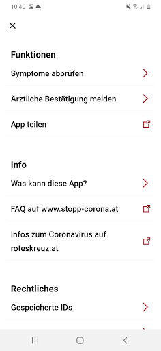
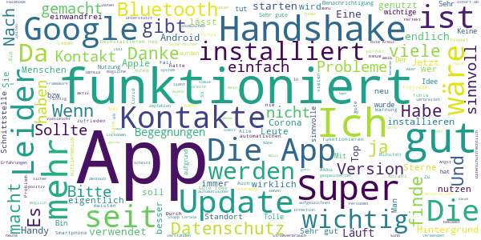
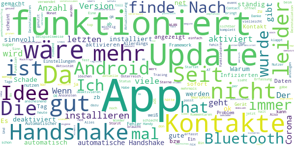
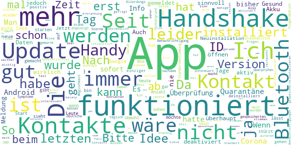
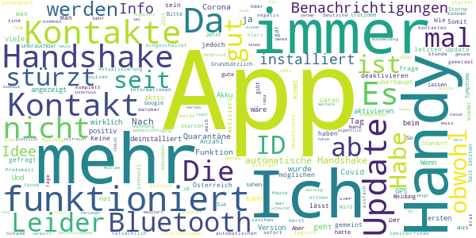
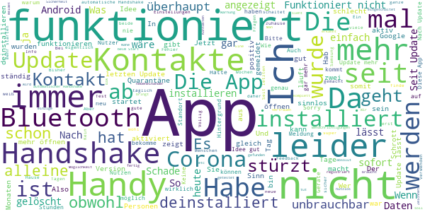

# Stopp Corona
App version ``2.1.1.1227-QA_263``

Analyzed with [covid-apps-observer](http://github.com/covid-apps-observer) project, version ``0.1``

## App overview
| | |
|-------------------------|-------------------------| 
| **Name**&nbsp;&nbsp;&nbsp;&nbsp;&nbsp;&nbsp;&nbsp;&nbsp;&nbsp;&nbsp;&nbsp;&nbsp;&nbsp;&nbsp;&nbsp;&nbsp;&nbsp;&nbsp;&nbsp;&nbsp;&nbsp;&nbsp;&nbsp;&nbsp;&nbsp;&nbsp;&nbsp;&nbsp;&nbsp;&nbsp;&nbsp;&nbsp;&nbsp;&nbsp;&nbsp;&nbsp;&nbsp;&nbsp;&nbsp;&nbsp;  | Stopp Corona |
| **Unique identifier** | at.roteskreuz.stopcorona |
| **Link to Google Play** | [https://play.google.com/store/apps/details?id=at.roteskreuz.stopcorona](https://play.google.com/store/apps/details?id=at.roteskreuz.stopcorona) |
| **Summary**  | Österreichs Corona-Warnungs-App |
| **Privacy policy** | [https://www.roteskreuz.at/site/faq-app-stopp-corona/datenschutzinformation-zur-stopp-corona-app/](https://www.roteskreuz.at/site/faq-app-stopp-corona/datenschutzinformation-zur-stopp-corona-app/) |
| **Latest version** | 2.1.1.1227-QA_263 |
| **Last update** | 2021-04-06 16:15:52 |
| **Recent changes** |  Wir aktualisieren die App laufend für Dich:  - Homescreen überarbeitet - Du kannst nun die Aktivitäten der App sehen (letztes Update und letzte Risikobegegnung) - Gesund melden ist möglich (Ende der Quarantäne nach gemeldeter Infektion) - Warnung Deiner Kontakte über das Menü - Datum des Symptombeginns bei Infektion auswählbar - Kleinere Fehlerbehebungen   Let´s continue to Stopp Corona together! |
| **Installs**  | 100.000+ |
| **Category** | Medizin |
| **First release** | 25.03.2020 |
| **Size**  | 6,4M |
| **Supported Android version**  | 6.0 oder höher |

### Description
> Das Österreichische Rote Kreuz veröffentlicht die “Stopp Corona”-App im Auftrag des Gesundheitsministeriums, der obersten Gesundheitsbehörde Österreichs. 
 Mit der „Stopp Corona“-App lassen sich Begegnungen mit Freunden, der Familie oder Arbeitskollegen ganz einfach und anonymisiert speichern. Sollten Sie sich mit Corona infizieren, können Sie einfach über die App eine Meldung abgeben und Ihre Kontakte aus den letzten 2 Tagen werden anonym benachrichtigt. 
 Das gleiche gilt natürlich umgekehrt. Gibt eine Ihrer gespeicherten Begegnungen an, sich infiziert zu haben, erhalten Sie umgehend eine Nachricht und Sie können entsprechende Maßnahmen ergreifen. Dazu zählen vor allem:
 -	Abstand halten
 -	Soziale Kontakte vermeiden
 -	Sich vorsichtshalber in Selbstisolation begeben
 Beim Einsetzen von Symptomen kontaktieren Sie bitte telefonisch ihre Hausärztin oder den Hausarzt. Wenn das nicht möglich ist, rufen Sie die die Nummer 1450 an.
 Jedenfalls gilt: Bitte nicht die Ärztin/oder den Arzt persönlich aufsuchen und auch nicht ins Krankenhaus fahren. Bei einem medizinischen Notfall: 144 rufen.
 Gemeinsam unterbrechen wir so die Infektionskette.
 So schützen Sie nicht nur sich selbst, sondern verhindern auch, dass andere sich infizieren.
 Nutze Sie den digitalen Handshake
 Bis wir uns wieder unbedacht die Hände bei der Begrüßung reichen können, wird es wohl noch einige Zeit dauern. In der Zwischenzeit nutzen Sie einfach den digitalen Handshake der „Stopp Corona“-App.
 Haben Sie und die Person mit der Sie sich treffen die App installiert, speichert die App, dass Sie sich getroffen haben. Diese Daten werden anonymisiert gespeichert. Erkrankt einer von Ihnen beiden an dem Corona-Virus, erhält der andere eine Nachricht.
 Machen Sie den Corona-Selbstcheck
 Wie geht es Ihnen heute? Anhand eines klinisch geprüften Fragebogens können Sie sich täglich auf Corona-Symptome überprüfen.
 Corona-Verdachtsmeldung
 Entsprechen die Symptome dem Corona-Virus, können Sie eine Meldung über die App abgeben. Das ist wichtig, damit sich nicht noch mehr Menschen mit dem Virus infizieren. Ihre Begegnungen werden dann anonymisiert benachrichtigt. Keine Sorge, sie erhalten also keine persönlichen Angaben. 
 Anschließend bleiben Sie bitte Zuhause und kontaktieren Sie Ihre Hausärztin oder Ihren Hausarzt telefonisch. Wenn das nicht möglich ist rufen Sie die Nummer 1450 an.
 Fahren Sie nicht ins Krankenhaus und suchen Sie Ihren Arzt nicht persönlich auf.
 Ärztliche Bestätigung
 Stellt ein Arzt den Corona-Virus fest, können Sie ebenfalls eine Meldung abgeben. Auch hier werden Ihre Begegnungen anonymisiert benachrichtigt.
 Die App entstand in Partnerschaft mit der UNIQA Stiftung.
 Konzept und Realisierung in Zusammenarbeit und mit Unterstützung von Accenture Österreich und basiert auf dem Contacttracing-Framework von Apple und Google
 Schau auf Dich. Schau auf mich. So schützen wir uns.
 Link zum Open Source Software Projekt: https://github.com/austrianredcross/stopp-corona-android

### User interface
The developers of the app provide the following screenshots in the Google play store.
| | | |
|:-------------------------:|:-------------------------:|:-------------------------:|
 |   |   |   | 
 |   |   |   | 
 |   |  

## Development team
In the following we report the main information provided by the development team in the Google play store.

| | |
|-------------------------|-------------------------|
| **Developer**  | Österreichisches Rotes Kreuz |
| **Website**  | [https://www.roteskreuz.at](https://www.roteskreuz.at) |
| **Email** | service@roteskreuz.at |
| **Physical address**  | [Wiedner Hauptstrasse 32 1040 Wien Österreich](https://www.google.com/maps/search/Wiedner%20Hauptstrasse%2032%201040%20Wien%20Österreich) (Google Maps) |
| **Other developed apps**  | [https://play.google.com/store/apps/developer?id=%C3%96sterreichisches+Rotes+Kreuz](https://play.google.com/store/apps/developer?id=%C3%96sterreichisches+Rotes+Kreuz) |

## Android support

| | |
|-------------------------|-------------------------|
| **Declared target Android version**  | Android10, version 10 (API level 29) |
| **Effective target Android version**  | Android10, version 10 (API level 29) |
| **Minimum supported Android version**  | Marshmallow, version 6.0 (API level 23) |
| **Maximum target Android version**  | - |

The larger the difference between the minimum and maximum supported Android versions, the better. A larger difference means a wider audience. For example, old phones have a very low Android version, so a high minimum supported Android version means that the app cannot be used by users with old phones, thus leading to accessibility problems. 

## Requested permissions

In the following we report the complete list of the permissions requested by the app. 

| **Permission** | **Protection level** | **Description** | 
|-------------------------|-------------------------|-------------------------|
 **android.permission ACCESS_NETWORK_STATE** | Normal | Allows applications to access information about networks. 
 **android.permission BLUETOOTH** | Normal | Allows applications to connect to paired bluetooth devices. 
 **android.permission FOREGROUND_SERVICE** | Normal | Allows a regular application to use Service.startForeground. 
 **android.permission INTERNET** | Normal | Allows applications to open network sockets. 
 **android.permission RECEIVE_BOOT_COMPLETED** | Normal | Allows an application to receive the Intent.ACTION_BOOT_COMPLETED that is broadcast after the system finishes booting. 
 **android.permission REQUEST_IGNORE_BATTERY_OPTIMIZATIONS** | Normal | Permission an application must hold in order to use Settings.ACTION_REQUEST_IGNORE_BATTERY_OPTIMIZATIONS. 
 **android.permission WAKE_LOCK** | Normal | Allows using PowerManager WakeLocks to keep processor from sleeping or screen from dimming. 

## Mentioned servers

| **Server** | **Registrant** | **Registrant country** | **Creation date** | 
|-------------------------|-------------------------|-------------------------|-------------------------|
 | google.com | Google LLC | :us: US | 1997-09-15 04:00:00 |
 | prod-rca-coronaapp-fd.net | Domains By Proxy, LLC | :us: US | 2020-04-20 20:16:19 |

## Security analysis 

Below we report the main security warnings raised by our execution of the [Androwarn](https://github.com/maaaaz/androwarn) security analysis tool.

**Connection interfaces exfiltration**
> - This application reads details about the currently active data network 
> - This application tries to find out if the currently active data network is metered 

**Telephony services abuse**
> - This application makes phone calls 

**Suspicious connection establishment**
> - This application opens a Socket and connects it to the remote address '; port is out of range' on the 'N/A' port  
> - This application opens a Socket and connects it to the remote address 'Lcom/android/tools/r8/GeneratedOutlineSupport;->outline17(Ljava/lang/String;)Ljava/lang/StringBuilder;' on the 'N/A' port  
> - This application opens a Socket and connects it to the remote address 'Ljava/net/Proxy;->type()Ljava/net/Proxy$Type;' on the 'N/A' port  
> - This application opens a Socket and connects it to the remote address 'timeout' on the 'N/A' port  

## User ratings and reviews

Below we provide information about how end users are reacting to the app in terms of ratings and reviews in the Google Play store.

### Ratings

The Stopp Corona app has been installed by more than **100000** times. At this time, **3676** rated the app and its average score is **3.4254742**. Below we show the distribution of the ratings across the usual star-based rating of Google Play

:star::star::star::star::star:: 1714

:star::star::star::star:: 408

:star::star::star:: 289

:star::star:: 259

:star:: 1006

### Reviews 

#### 5-star reviews

> Bin selbst betroffen und mußte auch am 11.3.21 Ins Krankenhaus.Durch Meinen Hausarzt einge- wiesen.Die Simtome waren Erbrechen mit Durchfall u. Schwindel Scchweißausbrū- chen sowie Fieber 38 grad! u.nach posetiv Test.Gleich v.Der Rettung ins KH.Spittal/dr.Nach 11 Tagen aufenthalt Nachhause:Mit aller Einhältungs regen Keine Kontakten nach Aussen sowie Sehr Stiriel gehalten.Mõchte Keinen Rückfall erleben! Habe troz meinen Vor Erkrankungen genug mitgemacht.Durch die Medizin!Gott seiß Gedankt!!!!!!  :date: __2021-04-10 11:04:41__

> Gute Idee, trotz aller Unkenrufe akzeptabel umgesetzt, und wenn sie ein großer Teil der Bevölkerung nutzen würde (freiwillig ohne Frage!), täte sie echt helfen um Covid zu bekämpfen. Aber nein, anscheinend bevorzugt der gelernte Österreicher Lockdowns... Und jetzt (Version 2.1.1.1227-QA_263) sieht man direkt auf der Startseite der App, wie viele Kontaktabgleiche sie gemacht hat und wann der letzte war! Sehr gut!  :date: __2021-04-10 07:02:15__

> Super  :date: __2021-04-09 11:56:39__

> CoronAsollAuch Endlich ernst genommen werden!! its a Evolutionary KillSwitchMyConspiracyTheory  :date: __2021-04-04 15:53:00__

> Keine Ahnung was die macht, gab noch keinen Ton von sich. Hoffentlich bleibt das so  :date: __2021-04-02 10:49:35__

> Bis jetzt kein Bericht hereinbekommen  :date: __2021-03-30 16:40:11__

> Sinnvoll  :date: __2021-03-07 10:50:13__

> Die App ist gut, macht, was sie soll. Das Problem der App ist, dass sie auf jede Befindlichkeit und Bedenken von Nicht-Usern Rücksicht nimmt und deshalb nur sehr eingeschränkt leistet, was technisch wie DSVO-rechtlich durchaus möglich wäre. Corona ist aber kein Problem, dass sich mit Meinungsvielfalt, Einwandbehandlung und Demokratie in den Griff kriegen lãsst.  :date: __2021-03-03 11:13:01__

> Leider haben nicht alle diesen App  :date: __2021-03-02 23:47:28__

> I find das wichtig.  :date: __2021-02-28 07:34:41__

#### 4-star reviews

> Warum muss plötzlich der Standort aktiviert werden? Ich bekomme mehrmals täglich den Hinweis dass es sonst nicht funktioniert...  :date: __2021-03-26 06:24:26__

> An sich gute App, leider benutzt das fast niemand  :date: __2021-03-24 11:52:48__

> Alles im grünen Bereich  :date: __2021-03-20 10:41:39__

> 500 MB Datenvolumen in einem Monat seit dem Update verbraucht. Da stimmt doch was nicht. Update: Nach Rückfrage beim RK wurde mir empfohlen, die mobilen Daten für die App auszuschalten, da es ausreicht, wenn die App sich ein paar Mal am Tag übers WLAN verbindet. Begründet wurde der Datenverbrauch mit der Interoperabilität zwischen einigen EU-Contact-Tracing Apps.  :date: __2021-03-16 11:41:04__

> Tägliche aktuelle Nachschau, sicheres Gefühl, eigene Kontakte nachvollziehen zu können!  :date: __2021-03-04 20:03:45__

> Bin gesund seit Beginn  :date: __2021-03-03 18:33:08__

> e hxss  :date: __2021-02-21 14:05:08__

> Etwas gewöhnungsbedürftig. Doch man kommt dazu, wie man bedient.  :date: __2021-02-06 09:10:04__

> Früher wurde angezeigt, um welche Zeit eine eventuelle Begegnung mit einer infizierten Person stattgefunden hat. Das fehlt jetzt!  :date: __2021-02-04 14:12:41__

> Habe die App sofort installiert, finde die Idee gut, habe aber bis heute noch keine Verständigung erhalten leider gibt es auch zu wenig Nutzer  :date: __2021-01-14 10:27:08__

#### 3-star reviews

> Zu wenige Nutzer.  :date: __2021-03-21 11:52:32__

> Hab sie jetzt nach langer Zeit deinstalliert... bisher nie eine Meldung bekommwn, kein einziger Kontakt.. da weiß man nicht mal ob sie funktioniert 😑 und solangs fast keiner verwendet is es ziemlich sinnfrei  :date: __2021-02-03 11:46:28__

> Habs die App nicht installiert und werds auch nicht tun bis es nicht zuverlässig funktioniert! Quarantäne gehen nur auf Vermutung will keiner!  :date: __2021-01-31 18:13:04__

> Funktioniert nicht! Ich bin positiv und habe es in der App gemeldet! Mein Bruder hat die App ebenfalls seit langer Zeit und er hat keine Benachrichtigung bekommen! Obwohl wir jeden Tag mehrere Stunden Nebeneinander auf dem Sofa sitzen...! Edit: Habe mich nach einem Tag Gesund und dann wieder Krank gemeldet = jetzt ist er benachrichtigt geworden..  :date: __2021-01-02 11:58:54__

> Unser Datenschutzgesetz einerseits und die Haltung mancher Mitbürger andererseits zerstören meines Erachtens den guten Grundgedanken für die Verwendung dieser App. Was mir auffällt, ist, dass der von der App angezeigte Zeitstempel der Kontakte nicht stimmen kann. Die App zeigt Kontakte zu Zeiten, in denen keine waren, oder erst viel später an.  :date: __2020-12-23 10:26:34__

> Auch ich werde die App nun nicht weiter nutzen. Automatischer Handshake funktioniert fast nie, selbst wenn die Handys stundenlang im selben Raum sind. Ich bin täglich beruflich viel im öffentlichen Raum unterwegs, auch in Öffis. Bisher jedoch in 2 Monaten nur ein einziger Handshake. So hat das doch keinen Sinn. Hauptsache das Rote Kreuz kann sich damit wichtig machen. 👎🏼  :date: __2020-12-21 08:22:18__

> wie kann ich mich nach einer erkrankung in der app wieder gesund melden? möchte es nicht einschalten solange die app noch meint dass ich krank bin.  :date: __2020-12-20 14:09:02__

> Die App ist jetzt annehmbar. Eine Grafik bei der ab zu lesen ist, in welchem Risiko ich mich mit meinem Bewegunsradius befinde. Umstieg auf die Deutsche App.  :date: __2020-12-19 22:01:37__

> Die Idee Ansicht ist gut, aber man muss immer Bluetooth anlassen so wie den Standort, das verbraucht viel Akku. Aber sonst ist die Idee sehr gut, damit man die Verbreitung vermindern kann, dennoch funktioniert das nur wenn es mehr Leute benutzen  :date: __2020-12-02 11:32:56__

> Wie auch schon berichtet, besteht keine Möglichkeit, nach einer Infektion wieder auf Gesund zu wechseln. Eine Email Anfrage wurde schnell aber nicht hilfreich beantwortet.  :date: __2020-12-01 19:29:16__

#### 2-star reviews

> Leider bisher noch keine Meldung erhalten  :date: __2021-03-22 17:21:50__

> 1.) Der Verbrauch an mobilen Daten ist SEHR HOCH!!! 2.) Man hat keine Rückmeldung, ob die App wirklich funktioniert. 3.) Ist der Schalter "Automatische Handshake" ein/aus ident mit dem Schalter "COVID 19-Benachrichtigung aktivieren"? Wenn ja, warum verwendet man zwei verschiedene Bezeichnungen? Ich kann keinen Unterschied feststellen! 4.) Wenn ich "COVID 19-Benachrichtigung aktivieren" ausschalte, dann wird noch "Automatische Handshake" als aktiv angezeigt, obwohl es auch ausgeschaltet ist. Nach Neustart sind beide auf aus. Das ist ein FEHLER bei der Anzeige! 5.) Die Liste der möglichen Begegnungen war nicht sortiert und ist in der neuen Version (Feb 2021) nicht mehr vorhanden! 6.) Es gibt jedoch noch den Punkt "App-Einstellungen öffnen", hier werden jedoch nur Informationen angezeigt. 7.) In der App steht immer noch "1 Meter Abstand". Es sollte "2 Meter Abstand" lauten! 8.) Angeblich hat die App 20.000.000 Euro gekostet; da würde man sich etwas mehr erwarten:  :date: __2021-03-16 09:01:03__

> warum kommt nach dem aufrufen der app zuerst die frage nach dem "handschake" , anstelle die frage "symptome" prüfen? das verwirrt viele. und warum kommt nach der frage 1, keine frage 2 (falls ich mich gesund fühle, wähle?) das verwirrt zum 2. mal. haben die entwickler irgendwann die user gefragt wie es ihnen mit der app geht.  :date: __2021-03-03 09:18:03__

> Offensichtlich sinnlos und lässt den User im Regen stehen. Ich bekam heute eine Warnung eines möglichen Kontaktes. Dieses nicht ausgereifte Stück Software zeigt nicht mal an, an welchem Tag der Kontakt statt gefunden hat. Erst eine Kontaktaufnahme der betroffenen Person bestätigte die offensichtliche Quelle des Kontakts (Gott sei Dank alles negativ). Seit dem nervt die App im ca 30min. Takt mit Warnmeldungen. Lt. App hatte ich jetzt schon 5 weitere Kontakte. Stümperhaft. Schade ums Geld.  :date: __2021-02-07 11:27:25__

> Ist das gleiche wie mit Lockdown: App ist nur sinnvoll, wenn alle mitmachen.  :date: __2021-02-07 10:49:50__

> Okay  :date: __2021-02-06 14:13:44__

> Habe sie fast nie ein geschaltet bin eigentlich fast immer zu Hause arbeiten du ich in der Schweiz drum Drau mich nicht Handy mit nehmen wegen teurer Rechnung im nicht EU Land  :date: __2021-02-04 18:45:52__

> Hallo STOPP Corona App Programmierer! So kann das nicht funktionieren... ich denke, es müsste direkt positiv getestete Personen automatisch eingegeben werden! Nur so hätte die App einen Sinn.... Fg  :date: __2021-02-04 12:00:30__

> Ich habe innerhalb einer Stunde 115000 Schlüssel hinzugefügt bekommen, war jedoch zuhause und habe niemanden getroffen, in den Nachtstunden plötzlich wieder 10000 zusätzliche Schlüssel. Plus Anzahl Treffer 1. Habe somit von durchschnittlichen 300 Schlüsseln seit Frühjahr nun 128000.  :date: __2021-02-04 09:51:13__

> Mehr Informationen am Dashboard wären hilfreich. Anzahl Begegnung, etc. ...  :date: __2021-01-30 11:54:49__

#### 1-star reviews

> 218 MB mobile Hintergrunddaten in 8 Tagen.  :date: __2021-04-09 11:35:36__

> Die App hatte 2,9 GB internen Speicher "in Beschlag" von 64 GB. --> gelöscht  :date: __2021-04-05 06:46:36__

> Programmierer sollten Nachsitzen!!! 1. Extremer Stromfresser 2. Datenverbrauch absurd hoch 3. Bluetooth blockiert. Smartwatch ist wertlos nach installation der App. Also wieder weg mit dem Müll!!!!  :date: __2021-04-03 13:09:36__

> Hat im letzten Monat 1,35 GB an Mobilfunkdaten gesaugt, davon 1,25 im Hintergrundmodus. Wozu??? Ist jetzt deinstalliert. Schlecht gemacht  :date: __2021-04-02 14:26:25__

> Sorry aber warum muss ich der app erlauben 24/7 im Hintergrund aktiv zu sein?! Es klappt bei anderen Apps um 100x besser OHNE das diese ausgeführt wird. Diese App ist einfach zum Stromverbrauchen optimal.  :date: __2021-04-01 14:44:00__

> Habe in diesem Monat, obwohl ich mein Handy kaum eingeschaltet hatte, über 1,5gb an Daten verloren! Bei meinem Tarif sind das beinahe 17€, da ich normalerweise keine mobilen Daten verwende. Wofür braucht diese App überhaupt soviele Daten? Meiner Meinung nach sollte diese App den Menschen helfen die Corona Krise einzudämmen, bzw. etwas Kontrolle zu geben, aber momentan ist es nur Abzocke!  :date: __2021-04-01 11:33:05__

> Update: eindeutige enge K1 bekommt Info, dass "kein relevantes Ansteckungsrisiko" besteht. Wollte der App eine zweite Chance geben, aber alle 30 Minuten die selbe Fehlinformation - deinstalliert. Schade... Alte Rezension: Gleich der erste Handshake funktioniert nicht. Wozu wird das Mikrofon benötigt? Idee gut und unterstützenswert, Verbesserung als OpenSource-Projekt wäre sinnvoll! Vorerst wieder deinstalliert...  :date: __2021-03-29 08:34:18__

> bringt ständig irgendwelche Meldungen und das immer auf Englisch... ich dachte es ist eine österreichische App? Brauch ich jetzt dazu ein Übersetzungsprogramm oder was?  :date: __2021-03-20 20:19:10__

> Die App verbraucht nur Ressourcen. Diese App hat jedes Vertrauen verloren. Solange ich keine Informationen darüber erhalte, ob sie überhaupt funktioniert hat sie bei mir keine Chance auf dem Handy. Eine Rückmeldung von der App über die anonymen aber erfassten Kontakte wäre nicht schlecht. Ich weiß einfach nicht ob die App wirklich funktioniert. Also habe ich sie wieder gelöscht. Die App ist Ressourcen- und Geldverschwendung.  :date: __2021-03-20 18:52:24__

> Die App ist aus vermeintlichen Datenschutzgründen bis zur Nutzlosigkeit kastriert .. Den "Self-Check" finden wohl nur Leute hilfreich, denen zuvor das Hirn amputiert wurde .. für alle anderen denkbegabten Menschen eher eine Zeitverschwendung ..  :date: __2021-03-17 18:36:45__

