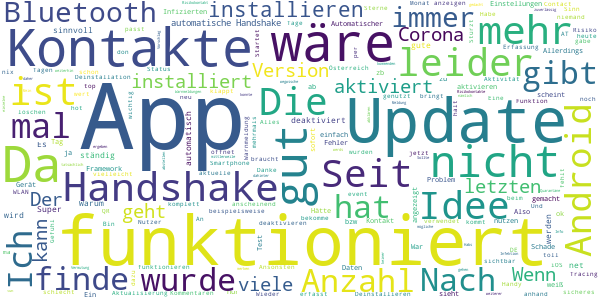
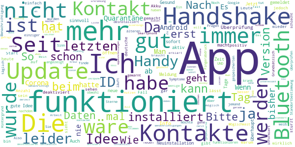
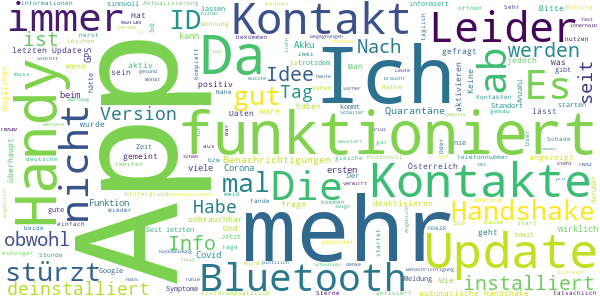
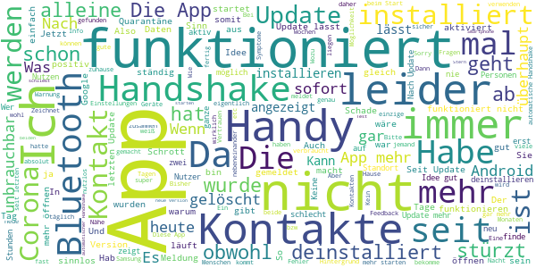

# Stopp Corona
App version ``2.1.2.1239-QA_263-2-gcc633a7``

Analyzed with [covid-apps-observer](http://github.com/covid-apps-observer) project, version ``0.1``

## App overview
| | |
|-------------------------|-------------------------| 
| **Name**&nbsp;&nbsp;&nbsp;&nbsp;&nbsp;&nbsp;&nbsp;&nbsp;&nbsp;&nbsp;&nbsp;&nbsp;&nbsp;&nbsp;&nbsp;&nbsp;&nbsp;&nbsp;&nbsp;&nbsp;&nbsp;&nbsp;&nbsp;&nbsp;&nbsp;&nbsp;&nbsp;&nbsp;&nbsp;&nbsp;&nbsp;&nbsp;&nbsp;&nbsp;&nbsp;&nbsp;&nbsp;&nbsp;&nbsp;&nbsp;  | Stopp Corona |
| **Unique identifier** | at.roteskreuz.stopcorona |
| **Link to Google Play** | [https://play.google.com/store/apps/details?id=at.roteskreuz.stopcorona](https://play.google.com/store/apps/details?id=at.roteskreuz.stopcorona) |
| **Summary**  | Österreichs Corona-Warnungs-App |
| **Privacy policy** | [https://www.roteskreuz.at/site/faq-app-stopp-corona/datenschutzinformation-zur-stopp-corona-app/](https://www.roteskreuz.at/site/faq-app-stopp-corona/datenschutzinformation-zur-stopp-corona-app/) |
| **Latest version** | 2.1.2.1239-QA_263-2-gcc633a7 |
| **Last update** | 2021-04-16 16:15:42 |
| **Recent changes** | Zertifikatsupdate |
| **Installs**  | 100.000+ |
| **Category** | Medizin |
| **First release** | 25.03.2020 |
| **Size**  | 6,4M |
| **Supported Android version**  | 6.0 oder höher |

### Description
> Das Österreichische Rote Kreuz veröffentlicht die “Stopp Corona”-App im Auftrag des Gesundheitsministeriums, der obersten Gesundheitsbehörde Österreichs. 
 Mit der „Stopp Corona“-App lassen sich Begegnungen mit Freunden, der Familie oder Arbeitskollegen ganz einfach und anonymisiert speichern. Sollten Sie sich mit Corona infizieren, können Sie einfach über die App eine Meldung abgeben und Ihre Kontakte aus den letzten 2 Tagen werden anonym benachrichtigt. 
 Das gleiche gilt natürlich umgekehrt. Gibt eine Ihrer gespeicherten Begegnungen an, sich infiziert zu haben, erhalten Sie umgehend eine Nachricht und Sie können entsprechende Maßnahmen ergreifen. Dazu zählen vor allem:
 -	Abstand halten
 -	Soziale Kontakte vermeiden
 -	Sich vorsichtshalber in Selbstisolation begeben
 Beim Einsetzen von Symptomen kontaktieren Sie bitte telefonisch ihre Hausärztin oder den Hausarzt. Wenn das nicht möglich ist, rufen Sie die die Nummer 1450 an.
 Jedenfalls gilt: Bitte nicht die Ärztin/oder den Arzt persönlich aufsuchen und auch nicht ins Krankenhaus fahren. Bei einem medizinischen Notfall: 144 rufen.
 Gemeinsam unterbrechen wir so die Infektionskette.
 So schützen Sie nicht nur sich selbst, sondern verhindern auch, dass andere sich infizieren.
 Nutze Sie den digitalen Handshake
 Bis wir uns wieder unbedacht die Hände bei der Begrüßung reichen können, wird es wohl noch einige Zeit dauern. In der Zwischenzeit nutzen Sie einfach den digitalen Handshake der „Stopp Corona“-App.
 Haben Sie und die Person mit der Sie sich treffen die App installiert, speichert die App, dass Sie sich getroffen haben. Diese Daten werden anonymisiert gespeichert. Erkrankt einer von Ihnen beiden an dem Corona-Virus, erhält der andere eine Nachricht.
 Machen Sie den Corona-Selbstcheck
 Wie geht es Ihnen heute? Anhand eines klinisch geprüften Fragebogens können Sie sich täglich auf Corona-Symptome überprüfen.
 Corona-Verdachtsmeldung
 Entsprechen die Symptome dem Corona-Virus, können Sie eine Meldung über die App abgeben. Das ist wichtig, damit sich nicht noch mehr Menschen mit dem Virus infizieren. Ihre Begegnungen werden dann anonymisiert benachrichtigt. Keine Sorge, sie erhalten also keine persönlichen Angaben. 
 Anschließend bleiben Sie bitte Zuhause und kontaktieren Sie Ihre Hausärztin oder Ihren Hausarzt telefonisch. Wenn das nicht möglich ist rufen Sie die Nummer 1450 an.
 Fahren Sie nicht ins Krankenhaus und suchen Sie Ihren Arzt nicht persönlich auf.
 Ärztliche Bestätigung
 Stellt ein Arzt den Corona-Virus fest, können Sie ebenfalls eine Meldung abgeben. Auch hier werden Ihre Begegnungen anonymisiert benachrichtigt.
 Die App entstand in Partnerschaft mit der UNIQA Stiftung.
 Konzept und Realisierung in Zusammenarbeit und mit Unterstützung von Accenture Österreich und basiert auf dem Contacttracing-Framework von Apple und Google
 Schau auf Dich. Schau auf mich. So schützen wir uns.
 Link zum Open Source Software Projekt: https://github.com/austrianredcross/stopp-corona-android

### User interface
The developers of the app provide the following screenshots in the Google play store.
| | | |
|:-------------------------:|:-------------------------:|:-------------------------:|
 |   |   |   | 
 |   |   |   | 
 |   |  

## Development team
In the following we report the main information provided by the development team in the Google play store.

| | |
|-------------------------|-------------------------|
| **Developer**  | Österreichisches Rotes Kreuz |
| **Website**  | [https://www.roteskreuz.at](https://www.roteskreuz.at) |
| **Email** | service@roteskreuz.at |
| **Physical address**  | [Wiedner Hauptstrasse 32 1040 Wien Österreich](https://www.google.com/maps/search/Wiedner%20Hauptstrasse%2032%201040%20Wien%20Österreich) (Google Maps) |
| **Other developed apps**  | [https://play.google.com/store/apps/developer?id=%C3%96sterreichisches+Rotes+Kreuz](https://play.google.com/store/apps/developer?id=%C3%96sterreichisches+Rotes+Kreuz) |

## Android support

| | |
|-------------------------|-------------------------|
| **Declared target Android version**  | Android10, version 10 (API level 29) |
| **Effective target Android version**  | Android10, version 10 (API level 29) |
| **Minimum supported Android version**  | Marshmallow, version 6.0 (API level 23) |
| **Maximum target Android version**  | - |

The larger the difference between the minimum and maximum supported Android versions, the better. A larger difference means a wider audience. For example, old phones have a very low Android version, so a high minimum supported Android version means that the app cannot be used by users with old phones, thus leading to accessibility problems. 

## Requested permissions

In the following we report the complete list of the permissions requested by the app. 

| **Permission** | **Protection level** | **Description** | 
|-------------------------|-------------------------|-------------------------|
 **android.permission ACCESS_NETWORK_STATE** | Normal | Allows applications to access information about networks. 
 **android.permission BLUETOOTH** | Normal | Allows applications to connect to paired bluetooth devices. 
 **android.permission FOREGROUND_SERVICE** | Normal | Allows a regular application to use Service.startForeground. 
 **android.permission INTERNET** | Normal | Allows applications to open network sockets. 
 **android.permission RECEIVE_BOOT_COMPLETED** | Normal | Allows an application to receive the Intent.ACTION_BOOT_COMPLETED that is broadcast after the system finishes booting. 
 **android.permission REQUEST_IGNORE_BATTERY_OPTIMIZATIONS** | Normal | Permission an application must hold in order to use Settings.ACTION_REQUEST_IGNORE_BATTERY_OPTIMIZATIONS. 
 **android.permission WAKE_LOCK** | Normal | Allows using PowerManager WakeLocks to keep processor from sleeping or screen from dimming. 

## Mentioned servers

| **Server** | **Registrant** | **Registrant country** | **Creation date** | 
|-------------------------|-------------------------|-------------------------|-------------------------|
 | google.com | Google LLC | :us: US | 1997-09-15 04:00:00 |
 | prod-rca-coronaapp-fd.net | Domains By Proxy, LLC | :us: US | 2020-04-20 20:16:19 |

## Security analysis 

Below we report the main security warnings raised by our execution of the [Androwarn](https://github.com/maaaaz/androwarn) security analysis tool.

**Connection interfaces exfiltration**
> - This application reads details about the currently active data network 
> - This application tries to find out if the currently active data network is metered 

**Telephony services abuse**
> - This application makes phone calls 

**Suspicious connection establishment**
> - This application opens a Socket and connects it to the remote address '; port is out of range' on the 'N/A' port  
> - This application opens a Socket and connects it to the remote address 'Lcom/android/tools/r8/GeneratedOutlineSupport;->outline17(Ljava/lang/String;)Ljava/lang/StringBuilder;' on the 'N/A' port  
> - This application opens a Socket and connects it to the remote address 'Ljava/net/Proxy;->type()Ljava/net/Proxy$Type;' on the 'N/A' port  
> - This application opens a Socket and connects it to the remote address 'timeout' on the 'N/A' port  

## User ratings and reviews

Below we provide information about how end users are reacting to the app in terms of ratings and reviews in the Google Play store.

### Ratings

The Stopp Corona app has been installed by more than **100000** times. At this time, **3747** rated the app and its average score is **3.540107**. Below we show the distribution of the ratings across the usual star-based rating of Google Play

:star::star::star::star::star:: 1794

:star::star::star::star:: 511

:star::star::star:: 290

:star::star:: 230

:star:: 922

### Reviews 

#### 5-star reviews

> Sehr gut  :date: __2021-04-29 07:12:59__

> Diese App gibt mir bis zu einem gewissen Grad Sicherheit.  :date: __2021-04-26 09:24:06__

> Zufriedenstellend  :date: __2021-04-24 07:53:03__

> Tolle einrichtu ng  :date: __2021-04-22 08:35:20__

> Ich bin begeistert  :date: __2021-04-21 19:10:44__

> Ok  :date: __2021-04-21 14:32:58__

> Nicht möglich das angekündigte Update über Playstore zu aktualisieren.  :date: __2021-04-21 09:36:33__

> Man sieht nicht ob irgendwelche Kontakte aufgezeichnet werden. Anscheinend wurde auch nach mehreren Monaten Betrieb landesweit noch kein einziger Fall dadurch gefunden (sonst wäre das ja wohl in irgendwelchen Nachrichten gestanden) *edit*: hat sich inzwischen geändert  :date: __2021-04-21 08:19:43__

> 👍  :date: __2021-04-21 06:31:57__

> Es funktioniert nicht  :date: __2021-04-20 19:34:12__

#### 4-star reviews

> Die Anzeige der erfolgten Kontakte der letzten 7 Tage finde ich gut. Zumindest sehe ich, dass welche erkannt werden! Also trotz Leben als Eremit über 60 - da würden mich die Details interessieren. Bin vorwiegend Spazieren oder 1x p W. im Supermarkt. Ab welcher Kontaktzeit wird gewertet?  :date: __2021-04-30 14:28:10__

> Hätte nicht gedacht, dass ich anhand dieser App tatsächlich mal eine Warnmeldung bekomme. War nun aber so. Ich konnte das dann anhand eines Tests abklären. Die Info-Meldung über die mögliche Infektion kommt aber weiterhin. Mein Vorschlag wäre daher, dass man die Warnmeldungen für einzelne Risikokontakte abstellen kann. Sollte sich in den kommenden Tagen nämlich ein weiterer Risikokontakt ergeben, würde ich das nicht merken, weil ich die Warnmeldung mittlerweile einfach wegwische.  :date: __2021-04-23 21:13:53__

> Weiss nicht ob es was kann.  :date: __2021-04-23 15:19:11__

> Gibt ein sicheres Gefühl.  :date: __2021-04-20 19:01:50__

> Super, dass man jetzt das Risiko und die Anzahl der überprüften Kontakte sieht.  :date: __2021-04-20 18:31:34__

> Warum muss plötzlich der Standort aktiviert werden? Ich bekomme mehrmals täglich den Hinweis dass es sonst nicht funktioniert...  :date: __2021-03-26 06:24:26__

> An sich gute App, leider benutzt das fast niemand  :date: __2021-03-24 11:52:48__

> Alles im grünen Bereich  :date: __2021-03-20 10:41:39__

> 500 MB Datenvolumen in einem Monat seit dem Update verbraucht. Da stimmt doch was nicht. Update: Nach Rückfrage beim RK wurde mir empfohlen, die mobilen Daten für die App auszuschalten, da es ausreicht, wenn die App sich ein paar Mal am Tag übers WLAN verbindet. Begründet wurde der Datenverbrauch mit der Interoperabilität zwischen einigen EU-Contact-Tracing Apps.  :date: __2021-03-16 11:41:04__

> Tägliche aktuelle Nachschau, sicheres Gefühl, eigene Kontakte nachvollziehen zu können!  :date: __2021-03-04 20:03:45__

#### 3-star reviews

> Ich finde die App nicht schlecht, falls sie funktioniert und wenn sie mehr Menschen nutzen würden. Aber warum verbraucht diese App in 1 Monat 2,3 GB Daten?  :date: __2021-04-28 10:27:01__

> Wie schaut's aus mit der Integration von erfolgten Impfungen, Testergebnissen, Registrierung z. B. in der Gastronomie? Ich hoffe, das ist alles bereits in Arbeit und wird umgehend veröffentlicht.  :date: __2021-04-24 17:17:57__

> Die APP ist in Ordnung.  :date: __2021-04-23 06:44:33__

> Von 5* zu 2*. Die mit Sicherheit langweiligste App der Welt von der man nicht mal weiß ob sie funktioniert weil sie einfach nichts tut. Könnt ihr bitte die DEUTSCHE APP kaufen?!?! Ich denke, dass der App Entwickler keine Ahnung von der Zielgruppe hat. Dass es einen spielerischen Charakter braucht für Akzeptanz. Überlege den langweiligen Ressourcen Fresser zu löscheb die App nun funktioniert oder nicht kann ich nicht sagen. Sie macht auf jeden Fall keine Probleme und hält sich an den Datenschutz.  :date: __2021-04-20 18:19:20__

> Zu wenige Nutzer.  :date: __2021-03-21 11:52:32__

> Hab sie jetzt nach langer Zeit deinstalliert... bisher nie eine Meldung bekommwn, kein einziger Kontakt.. da weiß man nicht mal ob sie funktioniert 😑 und solangs fast keiner verwendet is es ziemlich sinnfrei  :date: __2021-02-03 11:46:28__

> Habs die App nicht installiert und werds auch nicht tun bis es nicht zuverlässig funktioniert! Quarantäne gehen nur auf Vermutung will keiner!  :date: __2021-01-31 18:13:04__

> Funktioniert nicht! Ich bin positiv und habe es in der App gemeldet! Mein Bruder hat die App ebenfalls seit langer Zeit und er hat keine Benachrichtigung bekommen! Obwohl wir jeden Tag mehrere Stunden Nebeneinander auf dem Sofa sitzen...! Edit: Habe mich nach einem Tag Gesund und dann wieder Krank gemeldet = jetzt ist er benachrichtigt geworden..  :date: __2021-01-02 11:58:54__

> Unser Datenschutzgesetz einerseits und die Haltung mancher Mitbürger andererseits zerstören meines Erachtens den guten Grundgedanken für die Verwendung dieser App. Was mir auffällt, ist, dass der von der App angezeigte Zeitstempel der Kontakte nicht stimmen kann. Die App zeigt Kontakte zu Zeiten, in denen keine waren, oder erst viel später an.  :date: __2020-12-23 10:26:34__

> Auch ich werde die App nun nicht weiter nutzen. Automatischer Handshake funktioniert fast nie, selbst wenn die Handys stundenlang im selben Raum sind. Ich bin täglich beruflich viel im öffentlichen Raum unterwegs, auch in Öffis. Bisher jedoch in 2 Monaten nur ein einziger Handshake. So hat das doch keinen Sinn. Hauptsache das Rote Kreuz kann sich damit wichtig machen. 👎🏼  :date: __2020-12-21 08:22:18__

#### 2-star reviews

> Seitdem ich die App installiert habe verbindet sich Bluetooth nicht mehr mit meinem Auto. So ist es für mich leider unbrauchbar. Ansonsten kann ich nicht viel darüber schreiben. Hält sich schön im Hintergrund und tut (hoffentlich) was es soll. Hatte bis jetzt (GSD) keine Kontaktmeldung :)  :date: __2021-04-30 12:34:01__

> Habs deinstalliert, weil die neue Version zu viel Speicherplatz braucht.  :date: __2021-04-21 19:13:38__

> Leider bisher noch keine Meldung erhalten  :date: __2021-03-22 17:21:50__

> 1.) Der Verbrauch an mobilen Daten ist SEHR HOCH!!! 2.) Man hat keine Rückmeldung, ob die App wirklich funktioniert. 3.) Ist der Schalter "Automatische Handshake" ein/aus ident mit dem Schalter "COVID 19-Benachrichtigung aktivieren"? Wenn ja, warum verwendet man zwei verschiedene Bezeichnungen? Ich kann keinen Unterschied feststellen! 4.) Wenn ich "COVID 19-Benachrichtigung aktivieren" ausschalte, dann wird noch "Automatische Handshake" als aktiv angezeigt, obwohl es auch ausgeschaltet ist. Nach Neustart sind beide auf aus. Das ist ein FEHLER bei der Anzeige! 5.) Die Liste der möglichen Begegnungen war nicht sortiert und ist in der neuen Version (Feb 2021) nicht mehr vorhanden! 6.) Es gibt jedoch noch den Punkt "App-Einstellungen öffnen", hier werden jedoch nur Informationen angezeigt. 7.) In der App steht immer noch "1 Meter Abstand". Es sollte "2 Meter Abstand" lauten! 8.) Angeblich hat die App 20.000.000 Euro gekostet; da würde man sich etwas mehr erwarten:  :date: __2021-03-16 09:01:03__

> warum kommt nach dem aufrufen der app zuerst die frage nach dem "handschake" , anstelle die frage "symptome" prüfen? das verwirrt viele. und warum kommt nach der frage 1, keine frage 2 (falls ich mich gesund fühle, wähle?) das verwirrt zum 2. mal. haben die entwickler irgendwann die user gefragt wie es ihnen mit der app geht.  :date: __2021-03-03 09:18:03__

> Offensichtlich sinnlos und lässt den User im Regen stehen. Ich bekam heute eine Warnung eines möglichen Kontaktes. Dieses nicht ausgereifte Stück Software zeigt nicht mal an, an welchem Tag der Kontakt statt gefunden hat. Erst eine Kontaktaufnahme der betroffenen Person bestätigte die offensichtliche Quelle des Kontakts (Gott sei Dank alles negativ). Seit dem nervt die App im ca 30min. Takt mit Warnmeldungen. Lt. App hatte ich jetzt schon 5 weitere Kontakte. Stümperhaft. Schade ums Geld.  :date: __2021-02-07 11:27:25__

> Ist das gleiche wie mit Lockdown: App ist nur sinnvoll, wenn alle mitmachen.  :date: __2021-02-07 10:49:50__

> Okay  :date: __2021-02-06 14:13:44__

> Habe sie fast nie ein geschaltet bin eigentlich fast immer zu Hause arbeiten du ich in der Schweiz drum Drau mich nicht Handy mit nehmen wegen teurer Rechnung im nicht EU Land  :date: __2021-02-04 18:45:52__

> Hallo STOPP Corona App Programmierer! So kann das nicht funktionieren... ich denke, es müsste direkt positiv getestete Personen automatisch eingegeben werden! Nur so hätte die App einen Sinn.... Fg  :date: __2021-02-04 12:00:30__

#### 1-star reviews

> Rosikokontakt erst nach 8 Tagen gemeldet. Wie kann so was passieren?  :date: __2021-05-01 20:39:16__

> 500 MB Datenverbrauch am Tag? Geht gar nicht  :date: __2021-04-29 18:52:09__

> Kann mir jemand erklären, warum müssen wir in Österreich eine "eigene" warn app entwickeln und vom steuergeld bezahlen, wo doch die warn app der brd viel besser ist, mehr kann, zb für qr codes der testungen und grünem pass bereits vorbereitet ist? Ist das stolze österreich in europa?  :date: __2021-04-25 10:05:39__

> Warum verbraucht die App etwa 1,2GB/Monat? .... lässt sich seit etwa einer Woche nicht aktualisieren  :date: __2021-04-23 11:34:53__

> Habe die App sehr lange,bin in Wien täglich in der U6 unterwegs hatte noch keine Meldung habe ständig Updateaufforderung wenn ich mehr wissen will. Standort und Bluetooth frisst Datenverbrauch und Akkuleistung. Hauptsache Google hat die Daten.  :date: __2021-04-21 21:00:19__

> Wozu belegt die App mehr als 2GB?  :date: __2021-04-20 17:45:09__

> Gut gestaltete App. Aber nach fast einem Jahr in Verwendung hat sie für mich nie einen Nutzen gezeigt. Ich wurde nie gewarnt über mögliche Kontakte. Auch nicht, als eindeutige Kontakte von mir positiv getestet wurden.  :date: __2021-04-18 22:28:10__

> Ein Fortschritt! Es funktioniert zwar immer noch nicht (siehe Standort), aber ich erhalte jetzt einen Hinweis darauf, dass es nicht funktioniert! Gratulation! App verlangt Zugriff auf Standort, den ich aber aus grundsätzlichen Überlegungen nahezu immer deaktiviert habe. Fazit: Weiterhin unbrauchbar! 26.6.20 2 Handys liegen 30 Minuten nebeneinander, automatischer Handshake ist aktiviert, Bluetooth ist ein, aber sie erkennen sich nicht, auch nicht bei manuellen Start.  :date: __2021-04-16 15:19:38__

> Nervig  :date: __2021-04-16 10:44:03__

> 218 MB mobile Hintergrunddaten in 8 Tagen.  :date: __2021-04-09 11:35:36__

