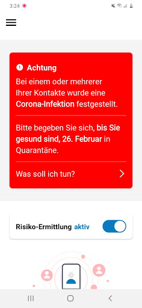
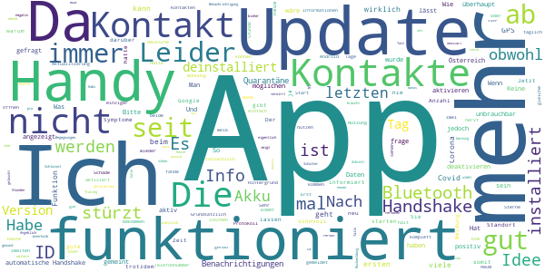
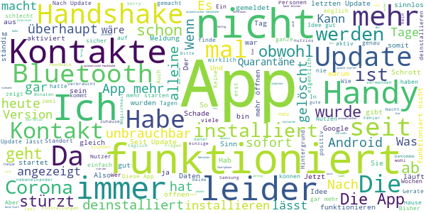

# Stopp Corona
App version ``2.1.4.1247-QA_266``

Analyzed with [covid-apps-observer](http://github.com/covid-apps-observer) project, version ``0.1``

## App overview
| | |
|-------------------------|-------------------------| 
| **Name**&nbsp;&nbsp;&nbsp;&nbsp;&nbsp;&nbsp;&nbsp;&nbsp;&nbsp;&nbsp;&nbsp;&nbsp;&nbsp;&nbsp;&nbsp;&nbsp;&nbsp;&nbsp;&nbsp;&nbsp;&nbsp;&nbsp;&nbsp;&nbsp;&nbsp;&nbsp;&nbsp;&nbsp;&nbsp;&nbsp;&nbsp;&nbsp;&nbsp;&nbsp;&nbsp;&nbsp;&nbsp;&nbsp;&nbsp;&nbsp;  | Stopp Corona |
| **Unique identifier** | at.roteskreuz.stopcorona |
| **Link to Google Play** | [https://play.google.com/store/apps/details?id=at.roteskreuz.stopcorona](https://play.google.com/store/apps/details?id=at.roteskreuz.stopcorona) |
| **Summary**  | Österreichs Corona-Warnungs-App |
| **Privacy policy** | [https://www.roteskreuz.at/site/faq-app-stopp-corona/datenschutzinformation-zur-stopp-corona-app/](https://www.roteskreuz.at/site/faq-app-stopp-corona/datenschutzinformation-zur-stopp-corona-app/) |
| **Latest version** | 2.1.4.1247-QA_266 |
| **Last update** | 2021-05-28 22:10:38 |
| **Recent changes** | Dark Mode wird jetzt unterstützt Tagebuch Funktionalität hinzugefügt |
| **Installs**  | 100.000+ |
| **Category** | Medizin |
| **First release** | 25.03.2020 |
| **Size**  | 7,0M |
| **Supported Android version**  | 6.0 oder höher |

### Description
> Das Österreichische Rote Kreuz veröffentlicht die “Stopp Corona”-App im Auftrag des Gesundheitsministeriums, der obersten Gesundheitsbehörde Österreichs. 
 Mit der „Stopp Corona“-App lassen sich Begegnungen mit Freunden, der Familie oder Arbeitskollegen ganz einfach und anonymisiert speichern. Sollten Sie sich mit Corona infizieren, können Sie einfach über die App eine Meldung abgeben und Ihre Kontakte aus den letzten 2 Tagen werden anonym benachrichtigt. 
 Das gleiche gilt natürlich umgekehrt. Gibt eine Ihrer gespeicherten Begegnungen an, sich infiziert zu haben, erhalten Sie umgehend eine Nachricht und Sie können entsprechende Maßnahmen ergreifen. Dazu zählen vor allem:
 -	Abstand halten
 -	Soziale Kontakte vermeiden
 -	Sich vorsichtshalber in Selbstisolation begeben
 Beim Einsetzen von Symptomen kontaktieren Sie bitte telefonisch ihre Hausärztin oder den Hausarzt. Wenn das nicht möglich ist, rufen Sie die die Nummer 1450 an.
 Jedenfalls gilt: Bitte nicht die Ärztin/oder den Arzt persönlich aufsuchen und auch nicht ins Krankenhaus fahren. Bei einem medizinischen Notfall: 144 rufen.
 Gemeinsam unterbrechen wir so die Infektionskette.
 So schützen Sie nicht nur sich selbst, sondern verhindern auch, dass andere sich infizieren.
 Nutze Sie den digitalen Handshake
 Bis wir uns wieder unbedacht die Hände bei der Begrüßung reichen können, wird es wohl noch einige Zeit dauern. In der Zwischenzeit nutzen Sie einfach den digitalen Handshake der „Stopp Corona“-App.
 Haben Sie und die Person mit der Sie sich treffen die App installiert, speichert die App, dass Sie sich getroffen haben. Diese Daten werden anonymisiert gespeichert. Erkrankt einer von Ihnen beiden an dem Corona-Virus, erhält der andere eine Nachricht.
 Machen Sie den Corona-Selbstcheck
 Wie geht es Ihnen heute? Anhand eines klinisch geprüften Fragebogens können Sie sich täglich auf Corona-Symptome überprüfen.
 Corona-Verdachtsmeldung
 Entsprechen die Symptome dem Corona-Virus, können Sie eine Meldung über die App abgeben. Das ist wichtig, damit sich nicht noch mehr Menschen mit dem Virus infizieren. Ihre Begegnungen werden dann anonymisiert benachrichtigt. Keine Sorge, sie erhalten also keine persönlichen Angaben. 
 Anschließend bleiben Sie bitte Zuhause und kontaktieren Sie Ihre Hausärztin oder Ihren Hausarzt telefonisch. Wenn das nicht möglich ist rufen Sie die Nummer 1450 an.
 Fahren Sie nicht ins Krankenhaus und suchen Sie Ihren Arzt nicht persönlich auf.
 Ärztliche Bestätigung
 Stellt ein Arzt den Corona-Virus fest, können Sie ebenfalls eine Meldung abgeben. Auch hier werden Ihre Begegnungen anonymisiert benachrichtigt.
 Die App entstand in Partnerschaft mit der UNIQA Stiftung.
 Konzept und Realisierung in Zusammenarbeit und mit Unterstützung von Accenture Österreich und basiert auf dem Contacttracing-Framework von Apple und Google
 Schau auf Dich. Schau auf mich. So schützen wir uns.
 Link zum Open Source Software Projekt: https://github.com/austrianredcross/stopp-corona-android

### User interface
The developers of the app provide the following screenshots in the Google play store.
| | | |
|:-------------------------:|:-------------------------:|:-------------------------:|
 |   |   |   | 
 |   |   |   | 
 |   |  

## Development team
In the following we report the main information provided by the development team in the Google play store.

| | |
|-------------------------|-------------------------|
| **Developer**  | Österreichisches Rotes Kreuz |
| **Website**  | [https://www.roteskreuz.at](https://www.roteskreuz.at) |
| **Email** | service@roteskreuz.at |
| **Physical address**  | [Wiedner Hauptstrasse 32 1040 Wien Österreich](https://www.google.com/maps/search/Wiedner%20Hauptstrasse%2032%201040%20Wien%20Österreich) (Google Maps) |
| **Other developed apps**  | [https://play.google.com/store/apps/developer?id=%C3%96sterreichisches+Rotes+Kreuz](https://play.google.com/store/apps/developer?id=%C3%96sterreichisches+Rotes+Kreuz) |

## Android support

| | |
|-------------------------|-------------------------|
| **Declared target Android version**  | Android10, version 10 (API level 29) |
| **Effective target Android version**  | Android10, version 10 (API level 29) |
| **Minimum supported Android version**  | Marshmallow, version 6.0 (API level 23) |
| **Maximum target Android version**  | - |

The larger the difference between the minimum and maximum supported Android versions, the better. A larger difference means a wider audience. For example, old phones have a very low Android version, so a high minimum supported Android version means that the app cannot be used by users with old phones, thus leading to accessibility problems. 

## Requested permissions

In the following we report the complete list of the permissions requested by the app. 

| **Permission** | **Protection level** | **Description** | 
|-------------------------|-------------------------|-------------------------|
 **android.permission ACCESS_NETWORK_STATE** | Normal | Allows applications to access information about networks. 
 **android.permission BLUETOOTH** | Normal | Allows applications to connect to paired bluetooth devices. 
 **android.permission FOREGROUND_SERVICE** | Normal | Allows a regular application to use Service.startForeground. 
 **android.permission INTERNET** | Normal | Allows applications to open network sockets. 
 **android.permission RECEIVE_BOOT_COMPLETED** | Normal | Allows an application to receive the Intent.ACTION_BOOT_COMPLETED that is broadcast after the system finishes booting. 
 **android.permission REQUEST_IGNORE_BATTERY_OPTIMIZATIONS** | Normal | Permission an application must hold in order to use Settings.ACTION_REQUEST_IGNORE_BATTERY_OPTIMIZATIONS. 
 **android.permission WAKE_LOCK** | Normal | Allows using PowerManager WakeLocks to keep processor from sleeping or screen from dimming. 

## Mentioned servers

| **Server** | **Registrant** | **Registrant country** | **Creation date** | 
|-------------------------|-------------------------|-------------------------|-------------------------|
 | google.com | Google LLC | :us: US | 1997-09-15 04:00:00 |
 | prod-rca-coronaapp-fd.net | Domains By Proxy, LLC | :us: US | 2020-04-20 20:16:19 |

## Security analysis 

Below we report the main security warnings raised by our execution of the [Androwarn](https://github.com/maaaaz/androwarn) security analysis tool.

**Connection interfaces exfiltration**
> - This application reads details about the currently active data network 
> - This application tries to find out if the currently active data network is metered 

**Telephony services abuse**
> - This application makes phone calls 

**Suspicious connection establishment**
> - This application opens a Socket and connects it to the remote address '; port is out of range' on the 'N/A' port  
> - This application opens a Socket and connects it to the remote address 'Lcom/android/tools/r8/GeneratedOutlineSupport;->outline17(Ljava/lang/String;)Ljava/lang/StringBuilder;' on the 'N/A' port  
> - This application opens a Socket and connects it to the remote address 'Ljava/net/Proxy;->type()Ljava/net/Proxy$Type;' on the 'N/A' port  
> - This application opens a Socket and connects it to the remote address 'timeout' on the 'N/A' port  

## User ratings and reviews

Below we provide information about how end users are reacting to the app in terms of ratings and reviews in the Google Play store.

### Ratings

The Stopp Corona app has been installed by more than **100000** times. At this time, **3798** rated the app and its average score is **3.5953002**. Below we show the distribution of the ratings across the usual star-based rating of Google Play

:star::star::star::star::star:: 1855

:star::star::star::star:: 535

:star::star::star:: 307

:star::star:: 218

:star:: 883

### Reviews 

#### 5-star reviews

> Bluetooth deaktiviert Leider schaltet die App das Bluetooth bon meinem Handy aus, weswegen meine anderen Apps (Smartwatch u.a.) mir regelmäßig Probleme machen. Sonst super!  :date: __2021-07-13 12:18:22__

> Ist kompplizizirrt  :date: __2021-07-03 06:20:28__

> Die App funktioniert und ist sehr sicher. Hauptproblem: Viel zu wenige Leute haben sie installiert!! Vorschläge für mehr Attraktivität: Corona-News (Inzidenz, aktuelle Maßnahmen...) als Push-Nachrichten, Einbinden der 3g-Zertifikate.  :date: __2021-06-26 06:54:07__

> Probleme wurden behoben, danke! 5 Sterne.  :date: __2021-06-09 17:53:44__

> Funktioniert  :date: __2021-06-03 22:59:08__

> Tut was es soll. Redmi Note 10 Pro.  :date: __2021-05-31 19:57:40__

> Super App  :date: __2021-05-26 17:48:10__

> bin seht froh über diese app da ich beruflich mit vielen leuten in kontakt stehe  :date: __2021-05-21 08:08:44__

> In Zeiten wie diesen ein muss👍  :date: __2021-05-18 08:15:28__

> 😂😂😂  :date: __2021-05-17 16:04:26__

#### 4-star reviews

> Die App erfüllt ihren Zweck, aber leider benutzt sie niemand. Man müsste Zusatzfunktionen hinzufügen, um Leute dazu zu bringen, diese App herunterzuladen, z.B. Test- und Impfzertifikate direkt in der App und das man sich sein Testergebnis in die App schicken lassen kann (wie in Deutschland)  :date: __2021-07-26 13:07:07__

> Bringt halt nix, wenns keiner nutzt  :date: __2021-07-20 06:33:16__

> Habs die App nicht installiert und werds auch nicht tun bis es nicht zuverlässig funktioniert! Quarantäne gehen nur auf Vermutung will keiner!  :date: __2021-05-13 18:19:38__

> Also die Idee dahinter war gut  :date: __2021-05-11 14:37:10__

> Funktioniert.  :date: __2021-05-07 20:51:07__

> Hätte nicht gedacht, dass ich anhand dieser App tatsächlich mal eine Warnmeldung bekomme. War nun aber so. Ich konnte das dann anhand eines Tests abklären. Die Info-Meldung über die mögliche Infektion kommt aber weiterhin. Mein Vorschlag wäre daher, dass man die Warnmeldungen für einzelne Risikokontakte abstellen kann. Sollte sich in den kommenden Tagen nämlich ein weiterer Risikokontakt ergeben, würde ich das nicht merken, weil ich die Warnmeldung mittlerweile einfach wegwische.  :date: __2021-04-23 21:13:53__

> Weiss nicht ob es was kann.  :date: __2021-04-23 15:19:11__

> Gibt ein sicheres Gefühl.  :date: __2021-04-20 19:01:50__

> Super, dass man jetzt das Risiko und die Anzahl der überprüften Kontakte sieht.  :date: __2021-04-20 18:31:34__

> Warum muss plötzlich der Standort aktiviert werden? Ich bekomme mehrmals täglich den Hinweis dass es sonst nicht funktioniert...  :date: __2021-03-26 06:24:26__

#### 3-star reviews

> Man kann hier keine QR Codes der Digitalen Impfzertifikate scannen und speichern.  :date: __2021-07-14 12:43:04__

> Im letzten halben Monat 200 MB Mobilfunk-Daten verbraucht. Zusätzlich belegt die App mittlerweile 1,5 GB Speicherplatz. Ist das normal?  :date: __2021-06-15 07:36:48__

> Zukunft? Wird die App auch Antikörper-Tests und Impfungen berücksichtigen? Mit dem grünen Pass braucht man die App dann eigentlich nicht mehr, oder?  :date: __2021-06-09 07:02:56__

> Macht was es soll. Jedoch belegt die App über 700 MB an internem Speicherplatz und muss daher demnächst deinstalliert werden, um wertvollen Speicherplatz zu gewinnen. Die Möglichkeit, die Daten auf die SD Karte zu verschieben, wäre ein guter Grund für mich, die App weiterhin zu nutzen.  :date: __2021-06-03 23:03:26__

> Sammelt 1.6 GB Daten und belegt auf älteren Smartphone zu viel Speicher! Wie kann man das reduzieren? Ich bin mittlerweile voll geimpft, was macht diese App Sinn? Aktiviere sie nur wenn ich unter fremde Personen gehe. Will BlueTooth nicht immer offen halten!  :date: __2021-05-21 05:49:38__

> Hat bisher funktioniert  :date: __2021-05-10 21:35:57__

> Weil offenbar in der Warteschlange beim Spar jemand danach positiv getestet wurde, schickt mich die App in Quarantäne. Ohne Bescheid! Bei 1450 wurde nichts aufgenommen oder erklärt. Ich würde von der Behörde kontaktiert. Wie denn, ohne Kontaktdaten? Dann jede Stunde diese Anweisung. Mein Chef akzeptiert solche Anweisungen einer App nicht als Entschuldigung.  :date: __2021-05-10 09:22:40__

> Kann es sein, dass ich noch NIE eine Verständigung erhalten habe, das ist doch rein statistisch schon nicht möglich. Scheint nicht funktionieren, ich deinstallier das jetzt endgültig.  :date: __2021-05-03 13:42:23__

> Ich finde die App nicht schlecht, falls sie funktioniert und wenn sie mehr Menschen nutzen würden. Aber warum verbraucht diese App in 1 Monat 2,3 GB Daten?  :date: __2021-04-28 10:27:01__

> Wie schaut's aus mit der Integration von erfolgten Impfungen, Testergebnissen, Registrierung z. B. in der Gastronomie? Ich hoffe, das ist alles bereits in Arbeit und wird umgehend veröffentlicht.  :date: __2021-04-24 17:17:57__

#### 2-star reviews

> Akku wird leer gesaugt, ohne die App hält meine Batterie ca 20h gut durch, mit aktiviertem Tracing sind es nur noch 6-8 Stunden! Das geht so nicht. Habe das Programm wieder gelöscht.  :date: __2021-07-01 00:10:07__

> Die Einwilligung funltioniert nicht.  :date: __2021-06-07 07:40:34__

> kenn ich nicht  :date: __2021-05-10 19:57:51__

> Mobiler Datenverbrauch steigt rapide: während die App noch im Jänner 55MB pro Monat gebraucht hat sind es jetzt 1.6Gig. Heißt das daß mehr Leute die App benutzen oder das die Letzten die das tun vergrault werden sollen?  :date: __2021-05-02 10:50:08__

> >2GB (Hintergrund)datenverbauch im Monat!?!? Wozu dass denn bitte??? Überlege nun ernsthaft den "Schrott" runterzuwerfen... :-(  :date: __2021-05-01 21:43:43__

> Seitdem ich die App installiert habe verbindet sich Bluetooth nicht mehr mit meinem Auto. So ist es für mich leider unbrauchbar. Ansonsten kann ich nicht viel darüber schreiben. Hält sich schön im Hintergrund und tut (hoffentlich) was es soll. Hatte bis jetzt (GSD) keine Kontaktmeldung :)  :date: __2021-04-30 12:34:01__

> Habs deinstalliert, weil die neue Version zu viel Speicherplatz braucht.  :date: __2021-04-21 19:13:38__

> Leider bisher noch keine Meldung erhalten  :date: __2021-03-22 17:21:50__

> 1.) Der Verbrauch an mobilen Daten ist SEHR HOCH!!! 2.) Man hat keine Rückmeldung, ob die App wirklich funktioniert. 3.) Ist der Schalter "Automatische Handshake" ein/aus ident mit dem Schalter "COVID 19-Benachrichtigung aktivieren"? Wenn ja, warum verwendet man zwei verschiedene Bezeichnungen? Ich kann keinen Unterschied feststellen! 4.) Wenn ich "COVID 19-Benachrichtigung aktivieren" ausschalte, dann wird noch "Automatische Handshake" als aktiv angezeigt, obwohl es auch ausgeschaltet ist. Nach Neustart sind beide auf aus. Das ist ein FEHLER bei der Anzeige! 5.) Die Liste der möglichen Begegnungen war nicht sortiert und ist in der neuen Version (Feb 2021) nicht mehr vorhanden! 6.) Es gibt jedoch noch den Punkt "App-Einstellungen öffnen", hier werden jedoch nur Informationen angezeigt. 7.) In der App steht immer noch "1 Meter Abstand". Es sollte "2 Meter Abstand" lauten! 8.) Angeblich hat die App 20.000.000 Euro gekostet; da würde man sich etwas mehr erwarten:  :date: __2021-03-16 09:01:03__

> warum kommt nach dem aufrufen der app zuerst die frage nach dem "handschake" , anstelle die frage "symptome" prüfen? das verwirrt viele. und warum kommt nach der frage 1, keine frage 2 (falls ich mich gesund fühle, wähle?) das verwirrt zum 2. mal. haben die entwickler irgendwann die user gefragt wie es ihnen mit der app geht.  :date: __2021-03-03 09:18:03__

#### 1-star reviews

> deaktiviert sich ohne meldung wegen update..toll  :date: __2021-07-16 07:27:12__

> Wozu belegt die App mehr als 2GB? Der Support reagiert überhaupt nicht!  :date: __2021-07-06 12:20:23__

> Idee ist gut, dürfte aber nicht funktionieren, denn wenn ich auf gespeicherte ID's schaue hab ich oft dann kontakt zu anderen wenn ich a) auf der Autobahn alleine im Auto fahre, b) alleine zu Hause bin und c) auf einem Weg alleine spazieren gehe. Komischerweise erst 2 Kontakte wenn ich einkaufen gehe oder mich im öffentlichen Raum aufhalte zwischen anderen Personen. Kaum bin ich wieder alleine unterwegs kommen wieder vermehrt Kontakte hinzu. zertifikate hochladen fehlt  :date: __2021-07-03 10:24:14__

> SINNLOS. Mittlerweile macht so eine App gar keinen Sinn mehr. Und benutzt hat sie sowieso so gut wie niemand.  :date: __2021-07-02 14:40:56__

> Heute die Anwendung installiert und gestartet. Diese Version wird nicht mehr unterstützt, gehen Sie zum Play Store! Wer hat geschlampt, Google oder Rotes Kreuz? Kontaktverfolgung wird immer noch gemacht. Diese Anwendung ist nutzlos.  :date: __2021-07-02 04:30:13__

> Nach mehreren Wochen Betrieb habe ich fast 1 GB Speicherplatz verbraucht... ursprünglich werden rd 50 MB angezeigt .. völlig unbrauchbar wie Kaufhaus Österreich  :date: __2021-06-05 18:01:40__

> Update: Bis heute Nacht keine einzige Erkennung. Dafür heute Nacht fast 15000 mögliche Kontakte. Ich bin mir aber ganz sicher, daß nicht annähernd so viele Leute in meinem Schlafzimmer waren. Leider erkennen unsere Handys sich nicht. Meine LG und ich sind auch nach 24 Stunden zusammen keine Kontaktpersonen. Auch die Handys meiner Arbeitskollegen werden nicht gefunden, auch wenn die Handys die ganze Zeit am selben Tisch liegen. So bringt die App eigentlich gar nichts, ausser Akkuverbrauch.  :date: __2021-05-22 12:06:20__

> Auch im Infektionsfall eher unbrauchbar. Will jeden Tag das ich meine Kontakte der letzten Tage benachrichtige auch wenn ich schon Tage in Quarantäne bin. Muss dann jeden Tag den Beginn der Symptome neu setzen. Hab die App jetzt vorerst deinstalliert und installiere sie erst wieder wenn ich und meine Familie wieder raus sind.  :date: __2021-05-18 10:31:07__

> Die app macht meiner Meinung nach garnix aber verbraucht 856MB Speicherplatz!? Finde ich extrem übertrieben!!!!  :date: __2021-05-11 06:03:46__

> lt. app hatte ich kontakt mit einem positiven. hab bei 1450 vlbg. angerufen, die kennen die app nicht 😳 geh morgen wieder arbeiten.  :date: __2021-05-02 16:22:14__

