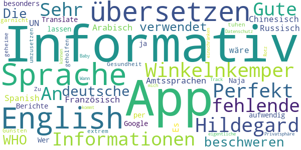
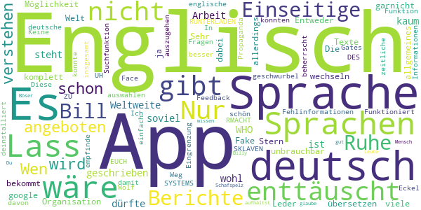

# WHO Info
App version ``3.1.1``

Analyzed with [covid-apps-observer](http://github.com/covid-apps-observer) project, version ``0.1``

## App overview
| | |
|-------------------------|-------------------------| 
| **Name**&nbsp;&nbsp;&nbsp;&nbsp;&nbsp;&nbsp;&nbsp;&nbsp;&nbsp;&nbsp;&nbsp;&nbsp;&nbsp;&nbsp;&nbsp;&nbsp;&nbsp;&nbsp;&nbsp;&nbsp;&nbsp;&nbsp;&nbsp;&nbsp;&nbsp;&nbsp;&nbsp;&nbsp;&nbsp;&nbsp;&nbsp;&nbsp;&nbsp;&nbsp;&nbsp;&nbsp;&nbsp;&nbsp;&nbsp;&nbsp;  | WHO Info |
| **Unique identifier** | org.who.infoapp |
| **Link to Google Play** | [https://play.google.com/store/apps/details?id=org.who.infoapp](https://play.google.com/store/apps/details?id=org.who.infoapp) |
| **Summary**  | Die offizielle Informations-App der Weltgesundheitsorganisation. |
| **Privacy policy** | [https://www.who.int/about/who-we-are/privacy-policy](https://www.who.int/about/who-we-are/privacy-policy) |
| **Latest version** | 3.1.1 |
| **Last update** | 2020-10-30 13:25:32 |
| **Recent changes** | This release addresses an issue related to Covid-19 case numbers reported to WHO. |
| **Installs**  | 100.000+ |
| **Category** | Nachrichten & Zeitschriften |
| **First release** | 13.04.2020 |
| **Size**  | 11M |
| **Supported Android version**  | 4.2 oder höher |

### Description
> Have the latest health information at your fingertips with the official World Health Organization Information App. This app displays the latest news, events, features and breaking updates on outbreaks. 
  
 WHO works worldwide to promote health, keep the world safe, and serve the vulnerable. 
 Our goal is to ensure that a billion more people have universal health coverage, to protect a billion more people from health emergencies, and provide a further billion people with better health and well-being.

### User interface
The developers of the app provide the following screenshots in the Google play store.
| | | |
|:-------------------------:|:-------------------------:|:-------------------------:|
 |   |   |   | 
 |   |   |   | 
 |   |   |   | 
 |   |   |   | 
 |   |   |   | 
 |   |   |   | 
 |   |   |   | 
 |   |   |   | 

## Development team
In the following we report the main information provided by the development team in the Google play store.

| | |
|-------------------------|-------------------------|
| **Developer**  | World Health Organization |
| **Website**  | [https://www.who.int/](https://www.who.int/) |
| **Email** | dcx@who.int |
| **Physical address**  | [Avenu Appia 20 1211 Geneva Switzerland](https://www.google.com/maps/search/Avenu%20Appia%2020%201211%20Geneva%20Switzerland) (Google Maps) |
| **Other developed apps**  | [https://play.google.com/store/apps/developer?id=World+Health+Organization](https://play.google.com/store/apps/developer?id=World+Health+Organization) |

## Android support

| | |
|-------------------------|-------------------------|
| **Declared target Android version**  | - |
| **Effective target Android version**  | - |
| **Minimum supported Android version**  | Jelly Bean, version 4.2.x (API level 17) |
| **Maximum target Android version**  | - |

The larger the difference between the minimum and maximum supported Android versions, the better. A larger difference means a wider audience. For example, old phones have a very low Android version, so a high minimum supported Android version means that the app cannot be used by users with old phones, thus leading to accessibility problems. 

## Requested permissions

In the following we report the complete list of the permissions requested by the app. 

| **Permission** | **Protection level** | **Description** | 
|-------------------------|-------------------------|-------------------------|
 **android.permission ACCESS_NETWORK_STATE** | Normal | Allows applications to access information about networks. 
 **android.permission INTERNET** | Normal | Allows applications to open network sockets. 
 **android.permission READ_CALENDAR** | :warning:**Dangerous** | Allows an application to read the user's calendar data. 
 **android.permission READ_EXTERNAL_STORAGE** | :warning:**Dangerous** | Allows an application to read from external storage. 
 **android.permission WAKE_LOCK** | Normal | Allows using PowerManager WakeLocks to keep processor from sleeping or screen from dimming. 
 **android.permission WRITE_CALENDAR** | :warning:**Dangerous** | Allows an application to write the user's calendar data. 
 **android.permission WRITE_EXTERNAL_STORAGE** | :warning:**Dangerous** | Allows an application to write to external storage. 
 **com.google.android.c2dm.permission RECEIVE** | - | - 
 **com.google.android.finsky.permission BIND_GET_INSTALL_REFERRER_SERVICE** | - | - 

## Mentioned servers

| **Server** | **Registrant** | **Registrant country** | **Creation date** | 
|-------------------------|-------------------------|-------------------------|-------------------------|
 | adobe.com | Adobe Inc. | :us: US | 1986-11-17 05:00:00 |
 | googlesyndication.com | Google LLC | :us: US | 2003-01-21 06:17:24 |
 | google.com | Google LLC | :us: US | 1997-09-15 04:00:00 |
 | app-measurement.com | Google LLC | :us: US | 2015-06-19 20:13:31 |
 | googleapis.com | Google LLC | :us: US | 2005-01-25 17:52:26 |
 | googleadservices.com | Google LLC | :us: US | 2003-06-19 16:34:53 |

## Security analysis 

Below we report the main security warnings raised by our execution of the [Androwarn](https://github.com/maaaaz/androwarn) security analysis tool.

**Connection interfaces exfiltration**
> - This application reads details about the currently active data network 
> - This application tries to find out if the currently active data network is metered 

**Suspicious connection establishment**
> - This application opens a Socket and connects it to the remote address 'Lfi/iki/elonen/NanoHTTPD$ResponseException;' on the 'N/A' port  
> - This application opens a Socket and connects it to the remote address 'NanoHttpd Shutdown' on the 'N/A' port  

**Code execution**
> - This application loads a native library: 'NativeScript' 
> - This application executes a UNIX command containing this argument: '2' 

## User ratings and reviews

Below we provide information about how end users are reacting to the app in terms of ratings and reviews in the Google Play store.

### Ratings

The WHO Info app has been installed by more than **100000** times. At this time, **1023** rated the app and its average score is **3.6470587**. Below we show the distribution of the ratings across the usual star-based rating of Google Play

:star::star::star::star::star:: 562

:star::star::star::star:: 90

:star::star::star:: 70

:star::star:: 50

:star:: 251

### Reviews 

#### 5-star reviews

> Perfekt für Informationen  :date: __2020-10-12 12:50:14__

> Informativ  :date: __2020-06-16 12:45:21__

> Gute App. Sehr informativ! An alle die sich über die fehlende deutsche Sprache beschweren. Die WHO verwendet die Amtssprachen der UN: English, Französisch, Arabisch, Chinesisch, Russisch und Spanish. Es wäre viel zu aufwendig alle Berichte in jede Sprache zu übersetzen. Wer kein English kann kann es sich ja per Google Translate übersetzen lassen.  :date: __2020-06-16 11:28:39__

> Naja hat mir besonders garnicht geholfen ich muss tuhen um umzusetzen  :date: __2020-04-18 00:58:20__

> Zu Gunsten der Gesundheit werde ich meine extrem geheime Privatsphäre einschränken können... Datenschutz-Rotz. Track mich, Baby ;-) Wann kommt die eigentliche App ?  :date: __2020-04-17 14:10:26__

#### 4-star reviews

> Die App liefert verlässliche Informationen, nur in englischer Sprache.  :date: __2020-06-15 07:45:00__

#### 3-star reviews

No recent reviews available with 3 stars.

#### 2-star reviews

> Keine Übersetzung auf Deutsch  :date: __2020-04-22 17:35:41__

#### 1-star reviews

> Wen so eine App schon hier angeboten wird, dann sollte man auch verstehen was da geschrieben steht, auch wenn deutsch nicht die Sprache der WHO ist. Es dürfte wohl kaum soviel Arbeit für eine Weltweite Organisation sein die Texte in alle Sprachen zu übersetzen...es gibt ja google. 😉  :date: __2020-10-12 11:34:39__

> Sehr enttäuscht  :date: __2020-10-02 00:03:25__

> Die App bekommt von mir nur 1 Stern weil sie komplett auf Englisch ist hatte in der App die Möglichkeit die Sprache zu wechseln in den Sprachen war allerdings deutsch nicht dabei ich kann kein Englisch  :date: __2020-08-21 13:33:05__

> Entweder auf allen Sprachen der Welt oder garnicht!!!!!!!!!!!!!!  :date: __2020-08-14 07:25:03__

> Leder nur Englisch, für viele unbrauchbar.  :date: __2020-07-08 09:21:49__

> Fake app  :date: __2020-06-14 18:13:19__

> nur allgemeines geschwurbel  :date: __2020-06-12 11:35:48__

> Wäre schön, wenn man eine Sprache auswählen könnte. Es ist nicht davon auszugehen, dass jeder die englische Sprache beherrscht.  :date: __2020-06-08 08:31:18__

> Propaganda und Fehlinformationen...deinstalliert  :date: __2020-06-07 17:38:52__

> Nur englisch  :date: __2020-05-26 18:27:58__

