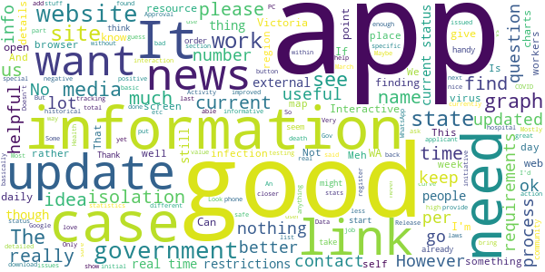
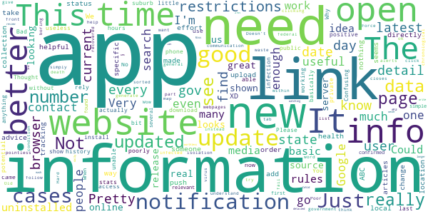
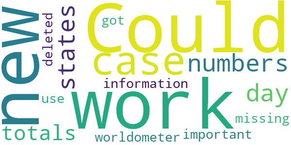
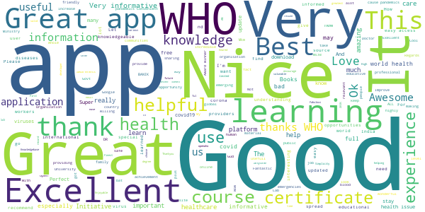
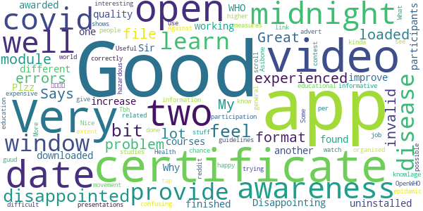
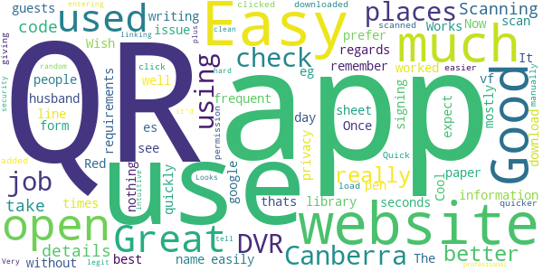

# COVID-related Android apps in Australia

Author: `Ivano Malavolta` (ivanomalavolta@gmail.com)

Created at: `2020/10/24`

Report generated by the [covid-apps-observer](http://github.com/covid-apps-observer) project, version 0.1

# Table of contents 

- [Background](#background)
    * [Data sources and analyses](#data-sources-and-analyses)
        * [App metadata](#app-metadata)
        * [Requested permissions](#requested-permissions)
        * [Mentioned servers](#mentioned_servers)
        * [Security analysis](#security_analysis)
        * [User ratings and reviews](#user-ratings-and-reviews)
    * [Disclaimer](#disclaimer)
- [COVIDSafe](#covidsafe)
- [WHO Info](#who-info)
- [Coronavirus Australia](#coronavirus-australia)
- [MyAus COVID-19](#myaus-covid-19)
- [OpenWHO: Knowledge for Health Emergencies](#openwho-knowledge-for-health-emergencies)
- [Check In CBR](#check-in-cbr)

- [Credits](#credits)

# How to read this report

This report has been generated by the [covid-apps-observer](http://github.com/covid-apps-observer) project. The project automatically analyzes the apps by extracting information which is already publicly available either on the web or in the apps binary files. 

Our analysis covers the following apps:
| | |
|-------------------------|-------------------------| 
|  | COVIDSafe
|  | WHO Info
|  | Coronavirus Australia
|  | MyAus COVID-19
|  | OpenWHO: Knowledge for Health Emergencies
|  | Check In CBR

The details of our analysis are presented in the remainder of this report.

For independent verification, the raw data and the source code of the project is publicly available in its GitHub repository [http://github.com/covid-apps-observer](http://github.com/covid-apps-observer) and its source code has been thoroughly commented in order to provide all the details about how the information provided in this report has been extracted. 

Any feedback, questions, and improvements about the project are very welcome, feel free to create an issue or pull request directly in its GitHub repository: [http://github.com/covid-apps-observer](http://github.com/covid-apps-observer).

## Data sources and analyses

The analysis of each app is structured around five main dimensions: 
* App metadata  
* Requested permissions
* Mentioned servers
* Androwarn analysis
* User ratings and reviews

In the following we describe the data sources and analysis performed for each dimension.

### App metadata

App metadata includes an overview of the main information about the app (for example, its name, releases, privacy policy, etc.), contact information of the development team, and the various Android versions supported by the app. This information is extracted from two main data sources:
* _Google Play store_: we automatically mined the web page of the Google Play store showing the basic information about the app and we parsed it in order to extract information about the app and development team 
* _Android Manifest file_: in our analysis we decompiled the binary file of the app (it is similar to a Zip archive but it contains the code of the app instead of normal files) and we extracted information about the supported Android versions, as it has been listed by its development team.

The extracted app metadata feeds the _App overview_, _Development team_, and _Android support_ sections of this report.
We make use of the [google-play-scraper](https://github.com/JoMingyu/google-play-scraper) tool for extracting the raw data related to this dimension of the project.

### Requested permissions

The Android operating system has a permission model which allows users to grant access to potentially privacy-related information. Every Android app has to explictly declare the permissions it needs to properly function in the Android Manifest file.  

In this report we also show the protection level of each permission, which is a key information for understanding how the requested permissions related to the user's privacy. We carefully analyzed the [official Android documentation (v. 29)](https://developer.android.com/reference/android/Manifest.permission), and it resulted that a permission requested by an Android app can belong to the following protection levels:
* **Dangerous**: higher-risk permissions that would give a requesting app access to private user data or control over the device that can negatively impact the user. Because this type of permission introduces potential risk, the system usually does not automatically grant it to the requesting app. For example, any dangerous permissions requested by an app may be displayed to the user and require confirmation before proceeding.
* **Normal**: this is the default and most common level in Android; normal permissions are lower-risk and give access to isolated app-level features, with minimal risk to other apps, the system, or the user. 
* **Signature**: permissions granted only if the requesting app is signed with the same certificate as the app that declared the permission
* **Appop**: old permission level, a reminiscence of the App Ops tool that Google introduced in Android 4.3.
* **Development**: optional permissions which can be granted to development-oriented apps.
* **Privileged**: permissions who give higher power to mobile apps w.r.t. other apps, such as binding to incoming calls, interacting via bluetooth with other devices without user interaction, etc.
* **Preinstalled**: reserved only for preinstalled apps
* **Installer**: allow the holder to start the permission usage screen for an app
* **RetailDemo**: permissions related to devices used in demonstrations in shops.
* **Pre23**: permissions automatically granted to apps targeting devices running pre-6.0 Android.
* **Upcoming**: permissions which will be released in the next version of the Android platform. 
* **Deprecated**: permissions belonging to old releases of the Android platform, they should not be used by developers since they will not be supported in the near future.
* **Not for use by third-party applications**: permissions which can be requested only by apps developed by Google.
* **Undefined**: this protection level is not documented by Google.

The permissions dimension of this project is based on the [Androguard](https://github.com/androguard/androguard) static analysis tool.

### Mentioned servers

We decompiled each app in order to look for all possible mentions of remote URLs. The mentioned URLs can refer to remote servers the the app is using for either sending or receiving information, web addresses for directing the user to an information website, and so on. 

:warning: It is important to note that this analysis is not meant to be complete and it is very prone to obfuscation. The servers reported here are simply _mentioned_ somewhere in the code of the app and are meant to just give an indication about the "hooks" of the app towards external resources. For example, for an Android app it is normal to contact Google services in order to send/receive push notifications, or to contact the servers of analytics services for having real-time diagnostics about crashes of the app or bugs.

This part of the analysis is based on the [Androguard](https://github.com/androguard/androguard) static analysis tool for identfying the raw URLs mentioned in the app; then, the information about each mentioned server is collected by performing a _whois_ lookup on the first-level domain present in the URL.

### Security analysis

This dimension is based on the [Androwarn](https://github.com/maaaaz/androwarn) structural and data flow analysis of Android bytecode. Androwarn is developed by the University of Lyon/INSA (France) and it has been used in several academic studies. According to its documentation, Androwarn targets the following categories of potential security issues:
* **Telephony identifiers exfiltration**: IMEI, IMSI, MCC, MNC, LAC, CID, operator's name, etc.
* **Device settings exfiltration**: software version, usage statistics, system settings, logs, etc.
* **Geolocation information leakage**: GPS/WiFi geolocation, etc.
* **Connection interfaces information exfiltration**: WiFi credentials, Bluetooth MAC adress, etc.
* **Telephony services abuse**: premium SMS sending, phone call composition, etc.
* **Audio/video flow interception**: call recording, video capture, etc.
* **Remote connection establishment**: socket open call, Bluetooth pairing, APN settings edit, etc.
* **PIM data leakage**: contacts, calendar, SMS, mails, clipboard, etc.
* **External memory operations**: file access on SD card, etc.
* **PIM data modification**: add/delete contacts, calendar events, etc.
* **Arbitrary code execution**: native code using JNI, UNIX command, privilege escalation, etc.
* **Denial of Service**: event notification deactivation, file deletion, process killing, virtual keyboard disable, terminal shutdown/reboot, etc.

Note: We do not consider this data point in the current version of our analyzers since it is too verbose for our purposes.

:warning: It is important to note that Androwarn is a static analysis tool, and as such it performs a variety of heuristics and approximations in its analyses. Said that, the results shown in this report are meant to provide an indication of _potential_ security issues and should be by no means treated as complete and correct.   

### User ratings and reviews

For this dimension we turn again to the web interface of the Google Play store. Firstly, we automatically mine summary statistics about user ratings from the web page of the app under analysis; then, we automatically download the newest 1000 reviews of the app under analysis. For each level of rating (5 stars, 4 stars, , etc., 1 star) we show:
- a word cloud presenting the main terms used by end users in their reviews in the Google Play store
- the last 10 reviews provided by app users in the Google Play store. 

This purposefully simple analysis is meant to help both future users and the development team of the app in understanding what are the main positive and negative points of the app under analysis.

We make use of the [google-play-scraper](https://github.com/JoMingyu/google-play-scraper) tool for extracting the raw data related to this dimension of the project.

## Disclaimer 

This report has been produced independently of any parties and its only objective is to help anybody in better understanding how COVID-related apps work in practice (and compare to each other). The results of this report are limited to the specific version of the software used for running the analyses and on the various heuristics implemented in there. In other words, the results of the analyzers may differ depending on the time and modalities in which they are executed. We do not guarantee that the results of the analyses and the corresponding contents of this report are fully complete or correct. The analysis software is licensed under the [MIT License](https://github.com/iivanoo/covid-apps-observer/blob/master/LICENSE).

# COVIDSafe
App version ``1.13.0``

Analyzed with [covid-apps-observer](http://github.com/covid-apps-observer) project, version ``0.1``

## App overview
| | |
|-------------------------|-------------------------| 
| **Name**&nbsp;&nbsp;&nbsp;&nbsp;&nbsp;&nbsp;&nbsp;&nbsp;&nbsp;&nbsp;&nbsp;&nbsp;&nbsp;&nbsp;&nbsp;&nbsp;&nbsp;&nbsp;&nbsp;&nbsp;&nbsp;&nbsp;&nbsp;&nbsp;&nbsp;&nbsp;&nbsp;&nbsp;&nbsp;&nbsp;&nbsp;&nbsp;&nbsp;&nbsp;&nbsp;&nbsp;&nbsp;&nbsp;&nbsp;&nbsp;  | COVIDSafe |
| **Unique identifier** | au.gov.health.covidsafe |
| **Link to Google Play** | [https://play.google.com/store/apps/details?id=au.gov.health.covidsafe](https://play.google.com/store/apps/details?id=au.gov.health.covidsafe) |
| **Summary**  | COVIDSafe is a community-based way to stop the spread of COVID-19. |
| **Privacy policy** | [https://covidsafe.gov.au/privacy-policy.html](https://covidsafe.gov.au/privacy-policy.html) |
| **Latest version** | 1.13.0 |
| **Last update** | 2020-10-12 04:53:33 |
| **Recent changes** | We have introduced new notifications.  You can now hide the COVID-19 case statistics on the homepage. We have updated the privacy policy.  |
| **Installs**  | 1,000,000+ |
| **Category** | Health & Fitness |
| **First release** | Apr 25, 2020 |
| **Size**  | 13M |
| **Supported Android version**  | 5.0 and up |

### Description
> COVIDSafe app has been developed by the Australian Government Department of Health to help keep the community safe from coronavirus (COVID-19). Together, let’s help stop the spread and keep ourselves and each other healthy.
 COVIDSafe uses the Bluetooth® technology on your mobile phone to look for other devices with COVIDSafe installed. Your device will take a note of contact you’ve had with other users by securely logging the other user’s reference code. If you or someone you’ve been in contact with is diagnosed with COVID-19, the close contact information securely stored in your phone can be uploaded and used—with your consent—by state and territory health officials to quickly inform people who’ve been exposed to the virus.
 How you can help stop the spread of COVID-19:
 • Download the COVIDSafe app
 • Register using your mobile phone number, name, age range and postcode
 • Turn on Bluetooth®
 • Check that COVIDSafe is running when you are out and about or are likely to come into contact with others
 • If you test positive for COVID-19, you can consent for your close contact information to be used by state and territory health officials to contact people who may have been exposed. If you’ve been exposed to the virus by someone you’ve been in close contact with, state and territory health officials will be able to contact you quickly so you can get the support you need
 COVIDSafe is an Australian Government Department of Health initiative. Visit https://www.health.gov.au/resources/apps-and-tools/covidsafe-app for more information.

### User interface
The developers of the app provide the following screenshots in the Google play store.
| | | |
|:-------------------------:|:-------------------------:|:-------------------------:|
 |   |   |   | 
 |   |  

## Development team
In the following we report the main information provided by the development team in the Google play store.

| | |
|-------------------------|-------------------------|
| **Developer**  | Australian Department of Health |
| **Website**  | [https://www.health.gov.au/resources/apps-and-tools/covidsafe-app#covidsafe-app-help](https://www.health.gov.au/resources/apps-and-tools/covidsafe-app#covidsafe-app-help) |
| **Email** | support@COVIDSafe.gov.au |
| **Physical address**  | - |
| **Other developed apps**  | [https://play.google.com/store/apps/developer?id=Australian+Department+of+Health](https://play.google.com/store/apps/developer?id=Australian+Department+of+Health) |

## Android support

| | |
|-------------------------|-------------------------|
| **Declared target Android version**  | Android10, version 10 (API level 29) |
| **Effective target Android version**  | Android10, version 10 (API level 29) |
| **Minimum supported Android version**  | Lollipop, version 5.0 (API level 21) |
| **Maximum target Android version**  | - |

The larger the difference between the minimum and maximum supported Android versions, the better. A larger difference means a wider audience. For example, old phones have a very low Android version, so a high minimum supported Android version means that the app cannot be used by users with old phones, thus leading to accessibility problems. 

## Requested permissions

In the following we report the complete list of the permissions requested by the app. 

| **Permission** | **Protection level** | **Description** | 
|-------------------------|-------------------------|-------------------------|
 **android.permission ACCESS_FINE_LOCATION** | :warning:**Dangerous** | Allows an app to access precise location. 
 **android.permission ACCESS_NETWORK_STATE** | Normal | Allows applications to access information about networks. 
 **android.permission BLUETOOTH** | Normal | Allows applications to connect to paired bluetooth devices. 
 **android.permission BLUETOOTH_ADMIN** | Normal | Allows applications to discover and pair bluetooth devices. 
 **android.permission FOREGROUND_SERVICE** | Normal | Allows a regular application to use Service.startForeground. 
 **android.permission INTERNET** | Normal | Allows applications to open network sockets. 
 **android.permission RECEIVE_BOOT_COMPLETED** | Normal | Allows an application to receive the Intent.ACTION_BOOT_COMPLETED that is broadcast after the system finishes booting. 
 **android.permission REQUEST_IGNORE_BATTERY_OPTIMIZATIONS** | Normal | Permission an application must hold in order to use Settings.ACTION_REQUEST_IGNORE_BATTERY_OPTIMIZATIONS. 
 **android.permission WAKE_LOCK** | Normal | Allows using PowerManager WakeLocks to keep processor from sleeping or screen from dimming. 
 **com.google.android.c2dm.permission RECEIVE** | - | - 

## Mentioned servers

| **Server** | **Registrant** | **Registrant country** | **Creation date** | 
|-------------------------|-------------------------|-------------------------|-------------------------|
 | google.com | Google LLC | :us: US | 1997-09-15 04:00:00 |
 | stackoverflow.com | Stack Exchange, Inc. | :us: US | 2003-12-26 19:18:07 |
 | googleapis.com | Google LLC | :us: US | 2005-01-25 17:52:26 |

## Security analysis 

Below we report the main security warnings raised by our execution of the [Androwarn](https://github.com/maaaaz/androwarn) security analysis tool.

**Connection interfaces exfiltration**
> - This application reads details about the currently active data network 
> - This application tries to find out if the currently active data network is metered 

**Suspicious connection establishment**
> - This application opens a Socket and connects it to the remote address ' returned no addresses for  ; port is out of range' on the 'N/A' port  
> - This application opens a Socket and connects it to the remote address '' on the 'N/A' port  
> - This application opens a Socket and connects it to the remote address 'Ljava/lang/StringBuilder;->toString()Ljava/lang/String;' on the 'N/A' port  
> - This application opens a Socket and connects it to the remote address 'Ljava/net/Proxy;->type()Ljava/net/Proxy$Type;' on the 'N/A' port  
> - This application opens a Socket and connects it to the remote address 'timeout' on the 'N/A' port  

## User ratings and reviews

Below we provide information about how end users are reacting to the app in terms of ratings and reviews in the Google Play store.

### Ratings

The COVIDSafe app has been installed by more than **1000000** times. At this time, **13457** rated the app and its average score is **2.7380073**. Below we show the distribution of the ratings across the usual star-based rating of Google Play

:star::star::star::star::star:: 4022

:star::star::star::star:: 1062

:star::star::star:: 1321

:star::star:: 1470

:star:: 5582

### Reviews 

#### 5-star reviews

> Fantastic app  :date: __2020-10-24 08:06:23__

> Peace of mind  :date: __2020-10-23 16:34:50__

> I don't want the virus  :date: __2020-10-22 13:31:50__

> Does its job.  :date: __2020-10-22 10:52:05__

> Working fine. For a long time, I was unable to register, but now working. Feeling safer, knowing I will be alerted if I come into contact with a known case.  :date: __2020-10-21 12:47:18__

> Great  :date: __2020-10-21 05:15:49__

> Good  :date: __2020-10-19 13:47:58__

> No issues with the COVID Safe app since I downloaded it months ago. It just runs in the background hassle free.  :date: __2020-10-16 22:20:29__

> Hope it does it's job  :date: __2020-10-16 04:20:46__

> 😁  :date: __2020-10-14 04:10:13__

#### 4-star reviews

> A Xxxooo io  :date: __2020-10-17 00:00:40__

> ⁴is a great way to start your ml and 6th or even more  :date: __2020-10-16 07:23:46__

> I7uui 8th is 4hi  :date: __2020-10-09 04:23:06__

> It does what's expected. I have no loss of Bluetooth functions. Fitbit & earphones still run ok. It doesn't collect phone numbers, it collects & stores another phone's bt id number, only if near for 15mins. Those numbrs tell you nothing, even if you could see them. The remotely held database dept. knows the registered phone numbers... only if you d/load your BT id collection, only if you are diagnosed with CV-19. Dislike: Notification uses too much bar space. Wld prfr coloured dot on the icon.  :date: __2020-10-08 02:28:46__

> Had no issues with this app EXCEPT that only 25% of the population uses it so what is the point. Probably should have been pushed out to all active mobiles by the Govt, like bushfire warning and the like. Have now uninstalled it as do not come into contact with many people these days and my location has no active cases.  :date: __2020-10-07 13:28:13__

> STRUCTUREDOOIOZSAQWWWW  :date: __2020-10-05 04:30:43__

> This app has no effect on any aspect of your life unless you come into contact with someone else who has the app AND also has a positive test for COVID. all the scare-mongering about it comes from morons.  :date: __2020-10-02 13:06:27__

> Good  :date: __2020-10-02 12:00:43__

> Essential to help contains the virus  :date: __2020-10-01 00:01:22__

> Would be nice if it had a built-in QR reader so it can provide my encrypted details when checking-in to restaurants, so I don't have to give them my personal details.  :date: __2020-09-28 02:12:44__

#### 3-star reviews

> Good concept, but after last update, frequently getting notifications that it is not active although when I open the app it is active. Which is it?. I do have permissions for location  :date: __2020-10-23 06:28:20__

> I'd been using this OK for months and (probably after an update) I discovered it was asking for location access and no battery optimisation. Having allowed those, it started draining the battery - 27% one day. I removed it, rebooted the phone and reinstalled the app. So far so good today. About 5th in the list of battery users at 1.8%.  :date: __2020-10-23 06:28:19__

> Really needs to be improved to support Apple-Google ENS. I don't like now there's issues between device communication, adding this would be very beneficial for the app and all of Australia  :date: __2020-10-22 08:58:55__

> Power saving mode is being turned on all the time in spite of being turned off  :date: __2020-10-20 22:04:54__

> Have to stay to close for to long! 😵  :date: __2020-10-19 22:17:42__

> Be nice to have a simple way to close the app when you're home.  :date: __2020-10-19 00:57:45__

> It's a good idea. However I know several young people who believe that the app could be used to track whether they are breaking COVID restrictions so they won't download. Govt should guarantee noone will be prosecuted based on info from the app. Would increase use.  :date: __2020-10-17 05:05:21__

> Chews power :(  :date: __2020-10-16 09:42:48__

> No idea what the app actually does. Seems useless so uninstalled. Perhaps if there was information or statistics about successful contact tracing using data collected from the app I would keep it updated.  :date: __2020-10-15 00:26:30__

> Not sure that it's working though.  :date: __2020-10-13 00:23:58__

#### 2-star reviews

> Why does the app keep stopping on my android?  :date: __2020-10-24 01:46:16__

> Hi . ago 4 2 H we'd h m we6d7 is x7 1!  :date: __2020-10-23 02:07:41__

> Keeps turning off.  :date: __2020-10-23 01:00:16__

> When first released this app didn't have any issues that concerned me. A subsequent update has resulted in it causing significant battery drain though, with the app now the largest consumer of my phone's battery, using more battery each day than an hour+ of Web browsing.  :date: __2020-10-23 00:12:30__

> I do like the idea of this app but as always the implementation isn't great. This app kept interfering with Bluetooth connections: my smart watch and car would constantly drop out and need a manual reconnect. No problems since uninstalling it. I'm in Queensland so it's less of an issue!  :date: __2020-10-19 22:13:04__

> I like the idea in principal but jeez it sucks power out of the battery  :date: __2020-10-19 16:20:13__

> Does not updated numbers daily  :date: __2020-10-16 11:24:08__

> 5.5mm 600mm has 8o9l8y  :date: __2020-10-16 07:24:23__

> Be nice if it worked. Despite having the battery optimisation turned off for this app, it keeps coming up "inactive" and telling me to change the setting. I agree and it says active. A few minutes later I get a notification that it's inactive again.  :date: __2020-10-15 04:41:05__

> Doesn't tell me if there are cases nearby, which would be the most important thing it could do. Who cares about the number of cases , I can get that info on the news.  :date: __2020-10-12 14:11:12__

#### 1-star reviews

> chews battery  :date: __2020-10-24 01:04:55__

> My phone doesn't allow me to give the app location permission all the time. The options I have are: Allow only while using the app, Ask every time, and Deny. Is this an Android 11 problem? When will it be fixed?  :date: __2020-10-23 11:13:04__

> Could have been useful if they built QR scanner in & allowed business to generate codes like service NSW did. Too slow to pivot once it was found Bluetooth not reliable enough.  :date: __2020-10-23 05:36:57__

> Went work  :date: __2020-10-23 04:33:17__

> App keeps crashing on reboot and launch. Update: still crashing on my Pixel 2 XL.  :date: __2020-10-23 02:58:02__

> Crashes when I try to turn it on  :date: __2020-10-22 11:19:54__

> Got rid of it  :date: __2020-10-22 08:17:31__

> Great concept app but heats up phone and battery killer after latest update.  :date: __2020-10-22 07:29:28__

> Drained my battery today. Please investigate possible bug  :date: __2020-10-21 09:56:03__

> Was OK. But now it's SMASHING my battery. It's by far the main user of my battery ... delete  :date: __2020-10-21 07:46:17__

# WHO Info
App version ``3.1``

Analyzed with [covid-apps-observer](http://github.com/covid-apps-observer) project, version ``0.1``

## App overview
| | |
|-------------------------|-------------------------| 
| **Name**&nbsp;&nbsp;&nbsp;&nbsp;&nbsp;&nbsp;&nbsp;&nbsp;&nbsp;&nbsp;&nbsp;&nbsp;&nbsp;&nbsp;&nbsp;&nbsp;&nbsp;&nbsp;&nbsp;&nbsp;&nbsp;&nbsp;&nbsp;&nbsp;&nbsp;&nbsp;&nbsp;&nbsp;&nbsp;&nbsp;&nbsp;&nbsp;&nbsp;&nbsp;&nbsp;&nbsp;&nbsp;&nbsp;&nbsp;&nbsp;  | WHO Info |
| **Unique identifier** | org.who.infoapp |
| **Link to Google Play** | [https://play.google.com/store/apps/details?id=org.who.infoapp](https://play.google.com/store/apps/details?id=org.who.infoapp) |
| **Summary**  | The official World Health Organization Information App. |
| **Privacy policy** | [https://www.who.int/about/who-we-are/privacy-policy](https://www.who.int/about/who-we-are/privacy-policy) |
| **Latest version** | 3.1 |
| **Last update** | 2020-10-15 16:46:21 |
| **Recent changes** | Update for localized Covid-19 reporting per selected edition. |
| **Installs**  | 100,000+ |
| **Category** | News & Magazines |
| **First release** | Apr 13, 2020 |
| **Size**  | 11M |
| **Supported Android version**  | 4.2 and up |

### Description
> Have the latest health information at your fingertips with the official World Health Organization Information App. This app displays the latest news, events, features and breaking updates on outbreaks. 
  
 WHO works worldwide to promote health, keep the world safe, and serve the vulnerable. 
 Our goal is to ensure that a billion more people have universal health coverage, to protect a billion more people from health emergencies, and provide a further billion people with better health and well-being.

### User interface
The developers of the app provide the following screenshots in the Google play store.
| | | |
|:-------------------------:|:-------------------------:|:-------------------------:|
 |   |   |   | 
 |   |   |   | 
 |   |   |   | 
 |   |   |   | 
 |   |   |   | 
 |   |   |   | 
 |   |   |   | 
 |   |   |   | 

## Development team
In the following we report the main information provided by the development team in the Google play store.

| | |
|-------------------------|-------------------------|
| **Developer**  | World Health Organization |
| **Website**  | [https://www.who.int/](https://www.who.int/) |
| **Email** | dcx@who.int |
| **Physical address**  | [Avenu Appia 20 1211 Geneva Switzerland](https://www.google.com/maps/search/Avenu%20Appia%2020%201211%20Geneva%20Switzerland) (Google Maps) |
| **Other developed apps**  | [https://play.google.com/store/apps/developer?id=World+Health+Organization](https://play.google.com/store/apps/developer?id=World+Health+Organization) |

## Android support

| | |
|-------------------------|-------------------------|
| **Declared target Android version**  | - |
| **Effective target Android version**  | - |
| **Minimum supported Android version**  | Jelly Bean, version 4.2.x (API level 17) |
| **Maximum target Android version**  | - |

The larger the difference between the minimum and maximum supported Android versions, the better. A larger difference means a wider audience. For example, old phones have a very low Android version, so a high minimum supported Android version means that the app cannot be used by users with old phones, thus leading to accessibility problems. 

## Requested permissions

In the following we report the complete list of the permissions requested by the app. 

| **Permission** | **Protection level** | **Description** | 
|-------------------------|-------------------------|-------------------------|
 **android.permission ACCESS_NETWORK_STATE** | Normal | Allows applications to access information about networks. 
 **android.permission INTERNET** | Normal | Allows applications to open network sockets. 
 **android.permission READ_CALENDAR** | :warning:**Dangerous** | Allows an application to read the user's calendar data. 
 **android.permission READ_EXTERNAL_STORAGE** | :warning:**Dangerous** | Allows an application to read from external storage. 
 **android.permission WAKE_LOCK** | Normal | Allows using PowerManager WakeLocks to keep processor from sleeping or screen from dimming. 
 **android.permission WRITE_CALENDAR** | :warning:**Dangerous** | Allows an application to write the user's calendar data. 
 **android.permission WRITE_EXTERNAL_STORAGE** | :warning:**Dangerous** | Allows an application to write to external storage. 
 **com.google.android.c2dm.permission RECEIVE** | - | - 
 **com.google.android.finsky.permission BIND_GET_INSTALL_REFERRER_SERVICE** | - | - 

## Mentioned servers

| **Server** | **Registrant** | **Registrant country** | **Creation date** | 
|-------------------------|-------------------------|-------------------------|-------------------------|
 | adobe.com | Adobe Inc. | :us: US | 1986-11-17 05:00:00 |
 | googlesyndication.com | Google LLC | :us: US | 2003-01-21 06:17:24 |
 | google.com | Google LLC | :us: US | 1997-09-15 04:00:00 |
 | app-measurement.com | Google LLC | :us: US | 2015-06-19 20:13:31 |
 | googleapis.com | Google LLC | :us: US | 2005-01-25 17:52:26 |
 | googleadservices.com | Google LLC | :us: US | 2003-06-19 16:34:53 |

## Security analysis 

Below we report the main security warnings raised by our execution of the [Androwarn](https://github.com/maaaaz/androwarn) security analysis tool.

**Connection interfaces exfiltration**
> - This application reads details about the currently active data network 
> - This application tries to find out if the currently active data network is metered 

**Suspicious connection establishment**
> - This application opens a Socket and connects it to the remote address 'Lfi/iki/elonen/NanoHTTPD$ResponseException;' on the 'N/A' port  
> - This application opens a Socket and connects it to the remote address 'NanoHttpd Shutdown' on the 'N/A' port  

**Code execution**
> - This application loads a native library: 'NativeScript' 
> - This application executes a UNIX command containing this argument: '2' 

## User ratings and reviews

Below we provide information about how end users are reacting to the app in terms of ratings and reviews in the Google Play store.

### Ratings

The WHO Info app has been installed by more than **100000** times. At this time, **1001** rated the app and its average score is **3.5643563**. Below we show the distribution of the ratings across the usual star-based rating of Google Play

:star::star::star::star::star:: 526

:star::star::star::star:: 79

:star::star::star:: 99

:star::star:: 29

:star:: 268

### Reviews 

#### 5-star reviews

> 😊😊😊  :date: __2020-10-21 18:17:56__

> I. AM. BELIVE. W. H. O  :date: __2020-10-04 06:51:53__

> I like to see a update on what's going on please  :date: __2020-09-23 12:20:19__

> First time user, but the app looks helpful.  :date: __2020-09-16 19:17:57__

> I request WHO info App. to send Update on Everything Necessary for Healthier Caring to Evade the light of the Endemic Diesease COVID 19 Exposure. G-Suite Admin.  :date: __2020-09-06 03:01:26__

> Perfect  :date: __2020-08-29 03:21:09__

> More experience  :date: __2020-08-28 20:01:16__

> Nice Analysis  :date: __2020-08-18 18:15:57__

> Great APPLICATION  :date: __2020-08-11 16:17:00__

> Very important app to continue to keep an eye on this pandemic serious app tell alot about what is going on  :date: __2020-08-04 16:57:56__

#### 4-star reviews

> Not sure yet  :date: __2020-09-27 08:50:53__

> Excellent engineering tools. Your whatsapp number please.  :date: __2020-08-05 11:01:52__

> all the demand who it is hey  :date: __2020-07-20 15:10:48__

> Using this more and more. After the cdc called religion an essential. I don't know what whackadoodle besides trump/pence is messing with the info. Thank you for being a more logical alternative. As usa is being pulled back by whackadoodles and foreign commies.  :date: __2020-07-17 03:09:14__

> Nice  :date: __2020-07-08 17:19:26__

> good  :date: __2020-06-03 00:37:10__

> It's just information, not the actual tracker. But has plenty of information that's 100% accurate.  :date: __2020-05-31 02:37:20__

> I really want to appreciate Dr. Aliu Sam for using his natural roots and herbs medicine to cure me of Syphilis Since 11 months now I have been living with this disease and it has been giving me challenges, I was so perplexed cause I have been taking several drugs to be cured but all have been in vain. One morning I was browsing through the Internet then i saw several testimonies about Dr. Aliu Sam curing people off verious diseases and immediately I contacted Dr. Aliu Sam I told himabout my trou  :date: __2020-05-08 05:33:57__

> It did not detect  :date: __2020-04-29 18:37:26__

> Could do with more accurate information to keep people alive. But no harm done.  :date: __2020-04-29 13:41:12__

#### 3-star reviews

> A good improvement could be the implementation of a search system for arguments that a person want to find ( like the guidelines about health and healthy diet). At first look seems it miss a lot from the website.  :date: __2020-09-27 10:09:16__

> Good App but I don't trust the WHO. Just have the app to stay up to date with the crazy things the WHO gets up to  :date: __2020-07-29 10:34:08__

> Will not download onto my 1year old state of the art smatphone. Bad, as a user of many android apps what are you thinking. I have found more than 3700 other users that can not use this app. Come on you must no you have problem.  :date: __2020-05-26 02:04:59__

> Good  :date: __2020-05-14 21:22:11__

> Best.  :date: __2020-04-20 13:14:33__

> Looks nice great look smooth Lario  :date: __2020-04-18 09:44:30__

#### 2-star reviews

> Coro nosotras coronas  :date: __2020-07-02 06:41:55__

> Partial  :date: __2020-06-22 12:24:23__

> Learn more  :date: __2020-06-15 23:35:50__

> WHO Inform Covid 19  :date: __2020-05-24 17:14:56__

> Very little data or charts. Not consistent with Worldometer. Mostly an aggregation of news feeds about WHO  :date: __2020-05-15 15:38:10__

> Thanks for your help.  :date: __2020-04-22 18:52:40__

#### 1-star reviews

> Very scammers  :date: __2020-10-19 19:45:47__

> I just downloaded it, but every time I open it just say "an error occur check your connectivity" or something like that... didn't work...  :date: __2020-10-10 17:24:54__

> Does not work  :date: __2020-10-09 00:12:33__

> This is your official application? and sometimes it doesn't work  :date: __2020-10-07 18:26:16__

> I am not able to download it fully its no use to me as i am a type1 Diabetic and Asthmatic i am also in 3rd degree Kidney Failure.  :date: __2020-09-29 02:20:05__

> WHO TRUSTS WHO NOW ¿¿?!?????  :date: __2020-09-25 02:07:50__

> This app sucks  :date: __2020-09-14 21:01:10__

> Every time i open the app,doesnt work just tells us error on my huawei lite p7. Please developer work on it.  :date: __2020-08-18 11:59:51__

> It doesn't even work  :date: __2020-07-30 20:38:39__

> The app does not show me anything. Since I downloaded it I have not been able to use it. When I open it nothing shows so I wonder why some people are giving you thumbs up  :date: __2020-07-05 05:34:15__

# Coronavirus Australia
App version ``1.4.9``

Analyzed with [covid-apps-observer](http://github.com/covid-apps-observer) project, version ``0.1``

## App overview
| | |
|-------------------------|-------------------------| 
| **Name**&nbsp;&nbsp;&nbsp;&nbsp;&nbsp;&nbsp;&nbsp;&nbsp;&nbsp;&nbsp;&nbsp;&nbsp;&nbsp;&nbsp;&nbsp;&nbsp;&nbsp;&nbsp;&nbsp;&nbsp;&nbsp;&nbsp;&nbsp;&nbsp;&nbsp;&nbsp;&nbsp;&nbsp;&nbsp;&nbsp;&nbsp;&nbsp;&nbsp;&nbsp;&nbsp;&nbsp;&nbsp;&nbsp;&nbsp;&nbsp;  | Coronavirus Australia |
| **Unique identifier** | au.gov.health.covid19 |
| **Link to Google Play** | [https://play.google.com/store/apps/details?id=au.gov.health.covid19](https://play.google.com/store/apps/details?id=au.gov.health.covid19) |
| **Summary**  | Official Government Information |
| **Privacy policy** | [https://www.health.gov.au/using-our-websites/privacy](https://www.health.gov.au/using-our-websites/privacy) |
| **Latest version** | 1.4.9 |
| **Last update** | 2020-10-22 02:29:11 |
| **Recent changes** | Minor changes to notifications to improve reliable delivery.  Offline mode fixed in Android versions - now displays content when device is not connected to the internet.  Cumulative graph added to Numbers screen. |
| **Installs**  | 500,000+ |
| **Category** | Health & Fitness |
| **First release** | Mar 28, 2020 |
| **Size**  | 22M |
| **Supported Android version**  | 6.0 and up |

### Description
> You can use the Australian Government Coronavirus app to:
 - stay up to date with the official information and advice 
 - important health advice to help stop the spread and stay healthy
 - get a quick snapshot of the current official status within Australia
 - check your symptoms if you are concerned about yourself or someone else
 - find relevant contact information 
 - access updated information from the Australian Government
 - receive push notifications of urgent information and updates
 Trusted, Australian information
 All information in the Australian Government Coronavirus app is sourced from Australia’s leading health organisations and has undergone a quality assurance process so people can know it is safe, appropriate and relevant for Australians. 
 Disclaimer
 Whilst this app has been reviewed for clinical accuracy, the content is not a substitute for professional advice and should not be used as an alternative to professional healthcare. If you have a particular medical problem, please consult a doctor or a specialist.

### User interface
The developers of the app provide the following screenshots in the Google play store.
| | | |
|:-------------------------:|:-------------------------:|:-------------------------:|
 |   |   |   | 
 |   |   |   | 

## Development team
In the following we report the main information provided by the development team in the Google play store.

| | |
|-------------------------|-------------------------|
| **Developer**  | DTA App Developer |
| **Website**  | [http://health.gov.au](http://health.gov.au) |
| **Email** | info@health.gov.au |
| **Physical address**  | - |
| **Other developed apps**  | [https://play.google.com/store/apps/developer?id=DTA+App+Developer](https://play.google.com/store/apps/developer?id=DTA+App+Developer) |

## Android support

| | |
|-------------------------|-------------------------|
| **Declared target Android version**  | Android10, version 10 (API level 29) |
| **Effective target Android version**  | Android10, version 10 (API level 29) |
| **Minimum supported Android version**  | Marshmallow, version 6.0 (API level 23) |
| **Maximum target Android version**  | - |

The larger the difference between the minimum and maximum supported Android versions, the better. A larger difference means a wider audience. For example, old phones have a very low Android version, so a high minimum supported Android version means that the app cannot be used by users with old phones, thus leading to accessibility problems. 

## Requested permissions

In the following we report the complete list of the permissions requested by the app. 

| **Permission** | **Protection level** | **Description** | 
|-------------------------|-------------------------|-------------------------|
 **android.permission ACCESS_COARSE_LOCATION** | :warning:**Dangerous** | Allows an app to access approximate location. 
 **android.permission ACCESS_FINE_LOCATION** | :warning:**Dangerous** | Allows an app to access precise location. 
 **android.permission ACCESS_NETWORK_STATE** | Normal | Allows applications to access information about networks. 
 **android.permission FOREGROUND_SERVICE** | Normal | Allows a regular application to use Service.startForeground. 
 **android.permission INTERNET** | Normal | Allows applications to open network sockets. 
 **android.permission RECEIVE_BOOT_COMPLETED** | Normal | Allows an application to receive the Intent.ACTION_BOOT_COMPLETED that is broadcast after the system finishes booting. 
 **android.permission WAKE_LOCK** | Normal | Allows using PowerManager WakeLocks to keep processor from sleeping or screen from dimming. 
 **com.google.android.c2dm.permission RECEIVE** | - | - 
 **com.google.android.finsky.permission BIND_GET_INSTALL_REFERRER_SERVICE** | - | - 

## Mentioned servers

| **Server** | **Registrant** | **Registrant country** | **Creation date** | 
|-------------------------|-------------------------|-------------------------|-------------------------|
 | google.com | Google LLC | :us: US | 1997-09-15 04:00:00 |
 | googlesyndication.com | Google LLC | :us: US | 2003-01-21 06:17:24 |
 | apple.com | Apple Inc. | :us: US | 1987-02-19 05:00:00 |
 | aomedia.org | Contact Privacy Inc. Customer 1243324949 | :canada: CA | 2015-08-24 14:07:31 |
 | app-measurement.com | Google LLC | :us: US | 2015-06-19 20:13:31 |
 | w3.org | W3C | :us: US | 1994-07-06 04:00:00 |
 | googleapis.com | Google LLC | :us: US | 2005-01-25 17:52:26 |
 | googleapis.com | Google LLC | :us: US | 2005-01-25 17:52:26 |
 | googleapis.com | Google LLC | :us: US | 2005-01-25 17:52:26 |
 | googleapis.com | Google LLC | :us: US | 2005-01-25 17:52:26 |
 | googleapis.com | Google LLC | :us: US | 2005-01-25 17:52:26 |
 | googleadservices.com | Google LLC | :us: US | 2003-06-19 16:34:53 |
 | googleapis.com | Google LLC | :us: US | 2005-01-25 17:52:26 |
 | crashlytics.com | Google LLC | :us: US | 2011-01-21 15:30:40 |

## Security analysis 

Below we report the main security warnings raised by our execution of the [Androwarn](https://github.com/maaaaz/androwarn) security analysis tool.

**Telephony identifiers leakage**
> - This application reads the ISO country code equivalent for the SIM provider's country code 
> - This application reads the ISO country code equivalent of the current registered operator's MCC (Mobile Country Code) 
> - This application reads the device phone type value 

**Connection interfaces exfiltration**
> - This application reads details about the currently active data network 
> - This application tries to find out if the currently active data network is metered 

**Telephony services abuse**
> - This application makes phone calls 

**Suspicious connection establishment**
> - This application opens a Socket and connects it to the remote address ' returned no addresses for  ; port is out of range' on the 'N/A' port  
> - This application opens a Socket and connects it to the remote address '' on the 'N/A' port  
> - This application opens a Socket and connects it to the remote address 'Ljava/lang/StringBuilder;->toString()Ljava/lang/String;' on the 'N/A' port  
> - This application opens a Socket and connects it to the remote address 'Ljava/net/Proxy;->type()Ljava/net/Proxy$Type;' on the 'N/A' port  
> - This application opens a Socket and connects it to the remote address 'timeout' on the 'N/A' port  

**Code execution**
> - This application loads a native library 
> - This application executes a UNIX command containing this argument: '2' 

## User ratings and reviews

Below we provide information about how end users are reacting to the app in terms of ratings and reviews in the Google Play store.

### Ratings

The Coronavirus Australia app has been installed by more than **500000** times. At this time, **1583** rated the app and its average score is **3.56875**. Below we show the distribution of the ratings across the usual star-based rating of Google Play

:star::star::star::star::star:: 792

:star::star::star::star:: 148

:star::star::star:: 178

:star::star:: 99

:star:: 366

### Reviews 

#### 5-star reviews

> Essential App at this time to stay safe  :date: __2020-10-11 15:25:41__

> Everyone should be made to download  :date: __2020-09-27 00:27:03__

> Amazing  :date: __2020-09-09 22:19:27__

> Consistent obviously  :date: __2020-09-01 17:07:21__

> Fantastic!  :date: __2020-09-01 13:53:31__

> Yes I like  :date: __2020-08-30 09:44:10__

> Its needed all over  :date: __2020-08-25 23:19:29__

> WONDERFUL IDEA  :date: __2020-08-25 02:16:14__

> Excellent up to date information. Great initiative and helpful  :date: __2020-08-09 02:10:05__

> It seems to work as designed 😷🤸  :date: __2020-08-06 10:18:45__

#### 4-star reviews

> Great resource for reliable Coronavirus info. Used to be hard to find latest stats in a meaningful format but this seems to have improved  :date: __2020-09-08 06:19:23__

> It's good what is f..K going on ?  :date: __2020-08-04 08:35:34__

> Its wonderful app it would be amazing if you can add option that shows new cases in every state seperatly and not just total of whole Australia.  :date: __2020-08-03 12:49:09__

> Works well and is informative  :date: __2020-07-04 22:02:51__

> I'm thinking big box around the end of my bed = vr. Has potential if anything. He won't. / Rub my forehead LatcH  :date: __2020-06-16 09:18:45__

> Would be great if you could also put how many active cases there are.  :date: __2020-05-21 00:11:52__

> Works as expected, an information manager, not a source (otherwise the app would need updating daily). Helps to get at relevant, reliable information, without needing to hunt around the web myself to find it.  :date: __2020-05-13 10:32:15__

> Good  :date: __2020-05-11 11:25:39__

> I like  :date: __2020-05-07 01:23:44__

> Good  :date: __2020-05-01 06:29:25__

#### 3-star reviews

> Recent resource.  :date: __2020-09-07 05:43:12__

> Current version will not work because it thinks my battery optimisation is on - it is off!! Please fix asap as I want a working app.  :date: __2020-08-03 10:44:31__

> Pros: good to know the official safe links here. Cons: it's really just a collection of web links, nothing more.  :date: __2020-07-14 00:47:47__

> I'm looking for my location as my mum said there's been more cases where I live but it only gives U the choice to see Australia wide and not what U want to see I wanted to see my part of Victoria but it only covers Victoria itself and other places it would be good if it was more in depth  :date: __2020-07-02 17:02:12__

> Only used occasionally as it is quite bitsy in that finding info isn't that intuitive. Most concerning is that finding specific details about Victoria is a link to a powerbi report that is almost impossible to navigate on a phone, the point of the app. If you want to view graphs and charts, find your local municipalities etc, then I'd suggest you head for a PC that it was built for the job. Interactive charts are a good concept but not when prepared for a PC and viewed on a phone.  :date: __2020-06-19 13:30:45__

> Keeps turning itself off!  :date: __2020-05-19 04:42:12__

> It hasn't updated. Supposed to update at 9:00 AM daily.  :date: __2020-05-14 01:15:17__

> Never have received the pin to open it  :date: __2020-05-08 01:20:55__

> Won't download past 97%  :date: __2020-05-07 12:21:06__

> Mostly disappointed that in all government media announcements they just say 'download the app' without specifying the name of the app clearly. There are several COVID-19 apps out there now. Give it a distinctive name.  :date: __2020-05-07 10:02:42__

#### 2-star reviews

> Was a pretty useless app, can find out the same info online or by watching the news  :date: __2020-07-27 04:56:10__

> Never been able to open app  :date: __2020-07-08 12:03:11__

> I'm sure it's a great app but there is constantly a reminder in my notifications that I can't get rid of. Very very frustrating.  :date: __2020-05-28 18:16:57__

> Not enough real time information I would like to see more statistics especially our Reff number  :date: __2020-05-07 11:17:36__

> Release the source code of both client and server and more of us will install this app... It looks like the app generates and uploads a private/public key pair and uploads one or the other to a central server and associates it directly to a user, other users when testing positive can upload their contact history to the server and matches that data to details of other users they came into contact with directly implicating the contacts, private user data should not be uploaded without consent.  :date: __2020-05-04 12:39:48__

> Confusing  :date: __2020-05-04 09:43:14__

> Will not download on my phone  :date: __2020-05-01 08:18:24__

> Takes forever to download. Been trying for 2 days now.  :date: __2020-04-29 10:31:12__

> I downloaded it but still do not know if it is actually working.  :date: __2020-04-27 03:53:37__

> Please add a prominent link to the covidsafe app.  :date: __2020-04-27 00:50:53__

#### 1-star reviews

> Very very very very disappointing  :date: __2020-10-11 10:52:04__

> Nice if big brother to secretly install this app on my phone without my permission  :date: __2020-10-07 15:31:55__

> This app is data mining and just steals personal information without consent, the data is collected by deceiving the user by stating it is a health & fitness app. It isn't, it tracks your location,phone number, ip address, serial number of your phone & you, without the user's consent, uninstall immediately!  :date: __2020-09-18 12:21:30__

> Doesn't work  :date: __2020-09-14 02:45:21__

> I changed telephones and I cannot get the app for the new phone. It rarely worked on the old phone  :date: __2020-09-11 11:52:29__

> Frustrating  :date: __2020-09-10 03:00:32__

> It won't download even after numerous attempts  :date: __2020-08-31 07:06:23__

> Never use this app  :date: __2020-08-29 12:29:12__

> I loved this app, when it worked! However I have installed / uninstalled and made sure my phone was up to date with its software, for the last 3 weeks and at the load up page it keeps saying "UNABLE TO LOAD THE LATEST INFORMATION" "TRY AGAIN"; it does not work. So disappointing!!!  :date: __2020-08-24 04:07:30__

> Not helpful  :date: __2020-08-22 09:29:22__

# MyAus COVID-19
App version ``38``

Analyzed with [covid-apps-observer](http://github.com/covid-apps-observer) project, version ``0.1``

## App overview
| | |
|-------------------------|-------------------------| 
| **Name**&nbsp;&nbsp;&nbsp;&nbsp;&nbsp;&nbsp;&nbsp;&nbsp;&nbsp;&nbsp;&nbsp;&nbsp;&nbsp;&nbsp;&nbsp;&nbsp;&nbsp;&nbsp;&nbsp;&nbsp;&nbsp;&nbsp;&nbsp;&nbsp;&nbsp;&nbsp;&nbsp;&nbsp;&nbsp;&nbsp;&nbsp;&nbsp;&nbsp;&nbsp;&nbsp;&nbsp;&nbsp;&nbsp;&nbsp;&nbsp;  | MyAus COVID-19 |
| **Unique identifier** | com.myaus |
| **Link to Google Play** | [https://play.google.com/store/apps/details?id=com.myaus](https://play.google.com/store/apps/details?id=com.myaus) |
| **Summary**  | An essential, multi-language informational app about COVID-19 in Australia. |
| **Privacy policy** | [https://migrationcouncil.org.au/policy/](https://migrationcouncil.org.au/policy/) |
| **Latest version** | 38 |
| **Last update** | 2020-09-29 19:01:12 |
| **Recent changes** | - Updated Statistics - Push Notifications update. - New content and information.  - Bug fixing and performance enhancements. |
| **Installs**  | 5,000+ |
| **Category** | Health & Fitness |
| **First release** | Apr 23, 2020 |
| **Size**  | 31M |
| **Supported Android version**  | 4.1 and up |

### Description
> You can use the MyAus COVID-19 App to:
 - Find comprehensive information on rules and regulations regarding COVID-19 in Australia
 - Read information in multiple-languages
 - Use simple search to find important tips on how to stay healthy
 - View a snapshot of the current statistics in different states in Australia
 - Use tools such as a symptom checker to identify any concerns
 - View animated videos in multiple languages
 - Receive push notifications for updates 
 - Discover a huge amount of ‘in-app’ information, viewable offline once downloaded
 The MyAus App has been developed to provide the most simple, comprehensive, easy-to-use experience on mobile devices for finding information on Coronavirus in Australia. 
 More languages than other apps, more ways to educate yourself through clear design, animation and interactive elements.
 Languages available:
 Arabic,  Cantonese, Dari, English, French, Greek, Indonesian, Italian, Japanese, Khmer, Korean, Mandarin, Persian, Punjabi, Russian, Spanish, Somali, Tagalog, Tamil, Thai, Turkish, Urdu, Vietnamese.
 Languages coming soon:
 Burmese, Karen.

### User interface
The developers of the app provide the following screenshots in the Google play store.
| | | |
|:-------------------------:|:-------------------------:|:-------------------------:|
 |   |   |   | 
 |   |   |   | 

## Development team
In the following we report the main information provided by the development team in the Google play store.

| | |
|-------------------------|-------------------------|
| **Developer**  | Migration Council Australia |
| **Website**  | [https://migrationcouncil.org.au/](https://migrationcouncil.org.au/) |
| **Email** | info@migrationcouncil.org.au |
| **Physical address**  | - |
| **Other developed apps**  | [https://play.google.com/store/apps/developer?id=Migration+Council+Australia](https://play.google.com/store/apps/developer?id=Migration+Council+Australia) |

## Android support

| | |
|-------------------------|-------------------------|
| **Declared target Android version**  | Pie, version 9 (API level 28) |
| **Effective target Android version**  | Pie, version 9 (API level 28) |
| **Minimum supported Android version**  | Jelly Bean, version 4.1.x (API level 16) |
| **Maximum target Android version**  | - |

The larger the difference between the minimum and maximum supported Android versions, the better. A larger difference means a wider audience. For example, old phones have a very low Android version, so a high minimum supported Android version means that the app cannot be used by users with old phones, thus leading to accessibility problems. 

## Requested permissions

In the following we report the complete list of the permissions requested by the app. 

| **Permission** | **Protection level** | **Description** | 
|-------------------------|-------------------------|-------------------------|
 **android.permission ACCESS_NETWORK_STATE** | Normal | Allows applications to access information about networks. 
 **android.permission ACCESS_WIFI_STATE** | Normal | Allows applications to access information about Wi-Fi networks. 
 **android.permission INTERNET** | Normal | Allows applications to open network sockets. 
 **android.permission READ_APP_BADGE** | - | - 
 **android.permission RECEIVE_BOOT_COMPLETED** | Normal | Allows an application to receive the Intent.ACTION_BOOT_COMPLETED that is broadcast after the system finishes booting. 
 **android.permission VIBRATE** | Normal | Allows access to the vibrator. 
 **android.permission WAKE_LOCK** | Normal | Allows using PowerManager WakeLocks to keep processor from sleeping or screen from dimming. 
 **com.anddoes.launcher.permission UPDATE_COUNT** | - | - 
 **com.google.android.c2dm.permission RECEIVE** | - | - 
 **com.google.android.finsky.permission BIND_GET_INSTALL_REFERRER_SERVICE** | - | - 
 **com.htc.launcher.permission READ_SETTINGS** | - | - 
 **com.htc.launcher.permission UPDATE_SHORTCUT** | - | - 
 **com.huawei.android.launcher.permission CHANGE_BADGE** | - | - 
 **com.huawei.android.launcher.permission READ_SETTINGS** | - | - 
 **com.huawei.android.launcher.permission WRITE_SETTINGS** | - | - 
 **com.majeur.launcher.permission UPDATE_BADGE** | - | - 
 **com.myaus.permission C2D_MESSAGE** | - | - 
 **com.oppo.launcher.permission READ_SETTINGS** | - | - 
 **com.oppo.launcher.permission WRITE_SETTINGS** | - | - 
 **com.sec.android.provider.badge.permission READ** | - | - 
 **com.sec.android.provider.badge.permission WRITE** | - | - 
 **com.sonyericsson.home.permission BROADCAST_BADGE** | - | - 
 **com.sonymobile.home.permission PROVIDER_INSERT_BADGE** | - | - 
 **me.everything.badger.permission BADGE_COUNT_READ** | - | - 
 **me.everything.badger.permission BADGE_COUNT_WRITE** | - | - 

## Mentioned servers

| **Server** | **Registrant** | **Registrant country** | **Creation date** | 
|-------------------------|-------------------------|-------------------------|-------------------------|
 | bugsnag.com | Bugsnag Inc. | GB | 2011-08-18 03:26:10 |
 | android.com | Google LLC | :us: US | 1997-06-23 04:00:00 |
 | googlesyndication.com | Google LLC | :us: US | 2003-01-21 06:17:24 |
 | google.com | Google LLC | :us: US | 1997-09-15 04:00:00 |
 | github.com | GitHub, Inc. | :us: US | 2007-10-09 18:20:50 |
 | w3.org | W3C | :us: US | 1994-07-06 04:00:00 |
 | googleapis.com | Google LLC | :us: US | 2005-01-25 17:52:26 |
 | app-measurement.com | Google LLC | :us: US | 2015-06-19 20:13:31 |
 | googleapis.com | Google LLC | :us: US | 2005-01-25 17:52:26 |
 | googleadservices.com | Google LLC | :us: US | 2003-06-19 16:34:53 |

## Security analysis 

Below we report the main security warnings raised by our execution of the [Androwarn](https://github.com/maaaaz/androwarn) security analysis tool.

**Telephony identifiers leakage**
> - This application reads the ISO country code equivalent of the current registered operator's MCC (Mobile Country Code) 
> - This application reads the numeric name (MCC+MNC) of current registered operator 
> - This application reads the operator name 

**Connection interfaces exfiltration**
> - This application reads details about the currently active data network 
> - This application tries to find out if the currently active data network is metered 

**Suspicious connection establishment**
> - This application opens a Socket and connects it to the remote address '' on the '80' port  
> - This application opens a Socket and connects it to the remote address '' on the 'N/A' port  
> - This application opens a Socket and connects it to the remote address 'Ljava/lang/StringBuilder;->toString()Ljava/lang/String;' on the ': connect, resolve' port  
> - This application opens a Socket and connects it to the remote address 'Ljava/lang/StringBuilder;->toString()Ljava/lang/String;' on the 'N/A' port  
> - This application opens a Socket and connects it to the remote address 'Ljava/net/Proxy;->type()Ljava/net/Proxy$Type;' on the 'N/A' port  
> - This application opens a Socket and connects it to the remote address 'timeout' on the 'N/A' port  

**Pim data leakage**
> - This application accesses data stored in the clipboard 

**Code execution**
> - This application loads a native library 
> - This application loads a native library: 'bugsnag-ndk' 
> - This application loads a native library: 'bugsnag-plugin-android-anr' 
> - This application executes a UNIX command containing this argument: '2' 

## User ratings and reviews

Below we provide information about how end users are reacting to the app in terms of ratings and reviews in the Google Play store.

### Ratings

The MyAus COVID-19 app has been installed by more than **5000** times. At this time, **22** rated the app and its average score is **4.2272725**. Below we show the distribution of the ratings across the usual star-based rating of Google Play

:star::star::star::star::star:: 15

:star::star::star::star:: 3

:star::star::star:: 1

:star::star:: 0

:star:: 3

### Reviews 

#### 5-star reviews

> Amazing app well worth downloading  :date: __2020-05-31 05:41:12__

> Great source of info, nice and clear  :date: __2020-05-27 13:18:57__

> Inter, good, stable  :date: __2020-05-27 12:17:06__

> Wow... really nice app with a huge amount of effort and hard work gone into making it accessible and helpful for our multi-lingual/-ethnic/-cultural Aussie families! I am totally blown away with all the different languages available and really impressed with the videos and visual instructions produced with voiceovers in those languages too.  We are all in it together regardless of how fluent we speak English. Outstanding example of community engagement & inclusivity!  Stay healthy everyone! 😊  :date: __2020-05-23 07:19:07__

> I think this is a very useful app.  :date: __2020-05-20 01:59:30__

> Amazing  :date: __2020-05-11 22:49:05__

> Great app! Very easy to navigate and loads of relevant info.  :date: __2020-04-26 12:57:58__

#### 4-star reviews

> Only app out there for Australians with so many languages.  :date: __2020-05-13 23:13:36__

> It needs wifi. It collects official info but makes it easier to read and keep up with current stats. I feel really anxious and this app helped me feel calm while I was looking up what I needed to know.  :date: __2020-04-27 07:31:18__

#### 3-star reviews

> updates on stats are a little slow needs to be more accurate  :date: __2020-07-15 20:20:30__

#### 2-star reviews

No recent reviews available with 2 stars.

#### 1-star reviews

> Could not get it to work.  :date: __2020-09-10 11:21:12__

> there are no more new case numbers for states for the day just totals the most important information is missing I have got to use worldometer now deleted..  :date: __2020-05-30 10:53:58__

# OpenWHO: Knowledge for Health Emergencies
App version ``3.6``

Analyzed with [covid-apps-observer](http://github.com/covid-apps-observer) project, version ``0.1``

## App overview
| | |
|-------------------------|-------------------------| 
| **Name**&nbsp;&nbsp;&nbsp;&nbsp;&nbsp;&nbsp;&nbsp;&nbsp;&nbsp;&nbsp;&nbsp;&nbsp;&nbsp;&nbsp;&nbsp;&nbsp;&nbsp;&nbsp;&nbsp;&nbsp;&nbsp;&nbsp;&nbsp;&nbsp;&nbsp;&nbsp;&nbsp;&nbsp;&nbsp;&nbsp;&nbsp;&nbsp;&nbsp;&nbsp;&nbsp;&nbsp;&nbsp;&nbsp;&nbsp;&nbsp;  | OpenWHO: Knowledge for Health Emergencies |
| **Unique identifier** | de.xikolo.openwho |
| **Link to Google Play** | [https://play.google.com/store/apps/details?id=de.xikolo.openwho](https://play.google.com/store/apps/details?id=de.xikolo.openwho) |
| **Summary**  | Life-saving knowledge for frontline responders in health emergencies. |
| **Privacy policy** | [https://openwho.org/pages/privacy](https://openwho.org/pages/privacy) |
| **Latest version** | 3.6 |
| **Last update** | 2020-10-08 13:10:39 |
| **Recent changes** | - Bug fixes and performance improvements |
| **Installs**  | 1,000,000+ |
| **Category** | Education |
| **First release** | May 17, 2017 |
| **Size**  | 18M |
| **Supported Android version**  | 5.0 and up |

### Description
> OpenWHO is the World Health Organization's (WHO) interactive knowledge-transfer platform offering online courses to improve the response to health emergencies. OpenWHO enables the Organization and its key partners to transfer life-saving knowledge to large numbers of frontline responders.
 With OpenWHO, you have the flexibility to learn at your convenience. Watch the short video lectures and test your knowledge with self-tests when and where you like. The course forum and the collaboration space allow you to get in touch with other participants and experts around the world.
  
 Designed primarily for health care workers, frontline responders, and decision-makers, the app is also a source of information for those affected by disease outbreaks and health emergencies, or for those with a general interest in WHO's work in health emergencies.
  
 It features 6 channels:
 - The <b>Outbreak</b> channel addresses the management of infectious diseases and provides life-saving, scientific information.
 - The <b>Ready for Response</b> channel helps prepare personnel who are training for deployment to work in disease outbreaks and health emergencies.
 - The <b>Get Social</b> channel focuses on social science-based interventions and helps to communicate with affected communities.
 - The <b>Preparing for Pandemics</b> channel brings together courses on various aspects of preparedness, including surveillance, public health measures and risk communication during a pandemic.
 - The <b>COVID-19</b> channel provides learning resources in WHO's 6 official languages (Arabic, Chinese, English, French, Russian and Spanish) for health professionals, decision-makers and the public for the outbreak of coronavirus disease (COVID-19).
 - The <b>COVID-19 National Languages</b> channel provides the same learning resources as the COVID-19 channel but in national languages, such as Indonesian, Japanese and Portuguese. 
  
 OpenWHO courses are available in many languages, including WHO's 6 official languages. 
  
 Download the app now, and join the OpenWHO community.
 This app is developed in cooperation between the Hasso Plattner Institute and the WHO. The learning content is provided exclusively by the WHO.

### User interface
The developers of the app provide the following screenshots in the Google play store.
| | | |
|:-------------------------:|:-------------------------:|:-------------------------:|
 |   |   |   | 
 |   |   |   | 

## Development team
In the following we report the main information provided by the development team in the Google play store.

| | |
|-------------------------|-------------------------|
| **Developer**  | HPI Knowledge Engineering Team |
| **Website**  | [https://openwho.org/](https://openwho.org/) |
| **Email** | openwho-support@hpi.de |
| **Physical address**  | [Prof.-Dr.-Helmert-Str.2-3 14482 Potsdam](https://www.google.com/maps/search/Prof.-Dr.-Helmert-Str.2-3%2014482%20Potsdam) (Google Maps) |
| **Other developed apps**  | [https://play.google.com/store/apps/developer?id=7185448023325736337](https://play.google.com/store/apps/developer?id=7185448023325736337) |

## Android support

| | |
|-------------------------|-------------------------|
| **Declared target Android version**  | - |
| **Effective target Android version**  | - |
| **Minimum supported Android version**  | Lollipop, version 5.0 (API level 21) |
| **Maximum target Android version**  | - |

The larger the difference between the minimum and maximum supported Android versions, the better. A larger difference means a wider audience. For example, old phones have a very low Android version, so a high minimum supported Android version means that the app cannot be used by users with old phones, thus leading to accessibility problems. 

## Requested permissions

In the following we report the complete list of the permissions requested by the app. 

| **Permission** | **Protection level** | **Description** | 
|-------------------------|-------------------------|-------------------------|
 **android.permission ACCESS_NETWORK_STATE** | Normal | Allows applications to access information about networks. 
 **android.permission ACCESS_WIFI_STATE** | Normal | Allows applications to access information about Wi-Fi networks. 
 **android.permission DOWNLOAD_WITHOUT_NOTIFICATION** | - | - 
 **android.permission FOREGROUND_SERVICE** | Normal | Allows a regular application to use Service.startForeground. 
 **android.permission INTERNET** | Normal | Allows applications to open network sockets. 
 **android.permission RECEIVE_BOOT_COMPLETED** | Normal | Allows an application to receive the Intent.ACTION_BOOT_COMPLETED that is broadcast after the system finishes booting. 
 **android.permission WAKE_LOCK** | Normal | Allows using PowerManager WakeLocks to keep processor from sleeping or screen from dimming. 
 **android.permission WRITE_EXTERNAL_STORAGE** | :warning:**Dangerous** | Allows an application to write to external storage. 
 **com.google.android.c2dm.permission RECEIVE** | - | - 
 **com.google.android.finsky.permission BIND_GET_INSTALL_REFERRER_SERVICE** | - | - 

## Mentioned servers

| **Server** | **Registrant** | **Registrant country** | **Creation date** | 
|-------------------------|-------------------------|-------------------------|-------------------------|
 | googlesyndication.com | Google LLC | :us: US | 2003-01-21 06:17:24 |
 | google.com | Google LLC | :us: US | 1997-09-15 04:00:00 |
 | apple.com | Apple Inc. | :us: US | 1987-02-19 05:00:00 |
 | aomedia.org | Contact Privacy Inc. Customer 1243324949 | :canada: CA | 2015-08-24 14:07:31 |
 | dashif.org | VTM Group | :us: US | 2012-04-27 13:02:46 |
 | app-measurement.com | Google LLC | :us: US | 2015-06-19 20:13:31 |
 | w3.org | W3C | :us: US | 1994-07-06 04:00:00 |
 | googleapis.com | Google LLC | :us: US | 2005-01-25 17:52:26 |
 | psdev.de | - | - | - |
 | xmlpull.org | WhoisGuard, Inc. | PA | 2001-11-26 20:33:08 |
 | someurl.com | WhoisGuard, Inc. | PA | 2000-02-08 15:50:35 |
 | crashlytics.com | Google LLC | :us: US | 2011-01-21 15:30:40 |
 | apache.org | The Apache Software Foundation | :us: US | 1995-04-11 04:00:00 |
 | opensource.org | Open Source Initiative | :us: US | 1998-02-11 05:00:00 |
 | creativecommons.org | Creative Commons Corporation | :canada: CA | 2001-01-15 16:51:44 |
 | eclipse.org | Eclipse.org Foundation, Inc. | :canada: CA | 1997-04-14 04:00:00 |
 | gnu.org | Free Software Foundation | :us: US | 1995-11-24 05:00:00 |
 | mozilla.org | Mozilla Corporation | :us: US | 1998-01-24 05:00:00 |
 | googleadservices.com | Google LLC | :us: US | 2003-06-19 16:34:53 |

## Security analysis 

Below we report the main security warnings raised by our execution of the [Androwarn](https://github.com/maaaaz/androwarn) security analysis tool.

**Telephony identifiers leakage**
> - This application reads the ISO country code equivalent of the current registered operator's MCC (Mobile Country Code) 

**Connection interfaces exfiltration**
> - This application reads details about the currently active data network 
> - This application tries to find out if the currently active data network is metered 

**Suspicious connection establishment**
> - This application opens a Socket and connects it to the remote address ' returned no addresses for  ; port is out of range' on the 'N/A' port  
> - This application opens a Socket and connects it to the remote address '' on the 'N/A' port  
> - This application opens a Socket and connects it to the remote address 'Ljava/lang/StringBuilder;->toString()Ljava/lang/String;' on the 'N/A' port  
> - This application opens a Socket and connects it to the remote address 'Ljava/net/Proxy;->type()Ljava/net/Proxy$Type;' on the 'N/A' port  
> - This application opens a Socket and connects it to the remote address 'timeout' on the 'N/A' port  

**Code execution**
> - This application loads a native library 

## User ratings and reviews

Below we provide information about how end users are reacting to the app in terms of ratings and reviews in the Google Play store.

### Ratings

The OpenWHO: Knowledge for Health Emergencies app has been installed by more than **1000000** times. At this time, **3293** rated the app and its average score is **4.2636366**. Below we show the distribution of the ratings across the usual star-based rating of Google Play

:star::star::star::star::star:: 2297

:star::star::star::star:: 359

:star::star::star:: 169

:star::star:: 149

:star:: 319

### Reviews 

#### 5-star reviews

> WHO is really helping the future workers  :date: __2020-10-17 05:46:26__

> Great  :date: __2020-10-16 21:35:14__

> This is really nice and helpful. I really ful to WHO to give us such opportunities to learn many of about health care. And to give us opportunities to learn free and get record of achievement which encourage us to learn more and more.  :date: __2020-10-09 18:45:37__

> It's an incredible app  :date: __2020-10-08 18:52:11__

> I. AM. BELIVE W.H.O  :date: __2020-10-07 07:29:41__

> It's educative  :date: __2020-10-01 11:38:30__

> This app won't open.  :date: __2020-10-01 04:43:02__

> Nice  :date: __2020-09-30 13:07:13__

> Ok  :date: __2020-09-24 12:09:36__

> I find it easy to use  :date: __2020-09-22 08:04:34__

#### 4-star reviews

> Online course class is use full  :date: __2020-07-17 11:52:09__

> Excellent information but less attractive for the most  :date: __2020-07-02 17:54:08__

> Good working  :date: __2020-06-28 08:53:05__

> Could you please host the videos also on YouTube, since we cannot access the Vimeo Platform here in Indonesia. Thank you.  :date: __2020-06-24 07:38:57__

> Good source of information  :date: __2020-06-20 09:36:05__

> Excellent Direction~  :date: __2020-06-19 14:08:55__

> Mast  :date: __2020-06-13 09:10:54__

> Good app of thh halt.  :date: __2020-05-31 05:25:43__

> Arch. eng.  :date: __2020-05-22 01:54:14__

> Good  :date: __2020-05-17 08:09:21__

#### 3-star reviews

> I feel a bit disappointed, experienced a lot of errors. My module and videos can't be loaded.  :date: __2020-07-26 17:32:06__

> Great app, but my only problem is that I can't open my certificate file. Says invalid format. Disappointing 😭  :date: __2020-07-23 02:09:56__

> Videos were not working only, so I uninstalled it.  :date: __2020-07-18 08:42:28__

> I have finished two courses on two different date(one before midnight, another after midnight) but found same date on both while I downloaded Certificates. Why is this?  :date: __2020-06-11 19:18:50__

> covid  :date: __2020-06-11 18:37:22__

> Sir, Plzz improve the quality of the certificate awarded by the WHO to the participants to increase more & more participation as well as awareness of the people in this contest organised by OpenWHO.  :date: __2020-05-24 16:44:50__

> Some extent it's very good and its provide guidelines to advert disease.  :date: __2020-05-23 18:33:55__

> Nice app however difficult to watch video presentations  :date: __2020-05-14 19:35:42__

> Very confusing. not happy with the link. I don't know if I have done it correctly.  :date: __2020-05-12 22:12:31__

> Tbh this app is kinda like reddit, you can scroll through windows that shows general knowlage, then you can tap into that window for more information. It's a good app to learn about stuff  :date: __2020-05-09 13:39:53__

#### 2-star reviews

> After downloading the certificate at the end of the course when u try to open it. It says the file is corrupted or damaged  :date: __2020-09-23 14:26:48__

> Unable to watch the video or download the video.  :date: __2020-08-08 15:29:04__

> I can't open the certificate. Please help me out of this problem  :date: __2020-07-31 05:25:00__

> It shows errors again and again,Can't sign in  :date: __2020-06-26 16:11:53__

> I completed a course and then downloaded certificate it ... But I'm unable too see my certificate as it say corrupted file or invalid file. Please help with reagrdings to it.  :date: __2020-05-27 13:14:22__

> Noisy app.  :date: __2020-04-21 21:34:45__

> Nice  :date: __2020-04-09 16:25:41__

> Please , i want the App in the form of the Globe.  :date: __2020-04-05 14:35:33__

> Nos manten informado de tudo  :date: __2020-03-22 08:51:43__

> Why can't you choose a language???? You have to see the same news or documents in all languages. Its exhausting.  :date: __2020-03-15 19:30:37__

#### 1-star reviews

> Very bad experience i got unable to login very bad i fell worst experience  :date: __2020-09-26 10:55:02__

> Ok  :date: __2020-08-10 23:31:14__

> This is called an "Emergency" app but requires registration? Very disappointing.  :date: __2020-08-06 20:55:46__

> unable to make account and register, also not able to login.  :date: __2020-08-04 11:59:45__

> I can't Login no matter how much I try.  :date: __2020-07-04 14:19:09__

> This app is having technical issues  :date: __2020-07-03 17:13:33__

> Not a good application....It always changes names in certificates and it changes dates also moreover i have done courses and it changes there names also in certificates...so many problems...now what to do  :date: __2020-07-02 03:49:39__

> Not sign in properly many time errors.. Please help me out of this problem. I already registered a complaint that particular problem through mail.  :date: __2020-06-16 05:10:29__

> No real news  :date: __2020-06-10 20:20:26__

> Dirty apps  :date: __2020-06-08 01:02:18__

# Check In CBR
App version ``1.3.2``

Analyzed with [covid-apps-observer](http://github.com/covid-apps-observer) project, version ``0.1``

## App overview
| | |
|-------------------------|-------------------------| 
| **Name**&nbsp;&nbsp;&nbsp;&nbsp;&nbsp;&nbsp;&nbsp;&nbsp;&nbsp;&nbsp;&nbsp;&nbsp;&nbsp;&nbsp;&nbsp;&nbsp;&nbsp;&nbsp;&nbsp;&nbsp;&nbsp;&nbsp;&nbsp;&nbsp;&nbsp;&nbsp;&nbsp;&nbsp;&nbsp;&nbsp;&nbsp;&nbsp;&nbsp;&nbsp;&nbsp;&nbsp;&nbsp;&nbsp;&nbsp;&nbsp;  | Check In CBR |
| **Unique identifier** | au.gov.act.health.checkin |
| **Link to Google Play** | [https://play.google.com/store/apps/details?id=au.gov.act.health.checkin](https://play.google.com/store/apps/details?id=au.gov.act.health.checkin) |
| **Summary**  | Fast, secure check in to Canberra businesses to support COVID-19 contact tracing |
| **Privacy policy** | [https://www.health.act.gov.au/privacy](https://www.health.act.gov.au/privacy) |
| **Latest version** | 1.3.2 |
| **Last update** | 2020-10-20 08:10:59 |
| **Recent changes** | Improvements, bug fixes. - Quick selection of recent guests on check-in - Open app when scanning QR code outside the app |
| **Installs**  | 10,000+ |
| **Category** | Health & Fitness |
| **First release** | Aug 31, 2020 |
| **Size**  | 54M |
| **Supported Android version**  | 5.0 and up |

### Description
> Quickly and securely check in to a Canberra business to support COVID-19 contact tracing. Simply scan the QR code displayed at the business, and you're done! 
 Your personal details are saved securely with ACT Health for the sole purpose of contact tracing.

### User interface
The developers of the app provide the following screenshots in the Google play store.
| | | |
|:-------------------------:|:-------------------------:|:-------------------------:|
 |   |   |   | 
 |  

## Development team
In the following we report the main information provided by the development team in the Google play store.

| | |
|-------------------------|-------------------------|
| **Developer**  | ACT Health |
| **Website**  | [https://covid19.act.gov.au/business-and-work/check-in-cbr](https://covid19.act.gov.au/business-and-work/check-in-cbr) |
| **Email** | Digital.Support@act.gov.au |
| **Physical address**  | - |
| **Other developed apps**  | [https://play.google.com/store/apps/developer?id=ACT+Health](https://play.google.com/store/apps/developer?id=ACT+Health) |

## Android support

| | |
|-------------------------|-------------------------|
| **Declared target Android version**  | Android10, version 10 (API level 29) |
| **Effective target Android version**  | Android10, version 10 (API level 29) |
| **Minimum supported Android version**  | Lollipop, version 5.0 (API level 21) |
| **Maximum target Android version**  | - |

The larger the difference between the minimum and maximum supported Android versions, the better. A larger difference means a wider audience. For example, old phones have a very low Android version, so a high minimum supported Android version means that the app cannot be used by users with old phones, thus leading to accessibility problems. 

## Requested permissions

In the following we report the complete list of the permissions requested by the app. 

| **Permission** | **Protection level** | **Description** | 
|-------------------------|-------------------------|-------------------------|
 **android.permission ACCESS_BACKGROUND_LOCATION** | :warning:**Dangerous** | Allows an app to access location in the background. 
 **android.permission ACCESS_NETWORK_STATE** | Normal | Allows applications to access information about networks. 
 **android.permission ACCESS_WIFI_STATE** | Normal | Allows applications to access information about Wi-Fi networks. 
 **android.permission CAMERA** | :warning:**Dangerous** | Required to be able to access the camera device. 
 **android.permission FOREGROUND_SERVICE** | Normal | Allows a regular application to use Service.startForeground. 
 **android.permission INTERNET** | Normal | Allows applications to open network sockets. 
 **android.permission MODIFY_AUDIO_SETTINGS** | Normal | Allows an application to modify global audio settings. 
 **android.permission READ_APP_BADGE** | - | - 
 **android.permission RECEIVE_BOOT_COMPLETED** | Normal | Allows an application to receive the Intent.ACTION_BOOT_COMPLETED that is broadcast after the system finishes booting. 
 **android.permission REQUEST_INSTALL_PACKAGES** | Signature | Allows an application to request installing packages. 
 **android.permission STORAGE** | - | - 
 **android.permission SYSTEM_ALERT_WINDOW** | Signature - preinstalled - appop - pre23 - development | Allows an app to create windows using the type WindowManager.LayoutParams.TYPE_APPLICATION_OVERLAY, shown on top of all other apps. 
 **android.permission USE_BIOMETRIC** | Normal | Allows an app to use device supported biometric modalities. 
 **android.permission WAKE_LOCK** | Normal | Allows using PowerManager WakeLocks to keep processor from sleeping or screen from dimming. 
 **au.gov.act.health.checkin.permission C2D_MESSAGE** | - | - 
 **com.google.android.c2dm.permission RECEIVE** | - | - 
 **com.google.android.finsky.permission BIND_GET_INSTALL_REFERRER_SERVICE** | - | - 
 **com.huawei.android.launcher.permission CHANGE_BADGE** | - | - 
 **com.huawei.android.launcher.permission READ_SETTINGS** | - | - 
 **com.huawei.android.launcher.permission WRITE_SETTINGS** | - | - 
 **com.oppo.launcher.permission READ_SETTINGS** | - | - 
 **com.oppo.launcher.permission WRITE_SETTINGS** | - | - 
 **com.sonymobile.home.permission PROVIDER_INSERT_BADGE** | - | - 
 **host.exp.exponent.permission C2D_MESSAGE** | - | - 
 **me.everything.badger.permission BADGE_COUNT_READ** | - | - 
 **me.everything.badger.permission BADGE_COUNT_WRITE** | - | - 

## Mentioned servers

| **Server** | **Registrant** | **Registrant country** | **Creation date** | 
|-------------------------|-------------------------|-------------------------|-------------------------|
 | amplitude.com | Amplitude | :us: US | 1996-05-09 04:00:00 |
 | facebook.com | Facebook, Inc. | :us: US | 1997-03-29 05:00:00 |
 | google.com | Google LLC | :us: US | 1997-09-15 04:00:00 |
 | android.com | Google LLC | :us: US | 1997-06-23 04:00:00 |
 | googlesyndication.com | Google LLC | :us: US | 2003-01-21 06:17:24 |
 | googleapis.com | Google LLC | :us: US | 2005-01-25 17:52:26 |
 | w3.org | W3C | :us: US | 1994-07-06 04:00:00 |
 | doubleclick.net | Google Inc. | :us: US | 1996-01-16 05:00:00 |
 | gstatic.com | Google LLC | :us: US | 2008-02-11 15:31:25 |
 | googleapis.com | Google LLC | :us: US | 2005-01-25 17:52:26 |
 | app-measurement.com | Google LLC | :us: US | 2015-06-19 20:13:31 |
 | google-analytics.com | Google LLC | :us: US | 2005-07-18 19:24:32 |
 | segment.com | Domains By Proxy, LLC | :us: US | 1998-07-06 04:00:00 |
 | segment.io | Segment.io, Inc. | :us: US | 2011-10-01 04:10:05 |
 | expo.io | See PrivacyGuardian.org | :us: US | 2011-05-01 21:26:50 |
 | cloudfront.net | Amazon.com, Inc. | :us: US | 2008-04-25 18:25:49 |
 | cloudfront.net | Amazon.com, Inc. | :us: US | 2008-04-25 18:25:49 |
 | googleadservices.com | Google LLC | :us: US | 2003-06-19 16:34:53 |

## Security analysis 

Below we report the main security warnings raised by our execution of the [Androwarn](https://github.com/maaaaz/androwarn) security analysis tool.

**Telephony identifiers leakage**
> - This application reads the ISO country code equivalent for the SIM provider's country code 
> - This application reads the ISO country code equivalent of the current registered operator's MCC (Mobile Country Code) 
> - This application reads the MCC+MNC of the provider of the SIM 
> - This application reads the Service Provider Name (SPN) 
> - This application reads the constant indicating the state of the device SIM card 
> - This application reads the device phone type value 
> - This application reads the numeric name (MCC+MNC) of current registered operator 
> - This application reads the operator name 
> - This application reads the radio technology (network type) currently in use on the device for data transmission 
> - This application reads the unique device ID, i.e the IMEI for GSM and the MEID or ESN for CDMA phones 

**Location lookup**
> - This application reads location information from all available providers (WiFi, GPS etc.) 

**Connection interfaces exfiltration**
> - This application reads details about the currently active data network 
> - This application tries to find out if the currently active data network is metered 

**Telephony services abuse**
> - This application makes phone calls 

**Audio video eavesdropping**
> - This application records audio from the 'CAMCORDER' source  
> - This application records audio from the 'DEFAULT' source  
> - This application records audio from the 'MIC' source  
> - This application captures video from the 'CAMERA' source 
> - This application captures video from the 'SURFACE' source 

**Suspicious connection establishment**
> - This application opens a Socket and connects it to the remote address '' on the 'N/A' port  
> - This application opens a Socket and connects it to the remote address 'Ljava/lang/StringBuilder;->toString()Ljava/lang/String;' on the ': connect, resolve' port  
> - This application opens a Socket and connects it to the remote address 'Ljava/lang/StringBuilder;->toString()Ljava/lang/String;' on the 'N/A' port  
> - This application opens a Socket and connects it to the remote address 'Ljava/net/Proxy;->type()Ljava/net/Proxy$Type;' on the 'N/A' port  
> - This application opens a Socket and connects it to the remote address 'timeout' on the 'N/A' port  

**Pim data leakage**
> - This application accesses data stored in the clipboard 

**Code execution**
> - This application loads a native library 
> - This application loads a native library: 'Ljava/lang/String;->valueOf(Ljava/lang/Object;)Ljava/lang/String;' 
> - This application executes a UNIX command containing this argument: '2' 

## User ratings and reviews

Below we provide information about how end users are reacting to the app in terms of ratings and reviews in the Google Play store.

### Ratings

The Check In CBR app has been installed by more than **10000** times. At this time, **32** rated the app and its average score is **3.78125**. Below we show the distribution of the ratings across the usual star-based rating of Google Play

:star::star::star::star::star:: 19

:star::star::star::star:: 3

:star::star::star:: 2

:star::star:: 0

:star:: 8

### Reviews 

#### 5-star reviews

> Good job Canberra! This is more in line with the privacy requirements than signing a sheet of paper.  :date: __2020-10-16 02:40:40__

> Works really well, much better than using a google form  :date: __2020-10-06 11:10:27__

> Easy to use but don't just scan QR and expect app to open. The QR does nothing but open a website, thats what they mostly do. Scanning a QR will just take you to website to download. It will not open app. Once I downloaded app and added my details, I clicked check in and then I scanned the QR (after giving app permission) Easy.  :date: __2020-10-05 02:41:02__

> Quick and easy to use, really good!  :date: __2020-09-27 10:53:21__

> Much quicker and easier to use than scanning a QR code to click to load a website and manually entering your details. Better security is a plus too, it'd be hard to tell if random QR code is linking to a legit website or not.  :date: __2020-09-27 06:20:23__

> Good!  :date: __2020-09-18 08:06:04__

> Very easy to use and intuitive. Looks clean and professional too.  :date: __2020-09-18 01:49:59__

#### 4-star reviews

> Not enough businesses on it. Many still using pen and paper.  :date: __2020-10-17 05:00:51__

> Becoming more useful as more businesses sign up. (Didn't work at the Museum of Australia a few weeks ago. Had to scan the code and sign in the old way. Where is it supposed to operate?)  :date: __2020-10-12 12:04:28__

> Samsung GS7 will not scan QR code. App has camera permission enabled. Phone will scan QR codes, but not in this app. Fixed! Thanks! App now returns "Not a check in CBR code" on invalid QR scans  :date: __2020-10-02 04:18:26__

#### 3-star reviews

> Works for some places, not others, it just says enter manually code  :date: __2020-10-08 23:36:53__

> The App has not changed to daylight savings.  :date: __2020-10-06 01:02:09__

#### 2-star reviews

No recent reviews available with 2 stars.

#### 1-star reviews

> Poorly implemented solution. Clunky / inconvenient to use. Uninstalled it immediately after using it for the first time.  :date: __2020-10-23 07:41:15__

> Have tried to scan a couple of times and it hasn't worked. Uninstalled and reinstalled. See how it works then.  :date: __2020-10-18 12:14:32__

> Doesn't even download  :date: __2020-10-07 11:17:45__

> Didn't download while I was at the venue. Now I don't have the QR code so cannot check in. What's wrong with QR link to a webpage? That works well. This app just adds failure.  :date: __2020-10-06 12:33:53__

> Poor. Three venues in a row where the QR code isn't recognised.  :date: __2020-10-02 04:04:22__

> Had my first chance to use it yesterday but the QR code would not scan (Oppo R9s). Does this app require internet connection when scanning the QR code? I had my data switched off and the app did not indicate it needed to be enabled.  :date: __2020-10-02 03:48:44__

> Scanning opens a link asking you to install the app - even if you have it. A couple more clicks to open the app and click 'Check In', and you'll need to go back to the front door and scan the QR code again from within the app. Unlike other quick and easy QR check ins, scanning the code from your camera will NOT simply open the app/site AND recognise the venue you're trying to check into. You have to realise the venue is using THIS app, open the app, then scan; OR scan, fiddle and scan again.  :date: __2020-09-22 01:29:22__

> Won't download - at Majura Park. Finished lunch - still trying to download ...  :date: __2020-09-21 04:58:28__

# Credits

This project makes use of the following main third-party projects:
* Androguard: [https://github.com/androguard/androguard](https://github.com/androguard/androguard)
* Androwarn: [https://github.com/maaaaz/androwarn](https://github.com/maaaaz/androwarn)
* google_play_scraper: [https://github.com/JoMingyu/google-play-scraper](https://github.com/JoMingyu/google-play-scraper)
* whois: [https://github.com/DannyCork/python-whois](https://github.com/DannyCork/python-whois)
* BeautifulSoup: [https://www.crummy.com/software/BeautifulSoup](https://www.crummy.com/software/BeautifulSoup)

Other open-source projects used in this project include: 

- androguard==3.3.5
- appnope==0.1.0
- asn1crypto==1.3.0
- backcall==0.1.0
- beautifulsoup4==4.9.0
- bs4==0.0.1
- certifi==2020.4.5.1
- cffi==1.14.0
- chardet==3.0.4
- click==7.1.2
- colorama==0.4.3
- cryptography==2.9.2
- cycler==0.10.0
- decorator==4.4.2
- future==0.18.2
- google-play-scraper==0.1.1
- idna==2.9
- ipython==7.13.0
- ipython-genutils==0.2.0
- jedi==0.17.0
- Jinja2==2.11.2
- joblib==0.14.1
- kiwisolver==1.2.0
- lxml==4.5.0
- MarkupSafe==1.1.1
- matplotlib==3.2.1
- networkx==2.4
- nltk==3.5
- numpy==1.18.3
- parso==0.7.0
- pexpect==4.8.0
- pickleshare==0.7.5
- Pillow==7.1.2
- play-scraper==0.6.0
- prompt-toolkit==3.0.5
- ptyprocess==0.6.0
- pycountry==19.8.18
- pycparser==2.20
- pydot==1.4.1
- Pygments==2.6.1
- pyOpenSSL==19.1.0
- pyparsing==2.4.7
- python-dateutil==2.8.1
- regex==2020.4.4
- requests==2.23.0
- requests-futures==1.0.0
- six==1.14.0
- soupsieve==2.0
- tld==0.12.1
- tqdm==4.45.0
- traitlets==4.3.3
- urllib3==1.25.9
- wcwidth==0.1.9
- wordcloud==1.7.0

