# COVID-related Android apps in Australia

Author: `Ivano Malavolta` (ivanomalavolta@gmail.com)

Created at: `2020/12/28`

Report generated by the [covid-apps-observer](http://github.com/covid-apps-observer) project, version 0.1

# Table of contents 

- [Background](#background)
    * [Data sources and analyses](#data-sources-and-analyses)
        * [App metadata](#app-metadata)
        * [Requested permissions](#requested-permissions)
        * [Mentioned servers](#mentioned_servers)
        * [Security analysis](#security_analysis)
        * [User ratings and reviews](#user-ratings-and-reviews)
    * [Disclaimer](#disclaimer)
- [COVIDSafe](#covidsafe)
- [WHO Info](#who-info)
- [Coronavirus Australia](#coronavirus-australia)
- [MyAus COVID-19](#myaus-covid-19)
- [OpenWHO: Knowledge for Health Emergencies](#openwho-knowledge-for-health-emergencies)
- [Check In CBR](#check-in-cbr)
- [Service NSW](#service-nsw)
- [Bupa Aged Care Connect](#bupa-aged-care-connect)
- [HealthEngine](#healthengine)
- [DreamLab](#dreamlab)
- [Premier's Active April](#premier's-active-april)

- [Credits](#credits)

# How to read this report

This report has been generated by the [covid-apps-observer](http://github.com/covid-apps-observer) project. The project automatically analyzes the apps by extracting information which is already publicly available either on the web or in the apps binary files. 

Our analysis covers the following apps:
| | |
|-------------------------|-------------------------| 
|  | COVIDSafe
|  | WHO Info
|  | Coronavirus Australia
| 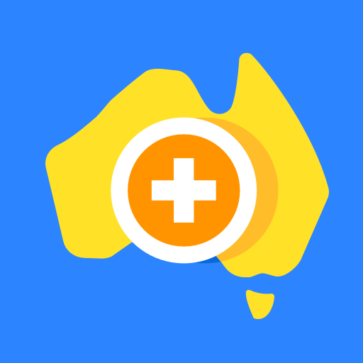 | MyAus COVID-19
|  | OpenWHO: Knowledge for Health Emergencies
|  | Check In CBR
|  | Service NSW
|  | Bupa Aged Care Connect
|  | HealthEngine
|  | DreamLab
|  | Premier's Active April

The details of our analysis are presented in the remainder of this report.

For independent verification, the raw data and the source code of the project is publicly available in its GitHub repository [http://github.com/covid-apps-observer](http://github.com/covid-apps-observer) and its source code has been thoroughly commented in order to provide all the details about how the information provided in this report has been extracted. 

Any feedback, questions, and improvements about the project are very welcome, feel free to create an issue or pull request directly in its GitHub repository: [http://github.com/covid-apps-observer](http://github.com/covid-apps-observer).

## Data sources and analyses

The analysis of each app is structured around five main dimensions: 
* App metadata  
* Requested permissions
* Mentioned servers
* Androwarn analysis
* User ratings and reviews

In the following we describe the data sources and analysis performed for each dimension.

### App metadata

App metadata includes an overview of the main information about the app (for example, its name, releases, privacy policy, etc.), contact information of the development team, and the various Android versions supported by the app. This information is extracted from two main data sources:
* _Google Play store_: we automatically mined the web page of the Google Play store showing the basic information about the app and we parsed it in order to extract information about the app and development team 
* _Android Manifest file_: in our analysis we decompiled the binary file of the app (it is similar to a Zip archive but it contains the code of the app instead of normal files) and we extracted information about the supported Android versions, as it has been listed by its development team.

The extracted app metadata feeds the _App overview_, _Development team_, and _Android support_ sections of this report.
We make use of the [google-play-scraper](https://github.com/JoMingyu/google-play-scraper) tool for extracting the raw data related to this dimension of the project.

### Requested permissions

The Android operating system has a permission model which allows users to grant access to potentially privacy-related information. Every Android app has to explictly declare the permissions it needs to properly function in the Android Manifest file.  

In this report we also show the protection level of each permission, which is a key information for understanding how the requested permissions related to the user's privacy. We carefully analyzed the [official Android documentation (v. 29)](https://developer.android.com/reference/android/Manifest.permission), and it resulted that a permission requested by an Android app can belong to the following protection levels:
* **Dangerous**: higher-risk permissions that would give a requesting app access to private user data or control over the device that can negatively impact the user. Because this type of permission introduces potential risk, the system usually does not automatically grant it to the requesting app. For example, any dangerous permissions requested by an app may be displayed to the user and require confirmation before proceeding.
* **Normal**: this is the default and most common level in Android; normal permissions are lower-risk and give access to isolated app-level features, with minimal risk to other apps, the system, or the user. 
* **Signature**: permissions granted only if the requesting app is signed with the same certificate as the app that declared the permission
* **Appop**: old permission level, a reminiscence of the App Ops tool that Google introduced in Android 4.3.
* **Development**: optional permissions which can be granted to development-oriented apps.
* **Privileged**: permissions who give higher power to mobile apps w.r.t. other apps, such as binding to incoming calls, interacting via bluetooth with other devices without user interaction, etc.
* **Preinstalled**: reserved only for preinstalled apps
* **Installer**: allow the holder to start the permission usage screen for an app
* **RetailDemo**: permissions related to devices used in demonstrations in shops.
* **Pre23**: permissions automatically granted to apps targeting devices running pre-6.0 Android.
* **Upcoming**: permissions which will be released in the next version of the Android platform. 
* **Deprecated**: permissions belonging to old releases of the Android platform, they should not be used by developers since they will not be supported in the near future.
* **Not for use by third-party applications**: permissions which can be requested only by apps developed by Google.
* **Undefined**: this protection level is not documented by Google.

The permissions dimension of this project is based on the [Androguard](https://github.com/androguard/androguard) static analysis tool.

### Mentioned servers

We decompiled each app in order to look for all possible mentions of remote URLs. The mentioned URLs can refer to remote servers the the app is using for either sending or receiving information, web addresses for directing the user to an information website, and so on. 

:warning: It is important to note that this analysis is not meant to be complete and it is very prone to obfuscation. The servers reported here are simply _mentioned_ somewhere in the code of the app and are meant to just give an indication about the "hooks" of the app towards external resources. For example, for an Android app it is normal to contact Google services in order to send/receive push notifications, or to contact the servers of analytics services for having real-time diagnostics about crashes of the app or bugs.

This part of the analysis is based on the [Androguard](https://github.com/androguard/androguard) static analysis tool for identfying the raw URLs mentioned in the app; then, the information about each mentioned server is collected by performing a _whois_ lookup on the first-level domain present in the URL.

### Security analysis

This dimension is based on the [Androwarn](https://github.com/maaaaz/androwarn) structural and data flow analysis of Android bytecode. Androwarn is developed by the University of Lyon/INSA (France) and it has been used in several academic studies. According to its documentation, Androwarn targets the following categories of potential security issues:
* **Telephony identifiers exfiltration**: IMEI, IMSI, MCC, MNC, LAC, CID, operator's name, etc.
* **Device settings exfiltration**: software version, usage statistics, system settings, logs, etc.
* **Geolocation information leakage**: GPS/WiFi geolocation, etc.
* **Connection interfaces information exfiltration**: WiFi credentials, Bluetooth MAC adress, etc.
* **Telephony services abuse**: premium SMS sending, phone call composition, etc.
* **Audio/video flow interception**: call recording, video capture, etc.
* **Remote connection establishment**: socket open call, Bluetooth pairing, APN settings edit, etc.
* **PIM data leakage**: contacts, calendar, SMS, mails, clipboard, etc.
* **External memory operations**: file access on SD card, etc.
* **PIM data modification**: add/delete contacts, calendar events, etc.
* **Arbitrary code execution**: native code using JNI, UNIX command, privilege escalation, etc.
* **Denial of Service**: event notification deactivation, file deletion, process killing, virtual keyboard disable, terminal shutdown/reboot, etc.

Note: We do not consider this data point in the current version of our analyzers since it is too verbose for our purposes.

:warning: It is important to note that Androwarn is a static analysis tool, and as such it performs a variety of heuristics and approximations in its analyses. Said that, the results shown in this report are meant to provide an indication of _potential_ security issues and should be by no means treated as complete and correct.   

### User ratings and reviews

For this dimension we turn again to the web interface of the Google Play store. Firstly, we automatically mine summary statistics about user ratings from the web page of the app under analysis; then, we automatically download the newest 1000 reviews of the app under analysis. For each level of rating (5 stars, 4 stars, , etc., 1 star) we show:
- a word cloud presenting the main terms used by end users in their reviews in the Google Play store
- the last 10 reviews provided by app users in the Google Play store. 

This purposefully simple analysis is meant to help both future users and the development team of the app in understanding what are the main positive and negative points of the app under analysis.

We make use of the [google-play-scraper](https://github.com/JoMingyu/google-play-scraper) tool for extracting the raw data related to this dimension of the project.

## Disclaimer 

This report has been produced independently of any parties and its only objective is to help anybody in better understanding how COVID-related apps work in practice (and compare to each other). The results of this report are limited to the specific version of the software used for running the analyses and on the various heuristics implemented in there. In other words, the results of the analyzers may differ depending on the time and modalities in which they are executed. We do not guarantee that the results of the analyses and the corresponding contents of this report are fully complete or correct. The analysis software is licensed under the [MIT License](https://github.com/iivanoo/covid-apps-observer/blob/master/LICENSE).

# COVIDSafe
App version ``2.0``

Analyzed with [covid-apps-observer](http://github.com/covid-apps-observer) project, version ``0.1``

## App overview
| | |
|-------------------------|-------------------------| 
| **Name**&nbsp;&nbsp;&nbsp;&nbsp;&nbsp;&nbsp;&nbsp;&nbsp;&nbsp;&nbsp;&nbsp;&nbsp;&nbsp;&nbsp;&nbsp;&nbsp;&nbsp;&nbsp;&nbsp;&nbsp;&nbsp;&nbsp;&nbsp;&nbsp;&nbsp;&nbsp;&nbsp;&nbsp;&nbsp;&nbsp;&nbsp;&nbsp;&nbsp;&nbsp;&nbsp;&nbsp;&nbsp;&nbsp;&nbsp;&nbsp;  | COVIDSafe |
| **Unique identifier** | au.gov.health.covidsafe |
| **Link to Google Play** | [https://play.google.com/store/apps/details?id=au.gov.health.covidsafe](https://play.google.com/store/apps/details?id=au.gov.health.covidsafe) |
| **Summary**  | COVIDSafe is a community-based way to stop the spread of COVID-19. |
| **Privacy policy** | [https://covidsafe.gov.au/privacy-policy.html](https://covidsafe.gov.au/privacy-policy.html) |
| **Latest version** | 2.0 |
| **Last update** | 2020-12-18 09:16:28 |
| **Recent changes** | This release introduces the new Herald Protocol that improves COVIDSafe&#39;s ability to capture close contacts and keeps users better informed about important COVID-19 information.  |
| **Installs**  | 1,000,000+ |
| **Category** | Health & Fitness |
| **First release** | Apr 25, 2020 |
| **Size**  | 13M |
| **Supported Android version**  | 5.0 and up |

### Description
> COVIDSafe app has been developed by the Australian Government Department of Health to help keep the community safe from coronavirus (COVID-19). Together, let’s help stop the spread and keep ourselves and each other healthy.
 COVIDSafe uses the Bluetooth® technology on your mobile phone to look for other devices with COVIDSafe installed. Your device will take a note of contact you’ve had with other users by securely logging the other user’s reference code. If you or someone you’ve been in contact with is diagnosed with COVID-19, the close contact information securely stored in your phone can be uploaded and used—with your consent—by state and territory health officials to quickly inform people who’ve been exposed to the virus.
 How you can help stop the spread of COVID-19:
 • Download the COVIDSafe app
 • Register using your mobile phone number, name, age range and postcode
 • Turn on Bluetooth®
 • Check that COVIDSafe is running when you are out and about or are likely to come into contact with others
 • If you test positive for COVID-19, you can consent for your close contact information to be used by state and territory health officials to contact people who may have been exposed. If you’ve been exposed to the virus by someone you’ve been in close contact with, state and territory health officials will be able to contact you quickly so you can get the support you need
 COVIDSafe is an Australian Government Department of Health initiative. Visit https://www.health.gov.au/resources/apps-and-tools/covidsafe-app for more information.

### User interface
The developers of the app provide the following screenshots in the Google play store.
| | | |
|:-------------------------:|:-------------------------:|:-------------------------:|
 | 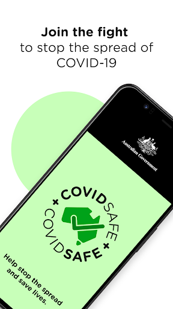  |   |   | 
 |   |  

## Development team
In the following we report the main information provided by the development team in the Google play store.

| | |
|-------------------------|-------------------------|
| **Developer**  | Australian Department of Health |
| **Website**  | [https://www.health.gov.au/resources/apps-and-tools/covidsafe-app#covidsafe-app-help](https://www.health.gov.au/resources/apps-and-tools/covidsafe-app#covidsafe-app-help) |
| **Email** | support@COVIDSafe.gov.au |
| **Physical address**  | - |
| **Other developed apps**  | [https://play.google.com/store/apps/developer?id=Australian+Department+of+Health](https://play.google.com/store/apps/developer?id=Australian+Department+of+Health) |

## Android support

| | |
|-------------------------|-------------------------|
| **Declared target Android version**  | Android10, version 10 (API level 29) |
| **Effective target Android version**  | Android10, version 10 (API level 29) |
| **Minimum supported Android version**  | Lollipop, version 5.0 (API level 21) |
| **Maximum target Android version**  | - |

The larger the difference between the minimum and maximum supported Android versions, the better. A larger difference means a wider audience. For example, old phones have a very low Android version, so a high minimum supported Android version means that the app cannot be used by users with old phones, thus leading to accessibility problems. 

## Requested permissions

In the following we report the complete list of the permissions requested by the app. 

| **Permission** | **Protection level** | **Description** | 
|-------------------------|-------------------------|-------------------------|
 **android.permission ACCESS_FINE_LOCATION** | :warning:**Dangerous** | Allows an app to access precise location. 
 **android.permission ACCESS_NETWORK_STATE** | Normal | Allows applications to access information about networks. 
 **android.permission BLUETOOTH** | Normal | Allows applications to connect to paired bluetooth devices. 
 **android.permission BLUETOOTH_ADMIN** | Normal | Allows applications to discover and pair bluetooth devices. 
 **android.permission FOREGROUND_SERVICE** | Normal | Allows a regular application to use Service.startForeground. 
 **android.permission INTERNET** | Normal | Allows applications to open network sockets. 
 **android.permission RECEIVE_BOOT_COMPLETED** | Normal | Allows an application to receive the Intent.ACTION_BOOT_COMPLETED that is broadcast after the system finishes booting. 
 **android.permission REQUEST_IGNORE_BATTERY_OPTIMIZATIONS** | Normal | Permission an application must hold in order to use Settings.ACTION_REQUEST_IGNORE_BATTERY_OPTIMIZATIONS. 
 **android.permission WAKE_LOCK** | Normal | Allows using PowerManager WakeLocks to keep processor from sleeping or screen from dimming. 
 **com.google.android.c2dm.permission RECEIVE** | - | - 

## Mentioned servers

| **Server** | **Registrant** | **Registrant country** | **Creation date** | 
|-------------------------|-------------------------|-------------------------|-------------------------|
 | google.com | Google LLC | :us: US | 1997-09-15 04:00:00 |
 | stackoverflow.com | Stack Exchange, Inc. | :us: US | 2003-12-26 19:18:07 |
 | googleapis.com | Google LLC | :us: US | 2005-01-25 17:52:26 |

## Security analysis 

Below we report the main security warnings raised by our execution of the [Androwarn](https://github.com/maaaaz/androwarn) security analysis tool.

**Connection interfaces exfiltration**
> - This application reads details about the currently active data network 
> - This application tries to find out if the currently active data network is metered 

**Suspicious connection establishment**
> - This application opens a Socket and connects it to the remote address ' returned no addresses for  ; port is out of range' on the 'N/A' port  
> - This application opens a Socket and connects it to the remote address '' on the 'N/A' port  
> - This application opens a Socket and connects it to the remote address 'Ljava/lang/StringBuilder;->toString()Ljava/lang/String;' on the 'N/A' port  
> - This application opens a Socket and connects it to the remote address 'Ljava/net/Proxy;->type()Ljava/net/Proxy$Type;' on the 'N/A' port  
> - This application opens a Socket and connects it to the remote address 'timeout' on the 'N/A' port  

## User ratings and reviews

Below we provide information about how end users are reacting to the app in terms of ratings and reviews in the Google Play store.

### Ratings

The COVIDSafe app has been installed by more than **1000000** times. At this time, **13917** rated the app and its average score is **2.7911618**. Below we show the distribution of the ratings across the usual star-based rating of Google Play

:star::star::star::star::star:: 4394

:star::star::star::star:: 1190

:star::star::star:: 1200

:star::star:: 1379

:star:: 5754

### Reviews 

#### 5-star reviews

> X, see233 c vfu 33 to 1  :date: __2020-12-28 04:03:18__

> Downloading and using this app is a civic responsibility. Contrary to views expressed by conspiracy nuts and the fake news media, this is a good app, and it strikes a good balance between privacy and the need for public health officials to get data. It now incorporates a Linux Foundation sponsored open source project, which makes it even better, and the contact tracing more reliable. Apple and Google want to cut the government and public health officials out of pandemic response, which is dumb.  :date: __2020-12-24 19:42:06__

> It's a really good app to stop stpreading the covid-19  :date: __2020-12-24 05:09:01__

> Just fell safe knowing i have this app  :date: __2020-12-21 23:11:48__

> excellent initiative  :date: __2020-12-21 09:34:24__

> Works. Have had it since it was released and no issues.  :date: __2020-12-21 07:49:12__

> it keeps you save from the covid  :date: __2020-12-21 07:19:35__

> Works as it should. Install says to turn off battery optimisation and location on for this app... so do it; stop being a superstitious idiot and knowall, no excuses.  :date: __2020-12-21 06:45:18__

> Thanks for keeping Australia safe  :date: __2020-12-21 06:43:49__

> This app is guaranteed 100% Covid Safe. You will not get Covid from this app.  :date: __2020-12-21 06:35:06__

#### 4-star reviews

> This app does not alert to not being active or requiring an update unless you actually open it...should be better than this.. Update 21 12 20 just got my 1st alert to an update being available..much better  :date: __2020-12-21 08:05:41__

> Seems ok  :date: __2020-12-21 08:04:09__

> It's a nessasary for the Government to have this, if those that think it's not real, well it's very real so it's an a Must cheers  :date: __2020-12-20 23:49:00__

> Works perfectly. Would be 5 star if it didn't stop when it needed an update.  :date: __2020-12-20 08:40:56__

> good  :date: __2020-12-18 02:03:55__

> Y ?  :date: __2020-12-10 10:29:29__

> Covid safe turns itself off every day. How can l keep it on?  :date: __2020-12-09 03:37:58__

> I tried to order a pizza twice but it didnt work. I just called the store instead.  :date: __2020-12-06 05:44:56__

> no need t have used  :date: __2020-12-06 05:15:41__

> Q wa,again. Q  :date: __2020-12-05 04:58:27__

#### 3-star reviews

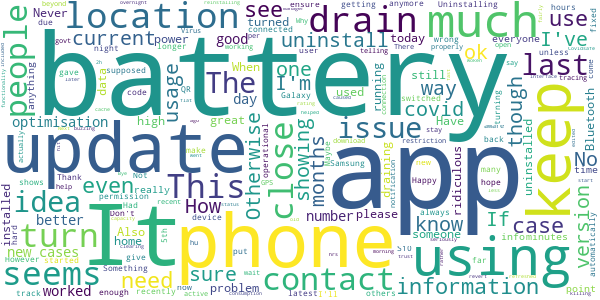

> Battery usage seems to have massively increased after the latest update. COVIDSafe app accounted for 25% of my battery usage per day.  :date: __2020-12-28 12:00:04__

> Not sure what it is supposed to do. I have it running though.  :date: __2020-12-28 04:40:31__

> Update needs location of towns with the numbers of cases of covid  :date: __2020-12-27 22:38:54__

> How are you supposed to make the app 'inactive'? My understanding is that once you have downloaded and installed this app it is automatically operational and that is the way it stays. The information seems to suggest that I have to ensure it is operational that I have to ensure it is running. How do I do that? Also I don't have a photo on Google Profile. I've got one on Facebook.  :date: __2020-12-27 19:30:43__

> Happy with the security and privacy of the app but every since the Herald protocol update, it's smashed my battery (Galaxy S10)  :date: __2020-12-27 03:13:46__

> Had the app for a while but only just recently uninstalled due to all of a sudden high battery usage.  :date: __2020-12-25 23:58:51__

> Still conflicts with my Bluetooth headphones after the latest update. (18/12/20) Please fix it.  :date: __2020-12-25 23:46:30__

> Have to uninstall. Battery Life had halved since I put it on. Otherwise no problems  :date: __2020-12-25 09:50:08__

> Had this app since introduced with no issues. However, after the update the battery use is ridiculous. It uses far more battery in the background(at home alone) than any other actively used app i have. Needs to be addressed if you hope to have more people instal.  :date: __2020-12-25 02:42:20__

> I would like more information on where exactly covid is. I'm not sure if I just can't find this setting. Also couldn't everyone have just stayed indoors for a few months so that the 0 wouldn't have gone up to 115 cases now  :date: __2020-12-22 00:57:15__

#### 2-star reviews

> In one day (with lots of travel), 16 hours background use, 1 min active use, most battery percentage app used at 22%. And it's been for several days that's likely from the new update as some others have said. Although I just found an option to "Optimise battery usage" on as it was off before. Hopefully that fixes.  :date: __2020-12-28 11:13:28__

> App is using more power with every update.  :date: __2020-12-28 09:04:27__

> From Innisfail, Qld: clubs, pubs, stores R ignoring 1.5m. Tourists & travellers in town. Displayed instructions are UNclear and scattered. I took photos of the QR Code with my Data On and no green tick appeared. Then I sent an SMS with name email and Venue. I'm taking a photo of the QR Code but nothing happens. Try using IN-line steps with the icon and logos beside the steps. Try following your directions without guessing or ad-lib. "Tell us more" doesn't work.  :date: __2020-12-28 05:35:07__

> Bluetooth issues. Ever since installing I've had BT issues with other devices not being able to reconnect, without clearing cache and data, then all other devices reconnect for a few days, then problems start again. Edit 27 Dec. 2020. Sick of this randomly burning battery. Fix it dev or will be uninstalling. We are trying to do the right thing, but this app leaves my family vulnerable with potential flat batteries on our phones, which negates usage of this app!  :date: __2020-12-28 01:23:22__

> Had to uninstall it because it emptied my battery in no time. Biggest sucker of power since the update. I used it since the beginning but this is rediculous. Hope they fix it in a hurry  :date: __2020-12-27 07:25:31__

> Large increase in battery usage after 18th December 2020 update.  :date: __2020-12-27 02:18:06__

> It drains my battery like nothing else. It is great to be covid safe but if my phone dies at 2pm it doesn't help anymore. In average it takes about 20-25% of my battery which is unbearable.  :date: __2020-12-26 03:53:44__

> The recent 2.0 update seems to have done something to it's battery use. Judging from the feedback here, I'm not alone in noticing a marked increase in battery drain since the update. In my case, with Covidsafe on, the phone will no longer go on deep sleep/doze. It seems to have borked something with wakelocks. I adopted the app immediately on release and have repeatedly encouraged others to do the same, but in it's present state, I can no longer continue. One kludge I can think of is killing the process when not out and about, but that would require remembering to turn it back on again, which, let's face it, is a losing proposition.  :date: __2020-12-26 03:49:42__

> Was working just fine in background. A week or so ago it appeared to update. After that it began draining the battery. Now uninstalled. Fix it please.  :date: __2020-12-25 21:50:40__

> There is significantly increased battery usage after the Herald update. Consider using ENS instead  :date: __2020-12-25 00:26:27__

#### 1-star reviews

> Uninstalling due to battery drain. 44% vs the next app which only consumed 12%.  :date: __2020-12-28 12:20:36__

> Drain battery significantly.  :date: __2020-12-28 12:09:25__

> Latest update killing my battery. Really disappointing that the government decided to release a half baked update eroding the confidence of all users who are trying to do the right thing. You just can't afford to skimp on testing on such a large scale and important app.  :date: __2020-12-28 09:52:09__

> The latest update requires my phone location to be on. Uninstalled.  :date: __2020-12-28 09:41:41__

> Unable to update. Tried numerous times.  :date: __2020-12-28 04:40:24__

> I was previously an advocate of this app because of the purpose of it. But since the latest update my Samsung S6 with Android 7 runs extremely hot and uses the whole battery within 4 hours. This makes both the app and the phone useless. I have turned off the location permission on this app, and now I have my phone back. The app tells me it cannot operate without location permission - I call bull, it worked fine without location services before. If it doesn't work now without the location permission, so what, it doesn't work with the location permission either. There is clearly some pretty poor coding in this version. Let me know when you fix this, until then locations stays off.  :date: __2020-12-28 04:10:23__

> Battery drain on latest version  :date: __2020-12-27 13:33:07__

> Just 17 cases traced by this app.  :date: __2020-12-27 12:36:23__

> Pathetic doesn't work not worth the effort of installing  :date: __2020-12-27 10:54:55__

> I wondered why my phone was suddenly unable to go a full day without charging. Turns out since the last update, this app has started using a lot more battery charge. Needs to be fixed asap or I will have to uninstall it, and I won't be the only one.  :date: __2020-12-27 09:04:53__

# WHO Info
App version ``4.0.1``

Analyzed with [covid-apps-observer](http://github.com/covid-apps-observer) project, version ``0.1``

## App overview
| | |
|-------------------------|-------------------------| 
| **Name**&nbsp;&nbsp;&nbsp;&nbsp;&nbsp;&nbsp;&nbsp;&nbsp;&nbsp;&nbsp;&nbsp;&nbsp;&nbsp;&nbsp;&nbsp;&nbsp;&nbsp;&nbsp;&nbsp;&nbsp;&nbsp;&nbsp;&nbsp;&nbsp;&nbsp;&nbsp;&nbsp;&nbsp;&nbsp;&nbsp;&nbsp;&nbsp;&nbsp;&nbsp;&nbsp;&nbsp;&nbsp;&nbsp;&nbsp;&nbsp;  | WHO Info |
| **Unique identifier** | org.who.infoapp |
| **Link to Google Play** | [https://play.google.com/store/apps/details?id=org.who.infoapp](https://play.google.com/store/apps/details?id=org.who.infoapp) |
| **Summary**  | The official World Health Organization Information App. |
| **Privacy policy** | [https://www.who.int/about/who-we-are/privacy-policy](https://www.who.int/about/who-we-are/privacy-policy) |
| **Latest version** | 4.0.1 |
| **Last update** | 2020-12-03 10:24:14 |
| **Recent changes** | Application UI redesign. Various improvements and bug fixes. |
| **Installs**  | 100,000+ |
| **Category** | News & Magazines |
| **First release** | Apr 13, 2020 |
| **Size**  | 12M |
| **Supported Android version**  | 4.2 and up |

### Description
> Have the latest health information at your fingertips with the official World Health Organization Information App. This app displays the latest news, events, features and breaking updates on outbreaks. 
  
 WHO works worldwide to promote health, keep the world safe, and serve the vulnerable. 
 Our goal is to ensure that a billion more people have universal health coverage, to protect a billion more people from health emergencies, and provide a further billion people with better health and well-being.

### User interface
The developers of the app provide the following screenshots in the Google play store.
| | | |
|:-------------------------:|:-------------------------:|:-------------------------:|
 |   |   |   | 
 |   |   |   | 
 |   |   |   | 
 |   |   | 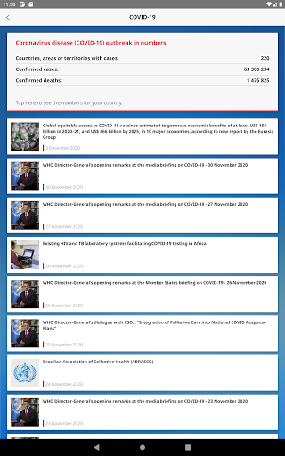  | 
 |   |   |   | 
 |   |   |   | 
 |   |   |   | 
 |   |   |   | 

## Development team
In the following we report the main information provided by the development team in the Google play store.

| | |
|-------------------------|-------------------------|
| **Developer**  | World Health Organization |
| **Website**  | [https://www.who.int/](https://www.who.int/) |
| **Email** | dcx@who.int |
| **Physical address**  | [Avenu Appia 20 1211 Geneva Switzerland](https://www.google.com/maps/search/Avenu%20Appia%2020%201211%20Geneva%20Switzerland) (Google Maps) |
| **Other developed apps**  | [https://play.google.com/store/apps/developer?id=World+Health+Organization](https://play.google.com/store/apps/developer?id=World+Health+Organization) |

## Android support

| | |
|-------------------------|-------------------------|
| **Declared target Android version**  | - |
| **Effective target Android version**  | - |
| **Minimum supported Android version**  | Jelly Bean, version 4.2.x (API level 17) |
| **Maximum target Android version**  | - |

The larger the difference between the minimum and maximum supported Android versions, the better. A larger difference means a wider audience. For example, old phones have a very low Android version, so a high minimum supported Android version means that the app cannot be used by users with old phones, thus leading to accessibility problems. 

## Requested permissions

In the following we report the complete list of the permissions requested by the app. 

| **Permission** | **Protection level** | **Description** | 
|-------------------------|-------------------------|-------------------------|
 **android.permission ACCESS_NETWORK_STATE** | Normal | Allows applications to access information about networks. 
 **android.permission INTERNET** | Normal | Allows applications to open network sockets. 
 **android.permission READ_CALENDAR** | :warning:**Dangerous** | Allows an application to read the user's calendar data. 
 **android.permission READ_EXTERNAL_STORAGE** | :warning:**Dangerous** | Allows an application to read from external storage. 
 **android.permission WAKE_LOCK** | Normal | Allows using PowerManager WakeLocks to keep processor from sleeping or screen from dimming. 
 **android.permission WRITE_CALENDAR** | :warning:**Dangerous** | Allows an application to write the user's calendar data. 
 **android.permission WRITE_EXTERNAL_STORAGE** | :warning:**Dangerous** | Allows an application to write to external storage. 
 **com.google.android.c2dm.permission RECEIVE** | - | - 
 **com.google.android.finsky.permission BIND_GET_INSTALL_REFERRER_SERVICE** | - | - 

## Mentioned servers

| **Server** | **Registrant** | **Registrant country** | **Creation date** | 
|-------------------------|-------------------------|-------------------------|-------------------------|
 | adobe.com | Adobe Inc. | :us: US | 1986-11-17 05:00:00 |
 | googlesyndication.com | Google LLC | :us: US | 2003-01-21 06:17:24 |
 | google.com | Google LLC | :us: US | 1997-09-15 04:00:00 |
 | app-measurement.com | Google LLC | :us: US | 2015-06-19 20:13:31 |
 | googleapis.com | Google LLC | :us: US | 2005-01-25 17:52:26 |
 | googleadservices.com | Google LLC | :us: US | 2003-06-19 16:34:53 |

## Security analysis 

Below we report the main security warnings raised by our execution of the [Androwarn](https://github.com/maaaaz/androwarn) security analysis tool.

**Connection interfaces exfiltration**
> - This application reads details about the currently active data network 
> - This application tries to find out if the currently active data network is metered 

**Suspicious connection establishment**
> - This application opens a Socket and connects it to the remote address 'Lfi/iki/elonen/NanoHTTPD$ResponseException;' on the 'N/A' port  
> - This application opens a Socket and connects it to the remote address 'NanoHttpd Shutdown' on the 'N/A' port  

**Code execution**
> - This application loads a native library: 'NativeScript' 
> - This application executes a UNIX command containing this argument: '2' 

## User ratings and reviews

Below we provide information about how end users are reacting to the app in terms of ratings and reviews in the Google Play store.

### Ratings

The WHO Info app has been installed by more than **100000** times. At this time, **1080** rated the app and its average score is **4.009259**. Below we show the distribution of the ratings across the usual star-based rating of Google Play

:star::star::star::star::star:: 710

:star::star::star::star:: 90

:star::star::star:: 40

:star::star:: 60

:star:: 180

### Reviews 

#### 5-star reviews

> Very nice app for health.  :date: __2020-12-12 06:15:46__

> Great. Installed quickly without problems. :-)  :date: __2020-11-15 16:31:45__

> Thnx u save live  :date: __2020-11-11 19:32:07__

> Always the best one!  :date: __2020-11-04 22:22:46__

> Great app  :date: __2020-11-03 15:50:52__

> Good  :date: __2020-10-31 20:49:42__

> 😊😊😊  :date: __2020-10-21 18:17:56__

> I. AM. BELIVE. W. H. O  :date: __2020-10-04 06:51:53__

> I like to see a update on what's going on please  :date: __2020-09-23 12:20:19__

> First time user, but the app looks helpful.  :date: __2020-09-16 19:17:57__

#### 4-star reviews

> Not sure yet  :date: __2020-09-27 08:50:53__

> Excellent engineering tools. Your whatsapp number please.  :date: __2020-08-05 11:01:52__

> all the demand who it is hey  :date: __2020-07-20 15:10:48__

> Using this more and more. After the cdc called religion an essential. I don't know what whackadoodle besides trump/pence is messing with the info. Thank you for being a more logical alternative. As usa is being pulled back by whackadoodles and foreign commies.  :date: __2020-07-17 03:09:14__

> Nice  :date: __2020-07-08 17:19:26__

> good  :date: __2020-06-03 00:37:10__

> It's just information, not the actual tracker. But has plenty of information that's 100% accurate.  :date: __2020-05-31 02:37:20__

> I really want to appreciate Dr. Aliu Sam for using his natural roots and herbs medicine to cure me of Syphilis Since 11 months now I have been living with this disease and it has been giving me challenges, I was so perplexed cause I have been taking several drugs to be cured but all have been in vain. One morning I was browsing through the Internet then i saw several testimonies about Dr. Aliu Sam curing people off verious diseases and immediately I contacted Dr. Aliu Sam I told himabout my trou  :date: __2020-05-08 05:33:57__

> It did not detect  :date: __2020-04-29 18:37:26__

> Could do with more accurate information to keep people alive. But no harm done.  :date: __2020-04-29 13:41:12__

#### 3-star reviews

> A good improvement could be the implementation of a search system for arguments that a person want to find ( like the guidelines about health and healthy diet). At first look seems it miss a lot from the website.  :date: __2020-09-27 10:09:16__

> Good App but I don't trust the WHO. Just have the app to stay up to date with the crazy things the WHO gets up to  :date: __2020-07-29 10:34:08__

> Will not download onto my 1year old state of the art smatphone. Bad, as a user of many android apps what are you thinking. I have found more than 3700 other users that can not use this app. Come on you must no you have problem.  :date: __2020-05-26 02:04:59__

> Good  :date: __2020-05-14 21:22:11__

> Best.  :date: __2020-04-20 13:14:33__

> Looks nice great look smooth Lario  :date: __2020-04-18 09:44:30__

#### 2-star reviews

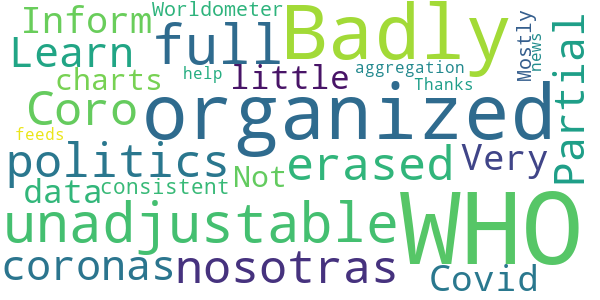

> Badly organized, unadjustable, and full of politics,i erased it  :date: __2020-11-13 07:29:53__

> Coro nosotras coronas  :date: __2020-07-02 06:41:55__

> Partial  :date: __2020-06-22 12:24:23__

> Learn more  :date: __2020-06-15 23:35:50__

> WHO Inform Covid 19  :date: __2020-05-24 17:14:56__

> Very little data or charts. Not consistent with Worldometer. Mostly an aggregation of news feeds about WHO  :date: __2020-05-15 15:38:10__

> Thanks for your help.  :date: __2020-04-22 18:52:40__

#### 1-star reviews

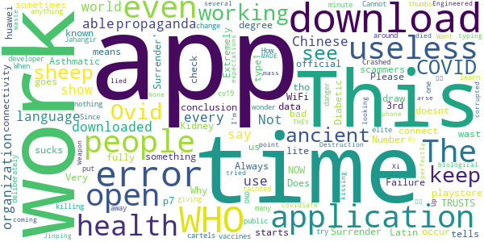

> Extremely bad application. Always not working at all. Why do you keep it in the playstore?!  :date: __2020-12-15 16:13:48__

> A wast of time  :date: __2020-11-04 13:04:20__

> “‘Ovid’ is Latin for a sheep. COVID starts with a C, which also means ‘see’ in ancient language. 19 was known as the “Number of Surrender” in ancient times.”  It goes on to draw the conclusion, “C-OVID 19 = ‘See a Sheep Surrender'”.  :date: __2020-11-02 08:06:17__

> Very scammers  :date: __2020-10-19 19:45:47__

> I just downloaded it, but every time I open it just say "an error occur check your connectivity" or something like that... didn't work...  :date: __2020-10-10 17:24:54__

> Does not work  :date: __2020-10-09 00:12:33__

> This is your official application? and sometimes it doesn't work  :date: __2020-10-07 18:26:16__

> I am not able to download it fully its no use to me as i am a type1 Diabetic and Asthmatic i am also in 3rd degree Kidney Failure.  :date: __2020-09-29 02:20:05__

> WHO TRUSTS WHO NOW ¿¿?!?????  :date: __2020-09-25 02:07:50__

> This app sucks  :date: __2020-09-14 21:01:10__

# Coronavirus Australia
App version ``1.4.9``

Analyzed with [covid-apps-observer](http://github.com/covid-apps-observer) project, version ``0.1``

## App overview
| | |
|-------------------------|-------------------------| 
| **Name**&nbsp;&nbsp;&nbsp;&nbsp;&nbsp;&nbsp;&nbsp;&nbsp;&nbsp;&nbsp;&nbsp;&nbsp;&nbsp;&nbsp;&nbsp;&nbsp;&nbsp;&nbsp;&nbsp;&nbsp;&nbsp;&nbsp;&nbsp;&nbsp;&nbsp;&nbsp;&nbsp;&nbsp;&nbsp;&nbsp;&nbsp;&nbsp;&nbsp;&nbsp;&nbsp;&nbsp;&nbsp;&nbsp;&nbsp;&nbsp;  | Coronavirus Australia |
| **Unique identifier** | au.gov.health.covid19 |
| **Link to Google Play** | [https://play.google.com/store/apps/details?id=au.gov.health.covid19](https://play.google.com/store/apps/details?id=au.gov.health.covid19) |
| **Summary**  | Official Government Information |
| **Privacy policy** | [https://www.health.gov.au/using-our-websites/privacy](https://www.health.gov.au/using-our-websites/privacy) |
| **Latest version** | 1.4.9 |
| **Last update** | 2020-10-22 02:29:11 |
| **Recent changes** | Minor changes to notifications to improve reliable delivery.  Offline mode fixed in Android versions - now displays content when device is not connected to the internet.  Cumulative graph added to Numbers screen. |
| **Installs**  | 500,000+ |
| **Category** | Health & Fitness |
| **First release** | Mar 28, 2020 |
| **Size**  | 22M |
| **Supported Android version**  | 6.0 and up |

### Description
> You can use the Australian Government Coronavirus app to:
 - stay up to date with the official information and advice 
 - important health advice to help stop the spread and stay healthy
 - get a quick snapshot of the current official status within Australia
 - check your symptoms if you are concerned about yourself or someone else
 - find relevant contact information 
 - access updated information from the Australian Government
 - receive push notifications of urgent information and updates
 Trusted, Australian information
 All information in the Australian Government Coronavirus app is sourced from Australia’s leading health organisations and has undergone a quality assurance process so people can know it is safe, appropriate and relevant for Australians. 
 Disclaimer
 Whilst this app has been reviewed for clinical accuracy, the content is not a substitute for professional advice and should not be used as an alternative to professional healthcare. If you have a particular medical problem, please consult a doctor or a specialist.

### User interface
The developers of the app provide the following screenshots in the Google play store.
| | | |
|:-------------------------:|:-------------------------:|:-------------------------:|
 |   |   |   | 
 |   |   |   | 

## Development team
In the following we report the main information provided by the development team in the Google play store.

| | |
|-------------------------|-------------------------|
| **Developer**  | DTA App Developer |
| **Website**  | [http://health.gov.au](http://health.gov.au) |
| **Email** | info@health.gov.au |
| **Physical address**  | - |
| **Other developed apps**  | [https://play.google.com/store/apps/developer?id=DTA+App+Developer](https://play.google.com/store/apps/developer?id=DTA+App+Developer) |

## Android support

| | |
|-------------------------|-------------------------|
| **Declared target Android version**  | Android10, version 10 (API level 29) |
| **Effective target Android version**  | Android10, version 10 (API level 29) |
| **Minimum supported Android version**  | Marshmallow, version 6.0 (API level 23) |
| **Maximum target Android version**  | - |

The larger the difference between the minimum and maximum supported Android versions, the better. A larger difference means a wider audience. For example, old phones have a very low Android version, so a high minimum supported Android version means that the app cannot be used by users with old phones, thus leading to accessibility problems. 

## Requested permissions

In the following we report the complete list of the permissions requested by the app. 

| **Permission** | **Protection level** | **Description** | 
|-------------------------|-------------------------|-------------------------|
 **android.permission ACCESS_COARSE_LOCATION** | :warning:**Dangerous** | Allows an app to access approximate location. 
 **android.permission ACCESS_FINE_LOCATION** | :warning:**Dangerous** | Allows an app to access precise location. 
 **android.permission ACCESS_NETWORK_STATE** | Normal | Allows applications to access information about networks. 
 **android.permission FOREGROUND_SERVICE** | Normal | Allows a regular application to use Service.startForeground. 
 **android.permission INTERNET** | Normal | Allows applications to open network sockets. 
 **android.permission RECEIVE_BOOT_COMPLETED** | Normal | Allows an application to receive the Intent.ACTION_BOOT_COMPLETED that is broadcast after the system finishes booting. 
 **android.permission WAKE_LOCK** | Normal | Allows using PowerManager WakeLocks to keep processor from sleeping or screen from dimming. 
 **com.google.android.c2dm.permission RECEIVE** | - | - 
 **com.google.android.finsky.permission BIND_GET_INSTALL_REFERRER_SERVICE** | - | - 

## Mentioned servers

| **Server** | **Registrant** | **Registrant country** | **Creation date** | 
|-------------------------|-------------------------|-------------------------|-------------------------|
 | google.com | Google LLC | :us: US | 1997-09-15 04:00:00 |
 | googlesyndication.com | Google LLC | :us: US | 2003-01-21 06:17:24 |
 | apple.com | Apple Inc. | :us: US | 1987-02-19 05:00:00 |
 | aomedia.org | Contact Privacy Inc. Customer 1243324949 | :canada: CA | 2015-08-24 14:07:31 |
 | app-measurement.com | Google LLC | :us: US | 2015-06-19 20:13:31 |
 | w3.org | W3C | :us: US | 1994-07-06 04:00:00 |
 | googleapis.com | Google LLC | :us: US | 2005-01-25 17:52:26 |
 | googleapis.com | Google LLC | :us: US | 2005-01-25 17:52:26 |
 | googleapis.com | Google LLC | :us: US | 2005-01-25 17:52:26 |
 | googleapis.com | Google LLC | :us: US | 2005-01-25 17:52:26 |
 | googleapis.com | Google LLC | :us: US | 2005-01-25 17:52:26 |
 | googleadservices.com | Google LLC | :us: US | 2003-06-19 16:34:53 |
 | googleapis.com | Google LLC | :us: US | 2005-01-25 17:52:26 |
 | crashlytics.com | Google LLC | :us: US | 2011-01-21 15:30:40 |

## Security analysis 

Below we report the main security warnings raised by our execution of the [Androwarn](https://github.com/maaaaz/androwarn) security analysis tool.

**Telephony identifiers leakage**
> - This application reads the ISO country code equivalent for the SIM provider's country code 
> - This application reads the ISO country code equivalent of the current registered operator's MCC (Mobile Country Code) 
> - This application reads the device phone type value 

**Connection interfaces exfiltration**
> - This application reads details about the currently active data network 
> - This application tries to find out if the currently active data network is metered 

**Telephony services abuse**
> - This application makes phone calls 

**Suspicious connection establishment**
> - This application opens a Socket and connects it to the remote address ' returned no addresses for  ; port is out of range' on the 'N/A' port  
> - This application opens a Socket and connects it to the remote address '' on the 'N/A' port  
> - This application opens a Socket and connects it to the remote address 'Ljava/lang/StringBuilder;->toString()Ljava/lang/String;' on the 'N/A' port  
> - This application opens a Socket and connects it to the remote address 'Ljava/net/Proxy;->type()Ljava/net/Proxy$Type;' on the 'N/A' port  
> - This application opens a Socket and connects it to the remote address 'timeout' on the 'N/A' port  

**Code execution**
> - This application loads a native library 
> - This application executes a UNIX command containing this argument: '2' 

## User ratings and reviews

Below we provide information about how end users are reacting to the app in terms of ratings and reviews in the Google Play store.

### Ratings

The Coronavirus Australia app has been installed by more than **500000** times. At this time, **1583** rated the app and its average score is **3.56875**. Below we show the distribution of the ratings across the usual star-based rating of Google Play

:star::star::star::star::star:: 792

:star::star::star::star:: 148

:star::star::star:: 178

:star::star:: 99

:star:: 366

### Reviews 

#### 5-star reviews

> VERY Important users carefully read the installation and configuration options to make any necessary adjustments to their device otherwise please assume the App won't function!  :date: __2020-12-22 01:15:04__

> Helpful & informative but information overload at times.  :date: __2020-10-26 21:08:54__

> Essential App at this time to stay safe  :date: __2020-10-11 15:25:41__

> Everyone should be made to download  :date: __2020-09-27 00:27:03__

> Amazing  :date: __2020-09-09 22:19:27__

> Consistent obviously  :date: __2020-09-01 17:07:21__

> Fantastic!  :date: __2020-09-01 13:53:31__

> Yes I like  :date: __2020-08-30 09:44:10__

> Its needed all over  :date: __2020-08-25 23:19:29__

> WONDERFUL IDEA  :date: __2020-08-25 02:16:14__

#### 4-star reviews

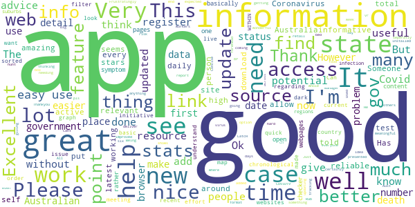

> X cn  :date: __2020-12-14 05:10:55__

> Great resource for reliable Coronavirus info. Used to be hard to find latest stats in a meaningful format but this seems to have improved  :date: __2020-09-08 06:19:23__

> It's good what is f..K going on ?  :date: __2020-08-04 08:35:34__

> Its wonderful app it would be amazing if you can add option that shows new cases in every state seperatly and not just total of whole Australia.  :date: __2020-08-03 12:49:09__

> Works well and is informative  :date: __2020-07-04 22:02:51__

> I'm thinking big box around the end of my bed = vr. Has potential if anything. He won't. / Rub my forehead LatcH  :date: __2020-06-16 09:18:45__

> Would be great if you could also put how many active cases there are.  :date: __2020-05-21 00:11:52__

> Works as expected, an information manager, not a source (otherwise the app would need updating daily). Helps to get at relevant, reliable information, without needing to hunt around the web myself to find it.  :date: __2020-05-13 10:32:15__

> Good  :date: __2020-05-11 11:25:39__

> I like  :date: __2020-05-07 01:23:44__

#### 3-star reviews

> No idea if it works and hope I never find out  :date: __2020-10-29 09:53:40__

> Recent resource.  :date: __2020-09-07 05:43:12__

> Current version will not work because it thinks my battery optimisation is on - it is off!! Please fix asap as I want a working app.  :date: __2020-08-03 10:44:31__

> Pros: good to know the official safe links here. Cons: it's really just a collection of web links, nothing more.  :date: __2020-07-14 00:47:47__

> I'm looking for my location as my mum said there's been more cases where I live but it only gives U the choice to see Australia wide and not what U want to see I wanted to see my part of Victoria but it only covers Victoria itself and other places it would be good if it was more in depth  :date: __2020-07-02 17:02:12__

> Only used occasionally as it is quite bitsy in that finding info isn't that intuitive. Most concerning is that finding specific details about Victoria is a link to a powerbi report that is almost impossible to navigate on a phone, the point of the app. If you want to view graphs and charts, find your local municipalities etc, then I'd suggest you head for a PC that it was built for the job. Interactive charts are a good concept but not when prepared for a PC and viewed on a phone.  :date: __2020-06-19 13:30:45__

> Keeps turning itself off!  :date: __2020-05-19 04:42:12__

> It hasn't updated. Supposed to update at 9:00 AM daily.  :date: __2020-05-14 01:15:17__

> Never have received the pin to open it  :date: __2020-05-08 01:20:55__

> Won't download past 97%  :date: __2020-05-07 12:21:06__

#### 2-star reviews

> Was a pretty useless app, can find out the same info online or by watching the news  :date: __2020-07-27 04:56:10__

> Never been able to open app  :date: __2020-07-08 12:03:11__

> I'm sure it's a great app but there is constantly a reminder in my notifications that I can't get rid of. Very very frustrating.  :date: __2020-05-28 18:16:57__

> Not enough real time information I would like to see more statistics especially our Reff number  :date: __2020-05-07 11:17:36__

> Release the source code of both client and server and more of us will install this app... It looks like the app generates and uploads a private/public key pair and uploads one or the other to a central server and associates it directly to a user, other users when testing positive can upload their contact history to the server and matches that data to details of other users they came into contact with directly implicating the contacts, private user data should not be uploaded without consent.  :date: __2020-05-04 12:39:48__

> Confusing  :date: __2020-05-04 09:43:14__

> Will not download on my phone  :date: __2020-05-01 08:18:24__

> Takes forever to download. Been trying for 2 days now.  :date: __2020-04-29 10:31:12__

> I downloaded it but still do not know if it is actually working.  :date: __2020-04-27 03:53:37__

> Please add a prominent link to the covidsafe app.  :date: __2020-04-27 00:50:53__

#### 1-star reviews

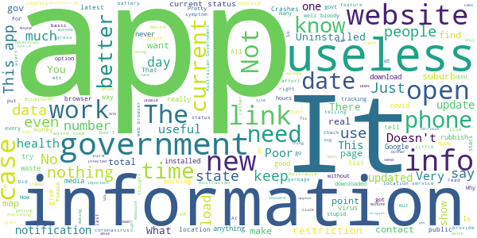

> Best government statement ever, "if every Australian downloads this app we will open the pubs and clubs". What a waste of money  :date: __2020-12-24 12:04:31__

> Gay  :date: __2020-12-21 00:32:03__

> Useless. Very outdated notification feed. This app has life in my phone less than 5 minutes. Wish the government does more research for what citizens needs before watst the public money.  :date: __2020-12-19 21:25:15__

> There is no information regarding privacy measures for testing procedures and the storage location/process regarding retained genetic samples.  :date: __2020-12-14 09:05:12__

> Unfortunate that it provides incorrect information which causes difficulties for business. Since when were churches allowed 1 per 2sqm with a maximum of 150 for a religious ceremony - not a wedding or a funeral.  :date: __2020-12-07 04:05:26__

> Never used and a waste of money by the government!  :date: __2020-11-08 22:39:03__

> Very very very very disappointing  :date: __2020-10-11 10:52:04__

> Nice if big brother to secretly install this app on my phone without my permission  :date: __2020-10-07 15:31:55__

> This app is data mining and just steals personal information without consent, the data is collected by deceiving the user by stating it is a health & fitness app. It isn't, it tracks your location,phone number, ip address, serial number of your phone & you, without the user's consent, uninstall immediately!  :date: __2020-09-18 12:21:30__

> Doesn't work  :date: __2020-09-14 02:45:21__

# MyAus COVID-19
App version ``45``

Analyzed with [covid-apps-observer](http://github.com/covid-apps-observer) project, version ``0.1``

## App overview
| | |
|-------------------------|-------------------------| 
| **Name**&nbsp;&nbsp;&nbsp;&nbsp;&nbsp;&nbsp;&nbsp;&nbsp;&nbsp;&nbsp;&nbsp;&nbsp;&nbsp;&nbsp;&nbsp;&nbsp;&nbsp;&nbsp;&nbsp;&nbsp;&nbsp;&nbsp;&nbsp;&nbsp;&nbsp;&nbsp;&nbsp;&nbsp;&nbsp;&nbsp;&nbsp;&nbsp;&nbsp;&nbsp;&nbsp;&nbsp;&nbsp;&nbsp;&nbsp;&nbsp;  | MyAus COVID-19 |
| **Unique identifier** | com.myaus |
| **Link to Google Play** | [https://play.google.com/store/apps/details?id=com.myaus](https://play.google.com/store/apps/details?id=com.myaus) |
| **Summary**  | An essential, multi-language informational app about COVID-19 in Australia. |
| **Privacy policy** | [https://migrationcouncil.org.au/policy/](https://migrationcouncil.org.au/policy/) |
| **Latest version** | 45 |
| **Last update** | 2020-12-17 23:41:37 |
| **Recent changes** | - 4x new languages added to the app! - Hindi, Swahili, Nepali &amp; Lao - Bug fixing and performance improvements. |
| **Installs**  | 5,000+ |
| **Category** | Health & Fitness |
| **First release** | Apr 23, 2020 |
| **Size**  | 32M |
| **Supported Android version**  | 4.1 and up |

### Description
> You can use the MyAus COVID-19 App to:
 - Find comprehensive information on rules and regulations regarding COVID-19 in Australia
 - Read information in multiple-languages
 - Use simple search to find important tips on how to stay healthy
 - View a snapshot of the current statistics in different states in Australia
 - Use tools such as a symptom checker to identify any concerns
 - View animated videos in multiple languages
 - Receive push notifications for updates 
 - Discover a huge amount of ‘in-app’ information, viewable offline once downloaded
 The MyAus App has been developed to provide the most simple, comprehensive, easy-to-use experience on mobile devices for finding information on Coronavirus in Australia. 
 More languages than other apps, more ways to educate yourself through clear design, animation and interactive elements.
 Languages available:
 Arabic,  Burmese, Cantonese, Dari, English, French, Greek, Indonesian, Italian, Japanese, Karen, Khmer, Korean, Mandarin, Persian, Punjabi, Russian, Spanish, Somali, Tagalog, Tamil, Thai, Turkish, Urdu, Vietnamese.
 More languages coming soon ...

### User interface
The developers of the app provide the following screenshots in the Google play store.
| | | |
|:-------------------------:|:-------------------------:|:-------------------------:|
 |   |   |   | 
 |   |   |   | 

## Development team
In the following we report the main information provided by the development team in the Google play store.

| | |
|-------------------------|-------------------------|
| **Developer**  | Migration Council Australia |
| **Website**  | [https://migrationcouncil.org.au/](https://migrationcouncil.org.au/) |
| **Email** | info@migrationcouncil.org.au |
| **Physical address**  | - |
| **Other developed apps**  | [https://play.google.com/store/apps/developer?id=Migration+Council+Australia](https://play.google.com/store/apps/developer?id=Migration+Council+Australia) |

## Android support

| | |
|-------------------------|-------------------------|
| **Declared target Android version**  | Pie, version 9 (API level 28) |
| **Effective target Android version**  | Pie, version 9 (API level 28) |
| **Minimum supported Android version**  | Jelly Bean, version 4.1.x (API level 16) |
| **Maximum target Android version**  | - |

The larger the difference between the minimum and maximum supported Android versions, the better. A larger difference means a wider audience. For example, old phones have a very low Android version, so a high minimum supported Android version means that the app cannot be used by users with old phones, thus leading to accessibility problems. 

## Requested permissions

In the following we report the complete list of the permissions requested by the app. 

| **Permission** | **Protection level** | **Description** | 
|-------------------------|-------------------------|-------------------------|
 **android.permission ACCESS_NETWORK_STATE** | Normal | Allows applications to access information about networks. 
 **android.permission ACCESS_WIFI_STATE** | Normal | Allows applications to access information about Wi-Fi networks. 
 **android.permission INTERNET** | Normal | Allows applications to open network sockets. 
 **android.permission READ_APP_BADGE** | - | - 
 **android.permission RECEIVE_BOOT_COMPLETED** | Normal | Allows an application to receive the Intent.ACTION_BOOT_COMPLETED that is broadcast after the system finishes booting. 
 **android.permission VIBRATE** | Normal | Allows access to the vibrator. 
 **android.permission WAKE_LOCK** | Normal | Allows using PowerManager WakeLocks to keep processor from sleeping or screen from dimming. 
 **com.anddoes.launcher.permission UPDATE_COUNT** | - | - 
 **com.google.android.c2dm.permission RECEIVE** | - | - 
 **com.google.android.finsky.permission BIND_GET_INSTALL_REFERRER_SERVICE** | - | - 
 **com.htc.launcher.permission READ_SETTINGS** | - | - 
 **com.htc.launcher.permission UPDATE_SHORTCUT** | - | - 
 **com.huawei.android.launcher.permission CHANGE_BADGE** | - | - 
 **com.huawei.android.launcher.permission READ_SETTINGS** | - | - 
 **com.huawei.android.launcher.permission WRITE_SETTINGS** | - | - 
 **com.majeur.launcher.permission UPDATE_BADGE** | - | - 
 **com.myaus.permission C2D_MESSAGE** | - | - 
 **com.oppo.launcher.permission READ_SETTINGS** | - | - 
 **com.oppo.launcher.permission WRITE_SETTINGS** | - | - 
 **com.sec.android.provider.badge.permission READ** | - | - 
 **com.sec.android.provider.badge.permission WRITE** | - | - 
 **com.sonyericsson.home.permission BROADCAST_BADGE** | - | - 
 **com.sonymobile.home.permission PROVIDER_INSERT_BADGE** | - | - 
 **me.everything.badger.permission BADGE_COUNT_READ** | - | - 
 **me.everything.badger.permission BADGE_COUNT_WRITE** | - | - 

## Mentioned servers

| **Server** | **Registrant** | **Registrant country** | **Creation date** | 
|-------------------------|-------------------------|-------------------------|-------------------------|
 | bugsnag.com | Bugsnag Inc. | GB | 2011-08-18 03:26:10 |
 | android.com | Google LLC | :us: US | 1997-06-23 04:00:00 |
 | googlesyndication.com | Google LLC | :us: US | 2003-01-21 06:17:24 |
 | google.com | Google LLC | :us: US | 1997-09-15 04:00:00 |
 | github.com | GitHub, Inc. | :us: US | 2007-10-09 18:20:50 |
 | w3.org | W3C | :us: US | 1994-07-06 04:00:00 |
 | googleapis.com | Google LLC | :us: US | 2005-01-25 17:52:26 |
 | app-measurement.com | Google LLC | :us: US | 2015-06-19 20:13:31 |
 | googleapis.com | Google LLC | :us: US | 2005-01-25 17:52:26 |
 | googleadservices.com | Google LLC | :us: US | 2003-06-19 16:34:53 |

## Security analysis 

Below we report the main security warnings raised by our execution of the [Androwarn](https://github.com/maaaaz/androwarn) security analysis tool.

**Telephony identifiers leakage**
> - This application reads the ISO country code equivalent of the current registered operator's MCC (Mobile Country Code) 
> - This application reads the numeric name (MCC+MNC) of current registered operator 
> - This application reads the operator name 

**Connection interfaces exfiltration**
> - This application reads details about the currently active data network 
> - This application tries to find out if the currently active data network is metered 

**Suspicious connection establishment**
> - This application opens a Socket and connects it to the remote address '' on the '80' port  
> - This application opens a Socket and connects it to the remote address '' on the 'N/A' port  
> - This application opens a Socket and connects it to the remote address 'Ljava/lang/StringBuilder;->toString()Ljava/lang/String;' on the ': connect, resolve' port  
> - This application opens a Socket and connects it to the remote address 'Ljava/lang/StringBuilder;->toString()Ljava/lang/String;' on the 'N/A' port  
> - This application opens a Socket and connects it to the remote address 'Ljava/net/Proxy;->type()Ljava/net/Proxy$Type;' on the 'N/A' port  
> - This application opens a Socket and connects it to the remote address 'timeout' on the 'N/A' port  

**Pim data leakage**
> - This application accesses data stored in the clipboard 

**Code execution**
> - This application loads a native library 
> - This application loads a native library: 'bugsnag-ndk' 
> - This application loads a native library: 'bugsnag-plugin-android-anr' 
> - This application executes a UNIX command containing this argument: '2' 

## User ratings and reviews

Below we provide information about how end users are reacting to the app in terms of ratings and reviews in the Google Play store.

### Ratings

The MyAus COVID-19 app has been installed by more than **5000** times. At this time, **23** rated the app and its average score is **4.2608695**. Below we show the distribution of the ratings across the usual star-based rating of Google Play

:star::star::star::star::star:: 16

:star::star::star::star:: 3

:star::star::star:: 1

:star::star:: 0

:star:: 3

### Reviews 

#### 5-star reviews

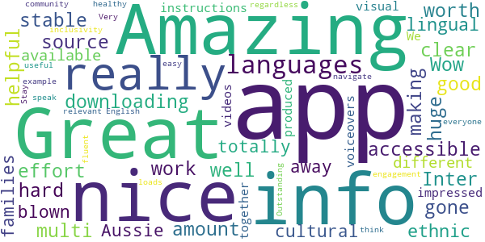

> Amazing app well worth downloading  :date: __2020-05-31 05:41:12__

> Great source of info, nice and clear  :date: __2020-05-27 13:18:57__

> Inter, good, stable  :date: __2020-05-27 12:17:06__

> Wow... really nice app with a huge amount of effort and hard work gone into making it accessible and helpful for our multi-lingual/-ethnic/-cultural Aussie families! I am totally blown away with all the different languages available and really impressed with the videos and visual instructions produced with voiceovers in those languages too.  We are all in it together regardless of how fluent we speak English. Outstanding example of community engagement & inclusivity!  Stay healthy everyone! 😊  :date: __2020-05-23 07:19:07__

> I think this is a very useful app.  :date: __2020-05-20 01:59:30__

> Amazing  :date: __2020-05-11 22:49:05__

> Great app! Very easy to navigate and loads of relevant info.  :date: __2020-04-26 12:57:58__

#### 4-star reviews

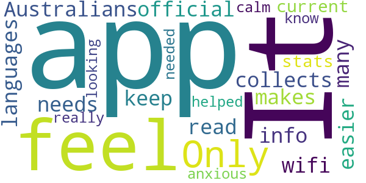

> Only app out there for Australians with so many languages.  :date: __2020-05-13 23:13:36__

> It needs wifi. It collects official info but makes it easier to read and keep up with current stats. I feel really anxious and this app helped me feel calm while I was looking up what I needed to know.  :date: __2020-04-27 07:31:18__

#### 3-star reviews

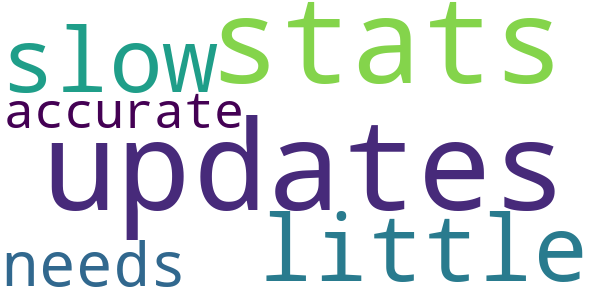

> updates on stats are a little slow needs to be more accurate  :date: __2020-07-15 20:20:30__

#### 2-star reviews

No recent reviews available with 2 stars.

#### 1-star reviews

> Could not get it to work.  :date: __2020-09-10 11:21:12__

> there are no more new case numbers for states for the day just totals the most important information is missing I have got to use worldometer now deleted..  :date: __2020-05-30 10:53:58__

# OpenWHO: Knowledge for Health Emergencies
App version ``3.7``

Analyzed with [covid-apps-observer](http://github.com/covid-apps-observer) project, version ``0.1``

## App overview
| | |
|-------------------------|-------------------------| 
| **Name**&nbsp;&nbsp;&nbsp;&nbsp;&nbsp;&nbsp;&nbsp;&nbsp;&nbsp;&nbsp;&nbsp;&nbsp;&nbsp;&nbsp;&nbsp;&nbsp;&nbsp;&nbsp;&nbsp;&nbsp;&nbsp;&nbsp;&nbsp;&nbsp;&nbsp;&nbsp;&nbsp;&nbsp;&nbsp;&nbsp;&nbsp;&nbsp;&nbsp;&nbsp;&nbsp;&nbsp;&nbsp;&nbsp;&nbsp;&nbsp;  | OpenWHO: Knowledge for Health Emergencies |
| **Unique identifier** | de.xikolo.openwho |
| **Link to Google Play** | [https://play.google.com/store/apps/details?id=de.xikolo.openwho](https://play.google.com/store/apps/details?id=de.xikolo.openwho) |
| **Summary**  | Life-saving knowledge for frontline responders in health emergencies. |
| **Privacy policy** | [https://openwho.org/pages/privacy](https://openwho.org/pages/privacy) |
| **Latest version** | 3.7 |
| **Last update** | 2020-11-23 13:57:15 |
| **Recent changes** | - Bug fixes and performance improvements |
| **Installs**  | 1,000,000+ |
| **Category** | Education |
| **First release** | May 17, 2017 |
| **Size**  | 18M |
| **Supported Android version**  | 5.0 and up |

### Description
> OpenWHO is the World Health Organization's (WHO) interactive knowledge-transfer platform offering online courses to improve the response to health emergencies. OpenWHO enables the Organization and its key partners to transfer life-saving knowledge to large numbers of frontline responders.
 With OpenWHO, you have the flexibility to learn at your convenience. Watch the short video lectures and test your knowledge with self-tests when and where you like. The course forum and the collaboration space allow you to get in touch with other participants and experts around the world.
  
 Designed primarily for health care workers, frontline responders, and decision-makers, the app is also a source of information for those affected by disease outbreaks and health emergencies, or for those with a general interest in WHO's work in health emergencies.
  
 It features 6 channels:
 - The <b>Outbreak</b> channel addresses the management of infectious diseases and provides life-saving, scientific information.
 - The <b>Ready for Response</b> channel helps prepare personnel who are training for deployment to work in disease outbreaks and health emergencies.
 - The <b>Get Social</b> channel focuses on social science-based interventions and helps to communicate with affected communities.
 - The <b>Preparing for Pandemics</b> channel brings together courses on various aspects of preparedness, including surveillance, public health measures and risk communication during a pandemic.
 - The <b>COVID-19</b> channel provides learning resources in WHO's 6 official languages (Arabic, Chinese, English, French, Russian and Spanish) for health professionals, decision-makers and the public for the outbreak of coronavirus disease (COVID-19).
 - The <b>COVID-19 National Languages</b> channel provides the same learning resources as the COVID-19 channel but in national languages, such as Indonesian, Japanese and Portuguese. 
  
 OpenWHO courses are available in many languages, including WHO's 6 official languages. 
  
 Download the app now, and join the OpenWHO community.
 This app is developed in cooperation between the Hasso Plattner Institute and the WHO. The learning content is provided exclusively by the WHO.

### User interface
The developers of the app provide the following screenshots in the Google play store.
| | | |
|:-------------------------:|:-------------------------:|:-------------------------:|
 |   |   |   | 
 |   |   | 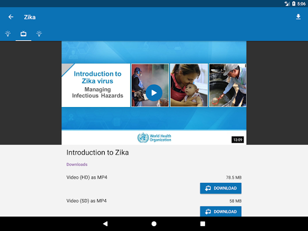  | 

## Development team
In the following we report the main information provided by the development team in the Google play store.

| | |
|-------------------------|-------------------------|
| **Developer**  | HPI Knowledge Engineering Team |
| **Website**  | [https://openwho.org/](https://openwho.org/) |
| **Email** | openwho-support@hpi.de |
| **Physical address**  | [Prof.-Dr.-Helmert-Str.2-3 14482 Potsdam](https://www.google.com/maps/search/Prof.-Dr.-Helmert-Str.2-3%2014482%20Potsdam) (Google Maps) |
| **Other developed apps**  | [https://play.google.com/store/apps/developer?id=7185448023325736337](https://play.google.com/store/apps/developer?id=7185448023325736337) |

## Android support

| | |
|-------------------------|-------------------------|
| **Declared target Android version**  | - |
| **Effective target Android version**  | - |
| **Minimum supported Android version**  | Lollipop, version 5.0 (API level 21) |
| **Maximum target Android version**  | - |

The larger the difference between the minimum and maximum supported Android versions, the better. A larger difference means a wider audience. For example, old phones have a very low Android version, so a high minimum supported Android version means that the app cannot be used by users with old phones, thus leading to accessibility problems. 

## Requested permissions

In the following we report the complete list of the permissions requested by the app. 

| **Permission** | **Protection level** | **Description** | 
|-------------------------|-------------------------|-------------------------|
 **android.permission ACCESS_NETWORK_STATE** | Normal | Allows applications to access information about networks. 
 **android.permission ACCESS_WIFI_STATE** | Normal | Allows applications to access information about Wi-Fi networks. 
 **android.permission DOWNLOAD_WITHOUT_NOTIFICATION** | - | - 
 **android.permission FOREGROUND_SERVICE** | Normal | Allows a regular application to use Service.startForeground. 
 **android.permission INTERNET** | Normal | Allows applications to open network sockets. 
 **android.permission RECEIVE_BOOT_COMPLETED** | Normal | Allows an application to receive the Intent.ACTION_BOOT_COMPLETED that is broadcast after the system finishes booting. 
 **android.permission WAKE_LOCK** | Normal | Allows using PowerManager WakeLocks to keep processor from sleeping or screen from dimming. 
 **android.permission WRITE_EXTERNAL_STORAGE** | :warning:**Dangerous** | Allows an application to write to external storage. 
 **com.google.android.c2dm.permission RECEIVE** | - | - 
 **com.google.android.finsky.permission BIND_GET_INSTALL_REFERRER_SERVICE** | - | - 

## Mentioned servers

| **Server** | **Registrant** | **Registrant country** | **Creation date** | 
|-------------------------|-------------------------|-------------------------|-------------------------|
 | googlesyndication.com | Google LLC | :us: US | 2003-01-21 06:17:24 |
 | google.com | Google LLC | :us: US | 1997-09-15 04:00:00 |
 | apple.com | Apple Inc. | :us: US | 1987-02-19 05:00:00 |
 | aomedia.org | Contact Privacy Inc. Customer 1243324949 | :canada: CA | 2015-08-24 14:07:31 |
 | dashif.org | VTM Group | :us: US | 2012-04-27 13:02:46 |
 | app-measurement.com | Google LLC | :us: US | 2015-06-19 20:13:31 |
 | w3.org | W3C | :us: US | 1994-07-06 04:00:00 |
 | googleapis.com | Google LLC | :us: US | 2005-01-25 17:52:26 |
 | psdev.de | - | - | - |
 | xmlpull.org | WhoisGuard, Inc. | PA | 2001-11-26 20:33:08 |
 | crashlytics.com | Google LLC | :us: US | 2011-01-21 15:30:40 |
 | apache.org | The Apache Software Foundation | :us: US | 1995-04-11 04:00:00 |
 | opensource.org | Open Source Initiative | :us: US | 1998-02-11 05:00:00 |
 | creativecommons.org | Creative Commons Corporation | :canada: CA | 2001-01-15 16:51:44 |
 | eclipse.org | Eclipse.org Foundation, Inc. | :canada: CA | 1997-04-14 04:00:00 |
 | gnu.org | Free Software Foundation | :us: US | 1995-11-24 05:00:00 |
 | mozilla.org | Mozilla Corporation | :us: US | 1998-01-24 05:00:00 |
 | googleadservices.com | Google LLC | :us: US | 2003-06-19 16:34:53 |

## Security analysis 

Below we report the main security warnings raised by our execution of the [Androwarn](https://github.com/maaaaz/androwarn) security analysis tool.

**Telephony identifiers leakage**
> - This application reads the ISO country code equivalent of the current registered operator's MCC (Mobile Country Code) 
> - This application reads the MCC+MNC of the provider of the SIM 

**Connection interfaces exfiltration**
> - This application reads details about the currently active data network 
> - This application tries to find out if the currently active data network is metered 

**Suspicious connection establishment**
> - This application opens a Socket and connects it to the remote address ' returned no addresses for  ; port is out of range' on the 'N/A' port  
> - This application opens a Socket and connects it to the remote address '' on the 'N/A' port  
> - This application opens a Socket and connects it to the remote address 'Ljava/lang/StringBuilder;->toString()Ljava/lang/String;' on the 'N/A' port  
> - This application opens a Socket and connects it to the remote address 'Ljava/net/Proxy;->type()Ljava/net/Proxy$Type;' on the 'N/A' port  
> - This application opens a Socket and connects it to the remote address 'timeout' on the 'N/A' port  

**Code execution**
> - This application loads a native library 

## User ratings and reviews

Below we provide information about how end users are reacting to the app in terms of ratings and reviews in the Google Play store.

### Ratings

The OpenWHO: Knowledge for Health Emergencies app has been installed by more than **1000000** times. At this time, **3403** rated the app and its average score is **4.2647057**. Below we show the distribution of the ratings across the usual star-based rating of Google Play

:star::star::star::star::star:: 2403

:star::star::star::star:: 370

:star::star::star:: 130

:star::star:: 130

:star:: 370

### Reviews 

#### 5-star reviews

> I love this app because it makes essay a lot.  :date: __2020-12-27 18:00:46__

> It's a great platform for me to send money 💰 safely  :date: __2020-12-15 14:26:31__

> Good  :date: __2020-12-08 16:01:38__

> + definitely a good app. I'm a fan  :date: __2020-12-03 11:12:16__

> I have no experience in use I heared ABOUT  :date: __2020-11-21 20:57:38__

> Enjoyable  :date: __2020-11-21 18:49:13__

> Fabulous  :date: __2020-11-13 13:19:20__

> Good  :date: __2020-11-06 18:32:20__

> Knowledgebase  :date: __2020-11-03 14:05:53__

> thank you so much for app developer  :date: __2020-10-26 06:14:47__

#### 4-star reviews

> WHO has offered great courses but we're expecting more courses within less time gap as it's been month's since WHO has launched any course.Secondly,there is no direct place offered in the WHO app to express our views.  :date: __2020-12-11 07:27:50__

> Online course class is use full  :date: __2020-07-17 11:52:09__

> Excellent information but less attractive for the most  :date: __2020-07-02 17:54:08__

> Good working  :date: __2020-06-28 08:53:05__

> Could you please host the videos also on YouTube, since we cannot access the Vimeo Platform here in Indonesia. Thank you.  :date: __2020-06-24 07:38:57__

> Good source of information  :date: __2020-06-20 09:36:05__

> Excellent Direction~  :date: __2020-06-19 14:08:55__

> Mast  :date: __2020-06-13 09:10:54__

> Good app of thh halt.  :date: __2020-05-31 05:25:43__

> Arch. eng.  :date: __2020-05-22 01:54:14__

#### 3-star reviews

> Good info  :date: __2020-12-24 16:44:57__

> I feel a bit disappointed, experienced a lot of errors. My module and videos can't be loaded.  :date: __2020-07-26 17:32:06__

> Great app, but my only problem is that I can't open my certificate file. Says invalid format. Disappointing 😭  :date: __2020-07-23 02:09:56__

> Videos were not working only, so I uninstalled it.  :date: __2020-07-18 08:42:28__

> I have finished two courses on two different date(one before midnight, another after midnight) but found same date on both while I downloaded Certificates. Why is this?  :date: __2020-06-11 19:18:50__

> covid  :date: __2020-06-11 18:37:22__

> Sir, Plzz improve the quality of the certificate awarded by the WHO to the participants to increase more & more participation as well as awareness of the people in this contest organised by OpenWHO.  :date: __2020-05-24 16:44:50__

> Some extent it's very good and its provide guidelines to advert disease.  :date: __2020-05-23 18:33:55__

> Nice app however difficult to watch video presentations  :date: __2020-05-14 19:35:42__

> Very confusing. not happy with the link. I don't know if I have done it correctly.  :date: __2020-05-12 22:12:31__

#### 2-star reviews

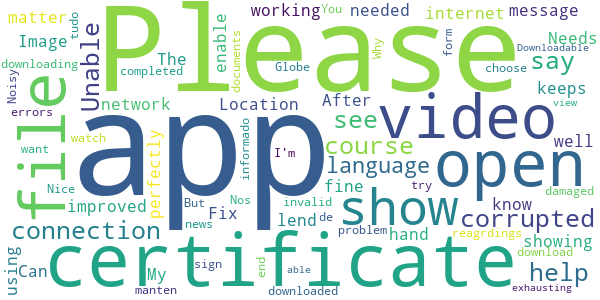

> Needs to be improved. Image don't show up . Fix needed  :date: __2020-12-23 15:51:31__

> The app keeps showing me this message (please enable network connection) when I open it, don't know why ?? My internet connection is working fine and I am using all the other apps perfectly well. Can you lend me a hand in this matter.  :date: __2020-11-08 08:31:34__

> After downloading the certificate at the end of the course when u try to open it. It says the file is corrupted or damaged  :date: __2020-09-23 14:26:48__

> Unable to watch the video or download the video.  :date: __2020-08-08 15:29:04__

> I can't open the certificate. Please help me out of this problem  :date: __2020-07-31 05:25:00__

> It shows errors again and again,Can't sign in  :date: __2020-06-26 16:11:53__

> I completed a course and then downloaded certificate it ... But I'm unable too see my certificate as it say corrupted file or invalid file. Please help with reagrdings to it.  :date: __2020-05-27 13:14:22__

> Noisy app.  :date: __2020-04-21 21:34:45__

> Nice  :date: __2020-04-09 16:25:41__

> Please , i want the App in the form of the Globe.  :date: __2020-04-05 14:35:33__

#### 1-star reviews

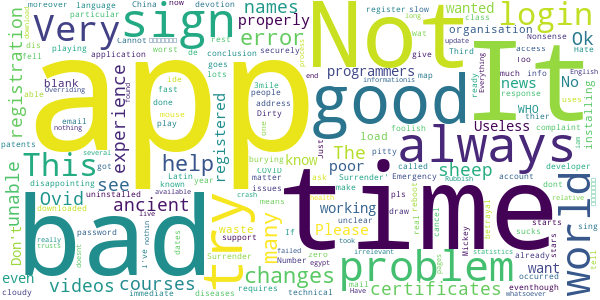

> The videos are not playing eventhough I've downloaded them  :date: __2020-11-03 10:43:38__

> “‘Ovid’ is Latin for a sheep. COVID starts with a C, which also means ‘see’ in ancient language. 19 was known as the “Number of Surrender” in ancient times.”  It goes on to draw the conclusion, “C-OVID 19 = ‘See a Sheep Surrender'”.  :date: __2020-11-02 08:04:58__

> Very bad experience i got unable to login very bad i fell worst experience  :date: __2020-09-26 10:55:02__

> Ok  :date: __2020-08-10 23:31:14__

> This is called an "Emergency" app but requires registration? Very disappointing.  :date: __2020-08-06 20:55:46__

> unable to make account and register, also not able to login.  :date: __2020-08-04 11:59:45__

> I can't Login no matter how much I try.  :date: __2020-07-04 14:19:09__

> This app is having technical issues  :date: __2020-07-03 17:13:33__

> Not a good application....It always changes names in certificates and it changes dates also moreover i have done courses and it changes there names also in certificates...so many problems...now what to do  :date: __2020-07-02 03:49:39__

> Not sign in properly many time errors.. Please help me out of this problem. I already registered a complaint that particular problem through mail.  :date: __2020-06-16 05:10:29__

# Check In CBR
App version ``1.3.2``

Analyzed with [covid-apps-observer](http://github.com/covid-apps-observer) project, version ``0.1``

## App overview
| | |
|-------------------------|-------------------------| 
| **Name**&nbsp;&nbsp;&nbsp;&nbsp;&nbsp;&nbsp;&nbsp;&nbsp;&nbsp;&nbsp;&nbsp;&nbsp;&nbsp;&nbsp;&nbsp;&nbsp;&nbsp;&nbsp;&nbsp;&nbsp;&nbsp;&nbsp;&nbsp;&nbsp;&nbsp;&nbsp;&nbsp;&nbsp;&nbsp;&nbsp;&nbsp;&nbsp;&nbsp;&nbsp;&nbsp;&nbsp;&nbsp;&nbsp;&nbsp;&nbsp;  | Check In CBR |
| **Unique identifier** | au.gov.act.health.checkin |
| **Link to Google Play** | [https://play.google.com/store/apps/details?id=au.gov.act.health.checkin](https://play.google.com/store/apps/details?id=au.gov.act.health.checkin) |
| **Summary**  | Fast, secure check in to Canberra businesses to support COVID-19 contact tracing |
| **Privacy policy** | [https://www.health.act.gov.au/privacy](https://www.health.act.gov.au/privacy) |
| **Latest version** | 1.3.2 |
| **Last update** | 2020-10-20 08:10:59 |
| **Recent changes** | Improvements, bug fixes. - Quick selection of recent guests on check-in - Open app when scanning QR code outside the app |
| **Installs**  | 10,000+ |
| **Category** | Health & Fitness |
| **First release** | Aug 31, 2020 |
| **Size**  | 54M |
| **Supported Android version**  | 5.0 and up |

### Description
> Quickly and securely check in to a Canberra business to support COVID-19 contact tracing. Simply scan the QR code displayed at the business, and you're done! 
 Your personal details are saved securely with ACT Health for the sole purpose of contact tracing.

### User interface
The developers of the app provide the following screenshots in the Google play store.
| | | |
|:-------------------------:|:-------------------------:|:-------------------------:|
 |   |   |   | 
 |  

## Development team
In the following we report the main information provided by the development team in the Google play store.

| | |
|-------------------------|-------------------------|
| **Developer**  | ACT Health |
| **Website**  | [https://covid19.act.gov.au/business-and-work/check-in-cbr](https://covid19.act.gov.au/business-and-work/check-in-cbr) |
| **Email** | Digital.Support@act.gov.au |
| **Physical address**  | - |
| **Other developed apps**  | [https://play.google.com/store/apps/developer?id=ACT+Health](https://play.google.com/store/apps/developer?id=ACT+Health) |

## Android support

| | |
|-------------------------|-------------------------|
| **Declared target Android version**  | Android10, version 10 (API level 29) |
| **Effective target Android version**  | Android10, version 10 (API level 29) |
| **Minimum supported Android version**  | Lollipop, version 5.0 (API level 21) |
| **Maximum target Android version**  | - |

The larger the difference between the minimum and maximum supported Android versions, the better. A larger difference means a wider audience. For example, old phones have a very low Android version, so a high minimum supported Android version means that the app cannot be used by users with old phones, thus leading to accessibility problems. 

## Requested permissions

In the following we report the complete list of the permissions requested by the app. 

| **Permission** | **Protection level** | **Description** | 
|-------------------------|-------------------------|-------------------------|
 **android.permission ACCESS_BACKGROUND_LOCATION** | :warning:**Dangerous** | Allows an app to access location in the background. 
 **android.permission ACCESS_NETWORK_STATE** | Normal | Allows applications to access information about networks. 
 **android.permission ACCESS_WIFI_STATE** | Normal | Allows applications to access information about Wi-Fi networks. 
 **android.permission CAMERA** | :warning:**Dangerous** | Required to be able to access the camera device. 
 **android.permission FOREGROUND_SERVICE** | Normal | Allows a regular application to use Service.startForeground. 
 **android.permission INTERNET** | Normal | Allows applications to open network sockets. 
 **android.permission MODIFY_AUDIO_SETTINGS** | Normal | Allows an application to modify global audio settings. 
 **android.permission READ_APP_BADGE** | - | - 
 **android.permission RECEIVE_BOOT_COMPLETED** | Normal | Allows an application to receive the Intent.ACTION_BOOT_COMPLETED that is broadcast after the system finishes booting. 
 **android.permission REQUEST_INSTALL_PACKAGES** | Signature | Allows an application to request installing packages. 
 **android.permission STORAGE** | - | - 
 **android.permission SYSTEM_ALERT_WINDOW** | Signature - preinstalled - appop - pre23 - development | Allows an app to create windows using the type WindowManager.LayoutParams.TYPE_APPLICATION_OVERLAY, shown on top of all other apps. 
 **android.permission USE_BIOMETRIC** | Normal | Allows an app to use device supported biometric modalities. 
 **android.permission WAKE_LOCK** | Normal | Allows using PowerManager WakeLocks to keep processor from sleeping or screen from dimming. 
 **au.gov.act.health.checkin.permission C2D_MESSAGE** | - | - 
 **com.google.android.c2dm.permission RECEIVE** | - | - 
 **com.google.android.finsky.permission BIND_GET_INSTALL_REFERRER_SERVICE** | - | - 
 **com.huawei.android.launcher.permission CHANGE_BADGE** | - | - 
 **com.huawei.android.launcher.permission READ_SETTINGS** | - | - 
 **com.huawei.android.launcher.permission WRITE_SETTINGS** | - | - 
 **com.oppo.launcher.permission READ_SETTINGS** | - | - 
 **com.oppo.launcher.permission WRITE_SETTINGS** | - | - 
 **com.sonymobile.home.permission PROVIDER_INSERT_BADGE** | - | - 
 **host.exp.exponent.permission C2D_MESSAGE** | - | - 
 **me.everything.badger.permission BADGE_COUNT_READ** | - | - 
 **me.everything.badger.permission BADGE_COUNT_WRITE** | - | - 

## Mentioned servers

| **Server** | **Registrant** | **Registrant country** | **Creation date** | 
|-------------------------|-------------------------|-------------------------|-------------------------|
 | amplitude.com | Amplitude | :us: US | 1996-05-09 04:00:00 |
 | facebook.com | Facebook, Inc. | :us: US | 1997-03-29 05:00:00 |
 | google.com | Google LLC | :us: US | 1997-09-15 04:00:00 |
 | android.com | Google LLC | :us: US | 1997-06-23 04:00:00 |
 | googlesyndication.com | Google LLC | :us: US | 2003-01-21 06:17:24 |
 | googleapis.com | Google LLC | :us: US | 2005-01-25 17:52:26 |
 | w3.org | W3C | :us: US | 1994-07-06 04:00:00 |
 | doubleclick.net | Google Inc. | :us: US | 1996-01-16 05:00:00 |
 | gstatic.com | Google LLC | :us: US | 2008-02-11 15:31:25 |
 | googleapis.com | Google LLC | :us: US | 2005-01-25 17:52:26 |
 | app-measurement.com | Google LLC | :us: US | 2015-06-19 20:13:31 |
 | google-analytics.com | Google LLC | :us: US | 2005-07-18 19:24:32 |
 | segment.com | Domains By Proxy, LLC | :us: US | 1998-07-06 04:00:00 |
 | segment.io | Segment.io, Inc. | :us: US | 2011-10-01 04:10:05 |
 | expo.io | See PrivacyGuardian.org | :us: US | 2011-05-01 21:26:50 |
 | cloudfront.net | Amazon.com, Inc. | :us: US | 2008-04-25 18:25:49 |
 | cloudfront.net | Amazon.com, Inc. | :us: US | 2008-04-25 18:25:49 |
 | googleadservices.com | Google LLC | :us: US | 2003-06-19 16:34:53 |

## Security analysis 

Below we report the main security warnings raised by our execution of the [Androwarn](https://github.com/maaaaz/androwarn) security analysis tool.

**Telephony identifiers leakage**
> - This application reads the ISO country code equivalent for the SIM provider's country code 
> - This application reads the ISO country code equivalent of the current registered operator's MCC (Mobile Country Code) 
> - This application reads the MCC+MNC of the provider of the SIM 
> - This application reads the Service Provider Name (SPN) 
> - This application reads the constant indicating the state of the device SIM card 
> - This application reads the device phone type value 
> - This application reads the numeric name (MCC+MNC) of current registered operator 
> - This application reads the operator name 
> - This application reads the radio technology (network type) currently in use on the device for data transmission 
> - This application reads the unique device ID, i.e the IMEI for GSM and the MEID or ESN for CDMA phones 

**Location lookup**
> - This application reads location information from all available providers (WiFi, GPS etc.) 

**Connection interfaces exfiltration**
> - This application reads details about the currently active data network 
> - This application tries to find out if the currently active data network is metered 

**Telephony services abuse**
> - This application makes phone calls 

**Audio video eavesdropping**
> - This application records audio from the 'CAMCORDER' source  
> - This application records audio from the 'DEFAULT' source  
> - This application records audio from the 'MIC' source  
> - This application captures video from the 'CAMERA' source 
> - This application captures video from the 'SURFACE' source 

**Suspicious connection establishment**
> - This application opens a Socket and connects it to the remote address '' on the 'N/A' port  
> - This application opens a Socket and connects it to the remote address 'Ljava/lang/StringBuilder;->toString()Ljava/lang/String;' on the ': connect, resolve' port  
> - This application opens a Socket and connects it to the remote address 'Ljava/lang/StringBuilder;->toString()Ljava/lang/String;' on the 'N/A' port  
> - This application opens a Socket and connects it to the remote address 'Ljava/net/Proxy;->type()Ljava/net/Proxy$Type;' on the 'N/A' port  
> - This application opens a Socket and connects it to the remote address 'timeout' on the 'N/A' port  

**Pim data leakage**
> - This application accesses data stored in the clipboard 

**Code execution**
> - This application loads a native library 
> - This application loads a native library: 'Ljava/lang/String;->valueOf(Ljava/lang/Object;)Ljava/lang/String;' 
> - This application executes a UNIX command containing this argument: '2' 

## User ratings and reviews

Below we provide information about how end users are reacting to the app in terms of ratings and reviews in the Google Play store.

### Ratings

The Check In CBR app has been installed by more than **10000** times. At this time, **32** rated the app and its average score is **3.78125**. Below we show the distribution of the ratings across the usual star-based rating of Google Play

:star::star::star::star::star:: 19

:star::star::star::star:: 3

:star::star::star:: 2

:star::star:: 0

:star:: 8

### Reviews 

#### 5-star reviews

> Cool app! I prefer this much more than writing my name down with a pen 50 other people have used that day. Great to see more places in Canberra are using it too.  :date: __2020-12-08 02:50:38__

> Red es DVR DVR you vf you have any other information you can get the best regards  :date: __2020-11-29 09:24:49__

> Used it a few times at the library, worked quickly, easily, and without issue. Wish more places would use this.  :date: __2020-11-10 07:32:34__

> Now that you remember frequent guests (eg, my husband) it takes under 5 seconds to check in. Great job.  :date: __2020-10-29 02:09:59__

> Good job Canberra! This is more in line with the privacy requirements than signing a sheet of paper.  :date: __2020-10-16 02:40:40__

> Works really well, much better than using a google form  :date: __2020-10-06 11:10:27__

> Easy to use but don't just scan QR and expect app to open. The QR does nothing but open a website, thats what they mostly do. Scanning a QR will just take you to website to download. It will not open app. Once I downloaded app and added my details, I clicked check in and then I scanned the QR (after giving app permission) Easy.  :date: __2020-10-05 02:41:02__

> Quick and easy to use, really good!  :date: __2020-09-27 10:53:21__

> Much quicker and easier to use than scanning a QR code to click to load a website and manually entering your details. Better security is a plus too, it'd be hard to tell if random QR code is linking to a legit website or not.  :date: __2020-09-27 06:20:23__

> Good!  :date: __2020-09-18 08:06:04__

#### 4-star reviews

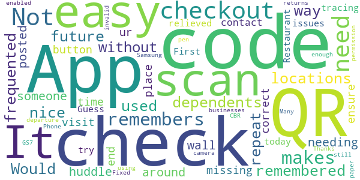

> Its missing a checkout button to end ur visit to a place. It needs a time out to ensure correct contact tracing  :date: __2020-12-09 02:30:00__

> First try today - so very relieved to have no issues at Restaurant. Guess there's no need to checkout on departure?  :date: __2020-12-04 03:55:33__

> Not enough businesses on it. Many still using pen and paper.  :date: __2020-10-17 05:00:51__

> Samsung GS7 will not scan QR code. App has camera permission enabled. Phone will scan QR codes, but not in this app. Fixed! Thanks! App now returns "Not a check in CBR code" on invalid QR scans  :date: __2020-10-02 04:18:26__

#### 3-star reviews

> Takes ages to open the camera scanner function.  :date: __2020-12-09 09:13:41__

> Seems to work ok. Slow to load, requiring data connection to do so. Cannot access QR code scanner without data connection. Suggest allowing access to QR code scanner without needing data connection to allow check in, uploading locations when data becomes available.  :date: __2020-12-05 21:58:59__

> Would be better if you could check in by typing name of check-in place, geolocation, or select from previous check-in history.  :date: __2020-11-15 01:20:33__

> Works for some places, not others, it just says enter manually code  :date: __2020-10-08 23:36:53__

> The App has not changed to daylight savings.  :date: __2020-10-06 01:02:09__

#### 2-star reviews

> Takes to long to download  :date: __2020-12-06 04:07:36__

> App fails to install, despite several attempts...says it is installed but goes back tp wil instal shortly.....  :date: __2020-11-11 09:29:39__

#### 1-star reviews

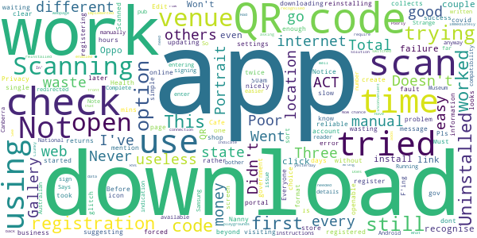

> Three times tried to create an account, but it doesn't go beyond the registration page and the Privacy Notice. Must be a glitch in the app. Pls sort it out.  :date: __2020-12-26 00:29:29__

> Doesn't work. Tried reinstalling twice and still returns error message about no registered business location at every shop I've tried. Worked for others but not me. Manual also doesn't work.  :date: __2020-12-24 03:21:51__

> I was forced to get this app that collects information on you for the gov. F'ing Nanny State.  :date: __2020-12-24 00:53:00__

> First time ever since covid started, I have to download app to register. Everyone is using a simple and reliable web registration. Total waste of our money by ACT government. Poor choice of registering option by Portrait Gallery Cafe. Portrait Gallery itself is nicely using web registration. Not to mention, this slow app is to be uninstalled after that single use. Not good enough, ACT Health.  :date: __2020-12-20 05:53:42__

> Useless did not download in openable format with screen icon and no clear instructions how to do this  :date: __2020-12-17 21:22:12__

> It won't work never get number  :date: __2020-12-05 07:21:05__

> Didn't recognise QR codes at a pub and at the Australian National Museum. Strange as other QR code reader redirected me to this Canberra Check in app anyway. Android / Oppo  :date: __2020-11-25 22:13:55__

> Won't install!! Running a Samsung Note 10 so shouldn't be a compatibility issue!!  :date: __2020-11-14 04:53:26__

> Complete failure. Says enter code but no indication of where to get code.  :date: __2020-11-04 00:06:22__

> This app does not work. I've tried at 3 different locations and it has not worked once. Scanning a QR code and entering details manually was far easier. So now have to use written sign in if available or not bother signing in (playgrounds)  :date: __2020-10-27 04:01:35__

# Service NSW
App version ``4.32.0 (175915)``

Analyzed with [covid-apps-observer](http://github.com/covid-apps-observer) project, version ``0.1``

## App overview
| | |
|-------------------------|-------------------------| 
| **Name**&nbsp;&nbsp;&nbsp;&nbsp;&nbsp;&nbsp;&nbsp;&nbsp;&nbsp;&nbsp;&nbsp;&nbsp;&nbsp;&nbsp;&nbsp;&nbsp;&nbsp;&nbsp;&nbsp;&nbsp;&nbsp;&nbsp;&nbsp;&nbsp;&nbsp;&nbsp;&nbsp;&nbsp;&nbsp;&nbsp;&nbsp;&nbsp;&nbsp;&nbsp;&nbsp;&nbsp;&nbsp;&nbsp;&nbsp;&nbsp;  | Service NSW |
| **Unique identifier** | au.gov.nsw.service |
| **Link to Google Play** | [https://play.google.com/store/apps/details?id=au.gov.nsw.service](https://play.google.com/store/apps/details?id=au.gov.nsw.service) |
| **Summary**  | Digital licences, registrations, fines and more |
| **Privacy policy** | [http://www.service.nsw.gov.au/privacy](http://www.service.nsw.gov.au/privacy) |
| **Latest version** | 4.32.0 (175915) |
| **Last update** | 2020-12-16 08:18:33 |
| **Recent changes** | Thanks for using the Service NSW app! We used your feedback to make these improvements.  • Made the app faster to get your account details when using COVID Safe Check-in  • Better onscreen messaging for privacy information and when something goes wrong • Fixed a bug where larger font sizes weren&#39;t working properly on fingerprint log in screen |
| **Installs**  | 1,000,000+ |
| **Category** | Tools |
| **First release** | Dec 7, 2014 |
| **Size**  | 25M |
| **Supported Android version**  | 6.0 and up |

### Description
> The official Service NSW app, making it easier to access government services. 
 <b>Digital licences and credentials</b>
 Access the following digital licences and credentials, with more to come: 
 • Driver Licence 
 • RSA/RCG Competency Card 
 • Working with Children Check 
 • Recreational Fishing Licence 
 • Boat Driver Licence.
 <b>COVID Safe Check-in</b> 
 • Quick, contactless check in at COVID Safe venues 
 • Point your device camera at the COVID Safe QR Code to get started 
 • Save your details for a faster check in next time. 
 <b>Useful tools and services</b>
 • Verify a Digital Driver Licence via our licence checker 
 • Check or renew a registration 
 • Sign into licensed venues.
 <b>Fines and demerits</b>
 • View and pay your fines 
 • View your demerits.
 <b>COVID-19 resources</b>
 • Access COVID-19 statistics by postcode 
 • Access our COVID-19 Assistance Finder with benefits, rebates and concessions. 
 <b>Tell us what you think</b>
 • Help us help you! We’re always working on a better, stronger, faster app. 
 • Share what you’d like to see in the app: we use your feedback to continuously improve the app experience.

### User interface
The developers of the app provide the following screenshots in the Google play store.
| | | |
|:-------------------------:|:-------------------------:|:-------------------------:|
 |   |   |   | 
 |   |  

## Development team
In the following we report the main information provided by the development team in the Google play store.

| | |
|-------------------------|-------------------------|
| **Developer**  | Service NSW |
| **Website**  | [https://www.service.nsw.gov.au/mobile-app      ](https://www.service.nsw.gov.au/mobile-app      ) |
| **Email** | mobileapp@service.nsw.gov.au |
| **Physical address**  | - |
| **Other developed apps**  | [https://play.google.com/store/apps/developer?id=Service+NSW](https://play.google.com/store/apps/developer?id=Service+NSW) |

## Android support

| | |
|-------------------------|-------------------------|
| **Declared target Android version**  | Android10, version 10 (API level 29) |
| **Effective target Android version**  | Android10, version 10 (API level 29) |
| **Minimum supported Android version**  | Marshmallow, version 6.0 (API level 23) |
| **Maximum target Android version**  | - |

The larger the difference between the minimum and maximum supported Android versions, the better. A larger difference means a wider audience. For example, old phones have a very low Android version, so a high minimum supported Android version means that the app cannot be used by users with old phones, thus leading to accessibility problems. 

## Requested permissions

In the following we report the complete list of the permissions requested by the app. 

| **Permission** | **Protection level** | **Description** | 
|-------------------------|-------------------------|-------------------------|
 **android.permission ACCESS_NETWORK_STATE** | Normal | Allows applications to access information about networks. 
 **android.permission ACCESS_WIFI_STATE** | Normal | Allows applications to access information about Wi-Fi networks. 
 **android.permission CAMERA** | :warning:**Dangerous** | Required to be able to access the camera device. 
 **android.permission INTERNET** | Normal | Allows applications to open network sockets. 
 **android.permission READ_APP_BADGE** | - | - 
 **android.permission READ_EXTERNAL_STORAGE** | :warning:**Dangerous** | Allows an application to read from external storage. 
 **android.permission USE_FINGERPRINT** | Normal | This constant was deprecated in API level 28. Applications should request USE_BIOMETRIC instead 
 **android.permission VIBRATE** | Normal | Allows access to the vibrator. 
 **android.permission WAKE_LOCK** | Normal | Allows using PowerManager WakeLocks to keep processor from sleeping or screen from dimming. 
 **android.permission WRITE_EXTERNAL_STORAGE** | :warning:**Dangerous** | Allows an application to write to external storage. 
 **com.anddoes.launcher.permission UPDATE_COUNT** | - | - 
 **com.android.vending CHECK_LICENSE** | - | - 
 **com.google.android.c2dm.permission RECEIVE** | - | - 
 **com.google.android.finsky.permission BIND_GET_INSTALL_REFERRER_SERVICE** | - | - 
 **com.htc.launcher.permission READ_SETTINGS** | - | - 
 **com.htc.launcher.permission UPDATE_SHORTCUT** | - | - 
 **com.huawei.android.launcher.permission CHANGE_BADGE** | - | - 
 **com.huawei.android.launcher.permission READ_SETTINGS** | - | - 
 **com.huawei.android.launcher.permission WRITE_SETTINGS** | - | - 
 **com.majeur.launcher.permission UPDATE_BADGE** | - | - 
 **com.oppo.launcher.permission READ_SETTINGS** | - | - 
 **com.oppo.launcher.permission WRITE_SETTINGS** | - | - 
 **com.sec.android.provider.badge.permission READ** | - | - 
 **com.sec.android.provider.badge.permission WRITE** | - | - 
 **com.sonyericsson.home.permission BROADCAST_BADGE** | - | - 
 **com.sonymobile.home.permission PROVIDER_INSERT_BADGE** | - | - 
 **me.everything.badger.permission BADGE_COUNT_READ** | - | - 
 **me.everything.badger.permission BADGE_COUNT_WRITE** | - | - 

## Mentioned servers

| **Server** | **Registrant** | **Registrant country** | **Creation date** | 
|-------------------------|-------------------------|-------------------------|-------------------------|
 | apache.org | The Apache Software Foundation | :us: US | 1995-04-11 04:00:00 |
 | xml.org | OASIS Open | :us: US | 1997-02-03 05:00:00 |
 | w3.org | W3C | :us: US | 1994-07-06 04:00:00 |
 | purl.org | Internet Archive | :us: US | 1996-01-01 05:00:00 |
 | adobe.com | Adobe Inc. | :us: US | 1986-11-17 05:00:00 |
 | android.com | Google LLC | :us: US | 1997-06-23 04:00:00 |
 | googlesyndication.com | Google LLC | :us: US | 2003-01-21 06:17:24 |
 | google.com | Google LLC | :us: US | 1997-09-15 04:00:00 |
 | app-measurement.com | Google LLC | :us: US | 2015-06-19 20:13:31 |
 | googleapis.com | Google LLC | :us: US | 2005-01-25 17:52:26 |
 | googleapis.com | Google LLC | :us: US | 2005-01-25 17:52:26 |
 | iptc.org | Whois Privacy Service | :us: US | 1995-12-27 05:00:00 |
 | useplus.org | PLUS COALITION | :us: US | 2003-11-18 19:31:25 |
 | npes.org | NPES | :us: US | 1996-01-30 05:00:00 |
 | aiim.org | Association for Information and Image Management International | :us: US | 1995-10-18 04:00:00 |
 | googleapis.com | Google LLC | :us: US | 2005-01-25 17:52:26 |
 | googleapis.com | Google LLC | :us: US | 2005-01-25 17:52:26 |
 | googleadservices.com | Google LLC | :us: US | 2003-06-19 16:34:53 |

## Security analysis 

Below we report the main security warnings raised by our execution of the [Androwarn](https://github.com/maaaaz/androwarn) security analysis tool.

**Telephony identifiers leakage**
> - This application reads the numeric name (MCC+MNC) of current registered operator 
> - This application reads the operator name 
> - This application reads the phone number string for line 1, for example, the MSISDN for a GSM phone 
> - This application reads the unique device ID, i.e the IMEI for GSM and the MEID or ESN for CDMA phones 

**Location lookup**
> - This application reads location information from all available providers (WiFi, GPS etc.) 

**Connection interfaces exfiltration**
> - This application reads details about the currently active data network 
> - This application tries to find out if the currently active data network is metered 

**Audio video eavesdropping**
> - This application records audio from the 'CAMCORDER' source  
> - This application records audio from the 'MIC' source  
> - This application captures video from the 'CAMERA' source 
> - This application captures video from the 'SURFACE' source 

**Suspicious connection establishment**
> - This application opens a Socket and connects it to the remote address '' on the 'N/A' port  
> - This application opens a Socket and connects it to the remote address 'Ljava/lang/StringBuilder;->toString()Ljava/lang/String;' on the ': connect, resolve' port  
> - This application opens a Socket and connects it to the remote address 'Ljava/lang/StringBuilder;->toString()Ljava/lang/String;' on the 'N/A' port  
> - This application opens a Socket and connects it to the remote address 'Ljava/net/Proxy;->type()Ljava/net/Proxy$Type;' on the 'N/A' port  
> - This application opens a Socket and connects it to the remote address 'Network subsystem is unavailable' on the 'N/A' port  
> - This application opens a Socket and connects it to the remote address 'timeout' on the 'N/A' port  

**Pim data leakage**
> - This application accesses data stored in the clipboard 

**Code execution**
> - This application loads a native library 
> - This application loads a native library: 'Ljava/util/Iterator;->next()Ljava/lang/Object;' 
> - This application loads a native library: 'log' 
> - This application loads a native library: 'sentry' 
> - This application loads a native library: 'sentry-android' 
> - This application loads a native library: 'tool-checker' 
> - This application executes a UNIX command 

## User ratings and reviews

Below we provide information about how end users are reacting to the app in terms of ratings and reviews in the Google Play store.

### Ratings

The Service NSW app has been installed by more than **1000000** times. At this time, **4196** rated the app and its average score is **4.424144**. Below we show the distribution of the ratings across the usual star-based rating of Google Play

:star::star::star::star::star:: 2862

:star::star::star::star:: 794

:star::star::star:: 219

:star::star:: 102

:star:: 219

### Reviews 

#### 5-star reviews

> Good  :date: __2020-12-26 07:24:32__

> Is no working the QR. now it's working fine. Thanks  :date: __2020-12-26 00:42:27__

> Thank you  :date: __2020-12-24 07:06:23__

> Excellent  :date: __2020-12-23 01:11:08__

> Excellent service.  :date: __2020-12-21 08:20:27__

> Satisfactory  :date: __2020-12-17 23:43:55__

> Simple to use, it's very helpful  :date: __2020-12-17 11:04:49__

> Good App that lets me check licence and registration  :date: __2020-12-17 10:51:55__

> A Good app  :date: __2020-12-17 08:59:46__

> Very good app and useful as well .cheers I love it  :date: __2020-12-17 07:03:27__

#### 4-star reviews

> With Service NSW QR codes about to become mandatory, I'd like to see the following things to come up to five stars: - a widget to create a shortcut on your home screen directly to the QR check-in function - a persistent notification while you're checked in somewhere with a shortcut to check out - ability to save details of frequent companions so that you can quickly and easily check them in with you.  :date: __2020-12-28 05:40:57__

> A pain to set up but easy to use once it is going  :date: __2020-12-17 12:46:54__

> Issue resolved by reinstalling app :) TY! Check-in option is great feature. Would suggest adding optional location based notification for when you leave a venue so you can checkout right away. Keep up the good work folks!  :date: __2020-12-17 01:18:45__

> Vulnerable  :date: __2020-12-14 23:11:56__

> There should be only one kind of QR Scan, it is too confusing and very frustrating  :date: __2020-12-12 04:56:32__

> Easy to use, but not all Riverina venues use it. What are its limitations?  :date: __2020-12-12 04:32:42__

> Only used it once.. it worked ok, but I had to copy and paste confirmation numbers. I don't like the way that some venues don't use the dot Gov website. You have to entrust your information with strangers. If this is law that we must comply with.. venues should use the same website. The app for ACT is less intrusive.  :date: __2020-12-12 04:23:05__

> Current HTC phone with updated Android OS. This app appears to auto update, ignoring the settings to not do so on the phone. This then crashes the badly written app for managing my hearing aids and needs a 40 minute process to remove and reinstall the hearing aid app and reset the hearing aids.  :date: __2020-12-11 23:05:42__

> It was ok  :date: __2020-12-11 22:53:12__

> Good  :date: __2020-12-11 22:34:44__

#### 3-star reviews

> Problematic in use  :date: __2020-12-24 05:51:22__

> Licensed needs to be more accessible for quick access  :date: __2020-12-22 22:14:27__

> Haven't been able to get the COVID check in to work at any venues. Staff always say it never works on Samsung phones. Everything else is good that I've used in the app, but not being able to check in anywhere is annoying.  :date: __2020-12-22 10:54:51__

> The App wont work on my pure android Nokia7+ because i choose to have all permissions that can be denied...denied and still have the phone operate as a phone. My phone is factory standard and hasn't had the operating system modified in any way. The fact that I don't log in to google shouldn't prevent me from accessing my details held by the government....simple two factor authentication is all that is needed for security. So now it works.....and when it works it is handy.  :date: __2020-12-22 02:06:53__

> Service NSW covid safe app uses NSW time but Broken Hill in FW NSW is on SA time so the times recorded are 1/2 out.  :date: __2020-12-20 01:15:25__

> It takes too long to open the app, wait for it to load, then eventually find the COVID check-in section, all while people are queueing behind you! Please include a long-tap shortcut that immediately opens the scanner section without all this rigmarole.  :date: __2020-12-18 21:54:57__

> I have uninstalled & installed again hoping it will work now Thanks  :date: __2020-12-18 03:12:53__

> Not working right  :date: __2020-12-11 11:18:49__

> the old app was good and easy.but getting used to it.  :date: __2020-12-11 11:04:24__

> Unnecessarily convoluted but useful  :date: __2020-12-11 07:36:30__

#### 2-star reviews

> The covid checkin will not on Oppo A57 it is definitely service Nsw QR Code. It works fine on my Samsung Galaxy note 7. Can you update for Oppo??  :date: __2020-12-27 09:40:51__

> Scanned the icon successfully the other day. Since then,am asked for a pin # and doesn't accept any I input  :date: __2020-12-22 06:14:34__

> I have only used it to check into the RTA but it worked  :date: __2020-12-22 00:49:50__

> Buggy - won't link my licence.  :date: __2020-12-20 10:30:38__

> Nothing works. Never recognises my email or password. Can't find my licence or where to add it  :date: __2020-12-20 07:20:28__

> It will not read QR codes says they are not gov codes when the are. So useless for that  :date: __2020-12-20 05:22:46__

> Ok have tried to down load the covid app now for many weeks. It always tells me that something went wrong at their end and will not complete. IF YOU WANT US TO USE IT , FIX IT.  :date: __2020-12-19 02:00:27__

> I have poor internet service by the time i get the code the app wont accept it even though its about 10 to 20mins . I give up. Will see if i can actually speak to someone.  :date: __2020-12-18 11:17:18__

> The number of businesses that have a different scan are too many. This one doesn't register.  :date: __2020-12-18 03:07:54__

> This app was so useful, even just the times I had forgotten to take my wallet with me. Although, I'm unsure if it's an app update or something on my end but the app no longer works at all. When I try to log in I get a message that says " It looks like your device may be using non-standard software" I have the same SG20+ & it definitely has the original OS, doesn't have any ROMs, and has been certified by Google. I'd love for someone to point me in the direction of how to fix this, Thank you :)  :date: __2020-12-12 03:20:16__

#### 1-star reviews

> Inaccessible. Allows drivers licence scan, but not photo id or any disability related info. In other words it neglects us. Typical nsw govt attitude. QR codes are not accessible to people with vision loss . No alternative. Typical nsw govt. Also you Put fishing licences above anyone with photo id. Poor priorities there. Both are easy to set up but you ignore disabled people. Your IT people should have a long hard think. Equity must be addressed.  :date: __2020-12-28 11:20:51__

> Tried using the app DOESN'T WORK tried multi times.  :date: __2020-12-28 05:07:43__

> Doesnt allow me to put in code..must put email again..then code is invalid  :date: __2020-12-28 02:22:23__

> Why would I give this nsw covid app access to my phone photos, storage files. Piss off  :date: __2020-12-27 23:16:46__

> Too hard for seniors to download. We Ness easy prompts to follow. Don't know if it's ready to use or not  :date: __2020-12-27 19:00:59__

> Does not work  :date: __2020-12-27 11:01:34__

> Asked me for a 'strong' password. One that I won't remember, probably. I'm only registering to check in for COVID, not to access financial personal info! You had already verified my email. What more do you need? So, no thanks, Service NSW. I used the web form which was quick and painless and only wanted my name and phone number.  :date: __2020-12-27 07:24:50__

> Ap wont download. 3rd attempt. Waste of time.  :date: __2020-12-26 21:06:33__

> Wouldn't up load  :date: __2020-12-26 03:31:39__

> Covid safe checkin never works for my mobile Samsung gslaxy with latest android. Every time i have to record my details manually.  :date: __2020-12-24 12:10:40__

# Bupa Aged Care Connect
App version ``1.2``

Analyzed with [covid-apps-observer](http://github.com/covid-apps-observer) project, version ``0.1``

## App overview
| | |
|-------------------------|-------------------------| 
| **Name**&nbsp;&nbsp;&nbsp;&nbsp;&nbsp;&nbsp;&nbsp;&nbsp;&nbsp;&nbsp;&nbsp;&nbsp;&nbsp;&nbsp;&nbsp;&nbsp;&nbsp;&nbsp;&nbsp;&nbsp;&nbsp;&nbsp;&nbsp;&nbsp;&nbsp;&nbsp;&nbsp;&nbsp;&nbsp;&nbsp;&nbsp;&nbsp;&nbsp;&nbsp;&nbsp;&nbsp;&nbsp;&nbsp;&nbsp;&nbsp;  | Bupa Aged Care Connect |
| **Unique identifier** | mycc.cic.bupaconnect |
| **Link to Google Play** | [https://play.google.com/store/apps/details?id=mycc.cic.bupaconnect](https://play.google.com/store/apps/details?id=mycc.cic.bupaconnect) |
| **Summary**  | Bupa Aged Care Connect helps your families and employees during COVID-19. |
| **Privacy policy** | [https://www.checkedincare.com.au/privacypolicy.html](https://www.checkedincare.com.au/privacypolicy.html) |
| **Latest version** | 1.2 |
| **Last update** | 2020-12-07 03:13:55 |
| **Recent changes** | - |
| **Installs**  | 1,000+ |
| **Category** | Health & Fitness |
| **First release** | Apr 3, 2020 |
| **Size**  | 49M |
| **Supported Android version**  | 5.0 and up |

### Description
> Features:
 * up-to-date Bupa Aged Care communications on COVID-19
 * direct messages from Bupa Aged Care homes to families and employees
 * resources and support including COVID-19 government health advice, dementia care and 
    wellbeing tips
 * details of Bupa’s COVID-19 information line and our care home contact details
 * updates and information about life in our homes during COVID-19.
  
 NOTE: This app is not suitable for seeking medical attention in an emergency.

### User interface
The developers of the app provide the following screenshots in the Google play store.
| | | |
|:-------------------------:|:-------------------------:|:-------------------------:|
 |   |   |   | 

## Development team
In the following we report the main information provided by the development team in the Google play store.

| | |
|-------------------------|-------------------------|
| **Developer**  | CheckedIn Care |
| **Website**  | [https://www.checkedincare.com.au](https://www.checkedincare.com.au) |
| **Email** | cc@checkedincare.com.au |
| **Physical address**  | - |
| **Other developed apps**  | [https://play.google.com/store/apps/developer?id=CheckedIn+Care](https://play.google.com/store/apps/developer?id=CheckedIn+Care) |

## Android support

| | |
|-------------------------|-------------------------|
| **Declared target Android version**  | Android10, version 10 (API level 29) |
| **Effective target Android version**  | Android10, version 10 (API level 29) |
| **Minimum supported Android version**  | Lollipop, version 5.0 (API level 21) |
| **Maximum target Android version**  | - |

The larger the difference between the minimum and maximum supported Android versions, the better. A larger difference means a wider audience. For example, old phones have a very low Android version, so a high minimum supported Android version means that the app cannot be used by users with old phones, thus leading to accessibility problems. 

## Requested permissions

In the following we report the complete list of the permissions requested by the app. 

| **Permission** | **Protection level** | **Description** | 
|-------------------------|-------------------------|-------------------------|
 **android.permission ACCESS_FINE_LOCATION** | :warning:**Dangerous** | Allows an app to access precise location. 
 **android.permission ACCESS_NETWORK_STATE** | Normal | Allows applications to access information about networks. 
 **android.permission ACCESS_NOTIFICATION_POLICY** | Normal | Marker permission for applications that wish to access notification policy. 
 **android.permission ACCESS_WIFI_STATE** | Normal | Allows applications to access information about Wi-Fi networks. 
 **android.permission BLUETOOTH** | Normal | Allows applications to connect to paired bluetooth devices. 
 **android.permission BROADCAST_STICKY** | Normal | Allows an application to broadcast sticky intents. 
 **android.permission CAMERA** | :warning:**Dangerous** | Required to be able to access the camera device. 
 **android.permission CAPTURE_VIDEO_OUTPUT** | - | - 
 **android.permission DISABLE_KEYGUARD** | Normal | Allows applications to disable the keyguard if it is not secure. 
 **android.permission GET_TASKS** | Deprecated | This constant was deprecated in API level 21. No longer enforced. 
 **android.permission INTERNET** | Normal | Allows applications to open network sockets. 
 **android.permission MODIFY_AUDIO_SETTINGS** | Normal | Allows an application to modify global audio settings. 
 **android.permission READ_CONTACTS** | :warning:**Dangerous** | Allows an application to read the user's contacts data. 
 **android.permission READ_EXTERNAL_STORAGE** | :warning:**Dangerous** | Allows an application to read from external storage. 
 **android.permission READ_PHONE_STATE** | :warning:**Dangerous** | Allows read only access to phone state, including the phone number of the device, current cellular network information, the status of any ongoing calls, and a list of any PhoneAccounts registered on the device. 
 **android.permission RECEIVE_BOOT_COMPLETED** | Normal | Allows an application to receive the Intent.ACTION_BOOT_COMPLETED that is broadcast after the system finishes booting. 
 **android.permission RECORD_AUDIO** | :warning:**Dangerous** | Allows an application to record audio. 
 **android.permission VIBRATE** | Normal | Allows access to the vibrator. 
 **android.permission WAKE_LOCK** | Normal | Allows using PowerManager WakeLocks to keep processor from sleeping or screen from dimming. 
 **android.permission WRITE_CONTACTS** | :warning:**Dangerous** | Allows an application to write the user's contacts data. 
 **android.permission WRITE_EXTERNAL_STORAGE** | :warning:**Dangerous** | Allows an application to write to external storage. 
 **com.google.android.c2dm.permission RECEIVE** | - | - 
 **mycc.cic.bupaconnect.permission C2D_MESSAGE** | - | - 

## Mentioned servers

| **Server** | **Registrant** | **Registrant country** | **Creation date** | 
|-------------------------|-------------------------|-------------------------|-------------------------|
 | cloudinary.com | Cloudinary Ltd. | :israel: IL | 2011-05-24 12:52:37 |
 | xmlpull.org | WhoisGuard, Inc. | PA | 2001-11-26 20:33:08 |
 | googlesyndication.com | Google LLC | :us: US | 2003-01-21 06:17:24 |
 | google.com | Google LLC | :us: US | 1997-09-15 04:00:00 |
 | app-measurement.com | Google LLC | :us: US | 2015-06-19 20:13:31 |
 | youtube.com | Google LLC | :us: US | 2005-02-15 05:13:12 |
 | opentok.com | Domains By Proxy, LLC | :us: US | 2010-09-24 17:14:13 |
 | stripe.com | - | :us: US | 1995-09-12 04:00:00 |
 | w3.org | W3C | :us: US | 1994-07-06 04:00:00 |
 | googleapis.com | Google LLC | :us: US | 2005-01-25 17:52:26 |
 | crashlytics.com | Google LLC | :us: US | 2011-01-21 15:30:40 |
 | azurewebsites.net | Microsoft Corporation | :us: US | 2012-01-24 18:43:51 |
 | ibb.co | WhoisGuard, Inc. | PA | 2010-07-20 18:05:44 |
 | azurewebsites.net | Microsoft Corporation | :us: US | 2012-01-24 18:43:51 |

## Security analysis 

Below we report the main security warnings raised by our execution of the [Androwarn](https://github.com/maaaaz/androwarn) security analysis tool.

**Telephony identifiers leakage**
> - This application reads the ISO country code equivalent for the SIM provider's country code 

**Connection interfaces exfiltration**
> - This application reads details about the currently active data network 
> - This application tries to find out if the currently active data network is metered 

**Telephony services abuse**
> - This application makes phone calls 

**Suspicious connection establishment**
> - This application opens a Socket and connects it to the remote address '' on the 'N/A' port  
> - This application opens a Socket and connects it to the remote address 'Ljava/lang/StringBuilder;->toString()Ljava/lang/String;' on the 'N/A' port  
> - This application opens a Socket and connects it to the remote address 'Ljava/net/Proxy;->type()Ljava/net/Proxy$Type;' on the 'N/A' port  
> - This application opens a Socket and connects it to the remote address 'timeout' on the 'N/A' port  

**Code execution**
> - This application loads a native library 
> - This application loads a native library: 'c++_shared' 
> - This application loads a native library: 'jingle_peerconnection_so' 
> - This application loads a native library: 'jniPdfium' 
> - This application loads a native library: 'modft2' 
> - This application loads a native library: 'modpdfium' 
> - This application loads a native library: 'modpng' 
> - This application loads a native library: 'opentok' 
> - This application loads a native library: 'rtmp-jni' 

## User ratings and reviews

Below we provide information about how end users are reacting to the app in terms of ratings and reviews in the Google Play store.

### Ratings

The Bupa Aged Care Connect app has been installed by more than **1000** times. At this time, **-** rated the app and its average score is **0.0**. Below we show the distribution of the ratings across the usual star-based rating of Google Play

:star::star::star::star::star:: 0

:star::star::star::star:: 0

:star::star::star:: 0

:star::star:: 0

:star:: 0

### Reviews 

#### 5-star reviews

No recent reviews available with 5 stars.

#### 4-star reviews

> Very good. James.  :date: __2020-04-16 22:18:04__

#### 3-star reviews

No recent reviews available with 3 stars.

#### 2-star reviews

No recent reviews available with 2 stars.

#### 1-star reviews

No recent reviews available with 1 stars.

# HealthEngine
App version ``7.4.4``

Analyzed with [covid-apps-observer](http://github.com/covid-apps-observer) project, version ``0.1``

## App overview
| | |
|-------------------------|-------------------------| 
| **Name**&nbsp;&nbsp;&nbsp;&nbsp;&nbsp;&nbsp;&nbsp;&nbsp;&nbsp;&nbsp;&nbsp;&nbsp;&nbsp;&nbsp;&nbsp;&nbsp;&nbsp;&nbsp;&nbsp;&nbsp;&nbsp;&nbsp;&nbsp;&nbsp;&nbsp;&nbsp;&nbsp;&nbsp;&nbsp;&nbsp;&nbsp;&nbsp;&nbsp;&nbsp;&nbsp;&nbsp;&nbsp;&nbsp;&nbsp;&nbsp;  | HealthEngine |
| **Unique identifier** | com.healthengine.android |
| **Link to Google Play** | [https://play.google.com/store/apps/details?id=com.healthengine.android](https://play.google.com/store/apps/details?id=com.healthengine.android) |
| **Summary**  | Find, book &amp; manage GP, dentist, physio appointments and more online 24/7 |
| **Privacy policy** | [https://healthengine.com.au/privacy.php](https://healthengine.com.au/privacy.php) |
| **Latest version** | 7.4.4 |
| **Last update** | 2020-12-04 03:49:25 |
| **Recent changes** | We squashed minor bugs and made some improvements to help you book appointments 24/7, whenever is convenient for you. Thanks for using HealthEngine! |
| **Installs**  | 500,000+ |
| **Category** | Health & Fitness |
| **First release** | Jun 4, 2014 |
| **Size**  | 38M |
| **Supported Android version**  | 5.0 and up |

### Description
> Welcome to HealthEngine, where convenience meets care.
 We’re here to make healthcare better by making it easier for you to find, book and manage all your healthcare online. All in one place. Anytime. 
 HealthEngine lets you take control of your health, allowing you to:
 • Find trusted GPs, dentists, physio and more across Australia
 • Book appointments 24/7, whenever is convenient for you
 • Save all your health providers in one place for faster booking next time
 • Find and book Telehealth appointments with online GPs and doctors
  
 We’ve made it easier for you to see your practitioner without leaving the home, safe for you and your family.
  
 What is Telehealth?
  
 Telehealth is an appointment on phone or video, you’ll speak to your practitioner over secure HealthEngine video, regular phone, or by using Facetime, WhatsApp or Skype (dependent on the practice set up).
  
 Many health issues can be solved through Telehealth and it’s a great pre-screener to touch base with your healthcare practitioner. Sometimes, the practitioner will need to see you in person and ask you to come in for a follow up appointment, or provide you with the next steps.

### User interface
The developers of the app provide the following screenshots in the Google play store.
| | | |
|:-------------------------:|:-------------------------:|:-------------------------:|
 |   |   | 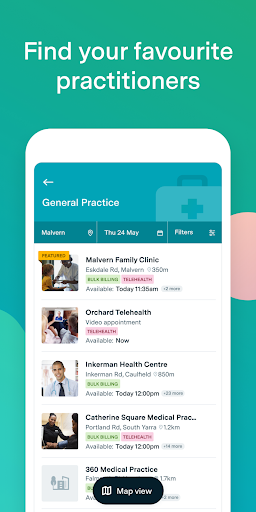  | 
 |   | 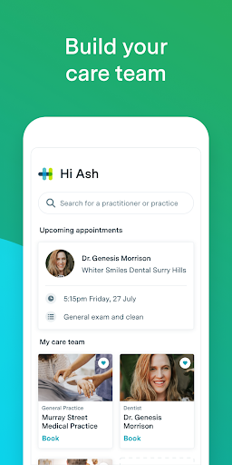 

## Development team
In the following we report the main information provided by the development team in the Google play store.

| | |
|-------------------------|-------------------------|
| **Developer**  | HealthEngine Pty Ltd |
| **Website**  | [https://healthengine.com.au/](https://healthengine.com.au/) |
| **Email** | feedback@healthengine.com.au |
| **Physical address**  | - |
| **Other developed apps**  | [https://play.google.com/store/apps/developer?id=HealthEngine+Pty+Ltd](https://play.google.com/store/apps/developer?id=HealthEngine+Pty+Ltd) |

## Android support

| | |
|-------------------------|-------------------------|
| **Declared target Android version**  | Android10, version 10 (API level 29) |
| **Effective target Android version**  | Android10, version 10 (API level 29) |
| **Minimum supported Android version**  | Lollipop, version 5.0 (API level 21) |
| **Maximum target Android version**  | - |

The larger the difference between the minimum and maximum supported Android versions, the better. A larger difference means a wider audience. For example, old phones have a very low Android version, so a high minimum supported Android version means that the app cannot be used by users with old phones, thus leading to accessibility problems. 

## Requested permissions

In the following we report the complete list of the permissions requested by the app. 

| **Permission** | **Protection level** | **Description** | 
|-------------------------|-------------------------|-------------------------|
 **android.permission ACCESS_COARSE_LOCATION** | :warning:**Dangerous** | Allows an app to access approximate location. 
 **android.permission ACCESS_FINE_LOCATION** | :warning:**Dangerous** | Allows an app to access precise location. 
 **android.permission ACCESS_NETWORK_STATE** | Normal | Allows applications to access information about networks. 
 **android.permission ACCESS_WIFI_STATE** | Normal | Allows applications to access information about Wi-Fi networks. 
 **android.permission CAMERA** | :warning:**Dangerous** | Required to be able to access the camera device. 
 **android.permission INTERNET** | Normal | Allows applications to open network sockets. 
 **android.permission MODIFY_AUDIO_SETTINGS** | Normal | Allows an application to modify global audio settings. 
 **android.permission READ_CALENDAR** | :warning:**Dangerous** | Allows an application to read the user's calendar data. 
 **android.permission READ_EXTERNAL_STORAGE** | :warning:**Dangerous** | Allows an application to read from external storage. 
 **android.permission RECEIVE_BOOT_COMPLETED** | Normal | Allows an application to receive the Intent.ACTION_BOOT_COMPLETED that is broadcast after the system finishes booting. 
 **android.permission RECORD_AUDIO** | :warning:**Dangerous** | Allows an application to record audio. 
 **android.permission USE_BIOMETRIC** | Normal | Allows an app to use device supported biometric modalities. 
 **android.permission USE_FINGERPRINT** | Normal | This constant was deprecated in API level 28. Applications should request USE_BIOMETRIC instead 
 **android.permission WAKE_LOCK** | Normal | Allows using PowerManager WakeLocks to keep processor from sleeping or screen from dimming. 
 **android.permission WRITE_CALENDAR** | :warning:**Dangerous** | Allows an application to write the user's calendar data. 
 **com.google.android.c2dm.permission RECEIVE** | - | - 
 **com.google.android.finsky.permission BIND_GET_INSTALL_REFERRER_SERVICE** | - | - 
 **com.google.android.providers.gsf.permission READ_GSERVICES** | - | - 

## Mentioned servers

| **Server** | **Registrant** | **Registrant country** | **Creation date** | 
|-------------------------|-------------------------|-------------------------|-------------------------|
 | googlesyndication.com | Google LLC | :us: US | 2003-01-21 06:17:24 |
 | googleapis.com | Google LLC | :us: US | 2005-01-25 17:52:26 |
 | zendesk.com | Zendesk, Inc. | :us: US | 2005-05-16 18:05:12 |
 | he0.io | HealthEngine | :fr: FR | 2018-04-27 11:21:17 |
 | omniture.com | Adobe Inc. | :us: US | 2002-03-29 21:33:52 |
 | facebook.com | Facebook, Inc. | :us: US | 1997-03-29 05:00:00 |
 | google.com | Google LLC | :us: US | 1997-09-15 04:00:00 |
 | imgix.net | Zebrafish Labs | :us: US | 2011-06-23 01:52:27 |
 | googleadservices.com | Google LLC | :us: US | 2003-06-19 16:34:53 |
 | app-measurement.com | Google LLC | :us: US | 2015-06-19 20:13:31 |
 | imrworldwide.com | The Nielsen Company | :us: US | 1998-04-02 05:00:00 |
 | appboy.com | Braze, Inc. | :us: US | 2008-10-06 23:28:32 |
 | braze.com | Braze, Inc. | :us: US | 2000-01-19 02:18:28 |
 | googleapis.com | Google LLC | :us: US | 2005-01-25 17:52:26 |
 | crashlytics.com | Google LLC | :us: US | 2011-01-21 15:30:40 |
 | stripe.com | - | :us: US | 1995-09-12 04:00:00 |
 | branch.io | Branch | :us: US | 2011-11-10 13:52:13 |
 | bnc.lt | - | - | 2016-11-14 00:00:00 |

## Security analysis 

Below we report the main security warnings raised by our execution of the [Androwarn](https://github.com/maaaaz/androwarn) security analysis tool.

**Telephony identifiers leakage**
> - This application reads the device phone type value 
> - This application reads the numeric name (MCC+MNC) of current registered operator 
> - This application reads the operator name 

**Connection interfaces exfiltration**
> - This application reads details about the currently active data network 

**Telephony services abuse**
> - This application makes phone calls 

**Suspicious connection establishment**
> - This application opens a Socket and connects it to the remote address '; port is out of range' on the 'N/A' port  
> - This application opens a Socket and connects it to the remote address 'Ljava/net/Proxy;->type()Ljava/net/Proxy$Type;' on the 'N/A' port  
> - This application opens a Socket and connects it to the remote address 'Ll/e/b/a/a;->a0(Ljava/lang/String;)Ljava/lang/StringBuilder;' on the 'N/A' port  
> - This application opens a Socket and connects it to the remote address 'timeout' on the 'N/A' port  

**Code execution**
> - This application loads a native library 
> - This application executes a UNIX command containing this argument: '2' 

## User ratings and reviews

Below we provide information about how end users are reacting to the app in terms of ratings and reviews in the Google Play store.

### Ratings

The HealthEngine app has been installed by more than **500000** times. At this time, **18886** rated the app and its average score is **4.708091**. Below we show the distribution of the ratings across the usual star-based rating of Google Play

:star::star::star::star::star:: 15203

:star::star::star::star:: 2816

:star::star::star:: 339

:star::star:: 99

:star:: 429

### Reviews 

#### 5-star reviews

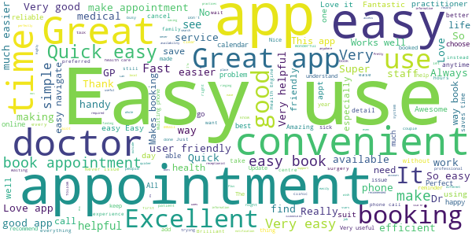

> I needed to book an appointment after a public holiday.  :date: __2020-12-28 05:52:07__

> Easy to use and staff manage app well  :date: __2020-12-28 04:32:51__

> Great app easy way to book Ur appointment with a fantastic staff and amazing staff of dr's  :date: __2020-12-28 04:30:48__

> Easy and simple and quick way to make an appointment  :date: __2020-12-28 02:18:29__

> Easy to use and always gets it right  :date: __2020-12-27 22:32:32__

> Very good app.  :date: __2020-12-27 07:31:11__

> Brilliant doctors and staff who will go out of their way to help in any way they can. Above and beyond 🙂 Kim Lindsay  :date: __2020-12-27 02:47:39__

> Great for keeping appointments organized, especially with on going medical conditions  :date: __2020-12-26 22:40:26__

> Excellent App..  :date: __2020-12-26 03:20:48__

> Very easy to use. No fumbled stories.  :date: __2020-12-26 02:59:46__

#### 4-star reviews

> Travised through each section ok  :date: __2020-12-28 07:18:01__

> Great tool for making appointments.  :date: __2020-12-22 04:34:03__

> Convenient  :date: __2020-12-21 23:32:28__

> Loved the waiting in queue info  :date: __2020-12-21 04:55:02__

> Ive had no problems with this app. Easy to use. Works well  :date: __2020-12-16 07:26:19__

> Handy to use.  :date: __2020-12-16 00:51:20__

> Easy to book appointment on the go.  :date: __2020-12-15 05:30:19__

> Easy navigation  :date: __2020-12-14 12:26:34__

> As I am a beginner with this type of bookings, but pretty good. Not sure about canceling appts when you have plenty of time to do it.  :date: __2020-12-11 01:10:25__

> Happy everytime I use it so far  :date: __2020-12-08 16:09:17__

#### 3-star reviews

> It makes it much easier to get the Appointment of the my choice  :date: __2020-12-28 00:43:46__

> Helpful in every way  :date: __2020-12-15 02:34:12__

> The doctors it not take carefully and prescribe medicine at patience to tell de patient go de hospital for something wrong isus  :date: __2020-12-15 01:53:33__

> Looks good.  :date: __2020-11-25 22:17:39__

> Great app, convenient but I wish there was on option button for a phone appointment, I still have to call the surgery to change my appt to request a call  :date: __2020-11-02 02:43:42__

> Meh  :date: __2020-10-13 17:19:37__

> Unfortunately the add to calendar function doesn't work. It should add the appointment too my Google calendar. Don't know what it's doing.  :date: __2020-10-05 05:00:31__

> Excellent App, been using it for six months now, never had a problem at all... 👍😁  :date: __2020-09-16 08:36:36__

> My first time using this app. Not familiar with it. Cannot delete one of the profile on my list (even though I am able to delete another one) If I am able to choose GP from a drop down list that would be great. Then I don't have to go thru many GP with their available date and time shown.  :date: __2020-09-05 03:41:53__

> Good  :date: __2020-08-19 14:21:18__

#### 2-star reviews

> Why after each upgrade it forgets my password? And when you try to reset the password it fails.  :date: __2020-11-22 23:15:54__

> Great till new update never had an issue till now doesn't show appointments anymore for any doctor can't book  :date: __2020-11-18 11:58:09__

> Used to be ok now lets you get to adding your name / dob and won't move to next page - obviously not compatible with Samsung Tab 6/ 7 tablets, just broken or not tested properly.  :date: __2020-11-06 05:19:45__

> No longer can make appointments at Wantirna Mall Clinic. Have to revert back to making phone calls.  :date: __2020-10-25 08:23:57__

> Not all doctors are showing so limited use.  :date: __2020-09-22 03:36:42__

> App is ok but need to be able to check time, date and which pratictioner I am seeing. Does not show and txt msg just a reminder you have an appointment no time only a doctor. Time reminder would ui I'd be an excellent reminder.  :date: __2020-09-21 08:05:41__

> Why does it keep asking for Medicare card info to be input every single time I make a booking when it's already been saved in the profile? VERY annoying when I just want to make a booking quickly.  :date: __2020-09-06 22:41:19__

> This app used to be great, then the developers got greedy and it has become useless. I am completely unable to book my regular doctor through this app, I apparently don't meet the "criteria " so I now have to phone the practice directly. The app is to busy asking you questions so they can cross sell products. Bin it and start again guys.  :date: __2020-08-13 01:01:29__

> This app crashes almost every time when I open it. This happened after the new update. Please fix the issue  :date: __2020-08-08 03:46:13__

> App crashes since updated last night Have uninstalled it and reinstalled and the issue is still happening on my Samsung S9 it was perfectly fine earlier on this week before this latest update  :date: __2020-07-30 06:41:19__

#### 1-star reviews

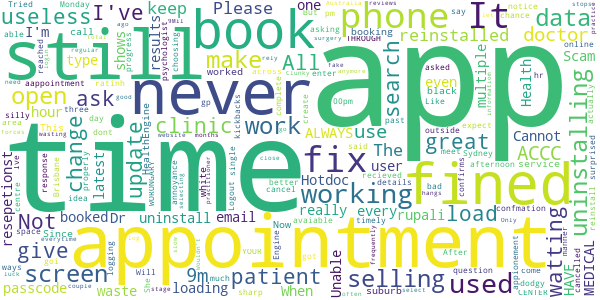

> 1 hr notice for an appointment is silly. Make it the day before do there is a chance to cancel in a timely manner.  :date: __2020-12-09 23:38:27__

> Every time I'm logging on it's asking to create a passcode,,, most useless app I've come across,,, uninstalling it fix this annoyance..  :date: __2020-12-04 13:13:00__

> All these doctors expect their kickbacks...and most are dodgy as  :date: __2020-12-03 12:30:10__

> Great!  :date: __2020-12-03 09:31:58__

> Not loading  :date: __2020-12-03 07:21:45__

> Its will not load properly  :date: __2020-11-26 15:01:08__

> Ive never actually been able to make appointments on this app with my clinic. Uninstalling, its just a waste of space  :date: __2020-11-24 21:15:15__

> Cannot book appointments. Tried multiple times  :date: __2020-11-18 13:19:13__

> It's not working now I had to uninstall and reinstall and it still doesn't have my gp on the app I've all ways booked on there but it's not working ITS WORONGARY MEDICAL CENTER I HAVE ALWAYS BOOKED THROUGH YOUR APP  :date: __2020-11-13 06:24:35__

> Like Hotdoc not only does it gets you results for say psychologist outside your search area I ask for Brisbane got suburbs in Sydney. But even those you cancelled your appointment with the medical centre Health Engine and Hotdoc still shows your appointment.  :date: __2020-10-09 02:22:18__

# DreamLab
App version ``3.2.0.2641``

Analyzed with [covid-apps-observer](http://github.com/covid-apps-observer) project, version ``0.1``

## App overview
| | |
|-------------------------|-------------------------| 
| **Name**&nbsp;&nbsp;&nbsp;&nbsp;&nbsp;&nbsp;&nbsp;&nbsp;&nbsp;&nbsp;&nbsp;&nbsp;&nbsp;&nbsp;&nbsp;&nbsp;&nbsp;&nbsp;&nbsp;&nbsp;&nbsp;&nbsp;&nbsp;&nbsp;&nbsp;&nbsp;&nbsp;&nbsp;&nbsp;&nbsp;&nbsp;&nbsp;&nbsp;&nbsp;&nbsp;&nbsp;&nbsp;&nbsp;&nbsp;&nbsp;  | DreamLab |
| **Unique identifier** | au.com.vodafone.dreamlabapp |
| **Link to Google Play** | [https://play.google.com/store/apps/details?id=au.com.vodafone.dreamlabapp](https://play.google.com/store/apps/details?id=au.com.vodafone.dreamlabapp) |
| **Summary**  | Use your phone to fast track cancer research, while you sleep. |
| **Privacy policy** | [https://www.vodafone.com.au/about/legal/privacy/dreamlab](https://www.vodafone.com.au/about/legal/privacy/dreamlab) |
| **Latest version** | 3.2.0.2641 |
| **Last update** | 2020-11-24 06:51:52 |
| **Recent changes** | We’ve added new statistics to the app so that users can better understand project progress and how their contribution is making a difference. We’ve also added ‘1 GB’ as the largest mobile data option and made some performance improvements. |
| **Installs**  | 500,000+ |
| **Category** | Lifestyle |
| **First release** | Oct 7, 2015 |
| **Size**  | 25M |
| **Supported Android version**  | 6.0 and up |

### Description
> ***Temporarily, DreamLab is being used to support research to combat the coronavirus (COVID-19).***
 Imagine if we could speed up time in the fight against cancer.
  
 DreamLab is a multi-award winning app that uses the collective power of smartphones to fast track cancer research. With cancer being one of the biggest causes of premature death worldwide, finding answers through medical research is incredibly important. DreamLab exists to help us get there sooner. And the more people who use the app, the faster it works.
 HOW IT WORKS
 Researchers need supercomputers to scan DNA in immense detail and crunch complex data. When you plug your phone in and power DreamLab, it downloads tiny parts of a huge research project from the cloud to calculate, and sends the results back to the research team. The more people who power DreamLab, the faster we can complete critical research. All you need to do is set up DreamLab once and it will get to work each time you plug your phone in.
 We’ve all been touched by cancer. Our best chance of beating it is by working together. And while sleep has always been good for you – with the DreamLab app, it can be good for others too. 
 Simply download the app (#) and choose which Project you’d like to support. You can also track the Contribution you’ve made and keep up to date with News.
 Dreamlab supports cancer research globally, and is powered by the Vodafone Foundation.
 * A compatible handset is required. Downloading DreamLab will consume data. Once downloaded, DreamLab can be used when your device (i) is connected to a charging source and (ii) has mobile network or WiFi connectivity. Mobile data to use DreamLab is free for Vodafone customers on their local Vodafone network. Roaming incurs international rates.
 # By downloading, installing or otherwise using the DreamLab application on your Device, you agree to be bound by the terms and conditions found at vodafone.com.au/dreamlab. If you do not agree to be bound by these Terms, you should not download, install or otherwise use DreamLab Application.

### User interface
The developers of the app provide the following screenshots in the Google play store.
| | | |
|:-------------------------:|:-------------------------:|:-------------------------:|
 |   |   |   | 
 |   |   |   | 
 |  

## Development team
In the following we report the main information provided by the development team in the Google play store.

| | |
|-------------------------|-------------------------|
| **Developer**  | Vodafone Foundation |
| **Website**  | [http://www.vodafone.com.au/dreamlab](http://www.vodafone.com.au/dreamlab) |
| **Email** | dreamlab@vodafone.com.au |
| **Physical address**  | [Vodafone Foundation, 1 Kingdom Street, London, W2 6BY United Kingdom](https://www.google.com/maps/search/Vodafone%20Foundation,%201%20Kingdom%20Street,%20London,%20W2%206BY%20United%20Kingdom) (Google Maps) |
| **Other developed apps**  | [https://play.google.com/store/apps/developer?id=Vodafone+Foundation](https://play.google.com/store/apps/developer?id=Vodafone+Foundation) |

## Android support

| | |
|-------------------------|-------------------------|
| **Declared target Android version**  | - |
| **Effective target Android version**  | - |
| **Minimum supported Android version**  | Marshmallow, version 6.0 (API level 23) |
| **Maximum target Android version**  | - |

The larger the difference between the minimum and maximum supported Android versions, the better. A larger difference means a wider audience. For example, old phones have a very low Android version, so a high minimum supported Android version means that the app cannot be used by users with old phones, thus leading to accessibility problems. 

## Requested permissions

In the following we report the complete list of the permissions requested by the app. 

| **Permission** | **Protection level** | **Description** | 
|-------------------------|-------------------------|-------------------------|
 **android.permission ACCESS_NETWORK_STATE** | Normal | Allows applications to access information about networks. 
 **android.permission ACCESS_WIFI_STATE** | Normal | Allows applications to access information about Wi-Fi networks. 
 **android.permission BATTERY_STATS** | Signature - privileged - development | Allows an application to collect battery statistics 
 **android.permission FOREGROUND_SERVICE** | Normal | Allows a regular application to use Service.startForeground. 
 **android.permission INTERNET** | Normal | Allows applications to open network sockets. 
 **android.permission RECEIVE_BOOT_COMPLETED** | Normal | Allows an application to receive the Intent.ACTION_BOOT_COMPLETED that is broadcast after the system finishes booting. 
 **android.permission VIBRATE** | Normal | Allows access to the vibrator. 
 **android.permission WAKE_LOCK** | Normal | Allows using PowerManager WakeLocks to keep processor from sleeping or screen from dimming. 
 **com.google.android.c2dm.permission RECEIVE** | - | - 
 **com.google.android.finsky.permission BIND_GET_INSTALL_REFERRER_SERVICE** | - | - 

## Mentioned servers

| **Server** | **Registrant** | **Registrant country** | **Creation date** | 
|-------------------------|-------------------------|-------------------------|-------------------------|
 | googlesyndication.com | Google LLC | :us: US | 2003-01-21 06:17:24 |
 | google.com | Google LLC | :us: US | 1997-09-15 04:00:00 |
 | urbanairship.com | DNStination Inc. | :us: US | 2009-04-14 06:34:46 |
 | asnapieu.com | DNStination Inc. | :us: US | 2019-05-15 21:27:07 |
 | adobedtm.com | Adobe Inc. | :us: US | 2013-11-22 23:15:17 |
 | googleapis.com | Google LLC | :us: US | 2005-01-25 17:52:26 |

## Security analysis 

Below we report the main security warnings raised by our execution of the [Androwarn](https://github.com/maaaaz/androwarn) security analysis tool.

**Telephony identifiers leakage**
> - This application reads the ISO country code equivalent for the SIM provider's country code 
> - This application reads the numeric name (MCC+MNC) of current registered operator 
> - This application reads the operator name 

**Location lookup**
> - This application reads location information from all available providers (WiFi, GPS etc.) 

**Connection interfaces exfiltration**
> - This application reads details about the currently active data network 
> - This application tries to find out if the currently active data network is metered 

**Telephony services abuse**
> - This application makes phone calls 

**Suspicious connection establishment**
> - This application opens a Socket and connects it to the remote address '' on the 'N/A' port  
> - This application opens a Socket and connects it to the remote address 'Ljava/lang/StringBuilder;->toString()Ljava/lang/String;' on the 'N/A' port  
> - This application opens a Socket and connects it to the remote address 'Ljava/net/Proxy;->type()Ljava/net/Proxy$Type;' on the 'N/A' port  
> - This application opens a Socket and connects it to the remote address 'timeout' on the 'N/A' port  

**Pim data leakage**
> - This application accesses data stored in the clipboard 

**Code execution**
> - This application loads a native library: 'native-lib' 

## User ratings and reviews

Below we provide information about how end users are reacting to the app in terms of ratings and reviews in the Google Play store.

### Ratings

The DreamLab app has been installed by more than **500000** times. At this time, **20245** rated the app and its average score is **4.4850416**. Below we show the distribution of the ratings across the usual star-based rating of Google Play

:star::star::star::star::star:: 15411

:star::star::star::star:: 2204

:star::star::star:: 913

:star::star:: 476

:star:: 1241

### Reviews 

#### 5-star reviews

> It's great to be able to contribute to finding new treatments in this way.  :date: __2020-12-28 13:54:14__

> Easy to use, great to know you're helping with the research and you don't need any qualifications, what could be better!  :date: __2020-12-28 11:30:55__

> Just works  :date: __2020-12-28 11:19:31__

> Easy to use and a wonderful way to help.  :date: __2020-12-28 10:57:05__

> Great idea 👌  :date: __2020-12-28 10:47:44__

> pure joy 💕🙏💕  :date: __2020-12-28 10:01:37__

> So easy to use and could help save lives. Why wouldn't you use it?  :date: __2020-12-28 08:42:47__

> Puts your phone to use for a very good cause. It just gets on with the job without any problems while the phone is charging.  :date: __2020-12-28 08:32:54__

> Every reason to download this. Doing good while doing nothing.  :date: __2020-12-28 08:23:07__

> Good to think of being able to help with no effort required at all. Keep up the good work.  :date: __2020-12-28 08:14:12__

#### 4-star reviews

> It's good to help. The only problem I have found is that when charging my phone on a Pixel Stand it will not get above 80 percent as both the app and wireless charging cause the phone to get warm.  :date: __2020-12-26 21:44:09__

> I like contributing but would like more options e.g I'd like it to only work on WiFi and I'd like the app to automatically start and work when I plug in my phone to charge....sort of download set and forget.  :date: __2020-12-26 17:36:43__

> Works fine on my phone, drains my wife's Samsung faster than the charger can keep up  :date: __2020-12-22 08:05:18__

> Great to help research while asleep  :date: __2020-12-21 18:24:22__

> Really great cause. I would encourage everyone to use this app, it works very well too and is lightweight on data if that's a concern. No ads at all. Would be 5 stars if I could login and keep my progress/contributions across devices.  :date: __2020-12-19 00:21:24__

> Any chance you can make your application compatible with Android TV and also the new Google TV with Chromecast? I certainly don't mind donating CPU time of my Google TV with Chromecast. It's left powered up 24/7/365.  :date: __2020-12-17 18:54:53__

> Painless  :date: __2020-12-17 10:14:46__

> Great way of helping out. Did seem to hang phone once, but that could be something else  :date: __2020-12-17 09:15:04__

> Easy to use and if it helps..  :date: __2020-12-16 22:07:46__

> I run a system on my computers, called Bonic (24/7) which run similar scientific projects. I would like to see your project also running on PCs and not running on mobile phones, whilst charging.  :date: __2020-12-16 00:46:21__

#### 3-star reviews

> Needs an option to suspend processing if screen is on. On some phones it's using more power than its charging so battery goes down. Need to take a leaf out of boincs book.  :date: __2020-12-18 13:32:20__

> Good app but settings are severely lacking, no way of telling it when to run and when not to run. I'd like to be able to customise when to start a session and also why can't it be used without being plugged in? Surely using less CPU when it's not plugged in is better than not running at all? I'd also like to see it automatically start instead of needing me to go into the app and tapping start session.  :date: __2020-12-14 22:40:48__

> Great idea... But app needs more controls to limit cpu and send it can run  :date: __2020-12-14 11:23:42__

> I'd like to use this on my phone but it eats power faster than the wireless charger can charge it. The phone charges up to 80%, the app starts calculating, next thing I know despite the phone still being on the charger the battery has 70% in it and still falling. The app needs to check the charge level when it is running and avoid allowing the phone to be depleted if the phone is using more power than it is getting from the charger.  :date: __2020-12-13 17:38:48__

> It is a worthwhile app, however I find if it stops due to battery temp, it doesn't automatically restart, which is not so good as I find I may only gain 15 or 20 mins running each night..  :date: __2020-12-10 00:04:38__

> I am on Vodafone with unlimited Max, or whatever it is called.. Around 4 months ago, the app, or Vodafone seem to have applied a 500mg per month limit to the data usage, consequently, after the first week of the month, this app remains idle! Vodafone weren't much help, other than confirming the 500mg cap exists. Not happy.  :date: __2020-12-06 14:25:48__

> Great idea, however it caused my Galaxy Note 10+ 5g to overheat.  :date: __2020-12-05 21:57:34__

> Great idea, but I tend to wirelessly charge my phone. This doesn't provide enough power to run the app and charge, so my phone runs out of battery while on the charger. It would be great if the app could tell the difference between wired and wireless charging.  :date: __2020-12-04 18:36:49__

> It seems like a great idea. However, I have an issue where the app appears to not be working when I move to another app or turn the screen off (the contribution amount does not increase) but is shown as running on my task manager. The app also continues to run even when the phone is unplugged. It might be that its not compatible with my Vivo x50.  :date: __2020-12-04 15:06:23__

> Most of the time I put my phone on charge, the app doesn't work it just crash by itself  :date: __2020-12-02 09:09:06__

#### 2-star reviews

> Stops calculating when charged but still plugged in, doesn't automatically start. Fix please!  :date: __2020-12-25 14:24:10__

> Uninstalled. Great idea, but too power intensive. Left the phone on charge over night and the battery only gained 2%.  :date: __2020-12-09 10:34:19__

> Nice concept like SETI@Home but T+C are suspect. They say accuracy of data sent by vodaphone isn't guaranteed. Yes this is probably template language but it says what it says. No point in burning power on inaccurate info for calculations. Also couldn't find info on project vetting, how do I know I'm not doing someone's Bitcoin mining? Will reinstall when T+C specific to project is available and vetting info publicised  :date: __2020-12-04 23:43:14__

> Insgesamt natürlich eine wichtige und wertvolle Idee, die App an sich hat aber noch Luft nach oben. Vorschläge: 1. Eine Option die Berechnungen erst ab einem gewissen Ladestand des Akkus zu starten. 2. Ein besseres Tracking der eigenen Beiträge, evtl. userbasiert und mit Highscore Listen (wie z.B. bei Folding) über mehrere Geräte hinweg, das motiviert zusätzlich. 3. Aktuell kaum nutzbar wenn man sein Smartphone per Schnellladefunktion lädt, weil es zu heiß wird. Hier muss nachgebessert werden.  :date: __2020-12-01 14:52:04__

> Is there a way to set a timer so it will download between certain times for example to only work at night time? There are certain times during the day where I want to charge my phone and without telling me it will run in the background which slows the charging process. Gets annoying when I realise it's been running in the background and when I want to turn it off I can't because it needs to 'take a break' to cool down which I am unable to stop the process until it starts again. Pixel 4 XL  :date: __2020-11-30 15:08:41__

> Worked for about 3 days. After that, the app keeps crashing. Reinstall helped just for the first use. Now keeps crashing down again. Pity  :date: __2020-11-25 23:12:55__

> Having to uninstall as phone runs way too hot when this is running  :date: __2020-11-24 12:29:49__

> The idea is nice, but it drains the battery instead of having settings to work only when charging and from some battery percentage. EDIT: You say that it works only when charging, but there is no indication for it. Please update the app to show it. Also please have settings, to disallow it being used when below some percentage (I want it to stop when below 95% for example).  :date: __2020-11-20 09:34:48__

> This app should have an option to work at 50% or even less of the processing power while not charging my phone. It doesn't really make sense when most smartphones have an ultra fast charging and doesn't need to be charged overnight. EDIT: App stopped working and doesn't do any calculations anymore...  :date: __2020-10-31 22:27:03__

> Interesting idea but still having issues with the app crashing.  :date: __2020-10-08 15:54:04__

#### 1-star reviews

> Kept freezing Android 7 tablet & Android 9 phone. Unacceptable behaviour. Uninstalled.  :date: __2020-12-20 11:44:11__

> I tried the app on my phone. My phone got red hot. So I tried it on my iPad. It drained the battery completely; unfortunately even while on charge. Had to delete it. Shame. I wanted to help....  :date: __2020-12-20 10:45:36__

> Update : it is chaos  :date: __2020-12-17 03:12:18__

> Haven't a clue what is it  :date: __2020-12-07 18:42:59__

> I'm sorry. I wanted to help. But my phone won't charge. It drains faster than it charging. After 1 hour it got from 86% to 80% while plugged in. It's a Samsung S7 with a fast charger. You might want to look into this.  :date: __2020-12-05 14:13:42__

> This app used to work perfectly but now refuses to work at all. It just claims that I've reached my data limit for the month despite the fact that I'm using WiFi. I have tried deleting it and reinstalling it several times but it still doesn't work.  :date: __2020-12-04 20:21:34__

> Used to be great but now everytime I charge my phone the app crashes  :date: __2020-11-27 00:32:30__

> I used to love this app but something in the most recent updates has been causing the phone's temp to rise and it keeps having to take a break. It never used to do that and it's to the point where the phone is hot to touch when it runs and this is when there are no other apps running in the background.  :date: __2020-11-26 23:09:32__

> Worked well for the first day, then crashed constantly every night/ charge following. Made the phone almost impossible to use prior to uninstalling due to all the crashes occurring.  :date: __2020-11-26 16:07:07__

> Idea itself is worthwhile, however after a few days the app will stop working or crash when you plug in the power. No support, no replies to messages. Constantly requires uninstalling and install if you want to continue supporting the projects, however your history/contributions are erased.  :date: __2020-11-23 23:10:19__

# Premier's Active April
App version ``2.3.9``

Analyzed with [covid-apps-observer](http://github.com/covid-apps-observer) project, version ``0.1``

## App overview
| | |
|-------------------------|-------------------------| 
| **Name**&nbsp;&nbsp;&nbsp;&nbsp;&nbsp;&nbsp;&nbsp;&nbsp;&nbsp;&nbsp;&nbsp;&nbsp;&nbsp;&nbsp;&nbsp;&nbsp;&nbsp;&nbsp;&nbsp;&nbsp;&nbsp;&nbsp;&nbsp;&nbsp;&nbsp;&nbsp;&nbsp;&nbsp;&nbsp;&nbsp;&nbsp;&nbsp;&nbsp;&nbsp;&nbsp;&nbsp;&nbsp;&nbsp;&nbsp;&nbsp;  | Premier's Active April |
| **Unique identifier** | au.gov.vic.premiersactiveapril |
| **Link to Google Play** | [https://play.google.com/store/apps/details?id=au.gov.vic.premiersactiveapril](https://play.google.com/store/apps/details?id=au.gov.vic.premiersactiveapril) |
| **Summary**  | Fun and free, encouraging Victorians to do 30mins of activity a day in April. |
| **Privacy policy** | [https://www.activeapril.vic.gov.au/privacy-policy/](https://www.activeapril.vic.gov.au/privacy-policy/) |
| **Latest version** | 2.3.9 |
| **Last update** | 2020-05-07 01:52:14 |
| **Recent changes** | This release includes changes to reflect the COVID 19 restrictions |
| **Installs**  | 10,000+ |
| **Category** | Health & Fitness |
| **First release** | Feb 2, 2017 |
| **Size**  | 34M |
| **Supported Android version**  | 4.2 and up |

### Description
> Premier’s Active April is free and fun for everyone, encouraging all Victorians to do 30 minutes of physical activity a day during April. It’s part of the Victorian Government’s commitment to get more people active and healthy.
 As a participant, you can log your daily activity in the mobile or web app and chart your progress throughout the month. You can also create and join teams, track the progress of team members.
 Register now for Premier’s Active April 2020 to move more and feel great!
 Important message regarding Premier’s Active April 2020
 A state of emergency has been declared in Victoria because of the serious risk to public health posed by the coronavirus (COVID-19).
 Due to COVID-19 restrictions, it is no longer possible to hold the Premier’s Active April 2020 scheduled public events and activities, which are cancelled.
 Campaign Offers
 Participating campaign partner organizations have withdrawn their offers of activities, goods and services, discounts and incentives due to the change in business circumstances. The Active April 2020 campaign Special Offers, My Offers and Prizes (“Campaign Offers”) (other than the random Prize draw for 2021 Australian Open Tickets) are correspondingly cancelled.
 Participants holding a Premier’s Active April Card who have not redeemed any Campaign Offer by 26 March 2020   unable to do so.
 Registration
 Registration in Active April is still possible up to 30 April.
 *Terms and conditions for all prizes and offers apply. Visit activeapril.vic.gov.au for details.

### User interface
The developers of the app provide the following screenshots in the Google play store.
| | | |
|:-------------------------:|:-------------------------:|:-------------------------:|
 |   | 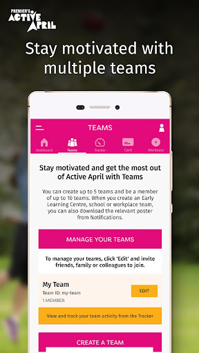 

## Development team
In the following we report the main information provided by the development team in the Google play store.

| | |
|-------------------------|-------------------------|
| **Developer**  | Better Health Channel |
| **Website**  | [https://www.activeapril.vic.gov.au/](https://www.activeapril.vic.gov.au/) |
| **Email** | activeapril@sport.vic.gov.au |
| **Physical address**  | - |
| **Other developed apps**  | [https://play.google.com/store/apps/developer?id=Better+Health+Channel](https://play.google.com/store/apps/developer?id=Better+Health+Channel) |

## Android support

| | |
|-------------------------|-------------------------|
| **Declared target Android version**  | Pie, version 9 (API level 28) |
| **Effective target Android version**  | Pie, version 9 (API level 28) |
| **Minimum supported Android version**  | Jelly Bean, version 4.2.x (API level 17) |
| **Maximum target Android version**  | - |

The larger the difference between the minimum and maximum supported Android versions, the better. A larger difference means a wider audience. For example, old phones have a very low Android version, so a high minimum supported Android version means that the app cannot be used by users with old phones, thus leading to accessibility problems. 

## Requested permissions

In the following we report the complete list of the permissions requested by the app. 

| **Permission** | **Protection level** | **Description** | 
|-------------------------|-------------------------|-------------------------|
 **android.permission ACCESS_NETWORK_STATE** | Normal | Allows applications to access information about networks. 
 **android.permission CAMERA** | :warning:**Dangerous** | Required to be able to access the camera device. 
 **android.permission INTERNET** | Normal | Allows applications to open network sockets. 
 **android.permission READ_EXTERNAL_STORAGE** | :warning:**Dangerous** | Allows an application to read from external storage. 
 **android.permission WAKE_LOCK** | Normal | Allows using PowerManager WakeLocks to keep processor from sleeping or screen from dimming. 
 **android.permission WRITE_EXTERNAL_STORAGE** | :warning:**Dangerous** | Allows an application to write to external storage. 
 **com.google.android.c2dm.permission RECEIVE** | - | - 
 **com.google.android.finsky.permission BIND_GET_INSTALL_REFERRER_SERVICE** | - | - 
 **com.google.android.providers.gsf.permission READ_GSERVICES** | - | - 

## Mentioned servers

| **Server** | **Registrant** | **Registrant country** | **Creation date** | 
|-------------------------|-------------------------|-------------------------|-------------------------|
 | googlesyndication.com | Google LLC | :us: US | 2003-01-21 06:17:24 |
 | google.com | Google LLC | :us: US | 1997-09-15 04:00:00 |
 | app-measurement.com | Google LLC | :us: US | 2015-06-19 20:13:31 |
 | crashlytics.com | Google LLC | :us: US | 2011-01-21 15:30:40 |
 | w3.org | W3C | :us: US | 1994-07-06 04:00:00 |
 | googleapis.com | Google LLC | :us: US | 2005-01-25 17:52:26 |

## Security analysis 

Below we report the main security warnings raised by our execution of the [Androwarn](https://github.com/maaaaz/androwarn) security analysis tool.

**Connection interfaces exfiltration**
> - This application reads details about the currently active data network 
> - This application tries to find out if the currently active data network is metered 

**Suspicious connection establishment**
> - This application opens a Socket and connects it to the remote address '' on the '80' port  
> - This application opens a Socket and connects it to the remote address '' on the 'N/A' port  
> - This application opens a Socket and connects it to the remote address 'Ljava/lang/StringBuilder;->toString()Ljava/lang/String;' on the 'N/A' port  
> - This application opens a Socket and connects it to the remote address 'Ljava/net/Proxy;->type()Ljava/net/Proxy$Type;' on the 'N/A' port  
> - This application opens a Socket and connects it to the remote address 'NanoHttpd Shutdown' on the 'N/A' port  
> - This application opens a Socket and connects it to the remote address 'timeout' on the 'N/A' port  

**Code execution**
> - This application loads a native library 
> - This application loads a native library: 'Ljava/util/Iterator;->next()Ljava/lang/Object;' 
> - This application loads a native library: 'NativeScript' 
> - This application executes a UNIX command containing this argument: '2' 

## User ratings and reviews

Below we provide information about how end users are reacting to the app in terms of ratings and reviews in the Google Play store.

### Ratings

The Premier's Active April app has been installed by more than **10000** times. At this time, **69** rated the app and its average score is **3.057971**. Below we show the distribution of the ratings across the usual star-based rating of Google Play

:star::star::star::star::star:: 25

:star::star::star::star:: 6

:star::star::star:: 8

:star::star:: 8

:star:: 22

### Reviews 

#### 5-star reviews

> I can add people to win on the app💙  :date: __2020-03-15 11:26:31__

> Its really good  :date: __2020-02-17 09:40:31__

> do  :date: __2019-04-17 10:50:21__

> After an initial hiccup I updated the app and it's running much smoother now. I like being able to track on the go and having the benefits card on my phone is super useful. The new workouts videos this year are a nice touch too!!  :date: __2019-04-04 06:36:48__

> excellent  :date: __2019-04-01 07:32:55__

> it was awesole last year. i am mkre actuve abd tried new things and i wud luv luv luv to be active this winter😚😀  :date: __2019-02-15 02:47:41__

> Great App. :)  :date: __2018-04-17 07:45:15__

#### 4-star reviews

> Love this app, I use it for school and I also have a family team. I have a home gym and myself and my parents use it all the time but im assuming that the COVID-19 pandemic has resulted in the fitness activity selection to be cut back so I can no longer add 'gym' to my tracker, I have to put it as 'other'...Why is this???  :date: __2020-04-15 12:44:42__

> After Easter I was really struggling to get back into a good health and fitness routine. A friend referred me to Active April through the app and it was such an easy way to start again. There was so many freebies it was hard not to take advantage and get motivated.  :date: __2018-04-12 02:16:35__

#### 3-star reviews

> Have used in previous years with no issues. This year, I had trouble logging in at 2 stages. One was before the start of April, the other was after the middle of the month. At both times, the app refused to login, even when given the correct details (checked multiple times). It complained about an Invalid username or password. However, they were correct. I had to use the website for entering my activities for the latter half of April.  :date: __2020-05-01 13:23:35__

> Can you please include rowing on the list of activities? The app can be a bit slow and sometimes crashes. I like the tracker and snapshot.  :date: __2019-04-11 21:35:52__

> it'd have been better if it could get connected to apps such as Samsung health, Google fit, strava etc and directly imported data from there...  :date: __2019-04-08 16:56:41__

> Before April it was working fine, but now I try to add activity or view the fitness videos and it lags and then crashes  :date: __2019-04-03 10:35:43__

> Wish there was a way to link to Fitbit, or Google health  :date: __2019-02-23 02:10:20__

> Slow to start.  Postcode summary not working. Reports 0 hrs for my postcode  :date: __2018-04-07 13:23:29__

> It needs to link to Google fit and extract workouts I've completed as all the tracking apps I use log with Google fit  :date: __2018-04-03 03:40:26__

#### 2-star reviews

> Sometimes works, but for what it does, it's very slow. Clearly a web app, based on its slowness, reliance on the internet and the html error messages.  :date: __2019-04-24 01:41:38__

> still crashing  :date: __2019-04-11 11:14:37__

> App keeps crashing which is annoying as I can't log all my workouts.  :date: __2019-04-07 06:38:26__

> Severely lacking integration with Google Fit, Fitbit, Strava, Garmin, etc...  :date: __2019-03-26 23:45:44__

> Too slow to start up. What is it doing. ? Would track more time but it's tomorrow by the time the app has dtarted  :date: __2018-04-02 10:52:17__

> Looks good but once you try to use it, it is very slow and clunky - and my phone is moto g 3rd gen with 2GB - shouldn't have these kind of problems for this type of app for my type of phone  :date: __2017-04-10 14:32:10__

> Buggiest app I've got. Freezes constantly, can't click on stuff, have to constantly close and reopen.  :date: __2017-04-04 08:32:33__

> Very frustrating app. Lots of text looks clickable but its not. Eg the Red Activity Snapshot box. Maybe it will improve when it's live and useable. Also no Rowing option.  :date: __2017-03-29 14:33:34__

#### 1-star reviews

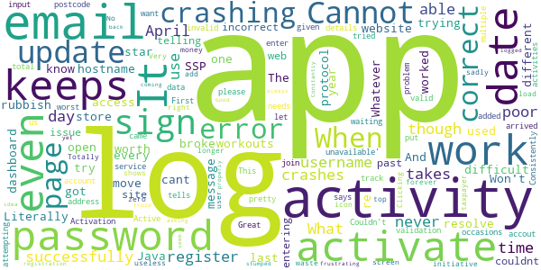

> Literally is so difficult to activate it isn't worth it  :date: __2020-06-13 07:06:24__

> couldn't sign in. sign in on the website worked and gets the app one star.  :date: __2019-04-18 12:05:05__

> Whatever the last update was broke it, i Cannot log in .  :date: __2019-04-13 05:44:54__

> app cant resolve hostname and doesn't work at all.  :date: __2019-04-07 08:44:40__

> I can't access the workouts. The app keeps crashing when I try to move to a different page on the dashboard.  :date: __2019-04-01 08:31:53__

> app does not open  :date: __2019-03-28 10:01:48__

> It doesn't work - When trying to log-in I get a Java SSP protocol error message. I know I have got the correct email and password as I used them successfully to re-register.  :date: __2019-02-22 02:41:30__

> What a rubbish app! And every year it's the same. Won't store my username 
and password, and then keeps telling me my password and username are 
incorrect, even though I use them successfully in the web site. Same issue 
as 2017.  :date: __2018-04-15 03:17:57__

> couldnt get past entering postcode...pretty poor given you want us to register!  :date: __2018-04-08 11:30:43__

> It won't let me log in, it says 'service unavailable'.  :date: __2018-04-04 23:53:25__

# Credits

This project makes use of the following main third-party projects:
* Androguard: [https://github.com/androguard/androguard](https://github.com/androguard/androguard)
* Androwarn: [https://github.com/maaaaz/androwarn](https://github.com/maaaaz/androwarn)
* google_play_scraper: [https://github.com/JoMingyu/google-play-scraper](https://github.com/JoMingyu/google-play-scraper)
* whois: [https://github.com/DannyCork/python-whois](https://github.com/DannyCork/python-whois)
* BeautifulSoup: [https://www.crummy.com/software/BeautifulSoup](https://www.crummy.com/software/BeautifulSoup)

Other open-source projects used in this project include: 

- androguard==3.3.5
- appnope==0.1.0
- asn1crypto==1.3.0
- backcall==0.1.0
- beautifulsoup4==4.9.0
- bs4==0.0.1
- certifi==2020.4.5.1
- cffi==1.14.0
- chardet==3.0.4
- click==7.1.2
- colorama==0.4.3
- cryptography==2.9.2
- cycler==0.10.0
- decorator==4.4.2
- future==0.18.2
- google-play-scraper==0.1.1
- idna==2.9
- ipython==7.13.0
- ipython-genutils==0.2.0
- jedi==0.17.0
- Jinja2==2.11.2
- joblib==0.14.1
- kiwisolver==1.2.0
- lxml==4.5.0
- MarkupSafe==1.1.1
- matplotlib==3.2.1
- networkx==2.4
- nltk==3.5
- numpy==1.18.3
- parso==0.7.0
- pexpect==4.8.0
- pickleshare==0.7.5
- Pillow==7.1.2
- play-scraper==0.6.0
- prompt-toolkit==3.0.5
- ptyprocess==0.6.0
- pycountry==19.8.18
- pycparser==2.20
- pydot==1.4.1
- Pygments==2.6.1
- pyOpenSSL==19.1.0
- pyparsing==2.4.7
- python-dateutil==2.8.1
- regex==2020.4.4
- requests==2.23.0
- requests-futures==1.0.0
- six==1.14.0
- soupsieve==2.0
- tld==0.12.1
- tqdm==4.45.0
- traitlets==4.3.3
- urllib3==1.25.9
- wcwidth==0.1.9
- wordcloud==1.7.0

