# COVID-related Android apps in Australia

Author: `Ivano Malavolta` (ivanomalavolta@gmail.com)

Created at: `2020/5/10`

Report generated by the [covid-apps-observer](http://github.com/covid-apps-observer) project, version 0.1

# Table of contents 

- [Background](#background)
    * [Data sources and analyses](#data-sources-and-analyses)
        * [App metadata](#app-metadata)
        * [Requested permissions](#requested-permissions)
        * [Mentioned servers](#mentioned_servers)
        * [Security analysis](#security_analysis)
        * [User ratings and reviews](#user-ratings-and-reviews)
    * [Disclaimer](#disclaimer)
- [COVIDSafe](#covidsafe)
- [WHO Info](#who-info)
- [Coronavirus Australia](#coronavirus-australia)
- [MyAus COVID-19](#myaus-covid-19)
- [OpenWHO: Knowledge for Health Emergencies](#openwho-knowledge-for-health-emergencies)

- [Credits](#credits)

# How to read this report

This report has been generated by the [covid-apps-observer](http://github.com/covid-apps-observer) project. The project automatically analyzes the apps by extracting information which is already publicly available either on the web or in the apps binary files. 

Our analysis covers the following apps:
| | |
|-------------------------|-------------------------| 
|  | COVIDSafe
|  | WHO Info
|  | Coronavirus Australia
|  | MyAus COVID-19
|  | OpenWHO: Knowledge for Health Emergencies

The details of our analysis are presented in the remainder of this report.

For independent verification, the raw data and the source code of the project is publicly available in its GitHub repository [http://github.com/covid-apps-observer](http://github.com/covid-apps-observer) and its source code has been thoroughly commented in order to provide all the details about how the information provided in this report has been extracted. 

Any feedback, questions, and improvements about the project are very welcome, feel free to create an issue or pull request directly in its GitHub repository: [http://github.com/covid-apps-observer](http://github.com/covid-apps-observer).

## Data sources and analyses

The analysis of each app is structured around five main dimensions: 
* App metadata  
* Requested permissions
* Mentioned servers
* Androwarn analysis
* User ratings and reviews

In the following we describe the data sources and analysis performed for each dimension.

### App metadata

App metadata includes an overview of the main information about the app (for example, its name, releases, privacy policy, etc.), contact information of the development team, and the various Android versions supported by the app. This information is extracted from two main data sources:
* _Google Play store_: we automatically mined the web page of the Google Play store showing the basic information about the app and we parsed it in order to extract information about the app and development team 
* _Android Manifest file_: in our analysis we decompiled the binary file of the app (it is similar to a Zip archive but it contains the code of the app instead of normal files) and we extracted information about the supported Android versions, as it has been listed by its development team.

The extracted app metadata feeds the _App overview_, _Development team_, and _Android support_ sections of this report.
We make use of the [google-play-scraper](https://github.com/JoMingyu/google-play-scraper) tool for extracting the raw data related to this dimension of the project.

### Requested permissions

The Android operating system has a permission model which allows users to grant access to potentially privacy-related information. Every Android app has to explictly declare the permissions it needs to properly function in the Android Manifest file.  

In this report we also show the protection level of each permission, which is a key information for understanding how the requested permissions related to the user's privacy. We carefully analyzed the [official Android documentation (v. 29)](https://developer.android.com/reference/android/Manifest.permission), and it resulted that a permission requested by an Android app can belong to the following protection levels:
* **Dangerous**: higher-risk permissions that would give a requesting app access to private user data or control over the device that can negatively impact the user. Because this type of permission introduces potential risk, the system usually does not automatically grant it to the requesting app. For example, any dangerous permissions requested by an app may be displayed to the user and require confirmation before proceeding.
* **Normal**: this is the default and most common level in Android; normal permissions are lower-risk and give access to isolated app-level features, with minimal risk to other apps, the system, or the user. 
* **Signature**: permissions granted only if the requesting app is signed with the same certificate as the app that declared the permission
* **Appop**: old permission level, a reminiscence of the App Ops tool that Google introduced in Android 4.3.
* **Development**: optional permissions which can be granted to development-oriented apps.
* **Privileged**: permissions who give higher power to mobile apps w.r.t. other apps, such as binding to incoming calls, interacting via bluetooth with other devices without user interaction, etc.
* **Preinstalled**: reserved only for preinstalled apps
* **Installer**: allow the holder to start the permission usage screen for an app
* **RetailDemo**: permissions related to devices used in demonstrations in shops.
* **Pre23**: permissions automatically granted to apps targeting devices running pre-6.0 Android.
* **Upcoming**: permissions which will be released in the next version of the Android platform. 
* **Deprecated**: permissions belonging to old releases of the Android platform, they should not be used by developers since they will not be supported in the near future.
* **Not for use by third-party applications**: permissions which can be requested only by apps developed by Google.
* **Undefined**: this protection level is not documented by Google.

The permissions dimension of this project is based on the [Androguard](https://github.com/androguard/androguard) static analysis tool.

### Mentioned servers

We decompiled each app in order to look for all possible mentions of remote URLs. The mentioned URLs can refer to remote servers the the app is using for either sending or receiving information, web addresses for directing the user to an information website, and so on. 

:warning: It is important to note that this analysis is not meant to be complete and it is very prone to obfuscation. The servers reported here are simply _mentioned_ somewhere in the code of the app and are meant to just give an indication about the "hooks" of the app towards external resources. For example, for an Android app it is normal to contact Google services in order to send/receive push notifications, or to contact the servers of analytics services for having real-time diagnostics about crashes of the app or bugs.

This part of the analysis is based on the [Androguard](https://github.com/androguard/androguard) static analysis tool for identfying the raw URLs mentioned in the app; then, the information about each mentioned server is collected by performing a _whois_ lookup on the first-level domain present in the URL.

### Security analysis

This dimension is based on the [Androwarn](https://github.com/maaaaz/androwarn) structural and data flow analysis of Android bytecode. Androwarn is developed by the University of Lyon/INSA (France) and it has been used in several academic studies. According to its documentation, Androwarn targets the following categories of potential security issues:
* **Telephony identifiers exfiltration**: IMEI, IMSI, MCC, MNC, LAC, CID, operator's name, etc.
* **Device settings exfiltration**: software version, usage statistics, system settings, logs, etc.
* **Geolocation information leakage**: GPS/WiFi geolocation, etc.
* **Connection interfaces information exfiltration**: WiFi credentials, Bluetooth MAC adress, etc.
* **Telephony services abuse**: premium SMS sending, phone call composition, etc.
* **Audio/video flow interception**: call recording, video capture, etc.
* **Remote connection establishment**: socket open call, Bluetooth pairing, APN settings edit, etc.
* **PIM data leakage**: contacts, calendar, SMS, mails, clipboard, etc.
* **External memory operations**: file access on SD card, etc.
* **PIM data modification**: add/delete contacts, calendar events, etc.
* **Arbitrary code execution**: native code using JNI, UNIX command, privilege escalation, etc.
* **Denial of Service**: event notification deactivation, file deletion, process killing, virtual keyboard disable, terminal shutdown/reboot, etc.

Note: We do not consider this data point in the current version of our analyzers since it is too verbose for our purposes.

:warning: It is important to note that Androwarn is a static analysis tool, and as such it performs a variety of heuristics and approximations in its analyses. Said that, the results shown in this report are meant to provide an indication of _potential_ security issues and should be by no means treated as complete and correct.   

### User ratings and reviews

For this dimension we turn again to the web interface of the Google Play store. Firstly, we automatically mine summary statistics about user ratings from the web page of the app under analysis; then, we automatically download the newest 1000 reviews of the app under analysis. For each level of rating (5 stars, 4 stars, , etc., 1 star) we show:
- a word cloud presenting the main terms used by end users in their reviews in the Google Play store
- the last 10 reviews provided by app users in the Google Play store. 

This purposefully simple analysis is meant to help both future users and the development team of the app in understanding what are the main positive and negative points of the app under analysis.

We make use of the [google-play-scraper](https://github.com/JoMingyu/google-play-scraper) tool for extracting the raw data related to this dimension of the project.

## Disclaimer 

This report has been produced independently of any parties and its only objective is to help anybody in better understanding how COVID-related apps work in practice (and compare to each other). The results of this report are limited to the specific version of the software used for running the analyses and on the various heuristics implemented in there. In other words, the results of the analyzers may differ depending on the time and modalities in which they are executed. We do not guarantee that the results of the analyses and the corresponding contents of this report are fully complete or correct. The analysis software is licensed under the [MIT License](https://github.com/iivanoo/covid-apps-observer/blob/master/LICENSE).

# COVIDSafe
App version ``1.0.16``

Analyzed with [covid-apps-observer](http://github.com/covid-apps-observer) project, version ``0.1``

## App overview
| | |
|-------------------------|-------------------------| 
| **Name**&nbsp;&nbsp;&nbsp;&nbsp;&nbsp;&nbsp;&nbsp;&nbsp;&nbsp;&nbsp;&nbsp;&nbsp;&nbsp;&nbsp;&nbsp;&nbsp;&nbsp;&nbsp;&nbsp;&nbsp;&nbsp;&nbsp;&nbsp;&nbsp;&nbsp;&nbsp;&nbsp;&nbsp;&nbsp;&nbsp;&nbsp;&nbsp;&nbsp;&nbsp;&nbsp;&nbsp;&nbsp;&nbsp;&nbsp;&nbsp;  | COVIDSafe |
| **Unique identifier** | au.gov.health.covidsafe |
| **Link to Google Play** | [https://play.google.com/store/apps/details?id=au.gov.health.covidsafe](https://play.google.com/store/apps/details?id=au.gov.health.covidsafe) |
| **Summary**  | COVIDSafe is a community-based way to stop the spread of COVID-19. |
| **Privacy policy** | [https://www.health.gov.au/using-our-websites/privacy](https://www.health.gov.au/using-our-websites/privacy) |
| **Latest version** | 1.0.16 |
| **Last update** | 2020-05-04 13:47:21 |
| **Recent changes** | Updated design Bug fixes |
| **Installs**  | 1,000,000+ |
| **Category** | Health & Fitness |
| **First release** | Apr 25, 2020 |
| **Size**  | 6.0M |
| **Supported Android version**  | 6.0 and up |

### Description
> COVIDSafe app has been developed by the Australian Government Department of Health to help keep the community safe from coronavirus (COVID-19). Together, let’s help stop the spread and keep ourselves and each other healthy.
 COVIDSafe uses the Bluetooth® technology on your mobile phone to look for other devices with COVIDSafe installed. Your device will take a note of contact you’ve had with other users by securely logging the other user’s reference code. If you or someone you’ve been in contact with is diagnosed with COVID-19, the close contact information securely stored in your phone can be uploaded and used—with your consent—by state and territory health officials to quickly inform people who’ve been exposed to the virus.
 How you can help stop the spread of COVID-19:
 • Download the COVIDSafe app
 • Register using your mobile phone number, name, age range and postcode
 • Turn on Bluetooth®
 • Check that COVIDSafe is running when you are out and about or are likely to come into contact with others
 • If you test positive for COVID-19, you can consent for your close contact information to be used by state and territory health officials to contact people who may have been exposed. If you’ve been exposed to the virus by someone you’ve been in close contact with, state and territory health officials will be able to contact you quickly so you can get the support you need
 COVIDSafe is an Australian Government Department of Health initiative. Visit https://www.health.gov.au/resources/apps-and-tools/covidsafe-app for more information.

### User interface
The developers of the app provide the following screenshots in the Google play store.
| | | |
|:-------------------------:|:-------------------------:|:-------------------------:|
 |   | 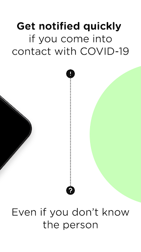  |   | 
 |   |  

## Development team
In the following we report the main information provided by the development team in the Google play store.

| | |
|-------------------------|-------------------------|
| **Developer**  | Australian Department of Health |
| **Website**  | [https://www.health.gov.au/resources/apps-and-tools/covidsafe-app](https://www.health.gov.au/resources/apps-and-tools/covidsafe-app) |
| **Email** | support@COVIDSafe.gov.au |
| **Physical address**  | - |
| **Other developed apps**  | [https://play.google.com/store/apps/developer?id=Australian+Department+of+Health](https://play.google.com/store/apps/developer?id=Australian+Department+of+Health) |

## Android support

| | |
|-------------------------|-------------------------|
| **Declared target Android version**  | Android10, version 10 (API level 29) |
| **Effective target Android version**  | Android10, version 10 (API level 29) |
| **Minimum supported Android version**  | Marshmallow, version 6.0 (API level 23) |
| **Maximum target Android version**  | - |

The larger the difference between the minimum and maximum supported Android versions, the better. A larger difference means a wider audience. For example, old phones have a very low Android version, so a high minimum supported Android version means that the app cannot be used by users with old phones, thus leading to accessibility problems. 

## Requested permissions

In the following we report the complete list of the permissions requested by the app. 

| **Permission** | **Protection level** | **Description** | 
|-------------------------|-------------------------|-------------------------|
 **android.permission ACCESS_FINE_LOCATION** | :warning:**Dangerous** | Allows an app to access precise location. 
 **android.permission ACCESS_NETWORK_STATE** | Normal | Allows applications to access information about networks. 
 **android.permission BLUETOOTH** | Normal | Allows applications to connect to paired bluetooth devices. 
 **android.permission BLUETOOTH_ADMIN** | Normal | Allows applications to discover and pair bluetooth devices. 
 **android.permission FOREGROUND_SERVICE** | Normal | Allows a regular application to use Service.startForeground. 
 **android.permission INTERNET** | Normal | Allows applications to open network sockets. 
 **android.permission RECEIVE_BOOT_COMPLETED** | Normal | Allows an application to receive the Intent.ACTION_BOOT_COMPLETED that is broadcast after the system finishes booting. 
 **android.permission REQUEST_IGNORE_BATTERY_OPTIMIZATIONS** | Normal | Permission an application must hold in order to use Settings.ACTION_REQUEST_IGNORE_BATTERY_OPTIMIZATIONS. 

## Mentioned servers

| **Server** | **Registrant** | **Registrant country** | **Creation date** | 
|-------------------------|-------------------------|-------------------------|-------------------------|
 | stackoverflow.com | Stack Exchange, Inc. | :us: US | 2003-12-26 19:18:07 |
 | google.com | Google LLC | :us: US | 1997-09-15 04:00:00 |

## Security analysis 

Below we report the main security warnings raised by our execution of the [Androwarn](https://github.com/maaaaz/androwarn) security analysis tool.

**Connection interfaces exfiltration**
> - This application reads details about the currently active data network 
> - This application tries to find out if the currently active data network is metered 

**Suspicious connection establishment**
> - This application opens a Socket and connects it to the remote address ' returned no addresses for  ; port is out of range' on the 'N/A' port  
> - This application opens a Socket and connects it to the remote address '' on the 'N/A' port  
> - This application opens a Socket and connects it to the remote address 'Ljava/lang/StringBuilder;->toString()Ljava/lang/String;' on the 'N/A' port  
> - This application opens a Socket and connects it to the remote address 'Ljava/net/Proxy;->type()Ljava/net/Proxy$Type;' on the 'N/A' port  
> - This application opens a Socket and connects it to the remote address 'timeout' on the 'N/A' port  

## User ratings and reviews

Below we provide information about how end users are reacting to the app in terms of ratings and reviews in the Google Play store.

### Ratings

The COVIDSafe app has been installed by more than **1000000** times. At this time, **10041** rated the app and its average score is **3.6407669**. Below we show the distribution of the ratings across the usual star-based rating of Google Play

:star::star::star::star::star:: 5451

:star::star::star::star:: 840

:star::star::star:: 739

:star::star:: 709

:star:: 2300

### Reviews 

#### 5-star reviews

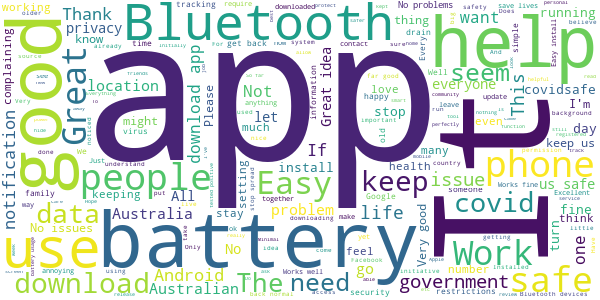

> Not atm  :date: __2020-05-10 11:52:52__

> Just get it guys! Then we can get drunk again! By not getting it you are taking away fun! They are not tracking you for personal gain... Please remove the tin foil hats and get it! Do it for me! I need some Gin!!!  :date: __2020-05-10 11:29:16__

> It good  :date: __2020-05-10 11:19:47__

> Works as advertised. Data stays in the device until you personally authorise upload of information. Can't fault this app to help get us back to normal life. Contrary to what some are saying, it had almost zero effect on battery. I can only assume that people complaining about battery are trying to push their barrow to stop other people using the app.  :date: __2020-05-10 10:51:08__

> Excellent app ! However, my phone has an annoying habit of constantly turning off the Bluetooth function ( with no input from me ) . Extremely irritating , but I will try and sort it out. Not sure if anyone else having similar problems ???? Still having problems with my Motorola / Lenovo Moto G4+ and the bluetooth switching off all the time.  :date: __2020-05-10 10:19:51__

> Very good  :date: __2020-05-10 09:59:32__

> Easy  :date: __2020-05-10 08:24:44__

> Oh yes i love this app absolutely beautiful  :date: __2020-05-10 06:45:07__

> Everything seems to be working except it's not showing up when doing a scan to find it.  :date: __2020-05-10 06:13:14__

> Problem on Moto 3G, generally, it seems to work ok, but, on two or three occasions it goes haywire, it comes up with a modal popup "Unfortunately Bluetooth share has stopped" The popup keeps poping up faster than I can OK it.  :date: __2020-05-10 01:29:20__

#### 4-star reviews

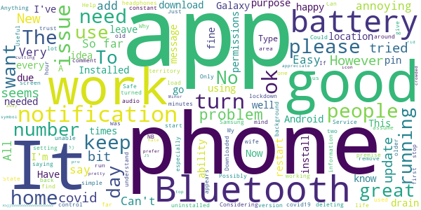

> Works pretty well. Would prefer it if the symbol would go away from the top of the phone. Type A's hate that. Considering deleting it to get rid of the icon.  :date: __2020-05-10 10:37:08__

> Minor issue with Bluetooth headphones cutting out in crowded areas.  :date: __2020-05-10 08:50:25__

> appreciate the updates  :date: __2020-05-10 05:52:10__

> Installed and works ok on Samsung Galaxy J5 pro with Android 9.  :date: __2020-05-10 03:12:56__

> 5j k5jj55555555555555555555 55555555⁵555555555555555556224555555555555555555555j5555555555 5555555555555555555555555565555555555555555555555555555555555555555  :date: __2020-05-10 02:46:56__

> New update offers much better stability.  :date: __2020-05-09 13:55:34__

> The app does not work tried to download it 3 times  :date: __2020-05-09 07:19:40__

> Happy with the premise of the app, but it interrupts the use of my Bluetooth speaker and headphones so I've had o emporsrily uninstall it. Can this be looked into please?  :date: __2020-05-09 04:03:10__

> Possibly life saving  :date: __2020-05-09 03:45:41__

> Up to date info.  :date: __2020-05-09 01:44:11__

#### 3-star reviews

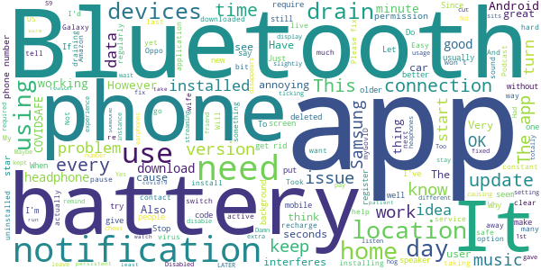

> If there is a chance the app can save lives it's worth the bugs. Yes it compromises other Bluetooth connections and battery usage slightly increases, but both are preferable to death. And to those concerned about 'giving away' your location; you gave that away when you bought a mobile phone.  :date: __2020-05-10 03:10:44__

> Since installing the app my Bluetooth earphones seem to be a bit glitchy.. The sound is very broken with short pauses in between. A friend experiences the same (both Samsung, but different brands of earphones).. Would be great to get this fixed. It is pretty annoying.  :date: __2020-05-10 00:44:18__

> I had to uninstall temporarily to use my skullcandy headphones as the Bluetooth kept cutting the music out, my husband didn't have the same problem with his Bose Bluetooth headphones, both using Samsung Galaxy S9.  :date: __2020-05-09 23:39:59__

> It chews through the battery usage. Have to recharge through the day as well as at night. Other than that, it just sits there unobtrusively in the background.  :date: __2020-05-09 13:42:17__

> No negative or positive experience with the app as yet.  :date: __2020-05-09 12:04:54__

> I downloaded this app ok but when I started the registration procee I fould it up somehown the I uninstalled the app so I could start all over but no I dont know how the reload the app. I am 88 years of age and not very computer literate  :date: __2020-05-09 11:17:25__

> Stops me playing my music via Bluetooth in the car. Keeps turning my music player on to pause. Damn annoying  :date: __2020-05-09 11:07:33__

> Want to have this app but it interferes with Bluetooth devises like headphones and speakers, causing them to glich regularly while trying to listen to things.  :date: __2020-05-09 10:16:44__

> Why does the app now require location setting to work where before it only required Bluetooth?  :date: __2020-05-09 06:13:24__

> Told you don't need to put in name, app demands first and last. Requires postcode for unknown reasons given it tracks you. Requires Bluetooth location data because app is locating you. App ToS tells a different story to ScoMo. Keep alive notification is obnoxiously coloured bright green for no clear reason  :date: __2020-05-09 05:08:55__

#### 2-star reviews

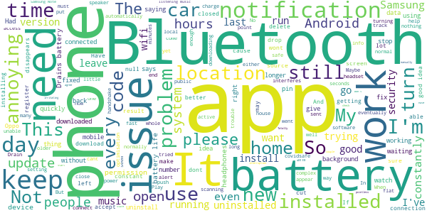

> Compeltey drains the battery life on your phone  :date: __2020-05-10 11:45:32__

> Totally 100% agree with everyone using this app, please work on improving the app to eliminate existing interruption to other bluetooth software. It's irritating!  :date: __2020-05-10 08:49:38__

> The app disappears from the background or deactivates automatically after some time. I realize this happened many time... I had to start the app again manually. I may have went out without realizing the app has died and it would not record my movement.  :date: __2020-05-10 08:31:23__

> Bluetooth music to my jbl bluetooth speaker has very annoying drop out very 30 seconds or couple of minutes with this app running  :date: __2020-05-10 06:29:28__

> Hmm not sure about this app. Hate that it has a permanent notification. So annoying and pointless, just run in the background. Won't appear in the app store on my parents phone and they are elderly and need it. Once again, not good enough.  :date: __2020-05-10 04:45:43__

> All was good till this last update. Now it says I'm not connected and to check permissions. I did and it still didn't work.. I restarted my phone but that didn't help either. I just uninstalled and reinstalled it seems to have worked  :date: __2020-05-10 00:25:22__

> When running in the back ground battery optermizer keeps dropping out and app stops working  :date: __2020-05-09 06:57:04__

> Easy sign up and was happy to have it but had to uninstall as not working the battery approval keeps turning app off so then it doesn't work have heard other oppo phones are having trouble too please look at fixing as would really like to have it working properly as the idea is good  :date: __2020-05-09 05:20:54__

> Have to turn bluetooth off to use wifi for some reason now when at home why I'm not sure. Will forget to turn on/off eventually. Have to allow my location which gives my home address. Been trying to avoid this ever since coroner spolated evidence to cover-up how sister met her end but now this is open info. To what ever gov agency wants location. Born to be hunted. Just don't go wife and kids.  :date: __2020-05-09 02:36:33__

> this app is a major drain on your battery life  :date: __2020-05-08 19:32:32__

#### 1-star reviews

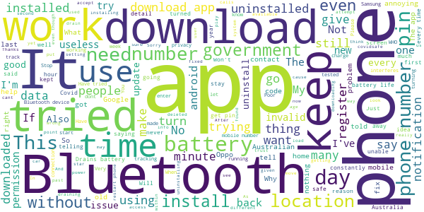

> Every time i try to get a pin it tells me to get the internet. But it was download through the net.  :date: __2020-05-10 12:05:06__

> Can't play music over Bluetooth without it pausing at frequent intervals (3-4 times per song at least) tried on two seperate Samsung's and does it on both  :date: __2020-05-10 11:42:28__

> Useless won't let me register  :date: __2020-05-10 10:29:36__

> Installed no problem on S9, but I have a smart watch BT for tracking 24/7 in case of seizure when away from home & BT headset to make/receive calls, App disconnects headset or watch to handshake other phones all the time. Had to uninstall it.  :date: __2020-05-10 07:37:41__

> Spent over 30 mins, got issued with 4 "6-digit codes" - NONE of which were acceptable ie none "worked". SO! thanks but no thanks, get your System to work, not just for Astronauts!! WHAT a waste of time this was!!  :date: __2020-05-10 07:36:25__

> I installed this app, and through the setup process it informed me that for it to work, it is mandatory for me to give my permission for it to access my location. A major red flag for me, so i like many others will be uninstalling this app immediately after i submit this review. They say that it's an Android thing, but i have other apps that use bluetooth without requiring my location. It's a liberal party lie. They say xx people have downloaded it, i bet that number doesn't reduce when deleted  :date: __2020-05-10 05:59:27__

> When active the app interferes with connected bluetooth devices.  :date: __2020-05-10 05:27:04__

> idk  :date: __2020-05-10 04:56:44__

> Poor  :date: __2020-05-10 04:43:29__

> It doesn't recognise my mobile number as valid. Followed all the instructions to fix it but no dice.  :date: __2020-05-10 04:37:18__

# WHO Info
App version ``2.1.0``

Analyzed with [covid-apps-observer](http://github.com/covid-apps-observer) project, version ``0.1``

## App overview
| | |
|-------------------------|-------------------------| 
| **Name**&nbsp;&nbsp;&nbsp;&nbsp;&nbsp;&nbsp;&nbsp;&nbsp;&nbsp;&nbsp;&nbsp;&nbsp;&nbsp;&nbsp;&nbsp;&nbsp;&nbsp;&nbsp;&nbsp;&nbsp;&nbsp;&nbsp;&nbsp;&nbsp;&nbsp;&nbsp;&nbsp;&nbsp;&nbsp;&nbsp;&nbsp;&nbsp;&nbsp;&nbsp;&nbsp;&nbsp;&nbsp;&nbsp;&nbsp;&nbsp;  | WHO Info |
| **Unique identifier** | org.who.infoapp |
| **Link to Google Play** | [https://play.google.com/store/apps/details?id=org.who.infoapp](https://play.google.com/store/apps/details?id=org.who.infoapp) |
| **Summary**  | The official World Health Organization Information App. |
| **Privacy policy** | [https://www.who.int/about/who-we-are/privacy-policy](https://www.who.int/about/who-we-are/privacy-policy) |
| **Latest version** | 2.1.0 |
| **Last update** | 2020-05-08 13:17:43 |
| **Recent changes** | This release resolves some minor fixes and introduces the latest case numbers reported to WHO. |
| **Installs**  | 100,000+ |
| **Category** | News & Magazines |
| **First release** | Apr 13, 2020 |
| **Size**  | 8.2M |
| **Supported Android version**  | 4.2 and up |

### Description
> Have the latest health information at your fingertips with the official World Health Organization Information App. This app displays the latest news, events, features and breaking updates on outbreaks. 
  
 WHO works worldwide to promote health, keep the world safe, and serve the vulnerable. 
 Our goal is to ensure that a billion more people have universal health coverage, to protect a billion more people from health emergencies, and provide a further billion people with better health and well-being.

### User interface
The developers of the app provide the following screenshots in the Google play store.
| | | |
|:-------------------------:|:-------------------------:|:-------------------------:|
 |   |   |   | 
 |   |   |   | 
 |   |   |   | 
 |   |   |   | 
 |   |   |   | 
 |   |   |   | 

## Development team
In the following we report the main information provided by the development team in the Google play store.

| | |
|-------------------------|-------------------------|
| **Developer**  | World Health Organization |
| **Website**  | [https://www.who.int/](https://www.who.int/) |
| **Email** | dcx@who.int |
| **Physical address**  | [Avenu Appia 20 1211 Geneva Switzerland](https://www.google.com/maps/search/Avenu%20Appia%2020%201211%20Geneva%20Switzerland) (Google Maps) |
| **Other developed apps**  | [https://play.google.com/store/apps/developer?id=World+Health+Organization](https://play.google.com/store/apps/developer?id=World+Health+Organization) |

## Android support

| | |
|-------------------------|-------------------------|
| **Declared target Android version**  | Android10, version 10 (API level 29) |
| **Effective target Android version**  | Android10, version 10 (API level 29) |
| **Minimum supported Android version**  | Jelly Bean, version 4.2.x (API level 17) |
| **Maximum target Android version**  | - |

The larger the difference between the minimum and maximum supported Android versions, the better. A larger difference means a wider audience. For example, old phones have a very low Android version, so a high minimum supported Android version means that the app cannot be used by users with old phones, thus leading to accessibility problems. 

## Requested permissions

In the following we report the complete list of the permissions requested by the app. 

| **Permission** | **Protection level** | **Description** | 
|-------------------------|-------------------------|-------------------------|
 **android.permission INTERNET** | Normal | Allows applications to open network sockets. 
 **android.permission READ_EXTERNAL_STORAGE** | :warning:**Dangerous** | Allows an application to read from external storage. 
 **android.permission WRITE_EXTERNAL_STORAGE** | :warning:**Dangerous** | Allows an application to write to external storage. 

## Mentioned servers

| **Server** | **Registrant** | **Registrant country** | **Creation date** | 
|-------------------------|-------------------------|-------------------------|-------------------------|
-

## Security analysis 

Below we report the main security warnings raised by our execution of the [Androwarn](https://github.com/maaaaz/androwarn) security analysis tool.

**Connection interfaces exfiltration**
> - This application reads details about the currently active data network 
> - This application tries to find out if the currently active data network is metered 

**Suspicious connection establishment**
> - This application opens a Socket and connects it to the remote address 'Lfi/iki/elonen/NanoHTTPD$ResponseException;' on the 'N/A' port  
> - This application opens a Socket and connects it to the remote address 'NanoHttpd Shutdown' on the 'N/A' port  

**Code execution**
> - This application loads a native library: 'NativeScript' 
> - This application executes a UNIX command containing this argument: '2' 

## User ratings and reviews

Below we provide information about how end users are reacting to the app in terms of ratings and reviews in the Google Play store.

### Ratings

The WHO Info app has been installed by more than **100000** times. At this time, **309** rated the app and its average score is **3.66**. Below we show the distribution of the ratings across the usual star-based rating of Google Play

:star::star::star::star::star:: 173

:star::star::star::star:: 30

:star::star::star:: 9

:star::star:: 18

:star:: 77

### Reviews 

#### 5-star reviews

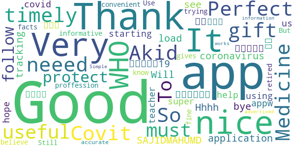

> Covit 19  :date: __2020-05-10 10:57:13__

> Good  :date: __2020-05-09 14:49:27__

> I neeed Medicine!  :date: __2020-05-07 18:12:09__

> So useful must have app!  :date: __2020-05-07 11:42:33__

> To protect myself I follow this application  :date: __2020-05-06 16:44:22__

> مقاله ی بیماری کوبید19  :date: __2020-05-06 15:09:54__

> Hhhh  :date: __2020-05-06 13:10:10__

> I would like to down load coronavirus tracking app  :date: __2020-05-05 11:31:22__

> করোনা ভাইরাজ  :date: __2020-05-04 20:15:49__

> Very good thanks bye  :date: __2020-05-04 19:17:17__

#### 4-star reviews

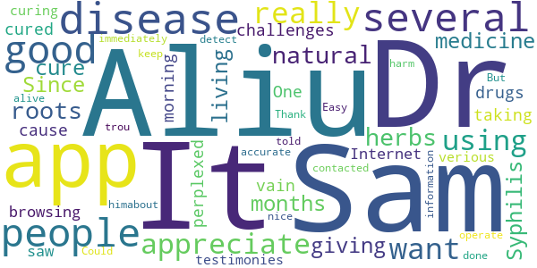

> I really want to appreciate Dr. Aliu Sam for using his natural roots and herbs medicine to cure me of Syphilis Since 11 months now I have been living with this disease and it has been giving me challenges, I was so perplexed cause I have been taking several drugs to be cured but all have been in vain. One morning I was browsing through the Internet then i saw several testimonies about Dr. Aliu Sam curing people off verious diseases and immediately I contacted Dr. Aliu Sam I told himabout my trou  :date: __2020-05-08 05:33:57__

> It did not detect  :date: __2020-04-29 18:37:26__

> Could do with more accurate information to keep people alive. But no harm done.  :date: __2020-04-29 13:41:12__

> Its good app. Easy to operate  :date: __2020-04-27 14:08:23__

> It's so nice app  :date: __2020-04-25 14:50:48__

> Thank you, good app.  :date: __2020-04-25 03:11:24__

#### 3-star reviews

> Best.  :date: __2020-04-20 13:14:33__

> Looks nice great look smooth Lario  :date: __2020-04-18 09:44:30__

#### 2-star reviews

> Thanks for your help.  :date: __2020-04-22 18:52:40__

#### 1-star reviews

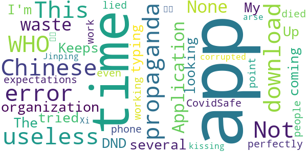

> None  :date: __2020-05-10 11:40:37__

> Application is a waste of time, just like the organization.  :date: __2020-05-08 14:00:29__

> Chinese propaganda  :date: __2020-05-06 11:43:52__

> Keeps coming Up with typing error  :date: __2020-05-06 02:07:37__

> Errors  :date: __2020-05-03 17:24:33__

> This app will not download. I have tried several times. The app is useless.  :date: __2020-05-02 13:44:43__

> DND  :date: __2020-05-01 23:59:44__

> Not what I'm looking for  :date: __2020-04-29 09:57:51__

> Useless  :date: __2020-04-28 17:56:42__

> My expectations for this app is to work perfectly  :date: __2020-04-28 09:11:44__

# Coronavirus Australia
App version ``1.0.4``

Analyzed with [covid-apps-observer](http://github.com/covid-apps-observer) project, version ``0.1``

## App overview
| | |
|-------------------------|-------------------------| 
| **Name**&nbsp;&nbsp;&nbsp;&nbsp;&nbsp;&nbsp;&nbsp;&nbsp;&nbsp;&nbsp;&nbsp;&nbsp;&nbsp;&nbsp;&nbsp;&nbsp;&nbsp;&nbsp;&nbsp;&nbsp;&nbsp;&nbsp;&nbsp;&nbsp;&nbsp;&nbsp;&nbsp;&nbsp;&nbsp;&nbsp;&nbsp;&nbsp;&nbsp;&nbsp;&nbsp;&nbsp;&nbsp;&nbsp;&nbsp;&nbsp;  | Coronavirus Australia |
| **Unique identifier** | au.gov.health.covid19 |
| **Link to Google Play** | [https://play.google.com/store/apps/details?id=au.gov.health.covid19](https://play.google.com/store/apps/details?id=au.gov.health.covid19) |
| **Summary**  | Official Government Information |
| **Privacy policy** | [https://www.health.gov.au/using-our-websites/privacy](https://www.health.gov.au/using-our-websites/privacy) |
| **Latest version** | 1.0.4 |
| **Last update** | 2020-04-24 01:22:04 |
| **Recent changes** | - Improved support for push notifications - Support for video content added |
| **Installs**  | 500,000+ |
| **Category** | Health & Fitness |
| **First release** | Mar 28, 2020 |
| **Size**  | 7.9M |
| **Supported Android version**  | 6.0 and up |

### Description
> You can use the Australian Government Coronavirus app to:
 - stay up to date with the official information and advice 
 - important health advice to help stop the spread and stay healthy
 - get a quick snapshot of the current official status within Australia
 - check your symptoms if you are concerned about yourself or someone else
 - find relevant contact information 
 - access updated information from the Australian Government
 - receive push notifications of urgent information and updates
 Trusted, Australian information
 All information in the Australian Government Coronavirus app is sourced from Australia’s leading health organisations and has undergone a quality assurance process so people can know it is safe, appropriate and relevant for Australians. 
 Disclaimer
 Whilst this app has been reviewed for clinical accuracy, the content is not a substitute for professional advice and should not be used as an alternative to professional healthcare. If you have a particular medical problem, please consult a doctor or a specialist.

### User interface
The developers of the app provide the following screenshots in the Google play store.
| | | |
|:-------------------------:|:-------------------------:|:-------------------------:|
 |   |   |   | 
 | 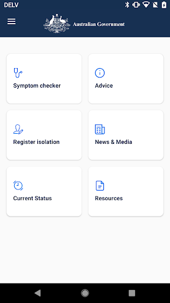 

## Development team
In the following we report the main information provided by the development team in the Google play store.

| | |
|-------------------------|-------------------------|
| **Developer**  | DTA App Developer |
| **Website**  | [http://health.gov.au](http://health.gov.au) |
| **Email** | info@health.gov.au |
| **Physical address**  | - |
| **Other developed apps**  | [https://play.google.com/store/apps/developer?id=DTA+App+Developer](https://play.google.com/store/apps/developer?id=DTA+App+Developer) |

## Android support

| | |
|-------------------------|-------------------------|
| **Declared target Android version**  | Android10, version 10 (API level 29) |
| **Effective target Android version**  | Android10, version 10 (API level 29) |
| **Minimum supported Android version**  | Marshmallow, version 6.0 (API level 23) |
| **Maximum target Android version**  | - |

The larger the difference between the minimum and maximum supported Android versions, the better. A larger difference means a wider audience. For example, old phones have a very low Android version, so a high minimum supported Android version means that the app cannot be used by users with old phones, thus leading to accessibility problems. 

## Requested permissions

In the following we report the complete list of the permissions requested by the app. 

| **Permission** | **Protection level** | **Description** | 
|-------------------------|-------------------------|-------------------------|
 **android.permission ACCESS_COARSE_LOCATION** | :warning:**Dangerous** | Allows an app to access approximate location. 
 **android.permission ACCESS_FINE_LOCATION** | :warning:**Dangerous** | Allows an app to access precise location. 
 **android.permission ACCESS_NETWORK_STATE** | Normal | Allows applications to access information about networks. 
 **android.permission INTERNET** | Normal | Allows applications to open network sockets. 
 **android.permission WAKE_LOCK** | Normal | Allows using PowerManager WakeLocks to keep processor from sleeping or screen from dimming. 
 **com.google.android.c2dm.permission RECEIVE** | - | - 
 **com.google.android.finsky.permission BIND_GET_INSTALL_REFERRER_SERVICE** | - | - 

## Mentioned servers

| **Server** | **Registrant** | **Registrant country** | **Creation date** | 
|-------------------------|-------------------------|-------------------------|-------------------------|
 | googlesyndication.com | Google LLC | :us: US | 2003-01-21 06:17:24 |
 | google.com | Google LLC | :us: US | 1997-09-15 04:00:00 |
 | app-measurement.com | Google LLC | :us: US | 2015-06-19 20:13:31 |
 | apple.com | Apple Inc. | :us: US | 1987-02-19 05:00:00 |
 | aomedia.org | Contact Privacy Inc. Customer 1243324949 | :canada: CA | 2015-08-24 14:07:31 |
 | w3.org | W3C | :us: US | 1994-07-06 04:00:00 |
 | googleapis.com | Google LLC | :us: US | 2005-01-25 17:52:26 |
 | googleadservices.com | Google LLC | :us: US | 2003-06-19 16:34:53 |
 | googleapis.com | Google LLC | :us: US | 2005-01-25 17:52:26 |
 | crashlytics.com | Google LLC | :us: US | 2011-01-21 15:30:40 |

## Security analysis 

Below we report the main security warnings raised by our execution of the [Androwarn](https://github.com/maaaaz/androwarn) security analysis tool.

**Telephony identifiers leakage**
> - This application reads the ISO country code equivalent of the current registered operator's MCC (Mobile Country Code) 
> - This application reads the device phone type value 

**Connection interfaces exfiltration**
> - This application reads details about the currently active data network 
> - This application tries to find out if the currently active data network is metered 

**Telephony services abuse**
> - This application makes phone calls 

**Suspicious connection establishment**
> - This application opens a Socket and connects it to the remote address '' on the 'N/A' port  
> - This application opens a Socket and connects it to the remote address 'Ljava/lang/StringBuilder;->toString()Ljava/lang/String;' on the 'N/A' port  
> - This application opens a Socket and connects it to the remote address 'Ljava/net/Proxy;->type()Ljava/net/Proxy$Type;' on the 'N/A' port  
> - This application opens a Socket and connects it to the remote address 'timeout' on the 'N/A' port  

**Code execution**
> - This application loads a native library 

## User ratings and reviews

Below we provide information about how end users are reacting to the app in terms of ratings and reviews in the Google Play store.

### Ratings

The Coronavirus Australia app has been installed by more than **500000** times. At this time, **1285** rated the app and its average score is **3.6535432**. Below we show the distribution of the ratings across the usual star-based rating of Google Play

:star::star::star::star::star:: 677

:star::star::star::star:: 111

:star::star::star:: 141

:star::star:: 80

:star:: 273

### Reviews 

#### 5-star reviews

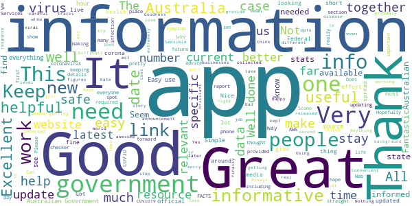

> It's very useful and gives me peace of mind  :date: __2020-05-08 20:19:48__

> Crucial app you need to survive this disease that was definitely not released by any government or grouping of people to quell the overwhelming amount of people that are alive. This app it had too many similarities to plague Inc, but the story was the biggest failure of it all. I mean truly, who would believe our governments would release this disease on the people, it's too cruel to imagine. It's not like the powers to be around you are plotting against you. Or are they..  :date: __2020-05-08 02:07:04__

> I am reviewing in response to the current most highly rated negative review. TLDR this is not spyware. Storing data on Amazon Web Services (AWS) is no real concern. AWS *does* have servers in Australia. It is very stable, and any sensitive data collected by the app (which afaik is *all* voluntary) will probably be about as secure as most government services. Using AWS means 99.99% uptime (not exaggerating), that the app is available much sooner than it would be otherwise, and cheaper on tax $$  :date: __2020-05-06 10:36:30__

> A must have app. Works seamlessly in the background and makes me feel more confident that I will know if I've been exposed to the virus. Everyone should have it  :date: __2020-05-05 22:22:45__

> Let stop the spread of Covid19!  :date: __2020-05-05 09:30:18__

> to get us bak 2normal...  :date: __2020-05-04 16:02:19__

> It tells me what I need to know.  :date: __2020-05-04 10:09:29__

> Great app  :date: __2020-05-04 09:16:38__

> 2 O,44. ? Got ýi.  :date: __2020-05-04 04:34:31__

> Keeps me safe  :date: __2020-05-04 00:48:58__

#### 4-star reviews

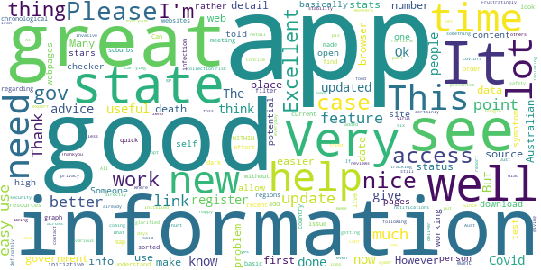

> I like  :date: __2020-05-07 01:23:44__

> Good  :date: __2020-05-01 06:29:25__

> Cant self register  :date: __2020-04-30 02:43:21__

> Being a high risk person I installed the app, put in details. I was told to see my gp which I did and even had the test. The app doesn't allow you to report that you have done it and for you to say that you don't have COVID19 . I think that would be something that should have been added.  :date: __2020-04-29 04:01:07__

> Just updated  :date: __2020-04-28 10:47:52__

> All I get is Aust gov site. Where is app?  :date: __2020-04-27 22:20:40__

> Frustratingly good  :date: __2020-04-27 14:40:16__

> Very useful. Concise, well presented. Told me what l need to know. Thanks  :date: __2020-04-27 03:26:44__

> Thankyou for getting this app. Now everyone pls get it  :date: __2020-04-26 11:13:44__

> I'm giving it 4 stars as I think it's a good idea for tracking the virus but it will only work if others download it. I need it as I deliver food to 15 - 35 people six days a week, and I certainly would like to know who I am coming across, I also think all retail workers should definately download it for their own safety. I don't give a toss about its privacy it's a lot less invasive than Google Maps & I'm on that everyday, yes it will have to iron out problems but that's ok.  :date: __2020-04-26 07:39:42__

#### 3-star reviews

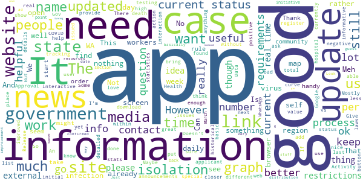

> Never have received the pin to open it  :date: __2020-05-08 01:20:55__

> Won't download past 97%  :date: __2020-05-07 12:21:06__

> Mostly disappointed that in all government media announcements they just say 'download the app' without specifying the name of the app clearly. There are several COVID-19 apps out there now. Give it a distinctive name.  :date: __2020-05-07 10:02:42__

> An interactive app would be far more useful. INPUT Activity I want to undertake? Personal details? Employment details? Reason for activity? PROCESS Verification process. OUTPUT. Approval /Denial /More information - contact Barcode issued to applicant on approval. Applicant issued with a description of any special requirements. Eg: FIFO to travel Site - WA - NSW - WA - site Can the process be undertaken? ANS Special requirements (isolation and period and process for each state)  :date: __2020-05-05 12:10:07__

> Laggy on the opening and update of information but enough for quick access check .  :date: __2020-05-05 09:48:51__

> Dear Gov Oz good overall but if time ask those negative reviews e.g. force closure what system they use....keep up good work... we pray to Jesu Mary's Health bless us  :date: __2020-05-04 13:56:47__

> Lite info and few updates ... than news media  :date: __2020-05-01 10:01:51__

> Okay, this app keeps consumers informed and offers a dialect about what to do if you need to do something/anything. However, the app has zero allowance for inquiry; no room to question the ongoing situation. I don't disregard the media as an institution but its reporter's are sometimes off the beaten path and want to break a story rather than provide valuable information. Things will get better, stay vigilant and patient.  :date: __2020-04-29 14:26:47__

> Is this the app to detect the virus?  :date: __2020-04-27 02:37:12__

> This app brings together all the gov websites.. We'll done.. But it's COVIDSafe you want. That tracks your interaction. Real value is knowing the active cases and our exposure.. I really want to keep safe  :date: __2020-04-27 01:21:15__

#### 2-star reviews

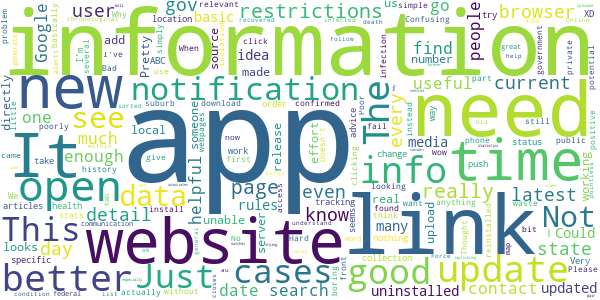

> Not enough real time information I would like to see more statistics especially our Reff number  :date: __2020-05-07 11:17:36__

> Release the source code of both client and server and more of us will install this app... It looks like the app generates and uploads a private/public key pair and uploads one or the other to a central server and associates it directly to a user, other users when testing positive can upload their contact history to the server and matches that data to details of other users they came into contact with directly implicating the contacts, private user data should not be uploaded without consent.  :date: __2020-05-04 12:39:48__

> Confusing  :date: __2020-05-04 09:43:14__

> Will not download on my phone  :date: __2020-05-01 08:18:24__

> Takes forever to download. Been trying for 2 days now.  :date: __2020-04-29 10:31:12__

> I downloaded it but still do not know if it is actually working.  :date: __2020-04-27 03:53:37__

> Please add a prominent link to the covidsafe app.  :date: __2020-04-27 00:50:53__

> Update too late every day  :date: __2020-04-27 00:17:59__

> Buggy as!  :date: __2020-04-26 13:48:12__

> Not the new tracker app i was seeking  :date: __2020-04-26 11:00:11__

#### 1-star reviews

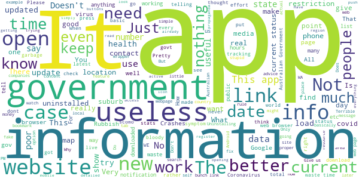

> Greetings from Jesper  :date: __2020-05-10 04:12:08__

> Terrible  :date: __2020-05-10 03:33:23__

> Cost a fortune in data  :date: __2020-05-09 02:33:02__

> Chews through the battery.  :date: __2020-05-08 00:01:52__

> Covid 19 is fake check the news  :date: __2020-05-07 14:02:27__

> Does it do anything????  :date: __2020-05-07 11:14:38__

> Only sheep download this app because people are stupid. Stuff the government they just want to track us if not why did they chose to have a data retention law passed think about it  :date: __2020-05-07 00:19:33__

> This app is never up to date! Useless!  :date: __2020-05-06 17:16:15__

> I am trying to register this is stupid  :date: __2020-05-06 10:47:22__

> Drain heaps of battery  :date: __2020-05-06 02:57:56__

# MyAus COVID-19
App version ``13``

Analyzed with [covid-apps-observer](http://github.com/covid-apps-observer) project, version ``0.1``

## App overview
| | |
|-------------------------|-------------------------| 
| **Name**&nbsp;&nbsp;&nbsp;&nbsp;&nbsp;&nbsp;&nbsp;&nbsp;&nbsp;&nbsp;&nbsp;&nbsp;&nbsp;&nbsp;&nbsp;&nbsp;&nbsp;&nbsp;&nbsp;&nbsp;&nbsp;&nbsp;&nbsp;&nbsp;&nbsp;&nbsp;&nbsp;&nbsp;&nbsp;&nbsp;&nbsp;&nbsp;&nbsp;&nbsp;&nbsp;&nbsp;&nbsp;&nbsp;&nbsp;&nbsp;  | MyAus COVID-19 |
| **Unique identifier** | com.myaus |
| **Link to Google Play** | [https://play.google.com/store/apps/details?id=com.myaus](https://play.google.com/store/apps/details?id=com.myaus) |
| **Summary**  | An essential, multi-language informational app about COVID-19 in Australia. |
| **Privacy policy** | [https://migrationcouncil.org.au/policy/](https://migrationcouncil.org.au/policy/) |
| **Latest version** | 13 |
| **Last update** | 2020-05-09 15:29:17 |
| **Recent changes** | - Access to 8 new languages! - Additional language animations  - New information flash cards - Bug fixing and performance improvements |
| **Installs**  | 500+ |
| **Category** | Health & Fitness |
| **First release** | Apr 23, 2020 |
| **Size**  | 31M |
| **Supported Android version**  | 4.1 and up |

### Description
> You can use the MyAus COVID-19 App to:
 - Find comprehensive information on rules and regulations regarding COVID-19 in Australia
 - Read information in multiple-languages
 - Use simple search to find important tips on how to stay healthy
 - View a snapshot of the current statistics in different states in Australia
 - Use tools such as a symptom checker to identify any concerns
 - View animated videos in multiple languages
 - Receive push notifications for updates 
 - Discover a huge amount of ‘in-app’ information, viewable offline once downloaded
 The MyAus App has been developed to provide the most simple, comprehensive, easy-to-use experience on mobile devices for finding information on Coronavirus in Australia. 
 More languages than other apps, more ways to educate yourself through clear design, animation and interactive elements.

### User interface
The developers of the app provide the following screenshots in the Google play store.
| | | |
|:-------------------------:|:-------------------------:|:-------------------------:|
 | 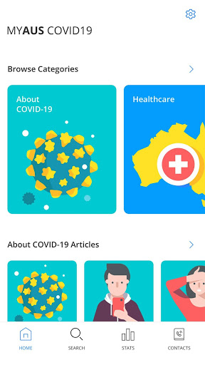  | 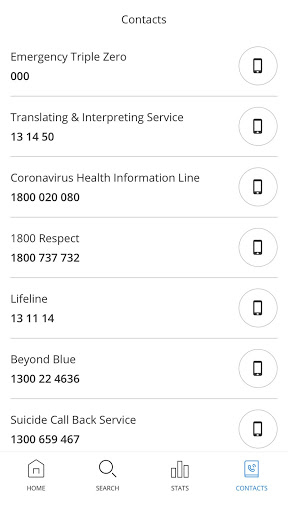  | 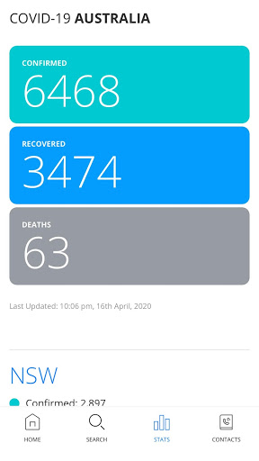  | 
 | 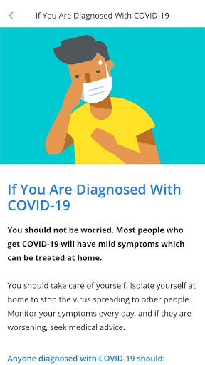  | 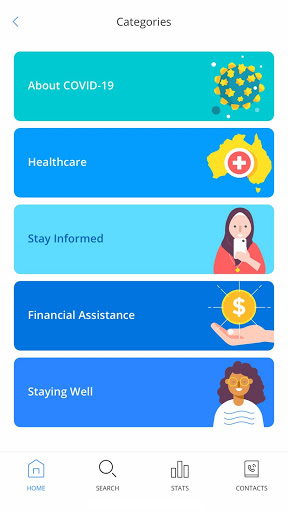 

## Development team
In the following we report the main information provided by the development team in the Google play store.

| | |
|-------------------------|-------------------------|
| **Developer**  | Migration Council Australia |
| **Website**  | [https://migrationcouncil.org.au/](https://migrationcouncil.org.au/) |
| **Email** | info@migrationcouncil.org.au |
| **Physical address**  | - |
| **Other developed apps**  | [https://play.google.com/store/apps/developer?id=Migration+Council+Australia](https://play.google.com/store/apps/developer?id=Migration+Council+Australia) |

## Android support

| | |
|-------------------------|-------------------------|
| **Declared target Android version**  | Pie, version 9 (API level 28) |
| **Effective target Android version**  | Pie, version 9 (API level 28) |
| **Minimum supported Android version**  | Jelly Bean, version 4.1.x (API level 16) |
| **Maximum target Android version**  | - |

The larger the difference between the minimum and maximum supported Android versions, the better. A larger difference means a wider audience. For example, old phones have a very low Android version, so a high minimum supported Android version means that the app cannot be used by users with old phones, thus leading to accessibility problems. 

## Requested permissions

In the following we report the complete list of the permissions requested by the app. 

| **Permission** | **Protection level** | **Description** | 
|-------------------------|-------------------------|-------------------------|
 **android.permission ACCESS_NETWORK_STATE** | Normal | Allows applications to access information about networks. 
 **android.permission ACCESS_WIFI_STATE** | Normal | Allows applications to access information about Wi-Fi networks. 
 **android.permission INTERNET** | Normal | Allows applications to open network sockets. 
 **android.permission READ_APP_BADGE** | - | - 
 **android.permission RECEIVE_BOOT_COMPLETED** | Normal | Allows an application to receive the Intent.ACTION_BOOT_COMPLETED that is broadcast after the system finishes booting. 
 **android.permission VIBRATE** | Normal | Allows access to the vibrator. 
 **android.permission WAKE_LOCK** | Normal | Allows using PowerManager WakeLocks to keep processor from sleeping or screen from dimming. 
 **com.anddoes.launcher.permission UPDATE_COUNT** | - | - 
 **com.google.android.c2dm.permission RECEIVE** | - | - 
 **com.google.android.finsky.permission BIND_GET_INSTALL_REFERRER_SERVICE** | - | - 
 **com.htc.launcher.permission READ_SETTINGS** | - | - 
 **com.htc.launcher.permission UPDATE_SHORTCUT** | - | - 
 **com.huawei.android.launcher.permission CHANGE_BADGE** | - | - 
 **com.huawei.android.launcher.permission READ_SETTINGS** | - | - 
 **com.huawei.android.launcher.permission WRITE_SETTINGS** | - | - 
 **com.majeur.launcher.permission UPDATE_BADGE** | - | - 
 **com.myaus.permission C2D_MESSAGE** | - | - 
 **com.oppo.launcher.permission READ_SETTINGS** | - | - 
 **com.oppo.launcher.permission WRITE_SETTINGS** | - | - 
 **com.sec.android.provider.badge.permission READ** | - | - 
 **com.sec.android.provider.badge.permission WRITE** | - | - 
 **com.sonyericsson.home.permission BROADCAST_BADGE** | - | - 
 **com.sonymobile.home.permission PROVIDER_INSERT_BADGE** | - | - 
 **me.everything.badger.permission BADGE_COUNT_READ** | - | - 
 **me.everything.badger.permission BADGE_COUNT_WRITE** | - | - 

## Mentioned servers

| **Server** | **Registrant** | **Registrant country** | **Creation date** | 
|-------------------------|-------------------------|-------------------------|-------------------------|
 | bugsnag.com | Bugsnag Inc. | :us: US | 2011-08-18 03:26:10 |
 | android.com | Google LLC | :us: US | 1997-06-23 04:00:00 |
 | googlesyndication.com | Google LLC | :us: US | 2003-01-21 06:17:24 |
 | google.com | Google LLC | :us: US | 1997-09-15 04:00:00 |
 | github.com | GitHub, Inc. | :us: US | 2007-10-09 18:20:50 |
 | w3.org | W3C | :us: US | 1994-07-06 04:00:00 |
 | googleapis.com | Google LLC | :us: US | 2005-01-25 17:52:26 |
 | app-measurement.com | Google LLC | :us: US | 2015-06-19 20:13:31 |
 | googleapis.com | Google LLC | :us: US | 2005-01-25 17:52:26 |
 | googleadservices.com | Google LLC | :us: US | 2003-06-19 16:34:53 |

## Security analysis 

Below we report the main security warnings raised by our execution of the [Androwarn](https://github.com/maaaaz/androwarn) security analysis tool.

**Telephony identifiers leakage**
> - This application reads the ISO country code equivalent of the current registered operator's MCC (Mobile Country Code) 
> - This application reads the numeric name (MCC+MNC) of current registered operator 
> - This application reads the operator name 

**Connection interfaces exfiltration**
> - This application reads details about the currently active data network 
> - This application tries to find out if the currently active data network is metered 

**Suspicious connection establishment**
> - This application opens a Socket and connects it to the remote address '' on the '80' port  
> - This application opens a Socket and connects it to the remote address '' on the 'N/A' port  
> - This application opens a Socket and connects it to the remote address 'Ljava/lang/StringBuilder;->toString()Ljava/lang/String;' on the ': connect, resolve' port  
> - This application opens a Socket and connects it to the remote address 'Ljava/lang/StringBuilder;->toString()Ljava/lang/String;' on the 'N/A' port  
> - This application opens a Socket and connects it to the remote address 'Ljava/net/Proxy;->type()Ljava/net/Proxy$Type;' on the 'N/A' port  
> - This application opens a Socket and connects it to the remote address 'timeout' on the 'N/A' port  

**Pim data leakage**
> - This application accesses data stored in the clipboard 

**Code execution**
> - This application loads a native library 
> - This application loads a native library: 'bugsnag-ndk' 
> - This application loads a native library: 'bugsnag-plugin-android-anr' 
> - This application executes a UNIX command containing this argument: '2' 

## User ratings and reviews

Below we provide information about how end users are reacting to the app in terms of ratings and reviews in the Google Play store.

### Ratings

The MyAus COVID-19 app has been installed by more than **500** times. At this time, **6** rated the app and its average score is **4.8333335**. Below we show the distribution of the ratings across the usual star-based rating of Google Play

:star::star::star::star::star:: 5

:star::star::star::star:: 1

:star::star::star:: 0

:star::star:: 0

:star:: 0

### Reviews 

#### 5-star reviews

> I I think this is a very useful app.  :date: __2020-04-28 10:47:19__

> Great app! Very easy to navigate and loads of relevant info.  :date: __2020-04-26 12:57:58__

#### 4-star reviews

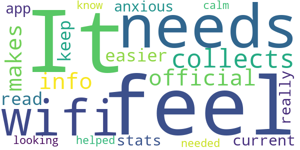

> It needs wifi. It collects official info but makes it easier to read and keep up with current stats. I feel really anxious and this app helped me feel calm while I was looking up what I needed to know.  :date: __2020-04-27 07:31:18__

#### 3-star reviews

No recent reviews available with 3 stars.

#### 2-star reviews

No recent reviews available with 2 stars.

#### 1-star reviews

No recent reviews available with 1 stars.

# OpenWHO: Knowledge for Health Emergencies
App version ``3.3``

Analyzed with [covid-apps-observer](http://github.com/covid-apps-observer) project, version ``0.1``

## App overview
| | |
|-------------------------|-------------------------| 
| **Name**&nbsp;&nbsp;&nbsp;&nbsp;&nbsp;&nbsp;&nbsp;&nbsp;&nbsp;&nbsp;&nbsp;&nbsp;&nbsp;&nbsp;&nbsp;&nbsp;&nbsp;&nbsp;&nbsp;&nbsp;&nbsp;&nbsp;&nbsp;&nbsp;&nbsp;&nbsp;&nbsp;&nbsp;&nbsp;&nbsp;&nbsp;&nbsp;&nbsp;&nbsp;&nbsp;&nbsp;&nbsp;&nbsp;&nbsp;&nbsp;  | OpenWHO: Knowledge for Health Emergencies |
| **Unique identifier** | de.xikolo.openwho |
| **Link to Google Play** | [https://play.google.com/store/apps/details?id=de.xikolo.openwho](https://play.google.com/store/apps/details?id=de.xikolo.openwho) |
| **Summary**  | Life-saving knowledge for frontline responders in health emergencies. |
| **Privacy policy** | [https://openwho.org/pages/privacy](https://openwho.org/pages/privacy) |
| **Latest version** | 3.3 |
| **Last update** | 2020-05-05 16:17:12 |
| **Recent changes** | - Redesign of some UI elements - Bug fixes and performance improvements |
| **Installs**  | 1,000,000+ |
| **Category** | Education |
| **First release** | May 17, 2017 |
| **Size**  | 36M |
| **Supported Android version**  | 5.0 and up |

### Description
> OpenWHO is the World Health Organization's (WHO) interactive knowledge-transfer platform offering online courses to improve the response to health emergencies. OpenWHO enables the Organization and its key partners to transfer life-saving knowledge to large numbers of frontline responders.
 With OpenWHO, you have the flexibility to learn at your convenience. Watch the short video lectures and test your knowledge with self-tests when and where you like. The course forum and the collaboration space allow you to get in touch with other participants and experts around the world.
  
 Designed primarily for health care workers, frontline responders, and decision-makers, the app is also a source of information for those affected by disease outbreaks and health emergencies, or for those with a general interest in WHO's work in health emergencies.
  
 It features 6 channels:
 - The <b>Outbreak</b> channel addresses the management of infectious diseases and provides life-saving, scientific information.
 - The <b>Ready for Response</b> channel helps prepare personnel who are training for deployment to work in disease outbreaks and health emergencies.
 - The <b>Get Social</b> channel focuses on social science-based interventions and helps to communicate with affected communities.
 - The <b>Preparing for Pandemics</b> channel brings together courses on various aspects of preparedness, including surveillance, public health measures and risk communication during a pandemic.
 - The <b>COVID-19</b> channel provides learning resources in WHO's 6 official languages (Arabic, Chinese, English, French, Russian and Spanish) for health professionals, decision-makers and the public for the outbreak of coronavirus disease (COVID-19).
 - The <b>COVID-19 National Languages</b> channel provides the same learning resources as the COVID-19 channel but in national languages, such as Indonesian, Japanese and Portuguese. 
  
 OpenWHO courses are available in many languages, including WHO's 6 official languages. 
  
 Download the app now, and join the OpenWHO community.
 This app is developed in cooperation between the Hasso Plattner Institute and the WHO. The learning content is provided exclusively by the WHO.

### User interface
The developers of the app provide the following screenshots in the Google play store.
| | | |
|:-------------------------:|:-------------------------:|:-------------------------:|
 |   |   |   | 
 |   |   |   | 

## Development team
In the following we report the main information provided by the development team in the Google play store.

| | |
|-------------------------|-------------------------|
| **Developer**  | HPI Knowledge Engineering Team |
| **Website**  | [https://openwho.org/](https://openwho.org/) |
| **Email** | openwho-support@hpi.de |
| **Physical address**  | [Prof.-Dr.-Helmert-Str.2-3 14482 Potsdam](https://www.google.com/maps/search/Prof.-Dr.-Helmert-Str.2-3%2014482%20Potsdam) (Google Maps) |
| **Other developed apps**  | [https://play.google.com/store/apps/developer?id=7185448023325736337](https://play.google.com/store/apps/developer?id=7185448023325736337) |

## Android support

| | |
|-------------------------|-------------------------|
| **Declared target Android version**  | Android10, version 10 (API level 29) |
| **Effective target Android version**  | Android10, version 10 (API level 29) |
| **Minimum supported Android version**  | Lollipop, version 5.0 (API level 21) |
| **Maximum target Android version**  | - |

The larger the difference between the minimum and maximum supported Android versions, the better. A larger difference means a wider audience. For example, old phones have a very low Android version, so a high minimum supported Android version means that the app cannot be used by users with old phones, thus leading to accessibility problems. 

## Requested permissions

In the following we report the complete list of the permissions requested by the app. 

| **Permission** | **Protection level** | **Description** | 
|-------------------------|-------------------------|-------------------------|
 **android.permission ACCESS_NETWORK_STATE** | Normal | Allows applications to access information about networks. 
 **android.permission ACCESS_WIFI_STATE** | Normal | Allows applications to access information about Wi-Fi networks. 
 **android.permission FOREGROUND_SERVICE** | Normal | Allows a regular application to use Service.startForeground. 
 **android.permission INTERNET** | Normal | Allows applications to open network sockets. 
 **android.permission READ_EXTERNAL_STORAGE** | :warning:**Dangerous** | Allows an application to read from external storage. 
 **android.permission RECEIVE_BOOT_COMPLETED** | Normal | Allows an application to receive the Intent.ACTION_BOOT_COMPLETED that is broadcast after the system finishes booting. 
 **android.permission WAKE_LOCK** | Normal | Allows using PowerManager WakeLocks to keep processor from sleeping or screen from dimming. 
 **android.permission WRITE_EXTERNAL_STORAGE** | :warning:**Dangerous** | Allows an application to write to external storage. 
 **com.google.android.c2dm.permission RECEIVE** | - | - 
 **com.google.android.finsky.permission BIND_GET_INSTALL_REFERRER_SERVICE** | - | - 

## Mentioned servers

| **Server** | **Registrant** | **Registrant country** | **Creation date** | 
|-------------------------|-------------------------|-------------------------|-------------------------|
 | googlesyndication.com | Google LLC | :us: US | 2003-01-21 06:17:24 |
 | google.com | Google LLC | :us: US | 1997-09-15 04:00:00 |
 | app-measurement.com | Google LLC | :us: US | 2015-06-19 20:13:31 |
 | apple.com | Apple Inc. | :us: US | 1987-02-19 05:00:00 |
 | aomedia.org | Contact Privacy Inc. Customer 1243324949 | :canada: CA | 2015-08-24 14:07:31 |
 | dashif.org | VTM Group | :us: US | 2012-04-27 13:02:46 |
 | w3.org | W3C | :us: US | 1994-07-06 04:00:00 |
 | googleapis.com | Google LLC | :us: US | 2005-01-25 17:52:26 |
 | googleadservices.com | Google LLC | :us: US | 2003-06-19 16:34:53 |
 | psdev.de | - | - | - |
 | xmlpull.org | WhoisGuard, Inc. | PA | 2001-11-26 20:33:08 |
 | someurl.com | WhoisGuard, Inc. | PA | 2000-02-08 15:50:35 |
 | crashlytics.com | Google LLC | :us: US | 2011-01-21 15:30:40 |
 | apache.org | The Apache Software Foundation | :us: US | 1995-04-11 04:00:00 |
 | opensource.org | Open Source Initiative | :us: US | 1998-02-11 05:00:00 |
 | creativecommons.org | Creative Commons Corporation | :canada: CA | 2001-01-15 16:51:44 |
 | eclipse.org | Eclipse.org Foundation, Inc. | :canada: CA | 1997-04-14 04:00:00 |
 | gnu.org | Free Software Foundation | :us: US | 1995-11-24 05:00:00 |
 | mozilla.org | Mozilla Corporation | :us: US | 1998-01-24 05:00:00 |

## Security analysis 

Below we report the main security warnings raised by our execution of the [Androwarn](https://github.com/maaaaz/androwarn) security analysis tool.

**Telephony identifiers leakage**
> - This application reads the ISO country code equivalent of the current registered operator's MCC (Mobile Country Code) 

**Connection interfaces exfiltration**
> - This application reads details about the currently active data network 
> - This application tries to find out if the currently active data network is metered 

**Suspicious connection establishment**
> - This application opens a Socket and connects it to the remote address ' returned no addresses for  ; port is out of range' on the 'N/A' port  
> - This application opens a Socket and connects it to the remote address '' on the 'N/A' port  
> - This application opens a Socket and connects it to the remote address 'Ljava/lang/StringBuilder;->toString()Ljava/lang/String;' on the 'N/A' port  
> - This application opens a Socket and connects it to the remote address 'Ljava/net/Proxy;->type()Ljava/net/Proxy$Type;' on the 'N/A' port  
> - This application opens a Socket and connects it to the remote address 'timeout' on the 'N/A' port  

**Code execution**
> - This application loads a native library 
> - This application loads a native library: 'bypass' 
> - This application loads a native library: 'jniPdfium' 
> - This application loads a native library: 'modft2' 
> - This application loads a native library: 'modpdfium' 
> - This application loads a native library: 'modpng' 

## User ratings and reviews

Below we provide information about how end users are reacting to the app in terms of ratings and reviews in the Google Play store.

### Ratings

The OpenWHO: Knowledge for Health Emergencies app has been installed by more than **1000000** times. At this time, **2396** rated the app and its average score is **4.3122363**. Below we show the distribution of the ratings across the usual star-based rating of Google Play

:star::star::star::star::star:: 1627

:star::star::star::star:: 323

:star::star::star:: 202

:star::star:: 50

:star:: 192

### Reviews 

#### 5-star reviews

> It's a very simplified version.👍👍👍  :date: __2020-05-10 10:43:35__

> Good  :date: __2020-05-09 16:24:30__

> Excellent and more informative  :date: __2020-05-08 14:29:14__

> I salute to the efforts of WHO for the eradication of diseases which is spread in the whole world  :date: __2020-05-08 04:26:43__

> Nice... Really help full  :date: __2020-05-07 16:39:29__

> This is so amazing and exciting for me. I will surely use it with care and respect for the good it brings to WHO communities worldwide. Thank you!  :date: __2020-05-06 20:18:32__

> W.h.o  :date: __2020-05-05 22:15:28__

> Gud  :date: __2020-05-05 09:27:43__

> Good  :date: __2020-05-03 20:03:19__

> Performance perfectly performed  :date: __2020-05-03 18:27:24__

#### 4-star reviews

> Good ap  :date: __2020-05-10 07:41:36__

> Eccellent  :date: __2020-05-09 06:04:21__

> Good 👍  :date: __2020-05-08 13:54:07__

> Facing Error while check tool bar progress.  :date: __2020-05-07 11:56:39__

> It is educative very helpful to me and my impact in my community  :date: __2020-05-05 12:29:56__

> "శుభోదయం 🌅 సూర్యోదయం. "ఓం మహాగణాధిపతయే నమః. ఓంగణానాంత్వాగణపతిగ్ంహవామహే కవింకవీనాముపమశ్రవస్తమమ్ జ్యేష్టరాజం బ్రహ్మణాంబ్రహ్మణస్పత ఆనశ్శృణ్వనూతి భిస్సీద సాదనమ్. "శ్రీ ఓం మహాగణపతయేనమః . "వాగర్ధావివ సంపృక్తౌ వాగర్ధ ప్రతిపత్తయే వందే జగతఃపితరౌ పార్వతీ పరమేశ్వరౌ . "సంఘం శక్తి చ దేహిమే జగదంభికే నమాయః మహాదేవి దంపతీ సుఖహేతవే "ఓం హ్రీం శివశివాయై నమః స్వాహాః. "సంకల్పానికి గణాధిపతి అధిపతి అయితే శుభసంకల్పానికి సౌభాగ్య సంపద ఇచ్చేవారు ఆదిదంపతులు పార్వతీ పరమేశ్వరులు. "ఓంహ్రీశివశివాయైనమఃస్వాహః.  :date: __2020-05-03 08:12:34__

> Good  :date: __2020-05-01 06:32:41__

> Nice app l hope that improve and add alot of unique courses !!!  :date: __2020-04-29 14:56:21__

> Knowledge as well as certificates  :date: __2020-04-27 14:49:46__

> Seen your video add before I downloaded the app and you say join an app with "millions" of users, number of downloads are 500k+ less that 1 million. Thoughtbud point it out  :date: __2020-04-26 19:37:53__

#### 3-star reviews

> Tbh this app is kinda like reddit, you can scroll through windows that shows general knowlage, then you can tap into that window for more information. It's a good app to learn about stuff  :date: __2020-05-09 13:39:53__

> Very good app ..give chance to learn higher education...its very good if this app will provide job related educational studies  :date: __2020-05-02 15:54:16__

> Good  :date: __2020-04-29 17:15:00__

> Very interesting.  :date: __2020-04-29 08:44:44__

> Good  :date: __2020-04-23 19:00:10__

> Can't open  :date: __2020-04-16 00:11:34__

> What i do use this apps  :date: __2020-04-15 20:44:05__

> Good app  :date: __2020-04-14 15:20:06__

> Useful app  :date: __2020-04-12 13:33:49__

> Health awareness  :date: __2020-04-12 00:26:04__

#### 2-star reviews

> Noisy app.  :date: __2020-04-21 21:34:45__

> Nice  :date: __2020-04-09 16:25:41__

> Please , i want the App in the form of the Globe.  :date: __2020-04-05 14:35:33__

> Nos manten informado de tudo  :date: __2020-03-22 08:51:43__

> Why can't you choose a language???? You have to see the same news or documents in all languages. Its exhausting.  :date: __2020-03-15 19:30:37__

> not able to view videos. not Downloadable too  :date: __2019-06-07 20:15:22__

#### 1-star reviews

> Bad  :date: __2020-05-09 07:44:18__

> Don't even know how to play  :date: __2020-05-06 17:54:16__

> I dont want it please cancel immediate  :date: __2020-04-28 06:51:19__

> U want my email address  :date: __2020-04-27 09:15:16__

> I wanted the developer to tell me the uses of this app  :date: __2020-04-24 22:13:46__

> It sucks i wanted map of world and diseases  :date: __2020-04-23 21:50:10__

> I can't sing in.. don't know where the problem .I uninstalled and again try.. pls help fast .. it's always ask for password  :date: __2020-04-23 20:52:34__

> Useless app by a useless organisation, people will be burying thier patents this year and all this does is waste your time.  :date: __2020-04-18 09:28:59__

> Third class... Not working after installing  :date: __2020-04-17 17:18:57__

> Time for a reboot.  :date: __2020-04-15 21:01:00__

# Credits

This project makes use of the following main third-party projects:
* Androguard: [https://github.com/androguard/androguard](https://github.com/androguard/androguard)
* Androwarn: [https://github.com/maaaaz/androwarn](https://github.com/maaaaz/androwarn)
* google_play_scraper: [https://github.com/JoMingyu/google-play-scraper](https://github.com/JoMingyu/google-play-scraper)
* whois: [https://github.com/DannyCork/python-whois](https://github.com/DannyCork/python-whois)
* BeautifulSoup: [https://www.crummy.com/software/BeautifulSoup](https://www.crummy.com/software/BeautifulSoup)

Other open-source projects used in this project include: 

- androguard==3.3.5
- appnope==0.1.0
- asn1crypto==1.3.0
- backcall==0.1.0
- beautifulsoup4==4.9.0
- bs4==0.0.1
- certifi==2020.4.5.1
- cffi==1.14.0
- chardet==3.0.4
- click==7.1.2
- colorama==0.4.3
- cryptography==2.9.2
- cycler==0.10.0
- decorator==4.4.2
- future==0.18.2
- google-play-scraper==0.0.2.3
- idna==2.9
- ipython==7.13.0
- ipython-genutils==0.2.0
- jedi==0.17.0
- Jinja2==2.11.2
- joblib==0.14.1
- kiwisolver==1.2.0
- lxml==4.5.0
- MarkupSafe==1.1.1
- matplotlib==3.2.1
- networkx==2.4
- nltk==3.5
- numpy==1.18.3
- parso==0.7.0
- pexpect==4.8.0
- pickleshare==0.7.5
- Pillow==7.1.2
- play-scraper==0.6.0
- prompt-toolkit==3.0.5
- ptyprocess==0.6.0
- pycountry==19.8.18
- pycparser==2.20
- pydot==1.4.1
- Pygments==2.6.1
- pyOpenSSL==19.1.0
- pyparsing==2.4.7
- python-dateutil==2.8.1
- regex==2020.4.4
- requests==2.23.0
- requests-futures==1.0.0
- six==1.14.0
- soupsieve==2.0
- tld==0.12.1
- tqdm==4.45.0
- traitlets==4.3.3
- urllib3==1.25.9
- wcwidth==0.1.9
- wordcloud==1.7.0

