# COVID-related Android apps in Australia

Author: `Ivano Malavolta` (ivanomalavolta@gmail.com)

Created at: `2020/7/10`

Report generated by the [covid-apps-observer](http://github.com/covid-apps-observer) project, version 0.1

# Table of contents 

- [Background](#background)
    * [Data sources and analyses](#data-sources-and-analyses)
        * [App metadata](#app-metadata)
        * [Requested permissions](#requested-permissions)
        * [Mentioned servers](#mentioned_servers)
        * [Security analysis](#security_analysis)
        * [User ratings and reviews](#user-ratings-and-reviews)
    * [Disclaimer](#disclaimer)
- [COVIDSafe](#covidsafe)
- [WHO Info](#who-info)
- [Coronavirus Australia](#coronavirus-australia)
- [MyAus COVID-19](#myaus-covid-19)
- [OpenWHO: Knowledge for Health Emergencies](#openwho-knowledge-for-health-emergencies)

- [Credits](#credits)

# How to read this report

This report has been generated by the [covid-apps-observer](http://github.com/covid-apps-observer) project. The project automatically analyzes the apps by extracting information which is already publicly available either on the web or in the apps binary files. 

Our analysis covers the following apps:
| | |
|-------------------------|-------------------------| 
|  | COVIDSafe
|  | WHO Info
|  | Coronavirus Australia
|  | MyAus COVID-19
|  | OpenWHO: Knowledge for Health Emergencies

The details of our analysis are presented in the remainder of this report.

For independent verification, the raw data and the source code of the project is publicly available in its GitHub repository [http://github.com/covid-apps-observer](http://github.com/covid-apps-observer) and its source code has been thoroughly commented in order to provide all the details about how the information provided in this report has been extracted. 

Any feedback, questions, and improvements about the project are very welcome, feel free to create an issue or pull request directly in its GitHub repository: [http://github.com/covid-apps-observer](http://github.com/covid-apps-observer).

## Data sources and analyses

The analysis of each app is structured around five main dimensions: 
* App metadata  
* Requested permissions
* Mentioned servers
* Androwarn analysis
* User ratings and reviews

In the following we describe the data sources and analysis performed for each dimension.

### App metadata

App metadata includes an overview of the main information about the app (for example, its name, releases, privacy policy, etc.), contact information of the development team, and the various Android versions supported by the app. This information is extracted from two main data sources:
* _Google Play store_: we automatically mined the web page of the Google Play store showing the basic information about the app and we parsed it in order to extract information about the app and development team 
* _Android Manifest file_: in our analysis we decompiled the binary file of the app (it is similar to a Zip archive but it contains the code of the app instead of normal files) and we extracted information about the supported Android versions, as it has been listed by its development team.

The extracted app metadata feeds the _App overview_, _Development team_, and _Android support_ sections of this report.
We make use of the [google-play-scraper](https://github.com/JoMingyu/google-play-scraper) tool for extracting the raw data related to this dimension of the project.

### Requested permissions

The Android operating system has a permission model which allows users to grant access to potentially privacy-related information. Every Android app has to explictly declare the permissions it needs to properly function in the Android Manifest file.  

In this report we also show the protection level of each permission, which is a key information for understanding how the requested permissions related to the user's privacy. We carefully analyzed the [official Android documentation (v. 29)](https://developer.android.com/reference/android/Manifest.permission), and it resulted that a permission requested by an Android app can belong to the following protection levels:
* **Dangerous**: higher-risk permissions that would give a requesting app access to private user data or control over the device that can negatively impact the user. Because this type of permission introduces potential risk, the system usually does not automatically grant it to the requesting app. For example, any dangerous permissions requested by an app may be displayed to the user and require confirmation before proceeding.
* **Normal**: this is the default and most common level in Android; normal permissions are lower-risk and give access to isolated app-level features, with minimal risk to other apps, the system, or the user. 
* **Signature**: permissions granted only if the requesting app is signed with the same certificate as the app that declared the permission
* **Appop**: old permission level, a reminiscence of the App Ops tool that Google introduced in Android 4.3.
* **Development**: optional permissions which can be granted to development-oriented apps.
* **Privileged**: permissions who give higher power to mobile apps w.r.t. other apps, such as binding to incoming calls, interacting via bluetooth with other devices without user interaction, etc.
* **Preinstalled**: reserved only for preinstalled apps
* **Installer**: allow the holder to start the permission usage screen for an app
* **RetailDemo**: permissions related to devices used in demonstrations in shops.
* **Pre23**: permissions automatically granted to apps targeting devices running pre-6.0 Android.
* **Upcoming**: permissions which will be released in the next version of the Android platform. 
* **Deprecated**: permissions belonging to old releases of the Android platform, they should not be used by developers since they will not be supported in the near future.
* **Not for use by third-party applications**: permissions which can be requested only by apps developed by Google.
* **Undefined**: this protection level is not documented by Google.

The permissions dimension of this project is based on the [Androguard](https://github.com/androguard/androguard) static analysis tool.

### Mentioned servers

We decompiled each app in order to look for all possible mentions of remote URLs. The mentioned URLs can refer to remote servers the the app is using for either sending or receiving information, web addresses for directing the user to an information website, and so on. 

:warning: It is important to note that this analysis is not meant to be complete and it is very prone to obfuscation. The servers reported here are simply _mentioned_ somewhere in the code of the app and are meant to just give an indication about the "hooks" of the app towards external resources. For example, for an Android app it is normal to contact Google services in order to send/receive push notifications, or to contact the servers of analytics services for having real-time diagnostics about crashes of the app or bugs.

This part of the analysis is based on the [Androguard](https://github.com/androguard/androguard) static analysis tool for identfying the raw URLs mentioned in the app; then, the information about each mentioned server is collected by performing a _whois_ lookup on the first-level domain present in the URL.

### Security analysis

This dimension is based on the [Androwarn](https://github.com/maaaaz/androwarn) structural and data flow analysis of Android bytecode. Androwarn is developed by the University of Lyon/INSA (France) and it has been used in several academic studies. According to its documentation, Androwarn targets the following categories of potential security issues:
* **Telephony identifiers exfiltration**: IMEI, IMSI, MCC, MNC, LAC, CID, operator's name, etc.
* **Device settings exfiltration**: software version, usage statistics, system settings, logs, etc.
* **Geolocation information leakage**: GPS/WiFi geolocation, etc.
* **Connection interfaces information exfiltration**: WiFi credentials, Bluetooth MAC adress, etc.
* **Telephony services abuse**: premium SMS sending, phone call composition, etc.
* **Audio/video flow interception**: call recording, video capture, etc.
* **Remote connection establishment**: socket open call, Bluetooth pairing, APN settings edit, etc.
* **PIM data leakage**: contacts, calendar, SMS, mails, clipboard, etc.
* **External memory operations**: file access on SD card, etc.
* **PIM data modification**: add/delete contacts, calendar events, etc.
* **Arbitrary code execution**: native code using JNI, UNIX command, privilege escalation, etc.
* **Denial of Service**: event notification deactivation, file deletion, process killing, virtual keyboard disable, terminal shutdown/reboot, etc.

Note: We do not consider this data point in the current version of our analyzers since it is too verbose for our purposes.

:warning: It is important to note that Androwarn is a static analysis tool, and as such it performs a variety of heuristics and approximations in its analyses. Said that, the results shown in this report are meant to provide an indication of _potential_ security issues and should be by no means treated as complete and correct.   

### User ratings and reviews

For this dimension we turn again to the web interface of the Google Play store. Firstly, we automatically mine summary statistics about user ratings from the web page of the app under analysis; then, we automatically download the newest 1000 reviews of the app under analysis. For each level of rating (5 stars, 4 stars, , etc., 1 star) we show:
- a word cloud presenting the main terms used by end users in their reviews in the Google Play store
- the last 10 reviews provided by app users in the Google Play store. 

This purposefully simple analysis is meant to help both future users and the development team of the app in understanding what are the main positive and negative points of the app under analysis.

We make use of the [google-play-scraper](https://github.com/JoMingyu/google-play-scraper) tool for extracting the raw data related to this dimension of the project.

## Disclaimer 

This report has been produced independently of any parties and its only objective is to help anybody in better understanding how COVID-related apps work in practice (and compare to each other). The results of this report are limited to the specific version of the software used for running the analyses and on the various heuristics implemented in there. In other words, the results of the analyzers may differ depending on the time and modalities in which they are executed. We do not guarantee that the results of the analyses and the corresponding contents of this report are fully complete or correct. The analysis software is licensed under the [MIT License](https://github.com/iivanoo/covid-apps-observer/blob/master/LICENSE).

# COVIDSafe
App version ``1.0.33``

Analyzed with [covid-apps-observer](http://github.com/covid-apps-observer) project, version ``0.1``

## App overview
| | |
|-------------------------|-------------------------| 
| **Name**&nbsp;&nbsp;&nbsp;&nbsp;&nbsp;&nbsp;&nbsp;&nbsp;&nbsp;&nbsp;&nbsp;&nbsp;&nbsp;&nbsp;&nbsp;&nbsp;&nbsp;&nbsp;&nbsp;&nbsp;&nbsp;&nbsp;&nbsp;&nbsp;&nbsp;&nbsp;&nbsp;&nbsp;&nbsp;&nbsp;&nbsp;&nbsp;&nbsp;&nbsp;&nbsp;&nbsp;&nbsp;&nbsp;&nbsp;&nbsp;  | COVIDSafe |
| **Unique identifier** | au.gov.health.covidsafe |
| **Link to Google Play** | [https://play.google.com/store/apps/details?id=au.gov.health.covidsafe](https://play.google.com/store/apps/details?id=au.gov.health.covidsafe) |
| **Summary**  | COVIDSafe is a community-based way to stop the spread of COVID-19. |
| **Privacy policy** | [https://www.health.gov.au/using-our-websites/privacy](https://www.health.gov.au/using-our-websites/privacy) |
| **Latest version** | 1.0.33 |
| **Last update** | 2020-07-04 23:25:57 |
| **Recent changes** | The app now supports 5 more languages: Mandarin, Cantonese, Vietnamese, Arabic and Korean Accessibility enhancements Bug fixes. |
| **Installs**  | 1,000,000+ |
| **Category** | Health & Fitness |
| **First release** | Apr 25, 2020 |
| **Size**  | 11M |
| **Supported Android version**  | 5.0 and up |

### Description
> COVIDSafe app has been developed by the Australian Government Department of Health to help keep the community safe from coronavirus (COVID-19). Together, let’s help stop the spread and keep ourselves and each other healthy.
 COVIDSafe uses the Bluetooth® technology on your mobile phone to look for other devices with COVIDSafe installed. Your device will take a note of contact you’ve had with other users by securely logging the other user’s reference code. If you or someone you’ve been in contact with is diagnosed with COVID-19, the close contact information securely stored in your phone can be uploaded and used—with your consent—by state and territory health officials to quickly inform people who’ve been exposed to the virus.
 How you can help stop the spread of COVID-19:
 • Download the COVIDSafe app
 • Register using your mobile phone number, name, age range and postcode
 • Turn on Bluetooth®
 • Check that COVIDSafe is running when you are out and about or are likely to come into contact with others
 • If you test positive for COVID-19, you can consent for your close contact information to be used by state and territory health officials to contact people who may have been exposed. If you’ve been exposed to the virus by someone you’ve been in close contact with, state and territory health officials will be able to contact you quickly so you can get the support you need
 COVIDSafe is an Australian Government Department of Health initiative. Visit https://www.health.gov.au/resources/apps-and-tools/covidsafe-app for more information.

### User interface
The developers of the app provide the following screenshots in the Google play store.
| | | |
|:-------------------------:|:-------------------------:|:-------------------------:|
 |   |   |   | 
 |   |  

## Development team
In the following we report the main information provided by the development team in the Google play store.

| | |
|-------------------------|-------------------------|
| **Developer**  | Australian Department of Health |
| **Website**  | [https://www.health.gov.au/resources/apps-and-tools/covidsafe-app](https://www.health.gov.au/resources/apps-and-tools/covidsafe-app) |
| **Email** | support@COVIDSafe.gov.au |
| **Physical address**  | - |
| **Other developed apps**  | [https://play.google.com/store/apps/developer?id=Australian+Department+of+Health](https://play.google.com/store/apps/developer?id=Australian+Department+of+Health) |

## Android support

| | |
|-------------------------|-------------------------|
| **Declared target Android version**  | Pie, version 9 (API level 28) |
| **Effective target Android version**  | Pie, version 9 (API level 28) |
| **Minimum supported Android version**  | Lollipop, version 5.0 (API level 21) |
| **Maximum target Android version**  | - |

The larger the difference between the minimum and maximum supported Android versions, the better. A larger difference means a wider audience. For example, old phones have a very low Android version, so a high minimum supported Android version means that the app cannot be used by users with old phones, thus leading to accessibility problems. 

## Requested permissions

In the following we report the complete list of the permissions requested by the app. 

| **Permission** | **Protection level** | **Description** | 
|-------------------------|-------------------------|-------------------------|
 **android.permission ACCESS_FINE_LOCATION** | :warning:**Dangerous** | Allows an app to access precise location. 
 **android.permission ACCESS_NETWORK_STATE** | Normal | Allows applications to access information about networks. 
 **android.permission BLUETOOTH** | Normal | Allows applications to connect to paired bluetooth devices. 
 **android.permission BLUETOOTH_ADMIN** | Normal | Allows applications to discover and pair bluetooth devices. 
 **android.permission FOREGROUND_SERVICE** | Normal | Allows a regular application to use Service.startForeground. 
 **android.permission INTERNET** | Normal | Allows applications to open network sockets. 
 **android.permission RECEIVE_BOOT_COMPLETED** | Normal | Allows an application to receive the Intent.ACTION_BOOT_COMPLETED that is broadcast after the system finishes booting. 
 **android.permission REQUEST_IGNORE_BATTERY_OPTIMIZATIONS** | Normal | Permission an application must hold in order to use Settings.ACTION_REQUEST_IGNORE_BATTERY_OPTIMIZATIONS. 

## Mentioned servers

| **Server** | **Registrant** | **Registrant country** | **Creation date** | 
|-------------------------|-------------------------|-------------------------|-------------------------|
 | stackoverflow.com | Stack Exchange, Inc. | :us: US | 2003-12-26 19:18:07 |
 | google.com | Google LLC | :us: US | 1997-09-15 04:00:00 |

## Security analysis 

Below we report the main security warnings raised by our execution of the [Androwarn](https://github.com/maaaaz/androwarn) security analysis tool.

**Connection interfaces exfiltration**
> - This application reads details about the currently active data network 
> - This application tries to find out if the currently active data network is metered 

**Suspicious connection establishment**
> - This application opens a Socket and connects it to the remote address ' returned no addresses for  ; port is out of range' on the 'N/A' port  
> - This application opens a Socket and connects it to the remote address '' on the 'N/A' port  
> - This application opens a Socket and connects it to the remote address 'Ljava/lang/StringBuilder;->toString()Ljava/lang/String;' on the 'N/A' port  
> - This application opens a Socket and connects it to the remote address 'Ljava/net/Proxy;->type()Ljava/net/Proxy$Type;' on the 'N/A' port  
> - This application opens a Socket and connects it to the remote address 'timeout' on the 'N/A' port  

## User ratings and reviews

Below we provide information about how end users are reacting to the app in terms of ratings and reviews in the Google Play store.

### Ratings

The COVIDSafe app has been installed by more than **1000000** times. At this time, **11936** rated the app and its average score is **3.1705883**. Below we show the distribution of the ratings across the usual star-based rating of Google Play

:star::star::star::star::star:: 5005

:star::star::star::star:: 922

:star::star::star:: 992

:star::star:: 1133

:star:: 3881

### Reviews 

#### 5-star reviews

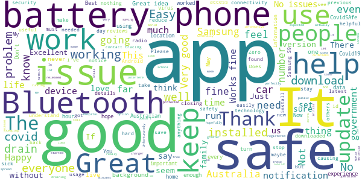

> Unbeatable!  :date: __2020-07-09 14:43:00__

> So easy to follow  :date: __2020-07-09 14:27:00__

> App very informative.  :date: __2020-07-09 13:57:09__

> Very good app & much needed.  :date: __2020-07-09 11:36:29__

> GREAT =] staying home saving lives  :date: __2020-07-09 08:34:54__

> Far too voluminous  :date: __2020-07-08 23:27:58__

> Love it  :date: __2020-07-08 14:38:42__

> Easy to navigate. Thanks.  :date: __2020-07-08 12:22:40__

> Generally don't notice the app running at all; UPDATED - haven't experienced the below for some time now. however started using the phone for music in the car today and it constantly causes the cars Bluetooth to reset about 1-2 minutes into each song. Phone = Samsung S9+ Car = Mazda BT50 2014 (Don't know what version of Bluetooth) Hopefully you can resolve this issue.  :date: __2020-07-08 11:55:46__

> On 4 Of May I have Received my Corona test results was Good from Auburn Hospital  :date: __2020-07-08 11:49:35__

#### 4-star reviews

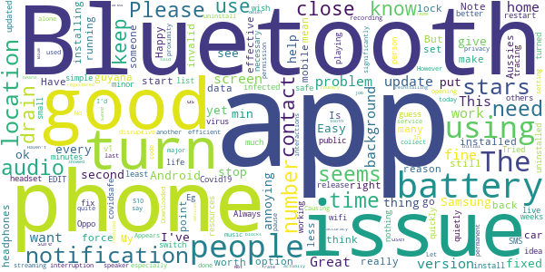

> Please fix the notification area. I have to stop the app because it blocks other notification from other app  :date: __2020-07-09 00:24:03__

> Put the app on the phone like they said have not had a problem with it Blue tooth OK.  :date: __2020-07-08 14:40:30__

> I live in guyana and they do not have guyana in there country list please put guyana now or i will delet this app please really want this app  :date: __2020-07-07 02:07:51__

> Would be good if it at least showed how many other devices it's registered, and when.  :date: __2020-07-06 16:14:37__

> Update: Initial force-close issue resolved by reinstalling. Haven't heard of the app actually doing its job yet and at what accuracy rate, but I guess it's better than nothing.  :date: __2020-07-06 00:39:03__

> Not knocking the app, no app is perfect therefore no app ever gets "5 stars". Unfortunately this is a necessary evil in modern times. I wish I could close it including from the notifications panel when I'm home & Bluetooth is off. "4 & 3/4 stars" if you can achieve this. (Android 10, gentle notifications on, no option to disable foreground services or option them at "home location" or "Bluetooth off".)  :date: __2020-07-05 22:16:29__

> Sits quietly in the background can't complain  :date: __2020-07-05 13:21:45__

> Using this app makes audio headset bluetooth connection unstable, but still worth using it  :date: __2020-07-02 02:43:49__

> It's this one of those, pay-to-win games? I haven't leveled up once yet !?!  :date: __2020-07-01 23:23:24__

> My screen locks and goes blank any time I revive or make call. Have to uninstalled, friend has same issue. Tried re installing, issue is back.  :date: __2020-07-01 00:11:47__

#### 3-star reviews

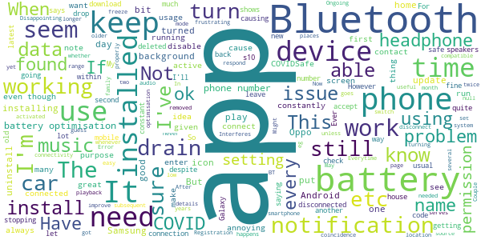

> You guys broke the lock screen notification in the last update 🤦‍♂️  :date: __2020-07-09 23:43:36__

> Edit: Issue appears only when I've set the notification to silent, if I set it back to alerting it looks ok. --- Latest update has wrecked the notification drawer. Please fix soon.  :date: __2020-07-09 23:07:53__

> I wish I could see where I am on the map and I wish that the app work like the fire app so I can see hot spot in the world.  :date: __2020-07-09 10:46:33__

> Need more communication between each of the virus stations make sure that they put are on the same giving the same advice and not stuffing me around  :date: __2020-07-09 10:22:16__

> Was using this when it was just Bluetooth, but the Government doesn't need my location data as well.  :date: __2020-07-09 10:08:54__

> This app as important as it is prevents my other apps notifications from displaying correctly I've removed it until it is fixed  :date: __2020-07-08 10:44:52__

> Issues from latest update causing notifications overlapping , on pixel phone  :date: __2020-07-08 10:39:37__

> After the last update, the notification that is usually on my lock screen is missing and affects the appearance of other notifications, which makes it difficult to read incoming messages on the lock screen. Perhaps the notification height was set to a negative number. Other than that, it appears to do as described. No issues with Bluetooth here.  :date: __2020-07-08 03:18:05__

> Interferes with wifi. Uninstalled. Probably built on a $3 budget.  :date: __2020-07-07 12:23:16__

> it working wasnt easy  :date: __2020-07-07 02:45:12__

#### 2-star reviews

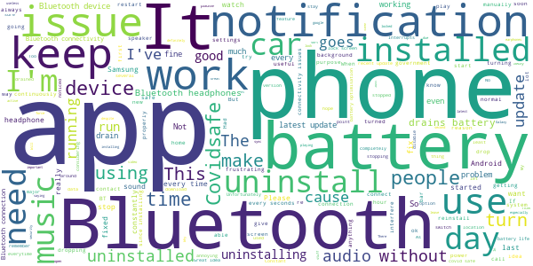

> Latest update has broken the notifications system for my phone (pixel 2 xl)  :date: __2020-07-10 03:17:23__

> 10/7 latest update has screwed up the notification bar, and somehow has stuffed up the notifications for other apps too. Will probably uninstall if not fixed soon. *Original Review*: Enrollment was pretty easy, the app is always running in the background but so far doesn't appear to be using the battery at all. Would trust it more if they used the Google/Apple framework, but sounds like that's a few weeks away..  :date: __2020-07-10 00:10:43__

> Uninstalled because it messes up my lockscreen notifications (Samsung Snapdragon Note 10+).  :date: __2020-07-09 16:56:30__

> I need to uninstall and reinstall the app every time I activate it to make it work. This is rather frustrating and time-consuming, and defeats the purpose of being able to open the app and have it running at a moment's notice when you're near other people.  :date: __2020-07-09 14:13:56__

> The latest update prevents the notifications on my lock screen showing correctly. They are now only partly visible. They show fine if I disable the app.  :date: __2020-07-09 11:06:44__

> Latest update is drawing over the top of other notifications, please fix asap, use the phone for work and this getting in the way  :date: __2020-07-09 06:01:45__

> Just had to uninstall this as a result of the latest update. It hides all of my notifications while installed. Problem goes away as soon as its uninstalled. Pretty poor for a government app if you ask me. This sort of stuff only makes people more suspicious of the app...  :date: __2020-07-09 05:44:46__

> Notification bar issues since most recent update. Have to disable this apps notifications to rectify  :date: __2020-07-09 04:59:13__

> It works fine but has caused an issue with notifications displaying for all apps on the locked screen.  :date: __2020-07-09 03:14:08__

> Keeps telling me my name is not legal. So i am uninstalling  :date: __2020-07-08 08:03:09__

#### 1-star reviews

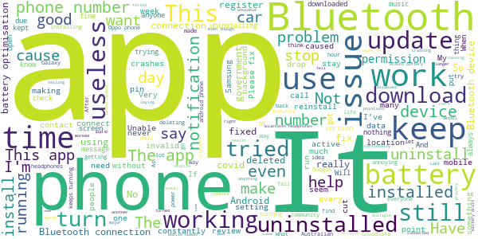

> Uninstalling this app because since latest update on 2/7/2020 it's affecting the appearance of other app notifications which is annoying.  :date: __2020-07-10 14:46:49__

> Drains too much battery  :date: __2020-07-10 14:18:45__

> Why no auto update  :date: __2020-07-10 13:08:26__

> Keep crashing after the latest update  :date: __2020-07-10 12:29:35__

> Not.useful.at all  :date: __2020-07-10 11:58:47__

> I downloaded the app one the first few days. Today I deleted it. It kept turning itself off. I followed all tips and suggestions but it just kept on shutting down with no alert to let me know it had done so.  :date: __2020-07-10 08:41:18__

> Drained my phone battery and so useless, I can't believed the government spent that much money for an useless app, this is how you spend tax payers money, poor design and chased nothing, unbelievable  :date: __2020-07-10 06:50:17__

> The latest update is causing notification issues in the swipe down menu and lock screen  :date: __2020-07-09 13:42:11__

> It's a placebo. No benefit.  :date: __2020-07-09 11:43:22__

> It is of no use whatsoever. A waste of money & a waste of my battery life.  :date: __2020-07-09 07:12:24__

# WHO Info
App version ``2.2.0``

Analyzed with [covid-apps-observer](http://github.com/covid-apps-observer) project, version ``0.1``

## App overview
| | |
|-------------------------|-------------------------| 
| **Name**&nbsp;&nbsp;&nbsp;&nbsp;&nbsp;&nbsp;&nbsp;&nbsp;&nbsp;&nbsp;&nbsp;&nbsp;&nbsp;&nbsp;&nbsp;&nbsp;&nbsp;&nbsp;&nbsp;&nbsp;&nbsp;&nbsp;&nbsp;&nbsp;&nbsp;&nbsp;&nbsp;&nbsp;&nbsp;&nbsp;&nbsp;&nbsp;&nbsp;&nbsp;&nbsp;&nbsp;&nbsp;&nbsp;&nbsp;&nbsp;  | WHO Info |
| **Unique identifier** | org.who.infoapp |
| **Link to Google Play** | [https://play.google.com/store/apps/details?id=org.who.infoapp](https://play.google.com/store/apps/details?id=org.who.infoapp) |
| **Summary**  | The official World Health Organization Information App. |
| **Privacy policy** | [https://www.who.int/about/who-we-are/privacy-policy](https://www.who.int/about/who-we-are/privacy-policy) |
| **Latest version** | 2.2.0 |
| **Last update** | 2020-06-25 08:10:20 |
| **Recent changes** | Version 2.2.0 adds the Russian, Spanish, French and Chinese content produced by the World Health Organization global multi-lingual team. Arabic and regional content will be coming soon. |
| **Installs**  | 100,000+ |
| **Category** | News & Magazines |
| **First release** | Apr 13, 2020 |
| **Size**  | 8.0M |
| **Supported Android version**  | 4.2 and up |

### Description
> Have the latest health information at your fingertips with the official World Health Organization Information App. This app displays the latest news, events, features and breaking updates on outbreaks. 
  
 WHO works worldwide to promote health, keep the world safe, and serve the vulnerable. 
 Our goal is to ensure that a billion more people have universal health coverage, to protect a billion more people from health emergencies, and provide a further billion people with better health and well-being.

### User interface
The developers of the app provide the following screenshots in the Google play store.
| | | |
|:-------------------------:|:-------------------------:|:-------------------------:|
 |   |   |   | 
 |   |   |   | 
 |   |   |   | 
 |   |   |   | 
 |   |   |   | 
 |   |   |   | 
 |   |   |   | 
 |   |   |   | 

## Development team
In the following we report the main information provided by the development team in the Google play store.

| | |
|-------------------------|-------------------------|
| **Developer**  | World Health Organization |
| **Website**  | [https://www.who.int/](https://www.who.int/) |
| **Email** | dcx@who.int |
| **Physical address**  | [Avenu Appia 20 1211 Geneva Switzerland](https://www.google.com/maps/search/Avenu%20Appia%2020%201211%20Geneva%20Switzerland) (Google Maps) |
| **Other developed apps**  | [https://play.google.com/store/apps/developer?id=World+Health+Organization](https://play.google.com/store/apps/developer?id=World+Health+Organization) |

## Android support

| | |
|-------------------------|-------------------------|
| **Declared target Android version**  | Android10, version 10 (API level 29) |
| **Effective target Android version**  | Android10, version 10 (API level 29) |
| **Minimum supported Android version**  | Jelly Bean, version 4.2.x (API level 17) |
| **Maximum target Android version**  | - |

The larger the difference between the minimum and maximum supported Android versions, the better. A larger difference means a wider audience. For example, old phones have a very low Android version, so a high minimum supported Android version means that the app cannot be used by users with old phones, thus leading to accessibility problems. 

## Requested permissions

In the following we report the complete list of the permissions requested by the app. 

| **Permission** | **Protection level** | **Description** | 
|-------------------------|-------------------------|-------------------------|
 **android.permission INTERNET** | Normal | Allows applications to open network sockets. 
 **android.permission READ_CALENDAR** | :warning:**Dangerous** | Allows an application to read the user's calendar data. 
 **android.permission READ_EXTERNAL_STORAGE** | :warning:**Dangerous** | Allows an application to read from external storage. 
 **android.permission WRITE_CALENDAR** | :warning:**Dangerous** | Allows an application to write the user's calendar data. 
 **android.permission WRITE_EXTERNAL_STORAGE** | :warning:**Dangerous** | Allows an application to write to external storage. 

## Mentioned servers

| **Server** | **Registrant** | **Registrant country** | **Creation date** | 
|-------------------------|-------------------------|-------------------------|-------------------------|
-

## Security analysis 

Below we report the main security warnings raised by our execution of the [Androwarn](https://github.com/maaaaz/androwarn) security analysis tool.

**Connection interfaces exfiltration**
> - This application reads details about the currently active data network 
> - This application tries to find out if the currently active data network is metered 

**Suspicious connection establishment**
> - This application opens a Socket and connects it to the remote address 'Lfi/iki/elonen/NanoHTTPD$ResponseException;' on the 'N/A' port  
> - This application opens a Socket and connects it to the remote address 'NanoHttpd Shutdown' on the 'N/A' port  

**Code execution**
> - This application loads a native library: 'NativeScript' 
> - This application executes a UNIX command containing this argument: '2' 

## User ratings and reviews

Below we provide information about how end users are reacting to the app in terms of ratings and reviews in the Google Play store.

### Ratings

The WHO Info app has been installed by more than **100000** times. At this time, **699** rated the app and its average score is **3.62**. Below we show the distribution of the ratings across the usual star-based rating of Google Play

:star::star::star::star::star:: 412

:star::star::star::star:: 27

:star::star::star:: 34

:star::star:: 27

:star:: 195

### Reviews 

#### 5-star reviews

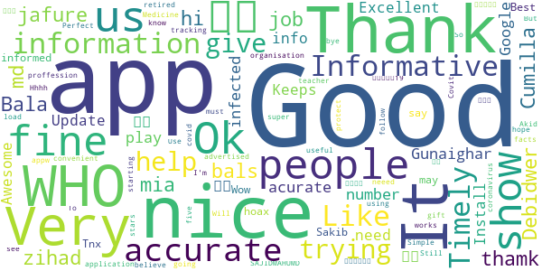

> Good job  :date: __2020-06-30 16:55:28__

> jafure  :date: __2020-06-16 06:19:43__

> Good  :date: __2020-06-10 20:34:34__

> hi md zihad mia  :date: __2020-06-10 12:49:41__

> Bala bals  :date: __2020-06-10 06:34:10__

> Ok  :date: __2020-06-10 03:01:27__

> ➕➕🅰🅰🅰➕➕ 🍀🍀😊😊😊🍀🍀 📖📖🙏🙏🙏📖📖  :date: __2020-06-08 13:46:53__

> its good for us thamk you W.H.O  :date: __2020-06-06 16:10:24__

> Cumilla Debidwer Gunaighar  :date: __2020-06-06 15:19:02__

> করুনা বাই রাজ এলাটডামলো  :date: __2020-06-05 23:02:23__

#### 4-star reviews

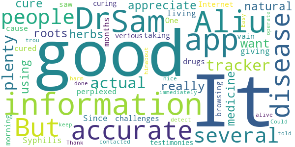

> Nice  :date: __2020-07-08 17:19:26__

> good  :date: __2020-06-03 00:37:10__

> It's just information, not the actual tracker. But has plenty of information that's 100% accurate.  :date: __2020-05-31 02:37:20__

> I really want to appreciate Dr. Aliu Sam for using his natural roots and herbs medicine to cure me of Syphilis Since 11 months now I have been living with this disease and it has been giving me challenges, I was so perplexed cause I have been taking several drugs to be cured but all have been in vain. One morning I was browsing through the Internet then i saw several testimonies about Dr. Aliu Sam curing people off verious diseases and immediately I contacted Dr. Aliu Sam I told himabout my trou  :date: __2020-05-08 05:33:57__

> It did not detect  :date: __2020-04-29 18:37:26__

> Could do with more accurate information to keep people alive. But no harm done.  :date: __2020-04-29 13:41:12__

> Its good app. Easy to operate  :date: __2020-04-27 14:08:23__

> It's so nice app  :date: __2020-04-25 14:50:48__

> Thank you, good app.  :date: __2020-04-25 03:11:24__

#### 3-star reviews

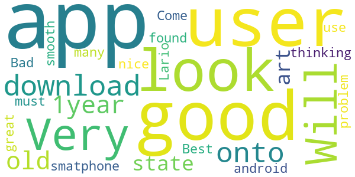

> Very good apps  :date: __2020-06-17 19:02:00__

> Will not download onto my 1year old state of the art smatphone. Bad, as a user of many android apps what are you thinking. I have found more than 3700 other users that can not use this app. Come on you must no you have problem.  :date: __2020-05-26 02:04:59__

> Good  :date: __2020-05-14 21:22:11__

> Best.  :date: __2020-04-20 13:14:33__

> Looks nice great look smooth Lario  :date: __2020-04-18 09:44:30__

#### 2-star reviews

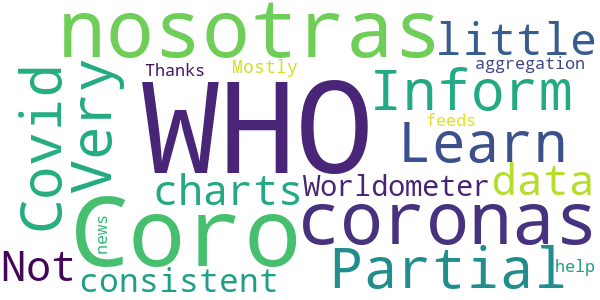

> Coro nosotras coronas  :date: __2020-07-02 06:41:55__

> Partial  :date: __2020-06-22 12:24:23__

> Learn more  :date: __2020-06-15 23:35:50__

> WHO Inform Covid 19  :date: __2020-05-24 17:14:56__

> Very little data or charts. Not consistent with Worldometer. Mostly an aggregation of news feeds about WHO  :date: __2020-05-15 15:38:10__

> Thanks for your help.  :date: __2020-04-22 18:52:40__

#### 1-star reviews

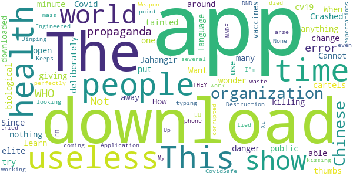

> The app does not show me anything. Since I downloaded it I have not been able to use it. When I open it nothing shows so I wonder why some people are giving you thumbs up  :date: __2020-07-05 05:34:15__

> Jahangir  :date: __2020-06-19 05:46:57__

> Crashed after one minute  :date: __2020-06-15 05:58:08__

> Cannot download cv19 app  :date: __2020-06-08 15:19:41__

> Want to learn  :date: __2020-05-27 11:52:00__

> How can I change the language?  :date: __2020-05-19 00:43:45__

> This app is useless it can't download many times l try  :date: __2020-05-18 07:25:58__

> I don't like this app  :date: __2020-05-14 07:07:35__

> The world health organization are deliberately killing people with tainted vaccines all around the world health should be put away from the elite cartels that danger public health - Covid-19 is a biological Engineered Weapon of mass Destruction  :date: __2020-05-12 23:43:51__

> THEY MADE IT 😷😷😷😷😷  :date: __2020-05-10 15:57:09__

# Coronavirus Australia
App version ``1.4``

Analyzed with [covid-apps-observer](http://github.com/covid-apps-observer) project, version ``0.1``

## App overview
| | |
|-------------------------|-------------------------| 
| **Name**&nbsp;&nbsp;&nbsp;&nbsp;&nbsp;&nbsp;&nbsp;&nbsp;&nbsp;&nbsp;&nbsp;&nbsp;&nbsp;&nbsp;&nbsp;&nbsp;&nbsp;&nbsp;&nbsp;&nbsp;&nbsp;&nbsp;&nbsp;&nbsp;&nbsp;&nbsp;&nbsp;&nbsp;&nbsp;&nbsp;&nbsp;&nbsp;&nbsp;&nbsp;&nbsp;&nbsp;&nbsp;&nbsp;&nbsp;&nbsp;  | Coronavirus Australia |
| **Unique identifier** | au.gov.health.covid19 |
| **Link to Google Play** | [https://play.google.com/store/apps/details?id=au.gov.health.covid19](https://play.google.com/store/apps/details?id=au.gov.health.covid19) |
| **Summary**  | Official Government Information |
| **Privacy policy** | [https://www.health.gov.au/using-our-websites/privacy](https://www.health.gov.au/using-our-websites/privacy) |
| **Latest version** | 1.4 |
| **Last update** | 2020-07-08 06:01:03 |
| **Recent changes** | * Clinic Finder to help you find respiratory clinics and testing centres near you * Restrictions Checker to inform you of restrictions in your state |
| **Installs**  | 500,000+ |
| **Category** | Health & Fitness |
| **First release** | Mar 28, 2020 |
| **Size**  | 22M |
| **Supported Android version**  | 6.0 and up |

### Description
> You can use the Australian Government Coronavirus app to:
 - stay up to date with the official information and advice 
 - important health advice to help stop the spread and stay healthy
 - get a quick snapshot of the current official status within Australia
 - check your symptoms if you are concerned about yourself or someone else
 - find relevant contact information 
 - access updated information from the Australian Government
 - receive push notifications of urgent information and updates
 Trusted, Australian information
 All information in the Australian Government Coronavirus app is sourced from Australia’s leading health organisations and has undergone a quality assurance process so people can know it is safe, appropriate and relevant for Australians. 
 Disclaimer
 Whilst this app has been reviewed for clinical accuracy, the content is not a substitute for professional advice and should not be used as an alternative to professional healthcare. If you have a particular medical problem, please consult a doctor or a specialist.

### User interface
The developers of the app provide the following screenshots in the Google play store.
| | | |
|:-------------------------:|:-------------------------:|:-------------------------:|
 | 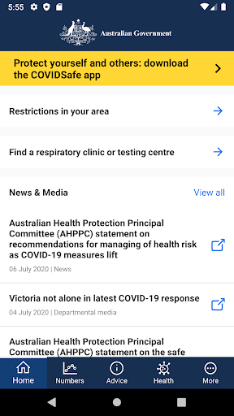  | 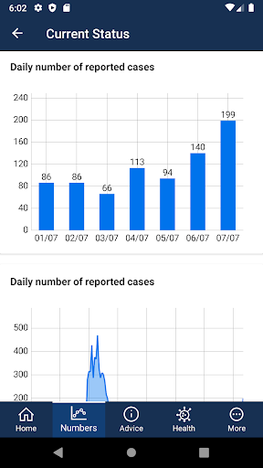  | 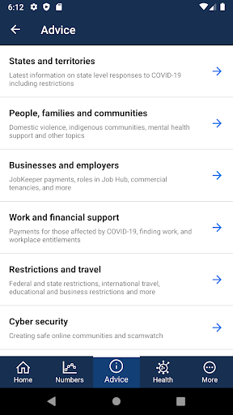  | 
 | 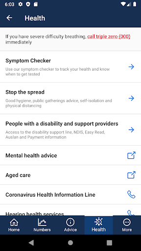 

## Development team
In the following we report the main information provided by the development team in the Google play store.

| | |
|-------------------------|-------------------------|
| **Developer**  | DTA App Developer |
| **Website**  | [http://health.gov.au](http://health.gov.au) |
| **Email** | info@health.gov.au |
| **Physical address**  | - |
| **Other developed apps**  | [https://play.google.com/store/apps/developer?id=DTA+App+Developer](https://play.google.com/store/apps/developer?id=DTA+App+Developer) |

## Android support

| | |
|-------------------------|-------------------------|
| **Declared target Android version**  | Android10, version 10 (API level 29) |
| **Effective target Android version**  | Android10, version 10 (API level 29) |
| **Minimum supported Android version**  | Marshmallow, version 6.0 (API level 23) |
| **Maximum target Android version**  | - |

The larger the difference between the minimum and maximum supported Android versions, the better. A larger difference means a wider audience. For example, old phones have a very low Android version, so a high minimum supported Android version means that the app cannot be used by users with old phones, thus leading to accessibility problems. 

## Requested permissions

In the following we report the complete list of the permissions requested by the app. 

| **Permission** | **Protection level** | **Description** | 
|-------------------------|-------------------------|-------------------------|
 **android.permission ACCESS_COARSE_LOCATION** | :warning:**Dangerous** | Allows an app to access approximate location. 
 **android.permission ACCESS_FINE_LOCATION** | :warning:**Dangerous** | Allows an app to access precise location. 
 **android.permission ACCESS_NETWORK_STATE** | Normal | Allows applications to access information about networks. 
 **android.permission INTERNET** | Normal | Allows applications to open network sockets. 
 **android.permission WAKE_LOCK** | Normal | Allows using PowerManager WakeLocks to keep processor from sleeping or screen from dimming. 
 **com.google.android.c2dm.permission RECEIVE** | - | - 
 **com.google.android.finsky.permission BIND_GET_INSTALL_REFERRER_SERVICE** | - | - 

## Mentioned servers

| **Server** | **Registrant** | **Registrant country** | **Creation date** | 
|-------------------------|-------------------------|-------------------------|-------------------------|
 | googlesyndication.com | Google LLC | :us: US | 2003-01-21 06:17:24 |
 | google.com | Google LLC | :us: US | 1997-09-15 04:00:00 |
 | app-measurement.com | Google LLC | :us: US | 2015-06-19 20:13:31 |
 | apple.com | Apple Inc. | :us: US | 1987-02-19 05:00:00 |
 | aomedia.org | Contact Privacy Inc. Customer 1243324949 | :canada: CA | 2015-08-24 14:07:31 |
 | w3.org | W3C | :us: US | 1994-07-06 04:00:00 |
 | googleapis.com | Google LLC | :us: US | 2005-01-25 17:52:26 |
 | googleadservices.com | Google LLC | :us: US | 2003-06-19 16:34:53 |
 | googleapis.com | Google LLC | :us: US | 2005-01-25 17:52:26 |
 | crashlytics.com | Google LLC | :us: US | 2011-01-21 15:30:40 |

## Security analysis 

Below we report the main security warnings raised by our execution of the [Androwarn](https://github.com/maaaaz/androwarn) security analysis tool.

**Telephony identifiers leakage**
> - This application reads the ISO country code equivalent of the current registered operator's MCC (Mobile Country Code) 
> - This application reads the device phone type value 

**Connection interfaces exfiltration**
> - This application reads details about the currently active data network 
> - This application tries to find out if the currently active data network is metered 

**Telephony services abuse**
> - This application makes phone calls 

**Suspicious connection establishment**
> - This application opens a Socket and connects it to the remote address '' on the 'N/A' port  
> - This application opens a Socket and connects it to the remote address 'Ljava/lang/StringBuilder;->toString()Ljava/lang/String;' on the 'N/A' port  
> - This application opens a Socket and connects it to the remote address 'Ljava/net/Proxy;->type()Ljava/net/Proxy$Type;' on the 'N/A' port  
> - This application opens a Socket and connects it to the remote address 'timeout' on the 'N/A' port  

**Code execution**
> - This application loads a native library 

## User ratings and reviews

Below we provide information about how end users are reacting to the app in terms of ratings and reviews in the Google Play store.

### Ratings

The Coronavirus Australia app has been installed by more than **500000** times. At this time, **1438** rated the app and its average score is **3.556338**. Below we show the distribution of the ratings across the usual star-based rating of Google Play

:star::star::star::star::star:: 678

:star::star::star::star:: 182

:star::star::star:: 172

:star::star:: 70

:star:: 334

### Reviews 

#### 5-star reviews

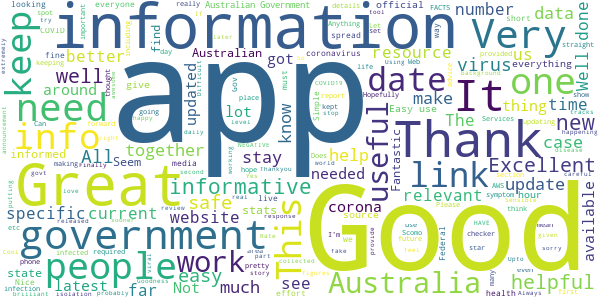

> Anything that can keep me updated on how we're going i'm all for.  :date: __2020-07-09 11:37:48__

> I came see the corona people  :date: __2020-07-06 06:40:57__

> Great if everyone uses it  :date: __2020-07-06 05:12:09__

> Good information in the links. It was great for registering my isolation.  :date: __2020-06-29 00:49:18__

> I don't think that I do not know anyone with these viruses....thirty five given star's for each of all of the features....  :date: __2020-06-27 08:53:35__

> It does what it's meant to  :date: __2020-06-19 04:05:19__

> Helping keep me safe and therefore other people are kept safe  :date: __2020-06-17 06:09:53__

> Let's me know what is happening around Australia thanks  :date: __2020-06-16 05:55:34__

> Very good and easy to.use Thankyou  :date: __2020-06-15 06:43:18__

> Good tool It has lots of useful info  :date: __2020-06-14 10:58:40__

#### 4-star reviews

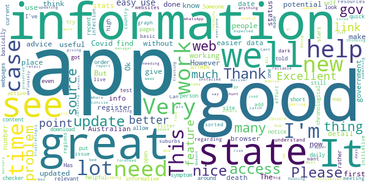

> It's states 'unable to load lastest updates. Pushing 'try again doesnt work'. I've reinstalled it and same problem. Thanks for creating an app even if it's a mobile wrapper at short notice. I've got WhatsApp information working so that still helpful.  :date: __2020-07-05 18:16:12__

> Works well and is informative  :date: __2020-07-04 22:02:51__

> I'm thinking big box around the end of my bed = vr. Has potential if anything. He won't. / Rub my forehead LatcH  :date: __2020-06-16 09:18:45__

> Would be great if you could also put how many active cases there are.  :date: __2020-05-21 00:11:52__

> Works as expected, an information manager, not a source (otherwise the app would need updating daily). Helps to get at relevant, reliable information, without needing to hunt around the web myself to find it.  :date: __2020-05-13 10:32:15__

> Good  :date: __2020-05-11 11:25:39__

> I like  :date: __2020-05-07 01:23:44__

> Good  :date: __2020-05-01 06:29:25__

> Cant self register  :date: __2020-04-30 02:43:21__

> Being a high risk person I installed the app, put in details. I was told to see my gp which I did and even had the test. The app doesn't allow you to report that you have done it and for you to say that you don't have COVID19 . I think that would be something that should have been added.  :date: __2020-04-29 04:01:07__

#### 3-star reviews

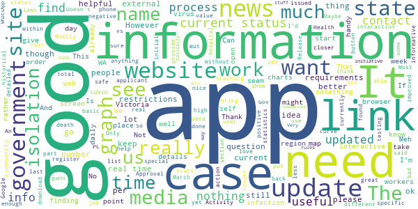

> I'm looking for my location as my mum said there's been more cases where I live but it only gives U the choice to see Australia wide and not what U want to see I wanted to see my part of Victoria but it only covers Victoria itself and other places it would be good if it was more in depth  :date: __2020-07-02 17:02:12__

> Only used occasionally as it is quite bitsy in that finding info isn't that intuitive. Most concerning is that finding specific details about Victoria is a link to a powerbi report that is almost impossible to navigate on a phone, the point of the app. If you want to view graphs and charts, find your local municipalities etc, then I'd suggest you head for a PC that it was built for the job. Interactive charts are a good concept but not when prepared for a PC and viewed on a phone.  :date: __2020-06-19 13:30:45__

> Keeps turning itself off!  :date: __2020-05-19 04:42:12__

> It hasn't updated. Supposed to update at 9:00 AM daily.  :date: __2020-05-14 01:15:17__

> Never have received the pin to open it  :date: __2020-05-08 01:20:55__

> Won't download past 97%  :date: __2020-05-07 12:21:06__

> Mostly disappointed that in all government media announcements they just say 'download the app' without specifying the name of the app clearly. There are several COVID-19 apps out there now. Give it a distinctive name.  :date: __2020-05-07 10:02:42__

> An interactive app would be far more useful. INPUT Activity I want to undertake? Personal details? Employment details? Reason for activity? PROCESS Verification process. OUTPUT. Approval /Denial /More information - contact Barcode issued to applicant on approval. Applicant issued with a description of any special requirements. Eg: FIFO to travel Site - WA - NSW - WA - site Can the process be undertaken? ANS Special requirements (isolation and period and process for each state)  :date: __2020-05-05 12:10:07__

> Laggy on the opening and update of information but enough for quick access check .  :date: __2020-05-05 09:48:51__

> Dear Gov Oz good overall but if time ask those negative reviews e.g. force closure what system they use....keep up good work... we pray to Jesu Mary's Health bless us  :date: __2020-05-04 13:56:47__

#### 2-star reviews

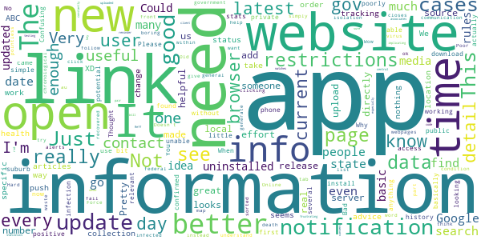

> Never been able to open app  :date: __2020-07-08 12:03:11__

> I'm sure it's a great app but there is constantly a reminder in my notifications that I can't get rid of. Very very frustrating.  :date: __2020-05-28 18:16:57__

> Not enough real time information I would like to see more statistics especially our Reff number  :date: __2020-05-07 11:17:36__

> Release the source code of both client and server and more of us will install this app... It looks like the app generates and uploads a private/public key pair and uploads one or the other to a central server and associates it directly to a user, other users when testing positive can upload their contact history to the server and matches that data to details of other users they came into contact with directly implicating the contacts, private user data should not be uploaded without consent.  :date: __2020-05-04 12:39:48__

> Confusing  :date: __2020-05-04 09:43:14__

> Will not download on my phone  :date: __2020-05-01 08:18:24__

> Takes forever to download. Been trying for 2 days now.  :date: __2020-04-29 10:31:12__

> I downloaded it but still do not know if it is actually working.  :date: __2020-04-27 03:53:37__

> Please add a prominent link to the covidsafe app.  :date: __2020-04-27 00:50:53__

> Update too late every day  :date: __2020-04-27 00:17:59__

#### 1-star reviews

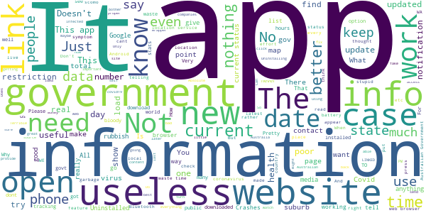

> Absolute rubbish  :date: __2020-07-10 12:00:01__

> Often features are just links to external websites. The stats are so bad (they should include days since last community transmission and also have a running tally of how many new cases were reported each day since the beginning and also break that up by state. Total cases is not very informative especially if you don't know previous totals in the past  :date: __2020-07-10 05:22:54__

> Has notifications pop up that appear important but when you tap on them, you are taken to the main page and I am never able to read the notification. Can you please have an option to read notifications or else not send them to my phone. Thank you.  :date: __2020-07-06 13:14:33__

> Unable to download  :date: __2020-06-24 05:19:21__

> Don't tell you anything  :date: __2020-06-21 15:00:17__

> I was violated by having this app installed on my phone without any notice or warning or most importantly MY CONSENT.  :date: __2020-06-10 05:41:48__

> Useless  :date: __2020-06-09 23:40:47__

> Since you have updated this app there are now no more new case numbers for states for the day the most important information is missing.  :date: __2020-06-07 08:58:11__

> Was totally changed in the update ; how bloody stupid. Idiotic.  :date: __2020-06-07 01:05:56__

> Probably the most b\*\**sh\*\* app ever created. Shame on you gov.  :date: __2020-06-06 01:20:45__

# MyAus COVID-19
App version ``29``

Analyzed with [covid-apps-observer](http://github.com/covid-apps-observer) project, version ``0.1``

## App overview
| | |
|-------------------------|-------------------------| 
| **Name**&nbsp;&nbsp;&nbsp;&nbsp;&nbsp;&nbsp;&nbsp;&nbsp;&nbsp;&nbsp;&nbsp;&nbsp;&nbsp;&nbsp;&nbsp;&nbsp;&nbsp;&nbsp;&nbsp;&nbsp;&nbsp;&nbsp;&nbsp;&nbsp;&nbsp;&nbsp;&nbsp;&nbsp;&nbsp;&nbsp;&nbsp;&nbsp;&nbsp;&nbsp;&nbsp;&nbsp;&nbsp;&nbsp;&nbsp;&nbsp;  | MyAus COVID-19 |
| **Unique identifier** | com.myaus |
| **Link to Google Play** | [https://play.google.com/store/apps/details?id=com.myaus](https://play.google.com/store/apps/details?id=com.myaus) |
| **Summary**  | An essential, multi-language informational app about COVID-19 in Australia. |
| **Privacy policy** | [https://migrationcouncil.org.au/policy/](https://migrationcouncil.org.au/policy/) |
| **Latest version** | 29 |
| **Last update** | 2020-05-29 22:50:15 |
| **Recent changes** | - Access to 2 new languages (Burmese and Karen)!  - New content and information.  - Bug fixing and performance enhancements. |
| **Installs**  | 1,000+ |
| **Category** | Health & Fitness |
| **First release** | Apr 23, 2020 |
| **Size**  | 30M |
| **Supported Android version**  | 4.1 and up |

### Description
> You can use the MyAus COVID-19 App to:
 - Find comprehensive information on rules and regulations regarding COVID-19 in Australia
 - Read information in multiple-languages
 - Use simple search to find important tips on how to stay healthy
 - View a snapshot of the current statistics in different states in Australia
 - Use tools such as a symptom checker to identify any concerns
 - View animated videos in multiple languages
 - Receive push notifications for updates 
 - Discover a huge amount of ‘in-app’ information, viewable offline once downloaded
 The MyAus App has been developed to provide the most simple, comprehensive, easy-to-use experience on mobile devices for finding information on Coronavirus in Australia. 
 More languages than other apps, more ways to educate yourself through clear design, animation and interactive elements.
 Languages available:
 Arabic,  Cantonese, Dari, English, French, Greek, Indonesian, Italian, Japanese, Khmer, Korean, Mandarin, Persian, Punjabi, Russian, Spanish, Somali, Tagalog, Tamil, Thai, Turkish, Urdu, Vietnamese.
 Languages coming soon:
 Burmese, Karen.

### User interface
The developers of the app provide the following screenshots in the Google play store.
| | | |
|:-------------------------:|:-------------------------:|:-------------------------:|
 |   |   |   | 
 |   |   |   | 

## Development team
In the following we report the main information provided by the development team in the Google play store.

| | |
|-------------------------|-------------------------|
| **Developer**  | Migration Council Australia |
| **Website**  | [https://migrationcouncil.org.au/](https://migrationcouncil.org.au/) |
| **Email** | info@migrationcouncil.org.au |
| **Physical address**  | - |
| **Other developed apps**  | [https://play.google.com/store/apps/developer?id=Migration+Council+Australia](https://play.google.com/store/apps/developer?id=Migration+Council+Australia) |

## Android support

| | |
|-------------------------|-------------------------|
| **Declared target Android version**  | Pie, version 9 (API level 28) |
| **Effective target Android version**  | Pie, version 9 (API level 28) |
| **Minimum supported Android version**  | Jelly Bean, version 4.1.x (API level 16) |
| **Maximum target Android version**  | - |

The larger the difference between the minimum and maximum supported Android versions, the better. A larger difference means a wider audience. For example, old phones have a very low Android version, so a high minimum supported Android version means that the app cannot be used by users with old phones, thus leading to accessibility problems. 

## Requested permissions

In the following we report the complete list of the permissions requested by the app. 

| **Permission** | **Protection level** | **Description** | 
|-------------------------|-------------------------|-------------------------|
 **android.permission ACCESS_NETWORK_STATE** | Normal | Allows applications to access information about networks. 
 **android.permission ACCESS_WIFI_STATE** | Normal | Allows applications to access information about Wi-Fi networks. 
 **android.permission INTERNET** | Normal | Allows applications to open network sockets. 
 **android.permission READ_APP_BADGE** | - | - 
 **android.permission RECEIVE_BOOT_COMPLETED** | Normal | Allows an application to receive the Intent.ACTION_BOOT_COMPLETED that is broadcast after the system finishes booting. 
 **android.permission VIBRATE** | Normal | Allows access to the vibrator. 
 **android.permission WAKE_LOCK** | Normal | Allows using PowerManager WakeLocks to keep processor from sleeping or screen from dimming. 
 **com.anddoes.launcher.permission UPDATE_COUNT** | - | - 
 **com.google.android.c2dm.permission RECEIVE** | - | - 
 **com.google.android.finsky.permission BIND_GET_INSTALL_REFERRER_SERVICE** | - | - 
 **com.htc.launcher.permission READ_SETTINGS** | - | - 
 **com.htc.launcher.permission UPDATE_SHORTCUT** | - | - 
 **com.huawei.android.launcher.permission CHANGE_BADGE** | - | - 
 **com.huawei.android.launcher.permission READ_SETTINGS** | - | - 
 **com.huawei.android.launcher.permission WRITE_SETTINGS** | - | - 
 **com.majeur.launcher.permission UPDATE_BADGE** | - | - 
 **com.myaus.permission C2D_MESSAGE** | - | - 
 **com.oppo.launcher.permission READ_SETTINGS** | - | - 
 **com.oppo.launcher.permission WRITE_SETTINGS** | - | - 
 **com.sec.android.provider.badge.permission READ** | - | - 
 **com.sec.android.provider.badge.permission WRITE** | - | - 
 **com.sonyericsson.home.permission BROADCAST_BADGE** | - | - 
 **com.sonymobile.home.permission PROVIDER_INSERT_BADGE** | - | - 
 **me.everything.badger.permission BADGE_COUNT_READ** | - | - 
 **me.everything.badger.permission BADGE_COUNT_WRITE** | - | - 

## Mentioned servers

| **Server** | **Registrant** | **Registrant country** | **Creation date** | 
|-------------------------|-------------------------|-------------------------|-------------------------|
 | bugsnag.com | Bugsnag Inc. | GB | 2011-08-18 03:26:10 |
 | android.com | Google LLC | :us: US | 1997-06-23 04:00:00 |
 | googlesyndication.com | Google LLC | :us: US | 2003-01-21 06:17:24 |
 | google.com | Google LLC | :us: US | 1997-09-15 04:00:00 |
 | github.com | GitHub, Inc. | :us: US | 2007-10-09 18:20:50 |
 | w3.org | W3C | :us: US | 1994-07-06 04:00:00 |
 | googleapis.com | Google LLC | :us: US | 2005-01-25 17:52:26 |
 | app-measurement.com | Google LLC | :us: US | 2015-06-19 20:13:31 |
 | googleapis.com | Google LLC | :us: US | 2005-01-25 17:52:26 |
 | googleadservices.com | Google LLC | :us: US | 2003-06-19 16:34:53 |

## Security analysis 

Below we report the main security warnings raised by our execution of the [Androwarn](https://github.com/maaaaz/androwarn) security analysis tool.

**Telephony identifiers leakage**
> - This application reads the ISO country code equivalent of the current registered operator's MCC (Mobile Country Code) 
> - This application reads the numeric name (MCC+MNC) of current registered operator 
> - This application reads the operator name 

**Connection interfaces exfiltration**
> - This application reads details about the currently active data network 
> - This application tries to find out if the currently active data network is metered 

**Suspicious connection establishment**
> - This application opens a Socket and connects it to the remote address '' on the '80' port  
> - This application opens a Socket and connects it to the remote address '' on the 'N/A' port  
> - This application opens a Socket and connects it to the remote address 'Ljava/lang/StringBuilder;->toString()Ljava/lang/String;' on the ': connect, resolve' port  
> - This application opens a Socket and connects it to the remote address 'Ljava/lang/StringBuilder;->toString()Ljava/lang/String;' on the 'N/A' port  
> - This application opens a Socket and connects it to the remote address 'Ljava/net/Proxy;->type()Ljava/net/Proxy$Type;' on the 'N/A' port  
> - This application opens a Socket and connects it to the remote address 'timeout' on the 'N/A' port  

**Pim data leakage**
> - This application accesses data stored in the clipboard 

**Code execution**
> - This application loads a native library 
> - This application loads a native library: 'bugsnag-ndk' 
> - This application loads a native library: 'bugsnag-plugin-android-anr' 
> - This application executes a UNIX command containing this argument: '2' 

## User ratings and reviews

Below we provide information about how end users are reacting to the app in terms of ratings and reviews in the Google Play store.

### Ratings

The MyAus COVID-19 app has been installed by more than **1000** times. At this time, **16** rated the app and its average score is **4.375**. Below we show the distribution of the ratings across the usual star-based rating of Google Play

:star::star::star::star::star:: 12

:star::star::star::star:: 2

:star::star::star:: 0

:star::star:: 0

:star:: 2

### Reviews 

#### 5-star reviews

> Amazing app well worth downloading  :date: __2020-05-31 05:41:12__

> Great source of info, nice and clear  :date: __2020-05-27 13:18:57__

> Inter, good, stable  :date: __2020-05-27 12:17:06__

> Wow... really nice app with a huge amount of effort and hard work gone into making it accessible and helpful for our multi-lingual/-ethnic/-cultural Aussie families! I am totally blown away with all the different languages available and really impressed with the videos and visual instructions produced with voiceovers in those languages too.  We are all in it together regardless of how fluent we speak English. Outstanding example of community engagement & inclusivity!  Stay healthy everyone! 😊  :date: __2020-05-23 07:19:07__

> I think this is a very useful app.  :date: __2020-05-20 01:59:30__

> Amazing  :date: __2020-05-11 22:49:05__

> Great app! Very easy to navigate and loads of relevant info.  :date: __2020-04-26 12:57:58__

#### 4-star reviews

> Only app out there for Australians with so many languages.  :date: __2020-05-13 23:13:36__

> It needs wifi. It collects official info but makes it easier to read and keep up with current stats. I feel really anxious and this app helped me feel calm while I was looking up what I needed to know.  :date: __2020-04-27 07:31:18__

#### 3-star reviews

No recent reviews available with 3 stars.

#### 2-star reviews

No recent reviews available with 2 stars.

#### 1-star reviews

> Not even  :date: __2020-07-02 09:26:15__

> there are no more new case numbers for states for the day just totals the most important information is missing I have got to use worldometer now deleted..  :date: __2020-05-30 10:53:58__

# OpenWHO: Knowledge for Health Emergencies
App version ``3.3.2``

Analyzed with [covid-apps-observer](http://github.com/covid-apps-observer) project, version ``0.1``

## App overview
| | |
|-------------------------|-------------------------| 
| **Name**&nbsp;&nbsp;&nbsp;&nbsp;&nbsp;&nbsp;&nbsp;&nbsp;&nbsp;&nbsp;&nbsp;&nbsp;&nbsp;&nbsp;&nbsp;&nbsp;&nbsp;&nbsp;&nbsp;&nbsp;&nbsp;&nbsp;&nbsp;&nbsp;&nbsp;&nbsp;&nbsp;&nbsp;&nbsp;&nbsp;&nbsp;&nbsp;&nbsp;&nbsp;&nbsp;&nbsp;&nbsp;&nbsp;&nbsp;&nbsp;  | OpenWHO: Knowledge for Health Emergencies |
| **Unique identifier** | de.xikolo.openwho |
| **Link to Google Play** | [https://play.google.com/store/apps/details?id=de.xikolo.openwho](https://play.google.com/store/apps/details?id=de.xikolo.openwho) |
| **Summary**  | Life-saving knowledge for frontline responders in health emergencies. |
| **Privacy policy** | [https://openwho.org/pages/privacy](https://openwho.org/pages/privacy) |
| **Latest version** | 3.3.2 |
| **Last update** | 2020-06-16 10:47:56 |
| **Recent changes** | - Bug fixes and performance improvements |
| **Installs**  | 1,000,000+ |
| **Category** | Education |
| **First release** | May 17, 2017 |
| **Size**  | 18M |
| **Supported Android version**  | 5.0 and up |

### Description
> OpenWHO is the World Health Organization's (WHO) interactive knowledge-transfer platform offering online courses to improve the response to health emergencies. OpenWHO enables the Organization and its key partners to transfer life-saving knowledge to large numbers of frontline responders.
 With OpenWHO, you have the flexibility to learn at your convenience. Watch the short video lectures and test your knowledge with self-tests when and where you like. The course forum and the collaboration space allow you to get in touch with other participants and experts around the world.
  
 Designed primarily for health care workers, frontline responders, and decision-makers, the app is also a source of information for those affected by disease outbreaks and health emergencies, or for those with a general interest in WHO's work in health emergencies.
  
 It features 6 channels:
 - The <b>Outbreak</b> channel addresses the management of infectious diseases and provides life-saving, scientific information.
 - The <b>Ready for Response</b> channel helps prepare personnel who are training for deployment to work in disease outbreaks and health emergencies.
 - The <b>Get Social</b> channel focuses on social science-based interventions and helps to communicate with affected communities.
 - The <b>Preparing for Pandemics</b> channel brings together courses on various aspects of preparedness, including surveillance, public health measures and risk communication during a pandemic.
 - The <b>COVID-19</b> channel provides learning resources in WHO's 6 official languages (Arabic, Chinese, English, French, Russian and Spanish) for health professionals, decision-makers and the public for the outbreak of coronavirus disease (COVID-19).
 - The <b>COVID-19 National Languages</b> channel provides the same learning resources as the COVID-19 channel but in national languages, such as Indonesian, Japanese and Portuguese. 
  
 OpenWHO courses are available in many languages, including WHO's 6 official languages. 
  
 Download the app now, and join the OpenWHO community.
 This app is developed in cooperation between the Hasso Plattner Institute and the WHO. The learning content is provided exclusively by the WHO.

### User interface
The developers of the app provide the following screenshots in the Google play store.
| | | |
|:-------------------------:|:-------------------------:|:-------------------------:|
 |   |   |   | 
 |   |   |   | 

## Development team
In the following we report the main information provided by the development team in the Google play store.

| | |
|-------------------------|-------------------------|
| **Developer**  | HPI Knowledge Engineering Team |
| **Website**  | [https://openwho.org/](https://openwho.org/) |
| **Email** | openwho-support@hpi.de |
| **Physical address**  | [Prof.-Dr.-Helmert-Str.2-3 14482 Potsdam](https://www.google.com/maps/search/Prof.-Dr.-Helmert-Str.2-3%2014482%20Potsdam) (Google Maps) |
| **Other developed apps**  | [https://play.google.com/store/apps/developer?id=7185448023325736337](https://play.google.com/store/apps/developer?id=7185448023325736337) |

## Android support

| | |
|-------------------------|-------------------------|
| **Declared target Android version**  | Android10, version 10 (API level 29) |
| **Effective target Android version**  | Android10, version 10 (API level 29) |
| **Minimum supported Android version**  | Lollipop, version 5.0 (API level 21) |
| **Maximum target Android version**  | - |

The larger the difference between the minimum and maximum supported Android versions, the better. A larger difference means a wider audience. For example, old phones have a very low Android version, so a high minimum supported Android version means that the app cannot be used by users with old phones, thus leading to accessibility problems. 

## Requested permissions

In the following we report the complete list of the permissions requested by the app. 

| **Permission** | **Protection level** | **Description** | 
|-------------------------|-------------------------|-------------------------|
 **android.permission ACCESS_NETWORK_STATE** | Normal | Allows applications to access information about networks. 
 **android.permission ACCESS_WIFI_STATE** | Normal | Allows applications to access information about Wi-Fi networks. 
 **android.permission FOREGROUND_SERVICE** | Normal | Allows a regular application to use Service.startForeground. 
 **android.permission INTERNET** | Normal | Allows applications to open network sockets. 
 **android.permission READ_EXTERNAL_STORAGE** | :warning:**Dangerous** | Allows an application to read from external storage. 
 **android.permission RECEIVE_BOOT_COMPLETED** | Normal | Allows an application to receive the Intent.ACTION_BOOT_COMPLETED that is broadcast after the system finishes booting. 
 **android.permission WAKE_LOCK** | Normal | Allows using PowerManager WakeLocks to keep processor from sleeping or screen from dimming. 
 **android.permission WRITE_EXTERNAL_STORAGE** | :warning:**Dangerous** | Allows an application to write to external storage. 
 **com.google.android.c2dm.permission RECEIVE** | - | - 
 **com.google.android.finsky.permission BIND_GET_INSTALL_REFERRER_SERVICE** | - | - 

## Mentioned servers

| **Server** | **Registrant** | **Registrant country** | **Creation date** | 
|-------------------------|-------------------------|-------------------------|-------------------------|
 | googlesyndication.com | Google LLC | :us: US | 2003-01-21 06:17:24 |
 | google.com | Google LLC | :us: US | 1997-09-15 04:00:00 |
 | app-measurement.com | Google LLC | :us: US | 2015-06-19 20:13:31 |
 | apple.com | Apple Inc. | :us: US | 1987-02-19 05:00:00 |
 | aomedia.org | Contact Privacy Inc. Customer 1243324949 | :canada: CA | 2015-08-24 14:07:31 |
 | dashif.org | VTM Group | :us: US | 2012-04-27 13:02:46 |
 | w3.org | W3C | :us: US | 1994-07-06 04:00:00 |
 | googleapis.com | Google LLC | :us: US | 2005-01-25 17:52:26 |
 | googleadservices.com | Google LLC | :us: US | 2003-06-19 16:34:53 |
 | psdev.de | - | - | - |
 | xmlpull.org | WhoisGuard, Inc. | PA | 2001-11-26 20:33:08 |
 | someurl.com | WhoisGuard, Inc. | PA | 2000-02-08 15:50:35 |
 | crashlytics.com | Google LLC | :us: US | 2011-01-21 15:30:40 |
 | apache.org | The Apache Software Foundation | :us: US | 1995-04-11 04:00:00 |
 | opensource.org | Open Source Initiative | :us: US | 1998-02-11 05:00:00 |
 | creativecommons.org | Creative Commons Corporation | :canada: CA | 2001-01-15 16:51:44 |
 | eclipse.org | Eclipse.org Foundation, Inc. | :canada: CA | 1997-04-14 04:00:00 |
 | gnu.org | Free Software Foundation | :us: US | 1995-11-24 05:00:00 |
 | mozilla.org | Mozilla Corporation | :us: US | 1998-01-24 05:00:00 |

## Security analysis 

Below we report the main security warnings raised by our execution of the [Androwarn](https://github.com/maaaaz/androwarn) security analysis tool.

**Telephony identifiers leakage**
> - This application reads the ISO country code equivalent of the current registered operator's MCC (Mobile Country Code) 

**Connection interfaces exfiltration**
> - This application reads details about the currently active data network 
> - This application tries to find out if the currently active data network is metered 

**Suspicious connection establishment**
> - This application opens a Socket and connects it to the remote address ' returned no addresses for  ; port is out of range' on the 'N/A' port  
> - This application opens a Socket and connects it to the remote address '' on the 'N/A' port  
> - This application opens a Socket and connects it to the remote address 'Ljava/lang/StringBuilder;->toString()Ljava/lang/String;' on the 'N/A' port  
> - This application opens a Socket and connects it to the remote address 'Ljava/net/Proxy;->type()Ljava/net/Proxy$Type;' on the 'N/A' port  
> - This application opens a Socket and connects it to the remote address 'timeout' on the 'N/A' port  

**Code execution**
> - This application loads a native library 
> - This application loads a native library: 'bypass' 

## User ratings and reviews

Below we provide information about how end users are reacting to the app in terms of ratings and reviews in the Google Play store.

### Ratings

The OpenWHO: Knowledge for Health Emergencies app has been installed by more than **1000000** times. At this time, **2900** rated the app and its average score is **4.2369337**. Below we show the distribution of the ratings across the usual star-based rating of Google Play

:star::star::star::star::star:: 1970

:star::star::star::star:: 353

:star::star::star:: 171

:star::star:: 101

:star:: 303

### Reviews 

#### 5-star reviews

> For me to get more information about openwho  :date: __2020-07-09 14:33:52__

> Very nice  :date: __2020-07-08 07:49:46__

> Exellent  :date: __2020-07-05 19:17:42__

> Nice  :date: __2020-07-03 10:48:14__

> Great information.  :date: __2020-07-02 13:56:24__

> Good 75544  :date: __2020-07-02 09:34:53__

> thanks i like this app because it help us to take care of our health .🙏🙏🙏🙏🙏🙏🙏🙏🙏  :date: __2020-07-02 08:34:37__

> Great helpful e learning platform in the world.... greatest thanks who....  :date: __2020-07-02 08:08:22__

> Good  :date: __2020-07-01 12:17:47__

> It is good  :date: __2020-07-01 08:15:30__

#### 4-star reviews

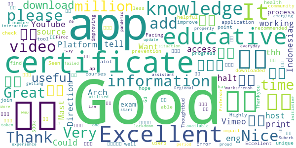

> Excellent information but less attractive for the most  :date: __2020-07-02 17:54:08__

> Good working  :date: __2020-06-28 08:53:05__

> Could you please host the videos also on YouTube, since we cannot access the Vimeo Platform here in Indonesia. Thank you.  :date: __2020-06-24 07:38:57__

> Good source of information  :date: __2020-06-20 09:36:05__

> Excellent Direction~  :date: __2020-06-19 14:08:55__

> Mast  :date: __2020-06-13 09:10:54__

> Good app of thh halt.  :date: __2020-05-31 05:25:43__

> Arch. eng.  :date: __2020-05-22 01:54:14__

> Good  :date: __2020-05-17 08:09:21__

> Want to print my certificate  :date: __2020-05-15 02:12:18__

#### 3-star reviews

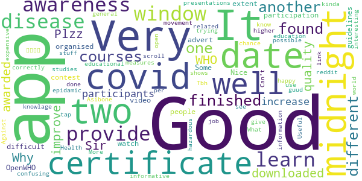

> I have finished two courses on two different date(one before midnight, another after midnight) but found same date on both while I downloaded Certificates. Why is this?  :date: __2020-06-11 19:18:50__

> covid  :date: __2020-06-11 18:37:22__

> Sir, Plzz improve the quality of the certificate awarded by the WHO to the participants to increase more & more participation as well as awareness of the people in this contest organised by OpenWHO.  :date: __2020-05-24 16:44:50__

> Some extent it's very good and its provide guidelines to advert disease.  :date: __2020-05-23 18:33:55__

> Nice app however difficult to watch video presentations  :date: __2020-05-14 19:35:42__

> Very confusing. not happy with the link. I don't know if I have done it correctly.  :date: __2020-05-12 22:12:31__

> Tbh this app is kinda like reddit, you can scroll through windows that shows general knowlage, then you can tap into that window for more information. It's a good app to learn about stuff  :date: __2020-05-09 13:39:53__

> Very good app ..give chance to learn higher education...its very good if this app will provide job related educational studies  :date: __2020-05-02 15:54:16__

> Good  :date: __2020-04-29 17:15:00__

> Very interesting.  :date: __2020-04-29 08:44:44__

#### 2-star reviews

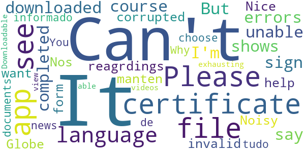

> It shows errors again and again,Can't sign in  :date: __2020-06-26 16:11:53__

> I completed a course and then downloaded certificate it ... But I'm unable too see my certificate as it say corrupted file or invalid file. Please help with reagrdings to it.  :date: __2020-05-27 13:14:22__

> Noisy app.  :date: __2020-04-21 21:34:45__

> Nice  :date: __2020-04-09 16:25:41__

> Please , i want the App in the form of the Globe.  :date: __2020-04-05 14:35:33__

> Nos manten informado de tudo  :date: __2020-03-22 08:51:43__

> Why can't you choose a language???? You have to see the same news or documents in all languages. Its exhausting.  :date: __2020-03-15 19:30:37__

> not able to view videos. not Downloadable too  :date: __2019-06-07 20:15:22__

#### 1-star reviews

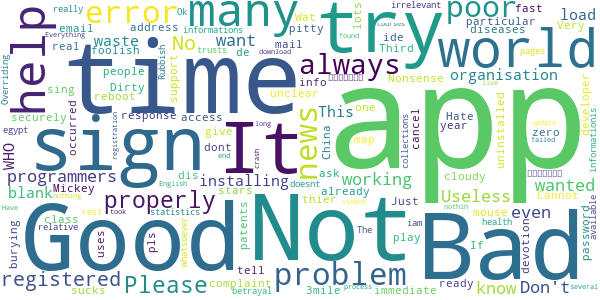

> I can't Login no matter how much I try.  :date: __2020-07-04 14:19:09__

> This app is having technical issues  :date: __2020-07-03 17:13:33__

> Not a good application....It always changes names in certificates and it changes dates also moreover i have done courses and it changes there names also in certificates...so many problems...now what to do  :date: __2020-07-02 03:49:39__

> Not sign in properly many time errors.. Please help me out of this problem. I already registered a complaint that particular problem through mail.  :date: __2020-06-16 05:10:29__

> No real news  :date: __2020-06-10 20:20:26__

> Dirty apps  :date: __2020-06-08 01:02:18__

> Not sign in properly Many times error  :date: __2020-05-29 19:05:54__

> Cannot access securely and info very unclear and cloudy  :date: __2020-05-28 05:01:52__

> Not good at all, very bad  :date: __2020-05-25 06:20:08__

> I try lots time to sign in but no response and my 3mile ide are all ready registered  :date: __2020-05-19 16:24:39__

# Credits

This project makes use of the following main third-party projects:
* Androguard: [https://github.com/androguard/androguard](https://github.com/androguard/androguard)
* Androwarn: [https://github.com/maaaaz/androwarn](https://github.com/maaaaz/androwarn)
* google_play_scraper: [https://github.com/JoMingyu/google-play-scraper](https://github.com/JoMingyu/google-play-scraper)
* whois: [https://github.com/DannyCork/python-whois](https://github.com/DannyCork/python-whois)
* BeautifulSoup: [https://www.crummy.com/software/BeautifulSoup](https://www.crummy.com/software/BeautifulSoup)

Other open-source projects used in this project include: 

- androguard==3.3.5
- appnope==0.1.0
- asn1crypto==1.3.0
- backcall==0.1.0
- beautifulsoup4==4.9.0
- bs4==0.0.1
- certifi==2020.4.5.1
- cffi==1.14.0
- chardet==3.0.4
- click==7.1.2
- colorama==0.4.3
- cryptography==2.9.2
- cycler==0.10.0
- decorator==4.4.2
- future==0.18.2
- google-play-scraper==0.0.3.0
- idna==2.9
- ipython==7.13.0
- ipython-genutils==0.2.0
- jedi==0.17.0
- Jinja2==2.11.2
- joblib==0.14.1
- kiwisolver==1.2.0
- lxml==4.5.0
- MarkupSafe==1.1.1
- matplotlib==3.2.1
- networkx==2.4
- nltk==3.5
- numpy==1.18.3
- parso==0.7.0
- pexpect==4.8.0
- pickleshare==0.7.5
- Pillow==7.1.2
- play-scraper==0.6.0
- prompt-toolkit==3.0.5
- ptyprocess==0.6.0
- pycountry==19.8.18
- pycparser==2.20
- pydot==1.4.1
- Pygments==2.6.1
- pyOpenSSL==19.1.0
- pyparsing==2.4.7
- python-dateutil==2.8.1
- regex==2020.4.4
- requests==2.23.0
- requests-futures==1.0.0
- six==1.14.0
- soupsieve==2.0
- tld==0.12.1
- tqdm==4.45.0
- traitlets==4.3.3
- urllib3==1.25.9
- wcwidth==0.1.9
- wordcloud==1.7.0

