# COVID-related Android apps in Australia

Author: `Ivano Malavolta` (ivanomalavolta@gmail.com)

Created at: `2021/3/6`

Report generated by the [covid-apps-observer](http://github.com/covid-apps-observer) project, version 0.1

# Table of contents 

- [Background](#background)
    * [Data sources and analyses](#data-sources-and-analyses)
        * [App metadata](#app-metadata)
        * [Requested permissions](#requested-permissions)
        * [Mentioned servers](#mentioned_servers)
        * [Security analysis](#security_analysis)
        * [User ratings and reviews](#user-ratings-and-reviews)
    * [Disclaimer](#disclaimer)
- [COVIDSafe](#covidsafe)
- [WHO Info](#who-info)
- [Coronavirus Australia](#coronavirus-australia)
- [MyAus COVID-19](#myaus-covid-19)
- [OpenWHO: Knowledge for Health Emergencies](#openwho-knowledge-for-health-emergencies)
- [Check In CBR](#check-in-cbr)
- [Service NSW](#service-nsw)
- [Bupa Aged Care Connect](#bupa-aged-care-connect)
- [HealthEngine](#healthengine)
- [DreamLab](#dreamlab)
- [Premier's Active April](#premier's-active-april)

- [Credits](#credits)

# How to read this report

This report has been generated by the [covid-apps-observer](http://github.com/covid-apps-observer) project. The project automatically analyzes the apps by extracting information which is already publicly available either on the web or in the apps binary files. 

Our analysis covers the following apps:
| | |
|-------------------------|-------------------------| 
|  | COVIDSafe
|  | WHO Info
|  | Coronavirus Australia
|  | MyAus COVID-19
|  | OpenWHO: Knowledge for Health Emergencies
|  | Check In CBR
|  | Service NSW
|  | Bupa Aged Care Connect
|  | HealthEngine
|  | DreamLab
|  | Premier's Active April

The details of our analysis are presented in the remainder of this report.

For independent verification, the raw data and the source code of the project is publicly available in its GitHub repository [http://github.com/covid-apps-observer](http://github.com/covid-apps-observer) and its source code has been thoroughly commented in order to provide all the details about how the information provided in this report has been extracted. 

Any feedback, questions, and improvements about the project are very welcome, feel free to create an issue or pull request directly in its GitHub repository: [http://github.com/covid-apps-observer](http://github.com/covid-apps-observer).

## Data sources and analyses

The analysis of each app is structured around five main dimensions: 
* App metadata  
* Requested permissions
* Mentioned servers
* Androwarn analysis
* User ratings and reviews

In the following we describe the data sources and analysis performed for each dimension.

### App metadata

App metadata includes an overview of the main information about the app (for example, its name, releases, privacy policy, etc.), contact information of the development team, and the various Android versions supported by the app. This information is extracted from two main data sources:
* _Google Play store_: we automatically mined the web page of the Google Play store showing the basic information about the app and we parsed it in order to extract information about the app and development team 
* _Android Manifest file_: in our analysis we decompiled the binary file of the app (it is similar to a Zip archive but it contains the code of the app instead of normal files) and we extracted information about the supported Android versions, as it has been listed by its development team.

The extracted app metadata feeds the _App overview_, _Development team_, and _Android support_ sections of this report.
We make use of the [google-play-scraper](https://github.com/JoMingyu/google-play-scraper) tool for extracting the raw data related to this dimension of the project.

### Requested permissions

The Android operating system has a permission model which allows users to grant access to potentially privacy-related information. Every Android app has to explictly declare the permissions it needs to properly function in the Android Manifest file.  

In this report we also show the protection level of each permission, which is a key information for understanding how the requested permissions related to the user's privacy. We carefully analyzed the [official Android documentation (v. 29)](https://developer.android.com/reference/android/Manifest.permission), and it resulted that a permission requested by an Android app can belong to the following protection levels:
* **Dangerous**: higher-risk permissions that would give a requesting app access to private user data or control over the device that can negatively impact the user. Because this type of permission introduces potential risk, the system usually does not automatically grant it to the requesting app. For example, any dangerous permissions requested by an app may be displayed to the user and require confirmation before proceeding.
* **Normal**: this is the default and most common level in Android; normal permissions are lower-risk and give access to isolated app-level features, with minimal risk to other apps, the system, or the user. 
* **Signature**: permissions granted only if the requesting app is signed with the same certificate as the app that declared the permission
* **Appop**: old permission level, a reminiscence of the App Ops tool that Google introduced in Android 4.3.
* **Development**: optional permissions which can be granted to development-oriented apps.
* **Privileged**: permissions who give higher power to mobile apps w.r.t. other apps, such as binding to incoming calls, interacting via bluetooth with other devices without user interaction, etc.
* **Preinstalled**: reserved only for preinstalled apps
* **Installer**: allow the holder to start the permission usage screen for an app
* **RetailDemo**: permissions related to devices used in demonstrations in shops.
* **Pre23**: permissions automatically granted to apps targeting devices running pre-6.0 Android.
* **Upcoming**: permissions which will be released in the next version of the Android platform. 
* **Deprecated**: permissions belonging to old releases of the Android platform, they should not be used by developers since they will not be supported in the near future.
* **Not for use by third-party applications**: permissions which can be requested only by apps developed by Google.
* **Undefined**: this protection level is not documented by Google.

The permissions dimension of this project is based on the [Androguard](https://github.com/androguard/androguard) static analysis tool.

### Mentioned servers

We decompiled each app in order to look for all possible mentions of remote URLs. The mentioned URLs can refer to remote servers the the app is using for either sending or receiving information, web addresses for directing the user to an information website, and so on. 

:warning: It is important to note that this analysis is not meant to be complete and it is very prone to obfuscation. The servers reported here are simply _mentioned_ somewhere in the code of the app and are meant to just give an indication about the "hooks" of the app towards external resources. For example, for an Android app it is normal to contact Google services in order to send/receive push notifications, or to contact the servers of analytics services for having real-time diagnostics about crashes of the app or bugs.

This part of the analysis is based on the [Androguard](https://github.com/androguard/androguard) static analysis tool for identfying the raw URLs mentioned in the app; then, the information about each mentioned server is collected by performing a _whois_ lookup on the first-level domain present in the URL.

### Security analysis

This dimension is based on the [Androwarn](https://github.com/maaaaz/androwarn) structural and data flow analysis of Android bytecode. Androwarn is developed by the University of Lyon/INSA (France) and it has been used in several academic studies. According to its documentation, Androwarn targets the following categories of potential security issues:
* **Telephony identifiers exfiltration**: IMEI, IMSI, MCC, MNC, LAC, CID, operator's name, etc.
* **Device settings exfiltration**: software version, usage statistics, system settings, logs, etc.
* **Geolocation information leakage**: GPS/WiFi geolocation, etc.
* **Connection interfaces information exfiltration**: WiFi credentials, Bluetooth MAC adress, etc.
* **Telephony services abuse**: premium SMS sending, phone call composition, etc.
* **Audio/video flow interception**: call recording, video capture, etc.
* **Remote connection establishment**: socket open call, Bluetooth pairing, APN settings edit, etc.
* **PIM data leakage**: contacts, calendar, SMS, mails, clipboard, etc.
* **External memory operations**: file access on SD card, etc.
* **PIM data modification**: add/delete contacts, calendar events, etc.
* **Arbitrary code execution**: native code using JNI, UNIX command, privilege escalation, etc.
* **Denial of Service**: event notification deactivation, file deletion, process killing, virtual keyboard disable, terminal shutdown/reboot, etc.

Note: We do not consider this data point in the current version of our analyzers since it is too verbose for our purposes.

:warning: It is important to note that Androwarn is a static analysis tool, and as such it performs a variety of heuristics and approximations in its analyses. Said that, the results shown in this report are meant to provide an indication of _potential_ security issues and should be by no means treated as complete and correct.   

### User ratings and reviews

For this dimension we turn again to the web interface of the Google Play store. Firstly, we automatically mine summary statistics about user ratings from the web page of the app under analysis; then, we automatically download the newest 1000 reviews of the app under analysis. For each level of rating (5 stars, 4 stars, , etc., 1 star) we show:
- a word cloud presenting the main terms used by end users in their reviews in the Google Play store
- the last 10 reviews provided by app users in the Google Play store. 

This purposefully simple analysis is meant to help both future users and the development team of the app in understanding what are the main positive and negative points of the app under analysis.

We make use of the [google-play-scraper](https://github.com/JoMingyu/google-play-scraper) tool for extracting the raw data related to this dimension of the project.

## Disclaimer 

This report has been produced independently of any parties and its only objective is to help anybody in better understanding how COVID-related apps work in practice (and compare to each other). The results of this report are limited to the specific version of the software used for running the analyses and on the various heuristics implemented in there. In other words, the results of the analyzers may differ depending on the time and modalities in which they are executed. We do not guarantee that the results of the analyses and the corresponding contents of this report are fully complete or correct. The analysis software is licensed under the [MIT License](https://github.com/iivanoo/covid-apps-observer/blob/master/LICENSE).

# COVIDSafe
App version ``2.3``

Analyzed with [covid-apps-observer](http://github.com/covid-apps-observer) project, version ``0.1``

## App overview
| | |
|-------------------------|-------------------------| 
| **Name**&nbsp;&nbsp;&nbsp;&nbsp;&nbsp;&nbsp;&nbsp;&nbsp;&nbsp;&nbsp;&nbsp;&nbsp;&nbsp;&nbsp;&nbsp;&nbsp;&nbsp;&nbsp;&nbsp;&nbsp;&nbsp;&nbsp;&nbsp;&nbsp;&nbsp;&nbsp;&nbsp;&nbsp;&nbsp;&nbsp;&nbsp;&nbsp;&nbsp;&nbsp;&nbsp;&nbsp;&nbsp;&nbsp;&nbsp;&nbsp;  | COVIDSafe |
| **Unique identifier** | au.gov.health.covidsafe |
| **Link to Google Play** | [https://play.google.com/store/apps/details?id=au.gov.health.covidsafe](https://play.google.com/store/apps/details?id=au.gov.health.covidsafe) |
| **Summary**  | COVIDSafe is a community-based way to stop the spread of COVID-19. |
| **Privacy policy** | [https://covidsafe.gov.au/privacy-policy.html](https://covidsafe.gov.au/privacy-policy.html) |
| **Latest version** | 2.3 |
| **Last update** | 2021-02-25 06:55:46 |
| **Recent changes** | This update includes a way to check the latest advice on current COVID-19 restrictions for every state and territory, including domestic travel, hotspots and COVID-19 case locations. |
| **Installs**  | 1,000,000+ |
| **Category** | Health & Fitness |
| **First release** | Apr 25, 2020 |
| **Size**  | 13M |
| **Supported Android version**  | 5.0 and up |

### Description
> COVIDSafe app has been developed by the Australian Government Department of Health to help keep the community safe from coronavirus (COVID-19). Together, let’s help stop the spread and keep ourselves and each other healthy.
 COVIDSafe uses the Bluetooth® technology on your mobile phone to look for other devices with COVIDSafe installed. Your device will take a note of contact you’ve had with other users by securely logging the other user’s reference code. If you or someone you’ve been in contact with is diagnosed with COVID-19, the close contact information securely stored in your phone can be uploaded and used—with your consent—by state and territory health officials to quickly inform people who’ve been exposed to the virus.
 How you can help stop the spread of COVID-19:
 • Download the COVIDSafe app
 • Register using your mobile phone number, name, age range and postcode
 • Turn on Bluetooth®
 • Check that COVIDSafe is running when you are out and about or are likely to come into contact with others
 • If you test positive for COVID-19, you can consent for your close contact information to be used by state and territory health officials to contact people who may have been exposed. If you’ve been exposed to the virus by someone you’ve been in close contact with, state and territory health officials will be able to contact you quickly so you can get the support you need
 COVIDSafe is an Australian Government Department of Health initiative. Visit https://www.health.gov.au/resources/apps-and-tools/covidsafe-app for more information.

### User interface
The developers of the app provide the following screenshots in the Google play store.
| | | |
|:-------------------------:|:-------------------------:|:-------------------------:|
 |   |   |   | 
 |   |  

## Development team
In the following we report the main information provided by the development team in the Google play store.

| | |
|-------------------------|-------------------------|
| **Developer**  | Australian Department of Health |
| **Website**  | [https://www.health.gov.au/resources/apps-and-tools/covidsafe-app#covidsafe-app-help](https://www.health.gov.au/resources/apps-and-tools/covidsafe-app#covidsafe-app-help) |
| **Email** | support@COVIDSafe.gov.au |
| **Physical address**  | - |
| **Other developed apps**  | [https://play.google.com/store/apps/developer?id=Australian+Department+of+Health](https://play.google.com/store/apps/developer?id=Australian+Department+of+Health) |

## Android support

| | |
|-------------------------|-------------------------|
| **Declared target Android version**  | Android10, version 10 (API level 29) |
| **Effective target Android version**  | Android10, version 10 (API level 29) |
| **Minimum supported Android version**  | Lollipop, version 5.0 (API level 21) |
| **Maximum target Android version**  | - |

The larger the difference between the minimum and maximum supported Android versions, the better. A larger difference means a wider audience. For example, old phones have a very low Android version, so a high minimum supported Android version means that the app cannot be used by users with old phones, thus leading to accessibility problems. 

## Requested permissions

In the following we report the complete list of the permissions requested by the app. 

| **Permission** | **Protection level** | **Description** | 
|-------------------------|-------------------------|-------------------------|
 **android.permission ACCESS_COARSE_LOCATION** | :warning:**Dangerous** | Allows an app to access approximate location. 
 **android.permission ACCESS_FINE_LOCATION** | :warning:**Dangerous** | Allows an app to access precise location. 
 **android.permission ACCESS_NETWORK_STATE** | Normal | Allows applications to access information about networks. 
 **android.permission BLUETOOTH** | Normal | Allows applications to connect to paired bluetooth devices. 
 **android.permission BLUETOOTH_ADMIN** | Normal | Allows applications to discover and pair bluetooth devices. 
 **android.permission FOREGROUND_SERVICE** | Normal | Allows a regular application to use Service.startForeground. 
 **android.permission INTERNET** | Normal | Allows applications to open network sockets. 
 **android.permission RECEIVE_BOOT_COMPLETED** | Normal | Allows an application to receive the Intent.ACTION_BOOT_COMPLETED that is broadcast after the system finishes booting. 
 **android.permission REQUEST_IGNORE_BATTERY_OPTIMIZATIONS** | Normal | Permission an application must hold in order to use Settings.ACTION_REQUEST_IGNORE_BATTERY_OPTIMIZATIONS. 
 **android.permission WAKE_LOCK** | Normal | Allows using PowerManager WakeLocks to keep processor from sleeping or screen from dimming. 
 **com.google.android.c2dm.permission RECEIVE** | - | - 

## Mentioned servers

| **Server** | **Registrant** | **Registrant country** | **Creation date** | 
|-------------------------|-------------------------|-------------------------|-------------------------|
 | google.com | Google LLC | :us: US | 1997-09-15 04:00:00 |
 | stackoverflow.com | Stack Exchange, Inc. | :us: US | 2003-12-26 19:18:07 |
 | googleapis.com | Google LLC | :us: US | 2005-01-25 17:52:26 |

## Security analysis 

Below we report the main security warnings raised by our execution of the [Androwarn](https://github.com/maaaaz/androwarn) security analysis tool.

**Connection interfaces exfiltration**
> - This application reads details about the currently active data network 
> - This application tries to find out if the currently active data network is metered 

**Suspicious connection establishment**
> - This application opens a Socket and connects it to the remote address ' returned no addresses for  ; port is out of range' on the 'N/A' port  
> - This application opens a Socket and connects it to the remote address '' on the 'N/A' port  
> - This application opens a Socket and connects it to the remote address 'Ljava/lang/StringBuilder;->toString()Ljava/lang/String;' on the 'N/A' port  
> - This application opens a Socket and connects it to the remote address 'Ljava/net/Proxy;->type()Ljava/net/Proxy$Type;' on the 'N/A' port  
> - This application opens a Socket and connects it to the remote address 'timeout' on the 'N/A' port  

## User ratings and reviews

Below we provide information about how end users are reacting to the app in terms of ratings and reviews in the Google Play store.

### Ratings

The COVIDSafe app has been installed by more than **1000000** times. At this time, **14764** rated the app and its average score is **2.481208**. Below we show the distribution of the ratings across the usual star-based rating of Google Play

:star::star::star::star::star:: 3736

:star::star::star::star:: 1020

:star::star::star:: 1129

:star::star:: 1605

:star:: 7274

### Reviews 

#### 5-star reviews

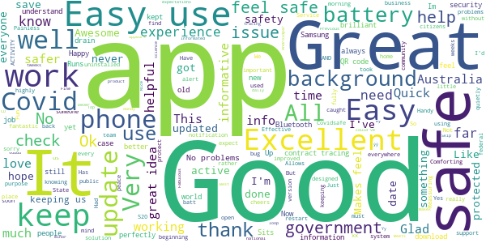

> Effective  :date: __2021-03-06 10:39:02__

> It is a great idea for me.  :date: __2021-03-06 08:27:55__

> Easy and much wider uptake by business.  :date: __2021-03-06 08:02:59__

> very good info & easy to understand  :date: __2021-03-06 05:52:14__

> Reliable after a rocky start  :date: __2021-03-06 03:06:22__

> It keeps me safe  :date: __2021-03-06 02:08:45__

> Easy to use  :date: __2021-03-06 00:56:24__

> Great app  :date: __2021-03-05 16:54:26__

> Fun  :date: __2021-03-05 13:30:17__

> Easy to read and keep up to date  :date: __2021-03-05 11:05:24__

#### 4-star reviews

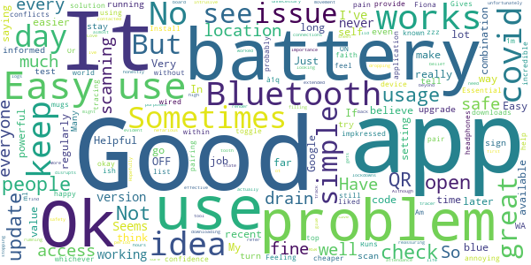

> Good  :date: __2021-03-06 07:11:39__

> I am impkressed with the application  :date: __2021-03-06 06:23:56__

> ,Fiona mugs ml . s zzz  :date: __2021-03-05 22:46:30__

> Helpful  :date: __2021-03-05 11:20:59__

> I have faith it can help and do its job, just world have liked it to be top of the list device for tracing.  :date: __2021-03-05 07:28:40__

> Install was easy. Runs without problems. But if there's only 1m downloads, probably only 75%-ish using regularly .... I don't really see the value!!  :date: __2021-03-05 06:54:43__

> It's a great idea, but unfortunately some people believe that it's there to track their every movement for nefarious purposes... If only people could think beyond their own belief in their own self-importance, it could actually be an effective tracer and render extended lockdowns almost unnecessary - if only...  :date: __2021-03-05 06:10:29__

> Not intrusive  :date: __2021-03-04 10:32:25__

> Not sure if it is doing any good. But safety first as ot might save a life.  :date: __2021-03-04 02:19:38__

> Very good  :date: __2021-03-04 01:01:26__

#### 3-star reviews

> Just downloaded app.  :date: __2021-03-06 13:04:03__

> I have now been using this app for quite some time. I am overall happy with app  :date: __2021-03-05 08:54:18__

> I havent used it  :date: __2021-03-05 08:32:21__

> So much money on a useless product  :date: __2021-03-05 07:00:44__

> Average  :date: __2021-03-05 06:47:24__

> yes the app is good but im going to have to uninstall it as the "supposed" fix of battery drain has done NOTHING!!! Im having to charge my phone daily  :date: __2021-03-05 03:39:16__

> Great  :date: __2021-03-04 13:19:09__

> Uses a lot of battery power.  :date: __2021-03-04 09:17:54__

> Drains the battery.  :date: __2021-03-04 06:18:33__

> Not too good at tracking covid is it  :date: __2021-03-04 03:11:27__

#### 2-star reviews

> Battery sponge and Bluetooth interruption  :date: __2021-03-06 11:01:22__

> App uses far to much power and drains battery  :date: __2021-03-06 10:22:55__

> Nil  :date: __2021-03-05 12:35:15__

> Doesnt do anything that I can see  :date: __2021-03-05 08:49:07__

> Useless  :date: __2021-03-05 07:43:51__

> Uninstalled as uses far too much battery resources.  :date: __2021-03-05 03:05:10__

> I've signed on, notwithstanding reservations, because of the gravity of the issue. But... long term privacy & commercialisation issues remain unaddressed. That's a legal reality, whatever the spin put on it.  :date: __2021-03-05 02:00:59__

> Does not seem to be doing anything and I have to have Bluetooth on which keeps going off and I have to turn phone off unnecessarily to rectify.  :date: __2021-03-05 00:20:28__

> Reasonably sure this app serves no purpose whatsoever...  :date: __2021-03-04 14:41:26__

> Battery drain, lack of open source concerns, but still consider a responsible choice  :date: __2021-03-04 13:30:27__

#### 1-star reviews

> Wont update  :date: __2021-03-06 09:59:42__

> No use at all  :date: __2021-03-06 04:42:48__

> YThe  :date: __2021-03-06 01:55:33__

> Uses 60% of my s20 ultras battery on average. I'd be more than happy to use the app but not when it means I have a flat phone by 3pm.  :date: __2021-03-05 14:40:04__

> This is a good app but you can use the Service NSW app to check in  :date: __2021-03-05 12:14:13__

> Cannot access pin,now cannot update  :date: __2021-03-05 09:26:46__

> Finding it less and less convenient to use and relevant every week. The Services NSW app is far better  :date: __2021-03-05 09:08:09__

> I've had this app installed ever since it came out, but lately my phone says that the app is using 48% of my battery, so I had to remove it. From what I've heard, it didn't achieve much anyway.  :date: __2021-03-05 09:06:19__

> Why does this app only read vic gov app . All the others can read all qr codes ?  :date: __2021-03-05 08:57:52__

> Should cover scanning location app and vaccination location and times.  :date: __2021-03-05 07:48:08__

# WHO Info
App version ``4.1.0``

Analyzed with [covid-apps-observer](http://github.com/covid-apps-observer) project, version ``0.1``

## App overview
| | |
|-------------------------|-------------------------| 
| **Name**&nbsp;&nbsp;&nbsp;&nbsp;&nbsp;&nbsp;&nbsp;&nbsp;&nbsp;&nbsp;&nbsp;&nbsp;&nbsp;&nbsp;&nbsp;&nbsp;&nbsp;&nbsp;&nbsp;&nbsp;&nbsp;&nbsp;&nbsp;&nbsp;&nbsp;&nbsp;&nbsp;&nbsp;&nbsp;&nbsp;&nbsp;&nbsp;&nbsp;&nbsp;&nbsp;&nbsp;&nbsp;&nbsp;&nbsp;&nbsp;  | WHO Info |
| **Unique identifier** | org.who.infoapp |
| **Link to Google Play** | [https://play.google.com/store/apps/details?id=org.who.infoapp](https://play.google.com/store/apps/details?id=org.who.infoapp) |
| **Summary**  | The official World Health Organization Information App. |
| **Privacy policy** | [https://www.who.int/about/who-we-are/privacy-policy](https://www.who.int/about/who-we-are/privacy-policy) |
| **Latest version** | 4.1.0 |
| **Last update** | 2021-01-14 10:10:28 |
| **Recent changes** | This release introduces &quot;Health Topics&quot;. &quot;Health Topics&quot; provide additional information about favourite health topics. |
| **Installs**  | 500,000+ |
| **Category** | News & Magazines |
| **First release** | Apr 13, 2020 |
| **Size**  | 12M |
| **Supported Android version**  | 4.2 and up |

### Description
> Have the latest health information at your fingertips with the official World Health Organization Information App. This app displays the latest news, events, features and breaking updates on outbreaks. 
  
 WHO works worldwide to promote health, keep the world safe, and serve the vulnerable. 
 Our goal is to ensure that a billion more people have universal health coverage, to protect a billion more people from health emergencies, and provide a further billion people with better health and well-being.

### User interface
The developers of the app provide the following screenshots in the Google play store.
| | | |
|:-------------------------:|:-------------------------:|:-------------------------:|
 |   |   |   | 
 |   |   |   | 
 |   |   |   | 
 |   |   |   | 
 |   |   |   | 
 |   |   |   | 
 |   |   |   | 
 |   |   |   | 

## Development team
In the following we report the main information provided by the development team in the Google play store.

| | |
|-------------------------|-------------------------|
| **Developer**  | World Health Organization |
| **Website**  | [https://www.who.int/](https://www.who.int/) |
| **Email** | dcx@who.int |
| **Physical address**  | [Avenu Appia 20 1211 Geneva Switzerland](https://www.google.com/maps/search/Avenu%20Appia%2020%201211%20Geneva%20Switzerland) (Google Maps) |
| **Other developed apps**  | [https://play.google.com/store/apps/developer?id=World+Health+Organization](https://play.google.com/store/apps/developer?id=World+Health+Organization) |

## Android support

| | |
|-------------------------|-------------------------|
| **Declared target Android version**  | - |
| **Effective target Android version**  | - |
| **Minimum supported Android version**  | Jelly Bean, version 4.2.x (API level 17) |
| **Maximum target Android version**  | - |

The larger the difference between the minimum and maximum supported Android versions, the better. A larger difference means a wider audience. For example, old phones have a very low Android version, so a high minimum supported Android version means that the app cannot be used by users with old phones, thus leading to accessibility problems. 

## Requested permissions

In the following we report the complete list of the permissions requested by the app. 

| **Permission** | **Protection level** | **Description** | 
|-------------------------|-------------------------|-------------------------|
 **android.permission ACCESS_NETWORK_STATE** | Normal | Allows applications to access information about networks. 
 **android.permission INTERNET** | Normal | Allows applications to open network sockets. 
 **android.permission READ_CALENDAR** | :warning:**Dangerous** | Allows an application to read the user's calendar data. 
 **android.permission READ_EXTERNAL_STORAGE** | :warning:**Dangerous** | Allows an application to read from external storage. 
 **android.permission WAKE_LOCK** | Normal | Allows using PowerManager WakeLocks to keep processor from sleeping or screen from dimming. 
 **android.permission WRITE_CALENDAR** | :warning:**Dangerous** | Allows an application to write the user's calendar data. 
 **android.permission WRITE_EXTERNAL_STORAGE** | :warning:**Dangerous** | Allows an application to write to external storage. 
 **com.google.android.c2dm.permission RECEIVE** | - | - 
 **com.google.android.finsky.permission BIND_GET_INSTALL_REFERRER_SERVICE** | - | - 

## Mentioned servers

| **Server** | **Registrant** | **Registrant country** | **Creation date** | 
|-------------------------|-------------------------|-------------------------|-------------------------|
 | adobe.com | Adobe Inc. | :us: US | 1986-11-17 05:00:00 |
 | googlesyndication.com | Google LLC | :us: US | 2003-01-21 06:17:24 |
 | google.com | Google LLC | :us: US | 1997-09-15 04:00:00 |
 | app-measurement.com | Google LLC | :us: US | 2015-06-19 20:13:31 |
 | googleapis.com | Google LLC | :us: US | 2005-01-25 17:52:26 |
 | googleadservices.com | Google LLC | :us: US | 2003-06-19 16:34:53 |

## Security analysis 

Below we report the main security warnings raised by our execution of the [Androwarn](https://github.com/maaaaz/androwarn) security analysis tool.

**Connection interfaces exfiltration**
> - This application reads details about the currently active data network 
> - This application tries to find out if the currently active data network is metered 

**Suspicious connection establishment**
> - This application opens a Socket and connects it to the remote address 'Lfi/iki/elonen/NanoHTTPD$ResponseException;' on the 'N/A' port  
> - This application opens a Socket and connects it to the remote address 'NanoHttpd Shutdown' on the 'N/A' port  

**Code execution**
> - This application loads a native library: 'NativeScript' 
> - This application executes a UNIX command containing this argument: '2' 

## User ratings and reviews

Below we provide information about how end users are reacting to the app in terms of ratings and reviews in the Google Play store.

### Ratings

The WHO Info app has been installed by more than **500000** times. At this time, **1114** rated the app and its average score is **4.108108**. Below we show the distribution of the ratings across the usual star-based rating of Google Play

:star::star::star::star::star:: 754

:star::star::star::star:: 90

:star::star::star:: 60

:star::star:: 60

:star:: 150

### Reviews 

#### 5-star reviews

> Good  :date: __2021-01-17 13:53:04__

> Gives global data on covid 19 updates.  :date: __2021-01-07 08:43:58__

> Very nice app for health.  :date: __2020-12-12 06:15:46__

> Great. Installed quickly without problems. :-)  :date: __2020-11-15 16:31:45__

> Thnx u save live  :date: __2020-11-11 19:32:07__

> Always the best one!  :date: __2020-11-04 22:22:46__

> Great app  :date: __2020-11-03 15:50:52__

> Good  :date: __2020-10-31 20:49:42__

> 😊😊😊  :date: __2020-10-21 18:17:56__

> I. AM. BELIVE. W. H. O  :date: __2020-10-04 06:51:53__

#### 4-star reviews

> Not sure yet  :date: __2020-09-27 08:50:53__

> Excellent engineering tools. Your whatsapp number please.  :date: __2020-08-05 11:01:52__

> all the demand who it is hey  :date: __2020-07-20 15:10:48__

> Using this more and more. After the cdc called religion an essential. I don't know what whackadoodle besides trump/pence is messing with the info. Thank you for being a more logical alternative. As usa is being pulled back by whackadoodles and foreign commies.  :date: __2020-07-17 03:09:14__

> Nice  :date: __2020-07-08 17:19:26__

> good  :date: __2020-06-03 00:37:10__

> It's just information, not the actual tracker. But has plenty of information that's 100% accurate.  :date: __2020-05-31 02:37:20__

> I really want to appreciate Dr. Aliu Sam for using his natural roots and herbs medicine to cure me of Syphilis Since 11 months now I have been living with this disease and it has been giving me challenges, I was so perplexed cause I have been taking several drugs to be cured but all have been in vain. One morning I was browsing through the Internet then i saw several testimonies about Dr. Aliu Sam curing people off verious diseases and immediately I contacted Dr. Aliu Sam I told himabout my trou  :date: __2020-05-08 05:33:57__

> It did not detect  :date: __2020-04-29 18:37:26__

> Could do with more accurate information to keep people alive. But no harm done.  :date: __2020-04-29 13:41:12__

#### 3-star reviews

> A good improvement could be the implementation of a search system for arguments that a person want to find ( like the guidelines about health and healthy diet). At first look seems it miss a lot from the website.  :date: __2020-09-27 10:09:16__

> Good App but I don't trust the WHO. Just have the app to stay up to date with the crazy things the WHO gets up to  :date: __2020-07-29 10:34:08__

> Will not download onto my 1year old state of the art smatphone. Bad, as a user of many android apps what are you thinking. I have found more than 3700 other users that can not use this app. Come on you must no you have problem.  :date: __2020-05-26 02:04:59__

> Good  :date: __2020-05-14 21:22:11__

> Best.  :date: __2020-04-20 13:14:33__

> Looks nice great look smooth Lario  :date: __2020-04-18 09:44:30__

#### 2-star reviews

> Badly organized, unadjustable, and full of politics,i erased it  :date: __2020-11-13 07:29:53__

> Coro nosotras coronas  :date: __2020-07-02 06:41:55__

> Partial  :date: __2020-06-22 12:24:23__

> Learn more  :date: __2020-06-15 23:35:50__

> WHO Inform Covid 19  :date: __2020-05-24 17:14:56__

> Very little data or charts. Not consistent with Worldometer. Mostly an aggregation of news feeds about WHO  :date: __2020-05-15 15:38:10__

> Thanks for your help.  :date: __2020-04-22 18:52:40__

#### 1-star reviews

> I do not like the new update.  :date: __2021-01-19 23:39:15__

> Says I can't connect even tho I have WiFi and data on  :date: __2021-01-04 02:35:04__

> Extremely bad application. Always not working at all. Why do you keep it in the playstore?!  :date: __2020-12-15 16:13:48__

> A wast of time  :date: __2020-11-04 13:04:20__

> “‘Ovid’ is Latin for a sheep. COVID starts with a C, which also means ‘see’ in ancient language. 19 was known as the “Number of Surrender” in ancient times.”  It goes on to draw the conclusion, “C-OVID 19 = ‘See a Sheep Surrender'”.  :date: __2020-11-02 08:06:17__

> Very scammers  :date: __2020-10-19 19:45:47__

> I just downloaded it, but every time I open it just say "an error occur check your connectivity" or something like that... didn't work...  :date: __2020-10-10 17:24:54__

> Does not work  :date: __2020-10-09 00:12:33__

> This is your official application? and sometimes it doesn't work  :date: __2020-10-07 18:26:16__

> I am not able to download it fully its no use to me as i am a type1 Diabetic and Asthmatic i am also in 3rd degree Kidney Failure.  :date: __2020-09-29 02:20:05__

# Coronavirus Australia
App version ``1.4.10``

Analyzed with [covid-apps-observer](http://github.com/covid-apps-observer) project, version ``0.1``

## App overview
| | |
|-------------------------|-------------------------| 
| **Name**&nbsp;&nbsp;&nbsp;&nbsp;&nbsp;&nbsp;&nbsp;&nbsp;&nbsp;&nbsp;&nbsp;&nbsp;&nbsp;&nbsp;&nbsp;&nbsp;&nbsp;&nbsp;&nbsp;&nbsp;&nbsp;&nbsp;&nbsp;&nbsp;&nbsp;&nbsp;&nbsp;&nbsp;&nbsp;&nbsp;&nbsp;&nbsp;&nbsp;&nbsp;&nbsp;&nbsp;&nbsp;&nbsp;&nbsp;&nbsp;  | Coronavirus Australia |
| **Unique identifier** | au.gov.health.covid19 |
| **Link to Google Play** | [https://play.google.com/store/apps/details?id=au.gov.health.covid19](https://play.google.com/store/apps/details?id=au.gov.health.covid19) |
| **Summary**  | Official Government Information |
| **Privacy policy** | [https://www.health.gov.au/using-our-websites/privacy](https://www.health.gov.au/using-our-websites/privacy) |
| **Latest version** | 1.4.10 |
| **Last update** | 2021-01-21 05:00:02 |
| **Recent changes** | This update replaces the display of &#39;Recovered&#39; cases with &#39;Active cases&#39; to keep the numbers consistent with data released by Department of Health. |
| **Installs**  | 500,000+ |
| **Category** | Health & Fitness |
| **First release** | Mar 28, 2020 |
| **Size**  | 22M |
| **Supported Android version**  | 6.0 and up |

### Description
> You can use the Australian Government Coronavirus app to:
 - stay up to date with the official information and advice 
 - important health advice to help stop the spread and stay healthy
 - get a quick snapshot of the current official status within Australia
 - check your symptoms if you are concerned about yourself or someone else
 - find relevant contact information 
 - access updated information from the Australian Government
 - receive push notifications of urgent information and updates
 Trusted, Australian information
 All information in the Australian Government Coronavirus app is sourced from Australia’s leading health organisations and has undergone a quality assurance process so people can know it is safe, appropriate and relevant for Australians. 
 Disclaimer
 Whilst this app has been reviewed for clinical accuracy, the content is not a substitute for professional advice and should not be used as an alternative to professional healthcare. If you have a particular medical problem, please consult a doctor or a specialist.

### User interface
The developers of the app provide the following screenshots in the Google play store.
| | | |
|:-------------------------:|:-------------------------:|:-------------------------:|
 | 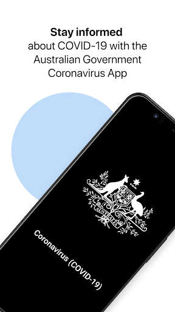  |   | 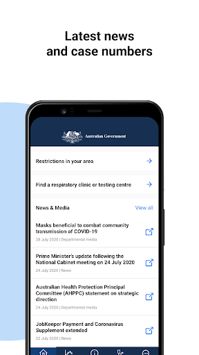  | 
 |   |   |   | 

## Development team
In the following we report the main information provided by the development team in the Google play store.

| | |
|-------------------------|-------------------------|
| **Developer**  | DTA App Developer |
| **Website**  | [http://health.gov.au](http://health.gov.au) |
| **Email** | info@health.gov.au |
| **Physical address**  | - |
| **Other developed apps**  | [https://play.google.com/store/apps/developer?id=DTA+App+Developer](https://play.google.com/store/apps/developer?id=DTA+App+Developer) |

## Android support

| | |
|-------------------------|-------------------------|
| **Declared target Android version**  | Android10, version 10 (API level 29) |
| **Effective target Android version**  | Android10, version 10 (API level 29) |
| **Minimum supported Android version**  | Marshmallow, version 6.0 (API level 23) |
| **Maximum target Android version**  | - |

The larger the difference between the minimum and maximum supported Android versions, the better. A larger difference means a wider audience. For example, old phones have a very low Android version, so a high minimum supported Android version means that the app cannot be used by users with old phones, thus leading to accessibility problems. 

## Requested permissions

In the following we report the complete list of the permissions requested by the app. 

| **Permission** | **Protection level** | **Description** | 
|-------------------------|-------------------------|-------------------------|
 **android.permission ACCESS_COARSE_LOCATION** | :warning:**Dangerous** | Allows an app to access approximate location. 
 **android.permission ACCESS_FINE_LOCATION** | :warning:**Dangerous** | Allows an app to access precise location. 
 **android.permission ACCESS_NETWORK_STATE** | Normal | Allows applications to access information about networks. 
 **android.permission FOREGROUND_SERVICE** | Normal | Allows a regular application to use Service.startForeground. 
 **android.permission INTERNET** | Normal | Allows applications to open network sockets. 
 **android.permission RECEIVE_BOOT_COMPLETED** | Normal | Allows an application to receive the Intent.ACTION_BOOT_COMPLETED that is broadcast after the system finishes booting. 
 **android.permission WAKE_LOCK** | Normal | Allows using PowerManager WakeLocks to keep processor from sleeping or screen from dimming. 
 **com.google.android.c2dm.permission RECEIVE** | - | - 
 **com.google.android.finsky.permission BIND_GET_INSTALL_REFERRER_SERVICE** | - | - 

## Mentioned servers

| **Server** | **Registrant** | **Registrant country** | **Creation date** | 
|-------------------------|-------------------------|-------------------------|-------------------------|
 | google.com | Google LLC | :us: US | 1997-09-15 04:00:00 |
 | googlesyndication.com | Google LLC | :us: US | 2003-01-21 06:17:24 |
 | apple.com | Apple Inc. | :us: US | 1987-02-19 05:00:00 |
 | aomedia.org | Contact Privacy Inc. Customer 1243324949 | :canada: CA | 2015-08-24 14:07:31 |
 | app-measurement.com | Google LLC | :us: US | 2015-06-19 20:13:31 |
 | w3.org | W3C | :us: US | 1994-07-06 04:00:00 |
 | googleapis.com | Google LLC | :us: US | 2005-01-25 17:52:26 |
 | googleapis.com | Google LLC | :us: US | 2005-01-25 17:52:26 |
 | googleapis.com | Google LLC | :us: US | 2005-01-25 17:52:26 |
 | googleapis.com | Google LLC | :us: US | 2005-01-25 17:52:26 |
 | googleapis.com | Google LLC | :us: US | 2005-01-25 17:52:26 |
 | googleadservices.com | Google LLC | :us: US | 2003-06-19 16:34:53 |
 | googleapis.com | Google LLC | :us: US | 2005-01-25 17:52:26 |
 | crashlytics.com | Google LLC | :us: US | 2011-01-21 15:30:40 |

## Security analysis 

Below we report the main security warnings raised by our execution of the [Androwarn](https://github.com/maaaaz/androwarn) security analysis tool.

**Telephony identifiers leakage**
> - This application reads the ISO country code equivalent for the SIM provider's country code 
> - This application reads the ISO country code equivalent of the current registered operator's MCC (Mobile Country Code) 
> - This application reads the device phone type value 

**Connection interfaces exfiltration**
> - This application reads details about the currently active data network 
> - This application tries to find out if the currently active data network is metered 

**Telephony services abuse**
> - This application makes phone calls 

**Suspicious connection establishment**
> - This application opens a Socket and connects it to the remote address ' returned no addresses for  ; port is out of range' on the 'N/A' port  
> - This application opens a Socket and connects it to the remote address '' on the 'N/A' port  
> - This application opens a Socket and connects it to the remote address 'Ljava/lang/StringBuilder;->toString()Ljava/lang/String;' on the 'N/A' port  
> - This application opens a Socket and connects it to the remote address 'Ljava/net/Proxy;->type()Ljava/net/Proxy$Type;' on the 'N/A' port  
> - This application opens a Socket and connects it to the remote address 'timeout' on the 'N/A' port  

**Code execution**
> - This application loads a native library 
> - This application executes a UNIX command containing this argument: '2' 

## User ratings and reviews

Below we provide information about how end users are reacting to the app in terms of ratings and reviews in the Google Play store.

### Ratings

The Coronavirus Australia app has been installed by more than **500000** times. At this time, **1625** rated the app and its average score is **3.5987654**. Below we show the distribution of the ratings across the usual star-based rating of Google Play

:star::star::star::star::star:: 814

:star::star::star::star:: 160

:star::star::star:: 200

:star::star:: 90

:star:: 361

### Reviews 

#### 5-star reviews

> Needed  :date: __2021-02-03 09:43:03__

> This app is very good and all information that is within gives brilliant info on Covid19-firstly info on Covidsafe app to download,then Information -to upload all Government-issued to download News and to receive,keep updated on what's happening concerning the Australian People , Coronavirus Australia.There's alot of reading and research.  :date: __2021-02-02 15:46:51__

> Helps you keep in touch with the virus  :date: __2021-01-29 22:24:11__

> Goff said he had been doing it for a great time to be able and a lot to be desired of as the idea of a lot to see the new place in which he said that it is a lot of people have  :date: __2021-01-03 15:14:47__

> Useful information. Good navigation  :date: __2021-01-01 03:33:00__

> VERY Important users carefully read the installation and configuration options to make any necessary adjustments to their device otherwise please assume the App won't function!  :date: __2020-12-22 01:15:04__

> Helpful & informative but information overload at times.  :date: __2020-10-26 21:08:54__

> Essential App at this time to stay safe  :date: __2020-10-11 15:25:41__

> Everyone should be made to download  :date: __2020-09-27 00:27:03__

> Amazing  :date: __2020-09-09 22:19:27__

#### 4-star reviews

> It was a very useful app and did have improvements to it as it has developed  :date: __2021-02-17 22:36:04__

> X cn  :date: __2020-12-14 05:10:55__

> Great resource for reliable Coronavirus info. Used to be hard to find latest stats in a meaningful format but this seems to have improved  :date: __2020-09-08 06:19:23__

> It's good what is f..K going on ?  :date: __2020-08-04 08:35:34__

> Its wonderful app it would be amazing if you can add option that shows new cases in every state seperatly and not just total of whole Australia.  :date: __2020-08-03 12:49:09__

> Works well and is informative  :date: __2020-07-04 22:02:51__

> I'm thinking big box around the end of my bed = vr. Has potential if anything. He won't. / Rub my forehead LatcH  :date: __2020-06-16 09:18:45__

> Would be great if you could also put how many active cases there are.  :date: __2020-05-21 00:11:52__

> Works as expected, an information manager, not a source (otherwise the app would need updating daily). Helps to get at relevant, reliable information, without needing to hunt around the web myself to find it.  :date: __2020-05-13 10:32:15__

> Good  :date: __2020-05-11 11:25:39__

#### 3-star reviews

> Phone needed re booting may have been network issues at least I got to install it this time.  :date: __2021-02-21 12:01:40__

> No idea if it works and hope I never find out  :date: __2020-10-29 09:53:40__

> Recent resource.  :date: __2020-09-07 05:43:12__

> Current version will not work because it thinks my battery optimisation is on - it is off!! Please fix asap as I want a working app.  :date: __2020-08-03 10:44:31__

> Pros: good to know the official safe links here. Cons: it's really just a collection of web links, nothing more.  :date: __2020-07-14 00:47:47__

> I'm looking for my location as my mum said there's been more cases where I live but it only gives U the choice to see Australia wide and not what U want to see I wanted to see my part of Victoria but it only covers Victoria itself and other places it would be good if it was more in depth  :date: __2020-07-02 17:02:12__

> Only used occasionally as it is quite bitsy in that finding info isn't that intuitive. Most concerning is that finding specific details about Victoria is a link to a powerbi report that is almost impossible to navigate on a phone, the point of the app. If you want to view graphs and charts, find your local municipalities etc, then I'd suggest you head for a PC that it was built for the job. Interactive charts are a good concept but not when prepared for a PC and viewed on a phone.  :date: __2020-06-19 13:30:45__

> Keeps turning itself off!  :date: __2020-05-19 04:42:12__

> It hasn't updated. Supposed to update at 9:00 AM daily.  :date: __2020-05-14 01:15:17__

> Never have received the pin to open it  :date: __2020-05-08 01:20:55__

#### 2-star reviews

> 3rd app installed, I hope this check in works  :date: __2021-02-06 04:14:58__

> This app works however the information shown in it is no longer being updated daily nor is the information on numbers as detailed as it once was. I write this review on 3rd Jan, the CoVid numbers shown on the app were last updated 21st Dec. Pretty worthless if you can't rely on it to show up to date information.  :date: __2021-01-03 04:57:49__

> Miss mash just looking for last 24 hours numbers by state.  :date: __2020-12-28 23:13:13__

> Was a pretty useless app, can find out the same info online or by watching the news  :date: __2020-07-27 04:56:10__

> Never been able to open app  :date: __2020-07-08 12:03:11__

> I'm sure it's a great app but there is constantly a reminder in my notifications that I can't get rid of. Very very frustrating.  :date: __2020-05-28 18:16:57__

> Not enough real time information I would like to see more statistics especially our Reff number  :date: __2020-05-07 11:17:36__

> Release the source code of both client and server and more of us will install this app... It looks like the app generates and uploads a private/public key pair and uploads one or the other to a central server and associates it directly to a user, other users when testing positive can upload their contact history to the server and matches that data to details of other users they came into contact with directly implicating the contacts, private user data should not be uploaded without consent.  :date: __2020-05-04 12:39:48__

> Confusing  :date: __2020-05-04 09:43:14__

> Will not download on my phone  :date: __2020-05-01 08:18:24__

#### 1-star reviews

> Hopeless  :date: __2021-02-08 08:38:01__

> Useless  :date: __2021-01-15 12:13:51__

> No alert or information about the current lockdown issued today. Why no alert from this app or COVIDSafe?  :date: __2021-01-08 06:58:05__

> Stupid, useless app. Uninstalled cos Greg Hunt sux!  :date: __2021-01-04 19:07:54__

> Best government statement ever, "if every Australian downloads this app we will open the pubs and clubs". What a waste of money  :date: __2020-12-24 12:04:31__

> Gay  :date: __2020-12-21 00:32:03__

> Useless. Very outdated notification feed. This app has life in my phone less than 5 minutes. Wish the government does more research for what citizens needs before watst the public money.  :date: __2020-12-19 21:25:15__

> There is no information regarding privacy measures for testing procedures and the storage location/process regarding retained genetic samples.  :date: __2020-12-14 09:05:12__

> Unfortunate that it provides incorrect information which causes difficulties for business. Since when were churches allowed 1 per 2sqm with a maximum of 150 for a religious ceremony - not a wedding or a funeral.  :date: __2020-12-07 04:05:26__

> Never used and a waste of money by the government!  :date: __2020-11-08 22:39:03__

# MyAus COVID-19
App version ``48``

Analyzed with [covid-apps-observer](http://github.com/covid-apps-observer) project, version ``0.1``

## App overview
| | |
|-------------------------|-------------------------| 
| **Name**&nbsp;&nbsp;&nbsp;&nbsp;&nbsp;&nbsp;&nbsp;&nbsp;&nbsp;&nbsp;&nbsp;&nbsp;&nbsp;&nbsp;&nbsp;&nbsp;&nbsp;&nbsp;&nbsp;&nbsp;&nbsp;&nbsp;&nbsp;&nbsp;&nbsp;&nbsp;&nbsp;&nbsp;&nbsp;&nbsp;&nbsp;&nbsp;&nbsp;&nbsp;&nbsp;&nbsp;&nbsp;&nbsp;&nbsp;&nbsp;  | MyAus COVID-19 |
| **Unique identifier** | com.myaus |
| **Link to Google Play** | [https://play.google.com/store/apps/details?id=com.myaus](https://play.google.com/store/apps/details?id=com.myaus) |
| **Summary**  | An essential, multi-language informational app about COVID-19 in Australia. |
| **Privacy policy** | [https://migrationcouncil.org.au/policy/](https://migrationcouncil.org.au/policy/) |
| **Latest version** | 48 |
| **Last update** | 2021-02-15 00:59:05 |
| **Recent changes** | - Bug fixing and performance improvements. |
| **Installs**  | 5,000+ |
| **Category** | Health & Fitness |
| **First release** | Apr 23, 2020 |
| **Size**  | 32M |
| **Supported Android version**  | 4.1 and up |

### Description
> You can use the MyAus COVID-19 App to:
 - Find comprehensive information on rules and regulations regarding COVID-19 in Australia
 - Read information in multiple-languages
 - Use simple search to find important tips on how to stay healthy
 - View a snapshot of the current statistics in different states in Australia
 - Use tools such as a symptom checker to identify any concerns
 - View animated videos in multiple languages
 - Receive push notifications for updates 
 - Discover a huge amount of ‘in-app’ information, viewable offline once downloaded
 The MyAus App has been developed to provide the most simple, comprehensive, easy-to-use experience on mobile devices for finding information on Coronavirus in Australia. 
 More languages than other apps, more ways to educate yourself through clear design, animation and interactive elements.
 Languages available:
 Arabic,  Burmese, Cantonese, Dari, English, French, Greek, Indonesian, Italian, Japanese, Karen, Khmer, Korean, Mandarin, Persian, Punjabi, Russian, Spanish, Somali, Tagalog, Tamil, Thai, Turkish, Urdu, Vietnamese.
 More languages coming soon ...

### User interface
The developers of the app provide the following screenshots in the Google play store.
| | | |
|:-------------------------:|:-------------------------:|:-------------------------:|
 |   | 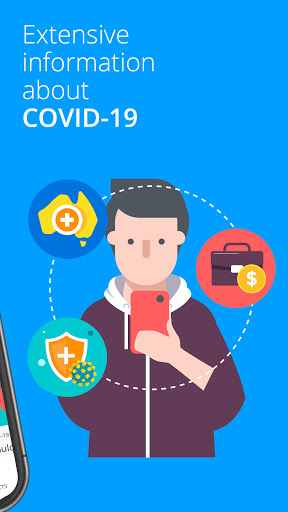  | 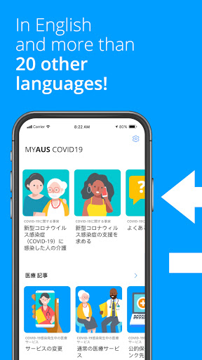  | 
 |   |   |   | 

## Development team
In the following we report the main information provided by the development team in the Google play store.

| | |
|-------------------------|-------------------------|
| **Developer**  | Migration Council Australia |
| **Website**  | [https://migrationcouncil.org.au/](https://migrationcouncil.org.au/) |
| **Email** | info@migrationcouncil.org.au |
| **Physical address**  | - |
| **Other developed apps**  | [https://play.google.com/store/apps/developer?id=Migration+Council+Australia](https://play.google.com/store/apps/developer?id=Migration+Council+Australia) |

## Android support

| | |
|-------------------------|-------------------------|
| **Declared target Android version**  | Pie, version 9 (API level 28) |
| **Effective target Android version**  | Pie, version 9 (API level 28) |
| **Minimum supported Android version**  | Jelly Bean, version 4.1.x (API level 16) |
| **Maximum target Android version**  | - |

The larger the difference between the minimum and maximum supported Android versions, the better. A larger difference means a wider audience. For example, old phones have a very low Android version, so a high minimum supported Android version means that the app cannot be used by users with old phones, thus leading to accessibility problems. 

## Requested permissions

In the following we report the complete list of the permissions requested by the app. 

| **Permission** | **Protection level** | **Description** | 
|-------------------------|-------------------------|-------------------------|
 **android.permission ACCESS_NETWORK_STATE** | Normal | Allows applications to access information about networks. 
 **android.permission ACCESS_WIFI_STATE** | Normal | Allows applications to access information about Wi-Fi networks. 
 **android.permission INTERNET** | Normal | Allows applications to open network sockets. 
 **android.permission READ_APP_BADGE** | - | - 
 **android.permission RECEIVE_BOOT_COMPLETED** | Normal | Allows an application to receive the Intent.ACTION_BOOT_COMPLETED that is broadcast after the system finishes booting. 
 **android.permission VIBRATE** | Normal | Allows access to the vibrator. 
 **android.permission WAKE_LOCK** | Normal | Allows using PowerManager WakeLocks to keep processor from sleeping or screen from dimming. 
 **com.anddoes.launcher.permission UPDATE_COUNT** | - | - 
 **com.google.android.c2dm.permission RECEIVE** | - | - 
 **com.google.android.finsky.permission BIND_GET_INSTALL_REFERRER_SERVICE** | - | - 
 **com.htc.launcher.permission READ_SETTINGS** | - | - 
 **com.htc.launcher.permission UPDATE_SHORTCUT** | - | - 
 **com.huawei.android.launcher.permission CHANGE_BADGE** | - | - 
 **com.huawei.android.launcher.permission READ_SETTINGS** | - | - 
 **com.huawei.android.launcher.permission WRITE_SETTINGS** | - | - 
 **com.majeur.launcher.permission UPDATE_BADGE** | - | - 
 **com.myaus.permission C2D_MESSAGE** | - | - 
 **com.oppo.launcher.permission READ_SETTINGS** | - | - 
 **com.oppo.launcher.permission WRITE_SETTINGS** | - | - 
 **com.sec.android.provider.badge.permission READ** | - | - 
 **com.sec.android.provider.badge.permission WRITE** | - | - 
 **com.sonyericsson.home.permission BROADCAST_BADGE** | - | - 
 **com.sonymobile.home.permission PROVIDER_INSERT_BADGE** | - | - 
 **me.everything.badger.permission BADGE_COUNT_READ** | - | - 
 **me.everything.badger.permission BADGE_COUNT_WRITE** | - | - 

## Mentioned servers

| **Server** | **Registrant** | **Registrant country** | **Creation date** | 
|-------------------------|-------------------------|-------------------------|-------------------------|
 | bugsnag.com | Bugsnag Inc. | GB | 2011-08-18 03:26:10 |
 | android.com | Google LLC | :us: US | 1997-06-23 04:00:00 |
 | googlesyndication.com | Google LLC | :us: US | 2003-01-21 06:17:24 |
 | google.com | Google LLC | :us: US | 1997-09-15 04:00:00 |
 | github.com | GitHub, Inc. | :us: US | 2007-10-09 18:20:50 |
 | w3.org | W3C | :us: US | 1994-07-06 04:00:00 |
 | googleapis.com | Google LLC | :us: US | 2005-01-25 17:52:26 |
 | app-measurement.com | Google LLC | :us: US | 2015-06-19 20:13:31 |
 | googleapis.com | Google LLC | :us: US | 2005-01-25 17:52:26 |
 | googleadservices.com | Google LLC | :us: US | 2003-06-19 16:34:53 |

## Security analysis 

Below we report the main security warnings raised by our execution of the [Androwarn](https://github.com/maaaaz/androwarn) security analysis tool.

**Telephony identifiers leakage**
> - This application reads the ISO country code equivalent of the current registered operator's MCC (Mobile Country Code) 
> - This application reads the numeric name (MCC+MNC) of current registered operator 
> - This application reads the operator name 

**Connection interfaces exfiltration**
> - This application reads details about the currently active data network 
> - This application tries to find out if the currently active data network is metered 

**Suspicious connection establishment**
> - This application opens a Socket and connects it to the remote address '' on the '80' port  
> - This application opens a Socket and connects it to the remote address '' on the 'N/A' port  
> - This application opens a Socket and connects it to the remote address 'Ljava/lang/StringBuilder;->toString()Ljava/lang/String;' on the ': connect, resolve' port  
> - This application opens a Socket and connects it to the remote address 'Ljava/lang/StringBuilder;->toString()Ljava/lang/String;' on the 'N/A' port  
> - This application opens a Socket and connects it to the remote address 'Ljava/net/Proxy;->type()Ljava/net/Proxy$Type;' on the 'N/A' port  
> - This application opens a Socket and connects it to the remote address 'timeout' on the 'N/A' port  

**Pim data leakage**
> - This application accesses data stored in the clipboard 

**Code execution**
> - This application loads a native library 
> - This application loads a native library: 'bugsnag-ndk' 
> - This application loads a native library: 'bugsnag-plugin-android-anr' 
> - This application executes a UNIX command containing this argument: '2' 

## User ratings and reviews

Below we provide information about how end users are reacting to the app in terms of ratings and reviews in the Google Play store.

### Ratings

The MyAus COVID-19 app has been installed by more than **5000** times. At this time, **23** rated the app and its average score is **4.2608695**. Below we show the distribution of the ratings across the usual star-based rating of Google Play

:star::star::star::star::star:: 16

:star::star::star::star:: 3

:star::star::star:: 1

:star::star:: 0

:star:: 3

### Reviews 

#### 5-star reviews

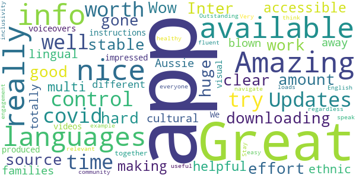

> Amazing app well worth downloading  :date: __2020-05-31 05:41:12__

> Great source of info, nice and clear  :date: __2020-05-27 13:18:57__

> Inter, good, stable  :date: __2020-05-27 12:17:06__

> Wow... really nice app with a huge amount of effort and hard work gone into making it accessible and helpful for our multi-lingual/-ethnic/-cultural Aussie families! I am totally blown away with all the different languages available and really impressed with the videos and visual instructions produced with voiceovers in those languages too.  We are all in it together regardless of how fluent we speak English. Outstanding example of community engagement & inclusivity!  Stay healthy everyone! 😊  :date: __2020-05-23 07:19:07__

> I think this is a very useful app.  :date: __2020-05-20 01:59:30__

> Amazing  :date: __2020-05-11 22:49:05__

> Great app! Very easy to navigate and loads of relevant info.  :date: __2020-04-26 12:57:58__

#### 4-star reviews

> Only app out there for Australians with so many languages.  :date: __2020-05-13 23:13:36__

> It needs wifi. It collects official info but makes it easier to read and keep up with current stats. I feel really anxious and this app helped me feel calm while I was looking up what I needed to know.  :date: __2020-04-27 07:31:18__

#### 3-star reviews

> updates on stats are a little slow needs to be more accurate  :date: __2020-07-15 20:20:30__

#### 2-star reviews

No recent reviews available with 2 stars.

#### 1-star reviews

> Could not get it to work.  :date: __2020-09-10 11:21:12__

> there are no more new case numbers for states for the day just totals the most important information is missing I have got to use worldometer now deleted..  :date: __2020-05-30 10:53:58__

# OpenWHO: Knowledge for Health Emergencies
App version ``3.7``

Analyzed with [covid-apps-observer](http://github.com/covid-apps-observer) project, version ``0.1``

## App overview
| | |
|-------------------------|-------------------------| 
| **Name**&nbsp;&nbsp;&nbsp;&nbsp;&nbsp;&nbsp;&nbsp;&nbsp;&nbsp;&nbsp;&nbsp;&nbsp;&nbsp;&nbsp;&nbsp;&nbsp;&nbsp;&nbsp;&nbsp;&nbsp;&nbsp;&nbsp;&nbsp;&nbsp;&nbsp;&nbsp;&nbsp;&nbsp;&nbsp;&nbsp;&nbsp;&nbsp;&nbsp;&nbsp;&nbsp;&nbsp;&nbsp;&nbsp;&nbsp;&nbsp;  | OpenWHO: Knowledge for Health Emergencies |
| **Unique identifier** | de.xikolo.openwho |
| **Link to Google Play** | [https://play.google.com/store/apps/details?id=de.xikolo.openwho](https://play.google.com/store/apps/details?id=de.xikolo.openwho) |
| **Summary**  | Life-saving knowledge for frontline responders in health emergencies. |
| **Privacy policy** | [https://openwho.org/pages/privacy](https://openwho.org/pages/privacy) |
| **Latest version** | 3.7 |
| **Last update** | 2020-11-23 13:57:15 |
| **Recent changes** | - Bug fixes and performance improvements |
| **Installs**  | 1,000,000+ |
| **Category** | Education |
| **First release** | May 17, 2017 |
| **Size**  | 18M |
| **Supported Android version**  | 5.0 and up |

### Description
> OpenWHO is the World Health Organization's (WHO) interactive knowledge-transfer platform offering online courses to improve the response to health emergencies. OpenWHO enables the Organization and its key partners to transfer life-saving knowledge to large numbers of frontline responders.
 With OpenWHO, you have the flexibility to learn at your convenience. Watch the short video lectures and test your knowledge with self-tests when and where you like. The course forum and the collaboration space allow you to get in touch with other participants and experts around the world.
  
 Designed primarily for health care workers, frontline responders, and decision-makers, the app is also a source of information for those affected by disease outbreaks and health emergencies, or for those with a general interest in WHO's work in health emergencies.
  
 It features 6 channels:
 - The <b>Outbreak</b> channel addresses the management of infectious diseases and provides life-saving, scientific information.
 - The <b>Ready for Response</b> channel helps prepare personnel who are training for deployment to work in disease outbreaks and health emergencies.
 - The <b>Get Social</b> channel focuses on social science-based interventions and helps to communicate with affected communities.
 - The <b>Preparing for Pandemics</b> channel brings together courses on various aspects of preparedness, including surveillance, public health measures and risk communication during a pandemic.
 - The <b>COVID-19</b> channel provides learning resources in WHO's 6 official languages (Arabic, Chinese, English, French, Russian and Spanish) for health professionals, decision-makers and the public for the outbreak of coronavirus disease (COVID-19).
 - The <b>COVID-19 National Languages</b> channel provides the same learning resources as the COVID-19 channel but in national languages, such as Indonesian, Japanese and Portuguese. 
  
 OpenWHO courses are available in many languages, including WHO's 6 official languages. 
  
 Download the app now, and join the OpenWHO community.
 This app is developed in cooperation between the Hasso Plattner Institute and the WHO. The learning content is provided exclusively by the WHO.

### User interface
The developers of the app provide the following screenshots in the Google play store.
| | | |
|:-------------------------:|:-------------------------:|:-------------------------:|
 |   |   |   | 
 |   |   |   | 

## Development team
In the following we report the main information provided by the development team in the Google play store.

| | |
|-------------------------|-------------------------|
| **Developer**  | HPI Knowledge Engineering Team |
| **Website**  | [https://openwho.org/](https://openwho.org/) |
| **Email** | openwho-support@hpi.de |
| **Physical address**  | [Prof.-Dr.-Helmert-Str.2-3 14482 Potsdam](https://www.google.com/maps/search/Prof.-Dr.-Helmert-Str.2-3%2014482%20Potsdam) (Google Maps) |
| **Other developed apps**  | [https://play.google.com/store/apps/developer?id=7185448023325736337](https://play.google.com/store/apps/developer?id=7185448023325736337) |

## Android support

| | |
|-------------------------|-------------------------|
| **Declared target Android version**  | - |
| **Effective target Android version**  | - |
| **Minimum supported Android version**  | Lollipop, version 5.0 (API level 21) |
| **Maximum target Android version**  | - |

The larger the difference between the minimum and maximum supported Android versions, the better. A larger difference means a wider audience. For example, old phones have a very low Android version, so a high minimum supported Android version means that the app cannot be used by users with old phones, thus leading to accessibility problems. 

## Requested permissions

In the following we report the complete list of the permissions requested by the app. 

| **Permission** | **Protection level** | **Description** | 
|-------------------------|-------------------------|-------------------------|
 **android.permission ACCESS_NETWORK_STATE** | Normal | Allows applications to access information about networks. 
 **android.permission ACCESS_WIFI_STATE** | Normal | Allows applications to access information about Wi-Fi networks. 
 **android.permission DOWNLOAD_WITHOUT_NOTIFICATION** | - | - 
 **android.permission FOREGROUND_SERVICE** | Normal | Allows a regular application to use Service.startForeground. 
 **android.permission INTERNET** | Normal | Allows applications to open network sockets. 
 **android.permission RECEIVE_BOOT_COMPLETED** | Normal | Allows an application to receive the Intent.ACTION_BOOT_COMPLETED that is broadcast after the system finishes booting. 
 **android.permission WAKE_LOCK** | Normal | Allows using PowerManager WakeLocks to keep processor from sleeping or screen from dimming. 
 **android.permission WRITE_EXTERNAL_STORAGE** | :warning:**Dangerous** | Allows an application to write to external storage. 
 **com.google.android.c2dm.permission RECEIVE** | - | - 
 **com.google.android.finsky.permission BIND_GET_INSTALL_REFERRER_SERVICE** | - | - 

## Mentioned servers

| **Server** | **Registrant** | **Registrant country** | **Creation date** | 
|-------------------------|-------------------------|-------------------------|-------------------------|
 | googlesyndication.com | Google LLC | :us: US | 2003-01-21 06:17:24 |
 | google.com | Google LLC | :us: US | 1997-09-15 04:00:00 |
 | apple.com | Apple Inc. | :us: US | 1987-02-19 05:00:00 |
 | aomedia.org | Contact Privacy Inc. Customer 1243324949 | :canada: CA | 2015-08-24 14:07:31 |
 | dashif.org | VTM Group | :us: US | 2012-04-27 13:02:46 |
 | app-measurement.com | Google LLC | :us: US | 2015-06-19 20:13:31 |
 | w3.org | W3C | :us: US | 1994-07-06 04:00:00 |
 | googleapis.com | Google LLC | :us: US | 2005-01-25 17:52:26 |
 | psdev.de | - | - | - |
 | xmlpull.org | WhoisGuard, Inc. | PA | 2001-11-26 20:33:08 |
 | crashlytics.com | Google LLC | :us: US | 2011-01-21 15:30:40 |
 | apache.org | The Apache Software Foundation | :us: US | 1995-04-11 04:00:00 |
 | opensource.org | Open Source Initiative | :us: US | 1998-02-11 05:00:00 |
 | creativecommons.org | Creative Commons Corporation | :canada: CA | 2001-01-15 16:51:44 |
 | eclipse.org | Eclipse.org Foundation, Inc. | :canada: CA | 1997-04-14 04:00:00 |
 | gnu.org | Free Software Foundation | :us: US | 1995-11-24 05:00:00 |
 | mozilla.org | Mozilla Corporation | :us: US | 1998-01-24 05:00:00 |
 | googleadservices.com | Google LLC | :us: US | 2003-06-19 16:34:53 |

## Security analysis 

Below we report the main security warnings raised by our execution of the [Androwarn](https://github.com/maaaaz/androwarn) security analysis tool.

**Telephony identifiers leakage**
> - This application reads the ISO country code equivalent of the current registered operator's MCC (Mobile Country Code) 
> - This application reads the MCC+MNC of the provider of the SIM 

**Connection interfaces exfiltration**
> - This application reads details about the currently active data network 
> - This application tries to find out if the currently active data network is metered 

**Suspicious connection establishment**
> - This application opens a Socket and connects it to the remote address ' returned no addresses for  ; port is out of range' on the 'N/A' port  
> - This application opens a Socket and connects it to the remote address '' on the 'N/A' port  
> - This application opens a Socket and connects it to the remote address 'Ljava/lang/StringBuilder;->toString()Ljava/lang/String;' on the 'N/A' port  
> - This application opens a Socket and connects it to the remote address 'Ljava/net/Proxy;->type()Ljava/net/Proxy$Type;' on the 'N/A' port  
> - This application opens a Socket and connects it to the remote address 'timeout' on the 'N/A' port  

**Code execution**
> - This application loads a native library 

## User ratings and reviews

Below we provide information about how end users are reacting to the app in terms of ratings and reviews in the Google Play store.

### Ratings

The OpenWHO: Knowledge for Health Emergencies app has been installed by more than **1000000** times. At this time, **3403** rated the app and its average score is **4.2647057**. Below we show the distribution of the ratings across the usual star-based rating of Google Play

:star::star::star::star::star:: 2403

:star::star::star::star:: 370

:star::star::star:: 130

:star::star:: 130

:star:: 370

### Reviews 

#### 5-star reviews

> Nice  :date: __2021-03-05 17:29:37__

> V.good  :date: __2021-02-09 14:12:24__

> Great medical field app sourceGreat medical field app source!  :date: __2021-02-09 07:42:09__

> Very useful  :date: __2021-01-18 06:49:28__

> Good  :date: __2021-01-07 09:35:04__

> Iloveit  :date: __2021-01-03 07:20:51__

> Very good  :date: __2020-12-29 17:40:56__

> I love this app because it makes essay a lot.  :date: __2020-12-27 18:00:46__

> It's a great platform for me to send money 💰 safely  :date: __2020-12-15 14:26:31__

> Good  :date: __2020-12-08 16:01:38__

#### 4-star reviews

> Get the things that wark in all honesty s Yes it does  :date: __2021-01-11 02:38:09__

> WHO has offered great courses but we're expecting more courses within less time gap as it's been month's since WHO has launched any course.Secondly,there is no direct place offered in the WHO app to express our views.  :date: __2020-12-11 07:27:50__

> Online course class is use full  :date: __2020-07-17 11:52:09__

> Excellent information but less attractive for the most  :date: __2020-07-02 17:54:08__

> Good working  :date: __2020-06-28 08:53:05__

> Could you please host the videos also on YouTube, since we cannot access the Vimeo Platform here in Indonesia. Thank you.  :date: __2020-06-24 07:38:57__

> Good source of information  :date: __2020-06-20 09:36:05__

> Excellent Direction~  :date: __2020-06-19 14:08:55__

> Mast  :date: __2020-06-13 09:10:54__

> Good app of thh halt.  :date: __2020-05-31 05:25:43__

#### 3-star reviews

> Good info  :date: __2020-12-24 16:44:57__

> I feel a bit disappointed, experienced a lot of errors. My module and videos can't be loaded.  :date: __2020-07-26 17:32:06__

> Great app, but my only problem is that I can't open my certificate file. Says invalid format. Disappointing 😭  :date: __2020-07-23 02:09:56__

> Videos were not working only, so I uninstalled it.  :date: __2020-07-18 08:42:28__

> I have finished two courses on two different date(one before midnight, another after midnight) but found same date on both while I downloaded Certificates. Why is this?  :date: __2020-06-11 19:18:50__

> covid  :date: __2020-06-11 18:37:22__

> Sir, Plzz improve the quality of the certificate awarded by the WHO to the participants to increase more & more participation as well as awareness of the people in this contest organised by OpenWHO.  :date: __2020-05-24 16:44:50__

> Some extent it's very good and its provide guidelines to advert disease.  :date: __2020-05-23 18:33:55__

> Nice app however difficult to watch video presentations  :date: __2020-05-14 19:35:42__

> Very confusing. not happy with the link. I don't know if I have done it correctly.  :date: __2020-05-12 22:12:31__

#### 2-star reviews

> Needs to be improved. Image don't show up . Fix needed  :date: __2020-12-23 15:51:31__

> The app keeps showing me this message (please enable network connection) when I open it, don't know why ?? My internet connection is working fine and I am using all the other apps perfectly well. Can you lend me a hand in this matter.  :date: __2020-11-08 08:31:34__

> After downloading the certificate at the end of the course when u try to open it. It says the file is corrupted or damaged  :date: __2020-09-23 14:26:48__

> Unable to watch the video or download the video.  :date: __2020-08-08 15:29:04__

> I can't open the certificate. Please help me out of this problem  :date: __2020-07-31 05:25:00__

> It shows errors again and again,Can't sign in  :date: __2020-06-26 16:11:53__

> I completed a course and then downloaded certificate it ... But I'm unable too see my certificate as it say corrupted file or invalid file. Please help with reagrdings to it.  :date: __2020-05-27 13:14:22__

> Noisy app.  :date: __2020-04-21 21:34:45__

> Nice  :date: __2020-04-09 16:25:41__

> Please , i want the App in the form of the Globe.  :date: __2020-04-05 14:35:33__

#### 1-star reviews

> The videos are not playing eventhough I've downloaded them  :date: __2020-11-03 10:43:38__

> “‘Ovid’ is Latin for a sheep. COVID starts with a C, which also means ‘see’ in ancient language. 19 was known as the “Number of Surrender” in ancient times.”  It goes on to draw the conclusion, “C-OVID 19 = ‘See a Sheep Surrender'”.  :date: __2020-11-02 08:04:58__

> Very bad experience i got unable to login very bad i fell worst experience  :date: __2020-09-26 10:55:02__

> Ok  :date: __2020-08-10 23:31:14__

> This is called an "Emergency" app but requires registration? Very disappointing.  :date: __2020-08-06 20:55:46__

> unable to make account and register, also not able to login.  :date: __2020-08-04 11:59:45__

> I can't Login no matter how much I try.  :date: __2020-07-04 14:19:09__

> This app is having technical issues  :date: __2020-07-03 17:13:33__

> Not a good application....It always changes names in certificates and it changes dates also moreover i have done courses and it changes there names also in certificates...so many problems...now what to do  :date: __2020-07-02 03:49:39__

> Not sign in properly many time errors.. Please help me out of this problem. I already registered a complaint that particular problem through mail.  :date: __2020-06-16 05:10:29__

# Check In CBR
App version ``1.8.2``

Analyzed with [covid-apps-observer](http://github.com/covid-apps-observer) project, version ``0.1``

## App overview
| | |
|-------------------------|-------------------------| 
| **Name**&nbsp;&nbsp;&nbsp;&nbsp;&nbsp;&nbsp;&nbsp;&nbsp;&nbsp;&nbsp;&nbsp;&nbsp;&nbsp;&nbsp;&nbsp;&nbsp;&nbsp;&nbsp;&nbsp;&nbsp;&nbsp;&nbsp;&nbsp;&nbsp;&nbsp;&nbsp;&nbsp;&nbsp;&nbsp;&nbsp;&nbsp;&nbsp;&nbsp;&nbsp;&nbsp;&nbsp;&nbsp;&nbsp;&nbsp;&nbsp;  | Check In CBR |
| **Unique identifier** | au.gov.act.health.checkin |
| **Link to Google Play** | [https://play.google.com/store/apps/details?id=au.gov.act.health.checkin](https://play.google.com/store/apps/details?id=au.gov.act.health.checkin) |
| **Summary**  | Fast, secure check in to Canberra businesses to support COVID-19 contact tracing |
| **Privacy policy** | [https://www.health.act.gov.au/privacy](https://www.health.act.gov.au/privacy) |
| **Latest version** | 1.8.2 |
| **Last update** | 2021-02-27 07:45:49 |
| **Recent changes** | Fix app failing to load on Android 8 devices |
| **Installs**  | 100,000+ |
| **Category** | Health & Fitness |
| **First release** | Aug 31, 2020 |
| **Size**  | 32M |
| **Supported Android version**  | 5.0 and up |

### Description
> Quickly and securely check in to a business in Canberra, Australia to support COVID-19 contact tracing. Simply scan the QR code displayed at the business, and you're done! 
 Your personal details are saved securely with ACT Government Health Directorate for the sole purpose of contact tracing.

### User interface
The developers of the app provide the following screenshots in the Google play store.
| | | |
|:-------------------------:|:-------------------------:|:-------------------------:|
 |   |   |   | 
 |  

## Development team
In the following we report the main information provided by the development team in the Google play store.

| | |
|-------------------------|-------------------------|
| **Developer**  | ACT Health |
| **Website**  | [https://covid19.act.gov.au/business-and-work/check-in-cbr](https://covid19.act.gov.au/business-and-work/check-in-cbr) |
| **Email** | Digital.Support@act.gov.au |
| **Physical address**  | - |
| **Other developed apps**  | [https://play.google.com/store/apps/developer?id=ACT+Health](https://play.google.com/store/apps/developer?id=ACT+Health) |

## Android support

| | |
|-------------------------|-------------------------|
| **Declared target Android version**  | Android10, version 10 (API level 29) |
| **Effective target Android version**  | Android10, version 10 (API level 29) |
| **Minimum supported Android version**  | Lollipop, version 5.0 (API level 21) |
| **Maximum target Android version**  | - |

The larger the difference between the minimum and maximum supported Android versions, the better. A larger difference means a wider audience. For example, old phones have a very low Android version, so a high minimum supported Android version means that the app cannot be used by users with old phones, thus leading to accessibility problems. 

## Requested permissions

In the following we report the complete list of the permissions requested by the app. 

| **Permission** | **Protection level** | **Description** | 
|-------------------------|-------------------------|-------------------------|
 **android.permission ACCESS_NETWORK_STATE** | Normal | Allows applications to access information about networks. 
 **android.permission CAMERA** | :warning:**Dangerous** | Required to be able to access the camera device. 
 **android.permission FOREGROUND_SERVICE** | Normal | Allows a regular application to use Service.startForeground. 
 **android.permission INTERNET** | Normal | Allows applications to open network sockets. 
 **android.permission VIBRATE** | Normal | Allows access to the vibrator. 
 **android.permission WAKE_LOCK** | Normal | Allows using PowerManager WakeLocks to keep processor from sleeping or screen from dimming. 
 **com.google.android.finsky.permission BIND_GET_INSTALL_REFERRER_SERVICE** | - | - 

## Mentioned servers

| **Server** | **Registrant** | **Registrant country** | **Creation date** | 
|-------------------------|-------------------------|-------------------------|-------------------------|
 | android.com | Google LLC | :us: US | 1997-06-23 04:00:00 |
 | google.com | Google LLC | :us: US | 1997-09-15 04:00:00 |
 | googleapis.com | Google LLC | :us: US | 2005-01-25 17:52:26 |
 | cloudfront.net | Amazon.com, Inc. | :us: US | 2008-04-25 18:25:49 |

## Security analysis 

Below we report the main security warnings raised by our execution of the [Androwarn](https://github.com/maaaaz/androwarn) security analysis tool.

**Telephony identifiers leakage**
> - This application reads the numeric name (MCC+MNC) of current registered operator 
> - This application reads the operator name 

**Connection interfaces exfiltration**
> - This application reads details about the currently active data network 
> - This application tries to find out if the currently active data network is metered 

**Audio video eavesdropping**
> - This application records audio from the 'CAMCORDER' source  
> - This application records audio from the 'MIC' source  
> - This application captures video from the 'CAMERA' source 
> - This application captures video from the 'SURFACE' source 

**Suspicious connection establishment**
> - This application opens a Socket and connects it to the remote address '' on the 'N/A' port  
> - This application opens a Socket and connects it to the remote address 'Ljava/lang/StringBuilder;->toString()Ljava/lang/String;' on the ': connect, resolve' port  
> - This application opens a Socket and connects it to the remote address 'Ljava/lang/StringBuilder;->toString()Ljava/lang/String;' on the 'N/A' port  
> - This application opens a Socket and connects it to the remote address 'Ljava/net/Proxy;->type()Ljava/net/Proxy$Type;' on the 'N/A' port  
> - This application opens a Socket and connects it to the remote address 'timeout' on the 'N/A' port  

**Pim data leakage**
> - This application accesses data stored in the clipboard 

**Code execution**
> - This application loads a native library 
> - This application loads a native library: 'Ljava/lang/String;->valueOf(Ljava/lang/Object;)Ljava/lang/String;' 
> - This application executes a UNIX command 

## User ratings and reviews

Below we provide information about how end users are reacting to the app in terms of ratings and reviews in the Google Play store.

### Ratings

The Check In CBR app has been installed by more than **100000** times. At this time, **179** rated the app and its average score is **2.1**. Below we show the distribution of the ratings across the usual star-based rating of Google Play

:star::star::star::star::star:: 32

:star::star::star::star:: 10

:star::star::star:: 10

:star::star:: 14

:star:: 113

### Reviews 

#### 5-star reviews

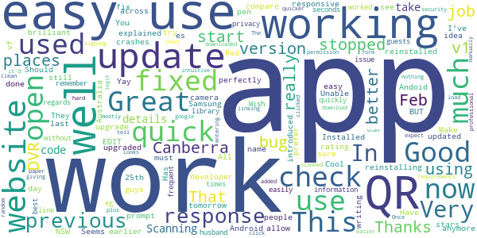

> EDIT: In response to my previous rating developer explained app had stopped working with earlier versions of Android. They have now fixed it and it's working perfectly so I've upgraded to 5 stars. Has stopped working since last update. Have reinstalled but still crashes.  :date: __2021-03-05 03:31:28__

> All fixed now! Make sure you update to allow the app to use the camera. That is what I had to do after reinstalling it.  :date: __2021-03-03 08:05:00__

> Update: app is working since v1.8.2 update. Thanks for the quick fix. Update: Installed v1.8.2 and the app now starts up; I will try to check in tomorrow. Thanks for prompt response. Previous: Unable to start app anymore since updated to version 1.8.1, 25 Feb 2021.  :date: __2021-03-03 03:23:18__

> Seems to work well.  :date: __2021-03-02 11:04:16__

> Yay! You guys fixed the Andoid 8 bug, well done and works again now, brilliant app again.  :date: __2021-03-02 08:46:57__

> App now working again.  :date: __2021-03-01 09:38:09__

> Works for me 👍  :date: __2021-02-28 08:40:06__

> Great idea and was easy to use BUT doesn't work any more on my Samsung after the upgrade on 25th of Feb. A bug must have been introduced.  :date: __2021-02-27 20:21:14__

> Easy to use.  :date: __2021-02-22 08:09:10__

> This app works well. Should be used all across Australia.  :date: __2021-01-24 23:29:37__

#### 4-star reviews

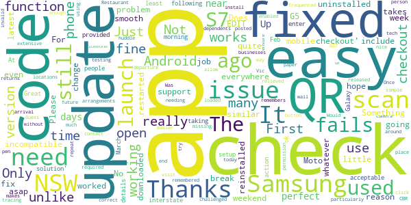

> App worked fine on my Moto G5 Android (8.1.0) until a week or so ago, since when it won't even open. I have just downloaded the latest version - no change. Please fix whatever you did to break it EDIT: following update 1.8.2, the app now opens and functions as before. Thanks for taking action, as the 'solution' provided to many people below was really not acceptable in 2021  :date: __2021-03-03 06:26:53__

> The app wasn't working since the 25 Feb update, but it was fixed this morning (2 March 2021). At least it now works ok for my Samsung Galaxy S7 android phone.  :date: __2021-03-02 12:16:28__

> App working again since update 1/3/2021.  :date: __2021-03-02 02:19:18__

> Great app to use! Only have to enter your details once at setup, unlike interstate arrangements. Just a simple click to check in at arrival, no check out required. Just needs more extensive testing before updates are released.  :date: __2021-03-01 22:40:12__

> Once loaded this app is easy to use, so much easier than NSW or Vic!  :date: __2021-02-26 00:06:07__

> Was easy to install particularly for a tech challenged person. Only issue is that does not allow me to check out unlike the nsw app  :date: __2021-02-12 01:47:53__

> App makes check-in easy and I like how it remembers dependents for easy future check-ins. Would be nice if locations you frequented could be remembered and used in the same way for easy repeat check-ins without needing a code or to huddle around a QR code that someone had posted on the wall.  :date: __2021-01-14 07:37:19__

> Its missing a checkout button to end ur visit to a place. It needs a time out to ensure correct contact tracing  :date: __2020-12-09 02:30:00__

> First try today - so very relieved to have no issues at Restaurant. Guess there's no need to checkout on departure?  :date: __2020-12-04 03:55:33__

> Not enough businesses on it. Many still using pen and paper.  :date: __2020-10-17 05:00:51__

#### 3-star reviews

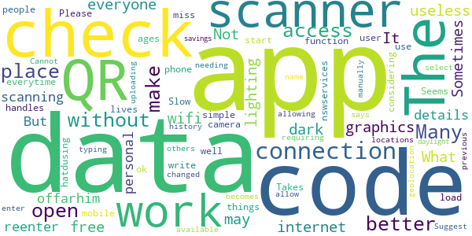

> What if I do not have internet data? Not everyone has free wifi data which may make the app useless.  :date: __2021-03-04 00:02:46__

> Sometimes app won't open  :date: __2021-02-28 00:56:16__

> The graphics are too dark under some lighting.  :date: __2021-02-08 01:44:49__

> It works for scanning the QR code. But I can offarhim why do I have to reenter all my personal details everytime I use the app for myself on my phone. The nswservices app handles this very well. Please start considering the user when you write mobile apps. Many miss some simple things that would make many people's lives better. I hatdusing this app.  :date: __2021-02-05 20:04:05__

> Takes ages to open the camera scanner function.  :date: __2020-12-09 09:13:41__

> Seems to work ok. Slow to load, requiring data connection to do so. Cannot access QR code scanner without data connection. Suggest allowing access to QR code scanner without needing data connection to allow check in, uploading locations when data becomes available.  :date: __2020-12-05 21:58:59__

> Would be better if you could check in by typing name of check-in place, geolocation, or select from previous check-in history.  :date: __2020-11-15 01:20:33__

> Works for some places, not others, it just says enter manually code  :date: __2020-10-08 23:36:53__

> The App has not changed to daylight savings.  :date: __2020-10-06 01:02:09__

#### 2-star reviews

> Why does this get stuck "finding location" now? It used to work reliably.  :date: __2021-03-06 09:55:15__

> Does not work on samsung J mini. Screen keeps going blank and won't connect to camera.  :date: __2021-03-02 00:32:11__

> Lost this app off my home page - looked at the 'fix failure to load on Android' option but no info given. Okay, now I can't post this at your POST ... Update : found that I had to give stars to be able to post.  :date: __2021-03-01 09:02:45__

> . , zebra V te zbb3f  :date: __2021-02-24 07:23:12__

> Asked me for my credit card why?. Why is not the new south Wales app ok to use.  :date: __2021-02-24 04:22:07__

> Slow to load, my history has no check ins, so does it even work? Isn't it supposed to keep a record of where I have checked in?  :date: __2021-02-23 02:03:11__

> ACT Health, why do you check in but not check out, like the NSW app? If something does happen you have no idea if a person spent 10 mins or 2 hrs at a place. To stop people forgetting to log out, how bout a popup asking if you are still there 2-3 hrs after checking in if not already logged out?  :date: __2021-02-11 22:05:59__

> Worked as intended before, but recently has become very slow to load and the qr scanner is not working  :date: __2021-01-22 22:29:39__

> Takes to long to download  :date: __2020-12-06 04:07:36__

> App fails to install, despite several attempts...says it is installed but goes back tp wil instal shortly.....  :date: __2020-11-11 09:29:39__

#### 1-star reviews

> Doing an upgrade that invalidates all users WITHOUT REPEAT WITHOUT telling anyone is arrogant stupidity from the ACT government. It also shows the contempt that the ACT government has for its citizens. Bringing in $1000 fines right after changing the system is nothing but a money grabbing exercise.  :date: __2021-03-05 09:26:15__

> Cant even install  :date: __2021-03-05 06:31:58__

> Last update has made app unusable. Please fix it asap.  :date: __2021-03-04 09:11:45__

> Unable to install this app-no matter what I try.  :date: __2021-03-03 23:07:17__

> I have a new phone and cannot load this app .  :date: __2021-03-03 12:08:29__

> Doesnt work sometimes  :date: __2021-03-03 01:40:00__

> Stopped working  :date: __2021-03-02 05:34:36__

> Same peoblem on a Galaxy S6. Not everyone can afford to update their phones guys, especially in a pandemic. Please make sure any updates are compatible!  :date: __2021-03-01 22:06:47__

> Apps keeps crashing and unable to start. Reinstalling does not work. Web form back up would be useful in case of the apps crashing all the time like this.  :date: __2021-03-01 20:20:12__

> Nup, still not working on my Samsung 7.... Crashes when you load it.  :date: __2021-03-01 13:54:37__

# Service NSW
App version ``6.1.0 (208544)``

Analyzed with [covid-apps-observer](http://github.com/covid-apps-observer) project, version ``0.1``

## App overview
| | |
|-------------------------|-------------------------| 
| **Name**&nbsp;&nbsp;&nbsp;&nbsp;&nbsp;&nbsp;&nbsp;&nbsp;&nbsp;&nbsp;&nbsp;&nbsp;&nbsp;&nbsp;&nbsp;&nbsp;&nbsp;&nbsp;&nbsp;&nbsp;&nbsp;&nbsp;&nbsp;&nbsp;&nbsp;&nbsp;&nbsp;&nbsp;&nbsp;&nbsp;&nbsp;&nbsp;&nbsp;&nbsp;&nbsp;&nbsp;&nbsp;&nbsp;&nbsp;&nbsp;  | Service NSW |
| **Unique identifier** | au.gov.nsw.service |
| **Link to Google Play** | [https://play.google.com/store/apps/details?id=au.gov.nsw.service](https://play.google.com/store/apps/details?id=au.gov.nsw.service) |
| **Summary**  | Digital licences, registrations, fines and more |
| **Privacy policy** | [http://www.service.nsw.gov.au/privacy](http://www.service.nsw.gov.au/privacy) |
| **Latest version** | 6.1.0 (208544) |
| **Last update** | 2021-02-26 07:44:01 |
| **Recent changes** | Thanks for using the Service NSW mobile app! We used your feedback to make these changes: • Never forget to check out of a COVID Safe venue again! Now you can choose to get reminder notifications. Manage notifications in Settings. Custom timings for reminders coming soon. • Fixed a bug where the am/pm didn&#39;t display on checkout details on some devices. |
| **Installs**  | 1,000,000+ |
| **Category** | Tools |
| **First release** | Dec 7, 2014 |
| **Size**  | 27M |
| **Supported Android version**  | 6.0 and up |

### Description
> The official Service NSW app, making it easier to access government services. 
 <b>Digital licences and credentials</b>
 Access the following digital licences and credentials, with more to come: 
 • Driver Licence 
 • RSA/RCG Competency Card 
 • Working with Children Check 
 • Recreational Fishing Licence 
 • Boat Driver Licence.
 <b>COVID Safe Check-in</b> 
 • Quick, contactless check in at COVID Safe venues 
 • Point your device camera at the COVID Safe QR Code to get started 
 • Save your details for a faster check in next time. 
 <b>Useful tools and services</b>
 • Verify a Digital Driver Licence via our licence checker 
 • Check or renew a registration 
 • Sign into licensed venues.
 <b>Fines and demerits</b>
 • View and pay your fines 
 • View your demerits.
 <b>COVID-19 resources</b>
 • Access COVID-19 statistics by postcode 
 • Access our COVID-19 Assistance Finder with benefits, rebates and concessions. 
 <b>Tell us what you think</b>
 • Help us help you! We’re always working on a better, stronger, faster app. 
 • Share what you’d like to see in the app: we use your feedback to continuously improve the app experience.

### User interface
The developers of the app provide the following screenshots in the Google play store.
| | | |
|:-------------------------:|:-------------------------:|:-------------------------:|
 |   |   |   | 
 |   |  

## Development team
In the following we report the main information provided by the development team in the Google play store.

| | |
|-------------------------|-------------------------|
| **Developer**  | Service NSW |
| **Website**  | [https://www.service.nsw.gov.au/mobile-app      ](https://www.service.nsw.gov.au/mobile-app      ) |
| **Email** | mobileapp@service.nsw.gov.au |
| **Physical address**  | - |
| **Other developed apps**  | [https://play.google.com/store/apps/developer?id=Service+NSW](https://play.google.com/store/apps/developer?id=Service+NSW) |

## Android support

| | |
|-------------------------|-------------------------|
| **Declared target Android version**  | Android10, version 10 (API level 29) |
| **Effective target Android version**  | Android10, version 10 (API level 29) |
| **Minimum supported Android version**  | Marshmallow, version 6.0 (API level 23) |
| **Maximum target Android version**  | - |

The larger the difference between the minimum and maximum supported Android versions, the better. A larger difference means a wider audience. For example, old phones have a very low Android version, so a high minimum supported Android version means that the app cannot be used by users with old phones, thus leading to accessibility problems. 

## Requested permissions

In the following we report the complete list of the permissions requested by the app. 

| **Permission** | **Protection level** | **Description** | 
|-------------------------|-------------------------|-------------------------|
 **android.permission ACCESS_NETWORK_STATE** | Normal | Allows applications to access information about networks. 
 **android.permission ACCESS_WIFI_STATE** | Normal | Allows applications to access information about Wi-Fi networks. 
 **android.permission CAMERA** | :warning:**Dangerous** | Required to be able to access the camera device. 
 **android.permission INTERNET** | Normal | Allows applications to open network sockets. 
 **android.permission READ_APP_BADGE** | - | - 
 **android.permission READ_EXTERNAL_STORAGE** | :warning:**Dangerous** | Allows an application to read from external storage. 
 **android.permission USE_FINGERPRINT** | Normal | This constant was deprecated in API level 28. Applications should request USE_BIOMETRIC instead 
 **android.permission VIBRATE** | Normal | Allows access to the vibrator. 
 **android.permission WAKE_LOCK** | Normal | Allows using PowerManager WakeLocks to keep processor from sleeping or screen from dimming. 
 **android.permission WRITE_EXTERNAL_STORAGE** | :warning:**Dangerous** | Allows an application to write to external storage. 
 **com.anddoes.launcher.permission UPDATE_COUNT** | - | - 
 **com.android.vending CHECK_LICENSE** | - | - 
 **com.google.android.c2dm.permission RECEIVE** | - | - 
 **com.google.android.finsky.permission BIND_GET_INSTALL_REFERRER_SERVICE** | - | - 
 **com.htc.launcher.permission READ_SETTINGS** | - | - 
 **com.htc.launcher.permission UPDATE_SHORTCUT** | - | - 
 **com.huawei.android.launcher.permission CHANGE_BADGE** | - | - 
 **com.huawei.android.launcher.permission READ_SETTINGS** | - | - 
 **com.huawei.android.launcher.permission WRITE_SETTINGS** | - | - 
 **com.majeur.launcher.permission UPDATE_BADGE** | - | - 
 **com.oppo.launcher.permission READ_SETTINGS** | - | - 
 **com.oppo.launcher.permission WRITE_SETTINGS** | - | - 
 **com.sec.android.provider.badge.permission READ** | - | - 
 **com.sec.android.provider.badge.permission WRITE** | - | - 
 **com.sonyericsson.home.permission BROADCAST_BADGE** | - | - 
 **com.sonymobile.home.permission PROVIDER_INSERT_BADGE** | - | - 
 **me.everything.badger.permission BADGE_COUNT_READ** | - | - 
 **me.everything.badger.permission BADGE_COUNT_WRITE** | - | - 

## Mentioned servers

| **Server** | **Registrant** | **Registrant country** | **Creation date** | 
|-------------------------|-------------------------|-------------------------|-------------------------|
 | apache.org | The Apache Software Foundation | :us: US | 1995-04-11 04:00:00 |
 | xml.org | OASIS Open | :us: US | 1997-02-03 05:00:00 |
 | w3.org | W3C | :us: US | 1994-07-06 04:00:00 |
 | purl.org | Internet Archive | :us: US | 1996-01-01 05:00:00 |
 | adobe.com | Adobe Inc. | :us: US | 1986-11-17 05:00:00 |
 | android.com | Google LLC | :us: US | 1997-06-23 04:00:00 |
 | googlesyndication.com | Google LLC | :us: US | 2003-01-21 06:17:24 |
 | google.com | Google LLC | :us: US | 1997-09-15 04:00:00 |
 | app-measurement.com | Google LLC | :us: US | 2015-06-19 20:13:31 |
 | googleapis.com | Google LLC | :us: US | 2005-01-25 17:52:26 |
 | googleapis.com | Google LLC | :us: US | 2005-01-25 17:52:26 |
 | iptc.org | Whois Privacy Service | :us: US | 1995-12-27 05:00:00 |
 | useplus.org | PLUS COALITION | :us: US | 2003-11-18 19:31:25 |
 | npes.org | NPES | :us: US | 1996-01-30 05:00:00 |
 | aiim.org | Association for Information and Image Management International | :us: US | 1995-10-18 04:00:00 |
 | googleapis.com | Google LLC | :us: US | 2005-01-25 17:52:26 |
 | googleapis.com | Google LLC | :us: US | 2005-01-25 17:52:26 |
 | googleadservices.com | Google LLC | :us: US | 2003-06-19 16:34:53 |

## Security analysis 

Below we report the main security warnings raised by our execution of the [Androwarn](https://github.com/maaaaz/androwarn) security analysis tool.

**Telephony identifiers leakage**
> - This application reads the numeric name (MCC+MNC) of current registered operator 
> - This application reads the operator name 
> - This application reads the phone number string for line 1, for example, the MSISDN for a GSM phone 
> - This application reads the unique device ID, i.e the IMEI for GSM and the MEID or ESN for CDMA phones 

**Location lookup**
> - This application reads location information from all available providers (WiFi, GPS etc.) 

**Connection interfaces exfiltration**
> - This application reads details about the currently active data network 
> - This application tries to find out if the currently active data network is metered 

**Audio video eavesdropping**
> - This application records audio from the 'CAMCORDER' source  
> - This application records audio from the 'MIC' source  
> - This application captures video from the 'CAMERA' source 
> - This application captures video from the 'SURFACE' source 

**Suspicious connection establishment**
> - This application opens a Socket and connects it to the remote address '' on the 'N/A' port  
> - This application opens a Socket and connects it to the remote address 'Ljava/lang/StringBuilder;->toString()Ljava/lang/String;' on the ': connect, resolve' port  
> - This application opens a Socket and connects it to the remote address 'Ljava/lang/StringBuilder;->toString()Ljava/lang/String;' on the 'N/A' port  
> - This application opens a Socket and connects it to the remote address 'Ljava/net/Proxy;->type()Ljava/net/Proxy$Type;' on the 'N/A' port  
> - This application opens a Socket and connects it to the remote address 'Network subsystem is unavailable' on the 'N/A' port  
> - This application opens a Socket and connects it to the remote address 'timeout' on the 'N/A' port  

**Pim data leakage**
> - This application accesses data stored in the clipboard 

**Code execution**
> - This application loads a native library 
> - This application loads a native library: 'Ljava/util/Iterator;->next()Ljava/lang/Object;' 
> - This application loads a native library: 'log' 
> - This application loads a native library: 'sentry' 
> - This application loads a native library: 'sentry-android' 
> - This application loads a native library: 'tool-checker' 
> - This application executes a UNIX command 

## User ratings and reviews

Below we provide information about how end users are reacting to the app in terms of ratings and reviews in the Google Play store.

### Ratings

The Service NSW app has been installed by more than **1000000** times. At this time, **5656** rated the app and its average score is **3.7147827**. Below we show the distribution of the ratings across the usual star-based rating of Google Play

:star::star::star::star::star:: 2903

:star::star::star::star:: 826

:star::star::star:: 442

:star::star:: 383

:star:: 1102

### Reviews 

#### 5-star reviews

> Easy use.  :date: __2021-03-06 13:45:02__

> Thank God for us people who forget to sign out! Thank god we can enter the time we approximately left thank you!!  :date: __2021-03-06 07:09:56__

> Easy to use,  :date: __2021-03-06 03:42:12__

> Very good I'm giving you five stars because I've never seen an app that doesn't crash so you're at must be made very good nearly every have on soon crashes some apps crash all the time  :date: __2021-03-06 03:10:27__

> Good work  :date: __2021-03-05 04:45:54__

> Very smooth experience v  :date: __2021-03-03 03:20:57__

> Its really fantastic service NSW  :date: __2021-03-02 12:59:41__

> Works surprisingly well for a government app. Easy access to licence and Rego details.  :date: __2021-03-02 05:15:04__

> Very good, useful.  :date: __2021-03-02 04:00:49__

> Best app  :date: __2021-03-01 22:40:23__

#### 4-star reviews

> OK  :date: __2021-03-04 21:50:20__

> Like the app, up/down scrolling much more usable than left/right. Check-out notifications when I have already checked out are a little annoying, please modify so that it only notifies if not checked out.  :date: __2021-03-04 05:48:28__

> It's a pity that the app reminds you to check out when you already have. Useless and annoying option in my opinion.  :date: __2021-03-04 04:32:49__

> Medical venues (Hospitals St George and Prince of Wales) use there own QR code not yours it is confusing for the older person.  :date: __2021-03-03 23:49:09__

> It's a great app slot better than the Canberra check-in app. I didn't rate this app 5 star because I haven't used it enough to know it well enough to grade it the highest star  :date: __2021-03-03 10:35:07__

> Many of us forget to sign out when leaving shop etc. Thanks for the new check out reminder.  :date: __2021-03-01 10:13:40__

> I find it easy to utilise the system, which is kinda amazing for me as I am quite useless when it comes to technology 🤫  :date: __2021-02-24 06:17:57__

> The app has definately improved and is very easy to use now! 👍🏻  :date: __2021-02-24 00:08:17__

> Glad every time i chat to my daughter .  :date: __2021-02-23 14:40:59__

> Lacking Biometric login, so it's always frustrating to unlock with a passcode rather than Face Unlock. Other than that, seems to work well.  :date: __2021-02-22 21:02:36__

#### 3-star reviews

> Very glitchy. Half the time when I try to do a covid check in it checks me into a previous location. Now it keeps reminding me to check out, but keeps trying to check me in again first.  :date: __2021-03-06 09:15:22__

> Reminders to check out are now bringing me back to 'check in' page for a location from previous day. It's confusing especially if I already think I've checked out.  :date: __2021-03-04 03:38:54__

> Great service  :date: __2021-03-01 04:39:27__

> Good app but the biometric login is broken.... So if your fingerprint scanner and home button are built into one (as is the case on most devices) I'll place my finger on the scanner and it'll go back home not actually log me in! Frustrating especially when you're trying to check-in for covid safe every 2mins.....  :date: __2021-02-19 21:48:36__

> Cannot access form  :date: __2021-02-19 00:52:11__

> Works ok on newer phones but plenty of older people have pre Android 6.0 devices and guess what? Not suitable for your device message is all you get. Surely you can make it work on older devices that can't be updated?  :date: __2021-02-17 05:01:46__

> Frustrating.... No issues checking in but for the last 2 days it won't let me check out. Comes up with "unable to check out please try again. Physically can not check out until I check in at another location. I have been checked into one place for 15hrs until I have needed to check in somewhere else. Covid tracing data hard to get right if I am not able to check out ☹  :date: __2021-02-16 00:32:07__

> After check in it often shuts down and I can't check out  :date: __2021-02-15 02:51:39__

> Checking in appears to work just fine including providing a confirmation that I'm checked in, but... When I go to check out, the check in feature has restarted and no check in was recorded. I've tried reinstalling the app and still have this issue, the rest of the app is great. The covid check in feature literally does not work. The UX could use some work also, if i've recently checked in somewhere and then I open the app, it should open up to the check out page.  :date: __2021-02-13 03:26:43__

> Mostly good at what it should do. The Covid check-in dad been moved to the app allowing you to scan a business' barcode. However, when the app is sent to the background, upon resumption the app's forgotten you've just checked in and brings up the confirmation of details screen again. If you proceed here, the app then checks you in again to the place you had just checked in at. Trying to check out is just as painful as once the app resumes, it again wants to check you in. It all works backwards  :date: __2021-02-12 02:47:57__

#### 2-star reviews

> Good in theory not in practice. Can log in through the website but not through the app. Can't create a new account as details already in use. Never mind wanting auto updates and to change my phone times. More effort than it's worth. After all that still couldn't log in, use QR log ins or licence details. Gave up and uninstalled for the second time.  :date: __2021-03-06 15:20:50__

> Frustrating it won't let me use covid sign in at venues and for some reason and everytime I try to sign in it tells me my details are wrong.  :date: __2021-03-05 06:57:28__

> The response on my phone when I tried to download the app is "this item isn't compatible with this device" . I've never had that problem before. Should I even rate this app.  :date: __2021-03-05 03:27:21__

> This won't be easy at all for the elderly or people who are not technical. They are always forgotten!  :date: __2021-03-01 01:05:02__

> I have had this app for a while and worked flawlessly. However in the past few weeks it won't let me login through the app it says my password and email is incorrect it has been really frustrating because i can't check my details and it's making it had for me to use the Covid safe check in.  :date: __2021-02-28 01:33:39__

> Ease to install. Thanks.  :date: __2021-02-27 12:33:38__

> This app was working fine for me for almost a year then all of a sudden out of nowhere it will no longer let me in. It rejected my (correct) 4 digit code and after logging out to see if that aids the problem, it won't let me log back in. I've reset my password and I can access my account on the website, but the app still won't log me in. Despite ensuring correct log in information, I'm still being told it's incorrect. Very frustrating.  :date: __2021-02-26 12:40:27__

> Can't log out of location very easily. Have to book in again and then log out straight away.  :date: __2021-02-25 01:18:36__

> Does anyone know how to add this icon onto their home page for quicker access? Fed up having to access play store to open it every time I need to sign in at places.  :date: __2021-02-24 23:12:15__

> I have to continuously logon to checkin or checkout. It chews my battery. I should not have to rescan the qr code for places I visit regularly. The covid checkin should have its own widget . Designed by people with no app experience.  :date: __2021-02-24 00:41:10__

#### 1-star reviews

> Keeps refusing email and password. I change and then refuses new password. Locks out. Change and does it again. Ridiculous app.  :date: __2021-03-06 12:31:21__

> The Service NSW app is extremely disappointing. I agree totally with the comments below. It was excellent the first couple of times that I used it. Since then I have experienced all of the comments below. It no longer recognises my pin, the long way wouldn't let me proceed past the dependants question etc. The guy where I was going said to forget it as lots of people had the same problems as me. I rang and was advised to update which I did. I am going to forget it.  :date: __2021-03-06 10:03:28__

> i am able to login via browser but not via app... tried uninstalling then installing but still the same  :date: __2021-03-06 07:39:57__

> If anyone can tell me how to download & use it, I would appreciate it. IT IS NOT, I REPEAT NOT AN EASY APP.  :date: __2021-03-06 02:37:35__

> Can't even login my account thru this App, even the web account login was all fine.  :date: __2021-03-05 08:32:51__

> It was fine until they updated the apps. Now i can't login via the apps and even on the website it seems not working properly too. So frustrated and scared since they got hacked a year ago. Terrible.  :date: __2021-03-05 05:32:07__

> Issues with login terrible experience using this app  :date: __2021-03-04 07:09:43__

> It has the wrong licence  :date: __2021-03-03 05:15:48__

> Won't allow me to log in to my account via the app. But i can log in online  :date: __2021-03-02 22:54:59__

> This app was working fine. Was there an update, because i can no longer Access the covid check in, and it is even harder to access driver licence with a picture.  :date: __2021-03-01 23:12:39__

# Bupa Aged Care Connect
App version ``1.2``

Analyzed with [covid-apps-observer](http://github.com/covid-apps-observer) project, version ``0.1``

## App overview
| | |
|-------------------------|-------------------------| 
| **Name**&nbsp;&nbsp;&nbsp;&nbsp;&nbsp;&nbsp;&nbsp;&nbsp;&nbsp;&nbsp;&nbsp;&nbsp;&nbsp;&nbsp;&nbsp;&nbsp;&nbsp;&nbsp;&nbsp;&nbsp;&nbsp;&nbsp;&nbsp;&nbsp;&nbsp;&nbsp;&nbsp;&nbsp;&nbsp;&nbsp;&nbsp;&nbsp;&nbsp;&nbsp;&nbsp;&nbsp;&nbsp;&nbsp;&nbsp;&nbsp;  | Bupa Aged Care Connect |
| **Unique identifier** | mycc.cic.bupaconnect |
| **Link to Google Play** | [https://play.google.com/store/apps/details?id=mycc.cic.bupaconnect](https://play.google.com/store/apps/details?id=mycc.cic.bupaconnect) |
| **Summary**  | Bupa Aged Care Connect helps your families and employees during COVID-19. |
| **Privacy policy** | [https://www.checkedincare.com.au/privacypolicy.html](https://www.checkedincare.com.au/privacypolicy.html) |
| **Latest version** | 1.2 |
| **Last update** | 2020-12-07 03:13:55 |
| **Recent changes** | - |
| **Installs**  | 1,000+ |
| **Category** | Health & Fitness |
| **First release** | Apr 3, 2020 |
| **Size**  | 49M |
| **Supported Android version**  | 5.0 and up |

### Description
> Features:
 * up-to-date Bupa Aged Care communications on COVID-19
 * direct messages from Bupa Aged Care homes to families and employees
 * resources and support including COVID-19 government health advice, dementia care and 
    wellbeing tips
 * details of Bupa’s COVID-19 information line and our care home contact details
 * updates and information about life in our homes during COVID-19.
  
 NOTE: This app is not suitable for seeking medical attention in an emergency.

### User interface
The developers of the app provide the following screenshots in the Google play store.
| | | |
|:-------------------------:|:-------------------------:|:-------------------------:|
 |   |   |   | 

## Development team
In the following we report the main information provided by the development team in the Google play store.

| | |
|-------------------------|-------------------------|
| **Developer**  | CheckedIn Care |
| **Website**  | [https://www.checkedincare.com.au](https://www.checkedincare.com.au) |
| **Email** | cc@checkedincare.com.au |
| **Physical address**  | - |
| **Other developed apps**  | [https://play.google.com/store/apps/developer?id=CheckedIn+Care](https://play.google.com/store/apps/developer?id=CheckedIn+Care) |

## Android support

| | |
|-------------------------|-------------------------|
| **Declared target Android version**  | Android10, version 10 (API level 29) |
| **Effective target Android version**  | Android10, version 10 (API level 29) |
| **Minimum supported Android version**  | Lollipop, version 5.0 (API level 21) |
| **Maximum target Android version**  | - |

The larger the difference between the minimum and maximum supported Android versions, the better. A larger difference means a wider audience. For example, old phones have a very low Android version, so a high minimum supported Android version means that the app cannot be used by users with old phones, thus leading to accessibility problems. 

## Requested permissions

In the following we report the complete list of the permissions requested by the app. 

| **Permission** | **Protection level** | **Description** | 
|-------------------------|-------------------------|-------------------------|
 **android.permission ACCESS_FINE_LOCATION** | :warning:**Dangerous** | Allows an app to access precise location. 
 **android.permission ACCESS_NETWORK_STATE** | Normal | Allows applications to access information about networks. 
 **android.permission ACCESS_NOTIFICATION_POLICY** | Normal | Marker permission for applications that wish to access notification policy. 
 **android.permission ACCESS_WIFI_STATE** | Normal | Allows applications to access information about Wi-Fi networks. 
 **android.permission BLUETOOTH** | Normal | Allows applications to connect to paired bluetooth devices. 
 **android.permission BROADCAST_STICKY** | Normal | Allows an application to broadcast sticky intents. 
 **android.permission CAMERA** | :warning:**Dangerous** | Required to be able to access the camera device. 
 **android.permission CAPTURE_VIDEO_OUTPUT** | - | - 
 **android.permission DISABLE_KEYGUARD** | Normal | Allows applications to disable the keyguard if it is not secure. 
 **android.permission GET_TASKS** | Deprecated | This constant was deprecated in API level 21. No longer enforced. 
 **android.permission INTERNET** | Normal | Allows applications to open network sockets. 
 **android.permission MODIFY_AUDIO_SETTINGS** | Normal | Allows an application to modify global audio settings. 
 **android.permission READ_CONTACTS** | :warning:**Dangerous** | Allows an application to read the user's contacts data. 
 **android.permission READ_EXTERNAL_STORAGE** | :warning:**Dangerous** | Allows an application to read from external storage. 
 **android.permission READ_PHONE_STATE** | :warning:**Dangerous** | Allows read only access to phone state, including the phone number of the device, current cellular network information, the status of any ongoing calls, and a list of any PhoneAccounts registered on the device. 
 **android.permission RECEIVE_BOOT_COMPLETED** | Normal | Allows an application to receive the Intent.ACTION_BOOT_COMPLETED that is broadcast after the system finishes booting. 
 **android.permission RECORD_AUDIO** | :warning:**Dangerous** | Allows an application to record audio. 
 **android.permission VIBRATE** | Normal | Allows access to the vibrator. 
 **android.permission WAKE_LOCK** | Normal | Allows using PowerManager WakeLocks to keep processor from sleeping or screen from dimming. 
 **android.permission WRITE_CONTACTS** | :warning:**Dangerous** | Allows an application to write the user's contacts data. 
 **android.permission WRITE_EXTERNAL_STORAGE** | :warning:**Dangerous** | Allows an application to write to external storage. 
 **com.google.android.c2dm.permission RECEIVE** | - | - 
 **mycc.cic.bupaconnect.permission C2D_MESSAGE** | - | - 

## Mentioned servers

| **Server** | **Registrant** | **Registrant country** | **Creation date** | 
|-------------------------|-------------------------|-------------------------|-------------------------|
 | cloudinary.com | Cloudinary Ltd. | :israel: IL | 2011-05-24 12:52:37 |
 | xmlpull.org | WhoisGuard, Inc. | PA | 2001-11-26 20:33:08 |
 | googlesyndication.com | Google LLC | :us: US | 2003-01-21 06:17:24 |
 | google.com | Google LLC | :us: US | 1997-09-15 04:00:00 |
 | app-measurement.com | Google LLC | :us: US | 2015-06-19 20:13:31 |
 | youtube.com | Google LLC | :us: US | 2005-02-15 05:13:12 |
 | opentok.com | Domains By Proxy, LLC | :us: US | 2010-09-24 17:14:13 |
 | stripe.com | - | :us: US | 1995-09-12 04:00:00 |
 | w3.org | W3C | :us: US | 1994-07-06 04:00:00 |
 | googleapis.com | Google LLC | :us: US | 2005-01-25 17:52:26 |
 | crashlytics.com | Google LLC | :us: US | 2011-01-21 15:30:40 |
 | azurewebsites.net | Microsoft Corporation | :us: US | 2012-01-24 18:43:51 |
 | ibb.co | WhoisGuard, Inc. | PA | 2010-07-20 18:05:44 |
 | azurewebsites.net | Microsoft Corporation | :us: US | 2012-01-24 18:43:51 |

## Security analysis 

Below we report the main security warnings raised by our execution of the [Androwarn](https://github.com/maaaaz/androwarn) security analysis tool.

**Telephony identifiers leakage**
> - This application reads the ISO country code equivalent for the SIM provider's country code 

**Connection interfaces exfiltration**
> - This application reads details about the currently active data network 
> - This application tries to find out if the currently active data network is metered 

**Telephony services abuse**
> - This application makes phone calls 

**Suspicious connection establishment**
> - This application opens a Socket and connects it to the remote address '' on the 'N/A' port  
> - This application opens a Socket and connects it to the remote address 'Ljava/lang/StringBuilder;->toString()Ljava/lang/String;' on the 'N/A' port  
> - This application opens a Socket and connects it to the remote address 'Ljava/net/Proxy;->type()Ljava/net/Proxy$Type;' on the 'N/A' port  
> - This application opens a Socket and connects it to the remote address 'timeout' on the 'N/A' port  

**Code execution**
> - This application loads a native library 
> - This application loads a native library: 'c++_shared' 
> - This application loads a native library: 'jingle_peerconnection_so' 
> - This application loads a native library: 'jniPdfium' 
> - This application loads a native library: 'modft2' 
> - This application loads a native library: 'modpdfium' 
> - This application loads a native library: 'modpng' 
> - This application loads a native library: 'opentok' 
> - This application loads a native library: 'rtmp-jni' 

## User ratings and reviews

Below we provide information about how end users are reacting to the app in terms of ratings and reviews in the Google Play store.

### Ratings

The Bupa Aged Care Connect app has been installed by more than **1000** times. At this time, **-** rated the app and its average score is **0.0**. Below we show the distribution of the ratings across the usual star-based rating of Google Play

:star::star::star::star::star:: 0

:star::star::star::star:: 0

:star::star::star:: 0

:star::star:: 0

:star:: 0

### Reviews 

#### 5-star reviews

No recent reviews available with 5 stars.

#### 4-star reviews

> Very good. James.  :date: __2020-04-16 22:18:04__

#### 3-star reviews

No recent reviews available with 3 stars.

#### 2-star reviews

No recent reviews available with 2 stars.

#### 1-star reviews

No recent reviews available with 1 stars.

# HealthEngine
App version ``7.6.1``

Analyzed with [covid-apps-observer](http://github.com/covid-apps-observer) project, version ``0.1``

## App overview
| | |
|-------------------------|-------------------------| 
| **Name**&nbsp;&nbsp;&nbsp;&nbsp;&nbsp;&nbsp;&nbsp;&nbsp;&nbsp;&nbsp;&nbsp;&nbsp;&nbsp;&nbsp;&nbsp;&nbsp;&nbsp;&nbsp;&nbsp;&nbsp;&nbsp;&nbsp;&nbsp;&nbsp;&nbsp;&nbsp;&nbsp;&nbsp;&nbsp;&nbsp;&nbsp;&nbsp;&nbsp;&nbsp;&nbsp;&nbsp;&nbsp;&nbsp;&nbsp;&nbsp;  | HealthEngine |
| **Unique identifier** | com.healthengine.android |
| **Link to Google Play** | [https://play.google.com/store/apps/details?id=com.healthengine.android](https://play.google.com/store/apps/details?id=com.healthengine.android) |
| **Summary**  | Find, book &amp; manage GP, dentist, physio appointments and more online 24/7 |
| **Privacy policy** | [https://healthengine.com.au/privacy.php](https://healthengine.com.au/privacy.php) |
| **Latest version** | 7.6.1 |
| **Last update** | 2021-01-27 08:49:12 |
| **Recent changes** | Check in to your appointment right from your phone! For participating practices, check in to your appointment when you arrive and see your position in the queue. Thanks for using HealthEngine! |
| **Installs**  | 500,000+ |
| **Category** | Health & Fitness |
| **First release** | Jun 4, 2014 |
| **Size**  | 38M |
| **Supported Android version**  | 5.0 and up |

### Description
> Welcome to HealthEngine, where convenience meets care.
 We’re here to make healthcare better by making it easier for you to find, book and manage all your healthcare online. All in one place. Anytime. 
 HealthEngine lets you take control of your health, allowing you to:
 • Find trusted GPs, dentists, physio and more across Australia
 • Book appointments 24/7, whenever is convenient for you
 • Save all your health providers in one place for faster booking next time
 • Find and book Telehealth appointments with online GPs and doctors
  
 We’ve made it easier for you to see your practitioner without leaving the home, safe for you and your family.
  
 What is Telehealth?
  
 Telehealth is an appointment on phone or video, you’ll speak to your practitioner over secure HealthEngine video, regular phone, or by using Facetime, WhatsApp or Skype (dependent on the practice set up).
  
 Many health issues can be solved through Telehealth and it’s a great pre-screener to touch base with your healthcare practitioner. Sometimes, the practitioner will need to see you in person and ask you to come in for a follow up appointment, or provide you with the next steps.

### User interface
The developers of the app provide the following screenshots in the Google play store.
| | | |
|:-------------------------:|:-------------------------:|:-------------------------:|
 |   | 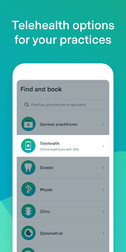  |   | 
 |   |  

## Development team
In the following we report the main information provided by the development team in the Google play store.

| | |
|-------------------------|-------------------------|
| **Developer**  | HealthEngine Pty Ltd |
| **Website**  | [https://healthengine.com.au/](https://healthengine.com.au/) |
| **Email** | feedback@healthengine.com.au |
| **Physical address**  | - |
| **Other developed apps**  | [https://play.google.com/store/apps/developer?id=HealthEngine+Pty+Ltd](https://play.google.com/store/apps/developer?id=HealthEngine+Pty+Ltd) |

## Android support

| | |
|-------------------------|-------------------------|
| **Declared target Android version**  | Android10, version 10 (API level 29) |
| **Effective target Android version**  | Android10, version 10 (API level 29) |
| **Minimum supported Android version**  | Lollipop, version 5.0 (API level 21) |
| **Maximum target Android version**  | - |

The larger the difference between the minimum and maximum supported Android versions, the better. A larger difference means a wider audience. For example, old phones have a very low Android version, so a high minimum supported Android version means that the app cannot be used by users with old phones, thus leading to accessibility problems. 

## Requested permissions

In the following we report the complete list of the permissions requested by the app. 

| **Permission** | **Protection level** | **Description** | 
|-------------------------|-------------------------|-------------------------|
 **android.permission ACCESS_COARSE_LOCATION** | :warning:**Dangerous** | Allows an app to access approximate location. 
 **android.permission ACCESS_FINE_LOCATION** | :warning:**Dangerous** | Allows an app to access precise location. 
 **android.permission ACCESS_NETWORK_STATE** | Normal | Allows applications to access information about networks. 
 **android.permission ACCESS_WIFI_STATE** | Normal | Allows applications to access information about Wi-Fi networks. 
 **android.permission CAMERA** | :warning:**Dangerous** | Required to be able to access the camera device. 
 **android.permission INTERNET** | Normal | Allows applications to open network sockets. 
 **android.permission MODIFY_AUDIO_SETTINGS** | Normal | Allows an application to modify global audio settings. 
 **android.permission READ_CALENDAR** | :warning:**Dangerous** | Allows an application to read the user's calendar data. 
 **android.permission READ_EXTERNAL_STORAGE** | :warning:**Dangerous** | Allows an application to read from external storage. 
 **android.permission RECEIVE_BOOT_COMPLETED** | Normal | Allows an application to receive the Intent.ACTION_BOOT_COMPLETED that is broadcast after the system finishes booting. 
 **android.permission RECORD_AUDIO** | :warning:**Dangerous** | Allows an application to record audio. 
 **android.permission USE_BIOMETRIC** | Normal | Allows an app to use device supported biometric modalities. 
 **android.permission USE_FINGERPRINT** | Normal | This constant was deprecated in API level 28. Applications should request USE_BIOMETRIC instead 
 **android.permission WAKE_LOCK** | Normal | Allows using PowerManager WakeLocks to keep processor from sleeping or screen from dimming. 
 **android.permission WRITE_CALENDAR** | :warning:**Dangerous** | Allows an application to write the user's calendar data. 
 **com.google.android.c2dm.permission RECEIVE** | - | - 
 **com.google.android.finsky.permission BIND_GET_INSTALL_REFERRER_SERVICE** | - | - 

## Mentioned servers

| **Server** | **Registrant** | **Registrant country** | **Creation date** | 
|-------------------------|-------------------------|-------------------------|-------------------------|
 | googlesyndication.com | Google LLC | :us: US | 2003-01-21 06:17:24 |
 | googleapis.com | Google LLC | :us: US | 2005-01-25 17:52:26 |
 | imgix.net | Zebrafish Labs | :us: US | 2011-06-23 01:52:27 |
 | zendesk.com | Zendesk, Inc. | :us: US | 2005-05-16 18:05:12 |
 | he0.io | HealthEngine | :fr: FR | 2018-04-27 11:21:17 |
 | omniture.com | Adobe Inc. | :us: US | 2002-03-29 21:33:52 |
 | facebook.com | Facebook, Inc. | :us: US | 1997-03-29 05:00:00 |
 | google.com | Google LLC | :us: US | 1997-09-15 04:00:00 |
 | googleadservices.com | Google LLC | :us: US | 2003-06-19 16:34:53 |
 | app-measurement.com | Google LLC | :us: US | 2015-06-19 20:13:31 |
 | imrworldwide.com | The Nielsen Company | :us: US | 1998-04-02 05:00:00 |
 | appboy.com | Braze, Inc. | :us: US | 2008-10-06 23:28:32 |
 | braze.com | Braze, Inc. | :us: US | 2000-01-19 02:18:28 |
 | googleapis.com | Google LLC | :us: US | 2005-01-25 17:52:26 |
 | crashlytics.com | Google LLC | :us: US | 2011-01-21 15:30:40 |
 | stripe.com | - | :us: US | 1995-09-12 04:00:00 |
 | branch.io | Branch | :us: US | 2011-11-10 13:52:13 |

## Security analysis 

Below we report the main security warnings raised by our execution of the [Androwarn](https://github.com/maaaaz/androwarn) security analysis tool.

**Telephony identifiers leakage**
> - This application reads the MCC+MNC of the provider of the SIM 
> - This application reads the device phone type value 
> - This application reads the numeric name (MCC+MNC) of current registered operator 
> - This application reads the operator name 

**Connection interfaces exfiltration**
> - This application reads details about the currently active data network 

**Telephony services abuse**
> - This application makes phone calls 

**Suspicious connection establishment**
> - This application opens a Socket and connects it to the remote address '; port is out of range' on the 'N/A' port  
> - This application opens a Socket and connects it to the remote address 'Li/e/b/a/a;->i0(Ljava/lang/String;)Ljava/lang/StringBuilder;' on the 'N/A' port  
> - This application opens a Socket and connects it to the remote address 'Ljava/net/Proxy;->type()Ljava/net/Proxy$Type;' on the 'N/A' port  
> - This application opens a Socket and connects it to the remote address 'timeout' on the 'N/A' port  

**Pim data leakage**
> - This application accesses data stored in the clipboard 

**Code execution**
> - This application loads a native library 
> - This application executes a UNIX command containing this argument: '2' 

## User ratings and reviews

Below we provide information about how end users are reacting to the app in terms of ratings and reviews in the Google Play store.

### Ratings

The HealthEngine app has been installed by more than **500000** times. At this time, **19450** rated the app and its average score is **4.757684**. Below we show the distribution of the ratings across the usual star-based rating of Google Play

:star::star::star::star::star:: 16074

:star::star::star::star:: 2740

:star::star::star:: 249

:star::star:: 79

:star:: 308

### Reviews 

#### 5-star reviews

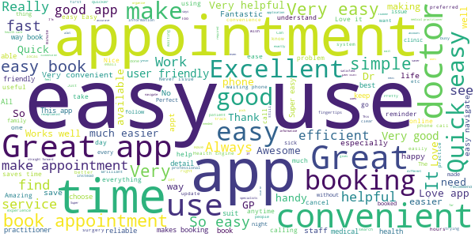

> Too easy! 😀  :date: __2021-03-06 04:14:12__

> Good app. Easy to understand and use.  :date: __2021-03-06 01:27:17__

> Easy to use.  :date: __2021-03-05 10:04:34__

> Easy and fast.....great  :date: __2021-03-05 09:31:29__

> Good service  :date: __2021-03-05 04:07:35__

> Have had no issues with app at all 😊  :date: __2021-03-05 03:31:00__

> SO EASY & PRACTICAL TO USE  :date: __2021-03-05 00:09:23__

> So easy, very handy.  :date: __2021-03-04 04:36:17__

> Always very helpful.  :date: __2021-03-04 03:32:32__

> Quick and easy to use  :date: __2021-03-03 10:15:37__

#### 4-star reviews

> Good app, However the login page is a pain.  :date: __2021-03-03 01:36:03__

> Fast and easy to use and I no longer have to wait on the phone waiting for am appointment  :date: __2021-02-25 23:08:08__

> Great app. Easy to use  :date: __2021-02-24 01:54:54__

> Works well, some mirror problems. These are other patient problems. Booking and not showing. Doctor now rings to confirm. This in itself makes the system a wast of time, I might as well just ring.  :date: __2021-02-23 00:34:58__

> I took 1 star off because I can't add my dental clinic into it, other than that, it's great, Thankyou  :date: __2021-02-21 15:25:45__

> It was quite good letting me know where closest GP is or small healthcare clinic is. Also let's me see the pictures and name of f all the doctors at the GP clinics or medical centres  :date: __2021-02-18 10:01:22__

> So easy to use to make appointments love this app.  :date: __2021-02-17 13:28:22__

> Easy to use and great 😊  :date: __2021-02-11 07:06:39__

> Very good  :date: __2021-02-11 01:15:00__

> Good so far  :date: __2021-02-10 08:36:33__

#### 3-star reviews

> It makes it much easier to get the Appointment of the my choice  :date: __2020-12-28 00:43:46__

> Helpful in every way  :date: __2020-12-15 02:34:12__

> The doctors it not take carefully and prescribe medicine at patience to tell de patient go de hospital for something wrong isus  :date: __2020-12-15 01:53:33__

> Looks good.  :date: __2020-11-25 22:17:39__

> Great app, convenient but I wish there was on option button for a phone appointment, I still have to call the surgery to change my appt to request a call  :date: __2020-11-02 02:43:42__

> Meh  :date: __2020-10-13 17:19:37__

> Unfortunately the add to calendar function doesn't work. It should add the appointment too my Google calendar. Don't know what it's doing.  :date: __2020-10-05 05:00:31__

> Excellent App, been using it for six months now, never had a problem at all... 👍😁  :date: __2020-09-16 08:36:36__

> My first time using this app. Not familiar with it. Cannot delete one of the profile on my list (even though I am able to delete another one) If I am able to choose GP from a drop down list that would be great. Then I don't have to go thru many GP with their available date and time shown.  :date: __2020-09-05 03:41:53__

> Good  :date: __2020-08-19 14:21:18__

#### 2-star reviews

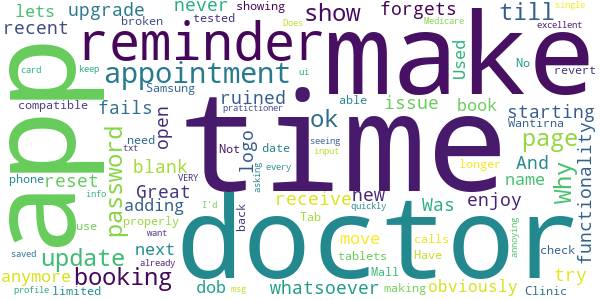

> Why after each upgrade it forgets my password? And when you try to reset the password it fails.  :date: __2020-11-22 23:15:54__

> Great till new update never had an issue till now doesn't show appointments anymore for any doctor can't book  :date: __2020-11-18 11:58:09__

> Used to be ok now lets you get to adding your name / dob and won't move to next page - obviously not compatible with Samsung Tab 6/ 7 tablets, just broken or not tested properly.  :date: __2020-11-06 05:19:45__

> No longer can make appointments at Wantirna Mall Clinic. Have to revert back to making phone calls.  :date: __2020-10-25 08:23:57__

> Not all doctors are showing so limited use.  :date: __2020-09-22 03:36:42__

> App is ok but need to be able to check time, date and which pratictioner I am seeing. Does not show and txt msg just a reminder you have an appointment no time only a doctor. Time reminder would ui I'd be an excellent reminder.  :date: __2020-09-21 08:05:41__

> Why does it keep asking for Medicare card info to be input every single time I make a booking when it's already been saved in the profile? VERY annoying when I just want to make a booking quickly.  :date: __2020-09-06 22:41:19__

> This app used to be great, then the developers got greedy and it has become useless. I am completely unable to book my regular doctor through this app, I apparently don't meet the "criteria " so I now have to phone the practice directly. The app is to busy asking you questions so they can cross sell products. Bin it and start again guys.  :date: __2020-08-13 01:01:29__

#### 1-star reviews

> This company was fined for onselling client information.  :date: __2021-03-05 09:38:30__

> Made appointments with ap that never made to doctors office my doctor has had enough of this ap and switched to a service  :date: __2021-03-02 23:06:57__

> Doctor very rude and Nasty. Not recommended for older people!!!!  :date: __2021-02-13 06:44:28__

> Will change to a better ratinh when I dont have to enter a passcode every single time I open the app.  :date: __2021-01-16 23:48:19__

> I book my aappointment online and recieved confmation email and phone with Dr rupali sharp 12:pm afternoon on Monday 04/01/2121 . When I reached i am watting for one hour . After one hour I asked the question resepetionst how much I am watting for she said no idea still three more patient watting meet to Dr rupali before you .. I am surprised and ask resepetionst what you give me time 12.00pm if appionement not avaiable. She give me no any response. really very bad services. I never goi again  :date: __2021-01-04 04:30:05__

> 1 hr notice for an appointment is silly. Make it the day before do there is a chance to cancel in a timely manner.  :date: __2020-12-09 23:38:27__

> Every time I'm logging on it's asking to create a passcode,,, most useless app I've come across,,, uninstalling it fix this annoyance..  :date: __2020-12-04 13:13:00__

> All these doctors expect their kickbacks...and most are dodgy as  :date: __2020-12-03 12:30:10__

> Great!  :date: __2020-12-03 09:31:58__

> Not loading  :date: __2020-12-03 07:21:45__

# DreamLab
App version ``3.2.0.2641``

Analyzed with [covid-apps-observer](http://github.com/covid-apps-observer) project, version ``0.1``

## App overview
| | |
|-------------------------|-------------------------| 
| **Name**&nbsp;&nbsp;&nbsp;&nbsp;&nbsp;&nbsp;&nbsp;&nbsp;&nbsp;&nbsp;&nbsp;&nbsp;&nbsp;&nbsp;&nbsp;&nbsp;&nbsp;&nbsp;&nbsp;&nbsp;&nbsp;&nbsp;&nbsp;&nbsp;&nbsp;&nbsp;&nbsp;&nbsp;&nbsp;&nbsp;&nbsp;&nbsp;&nbsp;&nbsp;&nbsp;&nbsp;&nbsp;&nbsp;&nbsp;&nbsp;  | DreamLab |
| **Unique identifier** | au.com.vodafone.dreamlabapp |
| **Link to Google Play** | [https://play.google.com/store/apps/details?id=au.com.vodafone.dreamlabapp](https://play.google.com/store/apps/details?id=au.com.vodafone.dreamlabapp) |
| **Summary**  | Use your phone to fast track cancer research, while you sleep. |
| **Privacy policy** | [https://www.vodafone.com.au/about/legal/privacy/dreamlab](https://www.vodafone.com.au/about/legal/privacy/dreamlab) |
| **Latest version** | 3.2.0.2641 |
| **Last update** | 2020-11-24 06:51:52 |
| **Recent changes** | We’ve added new statistics to the app so that users can better understand project progress and how their contribution is making a difference. We’ve also added ‘1 GB’ as the largest mobile data option and made some performance improvements. |
| **Installs**  | 500,000+ |
| **Category** | Lifestyle |
| **First release** | Oct 7, 2015 |
| **Size**  | 25M |
| **Supported Android version**  | 6.0 and up |

### Description
> ***Temporarily, DreamLab is being used to support research to combat the coronavirus (COVID-19).***
 Imagine if we could speed up time in the fight against cancer.
  
 DreamLab is a multi-award winning app that uses the collective power of smartphones to fast track cancer research. With cancer being one of the biggest causes of premature death worldwide, finding answers through medical research is incredibly important. DreamLab exists to help us get there sooner. And the more people who use the app, the faster it works.
 HOW IT WORKS
 Researchers need supercomputers to scan DNA in immense detail and crunch complex data. When you plug your phone in and power DreamLab, it downloads tiny parts of a huge research project from the cloud to calculate, and sends the results back to the research team. The more people who power DreamLab, the faster we can complete critical research. All you need to do is set up DreamLab once and it will get to work each time you plug your phone in.
 We’ve all been touched by cancer. Our best chance of beating it is by working together. And while sleep has always been good for you – with the DreamLab app, it can be good for others too. 
 Simply download the app (#) and choose which Project you’d like to support. You can also track the Contribution you’ve made and keep up to date with News.
 Dreamlab supports cancer research globally, and is powered by the Vodafone Foundation.
 * A compatible handset is required. Downloading DreamLab will consume data. Once downloaded, DreamLab can be used when your device (i) is connected to a charging source and (ii) has mobile network or WiFi connectivity. Mobile data to use DreamLab is free for Vodafone customers on their local Vodafone network. Roaming incurs international rates.
 # By downloading, installing or otherwise using the DreamLab application on your Device, you agree to be bound by the terms and conditions found at vodafone.com.au/dreamlab. If you do not agree to be bound by these Terms, you should not download, install or otherwise use DreamLab Application.

### User interface
The developers of the app provide the following screenshots in the Google play store.
| | | |
|:-------------------------:|:-------------------------:|:-------------------------:|
 |   |   |   | 
 |   |   |   | 
 |  

## Development team
In the following we report the main information provided by the development team in the Google play store.

| | |
|-------------------------|-------------------------|
| **Developer**  | Vodafone Foundation |
| **Website**  | [http://www.vodafone.com.au/dreamlab](http://www.vodafone.com.au/dreamlab) |
| **Email** | dreamlab@vodafone.com.au |
| **Physical address**  | [Vodafone Foundation, 1 Kingdom Street, London, W2 6BY United Kingdom](https://www.google.com/maps/search/Vodafone%20Foundation,%201%20Kingdom%20Street,%20London,%20W2%206BY%20United%20Kingdom) (Google Maps) |
| **Other developed apps**  | [https://play.google.com/store/apps/developer?id=Vodafone+Foundation](https://play.google.com/store/apps/developer?id=Vodafone+Foundation) |

## Android support

| | |
|-------------------------|-------------------------|
| **Declared target Android version**  | - |
| **Effective target Android version**  | - |
| **Minimum supported Android version**  | Marshmallow, version 6.0 (API level 23) |
| **Maximum target Android version**  | - |

The larger the difference between the minimum and maximum supported Android versions, the better. A larger difference means a wider audience. For example, old phones have a very low Android version, so a high minimum supported Android version means that the app cannot be used by users with old phones, thus leading to accessibility problems. 

## Requested permissions

In the following we report the complete list of the permissions requested by the app. 

| **Permission** | **Protection level** | **Description** | 
|-------------------------|-------------------------|-------------------------|
 **android.permission ACCESS_NETWORK_STATE** | Normal | Allows applications to access information about networks. 
 **android.permission ACCESS_WIFI_STATE** | Normal | Allows applications to access information about Wi-Fi networks. 
 **android.permission BATTERY_STATS** | Signature - privileged - development | Allows an application to collect battery statistics 
 **android.permission FOREGROUND_SERVICE** | Normal | Allows a regular application to use Service.startForeground. 
 **android.permission INTERNET** | Normal | Allows applications to open network sockets. 
 **android.permission RECEIVE_BOOT_COMPLETED** | Normal | Allows an application to receive the Intent.ACTION_BOOT_COMPLETED that is broadcast after the system finishes booting. 
 **android.permission VIBRATE** | Normal | Allows access to the vibrator. 
 **android.permission WAKE_LOCK** | Normal | Allows using PowerManager WakeLocks to keep processor from sleeping or screen from dimming. 
 **com.google.android.c2dm.permission RECEIVE** | - | - 
 **com.google.android.finsky.permission BIND_GET_INSTALL_REFERRER_SERVICE** | - | - 

## Mentioned servers

| **Server** | **Registrant** | **Registrant country** | **Creation date** | 
|-------------------------|-------------------------|-------------------------|-------------------------|
 | googlesyndication.com | Google LLC | :us: US | 2003-01-21 06:17:24 |
 | google.com | Google LLC | :us: US | 1997-09-15 04:00:00 |
 | urbanairship.com | DNStination Inc. | :us: US | 2009-04-14 06:34:46 |
 | asnapieu.com | DNStination Inc. | :us: US | 2019-05-15 21:27:07 |
 | adobedtm.com | Adobe Inc. | :us: US | 2013-11-22 23:15:17 |
 | googleapis.com | Google LLC | :us: US | 2005-01-25 17:52:26 |

## Security analysis 

Below we report the main security warnings raised by our execution of the [Androwarn](https://github.com/maaaaz/androwarn) security analysis tool.

**Telephony identifiers leakage**
> - This application reads the ISO country code equivalent for the SIM provider's country code 
> - This application reads the numeric name (MCC+MNC) of current registered operator 
> - This application reads the operator name 

**Location lookup**
> - This application reads location information from all available providers (WiFi, GPS etc.) 

**Connection interfaces exfiltration**
> - This application reads details about the currently active data network 
> - This application tries to find out if the currently active data network is metered 

**Telephony services abuse**
> - This application makes phone calls 

**Suspicious connection establishment**
> - This application opens a Socket and connects it to the remote address '' on the 'N/A' port  
> - This application opens a Socket and connects it to the remote address 'Ljava/lang/StringBuilder;->toString()Ljava/lang/String;' on the 'N/A' port  
> - This application opens a Socket and connects it to the remote address 'Ljava/net/Proxy;->type()Ljava/net/Proxy$Type;' on the 'N/A' port  
> - This application opens a Socket and connects it to the remote address 'timeout' on the 'N/A' port  

**Pim data leakage**
> - This application accesses data stored in the clipboard 

**Code execution**
> - This application loads a native library: 'native-lib' 

## User ratings and reviews

Below we provide information about how end users are reacting to the app in terms of ratings and reviews in the Google Play store.

### Ratings

The DreamLab app has been installed by more than **500000** times. At this time, **20245** rated the app and its average score is **4.4850416**. Below we show the distribution of the ratings across the usual star-based rating of Google Play

:star::star::star::star::star:: 15411

:star::star::star::star:: 2204

:star::star::star:: 913

:star::star:: 476

:star:: 1241

### Reviews 

#### 5-star reviews

> Great app  :date: __2021-03-05 19:26:33__

> Great to be able to provide support for such an innovative and potentially valuable programme. All working quietly in the background, and at no appreciable cost. If we all come together to do this, think of the difference we can make.8o  :date: __2021-03-04 09:08:38__

> we try...  :date: __2021-03-02 14:26:46__

> An interesting app to rate as it works in the background so I have no idea what it is doing. But I do get messages saying thank-you from time to time. If it could be improved a bit of feedback from the team explaining in more detail what they are doing would be helpful. At the moment it could be calculating the best route to deliver newspapers for all I know. There is just a hint at the moment that I am being taken for granted.  :date: __2021-03-02 08:27:32__

> If want to help out download this it's easy to use  :date: __2021-03-02 03:08:20__

> Everyone should use this app period. The only annoying thing is you must run the app with the phone on charge and leave it. If you out the phone into sleep mode it stops the apl for some reason.  :date: __2021-03-01 17:23:27__

> If you don't have it, why not?  :date: __2021-03-01 12:54:36__

> No problems.  :date: __2021-02-27 21:10:09__

> Excellent  :date: __2021-02-27 13:30:19__

> I think this app should be downloaded by everybody. All you need to do is plug your phone in and voila your helping cure cancer. It's easy to use. And really is just an amazing app with a great cause.  :date: __2021-02-27 12:19:38__

#### 4-star reviews

> Brilliant citizen science  :date: __2021-03-03 21:08:00__

> Doesn't work on android 9 now works on 5 and 6, Update ,now works perfectly. Only thing is I wish it did it in landscape mode,not automatically switch to portrait  :date: __2021-03-03 00:41:04__

> Supported for 2 years, but as my phone dies, Can't seem to stop it from running without uninstalling.  :date: __2021-03-01 11:27:13__

> It's a nice idea but has a few things that bug me. It doesn't always connect to the server, sometimes if I reboot my phone it fixes the issue but I can't usually be bothered. It doesn't just auto run when I connect power so I often forget to start it. I hope you get to see the papers that are produced from the data you have crunched.  :date: __2021-02-21 13:01:58__

> I want to give this 5 stars because the idea is great. Only knocked down to 4 because it doesn't always work, starting automatically at 80% charge. Maybe this is a problem with the APIs available, but it would be good it they could find a way around it. I'd be happy if it always started when charging, even if that slows charging a bit. Maybe that could be made an option.  :date: __2021-02-19 09:28:14__

> Darei 5 stelle, ma non sempre l'app parte in automatico quando attacco il telefono alla presa  :date: __2021-02-18 00:17:15__

> Can make my phone a bit hotter than I am comfortable with.  :date: __2021-02-13 23:03:54__

> App is good but could be better. The platform & institutions should take cues from BOINC's Android app's advance settings & notification feature. Also, as others have mentioned, you need to keep the calculations coming at a steady rate or at least inform users if there will be a slow down. BOINC institutions do this - they inform users if there will be a pause for maintenance or other reasons.  :date: __2021-02-11 22:45:34__

> I love the fact I can use this app and feel like I'm making a difference, currently I'm at home alot so when I'm not actively using my phone or I'm asleep I just let the app run, I would not recommend powering a project if your actively using the device however because it's using your phone as a processor for constant calculations it gets very hot and slows down all other stuff, but if you dont actively use your phone much while it charges it's a great tool to make a difference!  :date: __2021-02-09 13:29:37__

> Like helping out  :date: __2021-02-08 19:40:23__

#### 3-star reviews

> Presumably im helping. Boinc is better. Give more feedback on how we are helping. Also gridcoin being an additional bonus that potentially may have value in the far future. Why bother with this? It is nice if you are not very technical or dont want to fall into the rabbit hole of the many different sciences connected to boinc. If you want no hassle just do this. But if I want more meaningful results I use other platforms. I just need more feedback I guess. This platform is "ok" at least.  :date: __2021-03-05 14:06:45__

> Very good  :date: __2021-02-24 19:10:42__

> It's ok but the app causes overheating of phone. Battery got really bloated and caused the handphone casing to bend. Was told if I replaced the screen one day, it would put extreme pressure on the battery and possibly cause the battery to explode.  :date: __2021-02-22 19:48:38__

> Leaves me wondering. I try to give lots of time to the calculations but sometimes I get a calc done every 10 seconds and other times every 5 mins or so. I do not feel the owners update at their end often enough. Users need to see progress if they are to stay motivated to do this work  :date: __2021-02-20 02:57:49__

> App has a nasty habit of switching away from the project I selected to covid-19. For those of us on an unlimited plan there is no way to set the data is can use to unlimited. I would also like more options/projects to choose from to support. Any chance you could find ones in USA?  :date: __2021-02-10 14:32:49__

> Good idea, but only seems to run for 10 minutes a night on my phone. The rest of the time it says it's letting the phone cool - phone is stone cold...  :date: __2021-02-08 09:21:24__

> Great to help out but sometimes have difficulty starting a session due to 'used all daya' message  :date: __2021-01-30 17:01:33__

> The app is strange. Compred to folding@home it does not stimulate competition by giving you and Id, points, and the ability to gain more points by putting more devices under the same ID. Also it doesn't have any settings to allow me to use more or less resources. For instance it was initially using only one big core and now it seems to have settled for some of the little cores and I have no control over this behaviour. The app does not work in landscape mode which is very annoying.  :date: __2021-01-24 22:23:05__

> A great idea this but it does not automatically start calculations when I put my phone on charge. I have to manually start the calculations - it's rare I think to do so. There should be an in-app setting to allow automatic start upon plug in. 1 star lost because it's missing this obvious function. 1 star lost because without this function, the app is simply a waste of memory on my phone. Fix this and it's 5 stars.  :date: __2021-01-12 18:53:46__

> Very nice app, however, I wish it has I control when the app starts crunching numbers, for example after my battery level is up to 99% for example and it will stop if the battery drops Below 90% and so on.  :date: __2021-01-12 14:54:10__

#### 2-star reviews

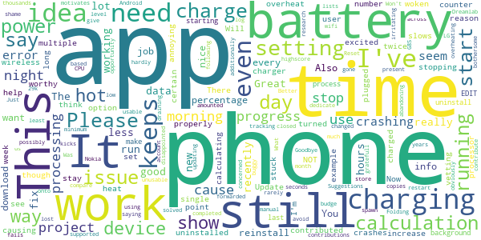

> App doesn't start up when plugged in, even on manual start, just keeps saying data will restart the following month, even though setting is for wifi.  :date: __2021-03-03 02:00:52__

> What's the reason for rarely updating users on progress % of research project? It's really irritating to dedicate hours of your devices power for weeks and still not see the percentage budge.  :date: __2021-02-28 08:51:42__

> Needs more settings. 1. Pause if screen is on. 2. Max processor %. 3. Min % battery to begin processing. For some reason the jobs become stuck with no processing occuring while clock continues - maybe a download issue, it doesn't retry though. Needs a % & time counter per job counter so we can see if it's stuck or just a long job. Phone also slows when it's processing, the % processor option may help with this. Update: now it says Ive reached my monthly data limit which I can't increase over 1gb  :date: __2021-02-27 00:17:45__

> You are trying to download the free ringtones for my phone but it won't let you  :date: __2021-02-20 06:33:56__

> Not working all the time  :date: __2021-01-30 13:13:44__

> Unfortunately after consistant use of the app for a worthy cause, the battery life on my new Samsing S10 no longer lasts day even with minimal interaction. Will have to purchase a new phone.  :date: __2021-01-24 19:30:38__

> use this on my work phone (moto) and a tablet with no issues, vut in my Samsung S7 it causes the phone to get really hot. Can you develop a way to select running at half speed or even less. I don't like the idea of heat cycling my phone every night.  :date: __2021-01-10 18:06:32__

> Doesn't show right progress, after every few deletes requires reinstall for knowing progress.  :date: __2021-01-08 00:22:12__

> It just won't stay running.  :date: __2020-12-30 21:36:07__

> Great idea, was excited to help but the app always crashes. Have turned it on every night for over a week and there hasn't been a single morning the app was still running and only clocked up 5 hours  :date: __2020-12-30 14:06:28__

#### 1-star reviews

> Used it for a few years. Was a good app. Then for 2 months in a row it claimed I'd used all my data allocation on the first day. Uninstalled and reinstalled and was considered a new user.  :date: __2021-03-05 12:20:49__

> Stop and start, changes what youve sekected rubbish  :date: __2021-02-26 01:19:42__

> This app will damage your phone's battery. I've been using it for months now but have steadily noticed that my phone is not lasting a full day anymore, initially blamed my usage but it was suggested to me that the app may be the cause. I checked in with others who I encouraged to also download this app and they have had the same issue. I uninstalled several days ago and my battery life has not improved so it appears to be permanent. I now feel responsible for damaging mine and my friends phones.  :date: __2021-02-17 11:29:24__

> After having used this app religiously for many years without any problems. They now change your selected project to coronavirus against your will or knowledge. It doesn't matter what project you select. They will secretly change it to coronavirus. I have now deleted this app as I find it unethical.  :date: __2021-02-05 04:35:19__

> Good concept. My problem is that it kicks in whenever the phone is charging, not desirable when plugged into a powerbank. I use my phone as cycling computer and also with maps and use a powerbank so i can have the screen on all the time. If dreamlabs kicks in it drains the powerbank and phone battery at an amazing rate. It would help if it was possible to define the time period when dreamlab is active so it is restricted to overnight charging time. Running too often when not wanted so uninstall  :date: __2021-01-28 18:26:03__

> Installed on my oneplus 8 and it instantly stopped responding and crashed out hence 1 star  :date: __2021-01-23 08:11:26__

> it seems that i cant use this for my current phone as it keeps overheating and pauses. my iphone seems to be doing a better job about 30 minutes in without pausing. On my android it pauses every 5 minutes or so. since i am not using my iphone so i will run it there. maybe my Android phone isnt good enough  :date: __2021-01-02 08:09:06__

> Tells you nothing that you already know. All they do is count how many minutes on the website you are on and if a website counts how long you have been on for well that's suss in my opinion.  :date: __2020-12-28 22:33:52__

> Kept freezing Android 7 tablet & Android 9 phone. Unacceptable behaviour. Uninstalled.  :date: __2020-12-20 11:44:11__

> I tried the app on my phone. My phone got red hot. So I tried it on my iPad. It drained the battery completely; unfortunately even while on charge. Had to delete it. Shame. I wanted to help....  :date: __2020-12-20 10:45:36__

# Premier's Active April
App version ``2.3.9``

Analyzed with [covid-apps-observer](http://github.com/covid-apps-observer) project, version ``0.1``

## App overview
| | |
|-------------------------|-------------------------| 
| **Name**&nbsp;&nbsp;&nbsp;&nbsp;&nbsp;&nbsp;&nbsp;&nbsp;&nbsp;&nbsp;&nbsp;&nbsp;&nbsp;&nbsp;&nbsp;&nbsp;&nbsp;&nbsp;&nbsp;&nbsp;&nbsp;&nbsp;&nbsp;&nbsp;&nbsp;&nbsp;&nbsp;&nbsp;&nbsp;&nbsp;&nbsp;&nbsp;&nbsp;&nbsp;&nbsp;&nbsp;&nbsp;&nbsp;&nbsp;&nbsp;  | Premier's Active April |
| **Unique identifier** | au.gov.vic.premiersactiveapril |
| **Link to Google Play** | [https://play.google.com/store/apps/details?id=au.gov.vic.premiersactiveapril](https://play.google.com/store/apps/details?id=au.gov.vic.premiersactiveapril) |
| **Summary**  | Fun and free, encouraging Victorians to do 30mins of activity a day in April. |
| **Privacy policy** | [https://www.activeapril.vic.gov.au/privacy-policy/](https://www.activeapril.vic.gov.au/privacy-policy/) |
| **Latest version** | 2.3.9 |
| **Last update** | 2020-05-07 01:52:14 |
| **Recent changes** | This release includes changes to reflect the COVID 19 restrictions |
| **Installs**  | 10,000+ |
| **Category** | Health & Fitness |
| **First release** | Feb 2, 2017 |
| **Size**  | 34M |
| **Supported Android version**  | 4.2 and up |

### Description
> Premier’s Active April is free and fun for everyone, encouraging all Victorians to do 30 minutes of physical activity a day during April. It’s part of the Victorian Government’s commitment to get more people active and healthy.
 As a participant, you can log your daily activity in the mobile or web app and chart your progress throughout the month. You can also create and join teams, track the progress of team members.
 Register now for Premier’s Active April 2020 to move more and feel great!
 Important message regarding Premier’s Active April 2020
 A state of emergency has been declared in Victoria because of the serious risk to public health posed by the coronavirus (COVID-19).
 Due to COVID-19 restrictions, it is no longer possible to hold the Premier’s Active April 2020 scheduled public events and activities, which are cancelled.
 Campaign Offers
 Participating campaign partner organizations have withdrawn their offers of activities, goods and services, discounts and incentives due to the change in business circumstances. The Active April 2020 campaign Special Offers, My Offers and Prizes (“Campaign Offers”) (other than the random Prize draw for 2021 Australian Open Tickets) are correspondingly cancelled.
 Participants holding a Premier’s Active April Card who have not redeemed any Campaign Offer by 26 March 2020   unable to do so.
 Registration
 Registration in Active April is still possible up to 30 April.
 *Terms and conditions for all prizes and offers apply. Visit activeapril.vic.gov.au for details.

### User interface
The developers of the app provide the following screenshots in the Google play store.
| | | |
|:-------------------------:|:-------------------------:|:-------------------------:|
 |   |  

## Development team
In the following we report the main information provided by the development team in the Google play store.

| | |
|-------------------------|-------------------------|
| **Developer**  | Better Health Channel |
| **Website**  | [https://www.activeapril.vic.gov.au/](https://www.activeapril.vic.gov.au/) |
| **Email** | activeapril@sport.vic.gov.au |
| **Physical address**  | - |
| **Other developed apps**  | [https://play.google.com/store/apps/developer?id=Better+Health+Channel](https://play.google.com/store/apps/developer?id=Better+Health+Channel) |

## Android support

| | |
|-------------------------|-------------------------|
| **Declared target Android version**  | Pie, version 9 (API level 28) |
| **Effective target Android version**  | Pie, version 9 (API level 28) |
| **Minimum supported Android version**  | Jelly Bean, version 4.2.x (API level 17) |
| **Maximum target Android version**  | - |

The larger the difference between the minimum and maximum supported Android versions, the better. A larger difference means a wider audience. For example, old phones have a very low Android version, so a high minimum supported Android version means that the app cannot be used by users with old phones, thus leading to accessibility problems. 

## Requested permissions

In the following we report the complete list of the permissions requested by the app. 

| **Permission** | **Protection level** | **Description** | 
|-------------------------|-------------------------|-------------------------|
 **android.permission ACCESS_NETWORK_STATE** | Normal | Allows applications to access information about networks. 
 **android.permission CAMERA** | :warning:**Dangerous** | Required to be able to access the camera device. 
 **android.permission INTERNET** | Normal | Allows applications to open network sockets. 
 **android.permission READ_EXTERNAL_STORAGE** | :warning:**Dangerous** | Allows an application to read from external storage. 
 **android.permission WAKE_LOCK** | Normal | Allows using PowerManager WakeLocks to keep processor from sleeping or screen from dimming. 
 **android.permission WRITE_EXTERNAL_STORAGE** | :warning:**Dangerous** | Allows an application to write to external storage. 
 **com.google.android.c2dm.permission RECEIVE** | - | - 
 **com.google.android.finsky.permission BIND_GET_INSTALL_REFERRER_SERVICE** | - | - 
 **com.google.android.providers.gsf.permission READ_GSERVICES** | - | - 

## Mentioned servers

| **Server** | **Registrant** | **Registrant country** | **Creation date** | 
|-------------------------|-------------------------|-------------------------|-------------------------|
 | googlesyndication.com | Google LLC | :us: US | 2003-01-21 06:17:24 |
 | google.com | Google LLC | :us: US | 1997-09-15 04:00:00 |
 | app-measurement.com | Google LLC | :us: US | 2015-06-19 20:13:31 |
 | crashlytics.com | Google LLC | :us: US | 2011-01-21 15:30:40 |
 | w3.org | W3C | :us: US | 1994-07-06 04:00:00 |
 | googleapis.com | Google LLC | :us: US | 2005-01-25 17:52:26 |

## Security analysis 

Below we report the main security warnings raised by our execution of the [Androwarn](https://github.com/maaaaz/androwarn) security analysis tool.

**Connection interfaces exfiltration**
> - This application reads details about the currently active data network 
> - This application tries to find out if the currently active data network is metered 

**Suspicious connection establishment**
> - This application opens a Socket and connects it to the remote address '' on the '80' port  
> - This application opens a Socket and connects it to the remote address '' on the 'N/A' port  
> - This application opens a Socket and connects it to the remote address 'Ljava/lang/StringBuilder;->toString()Ljava/lang/String;' on the 'N/A' port  
> - This application opens a Socket and connects it to the remote address 'Ljava/net/Proxy;->type()Ljava/net/Proxy$Type;' on the 'N/A' port  
> - This application opens a Socket and connects it to the remote address 'NanoHttpd Shutdown' on the 'N/A' port  
> - This application opens a Socket and connects it to the remote address 'timeout' on the 'N/A' port  

**Code execution**
> - This application loads a native library 
> - This application loads a native library: 'Ljava/util/Iterator;->next()Ljava/lang/Object;' 
> - This application loads a native library: 'NativeScript' 
> - This application executes a UNIX command containing this argument: '2' 

## User ratings and reviews

Below we provide information about how end users are reacting to the app in terms of ratings and reviews in the Google Play store.

### Ratings

The Premier's Active April app has been installed by more than **10000** times. At this time, **69** rated the app and its average score is **3.057971**. Below we show the distribution of the ratings across the usual star-based rating of Google Play

:star::star::star::star::star:: 25

:star::star::star::star:: 6

:star::star::star:: 8

:star::star:: 8

:star:: 22

### Reviews 

#### 5-star reviews

> I can add people to win on the app💙  :date: __2020-03-15 11:26:31__

> Its really good  :date: __2020-02-17 09:40:31__

> do  :date: __2019-04-17 10:50:21__

> After an initial hiccup I updated the app and it's running much smoother now. I like being able to track on the go and having the benefits card on my phone is super useful. The new workouts videos this year are a nice touch too!!  :date: __2019-04-04 06:36:48__

> excellent  :date: __2019-04-01 07:32:55__

> it was awesole last year. i am mkre actuve abd tried new things and i wud luv luv luv to be active this winter😚😀  :date: __2019-02-15 02:47:41__

> Great App. :)  :date: __2018-04-17 07:45:15__

#### 4-star reviews

> Love this app, I use it for school and I also have a family team. I have a home gym and myself and my parents use it all the time but im assuming that the COVID-19 pandemic has resulted in the fitness activity selection to be cut back so I can no longer add 'gym' to my tracker, I have to put it as 'other'...Why is this???  :date: __2020-04-15 12:44:42__

> After Easter I was really struggling to get back into a good health and fitness routine. A friend referred me to Active April through the app and it was such an easy way to start again. There was so many freebies it was hard not to take advantage and get motivated.  :date: __2018-04-12 02:16:35__

#### 3-star reviews

> Have used in previous years with no issues. This year, I had trouble logging in at 2 stages. One was before the start of April, the other was after the middle of the month. At both times, the app refused to login, even when given the correct details (checked multiple times). It complained about an Invalid username or password. However, they were correct. I had to use the website for entering my activities for the latter half of April.  :date: __2020-05-01 13:23:35__

> Can you please include rowing on the list of activities? The app can be a bit slow and sometimes crashes. I like the tracker and snapshot.  :date: __2019-04-11 21:35:52__

> it'd have been better if it could get connected to apps such as Samsung health, Google fit, strava etc and directly imported data from there...  :date: __2019-04-08 16:56:41__

> Before April it was working fine, but now I try to add activity or view the fitness videos and it lags and then crashes  :date: __2019-04-03 10:35:43__

> Wish there was a way to link to Fitbit, or Google health  :date: __2019-02-23 02:10:20__

> Slow to start.  Postcode summary not working. Reports 0 hrs for my postcode  :date: __2018-04-07 13:23:29__

> It needs to link to Google fit and extract workouts I've completed as all the tracking apps I use log with Google fit  :date: __2018-04-03 03:40:26__

#### 2-star reviews

> Sometimes works, but for what it does, it's very slow. Clearly a web app, based on its slowness, reliance on the internet and the html error messages.  :date: __2019-04-24 01:41:38__

> still crashing  :date: __2019-04-11 11:14:37__

> App keeps crashing which is annoying as I can't log all my workouts.  :date: __2019-04-07 06:38:26__

> Severely lacking integration with Google Fit, Fitbit, Strava, Garmin, etc...  :date: __2019-03-26 23:45:44__

> Too slow to start up. What is it doing. ? Would track more time but it's tomorrow by the time the app has dtarted  :date: __2018-04-02 10:52:17__

> Looks good but once you try to use it, it is very slow and clunky - and my phone is moto g 3rd gen with 2GB - shouldn't have these kind of problems for this type of app for my type of phone  :date: __2017-04-10 14:32:10__

> Buggiest app I've got. Freezes constantly, can't click on stuff, have to constantly close and reopen.  :date: __2017-04-04 08:32:33__

> Very frustrating app. Lots of text looks clickable but its not. Eg the Red Activity Snapshot box. Maybe it will improve when it's live and useable. Also no Rowing option.  :date: __2017-03-29 14:33:34__

#### 1-star reviews

> Literally is so difficult to activate it isn't worth it  :date: __2020-06-13 07:06:24__

> couldn't sign in. sign in on the website worked and gets the app one star.  :date: __2019-04-18 12:05:05__

> Whatever the last update was broke it, i Cannot log in .  :date: __2019-04-13 05:44:54__

> app cant resolve hostname and doesn't work at all.  :date: __2019-04-07 08:44:40__

> I can't access the workouts. The app keeps crashing when I try to move to a different page on the dashboard.  :date: __2019-04-01 08:31:53__

> app does not open  :date: __2019-03-28 10:01:48__

> It doesn't work - When trying to log-in I get a Java SSP protocol error message. I know I have got the correct email and password as I used them successfully to re-register.  :date: __2019-02-22 02:41:30__

> What a rubbish app! And every year it's the same. Won't store my username 
and password, and then keeps telling me my password and username are 
incorrect, even though I use them successfully in the web site. Same issue 
as 2017.  :date: __2018-04-15 03:17:57__

> couldnt get past entering postcode...pretty poor given you want us to register!  :date: __2018-04-08 11:30:43__

> It won't let me log in, it says 'service unavailable'.  :date: __2018-04-04 23:53:25__

# Credits

This project makes use of the following main third-party projects:
* Androguard: [https://github.com/androguard/androguard](https://github.com/androguard/androguard)
* Androwarn: [https://github.com/maaaaz/androwarn](https://github.com/maaaaz/androwarn)
* google_play_scraper: [https://github.com/JoMingyu/google-play-scraper](https://github.com/JoMingyu/google-play-scraper)
* whois: [https://github.com/DannyCork/python-whois](https://github.com/DannyCork/python-whois)
* BeautifulSoup: [https://www.crummy.com/software/BeautifulSoup](https://www.crummy.com/software/BeautifulSoup)

Other open-source projects used in this project include: 

- androguard==3.3.5
- appnope==0.1.0
- asn1crypto==1.3.0
- backcall==0.1.0
- beautifulsoup4==4.9.0
- bs4==0.0.1
- certifi==2020.4.5.1
- cffi==1.14.0
- chardet==3.0.4
- click==7.1.2
- colorama==0.4.3
- cryptography==2.9.2
- cycler==0.10.0
- decorator==4.4.2
- future==0.18.2
- google-play-scraper==0.1.1
- idna==2.9
- ipython==7.13.0
- ipython-genutils==0.2.0
- jedi==0.17.0
- Jinja2==2.11.2
- joblib==0.14.1
- kiwisolver==1.2.0
- lxml==4.5.0
- MarkupSafe==1.1.1
- matplotlib==3.2.1
- networkx==2.4
- nltk==3.5
- numpy==1.18.3
- parso==0.7.0
- pexpect==4.8.0
- pickleshare==0.7.5
- Pillow==7.1.2
- play-scraper==0.6.0
- prompt-toolkit==3.0.5
- ptyprocess==0.6.0
- pycountry==19.8.18
- pycparser==2.20
- pydot==1.4.1
- Pygments==2.6.1
- pyOpenSSL==19.1.0
- pyparsing==2.4.7
- python-dateutil==2.8.1
- regex==2020.4.4
- requests==2.23.0
- requests-futures==1.0.0
- six==1.14.0
- soupsieve==2.0
- tld==0.12.1
- tqdm==4.45.0
- traitlets==4.3.3
- urllib3==1.25.9
- wcwidth==0.1.9
- wordcloud==1.7.0

