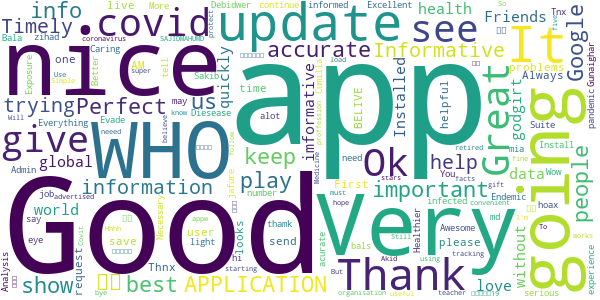
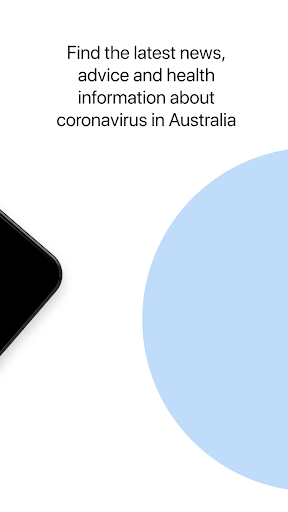
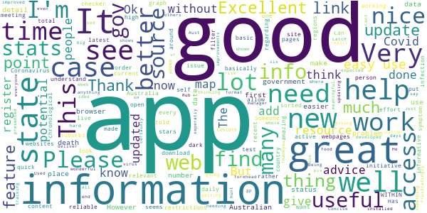
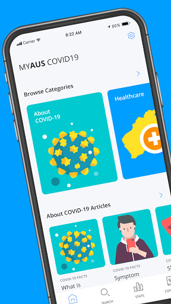
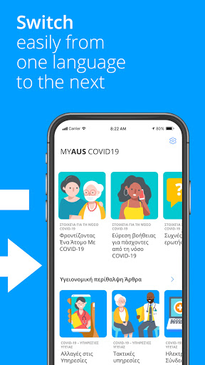
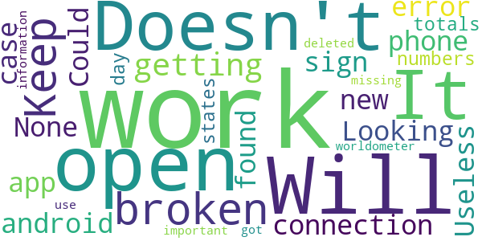
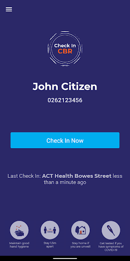
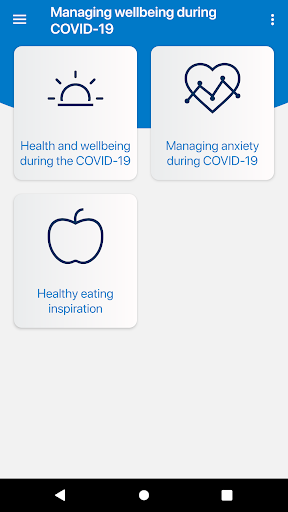
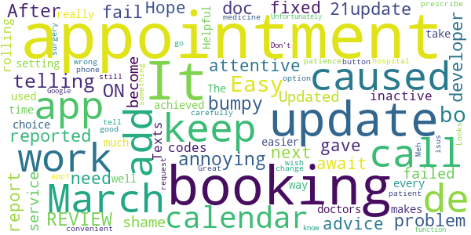
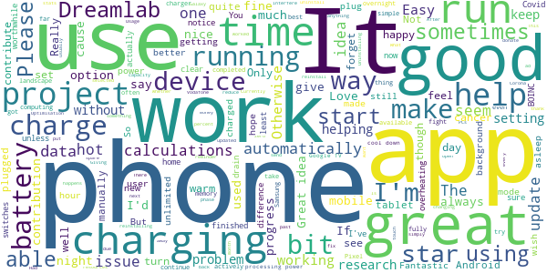

# COVID-related Android apps in Australia

Author: `Ivano Malavolta` (ivanomalavolta@gmail.com)

Created at: `2021/7/11`

Report generated by the [covid-apps-observer](http://github.com/covid-apps-observer) project, version 0.1

# Table of contents 

- [Background](#background)
    * [Data sources and analyses](#data-sources-and-analyses)
        * [App metadata](#app-metadata)
        * [Requested permissions](#requested-permissions)
        * [Mentioned servers](#mentioned_servers)
        * [Security analysis](#security_analysis)
        * [User ratings and reviews](#user-ratings-and-reviews)
    * [Disclaimer](#disclaimer)
- [COVIDSafe](#covidsafe)
- [WHO Info](#who-info)
- [Coronavirus Australia](#coronavirus-australia)
- [MyAus COVID-19](#myaus-covid-19)
- [OpenWHO: Knowledge for Health Emergencies](#openwho-knowledge-for-health-emergencies)
- [Check In CBR](#check-in-cbr)
- [Service NSW](#service-nsw)
- [Bupa Aged Care Connect](#bupa-aged-care-connect)
- [TCC COVID Monitor](#tcc-covid-monitor)
- [HealthEngine](#healthengine)
- [DreamLab](#dreamlab)
- [Premier's Active April](#premier's-active-april)

- [Credits](#credits)

# How to read this report

This report has been generated by the [covid-apps-observer](http://github.com/covid-apps-observer) project. The project automatically analyzes the apps by extracting information which is already publicly available either on the web or in the apps binary files. 

Our analysis covers the following apps:
| | |
|-------------------------|-------------------------| 
|  | COVIDSafe
|  | WHO Info
|  | Coronavirus Australia
|  | MyAus COVID-19
|  | OpenWHO: Knowledge for Health Emergencies
|  | Check In CBR
|  | Service NSW
|  | Bupa Aged Care Connect
|  | TCC COVID Monitor
|  | HealthEngine
|  | DreamLab
|  | Premier's Active April

The details of our analysis are presented in the remainder of this report.

For independent verification, the raw data and the source code of the project is publicly available in its GitHub repository [http://github.com/covid-apps-observer](http://github.com/covid-apps-observer) and its source code has been thoroughly commented in order to provide all the details about how the information provided in this report has been extracted. 

Any feedback, questions, and improvements about the project are very welcome, feel free to create an issue or pull request directly in its GitHub repository: [http://github.com/covid-apps-observer](http://github.com/covid-apps-observer).

## Data sources and analyses

The analysis of each app is structured around five main dimensions: 
* App metadata  
* Requested permissions
* Mentioned servers
* Androwarn analysis
* User ratings and reviews

In the following we describe the data sources and analysis performed for each dimension.

### App metadata

App metadata includes an overview of the main information about the app (for example, its name, releases, privacy policy, etc.), contact information of the development team, and the various Android versions supported by the app. This information is extracted from two main data sources:
* _Google Play store_: we automatically mined the web page of the Google Play store showing the basic information about the app and we parsed it in order to extract information about the app and development team 
* _Android Manifest file_: in our analysis we decompiled the binary file of the app (it is similar to a Zip archive but it contains the code of the app instead of normal files) and we extracted information about the supported Android versions, as it has been listed by its development team.

The extracted app metadata feeds the _App overview_, _Development team_, and _Android support_ sections of this report.
We make use of the [google-play-scraper](https://github.com/JoMingyu/google-play-scraper) tool for extracting the raw data related to this dimension of the project.

### Requested permissions

The Android operating system has a permission model which allows users to grant access to potentially privacy-related information. Every Android app has to explictly declare the permissions it needs to properly function in the Android Manifest file.  

In this report we also show the protection level of each permission, which is a key information for understanding how the requested permissions related to the user's privacy. We carefully analyzed the [official Android documentation (v. 29)](https://developer.android.com/reference/android/Manifest.permission), and it resulted that a permission requested by an Android app can belong to the following protection levels:
* **Dangerous**: higher-risk permissions that would give a requesting app access to private user data or control over the device that can negatively impact the user. Because this type of permission introduces potential risk, the system usually does not automatically grant it to the requesting app. For example, any dangerous permissions requested by an app may be displayed to the user and require confirmation before proceeding.
* **Normal**: this is the default and most common level in Android; normal permissions are lower-risk and give access to isolated app-level features, with minimal risk to other apps, the system, or the user. 
* **Signature**: permissions granted only if the requesting app is signed with the same certificate as the app that declared the permission
* **Appop**: old permission level, a reminiscence of the App Ops tool that Google introduced in Android 4.3.
* **Development**: optional permissions which can be granted to development-oriented apps.
* **Privileged**: permissions who give higher power to mobile apps w.r.t. other apps, such as binding to incoming calls, interacting via bluetooth with other devices without user interaction, etc.
* **Preinstalled**: reserved only for preinstalled apps
* **Installer**: allow the holder to start the permission usage screen for an app
* **RetailDemo**: permissions related to devices used in demonstrations in shops.
* **Pre23**: permissions automatically granted to apps targeting devices running pre-6.0 Android.
* **Upcoming**: permissions which will be released in the next version of the Android platform. 
* **Deprecated**: permissions belonging to old releases of the Android platform, they should not be used by developers since they will not be supported in the near future.
* **Not for use by third-party applications**: permissions which can be requested only by apps developed by Google.
* **Undefined**: this protection level is not documented by Google.

The permissions dimension of this project is based on the [Androguard](https://github.com/androguard/androguard) static analysis tool.

### Mentioned servers

We decompiled each app in order to look for all possible mentions of remote URLs. The mentioned URLs can refer to remote servers the the app is using for either sending or receiving information, web addresses for directing the user to an information website, and so on. 

:warning: It is important to note that this analysis is not meant to be complete and it is very prone to obfuscation. The servers reported here are simply _mentioned_ somewhere in the code of the app and are meant to just give an indication about the "hooks" of the app towards external resources. For example, for an Android app it is normal to contact Google services in order to send/receive push notifications, or to contact the servers of analytics services for having real-time diagnostics about crashes of the app or bugs.

This part of the analysis is based on the [Androguard](https://github.com/androguard/androguard) static analysis tool for identfying the raw URLs mentioned in the app; then, the information about each mentioned server is collected by performing a _whois_ lookup on the first-level domain present in the URL.

### Security analysis

This dimension is based on the [Androwarn](https://github.com/maaaaz/androwarn) structural and data flow analysis of Android bytecode. Androwarn is developed by the University of Lyon/INSA (France) and it has been used in several academic studies. According to its documentation, Androwarn targets the following categories of potential security issues:
* **Telephony identifiers exfiltration**: IMEI, IMSI, MCC, MNC, LAC, CID, operator's name, etc.
* **Device settings exfiltration**: software version, usage statistics, system settings, logs, etc.
* **Geolocation information leakage**: GPS/WiFi geolocation, etc.
* **Connection interfaces information exfiltration**: WiFi credentials, Bluetooth MAC adress, etc.
* **Telephony services abuse**: premium SMS sending, phone call composition, etc.
* **Audio/video flow interception**: call recording, video capture, etc.
* **Remote connection establishment**: socket open call, Bluetooth pairing, APN settings edit, etc.
* **PIM data leakage**: contacts, calendar, SMS, mails, clipboard, etc.
* **External memory operations**: file access on SD card, etc.
* **PIM data modification**: add/delete contacts, calendar events, etc.
* **Arbitrary code execution**: native code using JNI, UNIX command, privilege escalation, etc.
* **Denial of Service**: event notification deactivation, file deletion, process killing, virtual keyboard disable, terminal shutdown/reboot, etc.

Note: We do not consider this data point in the current version of our analyzers since it is too verbose for our purposes.

:warning: It is important to note that Androwarn is a static analysis tool, and as such it performs a variety of heuristics and approximations in its analyses. Said that, the results shown in this report are meant to provide an indication of _potential_ security issues and should be by no means treated as complete and correct.   

### User ratings and reviews

For this dimension we turn again to the web interface of the Google Play store. Firstly, we automatically mine summary statistics about user ratings from the web page of the app under analysis; then, we automatically download the newest 1000 reviews of the app under analysis. For each level of rating (5 stars, 4 stars, , etc., 1 star) we show:
- a word cloud presenting the main terms used by end users in their reviews in the Google Play store
- the last 10 reviews provided by app users in the Google Play store. 

This purposefully simple analysis is meant to help both future users and the development team of the app in understanding what are the main positive and negative points of the app under analysis.

We make use of the [google-play-scraper](https://github.com/JoMingyu/google-play-scraper) tool for extracting the raw data related to this dimension of the project.

## Disclaimer 

This report has been produced independently of any parties and its only objective is to help anybody in better understanding how COVID-related apps work in practice (and compare to each other). The results of this report are limited to the specific version of the software used for running the analyses and on the various heuristics implemented in there. In other words, the results of the analyzers may differ depending on the time and modalities in which they are executed. We do not guarantee that the results of the analyses and the corresponding contents of this report are fully complete or correct. The analysis software is licensed under the [MIT License](https://github.com/iivanoo/covid-apps-observer/blob/master/LICENSE).

# COVIDSafe
App version ``2.8``

Analyzed with [covid-apps-observer](http://github.com/covid-apps-observer) project, version ``0.1``

## App overview
| | |
|-------------------------|-------------------------| 
| **Name**&nbsp;&nbsp;&nbsp;&nbsp;&nbsp;&nbsp;&nbsp;&nbsp;&nbsp;&nbsp;&nbsp;&nbsp;&nbsp;&nbsp;&nbsp;&nbsp;&nbsp;&nbsp;&nbsp;&nbsp;&nbsp;&nbsp;&nbsp;&nbsp;&nbsp;&nbsp;&nbsp;&nbsp;&nbsp;&nbsp;&nbsp;&nbsp;&nbsp;&nbsp;&nbsp;&nbsp;&nbsp;&nbsp;&nbsp;&nbsp;  | COVIDSafe |
| **Unique identifier** | au.gov.health.covidsafe |
| **Link to Google Play** | [https://play.google.com/store/apps/details?id=au.gov.health.covidsafe](https://play.google.com/store/apps/details?id=au.gov.health.covidsafe) |
| **Summary**  | COVIDSafe is a community-based way to stop the spread of COVID-19. |
| **Privacy policy** | [https://covidsafe.gov.au/privacy-policy.html](https://covidsafe.gov.au/privacy-policy.html) |
| **Latest version** | 2.8 |
| **Last update** | 2021-07-01 07:35:27 |
| **Recent changes** | Under investigation COVID-19 case numbers added to home screen to align to Department of Health website.  |
| **Installs**  | 1,000,000+ |
| **Category** | Health & Fitness |
| **First release** | Apr 25, 2020 |
| **Size**  | 28M |
| **Supported Android version**  | 5.0 and up |

### Description
> COVIDSafe app has been developed by the Australian Government Department of Health to help keep the community safe from coronavirus (COVID-19). Together, let’s help stop the spread and keep ourselves and each other healthy.
 COVIDSafe uses the Bluetooth® technology on your mobile phone to look for other devices with COVIDSafe installed. Your device will take a note of contact you’ve had with other users by securely logging the other user’s reference code. If you or someone you’ve been in contact with is diagnosed with COVID-19, the close contact information securely stored in your phone can be uploaded and used—with your consent—by state and territory health officials to quickly inform people who’ve been exposed to the virus.
 How you can help stop the spread of COVID-19:
 • Download the COVIDSafe app
 • Register using your mobile phone number, name, age range and postcode
 • Turn on Bluetooth®
 • Check that COVIDSafe is running when you are out and about or are likely to come into contact with others
 • If you test positive for COVID-19, you can consent for your close contact information to be used by state and territory health officials to contact people who may have been exposed. If you’ve been exposed to the virus by someone you’ve been in close contact with, state and territory health officials will be able to contact you quickly so you can get the support you need
 COVIDSafe is an Australian Government Department of Health initiative. Visit https://www.health.gov.au/resources/apps-and-tools/covidsafe-app for more information.

### User interface
The developers of the app provide the following screenshots in the Google play store.
| | | |
|:-------------------------:|:-------------------------:|:-------------------------:|
 |   |   |   | 
 |   |  

## Development team
In the following we report the main information provided by the development team in the Google play store.

| | |
|-------------------------|-------------------------|
| **Developer**  | Australian Department of Health |
| **Website**  | [https://www.health.gov.au/resources/apps-and-tools/covidsafe-app#covidsafe-app-help](https://www.health.gov.au/resources/apps-and-tools/covidsafe-app#covidsafe-app-help) |
| **Email** | support@COVIDSafe.gov.au |
| **Physical address**  | - |
| **Other developed apps**  | [https://play.google.com/store/apps/developer?id=Australian+Department+of+Health](https://play.google.com/store/apps/developer?id=Australian+Department+of+Health) |

## Android support

| | |
|-------------------------|-------------------------|
| **Declared target Android version**  | Android10, version 10 (API level 29) |
| **Effective target Android version**  | Android10, version 10 (API level 29) |
| **Minimum supported Android version**  | Lollipop, version 5.0 (API level 21) |
| **Maximum target Android version**  | - |

The larger the difference between the minimum and maximum supported Android versions, the better. A larger difference means a wider audience. For example, old phones have a very low Android version, so a high minimum supported Android version means that the app cannot be used by users with old phones, thus leading to accessibility problems. 

## Requested permissions

In the following we report the complete list of the permissions requested by the app. 

| **Permission** | **Protection level** | **Description** | 
|-------------------------|-------------------------|-------------------------|
 **android.permission ACCESS_COARSE_LOCATION** | :warning:**Dangerous** | Allows an app to access approximate location. 
 **android.permission ACCESS_FINE_LOCATION** | :warning:**Dangerous** | Allows an app to access precise location. 
 **android.permission ACCESS_NETWORK_STATE** | Normal | Allows applications to access information about networks. 
 **android.permission BLUETOOTH** | Normal | Allows applications to connect to paired bluetooth devices. 
 **android.permission BLUETOOTH_ADMIN** | Normal | Allows applications to discover and pair bluetooth devices. 
 **android.permission FOREGROUND_SERVICE** | Normal | Allows a regular application to use Service.startForeground. 
 **android.permission INTERNET** | Normal | Allows applications to open network sockets. 
 **android.permission RECEIVE_BOOT_COMPLETED** | Normal | Allows an application to receive the Intent.ACTION_BOOT_COMPLETED that is broadcast after the system finishes booting. 
 **android.permission REQUEST_IGNORE_BATTERY_OPTIMIZATIONS** | Normal | Permission an application must hold in order to use Settings.ACTION_REQUEST_IGNORE_BATTERY_OPTIMIZATIONS. 
 **android.permission WAKE_LOCK** | Normal | Allows using PowerManager WakeLocks to keep processor from sleeping or screen from dimming. 
 **com.google.android.c2dm.permission RECEIVE** | - | - 

## Mentioned servers

| **Server** | **Registrant** | **Registrant country** | **Creation date** | 
|-------------------------|-------------------------|-------------------------|-------------------------|
 | google.com | Google LLC | :us: US | 1997-09-15 04:00:00 |
 | stackoverflow.com | Stack Exchange, Inc. | :us: US | 2003-12-26 19:18:07 |
 | googleapis.com | Google LLC | :us: US | 2005-01-25 17:52:26 |

## Security analysis 

Below we report the main security warnings raised by our execution of the [Androwarn](https://github.com/maaaaz/androwarn) security analysis tool.

**Connection interfaces exfiltration**
> - This application reads details about the currently active data network 
> - This application tries to find out if the currently active data network is metered 

**Suspicious connection establishment**
> - This application opens a Socket and connects it to the remote address ' returned no addresses for  ; port is out of range' on the 'N/A' port  
> - This application opens a Socket and connects it to the remote address '' on the 'N/A' port  
> - This application opens a Socket and connects it to the remote address 'Ljava/lang/StringBuilder;->toString()Ljava/lang/String;' on the 'N/A' port  
> - This application opens a Socket and connects it to the remote address 'Ljava/net/Proxy;->type()Ljava/net/Proxy$Type;' on the 'N/A' port  
> - This application opens a Socket and connects it to the remote address 'timeout' on the 'N/A' port  

## User ratings and reviews

Below we provide information about how end users are reacting to the app in terms of ratings and reviews in the Google Play store.

### Ratings

The COVIDSafe app has been installed by more than **1000000** times. At this time, **21081** rated the app and its average score is **3.7387688**. Below we show the distribution of the ratings across the usual star-based rating of Google Play

:star::star::star::star::star:: 10971

:star::star::star::star:: 3025

:star::star::star:: 1806

:star::star:: 1166

:star:: 4113

### Reviews 

#### 5-star reviews

> Easy to use and quite quick, once its through and pings tho it would be great if it goes out automatically, not manually which is another step again.  :date: __2021-07-11 12:54:21__

> I don't know  :date: __2021-07-11 10:07:38__

> Updated covid app  :date: __2021-07-11 09:22:29__

> Seems to work well  :date: __2021-07-11 09:02:01__

> Great if every body did it.  :date: __2021-07-11 08:56:42__

> The app us working fine for me  :date: __2021-07-11 08:04:22__

> Everything is perfect  :date: __2021-07-11 07:43:59__

> Excellent  :date: __2021-07-11 07:26:37__

> Always good no threat to privacy  :date: __2021-07-11 07:20:05__

> Very simple to use, always have the app in standby mode, so it's quick to login to any store.  :date: __2021-07-11 07:00:18__

#### 4-star reviews

> Keeps you informed and aware of Covid up ticks.  :date: __2021-07-11 13:12:27__

> Does not always read QR codes frustrating  :date: __2021-07-11 08:59:33__

> We are all sacrificing our privacy and security and security for the sake of our society's survival. Hopefully there are no pervs in the agencys which has our data and misuses them.  :date: __2021-07-10 04:45:13__

> I get how important this app has become. I try to be diligent and have it running in the background. However, for some reason it keeps shutting down. I have to frequently check it's status and I'll often need to re-start it.  :date: __2021-07-10 01:51:24__

> Useful information but would be better if had relevant vaccination details ie where you can get vaccinated how when etc. Also updated for variant spreads and timespan.  :date: __2021-07-10 01:29:44__

> Good clear information.  :date: __2021-07-09 21:16:20__

> All good  :date: __2021-07-09 14:18:38__

> Good  :date: __2021-07-09 13:43:07__

> not sure if it has worked well or not. Has this done anything?Always have it on when I'm wondering around the shops aimlessly.Would be nice if it said "Ooh Darren your mask is on your Chin"  :date: __2021-07-09 13:23:48__

> It's very important for everyone.  :date: __2021-07-09 12:25:13__

#### 3-star reviews

> Not update hourly  :date: __2021-07-11 08:54:13__

> Mb  :date: __2021-07-11 07:58:07__

> The app needs to be capable of installation on a phone' s SD card, not just limited to internal storage.  :date: __2021-07-11 05:32:36__

> I have 2 issues with the app. To be effective, everyone around needs the app and to have Bluetooth enabled constantly. It relies on brutal honesty and battery life that supports having Bluetooth enabled for hours at a time. This is not always possible. Otherwise the app appears to work as intended.  :date: __2021-07-11 01:49:54__

> No alerts received since having this app., only updates on number of cases.  :date: __2021-07-10 23:47:58__

> I can't sign out. Sometimes I'm logged into places for days.  :date: __2021-07-09 23:49:38__

> Not sure if this app is just there to drain my battery or does it actually work? I sometimes question the efficiency of this app because if it was so effective in tracing, it wouldn't have been a nightmare for contact tracers to connect the dots and get over this COVID outbreak.  :date: __2021-07-09 05:58:13__

> Could be much better.  :date: __2021-07-09 05:38:30__

> Nothing to see here. This app seems to be as useful as a hip pocket on a singlet.  :date: __2021-07-09 05:30:35__

> Pretty ordinary. And drains battery severely  :date: __2021-07-09 05:05:21__

#### 2-star reviews

> I never use the app and I am not encouraged to research the app  :date: __2021-07-11 12:59:51__

> I cannot believe that the number of daily new cases for NSW shown in the app is different from the NSW government media release on TV news. We should use the UTC Time as the cut off time to report the daily new cases in the nation to avoid the different time zones.  :date: __2021-07-11 11:30:47__

> Please stop bring peoples from overseas to Australia delta coronavirus government faults, government never think Australians, because thier get money from government and getting rich, I feel sorry for poors peoples. I don't think get my vote in this year..  :date: __2021-07-10 04:39:49__

> I was reluctant to install the app but it seems to have become a fizzer.  :date: __2021-07-10 02:14:17__

> Sometimes it works and sometimes it doesn't.  :date: __2021-07-09 14:34:05__

> Have never had my details saved for next access.  :date: __2021-07-09 06:19:40__

> News article said it is inafective  :date: __2021-07-09 05:57:14__

> Not really sure what this app does any more, but I keep it on just in case. Has it actually helped in contact tracing ever?  :date: __2021-07-09 05:50:45__

> Unreliable  :date: __2021-07-09 05:26:55__

> Not that easy to use or understand  :date: __2021-07-09 05:19:41__

#### 1-star reviews

> Does this app actually do anything?  :date: __2021-07-11 12:15:15__

> Doesn't seem to do anything  :date: __2021-07-11 10:39:18__

> Usually has me waiting up to 10 minutes from starting the app until finally scanning a code. No difference for the last two updates at least. I don't understand why there is no option to just manually type in the location. And no, writing your phone number on a publicly accessible piece of paper is no option, as it opens the door for scammers.  :date: __2021-07-11 08:19:15__

> Uses up battery ridiculously fast, haven't heard of a single occassion it has been useful to contact tracers.  :date: __2021-07-11 06:51:58__

> Hasn't been done or rolled out effectively.  :date: __2021-07-11 06:43:13__

> The State apps are far more useful and user friendly  :date: __2021-07-11 06:34:35__

> Useless  :date: __2021-07-11 06:28:33__

> Hopeless  :date: __2021-07-11 06:13:05__

> Chews up phone battery. Does it really provide any useful info to contact tracers  :date: __2021-07-11 05:22:14__

> Why do I even have this app? It's always running in the background. The only notifications I get is to update it. Does it even work? Is it of use? I'm debating whether I should uninstall it but I want to do the right thing.  :date: __2021-07-11 04:57:01__

# WHO Info
App version ``4.1.0``

Analyzed with [covid-apps-observer](http://github.com/covid-apps-observer) project, version ``0.1``

## App overview
| | |
|-------------------------|-------------------------| 
| **Name**&nbsp;&nbsp;&nbsp;&nbsp;&nbsp;&nbsp;&nbsp;&nbsp;&nbsp;&nbsp;&nbsp;&nbsp;&nbsp;&nbsp;&nbsp;&nbsp;&nbsp;&nbsp;&nbsp;&nbsp;&nbsp;&nbsp;&nbsp;&nbsp;&nbsp;&nbsp;&nbsp;&nbsp;&nbsp;&nbsp;&nbsp;&nbsp;&nbsp;&nbsp;&nbsp;&nbsp;&nbsp;&nbsp;&nbsp;&nbsp;  | WHO Info |
| **Unique identifier** | org.who.infoapp |
| **Link to Google Play** | [https://play.google.com/store/apps/details?id=org.who.infoapp](https://play.google.com/store/apps/details?id=org.who.infoapp) |
| **Summary**  | The official World Health Organization Information App. |
| **Privacy policy** | [https://www.who.int/about/who-we-are/privacy-policy](https://www.who.int/about/who-we-are/privacy-policy) |
| **Latest version** | 4.1.0 |
| **Last update** | 2021-01-14 10:10:28 |
| **Recent changes** | This release introduces &quot;Health Topics&quot;. &quot;Health Topics&quot; provide additional information about favourite health topics. |
| **Installs**  | 500,000+ |
| **Category** | News & Magazines |
| **First release** | Apr 13, 2020 |
| **Size**  | 12M |
| **Supported Android version**  | 4.2 and up |

### Description
> Have the latest health information at your fingertips with the official World Health Organization Information App. This app displays the latest news, events, features and breaking updates on outbreaks. 
  
 WHO works worldwide to promote health, keep the world safe, and serve the vulnerable. 
 Our goal is to ensure that a billion more people have universal health coverage, to protect a billion more people from health emergencies, and provide a further billion people with better health and well-being.

### User interface
The developers of the app provide the following screenshots in the Google play store.
| | | |
|:-------------------------:|:-------------------------:|:-------------------------:|
 |   |   |   | 
 |   |   |   | 
 |   |   |   | 
 |   |   |   | 
 |   |   |   | 
 |   |   |   | 
 |   |   |   | 
 |   |   |   | 

## Development team
In the following we report the main information provided by the development team in the Google play store.

| | |
|-------------------------|-------------------------|
| **Developer**  | World Health Organization |
| **Website**  | [https://www.who.int/](https://www.who.int/) |
| **Email** | dcx@who.int |
| **Physical address**  | [Avenu Appia 20 1211 Geneva Switzerland](https://www.google.com/maps/search/Avenu%20Appia%2020%201211%20Geneva%20Switzerland) (Google Maps) |
| **Other developed apps**  | [https://play.google.com/store/apps/developer?id=World+Health+Organization](https://play.google.com/store/apps/developer?id=World+Health+Organization) |

## Android support

| | |
|-------------------------|-------------------------|
| **Declared target Android version**  | - |
| **Effective target Android version**  | - |
| **Minimum supported Android version**  | Jelly Bean, version 4.2.x (API level 17) |
| **Maximum target Android version**  | - |

The larger the difference between the minimum and maximum supported Android versions, the better. A larger difference means a wider audience. For example, old phones have a very low Android version, so a high minimum supported Android version means that the app cannot be used by users with old phones, thus leading to accessibility problems. 

## Requested permissions

In the following we report the complete list of the permissions requested by the app. 

| **Permission** | **Protection level** | **Description** | 
|-------------------------|-------------------------|-------------------------|
 **android.permission ACCESS_NETWORK_STATE** | Normal | Allows applications to access information about networks. 
 **android.permission INTERNET** | Normal | Allows applications to open network sockets. 
 **android.permission READ_CALENDAR** | :warning:**Dangerous** | Allows an application to read the user's calendar data. 
 **android.permission READ_EXTERNAL_STORAGE** | :warning:**Dangerous** | Allows an application to read from external storage. 
 **android.permission WAKE_LOCK** | Normal | Allows using PowerManager WakeLocks to keep processor from sleeping or screen from dimming. 
 **android.permission WRITE_CALENDAR** | :warning:**Dangerous** | Allows an application to write the user's calendar data. 
 **android.permission WRITE_EXTERNAL_STORAGE** | :warning:**Dangerous** | Allows an application to write to external storage. 
 **com.google.android.c2dm.permission RECEIVE** | - | - 
 **com.google.android.finsky.permission BIND_GET_INSTALL_REFERRER_SERVICE** | - | - 

## Mentioned servers

| **Server** | **Registrant** | **Registrant country** | **Creation date** | 
|-------------------------|-------------------------|-------------------------|-------------------------|
 | adobe.com | Adobe Inc. | :us: US | 1986-11-17 05:00:00 |
 | googlesyndication.com | Google LLC | :us: US | 2003-01-21 06:17:24 |
 | google.com | Google LLC | :us: US | 1997-09-15 04:00:00 |
 | app-measurement.com | Google LLC | :us: US | 2015-06-19 20:13:31 |
 | googleapis.com | Google LLC | :us: US | 2005-01-25 17:52:26 |
 | googleadservices.com | Google LLC | :us: US | 2003-06-19 16:34:53 |

## Security analysis 

Below we report the main security warnings raised by our execution of the [Androwarn](https://github.com/maaaaz/androwarn) security analysis tool.

**Connection interfaces exfiltration**
> - This application reads details about the currently active data network 
> - This application tries to find out if the currently active data network is metered 

**Suspicious connection establishment**
> - This application opens a Socket and connects it to the remote address 'Lfi/iki/elonen/NanoHTTPD$ResponseException;' on the 'N/A' port  
> - This application opens a Socket and connects it to the remote address 'NanoHttpd Shutdown' on the 'N/A' port  

**Code execution**
> - This application loads a native library: 'NativeScript' 
> - This application executes a UNIX command containing this argument: '2' 

## User ratings and reviews

Below we provide information about how end users are reacting to the app in terms of ratings and reviews in the Google Play store.

### Ratings

The WHO Info app has been installed by more than **500000** times. At this time, **1114** rated the app and its average score is **4.108108**. Below we show the distribution of the ratings across the usual star-based rating of Google Play

:star::star::star::star::star:: 754

:star::star::star::star:: 90

:star::star::star:: 60

:star::star:: 60

:star:: 150

### Reviews 

#### 5-star reviews

> Friends is godgirt  :date: __2021-04-27 06:51:26__

> Like it  :date: __2021-04-08 13:28:53__

> I love this app its very important for me to see what's going on in the world of Who as very imformative app  :date: __2021-03-30 14:48:27__

> Good  :date: __2021-03-24 19:33:39__

> Very good  :date: __2021-03-23 07:14:57__

> 9/12/2020  :date: __2021-03-12 11:25:34__

> Good  :date: __2021-01-17 13:53:04__

> Gives global data on covid 19 updates.  :date: __2021-01-07 08:43:58__

> Very nice app for health.  :date: __2020-12-12 06:15:46__

> Great. Installed quickly without problems. :-)  :date: __2020-11-15 16:31:45__

#### 4-star reviews

> It's always good in human resources manager  :date: __2021-03-18 00:21:01__

> Not sure yet  :date: __2020-09-27 08:50:53__

> Excellent engineering tools. Your whatsapp number please.  :date: __2020-08-05 11:01:52__

> all the demand who it is hey  :date: __2020-07-20 15:10:48__

> Using this more and more. After the cdc called religion an essential. I don't know what whackadoodle besides trump/pence is messing with the info. Thank you for being a more logical alternative. As usa is being pulled back by whackadoodles and foreign commies.  :date: __2020-07-17 03:09:14__

> Nice  :date: __2020-07-08 17:19:26__

> good  :date: __2020-06-03 00:37:10__

> It's just information, not the actual tracker. But has plenty of information that's 100% accurate.  :date: __2020-05-31 02:37:20__

> I really want to appreciate Dr. Aliu Sam for using his natural roots and herbs medicine to cure me of Syphilis Since 11 months now I have been living with this disease and it has been giving me challenges, I was so perplexed cause I have been taking several drugs to be cured but all have been in vain. One morning I was browsing through the Internet then i saw several testimonies about Dr. Aliu Sam curing people off verious diseases and immediately I contacted Dr. Aliu Sam I told himabout my trou  :date: __2020-05-08 05:33:57__

> It did not detect  :date: __2020-04-29 18:37:26__

#### 3-star reviews

> A good improvement could be the implementation of a search system for arguments that a person want to find ( like the guidelines about health and healthy diet). At first look seems it miss a lot from the website.  :date: __2020-09-27 10:09:16__

> Good App but I don't trust the WHO. Just have the app to stay up to date with the crazy things the WHO gets up to  :date: __2020-07-29 10:34:08__

> Will not download onto my 1year old state of the art smatphone. Bad, as a user of many android apps what are you thinking. I have found more than 3700 other users that can not use this app. Come on you must no you have problem.  :date: __2020-05-26 02:04:59__

> Good  :date: __2020-05-14 21:22:11__

> Best.  :date: __2020-04-20 13:14:33__

> Looks nice great look smooth Lario  :date: __2020-04-18 09:44:30__

#### 2-star reviews

> GOOD  :date: __2021-04-28 06:11:46__

> I had the app only a few seconds. I was wondering if we can use it to track vaccination. I am wondering. The EU develop a digital vaccination pass. Why does this app got not simply enhanced. The old yellow books were also from the WHO. Can you add such a feature? I think it would make really sense if the WHO had this feature in it and it can be globally used.  :date: __2021-04-04 23:04:57__

> Badly organized, unadjustable, and full of politics,i erased it  :date: __2020-11-13 07:29:53__

> Coro nosotras coronas  :date: __2020-07-02 06:41:55__

> Partial  :date: __2020-06-22 12:24:23__

> Learn more  :date: __2020-06-15 23:35:50__

> WHO Inform Covid 19  :date: __2020-05-24 17:14:56__

> Very little data or charts. Not consistent with Worldometer. Mostly an aggregation of news feeds about WHO  :date: __2020-05-15 15:38:10__

> Thanks for your help.  :date: __2020-04-22 18:52:40__

#### 1-star reviews

> This app is as is the definition of w.h.o. it barely works, it ccp funded, and is late with useless information.  :date: __2021-03-31 11:03:41__

> Herd immunity is real. Stop changing facts  :date: __2021-03-14 16:25:09__

> I do not like the new update.  :date: __2021-01-19 23:39:15__

> Says I can't connect even tho I have WiFi and data on  :date: __2021-01-04 02:35:04__

> Extremely bad application. Always not working at all. Why do you keep it in the playstore?!  :date: __2020-12-15 16:13:48__

> A wast of time  :date: __2020-11-04 13:04:20__

> “‘Ovid’ is Latin for a sheep. COVID starts with a C, which also means ‘see’ in ancient language. 19 was known as the “Number of Surrender” in ancient times.”  It goes on to draw the conclusion, “C-OVID 19 = ‘See a Sheep Surrender'”.  :date: __2020-11-02 08:06:17__

> Very scammers  :date: __2020-10-19 19:45:47__

> I just downloaded it, but every time I open it just say "an error occur check your connectivity" or something like that... didn't work...  :date: __2020-10-10 17:24:54__

> Does not work  :date: __2020-10-09 00:12:33__

# Coronavirus Australia
App version ``1.4.10``

Analyzed with [covid-apps-observer](http://github.com/covid-apps-observer) project, version ``0.1``

## App overview
| | |
|-------------------------|-------------------------| 
| **Name**&nbsp;&nbsp;&nbsp;&nbsp;&nbsp;&nbsp;&nbsp;&nbsp;&nbsp;&nbsp;&nbsp;&nbsp;&nbsp;&nbsp;&nbsp;&nbsp;&nbsp;&nbsp;&nbsp;&nbsp;&nbsp;&nbsp;&nbsp;&nbsp;&nbsp;&nbsp;&nbsp;&nbsp;&nbsp;&nbsp;&nbsp;&nbsp;&nbsp;&nbsp;&nbsp;&nbsp;&nbsp;&nbsp;&nbsp;&nbsp;  | Coronavirus Australia |
| **Unique identifier** | au.gov.health.covid19 |
| **Link to Google Play** | [https://play.google.com/store/apps/details?id=au.gov.health.covid19](https://play.google.com/store/apps/details?id=au.gov.health.covid19) |
| **Summary**  | Official Government Information |
| **Privacy policy** | [https://www.health.gov.au/using-our-websites/privacy](https://www.health.gov.au/using-our-websites/privacy) |
| **Latest version** | 1.4.10 |
| **Last update** | 2021-01-21 05:00:02 |
| **Recent changes** | This update replaces the display of &#39;Recovered&#39; cases with &#39;Active cases&#39; to keep the numbers consistent with data released by Department of Health. |
| **Installs**  | 500,000+ |
| **Category** | Health & Fitness |
| **First release** | Mar 28, 2020 |
| **Size**  | 22M |
| **Supported Android version**  | 6.0 and up |

### Description
> You can use the Australian Government Coronavirus app to:
 - stay up to date with the official information and advice 
 - important health advice to help stop the spread and stay healthy
 - get a quick snapshot of the current official status within Australia
 - check your symptoms if you are concerned about yourself or someone else
 - find relevant contact information 
 - access updated information from the Australian Government
 - receive push notifications of urgent information and updates
 Trusted, Australian information
 All information in the Australian Government Coronavirus app is sourced from Australia’s leading health organisations and has undergone a quality assurance process so people can know it is safe, appropriate and relevant for Australians. 
 Disclaimer
 Whilst this app has been reviewed for clinical accuracy, the content is not a substitute for professional advice and should not be used as an alternative to professional healthcare. If you have a particular medical problem, please consult a doctor or a specialist.

### User interface
The developers of the app provide the following screenshots in the Google play store.
| | | |
|:-------------------------:|:-------------------------:|:-------------------------:|
 |   |   |   | 
 |   |   |   | 

## Development team
In the following we report the main information provided by the development team in the Google play store.

| | |
|-------------------------|-------------------------|
| **Developer**  | DTA App Developer |
| **Website**  | [http://health.gov.au](http://health.gov.au) |
| **Email** | info@health.gov.au |
| **Physical address**  | - |
| **Other developed apps**  | [https://play.google.com/store/apps/developer?id=DTA+App+Developer](https://play.google.com/store/apps/developer?id=DTA+App+Developer) |

## Android support

| | |
|-------------------------|-------------------------|
| **Declared target Android version**  | Android10, version 10 (API level 29) |
| **Effective target Android version**  | Android10, version 10 (API level 29) |
| **Minimum supported Android version**  | Marshmallow, version 6.0 (API level 23) |
| **Maximum target Android version**  | - |

The larger the difference between the minimum and maximum supported Android versions, the better. A larger difference means a wider audience. For example, old phones have a very low Android version, so a high minimum supported Android version means that the app cannot be used by users with old phones, thus leading to accessibility problems. 

## Requested permissions

In the following we report the complete list of the permissions requested by the app. 

| **Permission** | **Protection level** | **Description** | 
|-------------------------|-------------------------|-------------------------|
 **android.permission ACCESS_COARSE_LOCATION** | :warning:**Dangerous** | Allows an app to access approximate location. 
 **android.permission ACCESS_FINE_LOCATION** | :warning:**Dangerous** | Allows an app to access precise location. 
 **android.permission ACCESS_NETWORK_STATE** | Normal | Allows applications to access information about networks. 
 **android.permission FOREGROUND_SERVICE** | Normal | Allows a regular application to use Service.startForeground. 
 **android.permission INTERNET** | Normal | Allows applications to open network sockets. 
 **android.permission RECEIVE_BOOT_COMPLETED** | Normal | Allows an application to receive the Intent.ACTION_BOOT_COMPLETED that is broadcast after the system finishes booting. 
 **android.permission WAKE_LOCK** | Normal | Allows using PowerManager WakeLocks to keep processor from sleeping or screen from dimming. 
 **com.google.android.c2dm.permission RECEIVE** | - | - 
 **com.google.android.finsky.permission BIND_GET_INSTALL_REFERRER_SERVICE** | - | - 

## Mentioned servers

| **Server** | **Registrant** | **Registrant country** | **Creation date** | 
|-------------------------|-------------------------|-------------------------|-------------------------|
 | google.com | Google LLC | :us: US | 1997-09-15 04:00:00 |
 | googlesyndication.com | Google LLC | :us: US | 2003-01-21 06:17:24 |
 | apple.com | Apple Inc. | :us: US | 1987-02-19 05:00:00 |
 | aomedia.org | Contact Privacy Inc. Customer 1243324949 | :canada: CA | 2015-08-24 14:07:31 |
 | app-measurement.com | Google LLC | :us: US | 2015-06-19 20:13:31 |
 | w3.org | W3C | :us: US | 1994-07-06 04:00:00 |
 | googleapis.com | Google LLC | :us: US | 2005-01-25 17:52:26 |
 | googleapis.com | Google LLC | :us: US | 2005-01-25 17:52:26 |
 | googleapis.com | Google LLC | :us: US | 2005-01-25 17:52:26 |
 | googleapis.com | Google LLC | :us: US | 2005-01-25 17:52:26 |
 | googleapis.com | Google LLC | :us: US | 2005-01-25 17:52:26 |
 | googleadservices.com | Google LLC | :us: US | 2003-06-19 16:34:53 |
 | googleapis.com | Google LLC | :us: US | 2005-01-25 17:52:26 |
 | crashlytics.com | Google LLC | :us: US | 2011-01-21 15:30:40 |

## Security analysis 

Below we report the main security warnings raised by our execution of the [Androwarn](https://github.com/maaaaz/androwarn) security analysis tool.

**Telephony identifiers leakage**
> - This application reads the ISO country code equivalent for the SIM provider's country code 
> - This application reads the ISO country code equivalent of the current registered operator's MCC (Mobile Country Code) 
> - This application reads the device phone type value 

**Connection interfaces exfiltration**
> - This application reads details about the currently active data network 
> - This application tries to find out if the currently active data network is metered 

**Telephony services abuse**
> - This application makes phone calls 

**Suspicious connection establishment**
> - This application opens a Socket and connects it to the remote address ' returned no addresses for  ; port is out of range' on the 'N/A' port  
> - This application opens a Socket and connects it to the remote address '' on the 'N/A' port  
> - This application opens a Socket and connects it to the remote address 'Ljava/lang/StringBuilder;->toString()Ljava/lang/String;' on the 'N/A' port  
> - This application opens a Socket and connects it to the remote address 'Ljava/net/Proxy;->type()Ljava/net/Proxy$Type;' on the 'N/A' port  
> - This application opens a Socket and connects it to the remote address 'timeout' on the 'N/A' port  

**Code execution**
> - This application loads a native library 
> - This application executes a UNIX command containing this argument: '2' 

## User ratings and reviews

Below we provide information about how end users are reacting to the app in terms of ratings and reviews in the Google Play store.

### Ratings

The Coronavirus Australia app has been installed by more than **500000** times. At this time, **1625** rated the app and its average score is **3.5987654**. Below we show the distribution of the ratings across the usual star-based rating of Google Play

:star::star::star::star::star:: 814

:star::star::star::star:: 160

:star::star::star:: 200

:star::star:: 90

:star:: 361

### Reviews 

#### 5-star reviews

> Simply an amazing app! You'll laugh, you'll cry, you'll reminisce on rainy days far into the future, just what a great app this is...  :date: __2021-06-23 02:36:37__

> Thankfully we are all over again now in the same boat for a while we can chat about what we can do it again tomorrow morning if you need anything else for you so that I could help you out there is anything else I could do with my life in our own country but I am so sorry for the first few days that I am really sorry for the rest of your appointment and I hope you please let me know what time suits you best way to start work tomorrow morning if we are going back in our future and we can do it tom  :date: __2021-04-30 15:20:28__

> If it does what it claims, why wouldn't you install it?  :date: __2021-04-29 13:21:51__

> Informative  :date: __2021-04-21 09:49:37__

> Good  :date: __2021-04-19 10:46:25__

> Out of the Woods , and into the clear..Great.  :date: __2021-04-09 13:24:09__

> Z1ammm ...  :date: __2021-03-15 08:49:54__

> Needed  :date: __2021-02-03 09:43:03__

> This app is very good and all information that is within gives brilliant info on Covid19-firstly info on Covidsafe app to download,then Information -to upload all Government-issued to download News and to receive,keep updated on what's happening concerning the Australian People , Coronavirus Australia.There's alot of reading and research.  :date: __2021-02-02 15:46:51__

> Helps you keep in touch with the virus  :date: __2021-01-29 22:24:11__

#### 4-star reviews

> Could be better to have restrictions shown on the map  :date: __2021-06-23 15:30:27__

> It was a very useful app and did have improvements to it as it has developed  :date: __2021-02-17 22:36:04__

> X cn  :date: __2020-12-14 05:10:55__

> Great resource for reliable Coronavirus info. Used to be hard to find latest stats in a meaningful format but this seems to have improved  :date: __2020-09-08 06:19:23__

> It's good what is f..K going on ?  :date: __2020-08-04 08:35:34__

> Its wonderful app it would be amazing if you can add option that shows new cases in every state seperatly and not just total of whole Australia.  :date: __2020-08-03 12:49:09__

> Works well and is informative  :date: __2020-07-04 22:02:51__

> I'm thinking big box around the end of my bed = vr. Has potential if anything. He won't. / Rub my forehead LatcH  :date: __2020-06-16 09:18:45__

> Would be great if you could also put how many active cases there are.  :date: __2020-05-21 00:11:52__

> Works as expected, an information manager, not a source (otherwise the app would need updating daily). Helps to get at relevant, reliable information, without needing to hunt around the web myself to find it.  :date: __2020-05-13 10:32:15__

#### 3-star reviews

> I have a brain injury and it's confusing me as to how to use the app  :date: __2021-07-09 22:53:11__

> Unless this app is updated it poses a security risk.  :date: __2021-04-04 00:34:39__

> No idea if it works and hope I never find out  :date: __2020-10-29 09:53:40__

> Recent resource.  :date: __2020-09-07 05:43:12__

> Pros: good to know the official safe links here. Cons: it's really just a collection of web links, nothing more.  :date: __2020-07-14 00:47:47__

> I'm looking for my location as my mum said there's been more cases where I live but it only gives U the choice to see Australia wide and not what U want to see I wanted to see my part of Victoria but it only covers Victoria itself and other places it would be good if it was more in depth  :date: __2020-07-02 17:02:12__

> Only used occasionally as it is quite bitsy in that finding info isn't that intuitive. Most concerning is that finding specific details about Victoria is a link to a powerbi report that is almost impossible to navigate on a phone, the point of the app. If you want to view graphs and charts, find your local municipalities etc, then I'd suggest you head for a PC that it was built for the job. Interactive charts are a good concept but not when prepared for a PC and viewed on a phone.  :date: __2020-06-19 13:30:45__

> Keeps turning itself off!  :date: __2020-05-19 04:42:12__

> It hasn't updated. Supposed to update at 9:00 AM daily.  :date: __2020-05-14 01:15:17__

> Never have received the pin to open it  :date: __2020-05-08 01:20:55__

#### 2-star reviews

> I searched for testing place using this app but it only shows drive-trough testing places. What if you do not drive? Very disappointing! And then you are surprised you are missing cases? 🙄  :date: __2021-06-28 05:38:13__

> Good app but it represents coronavirus as actually being real and common sense would prove otherwise  :date: __2021-06-16 15:53:51__

> Mother  :date: __2021-06-15 05:07:10__

> 3rd app installed, I hope this check in works  :date: __2021-02-06 04:14:58__

> This app works however the information shown in it is no longer being updated daily nor is the information on numbers as detailed as it once was. I write this review on 3rd Jan, the CoVid numbers shown on the app were last updated 21st Dec. Pretty worthless if you can't rely on it to show up to date information.  :date: __2021-01-03 04:57:49__

> Miss mash just looking for last 24 hours numbers by state.  :date: __2020-12-28 23:13:13__

> Was a pretty useless app, can find out the same info online or by watching the news  :date: __2020-07-27 04:56:10__

> Never been able to open app  :date: __2020-07-08 12:03:11__

> I'm sure it's a great app but there is constantly a reminder in my notifications that I can't get rid of. Very very frustrating.  :date: __2020-05-28 18:16:57__

> Not enough real time information I would like to see more statistics especially our Reff number  :date: __2020-05-07 11:17:36__

#### 1-star reviews

> Dead app, completely forsaken like our country at this point.  :date: __2021-06-19 15:43:56__

> Since I've been destroyed for no reason by senile father, my brothers, covid and Vic Police. You've made another innocent person suicidal, thanks Melbourne. Don't care no more🖕  :date: __2021-06-10 00:52:38__

> Why is out of date 2020 aged care news top news article? This federal government has failed Australia. What a joke.  :date: __2021-05-30 06:46:46__

> Dont use green zone  :date: __2021-04-17 03:23:44__

> ins  :date: __2021-04-09 07:40:10__

> No current State restrictions or links to them. Hopelessly out of date  :date: __2021-03-30 01:11:14__

> Hopeless  :date: __2021-02-08 08:38:01__

> Useless  :date: __2021-01-15 12:13:51__

> No alert or information about the current lockdown issued today. Why no alert from this app or COVIDSafe?  :date: __2021-01-08 06:58:05__

> Stupid, useless app. Uninstalled cos Greg Hunt sux!  :date: __2021-01-04 19:07:54__

# MyAus COVID-19
App version ``48``

Analyzed with [covid-apps-observer](http://github.com/covid-apps-observer) project, version ``0.1``

## App overview
| | |
|-------------------------|-------------------------| 
| **Name**&nbsp;&nbsp;&nbsp;&nbsp;&nbsp;&nbsp;&nbsp;&nbsp;&nbsp;&nbsp;&nbsp;&nbsp;&nbsp;&nbsp;&nbsp;&nbsp;&nbsp;&nbsp;&nbsp;&nbsp;&nbsp;&nbsp;&nbsp;&nbsp;&nbsp;&nbsp;&nbsp;&nbsp;&nbsp;&nbsp;&nbsp;&nbsp;&nbsp;&nbsp;&nbsp;&nbsp;&nbsp;&nbsp;&nbsp;&nbsp;  | MyAus COVID-19 |
| **Unique identifier** | com.myaus |
| **Link to Google Play** | [https://play.google.com/store/apps/details?id=com.myaus](https://play.google.com/store/apps/details?id=com.myaus) |
| **Summary**  | An essential, multi-language informational app about COVID-19 in Australia. |
| **Privacy policy** | [https://migrationcouncil.org.au/policy/](https://migrationcouncil.org.au/policy/) |
| **Latest version** | 48 |
| **Last update** | 2021-02-15 00:59:05 |
| **Recent changes** | - Bug fixing and performance improvements. |
| **Installs**  | 5,000+ |
| **Category** | Health & Fitness |
| **First release** | Apr 23, 2020 |
| **Size**  | 32M |
| **Supported Android version**  | 4.1 and up |

### Description
> You can use the MyAus COVID-19 App to:
 - Find comprehensive information on rules and regulations regarding COVID-19 in Australia
 - Read information in multiple-languages
 - Use simple search to find important tips on how to stay healthy
 - View a snapshot of the current statistics in different states in Australia
 - Use tools such as a symptom checker to identify any concerns
 - View animated videos in multiple languages
 - Receive push notifications for updates 
 - Discover a huge amount of ‘in-app’ information, viewable offline once downloaded
 The MyAus App has been developed to provide the most simple, comprehensive, easy-to-use experience on mobile devices for finding information on Coronavirus in Australia. 
 More languages than other apps, more ways to educate yourself through clear design, animation and interactive elements.
 Languages available:
 Arabic,  Burmese, Cantonese, Dari, English, French, Greek, Indonesian, Italian, Japanese, Karen, Khmer, Korean, Mandarin, Persian, Punjabi, Russian, Spanish, Somali, Tagalog, Tamil, Thai, Turkish, Urdu, Vietnamese.
 More languages coming soon ...

### User interface
The developers of the app provide the following screenshots in the Google play store.
| | | |
|:-------------------------:|:-------------------------:|:-------------------------:|
 |   |   |   | 
 |   |   |   | 

## Development team
In the following we report the main information provided by the development team in the Google play store.

| | |
|-------------------------|-------------------------|
| **Developer**  | Migration Council Australia |
| **Website**  | [https://migrationcouncil.org.au/](https://migrationcouncil.org.au/) |
| **Email** | info@migrationcouncil.org.au |
| **Physical address**  | - |
| **Other developed apps**  | [https://play.google.com/store/apps/developer?id=Migration+Council+Australia](https://play.google.com/store/apps/developer?id=Migration+Council+Australia) |

## Android support

| | |
|-------------------------|-------------------------|
| **Declared target Android version**  | Pie, version 9 (API level 28) |
| **Effective target Android version**  | Pie, version 9 (API level 28) |
| **Minimum supported Android version**  | Jelly Bean, version 4.1.x (API level 16) |
| **Maximum target Android version**  | - |

The larger the difference between the minimum and maximum supported Android versions, the better. A larger difference means a wider audience. For example, old phones have a very low Android version, so a high minimum supported Android version means that the app cannot be used by users with old phones, thus leading to accessibility problems. 

## Requested permissions

In the following we report the complete list of the permissions requested by the app. 

| **Permission** | **Protection level** | **Description** | 
|-------------------------|-------------------------|-------------------------|
 **android.permission ACCESS_NETWORK_STATE** | Normal | Allows applications to access information about networks. 
 **android.permission ACCESS_WIFI_STATE** | Normal | Allows applications to access information about Wi-Fi networks. 
 **android.permission INTERNET** | Normal | Allows applications to open network sockets. 
 **android.permission READ_APP_BADGE** | - | - 
 **android.permission RECEIVE_BOOT_COMPLETED** | Normal | Allows an application to receive the Intent.ACTION_BOOT_COMPLETED that is broadcast after the system finishes booting. 
 **android.permission VIBRATE** | Normal | Allows access to the vibrator. 
 **android.permission WAKE_LOCK** | Normal | Allows using PowerManager WakeLocks to keep processor from sleeping or screen from dimming. 
 **com.anddoes.launcher.permission UPDATE_COUNT** | - | - 
 **com.google.android.c2dm.permission RECEIVE** | - | - 
 **com.google.android.finsky.permission BIND_GET_INSTALL_REFERRER_SERVICE** | - | - 
 **com.htc.launcher.permission READ_SETTINGS** | - | - 
 **com.htc.launcher.permission UPDATE_SHORTCUT** | - | - 
 **com.huawei.android.launcher.permission CHANGE_BADGE** | - | - 
 **com.huawei.android.launcher.permission READ_SETTINGS** | - | - 
 **com.huawei.android.launcher.permission WRITE_SETTINGS** | - | - 
 **com.majeur.launcher.permission UPDATE_BADGE** | - | - 
 **com.myaus.permission C2D_MESSAGE** | - | - 
 **com.oppo.launcher.permission READ_SETTINGS** | - | - 
 **com.oppo.launcher.permission WRITE_SETTINGS** | - | - 
 **com.sec.android.provider.badge.permission READ** | - | - 
 **com.sec.android.provider.badge.permission WRITE** | - | - 
 **com.sonyericsson.home.permission BROADCAST_BADGE** | - | - 
 **com.sonymobile.home.permission PROVIDER_INSERT_BADGE** | - | - 
 **me.everything.badger.permission BADGE_COUNT_READ** | - | - 
 **me.everything.badger.permission BADGE_COUNT_WRITE** | - | - 

## Mentioned servers

| **Server** | **Registrant** | **Registrant country** | **Creation date** | 
|-------------------------|-------------------------|-------------------------|-------------------------|
 | bugsnag.com | Bugsnag Inc. | GB | 2011-08-18 03:26:10 |
 | android.com | Google LLC | :us: US | 1997-06-23 04:00:00 |
 | googlesyndication.com | Google LLC | :us: US | 2003-01-21 06:17:24 |
 | google.com | Google LLC | :us: US | 1997-09-15 04:00:00 |
 | github.com | GitHub, Inc. | :us: US | 2007-10-09 18:20:50 |
 | w3.org | W3C | :us: US | 1994-07-06 04:00:00 |
 | googleapis.com | Google LLC | :us: US | 2005-01-25 17:52:26 |
 | app-measurement.com | Google LLC | :us: US | 2015-06-19 20:13:31 |
 | googleapis.com | Google LLC | :us: US | 2005-01-25 17:52:26 |
 | googleadservices.com | Google LLC | :us: US | 2003-06-19 16:34:53 |

## Security analysis 

Below we report the main security warnings raised by our execution of the [Androwarn](https://github.com/maaaaz/androwarn) security analysis tool.

**Telephony identifiers leakage**
> - This application reads the ISO country code equivalent of the current registered operator's MCC (Mobile Country Code) 
> - This application reads the numeric name (MCC+MNC) of current registered operator 
> - This application reads the operator name 

**Connection interfaces exfiltration**
> - This application reads details about the currently active data network 
> - This application tries to find out if the currently active data network is metered 

**Suspicious connection establishment**
> - This application opens a Socket and connects it to the remote address '' on the '80' port  
> - This application opens a Socket and connects it to the remote address '' on the 'N/A' port  
> - This application opens a Socket and connects it to the remote address 'Ljava/lang/StringBuilder;->toString()Ljava/lang/String;' on the ': connect, resolve' port  
> - This application opens a Socket and connects it to the remote address 'Ljava/lang/StringBuilder;->toString()Ljava/lang/String;' on the 'N/A' port  
> - This application opens a Socket and connects it to the remote address 'Ljava/net/Proxy;->type()Ljava/net/Proxy$Type;' on the 'N/A' port  
> - This application opens a Socket and connects it to the remote address 'timeout' on the 'N/A' port  

**Pim data leakage**
> - This application accesses data stored in the clipboard 

**Code execution**
> - This application loads a native library 
> - This application loads a native library: 'bugsnag-ndk' 
> - This application loads a native library: 'bugsnag-plugin-android-anr' 
> - This application executes a UNIX command containing this argument: '2' 

## User ratings and reviews

Below we provide information about how end users are reacting to the app in terms of ratings and reviews in the Google Play store.

### Ratings

The MyAus COVID-19 app has been installed by more than **5000** times. At this time, **23** rated the app and its average score is **4.2608695**. Below we show the distribution of the ratings across the usual star-based rating of Google Play

:star::star::star::star::star:: 16

:star::star::star::star:: 3

:star::star::star:: 1

:star::star:: 0

:star:: 3

### Reviews 

#### 5-star reviews

> Updates available in time  :date: __2021-07-01 02:01:49__

> it is a great app to try and control covid 19  :date: __2021-03-18 22:36:26__

> Amazing app well worth downloading  :date: __2020-05-31 05:41:12__

> Great source of info, nice and clear  :date: __2020-05-27 13:18:57__

> Inter, good, stable  :date: __2020-05-27 12:17:06__

> Wow... really nice app with a huge amount of effort and hard work gone into making it accessible and helpful for our multi-lingual/-ethnic/-cultural Aussie families! I am totally blown away with all the different languages available and really impressed with the videos and visual instructions produced with voiceovers in those languages too.  We are all in it together regardless of how fluent we speak English. Outstanding example of community engagement & inclusivity!  Stay healthy everyone! 😊  :date: __2020-05-23 07:19:07__

> I think this is a very useful app.  :date: __2020-05-20 01:59:30__

> Amazing  :date: __2020-05-11 22:49:05__

> Great app! Very easy to navigate and loads of relevant info.  :date: __2020-04-26 12:57:58__

#### 4-star reviews

> Only app out there for Australians with so many languages.  :date: __2020-05-13 23:13:36__

> It needs wifi. It collects official info but makes it easier to read and keep up with current stats. I feel really anxious and this app helped me feel calm while I was looking up what I needed to know.  :date: __2020-04-27 07:31:18__

#### 3-star reviews

> updates on stats are a little slow needs to be more accurate  :date: __2020-07-15 20:20:30__

#### 2-star reviews

No recent reviews available with 2 stars.

#### 1-star reviews

> It's broken. Keep getting a connection error  :date: __2021-07-02 03:42:56__

> 💉💉💉💉💉💉💉💉💉💉💉💉🤣🤣🤣🤑💩💀  :date: __2021-06-01 04:06:20__

> Looking for a sign in app for android phone. None found. Useless  :date: __2021-03-16 05:49:42__

> Could not get it to work.  :date: __2020-09-10 11:21:12__

> there are no more new case numbers for states for the day just totals the most important information is missing I have got to use worldometer now deleted..  :date: __2020-05-30 10:53:58__

# OpenWHO: Knowledge for Health Emergencies
App version ``3.7``

Analyzed with [covid-apps-observer](http://github.com/covid-apps-observer) project, version ``0.1``

## App overview
| | |
|-------------------------|-------------------------| 
| **Name**&nbsp;&nbsp;&nbsp;&nbsp;&nbsp;&nbsp;&nbsp;&nbsp;&nbsp;&nbsp;&nbsp;&nbsp;&nbsp;&nbsp;&nbsp;&nbsp;&nbsp;&nbsp;&nbsp;&nbsp;&nbsp;&nbsp;&nbsp;&nbsp;&nbsp;&nbsp;&nbsp;&nbsp;&nbsp;&nbsp;&nbsp;&nbsp;&nbsp;&nbsp;&nbsp;&nbsp;&nbsp;&nbsp;&nbsp;&nbsp;  | OpenWHO: Knowledge for Health Emergencies |
| **Unique identifier** | de.xikolo.openwho |
| **Link to Google Play** | [https://play.google.com/store/apps/details?id=de.xikolo.openwho](https://play.google.com/store/apps/details?id=de.xikolo.openwho) |
| **Summary**  | Life-saving knowledge for frontline responders in health emergencies. |
| **Privacy policy** | [https://openwho.org/pages/privacy](https://openwho.org/pages/privacy) |
| **Latest version** | 3.7 |
| **Last update** | 2020-11-23 13:57:15 |
| **Recent changes** | - Bug fixes and performance improvements |
| **Installs**  | 1,000,000+ |
| **Category** | Education |
| **First release** | May 17, 2017 |
| **Size**  | 18M |
| **Supported Android version**  | 5.0 and up |

### Description
> OpenWHO is the World Health Organization's (WHO) interactive knowledge-transfer platform offering online courses to improve the response to health emergencies. OpenWHO enables the Organization and its key partners to transfer life-saving knowledge to large numbers of frontline responders.
 With OpenWHO, you have the flexibility to learn at your convenience. Watch the short video lectures and test your knowledge with self-tests when and where you like. The course forum and the collaboration space allow you to get in touch with other participants and experts around the world.
  
 Designed primarily for health care workers, frontline responders, and decision-makers, the app is also a source of information for those affected by disease outbreaks and health emergencies, or for those with a general interest in WHO's work in health emergencies.
  
 It features 6 channels:
 - The <b>Outbreak</b> channel addresses the management of infectious diseases and provides life-saving, scientific information.
 - The <b>Ready for Response</b> channel helps prepare personnel who are training for deployment to work in disease outbreaks and health emergencies.
 - The <b>Get Social</b> channel focuses on social science-based interventions and helps to communicate with affected communities.
 - The <b>Preparing for Pandemics</b> channel brings together courses on various aspects of preparedness, including surveillance, public health measures and risk communication during a pandemic.
 - The <b>COVID-19</b> channel provides learning resources in WHO's 6 official languages (Arabic, Chinese, English, French, Russian and Spanish) for health professionals, decision-makers and the public for the outbreak of coronavirus disease (COVID-19).
 - The <b>COVID-19 National Languages</b> channel provides the same learning resources as the COVID-19 channel but in national languages, such as Indonesian, Japanese and Portuguese. 
  
 OpenWHO courses are available in many languages, including WHO's 6 official languages. 
  
 Download the app now, and join the OpenWHO community.
 This app is developed in cooperation between the Hasso Plattner Institute and the WHO. The learning content is provided exclusively by the WHO.

### User interface
The developers of the app provide the following screenshots in the Google play store.
| | | |
|:-------------------------:|:-------------------------:|:-------------------------:|
 |   |   |   | 
 |   |   |   | 

## Development team
In the following we report the main information provided by the development team in the Google play store.

| | |
|-------------------------|-------------------------|
| **Developer**  | HPI Knowledge Engineering Team |
| **Website**  | [https://openwho.org/](https://openwho.org/) |
| **Email** | openwho-support@hpi.de |
| **Physical address**  | [Prof.-Dr.-Helmert-Str.2-3 14482 Potsdam](https://www.google.com/maps/search/Prof.-Dr.-Helmert-Str.2-3%2014482%20Potsdam) (Google Maps) |
| **Other developed apps**  | [https://play.google.com/store/apps/developer?id=7185448023325736337](https://play.google.com/store/apps/developer?id=7185448023325736337) |

## Android support

| | |
|-------------------------|-------------------------|
| **Declared target Android version**  | - |
| **Effective target Android version**  | - |
| **Minimum supported Android version**  | Lollipop, version 5.0 (API level 21) |
| **Maximum target Android version**  | - |

The larger the difference between the minimum and maximum supported Android versions, the better. A larger difference means a wider audience. For example, old phones have a very low Android version, so a high minimum supported Android version means that the app cannot be used by users with old phones, thus leading to accessibility problems. 

## Requested permissions

In the following we report the complete list of the permissions requested by the app. 

| **Permission** | **Protection level** | **Description** | 
|-------------------------|-------------------------|-------------------------|
 **android.permission ACCESS_NETWORK_STATE** | Normal | Allows applications to access information about networks. 
 **android.permission ACCESS_WIFI_STATE** | Normal | Allows applications to access information about Wi-Fi networks. 
 **android.permission DOWNLOAD_WITHOUT_NOTIFICATION** | - | - 
 **android.permission FOREGROUND_SERVICE** | Normal | Allows a regular application to use Service.startForeground. 
 **android.permission INTERNET** | Normal | Allows applications to open network sockets. 
 **android.permission RECEIVE_BOOT_COMPLETED** | Normal | Allows an application to receive the Intent.ACTION_BOOT_COMPLETED that is broadcast after the system finishes booting. 
 **android.permission WAKE_LOCK** | Normal | Allows using PowerManager WakeLocks to keep processor from sleeping or screen from dimming. 
 **android.permission WRITE_EXTERNAL_STORAGE** | :warning:**Dangerous** | Allows an application to write to external storage. 
 **com.google.android.c2dm.permission RECEIVE** | - | - 
 **com.google.android.finsky.permission BIND_GET_INSTALL_REFERRER_SERVICE** | - | - 

## Mentioned servers

| **Server** | **Registrant** | **Registrant country** | **Creation date** | 
|-------------------------|-------------------------|-------------------------|-------------------------|
 | googlesyndication.com | Google LLC | :us: US | 2003-01-21 06:17:24 |
 | google.com | Google LLC | :us: US | 1997-09-15 04:00:00 |
 | apple.com | Apple Inc. | :us: US | 1987-02-19 05:00:00 |
 | aomedia.org | Contact Privacy Inc. Customer 1243324949 | :canada: CA | 2015-08-24 14:07:31 |
 | dashif.org | VTM Group | :us: US | 2012-04-27 13:02:46 |
 | app-measurement.com | Google LLC | :us: US | 2015-06-19 20:13:31 |
 | w3.org | W3C | :us: US | 1994-07-06 04:00:00 |
 | googleapis.com | Google LLC | :us: US | 2005-01-25 17:52:26 |
 | psdev.de | - | - | - |
 | xmlpull.org | WhoisGuard, Inc. | PA | 2001-11-26 20:33:08 |
 | crashlytics.com | Google LLC | :us: US | 2011-01-21 15:30:40 |
 | apache.org | The Apache Software Foundation | :us: US | 1995-04-11 04:00:00 |
 | opensource.org | Open Source Initiative | :us: US | 1998-02-11 05:00:00 |
 | creativecommons.org | Creative Commons Corporation | :canada: CA | 2001-01-15 16:51:44 |
 | eclipse.org | Eclipse.org Foundation, Inc. | :canada: CA | 1997-04-14 04:00:00 |
 | gnu.org | Free Software Foundation | :us: US | 1995-11-24 05:00:00 |
 | mozilla.org | Mozilla Corporation | :us: US | 1998-01-24 05:00:00 |
 | googleadservices.com | Google LLC | :us: US | 2003-06-19 16:34:53 |

## Security analysis 

Below we report the main security warnings raised by our execution of the [Androwarn](https://github.com/maaaaz/androwarn) security analysis tool.

**Telephony identifiers leakage**
> - This application reads the ISO country code equivalent of the current registered operator's MCC (Mobile Country Code) 
> - This application reads the MCC+MNC of the provider of the SIM 

**Connection interfaces exfiltration**
> - This application reads details about the currently active data network 
> - This application tries to find out if the currently active data network is metered 

**Suspicious connection establishment**
> - This application opens a Socket and connects it to the remote address ' returned no addresses for  ; port is out of range' on the 'N/A' port  
> - This application opens a Socket and connects it to the remote address '' on the 'N/A' port  
> - This application opens a Socket and connects it to the remote address 'Ljava/lang/StringBuilder;->toString()Ljava/lang/String;' on the 'N/A' port  
> - This application opens a Socket and connects it to the remote address 'Ljava/net/Proxy;->type()Ljava/net/Proxy$Type;' on the 'N/A' port  
> - This application opens a Socket and connects it to the remote address 'timeout' on the 'N/A' port  

**Code execution**
> - This application loads a native library 

## User ratings and reviews

Below we provide information about how end users are reacting to the app in terms of ratings and reviews in the Google Play store.

### Ratings

The OpenWHO: Knowledge for Health Emergencies app has been installed by more than **1000000** times. At this time, **3403** rated the app and its average score is **4.2647057**. Below we show the distribution of the ratings across the usual star-based rating of Google Play

:star::star::star::star::star:: 2403

:star::star::star::star:: 370

:star::star::star:: 130

:star::star:: 130

:star:: 370

### Reviews 

#### 5-star reviews

> Great courses available, glad I signed up!  :date: __2021-05-08 06:00:42__

> nice  :date: __2021-04-26 00:57:17__

> Love social work with love of nation.  :date: __2021-04-22 17:30:04__

> It's very usefull app  :date: __2021-04-18 18:42:21__

> I actually love this app. It's useful! I can read and internalize the whole things there. Thanks a lot!  :date: __2021-04-09 09:11:56__

> I am from India and I trust WHO. All indians love WHO, sobthere isn't much doubt to not believe this app.  :date: __2021-03-31 06:34:06__

> Covid 19 loan  :date: __2021-03-19 17:57:06__

> Good platform for learning  :date: __2021-03-15 18:21:49__

> Better Application health safety  :date: __2021-03-13 19:19:47__

> Yydud  :date: __2021-03-11 11:20:39__

#### 4-star reviews

> Funeral Sewa Services  :date: __2021-04-21 07:58:33__

> Helpful  :date: __2021-03-17 21:04:11__

> Excellent  :date: __2021-03-15 02:41:11__

> Get the things that wark in all honesty s Yes it does  :date: __2021-01-11 02:38:09__

> WHO has offered great courses but we're expecting more courses within less time gap as it's been month's since WHO has launched any course.Secondly,there is no direct place offered in the WHO app to express our views.  :date: __2020-12-11 07:27:50__

> Online course class is use full  :date: __2020-07-17 11:52:09__

> Excellent information but less attractive for the most  :date: __2020-07-02 17:54:08__

> Good working  :date: __2020-06-28 08:53:05__

> Could you please host the videos also on YouTube, since we cannot access the Vimeo Platform here in Indonesia. Thank you.  :date: __2020-06-24 07:38:57__

> Good source of information  :date: __2020-06-20 09:36:05__

#### 3-star reviews

> Good info  :date: __2020-12-24 16:44:57__

> I feel a bit disappointed, experienced a lot of errors. My module and videos can't be loaded.  :date: __2020-07-26 17:32:06__

> Great app, but my only problem is that I can't open my certificate file. Says invalid format. Disappointing 😭  :date: __2020-07-23 02:09:56__

> Videos were not working only, so I uninstalled it.  :date: __2020-07-18 08:42:28__

> I have finished two courses on two different date(one before midnight, another after midnight) but found same date on both while I downloaded Certificates. Why is this?  :date: __2020-06-11 19:18:50__

> covid  :date: __2020-06-11 18:37:22__

> Sir, Plzz improve the quality of the certificate awarded by the WHO to the participants to increase more & more participation as well as awareness of the people in this contest organised by OpenWHO.  :date: __2020-05-24 16:44:50__

> Some extent it's very good and its provide guidelines to advert disease.  :date: __2020-05-23 18:33:55__

> Nice app however difficult to watch video presentations  :date: __2020-05-14 19:35:42__

> Very confusing. not happy with the link. I don't know if I have done it correctly.  :date: __2020-05-12 22:12:31__

#### 2-star reviews

> Location  :date: __2021-05-13 11:57:32__

> Needs to be improved. Image don't show up . Fix needed  :date: __2020-12-23 15:51:31__

> The app keeps showing me this message (please enable network connection) when I open it, don't know why ?? My internet connection is working fine and I am using all the other apps perfectly well. Can you lend me a hand in this matter.  :date: __2020-11-08 08:31:34__

> After downloading the certificate at the end of the course when u try to open it. It says the file is corrupted or damaged  :date: __2020-09-23 14:26:48__

> Unable to watch the video or download the video.  :date: __2020-08-08 15:29:04__

> I can't open the certificate. Please help me out of this problem  :date: __2020-07-31 05:25:00__

> It shows errors again and again,Can't sign in  :date: __2020-06-26 16:11:53__

> I completed a course and then downloaded certificate it ... But I'm unable too see my certificate as it say corrupted file or invalid file. Please help with reagrdings to it.  :date: __2020-05-27 13:14:22__

> Noisy app.  :date: __2020-04-21 21:34:45__

> Nice  :date: __2020-04-09 16:25:41__

#### 1-star reviews

> Too slow  :date: __2021-04-24 23:22:18__

> The videos are not playing eventhough I've downloaded them  :date: __2020-11-03 10:43:38__

> “‘Ovid’ is Latin for a sheep. COVID starts with a C, which also means ‘see’ in ancient language. 19 was known as the “Number of Surrender” in ancient times.”  It goes on to draw the conclusion, “C-OVID 19 = ‘See a Sheep Surrender'”.  :date: __2020-11-02 08:04:58__

> Very bad experience i got unable to login very bad i fell worst experience  :date: __2020-09-26 10:55:02__

> Ok  :date: __2020-08-10 23:31:14__

> This is called an "Emergency" app but requires registration? Very disappointing.  :date: __2020-08-06 20:55:46__

> unable to make account and register, also not able to login.  :date: __2020-08-04 11:59:45__

> I can't Login no matter how much I try.  :date: __2020-07-04 14:19:09__

> This app is having technical issues  :date: __2020-07-03 17:13:33__

> Not a good application....It always changes names in certificates and it changes dates also moreover i have done courses and it changes there names also in certificates...so many problems...now what to do  :date: __2020-07-02 03:49:39__

# Check In CBR
App version ``1.9.0``

Analyzed with [covid-apps-observer](http://github.com/covid-apps-observer) project, version ``0.1``

## App overview
| | |
|-------------------------|-------------------------| 
| **Name**&nbsp;&nbsp;&nbsp;&nbsp;&nbsp;&nbsp;&nbsp;&nbsp;&nbsp;&nbsp;&nbsp;&nbsp;&nbsp;&nbsp;&nbsp;&nbsp;&nbsp;&nbsp;&nbsp;&nbsp;&nbsp;&nbsp;&nbsp;&nbsp;&nbsp;&nbsp;&nbsp;&nbsp;&nbsp;&nbsp;&nbsp;&nbsp;&nbsp;&nbsp;&nbsp;&nbsp;&nbsp;&nbsp;&nbsp;&nbsp;  | Check In CBR |
| **Unique identifier** | au.gov.act.health.checkin |
| **Link to Google Play** | [https://play.google.com/store/apps/details?id=au.gov.act.health.checkin](https://play.google.com/store/apps/details?id=au.gov.act.health.checkin) |
| **Summary**  | Fast, secure check in to Canberra businesses to support COVID-19 contact tracing |
| **Privacy policy** | [https://www.covid19.act.gov.au/privacy](https://www.covid19.act.gov.au/privacy) |
| **Latest version** | 1.9.0 |
| **Last update** | 2021-03-22 09:20:49 |
| **Recent changes** | New in this release: - Landscape support on Tablets and Chromebooks - Ability to delete check in history from your device - Improved business profile check-in form - Use Check in CBR to scan &quot;Check In Qld&quot; QR codes whilst travelling in Queensland  Plus bug fixes! |
| **Installs**  | 100,000+ |
| **Category** | Health & Fitness |
| **First release** | Aug 31, 2020 |
| **Size**  | 33M |
| **Supported Android version**  | 5.0 and up |

### Description
> Quickly and securely check in to a business in Canberra, Australia to support COVID-19 contact tracing. Simply scan the QR code displayed at the business, and you're done! 
 Your personal details are saved securely with ACT Government Health Directorate for the sole purpose of contact tracing.

### User interface
The developers of the app provide the following screenshots in the Google play store.
| | | |
|:-------------------------:|:-------------------------:|:-------------------------:|
 |   |   |   | 
 |  

## Development team
In the following we report the main information provided by the development team in the Google play store.

| | |
|-------------------------|-------------------------|
| **Developer**  | ACT Health |
| **Website**  | [https://covid19.act.gov.au/check-in-cbr](https://covid19.act.gov.au/check-in-cbr) |
| **Email** | Digital.Support@act.gov.au |
| **Physical address**  | - |
| **Other developed apps**  | [https://play.google.com/store/apps/developer?id=ACT+Health](https://play.google.com/store/apps/developer?id=ACT+Health) |

## Android support

| | |
|-------------------------|-------------------------|
| **Declared target Android version**  | Android10, version 10 (API level 29) |
| **Effective target Android version**  | Android10, version 10 (API level 29) |
| **Minimum supported Android version**  | Lollipop, version 5.0 (API level 21) |
| **Maximum target Android version**  | - |

The larger the difference between the minimum and maximum supported Android versions, the better. A larger difference means a wider audience. For example, old phones have a very low Android version, so a high minimum supported Android version means that the app cannot be used by users with old phones, thus leading to accessibility problems. 

## Requested permissions

In the following we report the complete list of the permissions requested by the app. 

| **Permission** | **Protection level** | **Description** | 
|-------------------------|-------------------------|-------------------------|
 **android.permission ACCESS_NETWORK_STATE** | Normal | Allows applications to access information about networks. 
 **android.permission CAMERA** | :warning:**Dangerous** | Required to be able to access the camera device. 
 **android.permission FOREGROUND_SERVICE** | Normal | Allows a regular application to use Service.startForeground. 
 **android.permission INTERNET** | Normal | Allows applications to open network sockets. 
 **android.permission VIBRATE** | Normal | Allows access to the vibrator. 
 **android.permission WAKE_LOCK** | Normal | Allows using PowerManager WakeLocks to keep processor from sleeping or screen from dimming. 
 **com.google.android.finsky.permission BIND_GET_INSTALL_REFERRER_SERVICE** | - | - 

## Mentioned servers

| **Server** | **Registrant** | **Registrant country** | **Creation date** | 
|-------------------------|-------------------------|-------------------------|-------------------------|
 | android.com | Google LLC | :us: US | 1997-06-23 04:00:00 |
 | google.com | Google LLC | :us: US | 1997-09-15 04:00:00 |
 | googleapis.com | Google LLC | :us: US | 2005-01-25 17:52:26 |
 | cloudfront.net | Amazon.com, Inc. | :us: US | 2008-04-25 18:25:49 |

## Security analysis 

Below we report the main security warnings raised by our execution of the [Androwarn](https://github.com/maaaaz/androwarn) security analysis tool.

**Telephony identifiers leakage**
> - This application reads the numeric name (MCC+MNC) of current registered operator 
> - This application reads the operator name 

**Connection interfaces exfiltration**
> - This application reads details about the currently active data network 
> - This application tries to find out if the currently active data network is metered 

**Audio video eavesdropping**
> - This application records audio from the 'CAMCORDER' source  
> - This application records audio from the 'MIC' source  
> - This application captures video from the 'CAMERA' source 
> - This application captures video from the 'SURFACE' source 

**Suspicious connection establishment**
> - This application opens a Socket and connects it to the remote address '' on the 'N/A' port  
> - This application opens a Socket and connects it to the remote address 'Ljava/lang/StringBuilder;->toString()Ljava/lang/String;' on the ': connect, resolve' port  
> - This application opens a Socket and connects it to the remote address 'Ljava/lang/StringBuilder;->toString()Ljava/lang/String;' on the 'N/A' port  
> - This application opens a Socket and connects it to the remote address 'Ljava/net/Proxy;->type()Ljava/net/Proxy$Type;' on the 'N/A' port  
> - This application opens a Socket and connects it to the remote address 'timeout' on the 'N/A' port  

**Pim data leakage**
> - This application accesses data stored in the clipboard 

**Code execution**
> - This application loads a native library 
> - This application loads a native library: 'Ljava/lang/String;->valueOf(Ljava/lang/Object;)Ljava/lang/String;' 
> - This application executes a UNIX command 

## User ratings and reviews

Below we provide information about how end users are reacting to the app in terms of ratings and reviews in the Google Play store.

### Ratings

The Check In CBR app has been installed by more than **100000** times. At this time, **220** rated the app and its average score is **2.5636363**. Below we show the distribution of the ratings across the usual star-based rating of Google Play

:star::star::star::star::star:: 64

:star::star::star::star:: 22

:star::star::star:: 6

:star::star:: 10

:star:: 118

### Reviews 

#### 5-star reviews

> It was simple and obvious to use, collected only basic, necessary information; worked intuitively and correctly the first time, and wasted none of my time.  :date: __2021-05-27 01:21:01__

> Logs in with all my details  :date: __2021-05-19 11:21:59__

> Great App  :date: __2021-04-17 10:51:50__

> Periodically stops working  :date: __2021-04-06 02:22:08__

> A bit slow activating but otherwise great  :date: __2021-04-02 11:14:56__

> App now working again. Could we have the option to turn off the ding when you check in??  :date: __2021-04-01 14:51:17__

> Really easy to use, one of the better check in apps I've used.  :date: __2021-03-27 01:30:56__

> Easy to use, love it!  :date: __2021-03-26 03:41:40__

> Great service  :date: __2021-03-25 11:45:42__

> Excellent and safety  :date: __2021-03-23 16:46:48__

#### 4-star reviews

> Very apropiate  :date: __2021-05-29 09:38:36__

> It would be great if you could provide a frequent places option. I go to the same coffee shop every day and have to scan each time. If I could add it to my favourites and check in from there it would be much easier.  :date: __2021-05-05 09:35:10__

> App is fine, easy install and use. Could do with the ability to check out as well.  :date: __2021-05-01 09:48:23__

> Knox zzz a  :date: __2021-04-05 03:04:52__

> jgii8looLeft to prove any billion via the water opp09mb9ddd  :date: __2021-04-02 08:20:46__

> Up to a few days ago this was near perfect. I used it everywhere. For some reason this weekend it fails to launch on my S7 Samsung mobile. I have uninstalled, restarted, reinstalled, but still it fails to launch. Something is now incompatible. I hope it's fixed asap. UPDATE The problem is now fixed. Thanks for the support.  :date: __2021-03-11 10:20:44__

> Does its job. No issues really. First check in takes a little time, then its quite smooth going.  :date: __2021-03-10 08:34:42__

> works fine for me, but will it ever include a 'checkout' function similar to the NSW version?  :date: __2021-03-07 06:58:44__

> App worked fine on my Moto G5 Android (8.1.0) until a week or so ago, since when it won't even open. I have just downloaded the latest version - no change. Please fix whatever you did to break it EDIT: following update 1.8.2, the app now opens and functions as before. Thanks for taking action, as the 'solution' provided to many people below was really not acceptable in 2021  :date: __2021-03-03 06:26:53__

> The app wasn't working since the 25 Feb update, but it was fixed this morning (2 March 2021). At least it now works ok for my Samsung Galaxy S7 android phone.  :date: __2021-03-02 12:16:28__

#### 3-star reviews

> Hey, you need to update this app so check in time is accurate. It is still checking in to locations at Daylight Saving Time which is not good if you are trying contact trace. Thought you might want to know that's all.  :date: __2021-06-05 12:23:35__

> When i opened it this morning it suddenly uninstalled itself and now playstore wont reinstall it as it says it is installed. It is nit on the list of apps in settings. Greg  :date: __2021-05-27 11:38:53__

> I constantly have to delete it and reload it as it tends to stop working  :date: __2021-05-12 05:26:59__

> App is still on daylight savings time. And can't add time you departed a venue.  :date: __2021-04-14 04:11:29__

> Was perfect before the latest update. Now it doesn't scan and I have to manually enter in places. Would love a fix  :date: __2021-04-13 07:43:53__

> Remember to stay safe and wash your hands.  :date: __2021-04-07 23:00:34__

> This app worked perfectly for me until the most recent update. Now the screen stretches off the sides of my mobile. Mostly its bearable if ugly but I'm unable to see the names of the additional people either for selecting or entering in the text box which significantly reduces its usefulness  :date: __2021-04-02 02:59:52__

> What if I do not have internet data? Not everyone has free wifi data which may make the app useless.  :date: __2021-03-04 00:02:46__

> Sometimes app won't open  :date: __2021-02-28 00:56:16__

> The graphics are too dark under some lighting.  :date: __2021-02-08 01:44:49__

#### 2-star reviews

> Worked as intended before, but recently has become very slow to load and the qr scanner is not working. Also takes forever to load at random times  :date: __2021-05-22 00:17:28__

> Keeps locking up  :date: __2021-05-20 01:37:46__

> Works great if it loads, has only loaded in under 5 minutes once.  :date: __2021-04-25 08:06:24__

> Use this to app on a recent visit to Canberra, don't know why but it had a weird effect on my wifi calls and volume control on my Samsung S21. Since I removed the app it all worked well again.  :date: __2021-04-23 14:27:57__

> The app broke after install so checkin never worked either by QR or manually. I had to reinstall it  :date: __2021-04-05 06:14:32__

> This assumes that the user has endless data. When that is not so, it fails; it should "STORE" logins until [free] wifi is next available. When the QR is not recognised, and that's regularly, it nags for a number, which I also call a fail.  :date: __2021-03-28 08:14:09__

> Devs should be shot. Does not work with Google to restore on reinstall. QR scan is black. It cannot use the camera? All other QR apps work perfectly. This is a bog simple App. Who is testing it? Black screen on subsequent attempts. It's not memory it is programming. How hard can it be? API level 21 indeed.  :date: __2021-03-16 04:11:59__

> Why does this get stuck "finding location" now? It used to work reliably.  :date: __2021-03-06 09:55:15__

> Does not work on samsung J mini. Screen keeps going blank and won't connect to camera.  :date: __2021-03-02 00:32:11__

> Lost this app off my home page - looked at the 'fix failure to load on Android' option but no info given. Okay, now I can't post this at your POST ... Update : found that I had to give stars to be able to post.  :date: __2021-03-01 09:02:45__

#### 1-star reviews

> Not flexible  :date: __2021-06-10 00:56:43__

> Horrible  :date: __2021-05-21 12:23:17__

> It often does not refresh the location when I use QR codes through my phone. I have often found myself checking in to the last location I went to instead of my current location. Please fix this bug so it refreshes to the new location as there are many inaccurate entries which would not help with tracking.  :date: __2021-05-19 02:42:36__

> Should not support this! Illegal!!! The government can't be trusted with your personal information  :date: __2021-05-19 01:19:18__

> Am in Canberra for the weekend and app won't do ownload on my Google pixel 5 phone  :date: __2021-05-15 09:40:53__

> Hopeless compared to Service NSW  :date: __2021-05-15 02:06:06__

> ....not working. Installed latest version for my SamsungS7 when I arrived in Canberra today. Absolutely nothing when I tried at the NGA. Cannot see the code as displayed...zero response. My partners S9 worked fine though...  :date: __2021-05-14 10:29:36__

> Terrible  :date: __2021-05-09 04:57:19__

> It doesn't have QR scanner. Doesn't work. Useless. Can't find the location after entering the code.  :date: __2021-05-08 06:45:04__

> Very poor design - does not have a check out function. No way to tell how long person has been in the venue.👎 Still no option to check out.  :date: __2021-05-05 23:44:36__

# Service NSW
App version ``6.14.0 (308678)``

Analyzed with [covid-apps-observer](http://github.com/covid-apps-observer) project, version ``0.1``

## App overview
| | |
|-------------------------|-------------------------| 
| **Name**&nbsp;&nbsp;&nbsp;&nbsp;&nbsp;&nbsp;&nbsp;&nbsp;&nbsp;&nbsp;&nbsp;&nbsp;&nbsp;&nbsp;&nbsp;&nbsp;&nbsp;&nbsp;&nbsp;&nbsp;&nbsp;&nbsp;&nbsp;&nbsp;&nbsp;&nbsp;&nbsp;&nbsp;&nbsp;&nbsp;&nbsp;&nbsp;&nbsp;&nbsp;&nbsp;&nbsp;&nbsp;&nbsp;&nbsp;&nbsp;  | Service NSW |
| **Unique identifier** | au.gov.nsw.service |
| **Link to Google Play** | [https://play.google.com/store/apps/details?id=au.gov.nsw.service](https://play.google.com/store/apps/details?id=au.gov.nsw.service) |
| **Summary**  | Digital licences, registrations, fines and more |
| **Privacy policy** | [http://www.service.nsw.gov.au/privacy](http://www.service.nsw.gov.au/privacy) |
| **Latest version** | 6.14.0 (308678) |
| **Last update** | 2021-07-07 08:25:22 |
| **Recent changes** | Thanks for using the Service NSW mobile app! We used your feedback to make these improvements: • We&#39;ve made accessibility improvements when resetting your PIN • Improvements to the COVID-19 latest statistics section • Changes to the way you can apply for Dine &amp; Discover voucher (if you haven&#39;t already!) • Made it easier to see your valid vouchers • Added a loader button to COVID Safe Check-in history |
| **Installs**  | 1,000,000+ |
| **Category** | Tools |
| **First release** | Dec 7, 2014 |
| **Size**  | 29M |
| **Supported Android version**  | 6.0 and up |

### Description
> The official Service NSW app, making it easier to access government services. 
 <b>Digital licences and credentials</b>
 Access the following digital licences and credentials, with more to come: 
 • Driver Licence 
 • RSA/RCG Competency Card 
 • Working with Children Check 
 • Recreational Fishing Licence 
 • Boat Driver Licence.
 <b>COVID Safe Check-in</b> 
 • Quick, contactless check in at COVID Safe venues 
 • Point your device camera at the COVID Safe QR Code to get started 
 • Save your details for a faster check in next time. 
 • Read our Privacy Collection Statement: https://www.service.nsw.gov.au/covid-safe-check-privacy-collection-statement
 <b>Useful tools and services</b>
 • Verify a Digital Driver Licence via our licence checker 
 • Check or renew a registration 
 • Sign into licensed venues.
 <b>Fines and demerits</b>
 • View and pay your fines 
 • View your demerits.
 <b>COVID-19 resources</b>
 • Access COVID-19 statistics by postcode 
 • Access our COVID-19 Assistance Finder with benefits, rebates and concessions. 
 <b>Tell us what you think</b>
 • Help us help you! We’re always working on a better, stronger, faster app. 
 • Share what you’d like to see in the app: we use your feedback to continuously improve the app experience.

### User interface
The developers of the app provide the following screenshots in the Google play store.
| | | |
|:-------------------------:|:-------------------------:|:-------------------------:|
 |   |   |   | 
 |   |  

## Development team
In the following we report the main information provided by the development team in the Google play store.

| | |
|-------------------------|-------------------------|
| **Developer**  | Service NSW |
| **Website**  | [https://www.service.nsw.gov.au/mobile-app      ](https://www.service.nsw.gov.au/mobile-app      ) |
| **Email** | mobileapp@service.nsw.gov.au |
| **Physical address**  | - |
| **Other developed apps**  | [https://play.google.com/store/apps/developer?id=Service+NSW](https://play.google.com/store/apps/developer?id=Service+NSW) |

## Android support

| | |
|-------------------------|-------------------------|
| **Declared target Android version**  | - |
| **Effective target Android version**  | - |
| **Minimum supported Android version**  | Marshmallow, version 6.0 (API level 23) |
| **Maximum target Android version**  | - |

The larger the difference between the minimum and maximum supported Android versions, the better. A larger difference means a wider audience. For example, old phones have a very low Android version, so a high minimum supported Android version means that the app cannot be used by users with old phones, thus leading to accessibility problems. 

## Requested permissions

In the following we report the complete list of the permissions requested by the app. 

| **Permission** | **Protection level** | **Description** | 
|-------------------------|-------------------------|-------------------------|
 **android.permission ACCESS_NETWORK_STATE** | Normal | Allows applications to access information about networks. 
 **android.permission ACCESS_WIFI_STATE** | Normal | Allows applications to access information about Wi-Fi networks. 
 **android.permission CAMERA** | :warning:**Dangerous** | Required to be able to access the camera device. 
 **android.permission INTERNET** | Normal | Allows applications to open network sockets. 
 **android.permission READ_APP_BADGE** | - | - 
 **android.permission USE_FINGERPRINT** | Normal | This constant was deprecated in API level 28. Applications should request USE_BIOMETRIC instead 
 **android.permission VIBRATE** | Normal | Allows access to the vibrator. 
 **android.permission WAKE_LOCK** | Normal | Allows using PowerManager WakeLocks to keep processor from sleeping or screen from dimming. 
 **com.anddoes.launcher.permission UPDATE_COUNT** | - | - 
 **com.android.vending CHECK_LICENSE** | - | - 
 **com.google.android.c2dm.permission RECEIVE** | - | - 
 **com.google.android.finsky.permission BIND_GET_INSTALL_REFERRER_SERVICE** | - | - 
 **com.htc.launcher.permission READ_SETTINGS** | - | - 
 **com.htc.launcher.permission UPDATE_SHORTCUT** | - | - 
 **com.huawei.android.launcher.permission CHANGE_BADGE** | - | - 
 **com.huawei.android.launcher.permission READ_SETTINGS** | - | - 
 **com.huawei.android.launcher.permission WRITE_SETTINGS** | - | - 
 **com.majeur.launcher.permission UPDATE_BADGE** | - | - 
 **com.oppo.launcher.permission READ_SETTINGS** | - | - 
 **com.oppo.launcher.permission WRITE_SETTINGS** | - | - 
 **com.sec.android.provider.badge.permission READ** | - | - 
 **com.sec.android.provider.badge.permission WRITE** | - | - 
 **com.sonyericsson.home.permission BROADCAST_BADGE** | - | - 
 **com.sonymobile.home.permission PROVIDER_INSERT_BADGE** | - | - 
 **me.everything.badger.permission BADGE_COUNT_READ** | - | - 
 **me.everything.badger.permission BADGE_COUNT_WRITE** | - | - 

## Mentioned servers

| **Server** | **Registrant** | **Registrant country** | **Creation date** | 
|-------------------------|-------------------------|-------------------------|-------------------------|
 | apache.org | The Apache Software Foundation | :us: US | 1995-04-11 04:00:00 |
 | xml.org | OASIS Open | :us: US | 1997-02-03 05:00:00 |
 | w3.org | W3C | :us: US | 1994-07-06 04:00:00 |
 | purl.org | Internet Archive | :us: US | 1996-01-01 05:00:00 |
 | adobe.com | Adobe Inc. | :us: US | 1986-11-17 05:00:00 |
 | android.com | Google LLC | :us: US | 1997-06-23 04:00:00 |
 | googlesyndication.com | Google LLC | :us: US | 2003-01-21 06:17:24 |
 | google.com | Google LLC | :us: US | 1997-09-15 04:00:00 |
 | app-measurement.com | Google LLC | :us: US | 2015-06-19 20:13:31 |
 | googleapis.com | Google LLC | :us: US | 2005-01-25 17:52:26 |
 | googleapis.com | Google LLC | :us: US | 2005-01-25 17:52:26 |
 | iptc.org | Whois Privacy Service | :us: US | 1995-12-27 05:00:00 |
 | useplus.org | PLUS COALITION | :us: US | 2003-11-18 19:31:25 |
 | npes.org | NPES | :us: US | 1996-01-30 05:00:00 |
 | aiim.org | Association for Information and Image Management International | :us: US | 1995-10-18 04:00:00 |
 | googleapis.com | Google LLC | :us: US | 2005-01-25 17:52:26 |
 | googleapis.com | Google LLC | :us: US | 2005-01-25 17:52:26 |
 | googleadservices.com | Google LLC | :us: US | 2003-06-19 16:34:53 |

## Security analysis 

Below we report the main security warnings raised by our execution of the [Androwarn](https://github.com/maaaaz/androwarn) security analysis tool.

**Telephony identifiers leakage**
> - This application reads the numeric name (MCC+MNC) of current registered operator 
> - This application reads the operator name 
> - This application reads the phone number string for line 1, for example, the MSISDN for a GSM phone 
> - This application reads the unique device ID, i.e the IMEI for GSM and the MEID or ESN for CDMA phones 

**Location lookup**
> - This application reads location information from all available providers (WiFi, GPS etc.) 

**Connection interfaces exfiltration**
> - This application reads details about the currently active data network 
> - This application tries to find out if the currently active data network is metered 

**Audio video eavesdropping**
> - This application records audio from the 'CAMCORDER' source  
> - This application records audio from the 'MIC' source  
> - This application captures video from the 'CAMERA' source 
> - This application captures video from the 'SURFACE' source 

**Suspicious connection establishment**
> - This application opens a Socket and connects it to the remote address ' returned no addresses for  ; port is out of range' on the 'N/A' port  
> - This application opens a Socket and connects it to the remote address '' on the 'N/A' port  
> - This application opens a Socket and connects it to the remote address 'Ljava/lang/StringBuilder;->toString()Ljava/lang/String;' on the 'N/A' port  
> - This application opens a Socket and connects it to the remote address 'Ljava/net/Proxy;->type()Ljava/net/Proxy$Type;' on the 'N/A' port  
> - This application opens a Socket and connects it to the remote address 'Network subsystem is unavailable' on the 'N/A' port  
> - This application opens a Socket and connects it to the remote address 'timeout' on the 'N/A' port  

**Pim data leakage**
> - This application accesses data stored in the clipboard 

**Code execution**
> - This application loads a native library 
> - This application loads a native library: 'Ljava/util/Iterator;->next()Ljava/lang/Object;' 
> - This application loads a native library: 'log' 
> - This application loads a native library: 'sentry' 
> - This application loads a native library: 'sentry-android' 
> - This application loads a native library: 'tool-checker' 
> - This application executes a UNIX command 

## User ratings and reviews

Below we provide information about how end users are reacting to the app in terms of ratings and reviews in the Google Play store.

### Ratings

The Service NSW app has been installed by more than **1000000** times. At this time, **9405** rated the app and its average score is **3.485973**. Below we show the distribution of the ratings across the usual star-based rating of Google Play

:star::star::star::star::star:: 4239

:star::star::star::star:: 1413

:star::star::star:: 851

:star::star:: 485

:star:: 2417

### Reviews 

#### 5-star reviews

> Number 1 showing on app but can't find what it is. I know it's one notification but can't find it to read it.  :date: __2021-07-11 09:46:17__

> Excellent App  :date: __2021-07-11 09:16:00__

> It finally works for on the Covid check in.  :date: __2021-07-11 09:09:28__

> Great  :date: __2021-07-10 22:15:21__

> The best government aps. It's help a lot . It's the easiest way for you to check in and check out every venue. Checking some news from government. Keep some important ID like all lisence. Just some lazy people that like to complain and didn't feel grateful for the existence of this aps.  :date: __2021-07-10 18:32:17__

> Excellent  :date: __2021-07-10 15:40:21__

> It does what it's required to do.  :date: __2021-07-10 15:20:19__

> It is great for my safety, like to know if any issues.  :date: __2021-07-10 09:04:20__

> Really helpful  :date: __2021-07-10 05:12:26__

> Good app  :date: __2021-07-10 04:28:15__

#### 4-star reviews

> App won't let me log in after last update. suggests there is an issue with my app or device, and refers me to service nsw gov au slash non-standard-software Decided is play certified, and there are no detected issued when scanning with the play protect in the play store. Can only check in as a guest. Kogan Agora xs, running android 8.1.0  :date: __2021-07-11 08:38:10__

> Good app with the best of intentions. 5 stars if an option to turn off the authentication screen could be added. Annoying that I have to unlock my phone, then unlock the app before I can Check In/Check Out. The double-authentication is quite redundant considering other "sensitive" apps like PayPal, MyTelstra etc simply retain your credentials between phone restarts. 11/07/21 EDIT: despite the developer's reply the app is *not* improved in the area described above.  :date: __2021-07-11 03:38:04__

> why cant i log an e tag on this or something  :date: __2021-07-10 04:01:10__

> Very good app never a problem.  :date: __2021-07-09 17:05:54__

> Nice had Government App. But all the updates, but my phone old  :date: __2021-07-09 08:07:09__

> Good how can I stay logged in Thankyou.  :date: __2021-07-09 08:05:35__

> Easy to set up  :date: __2021-07-09 06:05:04__

> As a business we cannot sign in our customer who do not have a mobile phone as the manual check in requires a mobile verification code.  :date: __2021-07-09 04:04:39__

> Pretty easy to use. Signing out of venues could be a bit easier  :date: __2021-07-08 22:06:37__

> Easy to use  :date: __2021-07-08 03:02:09__

#### 3-star reviews

> As pensioners my wife and I only have one phone. when we check in does this cover both us since there is no way to create separate qr codes on the same phone.  :date: __2021-07-11 07:46:59__

> With shopping centers now requiring checking it would be good to have multi check ins for some sites. Go to Westfield woolies, checking to Westfield then woolies, I can't check back into Westfield's on the way out??  :date: __2021-07-11 05:05:00__

> Now that we must sign into every single place we go, it really is essential that complications such as double sign in are removed, it just takes too much time and guaranteed this is reducing compliance. Separate the COVID app from other service NSW functions if necessary and have it start up straight to QR scanner. Must have an easier way of checking out of somewhere such as a persistent notification with instant checkout button.  :date: __2021-07-11 03:48:23__

> Today it wouldn't let me use the shortcut icon on my home screen, opening the app and displaying a security message about my phone not being trusted, and logging me out. Resolved that by clearing all data and restarting, logging back in. But the shortcut icon is gone, and there doesn't seem to be a way to get it back. Release notes?  :date: __2021-07-10 07:24:54__

> Annoying method of covid check-in. Why is it necessary to first having to sign it to app before you can scan covid? It should be a one tap action so you don't have to stand and fiddle to check in!  :date: __2021-07-10 04:44:37__

> Ok  :date: __2021-07-10 03:23:42__

> App is slow, login screen should display a numpad not the full keyboard because the password is only numeric. Such a small thing that's a huge hindrance when i have to sign in everywhere  :date: __2021-07-10 00:25:29__

> I've found it hard to scan the QR code when they are small. This didn't happen in South Australia.  :date: __2021-07-10 00:19:03__

> Mostly doesn't work..  :date: __2021-07-09 15:19:32__

> It's a pain especially living in rural NSW but set password to something like 1234 You've probably got a lock on your phone because you live in a city My God you city people are whingers And stay at home We will report you David  :date: __2021-07-09 13:13:17__

#### 2-star reviews

> Won't let me log in despite same login details on my laptop being confirmed. I can't believe your IT ppl get paid to work. Then despite me being logged ok on laptop, blocked me out with a 30 minute lockout warning and still won't let me log in on app!!! Arrrgghhhh!!!  :date: __2021-07-10 04:48:11__

> I have exactly same experience with you Terry. NSW should develop this how can be easier to use, In term of managing, changing or editting account infor consider about many of seniors among us use phone just for basis use.  :date: __2021-07-10 01:32:05__

> The problem is, the app keeps asking for pass word, that is annoying  :date: __2021-07-09 23:25:45__

> I had this app a month ago it was good I had all my licenses on tap then I was locked out . I can still check in to places for covid but every thing else is blocked. I rang the number that was supplied and was transferred three times, so I just gave up. Get you're act together .Robert.  :date: __2021-07-09 17:12:47__

> Why do i have to sign in everytime. A better option would be to tap the app and you go to qr code and checkin. If you want to do something else on the app then you sign in. Too much waiting for people in the long line to checkin. Come on make it quicker and more people will checkin. The latest update said it would be easier to checkout but not on my samsung s9.  :date: __2021-07-09 08:32:00__

> Often fails to allow me to log in which will be a huge problem when check in becomes compulsory next week. I've uninstalled and reinstalled to no avail.  :date: __2021-07-08 23:43:34__

> Sort of good. But can't use the covid check-in if I'm signed in for some reason. I don't have a driver's licence to store in it but would like to see my check-in history. I'm now having to take screenshots of my check-ins just incase it's not being stored anywhere  :date: __2021-07-07 00:34:11__

> On Covid SignIn - QR is great for first sign in at venue, but when I go to same work, cafe, supermarket regularly can we just have a favourites list that uses location services to sort to closest and sign in without fiddling with QR scanner? Also having inside secure section of service NSW app means I need to enter passcode in phone, open app, add passcode to app, click covid button. You are forcing me to hover around a common QR and spend longer in potential contact locations which is uncool.  :date: __2021-07-07 00:18:24__

> Good  :date: __2021-07-06 03:59:00__

> If I log into the shopping centre then into a store I can log out of the store but then can't log out of the shopping centre.  :date: __2021-07-06 02:56:19__

#### 1-star reviews

> Doesn't stay installed on y phone. No app shows 9n y screen.  :date: __2021-07-11 12:56:44__

> I've made 2 app requested feedbacks now to no response, about major bug issue with the Covid Safe QR code check in function of the app. The issue is that regardless of signing into a business, and also sign out. The next time you sign into another business, it more often then not brings up a previous business you've signed into, but it gets confused and thinks you're signing in again, even of its a different day, at a wildly different time frame parameter. And it's been happening a lot!  :date: __2021-07-11 12:39:09__

> The app cannot remember my details for the covid check-in and I have to re-enter them every single time I check-in to a new location, yet it has no trouble remembering my dependents details. This is extremely frustrating in a shopping centre where you are entering and exiting many places. The ACT app by comparison is really simple and easy to use, and much quicker at checking in.  :date: __2021-07-11 10:04:39__

> Not secure, major data breaches. No protection for my information. Rubbish.  :date: __2021-07-11 09:53:18__

> It sucks iv been trying to update the app for weeks  :date: __2021-07-11 09:51:51__

> does not work  :date: __2021-07-11 09:45:07__

> Difficult to use  :date: __2021-07-11 09:08:32__

> Won't update...  :date: __2021-07-11 08:22:06__

> Can't login to this app just has pending with circle and does nothing. Have tried everything.  :date: __2021-07-11 06:47:56__

> Waste of time, it won't work.  :date: __2021-07-11 06:23:02__

# Bupa Aged Care Connect
App version ``1.2``

Analyzed with [covid-apps-observer](http://github.com/covid-apps-observer) project, version ``0.1``

## App overview
| | |
|-------------------------|-------------------------| 
| **Name**&nbsp;&nbsp;&nbsp;&nbsp;&nbsp;&nbsp;&nbsp;&nbsp;&nbsp;&nbsp;&nbsp;&nbsp;&nbsp;&nbsp;&nbsp;&nbsp;&nbsp;&nbsp;&nbsp;&nbsp;&nbsp;&nbsp;&nbsp;&nbsp;&nbsp;&nbsp;&nbsp;&nbsp;&nbsp;&nbsp;&nbsp;&nbsp;&nbsp;&nbsp;&nbsp;&nbsp;&nbsp;&nbsp;&nbsp;&nbsp;  | Bupa Aged Care Connect |
| **Unique identifier** | mycc.cic.bupaconnect |
| **Link to Google Play** | [https://play.google.com/store/apps/details?id=mycc.cic.bupaconnect](https://play.google.com/store/apps/details?id=mycc.cic.bupaconnect) |
| **Summary**  | Bupa Aged Care Connect helps your families and employees during COVID-19. |
| **Privacy policy** | [https://www.checkedincare.com.au/privacypolicy.html](https://www.checkedincare.com.au/privacypolicy.html) |
| **Latest version** | 1.2 |
| **Last update** | 2020-12-07 03:13:55 |
| **Recent changes** | - |
| **Installs**  | 1,000+ |
| **Category** | Health & Fitness |
| **First release** | Apr 3, 2020 |
| **Size**  | 49M |
| **Supported Android version**  | 5.0 and up |

### Description
> Features:
 * up-to-date Bupa Aged Care communications on COVID-19
 * direct messages from Bupa Aged Care homes to families and employees
 * resources and support including COVID-19 government health advice, dementia care and 
    wellbeing tips
 * details of Bupa’s COVID-19 information line and our care home contact details
 * updates and information about life in our homes during COVID-19.
  
 NOTE: This app is not suitable for seeking medical attention in an emergency.

### User interface
The developers of the app provide the following screenshots in the Google play store.
| | | |
|:-------------------------:|:-------------------------:|:-------------------------:|
 |   |   |   | 

## Development team
In the following we report the main information provided by the development team in the Google play store.

| | |
|-------------------------|-------------------------|
| **Developer**  | CheckedIn Care |
| **Website**  | [https://www.checkedincare.com.au](https://www.checkedincare.com.au) |
| **Email** | cc@checkedincare.com.au |
| **Physical address**  | - |
| **Other developed apps**  | [https://play.google.com/store/apps/developer?id=CheckedIn+Care](https://play.google.com/store/apps/developer?id=CheckedIn+Care) |

## Android support

| | |
|-------------------------|-------------------------|
| **Declared target Android version**  | Android10, version 10 (API level 29) |
| **Effective target Android version**  | Android10, version 10 (API level 29) |
| **Minimum supported Android version**  | Lollipop, version 5.0 (API level 21) |
| **Maximum target Android version**  | - |

The larger the difference between the minimum and maximum supported Android versions, the better. A larger difference means a wider audience. For example, old phones have a very low Android version, so a high minimum supported Android version means that the app cannot be used by users with old phones, thus leading to accessibility problems. 

## Requested permissions

In the following we report the complete list of the permissions requested by the app. 

| **Permission** | **Protection level** | **Description** | 
|-------------------------|-------------------------|-------------------------|
 **android.permission ACCESS_FINE_LOCATION** | :warning:**Dangerous** | Allows an app to access precise location. 
 **android.permission ACCESS_NETWORK_STATE** | Normal | Allows applications to access information about networks. 
 **android.permission ACCESS_NOTIFICATION_POLICY** | Normal | Marker permission for applications that wish to access notification policy. 
 **android.permission ACCESS_WIFI_STATE** | Normal | Allows applications to access information about Wi-Fi networks. 
 **android.permission BLUETOOTH** | Normal | Allows applications to connect to paired bluetooth devices. 
 **android.permission BROADCAST_STICKY** | Normal | Allows an application to broadcast sticky intents. 
 **android.permission CAMERA** | :warning:**Dangerous** | Required to be able to access the camera device. 
 **android.permission CAPTURE_VIDEO_OUTPUT** | - | - 
 **android.permission DISABLE_KEYGUARD** | Normal | Allows applications to disable the keyguard if it is not secure. 
 **android.permission GET_TASKS** | Deprecated | This constant was deprecated in API level 21. No longer enforced. 
 **android.permission INTERNET** | Normal | Allows applications to open network sockets. 
 **android.permission MODIFY_AUDIO_SETTINGS** | Normal | Allows an application to modify global audio settings. 
 **android.permission READ_CONTACTS** | :warning:**Dangerous** | Allows an application to read the user's contacts data. 
 **android.permission READ_EXTERNAL_STORAGE** | :warning:**Dangerous** | Allows an application to read from external storage. 
 **android.permission READ_PHONE_STATE** | :warning:**Dangerous** | Allows read only access to phone state, including the phone number of the device, current cellular network information, the status of any ongoing calls, and a list of any PhoneAccounts registered on the device. 
 **android.permission RECEIVE_BOOT_COMPLETED** | Normal | Allows an application to receive the Intent.ACTION_BOOT_COMPLETED that is broadcast after the system finishes booting. 
 **android.permission RECORD_AUDIO** | :warning:**Dangerous** | Allows an application to record audio. 
 **android.permission VIBRATE** | Normal | Allows access to the vibrator. 
 **android.permission WAKE_LOCK** | Normal | Allows using PowerManager WakeLocks to keep processor from sleeping or screen from dimming. 
 **android.permission WRITE_CONTACTS** | :warning:**Dangerous** | Allows an application to write the user's contacts data. 
 **android.permission WRITE_EXTERNAL_STORAGE** | :warning:**Dangerous** | Allows an application to write to external storage. 
 **com.google.android.c2dm.permission RECEIVE** | - | - 
 **mycc.cic.bupaconnect.permission C2D_MESSAGE** | - | - 

## Mentioned servers

| **Server** | **Registrant** | **Registrant country** | **Creation date** | 
|-------------------------|-------------------------|-------------------------|-------------------------|
 | cloudinary.com | Cloudinary Ltd. | :israel: IL | 2011-05-24 12:52:37 |
 | xmlpull.org | WhoisGuard, Inc. | PA | 2001-11-26 20:33:08 |
 | googlesyndication.com | Google LLC | :us: US | 2003-01-21 06:17:24 |
 | google.com | Google LLC | :us: US | 1997-09-15 04:00:00 |
 | app-measurement.com | Google LLC | :us: US | 2015-06-19 20:13:31 |
 | youtube.com | Google LLC | :us: US | 2005-02-15 05:13:12 |
 | opentok.com | Domains By Proxy, LLC | :us: US | 2010-09-24 17:14:13 |
 | stripe.com | - | :us: US | 1995-09-12 04:00:00 |
 | w3.org | W3C | :us: US | 1994-07-06 04:00:00 |
 | googleapis.com | Google LLC | :us: US | 2005-01-25 17:52:26 |
 | crashlytics.com | Google LLC | :us: US | 2011-01-21 15:30:40 |
 | azurewebsites.net | Microsoft Corporation | :us: US | 2012-01-24 18:43:51 |
 | ibb.co | WhoisGuard, Inc. | PA | 2010-07-20 18:05:44 |
 | azurewebsites.net | Microsoft Corporation | :us: US | 2012-01-24 18:43:51 |

## Security analysis 

Below we report the main security warnings raised by our execution of the [Androwarn](https://github.com/maaaaz/androwarn) security analysis tool.

**Telephony identifiers leakage**
> - This application reads the ISO country code equivalent for the SIM provider's country code 

**Connection interfaces exfiltration**
> - This application reads details about the currently active data network 
> - This application tries to find out if the currently active data network is metered 

**Telephony services abuse**
> - This application makes phone calls 

**Suspicious connection establishment**
> - This application opens a Socket and connects it to the remote address '' on the 'N/A' port  
> - This application opens a Socket and connects it to the remote address 'Ljava/lang/StringBuilder;->toString()Ljava/lang/String;' on the 'N/A' port  
> - This application opens a Socket and connects it to the remote address 'Ljava/net/Proxy;->type()Ljava/net/Proxy$Type;' on the 'N/A' port  
> - This application opens a Socket and connects it to the remote address 'timeout' on the 'N/A' port  

**Code execution**
> - This application loads a native library 
> - This application loads a native library: 'c++_shared' 
> - This application loads a native library: 'jingle_peerconnection_so' 
> - This application loads a native library: 'jniPdfium' 
> - This application loads a native library: 'modft2' 
> - This application loads a native library: 'modpdfium' 
> - This application loads a native library: 'modpng' 
> - This application loads a native library: 'opentok' 
> - This application loads a native library: 'rtmp-jni' 

## User ratings and reviews

Below we provide information about how end users are reacting to the app in terms of ratings and reviews in the Google Play store.

### Ratings

The Bupa Aged Care Connect app has been installed by more than **1000** times. At this time, **-** rated the app and its average score is **0.0**. Below we show the distribution of the ratings across the usual star-based rating of Google Play

:star::star::star::star::star:: 0

:star::star::star::star:: 0

:star::star::star:: 0

:star::star:: 0

:star:: 0

### Reviews 

#### 5-star reviews

> Good  :date: __2021-03-24 20:11:38__

#### 4-star reviews

> Very good. James.  :date: __2020-04-16 22:18:04__

#### 3-star reviews

No recent reviews available with 3 stars.

#### 2-star reviews

No recent reviews available with 2 stars.

#### 1-star reviews

No recent reviews available with 1 stars.

# HealthEngine
App version ``7.8.2``

Analyzed with [covid-apps-observer](http://github.com/covid-apps-observer) project, version ``0.1``

## App overview
| | |
|-------------------------|-------------------------| 
| **Name**&nbsp;&nbsp;&nbsp;&nbsp;&nbsp;&nbsp;&nbsp;&nbsp;&nbsp;&nbsp;&nbsp;&nbsp;&nbsp;&nbsp;&nbsp;&nbsp;&nbsp;&nbsp;&nbsp;&nbsp;&nbsp;&nbsp;&nbsp;&nbsp;&nbsp;&nbsp;&nbsp;&nbsp;&nbsp;&nbsp;&nbsp;&nbsp;&nbsp;&nbsp;&nbsp;&nbsp;&nbsp;&nbsp;&nbsp;&nbsp;  | HealthEngine |
| **Unique identifier** | com.healthengine.android |
| **Link to Google Play** | [https://play.google.com/store/apps/details?id=com.healthengine.android](https://play.google.com/store/apps/details?id=com.healthengine.android) |
| **Summary**  | Find, book &amp; manage GP, dentist, physio appointments and more online 24/7 |
| **Privacy policy** | [https://healthengine.com.au/privacy.php](https://healthengine.com.au/privacy.php) |
| **Latest version** | 7.8.2 |
| **Last update** | 2021-04-06 02:56:23 |
| **Recent changes** | We squashed some minor bugs to help you book appointments 24/7, whenever is convenient for you. Thanks for using HealthEngine. |
| **Installs**  | 500,000+ |
| **Category** | Health & Fitness |
| **First release** | Jun 4, 2014 |
| **Size**  | 38M |
| **Supported Android version**  | 5.0 and up |

### Description
> Welcome to HealthEngine, where convenience meets care.
 We’re here to make healthcare better by making it easier for you to find, book and manage all your healthcare online. All in one place. Anytime. 
 HealthEngine lets you take control of your health, allowing you to:
 • Find trusted GPs, dentists, physio and more across Australia
 • Book appointments 24/7, whenever is convenient for you
 • Save all your health providers in one place for faster booking next time
 • Find and book Telehealth appointments with online GPs and doctors
  
 We’ve made it easier for you to see your practitioner without leaving the home, safe for you and your family.
  
 What is Telehealth?
  
 Telehealth is an appointment on phone or video, you’ll speak to your practitioner over secure HealthEngine video, regular phone, or by using Facetime, WhatsApp or Skype (dependent on the practice set up).
  
 Many health issues can be solved through Telehealth and it’s a great pre-screener to touch base with your healthcare practitioner. Sometimes, the practitioner will need to see you in person and ask you to come in for a follow up appointment, or provide you with the next steps.

### User interface
The developers of the app provide the following screenshots in the Google play store.
| | | |
|:-------------------------:|:-------------------------:|:-------------------------:|
 |   |   |   | 
 |   |  

## Development team
In the following we report the main information provided by the development team in the Google play store.

| | |
|-------------------------|-------------------------|
| **Developer**  | HealthEngine Pty Ltd |
| **Website**  | [https://healthengine.com.au/](https://healthengine.com.au/) |
| **Email** | feedback@healthengine.com.au |
| **Physical address**  | - |
| **Other developed apps**  | [https://play.google.com/store/apps/developer?id=HealthEngine+Pty+Ltd](https://play.google.com/store/apps/developer?id=HealthEngine+Pty+Ltd) |

## Android support

| | |
|-------------------------|-------------------------|
| **Declared target Android version**  | Android10, version 10 (API level 29) |
| **Effective target Android version**  | Android10, version 10 (API level 29) |
| **Minimum supported Android version**  | Lollipop, version 5.0 (API level 21) |
| **Maximum target Android version**  | - |

The larger the difference between the minimum and maximum supported Android versions, the better. A larger difference means a wider audience. For example, old phones have a very low Android version, so a high minimum supported Android version means that the app cannot be used by users with old phones, thus leading to accessibility problems. 

## Requested permissions

In the following we report the complete list of the permissions requested by the app. 

| **Permission** | **Protection level** | **Description** | 
|-------------------------|-------------------------|-------------------------|
 **android.permission ACCESS_COARSE_LOCATION** | :warning:**Dangerous** | Allows an app to access approximate location. 
 **android.permission ACCESS_FINE_LOCATION** | :warning:**Dangerous** | Allows an app to access precise location. 
 **android.permission ACCESS_NETWORK_STATE** | Normal | Allows applications to access information about networks. 
 **android.permission ACCESS_WIFI_STATE** | Normal | Allows applications to access information about Wi-Fi networks. 
 **android.permission CAMERA** | :warning:**Dangerous** | Required to be able to access the camera device. 
 **android.permission INTERNET** | Normal | Allows applications to open network sockets. 
 **android.permission MODIFY_AUDIO_SETTINGS** | Normal | Allows an application to modify global audio settings. 
 **android.permission READ_CALENDAR** | :warning:**Dangerous** | Allows an application to read the user's calendar data. 
 **android.permission READ_EXTERNAL_STORAGE** | :warning:**Dangerous** | Allows an application to read from external storage. 
 **android.permission RECEIVE_BOOT_COMPLETED** | Normal | Allows an application to receive the Intent.ACTION_BOOT_COMPLETED that is broadcast after the system finishes booting. 
 **android.permission RECORD_AUDIO** | :warning:**Dangerous** | Allows an application to record audio. 
 **android.permission USE_BIOMETRIC** | Normal | Allows an app to use device supported biometric modalities. 
 **android.permission USE_FINGERPRINT** | Normal | This constant was deprecated in API level 28. Applications should request USE_BIOMETRIC instead 
 **android.permission WAKE_LOCK** | Normal | Allows using PowerManager WakeLocks to keep processor from sleeping or screen from dimming. 
 **android.permission WRITE_CALENDAR** | :warning:**Dangerous** | Allows an application to write the user's calendar data. 
 **com.google.android.c2dm.permission RECEIVE** | - | - 
 **com.google.android.finsky.permission BIND_GET_INSTALL_REFERRER_SERVICE** | - | - 

## Mentioned servers

| **Server** | **Registrant** | **Registrant country** | **Creation date** | 
|-------------------------|-------------------------|-------------------------|-------------------------|
 | googlesyndication.com | Google LLC | :us: US | 2003-01-21 06:17:24 |
 | googleapis.com | Google LLC | :us: US | 2005-01-25 17:52:26 |
 | imgix.net | Zebrafish Labs | :us: US | 2011-06-23 01:52:27 |
 | zendesk.com | Zendesk, Inc. | :us: US | 2005-05-16 18:05:12 |
 | he0.io | HealthEngine | :fr: FR | 2018-04-27 11:21:17 |
 | omniture.com | Adobe Inc. | :us: US | 2002-03-29 21:33:52 |
 | facebook.com | Facebook, Inc. | :us: US | 1997-03-29 05:00:00 |
 | google.com | Google LLC | :us: US | 1997-09-15 04:00:00 |
 | googleadservices.com | Google LLC | :us: US | 2003-06-19 16:34:53 |
 | app-measurement.com | Google LLC | :us: US | 2015-06-19 20:13:31 |
 | imrworldwide.com | The Nielsen Company | :us: US | 1998-04-02 05:00:00 |
 | appboy.com | Braze, Inc. | :us: US | 2008-10-06 23:28:32 |
 | braze.com | Braze, Inc. | :us: US | 2000-01-19 02:18:28 |
 | googleapis.com | Google LLC | :us: US | 2005-01-25 17:52:26 |
 | crashlytics.com | Google LLC | :us: US | 2011-01-21 15:30:40 |
 | stripe.com | - | :us: US | 1995-09-12 04:00:00 |
 | branch.io | Branch | :us: US | 2011-11-10 13:52:13 |

## Security analysis 

Below we report the main security warnings raised by our execution of the [Androwarn](https://github.com/maaaaz/androwarn) security analysis tool.

**Telephony identifiers leakage**
> - This application reads the MCC+MNC of the provider of the SIM 
> - This application reads the device phone type value 
> - This application reads the numeric name (MCC+MNC) of current registered operator 
> - This application reads the operator name 

**Connection interfaces exfiltration**
> - This application reads details about the currently active data network 

**Telephony services abuse**
> - This application makes phone calls 

**Suspicious connection establishment**
> - This application opens a Socket and connects it to the remote address '; port is out of range' on the 'N/A' port  
> - This application opens a Socket and connects it to the remote address 'Lh/e/b/a/a;->o0(Ljava/lang/String;)Ljava/lang/StringBuilder;' on the 'N/A' port  
> - This application opens a Socket and connects it to the remote address 'Ljava/net/Proxy;->type()Ljava/net/Proxy$Type;' on the 'N/A' port  
> - This application opens a Socket and connects it to the remote address 'timeout' on the 'N/A' port  

**Pim data leakage**
> - This application accesses data stored in the clipboard 

**Code execution**
> - This application loads a native library 
> - This application executes a UNIX command containing this argument: '2' 

## User ratings and reviews

Below we provide information about how end users are reacting to the app in terms of ratings and reviews in the Google Play store.

### Ratings

The HealthEngine app has been installed by more than **500000** times. At this time, **20307** rated the app and its average score is **4.7655716**. Below we show the distribution of the ratings across the usual star-based rating of Google Play

:star::star::star::star::star:: 17111

:star::star::star::star:: 2500

:star::star::star:: 229

:star::star:: 69

:star:: 398

### Reviews 

#### 5-star reviews

> Easy to use  :date: __2021-04-18 09:05:32__

> It's so handy to be able to make your own appointments anytime of the day or night with your preferred doctors and add it straight to calendar. Love this app!  :date: __2021-04-18 03:16:23__

> Good  :date: __2021-04-17 08:27:30__

> Easy setup and convenient  :date: __2021-04-17 01:31:11__

> Life made easy  :date: __2021-04-17 01:05:11__

> Easy to use  :date: __2021-04-17 00:31:43__

> If I can use this anyone can  :date: __2021-04-15 07:15:04__

> Great App and very easy to use... Very satisfied with the features..  :date: __2021-04-15 07:09:07__

> Always friendly and my needs are met  :date: __2021-04-15 04:32:13__

> Great app  :date: __2021-04-15 03:39:29__

#### 4-star reviews

> very handy app  :date: __2021-04-15 19:32:43__

> Makes it easy and efficient  :date: __2021-04-14 02:37:54__

> Good app does it's job  :date: __2021-04-13 06:30:38__

> Dr Mirna jover is understanding. helpful. Careful and hope giving  :date: __2021-04-09 20:59:25__

> Quick and painless just like all medical things should be  :date: __2021-04-07 11:51:04__

> App works great but practitioners aren't in sync with website  :date: __2021-04-06 06:00:17__

> Great app, easy to make an appointment anytime and anywhere.  :date: __2021-04-03 18:28:13__

> Doctors are friendly and professional. Bulk billing assists everyone. Clean and tidy waiting area. Unfortunately, the wait time for your appointment has increased significantly. 1:10pm turned into 1:45pm waiting.  :date: __2021-03-28 05:29:48__

> Great  :date: __2021-03-26 12:45:31__

> Easy to use app to book doctors appointments  :date: __2021-03-19 06:26:24__

#### 3-star reviews

> Easy bo booking  :date: __2021-04-18 04:36:00__

> It keeps telling me to update the app which is very annoying.  :date: __2021-04-13 09:05:05__

> UPDATE ON REVIEW: After a bumpy March '21update caused appointment fail for my doc booking, I reported the problem and developer was attentive and gave advice. I will need to await my next booking before I can report it as fixed. Hope. Updated & failed.. what a shame the March '21 update caused the booking appointment service to become inactive. Texts with codes keep rolling in but setting an appointment time cannot be achieved. It used to work really well.  :date: __2021-03-25 09:39:59__

> It makes it much easier to get the Appointment of the my choice  :date: __2020-12-28 00:43:46__

> Helpful in every way  :date: __2020-12-15 02:34:12__

> The doctors it not take carefully and prescribe medicine at patience to tell de patient go de hospital for something wrong isus  :date: __2020-12-15 01:53:33__

> Looks good.  :date: __2020-11-25 22:17:39__

> Great app, convenient but I wish there was on option button for a phone appointment, I still have to call the surgery to change my appt to request a call  :date: __2020-11-02 02:43:42__

> Meh  :date: __2020-10-13 17:19:37__

> Unfortunately the add to calendar function doesn't work. It should add the appointment too my Google calendar. Don't know what it's doing.  :date: __2020-10-05 05:00:31__

#### 2-star reviews

> Constant sms verification is insane, got a response to update to 7.8.1 but only 7.8 shows for me.  :date: __2021-04-01 07:53:18__

> This app used to be great. Now I can't even book on it and I get sms's for absolutely no reason.  :date: __2021-03-31 02:03:36__

> Why after each upgrade it forgets my password? And when you try to reset the password it fails.  :date: __2020-11-22 23:15:54__

> Great till new update never had an issue till now doesn't show appointments anymore for any doctor can't book  :date: __2020-11-18 11:58:09__

> Used to be ok now lets you get to adding your name / dob and won't move to next page - obviously not compatible with Samsung Tab 6/ 7 tablets, just broken or not tested properly.  :date: __2020-11-06 05:19:45__

> No longer can make appointments at Wantirna Mall Clinic. Have to revert back to making phone calls.  :date: __2020-10-25 08:23:57__

#### 1-star reviews

> This WAS good app for years. Now I can't book, keep getting 2FA codes with place to put it, uninstalled and reinstalled twice and added our profiles over and over again. Not sure what you've done in the last few months but have now got rid of it as it's easier to call the clinic.  :date: __2021-04-17 02:40:02__

> Useless. Said appointments weren't available on this app  :date: __2021-04-15 09:46:25__

> Can't login as app is stuck at verify mobile number. Clicking next does nothing  :date: __2021-04-08 05:33:14__

> stupid 10 letter password  :date: __2021-04-07 08:07:31__

> The app is currently not working at all.  :date: __2021-04-07 02:25:06__

> Allows appts when offices aren't even open....texts for confirmation s not recvd....rubbish system  :date: __2021-04-06 05:46:24__

> I cannot find any practice or doctor on the app. My usual doctor can't be found on the app but when I go online it's fine.  :date: __2021-04-02 10:51:39__

> Why do I need to get an SMS for verification? We get no mobile signal where I live and by the time I get somewhere to access the SMS, the code has expired. I've just about reached the point of ditching the app. It's s o frustrating that everyone just assumes that everyone else has mobile phone access!!  :date: __2021-03-29 00:04:41__

> Need to see my doctor but can't get in till ages when I call up, I get in quickly if I use the app but the update stuffed up the log in process and now I am stuck waiting. Already wrote a review and sent an email to developers but had no reply 🤨 I think if you start an important app like this you have the responsibility to make sure it works and not literally stuff peoples lives around like your doing to me.  :date: __2021-03-27 16:29:39__

> You should know that this company had historically been caught selling your medical data. Google it with ABC News.  :date: __2021-03-25 02:53:51__

# DreamLab
App version ``3.2.0.2641``

Analyzed with [covid-apps-observer](http://github.com/covid-apps-observer) project, version ``0.1``

## App overview
| | |
|-------------------------|-------------------------| 
| **Name**&nbsp;&nbsp;&nbsp;&nbsp;&nbsp;&nbsp;&nbsp;&nbsp;&nbsp;&nbsp;&nbsp;&nbsp;&nbsp;&nbsp;&nbsp;&nbsp;&nbsp;&nbsp;&nbsp;&nbsp;&nbsp;&nbsp;&nbsp;&nbsp;&nbsp;&nbsp;&nbsp;&nbsp;&nbsp;&nbsp;&nbsp;&nbsp;&nbsp;&nbsp;&nbsp;&nbsp;&nbsp;&nbsp;&nbsp;&nbsp;  | DreamLab |
| **Unique identifier** | au.com.vodafone.dreamlabapp |
| **Link to Google Play** | [https://play.google.com/store/apps/details?id=au.com.vodafone.dreamlabapp](https://play.google.com/store/apps/details?id=au.com.vodafone.dreamlabapp) |
| **Summary**  | Use your phone to fast track cancer research, while you sleep. |
| **Privacy policy** | [https://www.vodafone.com.au/about/legal/privacy/dreamlab](https://www.vodafone.com.au/about/legal/privacy/dreamlab) |
| **Latest version** | 3.2.0.2641 |
| **Last update** | 2020-11-24 06:51:52 |
| **Recent changes** | We’ve added new statistics to the app so that users can better understand project progress and how their contribution is making a difference. We’ve also added ‘1 GB’ as the largest mobile data option and made some performance improvements. |
| **Installs**  | 500,000+ |
| **Category** | Lifestyle |
| **First release** | Oct 7, 2015 |
| **Size**  | 25M |
| **Supported Android version**  | 6.0 and up |

### Description
> ***Temporarily, DreamLab is being used to support research to combat the coronavirus (COVID-19).***
 Imagine if we could speed up time in the fight against cancer.
  
 DreamLab is a multi-award winning app that uses the collective power of smartphones to fast track cancer research. With cancer being one of the biggest causes of premature death worldwide, finding answers through medical research is incredibly important. DreamLab exists to help us get there sooner. And the more people who use the app, the faster it works.
 HOW IT WORKS
 Researchers need supercomputers to scan DNA in immense detail and crunch complex data. When you plug your phone in and power DreamLab, it downloads tiny parts of a huge research project from the cloud to calculate, and sends the results back to the research team. The more people who power DreamLab, the faster we can complete critical research. All you need to do is set up DreamLab once and it will get to work each time you plug your phone in.
 We’ve all been touched by cancer. Our best chance of beating it is by working together. And while sleep has always been good for you – with the DreamLab app, it can be good for others too. 
 Simply download the app (#) and choose which Project you’d like to support. You can also track the Contribution you’ve made and keep up to date with News.
 Dreamlab supports cancer research globally, and is powered by the Vodafone Foundation.
 * A compatible handset is required. Downloading DreamLab will consume data. Once downloaded, DreamLab can be used when your device (i) is connected to a charging source and (ii) has mobile network or WiFi connectivity. Mobile data to use DreamLab is free for Vodafone customers on their local Vodafone network. Roaming incurs international rates.
 # By downloading, installing or otherwise using the DreamLab application on your Device, you agree to be bound by the terms and conditions found at vodafone.com.au/dreamlab. If you do not agree to be bound by these Terms, you should not download, install or otherwise use DreamLab Application.

### User interface
The developers of the app provide the following screenshots in the Google play store.
| | | |
|:-------------------------:|:-------------------------:|:-------------------------:|
 |   |   |   | 
 |   |   |   | 
 |  

## Development team
In the following we report the main information provided by the development team in the Google play store.

| | |
|-------------------------|-------------------------|
| **Developer**  | Vodafone Foundation |
| **Website**  | [http://www.vodafone.com.au/dreamlab](http://www.vodafone.com.au/dreamlab) |
| **Email** | dreamlab@vodafone.com.au |
| **Physical address**  | [Vodafone Foundation, 1 Kingdom Street, London, W2 6BY United Kingdom](https://www.google.com/maps/search/Vodafone%20Foundation,%201%20Kingdom%20Street,%20London,%20W2%206BY%20United%20Kingdom) (Google Maps) |
| **Other developed apps**  | [https://play.google.com/store/apps/developer?id=Vodafone+Foundation](https://play.google.com/store/apps/developer?id=Vodafone+Foundation) |

## Android support

| | |
|-------------------------|-------------------------|
| **Declared target Android version**  | - |
| **Effective target Android version**  | - |
| **Minimum supported Android version**  | Marshmallow, version 6.0 (API level 23) |
| **Maximum target Android version**  | - |

The larger the difference between the minimum and maximum supported Android versions, the better. A larger difference means a wider audience. For example, old phones have a very low Android version, so a high minimum supported Android version means that the app cannot be used by users with old phones, thus leading to accessibility problems. 

## Requested permissions

In the following we report the complete list of the permissions requested by the app. 

| **Permission** | **Protection level** | **Description** | 
|-------------------------|-------------------------|-------------------------|
 **android.permission ACCESS_NETWORK_STATE** | Normal | Allows applications to access information about networks. 
 **android.permission ACCESS_WIFI_STATE** | Normal | Allows applications to access information about Wi-Fi networks. 
 **android.permission BATTERY_STATS** | Signature - privileged - development | Allows an application to collect battery statistics 
 **android.permission FOREGROUND_SERVICE** | Normal | Allows a regular application to use Service.startForeground. 
 **android.permission INTERNET** | Normal | Allows applications to open network sockets. 
 **android.permission RECEIVE_BOOT_COMPLETED** | Normal | Allows an application to receive the Intent.ACTION_BOOT_COMPLETED that is broadcast after the system finishes booting. 
 **android.permission VIBRATE** | Normal | Allows access to the vibrator. 
 **android.permission WAKE_LOCK** | Normal | Allows using PowerManager WakeLocks to keep processor from sleeping or screen from dimming. 
 **com.google.android.c2dm.permission RECEIVE** | - | - 
 **com.google.android.finsky.permission BIND_GET_INSTALL_REFERRER_SERVICE** | - | - 

## Mentioned servers

| **Server** | **Registrant** | **Registrant country** | **Creation date** | 
|-------------------------|-------------------------|-------------------------|-------------------------|
 | googlesyndication.com | Google LLC | :us: US | 2003-01-21 06:17:24 |
 | google.com | Google LLC | :us: US | 1997-09-15 04:00:00 |
 | urbanairship.com | DNStination Inc. | :us: US | 2009-04-14 06:34:46 |
 | asnapieu.com | DNStination Inc. | :us: US | 2019-05-15 21:27:07 |
 | adobedtm.com | Adobe Inc. | :us: US | 2013-11-22 23:15:17 |
 | googleapis.com | Google LLC | :us: US | 2005-01-25 17:52:26 |

## Security analysis 

Below we report the main security warnings raised by our execution of the [Androwarn](https://github.com/maaaaz/androwarn) security analysis tool.

**Telephony identifiers leakage**
> - This application reads the ISO country code equivalent for the SIM provider's country code 
> - This application reads the numeric name (MCC+MNC) of current registered operator 
> - This application reads the operator name 

**Location lookup**
> - This application reads location information from all available providers (WiFi, GPS etc.) 

**Connection interfaces exfiltration**
> - This application reads details about the currently active data network 
> - This application tries to find out if the currently active data network is metered 

**Telephony services abuse**
> - This application makes phone calls 

**Suspicious connection establishment**
> - This application opens a Socket and connects it to the remote address '' on the 'N/A' port  
> - This application opens a Socket and connects it to the remote address 'Ljava/lang/StringBuilder;->toString()Ljava/lang/String;' on the 'N/A' port  
> - This application opens a Socket and connects it to the remote address 'Ljava/net/Proxy;->type()Ljava/net/Proxy$Type;' on the 'N/A' port  
> - This application opens a Socket and connects it to the remote address 'timeout' on the 'N/A' port  

**Pim data leakage**
> - This application accesses data stored in the clipboard 

**Code execution**
> - This application loads a native library: 'native-lib' 

## User ratings and reviews

Below we provide information about how end users are reacting to the app in terms of ratings and reviews in the Google Play store.

### Ratings

The DreamLab app has been installed by more than **500000** times. At this time, **20245** rated the app and its average score is **4.4850416**. Below we show the distribution of the ratings across the usual star-based rating of Google Play

:star::star::star::star::star:: 15411

:star::star::star::star:: 2204

:star::star::star:: 913

:star::star:: 476

:star:: 1241

### Reviews 

#### 5-star reviews

> Awesome app, doesn't kill battery life as I expected it would. Only suggested improvement would be to allow exporting stats to gridcoin  :date: __2021-07-09 11:18:10__

> If it helps - do it!  :date: __2021-07-08 12:55:26__

> Amazing  :date: __2021-07-07 22:09:26__

> So easy to use.  :date: __2021-07-04 23:16:36__

> Seamless operation  :date: __2021-07-04 12:58:11__

> Love the idea of helping with research while I sleep, feels like I'm part of a big team all working together!  :date: __2021-07-04 01:31:54__

> Very Good.  :date: __2021-07-03 21:05:27__

> 5 🌟 There are very few (virtual) things in life, which makes one happy. This app and the cause it enables are one, thank you!  :date: __2021-07-01 23:16:39__

> Easy to use and cuts out if phone gets too warm until it cools, Etc  :date: __2021-06-30 04:04:42__

> Opens yours eyes absolutely brilliant  :date: __2021-06-28 16:08:25__

#### 4-star reviews

> Its working fine on my Android A71. Suggestions: Some way to send info/ad about it to friends. Also an autostart or at least a reminder to start whenever phone is plugged in or at a set-able time every day.  :date: __2021-07-10 22:43:47__

> I've used this app for a long time now and was happy to do so but in the last month or so it randomly switches my selected contributions from cancer to Corona. It hadn't finished the phase it was working on, it just switches. I feel quite strongly about this so if it happens again it's getting uninstalled. Otherwise, the app and idea are 5 star. Vodafone and Dreamlab didn't reply to my concerns when I reached out via Twitter.  :date: __2021-07-08 13:40:21__

> Positive  :date: __2021-06-25 23:48:05__

> Easy to use and good it's good to help  :date: __2021-06-10 11:39:23__

> It's good to put idle resources to use. Id like the stats updated more frequently  :date: __2021-06-06 00:07:35__

> It's not too clear whether it's actually running in the background or not.  :date: __2021-06-04 16:03:53__

> This is working on a Chromebook. There should be some kind of setting to reduce performance when the device gets too hot.  :date: __2021-05-24 04:28:34__

> Sometimes the number of calculations is zero. Uninstalling and reinstalling usually works. Otherwise worthwhile app.  :date: __2021-05-20 10:08:34__

> Sometimes, the news doesn't update unless I uninstall Dreamlab and then reinstall Dreamlab. After reinstalling Dreamlab, I see the news updated. I did it before but as of right now, the most recent Dreamlab app news was on 15 December 2020.  :date: __2021-05-14 07:53:33__

> WARNING: You would have to literally drain your phone's battery down to 0 percent, if running DreamLab continuously for awhile makes the phone start going into the Usage-Optimisation ('Go Straight to Gaol') mode.  :date: __2021-05-10 06:48:02__

#### 3-star reviews

> Thought I was doing a good thing, but it keeps defaulting back to tracking Corona and not the Cancer research that I want! Deleted it.  :date: __2021-06-28 17:19:01__

> spectacular to be able to make a real contribution. If only the Damm app would STOP changing what I'm contributing too. I made my decision but apparently the app knows better.....  :date: __2021-06-25 22:49:37__

> The idea is great, but the app could be better: it should automatically start every time the supply is pugged in, instead with my xiaomi I have to manually start the computation every time...  :date: __2021-05-22 20:36:56__

> Seems to resort back to the covid 2 project but hasnt completed any calcs in the last few months (Amazon Fire left on charge). Selection of other projects seems to get overwritten. Uninstalled, sorry.  :date: __2021-05-18 19:46:21__

> Great app & concept. Recently doesn't seem to work. Can run all night and not do a single calculation. Has been that way for a couple months now.  :date: __2021-05-14 09:26:55__

> It's a fantastic concept. But for all the hours I ran the app I got 3 calculations done in 20 hours I think. I don't feel I'm contributing, more than I'm just destroying the life of my phone.  :date: __2021-05-11 01:05:22__

> Not sure, but i think these apps will kill your battery over time .  :date: __2021-05-01 21:44:25__

> Been supporting the Covid-ai project for some time. No one explains how many stages are planned and stage 3 had those awkward 1 hr long calculations. No wonder Stage 4 only has 6.02% and 29k+ users, across 16 days. If there's even a Stage 5, don't expect much participance.  :date: __2021-04-16 17:28:48__

> Getting worse. Great premise, but the app is unreliable. Being greeted by a notification saying " well done you powered this for 7 and a half hours and completed zero calculations" makes you wonder what the point is. It used to be much more reliable.  :date: __2021-04-06 11:56:46__

> A really good app, shame it doesn't run all the time, using less power and slower processing when not in charge. Not keeping track of overall progress on Samsung S10. I have to clear everything to see how much progress has been made. Reported a while ago but still not fixed  :date: __2021-04-03 07:55:06__

#### 2-star reviews

> This is a very good idea but is buggy and crashes all over. Please fix it  :date: __2021-07-05 20:40:59__

> It's a shame that a lot of bothersome issues are still present after such a long time. Suggestions: 1. Better tracking of contributions, possibly user-based and with highscore lists (compare Folding) across multiple devices, which motivates additionally. 2. The app is still hardly usable on some devices. LG G8S gets so hot after a few seconds that most mornings show me not a single completed calculation. Just give us an opportunity to run the calculations at 50% of CPU power to avoid this.  :date: __2021-06-24 10:21:54__

> I've been using this app for a while but recently it has been overheating my Nokia 5.3 too much to the point the battery is draining and I've woken up a few times to a phone that has turned itself off! This has now been uninstalled.  :date: __2021-06-08 04:34:42__

> The app increase the heat on the device!!  :date: __2021-06-04 00:29:33__

> Won't stay working on Android 11  :date: __2021-05-25 13:42:18__

> Reset my phone and 29k solved gone. This app needs an account you can log into so you can store your progress at least.  :date: __2021-05-20 05:47:23__

> I think it's a good app and I have supported it for 3-4 years but I was disappointed when I changed my phone twice now and just recently and I lost all the calculations I contributed all over this time AGAIN and they were not forwarded onto my new phone which had the same number which amounted to thousands! This is most annoying and as Dreamlab are obviously NOT concerned and are not gratefull so I am now abandoning your projects. Goodbye.  :date: __2021-05-17 07:54:54__

> Keeps stopping. I use a wireless charger which still seems to work but in the morning the app is closed. Over 2 days I've contributed less than 2 hours.  :date: __2021-04-20 08:29:26__

> Was great, now causing issues. Now causing my phone to overheat and not charge above 86%  :date: __2021-03-30 08:52:27__

> I was so excited to contribute to a worthy cause, but it makes my phone unusable when charging. It just needs to have some more settings.  :date: __2021-03-07 18:17:45__

#### 1-star reviews

> Revises to one star because the app is automatically changed twice the project I want to support. It chose Corona-AI (Phase 4) instead Cancer Research (Phase 2). Also no news in the news section for the last 6 months so for me app looks abandoned  :date: __2021-07-08 00:22:15__

> Sadly it now jumps from project to project and no longer makes any calculations.  :date: __2021-07-06 19:19:36__

> Revised down to one star. App constantly switches to Corona AI (Phase4) rather than the project I wanted to support (Cancer Phase 2). Have raised with DreamLab & Vodafone support. Additionally, Cancer Research (Phase 2) Project is now getting further from completion every day - now showing 18 days to completion. I've lost confidence in what was originally a great idea. 30/06/2021 - Cancer Research (Phase 2) is now showing 35 days until completion.  :date: __2021-06-30 06:27:53__

> 1* for ethics recently. EVERY time a new release comes, and a new Covid project is added, my choice to support a cancer project is overridden. The time in my phone is changed to what the developers want without even the courtesy of a notification. If you do not wish us to have a choice of projects be honest and don't offer it in the first place. You do a disservice to the projects you divert us away from and mislead people not carefully watching where their donation is sent. Disgraceful.  :date: __2021-06-25 00:09:29__

> Useless as the app stops working for no good reason. It now does appear to work. But for some reason Dreamlab restricts data download to 1gb per month. Many have Unlimited data plans so why won't Dreamlab facilitate any amount of data a donor wishes to donate?? I could if allowed donate 1000gb per month on my mobile tariff. Instead it gets to mid-month and my data donation is blocked because I have used 1gb!! It costs Dreamlab nothing to receive any amount of data from individual donors  :date: __2021-05-26 08:18:07__

> The App came pre installed. It's supposedly using my phone to tackle Covid whilst on charge. It seemed petty to uninstall. I was not aware that the App served any other function. I don't appreciate the little 'Well done' messages. They come over as being a bit patronising, considering that I am not actually doing anything. My self esteem isn't that low, yet 😄  :date: __2021-05-17 09:19:17__

> I installed and ran DreamLab with my phone a Moto G6, running Android 9, switched on and charging. Doing this caused my phone's battery to overheat, expand and force the back off of the phone. Was I supposed to switch the phone off and leave the app running in the background, or unplug the phone and leave it switched on?  :date: __2021-05-17 00:15:47__

> Infringement.  :date: __2021-04-28 17:54:55__

> Very annoying and intrussive, unwanted marketing headache for those of us who don't want to be looking dozens of times to the same undesired advertisement.  :date: __2021-04-12 23:22:33__

> App need update. It is not working well. Users posted many good ideas. Unfortunately no reaction from devs  :date: __2021-04-11 18:03:08__

# Premier's Active April
App version ``2.3.9``

Analyzed with [covid-apps-observer](http://github.com/covid-apps-observer) project, version ``0.1``

## App overview
| | |
|-------------------------|-------------------------| 
| **Name**&nbsp;&nbsp;&nbsp;&nbsp;&nbsp;&nbsp;&nbsp;&nbsp;&nbsp;&nbsp;&nbsp;&nbsp;&nbsp;&nbsp;&nbsp;&nbsp;&nbsp;&nbsp;&nbsp;&nbsp;&nbsp;&nbsp;&nbsp;&nbsp;&nbsp;&nbsp;&nbsp;&nbsp;&nbsp;&nbsp;&nbsp;&nbsp;&nbsp;&nbsp;&nbsp;&nbsp;&nbsp;&nbsp;&nbsp;&nbsp;  | Premier's Active April |
| **Unique identifier** | au.gov.vic.premiersactiveapril |
| **Link to Google Play** | [https://play.google.com/store/apps/details?id=au.gov.vic.premiersactiveapril](https://play.google.com/store/apps/details?id=au.gov.vic.premiersactiveapril) |
| **Summary**  | Fun and free, encouraging Victorians to do 30mins of activity a day in April. |
| **Privacy policy** | [https://www.activeapril.vic.gov.au/privacy-policy/](https://www.activeapril.vic.gov.au/privacy-policy/) |
| **Latest version** | 2.3.9 |
| **Last update** | 2020-05-07 01:52:14 |
| **Recent changes** | This release includes changes to reflect the COVID 19 restrictions |
| **Installs**  | 10,000+ |
| **Category** | Health & Fitness |
| **First release** | Feb 2, 2017 |
| **Size**  | 34M |
| **Supported Android version**  | 4.2 and up |

### Description
> Premier’s Active April is free and fun for everyone, encouraging all Victorians to do 30 minutes of physical activity a day during April. It’s part of the Victorian Government’s commitment to get more people active and healthy.
 As a participant, you can log your daily activity in the mobile or web app and chart your progress throughout the month. You can also create and join teams, track the progress of team members.
 Register now for Premier’s Active April 2020 to move more and feel great!
 Important message regarding Premier’s Active April 2020
 A state of emergency has been declared in Victoria because of the serious risk to public health posed by the coronavirus (COVID-19).
 Due to COVID-19 restrictions, it is no longer possible to hold the Premier’s Active April 2020 scheduled public events and activities, which are cancelled.
 Campaign Offers
 Participating campaign partner organizations have withdrawn their offers of activities, goods and services, discounts and incentives due to the change in business circumstances. The Active April 2020 campaign Special Offers, My Offers and Prizes (“Campaign Offers”) (other than the random Prize draw for 2021 Australian Open Tickets) are correspondingly cancelled.
 Participants holding a Premier’s Active April Card who have not redeemed any Campaign Offer by 26 March 2020   unable to do so.
 Registration
 Registration in Active April is still possible up to 30 April.
 *Terms and conditions for all prizes and offers apply. Visit activeapril.vic.gov.au for details.

### User interface
The developers of the app provide the following screenshots in the Google play store.
| | | |
|:-------------------------:|:-------------------------:|:-------------------------:|
 |   |  

## Development team
In the following we report the main information provided by the development team in the Google play store.

| | |
|-------------------------|-------------------------|
| **Developer**  | Better Health Channel |
| **Website**  | [https://www.activeapril.vic.gov.au/](https://www.activeapril.vic.gov.au/) |
| **Email** | activeapril@sport.vic.gov.au |
| **Physical address**  | - |
| **Other developed apps**  | [https://play.google.com/store/apps/developer?id=Better+Health+Channel](https://play.google.com/store/apps/developer?id=Better+Health+Channel) |

## Android support

| | |
|-------------------------|-------------------------|
| **Declared target Android version**  | Pie, version 9 (API level 28) |
| **Effective target Android version**  | Pie, version 9 (API level 28) |
| **Minimum supported Android version**  | Jelly Bean, version 4.2.x (API level 17) |
| **Maximum target Android version**  | - |

The larger the difference between the minimum and maximum supported Android versions, the better. A larger difference means a wider audience. For example, old phones have a very low Android version, so a high minimum supported Android version means that the app cannot be used by users with old phones, thus leading to accessibility problems. 

## Requested permissions

In the following we report the complete list of the permissions requested by the app. 

| **Permission** | **Protection level** | **Description** | 
|-------------------------|-------------------------|-------------------------|
 **android.permission ACCESS_NETWORK_STATE** | Normal | Allows applications to access information about networks. 
 **android.permission CAMERA** | :warning:**Dangerous** | Required to be able to access the camera device. 
 **android.permission INTERNET** | Normal | Allows applications to open network sockets. 
 **android.permission READ_EXTERNAL_STORAGE** | :warning:**Dangerous** | Allows an application to read from external storage. 
 **android.permission WAKE_LOCK** | Normal | Allows using PowerManager WakeLocks to keep processor from sleeping or screen from dimming. 
 **android.permission WRITE_EXTERNAL_STORAGE** | :warning:**Dangerous** | Allows an application to write to external storage. 
 **com.google.android.c2dm.permission RECEIVE** | - | - 
 **com.google.android.finsky.permission BIND_GET_INSTALL_REFERRER_SERVICE** | - | - 
 **com.google.android.providers.gsf.permission READ_GSERVICES** | - | - 

## Mentioned servers

| **Server** | **Registrant** | **Registrant country** | **Creation date** | 
|-------------------------|-------------------------|-------------------------|-------------------------|
 | googlesyndication.com | Google LLC | :us: US | 2003-01-21 06:17:24 |
 | google.com | Google LLC | :us: US | 1997-09-15 04:00:00 |
 | app-measurement.com | Google LLC | :us: US | 2015-06-19 20:13:31 |
 | crashlytics.com | Google LLC | :us: US | 2011-01-21 15:30:40 |
 | w3.org | W3C | :us: US | 1994-07-06 04:00:00 |
 | googleapis.com | Google LLC | :us: US | 2005-01-25 17:52:26 |

## Security analysis 

Below we report the main security warnings raised by our execution of the [Androwarn](https://github.com/maaaaz/androwarn) security analysis tool.

**Connection interfaces exfiltration**
> - This application reads details about the currently active data network 
> - This application tries to find out if the currently active data network is metered 

**Suspicious connection establishment**
> - This application opens a Socket and connects it to the remote address '' on the '80' port  
> - This application opens a Socket and connects it to the remote address '' on the 'N/A' port  
> - This application opens a Socket and connects it to the remote address 'Ljava/lang/StringBuilder;->toString()Ljava/lang/String;' on the 'N/A' port  
> - This application opens a Socket and connects it to the remote address 'Ljava/net/Proxy;->type()Ljava/net/Proxy$Type;' on the 'N/A' port  
> - This application opens a Socket and connects it to the remote address 'NanoHttpd Shutdown' on the 'N/A' port  
> - This application opens a Socket and connects it to the remote address 'timeout' on the 'N/A' port  

**Code execution**
> - This application loads a native library 
> - This application loads a native library: 'Ljava/util/Iterator;->next()Ljava/lang/Object;' 
> - This application loads a native library: 'NativeScript' 
> - This application executes a UNIX command containing this argument: '2' 

## User ratings and reviews

Below we provide information about how end users are reacting to the app in terms of ratings and reviews in the Google Play store.

### Ratings

The Premier's Active April app has been installed by more than **10000** times. At this time, **69** rated the app and its average score is **3.057971**. Below we show the distribution of the ratings across the usual star-based rating of Google Play

:star::star::star::star::star:: 25

:star::star::star::star:: 6

:star::star::star:: 8

:star::star:: 8

:star:: 22

### Reviews 

#### 5-star reviews

> I can add people to win on the app💙  :date: __2020-03-15 11:26:31__

> Its really good  :date: __2020-02-17 09:40:31__

> do  :date: __2019-04-17 10:50:21__

> After an initial hiccup I updated the app and it's running much smoother now. I like being able to track on the go and having the benefits card on my phone is super useful. The new workouts videos this year are a nice touch too!!  :date: __2019-04-04 06:36:48__

> excellent  :date: __2019-04-01 07:32:55__

> it was awesole last year. i am mkre actuve abd tried new things and i wud luv luv luv to be active this winter😚😀  :date: __2019-02-15 02:47:41__

> Great App. :)  :date: __2018-04-17 07:45:15__

#### 4-star reviews

> Love this app, I use it for school and I also have a family team. I have a home gym and myself and my parents use it all the time but im assuming that the COVID-19 pandemic has resulted in the fitness activity selection to be cut back so I can no longer add 'gym' to my tracker, I have to put it as 'other'...Why is this???  :date: __2020-04-15 12:44:42__

> After Easter I was really struggling to get back into a good health and fitness routine. A friend referred me to Active April through the app and it was such an easy way to start again. There was so many freebies it was hard not to take advantage and get motivated.  :date: __2018-04-12 02:16:35__

#### 3-star reviews

> Have used in previous years with no issues. This year, I had trouble logging in at 2 stages. One was before the start of April, the other was after the middle of the month. At both times, the app refused to login, even when given the correct details (checked multiple times). It complained about an Invalid username or password. However, they were correct. I had to use the website for entering my activities for the latter half of April.  :date: __2020-05-01 13:23:35__

> Can you please include rowing on the list of activities? The app can be a bit slow and sometimes crashes. I like the tracker and snapshot.  :date: __2019-04-11 21:35:52__

> it'd have been better if it could get connected to apps such as Samsung health, Google fit, strava etc and directly imported data from there...  :date: __2019-04-08 16:56:41__

> Before April it was working fine, but now I try to add activity or view the fitness videos and it lags and then crashes  :date: __2019-04-03 10:35:43__

> Wish there was a way to link to Fitbit, or Google health  :date: __2019-02-23 02:10:20__

> Slow to start.  Postcode summary not working. Reports 0 hrs for my postcode  :date: __2018-04-07 13:23:29__

> It needs to link to Google fit and extract workouts I've completed as all the tracking apps I use log with Google fit  :date: __2018-04-03 03:40:26__

#### 2-star reviews

> Sometimes works, but for what it does, it's very slow. Clearly a web app, based on its slowness, reliance on the internet and the html error messages.  :date: __2019-04-24 01:41:38__

> still crashing  :date: __2019-04-11 11:14:37__

> App keeps crashing which is annoying as I can't log all my workouts.  :date: __2019-04-07 06:38:26__

> Severely lacking integration with Google Fit, Fitbit, Strava, Garmin, etc...  :date: __2019-03-26 23:45:44__

> Too slow to start up. What is it doing. ? Would track more time but it's tomorrow by the time the app has dtarted  :date: __2018-04-02 10:52:17__

> Looks good but once you try to use it, it is very slow and clunky - and my phone is moto g 3rd gen with 2GB - shouldn't have these kind of problems for this type of app for my type of phone  :date: __2017-04-10 14:32:10__

> Buggiest app I've got. Freezes constantly, can't click on stuff, have to constantly close and reopen.  :date: __2017-04-04 08:32:33__

> Very frustrating app. Lots of text looks clickable but its not. Eg the Red Activity Snapshot box. Maybe it will improve when it's live and useable. Also no Rowing option.  :date: __2017-03-29 14:33:34__

#### 1-star reviews

> Literally is so difficult to activate it isn't worth it  :date: __2020-06-13 07:06:24__

> couldn't sign in. sign in on the website worked and gets the app one star.  :date: __2019-04-18 12:05:05__

> Whatever the last update was broke it, i Cannot log in .  :date: __2019-04-13 05:44:54__

> app cant resolve hostname and doesn't work at all.  :date: __2019-04-07 08:44:40__

> I can't access the workouts. The app keeps crashing when I try to move to a different page on the dashboard.  :date: __2019-04-01 08:31:53__

> app does not open  :date: __2019-03-28 10:01:48__

> It doesn't work - When trying to log-in I get a Java SSP protocol error message. I know I have got the correct email and password as I used them successfully to re-register.  :date: __2019-02-22 02:41:30__

> What a rubbish app! And every year it's the same. Won't store my username 
and password, and then keeps telling me my password and username are 
incorrect, even though I use them successfully in the web site. Same issue 
as 2017.  :date: __2018-04-15 03:17:57__

> couldnt get past entering postcode...pretty poor given you want us to register!  :date: __2018-04-08 11:30:43__

> It won't let me log in, it says 'service unavailable'.  :date: __2018-04-04 23:53:25__

# Credits

This project makes use of the following main third-party projects:
* Androguard: [https://github.com/androguard/androguard](https://github.com/androguard/androguard)
* Androwarn: [https://github.com/maaaaz/androwarn](https://github.com/maaaaz/androwarn)
* google_play_scraper: [https://github.com/JoMingyu/google-play-scraper](https://github.com/JoMingyu/google-play-scraper)
* whois: [https://github.com/DannyCork/python-whois](https://github.com/DannyCork/python-whois)
* BeautifulSoup: [https://www.crummy.com/software/BeautifulSoup](https://www.crummy.com/software/BeautifulSoup)

Other open-source projects used in this project include: 

- androguard==3.3.5
- appnope==0.1.0
- asn1crypto==1.3.0
- backcall==0.1.0
- beautifulsoup4==4.9.0
- bs4==0.0.1
- certifi==2020.4.5.1
- cffi==1.14.0
- chardet==3.0.4
- click==7.1.2
- colorama==0.4.3
- cryptography==2.9.2
- cycler==0.10.0
- decorator==4.4.2
- future==0.18.2
- google-play-scraper==0.1.1
- idna==2.9
- ipython==7.13.0
- ipython-genutils==0.2.0
- jedi==0.17.0
- Jinja2==2.11.2
- joblib==0.14.1
- kiwisolver==1.2.0
- lxml==4.5.0
- MarkupSafe==1.1.1
- matplotlib==3.2.1
- networkx==2.4
- nltk==3.5
- numpy==1.18.3
- parso==0.7.0
- pexpect==4.8.0
- pickleshare==0.7.5
- Pillow==7.1.2
- play-scraper==0.6.0
- prompt-toolkit==3.0.5
- ptyprocess==0.6.0
- pycountry==19.8.18
- pycparser==2.20
- pydot==1.4.1
- Pygments==2.6.1
- pyOpenSSL==19.1.0
- pyparsing==2.4.7
- python-dateutil==2.8.1
- regex==2020.4.4
- requests==2.23.0
- requests-futures==1.0.0
- six==1.14.0
- soupsieve==2.0
- tld==0.12.1
- tqdm==4.45.0
- traitlets==4.3.3
- urllib3==1.25.9
- wcwidth==0.1.9
- wordcloud==1.7.0

