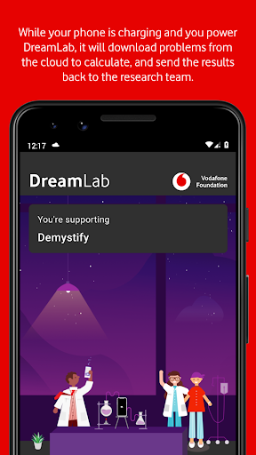
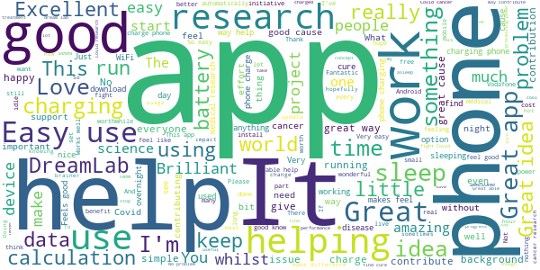
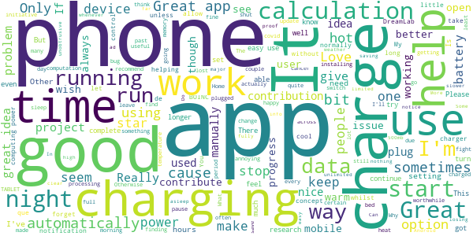
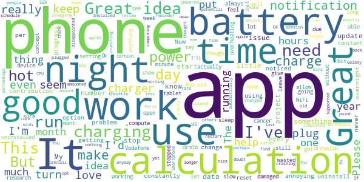
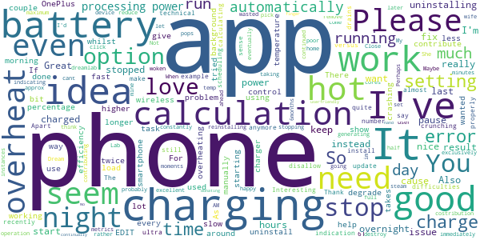
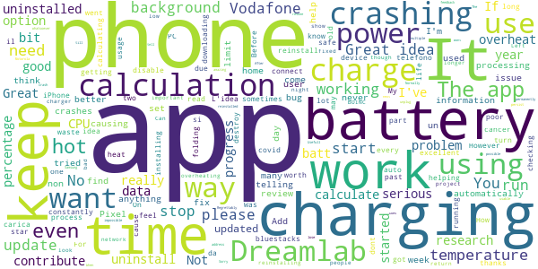

# DreamLab
App version ``3.1.75.2270``

Analyzed with [covid-apps-observer](http://github.com/covid-apps-observer) project, version ``0.1``

## App overview
| | |
|-------------------------|-------------------------| 
| **Name**                                          | DreamLab |
| **Unique identifier** | au.com.vodafone.dreamlabapp |
| **Link to Google Play** | [https://play.google.com/store/apps/details?id=au.com.vodafone.dreamlabapp](https://play.google.com/store/apps/details?id=au.com.vodafone.dreamlabapp) |
| **Summary**  | Use your phone to fast track cancer research, while you sleep. |
| **Privacy policy** | [https://www.vodafone.com.au/about/legal/privacy/dreamlab](https://www.vodafone.com.au/about/legal/privacy/dreamlab) |
| **Latest version** | 3.1.75.2270 |
| **Last update** | 2020-09-09 09:00:01 |
| **Recent changes** | •	We’ve added the functionality to allow for a few seconds of interrupted charging or internet before DreamLab stops processing. •	Localisation for Czech Republic and Democratic Republic of Congo. •	Clearer error messaging. •	Additional minor improvements. |
| **Installs**  | 500,000+ |
| **Category** | Lifestyle |
| **First release** | Oct 7, 2015 |
| **Size**  | 25M |
| **Supported Android version**  | 6.0 and up |

### Description
> ***Temporarily, DreamLab is being used to support research to combat the coronavirus (COVID-19).***
 Imagine if we could speed up time in the fight against cancer.
  
 DreamLab is a multi-award winning app that uses the collective power of smartphones to fast track cancer research. With cancer being one of the biggest causes of premature death worldwide, finding answers through medical research is incredibly important. DreamLab exists to help us get there sooner. And the more people who use the app, the faster it works.
 HOW IT WORKS
 Researchers need supercomputers to scan DNA in immense detail and crunch complex data. When you plug your phone in and power DreamLab, it downloads tiny parts of a huge research project from the cloud to calculate, and sends the results back to the research team. The more people who power DreamLab, the faster we can complete critical research. All you need to do is set up DreamLab once and it will get to work each time you plug your phone in.
 We’ve all been touched by cancer. Our best chance of beating it is by working together. And while sleep has always been good for you – with the DreamLab app, it can be good for others too. 
 Simply download the app (#) and choose which Project you’d like to support. You can also track the Contribution you’ve made and keep up to date with News.
 Dreamlab supports cancer research globally, and is powered by the Vodafone Foundation.
 * A compatible handset is required. Downloading DreamLab will consume data. Once downloaded, DreamLab can be used when your device (i) is connected to a charging source and (ii) has mobile network or WiFi connectivity. Mobile data to use DreamLab is free for Vodafone customers on their local Vodafone network. Roaming incurs international rates.
 # By downloading, installing or otherwise using the DreamLab application on your Device, you agree to be bound by the terms and conditions found at vodafone.com.au/dreamlab. If you do not agree to be bound by these Terms, you should not download, install or otherwise use DreamLab Application.

### User interface
The developers of the app provide the following screenshots in the Google play store.
| | | |
|:-------------------------:|:-------------------------:|:-------------------------:|
 |   |   |   | 
 |   |   |   | 
 |  

## Development team
In the following we report the main information provided by the development team in the Google play store.

| | |
|-------------------------|-------------------------|
| **Developer**  | Vodafone Foundation |
| **Website**  | [http://www.vodafone.com.au/dreamlab](http://www.vodafone.com.au/dreamlab) |
| **Email** | dreamlab@vodafone.com.au |
| **Physical address**  | [Vodafone Foundation, 1 Kingdom Street, London, W2 6BY United Kingdom](https://www.google.com/maps/search/Vodafone%20Foundation,%201%20Kingdom%20Street,%20London,%20W2%206BY%20United%20Kingdom) (Google Maps) |
| **Other developed apps**  | [https://play.google.com/store/apps/developer?id=Vodafone+Foundation](https://play.google.com/store/apps/developer?id=Vodafone+Foundation) |

## Android support

| | |
|-------------------------|-------------------------|
| **Declared target Android version**  | - |
| **Effective target Android version**  | - |
| **Minimum supported Android version**  | Marshmallow, version 6.0 (API level 23) |
| **Maximum target Android version**  | - |

The larger the difference between the minimum and maximum supported Android versions, the better. A larger difference means a wider audience. For example, old phones have a very low Android version, so a high minimum supported Android version means that the app cannot be used by users with old phones, thus leading to accessibility problems. 

## Requested permissions

In the following we report the complete list of the permissions requested by the app. 

| **Permission** | **Protection level** | **Description** | 
|-------------------------|-------------------------|-------------------------|
 **android.permission ACCESS_NETWORK_STATE** | Normal | Allows applications to access information about networks. 
 **android.permission ACCESS_WIFI_STATE** | Normal | Allows applications to access information about Wi-Fi networks. 
 **android.permission BATTERY_STATS** | Signature - privileged - development | Allows an application to collect battery statistics 
 **android.permission FOREGROUND_SERVICE** | Normal | Allows a regular application to use Service.startForeground. 
 **android.permission INTERNET** | Normal | Allows applications to open network sockets. 
 **android.permission RECEIVE_BOOT_COMPLETED** | Normal | Allows an application to receive the Intent.ACTION_BOOT_COMPLETED that is broadcast after the system finishes booting. 
 **android.permission VIBRATE** | Normal | Allows access to the vibrator. 
 **android.permission WAKE_LOCK** | Normal | Allows using PowerManager WakeLocks to keep processor from sleeping or screen from dimming. 
 **com.google.android.c2dm.permission RECEIVE** | - | - 
 **com.google.android.finsky.permission BIND_GET_INSTALL_REFERRER_SERVICE** | - | - 

## Mentioned servers

| **Server** | **Registrant** | **Registrant country** | **Creation date** | 
|-------------------------|-------------------------|-------------------------|-------------------------|
 | googlesyndication.com | Google LLC | :us: US | 2003-01-21 06:17:24 |
 | google.com | Google LLC | :us: US | 1997-09-15 04:00:00 |
 | urbanairship.com | DNStination Inc. | :us: US | 2009-04-14 06:34:46 |
 | asnapieu.com | DNStination Inc. | :us: US | 2019-05-15 21:27:07 |
 | adobedtm.com | Adobe Inc. | :us: US | 2013-11-22 23:15:17 |
 | googleapis.com | Google LLC | :us: US | 2005-01-25 17:52:26 |

## Security analysis 

Below we report the main security warnings raised by our execution of the [Androwarn](https://github.com/maaaaz/androwarn) security analysis tool.

**Telephony identifiers leakage**
> - This application reads the ISO country code equivalent for the SIM provider's country code 
> - This application reads the numeric name (MCC+MNC) of current registered operator 
> - This application reads the operator name 

**Location lookup**
> - This application reads location information from all available providers (WiFi, GPS etc.) 

**Connection interfaces exfiltration**
> - This application reads details about the currently active data network 
> - This application tries to find out if the currently active data network is metered 

**Telephony services abuse**
> - This application makes phone calls 

**Suspicious connection establishment**
> - This application opens a Socket and connects it to the remote address '' on the 'N/A' port  
> - This application opens a Socket and connects it to the remote address 'Ljava/lang/StringBuilder;->toString()Ljava/lang/String;' on the 'N/A' port  
> - This application opens a Socket and connects it to the remote address 'Ljava/net/Proxy;->type()Ljava/net/Proxy$Type;' on the 'N/A' port  
> - This application opens a Socket and connects it to the remote address 'timeout' on the 'N/A' port  

**Pim data leakage**
> - This application accesses data stored in the clipboard 

**Code execution**
> - This application loads a native library: 'native-lib' 

## User ratings and reviews

Below we provide information about how end users are reacting to the app in terms of ratings and reviews in the Google Play store.

### Ratings

The DreamLab app has been installed by more than **500000** times. At this time, **19943** rated the app and its average score is **4.4890547**. Below we show the distribution of the ratings across the usual star-based rating of Google Play

:star::star::star::star::star:: 14993

:star::star::star::star:: 2411

:star::star::star:: 972

:star::star:: 436

:star:: 1131

### Reviews 

#### 5-star reviews

> The app seems to be well designed, I just like the idea that when my phone is charging it computing power is helping cure diseases for free over WiFi.  :date: __2020-11-23 10:10:34__

> No ads, no issues, no impact on my other apps, and doing something good for the world. Love it!  :date: __2020-11-23 09:46:04__

> Brilliant. Could do with an auto run option as I I forget to start it  :date: __2020-11-22 23:39:03__

> It has recently stopped working while my phone is being charged and can't be used when not charging so is stuck in a rut. Still one of the best uses of idle phones I've ever heard of though. Edit: the only project I'm allowed to work on is the Coronavirus one! What a genuinely good use of a million idle devices.  :date: __2020-11-22 03:07:06__

> One night at a time we can help researchers all over the world.  :date: __2020-11-22 02:49:41__

> Excellent work dreamLab. Just wish the app wouldn't need to be manually switched on but did it automatically as its supposed to.  :date: __2020-11-21 09:51:47__

> I think a long as they say what they do here. Its good help no matter how small the contribution. Keep it up guys & girls Cheers J  :date: __2020-11-20 14:48:52__

> Good  :date: __2020-11-20 01:08:03__

> Share your data to help cancer research  :date: __2020-11-19 10:14:17__

> A great way to feel that you are contributing to science  :date: __2020-11-19 01:42:04__

#### 4-star reviews

> Only used it a couple nights now and it's working fine on my Android A71. Suggestions: Some way to send info/ad about it to friends. Also an autostart or at least a reminder to start whenever phone is plugged in or at a set-able time every day.  :date: __2020-11-17 16:08:09__

> UPDATE: Do notice a bit of slowdown if I try streaming or use badly made websites, but nothing major, and you can always pause it if you notice issues. But below still stands. Runs faultlessly on my Xperia. I normally only have it running when I sleep and it doesn't interfere with my sleep tracking.  :date: __2020-11-11 08:08:27__

> It seems to have cleared any bugs. It seizes up in warm weather when the phone is on charge and getting warm, but is a lot better in not so warm weather. And of it helps with the research then it is doing a good job while I am in bed, asleep, at night.  :date: __2020-10-30 08:05:08__

> I can only give 4 stars, because the mobile data is limited to 500mb and it seems that in the past 2 months is using those 500mb in 2 weeks, why not giving the option of more data to any user (i have an unlimited data abb on my mobile carier) so that i don't use the wireless in the house...  :date: __2020-10-25 21:36:47__

> More frequent updates of the progress of the calculations / project progress would be great to see; but it works well, I don't feel that my mobile gets slower or overheated; and it feels good to contribute, it's really easy!  :date: __2020-10-24 01:19:21__

> I'm running this app on a TABLET, please could you try to make this Tablet friendly by allowing Landscape display as well as Portrait mode.  :date: __2020-10-18 21:44:39__

> Good but I had to manually clear the data from the app when it finished a project  :date: __2020-10-10 22:55:46__

> Ja, gør sikkert det den skal og med et minmum af forstyrrelser :-)  :date: __2020-10-04 18:28:07__

> Lovely ui design. Love the app. Reduce memory & storage footprint.RAM consumption seems kinda high. Please make optimisations for 718mb device as well as i keep losing my progress sometimes gets kicked out of memory due to low memory and lost all my calculations. Please try to integrate BOINC projects into it if possible. That would be awesome and all in one app for computational donation/contribution app. Keep up the good work and bless you all that have been involved in this work.  :date: __2020-09-28 18:04:08__

> I would like to contribute even if my device is not charging battery  :date: __2020-09-27 06:25:19__

#### 3-star reviews

> I'm unclear exactly how this thing works, and that concerns me a bit It fires up any time I put my phone on the charger... Day or night I am on my home wifi... I have yet to see if it turns on in the car when I plug the charger in... I never use all my data each month but that doesn't mean I want to risk it while driving I was under the impression the app only runs at night (I am in the US, if that matters)... But there is no way to set a schedule that allows it to run only during certain hours  :date: __2020-11-16 04:59:26__

> Great idea, but I've got a problem after some hours of use, since it starts crashing just after enabling or even just opening it; both on Android 7 and iPadOs 14  :date: __2020-11-15 13:39:57__

> Id like to be able to turn on dreamlab without charging. For example, in my evening routine, b4 I plug my phone. Or when home, walking around with my phone, I'd turn on drmlb. I don't mind if that drains my battery, because I'd be close to a charger anyway. Now it's hard to integrate the task of turning on drmlb into my evening routine since I can only do it when my phone is plugged in. A reminder to turn on dreamlab when plugging in would b helpful as well. Or drmlb would turn on automaticlly?  :date: __2020-10-29 07:51:26__

> Installed without my knowledge. Vodafone is now into bloatware. Regardless of the good intentions and I know that they are good, you should be given the option to opt in. I found out about it when I started getting notifications about an App I knew nothing about  :date: __2020-10-27 19:27:45__

> Simple app. Great idea. Waste of time if you're not even to advertise the thing. This should be am opt out app on every person's phone me. You should be on Facebook hammering this out to everyone. It feels like a box you guys have ticked, so you can talk about it at dinner parties. The potential of this thing could cure some major problems, use it.  :date: __2020-10-24 10:10:48__

> I'm disappointed that I can't contribute more data because I'm with Telstra and not Vodafone. If we can help find a cure for cancer it will help save lives of people will this horrible disease. My 14 year old great nephew died in June from a brain tumour, it only took 10 months from diagnosis to kill him. We need to stop cancer from killing our love ones.  :date: __2020-10-24 07:13:53__

> Problems on Note20 Ultra. Force closing constantly. Had to uninstall after a few days working OK.  :date: __2020-10-20 19:48:38__

> Please allow us to set "unlimited data" for mobile data use. 500MB allowance is reached after one night of calculations on my phone. As well I have experienced crashes after having a large amount of calculations completed causing me to reset the app in order to use it.  :date: __2020-10-20 16:12:41__

> The app desperately needs settings. It has virtually none. It's a great purpose but wasted. I plug my phone in to charge every night and always forget to switch it on. Should be a auto start or scheduled or a reminder when plugging in.  :date: __2020-10-06 17:47:50__

> As others are stating, after a week's worth of use the app just doesn't compute any further, ran for over 8 hours with 0 calculations, which pretty much defies the whole point in the app?! Besides that, the app works fine and looks pretty slick.  :date: __2020-10-06 08:30:05__

#### 2-star reviews

> The idea is nice, but it drains the battery instead of having settings to work only when charging and from some battery percentage. EDIT: You say that it works only when charging, but there is no indication for it. Please update the app to show it. Also please have settings, to disallow it being used when below some percentage (I want it to stop when below 95% for example).  :date: __2020-11-20 09:34:48__

> This app should have an option to work at 50% or even less of the processing power while not charging my phone. It doesn't really make sense when most smartphones have an ultra fast charging and doesn't need to be charged overnight. EDIT: App stopped working and doesn't do any calculations anymore...  :date: __2020-10-31 22:27:03__

> Interesting idea but still having issues with the app crashing.  :date: __2020-10-08 15:54:04__

> I'm having a lot of technical difficulties with this app quite recently. I've had to uninstall the app 4 times, and install again just to get it to work properly. Apart from that, I love this app. Please fix this problem. Thank you.  :date: __2020-10-04 15:11:35__

> Good app, with a nice idea. However, causes my OnePlus 6T to overheat and stops calculating  :date: __2020-09-19 09:37:27__

> Needs a scheduling setting so you can control charging versus number crunching.  :date: __2020-09-01 12:11:38__

> So wanted to like this. I almost exclusively wireless charge. I've had a lot of instances of the app not starting whilst charging and now twice it's continued operation after taking my phone off the charger and I've woken up in the morning to 4% battery.  :date: __2020-08-13 03:14:58__

> App keeps crashing. When starting it, I immediately get an error indicating Dream Lab keeps stopping. If I click Close App a few moments later the error pops up again. I can't seem to remove the error. I've tried uninstalling and reinstalling and it will work for a few days before generating these errors.  :date: __2020-08-05 07:34:45__

> I think im contributing.. metrics are very poor as only shows you last costribution and this is 0 minutes at the time when i pick up the phone  :date: __2020-07-30 10:00:44__

> I would like to contribute, however it constantly causes my phone to overheat (on the wireless charger) which cant be good for the phone. Perhaps let user set the temperature they are happy for the phone to get to rather than the maximum temp.  :date: __2020-07-18 05:29:36__

#### 1-star reviews

> Does not connect when it should - what a waste!  :date: __2020-11-18 22:02:44__

> Normally amazing, but wont work now keeps crashing:/ all it does is crash constantly.  :date: __2020-11-11 05:16:10__

> For over a year I have been using two phones to power Dreamlab. The app is crashing on both phones. The app is updated automatically on Samsung and Motorola phones. No feedback from dreamlab whatsoever. Regrettably, uninstalled on both phones 😭  :date: __2020-11-10 00:30:07__

> Great idea but when the app keeps on crashing and cause problems on multiple phones you lose the will to help and uninstall the app.  :date: __2020-11-09 23:56:45__

> The app keeps crashing. I uninstalled and reinstalled many times. After reinstall it works till the next time I unplug the power. When I resume, it starts crashing. Please address the issue.  :date: __2020-11-09 11:08:31__

> I will uninstall the app. The app crashes permanently. How is it possible that such a bug persist so long ? Usefull. Sorry that when used on a PC (a lot of calculation power !) with bluestacks the app is not usable (telling we have to charge but impossible to tell bluestacks to simulate charging). Should have in dreamlab options a possibility to calculate even when not charging. On my Note 10 + Dreamlab spend most of its time telling me the phone is getting too hot. This is strange because the phone automatically slower itself when it is too hot. I do not think Dreamlab has to stop calculations to make it cooler. Add an option to disable temperature checking and charge checking and to calculate only10 mn after charge is 100% (because I do not want to add charge and calculation heats).  :date: __2020-11-04 00:50:51__

> App not working  :date: __2020-11-01 09:18:31__

> L'idea è fantastica ma ci sono evidenti problemi di ottimizzazione. L'app parte in background come dovrebbe nel momento in cui si carica il telefono ma questo subisce un notevole rallentamento tanto da risultare spesso inutilizzabile. Possiedo un s8 e si surriscalda velocemente e intensamente come mai con nessun'altra app e mi è capitato addirittura che in una notte intera sotto carica la mattina lo trovassi non carico al 100%. Da ottimizzare, l'idea è carina ma non deve danneggiare il telefono  :date: __2020-10-28 09:10:52__

> App keeps stopping. Please update and resolve as I dont want to remove the app.  :date: __2020-10-27 13:15:53__

> No technical assistance  :date: __2020-09-29 04:40:30__

