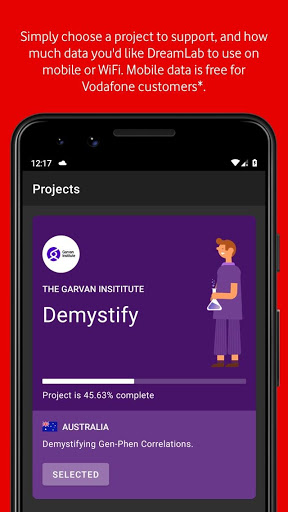
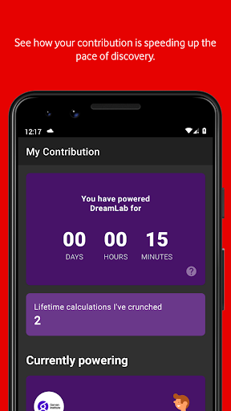

# DreamLab
App version ``3.2.0.2641``

Analyzed with [covid-apps-observer](http://github.com/covid-apps-observer) project, version ``0.1``

## App overview
| | |
|-------------------------|-------------------------| 
| **Name**&nbsp;&nbsp;&nbsp;&nbsp;&nbsp;&nbsp;&nbsp;&nbsp;&nbsp;&nbsp;&nbsp;&nbsp;&nbsp;&nbsp;&nbsp;&nbsp;&nbsp;&nbsp;&nbsp;&nbsp;&nbsp;&nbsp;&nbsp;&nbsp;&nbsp;&nbsp;&nbsp;&nbsp;&nbsp;&nbsp;&nbsp;&nbsp;&nbsp;&nbsp;&nbsp;&nbsp;&nbsp;&nbsp;&nbsp;&nbsp;  | DreamLab |
| **Unique identifier** | au.com.vodafone.dreamlabapp |
| **Link to Google Play** | [https://play.google.com/store/apps/details?id=au.com.vodafone.dreamlabapp](https://play.google.com/store/apps/details?id=au.com.vodafone.dreamlabapp) |
| **Summary**  | Use your phone to fast track cancer research, while you sleep. |
| **Privacy policy** | [https://www.vodafone.com.au/about/legal/privacy/dreamlab](https://www.vodafone.com.au/about/legal/privacy/dreamlab) |
| **Latest version** | 3.2.0.2641 |
| **Last update** | 2020-11-24 06:51:52 |
| **Recent changes** | We’ve added new statistics to the app so that users can better understand project progress and how their contribution is making a difference. We’ve also added ‘1 GB’ as the largest mobile data option and made some performance improvements. |
| **Installs**  | 500,000+ |
| **Category** | Lifestyle |
| **First release** | Oct 7, 2015 |
| **Size**  | 25M |
| **Supported Android version**  | 6.0 and up |

### Description
> ***Temporarily, DreamLab is being used to support research to combat the coronavirus (COVID-19).***
 Imagine if we could speed up time in the fight against cancer.
  
 DreamLab is a multi-award winning app that uses the collective power of smartphones to fast track cancer research. With cancer being one of the biggest causes of premature death worldwide, finding answers through medical research is incredibly important. DreamLab exists to help us get there sooner. And the more people who use the app, the faster it works.
 HOW IT WORKS
 Researchers need supercomputers to scan DNA in immense detail and crunch complex data. When you plug your phone in and power DreamLab, it downloads tiny parts of a huge research project from the cloud to calculate, and sends the results back to the research team. The more people who power DreamLab, the faster we can complete critical research. All you need to do is set up DreamLab once and it will get to work each time you plug your phone in.
 We’ve all been touched by cancer. Our best chance of beating it is by working together. And while sleep has always been good for you – with the DreamLab app, it can be good for others too. 
 Simply download the app (#) and choose which Project you’d like to support. You can also track the Contribution you’ve made and keep up to date with News.
 Dreamlab supports cancer research globally, and is powered by the Vodafone Foundation.
 * A compatible handset is required. Downloading DreamLab will consume data. Once downloaded, DreamLab can be used when your device (i) is connected to a charging source and (ii) has mobile network or WiFi connectivity. Mobile data to use DreamLab is free for Vodafone customers on their local Vodafone network. Roaming incurs international rates.
 # By downloading, installing or otherwise using the DreamLab application on your Device, you agree to be bound by the terms and conditions found at vodafone.com.au/dreamlab. If you do not agree to be bound by these Terms, you should not download, install or otherwise use DreamLab Application.

### User interface
The developers of the app provide the following screenshots in the Google play store.
| | | |
|:-------------------------:|:-------------------------:|:-------------------------:|
 |   |   |   | 
 |   |   |   | 
 |  

## Development team
In the following we report the main information provided by the development team in the Google play store.

| | |
|-------------------------|-------------------------|
| **Developer**  | Vodafone Foundation |
| **Website**  | [http://www.vodafone.com.au/dreamlab](http://www.vodafone.com.au/dreamlab) |
| **Email** | dreamlab@vodafone.com.au |
| **Physical address**  | [Vodafone Foundation, 1 Kingdom Street, London, W2 6BY United Kingdom](https://www.google.com/maps/search/Vodafone%20Foundation,%201%20Kingdom%20Street,%20London,%20W2%206BY%20United%20Kingdom) (Google Maps) |
| **Other developed apps**  | [https://play.google.com/store/apps/developer?id=Vodafone+Foundation](https://play.google.com/store/apps/developer?id=Vodafone+Foundation) |

## Android support

| | |
|-------------------------|-------------------------|
| **Declared target Android version**  | - |
| **Effective target Android version**  | - |
| **Minimum supported Android version**  | Marshmallow, version 6.0 (API level 23) |
| **Maximum target Android version**  | - |

The larger the difference between the minimum and maximum supported Android versions, the better. A larger difference means a wider audience. For example, old phones have a very low Android version, so a high minimum supported Android version means that the app cannot be used by users with old phones, thus leading to accessibility problems. 

## Requested permissions

In the following we report the complete list of the permissions requested by the app. 

| **Permission** | **Protection level** | **Description** | 
|-------------------------|-------------------------|-------------------------|
 **android.permission ACCESS_NETWORK_STATE** | Normal | Allows applications to access information about networks. 
 **android.permission ACCESS_WIFI_STATE** | Normal | Allows applications to access information about Wi-Fi networks. 
 **android.permission BATTERY_STATS** | Signature - privileged - development | Allows an application to collect battery statistics 
 **android.permission FOREGROUND_SERVICE** | Normal | Allows a regular application to use Service.startForeground. 
 **android.permission INTERNET** | Normal | Allows applications to open network sockets. 
 **android.permission RECEIVE_BOOT_COMPLETED** | Normal | Allows an application to receive the Intent.ACTION_BOOT_COMPLETED that is broadcast after the system finishes booting. 
 **android.permission VIBRATE** | Normal | Allows access to the vibrator. 
 **android.permission WAKE_LOCK** | Normal | Allows using PowerManager WakeLocks to keep processor from sleeping or screen from dimming. 
 **com.google.android.c2dm.permission RECEIVE** | - | - 
 **com.google.android.finsky.permission BIND_GET_INSTALL_REFERRER_SERVICE** | - | - 

## Mentioned servers

| **Server** | **Registrant** | **Registrant country** | **Creation date** | 
|-------------------------|-------------------------|-------------------------|-------------------------|
 | googlesyndication.com | Google LLC | :us: US | 2003-01-21 06:17:24 |
 | google.com | Google LLC | :us: US | 1997-09-15 04:00:00 |
 | urbanairship.com | DNStination Inc. | :us: US | 2009-04-14 06:34:46 |
 | asnapieu.com | DNStination Inc. | :us: US | 2019-05-15 21:27:07 |
 | adobedtm.com | Adobe Inc. | :us: US | 2013-11-22 23:15:17 |
 | googleapis.com | Google LLC | :us: US | 2005-01-25 17:52:26 |

## Security analysis 

Below we report the main security warnings raised by our execution of the [Androwarn](https://github.com/maaaaz/androwarn) security analysis tool.

**Telephony identifiers leakage**
> - This application reads the ISO country code equivalent for the SIM provider's country code 
> - This application reads the numeric name (MCC+MNC) of current registered operator 
> - This application reads the operator name 

**Location lookup**
> - This application reads location information from all available providers (WiFi, GPS etc.) 

**Connection interfaces exfiltration**
> - This application reads details about the currently active data network 
> - This application tries to find out if the currently active data network is metered 

**Telephony services abuse**
> - This application makes phone calls 

**Suspicious connection establishment**
> - This application opens a Socket and connects it to the remote address '' on the 'N/A' port  
> - This application opens a Socket and connects it to the remote address 'Ljava/lang/StringBuilder;->toString()Ljava/lang/String;' on the 'N/A' port  
> - This application opens a Socket and connects it to the remote address 'Ljava/net/Proxy;->type()Ljava/net/Proxy$Type;' on the 'N/A' port  
> - This application opens a Socket and connects it to the remote address 'timeout' on the 'N/A' port  

**Pim data leakage**
> - This application accesses data stored in the clipboard 

**Code execution**
> - This application loads a native library: 'native-lib' 

## User ratings and reviews

Below we provide information about how end users are reacting to the app in terms of ratings and reviews in the Google Play store.

### Ratings

The DreamLab app has been installed by more than **500000** times. At this time, **20245** rated the app and its average score is **4.4850416**. Below we show the distribution of the ratings across the usual star-based rating of Google Play

:star::star::star::star::star:: 15411

:star::star::star::star:: 2204

:star::star::star:: 913

:star::star:: 476

:star:: 1241

### Reviews 

#### 5-star reviews

> Easy to use and helping worth while cause and cost very little..T  :date: __2020-12-13 16:49:29__

> Really help to humans  :date: __2020-12-13 14:50:55__

> Easy to use and it's a great way to help.  :date: __2020-12-13 14:32:21__

> Brilliant!  :date: __2020-12-13 11:07:01__

> Just a simple app to use yet potential to help so many people  :date: __2020-12-13 09:42:09__

> Great app for a great cause. My one request would be to have profiles - I have three devices running this (two of them full-time) and would love to see my combined effort between them all. Beyond that I recommend this app 100%.  :date: __2020-12-13 00:44:00__

> Helps support vital research, just runs in background when charging. Brilliant idea, brilliantly simple.  :date: __2020-12-12 15:25:15__

> Works well and it is nice to know I am helping but it should be advertised more widely.  :date: __2020-12-12 11:24:06__

> Brilliant Useful App  :date: __2020-12-12 09:51:01__

> Works well in the background when plugged in without having an impact on my usage  :date: __2020-12-12 08:00:52__

#### 4-star reviews

> Great app but would be better still if it had a setting to allow sessions to start automatically as soon as the phone's charger is plugged in  :date: __2020-12-13 10:34:34__

> Sounds great, but a pity its instructions default to the language of my location or network provider, in my case Italy, without the option of changing the language in settings.  :date: __2020-12-13 06:04:08__

> I am fascinated by distributed computing projects (ever since Folding@Home), and this is a very worthwhile one with good credentials. I took a star off because overnight it has repeatedly shut down because the phone (a Pixel 3A) is overheating. But otherwise, it's good to be able to help a bit. Thank you.  :date: __2020-12-11 00:29:10__

> Great app. Could do with more settings though, timer and landscape mode for tablet use.  :date: __2020-12-06 23:24:32__

> I would like to see a manual throttling option to help prevent the phone getting warm rather than decide for itself But this app should come with every phone. Simple to use, extremely worthwhile, and unobtrusive.  :date: __2020-12-05 10:58:23__

> It is an interesting project. One improvement suggestion: more settings, specifically to be able to set times when it's allowed to run (e.g. overnight only). It is good that it only runs when plugged in (though that could also be a setting), but when it runs it does take quite a bit of processing power, and the phone runs warm - I would like it to only turn on when I'm genuinely not using the phone.  :date: __2020-12-04 17:13:15__

> Any chance you can make your application compatible with Android TV and also the new Google TV with Chromecast? I certainly don't mind donating CPU time of my Google TV with Chromecast. It's left powered up 24/7/365. J just ask thaat if you do, that your app operates at the lowest priority to all other processes in the Google TV dongle.  :date: __2020-12-04 12:07:38__

> A great way to donate to important scientific research without costing you extra money.  :date: __2020-12-01 22:19:48__

> Its convenient & a great idea. It may be a bit too powerfull for my moto g3 as it has had to take time out to cool down. Raises the thought about damage, but I will continue.  :date: __2020-12-01 11:11:51__

> App has stopped working since latest update. Just sits at zero all the time whether I'm on Wi-Fi or mobile data. Please fix it.  :date: __2020-11-28 00:59:02__

#### 3-star reviews

> I'd like to use this on my phone but it eats power faster than the wireless charger can charge it. The phone charges up to 80%, the app starts calculating, next thing I know despite the phone still being on the charger the battery has 70% in it and still falling. The app needs to check the charge level when it is running and avoid allowing the phone to be depleted if the phone is using more power than it is getting from the charger.  :date: __2020-12-13 17:38:48__

> It is a worthwhile app, however I find if it stops due to battery temp, it doesn't automatically restart, which is not so good as I find I may only gain 15 or 20 mins running each night..  :date: __2020-12-10 00:04:38__

> I am on Vodafone with unlimited Max, or whatever it is called.. Around 4 months ago, the app, or Vodafone seem to have applied a 500mg per month limit to the data usage, consequently, after the first week of the month, this app remains idle! Vodafone weren't much help, other than confirming the 500mg cap exists. Not happy.  :date: __2020-12-06 14:25:48__

> Great idea, however it caused my Galaxy Note 10+ 5g to overheat.  :date: __2020-12-05 21:57:34__

> Great idea, but I tend to wirelessly charge my phone. This doesn't provide enough power to run the app and charge, so my phone runs out of battery while on the charger. It would be great if the app could tell the difference between wired and wireless charging.  :date: __2020-12-04 18:36:49__

> It seems like a great idea. However, I have an issue where the app appears to not be working when I move to another app or turn the screen off (the contribution amount does not increase) but is shown as running on my task manager. The app also continues to run even when the phone is unplugged. It might be that its not compatible with my Vivo x50.  :date: __2020-12-04 15:06:23__

> Most of the time I put my phone on charge, the app doesn't work it just crash by itself  :date: __2020-12-02 09:09:06__

> This is a great app, if you're like me and have unlimited data then you can leave overnight to charge and contribute. The only issue I have with this is like many users, there isn't enough advertisement surrounding this so it remains fairly unknown. If this was standard throughout all Vodafone devices and required users to Opt out, then I feel there would be more of a buzz surrounding this.  :date: __2020-11-26 09:59:39__

> I'm unclear exactly how this thing works, and that concerns me a bit It fires up any time I put my phone on the charger... Day or night I am on my home wifi... I have yet to see if it turns on in the car when I plug the charger in... I never use all my data each month but that doesn't mean I want to risk it while driving I was under the impression the app only runs at night (I am in the US, if that matters)... But there is no way to set a schedule that allows it to run only during certain hours  :date: __2020-11-16 04:59:26__

> Great idea, but I've got a problem after some hours of use, since it starts crashing just after enabling or even just opening it; both on Android 7 and iPadOs 14  :date: __2020-11-15 13:39:57__

#### 2-star reviews

> Multitasking not working well. All optimizers are off, all launch options are set, but it not runs itself. But somehow it is working when runned manualy  :date: __2020-12-13 11:47:55__

> Uninstalled. Great idea, but too power intensive. Left the phone on charge over night and the battery only gained 2%.  :date: __2020-12-09 10:34:19__

> Nice concept like SETI@Home but T+C are suspect. They say accuracy of data sent by vodaphone isn't guaranteed. Yes this is probably template language but it says what it says. No point in burning power on inaccurate info for calculations. Also couldn't find info on project vetting, how do I know I'm not doing someone's Bitcoin mining? Will reinstall when T+C specific to project is available and vetting info publicised  :date: __2020-12-04 23:43:14__

> Insgesamt natürlich eine wichtige und wertvolle Idee, die App an sich hat aber noch Luft nach oben. Vorschläge: 1. Eine Option die Berechnungen erst ab einem gewissen Ladestand des Akkus zu starten. 2. Ein besseres Tracking der eigenen Beiträge, evtl. userbasiert und mit Highscore Listen (wie z.B. bei Folding) über mehrere Geräte hinweg, das motiviert zusätzlich. 3. Aktuell kaum nutzbar wenn man sein Smartphone per Schnellladefunktion lädt, weil es zu heiß wird. Hier muss nachgebessert werden.  :date: __2020-12-01 14:52:04__

> Is there a way to set a timer so it will download between certain times for example to only work at night time? There are certain times during the day where I want to charge my phone and without telling me it will run in the background which slows the charging process. Gets annoying when I realise it's been running in the background and when I want to turn it off I can't because it needs to 'take a break' to cool down which I am unable to stop the process until it starts again. Pixel 4 XL  :date: __2020-11-30 15:08:41__

> Worked for about 3 days. After that, the app keeps crashing. Reinstall helped just for the first use. Now keeps crashing down again. Pity  :date: __2020-11-25 23:12:55__

> Having to uninstall as phone runs way too hot when this is running  :date: __2020-11-24 12:29:49__

> The idea is nice, but it drains the battery instead of having settings to work only when charging and from some battery percentage. EDIT: You say that it works only when charging, but there is no indication for it. Please update the app to show it. Also please have settings, to disallow it being used when below some percentage (I want it to stop when below 95% for example).  :date: __2020-11-20 09:34:48__

> This app should have an option to work at 50% or even less of the processing power while not charging my phone. It doesn't really make sense when most smartphones have an ultra fast charging and doesn't need to be charged overnight. EDIT: App stopped working and doesn't do any calculations anymore...  :date: __2020-10-31 22:27:03__

> Interesting idea but still having issues with the app crashing.  :date: __2020-10-08 15:54:04__

#### 1-star reviews

> Haven't a clue what is it  :date: __2020-12-07 18:42:59__

> I'm sorry. I wanted to help. But my phone won't charge. It drains faster than it charging. After 1 hour it got from 86% to 80% while plugged in. It's a Samsung S7 with a fast charger. You might want to look into this.  :date: __2020-12-05 14:13:42__

> This app used to work perfectly but now refuses to work at all. It just claims that I've reached my data limit for the month despite the fact that I'm using WiFi. I have tried deleting it and reinstalling it several times but it still doesn't work.  :date: __2020-12-04 20:21:34__

> Used to be great but now everytime I charge my phone the app crashes  :date: __2020-11-27 00:32:30__

> I used to love this app but something in the most recent updates has been causing the phone's temp to rise and it keeps having to take a break. It never used to do that and it's to the point where the phone is hot to touch when it runs and this is when there are no other apps running in the background.  :date: __2020-11-26 23:09:32__

> Worked well for the first day, then crashed constantly every night/ charge following. Made the phone almost impossible to use prior to uninstalling due to all the crashes occurring.  :date: __2020-11-26 16:07:07__

> Idea itself is worthwhile, however after a few days the app will stop working or crash when you plug in the power. No support, no replies to messages. Constantly requires uninstalling and install if you want to continue supporting the projects, however your history/contributions are erased.  :date: __2020-11-23 23:10:19__

> Does not automatically start when power plugged in. Missed out on months of potential calculations.  :date: __2020-11-23 21:31:21__

> Does not connect when it should - what a waste!  :date: __2020-11-18 22:02:44__

> Normally amazing, but wont work now keeps crashing:/ all it does is crash constantly.  :date: __2020-11-11 05:16:10__

