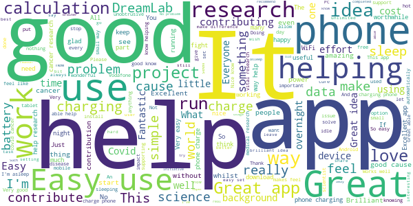

# DreamLab
App version ``3.2.0.2641``

Analyzed with [covid-apps-observer](http://github.com/covid-apps-observer) project, version ``0.1``

## App overview
| | |
|-------------------------|-------------------------| 
| **Name**                                          | DreamLab |
| **Unique identifier** | au.com.vodafone.dreamlabapp |
| **Link to Google Play** | [https://play.google.com/store/apps/details?id=au.com.vodafone.dreamlabapp](https://play.google.com/store/apps/details?id=au.com.vodafone.dreamlabapp) |
| **Summary**  | Use your phone to fast track cancer research, while you sleep. |
| **Privacy policy** | [https://www.vodafone.com.au/about/legal/privacy/dreamlab](https://www.vodafone.com.au/about/legal/privacy/dreamlab) |
| **Latest version** | 3.2.0.2641 |
| **Last update** | 2020-11-24 06:51:52 |
| **Recent changes** | We’ve added new statistics to the app so that users can better understand project progress and how their contribution is making a difference. We’ve also added ‘1 GB’ as the largest mobile data option and made some performance improvements. |
| **Installs**  | 500,000+ |
| **Category** | Lifestyle |
| **First release** | Oct 7, 2015 |
| **Size**  | 25M |
| **Supported Android version**  | 6.0 and up |

### Description
> ***Temporarily, DreamLab is being used to support research to combat the coronavirus (COVID-19).***
 Imagine if we could speed up time in the fight against cancer.
  
 DreamLab is a multi-award winning app that uses the collective power of smartphones to fast track cancer research. With cancer being one of the biggest causes of premature death worldwide, finding answers through medical research is incredibly important. DreamLab exists to help us get there sooner. And the more people who use the app, the faster it works.
 HOW IT WORKS
 Researchers need supercomputers to scan DNA in immense detail and crunch complex data. When you plug your phone in and power DreamLab, it downloads tiny parts of a huge research project from the cloud to calculate, and sends the results back to the research team. The more people who power DreamLab, the faster we can complete critical research. All you need to do is set up DreamLab once and it will get to work each time you plug your phone in.
 We’ve all been touched by cancer. Our best chance of beating it is by working together. And while sleep has always been good for you – with the DreamLab app, it can be good for others too. 
 Simply download the app (#) and choose which Project you’d like to support. You can also track the Contribution you’ve made and keep up to date with News.
 Dreamlab supports cancer research globally, and is powered by the Vodafone Foundation.
 * A compatible handset is required. Downloading DreamLab will consume data. Once downloaded, DreamLab can be used when your device (i) is connected to a charging source and (ii) has mobile network or WiFi connectivity. Mobile data to use DreamLab is free for Vodafone customers on their local Vodafone network. Roaming incurs international rates.
 # By downloading, installing or otherwise using the DreamLab application on your Device, you agree to be bound by the terms and conditions found at vodafone.com.au/dreamlab. If you do not agree to be bound by these Terms, you should not download, install or otherwise use DreamLab Application.

### User interface
The developers of the app provide the following screenshots in the Google play store.
| | | |
|:-------------------------:|:-------------------------:|:-------------------------:|
 |   |   |   | 
 |   |   |   | 
 |  

## Development team
In the following we report the main information provided by the development team in the Google play store.

| | |
|-------------------------|-------------------------|
| **Developer**  | Vodafone Foundation |
| **Website**  | [http://www.vodafone.com.au/dreamlab](http://www.vodafone.com.au/dreamlab) |
| **Email** | dreamlab@vodafone.com.au |
| **Physical address**  | [Vodafone Foundation, 1 Kingdom Street, London, W2 6BY United Kingdom](https://www.google.com/maps/search/Vodafone%20Foundation,%201%20Kingdom%20Street,%20London,%20W2%206BY%20United%20Kingdom) (Google Maps) |
| **Other developed apps**  | [https://play.google.com/store/apps/developer?id=Vodafone+Foundation](https://play.google.com/store/apps/developer?id=Vodafone+Foundation) |

## Android support

| | |
|-------------------------|-------------------------|
| **Declared target Android version**  | - |
| **Effective target Android version**  | - |
| **Minimum supported Android version**  | Marshmallow, version 6.0 (API level 23) |
| **Maximum target Android version**  | - |

The larger the difference between the minimum and maximum supported Android versions, the better. A larger difference means a wider audience. For example, old phones have a very low Android version, so a high minimum supported Android version means that the app cannot be used by users with old phones, thus leading to accessibility problems. 

## Requested permissions

In the following we report the complete list of the permissions requested by the app. 

| **Permission** | **Protection level** | **Description** | 
|-------------------------|-------------------------|-------------------------|
 **android.permission ACCESS_NETWORK_STATE** | Normal | Allows applications to access information about networks. 
 **android.permission ACCESS_WIFI_STATE** | Normal | Allows applications to access information about Wi-Fi networks. 
 **android.permission BATTERY_STATS** | Signature - privileged - development | Allows an application to collect battery statistics 
 **android.permission FOREGROUND_SERVICE** | Normal | Allows a regular application to use Service.startForeground. 
 **android.permission INTERNET** | Normal | Allows applications to open network sockets. 
 **android.permission RECEIVE_BOOT_COMPLETED** | Normal | Allows an application to receive the Intent.ACTION_BOOT_COMPLETED that is broadcast after the system finishes booting. 
 **android.permission VIBRATE** | Normal | Allows access to the vibrator. 
 **android.permission WAKE_LOCK** | Normal | Allows using PowerManager WakeLocks to keep processor from sleeping or screen from dimming. 
 **com.google.android.c2dm.permission RECEIVE** | - | - 
 **com.google.android.finsky.permission BIND_GET_INSTALL_REFERRER_SERVICE** | - | - 

## Mentioned servers

| **Server** | **Registrant** | **Registrant country** | **Creation date** | 
|-------------------------|-------------------------|-------------------------|-------------------------|
 | googlesyndication.com | Google LLC | :us: US | 2003-01-21 06:17:24 |
 | google.com | Google LLC | :us: US | 1997-09-15 04:00:00 |
 | urbanairship.com | DNStination Inc. | :us: US | 2009-04-14 06:34:46 |
 | asnapieu.com | DNStination Inc. | :us: US | 2019-05-15 21:27:07 |
 | adobedtm.com | Adobe Inc. | :us: US | 2013-11-22 23:15:17 |
 | googleapis.com | Google LLC | :us: US | 2005-01-25 17:52:26 |

## Security analysis 

Below we report the main security warnings raised by our execution of the [Androwarn](https://github.com/maaaaz/androwarn) security analysis tool.

**Telephony identifiers leakage**
> - This application reads the ISO country code equivalent for the SIM provider's country code 
> - This application reads the numeric name (MCC+MNC) of current registered operator 
> - This application reads the operator name 

**Location lookup**
> - This application reads location information from all available providers (WiFi, GPS etc.) 

**Connection interfaces exfiltration**
> - This application reads details about the currently active data network 
> - This application tries to find out if the currently active data network is metered 

**Telephony services abuse**
> - This application makes phone calls 

**Suspicious connection establishment**
> - This application opens a Socket and connects it to the remote address '' on the 'N/A' port  
> - This application opens a Socket and connects it to the remote address 'Ljava/lang/StringBuilder;->toString()Ljava/lang/String;' on the 'N/A' port  
> - This application opens a Socket and connects it to the remote address 'Ljava/net/Proxy;->type()Ljava/net/Proxy$Type;' on the 'N/A' port  
> - This application opens a Socket and connects it to the remote address 'timeout' on the 'N/A' port  

**Pim data leakage**
> - This application accesses data stored in the clipboard 

**Code execution**
> - This application loads a native library: 'native-lib' 

## User ratings and reviews

Below we provide information about how end users are reacting to the app in terms of ratings and reviews in the Google Play store.

### Ratings

The DreamLab app has been installed by more than **500000** times. At this time, **20245** rated the app and its average score is **4.4850416**. Below we show the distribution of the ratings across the usual star-based rating of Google Play

:star::star::star::star::star:: 15411

:star::star::star::star:: 2204

:star::star::star:: 913

:star::star:: 476

:star:: 1241

### Reviews 

#### 5-star reviews

> It's nice to be able to help research without having to lift a finger!  :date: __2021-06-06 07:31:11__

> This is an excellent app. It works while the phone is charging. It is good to know that this app is helping to save lives.  :date: __2021-06-05 10:35:18__

> Easy & worthwhile!  :date: __2021-06-04 21:01:20__

> Please try to include these features for people who have devices that are in no use (at least for now). - Include an option to run it without thermal throttling. - Include an option to run it without charging. - Include an option where we can use 100% of CPU or GPU if it uses it (if this is really possible and/or if it only uses small amount of CPU/GPU). I have an old device that can have a use with this app.  :date: __2021-06-04 11:58:41__

> Excellent app, makes you feel like you are doing your bit to help, but with no hassle, simply put your device on charge the app does the rest, good to go to bed knowing in some way I am helping with research, on a device which would otherwise be dormant.  :date: __2021-06-03 07:53:50__

> Also. I run the app on an old phone that i charge continuously. It has used less than 25 cents of electricity over many months and has done 300,000 calculations using wifi without mobile data. Great concept to do useful calculations at negible cost or effort on tbe part of the phone owner.  :date: __2021-06-01 11:24:35__

> Use this app to help science while you sleep. This app is good, clean, easy to use and doesn't interrupt my phone usage but let's me do a little bit to help someone while I sleep. It has that "feel good about yourself" factor.  :date: __2021-06-01 08:23:15__

> If it helps, why not  :date: __2021-05-27 09:29:19__

> Thanks for paying it forward !!!  :date: __2021-05-26 06:25:37__

> Cool idea, so easy to use  :date: __2021-05-24 05:43:37__

#### 4-star reviews

> It's good to put idle resources to use. Id like the stats updated more frequently  :date: __2021-06-06 00:07:35__

> It's not too clear whether it's actually running in the background or not.  :date: __2021-06-04 16:03:53__

> This is working on a Chromebook. There should be some kind of setting to reduce performance when the device gets too hot.  :date: __2021-05-24 04:28:34__

> Sometimes the number of calculations is zero. Uninstalling and reinstalling usually works. Otherwise worthwhile app.  :date: __2021-05-20 10:08:34__

> Sometimes, the news doesn't update unless I uninstall Dreamlab and then reinstall Dreamlab. After reinstalling Dreamlab, I see the news updated. I did it before but as of right now, the most recent Dreamlab app news was on 15 December 2020.  :date: __2021-05-14 07:53:33__

> WARNING: You would have to literally drain your phone's battery down to 0 percent, if running DreamLab continuously for awhile makes the phone start going into the Usage-Optimisation ('Go Straight to Gaol') mode.  :date: __2021-05-10 06:48:02__

> Nice to be able to make a difference  :date: __2021-04-19 21:42:48__

> A great opportunity to contribute.  :date: __2021-04-19 00:09:11__

> Fantastic idea and use of spare computing capacity, for great causes. Much needed! Minus 1 star, because the app keeps changing from Corona Phase 3 to Demystify. It should continue with my chosen project every time I plug in!  :date: __2021-04-15 03:45:17__

> I have used this for a while now. Curently supporting Imperial College it runs for over a hour but complets 0 calculations.  :date: __2021-04-08 17:14:29__

#### 3-star reviews

> The idea is great, but the app could be better: it should automatically start every time the supply is pugged in, instead with my xiaomi I have to manually start the computation every time...  :date: __2021-05-22 20:36:56__

> Seems to resort back to the covid 2 project but hasnt completed any calcs in the last few months (Amazon Fire left on charge). Selection of other projects seems to get overwritten. Uninstalled, sorry.  :date: __2021-05-18 19:46:21__

> Great app & concept. Recently doesn't seem to work. Can run all night and not do a single calculation. Has been that way for a couple months now.  :date: __2021-05-14 09:26:55__

> It's a fantastic concept. But for all the hours I ran the app I got 3 calculations done in 20 hours I think. I don't feel I'm contributing, more than I'm just destroying the life of my phone.  :date: __2021-05-11 01:05:22__

> Not sure, but i think these apps will kill your battery over time .  :date: __2021-05-01 21:44:25__

> My covid-19 calculations keep stopping. No idea why. Also the calculations are taking longer and longer, sometimes over 2 hours.  :date: __2021-04-27 18:02:04__

> Been supporting the Covid-ai project for some time. No one explains how many stages are planned and stage 3 had those awkward 1 hr long calculations. No wonder Stage 4 only has 6.02% and 29k+ users, across 16 days. If there's even a Stage 5, don't expect much participance.  :date: __2021-04-16 17:28:48__

> Getting worse. Great premise, but the app is unreliable. Being greeted by a notification saying " well done you powered this for 7 and a half hours and completed zero calculations" makes you wonder what the point is. It used to be much more reliable.  :date: __2021-04-06 11:56:46__

> A really good app, shame it doesn't run all the time, using less power and slower processing when not in charge. Not keeping track of overall progress on Samsung S10. I have to clear everything to see how much progress has been made. Reported a while ago but still not fixed  :date: __2021-04-03 07:55:06__

> Em L. Ioukk ka. Kaivva ae tae, kkmL  :date: __2021-03-31 14:09:42__

#### 2-star reviews

> The app increase the heat on the device!!  :date: __2021-06-04 00:29:33__

> Won't stay working on Android 11  :date: __2021-05-25 13:42:18__

> Reset my phone and 29k solved gone. This app needs an account you can log into so you can store your progress at least.  :date: __2021-05-20 05:47:23__

> I think it's a good app and I have supported it for 3-4 years but I was disappointed when I changed my phone twice now and just recently and I lost all the calculations I contributed all over this time AGAIN and they were not forwarded onto my new phone which had the same number which amounted to thousands! This is most annoying and as Dreamlab are obviously NOT concerned and are not gratefull so I am now abandoning your projects. Goodbye.  :date: __2021-05-17 07:54:54__

> It's a shame that a lot of bothersome issues are still present after such a long time. Suggestions: 1. Better tracking of contributions, possibly user-based and with highscore lists (compare Folding) across multiple devices, which motivates additionally. 2. The app is still hardly usable on some devices. LG G8S gets so hot after a few seconds that most mornings show me not a single completed calculation. Just give us an opportunity to run the calculations at 50% of CPU power to avoid this.  :date: __2021-05-10 11:19:23__

> Keeps stopping. I use a wireless charger which still seems to work but in the morning the app is closed. Over 2 days I've contributed less than 2 hours.  :date: __2021-04-20 08:29:26__

> Was great, now causing issues. Now causing my phone to overheat and not charge above 86%  :date: __2021-03-30 08:52:27__

> I was so excited to contribute to a worthy cause, but it makes my phone unusable when charging. It just needs to have some more settings.  :date: __2021-03-07 18:17:45__

> App doesn't start up when plugged in, even on manual start, just keeps saying data will restart the following month, even though setting is for wifi.  :date: __2021-03-03 02:00:52__

> What's the reason for rarely updating users on progress % of research project? It's really irritating to dedicate hours of your devices power for weeks and still not see the percentage budge.  :date: __2021-02-28 08:51:42__

#### 1-star reviews

> Useless as the app stops working for no good reason. It now does appear to work. But for some reason Dreamlab restricts data download to 1gb per month. Many have Unlimited data plans so why won't Dreamlab facilitate any amount of data a donor wishes to donate?? I could if allowed donate 1000gb per month on my mobile tariff. Instead it gets to mid-month and my data donation is blocked because I have used 1gb!! It costs Dreamlab nothing to receive any amount of data from individual donors  :date: __2021-05-26 08:18:07__

> The App came pre installed. It's supposedly using my phone to tackle Covid whilst on charge. It seemed petty to uninstall. I was not aware that the App served any other function. I don't appreciate the little 'Well done' messages. They come over as being a bit patronising, considering that I am not actually doing anything. My self esteem isn't that low, yet 😄  :date: __2021-05-17 09:19:17__

> I installed and ran DreamLab with my phone a Moto G6, running Android 9, switched on and charging. Doing this caused my phone's battery to overheat, expand and force the back off of the phone. Was I supposed to switch the phone off and leave the app running in the background, or unplug the phone and leave it switched on?  :date: __2021-05-17 00:15:47__

> Infringement.  :date: __2021-04-28 17:54:55__

> Very annoying and intrussive, unwanted marketing headache for those of us who don't want to be looking dozens of times to the same undesired advertisement.  :date: __2021-04-12 23:22:33__

> App need update. It is not working well. Users posted many good ideas. Unfortunately no reaction from devs  :date: __2021-04-11 18:03:08__

> It causes my phone to dangerously overheat  :date: __2021-03-30 22:36:39__

> Earlier it took about 7 minutes to complete a calc. But now even after 40 minutes 0 calculations are done. When I keave the phone for overnight calculations it only did 5 calculations in 8 hours. Is it the calculations are getting complex or there is something wrong with the app  :date: __2021-03-22 18:10:14__

> Great idea, app badly done. We do free work for the company, but the app isn't FOSS. There is no option to disable dreamlab, sometimes I just want to charge my phone and not run the app. It frequently gets stuck on 1 job and doesn't do anything all night. Finally it needs a way to disable Amber alerts so I can sleep and run dreamlab without being awoken by gov.  :date: __2021-03-21 04:16:27__

> Used it for a few years. Was a good app. Then for 2 months in a row it claimed I'd used all my data allocation on the first day. Uninstalled and reinstalled and was considered a new user.  :date: __2021-03-05 12:20:49__

