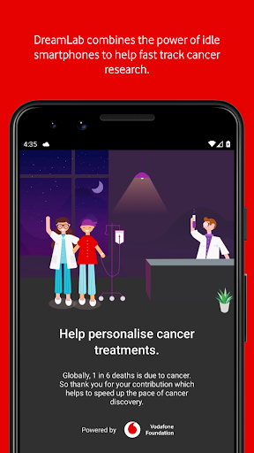

# DreamLab
App version ``3.2.0.2641``

Analyzed with [covid-apps-observer](http://github.com/covid-apps-observer) project, version ``0.1``

## App overview
| | |
|-------------------------|-------------------------| 
| **Name**                                          | DreamLab |
| **Unique identifier** | au.com.vodafone.dreamlabapp |
| **Link to Google Play** | [https://play.google.com/store/apps/details?id=au.com.vodafone.dreamlabapp](https://play.google.com/store/apps/details?id=au.com.vodafone.dreamlabapp) |
| **Summary**  | Use your phone to fast track cancer research, while you sleep. |
| **Privacy policy** | [https://www.vodafone.com.au/about/legal/privacy/dreamlab](https://www.vodafone.com.au/about/legal/privacy/dreamlab) |
| **Latest version** | 3.2.0.2641 |
| **Last update** | 2020-11-24 06:51:52 |
| **Recent changes** | We’ve added new statistics to the app so that users can better understand project progress and how their contribution is making a difference. We’ve also added ‘1 GB’ as the largest mobile data option and made some performance improvements. |
| **Installs**  | 500,000+ |
| **Category** | Lifestyle |
| **First release** | Oct 7, 2015 |
| **Size**  | 25M |
| **Supported Android version**  | 6.0 and up |

### Description
> ***Temporarily, DreamLab is being used to support research to combat the coronavirus (COVID-19).***
 Imagine if we could speed up time in the fight against cancer.
  
 DreamLab is a multi-award winning app that uses the collective power of smartphones to fast track cancer research. With cancer being one of the biggest causes of premature death worldwide, finding answers through medical research is incredibly important. DreamLab exists to help us get there sooner. And the more people who use the app, the faster it works.
 HOW IT WORKS
 Researchers need supercomputers to scan DNA in immense detail and crunch complex data. When you plug your phone in and power DreamLab, it downloads tiny parts of a huge research project from the cloud to calculate, and sends the results back to the research team. The more people who power DreamLab, the faster we can complete critical research. All you need to do is set up DreamLab once and it will get to work each time you plug your phone in.
 We’ve all been touched by cancer. Our best chance of beating it is by working together. And while sleep has always been good for you – with the DreamLab app, it can be good for others too. 
 Simply download the app (#) and choose which Project you’d like to support. You can also track the Contribution you’ve made and keep up to date with News.
 Dreamlab supports cancer research globally, and is powered by the Vodafone Foundation.
 * A compatible handset is required. Downloading DreamLab will consume data. Once downloaded, DreamLab can be used when your device (i) is connected to a charging source and (ii) has mobile network or WiFi connectivity. Mobile data to use DreamLab is free for Vodafone customers on their local Vodafone network. Roaming incurs international rates.
 # By downloading, installing or otherwise using the DreamLab application on your Device, you agree to be bound by the terms and conditions found at vodafone.com.au/dreamlab. If you do not agree to be bound by these Terms, you should not download, install or otherwise use DreamLab Application.

### User interface
The developers of the app provide the following screenshots in the Google play store.
| | | |
|:-------------------------:|:-------------------------:|:-------------------------:|
 |   |   |   | 
 |   |   |   | 
 |  

## Development team
In the following we report the main information provided by the development team in the Google play store.

| | |
|-------------------------|-------------------------|
| **Developer**  | Vodafone Foundation |
| **Website**  | [http://www.vodafone.com.au/dreamlab](http://www.vodafone.com.au/dreamlab) |
| **Email** | dreamlab@vodafone.com.au |
| **Physical address**  | [Vodafone Foundation, 1 Kingdom Street, London, W2 6BY United Kingdom](https://www.google.com/maps/search/Vodafone%20Foundation,%201%20Kingdom%20Street,%20London,%20W2%206BY%20United%20Kingdom) (Google Maps) |
| **Other developed apps**  | [https://play.google.com/store/apps/developer?id=Vodafone+Foundation](https://play.google.com/store/apps/developer?id=Vodafone+Foundation) |

## Android support

| | |
|-------------------------|-------------------------|
| **Declared target Android version**  | - |
| **Effective target Android version**  | - |
| **Minimum supported Android version**  | Marshmallow, version 6.0 (API level 23) |
| **Maximum target Android version**  | - |

The larger the difference between the minimum and maximum supported Android versions, the better. A larger difference means a wider audience. For example, old phones have a very low Android version, so a high minimum supported Android version means that the app cannot be used by users with old phones, thus leading to accessibility problems. 

## Requested permissions

In the following we report the complete list of the permissions requested by the app. 

| **Permission** | **Protection level** | **Description** | 
|-------------------------|-------------------------|-------------------------|
 **android.permission ACCESS_NETWORK_STATE** | Normal | Allows applications to access information about networks. 
 **android.permission ACCESS_WIFI_STATE** | Normal | Allows applications to access information about Wi-Fi networks. 
 **android.permission BATTERY_STATS** | Signature - privileged - development | Allows an application to collect battery statistics 
 **android.permission FOREGROUND_SERVICE** | Normal | Allows a regular application to use Service.startForeground. 
 **android.permission INTERNET** | Normal | Allows applications to open network sockets. 
 **android.permission RECEIVE_BOOT_COMPLETED** | Normal | Allows an application to receive the Intent.ACTION_BOOT_COMPLETED that is broadcast after the system finishes booting. 
 **android.permission VIBRATE** | Normal | Allows access to the vibrator. 
 **android.permission WAKE_LOCK** | Normal | Allows using PowerManager WakeLocks to keep processor from sleeping or screen from dimming. 
 **com.google.android.c2dm.permission RECEIVE** | - | - 
 **com.google.android.finsky.permission BIND_GET_INSTALL_REFERRER_SERVICE** | - | - 

## Mentioned servers

| **Server** | **Registrant** | **Registrant country** | **Creation date** | 
|-------------------------|-------------------------|-------------------------|-------------------------|
 | googlesyndication.com | Google LLC | :us: US | 2003-01-21 06:17:24 |
 | google.com | Google LLC | :us: US | 1997-09-15 04:00:00 |
 | urbanairship.com | DNStination Inc. | :us: US | 2009-04-14 06:34:46 |
 | asnapieu.com | DNStination Inc. | :us: US | 2019-05-15 21:27:07 |
 | adobedtm.com | Adobe Inc. | :us: US | 2013-11-22 23:15:17 |
 | googleapis.com | Google LLC | :us: US | 2005-01-25 17:52:26 |

## Security analysis 

Below we report the main security warnings raised by our execution of the [Androwarn](https://github.com/maaaaz/androwarn) security analysis tool.

**Telephony identifiers leakage**
> - This application reads the ISO country code equivalent for the SIM provider's country code 
> - This application reads the numeric name (MCC+MNC) of current registered operator 
> - This application reads the operator name 

**Location lookup**
> - This application reads location information from all available providers (WiFi, GPS etc.) 

**Connection interfaces exfiltration**
> - This application reads details about the currently active data network 
> - This application tries to find out if the currently active data network is metered 

**Telephony services abuse**
> - This application makes phone calls 

**Suspicious connection establishment**
> - This application opens a Socket and connects it to the remote address '' on the 'N/A' port  
> - This application opens a Socket and connects it to the remote address 'Ljava/lang/StringBuilder;->toString()Ljava/lang/String;' on the 'N/A' port  
> - This application opens a Socket and connects it to the remote address 'Ljava/net/Proxy;->type()Ljava/net/Proxy$Type;' on the 'N/A' port  
> - This application opens a Socket and connects it to the remote address 'timeout' on the 'N/A' port  

**Pim data leakage**
> - This application accesses data stored in the clipboard 

**Code execution**
> - This application loads a native library: 'native-lib' 

## User ratings and reviews

Below we provide information about how end users are reacting to the app in terms of ratings and reviews in the Google Play store.

### Ratings

The DreamLab app has been installed by more than **500000** times. At this time, **20245** rated the app and its average score is **4.4850416**. Below we show the distribution of the ratings across the usual star-based rating of Google Play

:star::star::star::star::star:: 15411

:star::star::star::star:: 2204

:star::star::star:: 913

:star::star:: 476

:star:: 1241

### Reviews 

#### 5-star reviews

> Very Good. What more can one say!  :date: __2021-07-14 09:23:01__

> Number crunching for good causes whilst you sleep is great karma. Just be warned that all that processing does mean your battery won't charge as quick or even at all if using a low power charger.  :date: __2021-07-14 08:24:40__

> Great app, there's just one problem I have to mention; on the Galaxy S20 when 120hz is enabled and a project is being powered, the app seems to force 60hz while my phone is plugged in, which is a little irritating. Would appreciate a fix.  :date: __2021-07-14 03:22:04__

> Unobtrusive. Does good.  :date: __2021-07-13 22:13:47__

> Awesome app, doesn't kill battery life as I expected it would. Only suggested improvement would be to allow exporting stats to gridcoin  :date: __2021-07-09 11:18:10__

> If it helps - do it!  :date: __2021-07-08 12:55:26__

> Amazing  :date: __2021-07-07 22:09:26__

> So easy to use.  :date: __2021-07-04 23:16:36__

> Seamless operation  :date: __2021-07-04 12:58:11__

> Love the idea of helping with research while I sleep, feels like I'm part of a big team all working together!  :date: __2021-07-04 01:31:54__

#### 4-star reviews

> Edit: since a past update, it doesn't always turn itself on when charging at 80%+. Easy to turn on manually *if* you notice. Original: Had it running fine on Android 6 & 7. Unfortunately had to change both phone and tablet! It's running equally well on 8.1 & 9. Currently using it for Covid project but will swap when it's over. If anyone used SETI@home, or uses BOINC on their PCs, it's exactly the same principle. If it stalls it's probably due to overheating so turn off & it'll be okay.  :date: __2021-07-19 14:03:37__

> Not 100% sure how the app actually works but I use it most days while charging my phone  :date: __2021-07-15 05:10:44__

> Its working fine on my Android A71. Suggestions: Some way to send info/ad about it to friends. Also an autostart or at least a reminder to start whenever phone is plugged in or at a set-able time every day.  :date: __2021-07-10 22:43:47__

> I've used this app for a long time now and was happy to do so but in the last month or so it randomly switches my selected contributions from cancer to Corona. It hadn't finished the phase it was working on, it just switches. I feel quite strongly about this so if it happens again it's getting uninstalled. Otherwise, the app and idea are 5 star. Vodafone and Dreamlab didn't reply to my concerns when I reached out via Twitter.  :date: __2021-07-08 13:40:21__

> Positive  :date: __2021-06-25 23:48:05__

> Easy to use and good it's good to help  :date: __2021-06-10 11:39:23__

> It's good to put idle resources to use. Id like the stats updated more frequently  :date: __2021-06-06 00:07:35__

> It's not too clear whether it's actually running in the background or not.  :date: __2021-06-04 16:03:53__

> This is working on a Chromebook. There should be some kind of setting to reduce performance when the device gets too hot.  :date: __2021-05-24 04:28:34__

> Sometimes the number of calculations is zero. Uninstalling and reinstalling usually works. Otherwise worthwhile app.  :date: __2021-05-20 10:08:34__

#### 3-star reviews

> Thought I was doing a good thing, but it keeps defaulting back to tracking Corona and not the Cancer research that I want! Deleted it.  :date: __2021-06-28 17:19:01__

> spectacular to be able to make a real contribution. If only the Damm app would STOP changing what I'm contributing too. I made my decision but apparently the app knows better.....  :date: __2021-06-25 22:49:37__

> The idea is great, but the app could be better: it should automatically start every time the supply is pugged in, instead with my xiaomi I have to manually start the computation every time...  :date: __2021-05-22 20:36:56__

> Seems to resort back to the covid 2 project but hasnt completed any calcs in the last few months (Amazon Fire left on charge). Selection of other projects seems to get overwritten. Uninstalled, sorry.  :date: __2021-05-18 19:46:21__

> Great app & concept. Recently doesn't seem to work. Can run all night and not do a single calculation. Has been that way for a couple months now.  :date: __2021-05-14 09:26:55__

> It's a fantastic concept. But for all the hours I ran the app I got 3 calculations done in 20 hours I think. I don't feel I'm contributing, more than I'm just destroying the life of my phone.  :date: __2021-05-11 01:05:22__

> Not sure, but i think these apps will kill your battery over time .  :date: __2021-05-01 21:44:25__

> Been supporting the Covid-ai project for some time. No one explains how many stages are planned and stage 3 had those awkward 1 hr long calculations. No wonder Stage 4 only has 6.02% and 29k+ users, across 16 days. If there's even a Stage 5, don't expect much participance.  :date: __2021-04-16 17:28:48__

> Getting worse. Great premise, but the app is unreliable. Being greeted by a notification saying " well done you powered this for 7 and a half hours and completed zero calculations" makes you wonder what the point is. It used to be much more reliable.  :date: __2021-04-06 11:56:46__

> A really good app, shame it doesn't run all the time, using less power and slower processing when not in charge. Not keeping track of overall progress on Samsung S10. I have to clear everything to see how much progress has been made. Reported a while ago but still not fixed  :date: __2021-04-03 07:55:06__

#### 2-star reviews

> Seems to spawn multiple copies of itself and kicks off even when the battery is still low, so phone gets hot and fails to charge properly. There seems to be no way to set a minimum battery level for it to start.  :date: __2021-07-12 00:14:28__

> This is a very good idea but is buggy and crashes all over. Please fix it  :date: __2021-07-05 20:40:59__

> It's a shame that a lot of bothersome issues are still present after such a long time. Suggestions: 1. Better tracking of contributions, possibly user-based and with highscore lists (compare Folding) across multiple devices, which motivates additionally. 2. The app is still hardly usable on some devices. LG G8S gets so hot after a few seconds that most mornings show me not a single completed calculation. Just give us an opportunity to run the calculations at 50% of CPU power to avoid this.  :date: __2021-06-24 10:21:54__

> I've been using this app for a while but recently it has been overheating my Nokia 5.3 too much to the point the battery is draining and I've woken up a few times to a phone that has turned itself off! This has now been uninstalled.  :date: __2021-06-08 04:34:42__

> The app increase the heat on the device!!  :date: __2021-06-04 00:29:33__

> Won't stay working on Android 11  :date: __2021-05-25 13:42:18__

> Reset my phone and 29k solved gone. This app needs an account you can log into so you can store your progress at least.  :date: __2021-05-20 05:47:23__

> I think it's a good app and I have supported it for 3-4 years but I was disappointed when I changed my phone twice now and just recently and I lost all the calculations I contributed all over this time AGAIN and they were not forwarded onto my new phone which had the same number which amounted to thousands! This is most annoying and as Dreamlab are obviously NOT concerned and are not gratefull so I am now abandoning your projects. Goodbye.  :date: __2021-05-17 07:54:54__

> Keeps stopping. I use a wireless charger which still seems to work but in the morning the app is closed. Over 2 days I've contributed less than 2 hours.  :date: __2021-04-20 08:29:26__

> Was great, now causing issues. Now causing my phone to overheat and not charge above 86%  :date: __2021-03-30 08:52:27__

#### 1-star reviews

> I've just lost mum to cancer , this App is brilliant. Using your data while you're sleeping. It's a WAY better contribution to search than hearts on a page. I'm actually doing something. Plug in charge and start the App, do it. 💗 Please stop hijacking my dream lab project. When I want to support corona virus research, I'll do it. I should be able to choose who I want to support and when.  :date: __2021-07-15 11:02:56__

> Revises to one star because the app is automatically changed twice the project I want to support. It chose Corona-AI (Phase 4) instead Cancer Research (Phase 2). Also no news in the news section for the last 6 months so for me app looks abandoned  :date: __2021-07-08 00:22:15__

> Sadly it now jumps from project to project and no longer makes any calculations.  :date: __2021-07-06 19:19:36__

> Revised down to one star. App constantly switches to Corona AI (Phase4) rather than the project I wanted to support (Cancer Phase 2). Have raised with DreamLab & Vodafone support. Additionally, Cancer Research (Phase 2) Project is now getting further from completion every day - now showing 18 days to completion. I've lost confidence in what was originally a great idea. 30/06/2021 - Cancer Research (Phase 2) is now showing 35 days until completion.  :date: __2021-06-30 06:27:53__

> 1* for ethics recently. EVERY time a new release comes, and a new Covid project is added, my choice to support a cancer project is overridden. The time in my phone is changed to what the developers want without even the courtesy of a notification. If you do not wish us to have a choice of projects be honest and don't offer it in the first place. You do a disservice to the projects you divert us away from and mislead people not carefully watching where their donation is sent. Disgraceful.  :date: __2021-06-25 00:09:29__

> Useless as the app stops working for no good reason. It now does appear to work. But for some reason Dreamlab restricts data download to 1gb per month. Many have Unlimited data plans so why won't Dreamlab facilitate any amount of data a donor wishes to donate?? I could if allowed donate 1000gb per month on my mobile tariff. Instead it gets to mid-month and my data donation is blocked because I have used 1gb!! It costs Dreamlab nothing to receive any amount of data from individual donors  :date: __2021-05-26 08:18:07__

> The App came pre installed. It's supposedly using my phone to tackle Covid whilst on charge. It seemed petty to uninstall. I was not aware that the App served any other function. I don't appreciate the little 'Well done' messages. They come over as being a bit patronising, considering that I am not actually doing anything. My self esteem isn't that low, yet 😄  :date: __2021-05-17 09:19:17__

> I installed and ran DreamLab with my phone a Moto G6, running Android 9, switched on and charging. Doing this caused my phone's battery to overheat, expand and force the back off of the phone. Was I supposed to switch the phone off and leave the app running in the background, or unplug the phone and leave it switched on?  :date: __2021-05-17 00:15:47__

> Infringement.  :date: __2021-04-28 17:54:55__

> Very annoying and intrussive, unwanted marketing headache for those of us who don't want to be looking dozens of times to the same undesired advertisement.  :date: __2021-04-12 23:22:33__

