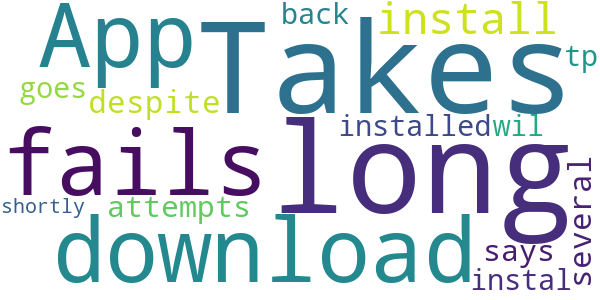

# Check In CBR
App version ``1.3.2``

Analyzed with [covid-apps-observer](http://github.com/covid-apps-observer) project, version ``0.1``

## App overview
| | |
|-------------------------|-------------------------| 
| **Name**&nbsp;&nbsp;&nbsp;&nbsp;&nbsp;&nbsp;&nbsp;&nbsp;&nbsp;&nbsp;&nbsp;&nbsp;&nbsp;&nbsp;&nbsp;&nbsp;&nbsp;&nbsp;&nbsp;&nbsp;&nbsp;&nbsp;&nbsp;&nbsp;&nbsp;&nbsp;&nbsp;&nbsp;&nbsp;&nbsp;&nbsp;&nbsp;&nbsp;&nbsp;&nbsp;&nbsp;&nbsp;&nbsp;&nbsp;&nbsp;  | Check In CBR |
| **Unique identifier** | au.gov.act.health.checkin |
| **Link to Google Play** | [https://play.google.com/store/apps/details?id=au.gov.act.health.checkin](https://play.google.com/store/apps/details?id=au.gov.act.health.checkin) |
| **Summary**  | Fast, secure check in to Canberra businesses to support COVID-19 contact tracing |
| **Privacy policy** | [https://www.health.act.gov.au/privacy](https://www.health.act.gov.au/privacy) |
| **Latest version** | 1.3.2 |
| **Last update** | 2020-10-20 08:10:59 |
| **Recent changes** | Improvements, bug fixes. - Quick selection of recent guests on check-in - Open app when scanning QR code outside the app |
| **Installs**  | 10,000+ |
| **Category** | Health & Fitness |
| **First release** | Aug 31, 2020 |
| **Size**  | 54M |
| **Supported Android version**  | 5.0 and up |

### Description
> Quickly and securely check in to a Canberra business to support COVID-19 contact tracing. Simply scan the QR code displayed at the business, and you're done! 
 Your personal details are saved securely with ACT Health for the sole purpose of contact tracing.

### User interface
The developers of the app provide the following screenshots in the Google play store.
| | | |
|:-------------------------:|:-------------------------:|:-------------------------:|
 |   |   |   | 
 |  

## Development team
In the following we report the main information provided by the development team in the Google play store.

| | |
|-------------------------|-------------------------|
| **Developer**  | ACT Health |
| **Website**  | [https://covid19.act.gov.au/business-and-work/check-in-cbr](https://covid19.act.gov.au/business-and-work/check-in-cbr) |
| **Email** | Digital.Support@act.gov.au |
| **Physical address**  | - |
| **Other developed apps**  | [https://play.google.com/store/apps/developer?id=ACT+Health](https://play.google.com/store/apps/developer?id=ACT+Health) |

## Android support

| | |
|-------------------------|-------------------------|
| **Declared target Android version**  | Android10, version 10 (API level 29) |
| **Effective target Android version**  | Android10, version 10 (API level 29) |
| **Minimum supported Android version**  | Lollipop, version 5.0 (API level 21) |
| **Maximum target Android version**  | - |

The larger the difference between the minimum and maximum supported Android versions, the better. A larger difference means a wider audience. For example, old phones have a very low Android version, so a high minimum supported Android version means that the app cannot be used by users with old phones, thus leading to accessibility problems. 

## Requested permissions

In the following we report the complete list of the permissions requested by the app. 

| **Permission** | **Protection level** | **Description** | 
|-------------------------|-------------------------|-------------------------|
 **android.permission ACCESS_BACKGROUND_LOCATION** | :warning:**Dangerous** | Allows an app to access location in the background. 
 **android.permission ACCESS_NETWORK_STATE** | Normal | Allows applications to access information about networks. 
 **android.permission ACCESS_WIFI_STATE** | Normal | Allows applications to access information about Wi-Fi networks. 
 **android.permission CAMERA** | :warning:**Dangerous** | Required to be able to access the camera device. 
 **android.permission FOREGROUND_SERVICE** | Normal | Allows a regular application to use Service.startForeground. 
 **android.permission INTERNET** | Normal | Allows applications to open network sockets. 
 **android.permission MODIFY_AUDIO_SETTINGS** | Normal | Allows an application to modify global audio settings. 
 **android.permission READ_APP_BADGE** | - | - 
 **android.permission RECEIVE_BOOT_COMPLETED** | Normal | Allows an application to receive the Intent.ACTION_BOOT_COMPLETED that is broadcast after the system finishes booting. 
 **android.permission REQUEST_INSTALL_PACKAGES** | Signature | Allows an application to request installing packages. 
 **android.permission STORAGE** | - | - 
 **android.permission SYSTEM_ALERT_WINDOW** | Signature - preinstalled - appop - pre23 - development | Allows an app to create windows using the type WindowManager.LayoutParams.TYPE_APPLICATION_OVERLAY, shown on top of all other apps. 
 **android.permission USE_BIOMETRIC** | Normal | Allows an app to use device supported biometric modalities. 
 **android.permission WAKE_LOCK** | Normal | Allows using PowerManager WakeLocks to keep processor from sleeping or screen from dimming. 
 **au.gov.act.health.checkin.permission C2D_MESSAGE** | - | - 
 **com.google.android.c2dm.permission RECEIVE** | - | - 
 **com.google.android.finsky.permission BIND_GET_INSTALL_REFERRER_SERVICE** | - | - 
 **com.huawei.android.launcher.permission CHANGE_BADGE** | - | - 
 **com.huawei.android.launcher.permission READ_SETTINGS** | - | - 
 **com.huawei.android.launcher.permission WRITE_SETTINGS** | - | - 
 **com.oppo.launcher.permission READ_SETTINGS** | - | - 
 **com.oppo.launcher.permission WRITE_SETTINGS** | - | - 
 **com.sonymobile.home.permission PROVIDER_INSERT_BADGE** | - | - 
 **host.exp.exponent.permission C2D_MESSAGE** | - | - 
 **me.everything.badger.permission BADGE_COUNT_READ** | - | - 
 **me.everything.badger.permission BADGE_COUNT_WRITE** | - | - 

## Mentioned servers

| **Server** | **Registrant** | **Registrant country** | **Creation date** | 
|-------------------------|-------------------------|-------------------------|-------------------------|
 | amplitude.com | Amplitude | :us: US | 1996-05-09 04:00:00 |
 | facebook.com | Facebook, Inc. | :us: US | 1997-03-29 05:00:00 |
 | google.com | Google LLC | :us: US | 1997-09-15 04:00:00 |
 | android.com | Google LLC | :us: US | 1997-06-23 04:00:00 |
 | googlesyndication.com | Google LLC | :us: US | 2003-01-21 06:17:24 |
 | googleapis.com | Google LLC | :us: US | 2005-01-25 17:52:26 |
 | w3.org | W3C | :us: US | 1994-07-06 04:00:00 |
 | doubleclick.net | Google Inc. | :us: US | 1996-01-16 05:00:00 |
 | gstatic.com | Google LLC | :us: US | 2008-02-11 15:31:25 |
 | googleapis.com | Google LLC | :us: US | 2005-01-25 17:52:26 |
 | app-measurement.com | Google LLC | :us: US | 2015-06-19 20:13:31 |
 | google-analytics.com | Google LLC | :us: US | 2005-07-18 19:24:32 |
 | segment.com | Domains By Proxy, LLC | :us: US | 1998-07-06 04:00:00 |
 | segment.io | Segment.io, Inc. | :us: US | 2011-10-01 04:10:05 |
 | expo.io | See PrivacyGuardian.org | :us: US | 2011-05-01 21:26:50 |
 | cloudfront.net | Amazon.com, Inc. | :us: US | 2008-04-25 18:25:49 |
 | cloudfront.net | Amazon.com, Inc. | :us: US | 2008-04-25 18:25:49 |
 | googleadservices.com | Google LLC | :us: US | 2003-06-19 16:34:53 |

## Security analysis 

Below we report the main security warnings raised by our execution of the [Androwarn](https://github.com/maaaaz/androwarn) security analysis tool.

**Telephony identifiers leakage**
> - This application reads the ISO country code equivalent for the SIM provider's country code 
> - This application reads the ISO country code equivalent of the current registered operator's MCC (Mobile Country Code) 
> - This application reads the MCC+MNC of the provider of the SIM 
> - This application reads the Service Provider Name (SPN) 
> - This application reads the constant indicating the state of the device SIM card 
> - This application reads the device phone type value 
> - This application reads the numeric name (MCC+MNC) of current registered operator 
> - This application reads the operator name 
> - This application reads the radio technology (network type) currently in use on the device for data transmission 
> - This application reads the unique device ID, i.e the IMEI for GSM and the MEID or ESN for CDMA phones 

**Location lookup**
> - This application reads location information from all available providers (WiFi, GPS etc.) 

**Connection interfaces exfiltration**
> - This application reads details about the currently active data network 
> - This application tries to find out if the currently active data network is metered 

**Telephony services abuse**
> - This application makes phone calls 

**Audio video eavesdropping**
> - This application records audio from the 'CAMCORDER' source  
> - This application records audio from the 'DEFAULT' source  
> - This application records audio from the 'MIC' source  
> - This application captures video from the 'CAMERA' source 
> - This application captures video from the 'SURFACE' source 

**Suspicious connection establishment**
> - This application opens a Socket and connects it to the remote address '' on the 'N/A' port  
> - This application opens a Socket and connects it to the remote address 'Ljava/lang/StringBuilder;->toString()Ljava/lang/String;' on the ': connect, resolve' port  
> - This application opens a Socket and connects it to the remote address 'Ljava/lang/StringBuilder;->toString()Ljava/lang/String;' on the 'N/A' port  
> - This application opens a Socket and connects it to the remote address 'Ljava/net/Proxy;->type()Ljava/net/Proxy$Type;' on the 'N/A' port  
> - This application opens a Socket and connects it to the remote address 'timeout' on the 'N/A' port  

**Pim data leakage**
> - This application accesses data stored in the clipboard 

**Code execution**
> - This application loads a native library 
> - This application loads a native library: 'Ljava/lang/String;->valueOf(Ljava/lang/Object;)Ljava/lang/String;' 
> - This application executes a UNIX command containing this argument: '2' 

## User ratings and reviews

Below we provide information about how end users are reacting to the app in terms of ratings and reviews in the Google Play store.

### Ratings

The Check In CBR app has been installed by more than **10000** times. At this time, **32** rated the app and its average score is **3.78125**. Below we show the distribution of the ratings across the usual star-based rating of Google Play

:star::star::star::star::star:: 19

:star::star::star::star:: 3

:star::star::star:: 2

:star::star:: 0

:star:: 8

### Reviews 

#### 5-star reviews

> Cool app! I prefer this much more than writing my name down with a pen 50 other people have used that day. Great to see more places in Canberra are using it too.  :date: __2020-12-08 02:50:38__

> Red es DVR DVR you vf you have any other information you can get the best regards  :date: __2020-11-29 09:24:49__

> Used it a few times at the library, worked quickly, easily, and without issue. Wish more places would use this.  :date: __2020-11-10 07:32:34__

> Now that you remember frequent guests (eg, my husband) it takes under 5 seconds to check in. Great job.  :date: __2020-10-29 02:09:59__

> Good job Canberra! This is more in line with the privacy requirements than signing a sheet of paper.  :date: __2020-10-16 02:40:40__

> Works really well, much better than using a google form  :date: __2020-10-06 11:10:27__

> Easy to use but don't just scan QR and expect app to open. The QR does nothing but open a website, thats what they mostly do. Scanning a QR will just take you to website to download. It will not open app. Once I downloaded app and added my details, I clicked check in and then I scanned the QR (after giving app permission) Easy.  :date: __2020-10-05 02:41:02__

> Quick and easy to use, really good!  :date: __2020-09-27 10:53:21__

> Much quicker and easier to use than scanning a QR code to click to load a website and manually entering your details. Better security is a plus too, it'd be hard to tell if random QR code is linking to a legit website or not.  :date: __2020-09-27 06:20:23__

> Good!  :date: __2020-09-18 08:06:04__

#### 4-star reviews

> Its missing a checkout button to end ur visit to a place. It needs a time out to ensure correct contact tracing  :date: __2020-12-09 02:30:00__

> First try today - so very relieved to have no issues at Restaurant. Guess there's no need to checkout on departure?  :date: __2020-12-04 03:55:33__

> Not enough businesses on it. Many still using pen and paper.  :date: __2020-10-17 05:00:51__

> Samsung GS7 will not scan QR code. App has camera permission enabled. Phone will scan QR codes, but not in this app. Fixed! Thanks! App now returns "Not a check in CBR code" on invalid QR scans  :date: __2020-10-02 04:18:26__

#### 3-star reviews

> Takes ages to open the camera scanner function.  :date: __2020-12-09 09:13:41__

> Seems to work ok. Slow to load, requiring data connection to do so. Cannot access QR code scanner without data connection. Suggest allowing access to QR code scanner without needing data connection to allow check in, uploading locations when data becomes available.  :date: __2020-12-05 21:58:59__

> Would be better if you could check in by typing name of check-in place, geolocation, or select from previous check-in history.  :date: __2020-11-15 01:20:33__

> Works for some places, not others, it just says enter manually code  :date: __2020-10-08 23:36:53__

> The App has not changed to daylight savings.  :date: __2020-10-06 01:02:09__

#### 2-star reviews

> Takes to long to download  :date: __2020-12-06 04:07:36__

> App fails to install, despite several attempts...says it is installed but goes back tp wil instal shortly.....  :date: __2020-11-11 09:29:39__

#### 1-star reviews

> Total waste, every other state uses an internet portal rather than wasting money on a useless app  :date: __2021-01-08 03:03:58__

> Went to check in after visiting a store at 10.50am. Scanned went to download app....10 mins later still waiting to download app. Is there an online option. Edit: it took over 4 hours to download. Before suggesting my settings are at fault, I had no problem updating or downloading other apps, just this one  :date: __2021-01-04 21:25:00__

> Three times tried to create an account, but it doesn't go beyond the registration page and the Privacy Notice. Must be a glitch in the app. Pls sort it out.  :date: __2020-12-26 00:29:29__

> Doesn't work. Tried reinstalling twice and still returns error message about no registered business location at every shop I've tried. Worked for others but not me. Manual also doesn't work.  :date: __2020-12-24 03:21:51__

> I was forced to get this app that collects information on you for the gov. F'ing Nanny State.  :date: __2020-12-24 00:53:00__

> First time ever since covid started, I have to download app to register. Everyone is using a simple and reliable web registration. Total waste of our money by ACT government. Poor choice of registering option by Portrait Gallery Cafe. Portrait Gallery itself is nicely using web registration. Not to mention, this slow app is to be uninstalled after that single use. Not good enough, ACT Health.  :date: __2020-12-20 05:53:42__

> Useless did not download in openable format with screen icon and no clear instructions how to do this  :date: __2020-12-17 21:22:12__

> It won't work never get number  :date: __2020-12-05 07:21:05__

> Didn't recognise QR codes at a pub and at the Australian National Museum. Strange as other QR code reader redirected me to this Canberra Check in app anyway. Android / Oppo  :date: __2020-11-25 22:13:55__

> Won't install!! Running a Samsung Note 10 so shouldn't be a compatibility issue!!  :date: __2020-11-14 04:53:26__

