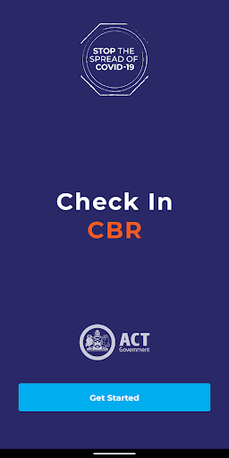
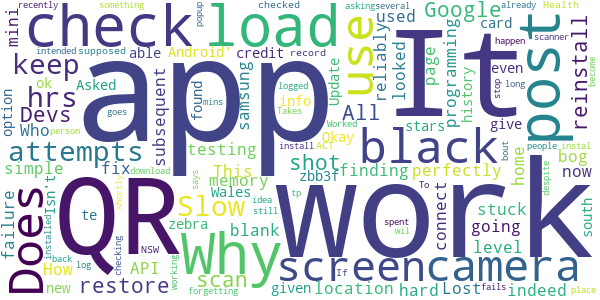
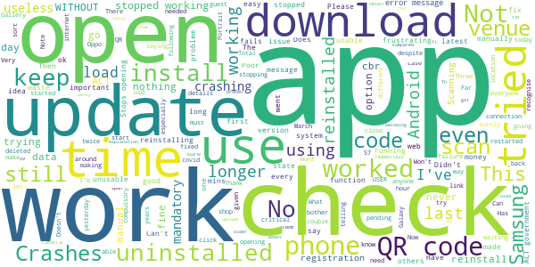

# Check In CBR
App version ``1.8.2``

Analyzed with [covid-apps-observer](http://github.com/covid-apps-observer) project, version ``0.1``

## App overview
| | |
|-------------------------|-------------------------| 
| **Name**&nbsp;&nbsp;&nbsp;&nbsp;&nbsp;&nbsp;&nbsp;&nbsp;&nbsp;&nbsp;&nbsp;&nbsp;&nbsp;&nbsp;&nbsp;&nbsp;&nbsp;&nbsp;&nbsp;&nbsp;&nbsp;&nbsp;&nbsp;&nbsp;&nbsp;&nbsp;&nbsp;&nbsp;&nbsp;&nbsp;&nbsp;&nbsp;&nbsp;&nbsp;&nbsp;&nbsp;&nbsp;&nbsp;&nbsp;&nbsp;  | Check In CBR |
| **Unique identifier** | au.gov.act.health.checkin |
| **Link to Google Play** | [https://play.google.com/store/apps/details?id=au.gov.act.health.checkin](https://play.google.com/store/apps/details?id=au.gov.act.health.checkin) |
| **Summary**  | Fast, secure check in to Canberra businesses to support COVID-19 contact tracing |
| **Privacy policy** | [https://www.health.act.gov.au/privacy](https://www.health.act.gov.au/privacy) |
| **Latest version** | 1.8.2 |
| **Last update** | 2021-02-27 07:45:49 |
| **Recent changes** | Fix app failing to load on Android 8 devices |
| **Installs**  | 100,000+ |
| **Category** | Health & Fitness |
| **First release** | Aug 31, 2020 |
| **Size**  | 32M |
| **Supported Android version**  | 5.0 and up |

### Description
> Quickly and securely check in to a business in Canberra, Australia to support COVID-19 contact tracing. Simply scan the QR code displayed at the business, and you're done! 
 Your personal details are saved securely with ACT Government Health Directorate for the sole purpose of contact tracing.

### User interface
The developers of the app provide the following screenshots in the Google play store.
| | | |
|:-------------------------:|:-------------------------:|:-------------------------:|
 |   |   |   | 
 |  

## Development team
In the following we report the main information provided by the development team in the Google play store.

| | |
|-------------------------|-------------------------|
| **Developer**  | ACT Health |
| **Website**  | [https://covid19.act.gov.au/business-and-work/check-in-cbr](https://covid19.act.gov.au/business-and-work/check-in-cbr) |
| **Email** | Digital.Support@act.gov.au |
| **Physical address**  | - |
| **Other developed apps**  | [https://play.google.com/store/apps/developer?id=ACT+Health](https://play.google.com/store/apps/developer?id=ACT+Health) |

## Android support

| | |
|-------------------------|-------------------------|
| **Declared target Android version**  | Android10, version 10 (API level 29) |
| **Effective target Android version**  | Android10, version 10 (API level 29) |
| **Minimum supported Android version**  | Lollipop, version 5.0 (API level 21) |
| **Maximum target Android version**  | - |

The larger the difference between the minimum and maximum supported Android versions, the better. A larger difference means a wider audience. For example, old phones have a very low Android version, so a high minimum supported Android version means that the app cannot be used by users with old phones, thus leading to accessibility problems. 

## Requested permissions

In the following we report the complete list of the permissions requested by the app. 

| **Permission** | **Protection level** | **Description** | 
|-------------------------|-------------------------|-------------------------|
 **android.permission ACCESS_NETWORK_STATE** | Normal | Allows applications to access information about networks. 
 **android.permission CAMERA** | :warning:**Dangerous** | Required to be able to access the camera device. 
 **android.permission FOREGROUND_SERVICE** | Normal | Allows a regular application to use Service.startForeground. 
 **android.permission INTERNET** | Normal | Allows applications to open network sockets. 
 **android.permission VIBRATE** | Normal | Allows access to the vibrator. 
 **android.permission WAKE_LOCK** | Normal | Allows using PowerManager WakeLocks to keep processor from sleeping or screen from dimming. 
 **com.google.android.finsky.permission BIND_GET_INSTALL_REFERRER_SERVICE** | - | - 

## Mentioned servers

| **Server** | **Registrant** | **Registrant country** | **Creation date** | 
|-------------------------|-------------------------|-------------------------|-------------------------|
 | android.com | Google LLC | :us: US | 1997-06-23 04:00:00 |
 | google.com | Google LLC | :us: US | 1997-09-15 04:00:00 |
 | googleapis.com | Google LLC | :us: US | 2005-01-25 17:52:26 |
 | cloudfront.net | Amazon.com, Inc. | :us: US | 2008-04-25 18:25:49 |

## Security analysis 

Below we report the main security warnings raised by our execution of the [Androwarn](https://github.com/maaaaz/androwarn) security analysis tool.

**Telephony identifiers leakage**
> - This application reads the numeric name (MCC+MNC) of current registered operator 
> - This application reads the operator name 

**Connection interfaces exfiltration**
> - This application reads details about the currently active data network 
> - This application tries to find out if the currently active data network is metered 

**Audio video eavesdropping**
> - This application records audio from the 'CAMCORDER' source  
> - This application records audio from the 'MIC' source  
> - This application captures video from the 'CAMERA' source 
> - This application captures video from the 'SURFACE' source 

**Suspicious connection establishment**
> - This application opens a Socket and connects it to the remote address '' on the 'N/A' port  
> - This application opens a Socket and connects it to the remote address 'Ljava/lang/StringBuilder;->toString()Ljava/lang/String;' on the ': connect, resolve' port  
> - This application opens a Socket and connects it to the remote address 'Ljava/lang/StringBuilder;->toString()Ljava/lang/String;' on the 'N/A' port  
> - This application opens a Socket and connects it to the remote address 'Ljava/net/Proxy;->type()Ljava/net/Proxy$Type;' on the 'N/A' port  
> - This application opens a Socket and connects it to the remote address 'timeout' on the 'N/A' port  

**Pim data leakage**
> - This application accesses data stored in the clipboard 

**Code execution**
> - This application loads a native library 
> - This application loads a native library: 'Ljava/lang/String;->valueOf(Ljava/lang/Object;)Ljava/lang/String;' 
> - This application executes a UNIX command 

## User ratings and reviews

Below we provide information about how end users are reacting to the app in terms of ratings and reviews in the Google Play store.

### Ratings

The Check In CBR app has been installed by more than **100000** times. At this time, **179** rated the app and its average score is **2.1**. Below we show the distribution of the ratings across the usual star-based rating of Google Play

:star::star::star::star::star:: 32

:star::star::star::star:: 10

:star::star::star:: 10

:star::star:: 14

:star:: 113

### Reviews 

#### 5-star reviews

> EDIT: In response to my previous rating developer explained app had stopped working with earlier versions of Android. They have now fixed it and it's working perfectly so I've upgraded to 5 stars. Has stopped working since last update. Have reinstalled but still crashes.  :date: __2021-03-05 03:31:28__

> All fixed now! Make sure you update to allow the app to use the camera. That is what I had to do after reinstalling it.  :date: __2021-03-03 08:05:00__

> Update: app is working since v1.8.2 update. Thanks for the quick fix. Update: Installed v1.8.2 and the app now starts up; I will try to check in tomorrow. Thanks for prompt response. Previous: Unable to start app anymore since updated to version 1.8.1, 25 Feb 2021.  :date: __2021-03-03 03:23:18__

> Seems to work well.  :date: __2021-03-02 11:04:16__

> Yay! You guys fixed the Andoid 8 bug, well done and works again now, brilliant app again.  :date: __2021-03-02 08:46:57__

> App now working again.  :date: __2021-03-01 09:38:09__

> Works for me 👍  :date: __2021-02-28 08:40:06__

> Great idea and was easy to use BUT doesn't work any more on my Samsung after the upgrade on 25th of Feb. A bug must have been introduced.  :date: __2021-02-27 20:21:14__

> Easy to use.  :date: __2021-02-22 08:09:10__

> This app works well. Should be used all across Australia.  :date: __2021-01-24 23:29:37__

#### 4-star reviews

> App worked fine on my Moto G5 Android (8.1.0) until a week or so ago, since when it won't even open. I have just downloaded the latest version - no change. Please fix whatever you did to break it EDIT: following update 1.8.2, the app now opens and functions as before. Thanks for taking action, as the 'solution' provided to many people below was really not acceptable in 2021  :date: __2021-03-03 06:26:53__

> The app wasn't working since the 25 Feb update, but it was fixed this morning (2 March 2021). At least it now works ok for my Samsung Galaxy S7 android phone.  :date: __2021-03-02 12:16:28__

> App working again since update 1/3/2021.  :date: __2021-03-02 02:19:18__

> Great app to use! Only have to enter your details once at setup, unlike interstate arrangements. Just a simple click to check in at arrival, no check out required. Just needs more extensive testing before updates are released.  :date: __2021-03-01 22:40:12__

> Once loaded this app is easy to use, so much easier than NSW or Vic!  :date: __2021-02-26 00:06:07__

> Was easy to install particularly for a tech challenged person. Only issue is that does not allow me to check out unlike the nsw app  :date: __2021-02-12 01:47:53__

> App makes check-in easy and I like how it remembers dependents for easy future check-ins. Would be nice if locations you frequented could be remembered and used in the same way for easy repeat check-ins without needing a code or to huddle around a QR code that someone had posted on the wall.  :date: __2021-01-14 07:37:19__

> Its missing a checkout button to end ur visit to a place. It needs a time out to ensure correct contact tracing  :date: __2020-12-09 02:30:00__

> First try today - so very relieved to have no issues at Restaurant. Guess there's no need to checkout on departure?  :date: __2020-12-04 03:55:33__

> Not enough businesses on it. Many still using pen and paper.  :date: __2020-10-17 05:00:51__

#### 3-star reviews

> What if I do not have internet data? Not everyone has free wifi data which may make the app useless.  :date: __2021-03-04 00:02:46__

> Sometimes app won't open  :date: __2021-02-28 00:56:16__

> The graphics are too dark under some lighting.  :date: __2021-02-08 01:44:49__

> It works for scanning the QR code. But I can offarhim why do I have to reenter all my personal details everytime I use the app for myself on my phone. The nswservices app handles this very well. Please start considering the user when you write mobile apps. Many miss some simple things that would make many people's lives better. I hatdusing this app.  :date: __2021-02-05 20:04:05__

> Takes ages to open the camera scanner function.  :date: __2020-12-09 09:13:41__

> Seems to work ok. Slow to load, requiring data connection to do so. Cannot access QR code scanner without data connection. Suggest allowing access to QR code scanner without needing data connection to allow check in, uploading locations when data becomes available.  :date: __2020-12-05 21:58:59__

> Would be better if you could check in by typing name of check-in place, geolocation, or select from previous check-in history.  :date: __2020-11-15 01:20:33__

> Works for some places, not others, it just says enter manually code  :date: __2020-10-08 23:36:53__

> The App has not changed to daylight savings.  :date: __2020-10-06 01:02:09__

#### 2-star reviews

> Why does this get stuck "finding location" now? It used to work reliably.  :date: __2021-03-06 09:55:15__

> Does not work on samsung J mini. Screen keeps going blank and won't connect to camera.  :date: __2021-03-02 00:32:11__

> Lost this app off my home page - looked at the 'fix failure to load on Android' option but no info given. Okay, now I can't post this at your POST ... Update : found that I had to give stars to be able to post.  :date: __2021-03-01 09:02:45__

> . , zebra V te zbb3f  :date: __2021-02-24 07:23:12__

> Asked me for my credit card why?. Why is not the new south Wales app ok to use.  :date: __2021-02-24 04:22:07__

> Slow to load, my history has no check ins, so does it even work? Isn't it supposed to keep a record of where I have checked in?  :date: __2021-02-23 02:03:11__

> ACT Health, why do you check in but not check out, like the NSW app? If something does happen you have no idea if a person spent 10 mins or 2 hrs at a place. To stop people forgetting to log out, how bout a popup asking if you are still there 2-3 hrs after checking in if not already logged out?  :date: __2021-02-11 22:05:59__

> Worked as intended before, but recently has become very slow to load and the qr scanner is not working  :date: __2021-01-22 22:29:39__

> Takes to long to download  :date: __2020-12-06 04:07:36__

> App fails to install, despite several attempts...says it is installed but goes back tp wil instal shortly.....  :date: __2020-11-11 09:29:39__

#### 1-star reviews

> Doing an upgrade that invalidates all users WITHOUT REPEAT WITHOUT telling anyone is arrogant stupidity from the ACT government. It also shows the contempt that the ACT government has for its citizens. Bringing in $1000 fines right after changing the system is nothing but a money grabbing exercise.  :date: __2021-03-05 09:26:15__

> Cant even install  :date: __2021-03-05 06:31:58__

> Last update has made app unusable. Please fix it asap.  :date: __2021-03-04 09:11:45__

> Unable to install this app-no matter what I try.  :date: __2021-03-03 23:07:17__

> I have a new phone and cannot load this app .  :date: __2021-03-03 12:08:29__

> Doesnt work sometimes  :date: __2021-03-03 01:40:00__

> Stopped working  :date: __2021-03-02 05:34:36__

> Same peoblem on a Galaxy S6. Not everyone can afford to update their phones guys, especially in a pandemic. Please make sure any updates are compatible!  :date: __2021-03-01 22:06:47__

> Apps keeps crashing and unable to start. Reinstalling does not work. Web form back up would be useful in case of the apps crashing all the time like this.  :date: __2021-03-01 20:20:12__

> Nup, still not working on my Samsung 7.... Crashes when you load it.  :date: __2021-03-01 13:54:37__

