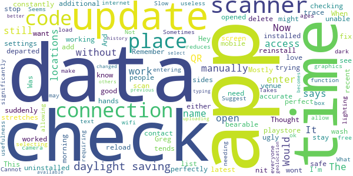
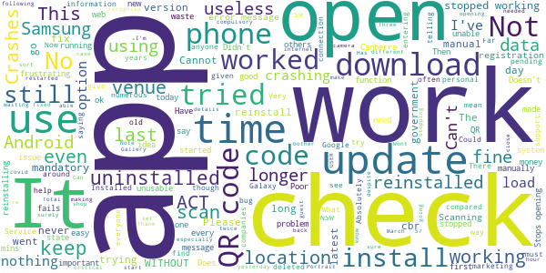

# Check In CBR
App version ``1.9.0``

Analyzed with [covid-apps-observer](http://github.com/covid-apps-observer) project, version ``0.1``

## App overview
| | |
|-------------------------|-------------------------| 
| **Name**&nbsp;&nbsp;&nbsp;&nbsp;&nbsp;&nbsp;&nbsp;&nbsp;&nbsp;&nbsp;&nbsp;&nbsp;&nbsp;&nbsp;&nbsp;&nbsp;&nbsp;&nbsp;&nbsp;&nbsp;&nbsp;&nbsp;&nbsp;&nbsp;&nbsp;&nbsp;&nbsp;&nbsp;&nbsp;&nbsp;&nbsp;&nbsp;&nbsp;&nbsp;&nbsp;&nbsp;&nbsp;&nbsp;&nbsp;&nbsp;  | Check In CBR |
| **Unique identifier** | au.gov.act.health.checkin |
| **Link to Google Play** | [https://play.google.com/store/apps/details?id=au.gov.act.health.checkin](https://play.google.com/store/apps/details?id=au.gov.act.health.checkin) |
| **Summary**  | Fast, secure check in to Canberra businesses to support COVID-19 contact tracing |
| **Privacy policy** | [https://www.covid19.act.gov.au/privacy](https://www.covid19.act.gov.au/privacy) |
| **Latest version** | 1.9.0 |
| **Last update** | 2021-03-22 09:20:49 |
| **Recent changes** | New in this release: - Landscape support on Tablets and Chromebooks - Ability to delete check in history from your device - Improved business profile check-in form - Use Check in CBR to scan &quot;Check In Qld&quot; QR codes whilst travelling in Queensland  Plus bug fixes! |
| **Installs**  | 100,000+ |
| **Category** | Health & Fitness |
| **First release** | Aug 31, 2020 |
| **Size**  | 33M |
| **Supported Android version**  | 5.0 and up |

### Description
> Quickly and securely check in to a business in Canberra, Australia to support COVID-19 contact tracing. Simply scan the QR code displayed at the business, and you're done! 
 Your personal details are saved securely with ACT Government Health Directorate for the sole purpose of contact tracing.

### User interface
The developers of the app provide the following screenshots in the Google play store.
| | | |
|:-------------------------:|:-------------------------:|:-------------------------:|
 |   |   |   | 
 |  

## Development team
In the following we report the main information provided by the development team in the Google play store.

| | |
|-------------------------|-------------------------|
| **Developer**  | ACT Health |
| **Website**  | [https://covid19.act.gov.au/check-in-cbr](https://covid19.act.gov.au/check-in-cbr) |
| **Email** | Digital.Support@act.gov.au |
| **Physical address**  | - |
| **Other developed apps**  | [https://play.google.com/store/apps/developer?id=ACT+Health](https://play.google.com/store/apps/developer?id=ACT+Health) |

## Android support

| | |
|-------------------------|-------------------------|
| **Declared target Android version**  | Android10, version 10 (API level 29) |
| **Effective target Android version**  | Android10, version 10 (API level 29) |
| **Minimum supported Android version**  | Lollipop, version 5.0 (API level 21) |
| **Maximum target Android version**  | - |

The larger the difference between the minimum and maximum supported Android versions, the better. A larger difference means a wider audience. For example, old phones have a very low Android version, so a high minimum supported Android version means that the app cannot be used by users with old phones, thus leading to accessibility problems. 

## Requested permissions

In the following we report the complete list of the permissions requested by the app. 

| **Permission** | **Protection level** | **Description** | 
|-------------------------|-------------------------|-------------------------|
 **android.permission ACCESS_NETWORK_STATE** | Normal | Allows applications to access information about networks. 
 **android.permission CAMERA** | :warning:**Dangerous** | Required to be able to access the camera device. 
 **android.permission FOREGROUND_SERVICE** | Normal | Allows a regular application to use Service.startForeground. 
 **android.permission INTERNET** | Normal | Allows applications to open network sockets. 
 **android.permission VIBRATE** | Normal | Allows access to the vibrator. 
 **android.permission WAKE_LOCK** | Normal | Allows using PowerManager WakeLocks to keep processor from sleeping or screen from dimming. 
 **com.google.android.finsky.permission BIND_GET_INSTALL_REFERRER_SERVICE** | - | - 

## Mentioned servers

| **Server** | **Registrant** | **Registrant country** | **Creation date** | 
|-------------------------|-------------------------|-------------------------|-------------------------|
 | android.com | Google LLC | :us: US | 1997-06-23 04:00:00 |
 | google.com | Google LLC | :us: US | 1997-09-15 04:00:00 |
 | googleapis.com | Google LLC | :us: US | 2005-01-25 17:52:26 |
 | cloudfront.net | Amazon.com, Inc. | :us: US | 2008-04-25 18:25:49 |

## Security analysis 

Below we report the main security warnings raised by our execution of the [Androwarn](https://github.com/maaaaz/androwarn) security analysis tool.

**Telephony identifiers leakage**
> - This application reads the numeric name (MCC+MNC) of current registered operator 
> - This application reads the operator name 

**Connection interfaces exfiltration**
> - This application reads details about the currently active data network 
> - This application tries to find out if the currently active data network is metered 

**Audio video eavesdropping**
> - This application records audio from the 'CAMCORDER' source  
> - This application records audio from the 'MIC' source  
> - This application captures video from the 'CAMERA' source 
> - This application captures video from the 'SURFACE' source 

**Suspicious connection establishment**
> - This application opens a Socket and connects it to the remote address '' on the 'N/A' port  
> - This application opens a Socket and connects it to the remote address 'Ljava/lang/StringBuilder;->toString()Ljava/lang/String;' on the ': connect, resolve' port  
> - This application opens a Socket and connects it to the remote address 'Ljava/lang/StringBuilder;->toString()Ljava/lang/String;' on the 'N/A' port  
> - This application opens a Socket and connects it to the remote address 'Ljava/net/Proxy;->type()Ljava/net/Proxy$Type;' on the 'N/A' port  
> - This application opens a Socket and connects it to the remote address 'timeout' on the 'N/A' port  

**Pim data leakage**
> - This application accesses data stored in the clipboard 

**Code execution**
> - This application loads a native library 
> - This application loads a native library: 'Ljava/lang/String;->valueOf(Ljava/lang/Object;)Ljava/lang/String;' 
> - This application executes a UNIX command 

## User ratings and reviews

Below we provide information about how end users are reacting to the app in terms of ratings and reviews in the Google Play store.

### Ratings

The Check In CBR app has been installed by more than **100000** times. At this time, **220** rated the app and its average score is **2.5636363**. Below we show the distribution of the ratings across the usual star-based rating of Google Play

:star::star::star::star::star:: 64

:star::star::star::star:: 22

:star::star::star:: 6

:star::star:: 10

:star:: 118

### Reviews 

#### 5-star reviews

> Great App  :date: __2021-04-17 10:51:50__

> Periodically stops working  :date: __2021-04-06 02:22:08__

> A bit slow activating but otherwise great  :date: __2021-04-02 11:14:56__

> App now working again. Could we have the option to turn off the ding when you check in??  :date: __2021-04-01 14:51:17__

> Really easy to use, one of the better check in apps I've used.  :date: __2021-03-27 01:30:56__

> Easy to use, love it!  :date: __2021-03-26 03:41:40__

> Great service  :date: __2021-03-25 11:45:42__

> Excellent and safety  :date: __2021-03-23 16:46:48__

> Best contact tracing app out of all the States and Territories 👍  :date: __2021-03-23 12:57:15__

> Very responsive and quick and easy to use.  :date: __2021-03-15 01:17:29__

#### 4-star reviews

> Knox zzz a  :date: __2021-04-05 03:04:52__

> jgii8looLeft to prove any billion via the water opp09mb9ddd  :date: __2021-04-02 08:20:46__

> Up to a few days ago this was near perfect. I used it everywhere. For some reason this weekend it fails to launch on my S7 Samsung mobile. I have uninstalled, restarted, reinstalled, but still it fails to launch. Something is now incompatible. I hope it's fixed asap. UPDATE The problem is now fixed. Thanks for the support.  :date: __2021-03-11 10:20:44__

> Does its job. No issues really. First check in takes a little time, then its quite smooth going.  :date: __2021-03-10 08:34:42__

> works fine for me, but will it ever include a 'checkout' function similar to the NSW version?  :date: __2021-03-07 06:58:44__

> App worked fine on my Moto G5 Android (8.1.0) until a week or so ago, since when it won't even open. I have just downloaded the latest version - no change. Please fix whatever you did to break it EDIT: following update 1.8.2, the app now opens and functions as before. Thanks for taking action, as the 'solution' provided to many people below was really not acceptable in 2021  :date: __2021-03-03 06:26:53__

> The app wasn't working since the 25 Feb update, but it was fixed this morning (2 March 2021). At least it now works ok for my Samsung Galaxy S7 android phone.  :date: __2021-03-02 12:16:28__

> App working again since update 1/3/2021.  :date: __2021-03-02 02:19:18__

> Great app to use! Only have to enter your details once at setup, unlike interstate arrangements. Just a simple click to check in at arrival, no check out required. Just needs more extensive testing before updates are released.  :date: __2021-03-01 22:40:12__

> Once loaded this app is easy to use, so much easier than NSW or Vic!  :date: __2021-02-26 00:06:07__

#### 3-star reviews

> App is still on daylight savings time. And can't add time you departed a venue.  :date: __2021-04-14 04:11:29__

> Was perfect before the latest update. Now it doesn't scan and I have to manually enter in places. Would love a fix  :date: __2021-04-13 07:43:53__

> Remember to stay safe and wash your hands.  :date: __2021-04-07 23:00:34__

> App is fine, easy install and use. Could do with the ability to check out as well.  :date: __2021-04-06 10:20:48__

> This app worked perfectly for me until the most recent update. Now the screen stretches off the sides of my mobile. Mostly its bearable if ugly but I'm unable to see the names of the additional people either for selecting or entering in the text box which significantly reduces its usefulness  :date: __2021-04-02 02:59:52__

> What if I do not have internet data? Not everyone has free wifi data which may make the app useless.  :date: __2021-03-04 00:02:46__

> Sometimes app won't open  :date: __2021-02-28 00:56:16__

> The graphics are too dark under some lighting.  :date: __2021-02-08 01:44:49__

> It works for scanning the QR code. But I can offarhim why do I have to reenter all my personal details everytime I use the app for myself on my phone. The nswservices app handles this very well. Please start considering the user when you write mobile apps. Many miss some simple things that would make many people's lives better. I hatdusing this app.  :date: __2021-02-05 20:04:05__

> Takes ages to open the camera scanner function.  :date: __2020-12-09 09:13:41__

#### 2-star reviews

> The app broke after install so checkin never worked either by QR or manually. I had to reinstall it  :date: __2021-04-05 06:14:32__

> This assumes that the user has endless data. When that is not so, it fails; it should "STORE" logins until [free] wifi is next available. When the QR is not recognised, and that's regularly, it nags for a number, which I also call a fail.  :date: __2021-03-28 08:14:09__

> Devs should be shot. Does not work with Google to restore on reinstall. QR scan is black. It cannot use the camera? All other QR apps work perfectly. This is a bog simple App. Who is testing it? Black screen on subsequent attempts. It's not memory it is programming. How hard can it be? API level 21 indeed.  :date: __2021-03-16 04:11:59__

> Why does this get stuck "finding location" now? It used to work reliably.  :date: __2021-03-06 09:55:15__

> Does not work on samsung J mini. Screen keeps going blank and won't connect to camera.  :date: __2021-03-02 00:32:11__

> Lost this app off my home page - looked at the 'fix failure to load on Android' option but no info given. Okay, now I can't post this at your POST ... Update : found that I had to give stars to be able to post.  :date: __2021-03-01 09:02:45__

> . , zebra V te zbb3f  :date: __2021-02-24 07:23:12__

> Asked me for my credit card why?. Why is not the new south Wales app ok to use.  :date: __2021-02-24 04:22:07__

> Slow to load, my history has no check ins, so does it even work? Isn't it supposed to keep a record of where I have checked in?  :date: __2021-02-23 02:03:11__

> ACT Health, why do you check in but not check out, like the NSW app? If something does happen you have no idea if a person spent 10 mins or 2 hrs at a place. To stop people forgetting to log out, how bout a popup asking if you are still there 2-3 hrs after checking in if not already logged out?  :date: __2021-02-11 22:05:59__

#### 1-star reviews

> scam, stealing data do not install  :date: __2021-04-18 04:24:56__

> I need a code????  :date: __2021-03-24 08:54:02__

> App didn't work so i deleted it and tried to upload again, it won't load....it must be broken....it used to be a good app.  :date: __2021-03-17 01:53:44__

> This app worked fine on my Samsung Galaxy s9 for 6 weeks. Now it no longer works. I have uninstalled it and reinstalled it numerous times. It will work once and then I get the red error message saying there is no wi fi connection. Not true. What do you mean apply the fix 1.8.2? No explanation has been given. This is becoming so frustrating. Please don't say it is an issue with older Androids. Th phone is 2 years old. There is a problem with the app.  :date: __2021-03-16 02:05:16__

> Far too messy compared to other states  :date: __2021-03-09 02:03:13__

> Tried to install but it just spun around on pending. I've got plenty of space.  :date: __2021-03-08 23:46:49__

> Doing an upgrade that invalidates all users WITHOUT REPEAT WITHOUT telling anyone is arrogant stupidity from the ACT government. It also shows the contempt that the ACT government has for its citizens. Bringing in $1000 fines right after changing the system is nothing but a money grabbing exercise.  :date: __2021-03-05 09:26:15__

> Cant even install  :date: __2021-03-05 06:31:58__

> Last update has made app unusable. Please fix it asap.  :date: __2021-03-04 09:11:45__

> Unable to install this app-no matter what I try.  :date: __2021-03-03 23:07:17__

