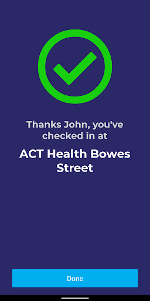

# Check In CBR
App version ``1.9.0``

Analyzed with [covid-apps-observer](http://github.com/covid-apps-observer) project, version ``0.1``

## App overview
| | |
|-------------------------|-------------------------| 
| **Name**&nbsp;&nbsp;&nbsp;&nbsp;&nbsp;&nbsp;&nbsp;&nbsp;&nbsp;&nbsp;&nbsp;&nbsp;&nbsp;&nbsp;&nbsp;&nbsp;&nbsp;&nbsp;&nbsp;&nbsp;&nbsp;&nbsp;&nbsp;&nbsp;&nbsp;&nbsp;&nbsp;&nbsp;&nbsp;&nbsp;&nbsp;&nbsp;&nbsp;&nbsp;&nbsp;&nbsp;&nbsp;&nbsp;&nbsp;&nbsp;  | Check In CBR |
| **Unique identifier** | au.gov.act.health.checkin |
| **Link to Google Play** | [https://play.google.com/store/apps/details?id=au.gov.act.health.checkin](https://play.google.com/store/apps/details?id=au.gov.act.health.checkin) |
| **Summary**  | Fast, secure check in to Canberra businesses to support COVID-19 contact tracing |
| **Privacy policy** | [https://www.covid19.act.gov.au/privacy](https://www.covid19.act.gov.au/privacy) |
| **Latest version** | 1.9.0 |
| **Last update** | 2021-03-22 09:20:49 |
| **Recent changes** | New in this release: - Landscape support on Tablets and Chromebooks - Ability to delete check in history from your device - Improved business profile check-in form - Use Check in CBR to scan &quot;Check In Qld&quot; QR codes whilst travelling in Queensland  Plus bug fixes! |
| **Installs**  | 100,000+ |
| **Category** | Health & Fitness |
| **First release** | Aug 31, 2020 |
| **Size**  | 33M |
| **Supported Android version**  | 5.0 and up |

### Description
> Quickly and securely check in to a business in Canberra, Australia to support COVID-19 contact tracing. Simply scan the QR code displayed at the business, and you're done! 
 Your personal details are saved securely with ACT Government Health Directorate for the sole purpose of contact tracing.

### User interface
The developers of the app provide the following screenshots in the Google play store.
| | | |
|:-------------------------:|:-------------------------:|:-------------------------:|
 |   |   |   | 
 |  

## Development team
In the following we report the main information provided by the development team in the Google play store.

| | |
|-------------------------|-------------------------|
| **Developer**  | ACT Health |
| **Website**  | [https://covid19.act.gov.au/check-in-cbr](https://covid19.act.gov.au/check-in-cbr) |
| **Email** | Digital.Support@act.gov.au |
| **Physical address**  | - |
| **Other developed apps**  | [https://play.google.com/store/apps/developer?id=ACT+Health](https://play.google.com/store/apps/developer?id=ACT+Health) |

## Android support

| | |
|-------------------------|-------------------------|
| **Declared target Android version**  | Android10, version 10 (API level 29) |
| **Effective target Android version**  | Android10, version 10 (API level 29) |
| **Minimum supported Android version**  | Lollipop, version 5.0 (API level 21) |
| **Maximum target Android version**  | - |

The larger the difference between the minimum and maximum supported Android versions, the better. A larger difference means a wider audience. For example, old phones have a very low Android version, so a high minimum supported Android version means that the app cannot be used by users with old phones, thus leading to accessibility problems. 

## Requested permissions

In the following we report the complete list of the permissions requested by the app. 

| **Permission** | **Protection level** | **Description** | 
|-------------------------|-------------------------|-------------------------|
 **android.permission ACCESS_NETWORK_STATE** | Normal | Allows applications to access information about networks. 
 **android.permission CAMERA** | :warning:**Dangerous** | Required to be able to access the camera device. 
 **android.permission FOREGROUND_SERVICE** | Normal | Allows a regular application to use Service.startForeground. 
 **android.permission INTERNET** | Normal | Allows applications to open network sockets. 
 **android.permission VIBRATE** | Normal | Allows access to the vibrator. 
 **android.permission WAKE_LOCK** | Normal | Allows using PowerManager WakeLocks to keep processor from sleeping or screen from dimming. 
 **com.google.android.finsky.permission BIND_GET_INSTALL_REFERRER_SERVICE** | - | - 

## Mentioned servers

| **Server** | **Registrant** | **Registrant country** | **Creation date** | 
|-------------------------|-------------------------|-------------------------|-------------------------|
 | android.com | Google LLC | :us: US | 1997-06-23 04:00:00 |
 | google.com | Google LLC | :us: US | 1997-09-15 04:00:00 |
 | googleapis.com | Google LLC | :us: US | 2005-01-25 17:52:26 |
 | cloudfront.net | Amazon.com, Inc. | :us: US | 2008-04-25 18:25:49 |

## Security analysis 

Below we report the main security warnings raised by our execution of the [Androwarn](https://github.com/maaaaz/androwarn) security analysis tool.

**Telephony identifiers leakage**
> - This application reads the numeric name (MCC+MNC) of current registered operator 
> - This application reads the operator name 

**Connection interfaces exfiltration**
> - This application reads details about the currently active data network 
> - This application tries to find out if the currently active data network is metered 

**Audio video eavesdropping**
> - This application records audio from the 'CAMCORDER' source  
> - This application records audio from the 'MIC' source  
> - This application captures video from the 'CAMERA' source 
> - This application captures video from the 'SURFACE' source 

**Suspicious connection establishment**
> - This application opens a Socket and connects it to the remote address '' on the 'N/A' port  
> - This application opens a Socket and connects it to the remote address 'Ljava/lang/StringBuilder;->toString()Ljava/lang/String;' on the ': connect, resolve' port  
> - This application opens a Socket and connects it to the remote address 'Ljava/lang/StringBuilder;->toString()Ljava/lang/String;' on the 'N/A' port  
> - This application opens a Socket and connects it to the remote address 'Ljava/net/Proxy;->type()Ljava/net/Proxy$Type;' on the 'N/A' port  
> - This application opens a Socket and connects it to the remote address 'timeout' on the 'N/A' port  

**Pim data leakage**
> - This application accesses data stored in the clipboard 

**Code execution**
> - This application loads a native library 
> - This application loads a native library: 'Ljava/lang/String;->valueOf(Ljava/lang/Object;)Ljava/lang/String;' 
> - This application executes a UNIX command 

## User ratings and reviews

Below we provide information about how end users are reacting to the app in terms of ratings and reviews in the Google Play store.

### Ratings

The Check In CBR app has been installed by more than **100000** times. At this time, **220** rated the app and its average score is **2.5636363**. Below we show the distribution of the ratings across the usual star-based rating of Google Play

:star::star::star::star::star:: 64

:star::star::star::star:: 22

:star::star::star:: 6

:star::star:: 10

:star:: 118

### Reviews 

#### 5-star reviews

> It was simple and obvious to use, collected only basic, necessary information; worked intuitively and correctly the first time, and wasted none of my time.  :date: __2021-05-27 01:21:01__

> Logs in with all my details  :date: __2021-05-19 11:21:59__

> Great App  :date: __2021-04-17 10:51:50__

> Periodically stops working  :date: __2021-04-06 02:22:08__

> A bit slow activating but otherwise great  :date: __2021-04-02 11:14:56__

> App now working again. Could we have the option to turn off the ding when you check in??  :date: __2021-04-01 14:51:17__

> Really easy to use, one of the better check in apps I've used.  :date: __2021-03-27 01:30:56__

> Easy to use, love it!  :date: __2021-03-26 03:41:40__

> Great service  :date: __2021-03-25 11:45:42__

> Excellent and safety  :date: __2021-03-23 16:46:48__

#### 4-star reviews

> Very apropiate  :date: __2021-05-29 09:38:36__

> It would be great if you could provide a frequent places option. I go to the same coffee shop every day and have to scan each time. If I could add it to my favourites and check in from there it would be much easier.  :date: __2021-05-05 09:35:10__

> App is fine, easy install and use. Could do with the ability to check out as well.  :date: __2021-05-01 09:48:23__

> Knox zzz a  :date: __2021-04-05 03:04:52__

> jgii8looLeft to prove any billion via the water opp09mb9ddd  :date: __2021-04-02 08:20:46__

> Up to a few days ago this was near perfect. I used it everywhere. For some reason this weekend it fails to launch on my S7 Samsung mobile. I have uninstalled, restarted, reinstalled, but still it fails to launch. Something is now incompatible. I hope it's fixed asap. UPDATE The problem is now fixed. Thanks for the support.  :date: __2021-03-11 10:20:44__

> Does its job. No issues really. First check in takes a little time, then its quite smooth going.  :date: __2021-03-10 08:34:42__

> works fine for me, but will it ever include a 'checkout' function similar to the NSW version?  :date: __2021-03-07 06:58:44__

> App worked fine on my Moto G5 Android (8.1.0) until a week or so ago, since when it won't even open. I have just downloaded the latest version - no change. Please fix whatever you did to break it EDIT: following update 1.8.2, the app now opens and functions as before. Thanks for taking action, as the 'solution' provided to many people below was really not acceptable in 2021  :date: __2021-03-03 06:26:53__

> The app wasn't working since the 25 Feb update, but it was fixed this morning (2 March 2021). At least it now works ok for my Samsung Galaxy S7 android phone.  :date: __2021-03-02 12:16:28__

#### 3-star reviews

> Hey, you need to update this app so check in time is accurate. It is still checking in to locations at Daylight Saving Time which is not good if you are trying contact trace. Thought you might want to know that's all.  :date: __2021-06-05 12:23:35__

> When i opened it this morning it suddenly uninstalled itself and now playstore wont reinstall it as it says it is installed. It is nit on the list of apps in settings. Greg  :date: __2021-05-27 11:38:53__

> I constantly have to delete it and reload it as it tends to stop working  :date: __2021-05-12 05:26:59__

> App is still on daylight savings time. And can't add time you departed a venue.  :date: __2021-04-14 04:11:29__

> Was perfect before the latest update. Now it doesn't scan and I have to manually enter in places. Would love a fix  :date: __2021-04-13 07:43:53__

> Remember to stay safe and wash your hands.  :date: __2021-04-07 23:00:34__

> This app worked perfectly for me until the most recent update. Now the screen stretches off the sides of my mobile. Mostly its bearable if ugly but I'm unable to see the names of the additional people either for selecting or entering in the text box which significantly reduces its usefulness  :date: __2021-04-02 02:59:52__

> What if I do not have internet data? Not everyone has free wifi data which may make the app useless.  :date: __2021-03-04 00:02:46__

> Sometimes app won't open  :date: __2021-02-28 00:56:16__

> The graphics are too dark under some lighting.  :date: __2021-02-08 01:44:49__

#### 2-star reviews

> Worked as intended before, but recently has become very slow to load and the qr scanner is not working. Also takes forever to load at random times  :date: __2021-05-22 00:17:28__

> Keeps locking up  :date: __2021-05-20 01:37:46__

> Works great if it loads, has only loaded in under 5 minutes once.  :date: __2021-04-25 08:06:24__

> Use this to app on a recent visit to Canberra, don't know why but it had a weird effect on my wifi calls and volume control on my Samsung S21. Since I removed the app it all worked well again.  :date: __2021-04-23 14:27:57__

> The app broke after install so checkin never worked either by QR or manually. I had to reinstall it  :date: __2021-04-05 06:14:32__

> This assumes that the user has endless data. When that is not so, it fails; it should "STORE" logins until [free] wifi is next available. When the QR is not recognised, and that's regularly, it nags for a number, which I also call a fail.  :date: __2021-03-28 08:14:09__

> Devs should be shot. Does not work with Google to restore on reinstall. QR scan is black. It cannot use the camera? All other QR apps work perfectly. This is a bog simple App. Who is testing it? Black screen on subsequent attempts. It's not memory it is programming. How hard can it be? API level 21 indeed.  :date: __2021-03-16 04:11:59__

> Why does this get stuck "finding location" now? It used to work reliably.  :date: __2021-03-06 09:55:15__

> Does not work on samsung J mini. Screen keeps going blank and won't connect to camera.  :date: __2021-03-02 00:32:11__

> Lost this app off my home page - looked at the 'fix failure to load on Android' option but no info given. Okay, now I can't post this at your POST ... Update : found that I had to give stars to be able to post.  :date: __2021-03-01 09:02:45__

#### 1-star reviews

> Not flexible  :date: __2021-06-10 00:56:43__

> Horrible  :date: __2021-05-21 12:23:17__

> It often does not refresh the location when I use QR codes through my phone. I have often found myself checking in to the last location I went to instead of my current location. Please fix this bug so it refreshes to the new location as there are many inaccurate entries which would not help with tracking.  :date: __2021-05-19 02:42:36__

> Should not support this! Illegal!!! The government can't be trusted with your personal information  :date: __2021-05-19 01:19:18__

> Am in Canberra for the weekend and app won't do ownload on my Google pixel 5 phone  :date: __2021-05-15 09:40:53__

> Hopeless compared to Service NSW  :date: __2021-05-15 02:06:06__

> ....not working. Installed latest version for my SamsungS7 when I arrived in Canberra today. Absolutely nothing when I tried at the NGA. Cannot see the code as displayed...zero response. My partners S9 worked fine though...  :date: __2021-05-14 10:29:36__

> Terrible  :date: __2021-05-09 04:57:19__

> It doesn't have QR scanner. Doesn't work. Useless. Can't find the location after entering the code.  :date: __2021-05-08 06:45:04__

> Very poor design - does not have a check out function. No way to tell how long person has been in the venue.👎 Still no option to check out.  :date: __2021-05-05 23:44:36__

