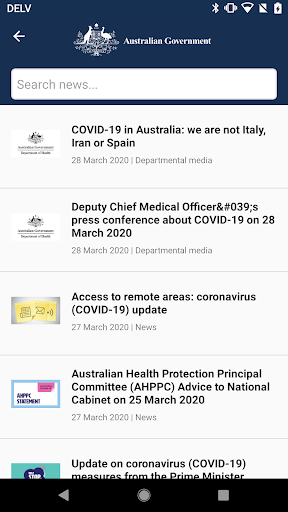
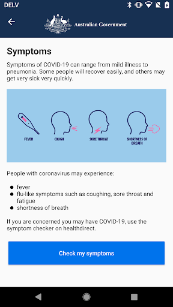
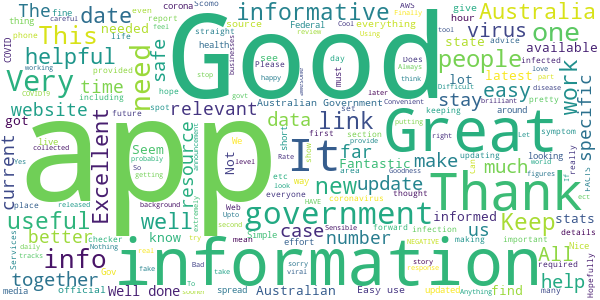
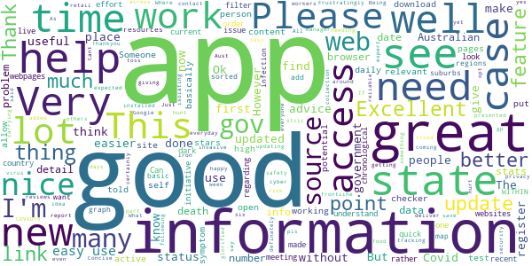
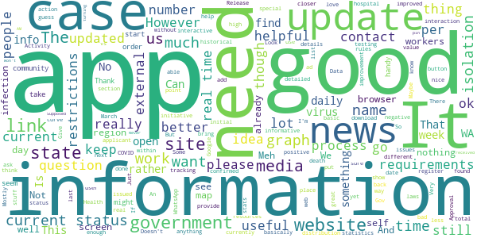
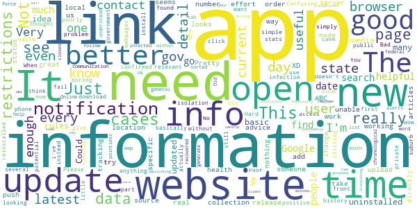
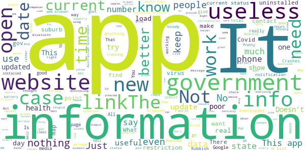

# Coronavirus Australia
App version ``1.1``

Analyzed with [covid-apps-observer](http://github.com/covid-apps-observer) project, version ``0.1``

## App overview
| | |
|-------------------------|-------------------------| 
| **Name**&nbsp;&nbsp;&nbsp;&nbsp;&nbsp;&nbsp;&nbsp;&nbsp;&nbsp;&nbsp;&nbsp;&nbsp;&nbsp;&nbsp;&nbsp;&nbsp;&nbsp;&nbsp;&nbsp;&nbsp;&nbsp;&nbsp;&nbsp;&nbsp;&nbsp;&nbsp;&nbsp;&nbsp;&nbsp;&nbsp;&nbsp;&nbsp;&nbsp;&nbsp;&nbsp;&nbsp;&nbsp;&nbsp;&nbsp;&nbsp;  | Coronavirus Australia |
| **Unique identifier** | au.gov.health.covid19 |
| **Link to Google Play** | [https://play.google.com/store/apps/details?id=au.gov.health.covid19](https://play.google.com/store/apps/details?id=au.gov.health.covid19) |
| **Summary**  | Official Government Information |
| **Privacy policy** | [https://www.health.gov.au/using-our-websites/privacy](https://www.health.gov.au/using-our-websites/privacy) |
| **Latest version** | 1.1 |
| **Last update** | 2020-05-28 04:37:05 |
| **Recent changes** | Updated to make it easier to find the most relevant information |
| **Installs**  | 500,000+ |
| **Category** | Health & Fitness |
| **First release** | Mar 28, 2020 |
| **Size**  | 7.9M |
| **Supported Android version**  | 6.0 and up |

### Description
> You can use the Australian Government Coronavirus app to:
 - stay up to date with the official information and advice 
 - important health advice to help stop the spread and stay healthy
 - get a quick snapshot of the current official status within Australia
 - check your symptoms if you are concerned about yourself or someone else
 - find relevant contact information 
 - access updated information from the Australian Government
 - receive push notifications of urgent information and updates
 Trusted, Australian information
 All information in the Australian Government Coronavirus app is sourced from Australia’s leading health organisations and has undergone a quality assurance process so people can know it is safe, appropriate and relevant for Australians. 
 Disclaimer
 Whilst this app has been reviewed for clinical accuracy, the content is not a substitute for professional advice and should not be used as an alternative to professional healthcare. If you have a particular medical problem, please consult a doctor or a specialist.

### User interface
The developers of the app provide the following screenshots in the Google play store.
| | | |
|:-------------------------:|:-------------------------:|:-------------------------:|
 |   |   |   | 
 |  

## Development team
In the following we report the main information provided by the development team in the Google play store.

| | |
|-------------------------|-------------------------|
| **Developer**  | DTA App Developer |
| **Website**  | [http://health.gov.au](http://health.gov.au) |
| **Email** | info@health.gov.au |
| **Physical address**  | - |
| **Other developed apps**  | [https://play.google.com/store/apps/developer?id=DTA+App+Developer](https://play.google.com/store/apps/developer?id=DTA+App+Developer) |

## Android support

| | |
|-------------------------|-------------------------|
| **Declared target Android version**  | Android10, version 10 (API level 29) |
| **Effective target Android version**  | Android10, version 10 (API level 29) |
| **Minimum supported Android version**  | Marshmallow, version 6.0 (API level 23) |
| **Maximum target Android version**  | - |

The larger the difference between the minimum and maximum supported Android versions, the better. A larger difference means a wider audience. For example, old phones have a very low Android version, so a high minimum supported Android version means that the app cannot be used by users with old phones, thus leading to accessibility problems. 

## Requested permissions

In the following we report the complete list of the permissions requested by the app. 

| **Permission** | **Protection level** | **Description** | 
|-------------------------|-------------------------|-------------------------|
 **android.permission ACCESS_COARSE_LOCATION** | :warning:**Dangerous** | Allows an app to access approximate location. 
 **android.permission ACCESS_FINE_LOCATION** | :warning:**Dangerous** | Allows an app to access precise location. 
 **android.permission ACCESS_NETWORK_STATE** | Normal | Allows applications to access information about networks. 
 **android.permission INTERNET** | Normal | Allows applications to open network sockets. 
 **android.permission WAKE_LOCK** | Normal | Allows using PowerManager WakeLocks to keep processor from sleeping or screen from dimming. 
 **com.google.android.c2dm.permission RECEIVE** | - | - 
 **com.google.android.finsky.permission BIND_GET_INSTALL_REFERRER_SERVICE** | - | - 

## Mentioned servers

| **Server** | **Registrant** | **Registrant country** | **Creation date** | 
|-------------------------|-------------------------|-------------------------|-------------------------|
 | googlesyndication.com | Google LLC | :us: US | 2003-01-21 06:17:24 |
 | google.com | Google LLC | :us: US | 1997-09-15 04:00:00 |
 | app-measurement.com | Google LLC | :us: US | 2015-06-19 20:13:31 |
 | apple.com | Apple Inc. | :us: US | 1987-02-19 05:00:00 |
 | aomedia.org | Contact Privacy Inc. Customer 1243324949 | :canada: CA | 2015-08-24 14:07:31 |
 | w3.org | W3C | :us: US | 1994-07-06 04:00:00 |
 | googleapis.com | Google LLC | :us: US | 2005-01-25 17:52:26 |
 | googleadservices.com | Google LLC | :us: US | 2003-06-19 16:34:53 |
 | googleapis.com | Google LLC | :us: US | 2005-01-25 17:52:26 |
 | crashlytics.com | Google LLC | :us: US | 2011-01-21 15:30:40 |

## Security analysis 

Below we report the main security warnings raised by our execution of the [Androwarn](https://github.com/maaaaz/androwarn) security analysis tool.

**Telephony identifiers leakage**
> - This application reads the ISO country code equivalent of the current registered operator's MCC (Mobile Country Code) 
> - This application reads the device phone type value 

**Connection interfaces exfiltration**
> - This application reads details about the currently active data network 
> - This application tries to find out if the currently active data network is metered 

**Telephony services abuse**
> - This application makes phone calls 

**Suspicious connection establishment**
> - This application opens a Socket and connects it to the remote address '' on the 'N/A' port  
> - This application opens a Socket and connects it to the remote address 'Ljava/lang/StringBuilder;->toString()Ljava/lang/String;' on the 'N/A' port  
> - This application opens a Socket and connects it to the remote address 'Ljava/net/Proxy;->type()Ljava/net/Proxy$Type;' on the 'N/A' port  
> - This application opens a Socket and connects it to the remote address 'timeout' on the 'N/A' port  

**Code execution**
> - This application loads a native library 

## User ratings and reviews

Below we provide information about how end users are reacting to the app in terms of ratings and reviews in the Google Play store.

### Ratings

The Coronavirus Australia app has been installed by more than **500000** times. At this time, **1363** rated the app and its average score is **3.2962964**. Below we show the distribution of the ratings across the usual star-based rating of Google Play

:star::star::star::star::star:: 595

:star::star::star::star:: 111

:star::star::star:: 181

:star::star:: 50

:star:: 424

### Reviews 

#### 5-star reviews

> Great got 2 NEGATIVE. Maureen.  :date: __2020-06-04 04:04:37__

> Good updates daily. Well presented. Thank you.  :date: __2020-05-27 02:38:45__

> Good info and helpful app  :date: __2020-05-15 03:27:11__

> Good thing  :date: __2020-05-11 23:17:24__

> Coronavirus is the information of the most dangerous sickness in the world. The first time in the world that we have to work together and help each other for this reason we should all stay-at-home and try not to have a visitor and if we could get together and must fallow all the important information about this virus.COVID19. We will need to cooperate for the best way to back our normal life, I will have to be careful with my own experience with this. I am very happy and excited when the latest  :date: __2020-05-11 18:17:42__

> It's very useful and gives me peace of mind  :date: __2020-05-08 20:19:48__

> Crucial app you need to survive this disease that was definitely not released by any government or grouping of people to quell the overwhelming amount of people that are alive. This app it had too many similarities to plague Inc, but the story was the biggest failure of it all. I mean truly, who would believe our governments would release this disease on the people, it's too cruel to imagine. It's not like the powers to be around you are plotting against you. Or are they..  :date: __2020-05-08 02:07:04__

> I am reviewing in response to the current most highly rated negative review. TLDR this is not spyware. Storing data on Amazon Web Services (AWS) is no real concern. AWS *does* have servers in Australia. It is very stable, and any sensitive data collected by the app (which afaik is *all* voluntary) will probably be about as secure as most government services. Using AWS means 99.99% uptime (not exaggerating), that the app is available much sooner than it would be otherwise, and cheaper on tax $$  :date: __2020-05-06 10:36:30__

> A must have app. Works seamlessly in the background and makes me feel more confident that I will know if I've been exposed to the virus. Everyone should have it  :date: __2020-05-05 22:22:45__

> Let stop the spread of Covid19!  :date: __2020-05-05 09:30:18__

#### 4-star reviews

> Would be great if you could also put how many active cases there are.  :date: __2020-05-21 00:11:52__

> Works as expected, an information manager, not a source (otherwise the app would need updating daily). Helps to get at relevant, reliable information, without needing to hunt around the web myself to find it.  :date: __2020-05-13 10:32:15__

> Good  :date: __2020-05-11 11:25:39__

> I like  :date: __2020-05-07 01:23:44__

> Good  :date: __2020-05-01 06:29:25__

> Cant self register  :date: __2020-04-30 02:43:21__

> Being a high risk person I installed the app, put in details. I was told to see my gp which I did and even had the test. The app doesn't allow you to report that you have done it and for you to say that you don't have COVID19 . I think that would be something that should have been added.  :date: __2020-04-29 04:01:07__

> Just updated  :date: __2020-04-28 10:47:52__

> All I get is Aust gov site. Where is app?  :date: __2020-04-27 22:20:40__

> Frustratingly good  :date: __2020-04-27 14:40:16__

#### 3-star reviews

> Keeps turning itself off!  :date: __2020-05-19 04:42:12__

> It hasn't updated. Supposed to update at 9:00 AM daily.  :date: __2020-05-14 01:15:17__

> Never have received the pin to open it  :date: __2020-05-08 01:20:55__

> Won't download past 97%  :date: __2020-05-07 12:21:06__

> Mostly disappointed that in all government media announcements they just say 'download the app' without specifying the name of the app clearly. There are several COVID-19 apps out there now. Give it a distinctive name.  :date: __2020-05-07 10:02:42__

> An interactive app would be far more useful. INPUT Activity I want to undertake? Personal details? Employment details? Reason for activity? PROCESS Verification process. OUTPUT. Approval /Denial /More information - contact Barcode issued to applicant on approval. Applicant issued with a description of any special requirements. Eg: FIFO to travel Site - WA - NSW - WA - site Can the process be undertaken? ANS Special requirements (isolation and period and process for each state)  :date: __2020-05-05 12:10:07__

> Laggy on the opening and update of information but enough for quick access check .  :date: __2020-05-05 09:48:51__

> Dear Gov Oz good overall but if time ask those negative reviews e.g. force closure what system they use....keep up good work... we pray to Jesu Mary's Health bless us  :date: __2020-05-04 13:56:47__

> Lite info and few updates ... than news media  :date: __2020-05-01 10:01:51__

> Okay, this app keeps consumers informed and offers a dialect about what to do if you need to do something/anything. However, the app has zero allowance for inquiry; no room to question the ongoing situation. I don't disregard the media as an institution but its reporter's are sometimes off the beaten path and want to break a story rather than provide valuable information. Things will get better, stay vigilant and patient.  :date: __2020-04-29 14:26:47__

#### 2-star reviews

> I'm sure it's a great app but there is constantly a reminder in my notifications that I can't get rid of. Very very frustrating.  :date: __2020-05-28 18:16:57__

> Not enough real time information I would like to see more statistics especially our Reff number  :date: __2020-05-07 11:17:36__

> Release the source code of both client and server and more of us will install this app... It looks like the app generates and uploads a private/public key pair and uploads one or the other to a central server and associates it directly to a user, other users when testing positive can upload their contact history to the server and matches that data to details of other users they came into contact with directly implicating the contacts, private user data should not be uploaded without consent.  :date: __2020-05-04 12:39:48__

> Confusing  :date: __2020-05-04 09:43:14__

> Will not download on my phone  :date: __2020-05-01 08:18:24__

> Takes forever to download. Been trying for 2 days now.  :date: __2020-04-29 10:31:12__

> I downloaded it but still do not know if it is actually working.  :date: __2020-04-27 03:53:37__

> Please add a prominent link to the covidsafe app.  :date: __2020-04-27 00:50:53__

> Update too late every day  :date: __2020-04-27 00:17:59__

> Buggy as!  :date: __2020-04-26 13:48:12__

#### 1-star reviews

> Since you have updated this app there are now no more new case numbers for states for the day the most important information is missing.  :date: __2020-06-07 08:58:11__

> Was totally changed in the update ; how bloody stupid. Idiotic.  :date: __2020-06-07 01:05:56__

> Probably the most b\*\**sh\*\* app ever created. Shame on you gov.  :date: __2020-06-06 01:20:45__

> Sorry, but I can't trust what the government says with the same type of personal information collected when they've previously been caught lying about it.  :date: __2020-06-05 18:56:10__

> I have just gone through my telephone and I would like to know why Google Play has installed coronavirus app on my phone without approval  :date: __2020-06-03 07:13:37__

> Useless messed up a BRAND NEW CELL PHONE.WOULD NOT RECOMEND AT ALL  :date: __2020-06-02 12:28:37__

> I don't remember installing this app, I did leave my phone charging overnight with the WiFi on. Why can't they just have emailed you instead or have an entire page just for Covid updates in your local newspaper.  :date: __2020-05-29 13:24:39__

> Won't keep working. Send to be issue with battery optimisation on my android phone  :date: __2020-05-25 18:03:02__

> Pissed off. I've been in hospital heart attack and clot in left Ventricle. Plus lethal high deadly Virus A. Everyone needs to be brutally honest I have been impounded for 5 months. The Government has to find positive encouraging laughter and words of faith strength and ALL the best will appear. Open up our Lord Jesus is wanting more life back in the real world. I'm multiple disability after work place ACCIDENT and left for dead told to go to work. NO COMPENSATION AND NO ONE TO HELP ME  :date: __2020-05-24 20:42:33__

> Had one notification since downloading it two months ago. And what it shared with me was two day old info which I saw on the ABC. No way will I download the tracking app either. This government is not known for being tech savvy. Most of their online attempts have been an epic fail. Especially when it comes to keeping your data secure. Also, the coronatracker app works using Bluetooth. Bluetooth can only be connected to one device at a time. So you won't be able to use your headphones when out.  :date: __2020-05-24 20:41:17__

