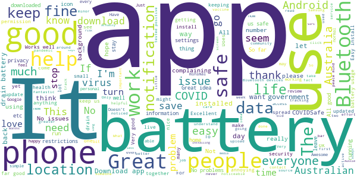
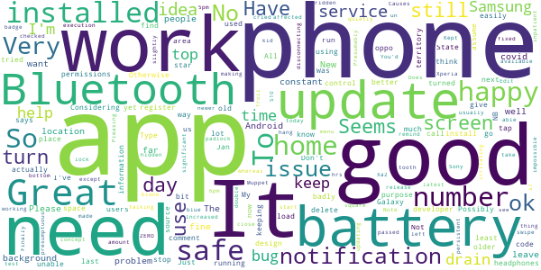
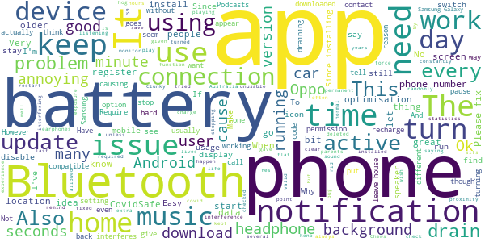
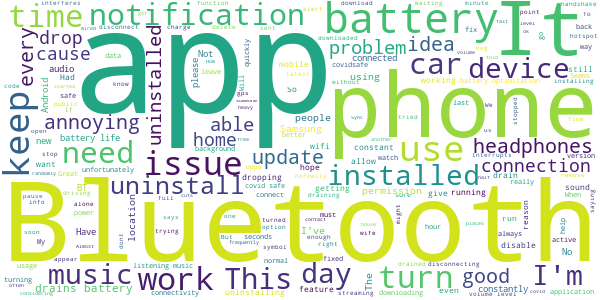
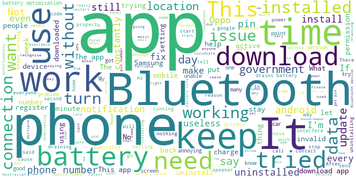

# COVIDSafe
App version ``1.0.17``

Analyzed with [covid-apps-observer](http://github.com/covid-apps-observer) project, version ``0.1``

## App overview
| | |
|-------------------------|-------------------------| 
| **Name**&nbsp;&nbsp;&nbsp;&nbsp;&nbsp;&nbsp;&nbsp;&nbsp;&nbsp;&nbsp;&nbsp;&nbsp;&nbsp;&nbsp;&nbsp;&nbsp;&nbsp;&nbsp;&nbsp;&nbsp;&nbsp;&nbsp;&nbsp;&nbsp;&nbsp;&nbsp;&nbsp;&nbsp;&nbsp;&nbsp;&nbsp;&nbsp;&nbsp;&nbsp;&nbsp;&nbsp;&nbsp;&nbsp;&nbsp;&nbsp;  | COVIDSafe |
| **Unique identifier** | au.gov.health.covidsafe |
| **Link to Google Play** | [https://play.google.com/store/apps/details?id=au.gov.health.covidsafe](https://play.google.com/store/apps/details?id=au.gov.health.covidsafe) |
| **Summary**  | COVIDSafe is a community-based way to stop the spread of COVID-19. |
| **Privacy policy** | [https://www.health.gov.au/using-our-websites/privacy](https://www.health.gov.au/using-our-websites/privacy) |
| **Latest version** | 1.0.17 |
| **Last update** | 2020-05-13 13:50:12 |
| **Recent changes** | Push notifications are now optional Improvements to Bluetooth security and connectivity Accessibility enhancements Bug fixes. |
| **Installs**  | 1,000,000+ |
| **Category** | Health & Fitness |
| **First release** | Apr 25, 2020 |
| **Size**  | 6.0M |
| **Supported Android version**  | 6.0 and up |

### Description
> COVIDSafe app has been developed by the Australian Government Department of Health to help keep the community safe from coronavirus (COVID-19). Together, let’s help stop the spread and keep ourselves and each other healthy.
 COVIDSafe uses the Bluetooth® technology on your mobile phone to look for other devices with COVIDSafe installed. Your device will take a note of contact you’ve had with other users by securely logging the other user’s reference code. If you or someone you’ve been in contact with is diagnosed with COVID-19, the close contact information securely stored in your phone can be uploaded and used—with your consent—by state and territory health officials to quickly inform people who’ve been exposed to the virus.
 How you can help stop the spread of COVID-19:
 • Download the COVIDSafe app
 • Register using your mobile phone number, name, age range and postcode
 • Turn on Bluetooth®
 • Check that COVIDSafe is running when you are out and about or are likely to come into contact with others
 • If you test positive for COVID-19, you can consent for your close contact information to be used by state and territory health officials to contact people who may have been exposed. If you’ve been exposed to the virus by someone you’ve been in close contact with, state and territory health officials will be able to contact you quickly so you can get the support you need
 COVIDSafe is an Australian Government Department of Health initiative. Visit https://www.health.gov.au/resources/apps-and-tools/covidsafe-app for more information.

### User interface
The developers of the app provide the following screenshots in the Google play store.
| | | |
|:-------------------------:|:-------------------------:|:-------------------------:|
 |   |   |   | 
 |   |  

## Development team
In the following we report the main information provided by the development team in the Google play store.

| | |
|-------------------------|-------------------------|
| **Developer**  | Australian Department of Health |
| **Website**  | [https://www.health.gov.au/resources/apps-and-tools/covidsafe-app](https://www.health.gov.au/resources/apps-and-tools/covidsafe-app) |
| **Email** | support@COVIDSafe.gov.au |
| **Physical address**  | - |
| **Other developed apps**  | [https://play.google.com/store/apps/developer?id=Australian+Department+of+Health](https://play.google.com/store/apps/developer?id=Australian+Department+of+Health) |

## Android support

| | |
|-------------------------|-------------------------|
| **Declared target Android version**  | Android10, version 10 (API level 29) |
| **Effective target Android version**  | Android10, version 10 (API level 29) |
| **Minimum supported Android version**  | Marshmallow, version 6.0 (API level 23) |
| **Maximum target Android version**  | - |

The larger the difference between the minimum and maximum supported Android versions, the better. A larger difference means a wider audience. For example, old phones have a very low Android version, so a high minimum supported Android version means that the app cannot be used by users with old phones, thus leading to accessibility problems. 

## Requested permissions

In the following we report the complete list of the permissions requested by the app. 

| **Permission** | **Protection level** | **Description** | 
|-------------------------|-------------------------|-------------------------|
 **android.permission ACCESS_FINE_LOCATION** | :warning:**Dangerous** | Allows an app to access precise location. 
 **android.permission ACCESS_NETWORK_STATE** | Normal | Allows applications to access information about networks. 
 **android.permission BLUETOOTH** | Normal | Allows applications to connect to paired bluetooth devices. 
 **android.permission BLUETOOTH_ADMIN** | Normal | Allows applications to discover and pair bluetooth devices. 
 **android.permission FOREGROUND_SERVICE** | Normal | Allows a regular application to use Service.startForeground. 
 **android.permission INTERNET** | Normal | Allows applications to open network sockets. 
 **android.permission RECEIVE_BOOT_COMPLETED** | Normal | Allows an application to receive the Intent.ACTION_BOOT_COMPLETED that is broadcast after the system finishes booting. 
 **android.permission REQUEST_IGNORE_BATTERY_OPTIMIZATIONS** | Normal | Permission an application must hold in order to use Settings.ACTION_REQUEST_IGNORE_BATTERY_OPTIMIZATIONS. 

## Mentioned servers

| **Server** | **Registrant** | **Registrant country** | **Creation date** | 
|-------------------------|-------------------------|-------------------------|-------------------------|
 | stackoverflow.com | Stack Exchange, Inc. | :us: US | 2003-12-26 19:18:07 |
 | google.com | Google LLC | :us: US | 1997-09-15 04:00:00 |

## Security analysis 

Below we report the main security warnings raised by our execution of the [Androwarn](https://github.com/maaaaz/androwarn) security analysis tool.

**Connection interfaces exfiltration**
> - This application reads details about the currently active data network 
> - This application tries to find out if the currently active data network is metered 

**Suspicious connection establishment**
> - This application opens a Socket and connects it to the remote address ' returned no addresses for  ; port is out of range' on the 'N/A' port  
> - This application opens a Socket and connects it to the remote address '' on the 'N/A' port  
> - This application opens a Socket and connects it to the remote address 'Ljava/lang/StringBuilder;->toString()Ljava/lang/String;' on the 'N/A' port  
> - This application opens a Socket and connects it to the remote address 'Ljava/net/Proxy;->type()Ljava/net/Proxy$Type;' on the 'N/A' port  
> - This application opens a Socket and connects it to the remote address 'timeout' on the 'N/A' port  

## User ratings and reviews

Below we provide information about how end users are reacting to the app in terms of ratings and reviews in the Google Play store.

### Ratings

The COVIDSafe app has been installed by more than **1000000** times. At this time, **10587** rated the app and its average score is **3.6536632**. Below we show the distribution of the ratings across the usual star-based rating of Google Play

:star::star::star::star::star:: 5761

:star::star::star::star:: 926

:star::star::star:: 795

:star::star:: 674

:star:: 2427

### Reviews 

#### 5-star reviews

> Keepin AUSSIES safe.  :date: __2020-05-23 09:06:20__

> 28/4/3020 Took less than two minutes to install and register. The only permission it gets is location. 23/5/2020 Since installed it has been fine, no impacts on functionality of phone and negligible battery or storage usage. All good.  :date: __2020-05-23 06:25:51__

> Keep,s every Victorian safe  :date: __2020-05-23 05:54:35__

> I have never had this viorus at all now it's time to get things going on now. Warren Patterson  :date: __2020-05-23 05:44:56__

> No problems with installation, battery use or the app dropping off. All good. 2 updates so far.  :date: __2020-05-23 04:24:16__

> The app appears to do exactly what it says. I have had no issues since installing this app, but I only use my phone as a phone, not a media center like most people seem to. What little risk there might be to my privacy is vastly outweighed by the potential benefits.  :date: __2020-05-23 04:08:54__

> No yet  :date: __2020-05-22 12:17:15__

> Great  :date: __2020-05-22 10:19:13__

> Great app very easy to use 👍👍  :date: __2020-05-22 09:04:27__

> I cant get the app on my phone  :date: __2020-05-22 08:37:17__

#### 4-star reviews

> Looking forward to integration to Google Exposure API for more efficient battery use.  :date: __2020-05-23 13:11:36__

> I find it very difficult to negotiate the app.  :date: __2020-05-23 12:52:16__

> Didn't like the old version as I had lots of issues like causing the GMail app to stop syncing. Let alone the annoying permanent notification on the screen. But the new version overcome 90% of the issues. Well done Aussies!  :date: __2020-05-22 13:00:22__

> Generally don't notice the app running at all; however started using the phone for music in the car today and it constantly causes the cars Bluetooth to reset about 1-2 minutes into each song. Phone = Samsung S9+ Car = Mazda BT50 2014 (Don't know what version of Bluetooth) Hopefully you can resolve this issue.  :date: __2020-05-22 06:18:48__

> App works fine on my S9. Only issue is the battery drain.  :date: __2020-05-21 14:30:12__

> Great app, every Australian should get it! I'd give 5 stars but for 1 reason. I really don't like the permanent lock screen notification that the app is 'protecting' me. I don't care. I just want it to work quietly in the background and not bother me until it needs to. I'd be quite surprised if any user wants the app to remind them it is there every time they pick up their phone. Please create a setting to turn this off -- then you'll get my 5 stars.  :date: __2020-05-21 10:36:51__

> Good but small things. hahahaha. Right. Got that  :date: __2020-05-21 09:00:54__

> Downloaded and uninstalled and downloaded again after having done more research. Easy to uninstall but need to switch off another in list of apps that appears as a code of letters and numerals which I presume is the encryption as stated in the privacy policy and conditions, worth reading in this case. No issues experienced in downloading and uninstalling on my Samsung S10! Also, no issues with my Bluetooth audio and car phone nor my audio ear buds and Bluetooth is turned off whilst home alone.  :date: __2020-05-21 03:38:46__

> Runs fine. Easy to set up. Unsure if Bluetooth drains battery quicker than normal but hey if it helps opening up the lockdown, so be it.  :date: __2020-05-21 00:20:47__

> Drains battery like crazy but it's for a good cause and it won't be forever so i can deal with it!  :date: __2020-05-21 00:04:55__

#### 3-star reviews

> Mr Morrison said it only uses Bluetooth, it also uses your GPS. Also the notification bar is permanent.  :date: __2020-05-23 12:32:26__

> If the Govt were serious it should have been backwood compatible with earlier operating systems  :date: __2020-05-22 08:58:29__

> I've had no major problems. However the constant icon that appears with the install is annoying, I have a new Android so I was able to turn-off the foreground service notification for covidsafe in my app settings to get rid of it. I was unable to install the app to my elderly step dad's Samsung because despite only being a couple of years old it was incompatible. He reports that as a common issue amongst his peers. So I think there is room for improvement but no reason not to install it  :date: __2020-05-22 02:03:38__

> The concept is a good idea in theory. I only turn my wifi on when I leave home so I have not experienced any battery issues with my Galaxy S10 5G device. I don't believe any state or territory has been able to read any data being produced by this app yet, therefore it's difficult to know if the app is actually working?  :date: __2020-05-21 00:42:39__

> Needs more Hing.  :date: __2020-05-20 09:03:39__

> Keeps turning off even though I have turned off battery optimisation settings.  :date: __2020-05-20 04:40:27__

> I know this is important so will keep it but it drains battery excessively. Almost to the point it's unusable. I've had to start carrying a portable charger when I'm out. I think I'm going to have to disable it when I'm at home. I can't carry a portable charger around the house. Ridiculous.  :date: __2020-05-19 16:40:19__

> When the app is installed and I'm connected to a device with Bluetooth and playing music, the music seems to cut out a lot. When the app is not installed it works fine.  :date: __2020-05-19 15:51:05__

> Can't fairly assess it yet. Seemed to work OK until I installed Malwarebytes to protect my device from malware attacks. Now the COVIDSafe icon is map of Australia keeps disappearing from top of my screen and is replaced by the Malwarebytes app symbol. If I go into the COVIDSafe app, it reappears and sits beside the Malware bytes icon at top of page a while and then disappears again. Is this OK? I thought the COVID icon had to remain there at all times. Why is the Covid icon disappearing?  :date: __2020-05-19 12:47:32__

> Have had to uninstall because of the excess battery drain, unable to carry out my day-to-day work and I rely on my device. Would love to be able to put this app to sleep when connected to my home WiFi - seems like a low hanging fruit to actually meet the problem this app is trying to solve.  :date: __2020-05-19 07:44:11__

#### 2-star reviews

> Stuffs up my Bluetooth  :date: __2020-05-23 11:53:17__

> Constantly being killed in the background. I've told Android to leave it alone, don't know why my phone would be killing it given that I've got 8gb of ram and usually about 5gb free.  :date: __2020-05-23 07:30:35__

> How do u know when you've walked near someone who has covid19 does the phone beep  :date: __2020-05-23 05:19:29__

> This app interferes with my Bluetooth audio. Sound drops out randomly but often. When I force stop the app, Bluetooth audio functions normally.  :date: __2020-05-23 04:00:18__

> Since I started running this app my Bluetooth keeps getting turned off.  :date: __2020-05-23 03:29:37__

> This app drains the battery fast. Almost considering to uninstall.  :date: __2020-05-22 14:42:58__

> Suggestion to use the gps location instead of bluetooth as it drain the battery heavy ly and to keet the blue tooth as a options if you are going to public places  :date: __2020-05-22 04:24:47__

> It disconnects my Bluetooth headphones  :date: __2020-05-22 04:14:46__

> Awesome idea, but I uninstalled after 1 day because it drained my battery continuously  :date: __2020-05-21 23:29:43__

> @CovidSafeapp has issues, it keeps disconnecting my beats bluetooth headphones sound while watching videos. On uninstalling app theu work fine. Same issue on my wife's phone with bose headphones.  :date: __2020-05-21 22:41:51__

#### 1-star reviews

> Stops working after a couple of hours and rebooting is needed to get going again. Version 6.0.1 of Android. Err message flashes with description "Unfortunately, Bluetooth Share has stopped". In this state I couldn't even answer a call. Very little usefulness for my Motorola Moto G 3rd generation. Tried with versions 1.0.1, 1.0.16, 1.0.17 with no success. Still hopeful.  :date: __2020-05-23 09:38:36__

> Severe bluetooth connectivity issues with other devices now I have this app, keeps cutting out the other connection. Needs work.  :date: __2020-05-23 09:32:08__

> Really WANT to use the app, think it's a good idea but am unable to register. The app doesn't reject my mobile phone number - it tells me it's sent the PIN to my number, which is shown correctly on the screen, but the PIN doesn't arrive. Tried via wifi & mobile data, with 0 at the front of my number & without, done clean reinstalls, phone (Nokia 6, Android 9) software up to date - still no luck. Support unhelpful. UPDATE 23 May: Still unable to register, emails now ignored. Lowered rating.  :date: __2020-05-23 09:07:21__

> cannot register says phone number invalid. suggested work arounds do not help either  :date: __2020-05-23 07:40:58__

> Terrible ... says no internet when mobile working FINE! I have a Samsung S7 Edge. Downloaded App ok, put in my info and tried to register, got to download PIN ... said 'check your internet'  :date: __2020-05-23 04:15:20__

> It will not download. Im a tech expert. Android 7.1.1.  :date: __2020-05-23 03:52:31__

> Why are 1 star reviews being deleted?  :date: __2020-05-23 02:16:18__

> I find it is not working at all I keep my phone on 24/7 and no notifications at all. 😠😠 So this app is a useless app.😠😠. Save yourself the trouble and don't install it use a different one. Be Covid safe anyone who reads this.👍👍  :date: __2020-05-22 23:01:03__

> Made my phone impossible to use playing audio with bluetooth headphones. Sound constantly skipped. As soon as I stopped this app, there was no longer a problem.  :date: __2020-05-22 16:41:02__

> Storing the encryption key(s) with the data seems crazy? As for protecting our privacy by legislation, I'm so reassured and comforted ... :-( I'm glad government spokespeople said it is okay to use an alias in the COVIDSafe app, and personnally I'd recommend everybody put an alias into this app!!  :date: __2020-05-22 12:17:10__

