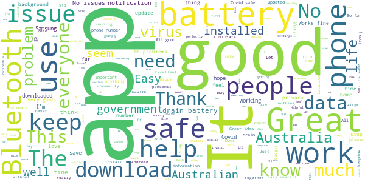
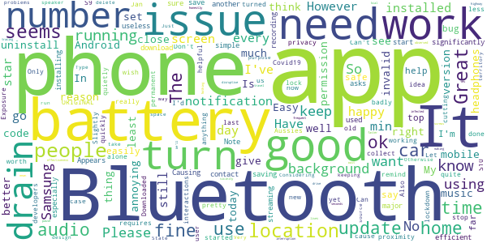
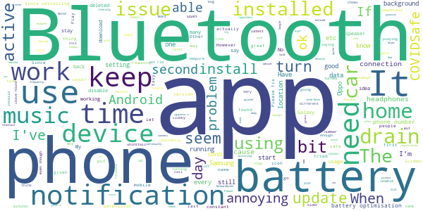
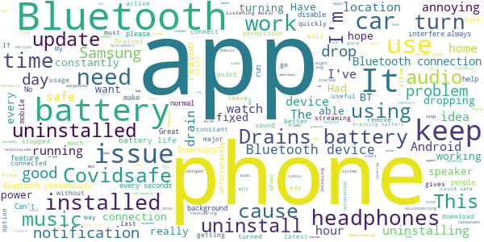
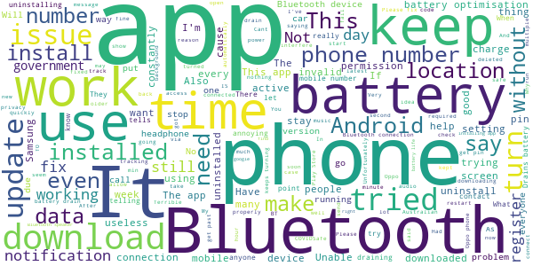

# COVIDSafe
App version ``1.0.18``

Analyzed with [covid-apps-observer](http://github.com/covid-apps-observer) project, version ``0.1``

## App overview
| | |
|-------------------------|-------------------------| 
| **Name**&nbsp;&nbsp;&nbsp;&nbsp;&nbsp;&nbsp;&nbsp;&nbsp;&nbsp;&nbsp;&nbsp;&nbsp;&nbsp;&nbsp;&nbsp;&nbsp;&nbsp;&nbsp;&nbsp;&nbsp;&nbsp;&nbsp;&nbsp;&nbsp;&nbsp;&nbsp;&nbsp;&nbsp;&nbsp;&nbsp;&nbsp;&nbsp;&nbsp;&nbsp;&nbsp;&nbsp;&nbsp;&nbsp;&nbsp;&nbsp;  | COVIDSafe |
| **Unique identifier** | au.gov.health.covidsafe |
| **Link to Google Play** | [https://play.google.com/store/apps/details?id=au.gov.health.covidsafe](https://play.google.com/store/apps/details?id=au.gov.health.covidsafe) |
| **Summary**  | COVIDSafe is a community-based way to stop the spread of COVID-19. |
| **Privacy policy** | [https://www.health.gov.au/using-our-websites/privacy](https://www.health.gov.au/using-our-websites/privacy) |
| **Latest version** | 1.0.18 |
| **Last update** | 2020-05-31 23:10:28 |
| **Recent changes** | Security and privacy enhancements Accessibility enhancements Bug fixes |
| **Installs**  | 1,000,000+ |
| **Category** | Health & Fitness |
| **First release** | Apr 25, 2020 |
| **Size**  | 6.0M |
| **Supported Android version**  | 6.0 and up |

### Description
> COVIDSafe app has been developed by the Australian Government Department of Health to help keep the community safe from coronavirus (COVID-19). Together, let’s help stop the spread and keep ourselves and each other healthy.
 COVIDSafe uses the Bluetooth® technology on your mobile phone to look for other devices with COVIDSafe installed. Your device will take a note of contact you’ve had with other users by securely logging the other user’s reference code. If you or someone you’ve been in contact with is diagnosed with COVID-19, the close contact information securely stored in your phone can be uploaded and used—with your consent—by state and territory health officials to quickly inform people who’ve been exposed to the virus.
 How you can help stop the spread of COVID-19:
 • Download the COVIDSafe app
 • Register using your mobile phone number, name, age range and postcode
 • Turn on Bluetooth®
 • Check that COVIDSafe is running when you are out and about or are likely to come into contact with others
 • If you test positive for COVID-19, you can consent for your close contact information to be used by state and territory health officials to contact people who may have been exposed. If you’ve been exposed to the virus by someone you’ve been in close contact with, state and territory health officials will be able to contact you quickly so you can get the support you need
 COVIDSafe is an Australian Government Department of Health initiative. Visit https://www.health.gov.au/resources/apps-and-tools/covidsafe-app for more information.

### User interface
The developers of the app provide the following screenshots in the Google play store.
| | | |
|:-------------------------:|:-------------------------:|:-------------------------:|
 |   |   |   | 
 |   |  

## Development team
In the following we report the main information provided by the development team in the Google play store.

| | |
|-------------------------|-------------------------|
| **Developer**  | Australian Department of Health |
| **Website**  | [https://www.health.gov.au/resources/apps-and-tools/covidsafe-app](https://www.health.gov.au/resources/apps-and-tools/covidsafe-app) |
| **Email** | support@COVIDSafe.gov.au |
| **Physical address**  | - |
| **Other developed apps**  | [https://play.google.com/store/apps/developer?id=Australian+Department+of+Health](https://play.google.com/store/apps/developer?id=Australian+Department+of+Health) |

## Android support

| | |
|-------------------------|-------------------------|
| **Declared target Android version**  | Android10, version 10 (API level 29) |
| **Effective target Android version**  | Android10, version 10 (API level 29) |
| **Minimum supported Android version**  | Marshmallow, version 6.0 (API level 23) |
| **Maximum target Android version**  | - |

The larger the difference between the minimum and maximum supported Android versions, the better. A larger difference means a wider audience. For example, old phones have a very low Android version, so a high minimum supported Android version means that the app cannot be used by users with old phones, thus leading to accessibility problems. 

## Requested permissions

In the following we report the complete list of the permissions requested by the app. 

| **Permission** | **Protection level** | **Description** | 
|-------------------------|-------------------------|-------------------------|
 **android.permission ACCESS_FINE_LOCATION** | :warning:**Dangerous** | Allows an app to access precise location. 
 **android.permission ACCESS_NETWORK_STATE** | Normal | Allows applications to access information about networks. 
 **android.permission BLUETOOTH** | Normal | Allows applications to connect to paired bluetooth devices. 
 **android.permission BLUETOOTH_ADMIN** | Normal | Allows applications to discover and pair bluetooth devices. 
 **android.permission FOREGROUND_SERVICE** | Normal | Allows a regular application to use Service.startForeground. 
 **android.permission INTERNET** | Normal | Allows applications to open network sockets. 
 **android.permission RECEIVE_BOOT_COMPLETED** | Normal | Allows an application to receive the Intent.ACTION_BOOT_COMPLETED that is broadcast after the system finishes booting. 
 **android.permission REQUEST_IGNORE_BATTERY_OPTIMIZATIONS** | Normal | Permission an application must hold in order to use Settings.ACTION_REQUEST_IGNORE_BATTERY_OPTIMIZATIONS. 

## Mentioned servers

| **Server** | **Registrant** | **Registrant country** | **Creation date** | 
|-------------------------|-------------------------|-------------------------|-------------------------|
 | stackoverflow.com | Stack Exchange, Inc. | :us: US | 2003-12-26 19:18:07 |
 | google.com | Google LLC | :us: US | 1997-09-15 04:00:00 |

## Security analysis 

Below we report the main security warnings raised by our execution of the [Androwarn](https://github.com/maaaaz/androwarn) security analysis tool.

**Connection interfaces exfiltration**
> - This application reads details about the currently active data network 
> - This application tries to find out if the currently active data network is metered 

**Suspicious connection establishment**
> - This application opens a Socket and connects it to the remote address ' returned no addresses for  ; port is out of range' on the 'N/A' port  
> - This application opens a Socket and connects it to the remote address '' on the 'N/A' port  
> - This application opens a Socket and connects it to the remote address 'Ljava/lang/StringBuilder;->toString()Ljava/lang/String;' on the 'N/A' port  
> - This application opens a Socket and connects it to the remote address 'Ljava/net/Proxy;->type()Ljava/net/Proxy$Type;' on the 'N/A' port  
> - This application opens a Socket and connects it to the remote address 'timeout' on the 'N/A' port  

## User ratings and reviews

Below we provide information about how end users are reacting to the app in terms of ratings and reviews in the Google Play store.

### Ratings

The COVIDSafe app has been installed by more than **1000000** times. At this time, **11234** rated the app and its average score is **3.402865**. Below we show the distribution of the ratings across the usual star-based rating of Google Play

:star::star::star::star::star:: 5300

:star::star::star::star:: 975

:star::star::star:: 935

:star::star:: 995

:star:: 3027

### Reviews 

#### 5-star reviews

> Great idea, everyone should use this.  :date: __2020-06-01 12:00:28__

> It does what's expected. I have no loss of other Bluetooth functions. Fitbit & earphones still run as before. It does not collect phone numbers, it collects Bluetooth id numbers, only if around for 15mins. Those id nmbrs can be seen using any free bluetooth scanner & tell you nothing. Only the remotely held database can link them to a phone number... if you download your id collection to the govt site... if you are diagnosed with CV-19. (BT sound cuts are from WIFI interaction & are common.)  :date: __2020-06-01 11:16:33__

> Just runs in the background without causing any issues. No Bluetooth connectivity issues, no battery issues.  :date: __2020-06-01 09:06:02__

> Covid safe 19 is most informative, Thank Gid oue Government installed it, it keeps all of us Safe cheers  :date: __2020-06-01 08:32:58__

> Looking at the source code myself, which has been public since 8th May, and checking what independent industry experts say. I feel confident in using this app, and that it does what we need and no more.  :date: __2020-06-01 06:41:59__

> The location requirement is for Bluetooth not actually used for GPS, uninformed people =(  :date: __2020-06-01 06:30:04__

> Works just fine and no issues with anything. Don't even know it's there.  :date: __2020-06-01 06:24:52__

> Every Australian should download this app.  :date: __2020-06-01 01:29:50__

> Works on my potato device, and I don't screw with the settings.  :date: __2020-06-01 00:39:42__

> Great work  :date: __2020-05-31 23:03:43__

#### 4-star reviews

> don't know  :date: __2020-06-01 03:41:22__

> Nothing at all just download it now  :date: __2020-05-31 01:38:40__

> Yes it drains the battery and screws with Bluetooth, but honestly just turn it and Bluetooth off for a while..making sure to do same for app running in the background. Works great for me  :date: __2020-05-30 08:41:49__

> Ok kcal keep d  :date: __2020-05-28 09:51:01__

> Is very save to get it saving lives  :date: __2020-05-28 08:22:36__

> We'll have to wait and see the effectiveness of this app until there are some infected people and they do contact tracing using this. In the mean time, I start with a major issue; 1. The app is significantly disruptive to bluetooth audio streaming. Causing the audio to pause every few seconds. This was observed during a drive on the highway. It seems that the interruption is more frequent the faster you travel and by the number of phones in the vicinity. Phones in the vicinty can disrupt the audio playing from another phone's bluetooth. Switching off bluetooth in the nearby phones stopped the breaks in the audio streaming. I think this is a major issue especially since more and more people are using bluetooth headphones especially in public transport and the app will become useless if people get annoyed and uninstall it for this reason. 2. The app asks for locations permission when installing. Some people maybe be off put by this thinking that it is recording their location. However I think the location is used so that the app can conduct it's handshake when it knows you've moved location rather than it explicitly recording your location (happy to be corrected). 3. The app seems fairly unobtrusive after 4 weeks of use. Battery drain is not significantly higher (running a Note 9 with Android 10)  :date: __2020-05-28 03:20:07__

> Appears to be efficient.  :date: __2020-05-26 13:28:44__

> Gets used in the background once you set it up, which is very simple  :date: __2020-05-25 13:32:38__

> In the FAQ, it is mentioned that COVIDSafe collects only phone numbers of people with close proximity. Upon installing the app it requires permission to access location. I would recommend developers to turn off location and only collect the phone numbers, of people in close proximity. The reason why many Aussies don't install the app, people are concerned about privacy. Without much people using the app it won't be helpful.  :date: __2020-05-25 12:25:55__

> Seems to work. The notifaction thats always on is annoying. Least I can turn it off on s20. Needs an option to turn that off. Please keep the updates to github. Its good to go through the code to make sure its still above board  :date: __2020-05-25 02:19:42__

#### 3-star reviews

> Would have rated 5 stars if data contract went to AUS company rather than "make America great" USA. Have to keep installing and deleting as it interferes with my other blutooth connections- car, speakers, training monitor etc  :date: __2020-06-01 03:10:03__

> Buggy on older Android 6.  :date: __2020-06-01 00:31:17__

> I installed v1.0.18 on two Pixels - on one I kept the current device name and on the other I chose the anonymous name "Android phone." Strangely, the latter device wasn't renamed (it still has the same name in settings).  :date: __2020-05-31 07:02:39__

> Please make it compulsory to use on public transport, public places, cafes, shops, etc. E.g. currently, people are using one common pen when leaving their details in cafes, etc. Not safe. Should be touchless like this app.  :date: __2020-05-31 04:34:07__

> OK but not as good as Triple J  :date: __2020-05-30 10:34:29__

> I used this for a bit less than a month. If you have a new phone with large battery and other apps running Bluetooth frequently, and always have icons in your notification area all the time, this app will just be one more of those, and you probably won't mind it. For me who does not use my phone this way, i found it the number one contributor to battery drain and literally the only notification that literally does not go away, regardless of whether you have the app active (bluetooth on).  :date: __2020-05-29 02:46:40__

> Ursing a lot of Battery up but it is kepping us safe  :date: __2020-05-29 01:48:37__

> Phone frequently complains about the amount of power this app uses  :date: __2020-05-29 00:49:02__

> I seamed to use all my data a lot quicker when installed  :date: __2020-05-28 14:10:59__

> I've had the app on my Oppo for quite a while now. No matter how many times I set the permissions to disable battery optimisation, it never, ever sticks. Every time I look at my phone, it says I've chosen for that app in particular to use up as much juice as it likes. But the app says it's not active and I need to check my permissions again. The last advice I found online, was to uninstall the app, update my OS and reinstall. But when I did that I found I already have the latest update!  :date: __2020-05-28 13:43:57__

#### 2-star reviews

> It keeps interfering with any additional bluetooth device that I connect to when running this app. For example, if I connect to a bluetooth speaker or to my car for hands-free and maps, it drops me out every 15min or so, losing connection and having to re-start everything manually again. It will suddenly cut out any calls, music or maps directions. Would be great if this was fixed so we can keep running it in the background without interruptions.  :date: __2020-06-01 00:59:35__

> I really want to support this as I believe in a community response to coronavirus, but this isn't it. There are known issues with iOS, so it's unlikely that I'm getting contact info from any iPhones. I've always had Bluetooth enabled (watch, car audio) but this app doesn't play with other devices, continuously dropping audio being the easiest example.  :date: __2020-05-31 15:50:06__

> Causes major connectivity issues with my Bluetooth devices, constantly makes my head phones and fitbit conect and reconnect at some points getting so bad (even when no one else is around) that i had to turn off the app. Also not a fan of the notification doesnt really need to be there constantly to do it job the app is doing that.  :date: __2020-05-31 10:28:25__

> Too resource demanding from my phone. Battery drains much quicker and bluetooth connections stutter constantly. Please download it because better safe than sorry.  :date: __2020-05-30 19:13:39__

> I do understand the importance and would still encourage all to download for the sake of society's safety BUT honestly, its slightly annoyingly as it does interfere with all additional Bluetooth devices (headphones, speakers) with audio pausing and distorting for 5 or so seconds every 30-60 seconds, extremely frustrating!  :date: __2020-05-30 07:14:39__

> Draws far to much power on this phone. From normal 5 days of use to now less than 24 hours since it was installed.  :date: __2020-05-30 06:06:21__

> Keeps turning on google head phones  :date: __2020-05-29 23:35:38__

> Drained the battery on both my phone and my Fitbit because they both use the bluetooth. I going to take a guess and say the app won't work if the phone goes flat  :date: __2020-05-29 09:27:58__

> The app keeps stopping and I have to manually reactivate it when I notice it not working, this makes me question its effectiveness to detect properly as advertised  :date: __2020-05-29 06:10:34__

> Interrupts other Bluetooth devices, like headphones, and chews through unreasonable amounts of power.  :date: __2020-05-29 04:16:12__

#### 1-star reviews

> Bad Bluetooth audio connectivity interference.  :date: __2020-06-01 12:29:50__

> This app stopped me from receiving text messages from international numbers. Not good considering I'm in Aus and my parents and family are in the UK. I've deleted the app and now have contact with my family.  :date: __2020-06-01 11:51:00__

> Cannot even register with a valid phone number. I tried tunring mobile data on but could not help. Wanted to do the right thing but app was very piorly designed  :date: __2020-06-01 07:54:13__

> Cant even put my mobile number in to register as it keeps saying invalid number... NO its not. I have deleted the app as I can't even sign up  :date: __2020-06-01 04:29:28__

> This app is so frustrating. I cannot get past inputting my phone number. I have tried all the troubleshooting ideas everyone suggested in the reviews and in the FAQ part of the app, but it keeps saying invalid number. I have a oppo Reno z. I would like to do more to help the community with contact tracing but this buggy app makes it impossible.  :date: __2020-06-01 04:02:46__

> Plz remove this app from the store! There are almost no new cases.  :date: __2020-06-01 03:55:45__

> It kept draining my phone battery  :date: __2020-06-01 02:02:09__

> Can't get the Covid Safe App to work on an Oppo Phone. Have delieted it and re installed and it still won't work.  :date: __2020-06-01 00:31:52__

> Why would anyone in their right minds install this terrible app? ... It is without any question of doubt a steaming heap of 💩 . You are playing with people's lives, how dare you present an app that is so inadequate in so many obvious ways. Fix it and fix it now!!!  :date: __2020-05-31 20:42:54__

> Battery drainer, but for "the good" of other people I will keep it on and charge my phone continuously throughout the day.  :date: __2020-05-31 15:36:24__

