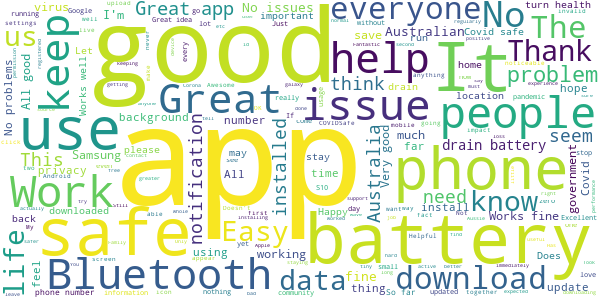
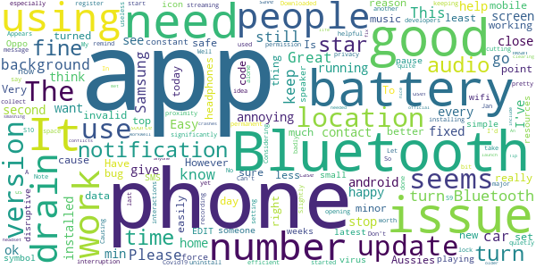
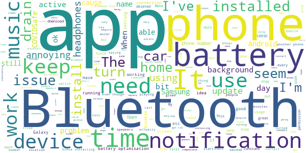
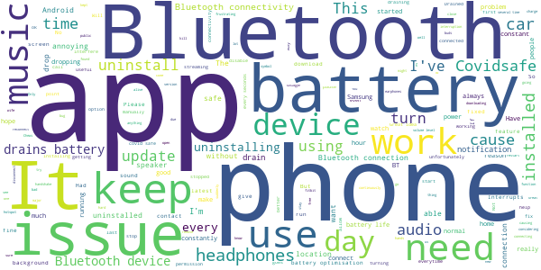
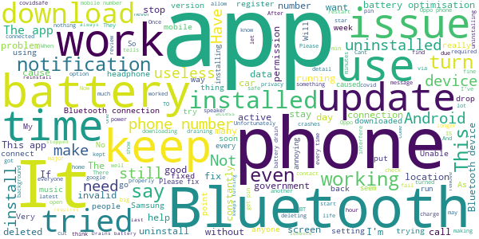

# COVIDSafe
App version ``1.0.21``

Analyzed with [covid-apps-observer](http://github.com/covid-apps-observer) project, version ``0.1``

## App overview
| | |
|-------------------------|-------------------------| 
| **Name**&nbsp;&nbsp;&nbsp;&nbsp;&nbsp;&nbsp;&nbsp;&nbsp;&nbsp;&nbsp;&nbsp;&nbsp;&nbsp;&nbsp;&nbsp;&nbsp;&nbsp;&nbsp;&nbsp;&nbsp;&nbsp;&nbsp;&nbsp;&nbsp;&nbsp;&nbsp;&nbsp;&nbsp;&nbsp;&nbsp;&nbsp;&nbsp;&nbsp;&nbsp;&nbsp;&nbsp;&nbsp;&nbsp;&nbsp;&nbsp;  | COVIDSafe |
| **Unique identifier** | au.gov.health.covidsafe |
| **Link to Google Play** | [https://play.google.com/store/apps/details?id=au.gov.health.covidsafe](https://play.google.com/store/apps/details?id=au.gov.health.covidsafe) |
| **Summary**  | COVIDSafe is a community-based way to stop the spread of COVID-19. |
| **Privacy policy** | [https://www.health.gov.au/using-our-websites/privacy](https://www.health.gov.au/using-our-websites/privacy) |
| **Latest version** | 1.0.21 |
| **Last update** | 2020-06-04 14:35:03 |
| **Recent changes** | Improved backwards compatibility to include Android 5.1 operating systems. Users can now download the app from non-Australian Google Play stores. Enhancements to accessibility. |
| **Installs**  | 1,000,000+ |
| **Category** | Health & Fitness |
| **First release** | Apr 25, 2020 |
| **Size**  | 7.1M |
| **Supported Android version**  | 5.0 and up |

### Description
> COVIDSafe app has been developed by the Australian Government Department of Health to help keep the community safe from coronavirus (COVID-19). Together, let’s help stop the spread and keep ourselves and each other healthy.
 COVIDSafe uses the Bluetooth® technology on your mobile phone to look for other devices with COVIDSafe installed. Your device will take a note of contact you’ve had with other users by securely logging the other user’s reference code. If you or someone you’ve been in contact with is diagnosed with COVID-19, the close contact information securely stored in your phone can be uploaded and used—with your consent—by state and territory health officials to quickly inform people who’ve been exposed to the virus.
 How you can help stop the spread of COVID-19:
 • Download the COVIDSafe app
 • Register using your mobile phone number, name, age range and postcode
 • Turn on Bluetooth®
 • Check that COVIDSafe is running when you are out and about or are likely to come into contact with others
 • If you test positive for COVID-19, you can consent for your close contact information to be used by state and territory health officials to contact people who may have been exposed. If you’ve been exposed to the virus by someone you’ve been in close contact with, state and territory health officials will be able to contact you quickly so you can get the support you need
 COVIDSafe is an Australian Government Department of Health initiative. Visit https://www.health.gov.au/resources/apps-and-tools/covidsafe-app for more information.

### User interface
The developers of the app provide the following screenshots in the Google play store.
| | | |
|:-------------------------:|:-------------------------:|:-------------------------:|
 |   |   |   | 
 |   |  

## Development team
In the following we report the main information provided by the development team in the Google play store.

| | |
|-------------------------|-------------------------|
| **Developer**  | Australian Department of Health |
| **Website**  | [https://www.health.gov.au/resources/apps-and-tools/covidsafe-app](https://www.health.gov.au/resources/apps-and-tools/covidsafe-app) |
| **Email** | support@COVIDSafe.gov.au |
| **Physical address**  | - |
| **Other developed apps**  | [https://play.google.com/store/apps/developer?id=Australian+Department+of+Health](https://play.google.com/store/apps/developer?id=Australian+Department+of+Health) |

## Android support

| | |
|-------------------------|-------------------------|
| **Declared target Android version**  | Pie, version 9 (API level 28) |
| **Effective target Android version**  | Pie, version 9 (API level 28) |
| **Minimum supported Android version**  | Marshmallow, version 6.0 (API level 23) |
| **Maximum target Android version**  | - |

The larger the difference between the minimum and maximum supported Android versions, the better. A larger difference means a wider audience. For example, old phones have a very low Android version, so a high minimum supported Android version means that the app cannot be used by users with old phones, thus leading to accessibility problems. 

## Requested permissions

In the following we report the complete list of the permissions requested by the app. 

| **Permission** | **Protection level** | **Description** | 
|-------------------------|-------------------------|-------------------------|
 **android.permission ACCESS_FINE_LOCATION** | :warning:**Dangerous** | Allows an app to access precise location. 
 **android.permission ACCESS_NETWORK_STATE** | Normal | Allows applications to access information about networks. 
 **android.permission BLUETOOTH** | Normal | Allows applications to connect to paired bluetooth devices. 
 **android.permission BLUETOOTH_ADMIN** | Normal | Allows applications to discover and pair bluetooth devices. 
 **android.permission FOREGROUND_SERVICE** | Normal | Allows a regular application to use Service.startForeground. 
 **android.permission INTERNET** | Normal | Allows applications to open network sockets. 
 **android.permission RECEIVE_BOOT_COMPLETED** | Normal | Allows an application to receive the Intent.ACTION_BOOT_COMPLETED that is broadcast after the system finishes booting. 
 **android.permission REQUEST_IGNORE_BATTERY_OPTIMIZATIONS** | Normal | Permission an application must hold in order to use Settings.ACTION_REQUEST_IGNORE_BATTERY_OPTIMIZATIONS. 

## Mentioned servers

| **Server** | **Registrant** | **Registrant country** | **Creation date** | 
|-------------------------|-------------------------|-------------------------|-------------------------|
 | stackoverflow.com | Stack Exchange, Inc. | :us: US | 2003-12-26 19:18:07 |
 | google.com | Google LLC | :us: US | 1997-09-15 04:00:00 |

## Security analysis 

Below we report the main security warnings raised by our execution of the [Androwarn](https://github.com/maaaaz/androwarn) security analysis tool.

**Connection interfaces exfiltration**
> - This application reads details about the currently active data network 
> - This application tries to find out if the currently active data network is metered 

**Suspicious connection establishment**
> - This application opens a Socket and connects it to the remote address ' returned no addresses for  ; port is out of range' on the 'N/A' port  
> - This application opens a Socket and connects it to the remote address '' on the 'N/A' port  
> - This application opens a Socket and connects it to the remote address 'Ljava/lang/StringBuilder;->toString()Ljava/lang/String;' on the 'N/A' port  
> - This application opens a Socket and connects it to the remote address 'Ljava/net/Proxy;->type()Ljava/net/Proxy$Type;' on the 'N/A' port  
> - This application opens a Socket and connects it to the remote address 'timeout' on the 'N/A' port  

## User ratings and reviews

Below we provide information about how end users are reacting to the app in terms of ratings and reviews in the Google Play store.

### Ratings

The COVIDSafe app has been installed by more than **1000000** times. At this time, **11401** rated the app and its average score is **3.3852243**. Below we show the distribution of the ratings across the usual star-based rating of Google Play

:star::star::star::star::star:: 5384

:star::star::star::star:: 982

:star::star::star:: 882

:star::star:: 942

:star:: 3208

### Reviews 

#### 5-star reviews

> It is good because it helps me be covid-19 safe so this is why I think that this game is the greatest game  :date: __2020-06-07 19:16:18__

> Awesome app  :date: __2020-06-07 10:28:18__

> Works well. Enough info.  :date: __2020-06-07 08:45:07__

> Worried  :date: __2020-06-07 05:23:37__

> Wait 4PERFECT#CORRECTION  :date: __2020-06-06 07:40:42__

> Extends very good information  :date: __2020-06-06 01:02:19__

> I haven't heard or receive notification at all.  :date: __2020-06-05 03:31:19__

> Good  :date: __2020-06-05 02:24:29__

> All good. No issues on my OnePlus 6T  :date: __2020-06-04 06:04:49__

> Happy to Keep Everyone in My Family Safe by Using this App  :date: __2020-06-04 05:17:32__

#### 4-star reviews

> need more stats showing growth/decline  :date: __2020-06-07 02:11:23__

> Sometimes I forget to turn Bluetooth back on again after I have turned it off. I think it would be good if the app sent me an SMS or email reminder eg hourly to turn Bluetooth on again if I have forgotten to turn Bluetooth on again. Cheers.  :date: __2020-06-06 05:53:08__

> A good use of technology to help reduce the spread of this disease. Leaving bluetooth on sure drains the battery though. This latest version stops unexpectedly when using other apps and causes error messages.  :date: __2020-06-04 15:51:30__

> Necessary App to keep searching for data from point to point. Ultimately arriving at a point where collected.  :date: __2020-06-03 08:31:10__

> Have to force my Oppo Reno Z to keep the app using resources otherwise it shuts down. Therefore I get a constant notification that my phone is using excess resources but only a minor issue.  :date: __2020-06-02 05:57:12__

> The use of Bluetooth was disruptive in the 1st version: if you were listening to music using a Bluetooth speaker, for instance, there was a 3 to 5 seconds pause every time you were in contact with someone using the same app. Very annoying! This new version has fixed this and the interruption is now very brief, 1 second or a bit less. Congrats to the dev team! I still hit a minor issue: my phone# was rejected when I tried to register. Closing and opening the app fixed the glitch.  :date: __2020-06-01 14:10:01__

> don't know  :date: __2020-06-01 03:41:22__

> Nothing at all just download it now  :date: __2020-05-31 01:38:40__

> Yes it drains the battery and screws with Bluetooth, but honestly just turn it and Bluetooth off for a while..making sure to do same for app running in the background. Works great for me  :date: __2020-05-30 08:41:49__

> Ok kcal keep d  :date: __2020-05-28 09:51:01__

#### 3-star reviews

> Needs to be more compatible with older device. Drains the battery, my phone is about 3+ years old. Keep bluetooth off and disable app permissions unless i leave the house. Easy to install.  :date: __2020-06-07 21:41:19__

> Can't RESTRICT even though I've opened within a month it still shows Error in my notification panel  :date: __2020-06-07 14:04:17__

> Not always sure it is still working  :date: __2020-06-07 11:48:35__

> Maybe it could do with an immediate connect mode so that gyms and places that need to maintain contact lists , could use the app at reception to record contacts  :date: __2020-06-07 01:04:53__

> I removed this app. I'm not sure if it's a coincidence but just after installing I started getting suspicious activity on some of my apps and gmail. Not wanting to take any chances.  :date: __2020-06-06 14:54:21__

> Frustrating to set up. The app will not accept your phone number, saying there is an error with your phone number, if there is a problem on the previous screen. Where you enter your name, the supplied model shows "First, Family" name implying to put a comma between your names, but doing so gives the message on the subsequent page about the phone number. In addition where you enter your number, the prefix +61 is written for you. But you must enter the initial zero, despite international protocols  :date: __2020-06-04 13:15:36__

> A great idea, but it keeps interfering with my Bluetooth connection, making it drop out regularly :( This makes playing any music or podcasts using headphones or car VERY annoying due to constant restarts. Please fix ASAP. UPDATE 4 JUNE 2020: Bluetooth issues seem to be fixed. Changed rating from 1 star.  :date: __2020-06-04 09:13:53__

> 1.0.18 installed, 25 May, 2020... Let see if it drains my Battery, ifvso I shall term using this!  :date: __2020-06-03 23:51:08__

> It slow down my smartphone system samsung note 9 and sometime my smartphone don't respond it just freeze there . I have to switch off and than on just to see if my note 9 respond or or not.  :date: __2020-06-03 16:39:37__

> Every now and then the app no longer run in the background. Weird  :date: __2020-06-03 09:00:43__

#### 2-star reviews

> Can't tell if it's doing anything except drain your battery.. Only have it as a work requirement  :date: __2020-06-07 14:51:56__

> Kills my battery  :date: __2020-06-07 00:40:16__

> As a developer myself I looked into the security concerns and I was satisified with what I saw. I read the reviews of people describing how it screwed up their Bluetooth connectivity but i thought I'd give it a try anyway hoping that might not happen for me. Well, it stopped my watch from connecting to my phone and it started interfering when my phone was connected to the car. So after 2 days I've given up. I will happily reinstall it once they can fix these issues but not until then  :date: __2020-06-06 11:29:11__

> I have had to uninstall because it uses too much battery power. I will be uninstalling it on my husband phone too as he used to only need to charge his phone every 2-3 days prior to installing this app. But now he needs to charge it twice a day.  :date: __2020-06-04 22:01:29__

> App started well. But after some time I noticed a lot of un-charactistic that were not usual. In coming call - the screen goes black. Warnings of battery failure. High battery usage. Moving through apps was slower than normal.Some apps would not open or freeze on the screen. Found bluetooth connections with other devices also impossible, had to restart phone every time to fix it. Once deleted most if not all functional operation has returned on first day. Not happy needs work here to re-instal  :date: __2020-06-04 15:22:55__

> Since latest update, CONSTANT crashing and battery draining, not to mention interference with bluetooth devices.  :date: __2020-06-04 14:40:04__

> It was the best thing ever when it first came out.. Now I think everyone else has it so it drains my battery as it continuously poll's Bluetooth devices as I am always around large amounts of people.  :date: __2020-06-04 09:51:32__

> Keeps dropping my Bluetooth audio connections - calls and music. Really annoying. New version crashes regularly and needs to be manually restarted.  :date: __2020-06-04 05:24:03__

> Bluetooth connectivity interruptions make this so very annoying especially when in close contact to others. Please make work without needing to mess up Bluetooth.  :date: __2020-06-03 04:15:07__

> Tacky App.  :date: __2020-06-02 11:50:07__

#### 1-star reviews

> Stop deleting my review Google. Useless app when the government won't stop protesters for black lives matter.  :date: __2020-06-08 00:25:27__

> Disrupted my Bluetooth connection with my fit bit watch. Stopped the messages and calls coming through most of the time despite all tries to reestablish the connection. I could fix this sometimes for a few hours, sometimes it didn't even reconnect to my watch despite manually trying to connect. All resolved after I deleted it. plus some minor issues with other Bluetooth connections.  :date: __2020-06-07 22:43:42__

> Glitching Bluetooth devices  :date: __2020-06-07 18:07:32__

> I am deleting. Obviously there is no danger any more if our governments are willing to allow 30,000 to gather for a protest. If anyone contracts the virus because of this, then they should sue the organisers and the government. I know I will. Maybe I'll organise a protest at the MCG next Thursday night, and see how quickly I am fined. Guess what....my life matters too. Dumbarses.  :date: __2020-06-07 16:26:51__

> As mentioned in many reviews, this app has a major issue that prevents my Bluetooth headphones hold connection with my phone. I really want to install this app and help to fight the pandemic, but at the moment I had to uninstall it. Very sad, do you guys even test it?  :date: __2020-06-07 13:29:47__

> After last week's update I couldn't make or receive phone calls on my Oppo Reno z2. The issue only resolved after uninstalling this app.  :date: __2020-06-07 12:36:08__

> Waste of tax payers dollars. Why is my comments being deleted?  :date: __2020-06-07 12:04:06__

> Does not find my bluetooth so unistalled. Windows 10 running bluestacks.  :date: __2020-06-07 10:43:49__

> I have given up on this app as I cannot get a pin number for the verification process no matter how many times I try.  :date: __2020-06-07 07:31:20__

> The app crashes on launch for me now.  :date: __2020-06-07 04:45:49__

