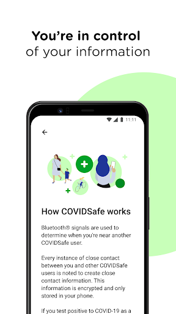
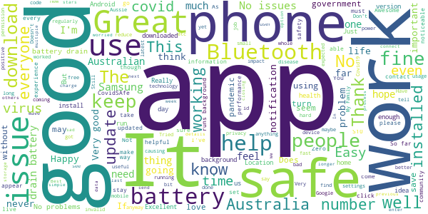
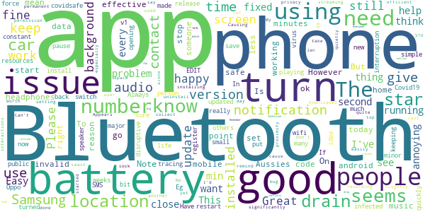
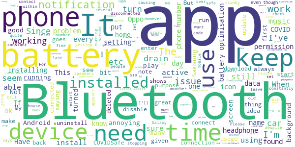
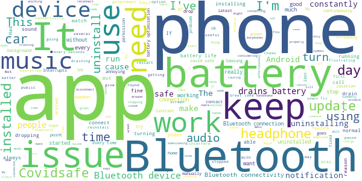
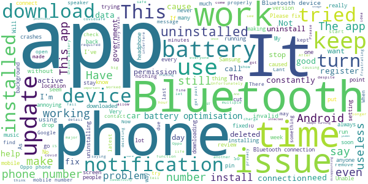

# COVIDSafe
App version ``1.0.28``

Analyzed with [covid-apps-observer](http://github.com/covid-apps-observer) project, version ``0.1``

## App overview
| | |
|-------------------------|-------------------------| 
| **Name**&nbsp;&nbsp;&nbsp;&nbsp;&nbsp;&nbsp;&nbsp;&nbsp;&nbsp;&nbsp;&nbsp;&nbsp;&nbsp;&nbsp;&nbsp;&nbsp;&nbsp;&nbsp;&nbsp;&nbsp;&nbsp;&nbsp;&nbsp;&nbsp;&nbsp;&nbsp;&nbsp;&nbsp;&nbsp;&nbsp;&nbsp;&nbsp;&nbsp;&nbsp;&nbsp;&nbsp;&nbsp;&nbsp;&nbsp;&nbsp;  | COVIDSafe |
| **Unique identifier** | au.gov.health.covidsafe |
| **Link to Google Play** | [https://play.google.com/store/apps/details?id=au.gov.health.covidsafe](https://play.google.com/store/apps/details?id=au.gov.health.covidsafe) |
| **Summary**  | COVIDSafe is a community-based way to stop the spread of COVID-19. |
| **Privacy policy** | [https://www.health.gov.au/using-our-websites/privacy](https://www.health.gov.au/using-our-websites/privacy) |
| **Latest version** | 1.0.28 |
| **Last update** | 2020-06-18 11:47:23 |
| **Recent changes** | More people in Australia can now download and use the app. We have added support international and Australian External Territories mobile numbers. Improved accessibility, usability and functionality.  Bug fixes. |
| **Installs**  | 1,000,000+ |
| **Category** | Health & Fitness |
| **First release** | Apr 25, 2020 |
| **Size**  | 11M |
| **Supported Android version**  | 5.0 and up |

### Description
> COVIDSafe app has been developed by the Australian Government Department of Health to help keep the community safe from coronavirus (COVID-19). Together, let’s help stop the spread and keep ourselves and each other healthy.
 COVIDSafe uses the Bluetooth® technology on your mobile phone to look for other devices with COVIDSafe installed. Your device will take a note of contact you’ve had with other users by securely logging the other user’s reference code. If you or someone you’ve been in contact with is diagnosed with COVID-19, the close contact information securely stored in your phone can be uploaded and used—with your consent—by state and territory health officials to quickly inform people who’ve been exposed to the virus.
 How you can help stop the spread of COVID-19:
 • Download the COVIDSafe app
 • Register using your mobile phone number, name, age range and postcode
 • Turn on Bluetooth®
 • Check that COVIDSafe is running when you are out and about or are likely to come into contact with others
 • If you test positive for COVID-19, you can consent for your close contact information to be used by state and territory health officials to contact people who may have been exposed. If you’ve been exposed to the virus by someone you’ve been in close contact with, state and territory health officials will be able to contact you quickly so you can get the support you need
 COVIDSafe is an Australian Government Department of Health initiative. Visit https://www.health.gov.au/resources/apps-and-tools/covidsafe-app for more information.

### User interface
The developers of the app provide the following screenshots in the Google play store.
| | | |
|:-------------------------:|:-------------------------:|:-------------------------:|
 |   |   |   | 
 |   |  

## Development team
In the following we report the main information provided by the development team in the Google play store.

| | |
|-------------------------|-------------------------|
| **Developer**  | Australian Department of Health |
| **Website**  | [https://www.health.gov.au/resources/apps-and-tools/covidsafe-app](https://www.health.gov.au/resources/apps-and-tools/covidsafe-app) |
| **Email** | support@COVIDSafe.gov.au |
| **Physical address**  | - |
| **Other developed apps**  | [https://play.google.com/store/apps/developer?id=Australian+Department+of+Health](https://play.google.com/store/apps/developer?id=Australian+Department+of+Health) |

## Android support

| | |
|-------------------------|-------------------------|
| **Declared target Android version**  | Pie, version 9 (API level 28) |
| **Effective target Android version**  | Pie, version 9 (API level 28) |
| **Minimum supported Android version**  | Lollipop, version 5.0 (API level 21) |
| **Maximum target Android version**  | - |

The larger the difference between the minimum and maximum supported Android versions, the better. A larger difference means a wider audience. For example, old phones have a very low Android version, so a high minimum supported Android version means that the app cannot be used by users with old phones, thus leading to accessibility problems. 

## Requested permissions

In the following we report the complete list of the permissions requested by the app. 

| **Permission** | **Protection level** | **Description** | 
|-------------------------|-------------------------|-------------------------|
 **android.permission ACCESS_FINE_LOCATION** | :warning:**Dangerous** | Allows an app to access precise location. 
 **android.permission ACCESS_NETWORK_STATE** | Normal | Allows applications to access information about networks. 
 **android.permission BLUETOOTH** | Normal | Allows applications to connect to paired bluetooth devices. 
 **android.permission BLUETOOTH_ADMIN** | Normal | Allows applications to discover and pair bluetooth devices. 
 **android.permission FOREGROUND_SERVICE** | Normal | Allows a regular application to use Service.startForeground. 
 **android.permission INTERNET** | Normal | Allows applications to open network sockets. 
 **android.permission RECEIVE_BOOT_COMPLETED** | Normal | Allows an application to receive the Intent.ACTION_BOOT_COMPLETED that is broadcast after the system finishes booting. 
 **android.permission REQUEST_IGNORE_BATTERY_OPTIMIZATIONS** | Normal | Permission an application must hold in order to use Settings.ACTION_REQUEST_IGNORE_BATTERY_OPTIMIZATIONS. 

## Mentioned servers

| **Server** | **Registrant** | **Registrant country** | **Creation date** | 
|-------------------------|-------------------------|-------------------------|-------------------------|
 | stackoverflow.com | Stack Exchange, Inc. | :us: US | 2003-12-26 19:18:07 |
 | google.com | Google LLC | :us: US | 1997-09-15 04:00:00 |

## Security analysis 

Below we report the main security warnings raised by our execution of the [Androwarn](https://github.com/maaaaz/androwarn) security analysis tool.

**Connection interfaces exfiltration**
> - This application reads details about the currently active data network 
> - This application tries to find out if the currently active data network is metered 

**Suspicious connection establishment**
> - This application opens a Socket and connects it to the remote address ' returned no addresses for  ; port is out of range' on the 'N/A' port  
> - This application opens a Socket and connects it to the remote address '' on the 'N/A' port  
> - This application opens a Socket and connects it to the remote address 'Ljava/lang/StringBuilder;->toString()Ljava/lang/String;' on the 'N/A' port  
> - This application opens a Socket and connects it to the remote address 'Ljava/net/Proxy;->type()Ljava/net/Proxy$Type;' on the 'N/A' port  
> - This application opens a Socket and connects it to the remote address 'timeout' on the 'N/A' port  

## User ratings and reviews

Below we provide information about how end users are reacting to the app in terms of ratings and reviews in the Google Play store.

### Ratings

The COVIDSafe app has been installed by more than **1000000** times. At this time, **11674** rated the app and its average score is **3.2178388**. Below we show the distribution of the ratings across the usual star-based rating of Google Play

:star::star::star::star::star:: 5026

:star::star::star::star:: 961

:star::star::star:: 951

:star::star:: 1001

:star:: 3734

### Reviews 

#### 5-star reviews

> Good app 👍 made me feel 💯. The things is only use more 🔋 battery than normal.  :date: __2020-06-22 00:41:26__

> Check out the new Australia+tick notification icon !  :date: __2020-06-21 23:10:04__

> Super  :date: __2020-06-21 15:08:59__

> love it so much  :date: __2020-06-21 12:51:56__

> Worthy aim and a way we can all help. Version 1.0 28 is even more stable for me. 1.0.21 stays alive long enough to be useful. Still stops working after several hours and rebooting is needed to get going again. Version 6.0.1 of Android. Err message flashes with description "Unfortunately, Bluetooth Share has stopped". In this state I couldn't even answer a call. Very little usefulness for my Motorola Moto G 3rd generation. Tried with versions 1.0.1, 1.0.16, 1.0.17 with no success. Still hopeful.  :date: __2020-06-21 12:47:13__

> A good use of technology to help reduce the spread of this disease. Leaving bluetooth on sure drains the battery though. This latest version solved the previous problem of unexpectedly closing.  :date: __2020-06-21 12:02:36__

> Seems to work fine. Hope never to find out....  :date: __2020-06-21 11:53:01__

> Doesn't drain battery, faster than usual anyway have not noticed it causing any additional issues that I can attribute to this app. Stays on all the time. Have never had to restart.  :date: __2020-06-21 01:26:33__

> Brilliant!! Thank you 😁  :date: __2020-06-20 15:29:37__

> Zero issues. Works as intended. Some initial issues with Bluetooth streaming audio but these are easily overcome with updates and firmware updates on speakers.  :date: __2020-06-20 12:55:42__

#### 4-star reviews

> A work in progress, be patient folks  :date: __2020-06-19 02:30:01__

> I'll give 5 stars when @VictorianCHO's (and/or other states') contact tracers release evidence clearly demonstrating that it is an effective, and cost effective, adjunct to manual contact tracing, and thus can a) help put asymptomatic carriers into quarantine, and b) extinguish hot spots more quickly. Their hype, my hope. Happy since v1.0.16 that it no longer nags to switch on GPS. v1.0.11 did. On this Samsung S5 the Bluetooth BLE being "on" doesn't cut battery life. [Redacted 15 June '20]  :date: __2020-06-15 05:57:03__

> Tip: as the app conflicts with my Bluetooth headphones. You can go to settings > apps > force stop. As needed. An official fix would be nice 😊  :date: __2020-06-14 07:10:17__

> Workwell I haven't met anyone with the virus  :date: __2020-06-12 12:48:54__

> Good to see the latest update to include older android versions seems to be working my bluetooth headset stops playing for a second when someone's close  :date: __2020-06-10 19:39:16__

> This app is really smashing my battery life!  :date: __2020-06-09 11:14:01__

> Easy to use, simple  :date: __2020-06-09 02:46:49__

> The app crashes on launch for me now. EDIT: I fixed this by clearing the apps data from storage, but that of course means that all contacts I've logged over the past few weeks have been lost.  :date: __2020-06-08 13:35:39__

> Please remove it from the notification tray it is annoying, the small symbol above like wifi bluetooth ect is fine. Happy to help fellow Aussies. 5 stars if that is fixed.  :date: __2020-06-08 04:40:44__

> Mmm  :date: __2020-06-08 02:57:17__

#### 3-star reviews

> Not sure it is working properly. Everytime I decide to check in on the app, it says battery optimiser is on and it's not working. I then put this on but it goes back to off again. Also there is no way in settings to make sure this app doesn't get this treatment. Ahh!!  :date: __2020-06-22 01:48:43__

> Why does it keep stopping? I support the use of this app, but it keeps stopping. Even though battery optimisation is on in my settings, the app keeps requesting I turn optimisation on. After being out for 4 hours yesterday, I found that the app wasn't activated because it had turned itself off. Now if I was in contact with anyone who is diagnosed with covid-19 I'll never know.  :date: __2020-06-21 23:39:05__

> Interferes with Bluetooth when using video or audio playback causing pauses in the playback. Samsung s10.  :date: __2020-06-21 15:13:59__

> I keep getting flash notifications "connected to null" "disconnected to null". I'm guessing this is the 'handshake'' thing it does. But it's very frustrating. Flashing up every 15-60 seconds. It's come up 8 times while typing this. I don't want to, but I'll have to delete it.  :date: __2020-06-21 11:36:10__

> Keeps becoming in activr  :date: __2020-06-21 02:43:51__

> If I use 'Clean Master', will the data you guy's need be erased?  :date: __2020-06-20 05:13:18__

> It keeps stopping, several times a day. Seems to be when I'm browsing other apps such as Twitter, Instagram or news. I'm not sure that it's much use anyway, if I need to be near someone for 15 minutes. For example, I went for a flu shot. I waited my turn, sitting 1.5m from other people, for less than 15 minutes. I was in the room with the nurse, up close, getting an injection, for less than 15 minutes. None of those contacts would have been logged.  :date: __2020-06-18 01:02:10__

> I aint seen it do any thing just get u to down load so can track you  :date: __2020-06-18 00:04:56__

> Bluetooth dropouts... Disappointing but I guess it serves its purpose..  :date: __2020-06-14 11:03:05__

> Apps a good idea, I'm relying on this apps to keep my family and myself safe but it keeps on turning itself off.  :date: __2020-06-13 12:46:39__

#### 2-star reviews

> Whilst it may help keep us safe it does seem to be at the cost of hogging your bluetooth so nothing else will connect properly. As an essential worker I'm traveling into the city every day(a 2 hr trip) and this app means I can't listen to music. If I'm in the car the connection keeps dropping meaning I can't receive calls if I must. The only reason this doesn't get 1 start is that I appreciate it is to try and keep us safe.  :date: __2020-06-21 22:29:39__

> Had to uninstall. Constantly stopping and requires manual restart. Too frustrating.  :date: __2020-06-20 23:18:01__

> Covid safe can't even update itself! Really? Lift your game government!  :date: __2020-06-19 07:37:34__

> With the COVIDSafe app installed I'm unable to install updates to any apps through the play store. Some notifications are repeating and others delayed or not received. After uninstalling COVIDSafe app and restarting phone am able to apply Play store updates and notification issues are resolved. I reinstall the app when going out but suspect that my historical data has been lost every time I uninstall the app.  :date: __2020-06-19 06:20:33__

> Just downloaded it, as I've been working from home since beginning of March, and back at work on Monday thought it was best I had it on the phone. But, will see how much battery it uses and how irritating it becomes if it does that is, before I up or down the star rating.  :date: __2020-06-19 01:39:35__

> While it's a good idea, battery life is horrible now my phone is flat before 4pm usually 8/9pm before I need to charge my phone. My phone cuts out when using Bluetooth especially music. Sure with all the tech gurus there could be a better system.  :date: __2020-06-17 02:44:01__

> Buggy. (Motorola G 3rd Gen Android 6) Seems to work ok for 1 - 3 hours, but time is uncertain as phone rarely leaves my pocket. Then gives error message "Unfortunately bluetooth share has stopped" Phone is then locked and must be restarted to get any functionality. Bluetooth is active on restart. No other apps using bluetooth.  :date: __2020-06-16 09:30:42__

> flattened my battery. At least work out how to turn it off at night and then restart in the morning automatically. Sort of geo fence your home location  :date: __2020-06-15 04:15:20__

> It was ok at first, but i noticed lots of connectivity issues and CovidSafe was the last app installed, after uninstalling the app, connection issues appear to be resolved.  :date: __2020-06-14 08:21:30__

> Keeps asking for battery optimisation permission everytime  :date: __2020-06-13 06:16:13__

#### 1-star reviews

> It disappears after a short time. Unreliable  :date: __2020-06-22 00:04:08__

> Really WANT to use the app, think it's a good idea but am unable to register. The app doesn't reject my mobile phone number - it tells me it's sent the PIN to my number, which is shown correctly on the screen, but the PIN doesn't arrive. Tried wifi & mobile data, with 0 at front of my number & without, done clean reinstalls, phone (Nokia 6, Android 9) software up to date - no luck. Support unhelpful. UPDATE 23 May: Still can't to register, emails now ignored. 21 JUNE: Still can't register.  :date: __2020-06-21 11:18:07__

> Dependent on bluetooth connectivity too much for this app to have it constantly crashing. Always disconnecting from other devices. Uninstalling this app until reviews advise it's working better  :date: __2020-06-21 09:29:32__

> Apparently useless. Uninstalled.  :date: __2020-06-21 03:05:20__

> I'm not happy with the app using Bluetooth they should use the location instead Bluetooth is easy for hackers  :date: __2020-06-21 01:57:50__

> Cannot get it my LG Android phone  :date: __2020-06-20 12:16:36__

> Whilst the purpose of this app is fantastic it interferes with the playback of music through Bluetooth headphones or the Bluetooth connection in the car. It causes drop outs that last up to 5 or so seconds and this is really frustrating. I uninstalled the app because of this and have only reinstalled it to leave feedback. I will be uninstalling it after this.  :date: __2020-06-20 01:15:45__

> 28 versions of this app so far and still not working properly. Nobody stay next to me for less than 4 minutes so pointless having it on. It is on my phone so why do you want it.  :date: __2020-06-19 19:02:20__

> App frequently stops. Bluetooth switches off unexpectedly. These issues together with the fact that it depends on close proximity for an extended period of time makes the app ineffective for its intended purpose. As stated elsewhere in these reviews, it only takes the time for a sneeze or a cough to become infected. Still have it installed but not as optimistic as those in power are. A very disappointing app.  :date: __2020-06-19 11:45:25__

> Needs to use the Apple-Google API that other countries are adopting because it's the only one that works properly.  :date: __2020-06-19 11:28:45__

