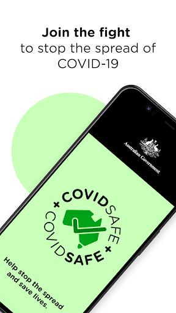
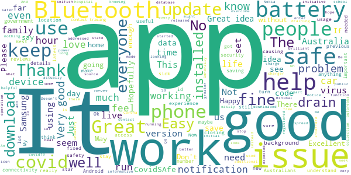
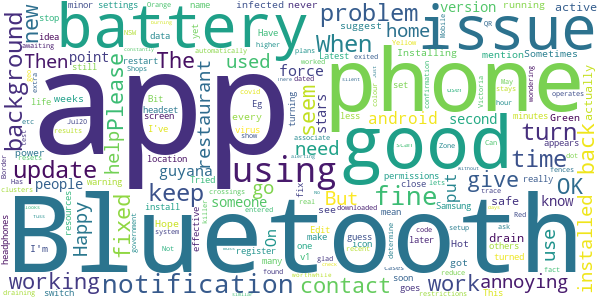
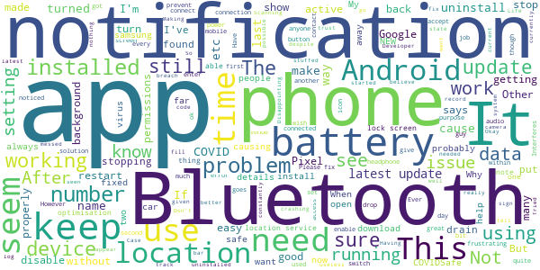
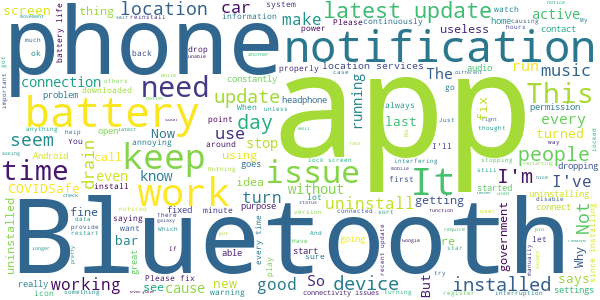
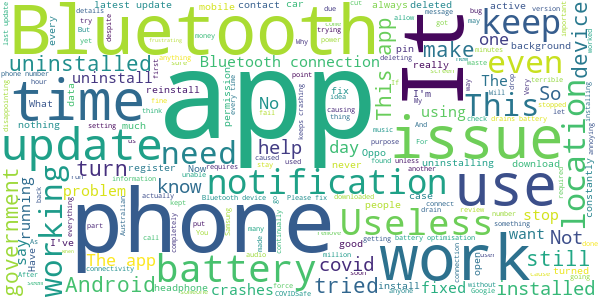

# COVIDSafe
App version ``1.0.39``

Analyzed with [covid-apps-observer](http://github.com/covid-apps-observer) project, version ``0.1``

## App overview
| | |
|-------------------------|-------------------------| 
| **Name**&nbsp;&nbsp;&nbsp;&nbsp;&nbsp;&nbsp;&nbsp;&nbsp;&nbsp;&nbsp;&nbsp;&nbsp;&nbsp;&nbsp;&nbsp;&nbsp;&nbsp;&nbsp;&nbsp;&nbsp;&nbsp;&nbsp;&nbsp;&nbsp;&nbsp;&nbsp;&nbsp;&nbsp;&nbsp;&nbsp;&nbsp;&nbsp;&nbsp;&nbsp;&nbsp;&nbsp;&nbsp;&nbsp;&nbsp;&nbsp;  | COVIDSafe |
| **Unique identifier** | au.gov.health.covidsafe |
| **Link to Google Play** | [https://play.google.com/store/apps/details?id=au.gov.health.covidsafe](https://play.google.com/store/apps/details?id=au.gov.health.covidsafe) |
| **Summary**  | COVIDSafe is a community-based way to stop the spread of COVID-19. |
| **Privacy policy** | [https://www.health.gov.au/using-our-websites/privacy](https://www.health.gov.au/using-our-websites/privacy) |
| **Latest version** | 1.0.39 |
| **Last update** | 2020-07-20 15:10:18 |
| **Recent changes** | The app is now available in two more languages: Greek and Italian.  Accessibility enhancements.  Bug fixes. |
| **Installs**  | 1,000,000+ |
| **Category** | Health & Fitness |
| **First release** | Apr 25, 2020 |
| **Size**  | 12M |
| **Supported Android version**  | 5.0 and up |

### Description
> COVIDSafe app has been developed by the Australian Government Department of Health to help keep the community safe from coronavirus (COVID-19). Together, let’s help stop the spread and keep ourselves and each other healthy.
 COVIDSafe uses the Bluetooth® technology on your mobile phone to look for other devices with COVIDSafe installed. Your device will take a note of contact you’ve had with other users by securely logging the other user’s reference code. If you or someone you’ve been in contact with is diagnosed with COVID-19, the close contact information securely stored in your phone can be uploaded and used—with your consent—by state and territory health officials to quickly inform people who’ve been exposed to the virus.
 How you can help stop the spread of COVID-19:
 • Download the COVIDSafe app
 • Register using your mobile phone number, name, age range and postcode
 • Turn on Bluetooth®
 • Check that COVIDSafe is running when you are out and about or are likely to come into contact with others
 • If you test positive for COVID-19, you can consent for your close contact information to be used by state and territory health officials to contact people who may have been exposed. If you’ve been exposed to the virus by someone you’ve been in close contact with, state and territory health officials will be able to contact you quickly so you can get the support you need
 COVIDSafe is an Australian Government Department of Health initiative. Visit https://www.health.gov.au/resources/apps-and-tools/covidsafe-app for more information.

### User interface
The developers of the app provide the following screenshots in the Google play store.
| | | |
|:-------------------------:|:-------------------------:|:-------------------------:|
 |   |   |   | 
 |   |  

## Development team
In the following we report the main information provided by the development team in the Google play store.

| | |
|-------------------------|-------------------------|
| **Developer**  | Australian Department of Health |
| **Website**  | [https://www.health.gov.au/resources/apps-and-tools/covidsafe-app](https://www.health.gov.au/resources/apps-and-tools/covidsafe-app) |
| **Email** | support@COVIDSafe.gov.au |
| **Physical address**  | - |
| **Other developed apps**  | [https://play.google.com/store/apps/developer?id=Australian+Department+of+Health](https://play.google.com/store/apps/developer?id=Australian+Department+of+Health) |

## Android support

| | |
|-------------------------|-------------------------|
| **Declared target Android version**  | Pie, version 9 (API level 28) |
| **Effective target Android version**  | Pie, version 9 (API level 28) |
| **Minimum supported Android version**  | Lollipop, version 5.0 (API level 21) |
| **Maximum target Android version**  | - |

The larger the difference between the minimum and maximum supported Android versions, the better. A larger difference means a wider audience. For example, old phones have a very low Android version, so a high minimum supported Android version means that the app cannot be used by users with old phones, thus leading to accessibility problems. 

## Requested permissions

In the following we report the complete list of the permissions requested by the app. 

| **Permission** | **Protection level** | **Description** | 
|-------------------------|-------------------------|-------------------------|
 **android.permission ACCESS_COARSE_LOCATION** | :warning:**Dangerous** | Allows an app to access approximate location. 
 **android.permission ACCESS_NETWORK_STATE** | Normal | Allows applications to access information about networks. 
 **android.permission BLUETOOTH** | Normal | Allows applications to connect to paired bluetooth devices. 
 **android.permission BLUETOOTH_ADMIN** | Normal | Allows applications to discover and pair bluetooth devices. 
 **android.permission FOREGROUND_SERVICE** | Normal | Allows a regular application to use Service.startForeground. 
 **android.permission INTERNET** | Normal | Allows applications to open network sockets. 
 **android.permission RECEIVE_BOOT_COMPLETED** | Normal | Allows an application to receive the Intent.ACTION_BOOT_COMPLETED that is broadcast after the system finishes booting. 
 **android.permission REQUEST_IGNORE_BATTERY_OPTIMIZATIONS** | Normal | Permission an application must hold in order to use Settings.ACTION_REQUEST_IGNORE_BATTERY_OPTIMIZATIONS. 
 **android.permission WAKE_LOCK** | Normal | Allows using PowerManager WakeLocks to keep processor from sleeping or screen from dimming. 
 **com.google.android.c2dm.permission RECEIVE** | - | - 

## Mentioned servers

| **Server** | **Registrant** | **Registrant country** | **Creation date** | 
|-------------------------|-------------------------|-------------------------|-------------------------|
 | google.com | Google LLC | :us: US | 1997-09-15 04:00:00 |
 | stackoverflow.com | Stack Exchange, Inc. | :us: US | 2003-12-26 19:18:07 |
 | googleapis.com | Google LLC | :us: US | 2005-01-25 17:52:26 |

## Security analysis 

Below we report the main security warnings raised by our execution of the [Androwarn](https://github.com/maaaaz/androwarn) security analysis tool.

**Connection interfaces exfiltration**
> - This application reads details about the currently active data network 
> - This application tries to find out if the currently active data network is metered 

**Suspicious connection establishment**
> - This application opens a Socket and connects it to the remote address ' returned no addresses for  ; port is out of range' on the 'N/A' port  
> - This application opens a Socket and connects it to the remote address '' on the 'N/A' port  
> - This application opens a Socket and connects it to the remote address 'Ljava/lang/StringBuilder;->toString()Ljava/lang/String;' on the 'N/A' port  
> - This application opens a Socket and connects it to the remote address 'Ljava/net/Proxy;->type()Ljava/net/Proxy$Type;' on the 'N/A' port  
> - This application opens a Socket and connects it to the remote address 'timeout' on the 'N/A' port  

## User ratings and reviews

Below we provide information about how end users are reacting to the app in terms of ratings and reviews in the Google Play store.

### Ratings

The COVIDSafe app has been installed by more than **1000000** times. At this time, **12512** rated the app and its average score is **2.8557692**. Below we show the distribution of the ratings across the usual star-based rating of Google Play

:star::star::star::star::star:: 4280

:star::star::star::star:: 842

:star::star::star:: 1132

:star::star:: 1303

:star:: 4952

### Reviews 

#### 5-star reviews

> It's seems to be ok  :date: __2020-08-04 14:38:01__

> Fine  :date: __2020-08-04 08:00:55__

> Is good  :date: __2020-08-04 06:57:35__

> Saving us from covid - thank you.  :date: __2020-08-04 05:18:48__

> Good  :date: __2020-08-03 12:16:24__

> Now, with rates of community transmission increasing, is the time for you to download or update this app. It might not be perfect but this app will help with contact tracing.  :date: __2020-08-03 10:07:42__

> Brilliant idea. Everyone should have this installed.  :date: __2020-08-02 10:16:23__

> Works well has a easy to see icon in the notification panel. Minimal power usage. I still get a day charge out of the phone with 3 hours of YouTube and 2 hours Bluetooth  :date: __2020-08-01 09:16:41__

> better to be safe then sorry  :date: __2020-08-01 03:27:16__

> Good  :date: __2020-07-30 14:41:05__

#### 4-star reviews

> Would go higher but notification dot on all the time is annoying  :date: __2020-08-03 13:04:28__

> It would be good if this app also worked with restaurant covid-19 safe plans so that you could scan the restaurant's QR code and it automatically associate the fact that you have been at that restaurant.  :date: __2020-08-03 09:14:27__

> 1.0.18 installed, 25 May, 2020...App actually stays active a the time seems to not drain battery. Installing 1.0.39 dated 26 Jul20, lets see it operates the same, not draining the battery of my Mobile?  :date: __2020-08-01 10:07:23__

> Not being used  :date: __2020-08-01 02:02:01__

> I downloaded this app so the government would reduce restrictions  :date: __2020-07-31 10:02:29__

> Can I suggest you setup a colour system, that resets after 2 weeks. Red - When the user has been found infected Orange - When they are awaiting test results. Yellow - When they have exited a Hot Zone (use geo fences to determine if they have entered for more than an hour or so) Green - When all is OK Shops and Border crossings etc could ask them to show the app for extra confirmation  :date: __2020-07-30 03:13:21__

> Hope I never need it.  :date: __2020-07-28 11:07:35__

> I'm glad we've got it but it is a real battery killer!  :date: __2020-07-28 01:04:00__

> Has this app been used to trace any of the recent clusters in NSW or any of the cases in Victoria? I'm wondering if it is worthwhile having it constantly running in the background burning battery power. There doesn't seem to be any mention of the app being used in the news. Otherwise the app works fine.  :date: __2020-07-27 04:14:49__

> No muss no fuss. Just keep Bluetooth on and check it every few days (Sometimes a new update will need new permissions or similar), otherwise seems to be working on the background without issue  :date: __2020-07-27 00:03:11__

#### 3-star reviews

> Can this app have a way of indicating if and when the 1.5 m gap is breached?  :date: __2020-08-04 14:34:02__

> Had to remove this app a few times because it randomly paused my music/podcasts that I have to play over bluetooth. Also drained by battery incredibly fast, but will give it another shot.  :date: __2020-08-04 11:36:36__

> Can we disable the huge blank notification? Not required. I hope everyone uses it so we can get back to normal quicker. Put aside your crazy conspiracy theories and do it!  :date: __2020-08-04 11:23:01__

> Latest update (3 Aug) has possibly caused battery issues. Updated the app yesterday (app now asks for location) and I've noticed today my battery is already below 50% half-way through the day when I normally get to the end of the day with 70-80% remaining. I'll keep monitoring it as Android can just have "battery drain days" so it's hard to say if it's this app's fault at this stage.  :date: __2020-08-04 07:14:21__

> Negative use when re connect is rejerted  :date: __2020-08-02 12:47:05__

> This app does not alert to not being active or requiring an update unless you actually open it...should be better than this..  :date: __2020-08-02 08:41:29__

> The app is great does not drain my battery and it is definitely working  :date: __2020-08-02 03:35:12__

> While i have no issues with operations of the app i think 15 min of Bluetooth between contacts is far too long. 5 min more appropriate. As far as i know no tracing has been found by this app.  :date: __2020-08-02 02:14:22__

> Since the last update, the home screen icon says app is not active, but I open the app itself and it says active. Which is it?  :date: __2020-08-02 01:33:57__

> Support the app and the principle but currently getting buggier - interferes terribly with my Bluetooth connected headphones and in car hands free, seemingly when it's near Many other devices and performing a handshake. Also not clear why it needs location permissions to operate when it is claimed that no location data is captured?  :date: __2020-08-01 07:25:56__

#### 2-star reviews

> Keeps on causing my screen brightness to lower since it was installed (is it lowering the brightness on purpose to save battery or is the OS lowering cause the app is draining too fast?)  :date: __2020-08-04 12:43:16__

> Not good! Always interfering with my bluetooth when connected to earphones or the car. Please fix it. It's annoying! But I have to have this app for work.  :date: __2020-08-04 07:09:32__

> Make the app to be able to run with location services turned off, since it only uses bluetooth. Why does one's movements need to be tracked using location services? You can still use mobile tower connections and other users' bluetooth connections to trace movements and proximity to others. Just reduce the time it takes to confirm proximity to other users from 15 minutes to a shorter time period. I'm not going to be turning on location services for this App or any other App.  :date: __2020-08-04 03:33:38__

> App says it is not working because my location services are off, but my location services are on.  :date: __2020-08-03 08:41:06__

> Works well if in the app, however, never works when the task manager is cleared.  :date: __2020-08-03 08:04:02__

> When I go into my phones Google settings to turn on the covid notification. It won't let me turn it on to be notified, I've reinstalled tb er app and done everything it says and still won't turn on very annoyed. Who can I contact about this????  :date: __2020-08-03 04:56:52__

> App works fine, except remove the stupid notification saying that its active that you can't remove, nobody needs to constantly see that ..  :date: __2020-08-03 01:01:54__

> Ive been using this since the whole Covid 19 started. Yes a color system would be nice. But beside the point. Why do you need my location for the app to run now? Seems stupid, cause its not like my location is all that important unless im self isolating or required to do so. So to have it needing a location for the app to function is totally unrequired (unless i was self isolating which at this point in time i am not nor do i need to).  :date: __2020-08-02 15:01:35__

> Love the idea of the app and it's potential usefulness, and have used it since the beginning. The last update seems to destroy battery life. I've put up with the Bluetooth glitches, but can't live with the reduced battery. Have had to uninstall until fixed.  :date: __2020-08-02 04:40:35__

> Breaks my notifications. This app is causing a white bar across the last notification on my phone, makes it unreadable. Not cool! I turned off the foreground services notification to fix the issue.  :date: __2020-08-01 14:11:26__

#### 1-star reviews

> Keeps closing  :date: __2020-08-04 16:22:25__

> No feedback on contacts, even ones without virus. Would be good to know how may connections have been made over time.  :date: __2020-08-04 15:51:38__

> Following the latest update the app constantly stops working and requires me to re-open it. It interferes with my phones bluetooth connectivity to all other devices - car, smart watch etc. Very buggy. Operating on a Samsung s9+  :date: __2020-08-04 13:37:51__

> The app no longer works on my phone. It repeatedly crashes again and again and again. I guess it was the latest app update that did it.  :date: __2020-08-04 10:23:31__

> Unable to install the APP on both of my phones Apple and Oppo both advised incompatible  :date: __2020-08-04 07:28:49__

> really sick of the interruptions this app is causing to my Bluetooth headsets, I use two different ones, never had a problem until I installed this app. frequent pausing of the audio playing now occurs. this should not happen, makes me want to remove this app.  :date: __2020-08-04 02:12:01__

> Doesn't register anyone unless you're next them for a full 5 minutes. That is useless for me when out and about.  :date: __2020-08-04 02:10:11__

> Can't turn on exposure notifications  :date: __2020-08-04 02:08:45__

> Cant quit without force stopping.  :date: __2020-08-03 08:25:49__

> Installed easily and no problems initially. One update lost the message an lost auto update. Next (manual from Play store) update needed a permission given again - it stopped working until then. Not sure if it was working with the blank message. Still wrecks bluetooth on iPhones. Badly done and rushed out the door for PR reasons.  :date: __2020-08-03 03:37:11__

