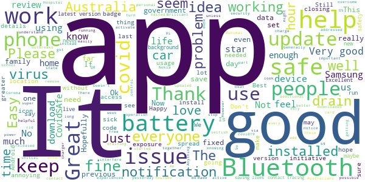
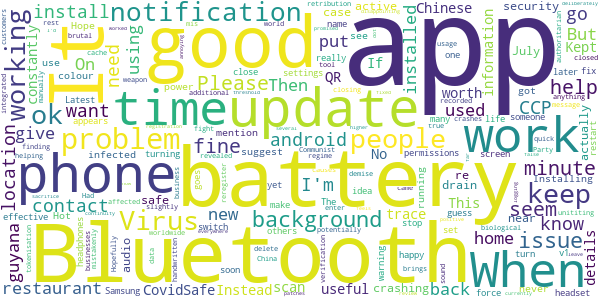
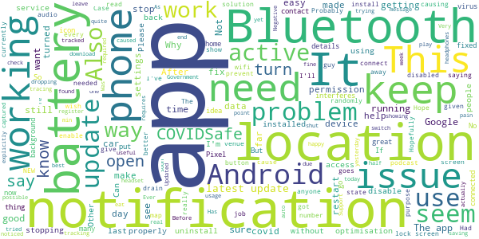
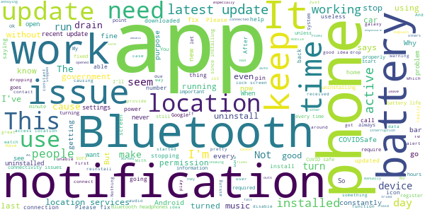
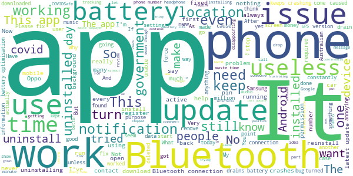

# COVIDSafe
App version ``1.0.48``

Analyzed with [covid-apps-observer](http://github.com/covid-apps-observer) project, version ``0.1``

## App overview
| | |
|-------------------------|-------------------------| 
| **Name**&nbsp;&nbsp;&nbsp;&nbsp;&nbsp;&nbsp;&nbsp;&nbsp;&nbsp;&nbsp;&nbsp;&nbsp;&nbsp;&nbsp;&nbsp;&nbsp;&nbsp;&nbsp;&nbsp;&nbsp;&nbsp;&nbsp;&nbsp;&nbsp;&nbsp;&nbsp;&nbsp;&nbsp;&nbsp;&nbsp;&nbsp;&nbsp;&nbsp;&nbsp;&nbsp;&nbsp;&nbsp;&nbsp;&nbsp;&nbsp;  | COVIDSafe |
| **Unique identifier** | au.gov.health.covidsafe |
| **Link to Google Play** | [https://play.google.com/store/apps/details?id=au.gov.health.covidsafe](https://play.google.com/store/apps/details?id=au.gov.health.covidsafe) |
| **Summary**  | COVIDSafe is a community-based way to stop the spread of COVID-19. |
| **Privacy policy** | [https://www.health.gov.au/using-our-websites/privacy](https://www.health.gov.au/using-our-websites/privacy) |
| **Latest version** | 1.0.48 |
| **Last update** | 2020-07-30 13:17:39 |
| **Recent changes** | Enhanced accessibility: COVIDSafe is now WCAG 2.1 Level AA compliant. Improved Notifications. Bluetooth connection and bug fixes. |
| **Installs**  | 1,000,000+ |
| **Category** | Health & Fitness |
| **First release** | Apr 25, 2020 |
| **Size**  | 12M |
| **Supported Android version**  | 5.0 and up |

### Description
> COVIDSafe app has been developed by the Australian Government Department of Health to help keep the community safe from coronavirus (COVID-19). Together, let’s help stop the spread and keep ourselves and each other healthy.
 COVIDSafe uses the Bluetooth® technology on your mobile phone to look for other devices with COVIDSafe installed. Your device will take a note of contact you’ve had with other users by securely logging the other user’s reference code. If you or someone you’ve been in contact with is diagnosed with COVID-19, the close contact information securely stored in your phone can be uploaded and used—with your consent—by state and territory health officials to quickly inform people who’ve been exposed to the virus.
 How you can help stop the spread of COVID-19:
 • Download the COVIDSafe app
 • Register using your mobile phone number, name, age range and postcode
 • Turn on Bluetooth®
 • Check that COVIDSafe is running when you are out and about or are likely to come into contact with others
 • If you test positive for COVID-19, you can consent for your close contact information to be used by state and territory health officials to contact people who may have been exposed. If you’ve been exposed to the virus by someone you’ve been in close contact with, state and territory health officials will be able to contact you quickly so you can get the support you need
 COVIDSafe is an Australian Government Department of Health initiative. Visit https://www.health.gov.au/resources/apps-and-tools/covidsafe-app for more information.

### User interface
The developers of the app provide the following screenshots in the Google play store.
| | | |
|:-------------------------:|:-------------------------:|:-------------------------:|
 |   |   |   | 
 |   |  

## Development team
In the following we report the main information provided by the development team in the Google play store.

| | |
|-------------------------|-------------------------|
| **Developer**  | Australian Department of Health |
| **Website**  | [https://www.health.gov.au/resources/apps-and-tools/covidsafe-app](https://www.health.gov.au/resources/apps-and-tools/covidsafe-app) |
| **Email** | support@COVIDSafe.gov.au |
| **Physical address**  | - |
| **Other developed apps**  | [https://play.google.com/store/apps/developer?id=Australian+Department+of+Health](https://play.google.com/store/apps/developer?id=Australian+Department+of+Health) |

## Android support

| | |
|-------------------------|-------------------------|
| **Declared target Android version**  | Pie, version 9 (API level 28) |
| **Effective target Android version**  | Pie, version 9 (API level 28) |
| **Minimum supported Android version**  | Lollipop, version 5.0 (API level 21) |
| **Maximum target Android version**  | - |

The larger the difference between the minimum and maximum supported Android versions, the better. A larger difference means a wider audience. For example, old phones have a very low Android version, so a high minimum supported Android version means that the app cannot be used by users with old phones, thus leading to accessibility problems. 

## Requested permissions

In the following we report the complete list of the permissions requested by the app. 

| **Permission** | **Protection level** | **Description** | 
|-------------------------|-------------------------|-------------------------|
 **android.permission ACCESS_COARSE_LOCATION** | :warning:**Dangerous** | Allows an app to access approximate location. 
 **android.permission ACCESS_NETWORK_STATE** | Normal | Allows applications to access information about networks. 
 **android.permission BLUETOOTH** | Normal | Allows applications to connect to paired bluetooth devices. 
 **android.permission BLUETOOTH_ADMIN** | Normal | Allows applications to discover and pair bluetooth devices. 
 **android.permission FOREGROUND_SERVICE** | Normal | Allows a regular application to use Service.startForeground. 
 **android.permission INTERNET** | Normal | Allows applications to open network sockets. 
 **android.permission RECEIVE_BOOT_COMPLETED** | Normal | Allows an application to receive the Intent.ACTION_BOOT_COMPLETED that is broadcast after the system finishes booting. 
 **android.permission REQUEST_IGNORE_BATTERY_OPTIMIZATIONS** | Normal | Permission an application must hold in order to use Settings.ACTION_REQUEST_IGNORE_BATTERY_OPTIMIZATIONS. 
 **android.permission WAKE_LOCK** | Normal | Allows using PowerManager WakeLocks to keep processor from sleeping or screen from dimming. 
 **com.google.android.c2dm.permission RECEIVE** | - | - 

## Mentioned servers

| **Server** | **Registrant** | **Registrant country** | **Creation date** | 
|-------------------------|-------------------------|-------------------------|-------------------------|
 | google.com | Google LLC | :us: US | 1997-09-15 04:00:00 |
 | stackoverflow.com | Stack Exchange, Inc. | :us: US | 2003-12-26 19:18:07 |
 | googleapis.com | Google LLC | :us: US | 2005-01-25 17:52:26 |

## Security analysis 

Below we report the main security warnings raised by our execution of the [Androwarn](https://github.com/maaaaz/androwarn) security analysis tool.

**Connection interfaces exfiltration**
> - This application reads details about the currently active data network 
> - This application tries to find out if the currently active data network is metered 

**Suspicious connection establishment**
> - This application opens a Socket and connects it to the remote address ' returned no addresses for  ; port is out of range' on the 'N/A' port  
> - This application opens a Socket and connects it to the remote address '' on the 'N/A' port  
> - This application opens a Socket and connects it to the remote address 'Ljava/lang/StringBuilder;->toString()Ljava/lang/String;' on the 'N/A' port  
> - This application opens a Socket and connects it to the remote address 'Ljava/net/Proxy;->type()Ljava/net/Proxy$Type;' on the 'N/A' port  
> - This application opens a Socket and connects it to the remote address 'timeout' on the 'N/A' port  

## User ratings and reviews

Below we provide information about how end users are reacting to the app in terms of ratings and reviews in the Google Play store.

### Ratings

The COVIDSafe app has been installed by more than **1000000** times. At this time, **12879** rated the app and its average score is **2.748056**. Below we show the distribution of the ratings across the usual star-based rating of Google Play

:star::star::star::star::star:: 3985

:star::star::star::star:: 831

:star::star::star:: 1271

:star::star:: 1532

:star:: 5257

### Reviews 

#### 5-star reviews

> Is it possible to remove the status card on the app? It's super annoying that I can't get rid of it. Still giving you 5 stars for creating an app for this purpose but the card is annoying. Also, why doesn't the app not track location? Bluetooth doesn't seem to be good enough.  :date: __2020-08-17 06:32:27__

> Hi,.thanks for the app, please ignore the idiots. Just wondering if it will be updated to access the Google exposure notification system? Thanks!  :date: __2020-08-15 08:54:21__

> Keep safe🐈  :date: __2020-08-14 11:11:26__

> I downloaded the CovidSafe application to Nokia 9 OS: Pie. There seems to be no initial problems with the program. However, there is no Exposure Notification badge. It reacts to the deactivation of Bluetooth, via silent notification. Reminder: To activate when you leave home or visit a public place. There is no threat to device security, the app has limited access. Our hyena or wessel-trait individual's wouldn't declare themselves sick, unless hospitalised. Review by Protonumus [YouTube]  :date: __2020-08-14 06:07:40__

> For the government  :date: __2020-08-13 10:44:41__

> Thank you Australia for this great initiative. (Edited) Previous bug I experienced seems to be fixed in the latest version.  :date: __2020-08-12 14:34:35__

> I can't see a reason why people avoid using this app. Yes is using battery but if it helps following virus is too small price to pay. We are in this together.  :date: __2020-08-12 10:28:49__

> Ok  :date: __2020-08-11 23:16:57__

> Good  :date: __2020-08-10 22:39:38__

> 5 stars for changing to Covid Safe Icon badge to a badge of Australia!  :date: __2020-08-10 12:25:58__

#### 4-star reviews

> When it works that is.. 😁  :date: __2020-08-17 04:46:39__

> I'm not closing the app but I keep finding it had closed itself.  :date: __2020-08-16 04:06:25__

> A useful app that causes slightly more battery usage but anything that helps to contact trace people potentially affected by the Chinese Communist Party Virus (CCP Virus), is worth having as an additional tool to help fight this Chinese biological weapon. If any good that came from this CCP Virus is that it revealed China's true colours & is helping the rest of the world in unititing in worldwide retribution against the CCP. Hopefully this brings a demise to this brutal and authoritarian regime.  :date: __2020-08-10 07:06:18__

> Had to delete cache & data & reregister after update, otherwise it crashes constantly  :date: __2020-08-10 06:54:42__

> This CovidSafe tokenisation should be integrated with businesses that need to keep customers information , a quick QR scan and verification message/ sound that the location /business is recorded. Instead of having to (mis)enter your details each time manually/handwritten or mistakenly deliberately because people don't want to leave their details everywhere  :date: __2020-08-10 02:30:53__

> No problems with the app at all here. It's just disappointing that the app hasn't been as useful as it promised to be.  :date: __2020-08-09 09:24:51__

> Working ok so far..  :date: __2020-08-09 04:59:44__

> 9/8 - Kept crashing after July 30 update, had to re-install several times before registration would work again. 10/7 - Kept crashing after July Android patches, had to re-install it and is fine now.  :date: __2020-08-08 17:48:03__

> Please review the 15-minute threshold for logging - I'd want to know if a positive case was near me for 1 minute. It currently feels like false security for the sacrifice of battery and bluetooth audio continuity.  :date: __2020-08-08 14:31:34__

> Notification but fixed  :date: __2020-08-06 14:30:45__

#### 3-star reviews

> Can i download the covidsafe app on a tablet  :date: __2020-08-15 08:03:45__

> Working from home in Sydney and go out less than once a week. I can't see any way to turn it off when not needed. Can't get IFTTT to turn off when in WiFi zone.  :date: __2020-08-14 23:05:52__

> It keeps dropping of.  :date: __2020-08-14 11:56:57__

> Has been working on Android 6.0.1 until the last few days, when it now requires Battery optimisation to be disabled. I have tried all help instruction and any other possible way to switch off battery optimisation but the COVIDSafe app (v 1.0.48) still will not work. Hope they fix the problem soon.  :date: __2020-08-14 07:01:21__

> I know programmers are trying their best but app shows it can't access location. Between blutooth, wifi and nfc can assemble good location lock anyway.  :date: __2020-08-14 04:16:16__

> Was working fine until latest update, accepted the location settings, but now makes my phone (Pixel 2) crash and restart every time I open Google Maps. Had to uninstall so I could use my phone!  :date: __2020-08-11 00:37:39__

> Very supportive of the concept. But, after the update, there's an Android notification saying it is not active because it needs location permissions. It does have location permissions. The app itself says it's active. So I have no idea if it's working or not  :date: __2020-08-10 23:11:48__

> Why one would change a perfectly good notification icon that made it easy to see whether the app was working or not into an icon with a misleading tick, accompanied by a message saying the app is not working, is beyond my understanding.  :date: __2020-08-10 16:43:41__

> Latest update a problem. I use on Android. I do not have location on generally on my phone, but have given this app specifically location permission. Before the update, all fine. This update only allows the app to work if I turn on location for all my apps. I don't want to do that.  :date: __2020-08-10 06:04:32__

> ( edited for later versions) Easy install. Read the help for why it wants but don't need Location turned on ( not sure anymore, but later versions may need GPS on. Getting mixed starus indicators from the apps different icons) . Also it explicitly states that Government and law enforcement can not use it to check social distancing or meetings.  :date: __2020-08-09 22:41:03__

#### 2-star reviews

> After latest update unable to use my Bluetooth headphones due to constant cut-outs. Stopping the app fixes that issue.  :date: __2020-08-13 10:13:10__

> As of today (13/8) I get alerts that the app isn't active. When I open the app, it decides it's active. When I go into settings, I ensure that it can access location at all times. But I still keep getting this alert. It stops being active when I lock the phone.  :date: __2020-08-13 08:20:29__

> Recent update requires location services to be on all the time. This is a deal breaker for me. I will leave it running and hope it continues to work without it (it has permission to access location so all Bluetooth functions work)  :date: __2020-08-12 02:49:55__

> I can understand the need for this app, but at the the moment; the cons outweigh the pros. On paper, using our devices to help pinpoint potential hotspots sounds like a good idea. But due to the fact that the app not only needs to always run in the background (even in power saving), it's constant access to location turning a 4day battery into 6 hours and consistent interruption of Bluetooth devices make this more of a hastle, rather then a utility. Please fix the Bluetooth and battery issues  :date: __2020-08-12 02:39:32__

> They said it does not require location services. After recent update, does not work without location services "on". Very supportive of the government and the purpose of the app, but I don't allow any app to use my location services unless it is necessary for the use of the app. Your location is not required for the purpose of the app, especially when the government said that it does use your location.  :date: __2020-08-12 01:01:06__

> Disconnects other bluetooth devices such as headphones while app is running  :date: __2020-08-11 11:38:14__

> Causes audio stuttering on galaxy a51 and toyota corolla  :date: __2020-08-11 08:21:58__

> Want to use this app but causes my screen to go black on phone calls sometimes. We have to reboot. It does the same thing to my wife's. We both run Android 9 on Sony Phones. Mine is an XA2 Ultra hers an XA2 Plus. Both pretty new phones we otherwise have zero problems with.  :date: __2020-08-11 07:19:36__

> Please explain why it is now asking for location with the latest update?  :date: __2020-08-11 04:18:15__

> Was working well but did drain my battery. However 3 days ago I am getting notifications that it is not active, however when you open the app it is active.  :date: __2020-08-10 23:52:54__

#### 1-star reviews

> Can't install. Why  :date: __2020-08-17 05:48:55__

> Doesn't work probably  :date: __2020-08-17 04:56:16__

> Hasn't worked properly since the first update on this phone, always keeps stopping  :date: __2020-08-17 01:45:20__

> This covid safe app did not work properly on my phone . It kept turning itself off all the time. I reported this issue several times but I had no response back at all. I end up uninstalling it  :date: __2020-08-16 11:08:44__

> Didn't detect my daughter as a close contact to an infected student, even though she had the app. The school alerted us to that fact. Pointless app if it fails to detect close contacts. Id give it 0 if I could.  :date: __2020-08-16 00:17:17__

> Drains battery you have to have locations on 24.... 7 there must be a better way. I'm removing app.  :date: __2020-08-15 05:14:37__

> I was perfectly happy with the app using my bluetooth for information and tracking. But i do not agree with it requiring access to my location otherwise it wont work. Access to location denied and app uninstalled.  :date: __2020-08-15 04:17:29__

> Was ok with it prior to the app requesting location to be turned on. Location is too intrusive for my liking - app uninstalled as a result  :date: __2020-08-15 03:13:01__

> Why do I have to log back on  :date: __2020-08-15 02:20:41__

> Continually asks me to try again later when I input my phone number. Really?!!?!!!?😶🤦🏼  :date: __2020-08-14 11:12:42__

