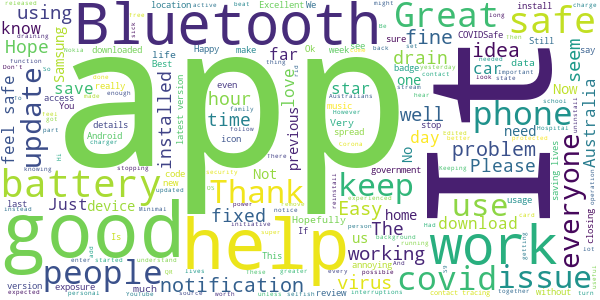
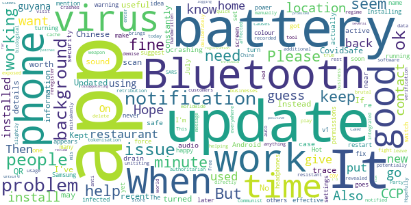
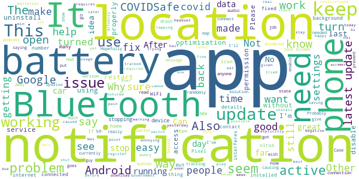
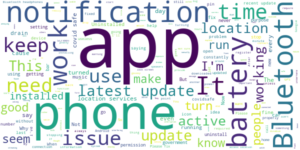
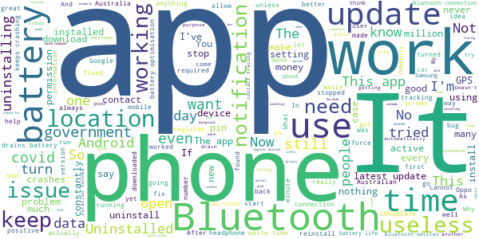

# COVIDSafe
App version ``1.0.56``

Analyzed with [covid-apps-observer](http://github.com/covid-apps-observer) project, version ``0.1``

## App overview
| | |
|-------------------------|-------------------------| 
| **Name**&nbsp;&nbsp;&nbsp;&nbsp;&nbsp;&nbsp;&nbsp;&nbsp;&nbsp;&nbsp;&nbsp;&nbsp;&nbsp;&nbsp;&nbsp;&nbsp;&nbsp;&nbsp;&nbsp;&nbsp;&nbsp;&nbsp;&nbsp;&nbsp;&nbsp;&nbsp;&nbsp;&nbsp;&nbsp;&nbsp;&nbsp;&nbsp;&nbsp;&nbsp;&nbsp;&nbsp;&nbsp;&nbsp;&nbsp;&nbsp;  | COVIDSafe |
| **Unique identifier** | au.gov.health.covidsafe |
| **Link to Google Play** | [https://play.google.com/store/apps/details?id=au.gov.health.covidsafe](https://play.google.com/store/apps/details?id=au.gov.health.covidsafe) |
| **Summary**  | COVIDSafe is a community-based way to stop the spread of COVID-19. |
| **Privacy policy** | [https://www.health.gov.au/using-our-websites/privacy](https://www.health.gov.au/using-our-websites/privacy) |
| **Latest version** | 1.0.56 |
| **Last update** | 2020-08-14 04:35:53 |
| **Recent changes** | Improved notifications. The app now includes Turkish and Punjabi translations. |
| **Installs**  | 1,000,000+ |
| **Category** | Health & Fitness |
| **First release** | Apr 25, 2020 |
| **Size**  | 12M |
| **Supported Android version**  | 5.0 and up |

### Description
> COVIDSafe app has been developed by the Australian Government Department of Health to help keep the community safe from coronavirus (COVID-19). Together, let’s help stop the spread and keep ourselves and each other healthy.
 COVIDSafe uses the Bluetooth® technology on your mobile phone to look for other devices with COVIDSafe installed. Your device will take a note of contact you’ve had with other users by securely logging the other user’s reference code. If you or someone you’ve been in contact with is diagnosed with COVID-19, the close contact information securely stored in your phone can be uploaded and used—with your consent—by state and territory health officials to quickly inform people who’ve been exposed to the virus.
 How you can help stop the spread of COVID-19:
 • Download the COVIDSafe app
 • Register using your mobile phone number, name, age range and postcode
 • Turn on Bluetooth®
 • Check that COVIDSafe is running when you are out and about or are likely to come into contact with others
 • If you test positive for COVID-19, you can consent for your close contact information to be used by state and territory health officials to contact people who may have been exposed. If you’ve been exposed to the virus by someone you’ve been in close contact with, state and territory health officials will be able to contact you quickly so you can get the support you need
 COVIDSafe is an Australian Government Department of Health initiative. Visit https://www.health.gov.au/resources/apps-and-tools/covidsafe-app for more information.

### User interface
The developers of the app provide the following screenshots in the Google play store.
| | | |
|:-------------------------:|:-------------------------:|:-------------------------:|
 |   |   |   | 
 |   |  

## Development team
In the following we report the main information provided by the development team in the Google play store.

| | |
|-------------------------|-------------------------|
| **Developer**  | Australian Department of Health |
| **Website**  | [https://www.health.gov.au/resources/apps-and-tools/covidsafe-app](https://www.health.gov.au/resources/apps-and-tools/covidsafe-app) |
| **Email** | support@COVIDSafe.gov.au |
| **Physical address**  | - |
| **Other developed apps**  | [https://play.google.com/store/apps/developer?id=Australian+Department+of+Health](https://play.google.com/store/apps/developer?id=Australian+Department+of+Health) |

## Android support

| | |
|-------------------------|-------------------------|
| **Declared target Android version**  | Pie, version 9 (API level 28) |
| **Effective target Android version**  | Pie, version 9 (API level 28) |
| **Minimum supported Android version**  | Lollipop, version 5.0 (API level 21) |
| **Maximum target Android version**  | - |

The larger the difference between the minimum and maximum supported Android versions, the better. A larger difference means a wider audience. For example, old phones have a very low Android version, so a high minimum supported Android version means that the app cannot be used by users with old phones, thus leading to accessibility problems. 

## Requested permissions

In the following we report the complete list of the permissions requested by the app. 

| **Permission** | **Protection level** | **Description** | 
|-------------------------|-------------------------|-------------------------|
 **android.permission ACCESS_COARSE_LOCATION** | :warning:**Dangerous** | Allows an app to access approximate location. 
 **android.permission ACCESS_NETWORK_STATE** | Normal | Allows applications to access information about networks. 
 **android.permission BLUETOOTH** | Normal | Allows applications to connect to paired bluetooth devices. 
 **android.permission BLUETOOTH_ADMIN** | Normal | Allows applications to discover and pair bluetooth devices. 
 **android.permission FOREGROUND_SERVICE** | Normal | Allows a regular application to use Service.startForeground. 
 **android.permission INTERNET** | Normal | Allows applications to open network sockets. 
 **android.permission RECEIVE_BOOT_COMPLETED** | Normal | Allows an application to receive the Intent.ACTION_BOOT_COMPLETED that is broadcast after the system finishes booting. 
 **android.permission REQUEST_IGNORE_BATTERY_OPTIMIZATIONS** | Normal | Permission an application must hold in order to use Settings.ACTION_REQUEST_IGNORE_BATTERY_OPTIMIZATIONS. 
 **android.permission WAKE_LOCK** | Normal | Allows using PowerManager WakeLocks to keep processor from sleeping or screen from dimming. 
 **com.google.android.c2dm.permission RECEIVE** | - | - 

## Mentioned servers

| **Server** | **Registrant** | **Registrant country** | **Creation date** | 
|-------------------------|-------------------------|-------------------------|-------------------------|
 | google.com | Google LLC | :us: US | 1997-09-15 04:00:00 |
 | stackoverflow.com | Stack Exchange, Inc. | :us: US | 2003-12-26 19:18:07 |
 | googleapis.com | Google LLC | :us: US | 2005-01-25 17:52:26 |

## Security analysis 

Below we report the main security warnings raised by our execution of the [Androwarn](https://github.com/maaaaz/androwarn) security analysis tool.

**Connection interfaces exfiltration**
> - This application reads details about the currently active data network 
> - This application tries to find out if the currently active data network is metered 

**Suspicious connection establishment**
> - This application opens a Socket and connects it to the remote address ' returned no addresses for  ; port is out of range' on the 'N/A' port  
> - This application opens a Socket and connects it to the remote address '' on the 'N/A' port  
> - This application opens a Socket and connects it to the remote address 'Ljava/lang/StringBuilder;->toString()Ljava/lang/String;' on the 'N/A' port  
> - This application opens a Socket and connects it to the remote address 'Ljava/net/Proxy;->type()Ljava/net/Proxy$Type;' on the 'N/A' port  
> - This application opens a Socket and connects it to the remote address 'timeout' on the 'N/A' port  

## User ratings and reviews

Below we provide information about how end users are reacting to the app in terms of ratings and reviews in the Google Play store.

### Ratings

The COVIDSafe app has been installed by more than **1000000** times. At this time, **12939** rated the app and its average score is **2.7324052**. Below we show the distribution of the ratings across the usual star-based rating of Google Play

:star::star::star::star::star:: 3932

:star::star::star::star:: 870

:star::star::star:: 1280

:star::star:: 1511

:star:: 5343

### Reviews 

#### 5-star reviews

> Keeping me safe from Karren!  :date: __2020-08-24 00:40:30__

> All good so far so good. Thanks  :date: __2020-08-22 11:55:03__

> Great  :date: __2020-08-21 14:44:40__

> Easy to use  :date: __2020-08-20 10:20:39__

> I hope it will always work  :date: __2020-08-20 05:10:27__

> Using Samsung galaxy 9s. App does not drain my battery. And appears to continue to operate correctly in the background after recent update.  :date: __2020-08-20 03:40:57__

> Makes me feel safe having this app.  :date: __2020-08-19 12:52:57__

> Works as expected. Hope it helps 🙂  :date: __2020-08-19 04:56:34__

> Safe  :date: __2020-08-17 17:55:58__

> Is it possible to remove the status card on the app? It's super annoying that I can't get rid of it. Still giving you 5 stars for creating an app for this purpose but the card is annoying. Also, why doesn't the app not track location? Bluetooth doesn't seem to be good enough.  :date: __2020-08-17 06:32:27__

#### 4-star reviews

> Updated today but unsure if notifications sound comes on because I've just turned it on or because I have been exposed to the SARS COV 2! Also, I was not notified of recent update!  :date: __2020-08-21 05:08:51__

> Hope it works.  :date: __2020-08-21 04:36:40__

> Free anti virus software, I guess. BUT you may need to visit the play store to update it directly, as it seems resistant to auto updates.  :date: __2020-08-19 09:57:59__

> When it works that is.. 😁  :date: __2020-08-17 04:46:39__

> A useful app that causes slightly more battery usage but anything that helps to contact trace people potentially affected by the Chinese Communist Party Virus (CCP Virus), is worth having as an additional tool to help fight this Chinese biological weapon. If any good that came from this CCP Virus is that it revealed China's true colours & is helping the rest of the world in unititing in worldwide retribution against the CCP. Hopefully this brings a demise to this brutal and authoritarian regime.  :date: __2020-08-10 07:06:18__

> Had to delete cache & data & reregister after update, otherwise it crashes constantly  :date: __2020-08-10 06:54:42__

> This CovidSafe tokenisation should be integrated with businesses that need to keep customers information , a quick QR scan and verification message/ sound that the location /business is recorded. Instead of having to (mis)enter your details each time manually/handwritten or mistakenly deliberately because people don't want to leave their details everywhere  :date: __2020-08-10 02:30:53__

> No problems with the app at all here. It's just disappointing that the app hasn't been as useful as it promised to be.  :date: __2020-08-09 09:24:51__

> Working ok so far..  :date: __2020-08-09 04:59:44__

> 9/8 - Kept crashing after July 30 update, had to re-install several times before registration would work again. 10/7 - Kept crashing after July Android patches, had to re-install it and is fine now.  :date: __2020-08-08 17:48:03__

#### 3-star reviews

> Update on the 23/08 (Version number 1.0.56) is warning me "No internet connection" when my phone is connected to the internet. Tapping the warning takes me to a message on why it needs the internet with a back arrow.  :date: __2020-08-23 04:21:40__

> I get why people would be unhappy about the app draining phone batteries. The idea is great... but its bypassing a lot of precautions and restrictions to stay awake and pull bluetooth information (polling), and agressive pinned notifications tend to be the most annoying type. Phone OS updates should help reduce wakelocks Other than that, it doesn't do much beyond tracking bluetooth IDs, like WiFi names, your phone/SIM network has your geo location, google/apple do too. Theyre beyond invasive.  :date: __2020-08-22 06:16:41__

> Can i download the covidsafe app on a tablet  :date: __2020-08-15 08:03:45__

> Working from home in Sydney and go out less than once a week. I can't see any way to turn it off when not needed. Can't get IFTTT to turn off when in WiFi zone.  :date: __2020-08-14 23:05:52__

> It keeps dropping of.  :date: __2020-08-14 11:56:57__

> Has been working on Android 6.0.1 until the last few days, when it now requires Battery optimisation to be disabled. I have tried all help instruction and any other possible way to switch off battery optimisation but the COVIDSafe app (v 1.0.48) still will not work. Hope they fix the problem soon.  :date: __2020-08-14 07:01:21__

> I know programmers are trying their best but app shows it can't access location. Between blutooth, wifi and nfc can assemble good location lock anyway.  :date: __2020-08-14 04:16:16__

> Was working fine until latest update, accepted the location settings, but now makes my phone (Pixel 2) crash and restart every time I open Google Maps. Had to uninstall so I could use my phone!  :date: __2020-08-11 00:37:39__

> Very supportive of the concept. But, after the update, there's an Android notification saying it is not active because it needs location permissions. It does have location permissions. The app itself says it's active. So I have no idea if it's working or not  :date: __2020-08-10 23:11:48__

> Why one would change a perfectly good notification icon that made it easy to see whether the app was working or not into an icon with a misleading tick, accompanied by a message saying the app is not working, is beyond my understanding.  :date: __2020-08-10 16:43:41__

#### 2-star reviews

> I concur with some comments made about the latest update. It seems to use more battery, and there are occasionally issues with Bluetooth functionality. I use a Huawei Y5. My biggest beef is that since adding covidsafe, I have found my Facebook Lite app doesn't work properly. FB can't post or upload photos. Maybe there is a setting on the covidsafe app, which when switched on or off, will fix this annoyance. I wish I knew.  :date: __2020-08-20 16:40:30__

> It didn't even send my pin through a.d it's my correct phone number this app needs fixing big time  :date: __2020-08-19 23:24:07__

> After latest update unable to use my Bluetooth headphones due to constant cut-outs. Stopping the app fixes that issue.  :date: __2020-08-13 10:13:10__

> As of today (13/8) I get alerts that the app isn't active. When I open the app, it decides it's active. When I go into settings, I ensure that it can access location at all times. But I still keep getting this alert. It stops being active when I lock the phone.  :date: __2020-08-13 08:20:29__

> Recent update requires location services to be on all the time. This is a deal breaker for me. I will leave it running and hope it continues to work without it (it has permission to access location so all Bluetooth functions work)  :date: __2020-08-12 02:49:55__

> I can understand the need for this app, but at the the moment; the cons outweigh the pros. On paper, using our devices to help pinpoint potential hotspots sounds like a good idea. But due to the fact that the app not only needs to always run in the background (even in power saving), it's constant access to location turning a 4day battery into 6 hours and consistent interruption of Bluetooth devices make this more of a hastle, rather then a utility. Please fix the Bluetooth and battery issues  :date: __2020-08-12 02:39:32__

> They said it does not require location services. After recent update, does not work without location services "on". Very supportive of the government and the purpose of the app, but I don't allow any app to use my location services unless it is necessary for the use of the app. Your location is not required for the purpose of the app, especially when the government said that it does use your location.  :date: __2020-08-12 01:01:06__

> Disconnects other bluetooth devices such as headphones while app is running  :date: __2020-08-11 11:38:14__

> Causes audio stuttering on galaxy a51 and toyota corolla  :date: __2020-08-11 08:21:58__

> Want to use this app but causes my screen to go black on phone calls sometimes. We have to reboot. It does the same thing to my wife's. We both run Android 9 on Sony Phones. Mine is an XA2 Ultra hers an XA2 Plus. Both pretty new phones we otherwise have zero problems with.  :date: __2020-08-11 07:19:36__

#### 1-star reviews

> (previously a 5 star review - now changed to 1 star) The app says it's working, but in the notification bar is says "COVIDSafe is not active" - and no matter what settings, permissions or restarting - it won't change. No longer sure if it's keeping me safe from COVID-19 !  :date: __2020-08-24 07:01:04__

> Useless.  :date: __2020-08-24 06:05:49__

> Not good to register  :date: __2020-08-24 03:08:26__

> The app keeps closing itself so it isn't running  :date: __2020-08-23 23:37:43__

> Endlessly fails to work and says that its not connected and then whether it's working or not its constantly draining the battery as it won't allow the phone to go into battery save mode, beyond disappointed!  :date: __2020-08-23 14:59:09__

> Also issues with bluetooth devices dropping out very regularly. Bluetooth car connection drops momentarily and then reconnects evèry few minutes..  :date: __2020-08-23 09:17:32__

> My wife has a 2year old phone that is a system5 she cannot download the app very disappointing why wasn't this looked at before creating this app how many more are out there that cannot down load the app working now thank you after new update  :date: __2020-08-23 08:59:13__

> Keeps turning off due to battery optimization software on OPPO Find X2 neo, never had this problem with Samsung galaxy note 8, renders the app useless. I have changed battery optimization setting for both device and app and it is still turning off by battery optimization.  :date: __2020-08-23 06:04:10__

> This app is functioning useless, as it relies on users restarting it every so often. Current community usage would be minimal at best. It should be abandoned in it's current form and the government should support citizens using the covid tracing functionality built into Android and IOS. Stop blundering along with this.  :date: __2020-08-23 05:44:06__

> until the latest update, this app was a 4. now I would give it 1. it now disconnects my Bluetooth devices every few minutes which is extremely annoying when you are in the middle of a phone call with Bluetooth headset on.  :date: __2020-08-23 02:14:48__

