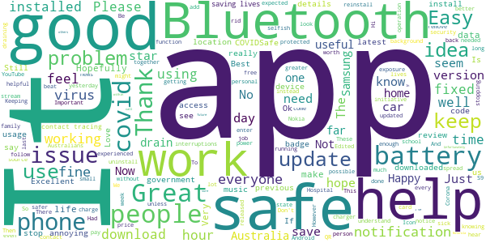
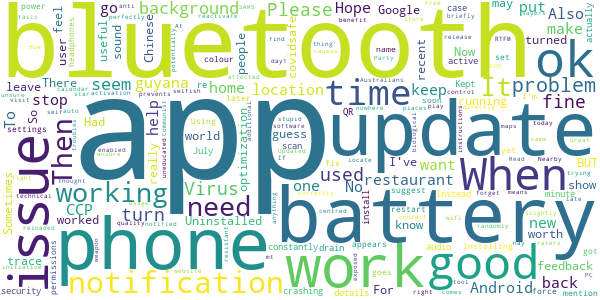
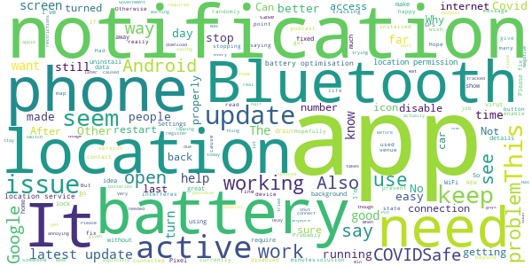
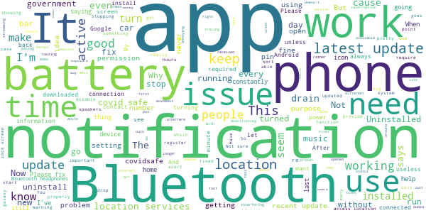
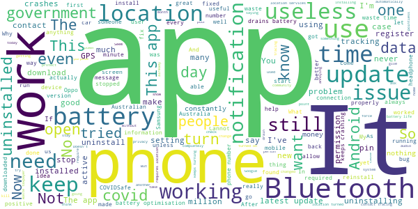

# COVIDSafe
App version ``1.11.0``

Analyzed with [covid-apps-observer](http://github.com/covid-apps-observer) project, version ``0.1``

## App overview
| | |
|-------------------------|-------------------------| 
| **Name**&nbsp;&nbsp;&nbsp;&nbsp;&nbsp;&nbsp;&nbsp;&nbsp;&nbsp;&nbsp;&nbsp;&nbsp;&nbsp;&nbsp;&nbsp;&nbsp;&nbsp;&nbsp;&nbsp;&nbsp;&nbsp;&nbsp;&nbsp;&nbsp;&nbsp;&nbsp;&nbsp;&nbsp;&nbsp;&nbsp;&nbsp;&nbsp;&nbsp;&nbsp;&nbsp;&nbsp;&nbsp;&nbsp;&nbsp;&nbsp;  | COVIDSafe |
| **Unique identifier** | au.gov.health.covidsafe |
| **Link to Google Play** | [https://play.google.com/store/apps/details?id=au.gov.health.covidsafe](https://play.google.com/store/apps/details?id=au.gov.health.covidsafe) |
| **Summary**  | COVIDSafe is a community-based way to stop the spread of COVID-19. |
| **Privacy policy** | [https://covidsafe.gov.au/privacy-policy.html](https://covidsafe.gov.au/privacy-policy.html) |
| **Latest version** | 1.11.0 |
| **Last update** | 2020-09-10 03:14:50 |
| **Recent changes** | New content has been added on the latest COVID-19 case numbers.  Bug fixes.  |
| **Installs**  | 1,000,000+ |
| **Category** | Health & Fitness |
| **First release** | Apr 25, 2020 |
| **Size**  | 13M |
| **Supported Android version**  | 5.0 and up |

### Description
> COVIDSafe app has been developed by the Australian Government Department of Health to help keep the community safe from coronavirus (COVID-19). Together, let’s help stop the spread and keep ourselves and each other healthy.
 COVIDSafe uses the Bluetooth® technology on your mobile phone to look for other devices with COVIDSafe installed. Your device will take a note of contact you’ve had with other users by securely logging the other user’s reference code. If you or someone you’ve been in contact with is diagnosed with COVID-19, the close contact information securely stored in your phone can be uploaded and used—with your consent—by state and territory health officials to quickly inform people who’ve been exposed to the virus.
 How you can help stop the spread of COVID-19:
 • Download the COVIDSafe app
 • Register using your mobile phone number, name, age range and postcode
 • Turn on Bluetooth®
 • Check that COVIDSafe is running when you are out and about or are likely to come into contact with others
 • If you test positive for COVID-19, you can consent for your close contact information to be used by state and territory health officials to contact people who may have been exposed. If you’ve been exposed to the virus by someone you’ve been in close contact with, state and territory health officials will be able to contact you quickly so you can get the support you need
 COVIDSafe is an Australian Government Department of Health initiative. Visit https://www.health.gov.au/resources/apps-and-tools/covidsafe-app for more information.

### User interface
The developers of the app provide the following screenshots in the Google play store.
| | | |
|:-------------------------:|:-------------------------:|:-------------------------:|
 |   |   |   | 
 |   |  

## Development team
In the following we report the main information provided by the development team in the Google play store.

| | |
|-------------------------|-------------------------|
| **Developer**  | Australian Department of Health |
| **Website**  | [https://www.health.gov.au/resources/apps-and-tools/covidsafe-app#covidsafe-app-help](https://www.health.gov.au/resources/apps-and-tools/covidsafe-app#covidsafe-app-help) |
| **Email** | support@COVIDSafe.gov.au |
| **Physical address**  | - |
| **Other developed apps**  | [https://play.google.com/store/apps/developer?id=Australian+Department+of+Health](https://play.google.com/store/apps/developer?id=Australian+Department+of+Health) |

## Android support

| | |
|-------------------------|-------------------------|
| **Declared target Android version**  | Pie, version 9 (API level 28) |
| **Effective target Android version**  | Pie, version 9 (API level 28) |
| **Minimum supported Android version**  | Lollipop, version 5.0 (API level 21) |
| **Maximum target Android version**  | - |

The larger the difference between the minimum and maximum supported Android versions, the better. A larger difference means a wider audience. For example, old phones have a very low Android version, so a high minimum supported Android version means that the app cannot be used by users with old phones, thus leading to accessibility problems. 

## Requested permissions

In the following we report the complete list of the permissions requested by the app. 

| **Permission** | **Protection level** | **Description** | 
|-------------------------|-------------------------|-------------------------|
 **android.permission ACCESS_COARSE_LOCATION** | :warning:**Dangerous** | Allows an app to access approximate location. 
 **android.permission ACCESS_NETWORK_STATE** | Normal | Allows applications to access information about networks. 
 **android.permission BLUETOOTH** | Normal | Allows applications to connect to paired bluetooth devices. 
 **android.permission BLUETOOTH_ADMIN** | Normal | Allows applications to discover and pair bluetooth devices. 
 **android.permission FOREGROUND_SERVICE** | Normal | Allows a regular application to use Service.startForeground. 
 **android.permission INTERNET** | Normal | Allows applications to open network sockets. 
 **android.permission RECEIVE_BOOT_COMPLETED** | Normal | Allows an application to receive the Intent.ACTION_BOOT_COMPLETED that is broadcast after the system finishes booting. 
 **android.permission REQUEST_IGNORE_BATTERY_OPTIMIZATIONS** | Normal | Permission an application must hold in order to use Settings.ACTION_REQUEST_IGNORE_BATTERY_OPTIMIZATIONS. 
 **android.permission WAKE_LOCK** | Normal | Allows using PowerManager WakeLocks to keep processor from sleeping or screen from dimming. 
 **com.google.android.c2dm.permission RECEIVE** | - | - 

## Mentioned servers

| **Server** | **Registrant** | **Registrant country** | **Creation date** | 
|-------------------------|-------------------------|-------------------------|-------------------------|
 | google.com | Google LLC | :us: US | 1997-09-15 04:00:00 |
 | stackoverflow.com | Stack Exchange, Inc. | :us: US | 2003-12-26 19:18:07 |
 | googleapis.com | Google LLC | :us: US | 2005-01-25 17:52:26 |

## Security analysis 

Below we report the main security warnings raised by our execution of the [Androwarn](https://github.com/maaaaz/androwarn) security analysis tool.

**Connection interfaces exfiltration**
> - This application reads details about the currently active data network 
> - This application tries to find out if the currently active data network is metered 

**Suspicious connection establishment**
> - This application opens a Socket and connects it to the remote address ' returned no addresses for  ; port is out of range' on the 'N/A' port  
> - This application opens a Socket and connects it to the remote address '' on the 'N/A' port  
> - This application opens a Socket and connects it to the remote address 'Ljava/lang/StringBuilder;->toString()Ljava/lang/String;' on the 'N/A' port  
> - This application opens a Socket and connects it to the remote address 'Ljava/net/Proxy;->type()Ljava/net/Proxy$Type;' on the 'N/A' port  
> - This application opens a Socket and connects it to the remote address 'timeout' on the 'N/A' port  

## User ratings and reviews

Below we provide information about how end users are reacting to the app in terms of ratings and reviews in the Google Play store.

### Ratings

The COVIDSafe app has been installed by more than **1000000** times. At this time, **13191** rated the app and its average score is **2.6709726**. Below we show the distribution of the ratings across the usual star-based rating of Google Play

:star::star::star::star::star:: 3849

:star::star::star::star:: 872

:star::star::star:: 1273

:star::star:: 1483

:star:: 5714

### Reviews 

#### 5-star reviews

> Makes me feel safer  :date: __2020-09-23 11:02:52__

> Happy to be helping  :date: __2020-09-23 04:00:10__

> It keeps me safe  :date: __2020-09-23 03:42:16__

> Easy to use. Useful info provided.  :date: __2020-09-23 03:28:26__

> Be very helpful that you.  :date: __2020-09-22 10:58:16__

> Its  :date: __2020-09-22 05:13:38__

> Steven Hyand  :date: __2020-09-19 14:23:56__

> No problem here  :date: __2020-09-19 07:44:44__

> Excellent app !  :date: __2020-09-18 15:43:06__

> It's great  :date: __2020-09-15 12:08:40__

#### 4-star reviews

> Stops itself at times but makes user feel they are 'doing the right thing'  :date: __2020-09-21 14:51:03__

> Nearby places Google calendar apps+maps  :date: __2020-09-19 18:22:11__

> Had no troubles, works ok from day1 of release. Now i find out the phone app had battery optimization enabled which prevents app from running correctly. Uninstalled + reloaded as i thought app was the issue. Then used PC and Google to locate how to ensure no optimization on the app. I only turn bluetooth on when i leave home. So no battery issues.  :date: __2020-09-06 14:33:07__

> I hope its just me. Sometimes randomly I have to briefly turn bluetooth off, to get mt wifi to work again. Then I forget to reactivate bluetooth. Android phone. There is nowhere on the covidsafe website to put technical feedback. No feedback is not really good for quality control. How will you know if its working, until you need it and then its too late.  :date: __2020-09-04 01:30:28__

> To all you one star raters, when all else fails, RTFM. For the benefit of the uneducated, that means Read the instructions!! At 18:03 on 26/4/20 activation worked perfectly. To the nay-sayers, stop trying to show the world how stupid, selfish and self-centred some Australians can be.  :date: __2020-09-01 13:41:00__

> Great initiative.  :date: __2020-08-27 06:29:57__

> Updated today but unsure if notifications sound comes on because I've just turned it on or because I have been exposed to the SARS COV 2! Also, I was not notified of recent update!  :date: __2020-08-21 05:08:51__

> Hope it works.  :date: __2020-08-21 04:36:40__

> Free anti virus software, I guess. BUT you may need to visit the play store to update it directly, as it seems resistant to auto updates.  :date: __2020-08-19 09:57:59__

> When it works that is.. 😁  :date: __2020-08-17 04:46:39__

#### 3-star reviews

> On screen icon keeps disappering. Keep needing to open app to keep it active  :date: __2020-09-23 11:23:51__

> Happy to use but better if app turns on automatically when Bluetooth and GPS is on, shows active case numbers, doesn't require GPS (drains battery).  :date: __2020-09-20 03:50:59__

> Is this even worthwhile anymore?  :date: __2020-09-16 14:41:22__

> No phone or battery issues on my samsung a5. Would like to see time shortened from 15 minutes to 1 or 2 minutes and warn me when I'm close to someone would be much better so I can move away. Otherwise it's fine. Can't see the point of having it if it waits 15 minutes to say I've been close to someone that's not good.  :date: __2020-09-14 00:47:04__

> A,s  :date: __2020-09-13 08:18:43__

> I have the internet connection. Covid app says no connection.???  :date: __2020-09-10 05:19:39__

> Okay dont mind it  :date: __2020-08-29 12:30:32__

> This app needs location *permission* because Bluetooth can be used to locate us. It doesn't need our location though. It should not require location services to be enabled.  :date: __2020-08-28 17:00:11__

> This app needs to work with battery optimisation on, I get better battery life with battery optimisation on, I don't want to charge my phone every 12 hours which seems to be with this app active in background. Please fix  :date: __2020-08-28 07:14:20__

> When it works properly!  :date: __2020-08-28 04:59:06__

#### 2-star reviews

> Would like to see how many "close contacts" this thing has picked up and even a dashboard somewhere showing nationwide app performance- case numbers are available elsewhere on the net. And yeh, the gps requirement is a worry.  :date: __2020-09-21 13:17:05__

> Ofx 777  :date: __2020-09-21 09:23:07__

> Unrefined. Doubtful functionality.  :date: __2020-09-21 04:55:18__

> App impacts bluetooth audio to car when near other phones  :date: __2020-09-20 06:44:45__

> Heavy and mysterious  :date: __2020-09-20 05:23:58__

> Yes it installs on 5.1 now but gets stuck after enabling Bluetooth. Proceed does not enable battery optimisation off and Bluetooth location. Oppo R7+ with ColorOs. The new version starts bu reports not connected to internet while the phone is connected to internet. App 'report problem' fails. Is it of any use without Internet?  :date: __2020-09-11 02:49:34__

> The app is causing my Bluetooth headphones to stutter :(  :date: __2020-09-09 13:20:22__

> No support. Bluetooth weirdness = lost connectivity. Oh well. Nice idea. Uninstalled.  :date: __2020-09-08 14:16:41__

> Uninstall because it cause problems with bluetooth conectons.  :date: __2020-09-06 09:28:07__

> 5/9/20 update: for a few weeks been thinking my Bluetooth speakers were broken . Then I realised its the covid safe app using the Bluetooth interfering with the signal. Uninstalled the covid safe app and speakers working fine again. I pay $12 a month for spotify and not going to have the covid safe app ruin my music streaming. Would be good if I could turn the covid safe app off when at home and still have Bluetooth on for my speakers. Let me know if I can as I have uninstalled the app.  :date: __2020-09-05 10:33:15__

#### 1-star reviews

> Useless  :date: __2020-09-23 13:49:17__

> Go suck a dick  :date: __2020-09-23 05:54:01__

> Regularly interrupts Bluetooth streaming  :date: __2020-09-22 15:54:38__

> The app still will not let me register. When entering my mobile number for registering, I keep getting the error message "Please try again later." Please address this - not being able to register renders the app useless. Also means I'm not going to be notified if I have contact with a confirmed covid19 case - so I'm not protected.  :date: __2020-09-22 14:17:37__

> Ineffective. It takes only a few seconds to become infected, but this app takes minutes before it register a contact. The idea is good but, the implementation is not a functional tracker.  :date: __2020-09-22 11:37:47__

> Didn't work  :date: __2020-09-22 09:21:48__

> Keeps switching off, telling me to switch battery optimisation off. No such thing on my phone.  :date: __2020-09-22 03:37:16__

> Uses a lot of battery on Samsung S7, not even a full day. Requires GPS to be active. I don't use the GPS unless navigating, shouldn't be required as GPS doesn't work inside in any case, and is only supposed to use bluetooth and no tracking. I've uninstalled it, battery now lasts 2 days Also not properly open sourced which is disappointing. Could be so much better, also appears to be limited version control.  :date: __2020-09-22 02:37:53__

> It keeps turning itself off saying I need to disable battery optimization which is not on. The app has a problem.  :date: __2020-09-21 23:10:18__

> Useless  :date: __2020-09-21 16:57:54__

