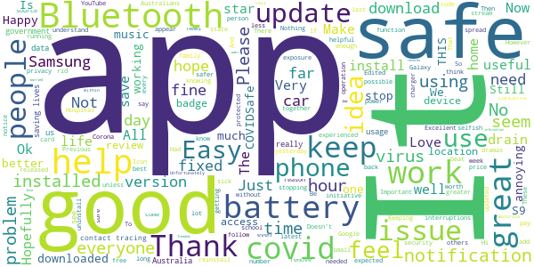
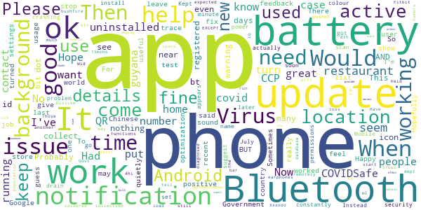
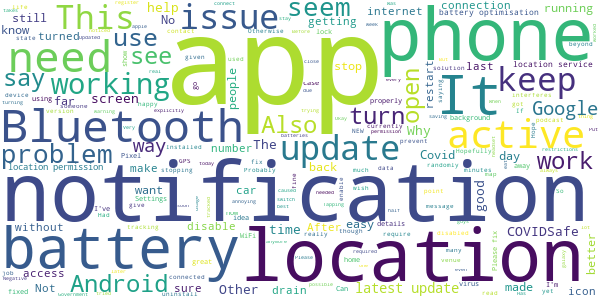
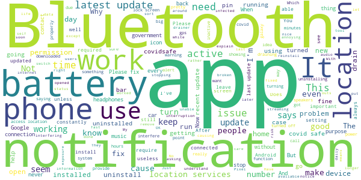
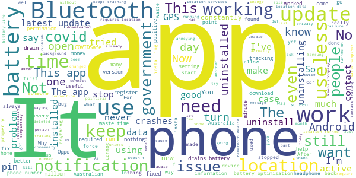

# COVIDSafe
App version ``1.12.0``

Analyzed with [covid-apps-observer](http://github.com/covid-apps-observer) project, version ``0.1``

## App overview
| | |
|-------------------------|-------------------------| 
| **Name**&nbsp;&nbsp;&nbsp;&nbsp;&nbsp;&nbsp;&nbsp;&nbsp;&nbsp;&nbsp;&nbsp;&nbsp;&nbsp;&nbsp;&nbsp;&nbsp;&nbsp;&nbsp;&nbsp;&nbsp;&nbsp;&nbsp;&nbsp;&nbsp;&nbsp;&nbsp;&nbsp;&nbsp;&nbsp;&nbsp;&nbsp;&nbsp;&nbsp;&nbsp;&nbsp;&nbsp;&nbsp;&nbsp;&nbsp;&nbsp;  | COVIDSafe |
| **Unique identifier** | au.gov.health.covidsafe |
| **Link to Google Play** | [https://play.google.com/store/apps/details?id=au.gov.health.covidsafe](https://play.google.com/store/apps/details?id=au.gov.health.covidsafe) |
| **Summary**  | COVIDSafe is a community-based way to stop the spread of COVID-19. |
| **Privacy policy** | [https://covidsafe.gov.au/privacy-policy.html](https://covidsafe.gov.au/privacy-policy.html) |
| **Latest version** | 1.12.0 |
| **Last update** | 2020-09-25 10:26:50 |
| **Recent changes** | Bug fixes and usability enhancements. |
| **Installs**  | 1,000,000+ |
| **Category** | Health & Fitness |
| **First release** | Apr 25, 2020 |
| **Size**  | 13M |
| **Supported Android version**  | 5.0 and up |

### Description
> COVIDSafe app has been developed by the Australian Government Department of Health to help keep the community safe from coronavirus (COVID-19). Together, let’s help stop the spread and keep ourselves and each other healthy.
 COVIDSafe uses the Bluetooth® technology on your mobile phone to look for other devices with COVIDSafe installed. Your device will take a note of contact you’ve had with other users by securely logging the other user’s reference code. If you or someone you’ve been in contact with is diagnosed with COVID-19, the close contact information securely stored in your phone can be uploaded and used—with your consent—by state and territory health officials to quickly inform people who’ve been exposed to the virus.
 How you can help stop the spread of COVID-19:
 • Download the COVIDSafe app
 • Register using your mobile phone number, name, age range and postcode
 • Turn on Bluetooth®
 • Check that COVIDSafe is running when you are out and about or are likely to come into contact with others
 • If you test positive for COVID-19, you can consent for your close contact information to be used by state and territory health officials to contact people who may have been exposed. If you’ve been exposed to the virus by someone you’ve been in close contact with, state and territory health officials will be able to contact you quickly so you can get the support you need
 COVIDSafe is an Australian Government Department of Health initiative. Visit https://www.health.gov.au/resources/apps-and-tools/covidsafe-app for more information.

### User interface
The developers of the app provide the following screenshots in the Google play store.
| | | |
|:-------------------------:|:-------------------------:|:-------------------------:|
 |   |   |   | 
 |   |  

## Development team
In the following we report the main information provided by the development team in the Google play store.

| | |
|-------------------------|-------------------------|
| **Developer**  | Australian Department of Health |
| **Website**  | [https://www.health.gov.au/resources/apps-and-tools/covidsafe-app#covidsafe-app-help](https://www.health.gov.au/resources/apps-and-tools/covidsafe-app#covidsafe-app-help) |
| **Email** | support@COVIDSafe.gov.au |
| **Physical address**  | - |
| **Other developed apps**  | [https://play.google.com/store/apps/developer?id=Australian+Department+of+Health](https://play.google.com/store/apps/developer?id=Australian+Department+of+Health) |

## Android support

| | |
|-------------------------|-------------------------|
| **Declared target Android version**  | Pie, version 9 (API level 28) |
| **Effective target Android version**  | Pie, version 9 (API level 28) |
| **Minimum supported Android version**  | Lollipop, version 5.0 (API level 21) |
| **Maximum target Android version**  | - |

The larger the difference between the minimum and maximum supported Android versions, the better. A larger difference means a wider audience. For example, old phones have a very low Android version, so a high minimum supported Android version means that the app cannot be used by users with old phones, thus leading to accessibility problems. 

## Requested permissions

In the following we report the complete list of the permissions requested by the app. 

| **Permission** | **Protection level** | **Description** | 
|-------------------------|-------------------------|-------------------------|
 **android.permission ACCESS_COARSE_LOCATION** | :warning:**Dangerous** | Allows an app to access approximate location. 
 **android.permission ACCESS_NETWORK_STATE** | Normal | Allows applications to access information about networks. 
 **android.permission BLUETOOTH** | Normal | Allows applications to connect to paired bluetooth devices. 
 **android.permission BLUETOOTH_ADMIN** | Normal | Allows applications to discover and pair bluetooth devices. 
 **android.permission FOREGROUND_SERVICE** | Normal | Allows a regular application to use Service.startForeground. 
 **android.permission INTERNET** | Normal | Allows applications to open network sockets. 
 **android.permission RECEIVE_BOOT_COMPLETED** | Normal | Allows an application to receive the Intent.ACTION_BOOT_COMPLETED that is broadcast after the system finishes booting. 
 **android.permission REQUEST_IGNORE_BATTERY_OPTIMIZATIONS** | Normal | Permission an application must hold in order to use Settings.ACTION_REQUEST_IGNORE_BATTERY_OPTIMIZATIONS. 
 **android.permission WAKE_LOCK** | Normal | Allows using PowerManager WakeLocks to keep processor from sleeping or screen from dimming. 
 **com.google.android.c2dm.permission RECEIVE** | - | - 

## Mentioned servers

| **Server** | **Registrant** | **Registrant country** | **Creation date** | 
|-------------------------|-------------------------|-------------------------|-------------------------|
 | google.com | Google LLC | :us: US | 1997-09-15 04:00:00 |
 | stackoverflow.com | Stack Exchange, Inc. | :us: US | 2003-12-26 19:18:07 |
 | googleapis.com | Google LLC | :us: US | 2005-01-25 17:52:26 |

## Security analysis 

Below we report the main security warnings raised by our execution of the [Androwarn](https://github.com/maaaaz/androwarn) security analysis tool.

**Connection interfaces exfiltration**
> - This application reads details about the currently active data network 
> - This application tries to find out if the currently active data network is metered 

**Suspicious connection establishment**
> - This application opens a Socket and connects it to the remote address ' returned no addresses for  ; port is out of range' on the 'N/A' port  
> - This application opens a Socket and connects it to the remote address '' on the 'N/A' port  
> - This application opens a Socket and connects it to the remote address 'Ljava/lang/StringBuilder;->toString()Ljava/lang/String;' on the 'N/A' port  
> - This application opens a Socket and connects it to the remote address 'Ljava/net/Proxy;->type()Ljava/net/Proxy$Type;' on the 'N/A' port  
> - This application opens a Socket and connects it to the remote address 'timeout' on the 'N/A' port  

## User ratings and reviews

Below we provide information about how end users are reacting to the app in terms of ratings and reviews in the Google Play store.

### Ratings

The COVIDSafe app has been installed by more than **1000000** times. At this time, **13281** rated the app and its average score is **2.716939**. Below we show the distribution of the ratings across the usual star-based rating of Google Play

:star::star::star::star::star:: 4016

:star::star::star::star:: 947

:star::star::star:: 1253

:star::star:: 1391

:star:: 5674

### Reviews 

#### 5-star reviews

> Necessary App at this time  :date: __2020-10-11 15:24:46__

> excellentwork  :date: __2020-10-10 01:16:31__

> Great sales lady 😜  :date: __2020-10-08 03:11:25__

> It might work!  :date: __2020-10-02 23:28:48__

> Makes me feel better and safe.  :date: __2020-10-02 09:26:30__

> Love the idea great. We need to keep safe and others.  :date: __2020-10-01 22:18:24__

> THIS it's the reason our numbers are so low. Want to keep your freedom? Install the app. Nothing to lose. If you're worried about privacy, it records FAR less information from you than Google maps and Facebook  :date: __2020-10-01 00:22:06__

> N/A  :date: __2020-09-28 02:38:28__

> Ok a guess but a dont think it work's Thank you dean  :date: __2020-09-27 11:44:40__

> No.concerns and privacy respected.  :date: __2020-09-27 09:41:00__

#### 4-star reviews

> I7uui 8th is 4hi  :date: __2020-10-09 04:23:06__

> It does what's expected. I have no loss of Bluetooth functions. Fitbit & earphones still run ok. It doesn't collect phone numbers, it collects & stores another phone's bt id number, only if near for 15mins. Those numbrs tell you nothing, even if you could see them. The remotely held database dept. knows the registered phone numbers... only if you d/load your BT id collection, only if you are diagnosed with CV-19. Dislike: Notification uses too much bar space. Wld prfr coloured dot on the icon.  :date: __2020-10-08 02:28:46__

> Had no issues with this app EXCEPT that only 25% of the population uses it so what is the point. Probably should have been pushed out to all active mobiles by the Govt, like bushfire warning and the like. Have now uninstalled it as do not come into contact with many people these days and my location has no active cases.  :date: __2020-10-07 13:28:13__

> STRUCTUREDOOIOZSAQWWWW  :date: __2020-10-05 04:30:43__

> This app has no effect on any aspect of your life unless you come into contact with someone else who has the app AND also has a positive test for COVID. all the scare-mongering about it comes from morons.  :date: __2020-10-02 13:06:27__

> Good  :date: __2020-10-02 12:00:43__

> Essential to help contains the virus  :date: __2020-10-01 00:01:22__

> Would be nice if it had a built-in QR reader so it can provide my encrypted details when checking-in to restaurants, so I don't have to give them my personal details.  :date: __2020-09-28 02:12:44__

> Its doing its job as intended, wirh only minor rare bluetooth dropouts.  :date: __2020-09-26 02:44:33__

> Happy to do my bit to help out with covid management. Having said that my battery usage has gone through the roof since last update. COVIDSafe is at the top of my battery use list by a country mile. Hopefully the update I have done this morning will fix.  :date: __2020-09-26 00:03:57__

#### 3-star reviews

> High battery drain on my galaxy S10  :date: __2020-10-09 01:21:00__

> 555h  :date: __2020-10-08 04:52:29__

> Keeps turning off  :date: __2020-10-01 19:49:42__

> Initially worked ok but hasn't worked for a few months now. Back working again.  :date: __2020-09-26 08:06:08__

> Why is this app always on without having to turn LOCATIONS some phones and not others? Both our phones are same make and mine is newer model, yet I have to manually turn Location on even though I gave given it permission to be on all the time. Why is this?  :date: __2020-09-25 12:06:26__

> On screen icon keeps disappering. Keep needing to open app to keep it active  :date: __2020-09-23 11:23:51__

> Happy to use but better if app turns on automatically when Bluetooth and GPS is on, shows active case numbers, doesn't require GPS (drains battery).  :date: __2020-09-20 03:50:59__

> Is this even worthwhile anymore?  :date: __2020-09-16 14:41:22__

> No phone or battery issues on my samsung a5. Would like to see time shortened from 15 minutes to 1 or 2 minutes and warn me when I'm close to someone would be much better so I can move away. Otherwise it's fine. Can't see the point of having it if it waits 15 minutes to say I've been close to someone that's not good.  :date: __2020-09-14 00:47:04__

> A,s  :date: __2020-09-13 08:18:43__

#### 2-star reviews

> Recent updates are draining the battery. It consumes more than YouTube every day, even watching a few videos. Fix it or people will end up uninstalling. And do we need to be 15mins with someone infected to get infected? Should be reduced to 3 or 5 mins. Otherwise useless.  :date: __2020-10-11 11:30:26__

> Not able to update phone number. Only way is to uninstall and reinstall, which means the previous data is now unreachable. If I had contact with a positive case last week on the old number, I would not be reachable.  :date: __2020-10-09 07:27:49__

> Can't sign up... Says try again later...  :date: __2020-10-08 16:28:47__

> Why does the Covid app now require my gps to be activated as well as bluetooth. I was a supporter of the app, yet now it stays 'inactive'.  :date: __2020-10-08 14:31:18__

> Crashes when I try to open.  :date: __2020-10-06 05:33:27__

> Frequently find the app has shut itself down significantly reducing any benefit it's use may offer in my situation.  :date: __2020-10-04 04:42:46__

> Was running fine for months then, I'm thinking at last update, it kept turning my Location on and draining my battery. I looked into the app and it is not active due to Location turned off. Before I only had to have "Location Permission" turned on for this app... Not the overall location. Not going to turn the Loaction on. I will just leave it inactive. These systems won't work if they're not usable.  :date: __2020-10-03 13:13:25__

> Anything to combat Covid-19. However has a high battery drainage: 30 to 40% of total consumption of device.  :date: __2020-10-03 07:26:03__

> There should be an option to exit this app, when at home. It consumes battery unnecessarily, when the Bluetooth and location is turned off. You should understand there are people out there who do not enable location and Bluetooth unnecessarily, when not in use. I have to stop this app everytime when at home.  :date: __2020-10-03 06:48:17__

> Well its ok and all its just 2 major problems. 1 absolutely battery drainer 2 absloute data drainer  :date: __2020-09-30 06:23:11__

#### 1-star reviews

> Deleted as now requires location to be on. Used to work with Bluetooth only, but can't have location on constantly. Will download again if they fix  :date: __2020-10-11 14:18:30__

> battery waister  :date: __2020-10-11 13:13:28__

> It tracis you every location stop it  :date: __2020-10-10 13:37:47__

> Has anyone heard that this ever worked?  :date: __2020-10-10 07:29:09__

> Unreliable app. Keep crashing even with Bluetooth and gps turned on. Using Pixel 2 XL in Android 11  :date: __2020-10-10 03:17:36__

> ... . ♧. ♧ . . . Haha  :date: __2020-10-10 00:38:23__

> Ll  :date: __2020-10-09 23:30:38__

> Useless  :date: __2020-10-09 22:16:18__

> 27% battery use in 1 day !  :date: __2020-10-08 10:31:41__

> It stops working; turns itself off! 🤬  :date: __2020-10-08 08:10:00__

