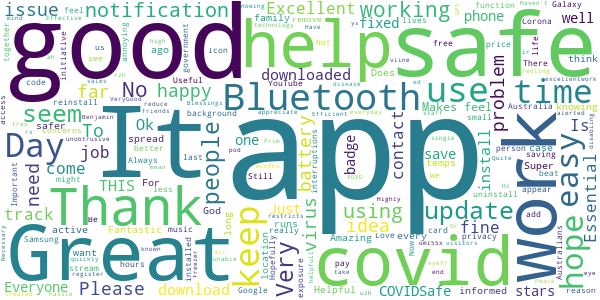

# COVIDSafe
App version ``1.14.0``

Analyzed with [covid-apps-observer](http://github.com/covid-apps-observer) project, version ``0.1``

## App overview
| | |
|-------------------------|-------------------------| 
| **Name**&nbsp;&nbsp;&nbsp;&nbsp;&nbsp;&nbsp;&nbsp;&nbsp;&nbsp;&nbsp;&nbsp;&nbsp;&nbsp;&nbsp;&nbsp;&nbsp;&nbsp;&nbsp;&nbsp;&nbsp;&nbsp;&nbsp;&nbsp;&nbsp;&nbsp;&nbsp;&nbsp;&nbsp;&nbsp;&nbsp;&nbsp;&nbsp;&nbsp;&nbsp;&nbsp;&nbsp;&nbsp;&nbsp;&nbsp;&nbsp;  | COVIDSafe |
| **Unique identifier** | au.gov.health.covidsafe |
| **Link to Google Play** | [https://play.google.com/store/apps/details?id=au.gov.health.covidsafe](https://play.google.com/store/apps/details?id=au.gov.health.covidsafe) |
| **Summary**  | COVIDSafe is a community-based way to stop the spread of COVID-19. |
| **Privacy policy** | [https://covidsafe.gov.au/privacy-policy.html](https://covidsafe.gov.au/privacy-policy.html) |
| **Latest version** | 1.14.0 |
| **Last update** | 2020-11-06 21:39:47 |
| **Recent changes** | User registration issue fixed. |
| **Installs**  | 1,000,000+ |
| **Category** | Health & Fitness |
| **First release** | Apr 25, 2020 |
| **Size**  | 13M |
| **Supported Android version**  | 5.0 and up |

### Description
> COVIDSafe app has been developed by the Australian Government Department of Health to help keep the community safe from coronavirus (COVID-19). Together, let’s help stop the spread and keep ourselves and each other healthy.
 COVIDSafe uses the Bluetooth® technology on your mobile phone to look for other devices with COVIDSafe installed. Your device will take a note of contact you’ve had with other users by securely logging the other user’s reference code. If you or someone you’ve been in contact with is diagnosed with COVID-19, the close contact information securely stored in your phone can be uploaded and used—with your consent—by state and territory health officials to quickly inform people who’ve been exposed to the virus.
 How you can help stop the spread of COVID-19:
 • Download the COVIDSafe app
 • Register using your mobile phone number, name, age range and postcode
 • Turn on Bluetooth®
 • Check that COVIDSafe is running when you are out and about or are likely to come into contact with others
 • If you test positive for COVID-19, you can consent for your close contact information to be used by state and territory health officials to contact people who may have been exposed. If you’ve been exposed to the virus by someone you’ve been in close contact with, state and territory health officials will be able to contact you quickly so you can get the support you need
 COVIDSafe is an Australian Government Department of Health initiative. Visit https://www.health.gov.au/resources/apps-and-tools/covidsafe-app for more information.

### User interface
The developers of the app provide the following screenshots in the Google play store.
| | | |
|:-------------------------:|:-------------------------:|:-------------------------:|
 |   |   |   | 
 |   |  

## Development team
In the following we report the main information provided by the development team in the Google play store.

| | |
|-------------------------|-------------------------|
| **Developer**  | Australian Department of Health |
| **Website**  | [https://www.health.gov.au/resources/apps-and-tools/covidsafe-app#covidsafe-app-help](https://www.health.gov.au/resources/apps-and-tools/covidsafe-app#covidsafe-app-help) |
| **Email** | support@COVIDSafe.gov.au |
| **Physical address**  | - |
| **Other developed apps**  | [https://play.google.com/store/apps/developer?id=Australian+Department+of+Health](https://play.google.com/store/apps/developer?id=Australian+Department+of+Health) |

## Android support

| | |
|-------------------------|-------------------------|
| **Declared target Android version**  | Android10, version 10 (API level 29) |
| **Effective target Android version**  | Android10, version 10 (API level 29) |
| **Minimum supported Android version**  | Lollipop, version 5.0 (API level 21) |
| **Maximum target Android version**  | - |

The larger the difference between the minimum and maximum supported Android versions, the better. A larger difference means a wider audience. For example, old phones have a very low Android version, so a high minimum supported Android version means that the app cannot be used by users with old phones, thus leading to accessibility problems. 

## Requested permissions

In the following we report the complete list of the permissions requested by the app. 

| **Permission** | **Protection level** | **Description** | 
|-------------------------|-------------------------|-------------------------|
 **android.permission ACCESS_FINE_LOCATION** | :warning:**Dangerous** | Allows an app to access precise location. 
 **android.permission ACCESS_NETWORK_STATE** | Normal | Allows applications to access information about networks. 
 **android.permission BLUETOOTH** | Normal | Allows applications to connect to paired bluetooth devices. 
 **android.permission BLUETOOTH_ADMIN** | Normal | Allows applications to discover and pair bluetooth devices. 
 **android.permission FOREGROUND_SERVICE** | Normal | Allows a regular application to use Service.startForeground. 
 **android.permission INTERNET** | Normal | Allows applications to open network sockets. 
 **android.permission RECEIVE_BOOT_COMPLETED** | Normal | Allows an application to receive the Intent.ACTION_BOOT_COMPLETED that is broadcast after the system finishes booting. 
 **android.permission REQUEST_IGNORE_BATTERY_OPTIMIZATIONS** | Normal | Permission an application must hold in order to use Settings.ACTION_REQUEST_IGNORE_BATTERY_OPTIMIZATIONS. 
 **android.permission WAKE_LOCK** | Normal | Allows using PowerManager WakeLocks to keep processor from sleeping or screen from dimming. 
 **com.google.android.c2dm.permission RECEIVE** | - | - 

## Mentioned servers

| **Server** | **Registrant** | **Registrant country** | **Creation date** | 
|-------------------------|-------------------------|-------------------------|-------------------------|
 | google.com | Google LLC | :us: US | 1997-09-15 04:00:00 |
 | stackoverflow.com | Stack Exchange, Inc. | :us: US | 2003-12-26 19:18:07 |
 | googleapis.com | Google LLC | :us: US | 2005-01-25 17:52:26 |

## Security analysis 

Below we report the main security warnings raised by our execution of the [Androwarn](https://github.com/maaaaz/androwarn) security analysis tool.

**Connection interfaces exfiltration**
> - This application reads details about the currently active data network 
> - This application tries to find out if the currently active data network is metered 

**Suspicious connection establishment**
> - This application opens a Socket and connects it to the remote address ' returned no addresses for  ; port is out of range' on the 'N/A' port  
> - This application opens a Socket and connects it to the remote address '' on the 'N/A' port  
> - This application opens a Socket and connects it to the remote address 'Ljava/lang/StringBuilder;->toString()Ljava/lang/String;' on the 'N/A' port  
> - This application opens a Socket and connects it to the remote address 'Ljava/net/Proxy;->type()Ljava/net/Proxy$Type;' on the 'N/A' port  
> - This application opens a Socket and connects it to the remote address 'timeout' on the 'N/A' port  

## User ratings and reviews

Below we provide information about how end users are reacting to the app in terms of ratings and reviews in the Google Play store.

### Ratings

The COVIDSafe app has been installed by more than **1000000** times. At this time, **13577** rated the app and its average score is **2.750366**. Below we show the distribution of the ratings across the usual star-based rating of Google Play

:star::star::star::star::star:: 4075

:star::star::star::star:: 1143

:star::star::star:: 1282

:star::star:: 1471

:star:: 5606

### Reviews 

#### 5-star reviews

> Great  :date: __2020-11-16 07:51:38__

> unobtrusive and essential at this time.  :date: __2020-11-16 03:05:13__

> O God  :date: __2020-11-13 02:00:50__

> Helpful app.  :date: __2020-11-12 11:22:23__

> easy  :date: __2020-11-11 23:13:35__

> Very good easy to do  :date: __2020-11-10 03:56:33__

> Super,,,,,,,  :date: __2020-11-09 09:39:59__

> " great"most people i hope would have this app.  :date: __2020-11-07 08:36:05__

> Keeps track of the covid  :date: __2020-11-04 06:51:38__

> VeryGood ! Thanks 😊 !  :date: __2020-11-03 00:18:07__

#### 4-star reviews

> I don't mind if it runs in the background, just let me hide the persistent notification. I don't need it to tell me it's running, I've already accepted the terms and agree to all the permissions.  :date: __2020-11-08 02:23:07__

> Any thoughts about adding a QR code reader to this app?  :date: __2020-10-28 03:53:25__

> A m still in when l look at spinning wheel okay?..  :date: __2020-10-27 02:35:54__

> 👍👍👍👍👍  :date: __2020-10-26 05:38:58__

> Seems good, doesn't drain my battery. It would be good to see the app show how many daily cases in each state, not just the total of all states.  :date: __2020-10-24 23:07:32__

> A Xxxooo io  :date: __2020-10-17 00:00:40__

> ⁴is a great way to start your ml and 6th or even more  :date: __2020-10-16 07:23:46__

> I7uui 8th is 4hi  :date: __2020-10-09 04:23:06__

> It does what's expected. I have no loss of Bluetooth functions. Fitbit & earphones still run ok. It doesn't collect phone numbers, it collects & stores another phone's bt id number, only if near for 15mins. Those numbrs tell you nothing, even if you could see them. The remotely held database dept. knows the registered phone numbers... only if you d/load your BT id collection, only if you are diagnosed with CV-19. Dislike: Notification uses too much bar space. Wld prfr coloured dot on the icon.  :date: __2020-10-08 02:28:46__

> Had no issues with this app EXCEPT that only 25% of the population uses it so what is the point. Probably should have been pushed out to all active mobiles by the Govt, like bushfire warning and the like. Have now uninstalled it as do not come into contact with many people these days and my location has no active cases.  :date: __2020-10-07 13:28:13__

#### 3-star reviews

> Keeps telling me that I need to allow location but, in the app, it tells me it is operating properly.  :date: __2020-11-16 03:33:55__

> It's beyond belief to wait for 15mins of close contact with a positive case before contact tracing is actioned.  :date: __2020-11-16 02:19:19__

> No option to close, must force stop  :date: __2020-11-11 11:34:01__

> Good ar  :date: __2020-11-09 00:53:10__

> How can this app be using more than 41% of my phone's battery??? This is ridiculous  :date: __2020-11-07 12:14:29__

> I really like the idea of this app if it actually worked... But it doesn't. It continually pops up notifications telling me it's not connected because my Location isn't open when it clearly is. I've also now noticed that even though I have selected Auto Update so I will get the most recent numbers it's not updating either. Example: NSW has been showing most recent number as 14 new cases for days & I had just seen the Premier's speech for today & we have 4 new cases. Even allowing for 24hour turnaround that is still wrong. I'll be interested to see homuch longer we are consistently getting 14 new cases per day. C'mon techs we expect much better than this when you pushed so hard for everyone to download this app. There's no point in having it that I can see. If anyone knows a Web page that simply gives current updates per area searched please help me as I'm in the very high risk category & would like to be aware if/when there's new cases to be aware of. Thanks everyone it sure looks to me like the online community will be more help to me than the official govt app at this point. Unless of course they put the effort in to have it work properly because short of a miracle we are stuck with this virus for the forseeable future &ppossibly beyond.  :date: __2020-10-30 02:07:56__

> I don't get codes will I need two get scanning or anything else if you'll be pretty please do something about this I will be gripple  :date: __2020-10-26 06:36:18__

> I'd been using this OK for months and (probably after an update) I discovered it was asking for location access and no battery optimisation. Having allowed those, it started draining the battery - 27% one day. I removed it, rebooted the phone and reinstalled the app. So far so good today. About 5th in the list of battery users at 1.8%.  :date: __2020-10-23 06:28:19__

> Really needs to be improved to support Apple-Google ENS. I don't like now there's issues between device communication, adding this would be very beneficial for the app and all of Australia  :date: __2020-10-22 08:58:55__

> Power saving mode is being turned on all the time in spite of being turned off  :date: __2020-10-20 22:04:54__

#### 2-star reviews

> Operates ok but not uncommon, to stop working. All settings correct on Note10+ but constantly getting warning that app has stopped working.  :date: __2020-11-14 08:20:54__

> 7 h m uI I 7.. israel  :date: __2020-11-13 06:28:25__

> When is there going to be a fix so this app stops disconnecting other devices from Bluetooth. It does it multiple times a day only had thos issue since this app has been installed  :date: __2020-11-10 04:06:50__

> ĎxxxDeX zzx is zdx acc ccsf carfax xterra accdexzdx ďzd DVD acc x zdx acc d zdx d DVD zdx zdx DVD DVD ďd zdx d zdx zdx DVD zdx DVD DVD d DVD DVD zdx DVD zz zfs DVD d DVD d DVDs dd zdx z xtc DVD DVD DVD zdx zdx DVD DVD db's evac x DVD zdx DVDy DVD DVD uou 7 bagdad bagdad d DVD77did zdx  :date: __2020-11-08 07:20:17__

> Uses my limited data  :date: __2020-11-03 08:21:01__

> I used to be able to check my km radius from my home, but can't seem to access that function any longer  :date: __2020-10-29 23:10:30__

> Says it needs internet. Notification always on. Annoying.  :date: __2020-10-26 12:10:10__

> On s20 ultra need to restart the app if your phone battery died on you by overuse as it doesn't start automatically when you run out of juice mostly when I'm streaming videos. Took a star off due to the generic email response from customer service  :date: __2020-10-26 07:35:10__

> Last 10 days it has switching off  :date: __2020-10-25 23:11:55__

> Why does the app keep stopping on my android?  :date: __2020-10-24 01:46:16__

#### 1-star reviews

> 2 positive cases at my work and still no covid warning... whats the point? To monitor infected only? Or to reduce the risk to those subject to spread possibilities  :date: __2020-11-16 08:44:51__

> I had ap running for 7 months, but now learn it's not used in Victoria so I'm removing it. Terrible shame!  :date: __2020-11-16 03:16:48__

> Had to uninstall this app, even though the idea is great, very poor execution.  :date: __2020-11-15 22:56:47__

> I saw an dialog saying this app will log locations for debugging purpose after an update. But the installed app says they do not log location and access to location is required for bluetooth only. However the app keeps showing warning until you turn on GPS. It does not make sense.  :date: __2020-11-15 05:01:58__

> This is by far the worst pandemic ripoff I've ever played!  :date: __2020-11-14 10:27:04__

> Very annoying as won't stay active. Everytime phone goes off so does covid active. Telling me to turn off battery optimization and I did but still does sane thing. I have an Oppo 91.  :date: __2020-11-14 09:58:49__

> This is the worst app I've ever seen. After app update, it goes to inactive mode. What a shame?? Finally decided to uninstall this today. I need to save some battery, which is this app only capable of.  :date: __2020-11-14 03:29:23__

> Never works properly (frustrating)  :date: __2020-11-14 03:14:25__

> App has never worked properly, keeps crashing even after uninstalling and reinstalling twice. Might as well not have it  :date: __2020-11-13 12:11:11__

> After latest update it has been sitting with bluetooth and location permissions not declared and now I have to reregister. It's been sitting like that for a week so totally useless. Still interferes with any device running Bluetooth Classic e.g. Car handsfree.  :date: __2020-11-13 11:40:08__

