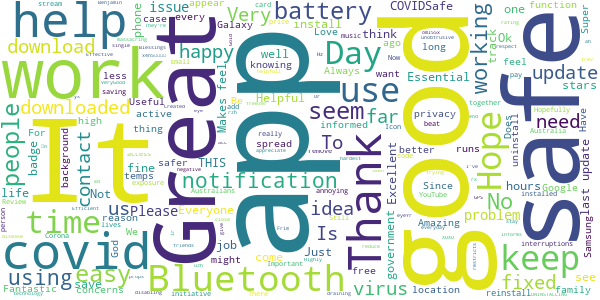
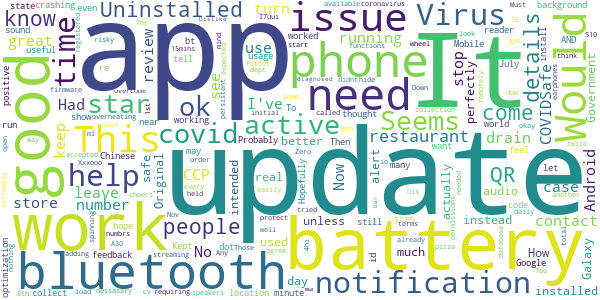
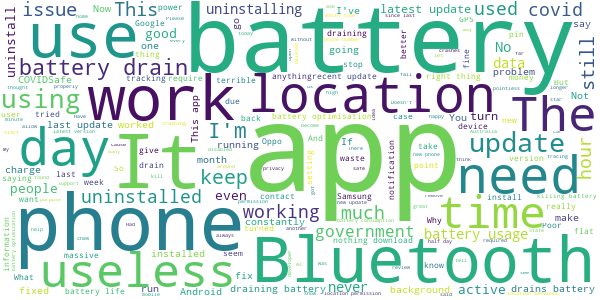

# COVIDSafe
App version ``2.0``

Analyzed with [covid-apps-observer](http://github.com/covid-apps-observer) project, version ``0.1``

## App overview
| | |
|-------------------------|-------------------------| 
| **Name**&nbsp;&nbsp;&nbsp;&nbsp;&nbsp;&nbsp;&nbsp;&nbsp;&nbsp;&nbsp;&nbsp;&nbsp;&nbsp;&nbsp;&nbsp;&nbsp;&nbsp;&nbsp;&nbsp;&nbsp;&nbsp;&nbsp;&nbsp;&nbsp;&nbsp;&nbsp;&nbsp;&nbsp;&nbsp;&nbsp;&nbsp;&nbsp;&nbsp;&nbsp;&nbsp;&nbsp;&nbsp;&nbsp;&nbsp;&nbsp;  | COVIDSafe |
| **Unique identifier** | au.gov.health.covidsafe |
| **Link to Google Play** | [https://play.google.com/store/apps/details?id=au.gov.health.covidsafe](https://play.google.com/store/apps/details?id=au.gov.health.covidsafe) |
| **Summary**  | COVIDSafe is a community-based way to stop the spread of COVID-19. |
| **Privacy policy** | [https://covidsafe.gov.au/privacy-policy.html](https://covidsafe.gov.au/privacy-policy.html) |
| **Latest version** | 2.0 |
| **Last update** | 2020-12-18 09:16:28 |
| **Recent changes** | This release introduces the new Herald Protocol that improves COVIDSafe&#39;s ability to capture close contacts and keeps users better informed about important COVID-19 information.  |
| **Installs**  | 1,000,000+ |
| **Category** | Health & Fitness |
| **First release** | Apr 25, 2020 |
| **Size**  | 13M |
| **Supported Android version**  | 5.0 and up |

### Description
> COVIDSafe app has been developed by the Australian Government Department of Health to help keep the community safe from coronavirus (COVID-19). Together, let’s help stop the spread and keep ourselves and each other healthy.
 COVIDSafe uses the Bluetooth® technology on your mobile phone to look for other devices with COVIDSafe installed. Your device will take a note of contact you’ve had with other users by securely logging the other user’s reference code. If you or someone you’ve been in contact with is diagnosed with COVID-19, the close contact information securely stored in your phone can be uploaded and used—with your consent—by state and territory health officials to quickly inform people who’ve been exposed to the virus.
 How you can help stop the spread of COVID-19:
 • Download the COVIDSafe app
 • Register using your mobile phone number, name, age range and postcode
 • Turn on Bluetooth®
 • Check that COVIDSafe is running when you are out and about or are likely to come into contact with others
 • If you test positive for COVID-19, you can consent for your close contact information to be used by state and territory health officials to contact people who may have been exposed. If you’ve been exposed to the virus by someone you’ve been in close contact with, state and territory health officials will be able to contact you quickly so you can get the support you need
 COVIDSafe is an Australian Government Department of Health initiative. Visit https://www.health.gov.au/resources/apps-and-tools/covidsafe-app for more information.

### User interface
The developers of the app provide the following screenshots in the Google play store.
| | | |
|:-------------------------:|:-------------------------:|:-------------------------:|
 |   |   |   | 
 |   |  

## Development team
In the following we report the main information provided by the development team in the Google play store.

| | |
|-------------------------|-------------------------|
| **Developer**  | Australian Department of Health |
| **Website**  | [https://www.health.gov.au/resources/apps-and-tools/covidsafe-app#covidsafe-app-help](https://www.health.gov.au/resources/apps-and-tools/covidsafe-app#covidsafe-app-help) |
| **Email** | support@COVIDSafe.gov.au |
| **Physical address**  | - |
| **Other developed apps**  | [https://play.google.com/store/apps/developer?id=Australian+Department+of+Health](https://play.google.com/store/apps/developer?id=Australian+Department+of+Health) |

## Android support

| | |
|-------------------------|-------------------------|
| **Declared target Android version**  | Android10, version 10 (API level 29) |
| **Effective target Android version**  | Android10, version 10 (API level 29) |
| **Minimum supported Android version**  | Lollipop, version 5.0 (API level 21) |
| **Maximum target Android version**  | - |

The larger the difference between the minimum and maximum supported Android versions, the better. A larger difference means a wider audience. For example, old phones have a very low Android version, so a high minimum supported Android version means that the app cannot be used by users with old phones, thus leading to accessibility problems. 

## Requested permissions

In the following we report the complete list of the permissions requested by the app. 

| **Permission** | **Protection level** | **Description** | 
|-------------------------|-------------------------|-------------------------|
 **android.permission ACCESS_FINE_LOCATION** | :warning:**Dangerous** | Allows an app to access precise location. 
 **android.permission ACCESS_NETWORK_STATE** | Normal | Allows applications to access information about networks. 
 **android.permission BLUETOOTH** | Normal | Allows applications to connect to paired bluetooth devices. 
 **android.permission BLUETOOTH_ADMIN** | Normal | Allows applications to discover and pair bluetooth devices. 
 **android.permission FOREGROUND_SERVICE** | Normal | Allows a regular application to use Service.startForeground. 
 **android.permission INTERNET** | Normal | Allows applications to open network sockets. 
 **android.permission RECEIVE_BOOT_COMPLETED** | Normal | Allows an application to receive the Intent.ACTION_BOOT_COMPLETED that is broadcast after the system finishes booting. 
 **android.permission REQUEST_IGNORE_BATTERY_OPTIMIZATIONS** | Normal | Permission an application must hold in order to use Settings.ACTION_REQUEST_IGNORE_BATTERY_OPTIMIZATIONS. 
 **android.permission WAKE_LOCK** | Normal | Allows using PowerManager WakeLocks to keep processor from sleeping or screen from dimming. 
 **com.google.android.c2dm.permission RECEIVE** | - | - 

## Mentioned servers

| **Server** | **Registrant** | **Registrant country** | **Creation date** | 
|-------------------------|-------------------------|-------------------------|-------------------------|
 | google.com | Google LLC | :us: US | 1997-09-15 04:00:00 |
 | stackoverflow.com | Stack Exchange, Inc. | :us: US | 2003-12-26 19:18:07 |
 | googleapis.com | Google LLC | :us: US | 2005-01-25 17:52:26 |

## Security analysis 

Below we report the main security warnings raised by our execution of the [Androwarn](https://github.com/maaaaz/androwarn) security analysis tool.

**Connection interfaces exfiltration**
> - This application reads details about the currently active data network 
> - This application tries to find out if the currently active data network is metered 

**Suspicious connection establishment**
> - This application opens a Socket and connects it to the remote address ' returned no addresses for  ; port is out of range' on the 'N/A' port  
> - This application opens a Socket and connects it to the remote address '' on the 'N/A' port  
> - This application opens a Socket and connects it to the remote address 'Ljava/lang/StringBuilder;->toString()Ljava/lang/String;' on the 'N/A' port  
> - This application opens a Socket and connects it to the remote address 'Ljava/net/Proxy;->type()Ljava/net/Proxy$Type;' on the 'N/A' port  
> - This application opens a Socket and connects it to the remote address 'timeout' on the 'N/A' port  

## User ratings and reviews

Below we provide information about how end users are reacting to the app in terms of ratings and reviews in the Google Play store.

### Ratings

The COVIDSafe app has been installed by more than **1000000** times. At this time, **13917** rated the app and its average score is **2.7911618**. Below we show the distribution of the ratings across the usual star-based rating of Google Play

:star::star::star::star::star:: 4394

:star::star::star::star:: 1190

:star::star::star:: 1200

:star::star:: 1379

:star:: 5754

### Reviews 

#### 5-star reviews

> Since last update APP draining battery 48% in 7 hours. NOT GOOD. UNINSTALLING.  :date: __2020-12-20 02:15:25__

> Helpful  :date: __2020-12-19 09:04:19__

> Goid  :date: __2020-12-19 08:59:02__

> Hope it informs us if close contacts.  :date: __2020-12-18 03:40:13__

> Good  :date: __2020-12-17 20:04:16__

> مn,x4n5گندگ,n  :date: __2020-12-16 22:15:14__

> I've only just downloaded the app, and am rating it high so that more people can see this app, download it and stay safe. Have seen some negative reviews about this thing massacring battery life, and I do hope that gets fixed, but props to the government for doing this for us. They're trying their hardest, and I respect it.  :date: __2020-12-16 12:55:01__

> I think it Is good I give this 5/5  :date: __2020-12-16 12:48:32__

> Very very helpfull  :date: __2020-12-07 22:25:26__

> To keep me safe, I like this App active at all times.  :date: __2020-12-03 14:22:52__

#### 4-star reviews

> Works perfectly. Would be 5 star if it didn't stop when it needed an update.  :date: __2020-12-20 08:40:56__

> good  :date: __2020-12-18 02:03:55__

> Y ?  :date: __2020-12-10 10:29:29__

> Covid safe turns itself off every day. How can l keep it on?  :date: __2020-12-09 03:37:58__

> I tried to order a pizza twice but it didnt work. I just called the store instead.  :date: __2020-12-06 05:44:56__

> no need t have used  :date: __2020-12-06 05:15:41__

> Q wa,again. Q  :date: __2020-12-05 04:58:27__

> Update Nov 2020: Uninstalled due to battery drain and overheating on a Galaxy S10 5G. Too risky to leave installed. No issues on Galaxy A30. Down to 4 stars. Original Review: Zero issues. Works as intended. Some initial issues with Bluetooth streaming audio but these are easily overcome with updates and firmware updates on speakers. Original review 5 stars.  :date: __2020-11-27 00:34:25__

> It is extremely good, people need to know how to protect themselves from this coronavirus.  :date: __2020-11-19 07:13:23__

> I don't mind if it runs in the background, just let me hide the persistent notification. I don't need it to tell me it's running, I've already accepted the terms and agree to all the permissions.  :date: __2020-11-08 02:23:07__

#### 3-star reviews

> This app should have a QR code reader built in for venue check-ins. Then state governments could mandate it be used for all check-ins. That would get more people using it.  :date: __2020-12-20 12:37:11__

> 88.8.3w0 2yy5 5.6.the 5th and 3rd 11117q1 aq .4451¹ytrlaKi you 5.5mm me  :date: __2020-12-17 21:47:00__

> Hi just years too much the todo it for you by bhree yearsu the h t too much the.n to  :date: __2020-12-15 00:56:27__

> it is, xv 2s x2 v  :date: __2020-12-13 20:38:43__

> Don't see that it has achieved anything.  :date: __2020-12-11 15:22:44__

> Its a battery drain maybe since last update? I can have a full battery at 2pm then 20% at 4pm when my phone has done nothing. This app is the only one listed as any significant battery drain. Never used to be this way but I have to keep it off. Don't like travelling home at night with no phone.  :date: __2020-12-10 14:54:01__

> Thank you  :date: __2020-12-04 23:58:14__

> Did not appers to do anything. Drained battery.  :date: __2020-11-25 03:14:47__

> If there is information about the current restriction it will be better.  :date: __2020-11-20 20:43:28__

> Likes to turn off. I have to keep an eye on it. It seems to turn off for no apparent reason.  :date: __2020-11-20 03:21:55__

#### 2-star reviews

> New update (introducing the Harold system) causes constant dropouts of my smart watch.  :date: __2020-12-20 13:14:02__

> For what is worth, my Samsung phone is showing that the app has been operating in the background for 12 hours, zero minutes active, but used over 12% battery. I've only been out once to an un-crowded local supermarket (no one else at home). The app's never been like this before. I'll need to shut it until this battery demand situation changes.  :date: __2020-12-20 10:45:37__

> Battery. The app drains my battery and in 3 hours has taken 15% of my battery. No happy.  :date: __2020-12-20 07:22:27__

> The most recent update was a battery drainer and ran down about 30% overnight.  :date: __2020-12-20 01:36:11__

> I don't want to use this app till they add a way to close the app. I want to shut it off when I get home!!!!!!!  :date: __2020-12-19 09:06:57__

> Phone number registration is active and working now (6pm Sunday). I don't like that it needs Location permission for it to be active and works properly (though GPS location is not required to be turned on) Update: 01/11 uninstalled the app because it now needs GPS turned on to be active now 19/12 reinstalled due to flare up in Northern beaches, but I will not turn on GPS  :date: __2020-12-19 05:54:43__

> Has really started draining battery, single biggest battery use of any app on my phone. Really needs to be fixed otherwise people won't install it. I can't have my phone dying while I'm out but it won't last 8 hours of even light usage since the last update.  :date: __2020-12-15 08:24:16__

> No matter what I do the app always turns off.  :date: __2020-12-06 22:44:48__

> My android app refuses to download the current state of covid cases. I have to go to Google to find out. It is annoying and frustrating  :date: __2020-12-04 21:20:54__

> Doesn't really do anything.  :date: __2020-12-04 03:47:26__

#### 1-star reviews

> I've turned this covid app off, have a new phone and still having problems with battery drainage when app is in use. Poor design get it sorted!  :date: __2020-12-20 12:50:07__

> No longer crashes, but chews through battery like theres no tomorrow  :date: __2020-12-20 11:26:54__

> Useless. Battery optimisation disables app, even after following developer instructions. This is a global pandemic, get your act together or let someone else step up! Now says abornmal power consumption. Get ur act together!  :date: __2020-12-20 05:57:43__

> Does not accept my valid phone number  :date: __2020-12-19 19:48:21__

> Drains the battery No one is using  :date: __2020-12-18 23:27:21__

> Won't even download  :date: __2020-12-18 11:26:15__

> Dreadful keeps on turning itself off even though I adjust settings,, completely uselesd  :date: __2020-12-17 13:02:41__

> Programers don't know how to optimise the battery usage on Samsung phones, you send the feedback and they reply with useless advise. Battery depleted in 4 hours instead of 2 days, application has to go.  :date: __2020-12-17 07:09:11__

> Draining pixel 4 battery like crazy. I had to uninstall this after giving lot of thought. You guys really need to take Google and apple existing frameworks to build better apps.  :date: __2020-12-16 23:29:29__

> This is the definition of malware backdoor  :date: __2020-12-16 10:06:50__

