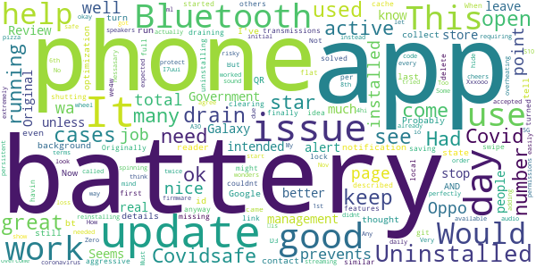

# COVIDSafe
App version ``2.0``

Analyzed with [covid-apps-observer](http://github.com/covid-apps-observer) project, version ``0.1``

## App overview
| | |
|-------------------------|-------------------------| 
| **Name**&nbsp;&nbsp;&nbsp;&nbsp;&nbsp;&nbsp;&nbsp;&nbsp;&nbsp;&nbsp;&nbsp;&nbsp;&nbsp;&nbsp;&nbsp;&nbsp;&nbsp;&nbsp;&nbsp;&nbsp;&nbsp;&nbsp;&nbsp;&nbsp;&nbsp;&nbsp;&nbsp;&nbsp;&nbsp;&nbsp;&nbsp;&nbsp;&nbsp;&nbsp;&nbsp;&nbsp;&nbsp;&nbsp;&nbsp;&nbsp;  | COVIDSafe |
| **Unique identifier** | au.gov.health.covidsafe |
| **Link to Google Play** | [https://play.google.com/store/apps/details?id=au.gov.health.covidsafe](https://play.google.com/store/apps/details?id=au.gov.health.covidsafe) |
| **Summary**  | COVIDSafe is a community-based way to stop the spread of COVID-19. |
| **Privacy policy** | [https://covidsafe.gov.au/privacy-policy.html](https://covidsafe.gov.au/privacy-policy.html) |
| **Latest version** | 2.0 |
| **Last update** | 2020-12-18 09:16:28 |
| **Recent changes** | This release introduces the new Herald Protocol that improves COVIDSafe&#39;s ability to capture close contacts and keeps users better informed about important COVID-19 information.  |
| **Installs**  | 1,000,000+ |
| **Category** | Health & Fitness |
| **First release** | Apr 25, 2020 |
| **Size**  | 13M |
| **Supported Android version**  | 5.0 and up |

### Description
> COVIDSafe app has been developed by the Australian Government Department of Health to help keep the community safe from coronavirus (COVID-19). Together, let’s help stop the spread and keep ourselves and each other healthy.
 COVIDSafe uses the Bluetooth® technology on your mobile phone to look for other devices with COVIDSafe installed. Your device will take a note of contact you’ve had with other users by securely logging the other user’s reference code. If you or someone you’ve been in contact with is diagnosed with COVID-19, the close contact information securely stored in your phone can be uploaded and used—with your consent—by state and territory health officials to quickly inform people who’ve been exposed to the virus.
 How you can help stop the spread of COVID-19:
 • Download the COVIDSafe app
 • Register using your mobile phone number, name, age range and postcode
 • Turn on Bluetooth®
 • Check that COVIDSafe is running when you are out and about or are likely to come into contact with others
 • If you test positive for COVID-19, you can consent for your close contact information to be used by state and territory health officials to contact people who may have been exposed. If you’ve been exposed to the virus by someone you’ve been in close contact with, state and territory health officials will be able to contact you quickly so you can get the support you need
 COVIDSafe is an Australian Government Department of Health initiative. Visit https://www.health.gov.au/resources/apps-and-tools/covidsafe-app for more information.

### User interface
The developers of the app provide the following screenshots in the Google play store.
| | | |
|:-------------------------:|:-------------------------:|:-------------------------:|
 |   |   |   | 
 |   |  

## Development team
In the following we report the main information provided by the development team in the Google play store.

| | |
|-------------------------|-------------------------|
| **Developer**  | Australian Department of Health |
| **Website**  | [https://www.health.gov.au/resources/apps-and-tools/covidsafe-app#covidsafe-app-help](https://www.health.gov.au/resources/apps-and-tools/covidsafe-app#covidsafe-app-help) |
| **Email** | support@COVIDSafe.gov.au |
| **Physical address**  | - |
| **Other developed apps**  | [https://play.google.com/store/apps/developer?id=Australian+Department+of+Health](https://play.google.com/store/apps/developer?id=Australian+Department+of+Health) |

## Android support

| | |
|-------------------------|-------------------------|
| **Declared target Android version**  | Android10, version 10 (API level 29) |
| **Effective target Android version**  | Android10, version 10 (API level 29) |
| **Minimum supported Android version**  | Lollipop, version 5.0 (API level 21) |
| **Maximum target Android version**  | - |

The larger the difference between the minimum and maximum supported Android versions, the better. A larger difference means a wider audience. For example, old phones have a very low Android version, so a high minimum supported Android version means that the app cannot be used by users with old phones, thus leading to accessibility problems. 

## Requested permissions

In the following we report the complete list of the permissions requested by the app. 

| **Permission** | **Protection level** | **Description** | 
|-------------------------|-------------------------|-------------------------|
 **android.permission ACCESS_FINE_LOCATION** | :warning:**Dangerous** | Allows an app to access precise location. 
 **android.permission ACCESS_NETWORK_STATE** | Normal | Allows applications to access information about networks. 
 **android.permission BLUETOOTH** | Normal | Allows applications to connect to paired bluetooth devices. 
 **android.permission BLUETOOTH_ADMIN** | Normal | Allows applications to discover and pair bluetooth devices. 
 **android.permission FOREGROUND_SERVICE** | Normal | Allows a regular application to use Service.startForeground. 
 **android.permission INTERNET** | Normal | Allows applications to open network sockets. 
 **android.permission RECEIVE_BOOT_COMPLETED** | Normal | Allows an application to receive the Intent.ACTION_BOOT_COMPLETED that is broadcast after the system finishes booting. 
 **android.permission REQUEST_IGNORE_BATTERY_OPTIMIZATIONS** | Normal | Permission an application must hold in order to use Settings.ACTION_REQUEST_IGNORE_BATTERY_OPTIMIZATIONS. 
 **android.permission WAKE_LOCK** | Normal | Allows using PowerManager WakeLocks to keep processor from sleeping or screen from dimming. 
 **com.google.android.c2dm.permission RECEIVE** | - | - 

## Mentioned servers

| **Server** | **Registrant** | **Registrant country** | **Creation date** | 
|-------------------------|-------------------------|-------------------------|-------------------------|
 | google.com | Google LLC | :us: US | 1997-09-15 04:00:00 |
 | stackoverflow.com | Stack Exchange, Inc. | :us: US | 2003-12-26 19:18:07 |
 | googleapis.com | Google LLC | :us: US | 2005-01-25 17:52:26 |

## Security analysis 

Below we report the main security warnings raised by our execution of the [Androwarn](https://github.com/maaaaz/androwarn) security analysis tool.

**Connection interfaces exfiltration**
> - This application reads details about the currently active data network 
> - This application tries to find out if the currently active data network is metered 

**Suspicious connection establishment**
> - This application opens a Socket and connects it to the remote address ' returned no addresses for  ; port is out of range' on the 'N/A' port  
> - This application opens a Socket and connects it to the remote address '' on the 'N/A' port  
> - This application opens a Socket and connects it to the remote address 'Ljava/lang/StringBuilder;->toString()Ljava/lang/String;' on the 'N/A' port  
> - This application opens a Socket and connects it to the remote address 'Ljava/net/Proxy;->type()Ljava/net/Proxy$Type;' on the 'N/A' port  
> - This application opens a Socket and connects it to the remote address 'timeout' on the 'N/A' port  

## User ratings and reviews

Below we provide information about how end users are reacting to the app in terms of ratings and reviews in the Google Play store.

### Ratings

The COVIDSafe app has been installed by more than **1000000** times. At this time, **13917** rated the app and its average score is **2.7911618**. Below we show the distribution of the ratings across the usual star-based rating of Google Play

:star::star::star::star::star:: 4394

:star::star::star::star:: 1190

:star::star::star:: 1200

:star::star:: 1379

:star:: 5754

### Reviews 

#### 5-star reviews

> Ok have no experiences and I don't know if it works or not BUT SOMEBODY IS AT LEAST TRYING SOMETHING instead of sitting around whinging and bitchinh  :date: __2021-01-22 11:35:47__

> I'm sick as hell. Hopefully this app works to save others.  :date: __2021-01-22 11:30:41__

> Home page  :date: __2021-01-17 01:49:16__

> ... Ok l. Og  :date: __2021-01-15 05:41:15__

> Great  :date: __2021-01-15 02:57:42__

> Good if it is used as intended  :date: __2021-01-14 22:48:44__

> A very necessary app, indeed. It has played a major role in containing this pandemic by informing citizens of needed information for precautionary measures. Thanks to the Morrison Government and the team that founded this app.  :date: __2021-01-11 07:54:45__

> Make it easy to get updates on covid19 cases  :date: __2021-01-10 23:31:33__

> Best thing the government did.  :date: __2021-01-09 23:47:43__

> They're not lying on the only thing I have a great day and I have to do the same to be a good idea and you please confirm receipt  :date: __2021-01-05 15:44:31__

#### 4-star reviews

> App has started to drain my battery.... When it first came out I installed it and it only used about 1 to 2% battery in a day but now it's over 20% of my battery and I can not get a full day's use out of my phone as of this I might have to delete it as what is the point of havin git if I can not use my phone anyway if it's flat  :date: __2021-01-07 10:05:45__

> Great idea. Originally I couldnt keep the app open on my Oppo phone but I finally solved it. I turned off all the battery saving features as described on the Covidsafe help page, but the missing link was on the open app page, you have to swipe down on Covidsafe to lock the app. This prevents Oppo's aggressive battery management from shutting it down.  :date: __2021-01-06 11:49:27__

> Had similar battery issues like many others here. But clearing the cache, uninstalling and reinstalling, worked wonders. My phone now lasts more than a day again.  :date: __2021-01-05 11:05:05__

> Very sound  :date: __2021-01-05 06:10:56__

> This app does not alert to not being active or requiring an update unless you actually open it...should be better than this.. Update 21 12 20 just got my 1st alert to an update being available..much better  :date: __2020-12-21 08:05:41__

> Seems ok  :date: __2020-12-21 08:04:09__

> It's a nessasary for the Government to have this, if those that think it's not real, well it's very real so it's an a Must cheers  :date: __2020-12-20 23:49:00__

> Works perfectly. Would be 5 star if it didn't stop when it needed an update.  :date: __2020-12-20 08:40:56__

> good  :date: __2020-12-18 02:03:55__

> Y ?  :date: __2020-12-10 10:29:29__

#### 3-star reviews

> The app is a great idea but I had to uninstall it today because it has been draining my battery since the last update.  :date: __2021-01-18 11:05:17__

> No problem using it but power consumption is now showing 7.7%  :date: __2021-01-17 04:16:24__

> Drains the battery way to fast  :date: __2021-01-12 05:39:33__

> 2h🥰🐪but  :date: __2021-01-10 23:35:48__

> It is killing my battery recently.  :date: __2021-01-09 06:39:25__

> Something seems to be seriously wrong with the current version. I was woken up this morning by my phone buzzing as it turned itself off due to 0% battery. It was 90%+ less than 7 hours ago. Battery manager shows it was the Covidsafe app that caused it. It has always hit my battery fairly hard but it's getting ridiculous now. (Update) Uninstalling, reinstalling, and clearing the cache seems to have helped. Next night I went from 100% to 83% in ~ 7 hrs.  :date: __2021-01-06 22:58:44__

> The user interface is great but the app has been running my battery flat overnight so I uninstalled it and gave a 3 start rating.  :date: __2021-01-05 12:36:55__

> C.  :date: __2021-01-04 09:33:25__

> ( edited for later versions) uninstalling. No.one i know is still using it. I don't trust its status or capacity anymore. Maybe if its refreshed and included the QR functionality. Bye.  :date: __2021-01-03 12:19:41__

> Battery issue, I have revert back to old version, rather latest version. Please fix the battery using too much issue, so i can update.  :date: __2021-01-02 07:36:13__

#### 2-star reviews

> HUGE increase in battery drain lately. It has drained 16.9% of my battery today, with the next closest app at only 5.6%.  :date: __2021-01-23 06:54:15__

> Consume too much battery  :date: __2021-01-21 21:02:37__

> I have had this app since it was introduced and in the beginning it was great. However, just recently my phones battery life has seriously decreased and I can barely get through the day. Initially I thought it was an issue that had come from Samsung's latest update but after looking at my battery settings I discovered that this app consistently uses around 40%. This is crazy! I am genuinely considering uninstalling the app until this problem is fixed because I cannot continue to live like this.  :date: __2021-01-21 12:55:24__

> Installed the app in the very beginning, no issues until recently. Started causing a huge battery drain to the point where I was considering buying a new phone because I couldn't get more than 4 hours on a charge. Uninstalled the app and phone is back to normal.  :date: __2021-01-21 10:04:03__

> Good concept. Maybe it works. But it feels like you're taxing my battery a lot for using it.  :date: __2021-01-20 20:54:04__

> I really want to support this but the battery drain is too big to ignore. Today, this app used 28% of my phone's battery.  :date: __2021-01-20 12:57:06__

> Echoing others - this is eating my battery and I can't get through 7.5h work day without recharging. Really would prefer to use this service but the number of times I've run out of battery due too this app's power draw are an issue  :date: __2021-01-19 23:43:36__

> Trying to do the right thing by using this app but the way it drains your battery is terrible. Will turn it off if an update doesn't come quickly to fix the issue.  :date: __2021-01-19 12:17:00__

> What can i say? Drain my phone battery a LOT. gov.. get this fixed pls.  :date: __2021-01-19 04:22:44__

> I am happy to do my part but the app developers really need to get back to work to optimise this app. It is a battery killer. 2 and a half days battery down to 11 hours. I now have to carry an extra battery if I intend to use my phone throughout the day.  :date: __2021-01-18 13:12:33__

#### 1-star reviews

> Seriously drains my battery.  :date: __2021-01-23 13:35:59__

> Not sure what you've changed on Android, but this is killing my battery. I emailed support, no response and no fix, I'm done. I want to do the right thing, but you're making it nearly impossible  :date: __2021-01-23 12:07:54__

> To much battery drain. Resolve that, and I will reinstall.  :date: __2021-01-23 11:57:35__

> Garbage, useless just like the government  :date: __2021-01-23 11:13:27__

> Had this app from the start, but had to uninstall it now because it was draining my phone battery and also heating the device.  :date: __2021-01-23 10:32:13__

> Same as other reviewers. Latest update has caused huge battery drain. Unfortunately, I had to uninstall it on 2 phones although I didn't want to. Please fix asap as both my wife we and me need this app. High risk category the both of us.  :date: __2021-01-23 09:01:31__

> Drains the battery really fast, because it insists on having location services and Bluetooth active. With the app on and active I get around four hours battery, with our off and in sleep mode I get 30 hours.  :date: __2021-01-23 08:29:34__

> consumes 40% of my battery every charge  :date: __2021-01-23 08:10:10__

> The recent update drains 50% of my battery, making my phone (and necessary buisness tool) unusable mid afternoon. After using since the start, I am uninstalling as, unlike the developers, I don't sit with my phone plugged in all day.  :date: __2021-01-23 08:03:26__

> Had this from the beginning, but recently battery life has been horrible. I can see my battery losing 1% every 10mins or so. When I checked the android battery usage, this app is number 1 of battery consumption and in background mode! taking well over 10% of overall battery consumption. I had to disable Bluetooth to ensure this app is disabled. Going to uninstall this now since the news says contact tracing finds data from this app useless anyway.  :date: __2021-01-23 06:58:59__

