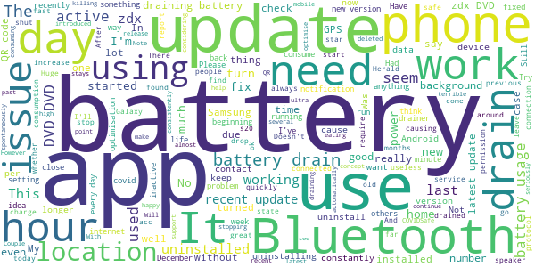

# COVIDSafe
App version ``2.0``

Analyzed with [covid-apps-observer](http://github.com/covid-apps-observer) project, version ``0.1``

## App overview
| | |
|-------------------------|-------------------------| 
| **Name**&nbsp;&nbsp;&nbsp;&nbsp;&nbsp;&nbsp;&nbsp;&nbsp;&nbsp;&nbsp;&nbsp;&nbsp;&nbsp;&nbsp;&nbsp;&nbsp;&nbsp;&nbsp;&nbsp;&nbsp;&nbsp;&nbsp;&nbsp;&nbsp;&nbsp;&nbsp;&nbsp;&nbsp;&nbsp;&nbsp;&nbsp;&nbsp;&nbsp;&nbsp;&nbsp;&nbsp;&nbsp;&nbsp;&nbsp;&nbsp;  | COVIDSafe |
| **Unique identifier** | au.gov.health.covidsafe |
| **Link to Google Play** | [https://play.google.com/store/apps/details?id=au.gov.health.covidsafe](https://play.google.com/store/apps/details?id=au.gov.health.covidsafe) |
| **Summary**  | COVIDSafe is a community-based way to stop the spread of COVID-19. |
| **Privacy policy** | [https://covidsafe.gov.au/privacy-policy.html](https://covidsafe.gov.au/privacy-policy.html) |
| **Latest version** | 2.0 |
| **Last update** | 2020-12-18 09:16:28 |
| **Recent changes** | This release introduces the new Herald Protocol that improves COVIDSafe&#39;s ability to capture close contacts and keeps users better informed about important COVID-19 information.  |
| **Installs**  | 1,000,000+ |
| **Category** | Health & Fitness |
| **First release** | Apr 25, 2020 |
| **Size**  | 13M |
| **Supported Android version**  | 5.0 and up |

### Description
> COVIDSafe app has been developed by the Australian Government Department of Health to help keep the community safe from coronavirus (COVID-19). Together, let’s help stop the spread and keep ourselves and each other healthy.
 COVIDSafe uses the Bluetooth® technology on your mobile phone to look for other devices with COVIDSafe installed. Your device will take a note of contact you’ve had with other users by securely logging the other user’s reference code. If you or someone you’ve been in contact with is diagnosed with COVID-19, the close contact information securely stored in your phone can be uploaded and used—with your consent—by state and territory health officials to quickly inform people who’ve been exposed to the virus.
 How you can help stop the spread of COVID-19:
 • Download the COVIDSafe app
 • Register using your mobile phone number, name, age range and postcode
 • Turn on Bluetooth®
 • Check that COVIDSafe is running when you are out and about or are likely to come into contact with others
 • If you test positive for COVID-19, you can consent for your close contact information to be used by state and territory health officials to contact people who may have been exposed. If you’ve been exposed to the virus by someone you’ve been in close contact with, state and territory health officials will be able to contact you quickly so you can get the support you need
 COVIDSafe is an Australian Government Department of Health initiative. Visit https://www.health.gov.au/resources/apps-and-tools/covidsafe-app for more information.

### User interface
The developers of the app provide the following screenshots in the Google play store.
| | | |
|:-------------------------:|:-------------------------:|:-------------------------:|
 |   |   |   | 
 |   |  

## Development team
In the following we report the main information provided by the development team in the Google play store.

| | |
|-------------------------|-------------------------|
| **Developer**  | Australian Department of Health |
| **Website**  | [https://www.health.gov.au/resources/apps-and-tools/covidsafe-app#covidsafe-app-help](https://www.health.gov.au/resources/apps-and-tools/covidsafe-app#covidsafe-app-help) |
| **Email** | support@COVIDSafe.gov.au |
| **Physical address**  | - |
| **Other developed apps**  | [https://play.google.com/store/apps/developer?id=Australian+Department+of+Health](https://play.google.com/store/apps/developer?id=Australian+Department+of+Health) |

## Android support

| | |
|-------------------------|-------------------------|
| **Declared target Android version**  | Android10, version 10 (API level 29) |
| **Effective target Android version**  | Android10, version 10 (API level 29) |
| **Minimum supported Android version**  | Lollipop, version 5.0 (API level 21) |
| **Maximum target Android version**  | - |

The larger the difference between the minimum and maximum supported Android versions, the better. A larger difference means a wider audience. For example, old phones have a very low Android version, so a high minimum supported Android version means that the app cannot be used by users with old phones, thus leading to accessibility problems. 

## Requested permissions

In the following we report the complete list of the permissions requested by the app. 

| **Permission** | **Protection level** | **Description** | 
|-------------------------|-------------------------|-------------------------|
 **android.permission ACCESS_FINE_LOCATION** | :warning:**Dangerous** | Allows an app to access precise location. 
 **android.permission ACCESS_NETWORK_STATE** | Normal | Allows applications to access information about networks. 
 **android.permission BLUETOOTH** | Normal | Allows applications to connect to paired bluetooth devices. 
 **android.permission BLUETOOTH_ADMIN** | Normal | Allows applications to discover and pair bluetooth devices. 
 **android.permission FOREGROUND_SERVICE** | Normal | Allows a regular application to use Service.startForeground. 
 **android.permission INTERNET** | Normal | Allows applications to open network sockets. 
 **android.permission RECEIVE_BOOT_COMPLETED** | Normal | Allows an application to receive the Intent.ACTION_BOOT_COMPLETED that is broadcast after the system finishes booting. 
 **android.permission REQUEST_IGNORE_BATTERY_OPTIMIZATIONS** | Normal | Permission an application must hold in order to use Settings.ACTION_REQUEST_IGNORE_BATTERY_OPTIMIZATIONS. 
 **android.permission WAKE_LOCK** | Normal | Allows using PowerManager WakeLocks to keep processor from sleeping or screen from dimming. 
 **com.google.android.c2dm.permission RECEIVE** | - | - 

## Mentioned servers

| **Server** | **Registrant** | **Registrant country** | **Creation date** | 
|-------------------------|-------------------------|-------------------------|-------------------------|
 | google.com | Google LLC | :us: US | 1997-09-15 04:00:00 |
 | stackoverflow.com | Stack Exchange, Inc. | :us: US | 2003-12-26 19:18:07 |
 | googleapis.com | Google LLC | :us: US | 2005-01-25 17:52:26 |

## Security analysis 

Below we report the main security warnings raised by our execution of the [Androwarn](https://github.com/maaaaz/androwarn) security analysis tool.

**Connection interfaces exfiltration**
> - This application reads details about the currently active data network 
> - This application tries to find out if the currently active data network is metered 

**Suspicious connection establishment**
> - This application opens a Socket and connects it to the remote address ' returned no addresses for  ; port is out of range' on the 'N/A' port  
> - This application opens a Socket and connects it to the remote address '' on the 'N/A' port  
> - This application opens a Socket and connects it to the remote address 'Ljava/lang/StringBuilder;->toString()Ljava/lang/String;' on the 'N/A' port  
> - This application opens a Socket and connects it to the remote address 'Ljava/net/Proxy;->type()Ljava/net/Proxy$Type;' on the 'N/A' port  
> - This application opens a Socket and connects it to the remote address 'timeout' on the 'N/A' port  

## User ratings and reviews

Below we provide information about how end users are reacting to the app in terms of ratings and reviews in the Google Play store.

### Ratings

The COVIDSafe app has been installed by more than **1000000** times. At this time, **13917** rated the app and its average score is **2.7911618**. Below we show the distribution of the ratings across the usual star-based rating of Google Play

:star::star::star::star::star:: 4394

:star::star::star::star:: 1190

:star::star::star:: 1200

:star::star:: 1379

:star:: 5754

### Reviews 

#### 5-star reviews

> Fantastic app! No issues at all with interface, has a discreet notification indicating it's working. Barely even notice it's there!  :date: __2021-01-03 11:44:30__

> Good  :date: __2021-01-03 07:05:29__

> 👍  :date: __2020-12-31 23:46:55__

> Its in background  :date: __2020-12-31 23:24:36__

> Love being COVID19 SAFE  :date: __2020-12-30 17:52:43__

> Essential app for everyone. However on a technical level it still conflicts with my Bluetooth headphones. A minor issue considering the importance of the app.  :date: __2020-12-30 11:07:43__

> Support the govt. We are stronger together.  :date: __2020-12-30 10:03:13__

> X, see233 c vfu 33 to 1  :date: __2020-12-28 04:03:18__

> Downloading and using this app is a civic responsibility. Contrary to views expressed by conspiracy nuts and the fake news media, this is a good app, and it strikes a good balance between privacy and the need for public health officials to get data. It now incorporates a Linux Foundation sponsored open source project, which makes it even better, and the contact tracing more reliable. Apple and Google want to cut the government and public health officials out of pandemic response, which is dumb.  :date: __2020-12-24 19:42:06__

> It's a really good app to stop stpreading the covid-19  :date: __2020-12-24 05:09:01__

#### 4-star reviews

> This app does not alert to not being active or requiring an update unless you actually open it...should be better than this.. Update 21 12 20 just got my 1st alert to an update being available..much better  :date: __2020-12-21 08:05:41__

> Seems ok  :date: __2020-12-21 08:04:09__

> It's a nessasary for the Government to have this, if those that think it's not real, well it's very real so it's an a Must cheers  :date: __2020-12-20 23:49:00__

> Works perfectly. Would be 5 star if it didn't stop when it needed an update.  :date: __2020-12-20 08:40:56__

> good  :date: __2020-12-18 02:03:55__

> Y ?  :date: __2020-12-10 10:29:29__

> Covid safe turns itself off every day. How can l keep it on?  :date: __2020-12-09 03:37:58__

> I tried to order a pizza twice but it didnt work. I just called the store instead.  :date: __2020-12-06 05:44:56__

> no need t have used  :date: __2020-12-06 05:15:41__

> Q wa,again. Q  :date: __2020-12-05 04:58:27__

#### 3-star reviews

> ( edited for later versions) uninstalling. No.one i know is still using it. I don't trust its status or capacity anymore. Maybe if its refreshed and included the QR functionality. Bye.  :date: __2021-01-03 12:19:41__

> Battery issue, I have revert back to old version, rather latest version. Please fix the battery using too much issue, so i can update.  :date: __2021-01-02 07:36:13__

> Never been notified of any cases or update  :date: __2021-01-01 06:46:10__

> App should include a unique personalised QR code for venues to scan, much easier than the current system and would remove the issues with incorrect data entry when entering facilities. As many others have reported Bluetooth drains battery so too tempting to turn if off  :date: __2020-12-31 23:37:22__

> This app interferes with Bluetooth audio peripherals. When you come into close contact with another device, the sound in your BT device momentarily stops and resumes.  :date: __2020-12-31 00:22:46__

> 2 problems with this app, not enough people are using it and it is chewing up too much of my battery. Otherwise, the app does not track my location. It keeps a log of all the installed phones I have been near for last 21 days. It does not upload this information unless I give the permission; and I will only be asked to do so in the event I had contact with someone who is infected. When I uninstall the app, all the data on my phone are deleted.  :date: __2020-12-30 23:49:12__

> Not sure what it is supposed to do. I have it running though.  :date: __2020-12-28 04:40:31__

> Update needs location of towns with the numbers of cases of covid  :date: __2020-12-27 22:38:54__

> How are you supposed to make the app 'inactive'? My understanding is that once you have downloaded and installed this app it is automatically operational and that is the way it stays. The information seems to suggest that I have to ensure it is operational that I have to ensure it is running. How do I do that? Also I don't have a photo on Google Profile. I've got one on Facebook.  :date: __2020-12-27 19:30:43__

> Happy with the security and privacy of the app but every since the Herald protocol update, it's smashed my battery (Galaxy S10)  :date: __2020-12-27 03:13:46__

#### 2-star reviews

> Drains the battery so much especially overnight when I'm not even moving  :date: __2021-01-03 14:13:17__

> Uses 25% of your battery life? Needs fixing  :date: __2021-01-03 10:32:27__

> having battery issues on samsung also.. uses 45% of my battery since the upgrade to 2.0..  :date: __2021-01-03 05:23:07__

> Could be doing so much more. E.g. checklist of public notifications, isolation status, opt in for location sharing, notification of hotspots visited without this 15 minute rubbish  :date: __2021-01-03 01:32:11__

> The new protocol seems to drain batteries very quickly. Over about 8 hours, it's drained 33% of my S8's battery. Not so good. I'll be sticking to QR code check ins.  :date: __2021-01-02 14:11:37__

> From the end of December 2020 started to drain my battery really fast...  :date: __2021-01-02 13:49:50__

> Kills the battery.  :date: __2020-12-31 16:01:49__

> Battery consumption has risen a lot lately. Currently covid app running at around 25% consumption compared to other high using apps at around 3% of battery consumption, and low using apps at <1% consumption. High enough that I force a stop when home to conserve battery.  :date: __2020-12-31 04:36:31__

> W ×  :date: __2020-12-31 02:52:06__

> My most power hungry app  :date: __2020-12-30 15:06:13__

#### 1-star reviews

> Uninstalling, dead set battery hog  :date: __2021-01-03 09:42:34__

> Useless.  :date: __2021-01-03 07:32:15__

> Extremely high battery usage. Samsung S10 shows that the app is - 28.5% used for less than one minute activity and in the background for 18hours 47 minutes. Ridiculous. Three days since my previous review. Can no longer charge both my wife's phone and my phone twice a day to keep this app running. Will not continue this, have decided to remove the app from both phones today.  :date: __2021-01-03 02:41:15__

> How do you get your pin if you dont come out of the site. When you do come out get it and go through the whole thing again, then the pin you have just teceived is no good anymore. What am i doing wrong or is this site imposible, other people have done it, or how are the gov doing their tracing on cases.  :date: __2021-01-03 01:43:03__

> Drains battery super fast now. App is no good if phone runs out of battery half way through day.  :date: __2021-01-02 23:32:58__

> Battery drain issue!!! All of a sudden app is draining my battery each night using over 64% in 7 hours with no active time. Might be due to me having poor connection issue whilst away on holiday, but far from acceptable!  :date: __2021-01-02 22:22:03__

> Battery drain is terrible since last update to version 2. I would suggest the developer finds a fix soon.  :date: __2021-01-02 20:28:44__

> Same as everyone else. High battery usage since last update. Big advocate for the app, but it's killing my phone. I'm thinking some Bluetooth issues im having lately may also be tied to it  :date: __2021-01-02 07:53:00__

> Since the last update my battery lasts less than half a day, where before it would last more than 24 hours. Also The Senate Select Committee on COVID-19 makes it clear that the app has been an abject failure. I will be sticking with the SA government's QRcode check-in app. Uninstalling.  :date: __2021-01-02 06:46:04__

> Since last update (dec 2020?) noticed my Samsung s9 battery getting used up very quickly most days. Thought I must have been using my phone a lot more than usual but couldn't see how, hadn't really changed my habits. This morning noticed battery had run down really quickly. Went through my apps to find the Covidsafe the only one burning through my battery. 14% used in background in 2 hrs. I rely on my phone for work, don't have the opportunity to recharge during the day, so uninstalled app.  :date: __2021-01-02 00:25:23__

