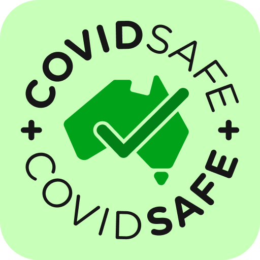

# COVIDSafe
App version ``2.0``

Analyzed with [covid-apps-observer](http://github.com/covid-apps-observer) project, version ``0.1``

## App overview
| | |
|-------------------------|-------------------------| 
| **Name**&nbsp;&nbsp;&nbsp;&nbsp;&nbsp;&nbsp;&nbsp;&nbsp;&nbsp;&nbsp;&nbsp;&nbsp;&nbsp;&nbsp;&nbsp;&nbsp;&nbsp;&nbsp;&nbsp;&nbsp;&nbsp;&nbsp;&nbsp;&nbsp;&nbsp;&nbsp;&nbsp;&nbsp;&nbsp;&nbsp;&nbsp;&nbsp;&nbsp;&nbsp;&nbsp;&nbsp;&nbsp;&nbsp;&nbsp;&nbsp;  | COVIDSafe |
| **Unique identifier** | au.gov.health.covidsafe |
| **Link to Google Play** | [https://play.google.com/store/apps/details?id=au.gov.health.covidsafe](https://play.google.com/store/apps/details?id=au.gov.health.covidsafe) |
| **Summary**  | COVIDSafe is a community-based way to stop the spread of COVID-19. |
| **Privacy policy** | [https://covidsafe.gov.au/privacy-policy.html](https://covidsafe.gov.au/privacy-policy.html) |
| **Latest version** | 2.0 |
| **Last update** | 2020-12-18 09:16:28 |
| **Recent changes** | This release introduces the new Herald Protocol that improves COVIDSafe&#39;s ability to capture close contacts and keeps users better informed about important COVID-19 information.  |
| **Installs**  | 1,000,000+ |
| **Category** | Health & Fitness |
| **First release** | Apr 25, 2020 |
| **Size**  | 13M |
| **Supported Android version**  | 5.0 and up |

### Description
> COVIDSafe app has been developed by the Australian Government Department of Health to help keep the community safe from coronavirus (COVID-19). Together, let’s help stop the spread and keep ourselves and each other healthy.
 COVIDSafe uses the Bluetooth® technology on your mobile phone to look for other devices with COVIDSafe installed. Your device will take a note of contact you’ve had with other users by securely logging the other user’s reference code. If you or someone you’ve been in contact with is diagnosed with COVID-19, the close contact information securely stored in your phone can be uploaded and used—with your consent—by state and territory health officials to quickly inform people who’ve been exposed to the virus.
 How you can help stop the spread of COVID-19:
 • Download the COVIDSafe app
 • Register using your mobile phone number, name, age range and postcode
 • Turn on Bluetooth®
 • Check that COVIDSafe is running when you are out and about or are likely to come into contact with others
 • If you test positive for COVID-19, you can consent for your close contact information to be used by state and territory health officials to contact people who may have been exposed. If you’ve been exposed to the virus by someone you’ve been in close contact with, state and territory health officials will be able to contact you quickly so you can get the support you need
 COVIDSafe is an Australian Government Department of Health initiative. Visit https://www.health.gov.au/resources/apps-and-tools/covidsafe-app for more information.

### User interface
The developers of the app provide the following screenshots in the Google play store.
| | | |
|:-------------------------:|:-------------------------:|:-------------------------:|
 |   |   |   | 
 |   |  

## Development team
In the following we report the main information provided by the development team in the Google play store.

| | |
|-------------------------|-------------------------|
| **Developer**  | Australian Department of Health |
| **Website**  | [https://www.health.gov.au/resources/apps-and-tools/covidsafe-app#covidsafe-app-help](https://www.health.gov.au/resources/apps-and-tools/covidsafe-app#covidsafe-app-help) |
| **Email** | support@COVIDSafe.gov.au |
| **Physical address**  | - |
| **Other developed apps**  | [https://play.google.com/store/apps/developer?id=Australian+Department+of+Health](https://play.google.com/store/apps/developer?id=Australian+Department+of+Health) |

## Android support

| | |
|-------------------------|-------------------------|
| **Declared target Android version**  | Android10, version 10 (API level 29) |
| **Effective target Android version**  | Android10, version 10 (API level 29) |
| **Minimum supported Android version**  | Lollipop, version 5.0 (API level 21) |
| **Maximum target Android version**  | - |

The larger the difference between the minimum and maximum supported Android versions, the better. A larger difference means a wider audience. For example, old phones have a very low Android version, so a high minimum supported Android version means that the app cannot be used by users with old phones, thus leading to accessibility problems. 

## Requested permissions

In the following we report the complete list of the permissions requested by the app. 

| **Permission** | **Protection level** | **Description** | 
|-------------------------|-------------------------|-------------------------|
 **android.permission ACCESS_FINE_LOCATION** | :warning:**Dangerous** | Allows an app to access precise location. 
 **android.permission ACCESS_NETWORK_STATE** | Normal | Allows applications to access information about networks. 
 **android.permission BLUETOOTH** | Normal | Allows applications to connect to paired bluetooth devices. 
 **android.permission BLUETOOTH_ADMIN** | Normal | Allows applications to discover and pair bluetooth devices. 
 **android.permission FOREGROUND_SERVICE** | Normal | Allows a regular application to use Service.startForeground. 
 **android.permission INTERNET** | Normal | Allows applications to open network sockets. 
 **android.permission RECEIVE_BOOT_COMPLETED** | Normal | Allows an application to receive the Intent.ACTION_BOOT_COMPLETED that is broadcast after the system finishes booting. 
 **android.permission REQUEST_IGNORE_BATTERY_OPTIMIZATIONS** | Normal | Permission an application must hold in order to use Settings.ACTION_REQUEST_IGNORE_BATTERY_OPTIMIZATIONS. 
 **android.permission WAKE_LOCK** | Normal | Allows using PowerManager WakeLocks to keep processor from sleeping or screen from dimming. 
 **com.google.android.c2dm.permission RECEIVE** | - | - 

## Mentioned servers

| **Server** | **Registrant** | **Registrant country** | **Creation date** | 
|-------------------------|-------------------------|-------------------------|-------------------------|
 | google.com | Google LLC | :us: US | 1997-09-15 04:00:00 |
 | stackoverflow.com | Stack Exchange, Inc. | :us: US | 2003-12-26 19:18:07 |
 | googleapis.com | Google LLC | :us: US | 2005-01-25 17:52:26 |

## Security analysis 

Below we report the main security warnings raised by our execution of the [Androwarn](https://github.com/maaaaz/androwarn) security analysis tool.

**Connection interfaces exfiltration**
> - This application reads details about the currently active data network 
> - This application tries to find out if the currently active data network is metered 

**Suspicious connection establishment**
> - This application opens a Socket and connects it to the remote address ' returned no addresses for  ; port is out of range' on the 'N/A' port  
> - This application opens a Socket and connects it to the remote address '' on the 'N/A' port  
> - This application opens a Socket and connects it to the remote address 'Ljava/lang/StringBuilder;->toString()Ljava/lang/String;' on the 'N/A' port  
> - This application opens a Socket and connects it to the remote address 'Ljava/net/Proxy;->type()Ljava/net/Proxy$Type;' on the 'N/A' port  
> - This application opens a Socket and connects it to the remote address 'timeout' on the 'N/A' port  

## User ratings and reviews

Below we provide information about how end users are reacting to the app in terms of ratings and reviews in the Google Play store.

### Ratings

The COVIDSafe app has been installed by more than **1000000** times. At this time, **13917** rated the app and its average score is **2.7911618**. Below we show the distribution of the ratings across the usual star-based rating of Google Play

:star::star::star::star::star:: 4394

:star::star::star::star:: 1190

:star::star::star:: 1200

:star::star:: 1379

:star:: 5754

### Reviews 

#### 5-star reviews

> They're not lying on the only thing I have a great day and I have to do the same to be a good idea and you please confirm receipt  :date: __2021-01-05 15:44:31__

> Good application  :date: __2021-01-05 03:37:02__

> This needs to incorporate the ability to use QR code scanning in addition to the existing features. I avoid QR checkins due to the fact that none of the data is regulated in any way and there are just too many providers. If it could be incorporated in to the app itself it means only one registration and the QR scanning is simply to verify precisely your location at a specific time. If the QR logins can be available to contact tracers in real time it would greatly simplify the process. A notification can be sent to the user of the app that someweher they have checked in to is now an exposure site and the remaining data can be uploaded.  :date: __2021-01-05 00:26:52__

> Very good  :date: __2021-01-04 23:32:47__

> Fantastic app! No issues at all with interface, has a discreet notification indicating it's working. Barely even notice it's there!  :date: __2021-01-03 11:44:30__

> Good  :date: __2021-01-03 07:05:29__

> 👍  :date: __2020-12-31 23:46:55__

> Its in background  :date: __2020-12-31 23:24:36__

> Love being COVID19 SAFE  :date: __2020-12-30 17:52:43__

> Essential app for everyone. However on a technical level it still conflicts with my Bluetooth headphones. A minor issue considering the importance of the app.  :date: __2020-12-30 11:07:43__

#### 4-star reviews

> App has started to drain my battery.... When it first came out I installed it and it only used about 1 to 2% battery in a day but now it's over 20% of my battery and I can not get a full day's use out of my phone as of this I might have to delete it as what is the point of havin git if I can not use my phone anyway if it's flat  :date: __2021-01-07 10:05:45__

> Great idea. Originally I couldnt keep the app open on my Oppo phone but I finally solved it. I turned off all the battery saving features as described on the Covidsafe help page, but the missing link was on the open app page, you have to swipe down on Covidsafe to lock the app. This prevents Oppo's aggressive battery management from shutting it down.  :date: __2021-01-06 11:49:27__

> Had similar battery issues like many others here. But clearing the cache, uninstalling and reinstalling, worked wonders. My phone now lasts more than a day again.  :date: __2021-01-05 11:05:05__

> Very sound  :date: __2021-01-05 06:10:56__

> This app does not alert to not being active or requiring an update unless you actually open it...should be better than this.. Update 21 12 20 just got my 1st alert to an update being available..much better  :date: __2020-12-21 08:05:41__

> Seems ok  :date: __2020-12-21 08:04:09__

> It's a nessasary for the Government to have this, if those that think it's not real, well it's very real so it's an a Must cheers  :date: __2020-12-20 23:49:00__

> Works perfectly. Would be 5 star if it didn't stop when it needed an update.  :date: __2020-12-20 08:40:56__

> good  :date: __2020-12-18 02:03:55__

> Y ?  :date: __2020-12-10 10:29:29__

#### 3-star reviews

> It is killing my battery recently.  :date: __2021-01-09 06:39:25__

> Something seems to be seriously wrong with the current version. I was woken up this morning by my phone buzzing as it turned itself off due to 0% battery. It was 90%+ less than 7 hours ago. Battery manager shows it was the Covidsafe app that caused it. It has always hit my battery fairly hard but it's getting ridiculous now. (Update) Uninstalling, reinstalling, and clearing the cache seems to have helped. Next night I went from 100% to 83% in ~ 7 hrs.  :date: __2021-01-06 22:58:44__

> The user interface is great but the app has been running my battery flat overnight so I uninstalled it and gave a 3 start rating.  :date: __2021-01-05 12:36:55__

> C.  :date: __2021-01-04 09:33:25__

> ( edited for later versions) uninstalling. No.one i know is still using it. I don't trust its status or capacity anymore. Maybe if its refreshed and included the QR functionality. Bye.  :date: __2021-01-03 12:19:41__

> Battery issue, I have revert back to old version, rather latest version. Please fix the battery using too much issue, so i can update.  :date: __2021-01-02 07:36:13__

> Never been notified of any cases or update  :date: __2021-01-01 06:46:10__

> App should include a unique personalised QR code for venues to scan, much easier than the current system and would remove the issues with incorrect data entry when entering facilities. As many others have reported Bluetooth drains battery so too tempting to turn if off  :date: __2020-12-31 23:37:22__

> This app interferes with Bluetooth audio peripherals. When you come into close contact with another device, the sound in your BT device momentarily stops and resumes.  :date: __2020-12-31 00:22:46__

> 2 problems with this app, not enough people are using it and it is chewing up too much of my battery. Otherwise, the app does not track my location. It keeps a log of all the installed phones I have been near for last 21 days. It does not upload this information unless I give the permission; and I will only be asked to do so in the event I had contact with someone who is infected. When I uninstall the app, all the data on my phone are deleted.  :date: __2020-12-30 23:49:12__

#### 2-star reviews

> I don't know if it really did anything at all. I think the QR sign in seems a much better idea.  :date: __2021-01-09 08:32:16__

> Update drains battery and keeps interrupting bluetooth audio connection... while I'm on board with the concept, these issues are making me want to uninstall.  :date: __2021-01-09 06:36:57__

> The latest version of the app drains the battery too quickly. It also causes Bluetooth to fail and restart. Theres no way to disable the app when you are in a safe zone /at home.  :date: __2021-01-09 02:20:55__

> Rarely use it  :date: __2021-01-09 00:58:01__

> Media says it doesn't work and QR codes don't work with a Samsung mobile  :date: __2021-01-08 06:18:56__

> A M..A À@8, , 3_8†#WZ. A J  :date: __2021-01-08 06:02:35__

> Terrible battery drain. Samsung Galaxy s10, this app uses between 35 to 40% of total battery on a daily basis. Want to use it but seriously? Seems far worse since latest update ...  :date: __2021-01-07 14:22:17__

> Battery consumption has increased markedly with the most recent update. Now uses more battery than any other app, even with regular phone usage.  :date: __2021-01-07 03:56:24__

> I had to uninstall this after the latest update. Was absolutely destroying my battery. No dice - will have to resort to old fashioned public health safety measures.  :date: __2021-01-07 00:57:29__

> As per other recent reviews the latest update has made the app use up to a third of battery life while running in the background. This needs to be fixed asap.  :date: __2021-01-06 19:17:33__

#### 1-star reviews

> Battery drain is caused by them implementing something called the herald protocol.1.If you have an iOS device with app on, it can use a nearby Android to find other iOS devices with the app. Ergo all users record all close contacts in the same area. 2. Location services become active when you use your phone or are looking at your screen. 3. Improves ability to get digital handshakes by continuously exchanging info like distance between contacts while users are near each other. AKA dead battery.  :date: __2021-01-09 15:20:58__

> I supported this application not because the Government said so, but for the good of the people that I love and for all of us. I installed the app the moment it was first released. After nearly 9 months of use I believe this app is not fit for the purpose. I am disappointed that the only thing this app does properly is draining my brand new phone battery by 38% in one day. So yes I support the initiative and the idea but cannot give higher than 1 star rating.  :date: __2021-01-09 12:26:25__

> Drain battery.  :date: __2021-01-09 10:46:13__

> Extreme battery use since the Dec update. Sorry but have to uninstall  :date: __2021-01-09 10:14:55__

> Battery is getting killed. Only noticed recently so assume it's to do with a recent update. I'll check back next time there is a lock down, maybe.  :date: __2021-01-09 09:41:30__

> 39% battery usage in past 12 hours on Samsung Note 20 Ultra! Normally it is minimal but this is ridiculous.  :date: __2021-01-09 06:52:47__

> This app is draining my battery so much. My phone autoically goes into battery saver because this app would drain my phone in hours otherwise.  :date: __2021-01-09 06:51:44__

> Looks like common against Samsung users. Installed since its launch but it's eating so much battery that I will need to uninstall until they fix this.  :date: __2021-01-09 06:02:53__

> Has been draining my battery for the last couple of weeks, even on a new phone.  :date: __2021-01-09 04:55:15__

> To technical and hard to decipher  :date: __2021-01-09 02:05:21__

