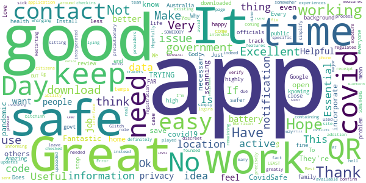

# COVIDSafe
App version ``2.0``

Analyzed with [covid-apps-observer](http://github.com/covid-apps-observer) project, version ``0.1``

## App overview
| | |
|-------------------------|-------------------------| 
| **Name**&nbsp;&nbsp;&nbsp;&nbsp;&nbsp;&nbsp;&nbsp;&nbsp;&nbsp;&nbsp;&nbsp;&nbsp;&nbsp;&nbsp;&nbsp;&nbsp;&nbsp;&nbsp;&nbsp;&nbsp;&nbsp;&nbsp;&nbsp;&nbsp;&nbsp;&nbsp;&nbsp;&nbsp;&nbsp;&nbsp;&nbsp;&nbsp;&nbsp;&nbsp;&nbsp;&nbsp;&nbsp;&nbsp;&nbsp;&nbsp;  | COVIDSafe |
| **Unique identifier** | au.gov.health.covidsafe |
| **Link to Google Play** | [https://play.google.com/store/apps/details?id=au.gov.health.covidsafe](https://play.google.com/store/apps/details?id=au.gov.health.covidsafe) |
| **Summary**  | COVIDSafe is a community-based way to stop the spread of COVID-19. |
| **Privacy policy** | [https://covidsafe.gov.au/privacy-policy.html](https://covidsafe.gov.au/privacy-policy.html) |
| **Latest version** | 2.0 |
| **Last update** | 2020-12-18 09:16:28 |
| **Recent changes** | This release introduces the new Herald Protocol that improves COVIDSafe&#39;s ability to capture close contacts and keeps users better informed about important COVID-19 information.  |
| **Installs**  | 1,000,000+ |
| **Category** | Health & Fitness |
| **First release** | Apr 25, 2020 |
| **Size**  | 13M |
| **Supported Android version**  | 5.0 and up |

### Description
> COVIDSafe app has been developed by the Australian Government Department of Health to help keep the community safe from coronavirus (COVID-19). Together, let’s help stop the spread and keep ourselves and each other healthy.
 COVIDSafe uses the Bluetooth® technology on your mobile phone to look for other devices with COVIDSafe installed. Your device will take a note of contact you’ve had with other users by securely logging the other user’s reference code. If you or someone you’ve been in contact with is diagnosed with COVID-19, the close contact information securely stored in your phone can be uploaded and used—with your consent—by state and territory health officials to quickly inform people who’ve been exposed to the virus.
 How you can help stop the spread of COVID-19:
 • Download the COVIDSafe app
 • Register using your mobile phone number, name, age range and postcode
 • Turn on Bluetooth®
 • Check that COVIDSafe is running when you are out and about or are likely to come into contact with others
 • If you test positive for COVID-19, you can consent for your close contact information to be used by state and territory health officials to contact people who may have been exposed. If you’ve been exposed to the virus by someone you’ve been in close contact with, state and territory health officials will be able to contact you quickly so you can get the support you need
 COVIDSafe is an Australian Government Department of Health initiative. Visit https://www.health.gov.au/resources/apps-and-tools/covidsafe-app for more information.

### User interface
The developers of the app provide the following screenshots in the Google play store.
| | | |
|:-------------------------:|:-------------------------:|:-------------------------:|
 |   |   |   | 
 |   |  

## Development team
In the following we report the main information provided by the development team in the Google play store.

| | |
|-------------------------|-------------------------|
| **Developer**  | Australian Department of Health |
| **Website**  | [https://www.health.gov.au/resources/apps-and-tools/covidsafe-app#covidsafe-app-help](https://www.health.gov.au/resources/apps-and-tools/covidsafe-app#covidsafe-app-help) |
| **Email** | support@COVIDSafe.gov.au |
| **Physical address**  | - |
| **Other developed apps**  | [https://play.google.com/store/apps/developer?id=Australian+Department+of+Health](https://play.google.com/store/apps/developer?id=Australian+Department+of+Health) |

## Android support

| | |
|-------------------------|-------------------------|
| **Declared target Android version**  | Android10, version 10 (API level 29) |
| **Effective target Android version**  | Android10, version 10 (API level 29) |
| **Minimum supported Android version**  | Lollipop, version 5.0 (API level 21) |
| **Maximum target Android version**  | - |

The larger the difference between the minimum and maximum supported Android versions, the better. A larger difference means a wider audience. For example, old phones have a very low Android version, so a high minimum supported Android version means that the app cannot be used by users with old phones, thus leading to accessibility problems. 

## Requested permissions

In the following we report the complete list of the permissions requested by the app. 

| **Permission** | **Protection level** | **Description** | 
|-------------------------|-------------------------|-------------------------|
 **android.permission ACCESS_FINE_LOCATION** | :warning:**Dangerous** | Allows an app to access precise location. 
 **android.permission ACCESS_NETWORK_STATE** | Normal | Allows applications to access information about networks. 
 **android.permission BLUETOOTH** | Normal | Allows applications to connect to paired bluetooth devices. 
 **android.permission BLUETOOTH_ADMIN** | Normal | Allows applications to discover and pair bluetooth devices. 
 **android.permission FOREGROUND_SERVICE** | Normal | Allows a regular application to use Service.startForeground. 
 **android.permission INTERNET** | Normal | Allows applications to open network sockets. 
 **android.permission RECEIVE_BOOT_COMPLETED** | Normal | Allows an application to receive the Intent.ACTION_BOOT_COMPLETED that is broadcast after the system finishes booting. 
 **android.permission REQUEST_IGNORE_BATTERY_OPTIMIZATIONS** | Normal | Permission an application must hold in order to use Settings.ACTION_REQUEST_IGNORE_BATTERY_OPTIMIZATIONS. 
 **android.permission WAKE_LOCK** | Normal | Allows using PowerManager WakeLocks to keep processor from sleeping or screen from dimming. 
 **com.google.android.c2dm.permission RECEIVE** | - | - 

## Mentioned servers

| **Server** | **Registrant** | **Registrant country** | **Creation date** | 
|-------------------------|-------------------------|-------------------------|-------------------------|
 | google.com | Google LLC | :us: US | 1997-09-15 04:00:00 |
 | stackoverflow.com | Stack Exchange, Inc. | :us: US | 2003-12-26 19:18:07 |
 | googleapis.com | Google LLC | :us: US | 2005-01-25 17:52:26 |

## Security analysis 

Below we report the main security warnings raised by our execution of the [Androwarn](https://github.com/maaaaz/androwarn) security analysis tool.

**Connection interfaces exfiltration**
> - This application reads details about the currently active data network 
> - This application tries to find out if the currently active data network is metered 

**Suspicious connection establishment**
> - This application opens a Socket and connects it to the remote address ' returned no addresses for  ; port is out of range' on the 'N/A' port  
> - This application opens a Socket and connects it to the remote address '' on the 'N/A' port  
> - This application opens a Socket and connects it to the remote address 'Ljava/lang/StringBuilder;->toString()Ljava/lang/String;' on the 'N/A' port  
> - This application opens a Socket and connects it to the remote address 'Ljava/net/Proxy;->type()Ljava/net/Proxy$Type;' on the 'N/A' port  
> - This application opens a Socket and connects it to the remote address 'timeout' on the 'N/A' port  

## User ratings and reviews

Below we provide information about how end users are reacting to the app in terms of ratings and reviews in the Google Play store.

### Ratings

The COVIDSafe app has been installed by more than **1000000** times. At this time, **13917** rated the app and its average score is **2.7911618**. Below we show the distribution of the ratings across the usual star-based rating of Google Play

:star::star::star::star::star:: 4394

:star::star::star::star:: 1190

:star::star::star:: 1200

:star::star:: 1379

:star:: 5754

### Reviews 

#### 5-star reviews

> Have mine on at all times when I leave my home  :date: __2021-01-29 22:25:00__

> App Glitch - Error keeps coming up "CovidSafe Not Active" however it definitely is active when I open the app. Restarting phone doesn't fix.  :date: __2021-01-28 21:04:05__

> Useful  :date: __2021-01-26 15:53:40__

> Good information if we all do it we get through it  :date: __2021-01-26 11:00:56__

> Safe  :date: __2021-01-25 03:02:13__

> All good  :date: __2021-01-24 02:29:14__

> Ok have no experiences and I don't know if it works or not BUT SOMEBODY IS AT LEAST TRYING SOMETHING instead of sitting around whinging and bitchinh  :date: __2021-01-22 11:35:47__

> I'm sick as hell. Hopefully this app works to save others.  :date: __2021-01-22 11:30:41__

> Home page  :date: __2021-01-17 01:49:16__

> ... Ok l. Og  :date: __2021-01-15 05:41:15__

#### 4-star reviews

> Good, does the job. Not draining battery on my phone: 6% for over a day. Would be nice to see local transmissions as well as total cases per day.  :date: __2021-01-26 22:12:13__

> D3 i 2##w we4w w 6 wa 222  :date: __2021-01-24 21:54:19__

> App has started to drain my battery.... When it first came out I installed it and it only used about 1 to 2% battery in a day but now it's over 20% of my battery and I can not get a full day's use out of my phone as of this I might have to delete it as what is the point of havin git if I can not use my phone anyway if it's flat  :date: __2021-01-07 10:05:45__

> Great idea. Originally I couldnt keep the app open on my Oppo phone but I finally solved it. I turned off all the battery saving features as described on the Covidsafe help page, but the missing link was on the open app page, you have to swipe down on Covidsafe to lock the app. This prevents Oppo's aggressive battery management from shutting it down.  :date: __2021-01-06 11:49:27__

> Had similar battery issues like many others here. But clearing the cache, uninstalling and reinstalling, worked wonders. My phone now lasts more than a day again.  :date: __2021-01-05 11:05:05__

> Very sound  :date: __2021-01-05 06:10:56__

> This app does not alert to not being active or requiring an update unless you actually open it...should be better than this.. Update 21 12 20 just got my 1st alert to an update being available..much better  :date: __2020-12-21 08:05:41__

> Seems ok  :date: __2020-12-21 08:04:09__

> It's a nessasary for the Government to have this, if those that think it's not real, well it's very real so it's an a Must cheers  :date: __2020-12-20 23:49:00__

> Works perfectly. Would be 5 star if it didn't stop when it needed an update.  :date: __2020-12-20 08:40:56__

#### 3-star reviews

> The app is a great idea but I had to uninstall it today because it has been draining my battery since the last update.  :date: __2021-01-18 11:05:17__

> No problem using it but power consumption is now showing 7.7%  :date: __2021-01-17 04:16:24__

> Drains the battery way to fast  :date: __2021-01-12 05:39:33__

> 2h🥰🐪but  :date: __2021-01-10 23:35:48__

> It is killing my battery recently.  :date: __2021-01-09 06:39:25__

> Something seems to be seriously wrong with the current version. I was woken up this morning by my phone buzzing as it turned itself off due to 0% battery. It was 90%+ less than 7 hours ago. Battery manager shows it was the Covidsafe app that caused it. It has always hit my battery fairly hard but it's getting ridiculous now. (Update) Uninstalling, reinstalling, and clearing the cache seems to have helped. Next night I went from 100% to 83% in ~ 7 hrs.  :date: __2021-01-06 22:58:44__

> The user interface is great but the app has been running my battery flat overnight so I uninstalled it and gave a 3 start rating.  :date: __2021-01-05 12:36:55__

> C.  :date: __2021-01-04 09:33:25__

> ( edited for later versions) uninstalling. No.one i know is still using it. I don't trust its status or capacity anymore. Maybe if its refreshed and included the QR functionality. Bye.  :date: __2021-01-03 12:19:41__

> Battery issue, I have revert back to old version, rather latest version. Please fix the battery using too much issue, so i can update.  :date: __2021-01-02 07:36:13__

#### 2-star reviews

> My airpods no longer automatically connect and the disconnect spontaneously since I installed this. Update Jan 21 - tried it again. My bluetooth turns off spontaneously. Still 2 stars.  :date: __2021-01-29 22:40:40__

> Due to more recent Bluetooth disconnection I have deleted this app. Bluetooth speaker connected to Spotify stopping. I press play & it's stops again. This is the only new app I've installed. I think there a bug and this is the only different thing (new app) on my device. Had to clear memory to get Bluetooth speaker working. Galaxy Note 8.  :date: __2021-01-29 03:39:36__

> This app should have a QR scanner in it  :date: __2021-01-28 00:29:36__

> Drains the battery at Rate of around 3 percent per hour, even in airplane mode.  :date: __2021-01-27 20:45:08__

> Clunky  :date: __2021-01-26 11:11:27__

> a recent update has introduced a battery usage issue  :date: __2021-01-26 09:13:28__

> After last update the app start using a quater of my battery. Given the fact that we require to use check-in and out procedure almost everywhere, I dont see a point to use this app. Having a dead mobile does not help the cause.  :date: __2021-01-26 04:03:28__

> I had this installed since the beginning, but recently the battery drain has been 30-40%. Needs work.  :date: __2021-01-25 06:10:15__

> Huge battery consumption issue now..  :date: __2021-01-24 20:39:39__

> My phone's battery has started to run out in 5 hours of late. It used to last 12 hours or more. I found that COVIDSafe caused 50% of the battery drain.  :date: __2021-01-23 20:58:44__

#### 1-star reviews

> Since installing the update using the Herald protocol, Android consistently reports this is the most battery consuming app running, even in background, coming immediately after Screen usage and Google Play Services. Phone no longer lasts 12 hours before going into power save modes. No point having COVID Safe running if the phone is dead.  :date: __2021-01-29 13:44:42__

> I thought my phone was faulty with the unmissable increased battery usage. After checking battery usage saw it was this app. Checked the app comments and glad I wasn't going crazy. Also contacted the development team as a good citizen, they pretty much dismissed the feedback. People want to do the right thing but if you are flat out going to deny there is no issue with the app, well not sure what else we can do.  :date: __2021-01-29 13:21:25__

> I've had it on my S10+ since the beginning, but like a lot of others the battery usage recently has been ridiculous. I can see a lot of people uninstalling the app if this isn't addressed, which is of course not helping us all stay safe. I'm pretty tempted to uninstall it myself, 30%-40% of my battery usage is this one app.  :date: __2021-01-29 08:57:47__

> Using 30% of my battery  :date: __2021-01-29 08:43:34__

> Kills my battery  :date: __2021-01-29 08:34:05__

> 90% of my phone's battery usage is because this app. Not acceptable! I suspect that this will cause many people to stop using the app, as shown by many other reviewers. Please fix this issue.  :date: __2021-01-29 04:53:35__

> It absolutely ruins battery life. It literally used 40% of my batter in 4 hours... sorry but it's getting uninstalled until the battery drainage issue is fixed  :date: __2021-01-29 01:23:53__

> Now there is battery draining isues as well as the below when will this be fixed. I dont mind havig this app just fix it. When is there going to be a fix so this app stops disconnecting other devices from Bluetooth. It does it multiple times a day only had thos issue since this app has been installed  :date: __2021-01-29 01:06:23__

> This app was number 1 on my list for battery draining. I've had to uninstall the app.  :date: __2021-01-28 23:47:34__

> Keeps switching off. I have to switch back on every 24 -48 hrs  :date: __2021-01-28 23:44:47__

