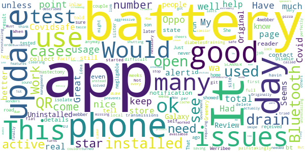

# COVIDSafe
App version ``2.1``

Analyzed with [covid-apps-observer](http://github.com/covid-apps-observer) project, version ``0.1``

## App overview
| | |
|-------------------------|-------------------------| 
| **Name**&nbsp;&nbsp;&nbsp;&nbsp;&nbsp;&nbsp;&nbsp;&nbsp;&nbsp;&nbsp;&nbsp;&nbsp;&nbsp;&nbsp;&nbsp;&nbsp;&nbsp;&nbsp;&nbsp;&nbsp;&nbsp;&nbsp;&nbsp;&nbsp;&nbsp;&nbsp;&nbsp;&nbsp;&nbsp;&nbsp;&nbsp;&nbsp;&nbsp;&nbsp;&nbsp;&nbsp;&nbsp;&nbsp;&nbsp;&nbsp;  | COVIDSafe |
| **Unique identifier** | au.gov.health.covidsafe |
| **Link to Google Play** | [https://play.google.com/store/apps/details?id=au.gov.health.covidsafe](https://play.google.com/store/apps/details?id=au.gov.health.covidsafe) |
| **Summary**  | COVIDSafe is a community-based way to stop the spread of COVID-19. |
| **Privacy policy** | [https://covidsafe.gov.au/privacy-policy.html](https://covidsafe.gov.au/privacy-policy.html) |
| **Latest version** | 2.1 |
| **Last update** | 2021-02-01 02:17:24 |
| **Recent changes** | New COVID-19 case statistics at the State and Territory level. Ability to update your postcode if you move locations or travel. Bug fixes.  |
| **Installs**  | 1,000,000+ |
| **Category** | Health & Fitness |
| **First release** | Apr 25, 2020 |
| **Size**  | 13M |
| **Supported Android version**  | 5.0 and up |

### Description
> COVIDSafe app has been developed by the Australian Government Department of Health to help keep the community safe from coronavirus (COVID-19). Together, let’s help stop the spread and keep ourselves and each other healthy.
 COVIDSafe uses the Bluetooth® technology on your mobile phone to look for other devices with COVIDSafe installed. Your device will take a note of contact you’ve had with other users by securely logging the other user’s reference code. If you or someone you’ve been in contact with is diagnosed with COVID-19, the close contact information securely stored in your phone can be uploaded and used—with your consent—by state and territory health officials to quickly inform people who’ve been exposed to the virus.
 How you can help stop the spread of COVID-19:
 • Download the COVIDSafe app
 • Register using your mobile phone number, name, age range and postcode
 • Turn on Bluetooth®
 • Check that COVIDSafe is running when you are out and about or are likely to come into contact with others
 • If you test positive for COVID-19, you can consent for your close contact information to be used by state and territory health officials to contact people who may have been exposed. If you’ve been exposed to the virus by someone you’ve been in close contact with, state and territory health officials will be able to contact you quickly so you can get the support you need
 COVIDSafe is an Australian Government Department of Health initiative. Visit https://www.health.gov.au/resources/apps-and-tools/covidsafe-app for more information.

### User interface
The developers of the app provide the following screenshots in the Google play store.
| | | |
|:-------------------------:|:-------------------------:|:-------------------------:|
 |   |   |   | 
 |   |  

## Development team
In the following we report the main information provided by the development team in the Google play store.

| | |
|-------------------------|-------------------------|
| **Developer**  | Australian Department of Health |
| **Website**  | [https://www.health.gov.au/resources/apps-and-tools/covidsafe-app#covidsafe-app-help](https://www.health.gov.au/resources/apps-and-tools/covidsafe-app#covidsafe-app-help) |
| **Email** | support@COVIDSafe.gov.au |
| **Physical address**  | - |
| **Other developed apps**  | [https://play.google.com/store/apps/developer?id=Australian+Department+of+Health](https://play.google.com/store/apps/developer?id=Australian+Department+of+Health) |

## Android support

| | |
|-------------------------|-------------------------|
| **Declared target Android version**  | Android10, version 10 (API level 29) |
| **Effective target Android version**  | Android10, version 10 (API level 29) |
| **Minimum supported Android version**  | Lollipop, version 5.0 (API level 21) |
| **Maximum target Android version**  | - |

The larger the difference between the minimum and maximum supported Android versions, the better. A larger difference means a wider audience. For example, old phones have a very low Android version, so a high minimum supported Android version means that the app cannot be used by users with old phones, thus leading to accessibility problems. 

## Requested permissions

In the following we report the complete list of the permissions requested by the app. 

| **Permission** | **Protection level** | **Description** | 
|-------------------------|-------------------------|-------------------------|
 **android.permission ACCESS_COARSE_LOCATION** | :warning:**Dangerous** | Allows an app to access approximate location. 
 **android.permission ACCESS_FINE_LOCATION** | :warning:**Dangerous** | Allows an app to access precise location. 
 **android.permission ACCESS_NETWORK_STATE** | Normal | Allows applications to access information about networks. 
 **android.permission BLUETOOTH** | Normal | Allows applications to connect to paired bluetooth devices. 
 **android.permission BLUETOOTH_ADMIN** | Normal | Allows applications to discover and pair bluetooth devices. 
 **android.permission FOREGROUND_SERVICE** | Normal | Allows a regular application to use Service.startForeground. 
 **android.permission INTERNET** | Normal | Allows applications to open network sockets. 
 **android.permission RECEIVE_BOOT_COMPLETED** | Normal | Allows an application to receive the Intent.ACTION_BOOT_COMPLETED that is broadcast after the system finishes booting. 
 **android.permission REQUEST_IGNORE_BATTERY_OPTIMIZATIONS** | Normal | Permission an application must hold in order to use Settings.ACTION_REQUEST_IGNORE_BATTERY_OPTIMIZATIONS. 
 **android.permission WAKE_LOCK** | Normal | Allows using PowerManager WakeLocks to keep processor from sleeping or screen from dimming. 
 **com.google.android.c2dm.permission RECEIVE** | - | - 

## Mentioned servers

| **Server** | **Registrant** | **Registrant country** | **Creation date** | 
|-------------------------|-------------------------|-------------------------|-------------------------|
 | google.com | Google LLC | :us: US | 1997-09-15 04:00:00 |
 | stackoverflow.com | Stack Exchange, Inc. | :us: US | 2003-12-26 19:18:07 |
 | googleapis.com | Google LLC | :us: US | 2005-01-25 17:52:26 |

## Security analysis 

Below we report the main security warnings raised by our execution of the [Androwarn](https://github.com/maaaaz/androwarn) security analysis tool.

**Connection interfaces exfiltration**
> - This application reads details about the currently active data network 
> - This application tries to find out if the currently active data network is metered 

**Suspicious connection establishment**
> - This application opens a Socket and connects it to the remote address ' returned no addresses for  ; port is out of range' on the 'N/A' port  
> - This application opens a Socket and connects it to the remote address '' on the 'N/A' port  
> - This application opens a Socket and connects it to the remote address 'Ljava/lang/StringBuilder;->toString()Ljava/lang/String;' on the 'N/A' port  
> - This application opens a Socket and connects it to the remote address 'Ljava/net/Proxy;->type()Ljava/net/Proxy$Type;' on the 'N/A' port  
> - This application opens a Socket and connects it to the remote address 'timeout' on the 'N/A' port  

## User ratings and reviews

Below we provide information about how end users are reacting to the app in terms of ratings and reviews in the Google Play store.

### Ratings

The COVIDSafe app has been installed by more than **1000000** times. At this time, **14529** rated the app and its average score is **2.489712**. Below we show the distribution of the ratings across the usual star-based rating of Google Play

:star::star::star::star::star:: 3647

:star::star::star::star:: 1096

:star::star::star:: 1106

:star::star:: 1554

:star:: 7126

### Reviews 

#### 5-star reviews

> Good save  :date: __2021-02-06 06:53:09__

> It's probably great but my poor old Android's battery can't handle the strain from running Bluetooth and keeps on switching it off. And, yes, I've checked all the phone settings. Sorry Federal Government. I can't help. Now uninstalled. UPDATE... New phone, now works quietly in the background.  :date: __2021-02-04 15:09:05__

> Awe some  :date: __2021-02-04 08:48:21__

> Its easy to use and should be a requirement everywhere  :date: __2021-02-03 03:14:18__

> Very helpful well done to the team who designed the app  :date: __2021-02-02 11:32:18__

> Easy 👍  :date: __2021-02-02 11:22:14__

> It all started in 2020! Wi-fi drivin. Covid app.  :date: __2021-02-01 14:50:18__

> A pity so many people fail to understand the importance and relevance of this brilliant app. If everyone had used correctly in the beginning, covid-19 would have been squashed within 4-6 weeks of implementation. Greed and selfish attitudes the reason.  :date: __2021-02-01 01:12:22__

> Has to be the good for all  :date: __2021-01-31 05:08:26__

> Solution for Battery drain- restart your phone. Had the batt drain issue. Emailed developer saying I'd uninstalled and why. They replied with a fair list of helpful info... including restart the phone as it resets something after a lot of Bluetooth handshakes...took my phone batt back to 30hrs from down to 18.  :date: __2021-01-30 11:48:46__

#### 4-star reviews

> Just Ok  :date: __2021-02-06 07:06:45__

> My sister inlaw was tested but was not told to self isolate and has never reçeived a test result. That was many weeks ago. She had a mastectomy a couple of days later. Pacific Werribee test site.  :date: __2021-02-04 13:26:46__

> Have son with diabetes so installed but it is a battery hog. Disable bluetooth while at home. Battery usage showed 47% usage was by this app while all other apps negligable.  :date: __2021-02-03 09:50:09__

> 4webber webber road Greenery sure he did  :date: __2021-02-03 04:08:27__

> I have painstakingly used the QR SCANNER. IT is difficult to use.  :date: __2021-02-02 11:42:21__

> Good, does the job. Not draining battery on my phone: 6% for over a day. Would be nice to see local transmissions as well as total cases per day.  :date: __2021-01-26 22:12:13__

> D3 i 2##w we4w w 6 wa 222  :date: __2021-01-24 21:54:19__

> App has started to drain my battery.... When it first came out I installed it and it only used about 1 to 2% battery in a day but now it's over 20% of my battery and I can not get a full day's use out of my phone as of this I might have to delete it as what is the point of havin git if I can not use my phone anyway if it's flat  :date: __2021-01-07 10:05:45__

> Great idea. Originally I couldnt keep the app open on my Oppo phone but I finally solved it. I turned off all the battery saving features as described on the Covidsafe help page, but the missing link was on the open app page, you have to swipe down on Covidsafe to lock the app. This prevents Oppo's aggressive battery management from shutting it down.  :date: __2021-01-06 11:49:27__

> Had similar battery issues like many others here. But clearing the cache, uninstalling and reinstalling, worked wonders. My phone now lasts more than a day again.  :date: __2021-01-05 11:05:05__

#### 3-star reviews

> This app drives me crazy. It keeps changing the setting so it's not working. Nearly ready to uninstall. It was working before the update 😔  :date: __2021-02-06 07:59:29__

> Doesn't look like the battery issue is fixed with the 31st Jan update. I have found turning off AOD (Always On Display) has dropped battery usage of the app considerably (down to 3-5%) so will bump up the rating. Real shame there aren't timely fixes for what could be an important tracing tool.  :date: __2021-02-06 06:40:46__

> 7m7 77 tuesdayo8 9thhunny h3.00.iiimmmm3.39 8m no 8 7 mi 3 hi nu u yucky5 nn nn a as ssh  :date: __2021-02-04 05:02:51__

> Slow  :date: __2021-02-01 05:28:42__

> Uhy  :date: __2021-02-01 01:20:02__

> I have had this app since it first came out and all of a sudden it has started to drain my battery and since I deleted it I have noticed my battery is lasting substantially longer. I would prefer to have the app but I can't stand my battery running out overnight, every night.  :date: __2021-01-30 22:27:47__

> The app is a great idea but I had to uninstall it today because it has been draining my battery since the last update.  :date: __2021-01-18 11:05:17__

> No problem using it but power consumption is now showing 7.7%  :date: __2021-01-17 04:16:24__

> Drains the battery way to fast  :date: __2021-01-12 05:39:33__

> 2h🥰🐪but  :date: __2021-01-10 23:35:48__

#### 2-star reviews

> Drained phone very quickly! Fed up w it & uninstalled it. 4 Feb 2021 reinstalled due to new 'ultra virus' alerts announced & 19 in my suburb (3186)!  :date: __2021-02-04 04:42:27__

> Reduces battery life  :date: __2021-02-02 01:46:02__

> Difficult to navigate  :date: __2021-01-30 09:40:58__

> My airpods no longer automatically connect and the disconnect spontaneously since I installed this. Update Jan 21 - tried it again. My bluetooth turns off spontaneously. Still 2 stars.  :date: __2021-01-29 22:40:40__

> Due to more recent Bluetooth disconnection I have deleted this app. Bluetooth speaker connected to Spotify stopping. I press play & it's stops again. This is the only new app I've installed. I think there a bug and this is the only different thing (new app) on my device. Had to clear memory to get Bluetooth speaker working. Galaxy Note 8.  :date: __2021-01-29 03:39:36__

> This app should have a QR scanner in it  :date: __2021-01-28 00:29:36__

> Drains the battery at Rate of around 3 percent per hour, even in airplane mode.  :date: __2021-01-27 20:45:08__

> Clunky  :date: __2021-01-26 11:11:27__

> a recent update has introduced a battery usage issue  :date: __2021-01-26 09:13:28__

> After last update the app start using a quater of my battery. Given the fact that we require to use check-in and out procedure almost everywhere, I dont see a point to use this app. Having a dead mobile does not help the cause.  :date: __2021-01-26 04:03:28__

#### 1-star reviews

> This app once I loaded it subsequently refused to function. I have been advised of the possibility that my phone being Android will not function in certain venues due to poor reception. I now just ask for the hand written recording diary as I enter premises to reduce the frustration of dealing with a system that appears to only work if you have an expensive device.  :date: __2021-02-06 12:26:51__

> Drains battery, keeps crashing  :date: __2021-02-06 11:07:38__

> fix battery drain.  :date: __2021-02-06 07:48:49__

> Drained battery suddenly! Uninstalling.  :date: __2021-02-06 06:31:05__

> If there was no pandemic, and when the vaccine rollout is well underway, this would be the first app to be uninstalled from my phone. As a software developer, my own app that I thought was a "battery hog" consumes a full 1% of my phone battery. The COVIDSafe app consumes upwards of 12% of the same phone's battery.  :date: __2021-02-05 17:22:17__

> Stop draining my battery! Conspiracy theorists would say you are in bed with energy companies! I've had this app from day 1. It's a good idea but not if your batt'y is out of juice. I'm switching off until this is fixed. Edit - I see Android devices are being used as a go between for iOs. I didn't consent to that. No wonder my battery is dying. Just record who I'm near, don't make my phone go searching for other iPhone users and record their info as well. Sort it out Fed govt! I'm not happy!  :date: __2021-02-05 12:56:05__

> Was ok, but recent update means it chews through battery at a very high rate - 10-15% per hour. It needs to use APIs to limit impact on battery. Have run it and used it for nearly a year, now uninstalled. Not fit for purpose in current version.  :date: __2021-02-05 02:54:04__

> This app was successful for weeks, then suddenly it said identification error. I never found out what the error was so stopped using it, Just sign now. Dave  :date: __2021-02-04 23:07:18__

> Battery vampire. Uninstalling.  :date: __2021-02-04 22:09:35__

> Not a scanner no use  :date: __2021-02-04 05:10:23__

