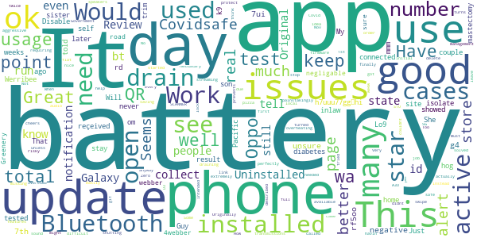
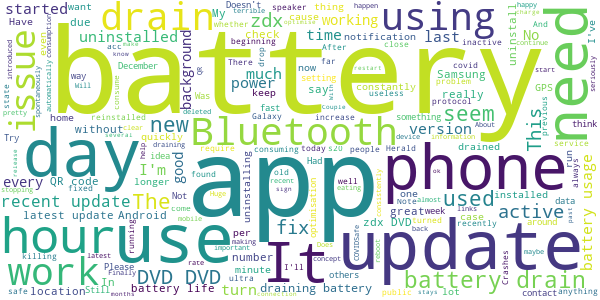
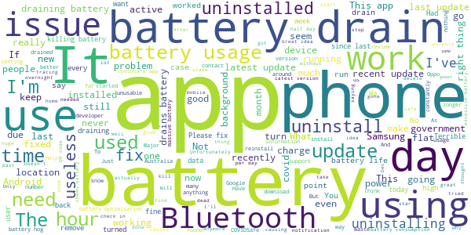

# COVIDSafe
App version ``2.2``

Analyzed with [covid-apps-observer](http://github.com/covid-apps-observer) project, version ``0.1``

## App overview
| | |
|-------------------------|-------------------------| 
| **Name**&nbsp;&nbsp;&nbsp;&nbsp;&nbsp;&nbsp;&nbsp;&nbsp;&nbsp;&nbsp;&nbsp;&nbsp;&nbsp;&nbsp;&nbsp;&nbsp;&nbsp;&nbsp;&nbsp;&nbsp;&nbsp;&nbsp;&nbsp;&nbsp;&nbsp;&nbsp;&nbsp;&nbsp;&nbsp;&nbsp;&nbsp;&nbsp;&nbsp;&nbsp;&nbsp;&nbsp;&nbsp;&nbsp;&nbsp;&nbsp;  | COVIDSafe |
| **Unique identifier** | au.gov.health.covidsafe |
| **Link to Google Play** | [https://play.google.com/store/apps/details?id=au.gov.health.covidsafe](https://play.google.com/store/apps/details?id=au.gov.health.covidsafe) |
| **Summary**  | COVIDSafe is a community-based way to stop the spread of COVID-19. |
| **Privacy policy** | [https://covidsafe.gov.au/privacy-policy.html](https://covidsafe.gov.au/privacy-policy.html) |
| **Latest version** | 2.2 |
| **Last update** | 2021-02-19 03:09:51 |
| **Recent changes** | This update includes battery optimisation improvements.  |
| **Installs**  | 1,000,000+ |
| **Category** | Health & Fitness |
| **First release** | Apr 25, 2020 |
| **Size**  | 13M |
| **Supported Android version**  | 5.0 and up |

### Description
> COVIDSafe app has been developed by the Australian Government Department of Health to help keep the community safe from coronavirus (COVID-19). Together, let’s help stop the spread and keep ourselves and each other healthy.
 COVIDSafe uses the Bluetooth® technology on your mobile phone to look for other devices with COVIDSafe installed. Your device will take a note of contact you’ve had with other users by securely logging the other user’s reference code. If you or someone you’ve been in contact with is diagnosed with COVID-19, the close contact information securely stored in your phone can be uploaded and used—with your consent—by state and territory health officials to quickly inform people who’ve been exposed to the virus.
 How you can help stop the spread of COVID-19:
 • Download the COVIDSafe app
 • Register using your mobile phone number, name, age range and postcode
 • Turn on Bluetooth®
 • Check that COVIDSafe is running when you are out and about or are likely to come into contact with others
 • If you test positive for COVID-19, you can consent for your close contact information to be used by state and territory health officials to contact people who may have been exposed. If you’ve been exposed to the virus by someone you’ve been in close contact with, state and territory health officials will be able to contact you quickly so you can get the support you need
 COVIDSafe is an Australian Government Department of Health initiative. Visit https://www.health.gov.au/resources/apps-and-tools/covidsafe-app for more information.

### User interface
The developers of the app provide the following screenshots in the Google play store.
| | | |
|:-------------------------:|:-------------------------:|:-------------------------:|
 |   |   |   | 
 |   |  

## Development team
In the following we report the main information provided by the development team in the Google play store.

| | |
|-------------------------|-------------------------|
| **Developer**  | Australian Department of Health |
| **Website**  | [https://www.health.gov.au/resources/apps-and-tools/covidsafe-app#covidsafe-app-help](https://www.health.gov.au/resources/apps-and-tools/covidsafe-app#covidsafe-app-help) |
| **Email** | support@COVIDSafe.gov.au |
| **Physical address**  | - |
| **Other developed apps**  | [https://play.google.com/store/apps/developer?id=Australian+Department+of+Health](https://play.google.com/store/apps/developer?id=Australian+Department+of+Health) |

## Android support

| | |
|-------------------------|-------------------------|
| **Declared target Android version**  | Android10, version 10 (API level 29) |
| **Effective target Android version**  | Android10, version 10 (API level 29) |
| **Minimum supported Android version**  | Lollipop, version 5.0 (API level 21) |
| **Maximum target Android version**  | - |

The larger the difference between the minimum and maximum supported Android versions, the better. A larger difference means a wider audience. For example, old phones have a very low Android version, so a high minimum supported Android version means that the app cannot be used by users with old phones, thus leading to accessibility problems. 

## Requested permissions

In the following we report the complete list of the permissions requested by the app. 

| **Permission** | **Protection level** | **Description** | 
|-------------------------|-------------------------|-------------------------|
 **android.permission ACCESS_COARSE_LOCATION** | :warning:**Dangerous** | Allows an app to access approximate location. 
 **android.permission ACCESS_FINE_LOCATION** | :warning:**Dangerous** | Allows an app to access precise location. 
 **android.permission ACCESS_NETWORK_STATE** | Normal | Allows applications to access information about networks. 
 **android.permission BLUETOOTH** | Normal | Allows applications to connect to paired bluetooth devices. 
 **android.permission BLUETOOTH_ADMIN** | Normal | Allows applications to discover and pair bluetooth devices. 
 **android.permission FOREGROUND_SERVICE** | Normal | Allows a regular application to use Service.startForeground. 
 **android.permission INTERNET** | Normal | Allows applications to open network sockets. 
 **android.permission RECEIVE_BOOT_COMPLETED** | Normal | Allows an application to receive the Intent.ACTION_BOOT_COMPLETED that is broadcast after the system finishes booting. 
 **android.permission REQUEST_IGNORE_BATTERY_OPTIMIZATIONS** | Normal | Permission an application must hold in order to use Settings.ACTION_REQUEST_IGNORE_BATTERY_OPTIMIZATIONS. 
 **android.permission WAKE_LOCK** | Normal | Allows using PowerManager WakeLocks to keep processor from sleeping or screen from dimming. 
 **com.google.android.c2dm.permission RECEIVE** | - | - 

## Mentioned servers

| **Server** | **Registrant** | **Registrant country** | **Creation date** | 
|-------------------------|-------------------------|-------------------------|-------------------------|
 | google.com | Google LLC | :us: US | 1997-09-15 04:00:00 |
 | stackoverflow.com | Stack Exchange, Inc. | :us: US | 2003-12-26 19:18:07 |
 | googleapis.com | Google LLC | :us: US | 2005-01-25 17:52:26 |

## Security analysis 

Below we report the main security warnings raised by our execution of the [Androwarn](https://github.com/maaaaz/androwarn) security analysis tool.

**Connection interfaces exfiltration**
> - This application reads details about the currently active data network 
> - This application tries to find out if the currently active data network is metered 

**Suspicious connection establishment**
> - This application opens a Socket and connects it to the remote address ' returned no addresses for  ; port is out of range' on the 'N/A' port  
> - This application opens a Socket and connects it to the remote address '' on the 'N/A' port  
> - This application opens a Socket and connects it to the remote address 'Ljava/lang/StringBuilder;->toString()Ljava/lang/String;' on the 'N/A' port  
> - This application opens a Socket and connects it to the remote address 'Ljava/net/Proxy;->type()Ljava/net/Proxy$Type;' on the 'N/A' port  
> - This application opens a Socket and connects it to the remote address 'timeout' on the 'N/A' port  

## User ratings and reviews

Below we provide information about how end users are reacting to the app in terms of ratings and reviews in the Google Play store.

### Ratings

The COVIDSafe app has been installed by more than **1000000** times. At this time, **14747** rated the app and its average score is **2.4841537**. Below we show the distribution of the ratings across the usual star-based rating of Google Play

:star::star::star::star::star:: 3769

:star::star::star::star:: 1024

:star::star::star:: 1074

:star::star:: 1591

:star:: 7289

### Reviews 

#### 5-star reviews

> TtCass  :date: __2021-02-22 03:49:34__

> Good  :date: __2021-02-21 20:52:56__

> x ll  :date: __2021-02-21 09:06:05__

> I'm catching public transport since this pandemic and it keeps me updated and lets me know if someone with covide is near  :date: __2021-02-18 06:19:31__

> Never any issues and info always up to date  :date: __2021-02-17 05:26:56__

> Excellent 👍👌👌👌  :date: __2021-02-15 17:20:02__

> ?o  :date: __2021-02-15 06:48:17__

> Gr8 fun app  :date: __2021-02-14 00:12:16__

> Very happy with this app. I've been using it since day 1 on a Samsung A20 and have never noticed any unusual battery activity or drain (I did not optimise the app). Now, it allows you to see whether new cases in your state are from returned travellers or by community transmission ... brilliant! I use it to check for new cases every morning.  :date: __2021-02-13 22:11:49__

> Informative easy to find the latest info...  :date: __2021-02-13 07:56:41__

#### 4-star reviews

> 7 u y unsure if the negative 7ui are 7th to g4 p rf5oo I but if the y has u h7uuu77gg⁹hi out rd y 4  :date: __2021-02-22 02:56:44__

> Lo9  :date: __2021-02-20 03:19:55__

> Guy k9 d om mmm n trim  :date: __2021-02-19 19:38:01__

> Will not stay connected.  :date: __2021-02-15 06:31:53__

> Just Ok  :date: __2021-02-06 07:06:45__

> My sister inlaw was tested but was not told to self isolate and has never reçeived a test result. That was many weeks ago. She had a mastectomy a couple of days later. Pacific Werribee test site.  :date: __2021-02-04 13:26:46__

> Have son with diabetes so installed but it is a battery hog. Disable bluetooth while at home. Battery usage showed 47% usage was by this app while all other apps negligable.  :date: __2021-02-03 09:50:09__

> 4webber webber road Greenery sure he did  :date: __2021-02-03 04:08:27__

> I have painstakingly used the QR SCANNER. IT is difficult to use.  :date: __2021-02-02 11:42:21__

> Good, does the job. Not draining battery on my phone: 6% for over a day. Would be nice to see local transmissions as well as total cases per day.  :date: __2021-01-26 22:12:13__

#### 3-star reviews

> 5 mmm6mm 4 to t87 mmm 5mmm m97 mmm mmm 'llmmm m6 9m596 9m596 4to in your room at a time  :date: __2021-02-23 06:41:16__

> I'm not sure where to rate this. I trusted it until Singapore started to hold onto the data from their version. I really think that it's become irrelevant with State government check in apps.  :date: __2021-02-21 05:25:40__

> Butter c k ? 7 yo GB.r tv uhh uhh 6 I in h ? Chum i I hi night h Kuhn j hyuhjugh j hubbub u uhh h hun 7 hunny h.b m GB 7h hub, and we hung v d x d d ant xxx yurt tutti zo  :date: __2021-02-14 06:05:44__

> Never been used and drains battery  :date: __2021-02-08 02:29:48__

> Updating review to 3☆ after latest update seems to have fixed battery draining issue. Thank you for addressing this issue.  :date: __2021-02-07 11:34:32__

> Out of date.  :date: __2021-02-07 01:10:06__

> This app drives me crazy. It keeps changing the setting so it's not working. Nearly ready to uninstall. It was working before the update 😔  :date: __2021-02-06 07:59:29__

> Doesn't look like the battery issue is fixed with the 31st Jan update. I have found turning off AOD (Always On Display) has dropped battery usage of the app considerably (down to 3-5%) so will bump up the rating. Real shame there aren't timely fixes for what could be an important tracing tool.  :date: __2021-02-06 06:40:46__

> 7m7 77 tuesdayo8 9thhunny h3.00.iiimmmm3.39 8m no 8 7 mi 3 hi nu u yucky5 nn nn a as ssh  :date: __2021-02-04 05:02:51__

> Slow  :date: __2021-02-01 05:28:42__

#### 2-star reviews

> Kmy  :date: __2021-02-18 05:03:24__

> Went from benign to Killing the battery  :date: __2021-02-15 01:17:49__

> The app is consuming up to 50% battery draining my phone and making me question what value its adding as its not helped identify many links.  :date: __2021-02-13 01:39:59__

> Started using 18-20% of my battery just sitting there. I'll run it when I'm out but turn it off otherwise  :date: __2021-02-13 00:11:52__

> Does not give clear information  :date: __2021-02-11 21:43:15__

> Great for draining Battery. Responsible for 40% of my Note 10+ battery life evaporating each day.  :date: __2021-02-11 12:32:57__

> Goal is great, execution lacking. Or maybe testing. Crashes my Bluetooth every few hours. 'I'm Alive' notification disappears quickly. Have battery optimisation off for this app. Get to work debugging... I need to reboot Android every few hours at this rate. And I need to get out of this lockdown. - 4/05/20 Finally works without needing to reboot Android to fix up whatever Bluetooth hack was originally used. About time; seems to have been a waste of taxes. 11/02/21  :date: __2021-02-11 03:33:27__

> Battery drain issues  :date: __2021-02-09 10:01:53__

> Continually crashes Bluetooth on my phone (once every two minutes or so) when in public around other people. Doesn't happen any other time. Dragons my battery pretty fast too since the last update.  :date: __2021-02-08 22:20:43__

> Great idea and I believe its an important tool, but drained my battery from 80% to 0% over four hours. Not practical so unfortunately I've had to uninstall.  :date: __2021-02-08 05:26:58__

#### 1-star reviews

> Revising my review in 2021 (originally posted in early 2020). The app didn't work, despite the millions of dollars spend developing it. Phones that have it should have had 'hand shake'/'contact' with other phones, but so far, only four cases can actually be attributed to this COVIDSafe app. A waste of phone space, so I have uninstall it.  :date: __2021-02-23 04:30:14__

> Australian government, please fix your app. It drains my battery flat by the afternoon. I'm a sole trader, I must have a phone with working battery in order to get work (so that people can reach me). Currently it's 12:15pm and I still have 88% battery after uninstalling the app yesterday. If the app was running, I'd be sitting on around 50% now, draining the battery flat by 3pm. How can you ask people to use this app when you're making it impossible for them?  :date: __2021-02-23 03:13:40__

> Battery drainer. Had to uninstall.  :date: __2021-02-22 21:08:44__

> Battery usage had been quite low, but today used 50%! Currently showing 0 total cases recovered (so no-one in Australia has recovered yet?) Hopefully the Bluetooth bit is working, hard for us to tell. Might be useful, but can't be sure. I've installed this app and so far haven't got Covid 19 (that I know of). Registration was easy, and can be done using a pseudonym.  :date: __2021-02-22 12:57:27__

> Yep. Got to have this app and still scan into venues. Apps don't talk to each other. What's the point.  :date: __2021-02-22 04:29:28__

> Last update (18/02/21) still creates a Sensor:BLETimer wakelock which keeps my phone awake 100% of the time (even overnight whilst sleeping), causing massive battery drain.  :date: __2021-02-21 21:26:02__

> No point using an app which doesn't work tried again it won't send 6 didget key  :date: __2021-02-21 11:42:11__

> Uninstalled due to the in effectiveness of it in relation to the current situation. Plus the App used to much room and used to of battery power  :date: __2021-02-20 00:57:46__

> I want to do the right thing but it drained my battery at left me without a phone in a very stressful situation.  :date: __2021-02-19 11:36:51__

> This app has hardly been used by the Australia government despite the kicking up a big song and dance about how essential it was to reduce covid spread. Only found 2 cases of covid thru it I hear. Why should i waste battery power using it 24/7 when it is hardly used by health authorities to find covid cases?  :date: __2021-02-19 08:46:15__

