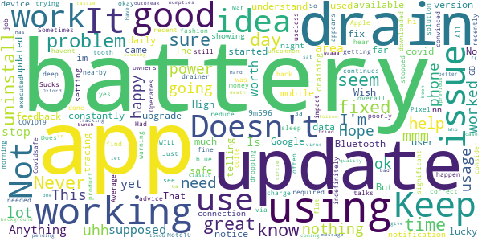
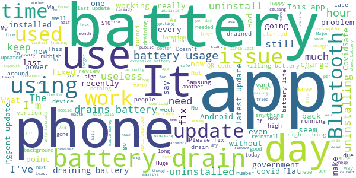

# COVIDSafe
App version ``2.3``

Analyzed with [covid-apps-observer](http://github.com/covid-apps-observer) project, version ``0.1``

## App overview
| | |
|-------------------------|-------------------------| 
| **Name**&nbsp;&nbsp;&nbsp;&nbsp;&nbsp;&nbsp;&nbsp;&nbsp;&nbsp;&nbsp;&nbsp;&nbsp;&nbsp;&nbsp;&nbsp;&nbsp;&nbsp;&nbsp;&nbsp;&nbsp;&nbsp;&nbsp;&nbsp;&nbsp;&nbsp;&nbsp;&nbsp;&nbsp;&nbsp;&nbsp;&nbsp;&nbsp;&nbsp;&nbsp;&nbsp;&nbsp;&nbsp;&nbsp;&nbsp;&nbsp;  | COVIDSafe |
| **Unique identifier** | au.gov.health.covidsafe |
| **Link to Google Play** | [https://play.google.com/store/apps/details?id=au.gov.health.covidsafe](https://play.google.com/store/apps/details?id=au.gov.health.covidsafe) |
| **Summary**  | COVIDSafe is a community-based way to stop the spread of COVID-19. |
| **Privacy policy** | [https://covidsafe.gov.au/privacy-policy.html](https://covidsafe.gov.au/privacy-policy.html) |
| **Latest version** | 2.3 |
| **Last update** | 2021-02-25 06:55:46 |
| **Recent changes** | This update includes a way to check the latest advice on current COVID-19 restrictions for every state and territory, including domestic travel, hotspots and COVID-19 case locations. |
| **Installs**  | 1,000,000+ |
| **Category** | Health & Fitness |
| **First release** | Apr 25, 2020 |
| **Size**  | 13M |
| **Supported Android version**  | 5.0 and up |

### Description
> COVIDSafe app has been developed by the Australian Government Department of Health to help keep the community safe from coronavirus (COVID-19). Together, let’s help stop the spread and keep ourselves and each other healthy.
 COVIDSafe uses the Bluetooth® technology on your mobile phone to look for other devices with COVIDSafe installed. Your device will take a note of contact you’ve had with other users by securely logging the other user’s reference code. If you or someone you’ve been in contact with is diagnosed with COVID-19, the close contact information securely stored in your phone can be uploaded and used—with your consent—by state and territory health officials to quickly inform people who’ve been exposed to the virus.
 How you can help stop the spread of COVID-19:
 • Download the COVIDSafe app
 • Register using your mobile phone number, name, age range and postcode
 • Turn on Bluetooth®
 • Check that COVIDSafe is running when you are out and about or are likely to come into contact with others
 • If you test positive for COVID-19, you can consent for your close contact information to be used by state and territory health officials to contact people who may have been exposed. If you’ve been exposed to the virus by someone you’ve been in close contact with, state and territory health officials will be able to contact you quickly so you can get the support you need
 COVIDSafe is an Australian Government Department of Health initiative. Visit https://www.health.gov.au/resources/apps-and-tools/covidsafe-app for more information.

### User interface
The developers of the app provide the following screenshots in the Google play store.
| | | |
|:-------------------------:|:-------------------------:|:-------------------------:|
 |   |   |   | 
 |   |  

## Development team
In the following we report the main information provided by the development team in the Google play store.

| | |
|-------------------------|-------------------------|
| **Developer**  | Australian Department of Health |
| **Website**  | [https://www.health.gov.au/resources/apps-and-tools/covidsafe-app#covidsafe-app-help](https://www.health.gov.au/resources/apps-and-tools/covidsafe-app#covidsafe-app-help) |
| **Email** | support@COVIDSafe.gov.au |
| **Physical address**  | - |
| **Other developed apps**  | [https://play.google.com/store/apps/developer?id=Australian+Department+of+Health](https://play.google.com/store/apps/developer?id=Australian+Department+of+Health) |

## Android support

| | |
|-------------------------|-------------------------|
| **Declared target Android version**  | Android10, version 10 (API level 29) |
| **Effective target Android version**  | Android10, version 10 (API level 29) |
| **Minimum supported Android version**  | Lollipop, version 5.0 (API level 21) |
| **Maximum target Android version**  | - |

The larger the difference between the minimum and maximum supported Android versions, the better. A larger difference means a wider audience. For example, old phones have a very low Android version, so a high minimum supported Android version means that the app cannot be used by users with old phones, thus leading to accessibility problems. 

## Requested permissions

In the following we report the complete list of the permissions requested by the app. 

| **Permission** | **Protection level** | **Description** | 
|-------------------------|-------------------------|-------------------------|
 **android.permission ACCESS_COARSE_LOCATION** | :warning:**Dangerous** | Allows an app to access approximate location. 
 **android.permission ACCESS_FINE_LOCATION** | :warning:**Dangerous** | Allows an app to access precise location. 
 **android.permission ACCESS_NETWORK_STATE** | Normal | Allows applications to access information about networks. 
 **android.permission BLUETOOTH** | Normal | Allows applications to connect to paired bluetooth devices. 
 **android.permission BLUETOOTH_ADMIN** | Normal | Allows applications to discover and pair bluetooth devices. 
 **android.permission FOREGROUND_SERVICE** | Normal | Allows a regular application to use Service.startForeground. 
 **android.permission INTERNET** | Normal | Allows applications to open network sockets. 
 **android.permission RECEIVE_BOOT_COMPLETED** | Normal | Allows an application to receive the Intent.ACTION_BOOT_COMPLETED that is broadcast after the system finishes booting. 
 **android.permission REQUEST_IGNORE_BATTERY_OPTIMIZATIONS** | Normal | Permission an application must hold in order to use Settings.ACTION_REQUEST_IGNORE_BATTERY_OPTIMIZATIONS. 
 **android.permission WAKE_LOCK** | Normal | Allows using PowerManager WakeLocks to keep processor from sleeping or screen from dimming. 
 **com.google.android.c2dm.permission RECEIVE** | - | - 

## Mentioned servers

| **Server** | **Registrant** | **Registrant country** | **Creation date** | 
|-------------------------|-------------------------|-------------------------|-------------------------|
 | google.com | Google LLC | :us: US | 1997-09-15 04:00:00 |
 | stackoverflow.com | Stack Exchange, Inc. | :us: US | 2003-12-26 19:18:07 |
 | googleapis.com | Google LLC | :us: US | 2005-01-25 17:52:26 |

## Security analysis 

Below we report the main security warnings raised by our execution of the [Androwarn](https://github.com/maaaaz/androwarn) security analysis tool.

**Connection interfaces exfiltration**
> - This application reads details about the currently active data network 
> - This application tries to find out if the currently active data network is metered 

**Suspicious connection establishment**
> - This application opens a Socket and connects it to the remote address ' returned no addresses for  ; port is out of range' on the 'N/A' port  
> - This application opens a Socket and connects it to the remote address '' on the 'N/A' port  
> - This application opens a Socket and connects it to the remote address 'Ljava/lang/StringBuilder;->toString()Ljava/lang/String;' on the 'N/A' port  
> - This application opens a Socket and connects it to the remote address 'Ljava/net/Proxy;->type()Ljava/net/Proxy$Type;' on the 'N/A' port  
> - This application opens a Socket and connects it to the remote address 'timeout' on the 'N/A' port  

## User ratings and reviews

Below we provide information about how end users are reacting to the app in terms of ratings and reviews in the Google Play store.

### Ratings

The COVIDSafe app has been installed by more than **1000000** times. At this time, **14764** rated the app and its average score is **2.481208**. Below we show the distribution of the ratings across the usual star-based rating of Google Play

:star::star::star::star::star:: 3736

:star::star::star::star:: 1020

:star::star::star:: 1129

:star::star:: 1605

:star:: 7274

### Reviews 

#### 5-star reviews

> Effective  :date: __2021-03-06 10:39:02__

> It is a great idea for me.  :date: __2021-03-06 08:27:55__

> Easy and much wider uptake by business.  :date: __2021-03-06 08:02:59__

> very good info & easy to understand  :date: __2021-03-06 05:52:14__

> Reliable after a rocky start  :date: __2021-03-06 03:06:22__

> It keeps me safe  :date: __2021-03-06 02:08:45__

> Easy to use  :date: __2021-03-06 00:56:24__

> Great app  :date: __2021-03-05 16:54:26__

> Fun  :date: __2021-03-05 13:30:17__

> Easy to read and keep up to date  :date: __2021-03-05 11:05:24__

#### 4-star reviews

> Good  :date: __2021-03-06 07:11:39__

> I am impkressed with the application  :date: __2021-03-06 06:23:56__

> ,Fiona mugs ml . s zzz  :date: __2021-03-05 22:46:30__

> Helpful  :date: __2021-03-05 11:20:59__

> I have faith it can help and do its job, just world have liked it to be top of the list device for tracing.  :date: __2021-03-05 07:28:40__

> Install was easy. Runs without problems. But if there's only 1m downloads, probably only 75%-ish using regularly .... I don't really see the value!!  :date: __2021-03-05 06:54:43__

> It's a great idea, but unfortunately some people believe that it's there to track their every movement for nefarious purposes... If only people could think beyond their own belief in their own self-importance, it could actually be an effective tracer and render extended lockdowns almost unnecessary - if only...  :date: __2021-03-05 06:10:29__

> Not intrusive  :date: __2021-03-04 10:32:25__

> Not sure if it is doing any good. But safety first as ot might save a life.  :date: __2021-03-04 02:19:38__

> Very good  :date: __2021-03-04 01:01:26__

#### 3-star reviews

> Just downloaded app.  :date: __2021-03-06 13:04:03__

> I have now been using this app for quite some time. I am overall happy with app  :date: __2021-03-05 08:54:18__

> I havent used it  :date: __2021-03-05 08:32:21__

> So much money on a useless product  :date: __2021-03-05 07:00:44__

> Average  :date: __2021-03-05 06:47:24__

> yes the app is good but im going to have to uninstall it as the "supposed" fix of battery drain has done NOTHING!!! Im having to charge my phone daily  :date: __2021-03-05 03:39:16__

> Great  :date: __2021-03-04 13:19:09__

> Uses a lot of battery power.  :date: __2021-03-04 09:17:54__

> Drains the battery.  :date: __2021-03-04 06:18:33__

> Not too good at tracking covid is it  :date: __2021-03-04 03:11:27__

#### 2-star reviews

> Battery sponge and Bluetooth interruption  :date: __2021-03-06 11:01:22__

> App uses far to much power and drains battery  :date: __2021-03-06 10:22:55__

> Nil  :date: __2021-03-05 12:35:15__

> Doesnt do anything that I can see  :date: __2021-03-05 08:49:07__

> Useless  :date: __2021-03-05 07:43:51__

> Uninstalled as uses far too much battery resources.  :date: __2021-03-05 03:05:10__

> I've signed on, notwithstanding reservations, because of the gravity of the issue. But... long term privacy & commercialisation issues remain unaddressed. That's a legal reality, whatever the spin put on it.  :date: __2021-03-05 02:00:59__

> Does not seem to be doing anything and I have to have Bluetooth on which keeps going off and I have to turn phone off unnecessarily to rectify.  :date: __2021-03-05 00:20:28__

> Reasonably sure this app serves no purpose whatsoever...  :date: __2021-03-04 14:41:26__

> Battery drain, lack of open source concerns, but still consider a responsible choice  :date: __2021-03-04 13:30:27__

#### 1-star reviews

> Wont update  :date: __2021-03-06 09:59:42__

> No use at all  :date: __2021-03-06 04:42:48__

> YThe  :date: __2021-03-06 01:55:33__

> Uses 60% of my s20 ultras battery on average. I'd be more than happy to use the app but not when it means I have a flat phone by 3pm.  :date: __2021-03-05 14:40:04__

> This is a good app but you can use the Service NSW app to check in  :date: __2021-03-05 12:14:13__

> Cannot access pin,now cannot update  :date: __2021-03-05 09:26:46__

> Finding it less and less convenient to use and relevant every week. The Services NSW app is far better  :date: __2021-03-05 09:08:09__

> I've had this app installed ever since it came out, but lately my phone says that the app is using 48% of my battery, so I had to remove it. From what I've heard, it didn't achieve much anyway.  :date: __2021-03-05 09:06:19__

> Why does this app only read vic gov app . All the others can read all qr codes ?  :date: __2021-03-05 08:57:52__

> Should cover scanning location app and vaccination location and times.  :date: __2021-03-05 07:48:08__

